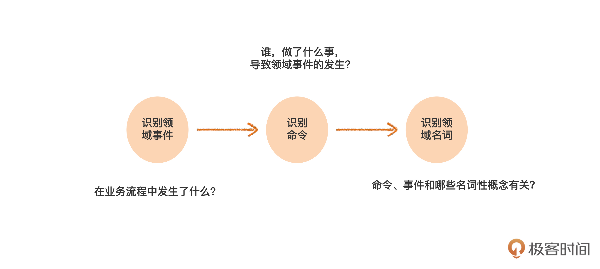
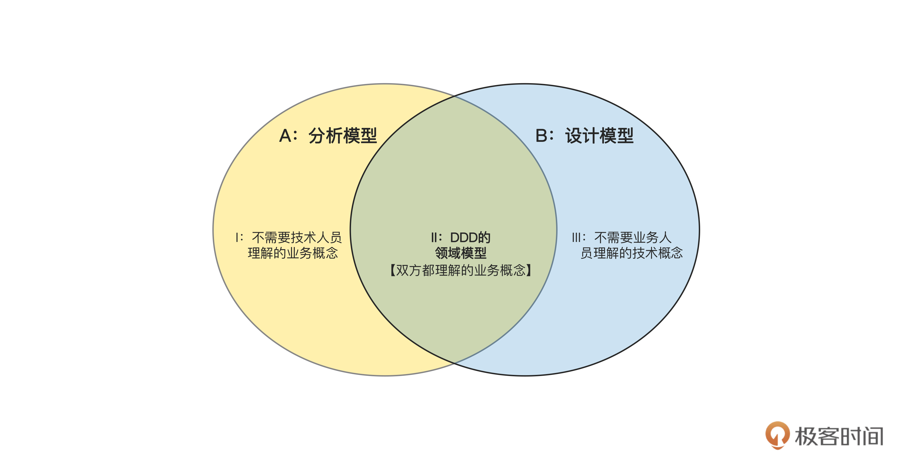
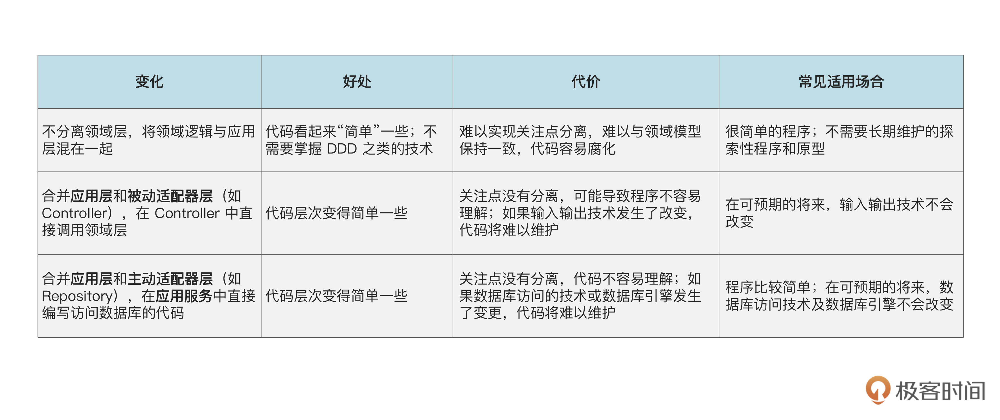
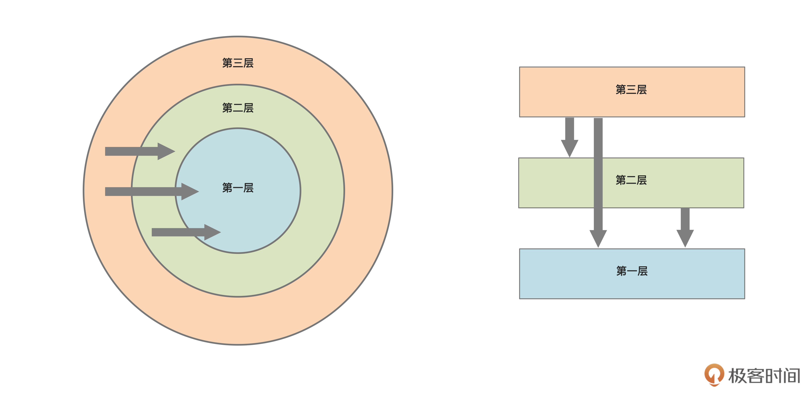
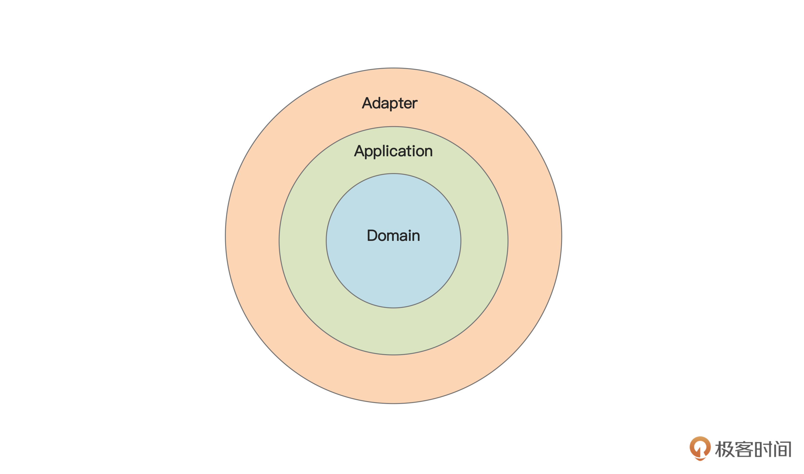
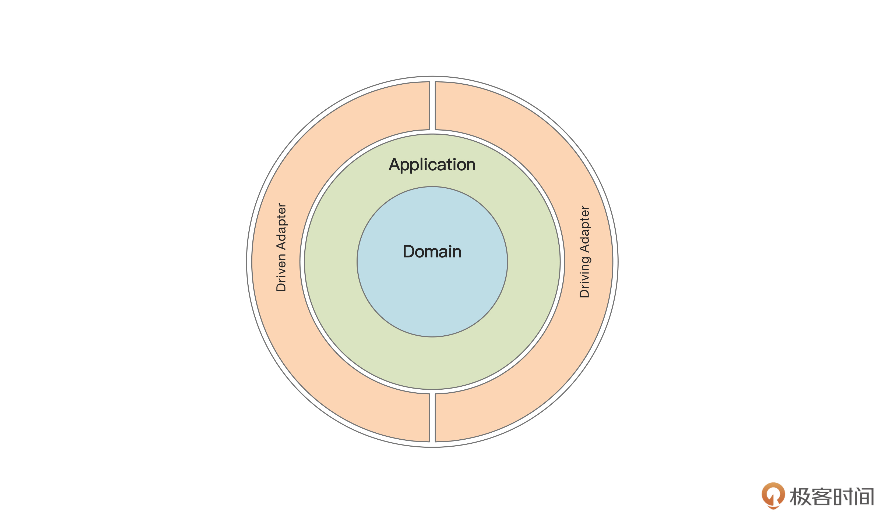
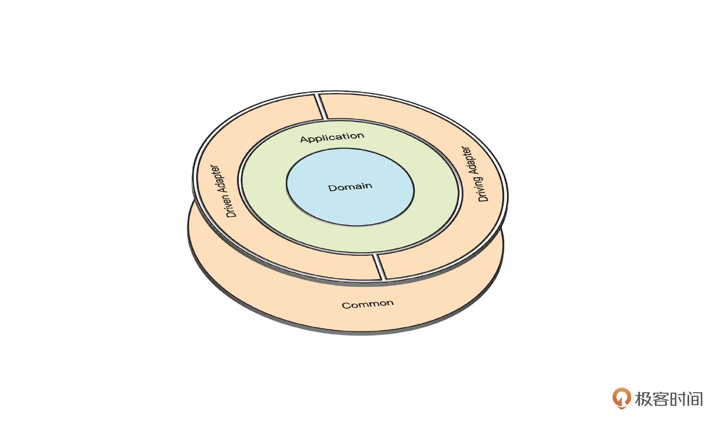

# 极客

## DDD简介

## 难点

- 领域建模不好掌握
- 领域模型不好实现
- 概念混乱

**统一语言**：指的是业务人员和开发人员使用的语言要一致。语言一致就意味着背后对领域知识的理解一致。

## 事件风暴

**事件风暴的流程是：**先识别领域事件、再识别命令动作、最后识别领域名词

**领域事件定义**：业务流程中每个步骤引发的结果就是领域事件，从结果入手来梳理需求，比从操作入手，更容易把业务想清楚。事件风暴中的“事件”两个字就来源于领域事件。

领域事件的命名，如果套用英语的语法来说，一般是完成时 + 被动语态。比如说，订单已提交，这个“已”字就是完成时，代表已经发生的事情。而订单已提交也可以说成订单已“被”提交，实际是被动语态，只不过一般把被字给省掉了

## 领域模型

模型是解决特定问题为目的，是对事物的模拟。模型总提取了被模拟事物中的部分信息，而忽略掉了其他大部分信息。

**领域模型**：对领域知识的抽象和提炼。对领域模型构建的过程称为**领域建模**。

**ddd领域模型与传统模型的区别**

- 传统系统中，业务人员提出分析模型，技术专家提出设计模型，两者之间可能会存在差距，转换复杂，多次迭代后，技术实现与业务越来越远，软件系统也就难以真实反映业务需求
- ddd领域模型要求兼顾业务和技术，领域模型的建立是达成共识。

### 领域模型的核心模式

- ### 模型驱动设计

  - 领域模型要和业务需求一致；
  - 系统实现要和领域模型一致。

- ### 统一语言

  - 建立共识的领域模型，建立词汇表，建立业务规则文档。即所有参与业务的同学对该词语的理解是一致的。

## 分层架构

解决的问题：系统嗲吗将原本内聚的逻辑分散在各个地方，无法接口，造成内部逻辑混乱，后续难以维护，重新大量重复和不一致代码。

**但是**并非按以下方式分层才叫做ddd架构，而是找到适合自己架构的规范。

架构变化如下图：

图里的箭头表示依赖关系，这里的意思是只能外层依赖内层，内层不能依赖外层。**代码中不稳定的部分，应该依赖稳定的部分**。所以，分层架构中越是内层，就越稳定，越是外层，相对就越容易变化。（领域服务->领域能力->领域拓展点，即使是构造器注入，也不会存在循环依赖问题。内部或者说基础层可复用性强，数据库的update操作）

### Application层

应用层，不包含领域逻辑，对领域层的逻辑进行封装和编排，**实际是领域服务**。

- 接受客服话请求，调用和协调领域层的逻辑
- 将领域层的处理结果封装为简单的粗粒度的对象DTO
- 处理事务、日志、权限等横切关注点

### 输入输出适配器

适配器处理输入输出，输入输出可能有多种格式，比如http请求、rpc请求。统一由适配器层进行处理，调用下游的应用层。即提供同一个功能，只修改适配器层，调用的应用层是相同的。

### 数据库适配器

仓储层，需要一种适配器把具体的持久化技术和应用层以及领域层隔离开，而仓库就充当了这种适配器。 主动适配器的作用不限于访问数据库，而是访问所有外部资源。

两种适配器的关系：

- 由外向内的适配器叫做 driven adapter，我把它译作 **被动适配器**；输入输出适配器

- 由内向外的适配器叫做 driving adapter，可以译作 **主动适配器**。数据库适配器（仓储层）

### 通用工具

通用工具可以被任何层调用，所以应该是和domain、applicant、adapter层同级的util或者common层。**通用工具不局限与String与时间的转换等等计算工具，框架类的通用逻辑也可放在该层。 它们是对各层代码起到公共的支撑作用的**

## 代码实现

### 充血模型贫血模型

贫血模型：领域对象只有数据，没有行为

充血模型：领域对象里既包含数据，也包含行为。模型的setting方法为private级别，get方法可以为public

### 适配器层DTO

上层只能依赖下层的数据，不能下层依赖上层的数据，比如DTO，应该放在应用层，而不是application层。应该应用层也使用（前提是调用链路一直复用该DTO，没有将入参DTO转为DataObject这种对象）。

### 层间依赖

应用层涉及查数据，需要仓储层，仓储层实际属于主动的适配层，应用层依赖适配层，层间依赖导致。

解决方式：

- 第一步，从仓库抽出一个接口，原来的仓库成为了这个接口的实现类；
- 第二步，把这个接口移动到领域层。

应用层依赖领域层的接口，适配器实现领域层接口，则无异常

### Validator

放在领域层对领域模型业务规则的校验，可以抽离成一个具体的实现类，也可以设置为检验方法。

### Factory

写操作会对领域模型进行重新构建，则通过Factory执行对应的动作，比如create，update等。

定位：**工厂构建产品，最后存储在仓库。放在领域层**

Factory构建对象不能根据DTO构建（领域层依赖应用层不合理），所以调用领域层时，

- 构建一个新的对象比如DataObject（领域层的对象）
- 传参数，代码开发规范要求方法不能超过3个参数

### 基础父类

减少开发的一种方式，并非是ddd的内容。**继承消除重复.**这个类放在common.framework包里面，因为这种基类属于框架层面。

基础父类abstract 抽象类 可以有id，oldVersion，newVersion，createBy,createDate,modifiedBy,modifiedDate

### 编码要求

1. **对外API的接口，参数是不同的，我们只对外暴露出每个API 必须的参数，从而缩小了接口，提高了封装性。**
2. 领域对象不访问数据库。
3. 领域服务只能读数据库。
4. 应用服务可以读写数据库。
5. 用 ID 表示对象之间的关联。
6. 领域对象有自己的领域服务。
7. 在以上前提下利用封装和继承。

## 聚合(Aggregate)

作用： **维护不变规则**。如果一组对象具有整体部分关系，并且需要维护整体上的不变规则，那么就可以识别为一个聚合。其中表示整体的那个实体叫做聚合根aggregate root。

 关系：在一个聚合里，代表整体的实体就是聚合根。一个聚合只有一个聚合根。一个聚合的一部分，不能再变成其他聚合根的一部分。 **聚合根要有全局的唯一标识***，而从属于聚合根的实体只需要有局部于聚合的标识。

**关联方式**有：对象关联、ID关联

原则： **聚合外部对象对非聚合根对象只能读，不能写，必须通过聚合根才能对非根对象进行访问**。

子实体的写操作访问级别可以设置为包级别的，这样只能通过聚合根创建实体。

# BiliBili

ddd是以领域划分为领域基础。

##### MVC框架的缺点：

老项目中的”坏味道“

- 可维护性差：大量的第三方模块影响核心代码稳定性
- 可拓展性差：业务逻辑与数据存储相互依赖，无法复用
- 可测试性差：庞大的事务脚本与基础设置强耦合，无法单元测试。

多个需求迭代后，后续维护困难。

##### 设计系统的目标：

高内聚、低耦合的系统

**三大设计原则**

- 单一职责原则：一个类只负责单一职责，
- 开放封闭原则：对拓展开放，对修改封闭
- 依赖反转原则：程序之间应该只依赖抽象接口，而不要依赖于具体实现

## DDD改造

POJO 贫血模型和充血模型：MicroService（提出微服务架构的人提出的充血、贫血模型）

贫血模型的缺点：贫血失忆症，多次业务迭代后，当前实体承载了哪些业务不清晰，需要反查调用的service去排查梳理。

充血模型：将对实体模型引起属性状态变化的操作抽离出方法，记录在POJO中，描述核心的业务能力

#### 仓储层

与数据库交互的单独抽离出一层，封装实体持久化操作，摆脱数据库的限制。仓储层调用Dao层或者直接调用mapper

#### 防腐层

构建防腐层，隔离第三方组件，只返回当前服务需要的信息，避免污染本服务。假设需要切接口则只需要改造防腐层，而不是所有调用该接口的service。

#### 领域服务

领域服务封装跨实体业务，对实体变更的编排，传入值为实体。

#### 聚合

实体和值对象体现的是个体的能力，具体体现的这些实体的系统工作能力。具体是用来确保这些领域对象在实现共同的业务逻辑时，保证数据一致性。

**如何判断两个实体有无聚合关系？**

**每个聚合内部有一个外部访问聚合的唯一入口**，称为聚合根。每个聚合中，应确定唯一的聚合根实体。通过聚合和聚合根的设计，极大的简化整个系统内的对象关系图。

例子：订单-订单内的商品集合。

问题：查询查询某个店铺卖出的A商品的数据，需要先查所有订单，再查订单内A商品的数量，过于繁琐，怎么解决？

答：聚合聚焦于实体属性状态发生变化的操作，查询操作无需关注聚合，也就是说可以直接查卖出的商品。

#### 限界上下文

限界上下文：确保领域之间的边界