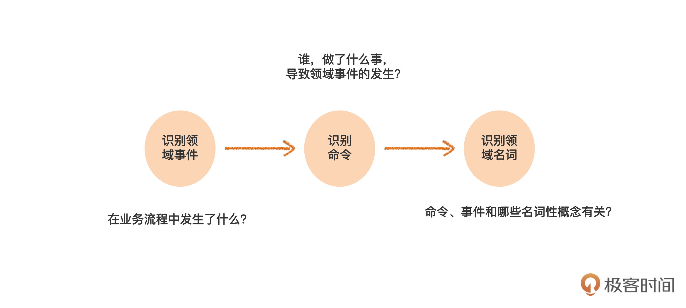
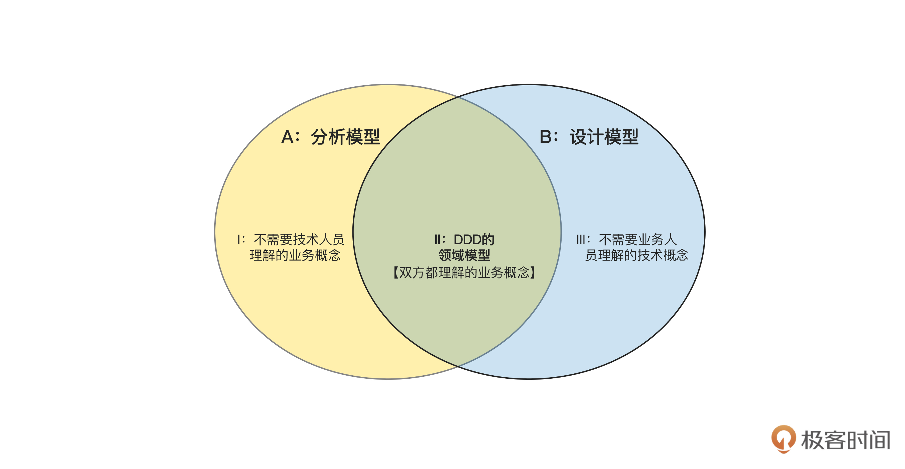
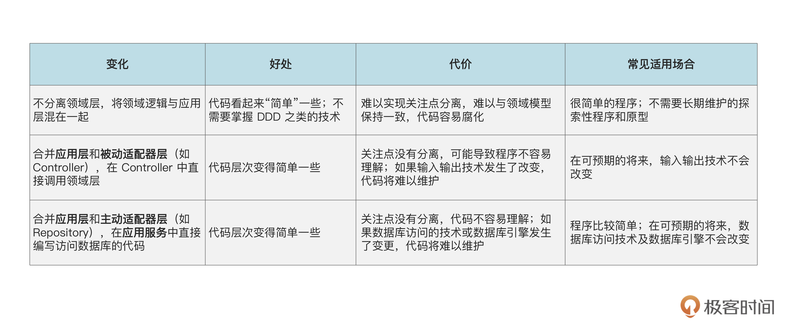
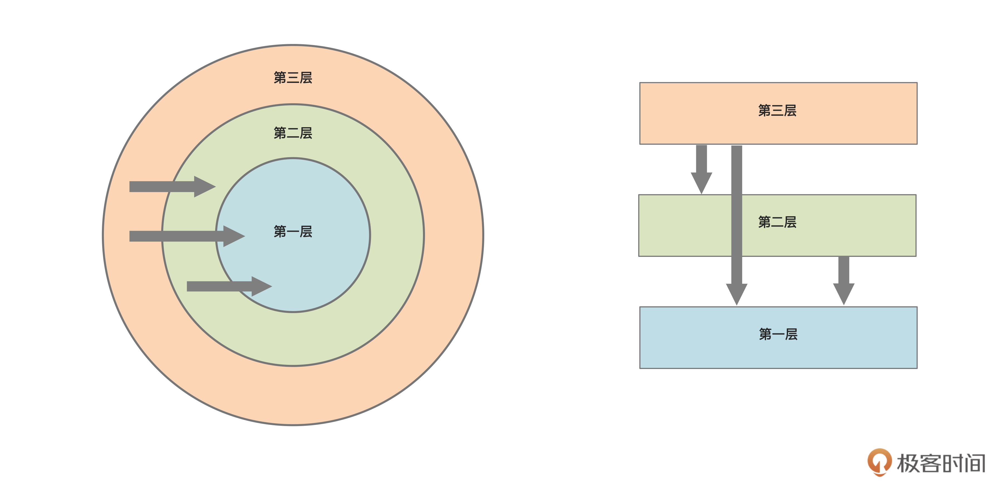
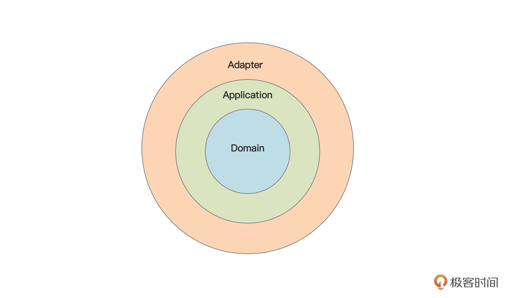
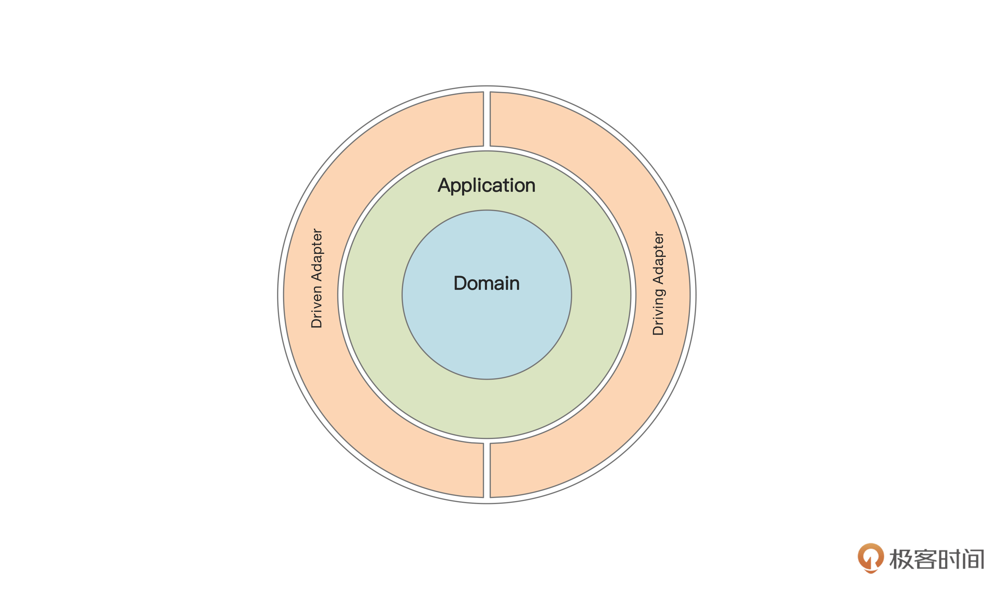
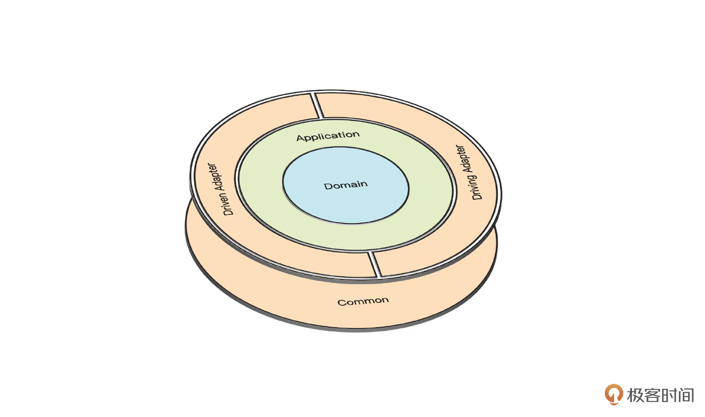
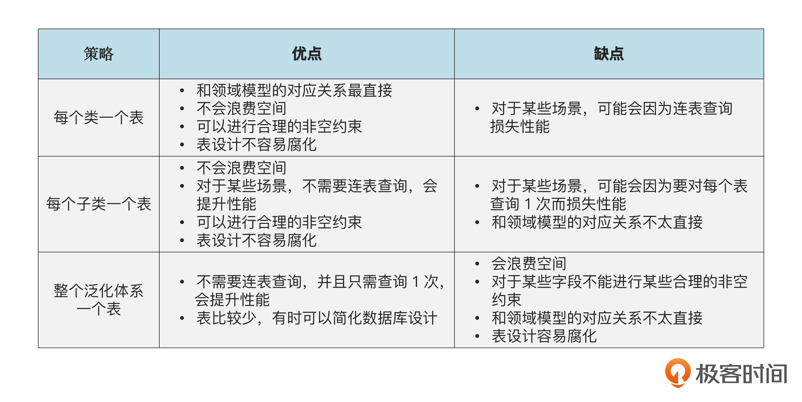

# 极客

## DDD简介

## 难点

- 领域建模不好掌握
- 领域模型不好实现
- 概念混乱


**统一语言**：指的是业务人员和开发人员使用的语言要一致。语言一致就意味着背后对领域知识的理解一致。


## 事件风暴

**事件风暴的流程是：**先识别领域事件、再识别命令动作、最后识别领域名词




**领域事件定义**：业务流程中每个步骤引发的结果就是领域事件，从结果入手来梳理需求，比从操作入手，更容易把业务想清楚。事件风暴中的“事件”两个字就来源于领域事件。

领域事件的命名，如果套用英语的语法来说，一般是完成时 + 被动语态。比如说，订单已提交，这个“已”字就是完成时，代表已经发生的事情。而订单已提交也可以说成订单已“被”提交，实际是被动语态，只不过一般把被字给省掉了


## 领域模型

模型是解决特定问题为目的，是对事物的模拟。模型总提取了被模拟事物中的部分信息，而忽略掉了其他大部分信息。

**领域模型**：对领域知识的抽象和提炼。对领域模型构建的过程称为**领域建模**。


**ddd领域模型与传统模型的区别**

- 传统系统中，业务人员提出分析模型，技术专家提出设计模型，两者之间可能会存在差距，转换复杂，多次迭代后，技术实现与业务越来越远，软件系统也就难以真实反映业务需求
- ddd领域模型要求兼顾业务和技术，领域模型的建立是达成共识。




### 领域模型的核心模式

- ### 模型驱动设计

  - 领域模型要和业务需求一致；
  - 系统实现要和领域模型一致。

- ### 统一语言

  - 建立共识的领域模型，建立词汇表，建立业务规则文档。即所有参与业务的同学对该词语的理解是一致的。


## 分层架构

解决的问题：系统嗲吗将原本内聚的逻辑分散在各个地方，无法接口，造成内部逻辑混乱，后续难以维护，重新大量重复和不一致代码。

**但是**并非按以下方式分层才叫做ddd架构，而是找到适合自己架构的规范。

架构变化如下图：



图里的箭头表示依赖关系，这里的意思是只能外层依赖内层，内层不能依赖外层。**代码中不稳定的部分，应该依赖稳定的部分**。所以，分层架构中越是内层，就越稳定，越是外层，相对就越容易变化。（领域服务->领域能力->领域拓展点，即使是构造器注入，也不会存在循环依赖问题。内部或者说基础层可复用性强，数据库的update操作）



### Application层

应用层，不包含领域逻辑，对领域层的逻辑进行封装和编排，**实际是领域服务**。

- 接受客服话请求，调用和协调领域层的逻辑
- 将领域层的处理结果封装为简单的粗粒度的对象DTO
- 处理事务、日志、权限等横切关注点


### 输入输出适配器

适配器处理输入输出，输入输出可能有多种格式，比如http请求、rpc请求。统一由适配器层进行处理，调用下游的应用层。即提供同一个功能，只修改适配器层，调用的应用层是相同的。



### 数据库适配器

仓储层，需要一种适配器把具体的持久化技术和应用层以及领域层隔离开，而仓库就充当了这种适配器。 主动适配器的作用不限于访问数据库，而是访问所有外部资源。

两种适配器的关系：

- 由外向内的适配器叫做 driven adapter，我把它译作 **被动适配器**；输入输出适配器

- 由内向外的适配器叫做 driving adapter，可以译作 **主动适配器**。数据库适配器（仓储层）



### 通用工具

通用工具可以被任何层调用，所以应该是和domain、applicant、adapter层同级的util或者common层。**通用工具不局限与String与时间的转换等等计算工具，框架类的通用逻辑也可放在该层。 它们是对各层代码起到公共的支撑作用的**




## 代码实现

### 充血模型贫血模型

贫血模型：领域对象只有数据，没有行为

充血模型：领域对象里既包含数据，也包含行为。模型的setting方法为private级别，get方法可以为public

### 适配器层DTO

上层只能依赖下层的数据，不能下层依赖上层的数据，比如DTO，应该放在应用层，而不是application层。应该应用层也使用（前提是调用链路一直复用该DTO，没有将入参DTO转为DataObject这种对象）。

### 层间依赖

应用层涉及查数据，需要仓储层，仓储层实际属于主动的适配层，应用层依赖适配层，层间依赖导致。

解决方式：

- 第一步，从仓库抽出一个接口，原来的仓库成为了这个接口的实现类；
- 第二步，把这个接口移动到领域层。

应用层依赖领域层的接口，适配器实现领域层接口，则无异常

### Validator

放在领域层对领域模型业务规则的校验，可以抽离成一个具体的实现类，也可以设置为检验方法。

### Factory

写操作会对领域模型进行重新构建，则通过Factory执行对应的动作，比如create，update等。

定位：**工厂构建产品，最后存储在仓库。放在领域层**

Factory构建对象不能根据DTO构建（领域层依赖应用层不合理），所以调用领域层时，

- 构建一个新的对象比如DataObject（领域层的对象）
- 传参数，代码开发规范要求方法不能超过3个参数


### 基础父类

减少开发的一种方式，并非是ddd的内容。**继承消除重复.**这个类放在common.framework包里面，因为这种基类属于框架层面。

基础父类abstract 抽象类 可以有id，oldVersion，newVersion，createBy,createDate,modifiedBy,modifiedDate


### 编码要求

1. **对外API的接口，参数是不同的，我们只对外暴露出每个API 必须的参数，从而缩小了接口，提高了封装性。**
2. 领域对象不访问数据库。
3. 领域服务只能读数据库。
4. 应用服务可以读写数据库。
5. 用 ID 表示对象之间的关联。
6. 领域对象有自己的领域服务。
7. 在以上前提下利用封装和继承。

## 聚合(Aggregate)

作用： **维护不变规则**。如果一组对象具有整体部分关系，并且需要维护整体上的不变规则，那么就可以识别为一个聚合。其中表示整体的那个实体叫做聚合根aggregate root。

 关系：在一个聚合里，代表整体的实体就是聚合根。一个聚合只有一个聚合根。一个聚合的一部分，不能再变成其他聚合根的一部分。 **聚合根要有全局的唯一标识***，而从属于聚合根的实体只需要有局部于聚合的标识。

**关联方式**有：对象关联、ID关联

原则： **聚合外部对象对非聚合根对象只能读，不能写，必须通过聚合根才能对非根对象进行访问**。

子实体的写操作访问级别可以设置为包级别的，这样只能通过聚合根创建实体。


**注意⚠️**

- 维护不变原则，如果不需要访问数据库，则优先考虑在领域对象中实现，而不是直接在领域服务中实现
- 假如有些子实体想要某些校验逻辑依赖聚合根，则校验规则需要在聚合根里实现，这也是聚合根存在的价值


##### **聚合的修改持久化**

- 聚合的持久化是，是对这个聚合整体处理的，而不是针对单独的表，即**聚合和它的仓库有一一对应关系**，假设对修改过的聚合进行持久化（假设订单中有3个商品a，b，c，用户去掉了a商品，修改了b商品的数量，添加 了d商品），持久化操作时，可以在实体上添加修改状态属性，进行区分。

  ```java
  public enum ChangingStatus {
      NEW,            // 新增
      UNCHANGED,      // 不变
      UPDATED,        // 更改
      DELETED         // 删除
  }
  ```

  修改操作时执行，根据状态字段进行区分，遍历子实体

  ```java
  private void saveSkill(Emp emp, Skill skill) {
          switch (skill.getChangingStatus()) {
              case NEW:
                  insertSkillRecord(skill, emp.getId());
                  break;
              case UPDATED:
                  updateSkillRecord(skill);
                  break;
              case DELETED:
                  deleteSkillRecord(skill);
                  break;
  
          }
      }
  ```

  

##### **聚合的查询**

- 查询操作需要构建整个聚合整体，可以构建一个ReBuildEntity类，继承对应的实体类，setter方法用resetxxx命名，然后返回Entity实体，方便对这个实体链式操作，方法的级别可以设置为protected


```java
public class RebuiltEmp extends Emp {
    RebuiltEmp(Long tenantId, Long id, LocalDateTime create_at, long created_by) {
        super(tenantId, id, create_at, created_by);
        //由于是从数据库重建，所以状态默认为"不变"
        this.changingStatus = ChangingStatus.UNCHANGED;
    }

    //包级权限，并且用 resetXxx 命名
    RebuiltEmp resetOrgId(Long orgId) {
        this.orgId = orgId;
        return this;
    }

    RebuiltEmp resetNum(String num) {
        this.num = num;
        return this;
    }

    RebuiltEmp resetIdNum(String idNum) {
        this.idNum = idNum;
        return this;
    }

}
// 构建新对象
RebuiltEmp newEmp = new RebuiltEmp(tenantId
                                   , id
                                   , rs.getTimestamp("create_at").toLocalDateTime()
                                   , rs.getLong("created_by"));

newEmp.resetOrgId(rs.getLong("org_id"))
    .resetNum(rs.getString("num"))
    .resetIdNum(rs.getString("id_num"))
    .resetName(rs.getString("name"))
    .resetGender(Gender.ofCode(
        rs.getString("gender_code")))
    .resetDob(rs.getDate("dob").toLocalDate())
    .resetStatus(EmpStatus.ofCode(
        rs.getString("status_code")));
return newEmp;
```

##### 聚合的事务

修改操作，对同一个聚合整体的操作由一个成功后，另外一个一个人才能修改。避免并发问题。有悲观锁和乐观锁。**乐观锁是在聚合根的代码和数据表中添加一个版本(version)字段，类型可以是长整型，该字段可以放入基础父类中**，dao层的更新update操作也需要修改，updatexxx()方法，它的返回值由原来的void改成了 boolean，表示修改是否成功。update语句执行后，会返回被update的记录数量。如果返回为1，证明修改成功，则这个方法返回true；如果返回0 ，说明修改失败，也就是已经被别人抢先修改了，这时返回false。可以抛异常

## 值对象

领域模型设计时更多关注的是实体。而实体中的属性可以是值对象。直观来看，实体是一个“东西”，而值对象是一个“值”，通常描述一个实体的属性。实体和值对象的是有区别的

- 同一性角度：实体有区别于其他属性的标识标识唯一性，比如userId等；而值对象所有属性值作为一个整体来确认同一性。即可以通过userId识别到当前实体，但值对象没有这种。员工状态可以作为一个值对象
- 可变性角度：实体是可变的，实体的属性可以发生修改。而值对象是固定值，比如String就是标准的值对象，不可修改。对值对象的修改仅是替换为另一个值对象
- 灵活性角度：实体在一个请求中，只出现一次，即同一个实体可以被多个对象引用。而值对象可以是共享的也可以是单独的，灵活性更强（比如枚举，是共享的，某些对象属性就是非共享的）

## 泛化建模

领域建模层面的泛化，大体上相当于面向对象设计中的继承和多态。使用和不使用泛化都可以实现时，需要权衡是否使用，泛化通过抽象使得模型更加简洁，通用。而过度抽象，则让模型让人难以理解。

**隐式概念的显式化**：。一些概念本来就隐含在业务逻辑内部，但没有经过抽象的话，往往不会感觉到，更不会有人来命名。而一旦采用领域建模方法对领域知识进行抽象，这些概念就会暴露出来。这时候，开发人员和业务人员就要一起对这个抽象达成共识，并且给新发现的概念起一个恰当的名字，并把这个新词加入统一语言。

##### 如何泛化

模型的分类由共性和个性，有个性时才有分类。**实现方式有：**

1. 类的继承，存在共性和个性的情况下，使用类的继承
2. 接口的实现，如果子类的属性没有共性时，但有相同的操作接口，则使用接口
3. 特性的值区分不存在父类、子类之分，如果子类没有个性字段时使用特性值即可

**是否泛化的评估方式**

1. 假如只有特性值不同，那么用特性值为对象分类就可以了，不必使用泛化。
2. 如果特性种类不同，那么很可能要采用泛化。
3. 如果在业务规则、操作接口或操作实现方面有共性和个性，首先考虑在实现上是否可以使用策略模式，如果可以，那么在领域模型中就不必泛化，否则考虑泛化。如果你还不太了解策略模式，可以参考《领域驱动设计》原书第12.1节，或其他关于设计模式的书。

##### **泛化的持久化**

假设泛化基础父类是a，有一些公共属性，子类b，c分别有写特殊属性。

**持久化表的设计方案**：

1. **每个类一个表**,新增数据时，a对应的表，b对应的表均插入一条数据。A表存储公共属性，外加关联子类Id，B，C表存储个性字段
2. **每个子类一个表**，把公共属性分别放在子类表中
3. **整个泛化体系一个表**，把3个类的属性放在一张表中



**设计主键中**：每个类一个表中可以共享A表的主键，也可以不共享。如果父类和各个子类在业务概念上，本质是一类事物，只有在某些方面有差别，则共享主键比较合理。如果在业务概念上不是同一类事物，仅是某些方面有共性才造成的泛化关系，则不共享主键比较合理。

## 限界上下文

在每个子系统的内部实现概念的严格一致性，而不同系统内部之间则没必要一致。不再追求全局的一致性，而是追求局部的一致性，使概念不一致问题得到合理管控，从而实现业务目标。

限界上下文是拆模块，拆子系统，是否拆分成一个微服务需要评估

1. 不同的可伸缩性要求：如果一个上下文的某些部分，涉及到动态部署到更多容器，而另外部分业务不叫稳定，不需要动态伸缩，则可根据伸缩性的不同，划分为两个微服务。**技术角度去划分**
2. 不同安全性的要求：有些功能要接入互联网，有些部分在内网用，需要部署在防火墙的不同位置。这时候，也需要划分成不同的微服务。
3. 不同业务的要求：按业务去划分微服务

**两个领域模型的同步**，假设模型a，b

- **构建模型a依赖模型b的场景**
  1. **数据同步**，模型a的数据库会冗余存储模型b的依赖字段，模型b变更会同步模型a所在数据库
  2. **API调用**，构建a模型时，调用api获取模型b的数据
- **修改模型a同步模型b的场景**
  1. **同步调用**：修改模型a操作时，调用模型b的修改接口同步数据。
  2. **异步调用**：发布领域事件，订阅者执行对应的同步操作，

### 防腐层

也是一种用于上下文映射的模式。指的是两个上下文之间的转换逻辑，这个逻辑可以屏蔽两个上下文的差异，从而使两个上下文可以相对独立地演进。

## CQRS

命令查询职责分离

增、删、改功能统称为Command（命令），把查询成为Query，两种功能的职责不同，应该采用不同的方式来处理，因此进行职责分离。**Command需要走领域模型，Query不走领域模型，直接用SQL和DTO**

**查询处理器不需要经过领域层，应用服务可以直接调用仓库，仓库使用sql进行查询**。


数据库表是为领域模型进行设计，所以查询结果DTO可能与数据库表中不完全一致，有两种方案：

- 需要在仓储层进行转换。
- 设计两种模型，命令模型和查询模型，命令处理器对模型操作后，同步给查询模型。可以通过同步 或者异步的事件驱动机制。


# BiliBili

ddd是以领域划分为领域基础。

##### MVC框架的缺点：

老项目中的”坏味道“

- 可维护性差：大量的第三方模块影响核心代码稳定性
- 可拓展性差：业务逻辑与数据存储相互依赖，无法复用
- 可测试性差：庞大的事务脚本与基础设置强耦合，无法单元测试。

多个需求迭代后，后续维护困难。


##### 设计系统的目标：

高内聚、低耦合的系统

**三大设计原则**

- 单一职责原则：一个类只负责单一职责，
- 开放封闭原则：对拓展开放，对修改封闭
- 依赖反转原则：程序之间应该只依赖抽象接口，而不要依赖于具体实现


## DDD改造

POJO 贫血模型和充血模型：MicroService（提出微服务架构的人提出的充血、贫血模型）

贫血模型的缺点：贫血失忆症，多次业务迭代后，当前实体承载了哪些业务不清晰，需要反查调用的service去排查梳理。

充血模型：将对实体模型引起属性状态变化的操作抽离出方法，记录在POJO中，描述核心的业务能力

#### 仓储层

与数据库交互的单独抽离出一层，封装实体持久化操作，摆脱数据库的限制。仓储层调用Dao层或者直接调用mapper

#### 防腐层

构建防腐层，隔离第三方组件，只返回当前服务需要的信息，避免污染本服务。假设需要切接口则只需要改造防腐层，而不是所有调用该接口的service。

#### 领域服务

领域服务封装跨实体业务，对实体变更的编排，传入值为实体。


#### 聚合

实体和值对象体现的是个体的能力，具体体现的这些实体的系统工作能力。具体是用来确保这些领域对象在实现共同的业务逻辑时，保证数据一致性。

**如何判断两个实体有无聚合关系？**

**每个聚合内部有一个外部访问聚合的唯一入口**，称为聚合根。每个聚合中，应确定唯一的聚合根实体。通过聚合和聚合根的设计，极大的简化整个系统内的对象关系图。

例子：订单-订单内的商品集合。

问题：查询查询某个店铺卖出的A商品的数据，需要先查所有订单，再查订单内A商品的数量，过于繁琐，怎么解决？

答：聚合聚焦于实体属性状态发生变化的操作，查询操作无需关注聚合，也就是说可以直接查卖出的商品。


#### 限界上下文

限界上下文：确保领域之间的边界