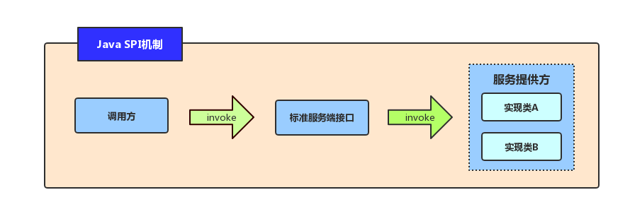

# 1，简介

Dubbo是一款RPC服务开发框架，用于解决微服务架构下的服务治理和通信问题。

优点

- **微服务编程范式和工具**
  Dubbo 支持基于 IDL 或语言特定方式的服务定义，提供多种形式的服务调用形式（如同步、异步、流式等）
- **高性能的 RPC 通信**
  Dubbo 帮助解决微服务组件之间的通信问题，提供了基于 HTTP、HTTP/2、TCP 等的多种高性能通信协议实现，并支持序列化协议扩展，在实现上解决网络连接管理、数据传输等基础问题。
- **微服务监控与治理**
  Dubbo 官方提供的服务发现，动态配置，负载均衡，流量路由等基础组件解决微服务基础实践的问题，还可完成限流降级，数据一致性，链路追踪的能力

注意：

- Dubbo不只是一个RPC框架，可使用多种通信协议，Dubbo提供了丰富的服务治理能力和生态（类似Spring cloud）

# 面试

## 为什么Dubbo不用jdk的SPI，而是要自己实现？

### java SPI

#### 概念原理

SPI：是官方提供的一种**服务发现机制**，它允许在**运行时动态加载实现特定接口的类**，而不需要在代码中显式的指定该类，从而实现**解耦和灵活性**

- ### **使用步骤**

1. `定义接口`：首先需要定义一个接口，所有实现该接口的类都将被注册为服务提供者。
2. `创建实现类`：创建一个或多个实现接口的类，这些类将作为服务提供者。
3. `配置文件`：在 META-INF/services 目录下创建一个以接口全限定名命名的文件，文件内容为实现该接口的类的全限定名，每个类名占一行。
4. `加载使用服务`：使用 java.util.ServiceLoader 类的静态方法 load(Class service) 加载服务，默认情况下会加载 classpath 中所有符合条件的提供者。调用 ServiceLoader 实例的 iterator() 方法获取迭代器，遍历迭代器即可获取所有实现了该接口的类的实例。

注意事项

- **接口必须是公共的，且只能包含抽象方法。**
- **实现类必须有一个无参构造函数。**
- **配置文件中指定的类必须是实现了相应接口的非抽象类。**
- **配置文件必须放在 META-INF/services 目录下。**
- **配置文件的文件名必须为接口的全限定名。**

java spi的实现原理是java类加载机制和反射机制。

当使用`ServiceLoader.load(Class<T> service)` 加载服务时，会检查 `META-INF/services`目录下是否存在以接口全名命名的文件，如果存在，则读取该文件内容，获取该接口的所有实现类的全名，并通过`Class.forName()`方法加载到对应的类。

java 是**懒加载迭代器**的思想，按需加载。

在调用`ServiceLoader.load(Class<T> service)` 加载服务时，不会将所有所有实现类都加载进来，而是返回一个懒加载迭代器。在使用该实现类时，才按需加载，创建该实例。

**懒加载的优点:**

- 节省内存：若一次性把所有实现类都加载进来，导致内存过大，影响性能。
- 增强灵活性：由于 ServiceLoader 是动态加载的，因此可以在程序运行时添加或删除实现类，而无需修改代码或重新编译。（一般用不到）

#### **优缺点**

- 优点
  - **松耦合性**：程序可以在程序运行时，动态的加载实现类，无需在编译时将实现类硬编码到代码中。
  - **拓展性**：通过SPI，应用程序为同一个接口定义多个实现类，方便拓展
  - **易于使用**：使用SPI，开发者只需要实现接口，并制定类的类名，即可使用
- 缺点
  - **配置麻烦**：需要在在META-INF/services目录下创建配置文件，并将实现类的类名写入其中。这使得配置相对较为繁琐。
  - **安全性不足**：若配置文件内容不正确，则存在风险
  - **性能损失**：每次找到对应的服务提供者都需要重新读取配置文件，增加了启动时间和性能开销

#### **应用场景**

- 数据库驱动程序加载
  - JDBC为了实现可插拔的数据库驱动，定义了一套API规范，而具体的数据库厂商实现Driver接口，提供自己数据库驱动程序，在java中，驱动程序的加载是通过SPI机制实现的
- 日志框架的实现
  - log4j，slf4j都采用了SPI机制，需要修改代码
- Spring代码
  - Spring中的Bean加载机制就是实现了SPI思想， 通过读取classpath下的META-INF/spring.factories文件来`加载各种自定义的Bean`。
- Dubbo框架
  - 通过注解@SPI 声明拓展点接口，并在classpath下的META-INF/dubbo目录中提供实现类的配置文件，来实现扩展点的动态加载。

