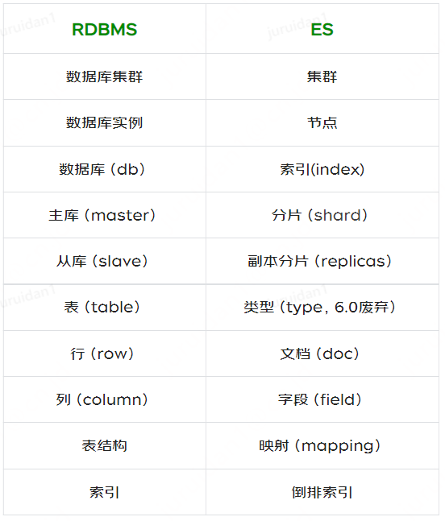
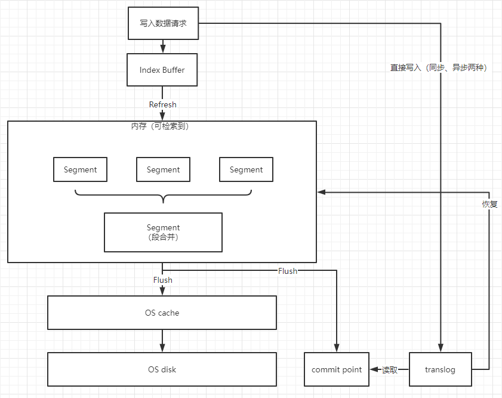
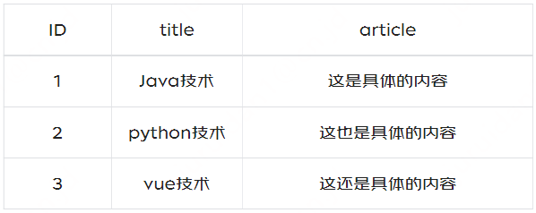
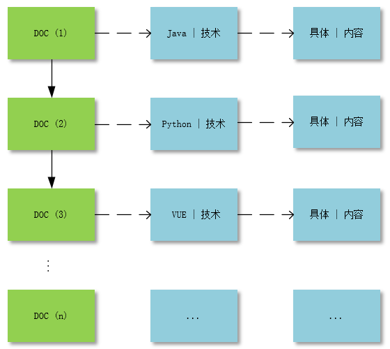
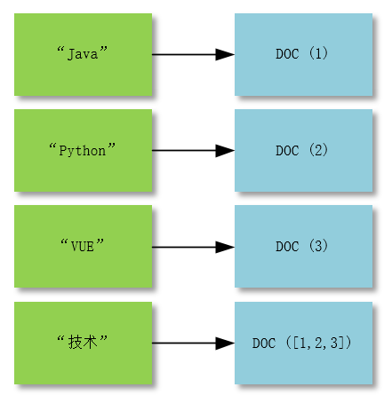
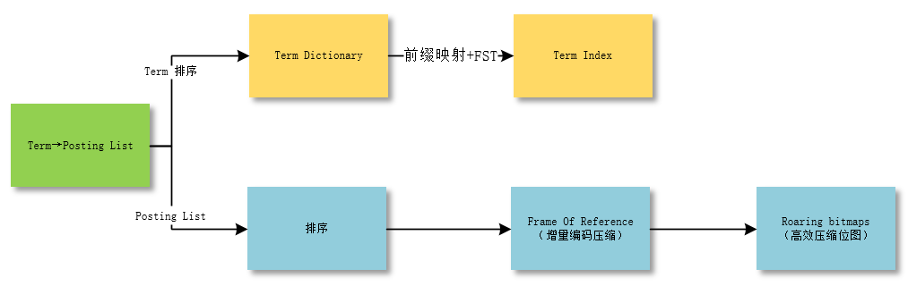
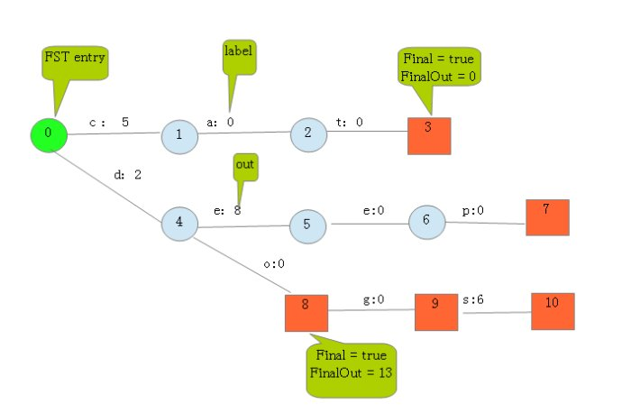

# 1，ES初识

## 1.1 定义

**Elasticsearch是全文搜索引擎，**即根据关键字搜索所有匹配的全文内容。是根据Java编写，并提供了restful API实现存储和检索

==**为什么不使用关系型数据库或者非关系型数据库？**==

- 使用传统数据库存储文本字段，进行全文扫描时，需要扫描整个表，表数据过多的话，查找时间会很慢。根据关键词建立索引，关键词过多后，索引也会很多，维护也很麻烦。并且添加和更新操作会重建索引，加剧了这种困难。


**全文搜索引擎：**工作原理是计算机索引程序通过扫描文章中的每一个词，对每一个词建立一个索引，指明该词在文章中出现的次数和位置，当用户查询时，检索程序就根据事先建立的索引进行查找，并将查找的结果反馈给用户的检索方式。这个过程类似于通过字典中的检索字表查字的过程。

## 1.2 特点

- **分布式：**可快速搭建集群，分布式存储和搜索
- **高可用：**提供主分片和副本分片，主从复制；集群支持自动选主
- **异步写入：**集群本身异步写入，支持客户端异步批量写入

## 1.3 基本概念

**es与关系型数据库概念对应关系**


|       DB       |          ES          |
| :------------: | :------------------: |
|   数据库集群   |         集群         |
|   数据库实例   |         节点         |
|  数据库（db）  |    索引（index）     |
| 主库（master） |    分片（shard）     |
| 从库（slave）  | 副本分片（replicas） |
|  表（table）   |     类型（type）     |
|   行（row）    |     文档（doc）      |
|  列（column）  |    字段（field）     |
|     表结构     |   映射（mapping）    |
|      索引      |       倒排索引       |



- **为什么要去除类型（type）？**
  - es设计index和type的初衷就是类似关系型数据库（mysql），方便管理数据之间的关系。

- **那为什么要去除？**
  - 关系型数据库中的table是独立存储的，但es中同一个index下，所有的type是存储在同一个索引中的，因此不同type中相同字段名称的定义（mapping）需要一致。
  - 不同类型的“type”存储在同一个index中，会影响lucence（es基于lucence开发）的压缩性能

## 1.4 集群，节点，分片

- 一个elasticsearch实例为一个节点
- 一个或多个拥有相同cluster.name配置的节点组成一个集群
- 节点数发生变化时，集群会重新rebalance所有数据
- 一个节点被选举为主节点时，它负责管理集群范围的所有变更（增加，删除索引，增加或者删除节点）
- 主节点并不需要涉及文档级别的变更和搜索操作
- 请求发送到集群的任意节点，每个节点都知道任意文档所处的位置，并转发请求，收集，返回数据

### 1.4.1 节点

- **候选主节点**：候选主节点**通过选举**可以成为主节点，主节点的主要职责似乎和集群操作相关的内容，创建或删除索引（index->db中的数据库），并将分片分配给相关节点。一个节点既可以为候选主节点也可以为数据节点，但因为数据节点对CPU，内存消耗大。避免资源占用大导致主节点产生影响，进而影响整个集群。为提高集群的健康性，对集群的节点做好角色的划分与隔离，选择配置较低的机器作为候选主节点
- **数据节点**：主要存储索引数据，对文档（doc->db中的一行数据）进行增删改查操作，聚合操作等。数据节点对CPU，内存，IO要求较高
- **协调节点**：搜索请求或者批量请求可能涉及到不同数据节点上的数据，这样则需要协调节点进行协调。每个节点都是一个隐式的协调节点。如果同时设置了data.master = false和data.data=false，那么此节点将成为仅协调节点。如果无特别高的QPS，协调节点最好不要分离，跟数据节点在一起就行，分开的意义不大。

### 1.4.2 分片

- **主分片（shard）**：当有大量的文档时，单节点无法有效处理过多请求。讲数据分为多个分片，放在不同服务器上。当查询的索引分布在多个分片上，es会向每个相关的分片发送查询请求，并将结果组合，应用程序无感。
- **副本分片（replicas）**:为提高集群的高可用性和查询吞吐量，则使用分片副本。主从备份，读写分离

**在集群节点数一定的情况下，增加副本分片不能提高性能，反而有所损耗。但副本分片适当多时，在集群多个节点宕机时，能尽可能的保证数据不丢失**

一个索引有n个主分片，每个主分片有m个副本分片，那么：总分片数 = n*(m+1)

### 1.4.3 关系

- 一个索引可以创建多个分片，存储在不同节点上；
- 适当的增加主分片数量会提升检索的速度，若分片数量过多或者过少，都会降低检索的速度
- 主分片不会和副本分片在一个节点中，保证es数据的高可用。若当前集群除主分片在节点上，有副本分片未能分配到其他节点上，则集群整体的健康度为黄色

分片数过少：单个索引过大，降低整体的查询速率

分片数过多：打开较多的文件，存储在不同机器上，机器之间的相互通信时间也会增加

**==建议：单个分片的数据量控制在20G-50G左右==**


==**集群健康度**==

**green**   最健康得状态，说明所有的分片包括备份都可用; 这种情况Elasticsearch集群所有的主分片和副本分片都已分配, Elasticsearch集群是 100% 可用的。
**yellow**   基本的分片可用，但是备份不可用（或者是没有备份）; 这种情况Elasticsearch集群所有的主分片已经分片了，但至少还有一个副本是缺失的。不会有数据丢失，所以搜索结果依然是完整的。不过，你的高可用性在某种程度上被弱化。如果 更多的 分片消失，你就会丢数据了。把 yellow 想象成一个需要及时调查的警告。
**red**  部分的分片可用，表明分片有一部分损坏。此时执行查询部分数据仍然可以查到，遇到这种情况，还是赶快解决比较好; 这种情况Elasticsearch集群至少一个主分片（以及它的全部副本）都在缺失中。这意味着你在缺少数据：搜索只能返回部分数据，而分配到这个分片上的写入请求会返回一个异常。

# 2，原理

## 2.1 检索过滤

**query**：先查询符合条件的文档，然后计算每个文档对于搜索条件（搜索包含分词，⼤⼩写转换、近义词转换、时态转换、单复数转换等）的相关度分数，然后再根据评分倒序排序。

**filter**：根据搜索条件过滤出符合的文档数据，将文档的评分固定为1，不计算相关度分数也不排序。忽略 TF/IDF信息。es内部还会缓存比较常用的filter数据。只是一个简单的过滤，该文档是否匹配 true or false


TF/IDF（词频/逆文档频率算法）“

1. 匹配到的关键词越稀有，文档的得分就越高
2. 文档的域越小，文档的得分就越高（避免打问打的误差）
3. 设置的权重（索引和搜索时设置的都可以）越大，文档的得分越高

【本质：如果某个词或短语在⼀篇⽂章中出现的频率TF⾼，并且在其他⽂章中很少出现，则认为此词或者短语具有很好的类别区分能⼒，适合⽤来分类。但是实际上，如果⼀个词条在⼀个类的⽂档中频繁出现，则说明该词条能够很好代表这个类的⽂本的特征，这样的词条也应该给它们赋予较⾼的权重，并选来作为该类⽂本的特征词以区别与其它类⽂档，这就是IDF的不⾜之处。】


## 2.2 文档写入

异步写入：

1. 客户端向ES1节点（协调节点）发送写请求，通过路由计算公式得到值为0，则当前数据应该被写到主分片S0上。
2. ES1节点将请求转发到S0主分片所在的节点ES3，ES3接受请求并写入到磁盘
3. 并发代码将数据复制到两个副本分片R0上，其中通过乐观并发控制数据的冲突。一旦所有的副本分片都报告成功，则节点ES3将向协调节点报告成功，协调节点向客户端报告成功




1. 写入请求会将索引（Index）存放到内存区域，叫做Index Buffer。此时的索引文件暂时不能被ES搜索到
2. 默认情况下，ES每秒执行一次Refresh操作，将Index Buffer中的index写入到FileSystem 中的segment，这个也是内存区域，把Index buffer中的index转换为segment，此时的数据就可以被ES搜索到，同时清空Index Buffer
   - Refresh 触发的两种方式：
     - 按时间频率触发，默认是1s一次Refresh，可通过index.refresh_interval 设置；
     - 在Index buffer被占满时，会触发Refresh，Index Buffer的大小默认值为JVM所占内存容量的10%
3. 当segment触发阈值或者达到周期性，会将Segment文件Flush写入到磁盘，ES会创建一个Commit Point文件，该文件会被标识被Flush到磁盘上的Segment。
   - Flush 触发的两种方式：
     - 每30分钟，
     - translog达到一定大小（由 index.translog.flush_threshold_size 控制，默认 512mb）


Segment在Flush之前仍存在内存中，如果服务器宕机，ES还没没有Flush操作，则保存在Segment数据会丢失，为了提高ES的数据存储可靠性，**引用了Translog**，每次用户请求Index Buffer进行操作时，都会在TransLogs中写一份操作记录，

- ES默认每个请求都会将TransLog同步到磁盘
- 但会有性能影响，**针对能够容忍丢失数据的场景设置异步落盘的操作**，可以将 index.translog.durability 配置为 async 来提升写入 Translog 的性能，该配置会异步写入 translog 到磁盘。写入磁盘的频率通过 index.translog.sync_interval 来控制。

**批量异步写入需要注意点**

1. 单节点应用：在本地队列按顺序去重，减少写入的数据量；
2. 多节点应用：需要考虑同一数据在短时间内多次更新，消费到不同节点，异步写入ES集群时的顺序问题，最好能通过一些策略，将同一业务主键的数据，路由到同一应用节点写入，保证顺序性。（？）

## 2.3 倒排索引 索引压缩

### 2.3.1 倒排索引

倒排索引<=>反向索引

解释都这样，已经烂大街了



**正向索引:**

本质和书本的目录一样，是按照文档的固定顺序，顺序记录当前文档所存在的关键信息（关键字），方便检索和定位文档，是 **【document -> to -> words】** 模式，即： index -> content。




**反向索引:**

按照关键字，记录出现的文档和对应的次数，是**【word -> to -> documents】** 模式，即：content -> [index,index]。



“java”,“python”,“VUE”,“技术”这些都是term（词）；

而[1,2,3]这种的叫Posting List，Posting list就是一个int的数组，存储了所有符合某个term的文档id。（与非聚簇索引）

### 2.3.2 索引压缩

ES为每个字段创建倒排索引，结构为【Term：PostingList】，为提高查询效率，则将索引全部加载到内存中，若数据量较大的场景，对索引进行压缩。



FST- Finite State Transducers （有限状态转换器）



# 3，实践

## 3.1 创建索引

- 字符串：text和keyword两种类型，keyword代表精确值不会进行分词，text类型的字符串会参与分词处理。
- 数值：long，integer，short，byte，double，float
- 布尔值：boolean
- 时间：date
- 数组：数组类型不需要专门定义，只要插入的字段值时json数组就行
- GEO：坐标类型，经纬度信息的形势可以是字符串，数组或者对象


实践建议

- 建议设置别名
- 建议设置路由，并在post数据时，指定字段；
- 建议关闭自动映射索引


### 修改配置文件

```http
修改配置文件 config/elasticsearch.yml
   action.auto_create_index: false
或者:
PUT _cluster/settings
{
   "persistent": {
       "action.auto_create_index": "false"
   }
}
```

## 3.2 增加字段

```http
PUT package_waybil_v1/_mapping/_doc
{
"properties": {
"receivableAmount": {
"type": "double"
},
"purchaseInsuranceAmount": {
"type": "double"
      }
   }
}
```

## 3.3 修改检索行限制

不建议修改改值，如有特殊情况，可以临时处理

```http
---   修改全部索引：
put _all/_settings
{
"index.max_result_window":200000
}


---   修改单个索引
PUT /package_waybil_v1/_settings
{
"index.max_result_window": 20000

}
```

## 3.4 更新文档

更新数据分为：全部重构和部分更新

无论哪种方式，ES都不能直接修改原是的doc，只能如下

1. 从旧文档构建JSON
2. 更改该JSON
3. 标记删除旧文档
4. 索引一个新文档

```http
//--- 全部重构，只会按本次提交的JSON创建文档

POST /center_weight/type/BC1003210428130000060213
{
   "evadeWeight":1
}

//--- 部分更新，会基于原数据和本次提交JSON，替换构建文档
//--- API：POST /index/type/_Id/_update?routing=***

POST /center_weight/type/BC1003210708100000000606/_update
{
 "doc": {
   "evadeWeight": 1

      }

}
```

## 3.5 引入但没有用到的文件

别名就像一个快捷方式或者软连接，指向一个或多个索引

- 可以将多个索引分组
- 在运行的集群中，从一个索引切换到另一个索引

```http
--增加别名
POST /_aliases
{
"actions": [
   {
     "add": {
       "index": "my_index",
       "alias": "my_index_alias"
     }
   }
 ]
}

--更换别名
POST /_aliases
{
   "actions": [
       { "remove": { "index": "my_index_v1", "alias": "my_index" }},
       { "add":    { "index": "my_index_v2", "alias": "my_index" }}
   ]

}
```


## 3.8 慢日志

慢日志是为捕获超过指定时间阈值的查询或索引请求，默认情况是不开启的。开启需要指定具体动作（query，fetch还是index）

**慢日志情况：集群CPU、内存使用率高或者频繁fullGC的时候，可以监控慢日志，大多数时候都是一些复杂的、不合理的聚合查询导致的慢查询，进而最后导致节点异常的。**

## 3.9 实践建议

1. 建议提前估算数据量，设置合理分片；

2. 建议关闭自动映射索引；

3. 建议索引设置别名；

4. 建议根据业务实际情况，设置路由校验，并在POST数据时，指定字段；

5. 建议部分更新；

6. 建议对完全确认不作检索条件的字段设置"index": false，否则不要处理。

7. 操做索引，一定看清PUT和POST；

8. 有聚合操做的核心索引，建议根据实际情况配置慢日志；

# 4，入门操作

## ES操作

- ### 创建索引

  - put：http://127.0.0.1:9200/shopping 
  - 具有幂等性，多次发送报错

- ### 查询索引

  - get：http://127.0.0.1:9200/shopping 
  - 查看所有索引：http://127.0.0.1:9200/_cat/indices?v

- ### 删除索引

  - delete：http://127.0.0.1:9200/shopping 


- ### 创建文档

  - post：http://127.0.0.1:9200/shopping/_doc
  - **为什么是post请求，而不是put请求？**
    - **因为put请求要求是幂等性的， ES添加文档时不是幂等的（会生成自定义唯一标识）所以选择post请求发送，若指定了唯一标识，put和post请求均可。（post请求没有幂等性的要求）**
  - 指定自定义唯一标识ID
  - put/post： http://127.0.0.1:9200/shopping/_doc/1

- ### 查询文档

  - GET：http://127.0.0.1:9200/shopping/_doc/1

- ### 修改文档

  - post：http://127.0.0.1:9200/shopping/_doc/1

- ### 修改字段

  - post：http://127.0.0.1:9200/shopping/_update/1

    ```json
    {
    "doc": {
    "price":3000.00
    }
    }
    ```

- ### 删除文档

  - delete：http://127.0.0.1:9200/shopping/_doc/1

- ### 映射条件

  - 指定映射条件，

  - put：http://127.0.0.1:9200/student1

    - ```json
      {
          "settings":{
      
          },
          "mappings":{
              "properties":{
                  "name":{
                      "type":"text",
                      "index":true
                  },
                  "sex":{
                      "type":"keyword",
                      "index":true
                  },
                  "age":{
                      "type":"long",
                      "index":false
                  }
              }
          }
      }
      ```

    - :star2:： ==**若index为false，不能作为搜索条件。**==

    - :star2:： ==**若类型type为“keyword”，即表示则表明该字段不创建倒排索引，搜索的时候需要全值匹配。match不能对该字段分词。即与term相似。**==

      

- ### 查询文档

  - 查询结果

  - ```json
    {
    	"took【查询花费时间，单位毫秒】": 1116,
    	"timed_out【是否超时】": false,
    	"_shards【分片信息】": {
    		"total【总数】": 1,
    		"successful【成功】": 1,
    		"skipped【忽略】": 0,
    		"failed【失败】": 0
    	},
    	"hits【搜索命中结果】": {
    		"total"【
    		搜索条件匹配的文档总数】: {
    			"value"【
    			总命中计数的值】: 3,
    			"relation"【
    			计数规则】: "eq"#
    			eq 表示计数准确， gte 表示计数不准确
    		},
    		"max_score【匹配度分值】": 1.0,
    		"hits【命中结果集合】": [。。。
    		}
    	]
    }
    }
    ```

  - match：匹配内容查询，会对**查询条件**分词，多词条之间采用or

  - term：精确查询，不对查询条件分词

  - terms：多关键字精确查询，该字段包含了指定值中的其中一个

  - 指定查询的返回字段

    - ```json
      {
      	"_source": ["name", "nickname"],
      	"query": {
      		"terms": {
      			"nickname": ["zhangsan"]
      		}
      	}
      }
      ```

  - Incldes：指定想要的字段

  - excludes：指定不想要的字段

    - ```json
      {
       "_source": {
       "includes": ["name","nickname"]
       },
       "query": {
       "terms": {
       "nickname": ["zhangsan"]
       }
       }
      }
      ```
    
  - 组合查询

    - must
    
    - must_not
    
    - should
    
      
    
  - 范围查询range

    - gt >
    - gte >=
    - lt <
    - lte <=

  - 模糊查询

    - **返回包含与搜索字词相近的字词的文档**，不是同一个词，注意区分
    - 编辑距离距离是将一个词语转换成另一个术语所需的一个字符更改的次数

  - 单字段排序

    - desc 降序，asc 升序

  - 分页查询

    - from：当前页的起始索引，默认从0开始，from=（pageNum-1）*size
    - size：每页的条数

  - State 聚合 一次性返回指定字段的count，max，min，avg，sum五个指标


## java操作

- 创建esclient对象，指定链接和端口
- 根据index创建request请求，添加条件，构建request
- 操作，并处理返回结果Response


```java
SearchRequest request = new SearchRequest();
request.indices("student");

SearchSourceBuilder sourceBuilder = new SearchSourceBuilder();
// 查询所有数据
sourceBuilder.query(QueryBuilders.matchAllQuery());
request.source(sourceBuilder);
SearchResponse response = client.search(request, RequestOptions.DEFAULT);
// 查询匹配
SearchHits hits = response.getHits();
```


- ### 高级查询

  - 查询所有数据：

    ```java
    sourceBuilder.query(QueryBuilders.matchAllQuery());
    ```

  - term精确查询：

    ```java
    sourceBuilder.query(QueryBuilders.termQuery("age", "30"));
    ```

  - 分页查询：

    ```java
    // 当前页其实索引(第一条数据的顺序号)，from
    sourceBuilder.from(0);
    // 每页显示多少条 size
    sourceBuilder.size(2);
    ```

  - 数据排序

    ```java
    // 排序
    sourceBuilder.sort("age", SortOrder.ASC);
    ```

  - 查询字段过滤

    ```java
    String[] excludes = {};
    String[] includes = {"name", "age"};
    sourceBuilder.fetchSource(includes, excludes);
    ```

  - bool查询（**组合查询**）

    ```java
    // 必须包含
    boolQueryBuilder.must(QueryBuilders.matchQuery("age", "30"));
    // 一定不含
    boolQueryBuilder.mustNot(QueryBuilders.matchQuery("name", "zhangsan"));
    // 可能包含
    boolQueryBuilder.should(QueryBuilders.matchQuery("sex", "男"));
    ```

  - 范围查询

    ```java
    RangeQueryBuilder rangeQuery = QueryBuilders.rangeQuery("age");
    // 大于等于
    rangeQuery.gte("30");
    // 小于等于
    rangeQuery.lte("40");
    ```

  - **组合查询**

    - QueryBuilders.matchQuery(“supplierName”,param)：首先对搜索的字段进行分词，分词中的任一词与ES中的目标字段匹配上即可。即**分词后精确查询，分词之间or关系,有一个分词匹配即匹配**
    - QueryBuilders.matchPhraseQuery(“supplierName”,param)：与matchQuery不同的是，分词后精确查询，分词之间是and关系，必须全部匹配才可
    - QueryBuilders.matchPhrasePrefixQuery(“supplierName”,param) ：与matchPhraseQuery相似，但查询条件的最后一个分词可以前缀匹配
    - QueryBuilders.termQuery(“supplierName”,param)：精确查询，不会对查询内容分词
    - QueryBuilders.wildcardQuery(“supplierName”,"\*"+param+"*") : 模糊查询，注意查询字段需要前后\*符号。


