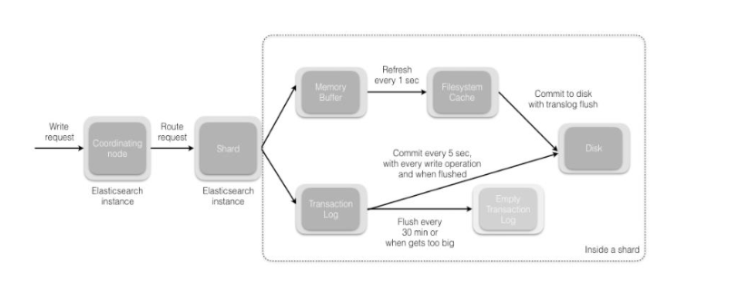

# 1，ES初识

## 1.1 定义

**Elasticsearch是全文搜索引擎，**即根据关键字搜索所有匹配的全文内容。是根据Java编写，并提供了restful API实现存储和检索

==**为什么不使用关系型数据库或者非关系型数据库？**==

- 使用传统数据库存储文本字段，进行全文扫描时，需要扫描整个表，表数据过多的话，查找时间会很慢。根据关键词建立索引，关键词过多后，索引也会很多，维护也很麻烦。并且添加和更新操作会重建索引，加剧了这种困难。


**全文搜索引擎：**工作原理是计算机索引程序通过扫描文章中的每一个词，对每一个词建立一个索引，指明该词在文章中出现的次数和位置，当用户查询时，检索程序就根据事先建立的索引进行查找，并将查找的结果反馈给用户的检索方式。这个过程类似于通过字典中的检索字表查字的过程。

## 1.2 特点

- **分布式：**可快速搭建集群，分布式存储和搜索
- **高可用：**提供主分片和副本分片，主从复制；集群支持自动选主
- **异步写入：**集群本身异步写入，支持客户端异步批量写入

## 1.3 基本概念

**es与关系型数据库概念对应关系**


|       DB       |          ES          |
| :------------: | :------------------: |
|   数据库集群   |         集群         |
|   数据库实例   |         节点         |
|  数据库（db）  |    索引（index）     |
| 主库（master） |    分片（shard）     |
| 从库（slave）  | 副本分片（replicas） |
|  表（table）   |     类型（type）     |
|   行（row）    |     文档（doc）      |
|  列（column）  |    字段（field）     |
|     表结构     |   映射（mapping）    |
|      索引      |       倒排索引       |


- **为什么要去除类型（type）？**
  - es设计index和type的初衷就是类似关系型数据库（mysql），方便管理数据之间的关系。

- **那为什么要去除？**
  - 关系型数据库中的table是独立存储的，但es中同一个index下，所有的type是存储在同一个索引中的，因此不同type中相同字段名称的定义（mapping）需要一致。
  - 不同类型的“type”存储在同一个index中，会影响lucence（es基于lucence开发）的压缩性能
  - 可以理解为index可以直接关联数据，因此不应该在index和数据之间再增加一个概念。

## 1.4 集群，节点，分片

- 一个elasticsearch实例为一个节点,即一台服务器
- 一个或多个拥有相同cluster.name配置的节点组成一个集群
- 节点数发生变化时，集群会重新rebalance所有数据
- 一个节点被选举为主节点时，它负责管理集群范围的所有变更（增加，删除索引，增加或者删除节点）
- 主节点并不需要涉及文档级别的变更和搜索操作
- 请求发送到集群的任意节点，每个节点都知道任意文档所处的位置，并转发请求，收集，返回数据

### 1.4.1 节点

- **候选主节点**：候选主节点**通过选举**可以成为主节点，主节点的主要职责似乎和集群操作相关的内容，创建或删除索引（index->db中的数据库），并将分片分配给相关节点。一个节点既可以为候选主节点也可以为数据节点，但因为数据节点对CPU，内存消耗大。避免资源占用大导致主节点产生影响，进而影响整个集群。为提高集群的健康性，对集群的节点做好角色的划分与隔离，选择配置较低的机器作为候选主节点
- **数据节点**：主要存储索引数据，对文档（doc->db中的一行数据）进行增删改查操作，聚合操作等。数据节点对CPU，内存，IO要求较高
- **协调节点**：搜索请求或者批量请求可能涉及到不同数据节点上的数据，这样则需要协调节点进行协调。每个节点都是一个隐式的协调节点。如果同时设置了data.master = false和data.data=false，那么此节点将成为仅协调节点。如果无特别高的QPS，协调节点最好不要分离，跟数据节点在一起就行，分开的意义不大。

### 1.4.2 分片

创建索引时，需要指定主分片的数量

- **主分片（shard）**：当有大量的文档时，单节点无法有效处理过多请求。将数据分为多个分片（即多个节点上），放在不同服务器上。当查询的索引分布在多个分片上，es会向每个相关的分片发送查询请求，并将结果组合，应用程序无感。
- **副本分片（replicas）**:为提高集群的高可用性和查询吞吐量，则使用分片副本。主从备份，读写分离。（既是主从节点，也是副本数据。与Kafka区分）
- 分片本质上来讲，副本分片提供查询能力，仅是不能写。

**在集群节点数一定的情况下，增加副本分片不能提高性能，反而有所损耗。但副本分片适当多时，在集群多个节点宕机时，能尽可能的保证数据不丢失**

一个索引有n个主分片，每个主分片有m个副本分片，那么：总分片数 = n*(m+1)

:o: ：**Lucene索引在ES中就是分片，而ES索引指的是ES的一个数据库，即所有分片的集合**

### 1.4.3 关系

- 一个索引可以创建多个分片，存储在不同节点上；
- 适当的增加主分片数量会提升检索的速度，若分片数量过多或者过少，都会降低检索的速度
- 主分片不会和副本分片在一个节点中，保证es数据的高可用。若当前集群除主分片在节点上，有副本分片未能分配到其他节点上，则集群整体的健康度为黄色

分片数过少：单个索引过大，降低整体的查询速率

分片数过多：打开较多的文件，存储在不同机器上，机器之间的相互通信时间也会增加

**==建议：单个分片的数据量控制在20G-50G左右==**


==**集群健康度**==

**green**   最健康得状态，说明所有的分片包括备份都可用; 这种情况Elasticsearch集群所有的主分片和副本分片都已分配, Elasticsearch集群是 100% 可用的。
**yellow**   基本的分片可用，但是备份不可用（或者是没有备份）; 这种情况Elasticsearch集群所有的主分片已经分片了，但至少还有一个副本是缺失的。不会有数据丢失，所以搜索结果依然是完整的。不过，你的高可用性在某种程度上被弱化。如果 更多的 分片消失，你就会丢数据了。把 yellow 想象成一个需要及时调查的警告。
**red**  部分的分片可用，表明分片有一部分损坏。此时执行查询部分数据仍然可以查到，遇到这种情况，还是赶快解决比较好; 这种情况Elasticsearch集群至少一个主分片（以及它的全部副本）都在缺失中。这意味着你在缺少数据：搜索只能返回部分数据，而分配到这个分片上的写入请求会返回一个异常。


## 1.5 分布式集群

节点需要冗余，来对数据进行备份，防止丢失。

### 1.5.1 水平扩容

如果给两个es节点的集群再添加一个，集群会为了负载均衡而对分片进行重新分配。

- **主分片和副本分片不会放在同一台机器上**，每个节点的资源处理更少的数据，因此每个分片的性能会得到有效提升

主节点的数目在索引创建时已经确定（无法更改），每个分片能够存储的数据量已经大致确定（20-50G），即定义了索引能够存储的最大数据量。为了提高集群的吞吐量，只能增加副本分片。提高读数据的能力。

### 1.5.2 应对故障

如果集群某个节点发生故障，则从剩余节点中选举新的主分片，不影响使用。在故障机器恢复，连接后，故障机器均为副本分片，不进行主分片的选举。


## 1.6 路由计算

插入数据时，将数据写入到某个分片，分片的选择规则：`shard=hash(routing)%number_of_primary_shards.`

hash：文档的Id值，即插入的数据的hash值

number_of_primary_shards: 主分片数量

:warning::插入数据是主分片和副本分片都插入该数据，路由仅是选择哪个分片写入


发送请求到集群的任一节点（基本为协调节点），协调节点将请求转发到需要的节点上。由于协调节点的存在，发送请求时，为了拓展负载，可以轮询集群中所有节点。


### 1.6.1 写流程

1. 客户端向协调节点发送写请求
2. 协调节点根据路由计算，将请求转发到指定的主分片所在节点上。
3. 如果请求成功，则将请求转发到副本分片实现数据同步。
4. 一但所有的副本分片都报告成功，则该主分片所在节点向协调节点报告成功，协调节点向客户端报告成功。


有些参数可以影响写数据的步骤

| 参数        | 含义                                                         |
| ----------- | ------------------------------------------------------------ |
| consistency | consistency，即一致性。在默认设置下，即使仅仅是在试图执行一个写操作之前，主分片都会要求必须要有规定数量(quorum)（或者换种说法，也即必须要 有大多数）的分片副本处于活跃可用状态，才会去执行_写_操作(其中分片副本 可以是主分片或者副本分片)。这是为了避免在发生网络分区故障（network partition）的时候进行_写_操作，进而导致数据不一致。规定数量即： `int( (primary + number_of_replicas) / 2 ) + 1  `<br />consistency 参数的值可以设为 one （只要主分片状态 ok 就允许执行写操 作）,all（必须要主分片和所有副本分片的状态没问题才允许执行写操作）, 或 quorum 。默认值为 quorum , 即大多数的分片副本状态没问题就允许执行_写_ 操作。 <br />注意，规定数量 的计算公式中 number_of_replicas 指的是在索引设置中的设定 副本分片数，而不是指当前处理活动状态的副本分片数。如果你的索引设置中指定了当前索引拥有三个副本分片，那规定数量的计算结果即： int( (primary + 3 replicas) / 2 ) + 1 = 3 <br />如果此时你只启动两个节点，那么处于活跃状态的分片副本数量就达不到规定数 量，也因此您将无法索引和删除任何文档。 |
| timeout     | 如果没有足够的副本分片会发生什么？ Elasticsearch 会等待，希望更多的分片出 现。默认情况下，它最多等待 1 分钟。 如果你需要，你可以使用 timeout 参数 使它更早终止： 100 100 毫秒，30s 是 30 秒。 |

### 1.6.2 读流程

 因为副本的存在，读取数据可以从主分片或者任意副本分片读取数据

1. 客户端向协调节点发送读请求
2. 协调节点使用文档的`_id`来确定文档所属的分片，从而转发到对应分片读取数据
3. 将读取结果，返回到协调节点，协调节点将结果返回到客户端

协调节点在每次请求的时候，通过轮询所有副本分片进行负载均衡。

在文档被检索时，已经被索引的文档可能已经存在于主分片上但是还没有复制到副本分片。 在这种情况下，副本分片可能会报告文档不存在，但是主分片可能成功返回文档。 一 旦索引请求成功返回给用户，文档在主分片和副本分片都是可用的。

### 1.6.3 更新流程

1. 客户端向节点 发送更新请求，
2. 该协调结点将请求转发给主分片所在的的节点
3. 该节点首先检索本地文档（读取），并修改`_source`字段中的数据（修改），并尝试重新索引主分片的文档（写回），若此时文档被另外进程修改，重试该步骤，超过retry_on_conflict次，放弃
4. 若该节点更新成功，则将新版本的**文档数据**并行发送给其他副本分片节点（注意是完整文档，不是更改请求，并且是异步），重新建立索引，一旦所有副本都返回成功，该节点向协调节点返回成功，协调节点向客户端返回成功


# 2，原理

## 2.1 检索过滤

ES查询，支持query 方式和filter方式查询，两种方式不同。


**query**：先查询符合条件的文档，然后计算每个文档对于搜索条件（搜索包含分词，⼤⼩写转换、近义词转换、时态转换、单复数转换等）的相关度分数，然后再根据评分倒序排序。

**filter**：根据搜索条件过滤出符合的文档数据，将文档的评分固定为1，不计算相关度分数也不排序。忽略 TF/IDF信息。es内部还会缓存比较常用的filter数据。只是一个简单的过滤，该文档是否匹配 true or false


TF/IDF（词频/逆文档频率算法）“

1. 匹配到的关键词越稀有，文档的得分就越高
2. 文档的域越小，文档的得分就越高（避免打问打的误差）
3. 设置的权重（索引和搜索时设置的都可以）越大，文档的得分越高

【本质：如果某个词或短语在⼀篇⽂章中出现的频率TF⾼，并且在其他⽂章中很少出现，则认为此词或者短语具有很好的类别区分能⼒，适合⽤来分类。但是实际上，如果⼀个词条在⼀个类的⽂档中频繁出现，则说明该词条能够很好代表这个类的⽂本的特征，这样的词条也应该给它们赋予较⾼的权重，并选来作为该类⽂本的特征词以区别与其它类⽂档，这就是IDF的不⾜之处。】


## 2.2 文档写入

异步写入：

1. 客户端向ES1节点（协调节点）发送写请求，通过路由计算公式得到值为0，则当前数据应该被写到主分片S0上。
2. ES1节点将请求转发到S0主分片所在的节点ES3，ES3接受请求并写入到磁盘
3. **ES并发将数据复制到两个副本分片R0上**，其中通过乐观并发控制数据的冲突。一旦所有的副本分片都报告成功，则节点ES3将向协调节点报告成功，协调节点向客户端报告成功


1. 写入请求会将索引（Index）存放到内存区域，叫做Index Buffer。此时的索引文件暂时不能被ES搜索到
2. 默认情况下，ES每秒执行一次Refresh操作，将Index Buffer中的index写入到FileSystem 中的segment，这个也是内存区域，把Index buffer中的index转换为segment，此时的数据就可以被ES搜索到，同时清空Index Buffer （ES被称为准实时的原因）
   - Refresh 触发的两种方式：
     - 按时间频率触发，默认是1s一次Refresh，可通过index.refresh_interval 设置；
     - 在Index buffer被占满时，会触发Refresh，Index Buffer的大小默认值为JVM所占内存容量的10%
3. 当segment触发阈值或者达到周期性，会将Segment文件Flush写入到磁盘，ES会创建一个Commit Point文件，该文件会被标识被Flush到磁盘上的Segment。
   - Flush 触发的两种方式：
     - 每30分钟，
     - translog达到一定大小（由 index.translog.flush_threshold_size 控制，默认 512mb）


Segment在Flush之前仍存在内存中，如果服务器宕机，ES还没没有Flush操作，则保存在Segment数据会丢失，为了提高ES的数据存储可靠性，**引用了Translog**，每次用户请求Index Buffer进行操作时，都会在TransLogs中写一份操作记录，

- ES默认每个请求都会将TransLog同步到磁盘
- 但会有性能影响，**针对能够容忍丢失数据的场景设置异步落盘的操作**，可以将 index.translog.durability 配置为 async 来提升写入 Translog 的性能，该配置会异步写入 translog 到磁盘。写入磁盘的频率通过 index.translog.sync_interval 来控制。

**批量异步写入需要注意点**

1. 单节点应用：在本地队列按顺序去重，减少写入的数据量；
2. 多节点应用：需要考虑同一数据在短时间内多次更新，消费到不同节点，异步写入ES集群时的顺序问题，最好能通过一些策略，将同一业务主键的数据，路由到同一应用节点写入，保证顺序性。（？）

## 2.3 倒排索引 索引压缩

### 2.3.1 倒排索引

ES底层使用的仍是**Lucene（撸辛）**的倒排索引。

分词器：

:warning: 指定字段的类型，keyword不能进行分词，text能进行分词。不能进行分词，则查询时，该字段需要精确匹配才能查到

- 词条（token）：索引中最小的存储和查询单元。存储文档的 内容拆分成单个的词条
- 词典：字典，词条的集合，结构为B+，HashMap


倒排索引<=>反向索引

解释都这样，已经烂大街了


**正向索引:**

本质和书本的目录一样，是按照文档的固定顺序，顺序记录当前文档所存在的关键信息（关键字），方便检索和定位文档，是 **【document -> to -> words】** 模式，即： index -> content。


**反向索引:**

按照关键字，记录出现的文档和对应的次数，是**【word -> to -> documents】** 模式，即：content -> [index,index]。


“java”,“python”,“VUE”,“技术”这些都是term（词）；

而[1,2,3]这种的叫Posting List，Posting list就是一个int的数组，存储了所有符合某个term的文档id。（与非聚簇索引）

搜索的词条和数据库分词不完全一致时，会有优化，

- 如将大小字母改为小写 Max->max
- foxes提出词干，变为词根的形式fox，dogs也可提取为dog 
- 同义词

### 2.3.2 文档搜索

全文检索会将整个文档建立倒排索引，写入到磁盘，**不可改变，落盘后永远不会修改**

**特点**

- 不更改索引，则查询不需要锁
- 索引会读取到内存中，而不是查询磁盘，提高性能

### 2.3.3 动态索引更新

由于索引的不变特性，倒排索引的更新，则是**通过增加新的索引来进行修改**，而不是重写整个倒排索引。每个倒排索引都会被查询，最后再对结果进行合并。

ES基于Luccee搜索，Luccee引入了**按段搜索**，每一段是一个倒排索引。索引即所有段的集合。

**提交点：**一个列出了所有已知段的文件，即当前分片的所有段信息

- **段更新流程**
  - 新文档添加到内存索引缓存中
  - 不时，缓存被提交时：
    - 新的段写入到磁盘，追加的倒排索引写入到磁盘
    - 包含新段名字的提交点写入到磁盘
  - 新段开启，该段包含的文档被检索到
  - 内存缓存清空，等待接收新文档

检索时，按已知段的顺序，进行倒排索引查询，词项会对结果进行聚合，保证词和文档的关联性。

**索引不可变，因此，段也不可改变。**既不能把文档从旧段中移除，也不会修改。提交点落盘时，会包含.del文件，该文件包含被删除文档的段的信息。

**文档被删除时，实际文件未被删除，而是在.del文件中标记为删除，在查询文档，对结果进行整合时，从结果集中移除。**

**文档被修改时，旧文档被标记为删除，新文档被索引到新的段中，可能存在新旧文档都会被查询到的情况，在对结果进行整合时，会被移除。**

### 2.3.4 近实时搜索

在插入一条新文档，由于按段搜索，刷新到磁盘影响性能，等几分钟后才能被检索，过于慢。因此，为提高性能，新文档，新段在写入到系统缓存时，就可以被搜索。Lucene允许新段被写入和打开，使其包含的文档在没有被完整提交时就对搜索。这种方式比频繁刷盘的代价更小，且提高了性能。新提交的文档，1s内即可被检索到。上述的reflush操作。

:warning:此时，数据未落盘，若此时机器断电，数据可能丢失？

不会，因为引入了transLog日志

### 2.3.5 持久化变更

为提高ES的可靠性，需要实现冲失败中进行数据恢复。索引写入，即段的写入，是先将段刷新到磁盘，再写入一个包含所有段列表的提交点中。ES添加了一个事务日志，translog。translog包含了所有未落盘时的一个持久化记录，es启动时，会根据translog区恢复数据。

使用ES的操作流程：

1. 文档被索引后，都会被添加到内存缓冲区，追加到 translog。
2. 刷新操作，使分片每秒refresh一次，即实现近实时搜索。：系统内存缓冲区中文档被写入到段中，但此时未刷新到磁盘，该段可被检索。
3. 每隔一段时间，translog越来越大或者索引刷新，即索引落盘时，则新的translog被创建

默认30分钟，分片会自动落盘，translog太大也会落盘。translog默认5s落盘一次，每次增，删，改操作也会落盘。主分片和副本分片都会发生，这是落盘过程包括在整个请求流程中，即未添加到translog，则不会返回请求成功响应。translog落盘时间可修改。看集群是否允许偶尔丢失几秒的数据。


### 2.3.6 索引压缩（段合并）

- 原因；每次插入和更新都会写入新段，会导致段的数量过多，查询时，会遍历所有的段，消耗查询时间，降低查询性能。因此，ES会在后台执行段合并。小段合并到大段。
- 段合并时，**将旧的已删除文档进行清除。**（开始仅是将文档标记为删除状态，即逻辑删除，并未真正删除），本质操作是被删除的文档不会被拷贝到新的大段中。
- 段合并时，会选择大小相近的段进行合并，且不影响索引和搜索
- 合并结束后，老段被删除，新段被刷新到磁盘，写入一个包含新段和排除旧的和较小段的新提交点
- 新段被搜索使用，老段被删除


## 2.4 文档分析

- 文档分析：将一条文档，分成适合倒排索引的独立词条。
- 并将这些词条统一化为标准格式，提高检索性

实际上，是通过三个功能实现

- 字符过滤器
  - 在分词前，整理字符串，例如除去html，将&改为 and等
- 分词器
  - 将文档通过分词器分为单个词条，分词器遇到空格和标点，可能会被拆分为词条
- Token过滤器
  - 可能会改变词条，即将Quick小写化。删除一些无用词条，a，the等。或者增加词条：进行同义词转换，jump 和leap

我们一般选择IK分词器（插件，需要单独下载）


## 2.5 ES优化

- ### 硬件选择

  ES的基础是Lucene，所有的索引和文档数据是存储在本地磁盘的，因此，需要选择性能优异的磁盘。

  - 固态硬盘，且配置多块，允许ES通过多个path.data目录配置把数据条带化分配到上面。

- ### 分片策略

  由于分片数是在创建索引时需要确定的，且无法更改。

  - 分片数过多是有代价的
    - 一个分片底层就是一个Lucene索引，会消耗一定文件句柄，内存，以及CPU运转
    - 每个搜索请求会命中索引的所有分片，若这些分片都处在一个节点上，则抢占资源，影响最终的性能
  - 设置原则
    - 每个分片占用的硬盘容量不超过ES的最大JVM的堆空间设置（一般不超过32G ）JVM的内存很大，则会挤占操作系统的内存，而ES数据的读取都是到操作系统的缓存中才能被访问，若jvm内存过大，导致操作系统的ES缓存太小，会频繁进行落盘，影响性能。 
    - 节点数量：一般一个节点一个物理机。分片数过多，超过节点数，则节点故障可能导致数据丢失，无法数据恢复。
    - 主分片，副本和节点最大数之间的数量关系：节点数<=主分片数*（副本数+1）。即分片数总和不要超过节点数或者机器数

- ### 批量数据提交

  - ES提供了Bulk API批量操作，大批量操作时，可以选择Bulk.
    - Bulk默认提交的数据量不能超过100M，数据条目根据文档大小和服务器性能决定。

- ### ES内存设置

  - ES的jvm配置**Xmx和Xms的大小设置相同**，目的是在java GC后，不必重新分配堆大小，节省资源。
  - ES堆内存配置原则
    - 不超过物理内存的50%。Lucene的使用是将操作系统的数据缓存到内存中，如果设置ES的堆内存过大，Lucene可用内存会减少，降低Lucene的全文查询性能。
    - 堆内存的大小不要超过32GB。 涉及到操作系统的指针。即若机器有128G内存，则该机器可以创建为两个节点，每个节点的JVM内存不要超过32G。


# 3，实践（ 基本略）

## 3.1 创建索引

- 字符串：**text和keyword两种类型，keyword代表精确值不会进行分词，text类型的字符串会参与分词处理。**即keyword类型的字符串，查询时需要精确查询，不能模糊查询，但可以进行聚合处理（最大值，最小值，平均值等）
- 数值：long，integer，short，byte，double，float
- 布尔值：boolean
- 时间：date
- 数组：数组类型不需要专门定义，只要插入的字段值时json数组就行
- GEO：坐标类型，经纬度信息的形势可以是字符串，数组或者对象


实践建议

- 建议设置别名
- 建议设置路由，并在post数据时，指定字段；
- 建议关闭自动映射索引


### 修改配置文件

```http
修改配置文件 config/elasticsearch.yml
   action.auto_create_index: false
或者:
PUT _cluster/settings
{
   "persistent": {
       "action.auto_create_index": "false"
   }
}
```

## 3.2 增加字段（略）

```http
PUT es的index名/_mapping/es的type名
{
    "properties": {
        "receivableAmount": {
            "type": "double"
        },
        "purchaseInsuranceAmount": {
            "type": "double"
        }
    }
}
```

## 3.3 修改检索行限制（略）

不建议修改改值，如有特殊情况，可以临时处理

```http
---   修改全部索引：
put _all/_settings
{
"index.max_result_window":200000
}


---   修改单个索引
PUT /package_waybil_v1/_settings
{
"index.max_result_window": 20000

}
```

## 3.4 更新文档（略）

更新数据分为：全部重构和部分更新

无论哪种方式，ES都不能直接修改原是的doc，只能如下

1. 从旧文档构建JSON
2. 更改该JSON
3. 标记删除旧文档
4. 索引一个新文档

```http
//--- 全部重构，只会按本次提交的JSON创建文档

POST /center_weight/type/BC1003210428130000060213
{
   "evadeWeight":1
}

//--- 部分更新，会基于原数据和本次提交JSON，替换构建文档
//--- API：POST /index/type/_Id/_update?routing=***

POST /center_weight/type/BC1003210708100000000606/_update
{
 "doc": {
   "evadeWeight": 1

      }

}
```

## 3.5 引入但没有用到的文件（略）

别名就像一个快捷方式或者软连接，指向一个或多个索引

- 可以将多个索引分组
- 在运行的集群中，从一个索引切换到另一个索引

```http
--增加别名
POST /_aliases
{
"actions": [
   {
     "add": {
       "index": "my_index",
       "alias": "my_index_alias"
     }
   }
 ]
}

--更换别名
POST /_aliases
{
   "actions": [
       { "remove": { "index": "my_index_v1", "alias": "my_index" }},
       { "add":    { "index": "my_index_v2", "alias": "my_index" }}
   ]

}
```


## 3.8 慢日志

慢日志是为捕获超过指定时间阈值的查询或索引请求，默认情况是不开启的。开启需要指定具体动作（query，fetch还是index）

**慢日志情况：集群CPU、内存使用率高或者频繁fullGC的时候，可以监控慢日志，大多数时候都是一些复杂的、不合理的聚合查询导致的慢查询，进而最后导致节点异常的。**

## 3.9 实践建议

1. 建议提前估算数据量，设置合理分片；

2. 建议关闭自动映射索引；

3. 建议索引设置别名；

4. 建议根据业务实际情况，设置路由校验，并在POST数据时，指定字段；

5. 建议部分更新；

6. 建议对完全确认不作检索条件的字段设置"index": false，否则不要处理。

7. 操做索引，一定看清PUT和POST；

8. 有聚合操做的核心索引，建议根据实际情况配置慢日志；

# 4，入门操作

## ES操作

- ### 创建索引

  - put：http://127.0.0.1:9200/shopping 
  - 具有幂等性，多次发送报错

- ### 查询索引

  - get：http://127.0.0.1:9200/shopping 
  - 查看所有索引：http://127.0.0.1:9200/_cat/indices?v

- ### 删除索引

  - delete：http://127.0.0.1:9200/shopping 


- ### 创建文档

  - post：http://127.0.0.1:9200/shopping/_doc
  - **为什么是post请求，而不是put请求？**
    - **因为put请求要求是幂等性的， ES添加文档时不是幂等的（会生成自定义唯一标识）所以选择post请求发送，若指定了唯一标识，put和post请求均可。（post请求没有幂等性的要求）**
  - 指定自定义唯一标识ID
  - put/post： http://127.0.0.1:9200/shopping/_doc/1

- ### 查询文档

  - GET：http://127.0.0.1:9200/shopping/_doc/1

- ### 修改文档

  - post：http://127.0.0.1:9200/shopping/_doc/1

- ### 修改字段

  - post：http://127.0.0.1:9200/shopping/_update/1

    ```json
    {
    "doc": {
    "price":3000.00
    }
    }
    ```

- ### 删除文档

  - delete：http://127.0.0.1:9200/shopping/_doc/1

- ### 映射条件

  - 指定映射条件，

  - put：http://127.0.0.1:9200/student1

    - ```json
      {
          "settings":{
      
          },
          "mappings":{
              "properties":{
                  "name":{
                      "type":"text",
                      "index":true
                  },
                  "sex":{
                      "type":"keyword",
                      "index":true
                  },
                  "age":{
                      "type":"long",
                      "index":false
                  }
              }
          }
      }
      ```

    - :star2:： ==**若index为false，不能作为搜索条件。**==

    - :star2:： ==**若类型type为“keyword”，即表示则表明该字段不创建倒排索引，搜索的时候需要全值匹配。match不能对该字段分词。即与term相似。**==

      

- ### 查询文档

  - 查询结果

  - ```json
    {
    	"took【查询花费时间，单位毫秒】": 1116,
    	"timed_out【是否超时】": false,
    	"_shards【分片信息】": {
    		"total【总数】": 1,
    		"successful【成功】": 1,
    		"skipped【忽略】": 0,
    		"failed【失败】": 0
    	},
    	"hits【搜索命中结果】": {
    		"total"【
    		搜索条件匹配的文档总数】: {
    			"value"【
    			总命中计数的值】: 3,
    			"relation"【
    			计数规则】: "eq"#
    			eq 表示计数准确， gte 表示计数不准确
    		},
    		"max_score【匹配度分值】": 1.0,
    		"hits【命中结果集合】": [。。。
    		}
    	]
    }
    }
    ```

  - match：匹配内容查询，会对**查询条件**分词，多词条之间采用or

  - matchPhrase：匹配内容查询，会对**查询条件**分词，多词条之间采用and 即必须满足所有词条能先显示

  - term：精确查询，不对查询条件分词

  - terms：多关键字精确查询，该字段包含了指定值中的其中一个

  - 指定查询的返回字段
  
    - ```json
      {
      	"_source": ["name", "nickname"],
      	"query": {
      		"terms": {
      			"nickname": ["zhangsan"]
      		}
      	}
      }
      ```

  - Incldes：指定想要的字段

  - excludes：指定不想要的字段
  
    - ```json
      {
       "_source": {
       "includes": ["name","nickname"]
       },
       "query": {
       "terms": {
       "nickname": ["zhangsan"]
       }
       }
      }
      ```
    
  - 组合查询
  
    - must
    
    - must_not
    
    - should
    
      
    
  - 范围查询range
  
    - gt >
    - gte >=
    - lt <
    - lte <=

  - 模糊查询
  
    - **返回包含与搜索字词相近的字词的文档**，不是同一个词，注意区分
    - 编辑距离距离是将一个词语转换成另一个术语所需的一个字符更改的次数

  - 单字段排序

    - desc 降序，asc 升序

  - 分页查询
  
    - from：当前页的起始索引，默认从0开始，from=（pageNum-1）*size
    - size：每页的条数
  
  - State 聚合 一次性返回指定字段的count，max，min，avg，sum五个指标


## java操作

- 创建esclient对象，指定链接和端口
- 根据index创建request请求，添加条件，构建request
- 操作，并处理返回结果Response


```java
SearchRequest request = new SearchRequest();
request.indices("student");

SearchSourceBuilder sourceBuilder = new SearchSourceBuilder();
// 查询所有数据
sourceBuilder.query(QueryBuilders.matchAllQuery());
request.source(sourceBuilder);
SearchResponse response = client.search(request, RequestOptions.DEFAULT);
// 查询匹配
SearchHits hits = response.getHits();
```


- ### 高级查询

  - 查询所有数据：

    ```java
    sourceBuilder.query(QueryBuilders.matchAllQuery());
    ```

  - term精确查询：

    ```java
    sourceBuilder.query(QueryBuilders.termQuery("age", "30"));
    ```

  - 分页查询：

    ```java
    // 当前页其实索引(第一条数据的顺序号)，from
    sourceBuilder.from(0);
    // 每页显示多少条 size
    sourceBuilder.size(2);
    ```

  - 数据排序

    ```java
    // 排序
    sourceBuilder.sort("age", SortOrder.ASC);
    ```

  - 模糊查询

    ```Java
    sourceBuilder.query(QueryBuilders.fuzzyQuery("name","zhangsan").fuzziness(Fuzziness.ONE));
    ```

    指定模糊查询的字段，并指定模糊匹配的相差字符，即允许几个字与给的查询内容不同。

  - 查询字段过滤

    ```java
    String[] excludes = {};
    String[] includes = {"name", "age"};
    sourceBuilder.fetchSource(includes, excludes);
    ```

  - bool查询（**组合查询**）

    ```java
    // 必须包含
    boolQueryBuilder.must(QueryBuilders.matchQuery("age", "30"));
    // 一定不含
    boolQueryBuilder.mustNot(QueryBuilders.matchQuery("name", "zhangsan"));
    // 可能包含
    boolQueryBuilder.should(QueryBuilders.matchQuery("sex", "男"));
    ```

  - 范围查询

    ```java
    RangeQueryBuilder rangeQuery = QueryBuilders.rangeQuery("age");
    // 大于等于
    rangeQuery.gte("30");
    // 小于等于
    rangeQuery.lte("40");
    ```

  - **组合查询**

    - QueryBuilders.matchQuery(“supplierName”,param)：首先对搜索的字段进行分词，分词中的任一词与ES中的目标字段匹配上即可。即**分词后精确查询，分词之间or关系,有一个分词匹配即匹配**
    - QueryBuilders.matchPhraseQuery(“supplierName”,param)：与matchQuery不同的是，分词后精确查询，分词之间是and关系，必须全部匹配才可
    - QueryBuilders.matchPhrasePrefixQuery(“supplierName”,param) ：与matchPhraseQuery相似，但查询条件的最后一个分词可以前缀匹配
    - QueryBuilders.termQuery(“supplierName”,param)：精确查询，不会对查询内容分词
    - QueryBuilders.wildcardQuery(“supplierName”,"\*"+param+"*") : 模糊查询，注意查询字段需要前后\*符号。


# 5，ES面试题

## 1，为什么使用ElasticSearch？MySql不可以吗

程序数据会越来越多。数据查询的调用量都特别大。如果仅通过DB支撑大量的查询是不可取的。而且业务常采用模糊查询进行数据检索，模糊查询会导致在数据库查询时，全表查询，尤其在百万，千万级别的数据库中，查询性能极其不足。而ES作为**搜索引擎**能够满足这些要求。

- **查询速度快**（mysql的查询性能有限，即使添加了索引，而且建立索引会增加维护成本）
- 能满足复杂的查询需求，多条件模糊查询和排序，这是mqsql所无法快速做到的。
- 适合全文搜索的场景
- 可拓展性强，支持分布式的存储集群
- 高可用，容灾性好

**Elasticsearch的分布式架构设计初衷就是为了支持海量数据查询**。

缺点：

Elasticsearch在查询海量数据时有优势，但是一般情况下在没有那么大的查询量时，也不一定要选用。因为Elasticsearch本身会占用了很大一部分运行内存。

## 2 Elasticsearch 的 master 选举流程？

- ES的选主是ZenDiscovery模块负责的，主要包含Ping（节点之间通过RPC通信）和Unicast（单播模块包含一个注解列表来控制那些节点需要ping通）这两部分
- 对所有可以成为master的节点（node.master:true）根据nodeId字典排序，每次选举每个节点都会将自己所知道的节点进行一个排序，选出第一个节点，暂认为master节点
- 对一个节点的投票数超过一定值（节点数n/2+1），并且该节点也选举自己，则该节点选举为master，否则一直选举
- master 节点的职责主要包括集群、节点和索引的管理，不负责文档级别的管理； data 节点可以关闭 http功能

## 3 Elasticsearch 集群脑裂问题？

脑裂：ES在主节点上产生分歧，则产生了多个主节点，使得集群处于异常状态，

- 脑裂问题的原因
  - **网络问题：**集群间的网络延迟导致一个节点访问不到master，认为master挂掉了重新选举出新的master，并对原master上的分片进行标红和副本标红，进行重新分配主分片
  - **节点负载：**主节点既为master节点，又是data分片，访问量较大时，可能导致ES停止响应，造成大面积延迟，其他节点得不到主节点的响应，认为主节点挂掉，会重新选举主节点
  - **内存回收：**data节点的ES进程占用内存较大，引发JVM的GC频繁，造成ES进程失去响应
- 脑裂解决方案
  - **减少误判：**discovery.zen.ping_timeout 节点状态的响应时间，默认为 3s，可以适当调大，如果 master在该响应时间的范围内没有做出响应应答，判断该节点已经挂掉了。调大参数（如 6s，discovery.zen.ping_timeout:6），可适当减少误判。
  - **选举触发：**discovery.zen.minimum_master_nodes:1，该参数是用于控制选举行为发生的最小集群主节点数量。当备选主节点的个数大于等于该参数的值，且备选主节点中有该参数个节点认为主节点挂了，进行选举。官方建议为（n/2） +1， n 为主节点个数（即有资格成为主节点的节点个数）
  - **角色分离：**即 master 节点与 data 节点分离，限制角色
    - 主节点配置为： node.master: true node.data: false
      从节点配置为： node.master: false node.data: true

## 4 Elasticsearch 索引文档的流程？



- 协调节点默认使用文档ID进行计算，以便路由选择合适的分片`shard = hash(document_id) % (num_of_primary_shards)`
- 当分片所在的节点接收到来自协调节点的请求后，会写入缓存，然后进行刷新策略进行刷盘（默认是1s刷新一次）。
- 写入系统缓存，但未刷盘时，数据可能丢失。ES通过translog的机制保证数据的可靠性。在接受到请求后，同时写入到translog中，但落盘后，删除translog数据，为flush过程。
- flush过程中，内存中的缓存被清除，内容会写入，段的fsync将创建一个新的提交点，并将内容刷新到磁盘，旧的 translog 将被删除并开始一个新的 translog。
- flush 清除的时机是定时触发（默认 30 分钟）或者 translog 变得太大（默认为 512M）时；

## 5 Elasticsearch 更新和删除文档的流程

- 删除和更新也是写操作，但elasticsearch中的文档是不变的，因此不能被删除或者改动
- 磁盘上的每个段都有一个相应的.del文件，删除请求发送后，文档没有被真正删除，而是在.del文件中，被标记为删除，该文档能够参与匹配查询，但是会在结果中被滤除。在段合并时，.del文件中被标记的文件不会被写入到新段
- 新文档被创建时，Es会为该文档指定一个版本号；在文档更新时，旧版本的文档在.del被标记为删除，新版本的文档被索引到新段。旧版本的文档仍被匹配查询，但会在结果中被滤除


## 6 Elasticsearch 搜索的流程？（略）

1. 检索过程分为两个阶段，查询和获取
2. 查询阶段时，查询会通过协调节点，将请求转发给符合索引的每个主副分片，每个分片在本地执行并构建一个匹配文档的大小为from+size的优先队列。
3. 每个分片返回各自优先队列，所有文档的ID和排序值，给排序节点，它合这些值到自己的优先队列中，生成一个全局排序的结果列表
4. 取回阶段中，协调节点辨别出哪些文档需要被取回，并向相应分片提交多个get请求，每个分片加载并丰富文档，如果需要，返回文档给协调节点。所有文档都被取回，协调节点返回结果给客户端


## 7 Elasticsearch 在部署时，对 Linux 的设置有哪些优化方法？

- 64 GB 内存的机器是非常理想的， 但是 32 GB 和 16 GB 机器也是很常见的。少于 8 GB 会适得其反。
- 如果你要在更快的 CPUs 和更多的核心之间选择，选择更多的核心更好。多个内核提供的额外并发远胜过稍微快一点点的时钟频率。
- 如果你负担得起 SSD，它将远远超出任何旋转介质。 基于 SSD 的节点，查询和索引性能都有提升。如果你负担得起， SSD 是一个好的选择。
- 即使数据中心们近在咫尺，也要避免集群跨越多个数据中心。绝对要避免集群跨越大的地理距离。
-  请确保运行你应用程序的 JVM 和服务器的 JVM 是完全一样的。 在 Elasticsearch 的几个地方，使用 Java 的本地序列化。
- 通过设置 `gateway.recover_after_nodes`、 `gateway.expected_nodes`、 `gateway.recover_after_time` 可以在集群重启的时候避免过多的分片交换，这可能会让数据恢复从数个小时缩短为几秒钟。
- Elasticsearch 默认被配置为使用单播发现，以防止节点无意中加入集群。只有在同一台机器上运行的节点才会自动组成集群。最好使用单播代替组播。
- 不要随意修改垃圾回收器和各个线程的大小
- 把你的内存的（少于）一半给 Lucene（但不要超过 32 GB！），通过 ES_HEAP_SIZE 环境变量设置。
- 内存交换到磁盘对服务器的影响极大。
- Lucene 使用了大量的文件。同时， Elasticsearch 在节点和 HTTP 客户端之间进行通信也使用了大量的套接字。 所有这一切都需要足够的文件描述符。你应该增加你的文件描述符，设置一个很大的值，如 64,000。
- 使用批量请求并调整其大小：每次批量数据 5– 15 MB 大是个不错的起始点
- 段和合并： Elasticsearch 默认值是 20 MB/s，对机械磁盘应该是个不错的设置。如果你用的是 SSD，可以考虑提高到 100– 200 MB/s。如果你在做批量导入，完全不在意搜索，你可以彻底关掉合并限流。另外还可以增加 index.translog.flush_threshold_size 设置，从默认的 512 MB 到更大一些的值，比如 1GB，这可以在一次清空触发的时候在事务日志里积累出更大的段
- 如果你的搜索结果不需要近实时的准确度，考虑把每个索引的 index.refresh_interval 改到 30s。
-  如果你在做大批量导入，考虑通过设置 index.number_of_replicas: 0 关闭副本。

## 8 GC 方面，在使用 Elasticsearch 时要注意什么？

- 倒排索引的词典需要常驻内存，无法GC，因此需要监控data node 上 segment memory 增长趋势
- 各类缓存， field cache, filter cache, indexing cache, bulk queue 等等，要设置合理的大小，并且要应该根据最坏的情况来看 heap 是否够用，也就是各类缓存全部占满的时候，还有 heap 空间可以分配给其他任务吗？避免采用 clear cache 等“自欺欺人”的方式来释放内存。
- 避免返回大量结果集的搜索与聚合。确实需要大量拉取数据的场景，可以采用 scan & scroll api 来实现。


## 9 Elasticsearch 对于大数据量（上亿量级）的聚合如何实现？

Elasticsearch 提供的首个近似聚合是 cardinality 度量。它提供一个字段的基数，即该字段的 distinct或者 unique 值的数目。它是基于 HLL 算法的。 HLL 会先对我们的输入作哈希运算，然后根据哈希运算的结果中的 bits 做概率估算从而得到基数。其特点是：可配置的精度，用来控制内存的使用（更精确 ＝ 更多内存）；小的数据集精度是非常高的；我们可以通过配置参数，来设置去重需要的固定内存使用量。无论数千还是数十亿的唯一值，内存使用量只与你配置的精确度相关

## 10 在并发情况下，Elasticsearch 如果保证读写一致？

- 通过版本号使用乐观并发控制，以确保新版本不会被旧版本覆盖，由应用层处理具体冲突
- 另外对于写操作，一致性级别支持quorum/one/all，默认为 quorum，即只有当只有大多数分片可用时才允许写操作。但即使大多数分片可用时，才允许写操作，但即使大多数可用，也可能存在因为网络等原因导致写副本失败，该副本被认为故障，分片则在不用节点上重建
- 对于读操作，可以设置replication 为 sync(默认)，这使得操作在主分片和副本分片都完成后才能返回，如果设置 replication 为 async 时，也可以通过设置搜索请求参数_preference 为 primary 来查询主分片，确保文档是最新版本


## 11 如何监控 Elasticsearch 集群状态？

elasticsearch-head 插件
通过 Kibana 监控 Elasticsearch。你可以实时查看你的集群健康状态和性能，也可以分析过去的集群、索引和节点指标

## 12 是否了解字典树？

- 字典树又叫前缀树， Trie 树，是一种树形结构，是一种哈希树的变种。典型应用是用于统计，排序和保存大量的字符串（但不仅限于字符串），所以经常被搜索引擎系统用于文本词频统计。它的优点是：利用字符串的公共前缀来减少查询时间，最大限度地减少无谓的字符串比较，查询效率比哈希树高。
- Trie 的核心思想是空间换时间，利用字符串的公共前缀来降低查询时间的开销以达到提高效率的目的
  - 根节点不包含字符，除根节点外每一个节点都只包含一个字符。
  - 从根节点到某一节点，路径上经过的字符连接起来，为该节点对应的字符串
  - 每个节点的所有子节点包含的字符都不相同

对于中文的字典树，每个节点的子节点用一个哈希表存储，这样就不用浪费太大的空间，而且查询速度上可以保留哈希的复杂度 O(1)。

## 13 Elasticsearch 中的集群、节点、索引、文档、类型是什么？ （看内容）

- 集群是一个或多个节点（服务器）的集合，它们共同保存您的整个数据，并提供跨所有节点的联合索引和搜索功能。群集由唯一名称标识，默认情况下为“elasticsearch”。此名称很重要，因为如果节点设置为按名称加入群集，则该节点只能是群集的一部分。
- 节点是属于集群一部分的单个服务器。它存储数据并参与群集索引和搜索功能。
- 索引就像关系数据库中的“数据库”。它有一个定义多种类型的映射。索引是逻辑名称空间，映射到一个或多个主分片，并且可以有零个或多个副本分片。 MySQL =>数据库 Elasticsearch =>索引
- 文档类似于关系数据库中的一行。不同之处在于索引中的每个文档可以具有不同的结构（字段），但是对于通用字段应该具有相同的数据类型。 MySQL => Databases => Tables => Columns / Rows   Elasticsearch => Indices => Types =>具有属性的文档
- 类型是索引的逻辑类别/分区，其语义完全取决于用户

## 14 Elasticsearch 中的倒排索引是什么？

倒排索引是搜索引擎的核心。搜索引擎的主要目标是在查找发生搜索条件的文档时提供快速搜索。 ES中的倒排索引其实就是 lucene 的倒排索引，区别于传统的正向索引， 倒排索引会再存储数据时将关键词和数据进行关联，保存到倒排表中，然后查询时，将查询内容进行分词后在倒排表中进行查询，最后匹配数据即可。


# 补充知识点

ES也是关系型数据库

ES的mapping中，新增字段后，无法删除，

 ES 默认索引一次性最多查询10000条数据。查询第10001条数据则


- #### ES的list查询，默认返回前10条，要查询更多个数需要指定size


## mapping中的Dynamic的三种状态

- ### 构建mapping后，ES默认允许自动新增字段

  - 插入数据，传String后，会默认新增字段，可以设置关闭该功能

功能的配置对应的是mapping中的`dynamic`字段

mapping分为动态映射（dynamic mapping）、静态映射（explicit mapping）和严格映射（strict mappings），查看ES的索引信息时可以看到

```http
PUT m1
{
  "mappings": {
    "doc":{
      "dynamic":true,
      "properties": {
        "name": {
          "type": "text"
        },
        "age": {
          "type": "long"
        }
      }
    }
  }
}

```

### 动态映射（dynamic: true）

向ES新增mapping中没有的字段，则ES的mapping会新建该字段，并且将该字段存储在ES中

### 静态映射 (dynamic: false)

新字段会被忽略，这些字段不会被索引或搜索，但仍会出现在`_source`返回的命中字段中，这些字段不会被添加到映射中。即**不能作为条件查询，不会在映射中添加新字段，但是ES仍然存储了这部分信息，在返回值时，携带该部分信息**

### 验证映射（dynamic: static）

如果检测到新字段，则抛出异常


## ES集群性能优化

### ES 不稳定，出现毛刺。

问题：**调用量低查询慢，调用量高查询快。**调用量低的时候，查询时间到1s-2s，调用量大的时候几十，几百ms。数据量几百w。

原因：

- 查询优化，调用量小的时候，ES会用更多的时间优化查询计划。优化后，调用量大之后可以复用。所以在调用量低的时候，性能慢。
- 缓存：调用量大的时候，有各种缓存（查询计划缓存，数据缓存等），使得更有效的工作。

**解决方案**：

调整索引refresh_interval 值，将值设为1s，性能得到极大提升

refresh_interval

- 更频繁的刷新磁盘：保持索引的一致性，减少了因刷新间隔不固定导致的数据不一致。
- 段合并：频繁的刷新可能导致更多的段合并，减少段数量，提高查询效率。


ES是近实时搜索。刚查询的文档，是先保存在缓存中，会缓存满或者到时间主动刷新（可通过refresh_interval 设置）

在内存索引缓存区中的文档会被写入到一个新的段中。但是这里新段会被先写入到文件系统缓存（消耗性能少）。然后缓存满了或者到时间刷新到磁盘（消耗性能高）。ES允许写入缓存的数据在还没刷新到磁盘的时候，搜索可见。


## ES must和filter的区别

- must查询匹配后会计算文档评分，filter 可以减少评分的开销
- filter查询结果可以缓存，多次相同条件，效率会更高。


from null 和to null，比如创建时间  不要改成两个条件 `from createDateStart  to null   && from null  to createDateEnd `改成

`from createDateStart to createDateEnd `


