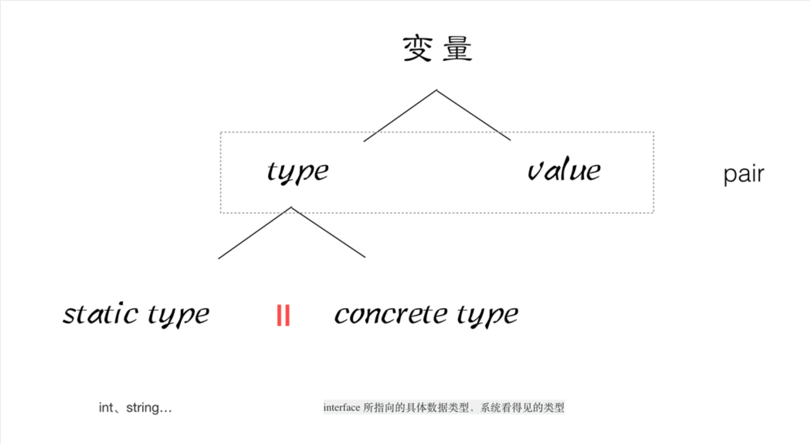
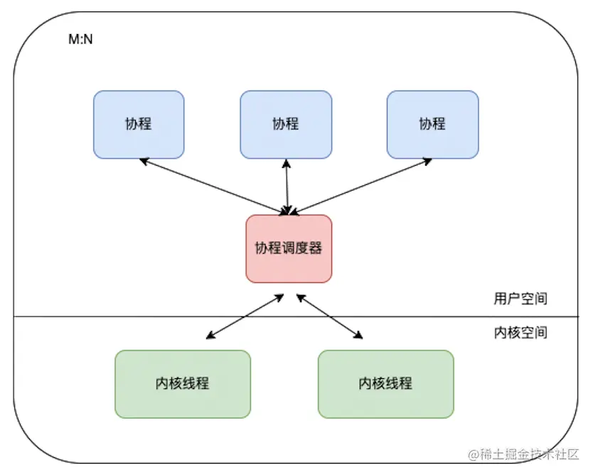
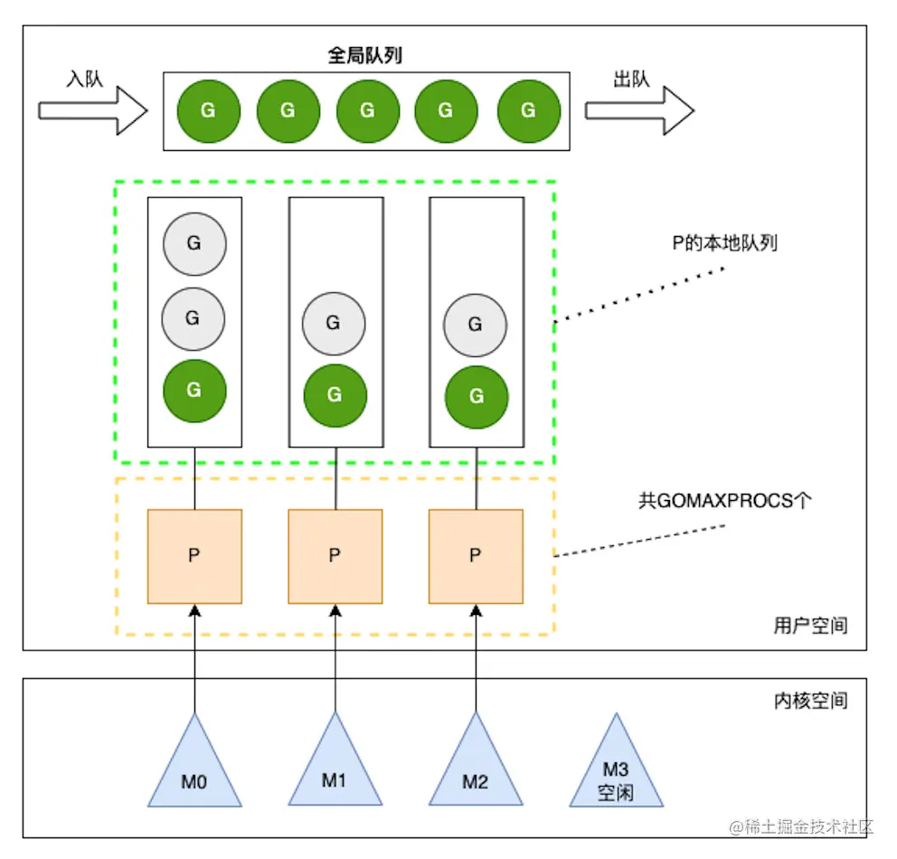
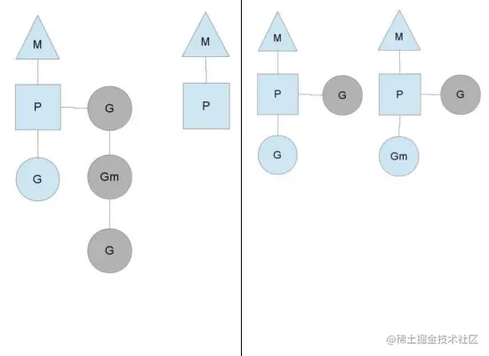
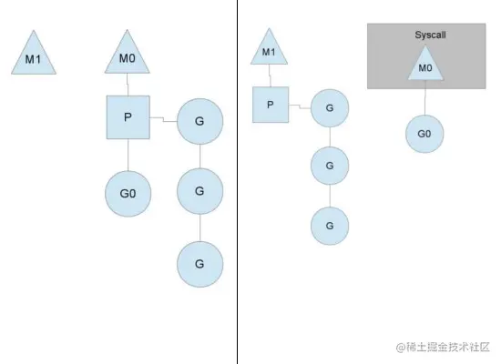

# Go简介

## 优点

- 简单的部署方式
  - 直接编译成机器码（编译速度快，启动运行时间快）
  - 不依赖其他库
  - 直接运行即可部署
    - java需要依赖其他的包，或者java的jdk
- 静态类型的语言
  - 编译的时候能给检查出来隐藏的大多数问题（如果是动态语言只能运行时才能判断有无异常）
- 语言层面的并发
  - go语言原生支持（使用协程）
  - 充分的利用多核
- 标准库丰富
  - runtime系统调度机制
  - 高效的GC垃圾回收
  - 丰富的标准库
- 简单易学
  - 只有25个关键字
  - C语言简洁，内部实际使用C语言实现
  - 面相对象继承（继承、多态、封装）
  - 跨平台支持

docker 和k8s 都使用go语言编写

## 缺点

- 包管理，大部分在github上，不安全，不稳定
- 无泛化类型
- 所有Exception 都用Error 来处理
- 对C的降级处理，并非无缝，没有C降级到asm那么完美（序列化问题）


# Go语言新奇


## hello world

- package main  只有main包才会引入该main

- golang的表达式中，加`;`和不加 都可以，建议不加

- 引包方式可合并

  - 原本引包 import "fmt"   import "time" 可改为

    ```go
    import (
    	"fmt"
    	"time"
    )
    ```

- 函数的{  必须与函数名在同一行，否则编译错误


## 循环

```go
for i := 1; i < size; i++ {
     
}
// 基础格式
for initialization; condition; post {
    // zero or more statements
}
// 三个字段都可以省略， 如果省略initialization 和 post，把分号也可以省略
for condition {
    // ...
}
// 去掉所有条件，是死循环
for {
    // ...
}
// 遍历数组，可以设置 index 和value
for index, value := range array {
    
}
```


## 变量

### 变量声明

**若声明了变量，未使用会抛出异常**


- 声明一个变量 默认值是0、可以初始化值、可以不指定变量类型，由值自动匹配当前变量的数据类型、可以省去var关键字字节自动匹配

  - ```go
    var a int
    var b int = 100
    var c = 200
    d := 300
    ```

- 声明全局变量只能使用方法一，二，三 不能省略 var，即 `:=`只能在方法体上声明

### 多变量声明

- 单行声明多变量

  - ```go
    var xx, yy int = 100,200
    var kk, ll = 100, "abc"
    ```

- 多行声明多变量

  - ```go
    var {
      xx int = 100
      yy int = 200
    }
    ```

    


## 常量

- 单个常量定义

```go
const length int = 10
```

- 多个常量定义 itoa  可以批量定义常量值

```go
const (
		a = iota    // itoa 默认每行递增   
  	b
  	c
  	d
)
// a = 0,b = 1, c = 2,d = 3
const (
		a,b = itoa+1,itoa*2    // itoa = 0   a = itoa+1, b = itoa * 2  a = 1 b = 0
  	c,d										 // itoa = 1   c = itoa+1, d = itoa * 2  c = 2 b = 2
  	e,f										 // itoa = 2   e = itoa+1, f = itoa * 2  e = 3 b = 4
)
```


## 函数

### 多返回值


- 支持多返回值

```go
func method(a string, b int) int {
  return 100
}

func method(a string, b int) (int, int) {
  return 100,200
}
```

- 多返回值支持设置变量名，**return 不必返回该变量, 但返回值会有默认值0**

```go
func method(a string, b int) (r1 int,r2 int) {
  r1,r2 = 100,200
  return
}
```


### init函数

每个包可以有init函数，运行main方法时

1. 运行main方法时，先引包 package1，如果有package1有引用的话，会再次引包
2. 引其他包完成后，先执行如执行当前包的init() 函数，才完成当前引包


### 匿名导包

```go
import (
 	 	_ "pack1"  // go不支持无效导包（即引包但是没调用该包内方法），添加下划线就可允许无调用的引包，方便执行初始化
  	p1 "pack2" // 可以对导的包设置别名，调用该包内的函数时，通过 p1.func即可
  	. "pack3"  // 可以直接调用pack3的函数，无需 pack3.func 这种，而是 func。容易与其他包混淆，不建议使用
)
```


## 指针

**go语言默认是值传递**，可以在函数入参 设置未指针传入  *p 是修改p地址的内容 &a 传入的是地址而非值

```go
func changeValue(p *int) {
  *p = 10
}

func main() {
  var a int = 1
  changeValue(&a)
}
```


## defer

**当前函数结束操作时需要执行的关键字， defer 命令行**

defer对应的Stack栈方式，defer x1 defer x2 结束操作时，先执行x2 后执行x1


## slice和map

### 数组

函数入参是数组，可指定数组长度，是值拷贝

```go
var array1 [10]int
var array2 [10]int := {1,2,3,4}
var array3 [4]int := {1,2,3,4}


func method(array [4]int) {
  // 只能传长度为4的数组，且是值传递，main函数创建的数组，调用该函数时，是传入的数组副本，修改数组内容不会影响main的数组，不建议使用
}
```

建议使用**slice** 切片，动态数组

```go
func method(array []int) {
  	// 不指定数组长度，就是地址传递，而非值传递
  for index, value := range array {
    
  }
  // 不关注 index 可以使用下划线 设置匿名变量
  for _, value := range array {
    
  }
}
```


- ### slice

  - 声明

  - ```go
    // 声明slice1 是切片，长度为3 默认值是1,2,3的数组
    slice1 := []int{1,2,3}
    
    // 声明slice2 是切片，长度为3 开辟长度为3的内存空间
    var slice2 []int   // 此时 slice2 = nil
    slice2 = make([]int, 3)
    
    // slice2 的另一种写法
    var slice3  []int = make([]int, 3)
    
    // 简略写法
    slice4 := make([]int, 3)
    ```

  - 切片的追加

    - 切片的长度和容量不同，长度表示实际使用数量，容量表示当前数组能够容纳容量

    - 切片的扩容机制，append，若数组容量超出容量，则将容量增加为2倍

      ```go
      slice1 := make([]int, 3)
      slice1.append(1) // 数组长度为4，容量为6
      ```

  - 切片的截取

    - 可以对原数组进行截取，但是实际指向的数组都是一个数组地址，即修改截取的数组内容，则两个数组内容都会改

    - ```go
      s := []int{1,2,3}
      
      s1 := s[0:2]
      s2 := s[:2]
      s3 := s[1:]
      ```

- ## map

  - 声明方式（三种方式都可）

    ```go
    // 方式一
    var map1 map[string]string
    make(map[string]string,10) // 如果map满了后也可以自动扩容
    // 方式二
    map2 := make(map[string]string) // 默认会赋予一定的容量
    // 方式三
    map3 := map[string]string {
      "1":"one",
      "2":"two"
    }
    ```

  - 使用

    ```go
    // 添加
    map1["1"]="one1"
    map1["2"]="two2"
    // 遍历
    for key,value := range map1 {
      xxxx
    }
    // 删除
    delete(map1,"1")
    ```

  - **注意map作为函数入参是值传递，即传入的是map的地址，而不是数组函数的副本，函数内修改数据外部会生效**


## 面向对象

### 封装

#### struct

结构体，类似对象

```go
type Book struct {
  title string
  auth string
}
func changeBook(book Book) {
  xxx
}
```

**函数调用传的是副本，而非对象本身**，因此使用它时需要设计为地址传递才可 *Book


#### 对象类的表示

```go
type Hero struct {
  Name string
  Ad string
  Level int
}
func (this *Hero) GetName string {
  return this.Name
}
// 注意函数传递是对象的副本，需要传地址进来
func (this *Hero) SetName(newName string) {
  this.Name = newName
}
```

- 类名首字母大写，表示其他包也能够访问
- 如果类的属性首字母大写，表示该属性是对外能够访问的，否则只能够内部访问
- 类的方法大写，表示该属性是对外能够访问的，否则只能够内部访问


### 继承


- 继承方式

  ```go
  type Human struct {
    xxxx
  }
  
  type SpuerMan struct {
    HuMan // 继承
    xxx
  }
  // 创建1
  sp1 := SpuerMan{Human{父类属性。。。}, 子类属性}
  // 创建2
  var sp2 SpuerMan
  sp2.属性1 = xxx
  sp2.属性2 = xxx
  ```

  

- 继承会继承父类的所有属性和方法

- 子类可以重写父类的方法


### 多态 （interface）

与java的多态概念类似，interface实际是一个指针

- 定义接口，直接重写接口的所有方法就实现了多态

  ```go
  type Animal interface {
    func1()
    func2()
  }
  
  type Cat struct {
    
  }
  // 直接重写接口的所有方法就可
  func (this *Cat) func1() {
    
  }
  func (this *Cat) func2() {
    
  }
  ```

- 所有的类都继承了一个空的interface{} 万能的数据类型 int、string、float32、float64、struct 都有继承

- **类型断言**：如果函数参数是interface类型，区分是否是执行类型  `value, ok := param.(string) ` ok是bool类型，value是对应类型值


## 反射

### 使用

变量内置pair结构type 和 value





- reflect.TypeOf 可以获取类信息包括 类型、属性、方法
- reflect.ValueOf 可以获取类值、各个属性值

### 标签

类似类属性的注释

```go
type resume struct {
  Name string `info:"name" doc:"名字"`
  Sex string `info:"sex"`
}
var re resume
// 可以通过反射获取
t := reflect.TypeOf(re).Elem
for i:=0 i< t.NumField();i++ {
  taginfo = t.Field(i).Tag.Get("info")
  tagdec = t.Field(i).Tag.Get("dec")
}
```

json序列化可以按标签设置为属性名，即key为Tag中json设置的key

```go
type Movie struct {
	Title string `json:"title"`
	Year string `json:"year"`
	Price int `json:"price"`
	Actors []string `json:"actors"`
}
// 序列化
jsonStr, err := json.Marshal(m)
// 反序列化
var m1 Movie
err = json.Unmarshal(jsonStr, &m1)
```


## goroutine

https://juejin.cn/post/7044741465930465311

协程，一个协程只占用内存几kb，

go的模型，go协程的调度，主要优化协程调度器提高CPU使用率。

大体模型：协程与内存线程的对应关系 M：N




### G-P-M模型

新的协程调度器引入了P(Processor)，成为了完善的GPM模型。Processor，它包含了运行goroutine的资源，如果线程想运行goroutine，必须先获取P，P中还包含了可运行的G队列。

go的并发数实际是调度器的个数



各个模块的作用

- 全局队列：存放等待运行的G
- P的本地队列：与全局队列类似，存放数量上限是256个，新建G时，G优先键入到P的本地队列中，如果队列满了，则会把本地队列中的一半G移动到全局队列
- P列表：所有的P都在程序启动时创建，保存在数组中，最多有GOMAXPROCS个，可通过runtime.GOMAXPROCS(N)修改，N表示设置个数
- M：表示内存线程，操作系统调度器负责把内核线程分配到CPU的核心上


### 调度器的设计策略

#### 复用线程

调度器核心思想是尽可能避免频繁的创建、销毁线程、对线程进行复用以提高效率

1. ### work stealing机制（窃取式）

   当本线程无G可运行时，可以从其他线程绑定的P队列中窃取G，而不是直接销毁线程

   

2. ### hand off机制

   当本线程M1因为G进行的系统调用阻塞时，线程释放掉已经绑定的P队列，并将P队列绑定到其他的调度器，原来的调度器M1执行完销毁

   


#### 利用并行

GOMAXPROCS 设置P的个数  =  CPU核数/2

提高系统的并行度，并且空闲部分CPU核数方便系统其他进程执行

#### 抢占

go使用的抢占方式，每个G是平等的，最多10ms的CPU执行时间，10ms后如果没有执行完，会被其他G抢占CPU


#### 全局G队列

P队列中G都已经执行完成后，会优先从其他P队列偷取G执行，如果偷取不到，会从全局G队列中获取G，获取过程涉及到加锁解锁。


### 使用goroutine

#### 创建协程

```go
func main() {
    // 创建一个协程，去执行当前函数
    go func(int a, int b) bool {
       xxxx
      return true
    }(1,2)
  	// 继续执行后续逻辑，类似并发执行
  	xxx
}
```

1. 若main是一个主go程，若main执行结束，则其他协程也结束
2. go协程的返回值无法直接获取，因为协程之间是并行执行的，无法直接得到并行执行的结果信息


#### 结束协程

```go
func main() {
    // 创建一个协程，去执行当前函数
    go func() {
       xxxx
       // 只能退出当前函数，若协程能调用了其他函数要退出，则需要下面的方式
       return

       func() {
       		// 结束当前协程
          runtime.Goexit()
       }()
    }()
}
```

## channel

管道，类似操作系统的管道，**协程之间通信通过channel进行通信**

channel有阻塞，读取channel值时，需要等管程赋值后才会执行后续逻辑

```go
//创建
c := make(chan Type)
c := make(chan Type, capacity)
//设置和读取
channel <- value //设置管道值Value到channel
<- channel				// 接收并丢弃
x := <-channel		// 从channel中接收数据 并赋值给x
x, ok := <-channel // x表示读取的值，ok 表示 检查通道是否已关闭
```


