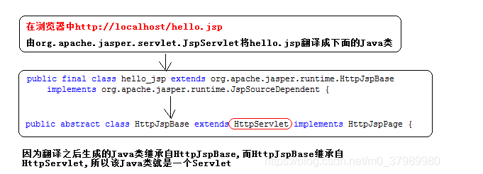

# 1，Html和CSS

看印象笔记

# 2，JavaScript

## 1,基本语法

**==在<script > </script>中的语法==**  

### 01变量

变量：五种基本数据类型

​	number，String，boolean，null，undefined

- 声明变量  var   弱能量

**因为是弱变量，所以可以连续赋不同类型的值**，若

- typeof 查看数据类型

若数据未赋值，则是undefined类型，若为null，则是object类型

### 02函数

函数方式：

- function 函数名(形参列表){函数体}
- var 函数名 = function(形参列表) { 函数体 }

**在js中方法的唯一标识就是方法名，在js中没有方法重载，调用方法的时候，参数是选传的**

### 03对象

**声明对象**

- var obj = new Object();
- var obj1 = {};

**声明对象中的属性**

- obj1.name = "baiji";
- var obj2 = {name:"sdf"};

**为对象添加方法**

-  obj1.work = function () { alert("努力工作");};
- var obj2 = {work:function () {obj1.work();}};

### 04事件

动态的为元素绑定事件

1，找到元素

2，为元素相应的事件属性赋值一个方法 onclick 


3,事件发生以后会自动调用

window.onload：游览器加载完成后整个页面的时候调用后面的方法


onsubmit事件可以阻止提交，

静态： 函数内return false，在表单form中，添加 onsubmit="return onsubmitFunc()"

动态：在函数内return false即可

DOM 模型（把文档中的标签，属性，文本，转换成为对象来管理。）万事万物皆对象

**查看教程**

在02JavaScript -> w3cschool菜鸟教程 新版本.chm 点击完整教程 ->JavaScript -> JavaScript RegExp 对象 -> RegExp 对象参考手册

==注：==

document对象的三个查询方法，

- 如果有id属性，优先使用getElementById方法进行查询
- 若没有id属性，则优先使用getElementByName方法进行查询
- 若id 属性和 name 属性都没有最后再按标签名查 getElementsByTagName

**所有的方法一定要在页面加载完成后执行，才能查询到标签对象，执行顺序也是自上而下的顺序**

**页面加载完成之后，会执行window.onload = function()方法，可以在此方法中调用一些需要在页面加载完成后，才能执行的代码，也可以调用按键button方法的方式**


### 05js加载位置

- 在head内部  **（建议使用该方式）**

```html
<head>
    <meta charset="UTF-8">
    <title>Title</title>

<script type="text/javascript">
    window.onload = function () {
        var btn = document.getElementById("btnId");
        btn.onclick = function () {
            alert("hello")
        }
    }
</script>
</head>
```

- 以文件形式存在

```html
<script type="text/javascript" src="test.js">

</script>
```

test.js文件为JavaScript文件

```js
window.onload = function () {
    var btn = document.getElementById("btnId");
    btn.onclick = function () {
        alert("hello")
    }
}
```

## 2，DOM

DOM 模型（把文档中的标签，属性，文本，转换成为对象来管理）**树形模型**


- **document对象**

document一个文档节点，代表整个文档

对象.innerText 获取节点内部的文本值

对象。innerHTML 获取节点内部的html代码


元素节点：html文档中的html标签及其内容

```html
<a href="#">连接</a>
```

属性节点： 元素的属性，即href为<a>的属性

文本节点：html中的文本内容

**所有结点有三个属性**

nodeName：节点名

nodeType：节点类型

nodeValue：节点值


节点与属性的结合：

​							nodeName        nodeType      nodeValue

元素节点		 	   标签名               1                         null 

属性节点				属性名			   2						属性值

文本节点				#text			 	3						文本内容

**例子** ，

获取#city的value属性值：

var city = document.getElementById(“city”);

alert(city.value);    

==节点可以直接通过 变量.属性名获取==

具体节点的调用

1. parentNode -属性  表示当前父亲节点
2. previousNode -属性  表示前一个节点
3. nextNode  - 属性表示下一个节点

parentNode: 获取父节点的属性
childNodes: 得到所有子节点,兼容性差
firstChild: 获取第一个子节点
lastChild: 获取最后一个子节点
nextSibling: 返回一个给定节点的下一个兄弟节点
previousSibling: 返回一个给定节点的上一个兄弟节点


# 3，JQuery

## 1，简介

### 1，导入

jQuery是辅助JavaScript开发的库

```html
<script type="text/javascript" src="../script/jquery-1.7.2.js"></script>
```

### 2，$

$本质为一个jQuery核心方法，等价于function（）{}

## 2，基本操作

- 事件绑定

$(“#btnId”).click(function(){

​	...

});

- 入口函数

$(function () {undefined
});
window.onload 和 

$(function) 区别
 window.onload只能定义一次,如果定义多次，后边的会将前边的覆盖掉

$​​​(function)可以定义多次的。

- Dom对象与jQuery对象的转换

jq--->dom        jq[索引]  若只有一个对象，则索引为0  jq[0]

dom---> jq     $(dom) 

## 3，选择器分类

### 1,基本选择器

**标签选择器**

​	$(“html标签名”)

**id选择器**

​	$(“#id的属性值”)

**类选择器**

​	$(“.class的属性值”)

**并集选择器**

​	$(“选择器1，选择器2.。。。。”)

**选择所有元素**

**$(“*”)**

```javascript
//1.选择 id 为 one 的元素 "background-color","#bbffaa"
				$(function () {
					$("#btn1").click(function () {
						$("#one").css("background-color","#bbffaa");
					});


				//2.选择 class 为 mini 的所有元素
					$("#btn2").click(function () {
						$(".mini").css("background-color","#bbffaa");
					});

				//3.选择 元素名是 div 的所有元素 
					$("#btn3").click(function () {
						$("div").css("background-color","#bbffaa");
					});

				//4.选择所有的元素 
					$("#btn4").click(function () {
						$("*").css("background-color","#bbffaa");
					});
				//5.选择所有的 span 元素和id为two的元素

					$("#btn5").click(function () {
						$("span,#two").css("background-color","#bbffaa");

					});
```

### 2,层级选择器

后代选择器

​	$(“A  B”)  选择A元素（祖先节点）内部的所有B元素（后代节点，包括儿子，孙子。。。）

子元素选择器

​	$(“A>B”)  选择A元素的所有 B子元素

相邻元素选择器

​	$(“A+B”) 选择A元素后面的一个B元素（同级关系）

通用兄弟选择器

​	$(“A ~ B”)  选择A元素后面的所有B元素

```javascript
$("#btn1").click(function(){
					$("body div").css("background", "#bbffaa");
				});

				//2.在 body 内, 选择div子元素  
				$("#btn2").click(function(){
					$("body > div").css("background", "#bbffaa");
				});

				//3.选择 id 为 one 的下一个 div 元素 
				$("#btn3").click(function(){
					$("#one + div").css("background", "#bbffaa");
				});

				//4.选择 id 为 two 的元素后面的所有 div 兄弟元素
				$("#btn4").click(function(){
					$("#two ~ div").css("background", "#bbffaa");
				});
```

### 3,基本过滤器

**首元素选择器**

​	:first 选择元素中的第一个元素

**尾元素选择器**

​	：last 选择最后一个元素

**非元素选择器**

​	：not（selector）不包括指定内容的元素

**等于索引选择器**

​	：eq（index）

**大于索引选择器**

​	：gt(index)

**小于索引选择器**

​	：lt（index）

**标题选择器**

​	：header

```javascript
//1.选择第一个 div 元素  
				$("#btn1").click(function(){
					$("div:first").css("background", "#bbffaa");
				});

				//2.选择最后一个 div 元素
				$("#btn2").click(function(){
					$("div:last").css("background", "#bbffaa");
				});

				//3.选择class不为 one 的所有 div 元素
				$("#btn3").click(function(){
					$("div:not(.one)").css("background", "#bbffaa");
				});

				//4.选择索引值为偶数的 div 元素
				$("#btn4").click(function(){
					$("div:even").css("background", "#bbffaa");
				});

				//5.选择索引值为奇数的 div 元素
				$("#btn5").click(function(){
					$("div:odd").css("background", "#bbffaa");
				});

				//6.选择索引值为大于 3 的 div 元素
				$("#btn6").click(function(){
					$("div:gt(3)").css("background", "#bbffaa");
				});

				//7.选择索引值为等于 3 的 div 元素
				$("#btn7").click(function(){
					$("div:eq(3)").css("background", "#bbffaa");
				});

				//8.选择索引值为小于 3 的 div 元素
				$("#btn8").click(function(){
					$("div:lt(3)").css("background", "#bbffaa");
				});

				//9.选择所有的标题元素
				$("#btn9").click(function(){
					$("*:header").css("background", "#bbffaa");
				});

				//10.选择当前正在执行动画的所有元素
				$("#btn10").click(function(){
					$(":animated").css("background", "#bbffaa");
				});
				$("#btn11").click(function(){
					$("div:not(:animated):last").css("background", "#bbffaa");
				});
```

### 4,属性选择器

- [attribute]    包含该属性的选择器
- [attribute=value]  该属性值为value的选择器
- [attribute!=value]  属性值不为value，或者没有该属性的选择器
- [attribute^=value] 属性值以value开头
- [attribute$=value] 属性值以value结尾
- [attribute*=value] 属性值包含value
-    [] []

**5,表单对象选择器**

**可用元素选择器**

​	$(“:enanled”)   获取可用元素

**不可用选择器**

$(“:disabled”)  获取不可用元素

**选中选择器**

  	$(“:checked”) 获取单选/复选框中的元素

**选中选择器**

$(“:selected”)   获取下拉框选中的元素

# 4,TomCat&Http

### 1,Tomcat

- Web服务器的作用是接收客户端的请求，给客户端作出响应。

- 对于JavaWeb程序而已，还需要有JSP/Servlet容器，JSP/Servlet容器的基本功能是把动态资源转换成静态资源，当然JSP/Servlet容器不只这些功能.

- 常见的Web服务器：
  web服务器软件中,可以部署web项目,让用户通过浏览器来访问这些项目

**tomcat服务器的目录结构**

bin：包含tomcat启动命令，停止tomcat命令等批处理操作，可执行文件

conf：包含tomcat的配置文件

lib：tomcat运行依赖的jar包

logs：运行日志

temp：tomcat存取临时文件的文件夹

webapps：

- 里面集合了所有的web项目，即所有网页端的操作均在此文件夹内
- tomcat默认启动root目录下的index文件夹
- 自己编写的web也放在此目录下
- 访问一个web项目，默认都展示index页面

work：

​	work保存的tomcat运行时编译好的一些文件

### 2,Http

#### 1，简介

Http:客户端游览器与web服务器之间的交互过程遵循的规则

它是TCP/IP协议之上的一个应用层协议，用于定义WEB浏览器与WEB服务器之间交换数据的过程以及数据本身的格式。

#### 2,请求报文

- 请求行

  包含了请求方法，请求资源路径，http协议版本

  - `GET /MJServer/resources/images/1.jpg HTTP/1.1`

- 多个请求头

  包含了对客户端的环境描述，客户端请求的主机地址等信息

  - **Accept：游览器可接受的MIME类型，MIME表示文件内容的类型**
  - Accept-Charset：告知服务器，客户端支持哪种字符集
  - Accept-Encoding：浏览器能够进行解码的数据编码方式
  - Accept-Language：浏览器支持的语言。
  - Referer：当前页面由哪个页面访问过来的。
  - **Content-Type：通知服务器，请求正文的MIME类型**
  - Content-Length：请求正文的长度
  - If-Modified-Since:通知服务器，缓存的文件的最后修改时间。
  - **User-Agent：通知服务器，游览器类型**
  - Connection:表示是否需要持久连接。如果服务器看到这里的值为“Keep -Alive”，或者看到请求使用的是HTTP 1.1（HTTP 1.1默认进行持久连接)
  - **Cookie：与会话有关的请求头信息**

#### 3,响应报文

客户端给服务器发送请求后，服务器做出的响应，返回数据给客户端。

- 状态行

  包含了Http协议版本，状态码，状态英文名称

  HTTP/1.1 200 OK

- 多个响应头

  包含了对服务器的描述，对返回数据的描述

  - Location：制定转发的地址。需与302/307响应码一同使用

  - **Server：告知客户端使用的容器类型**
  - Content-Encoding：告知客户端服务器发送的数据所采用的压缩格式
  - **Content-Length：告知客户端正文长度**
  - **Content-Type：告知客户端正文的MIME类型**
  - Refresh：定期刷新。还可以刷新到其他资源
    Refresh:3;URL=otherurl
    3秒后刷新到otherurl这个页面
  - Content-Disposition：指示客户端以下载的方式保存文件。
    Content-Disposition：attachment;filename=2.jpg
  - Expires：网页的有效时间。单位是毫秒(等于-1时表示页面立即过期)
    Cache-Control：no-cache
    Pragma：no-cache
    控制客户端不要缓存
  - Set-Cookie:SS=Q0=5Lb_nQ; path=/search服务器端发送的Cookie（会话有关）
    

常见状态响应码：

​	200： 请求成功

​	400： 客户端请求的语法错误，服务器无法解析 

​	404：服务器未找到该资源

​	500：服务器内部错误无法完成请求

**以2开头的信息，代表请求成功**

**以3开头的信息，代表重定向**

**4开头的信息，代表请求失败**

**5开头的信息，代表服务器内部出现错误**

# 5，Servlet

## 1,**简介**

Servlet是运行在服务器上的小程序，Servlet是JavaWeb的三大组件之一，主要作用是处理请求，服务器会把收到的请求交给Servlet来处理

**步骤**

- 实现Servlet类

servlet包括：

1. 实现servlet接口

1. 继承httpservlet类

service方法处理请求

- 在web.xml文件中配置

```xml
  <servlet>
    <servlet-name>myservlet</servlet-name>
    <servlet-class>servlet.MyServlet</servlet-class>
  </servlet>
  <servlet-mapping>
    <servlet-name>myservlet</servlet-name>
    <url-pattern>/hello</url-pattern>
  </servlet-mapping>
```

## 2,具体流程：


**流程：**

http://localhost:8080/03_tomcat_war/hello:

1. http：表示协议，localhost：表示服务器ip，其后是工程路径，再然后是资源路径
2. 客户端发送请求，运行的符合ip和端口的服务器接收。
3. 接收过程中，通过xml配置的servlet-mapping中的url，判断是否为该接收的地址，若是，则通过servlet-name与配置的servlet的servlet-name进行对应
4. 再通过servlet-name，找到servlet的运行类。
5. 通过运行类，找到该类的执行方法

## 3，Servlet的生命周期

- void init(ServletConfig servletConfig)初始化方法

1. 若有构造器，会先调用 构造器
2. servlet被创建时会先执行init方法，只执行一次
3. **默认情况下，第一次被访问时才创建对象，以后不创建对象**
4. 因为init()方法只执行一次，所以servlet在内存中只有一个对象，servlet为单例，多个用户同时访问时，是多线程处理请求，所以可能存在线程安全问题


- void service (ServletRequest servletRequest, ServletResponse servletResponse)方法
  真正处理请求的方法，每次访问servlet，都会被访问
- void destroy()销毁方法

1. servlet被销毁时执行，服务器关闭时，servlet被销毁


servlet类由我们编写，但对象由服务器创建，并且由服务器来调用方法

## 4，ServletConfig类

### 1，**ServletConfig的作用：**

一个ServletConfig类对应一段web.xml配置的servlet信息，即我们配置的servlet信息会被Tomcat解析后，将配置信息的数据保存在servletConfig类中，所以==一个servletConfig类值对应一段servlet信息==。


### 2，ServletConfig的方法

- String getServletName(): 获取＜servlet-name＞的内容
- **servletContext   getServletContext()：获取servlet上下文对象**
- String getInitParameter(String name): 通过名称获取指定初始化参数的值
- Enumeration getInitParameterNames(): 获取所有初始化参数的名称

```xml
<servlet>
    <servlet-name>myservlet</servlet-name>
    <servlet-class>servlet.MyServlet</servlet-class>
    <init-param>
      <param-name>user</param-name>
      <param-value>wyy</param-value>
    </init-param>
  </servlet>
```

可以通过getInitParameter获取该初始化值

## 5，ServletContext类


### 2，获取ServletContext方法

- 直接调用ServletConfig中的getServletContext();
- `request对象`.getServletContext();

### 3，ServletContext常用功能

#### 多个servlet之间共享数据

- **setAttribute（String name,Object object） 向ServletContext中存数据**
- **getAttribute（String name）     	向ServletContext获取数据**
- **removeAttribute（String name）  从ServletContext移除数据**

#### 获取当前web项目中的指定资源

- **getRealPath(String str)获取资源绝对路径**

- getResourceAsStream(String str)`获取资源输入流对象
  参数 : str 与 getRealPath()的参数一致
  返回值 : 输入流对象, 用来直接读取文件.

#### 获取应用初始化参数

servletContext.getInitParameter()

获取，xml问价的init-param

```xml
<servlet>
    <servlet-name>myservlet</servlet-name>
    <servlet-class>servlet.MyServlet</servlet-class>
    <init-param>
      <param-name>user</param-name>
      <param-value>wyy</param-value>
    </init-param>
  </servlet>
```

## 6，HttpServlet

### 1，简介


- 实现servlet接口来实现功能，会重复编码过多，需要重构代码，消除重复
- 因此有实现类GenericServlet ，自定义重复代码。减少代码冗余

Httpservlet：专门处理http协议的servlet。只用实现请求方式的方法

### 2，Request

#### 1，**请求流程**

客户端游览器，发送请求消息

**服务器端**

1. Tomcat服务器会根据请求url中的资源路径，创建对应的servlet对象
2. Tomcat服务器，同时会创建request和response对象，request对象中封装请求的消息数据
3. Tomcat将request和response两个对象传递给service方法，并且调用service方法
4. servlet方法通过request对象获取请求消息数据，通过设置response对象设置响应消息数据
5. 服务器拿到response对象中设置的响应消息数据没发给游览器。

#### 2，常用方法

- String getMethod(): 返回请求方式(GET/POST)
- String getRequestURI():返回请求行中资源名字部分: 如/test/index.html
- StringBuffer getRequestURL():返回浏览器地址栏的内容
- String getContextPath():获取上下文路径(虚拟目录),<Context path=“上下文” …/>
- String getRemoteAddr():返回请求服务器的客户端的IP地址
- String getHeader(String headName):根据指定的请求头获取对应的请求头的值.

**获取请求参数的方法**

- **String getParameter(String name):根据参数名称,获取对应参数的值.**
- **String[] getParameterValues(String name):根据参数名称,获取该参数的多个值.**

#### ,3，请求转发

**请求转发，是服务器内部的资源跳转方法**

与重定向不同，重定向是将返回新的请求地址，客户端收到后，由客户端重新发送请求，实现跳转


```Java
req.getRequestDispatcher("请求地址").forward(req,resp);   //请求地址需要以'/'开头
```

**步骤：**

1. 首先通过request获取请求转发器，
2. 通过RequestDispatcher对象进行转发

**特点：**

- 游览器地址栏路径不发生变化
- 只能转发到当前服务器内部资源
- 转发只能转发一次请求

### 3，response

- OutputStream getOutputStream():获取字节输出流对象. :文件下载
- Writer getWriter():获取字符输出流对象 :输出内容

#### 重定向

是一种资源跳转的方法


```Java
resp.sendRedirect("新的请求地址"); //新的请求地址 不以'/'开头
```

- 重定向的特点：redirect
  - 游览器的地址栏发生变化
  - 重定向可以访问其他站点（服务器）的资源
  - 重定向是两次请求，不能使用request对象来共享数据
- 转发的特点：forward
  - 转发过程中客户端游览器地址栏不发生变化
  - 转发只能访问当前服务器下的资源
  - 转发是一次请求，可以通过request来共享数据


```xml
相对路径：通过相对路径不可以确定唯一资源
* 如：./index.html
* 不以/开头，以.开头路径
规则：找到当前资源和目标资源之间的相对位置关系
* ./：当前目录
* …/:后退一级目录
2. 绝对路径：通过绝对路径可以确定唯一资源
* 如：http://localhost/day15/responseDemo2
/day15/responseDemo2
* 以/开头的路径
规则：判断定义的路径是给谁用的？判断请求将来从哪儿发出
* 给客户端浏览器使用：需要加虚拟目录(项目的访问路径)
* 建议虚拟目录动态获取：request.getContextPath()
* ＜a＞ , ＜form＞ 重定向…
* 给服务器使用：不需要加虚拟目录
* 转发路径
```

## 7，响应乱码问题

- **响应乱码**

在页面显示返回值中，中文出现乱码

因为，在servlet中，我们操作的是utf-8的编辑格式，而返回值到页面后，客户端游览器不知晓字符集格式，所以需要在请求头中设置

```java
response.setContentType("text/html;charset=utf-8");
PrintWriter writer = response.getWriter();
writer.write("你好");
```

- doPost乱码

post请求中的参数放在请求体中，字符编码集不是utf-8，需要自己设置

```java
request.setCharacterEncoding("utf-8");
```

**需要在获取内容之前，设置字符集格式**

- doGet乱码

get请求的参数放在url中，url的解析是tomcat完成的，需要在tomcat内部，修改uriencoding=“utf-8”

## 8，项目路径问题

一般都选择绝对路径，相对路径容易出错

**绝对路径**

以 “/” 开头的路径，代表绝对路径 

- **转发的** 绝对路径  表示从项目的根目录开始  ，即http://localhost:8080/04_servlet_war_exploded     对应文件夹 webapp目录，可以选择该目录下的内容

**绝对路径都是以项目的根目录开始，即模块名开始，若是网页的绝对路径，则是以服务器根目录开始**

- **重定向**的绝对路径是以tomcat的根目录-服务器的根开始。即http://localhost:8080    对应的project目录，需要首先选择model     04_servlet_war_exploded

在重定向，需要加入项目名，由于项目名可能发生变化

因此：request.getContextPath()获取当前文件所在路径。 request.getContextPath() 即  /04_servlet_war_exploded   （前面有‘/’，后面没’/‘）

改为

```Java
response.sendRedirect(request.getContextPath()+"/login.html");
```

- **base标签**

**页面的相对路径，相对的路径不以当前页面所在位置为基准。以设置的base标签为基准**

```html
<base href="http://localhost:8080/04_servlet_war_exploded/">
```

## 9，servlet常用方法

常规：创建servlet类，实现httpservlet方法。可直接编写doget，dopost方法。

但可以创建baseservlet类，类实现httpservlet，并且通过反射，调用同名的方法，传入参数request和response。

因此所有servlet继承baseServlet类，并只用编写方法即可。省略了doGet和doPOST方法。只要传入baseServlet的方法名与所有servlet内的方法名一致即可

# 6，jsp

## 1，动态页面

servlet动态页面 = Java代码(主) + html代码(辅): (在Servlet中编写html代码)

**Servlet擅长的事情:**

1. 接受请求参数,封装成对象.
2. 调用业务方法,来处理请求.
3. 控制界面跳转,跳转到某一个JSP负责做界面的输出操作.

JSP动态网页 = Java代码(辅) + html代码(主): (在html中编写java代码)

**Servlet不擅长做页面输出,JSP最擅长做页面输出!**
**责任分离思想:**各自做各自最擅长的事情.


**Servlet仅适合处理业务逻辑，在页面输出方面并不适合，所以出现jsp进行页面输出**

## 2，jsp原理

jsp翻译过来就是 Java动态页面

**jsp的本质是 servlet，处理jsp结尾的请求**


**游览器发送jsp请求，因为tomcat的设定，所有以`.jsp`结尾的请求，都交由jspServlet处理。该servlet处理完成后，翻译为 文件名__.java  。再编译后，为 文件名_’_jsp.class，在下一次发送该jsp请求时，会直接读取已经生成好的class文件，不必再进行转换**



## 3，JSP的基本语法

### **脚本表达式**

作用：输出数据在页面上

<%= 表达式%>   (实际上就是调用输出流方法打印到页面上) out.print(表达式);

不能加分号`;`

### 脚本片段 

 **(实际开发中，应做到JSP中不能出现一行Java脚本片段)**

作用：书写Java代码逻辑，但是不能写方法

<% 

​	语句1;

​	语句2;

%>

### jsp声明

作用：定义类的成员，可以定义方法和属性变量

语法

<%!  

​	java语言

%>

## 4，jsp三大指令

### 1，page指令

<%@ page contentType="text/html;charset=UTF-8" language="java" %>

page指令：表示jsp页面相关的配置信息

常见属性：

- language: 表示在JSP中编写的脚本的语言.(只能是java)
- contentType: 表示JSP输出的MIME类型和编码.等价于 
- response.setContentType(“text/html;charset=utf-8”);
- pageEncoding: 表示JSP输出的编码;等价于response.setCharacterEncoding(“utf-8”);
- import: 用于导入JSP脚本中使用到的类,等价于Java代码中的: import 类的全限定名;
  注意：一个import属性可以导入多个包，用逗号分隔。
- errorPage: 指示当前页面出错后转向（转发）的页面。目标页面如果以"/"（当前应用）就是绝对路径。

### 2，include(包含)指令

引入jsp页面代码，插入指定位置

- **静态包含**

使用jsp的include指令

<% @include file="被包含的页面文件" %>

特点：在翻译阶段就已经把多个jsp合并在一起，最终翻译成一个Java文件，在Java文件再编译成class文件，进行运行输出

- **动态包含**

<jsp: include page="被包含的页面文件" />

特点：把每一个jsp都翻译成servlet类，在运行期间，动态的合并在一起，最终得到多个Java文件

- **动态包含和静态包含的选择:**
  如果在包含的时候,需要传递数据,此时只能使用动态包含.(
  如果被包含的页面如果是静态页面,那么使用静态包含
  如果被包含的如果是动态页面,那么使用动态包含

## 5，jsp九大隐含对象

在jsp中不需要声明和定义，可以直接使用的对象


九大内置对象

request：  								 请求对象

response：                     			响应对象

session：									 对话对象

application： 						     当前web应用对象

pageContext：						   当前的jsp作用域对象

exception：								异常对象

config：									  当前jsp对应的Servlet配置对象

out ：										  字符输出流对象

page： 									    当前servlet对象 与 this相同


## 6，四大作用域对象

pageContext：   当前jsp作用域，即当前页面有效

request：   		当前请求的作用域     当前请求有效，即当前页面，转发以及重定向有效

session：			当前会话的作用域    当前会话，未关闭游览器即有效

application：	 当前web应用的作用域  当前服务器运行期间有效

# 7，el

新建jsp文件，el表达式失效，需添加 

```jsp
<%@page isELIgnored="false" %>
```

## 1，简介

el表达式替代jsp表达式，替代jsp页面的输出脚本的编写

el表达式的格式：

​		 `${el表达式内容}`替代 <%  %>

## 2，从域对象中查找指定的数据

**域对象**

| 域对象      | EL中对应的对象   |
| ----------- | ---------------- |
| pageContext | pageScope        |
| request     | requestScope     |
| session     | sessionScope     |
| application | applicationScope |

**使用格式：**

**${xxxxScope.keyName}**

**${xxxxScope[“keyName”]}**

**可以简化为 ${keyName}**

**若通过${keyName}获取值，key相同，则按域会从小到大的顺序获取信息，获取到则不再向后查找**

获取Bean对象属性

${域名称.键名.属性名}

获取List集合对象

${域名称.键名[索引]}

## 3,EL表达式的运算

${运算表达式}

关系运算  

- == 或 eq
- ！=或ne
- < 或 lt
- '> '  或gt
- <= 或le
- '>=' 或ge

逻辑运算

- &&  或 and
- ||或or
- ！或not

算数运算    加减乘除

**empty运算符**

empty可以判断一个对象是否为空，返回boolean值

对象为 null

“”   空字符串

数组长度为0

空的集合

空的map    **都返回true**

# 8，JSTL

## 1,简介

- JSTL标签库 全称是指 JSP Standard Tag Library JSP标准标签库。是一个不断完善的开放源代码的JSP标签库。
- EL表达式主要是为了替换jsp中的表达式脚本，而标签库则是为了替换代码脚本。这样使得整个jsp页面变得更佳简洁。

1. 引入taglib包

   ```
   taglibs-standard-impl-1.2.1.jar
   taglibs-standard-spec-1.2.1.jar
   ```

2. 在jsp页面首行加入代码

   ```jsp
   <%@taglib prefix="c" uri="http://java.sun.com/jsp/jstl/core" %>
   ```

## 核心标签库：

### 1，if标签

```
<c:if test="${id>15}" scope="page" var="flag">
```

判断表达式的值，若表达式的值为true，则执行主体内容

属性：

​	test：判断条件

​	scope：存储条件判断结果的作用域

​	var：存贮条件判断结果的key，方便再次判断时，直接获取value，不必再次判断

### 2，choose、when、otherwise标签

与switch相似  switch，case，default

只有when有一个test属性

```jsp
<c:choose>
    <c:when test="${id>15}">
        <h1>${id}1</h1>
    </c:when>
    <c:when test="${id>13}">
        <h1>${id}2</h1>
    </c:when>
    <c:when test="${id>10}">
        <h1>${id}3</h1>
    </c:when>
    <c:otherwise>
        <h1>太小了</h1>
    </c:otherwise>
</c:choose>
```

### 3，foreach标签

循环遍历，与Java中的for循环相同

**循环数字：**

```jsp
<c:forEach begin="0" end="10" var="num" step="1">
    ${num}<br>
</c:forEach>
```

循环map或者list

```jsp
<c:forEach var="list" items="${obj}" varStatus="status">
	${list}
</c:forEach>
```

属性：

test： 判断条件

items：要被循环的数组

begin/end：起始/终止位置

step：步长

var：循环当前条目的变量名称  等价于 for中的i

varStatus 代表当前循环的状态  可以查看当前索引

- begin 获取begin属性里的值
- end 获取end属性里的值
- count 获取当前遍历的个数
- index 获取当前索引值
- first 获取是否是第一个元素
- last 获取是否是最后一个元素
- current 获取当前遍历的元素对象

# 9，Cookie&Session

## Cookie

### 1，简介

Cookie是客户端技术,程序把每个用户的数据以cookie的形式写给用户的各自的浏览器.当用户使用浏览器去访问服务器中的web资源时,以后每次请求都将之前保存的共享数据发送到服务器.

### 2，作用

实现会话追踪

### 3，实现


在对cookie操作后，要进行response.addCookie(cookie);发送给游览器保存cookie

**流程：**首先客户端填写用户名，密码请求登录服务器，服务器接收到请求参数后将它们保存到Cookie，通过response.addCookie(c)返回给客户端。下次客户端请求的时候，就直接携带请求头中的cookie内容登录   （恢复会话）

###  4,唯一性

**修改Cookie**  

一般都通过创建新的cookie，替代旧的cookie

### 5，生命周期

- 会话cookie，关闭游览器之后，cookie就销毁

- **设置Cookie的最大存活时间:** `cookie.setMaxAge(int seconds);`
  seconds = 0: 删除Cookie;
  seconds < 0: 会话Cookie
  seconds > 0: 存储指定的秒数.


Cookie 中的key和value不支持中文


### 6，Cookie路径

Cookie在创建的时候，根据当前servlet的相对位置来设置自己的路径

只有 访问当前路径以及下面的资源的时候，才会创建Cookie。即Cookie的存在只有在

**设置地址，进行过滤，只有地址符合设置的地址，才能发送cookie**

设置Cookie的路径
`void setPath(String uri)`
`cookie.setPath("/项目名称");`表示当前应用中的所有的资源都能够共享该Cookie信息
为什么要设置路径,当访问某些页面时,不希望携带cookie.此时就可以设置cookie的携带路径.

## Session

### 1，简介


**cookie在客户端，session在服务器端**


首先客户端登录账号密码访问服务器，服务器收到请求后获取参数内容，创建session，并取得sessionID，将sessionID创建cookie`Cookie c = new Cookie("JSESSIONID", sessionid` ,然后发给客户端，客户端获取sessionid，并存放在游览器，客户端再次请求服务器时，会携带带有sessionID的cookie，服务器根据sessionID获取session对象，并在该session中恢复对话，获取共享数据

### 2，操作

Session的操作
跳转到目录

#### 一、 获取Session对象

request.getSession(true): 获取Session对象,如果没有Session对象,直接创建一个新的返回,缺省值
request.getSession(false): 获取Session对象,如果没有返回null
request.getSession(): 和参数为true的一样

session.isNew();  判断该session是否为新创建的对象

#### 二、 设置共享数据

往Session中存储数据
session.setAttribute(String name, Object value);
从Session中取出数据
Object value = session.getAttribute(String key);

#### **三、 删除Session(用户注销登录)**

1. 删除Session中指定属性名的值.
   `session.removeAttribute("currentName");`
2. 销毁Session对象(Session中所有属性都不存在了)
   `session.invalidate();`

#### **四、 Session的超时管理**

超时:在访问当前的资源的过程中,不和网页进行任何的交互,超过设定的时间就是超时.超时后就会销毁Session
`void setMaxInactiveInterval(int interval)`
在服务器中有默认的配置为30分钟,通常不需要去修改

### 3，URL重写

**若游览器禁用cookie，则sessionid不能在游览器保存，因此需要手动拼接sessionid**

<c:url value="s.jsp"></c:url>   

若禁用cookie，会生成    “地址;jssessionid=xxxxxxxxxxxxxxxx”  可以恢复会话

### 4，session持久化处理

**关闭游览器，由于cookie丢失，则无法找到session，**

可以在请求中，设置cookie，并设置cookie失效时间，这样可以在关闭游览器后，cookie继续存在。直到时间过期

```java
        HttpSession session = request.getSession();
        String id = (String)session.getAttribute("JSESSIONID");
        Cookie cookie = new Cookie("JSESSIONID", id);
        cookie.setMaxAge(60*60);
        response.addCookie(cookie);
        response.getWriter().write("设置完成");
```

### Session的细节


- 一般的,我们存储到Session中的属性名称,要唯一,起名规范XXX_IN_SESSION
  session.setAttribute("USER_IN_SESSION","ZYGui");
- 若需要把多个数据存放到Session中,就要调用setAttribute方法N次,一般将存储的数据封装成一个对象,然后存储到Session中.把用户的信息,封装到user对象.
  session.setAttribute(“USER_IN_SESSION”, user对象);
- 如果多台服务器需要共享Session,此时Session中的对象,必须实现java.io.Serializable(才能在网络上传输)
  序列化: 把对象信息存储为二进制.
  反序列化: 把二进制信息恢复成对象.

# 10，Filter&Listener

## Filter

### 1，简介

**过滤器**：具有过滤/拦截功能

**应用：**

1. filter可以拦截请求（request），可以修改请求头，请求内容
2. filter可以拦截来自服务器端的相应（response）,可以修改响应头和响应内容
3. 放行请求

### 2，Filter的使用

1. 定义类实现javax.servlet.Filter，并覆盖该接口方法
2. 在doFilter方法编写处理过滤请求
3. 在web.xml，配置Filter

```xml
<filter>
      <filter-name>ABC</filter-name>
      <filter-class>Filter的全限定名称</filter-class>
</filter>
<filter-mapping>
      <filter-name>ABC</filter-name>              
   	  <url-pattern>/资源名</url-pattern>
</filter-mapping>
```

或者配置注解

```Java
@WebFilter(value = "/hello.jsp",dispatcherTypes = DispatcherType.REQUEST)
```

### 3，生命周期及流程

`init`服务器启动时，调用

`doFilter`每次请求对配置资源，则调用此方法

`destory`服务器停止时调用

### 4，拦截路径配置（拦截优先级，自上而下）

**拦截器优先选择精确拦截**

- 具体资源路径配置：/index.jsp  只有访问index.jsp资源时，过滤器才会被执行
- 拦截目录：/user/*  访问   项目根目录/user  下的所有资源时，过滤器才会被执行
- 后缀名拦截：*.jsp  访问所有后缀名为.jsp的资源时，过滤器就会执行
- 拦截所有资源 /*  访问任何资源，过滤器都会执行

### 5，乱码问题

在过滤器请求过程中，一直都是同一个request和response，过滤器仅仅是对其进行加工。即：filter可以共享request对象

### 6，FilterConfig 类

**init方法的形参**  ：FilterConfig

FilterConfig 类的作用是获取 filter 过滤器的配置内容

1、获取 Filter 的名称 filter-name 的内容

2、获取在 Filter 中配置的 init-param 初始化参数

3、获取 ServletContext 对象

### 7，Filter链


### 8，dispatcher配置

配置filter拦截属性，即拦截什么资源，request请求资源，include 动态包含资源  forWord 转发资源

（设置配置文件的 dispatcherTypes 属性）

`REQUEST`：默认值，浏览器直接请求资源
`FORWARD`：转发访问资源
INCLUDE：包含访问资源
ERROR：错误跳转资源
ASYNC：异步访问资源

**可以用注解**

```Java
@WebFilter(value = "/orderClientController",dispatcherTypes = {DispatcherType.FORWARD,DispatcherType.REQUEST})
```

## Listenter

### 1，简介

Web中的一个组件/程序,类似于Servlet/Filter;监听器就是监听某个对象的的状态变化的组件 监听器的相关概念.


**事件源：**被监听的对象 ----- 主要三个域对象 `request session servletContext`
**监听器：**监听事件源对象 事件源对象的状态的变化都会触发监听器
**响应行为：**监听器监听到事件源的状态变化时 所涉及的功能代码


### 2，八大监听器（接口）


### 3，生命周期监听器：

ServletReuestListener: 监听请求对象的创建和销毁.
HttpSessionListener: 监听会话对象(session)的创建和销毁.
ServletContextListener: 监听应用的创建和销毁.


request的生命周期为一次请求

session为一个游览器，或者时间到期

servletContext生命周期为web应用


### 4，属性周期监听器

二、监听作用域对象的属性的添加/删除/替换

ServletReuestAttributeListener: 监听request作用域中属性的添加/删除/替换
HttpSessionAttributeListener: 监听session作用域中属性的添加/删除/替换
ServletContextAttributeListener: 监听application作用域中属性的添加/删除/替换


可以查看修改的内容，值得注意的是，在替换中，获取的值为替换前的值，但可以先获取request，再获取新的值。

例子：

```Java
@WebListener
public class RequestAttributeListenter implements ServletRequestAttributeListener {
    @Override
    public void attributeAdded(ServletRequestAttributeEvent servletRequestAttributeEvent) {
        String name = servletRequestAttributeEvent.getName();
        System.out.println("增加"+name+"--->"+servletRequestAttributeEvent.getValue());
    }

    @Override
    public void attributeRemoved(ServletRequestAttributeEvent servletRequestAttributeEvent) {
        System.out.println("移除");
        String name = servletRequestAttributeEvent.getName();
        System.out.println("移除"+name+"--->"+servletRequestAttributeEvent.getValue());
    }

    @Override
    public void attributeReplaced(ServletRequestAttributeEvent servletRequestAttributeEvent) {
        System.out.println("替换");
        String name = servletRequestAttributeEvent.getName();
        ServletRequest servletRequest = servletRequestAttributeEvent.getServletRequest();
        Object attribute = servletRequest.getAttribute(name);
        System.out.println("替换"+name+"--->"+servletRequestAttributeEvent.getValue()+"----------------"+attribute);
    }
}
```


### **步骤**

**创建类，实现接口。**

**配置**：配置可以在xml文件配置

```xml
<listener>
  <listener-class>ApplicationLifeListenter</listener-class>
</listener>
```

或者使用注解

```Java
@WebListener()
public class RequestListenter implements ServletRequestListener {
    @Override
    public void requestDestroyed(ServletRequestEvent servletRequestEvent) {
        System.out.println("request销毁");
    }

    @Override
    public void requestInitialized(ServletRequestEvent servletRequestEvent) {
        System.out.println("request初始化");

    }
}
```

**注意:** `Listener没有自己的初始化参数. Listener如果需要使用初始化参数,只能使用全局的初始化参数.<context-param>`


# 11，json

## 1，简介

JSON(JavaScript Object Notation) 是一种轻量级的数据交换格式。JSON采用完全独立于语言的文本格式，就是说不同的编程语言JSON数据是一致的。

## 2，JSON对象

json数据本质为键值对，key必须是字符串。数据用逗号分隔，用大括号保存对象，中括号保存数组

var 变量名 = {
		“key” : value , 		// Number类型
		“key2” : “value” , 		// 字符串类型
		“key3” : [] , 			// 数组类型
		“key4” : {}, 			// json 对象类型
		“key5” : [{},{}] 		// json 数组
};
**获取数据**

json对象.键名

## 3，json对象与字符串对象的互转

- **JSON.stringify( json );** 此方法可以把一个json对象转换成为json字符串
- **JSON.parse( jsonString );** 此方法可以把一个json字符串转换成为json对象

```jsp
var json = {"name":"张三","age":18};
alert(json);
var str = JSON.stringify(json);
alert(str);
var rep_str = JSON.parse(str)
alert(rep_str.name);
```


## 4，json的序列化和反序列化

序列化: Java对象 —> JSON/XML
[反序列化](https://so.csdn.net/so/search?q=反序列化&spm=1001.2101.3001.7020): JSON/XML —> Java对象

首先导入 gson jar包

```Java
        Gson gson = new Gson();
        Student student = new Student("李四",20);
        String s = gson.toJson(student);//生成json格式的字符串
        System.out.println("s = " + s);
        Student student1 = gson.fromJson(s, Student.class);
        System.out.println("student1 = " + student1);
```


- **gson.toJson**   Java对象 转换为json格式的字符串
- **gson.fromJson(s, Student.class)**  json格式的字符串转换成Java对象

若json格式字符串转换为List<>或者Map,需要首先创建一个token

Json--->List    

```java
LinkedList<Student> list = new LinkedList<>();
        list.add(student1);
        list.add(student2);
        String s1 = gson.toJson(list);

        List<Student> o = gson.fromJson(s1, new TypeToken< List<Student> >(){}.getType()   );
```

Json--->Map

```
        HashMap<String, Student> map = new HashMap<>();
        map.put("no1",student1);
        map.put("no2",student2);
        String s2 = gson.toJson(map);

        HashMap<String, Student> o2 = gson.fromJson(s2, new TypeToken< HashMap<String, Student> >(){}.getType()   );
```


# 12，AJAX

## 1，简介

Ajax 是一种在无需重新加载整个网页的情况下，能够更新部分网页的技术。 通过在后台与服务器进行少量数据交换，Ajax 可以使网页实现异步更新。这意味着可以在不重新加载整个网页的情况下，对网页的某部分进行更新。传统的网页（不使用 Ajax）如果需要更新内容，必须重载整个网页页面。可以提高提升用户的体验

## 2，同步与异步

**同步：**为按序执行，上一步没有执行完，下一步代码会进行等待

**异步：**会按序执行，若某一行代码在等待条件，则跳过执行下面代码，在满足条件时，立即执行该代码。**异步执行即，只发送请求，不等待相应**

## 3，原生JavaScript实现AJAX程序

```jsp

<script type="application/javascript">
    function ajaxRequest() {
        //1，创建 ajax的核心引擎对象
        var xhr = new XMLHttpRequest();
        //2，提前配置该对象，请求方法，地址
        /*
        参数：
                   1. 请求方式：GET、POST
                       * get方式，请求参数在URL后边拼接。send方法为空参
                       * post方式，请求参数在send方法中定义
                   2. 请求的URL：
                   3. 同步或异步请求：true（异步）或 false（同步）
        */
        xhr.open("GET","ajaxServlet?username=abc&pdw=123"+Math.random(),true);
        //3，发送请求
        xhr.send();
        //接收数据并进行了相应
        xhr.onreadystatechange = function () {
            if(xhr.readyState==4 && xhr.status==200){
                var id = document.getElementById("div_time");
                id.innerText = xhr.responseText;
            }
        }
    }
</script>
```


## 4，jQuery实现Ajax

### 1，get，post方式

- `$.get(url, params, fn, formatType);`
- `$.post(url, params, fn, formatType);`

**参数**   （只要填写url，即可访问）

- url: 请求的服务器地址
- params: 提交参数; 比如: username=zygui&pwd=123
- fn: 回调函数
- formatType 响应数据类型   指定返回类型后，收到的数据，直接转换为该类型

```jsp
    function ajaxRequest1() {
        $.get("ajaxServlet?username=abc&pdw=123"+Math.random(),function (data) {
            alert("成功");
            alert(data);
        })
    }
```

### 2，ajax请求  （很重要）

- `$.ajax({键值对});`
  $.ajax方法是get和post的底层实现方法，该方法使用更灵活，参数更丰富，并可以设置异步或同步。上层方法简单易用，代码量较少。底层方法灵活性更强，方法签名更多，代码量比较多。

**注意键值对**

- url小写
- data为json 或者  name=a&age=15
- success：表示成功访问后调用的函数
- error：表示为成功访问调用的方法
- async: true,   指定为异步   false为同步

```jsp
function ajaxRequest5() {
        $.ajax({
                url: "jQueryServlet?action=getUrldata&id=" + Math.random(),   
                data: {"name": "wyy", "age": 25},
                async: true,
                success: function (data) {
                    let parse = JSON.parse(data);
                    $("#div_time").text(parse.name + "---->" + parse.age);
                },
                type: "GET",
                error: function () {
                    alert("错了");
                }
            });
    }
```

若提交表单数据

data可以序列化

**data：$("#formsub").serialize()**

### **应用**

```jsp
	<script type="application/javascript">
	$(function () {
		$(".changeinput").change(function () {
			var count = $(this).val();
			var id = $(this).attr("updateid");
			$.get("cartServlet?action=updateAjax&id="+id+"&count="+count,function (data) {
				$(".b_count").text(data.totalCount);
				$(".b_price").text(data.totalMoney);
				$("#price_"+id).text(data.totalPrice);
			},"JSON");
		});
	})
</script>
```

