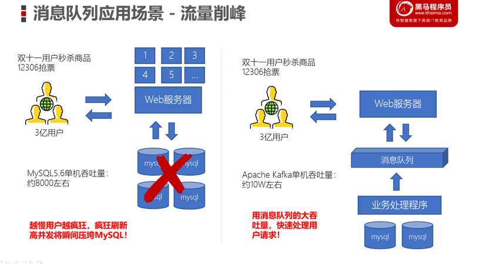
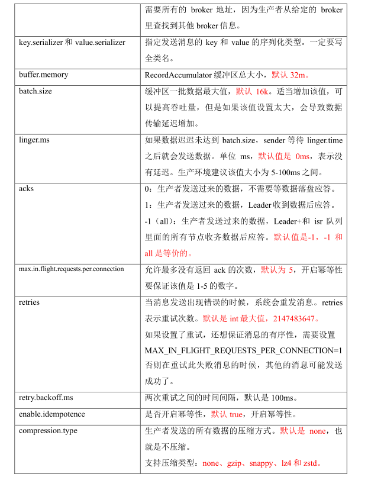
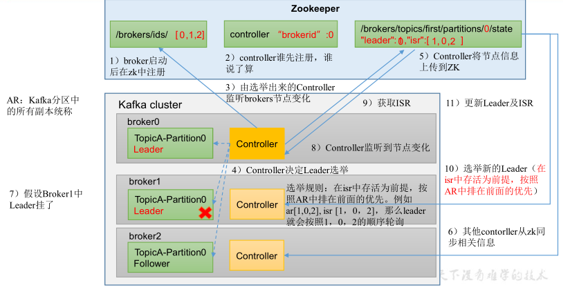

# Kafka

# 简介

## **优点：**

- 异步处理

  - 原本一个微服务通过接口（http）调用另一个服务。
  - 可以将一些比较耗时的操作放在其他系统中，通过消息队列将需要进行处理的消息进行存储，其他系统可以消费消息队列中的数据

- 系统解耦

  - 原先一个微服务是通过接口（HTTP）调用另一个微服务，这时候耦合很严重，只要接口发生变化就会导致系统不可用
  - 比如订单系统发送消息到库存系统（每个大的模块都是一个单独系统，所以要降低耦合）

- 流量削峰

  - 消息队列：低延迟，高可靠，高吞吐，可以应对大量并发

  

- 日志处理
  - 一般用户信息保存在日志，通过发送发服务器，服务器通过消息队列发送给实时处理系统

## ~~消息队列的两种模型~~

- ~~生产者、消费者模型~~
  - ~~生产者负责将消息生产到MQ中~~
  - ~~消费者负责从MQ中获取消息~~
  - ~~生产者和消费者是解耦的，可能是生产者一个程序、消费者是另外一个程序~~
- ~~消息队列的模式~~
  * ~~点对点：一个消费者消费一个消息~~
  * ~~发布订阅：多个消费者可以消费一个消息~~

# Kafka简介

## 简介

**定义：**一个分布式的基于发布/订阅模式的消息队列，用于实时处理。

**发布/订阅：**消息的发布者不会将消息直接发给特定的订阅者，而是将消息分为不同的类别，订阅者只接受感兴趣的消息

**应用场景/作用：**缓存/削峰，解耦，异步通信

- **缓存/削峰**
  - 控制和优化数据流经过系统的速度，解决生产消息和消费消息处理速度不一致的情况（双十一，1亿单/s，服务器只能处理1千万/s，需要通过消息队列，按序处理这些订单）
- **解耦**
  - 数据源与目的地（springboot等）都可能是多个，为使的他们的拓展性，可以使双方都遵守相同的接口约束（都通过消息队列发送和获取数据）
- **异步通信**
  - 把消息放入消息队列，并不立即处理来缓解运行压力，以异步方式处理

## 缺点

- 引入中间件，是否可用，系统的可用性

- 系统的复杂性提高了，以为引入了新的中间件，需要对新的中间件做新的一致性考虑。

- 消息队列，一般用于分布式的系统中，可能要考虑 分布式事务，更加复杂了。

- 时间上，以为，所有的消息都需要遵从一样的格式，因为说，消息队列是流量削峰的， 若我的系统就是要求快响应的，，消息队列完成不了快响应，因为在消息队列中，响应时间拉长了。【快响应，只能使用分布式，只能多布置服务器】

- MQ消息一般要求幂等，对MQ的消费需要考虑幂等处理

  

## Kafka模式

- **点对点模式**
  - 一个消费者消费一个消息，消费后则删除该消息
- **发布订阅模式**
  - 多个消费者消费一个消息，可以有多个主题

## 那为什么要抛弃 ZooKeeper？

- 运维层面：使用kafka就得使用zookeeper集群，kafka本身为一个中间件，还要依赖另外一个中间件，复杂性就增加了，而且增加了运维的复杂度。
- 性能层面：ZooKeeper只能存储少量的配置信息或者集群元数据，如果写入的数据量过大，ZooKeeper 的性能和稳定性就会下降，可能导致 Watch 的延时或丢失。当分区数增加时，`Zookeeper`保存的元数据变多，`Zookeeper`集群压力变大，达到一定级别后，监听延迟增加，给`Kafaka`的工作带来了影响。

## Kafka架构

- Producer：生产者生产消息，向kafka发送消息
- consumer：消费者消费消息，从kafka取消息
- Consumer Group ：消费者组，由多个消费者组成。消费者组内负责消费不同分区的数据，**一个消费者组实际是一个订阅者，组内每个消费者消费不同partition**
- Topic：一个主题，即一个队列
- Partition ：一个主题可以分为多个Partition ，为有序队列
- Broker：一个kafka服务器就是一个broker，一个集群由多个broker组成。一个broker可以有多个topic
- Leader：生产消费消息都是对Leader操作
- Follower：备用，实时与Leader数据同步，在Leader发送故障后，从Follower中选出新的Leader

**分区**

一个Kafka集群有多个机器（一个机器就是一个Broker）

一个集群共享一个Topic。一个Topic可以有多个分区，如果机器数量够用的话，多个分区会在不同的Broker上，当然如果Broker不够用，那么一个Broker就可能保存一个Topic的多个分区。

**优点**

- 实现负载均衡
- 对于消费者：可以提高并发度，提高效率。

**副本**

在kafka中，每个主题可以有多个分区，每个分区又可以有多个副本。这多个副本中，只有一个是leader，而其他的都是follower副本。仅有leader副本可以对外提供服务。

多个follower副本通常存放在和leader副本不同的broker中。通过这样的机制实现了高可用，当某台机器挂掉后，其他follower副本也能迅速”转正“，开始对外提供服务。

生产者数据量巨大，单台服务器无法容纳，将kafka服务器分为多台，容纳不同的数据。

由于kafka分区，一个消费者消费多个分区的消息，并发度低，则消费者为提高并发性，设立消费者组，一个组中一个消费者对应一个kafka分区

避免kafka分区服务器宕机导致数据丢失，则将kafka数据备份到其他服务器，只操作leader。

# Kafka基础命令

主题命令

2.2.2 生产者命令 行操作

2.2.3 消费者命令

# 3，Kafka 生产者

## 1，发送原理

发送过程涉及到两个线程，main 线程和 Sender 线程，和一个 双端列 队列 RecordAccumulator。

**发送流程**

- main线程：
  - 生产者调用send方法，可能会遇到拦截器，再通过序列化器进行序列化操作，并通过分区器，将消息发送到指定分区的双端的缓存队列RecordAccumulator（默认32M）
  - 缓存队列收到消息不是立刻发送，队列有参数linger.ms和batch.size ，若超出指定大小16k或者超出指定时间，则通过sender线程进行发送该批次数据，
  - sender发送数据时，以一个节点（时间节点或者大小节点）为单位发送。
    - NetworkClient类似滑动窗口，窗口内数据无序发送，提高速度。
  - 将数据发送到指定的leader分区和ISR队列（所有的follower副本）。进行应答。
    - 0：生产者发送过来的数据，不需要等数据落盘应答。
    - 1：生产者发送过来的数据，Leader收到数据后应答。
    - -1（all）：生产者发送过来的数据，Leader+和 isr 队列里面的所有节点收齐数据后应答。

生产者 重要 参数

## 2，生产者分区

- 优点

  - **便于合理使用存储资源**，每个Partition在一个Broker（分区）上存储，可以把海量的数据按照分区切割成一块一块数据存储在多台Broker上。合理控制分区的任务，可以**实现负载均衡**的效果。

  - **提高并行度**，生产者使用分区发送数据，消费者以分区为单位进行消费数据

- **分区策略**
  - 若指定分区，则向该该分区发送消息
  - 若没有指定分区但有key 的情况下，将key 的hash值与topic的 的partition数进行 取余 得到partition 值
  - 若没有指定分区而且也没有key的情况，kafka采用Sticky Partition（ 黏性分区器），会随机选择一个分区，并尽可能使用该分区，待该分区的batch 已满或者已完成，Kafka 再随机一个分区进行使用 （ 需要和上一次的分区不同）
  
- 自定义分区策略

  - 实现Partitioner接口，重写partition方法
  - 在生产者的配置中添加分区器参数

## 3，生产者提高吞吐量

【本质上来说就是减少发送次数】前提是场景下确实要发很多的消息

- 提高批次大小（默认16k）

- 增加等待时间（默认 为0），使得一批次，装尽可能多的消息。（不能太大，因为会增加延迟）

- **对消息进行压缩**

- RecordAccumulator：增加缓冲区(缓存队列)大小，修改为64m

## 4，数据可靠性

RecordAccumulator通过sender线程向kafka集群发送消息，会进行应答，应答方式不同，则数据可靠性也不同

acks方式

-  0：生产者发送过来的数据，不需要等数据落盘应答。
- 1：生产者发送过来的数据，Leader收到数据后应答。
- -1（all）：生产者发送过来的数据，Leader+和isr队列里面的所有节点收齐数据后应答。-1和all等价

**总结**

- acks=0：生产者发送过来数据就不管了，可靠性差，效率高。

- acks=1：生产者发送过来数据，Leader收到数据进行应答，但不能保证同步follower成功。可靠性中等 ，效率中等

  - **问题  丢失：**若leader收到消息应该完成后，宕机，此时还没同步到follower，follower会选出新的leader，则前一个数据丢失。

- acks=-1：生产者发送数据，等待leader和follower都收到数据后，再应答。可靠性高 ， 效率低。

  - leader维护一个ISR的set集合，保存所有能与leader同步分区副本（包括本身），某个follower不能与leader同步超过一定时间，则从ISR移除
  - **问题 **
    - **数据重复：**生产者向leader发送消息，收到消息并未同步到follower，宕机，未应答。则生产者重复发送，原来的follow转换为leader，内部有该数据。造成重复。
    - **数据完全可靠条件 = ACK 级别设置为-1 + 分区副本大于等于2 + ISR 里应答的最小 副本 数量大于等于2**，即有至少一个follower可用。

  **在生产环境中，acks=0 很少使用；acks=1，  一般用于传输普通日志 ， 允许丢个别数据；acks=-1，  一般用于传输和钱相关的数据 ，对可靠性要求比较高的场景**

## 数据重复（也叫僵尸实例）

数据重复有两种情况：

- 生产者超时重传
- broker收到消息，没来得及应答，宕机，重启后，生产者超时重传。

将数据精确到一次，则使用**幂等性和事务**。

- 幂等性：指Producer不论向Broker（分区）发送多少次重复数据，Broker端都只会持久化一条，保证了不重复。
  - 重复数据的判断标准：具有<PID（生产者ID）, Partition, SeqNumber>相同主键的消息提交时，Broker只会持久化一条。
  - PID是Kafka每次重启都会给生产者分配一个新的；Partition 表示分区号；Sequence Number是单调自增的。
  - 所以：**只能保证的是在单分区单会话内不重复。**因为PID产生了变化
- **事务**
  - 事务需要请求 producer id（PID），事务协调器会将该事务持久化。宕机重启后，会从事务中获取原来的PID

多分区，分区与分区间无序；

## 数据无序

多分区之间的消息是无序的，由于生产者发送消息是通过滑动窗口发送，一个分区内消息也不是有序的。

**单分区内，有序（有条件的）**

kafka 1.x之前，保证单分区内有序，则设置发送线程中NetworkClient（滑动窗口大小）设置为1

- kafka 1.x以后，
  - 未开启幂等性，则与上述相同
  - 开启幂等性后，设置max.in.flight.requests.per.connection 需要设置小于等于5。
    - 开启幂等后，kafka会缓存生产者发送来的5个原数据，若是单调递增，则是有序的，若不是递增，则认为无序，会进行重排序，以保证有序

# 4，Kafka_Broker

## 整体流程

- 每台kafka集群启动，都会在zookeeper中注册。
- 每个kafka broker都有一个controller，会在zookeeper中注册，第一个注册成功的作为裁判controller。裁判controller监听其他broker的变化
- 裁判controller决定leader选举
  - 选举规则：在isr中存活为前提，按照AR中排在前面的优先。
- 选举成功后，将leader信息上传到Zookeeper。其他broker从zookeeper中获取leader信息

若leader宕机，则裁判controller检测到leader宕机，选举新的leader，并更新到Zookeeper，其他broker会从zk中获取新的leader信息。

## kafka副本

### 副本信息

- 副本作用：提高数据可靠性
- kafka默认一个副本即本身，生产环境一般为两个，保证数据可靠性。
  - 为什么不多几个副本呢？这样不是更加有效吗？
  - 太多副本会增加磁盘存储空间，增加网络上数据传输成本，降低效率
- kafka副本分为Leader和follower，kafka只会把数据发往leader。然后follower找leader同步数据
- Kafka 分区中的所有follower统称为 AR
  - AR = ISR + OSR
  - ISR：所有follower会与leader进行同步，若长时间未发送通信请求或同步数据，则Follower从ISR集合中移除。Leader宕机，会从ISR中选出新的Leader
  - OSR：从ISR移除的Follower，进入OSR

### Leader选举

与整体流程类似

- 每台kafka集群启动，都会在zookeeper中注册。
- 每个kafka broker都有一个controller，会在zookeeper中注册，第一个注册成功的作为裁判controller。裁判controller监听其他broker的变化
- 裁判controller决定leader选举
  - 选举规则：在isr中存活为前提，按照AR中排在前面的优先。
- 选举成功后，将leader信息上传到Zookeeper。其他broker从zookeeper中获取leader信息

若leader宕机

- Controller会监听到节点变化，从zookeeper中获取ISR信息，按序从AR中选择新的leader。更新ISR以及Leader信息并保存到Zookeeper中

### Leader 和 和 Follower 故障处理

- LEO（Log End Offset）：每个副本的最后一个消息的offset，LEO其实就是最新的offset + 1。因为follower同步需要进度不同，有快有慢。
- HW（High Watermark）：所有副本中最小的LEO 。

#### Follower 故障

1. Follower发生故障，会被临时移除ISR
2. 其他leader和Follower继续接收数据
3. Follower恢复后，会移除掉本地磁盘中的HW（宕机前的HW）之后的数据，从旧HW位置开始进行同步
4. **等该Follower的LEO大于或等于该分区的HW**时，可以重新加入ISR

#### Leader故障

1. Leader发生故障
2. 会从ISR的follower中选择一个新的Leader。
   1. 此时，follower中的数据可能没有同步旧leader的所有数据。
3. 为保证一致性，其他的follower会将各自log文件中高于HW的部分截掉，从新的leader同步。
   1. 此时，仅仅是follower高于HW的部分截取，若新leader的数据超出HW，不会删除，而是会同步到其他follower。（本质是：选择新的Leader后，数据会向新leader数据一致，数据量多于该新Leader，则删除多出部分）

注意：**这只能保证副本之间的数据一致性，并不能保证数据不丢失或者不重复**

### Leader分区的负载均衡

- **问题**：
  - 正常情况下，kafka会自动将Leader分区均匀分散在不同机器上，若一些机器宕机，则导致leader重新选择，使其集中在少量的几个broker中。由于读写操作都在leader操作，则broker压力过高。其他宕机的follower重启后，读写请求低，造成负载不均衡
- 解决：（下面是一个方法）
  - 开启默认leader  Partition自动平衡（默认开启）
  - 有一个比例，每个Broker允许不平衡的leader比率，超出，则进行自平衡
    - 从ISR中获取，首个副本与leader对比，不同，则不平衡数+1.
  - 间隔时间，隔一段时间会进行leader负载是否平衡检查

==**建议**：==不建议频繁进行负载均衡，负载均衡，重新选举Leader，无法进行生产，因为读写操作都在leader进行，leader在选举。降低性能

###  增加副本因子

**生产环境中，某个主题十分重要，可以为其该主题增加副本数量。**

## Broker文件存储

Topic是一个逻辑概念，partition是物理概念。

- 每个partition对应一个log文件，其中保存生产者的消息
- 新进来的消息数据会被不断的追加到log末端
- kafka采取分片和索引的机制：为防止log文件过大导致数据定位效率低，
  - 将每个partition分为多个segment（1个G大小），每个segment有
    - 索引，（索引文件）
    - log文件，（数据文件）
    - 时间戳索引文件。【每个消息有默认的过期时间（默认七天），避免一直未消费】

==**log文件与index文件对应**==，面试会问

- index和log文件以当前segment的第一条消息的offset命名 。

- **index为稀疏索引**，大约每在log文件添加4kb数据，会向index文件写入一条索引。而不是有一个消息写入log文件，就写入一个索引
- 并且index文件保存相对offset，这样确保offset的值所占空间不会太大。

==如何在log文件中定位到offset=600的Record？==

- 根据offset查找到对应的segment文件
- 通过segment查找到对应的index文件，因为index文件名以第一个消息的offset命名
- 查找该index文件，定位log文件对应的位置
- 在log文件向下遍历查找目标记录

## 文件清除策略

kafka默认的日志保存时间7天。设置检测周期，间隔检查。

超时后，清除策略

- delete 日志删除：将过期数据删除
  - 基于时间：默认开启，将segment中最后进来的数据作为该文件时间戳，
  - 基于大小：默认关闭，设置所有日志的总大小，超出后，删除最早的segment。不安全，不使用
- compact日志压缩
  - 对于相同key的不同value值，只保留最后一个版本。
  - 特点
    - 压缩后的offset可能是不连续的，比如上图中没有6，当从这些offset消费消息时，将会拿到比这个offset大的offset对应的消息，实际上会拿到offset为7的消息，并从这个位置开始消费。
    - 这种策略只适合特殊场景，比如消息的key是用户ID，value是用户的资料，通过这种压缩策略，整个消息集里就保存了所有用户最新的资料。

## ==高效读写数据（kafka为什么速度很快？）==

- kafka本身是分布式集群，采用分区技术，并行度高
- 读数据，采用稀疏索引，可以快速定位到消费的数据
- **顺序写入磁盘，速度快，避免了寻址操作**
- 使用页缓存 + 零拷贝技术
  - kafka不关心操作的数据，并不进行处理，所以可以将页缓存中的数据，交由消费者。而不用走应用层。

# 5，消费者

## 1，消费方式

- pull（拉）模式，**kafka采用该方式**
  - 消费者从broker中主动拉取数据。
- push（推）模式
  - 从broker向消费者推送数据
  - 消费者的消费速度不一致，很难适应所有的消费者的消费速率

**pull模式不足之处：kafka没有消息时，消费者陷入循环，一直返回空数据**

## 2，工作流程

一个消费者可以消费多个broker的数据

一个消费者组与一个消费者相仿。消费者组包含多个消费者，每个分区的消息只能由消费者组中一个消费者消费。该消费者只能消费该broker，不能再消费其他broker。

消费者消费一个消息，则将消费者的offset提交到系统主题保存。

`__consumer_offsets`记录当前broker消费到哪个消息，记录下offset。维护在系统主题中。

## 3，消费者组

- 消费者组内每个消费者负责消费不同分区的数据。
- 一个分区只能交由组内的一个消费者消费。可以将一个消费者，理解成一个消费者组。
- 消费者组之间互不影响

4个broker，一个消费者组

- 组内只有一个消费者，则所有的broker都给该消费者消费
- 组内有两个消费者，则将broker进行分配，默认一个消费者消费两个
- 组内有4个消费者，则broker与消费者一一对应
- 组内消费者数量超出4个，则超出部分闲置，不会接收任何消息。

## 4，消费者初始化流程

coordinator（协调者）：辅助实现消费者组的初始化和分区的分配。

coordinator节点选择= groupid的hashcode值% 50（ __consumer_offsets的分区数量）

流程

1. 消费者组初始化，一个消费者组内的所有消费者都会发送joinGroup请求
2. coordinator协调者选出一个consumer作为leader
3. coordinator协调者将要消费的topic情况发给leader消费者
4. leader消费者指定消费方案，即消费者与broker消费的对应关系
5. leader消费者会将消费方案交给coordinator协调者
6. coordinator协调者将该方案分发给各个消费者
7. **触发再平衡**
   1. **每个消费者会和coordinator协调者保持心跳（默认3s），若超时（45s），该消费者移除，触发再平衡；**
   2. **或者消费者处理时间过长（5分钟），也会触发再平衡**

## 5，消费流程

- 有一个消费者网络客户端，向broker发送消费请求

- 从broker获取消费请求，按批次来抓取消息。（若消息达不到1字节，此时达到超时时间，也会返回；或者抓取达到最大限制）
  - 每批次最小抓取大小 （1字节）
  - 每匹配未达到的超时时间 （500ms）
  - 每批次最大抓取大小50M
- 从broker获取消息后，消费者会从抓取队列中抓取数据，设置了一次抓取返回消息最大条数，默认500条
- 进行反序列化，拦截器判断，处理数据

## 生产经验

### 消费者与分区的分配原则以及再平衡

#### 消费者消费broker的对应策略：（即消费方案）

Kafka有四种主流的分区分配策略： Range、RoundRobin、Sticky、CooperativeSticky。

默认是：Range + CooperativeSticky，kafka可以使用多个分区分配策略

- Range
  - 将一个topic的分区按序号排序，消费者按字母顺序排序
  - 通过 partitions数/consumer数 来决定每个消费者应该消费几个分区。如果除不尽，那么前面几个消费者将会多消费 1 个分区。
    - 例如，7/3 = 2 余 1 ，除不尽，那么 消费者 C0 便会多消费 1 个分区。
  - **问题**：**容易产生数据倾斜，**即一个主题，则C0比别的消费者多消费1个分区。若多个主题，则消费多个分区。
- RoundRobin：针对集群中所有Topic操作。
  - 将所有topic的所有partition和所有的consumer，列出来，按hashcode排序，通过轮询算法分配partition给consumer
- Sticky 粘性分区
  - 分区时，按 partitions数/consumer数 来决定每个消费者应该消费几个分区。分区时随机排序的，而不是按一定规则排序。

### 数据积压

若消息队列有很多数据，消费者能力不足，不能在消息过期前消费所有消息，会产生数据积压，或者消息量巨大，消费者能够消费，但是每次消费者从broker获取一批次的消息太少，导致消费者总是会有空闲，此时也会数据积压。

数据积压：可能导致消息超出了消息队列的最大上限

- 解决方法
  - 若是kafka消费能力不足，可以增加topic分区数，和增加消费者组的消费数量。增加并发数（提高并发数）
  - 若是kafka的数据处理不及时，消费者能消费，则提高每批次拉取的数量。批次拉取数据过少（拉取数据/处理时间 < 生产速度），使处理的数据小于生产的数据，也会造成数据积压。
    - 将原本每批次的最大限制500条，改为1000条，以及消费者网络客户端从broker获取消息时，提高每批次的最大大小。
  - 上线小demo，将消息消费，保存在数据库中，以后慢慢消费。、
  - 临时紧急扩容
    - 写一个新的消费者，将消费积压的消息，并把消息放入队列容量为10倍的队列中或者是10个队列中(临时队列)，新建新的消费者来消费新队列中的消息
  
  

## offset位移

- offset位置（broker中文件持久化时，log文件与index文件的offset是一个作用）
  - 每个broker通过offset记录消费的消息位置。**consumer默认将offset保存在Kafka一个内置的topic中，该topic为__consumer_offsets。该队列是map形式存储的**。
  - 该__consumer_offsets队列采用key，value方式存储数据，key=`group.id+topic+分区号`,value=offset值，**每隔一段时间进行压缩**。
- **自动提交**
  - 默认开启自动提交，每隔5s，提交一次offset到__consumer_offsets主题的消息队列
  - 可以理解为consumer是一个生产者，每5s会向_consumer_offsets主题中生产offset数据
- 手动提交（自动提交基于时间，开发人员很难把握offset提交的时机，所以有手动提交）
  - commitSync（同步提交）：必须等待offset提交完毕，再去消费下一批数据。
    - 提交offset，会造成阻塞，等待提交成功，而且有失败重试，更加可靠
  - commitAsync（异步提交） ：发送完提交offset请求后，就开始消费下一批数据了。
    - 没有失败重试机制

消费者通过offset commit
来保证数据的不丢失，kafka自己记录了每次消费的offset数值，下次继续消费的时候，会接着上次的offset进行消费。kafka并不像其他消息队列，消费完消息之后，会将数据从队列中删除，而是维护了一个日志文件，通过时间和储存大小进行日志删除策略。如果offset没有提交，程序启动之后，会从上次消费的位置继续消费，有可能存在重复消费的情况。

- 指定offset消费
  - auto.offset.reset = earliest | latest | none 默认是 latest。
  - 若kafka没有初始偏移量（第一次消费），或者服务器上不存在当前偏移量，则需要指定offset消费
    - earliest：自动将偏移量重置为最早的偏移量
    - latest（默认值）：自动将偏移量重置为最新偏移量。
    - none：如果未找到消费者组的先前偏移量，则向消费者抛出异常
    - 任意指定 offset 位移开始消费
- 指定时间消费
  - 需求：在生产环境中，会遇到最近消费的几个小时数据异常，想重新按照时间消费。例如要求按照时间消费前一天的数据，怎么处理？
  - 指定时间消费
    - 仍然是指定offset消费，
    - 获取指定时间的每个分区的offset

## 漏消费和重复消费

- 重复消费
  - 自动提交offset情况下，在消费者提交offset之后，消费者继续消费，还没等到下一次提交，消费者宕机，重启后，继续从上次提交的offset处消费。造成了重复
- 漏消费
  - 在手动提交offset情况下，offset方提交，消费者抓取的消息还在内存中，未持久化。消费者宕机，消息丢失

所以，在消费者拉取到消息就提交，而不是等将消息处理结束后再提交。

**需要使用消费者事务**

