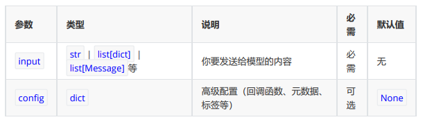
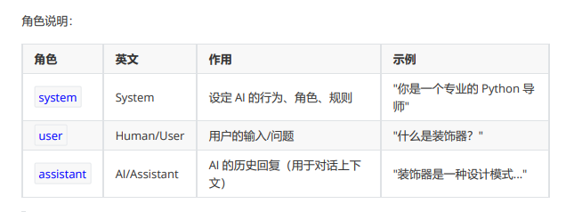
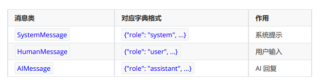

# LangChain

# 简介

## 大模型的局限性：

- 知识受限于训练数据
- 无法直接于外部系统交互
- 不具备状态保持能力（缺少上下文记忆）


## LangChain 的定位

1. 大通大模型与外部资源：可以对接数据库、检索引擎、API、文件系统等 
2. 封装底层复杂逻辑：抽象工具调用、记忆等能力
3. 支持多智能体协作


## LangChain缺点：

1. 文档混乱&更新滞后
2. 抽象过度&调试困难
3. 版本不兼容

## **重要版本**：


## 核心模块

- **angchain-core** ：官方推荐的核心API。比如 Runnable, BaseMessage等 
- **langchain-classic** ：冗余代码移或不推荐使用的经典API移到此。比如0.x中常用而1.x移除的API都 在这里。 
- **langchain-community** ：第三方集成，比如：合作伙伴包 langchain-openai，langchainanthropic等，按需安装、避免臃肿。
- **langgraph** ：深度整合 LangGraph 1.0，协调多个Chain，Agent，Tools完成更复杂的任务，并 且还支持循环调用，是langchain图形化的增强版


## LangChain四大支柱


### LangChain

- 是整个生态的核心起点、为开发者提供了模型调用、工具与中间件集成、智能体构建等整套基础能力开发

如果是构建简单的智能体应用，无需复杂的编排需求，那么选择LangChain


### LangGraph

智能体需要由单一指令拓展为多步骤、有状态的复杂工作流时，出现了LangGraph

- 节点：代表独立的功能单元或决策点
- 边：定义了节点之间的流转条件与路径
- 状态：作为一个共享上下文，在节点间传递并持久化存储任务信息

通过图式结构，LangGraph让智能体的工作流节点交互变更显式、可控、可观测


### Deep Agent 

智能体的执行框架，**构建于LangChain、LangGraph之上**、增加了规划能力、文件系统、子Agent等功能，目的是：让开发者无需从零构建复杂的控制逻辑，即可创建具备深度规划、长期记忆与多专家协作能力的智能体。


**三者关系**


### LangSmith 

可视化监控与测试平台，用于跟踪、记录和分析智能体在运行过程中的完整调用链路，让智能体内部可视化


## 应用场景

### RAG

#### 1）背景：

**大模型的知识冻结**：模型无法实时学习到最新的信息或者动态变化，导致LLM难以应对最新最热点新闻等时间敏感信息

**大模型幻觉**：涉及到大模型从未在训练过程中学习过的信息时，大模型无法给出准确的答复，转而开始臆想和编造答案

#### **2）何为RAG**

**Retrieval-Augmented Generation（检索增强生成）**


检索-增强-生成过程：检索可以理解为第10步，增强理解为第13步（这里的提示词包含检索到的数 据），生成理解为第15步。


**过程中的难点**：1、文件解析 2、文件切割 3、知识检索、4、知识重排序

1、文件解析：如果是pdf，内部包含文件、图片、表格，图片上还有文字，需要处理。 

2、文件切割：没有固定的格式 

3、在 RAG 应用中，随着文档数量增加，召回准确率会下降，引入reranker（重排器）可对初步 召回的较多 chunk（如 top 20 或 top 50）进行精排，提高召回准确率，防止LLM 处理无关信 息，减少时间和成本。 

此外，与基于基本矢量搜索的 RAG 相比，reranker增强型 RAG 的成本更高，但与仅依靠LLM 生 成答案相比，它的成本低些

**Reranker的使用场景**

- 适合：**追求回答高精准**和**高相关性**的场景，例如专业知识库或者智能客服
- 不适合：增加Reranker 会增加召回时间，增加检索延迟，服务对相应时间要求高时，使用rendanker则不合适


### Agent

通过LLM的推理决策能力，通过增加规划、记忆和工具调用的能力，构造一个能够独立思考、逐步完整给定目标的Agent（智能体）


**包含模块**

1. 大模型 LLM：提供推理、规划和知识理解的能力
2. 规划决策：对复杂任务做拆解、反思和自省框架，实现对复杂任务进行处理；例如思维链将目标拆解为子任务，并通过反馈优化策略
3. 工具：调用外部工具拓展能力边界
4. 记忆：
   1. **短期记忆**：存储单次对话周期的上下文信息，属于临时信息存储机制。受限于模型的上下文窗口长 度。
   2. **长期记忆**：可以 横跨多个会话或时间周期 ，可存储并调用核心知识，非即时任务。 比如，关于用户的偏好，过去执行过的指令等。 **长期记忆，可以通过 模型参数微调（固化知识） 、 知识图谱（结构化语义网络） 或 向量数 据库（相似性检索） 方式实现。**
5. 行动：实际执行决策的模块，涵盖软件接口操作（如自动订票）和物理交互（如机器人 执行搬运）。比如：检索、推理、编程等。


# 模型调用

模型的调用分为： invoke() 、 stream() 和 batch() 方法，以及它们的异步版本 ainvoke() 、 astream() 和 abatch()

- invoke() ：阻塞式，一次性返回完整结果问答、批处理任务、无需实时反馈的场景。 
- ainvoke() ：非阻塞式，提高系统吞吐量高并发Web应用、IO密集型任务。 
- stream() ：流式输出，实时返回每个token聊天机器人、长文本生成、需要提升用户体验的交互 应用。 
- asteam() ：非阻塞式，提高系统吞吐量高并发Web应用、IO密集型任务。 
- batch() ：批量处理多个输入高并发场景，需要同时处理大量请求。 
- abatch() ：非阻塞式，提高系统吞吐量高并发Web应用、IO密集型任务。


### invoke()

invoke接收你的输入（问题指令等），发送给LLM模型，返回模型的相应。



#### 输入

##### str 文本输入

**特点**：简单高效，支持简单的文本问题，没办法设置系统提示词，无法传递对话历史

```python
prompt = "翻译成英文：你好世界"
response = model.invoke(prompt)

```

##### 字典列表 文本输入

创建字典列表组成消息，一条消息包含：`角色`、`内容`等信息

**特点**:可以设置系统提示，表达多轮对话历史，JSON兼容，容易序列化和网络传输，生产环境推荐



```python
messages = [
{"role": "system", "content": "系统提示"},
{"role": "user", "content": "用户消息"},
{"role": "assistant", "content": "AI回复"}, # 可选，用于对话历史
{"role": "user", "content": "继续提问"}
]
response = model.invoke(messages)
```

##### 消息对象列表

使用内置的消息类，将消息对象传递给模型

**特点**：需要类型检查，但代码太长，不如字典简洁，难以序列化



```python
messages = [
	SystemMessage(content="你是一个 Python 专家"),
	HumanMessage(content="什么是生成器？"),
]
response = model.invoke(messages)
# print(response)
# 继续对话
messages.append(AIMessage(content=response.content))
messages.append(HumanMessage(content="能给个例子吗？"))
response1 = model.invoke(messages)
print(response1)
```

#### 返回值

`invoke()` 返回一个 `AIMessage` 对象，示例结构如下：

```python
AIMessage(
    # --- 核心内容 ---
    content='2 + 3 * 2 = **8**',  # 模型生成的最终文本答案

    # --- 附加参数 ---
    additional_kwargs={
        'refusal': None,  # 模型拒绝回答时的原因；None 表示正常回答
    },

    # --- 响应元数据（API 返回的详细原始数据） ---
    response_metadata={
        'token_usage': {
            'completion_tokens': 15,  # 生成回答消耗的 Token 数（输出）
            'prompt_tokens': 16,      # 用户输入消耗的 Token 数（输入）
            'total_tokens': 31,       # 本次交互总共消耗的 Token
            'completion_tokens_details': {
                'accepted_prediction_tokens': 0,  # 预测性生成的 Token 数
                'audio_tokens': 0,                 # 音频生成消耗（如有）
                'reasoning_tokens': 0,             # 推理过程消耗的 Token
                'rejected_prediction_tokens': 0,   # 被拒绝的预测 Token 数
            },
            'prompt_tokens_details': {
                'audio_tokens': 0,    # 输入中的音频 Token 数
                'cached_tokens': 0,   # 命中的缓存 Token 数（能省钱/提速）
            },

            # --- 延迟性能监控（单位：毫秒 ms） ---
            'latency_checkpoint': {
                'engine_tbt_ms': 4,       # 引擎 Token 间平均间隔时间
                'engine_ttft_ms': 36,     # 引擎生成首个 Token 的时间
                'engine_ttlt_ms': 100,    # 引擎生成最后一个 Token 的时间
                'pre_inference_ms': 86,   # 推理前的预处理耗时
                'service_tbt_ms': 4,      # 服务端 Token 间的生成间隔
                'service_ttft_ms': 280,   # 接收请求到输出首字的总时间
                'service_ttlt_ms': 338,   # 完成全部输出的总时间
                'total_duration_ms': 259, # 本次请求在系统中记录的总持续时长
                'user_visible_ttft_ms': 194,  # 用户看到第一个字的等待时间
            },
        },
        'model_provider': 'openai',  # 模型供应商
        'model_name': 'gpt-5.4-mini-2026-03-17',  # 使用的具体模型版本
        'system_fingerprint': None,  # 用于追踪模型后端配置变更
        'id': 'chatcmpl-DgWobsxhDOqzjqVFwbZYKRnovpEiV',  # API 响应 ID
        'service_tier': 'default',  # 服务层级
        'finish_reason': 'stop',     # 停止原因：stop 或 length
        'logprobs': None,            # 词元对数概率
    },

    # --- LangChain 内部标识 ---
    id='lc_run--019e3659-5ee2-7b62-bc8a-741e27374b43-0',

    # --- 工具调用信息 ---
    tool_calls=[],           # 正常触发的外部工具调用列表
    invalid_tool_calls=[],   # 触发失败或格式错误的工具调用

    # --- 统一消耗元数据（LangChain 标准化后的格式） ---
    usage_metadata={
        'input_tokens': 16,
        'output_tokens': 15,
        'total_tokens': 31,
        'input_token_details': {
            'audio': 0,
            'cache_read': 0,  # 从缓存中读取的输入数量
        },
        'output_token_details': {
            'audio': 0,
            'reasoning': 0,  # 输出中包含的推理 Token 数
        },
    },
)
```

### 总结

#### 1. 核心内容与基本信息

- `content`：模型生成的文本回答，这是最关心的核心输出。
- `id`：本次运行在 LangChain 内部生成的唯一标识（Run ID）。
- `additional_kwargs`：包含特定供应商的额外参数。
  - `refusal`：如果模型拒绝回答（涉及敏感政策），此处会显示拒绝原因。

#### 2. 消耗统计（Token Usage）

这部分决定了这一次输入操作花费了多少 Token：

- `prompt_tokens` / `input_tokens`：输入 Token 数，与你发送给模型的问题长度有关。
- `completion_tokens` / `output_tokens`：输出 Token 数，取决于模型回答生成的长度。
- `total_tokens`：总消耗，即输入 Token 与输出 Token 之和。
- `reasoning_tokens`：推理 Token 数。如果是 O1/O3 等推理模型，这里会显示它在思考阶段消耗的 Token。
- `cached_tokens`：缓存命中的 Token 数。重复提问时，如果命中了模型缓存，这部分费用通常更低。

#### 3. 响应元数据（Response Metadata）

这部分是 API 返回的原始详细信息：

- `model_name`：实际调用的模型具体版本，例如 `gpt-5.4-mini`。
- `model_provider`：模型供应商，例如 `openai`。
- `finish_reason`：生成停止的原因。
  - `stop`：正常回答结束。
  - `length`：达到最大 Token 限制后被截断。
- `system_fingerprint`：系统指纹，用于追踪模型后端的配置变更。

#### 4. 性能与延迟（Latency Checkpoint）

这是对 API 响应速度的深度拆解，单位通常为毫秒（ms）：

- `total_duration_ms`：总耗时，从请求发出到完全收到的总时间。
- `user_visible_ttft_ms`：首字到达时间，即用户看到第一个字跳出来时的时间，是体感快慢的关键。
- `engine_ttft_ms`：引擎层面的首字到达时间。
- `engine_ttlt_ms`：引擎生成最后一个字的时间。
- `pre_inference_ms`：推理前的预处理耗时，包括安全审核、Token 化等预处理过程。
- `service_tbt_ms`：服务端 Token 之间生成的间隔时间，决定打字机效果是否丝滑。

#### 5. 工具调用信息

- `tool_calls`：结构化工具调用列表。如果模型决定调用某个 Python 函数或搜索工具，参数会记录在这里。
- `invalid_tool_calls`：格式错误或未成功执行的工具调用尝试。
