# LangChain

# 简介

## 大模型的局限性：

- 知识受限于训练数据
- 无法直接于外部系统交互
- 不具备状态保持能力（缺少上下文记忆）

## LangChain 的定位

1. 大通大模型与外部资源：可以对接数据库、检索引擎、API、文件系统等 
2. 封装底层复杂逻辑：抽象工具调用、记忆等能力
3. 支持多智能体协作

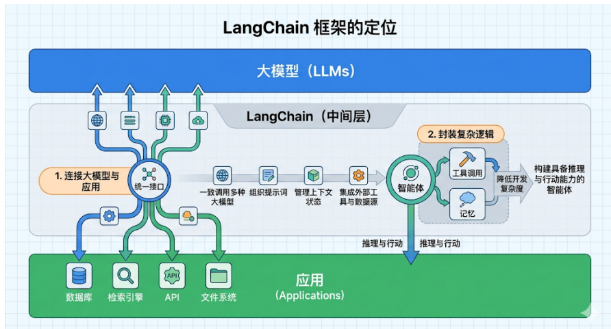

## LangChain缺点：

1. 文档混乱&更新滞后
2. 抽象过度&调试困难
3. 版本不兼容

## **重要版本**：

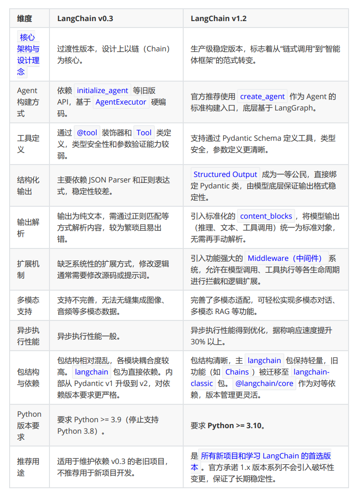

## 核心模块

- **angchain-core** ：官方推荐的核心API。比如 Runnable, BaseMessage等 
- **langchain-classic** ：冗余代码移或不推荐使用的经典API移到此。比如0.x中常用而1.x移除的API都 在这里。 
- **langchain-community** ：第三方集成，比如：合作伙伴包 langchain-openai，langchainanthropic等，按需安装、避免臃肿。
- **langgraph** ：深度整合 LangGraph 1.0，协调多个Chain，Agent，Tools完成更复杂的任务，并 且还支持循环调用，是langchain图形化的增强版

## LangChain四大支柱

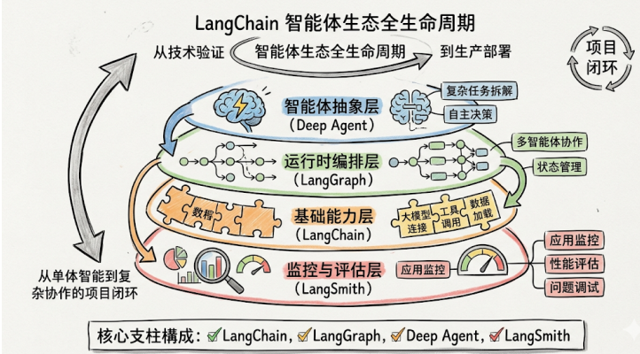

### LangChain

- 是整个生态的核心起点、为开发者提供了模型调用、工具与中间件集成、智能体构建等整套基础能力开发

如果是构建简单的智能体应用，无需复杂的编排需求，那么选择LangChain

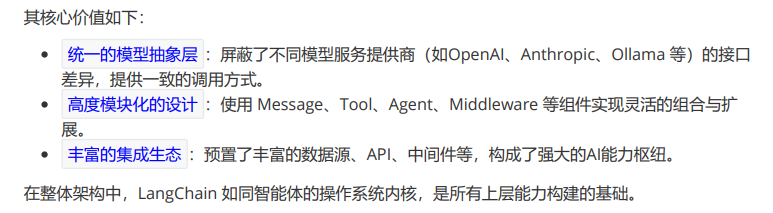

### LangGraph

智能体需要由单一指令拓展为多步骤、有状态的复杂工作流时，出现了LangGraph

- 节点：代表独立的功能单元或决策点
- 边：定义了节点之间的流转条件与路径
- 状态：作为一个共享上下文，在节点间传递并持久化存储任务信息

通过图式结构，LangGraph让智能体的工作流节点交互变更显式、可控、可观测

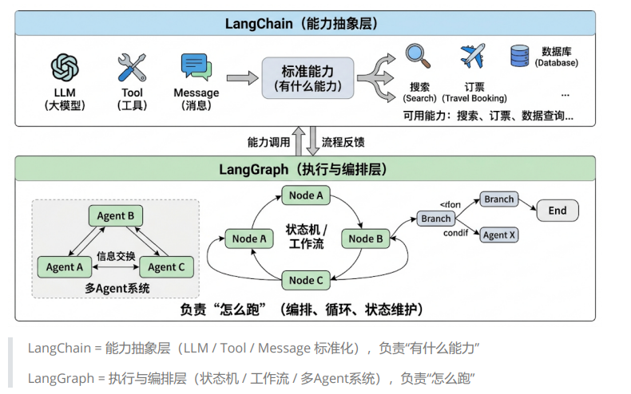

### Deep Agent 

智能体的执行框架，**构建于LangChain、LangGraph之上**、增加了规划能力、文件系统、子Agent等功能，目的是：让开发者无需从零构建复杂的控制逻辑，即可创建具备深度规划、长期记忆与多专家协作能力的智能体。

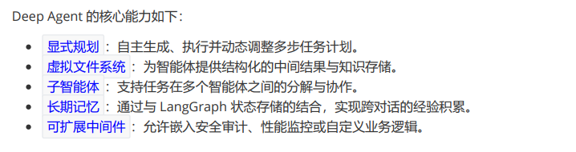

**三者关系**

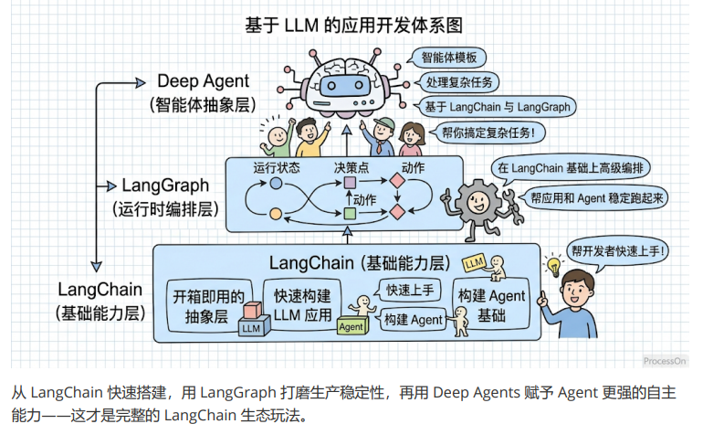

### LangSmith 

可视化监控与测试平台，用于跟踪、记录和分析智能体在运行过程中的完整调用链路，让智能体内部可视化

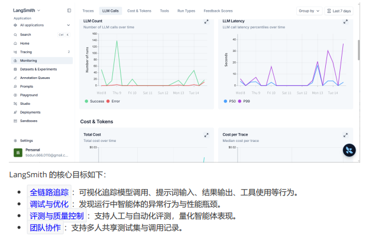

## 应用场景

### RAG

#### 1）背景：

**大模型的知识冻结**：模型无法实时学习到最新的信息或者动态变化，导致LLM难以应对最新最热点新闻等时间敏感信息

**大模型幻觉**：涉及到大模型从未在训练过程中学习过的信息时，大模型无法给出准确的答复，转而开始臆想和编造答案

#### **2）何为RAG**

**Retrieval-Augmented Generation（检索增强生成）**

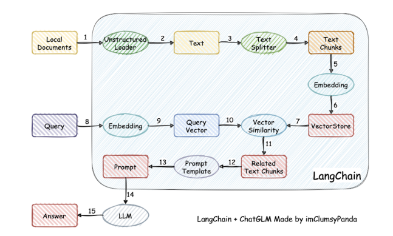

检索-增强-生成过程：检索可以理解为第10步，增强理解为第13步（这里的提示词包含检索到的数 据），生成理解为第15步。

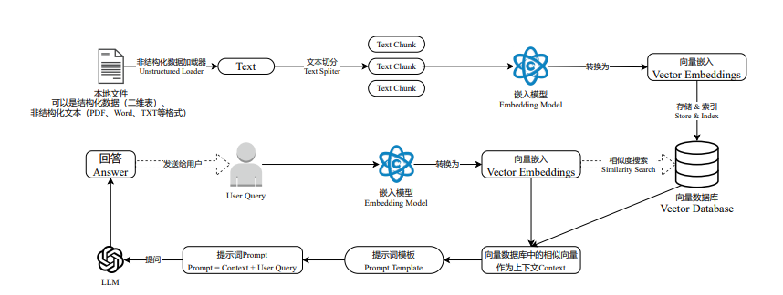

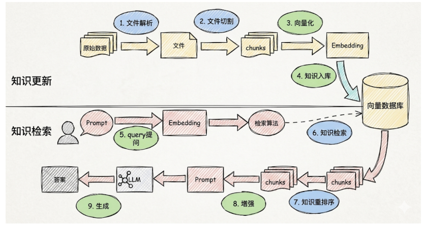

**过程中的难点**：1、文件解析 2、文件切割 3、知识检索、4、知识重排序

1、文件解析：如果是pdf，内部包含文件、图片、表格，图片上还有文字，需要处理。 

2、文件切割：没有固定的格式 

3、在 RAG 应用中，随着文档数量增加，召回准确率会下降，引入reranker（重排器）可对初步 召回的较多 chunk（如 top 20 或 top 50）进行精排，提高召回准确率，防止LLM 处理无关信 息，减少时间和成本。 

此外，与基于基本矢量搜索的 RAG 相比，reranker增强型 RAG 的成本更高，但与仅依靠LLM 生 成答案相比，它的成本低些

**Reranker的使用场景**

- 适合：**追求回答高精准**和**高相关性**的场景，例如专业知识库或者智能客服
- 不适合：增加Reranker 会增加召回时间，增加检索延迟，服务对相应时间要求高时，使用rendanker则不合适

### Agent

通过LLM的推理决策能力，通过增加规划、记忆和工具调用的能力，构造一个能够独立思考、逐步完整给定目标的Agent（智能体）

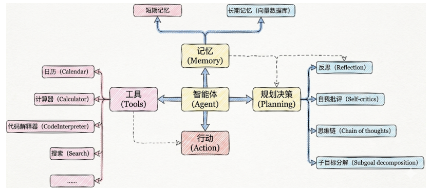

**包含模块**

1. 大模型 LLM：提供推理、规划和知识理解的能力
2. 规划决策：对复杂任务做拆解、反思和自省框架，实现对复杂任务进行处理；例如思维链将目标拆解为子任务，并通过反馈优化策略
3. 工具：调用外部工具拓展能力边界
4. 记忆：
   1. **短期记忆**：存储单次对话周期的上下文信息，属于临时信息存储机制。受限于模型的上下文窗口长 度。
   2. **长期记忆**：可以 横跨多个会话或时间周期 ，可存储并调用核心知识，非即时任务。 比如，关于用户的偏好，过去执行过的指令等。 **长期记忆，可以通过 模型参数微调（固化知识） 、 知识图谱（结构化语义网络） 或 向量数 据库（相似性检索） 方式实现。**
5. 行动：实际执行决策的模块，涵盖软件接口操作（如自动订票）和物理交互（如机器人 执行搬运）。比如：检索、推理、编程等。

