# LangChain

# 1、简介

## 大模型的局限性：

- 知识受限于训练数据
- 无法直接于外部系统交互
- 不具备状态保持能力（缺少上下文记忆）


## LangChain 的定位

1. 大通大模型与外部资源：可以对接数据库、检索引擎、API、文件系统等 
2. 封装底层复杂逻辑：抽象工具调用、记忆等能力
3. 支持多智能体协作

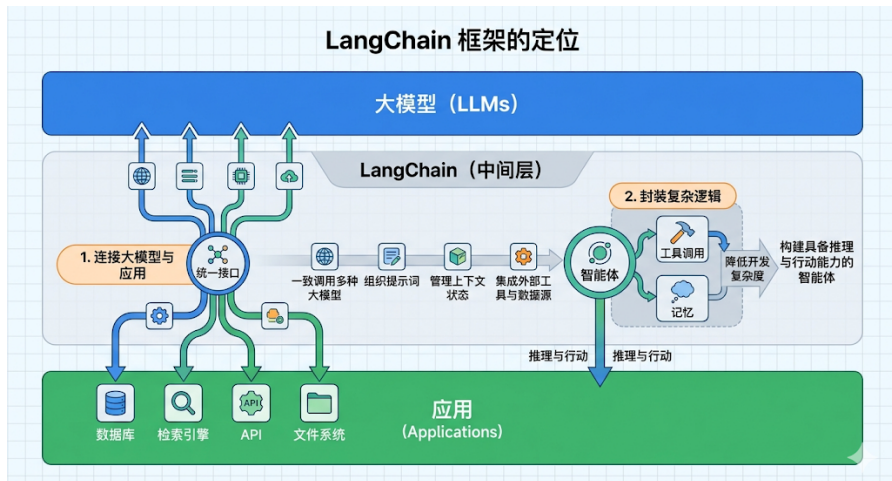


## LangChain缺点：

1. 文档混乱&更新滞后
2. 抽象过度&调试困难
3. 版本不兼容

## **重要版本**：

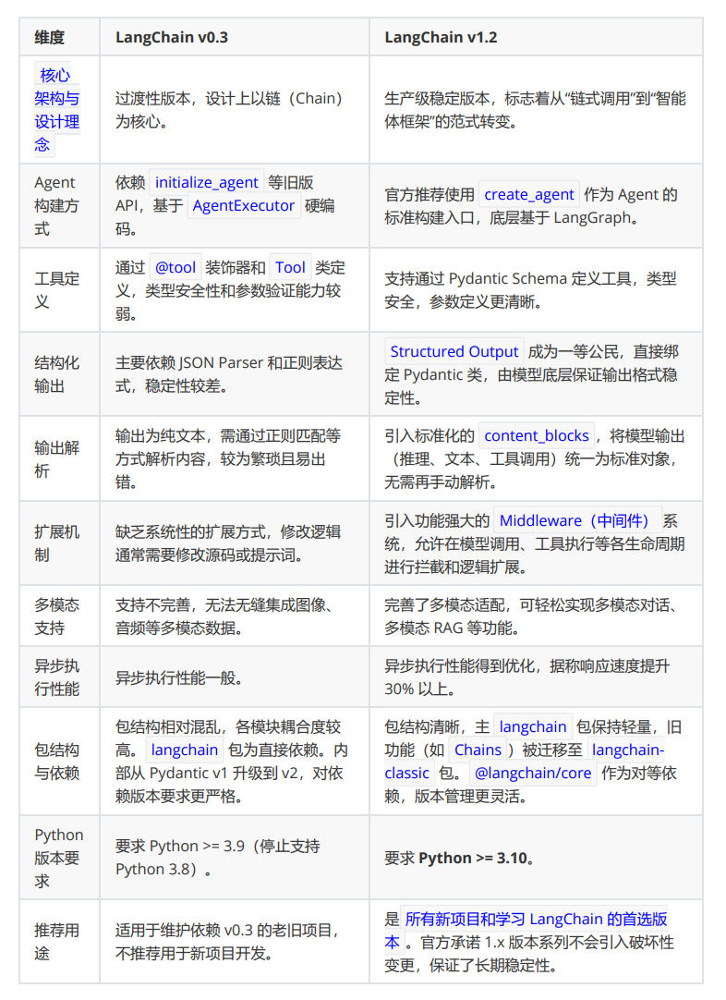

## 核心模块

- **angchain-core** ：官方推荐的核心API。比如 Runnable, BaseMessage等 
- **langchain-classic** ：冗余代码移或不推荐使用的经典API移到此。比如0.x中常用而1.x移除的API都 在这里。 
- **langchain-community** ：第三方集成，比如：合作伙伴包 langchain-openai，langchainanthropic等，按需安装、避免臃肿。
- **langgraph** ：深度整合 LangGraph 1.0，协调多个Chain，Agent，Tools完成更复杂的任务，并 且还支持循环调用，是langchain图形化的增强版


## LangChain四大支柱

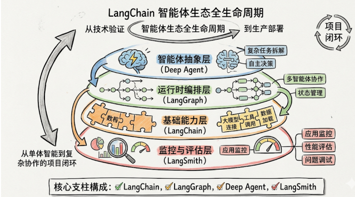

### LangChain

- 是整个生态的核心起点、为开发者提供了模型调用、工具与中间件集成、智能体构建等整套基础能力开发

如果是构建简单的智能体应用，无需复杂的编排需求，那么选择LangChain

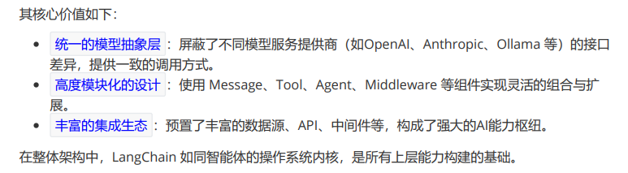

### LangGraph

智能体需要由单一指令拓展为多步骤、有状态的复杂工作流时，出现了LangGraph

- 节点：代表独立的功能单元或决策点
- 边：定义了节点之间的流转条件与路径
- 状态：作为一个共享上下文，在节点间传递并持久化存储任务信息

通过图式结构，LangGraph让智能体的工作流节点交互变更显式、可控、可观测

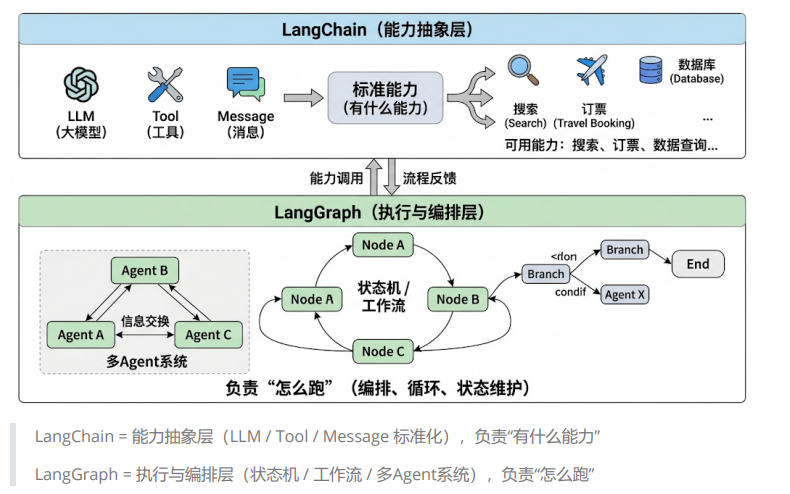


### Deep Agent 

智能体的执行框架，**构建于LangChain、LangGraph之上**、增加了规划能力、文件系统、子Agent等功能，目的是：让开发者无需从零构建复杂的控制逻辑，即可创建具备深度规划、长期记忆与多专家协作能力的智能体。

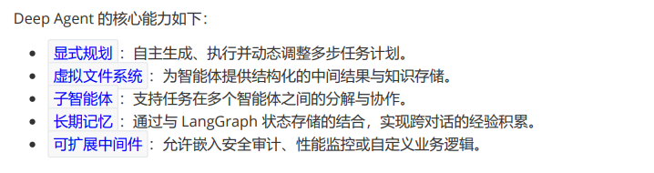

**三者关系**

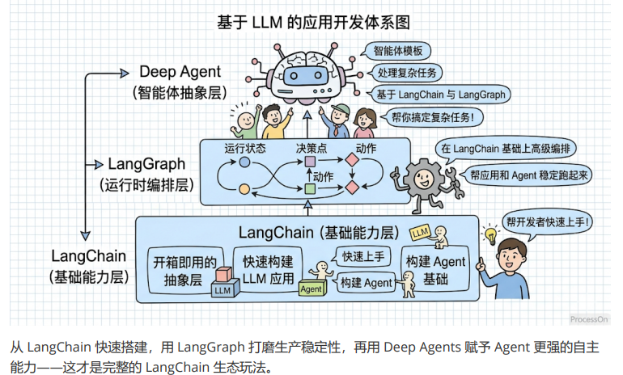

### LangSmith 

可视化监控与测试平台，用于跟踪、记录和分析智能体在运行过程中的完整调用链路，让智能体内部可视化

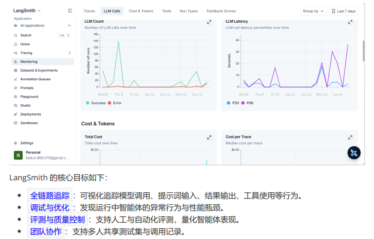

## 应用场景

### RAG

#### 1）背景：

**大模型的知识冻结**：模型无法实时学习到最新的信息或者动态变化，导致LLM难以应对最新最热点新闻等时间敏感信息

**大模型幻觉**：涉及到大模型从未在训练过程中学习过的信息时，大模型无法给出准确的答复，转而开始臆想和编造答案

#### **2）何为RAG**

**Retrieval-Augmented Generation（检索增强生成）**

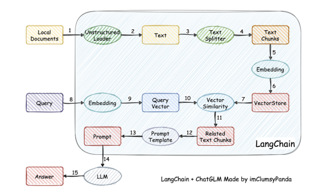

检索-增强-生成过程：检索可以理解为第10步，增强理解为第13步（这里的提示词包含检索到的数 据），生成理解为第15步。


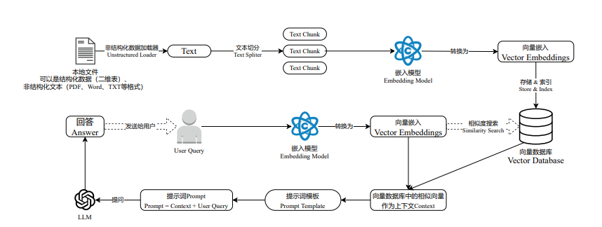


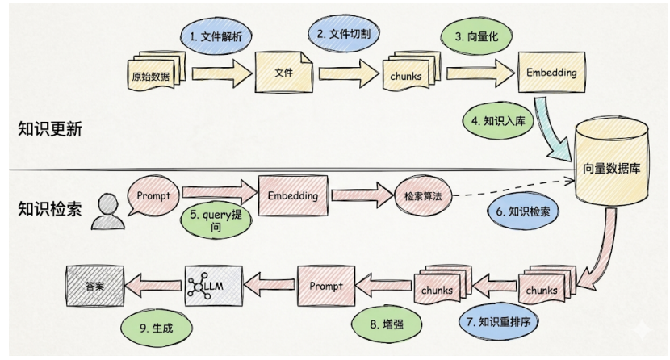

**过程中的难点**：1、文件解析 2、文件切割 3、知识检索、4、知识重排序

1、文件解析：如果是pdf，内部包含文件、图片、表格，图片上还有文字，需要处理。 

2、文件切割：没有固定的格式 

3、在 RAG 应用中，随着文档数量增加，召回准确率会下降，引入reranker（重排器）可对初步 召回的较多 chunk（如 top 20 或 top 50）进行精排，提高召回准确率，防止LLM 处理无关信 息，减少时间和成本。 

此外，与基于基本矢量搜索的 RAG 相比，reranker增强型 RAG 的成本更高，但与仅依靠LLM 生 成答案相比，它的成本低些

**Reranker的使用场景**

- 适合：**追求回答高精准**和**高相关性**的场景，例如专业知识库或者智能客服
- 不适合：增加Reranker 会增加召回时间，增加检索延迟，服务对相应时间要求高时，使用rendanker则不合适


### Agent

通过LLM的推理决策能力，通过增加规划、记忆和工具调用的能力，构造一个能够独立思考、逐步完整给定目标的Agent（智能体）

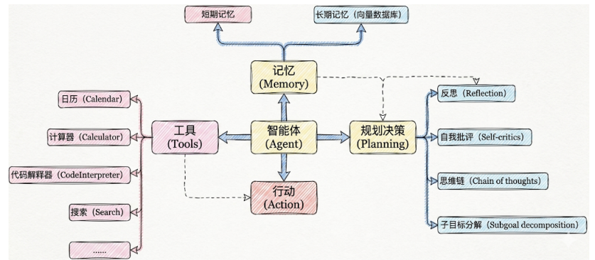

**包含模块**

1. 大模型 LLM：提供推理、规划和知识理解的能力
2. 规划决策：对复杂任务做拆解、反思和自省框架，实现对复杂任务进行处理；例如思维链将目标拆解为子任务，并通过反馈优化策略
3. 工具：调用外部工具拓展能力边界
4. 记忆：
   1. **短期记忆**：存储单次对话周期的上下文信息，属于临时信息存储机制。受限于模型的上下文窗口长 度。
   2. **长期记忆**：可以 横跨多个会话或时间周期 ，可存储并调用核心知识，非即时任务。 比如，关于用户的偏好，过去执行过的指令等。 **长期记忆，可以通过 模型参数微调（固化知识） 、 知识图谱（结构化语义网络） 或 向量数 据库（相似性检索） 方式实现。**
5. 行动：实际执行决策的模块，涵盖软件接口操作（如自动订票）和物理交互（如机器人 执行搬运）。比如：检索、推理、编程等。


# 2、模型调用

模型的调用分为： invoke() 、 stream() 和 batch() 方法，以及它们的异步版本 ainvoke() 、 astream() 和 abatch()

- invoke() ：阻塞式，一次性返回完整结果问答、批处理任务、无需实时反馈的场景。 
- ainvoke() ：非阻塞式，提高系统吞吐量高并发Web应用、IO密集型任务。 
- stream() ：流式输出，实时返回每个token聊天机器人、长文本生成、需要提升用户体验的交互 应用。 
- asteam() ：非阻塞式，提高系统吞吐量高并发Web应用、IO密集型任务。 
- batch() ：批量处理多个输入高并发场景，需要同时处理大量请求。 
- abatch() ：非阻塞式，提高系统吞吐量高并发Web应用、IO密集型任务。


### invoke()

invoke接收你的输入（问题指令等），发送给LLM模型，返回模型的相应。

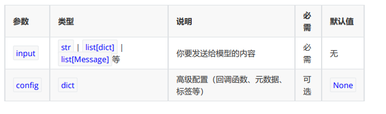

#### 输入

##### str 文本输入

**特点**：简单高效，支持简单的文本问题，没办法设置系统提示词，无法传递对话历史

```python
prompt = "翻译成英文：你好世界"
response = model.invoke(prompt)

```

##### 字典列表 文本输入

创建字典列表组成消息，一条消息包含：`角色`、`内容`等信息

**特点**:可以设置系统提示，表达多轮对话历史，JSON兼容，容易序列化和网络传输，生产环境推荐

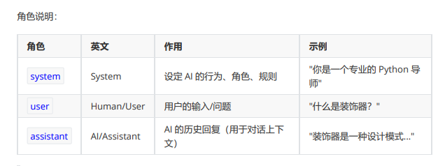

```python
messages = [
{"role": "system", "content": "系统提示"},
{"role": "user", "content": "用户消息"},
{"role": "assistant", "content": "AI回复"}, # 可选，用于对话历史
{"role": "user", "content": "继续提问"}
]
response = model.invoke(messages)
```

##### 消息对象列表

使用内置的消息类，将消息对象传递给模型

**特点**：需要类型检查，但代码太长，不如字典简洁，难以序列化

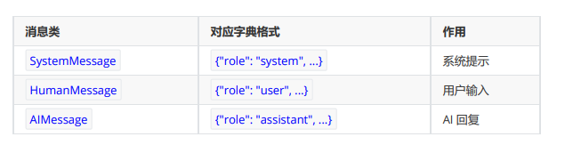

```python
messages = [
	SystemMessage(content="你是一个 Python 专家"),
	HumanMessage(content="什么是生成器？"),
]
response = model.invoke(messages)
# print(response)
# 继续对话
messages.append(AIMessage(content=response.content))
messages.append(HumanMessage(content="能给个例子吗？"))
response1 = model.invoke(messages)
print(response1)
```

#### 返回值

`invoke()` 返回一个 `AIMessage` 对象，示例结构如下：

```python
AIMessage(
    # --- 核心内容 ---
    content='2 + 3 * 2 = **8**',  # 模型生成的最终文本答案

    # --- 附加参数 ---
    additional_kwargs={
        'refusal': None,  # 模型拒绝回答时的原因；None 表示正常回答
    },

    # --- 响应元数据（API 返回的详细原始数据） ---
    response_metadata={
        'token_usage': {
            'completion_tokens': 15,  # 生成回答消耗的 Token 数（输出）
            'prompt_tokens': 16,      # 用户输入消耗的 Token 数（输入）
            'total_tokens': 31,       # 本次交互总共消耗的 Token
            'completion_tokens_details': {
                'accepted_prediction_tokens': 0,  # 预测性生成的 Token 数
                'audio_tokens': 0,                 # 音频生成消耗（如有）
                'reasoning_tokens': 0,             # 推理过程消耗的 Token
                'rejected_prediction_tokens': 0,   # 被拒绝的预测 Token 数
            },
            'prompt_tokens_details': {
                'audio_tokens': 0,    # 输入中的音频 Token 数
                'cached_tokens': 0,   # 命中的缓存 Token 数（能省钱/提速）
            },

            # --- 延迟性能监控（单位：毫秒 ms） ---
            'latency_checkpoint': {
                'engine_tbt_ms': 4,       # 引擎 Token 间平均间隔时间
                'engine_ttft_ms': 36,     # 引擎生成首个 Token 的时间
                'engine_ttlt_ms': 100,    # 引擎生成最后一个 Token 的时间
                'pre_inference_ms': 86,   # 推理前的预处理耗时
                'service_tbt_ms': 4,      # 服务端 Token 间的生成间隔
                'service_ttft_ms': 280,   # 接收请求到输出首字的总时间
                'service_ttlt_ms': 338,   # 完成全部输出的总时间
                'total_duration_ms': 259, # 本次请求在系统中记录的总持续时长
                'user_visible_ttft_ms': 194,  # 用户看到第一个字的等待时间
            },
        },
        'model_provider': 'openai',  # 模型供应商
        'model_name': 'gpt-5.4-mini-2026-03-17',  # 使用的具体模型版本
        'system_fingerprint': None,  # 用于追踪模型后端配置变更
        'id': 'chatcmpl-DgWobsxhDOqzjqVFwbZYKRnovpEiV',  # API 响应 ID
        'service_tier': 'default',  # 服务层级
        'finish_reason': 'stop',     # 停止原因：stop 或 length
        'logprobs': None,            # 词元对数概率
    },

    # --- LangChain 内部标识 ---
    id='lc_run--019e3659-5ee2-7b62-bc8a-741e27374b43-0',

    # --- 工具调用信息 ---
    tool_calls=[],           # 正常触发的外部工具调用列表
    invalid_tool_calls=[],   # 触发失败或格式错误的工具调用

    # --- 统一消耗元数据（LangChain 标准化后的格式） ---
    usage_metadata={
        'input_tokens': 16,
        'output_tokens': 15,
        'total_tokens': 31,
        'input_token_details': {
            'audio': 0,
            'cache_read': 0,  # 从缓存中读取的输入数量
        },
        'output_token_details': {
            'audio': 0,
            'reasoning': 0,  # 输出中包含的推理 Token 数
        },
    },
)
```


##### 1. 核心内容与基本信息

- `content`：模型生成的文本回答，这是最关心的核心输出。
- `id`：本次运行在 LangChain 内部生成的唯一标识（Run ID）。
- `additional_kwargs`：包含特定供应商的额外参数。
  - `refusal`：如果模型拒绝回答（涉及敏感政策），此处会显示拒绝原因。

##### 2. 消耗统计（Token Usage）

这部分决定了这一次输入操作花费了多少 Token：

- `prompt_tokens` / `input_tokens`：输入 Token 数，与你发送给模型的问题长度有关。
- `completion_tokens` / `output_tokens`：输出 Token 数，取决于模型回答生成的长度。
- `total_tokens`：总消耗，即输入 Token 与输出 Token 之和。
- `reasoning_tokens`：推理 Token 数。如果是 O1/O3 等推理模型，这里会显示它在思考阶段消耗的 Token。
- `cached_tokens`：缓存命中的 Token 数。重复提问时，如果命中了模型缓存，这部分费用通常更低。

##### 3. 响应元数据（Response Metadata）

这部分是 API 返回的原始详细信息：

- `model_name`：实际调用的模型具体版本，例如 `gpt-5.4-mini`。
- `model_provider`：模型供应商，例如 `openai`。
- `finish_reason`：生成停止的原因。
  - `stop`：正常回答结束。
  - `length`：达到最大 Token 限制后被截断。
- `system_fingerprint`：系统指纹，用于追踪模型后端的配置变更。

##### 4. 性能与延迟（Latency Checkpoint）

这是对 API 响应速度的深度拆解，单位通常为毫秒（ms）：

- `total_duration_ms`：总耗时，从请求发出到完全收到的总时间。
- `user_visible_ttft_ms`：首字到达时间，即用户看到第一个字跳出来时的时间，是体感快慢的关键。
- `engine_ttft_ms`：引擎层面的首字到达时间。
- `engine_ttlt_ms`：引擎生成最后一个字的时间。
- `pre_inference_ms`：推理前的预处理耗时，包括安全审核、Token 化等预处理过程。
- `service_tbt_ms`：服务端 Token 之间生成的间隔时间，决定打字机效果是否丝滑。

##### 5. 工具调用信息

- `tool_calls`：结构化工具调用列表。如果模型决定调用某个 Python 函数或搜索工具，参数会记录在这里。
- `invalid_tool_calls`：格式错误或未成功执行的工具调用尝试。

### steam() 流式调用

invoke 和 stream 有什么区别？ 

**invoke()** ：同步调用，在模型输出完成后一次性获取响应，对于输出文本很长的场景，用户体验 不好。 

**stream()** ：流式调用，实时返回响应片段。调用后，返回一个 迭代器(iterator) ，可以通过循环 来实时处理每一个新生成的chunk内容块

**优点**： 响应速度更快 — 用户不必等待完整输出 交互体验更流畅 — 尤其在长文本或复杂推理场景下 可实时展示模型思考过程

### batch()批量调用

允许你一次性 发送一组请求 （含多条独立请求），模型会在后台 并行处理 ，然后返回 所 有结果的列表 。返回结果是乱序的


# 3、LangSmith 的使用

LangSmith 是 LangChain 生态系统中专门用于 LLM（大语言模型）应用调试、监控、评估和管理 的平 台。

-  🔍 追踪(tracing)：记录每次 LLM 调用的详细信息 
- 📊 监控(monitoring)：实时查看应用性能 
- 🐛 调试(debug)：排查问题和优化性能 
- 📈 评估(evaluate)：系统化测试 LLM 应用

# 4、消息和提示词模版

大模型是没有记忆，它的输出只和输入模型的内容有关系，很多大模型的API服务也没有在服务端维护会话历史，是**无状态**的，**如果应用需要记住对话历史，需要在程序中维护消息列表，每次对话把完整的上下文传递给模型。**

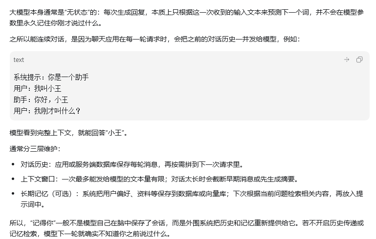

## 消息

消息是模型交互的基本单元，通过角色roal分为不同的类型。

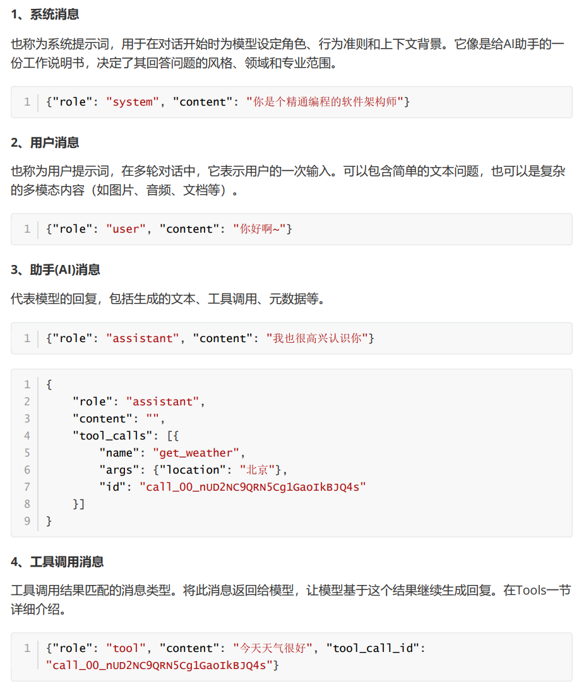


## 消息拓展属性

### content/content_blocks

content:数据内容，支持文本和列表，可以是字符串，也可以是图片

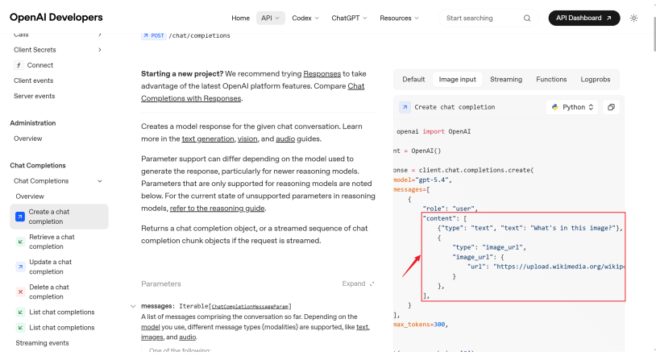

**content_blocks:** 目标是提供有一种跨模型供应商、标准化的多模态数据结构， 兼容content


## 提示词模板

**ChatPromptTemplate**：结构化的，包含多种元数据的消息列表已经取代了单一字符串，成为与模型交互的标准数据格式。

**模型的输入输出都是结构化的消息列表**，使用提示词模版，预先设置部分提示词，设置场景和角色。

支持 三种方式填充内容 invoke() 、 format() 、 format_messages()

```python
#参数类型这里使用的是tuple构成的list
prompt_template = ChatPromptTemplate([
	# 字符串 role + 字符串 content
	("system", "你是一个AI开发工程师. 你的名字是 {name}."),
	("human", "你能开发哪些AI应用?"),
	("ai", "我能开发很多AI应用, 比如聊天机器人, 图像识别, 自然语言处理等."),
	("human", "{user_input}")
])
#方式1：调用format()方法，返回字符串
prompt_value = prompt_template.format(name="小谷AI", user_input="你能帮我做什么?")

######结合提示词，调用大模型#########
# 得到模型的输出
output = model.invoke(prompt_value)
# 打印输出内容
print(output.content)

```


### 部分变量预填充 partial()

预填充某些固定不变的变量，创建模板的变体。 

**使用场景：** 某些变量在所有调用中都相同 需要为不同用户/场景创建定制模板

```python
from langchain_core.prompts import ChatPromptTemplate
# 原始模板
template = ChatPromptTemplate.from_messages([
("system", "你是{role}，目标用户是{audience}"),
("user", "{task}")
])
# 部分填充
customer_support_template = template.partial(
role="客服专员",
audience="普通用户"
)
# 现在只需要提供 task
messages = customer_support_template.invoke({"task":"解释退款政策"})
print(messages)

```


### 消息占位符

partial()只能填充部分变量，如果是在特定位置**插入消息列表**，

**使用场景**：多轮对话系统存储历史消息以及Agent的中间步骤处理此功能非常有用

##### 方式1：placeholder   JSON形式

```python
from langchain_core.prompts import ChatPromptTemplate
template = ChatPromptTemplate.from_messages(
    [
    ("system", "你是一个有用的AI助手"),
    ("placeholder", "{conversation}"),
    ]
)

prompt_value = template.invoke(
	{
		"conversation": [
            ("human", "你好!"),
            ("ai", "今天我能帮你做什么？"),
            ("human", "你能给我做一个冰激凌吗？"),
            ("ai", "抱歉，我没有这样的能力"),
		]
	}
)
print(prompt_value)
```

##### 方式2：MessagesPlaceholder实例

```python
from langchain_core.prompts import ChatPromptTemplate, MessagesPlaceholder
from langchain_core.messages import HumanMessage
prompt_template = ChatPromptTemplate.from_messages([
	("system", "You are a helpful assistant"),
	MessagesPlaceholder("msgs")
])
prompt_template.invoke({"msgs": [HumanMessage(content="hi!")]})
# prompt_template.format_messages(msgs=[HumanMessage(content="hi!")])
```

# 5、Tools

tools工具是能够支持模型与外部交互的关键能力。注意：**MCP只是模型调用的一种方式**

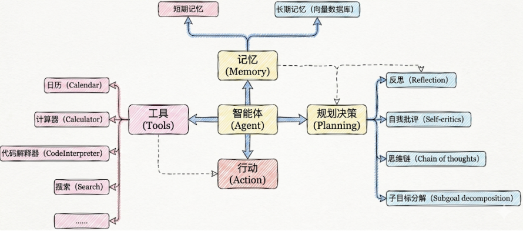


## @tool注解

可以自动将普通Python函数转换为智能体可调用的工具，方式最直接，代码量最少

```python
import os

from dotenv import load_dotenv
from langchain.chat_models import init_chat_model
from langchain_core.tools import tool


# 从 .env 文件中加载环境变量
load_dotenv(override=True)

CLOSEAI_API_KEY = os.getenv("CLOSEAI_API_KEY")
CLOSEAI_BASE_URL = os.getenv("CLOSEAI_BASE_URL")

model = init_chat_model(
    model="gpt-5.4-mini",
    model_provider="openai",
    api_key=CLOSEAI_API_KEY,
    base_url=CLOSEAI_BASE_URL,
)


# 定义工具
@tool
def get_weather(city: str) -> str:
    """获取指定城市的天气。"""
    # 你的实现
    return "晴天，温度 15°C"


# 绑定工具
model_with_tools = model.bind_tools([get_weather])

# AI 可以决定是否调用工具
response = model_with_tools.invoke("北京天气如何？")
# response = model_with_tools.invoke("2 + 3 = ？")

# 检查 AI 是否要调用工具
if response.tool_calls:
    print("AI 想调用工具：", response.tool_calls)
else:
    print("AI 直接回答：", response.content)
```


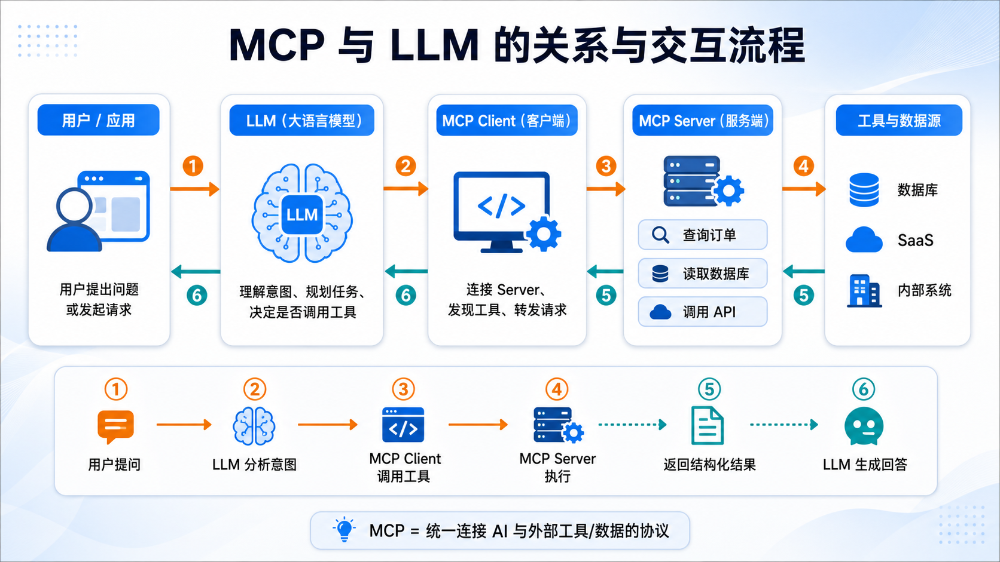


#### convert_to_openai_tool

加载工具的描述信息，指定参数类型已经函数功能。

三个双引号表示开始开始和结束

```python
def get_weather(dt: str, city: str="北京"):
    """
    天气查询工具
    Args:
    dt: 日期
    city: 城市名称
    """
	return f"{city}天气晴朗"
```

### 工具要求

1. 清晰的描述
2. 功能单一
3. 如何处理工具失败
   1. 工具内部处理，避免无效参数处理
   2. Agent级充实，可以在描述中写明，如果调用失败，可以尝试尝试方法解决问题
   3.  配置重试规则：如果失败，最多尝试 3 次（即第 1 次正常调用 + 2 次重试） @retry(stop=stop_after_attempt(3))
4. 结果返回字符串
5. 选择同步vs异步
   - **同步工具**：简单场景，CPU密集型任务
   - **异步工具**：IO密集型


# 6、结构化输出

LangChain的结构化输出（Structured Output） 指的是：模型的输出，而非对用户的输出。

**要求模型最终返回一个符合预定义结构的数据对象**，例如固定字段的JSON、Pydantic 模型、 TypedDict，而不再是无格式的自然语言文本。

**特点：**

- **更容易被代码处理**：下游可以直接读取，而不是从自然语言中再解析
- **结果更稳定**：减少模型解析语义错误导致的整体失败
- **更适合工程化**：适用于表单抽取、分类、路由、调用工具参数生成、工作流状态传递等场景。

**当前模型支持以下几种结构**

- Pydantic（字段校验、描述、嵌套结构，功能最丰富） 

- TypedDict（轻量类型约束） 

- JSON Schema（与前后端/跨语言接口最通用） 

- dataclass 

  

**模型对象可以调用 with_structured_output() 绑定输出模式（schema）。**

## Pydantic

通过在运行时强制执行类型提示，确保数据的正确性和一致性，是**生产场景首选**。

**需要满足的几个要素**：

-  所有结构化输出的数据模型都必须继承 BaseModel 
- 使用 类型提示 。Pydantic 支持丰富的字段类型：str 、int、float、List[xxx]、Optional[xxx]等 
- 使用 Field() 添加字段默认值和描述，帮助 LLM 理解字段含义


**使用场景**：调用模型之前，先指定返回结果格式

```python
class Person(BaseModel):
"""人物信息"""
name: str = Field(description="姓名")
age: int = Field(description="年龄")
occupation: str = Field(description="职业")

# 创建结构化输出的 LLM
structured_llm = model.with_structured_output(Person)
# 调用
result = structured_llm.invoke("张三是一名 30 岁的软件工程师")
print(result)
print(type(result))
# result 是 Person 实例
print(result.name) # "张三"
print(result.age) # 30
print(result.occupation) # "软件工程师"
```

**高级特性**

- Optional ：指定某个字段可选，非必须返回值
- Field(default="默认值", description="描述")：默认值
- **枚举**：属性定义为枚举：
  - \# 使用 Literal 直接限定字面量值 urgency: Literal["低","中","高"] = Field(description="紧急程度")
- 列表，定义属性为List
- 对象嵌套：属性是一个额外的对象属性，非基础字段，建议嵌套层级<=3
- 限制条件

**执行流程**：

1. 定义Pydantic结构
2. 协议转换：定义数据结构后，通过Pydantic的底层方法，将对象转换为标准的JSON Schema。
3. 模型交互与强约束：将该JSON Schema包装到大模型的输入，**JSON的处理作为tool传给LLM**，LLM有参数字段支持**语法采样约束**，输出时严格按JSON Schema的语法进行
4. 自动解析与验证：LLM返回JSON的字符串后，将解析，验证，并返回实际的对象。

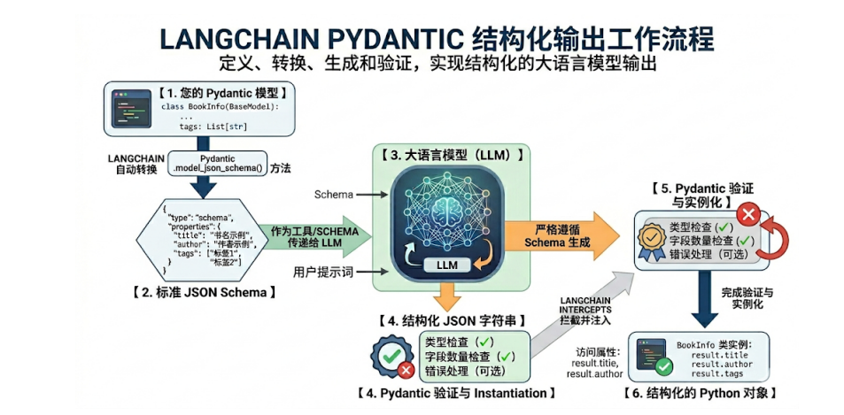

## TypedDict

**即带有类型声明的字典结构**，适合快速定义字典结构且无需Pydantic重量级的场景。

**TypedDict 主要是类型声明，不是运行时强校验器。**输出结果与目标类型不一致也不会抛异常


```python
from typing import TypedDict, List, Annotated
    # 使用TypedDict定义嵌套结构
class Actor(TypedDict):
    """演员情况"""
    name: Annotated[str, "演员姓名"]
    role: Annotated[str, "饰演的角色"]

class Movie(TypedDict):
    """电影情况"""
    title: Annotated[str, "电影标题"]
    year: Annotated[int, "上映年份"]
    director: Annotated[str, "导演"]
    cast: Annotated[List[Actor], "演员列表"] # 嵌套列表定义
    rating: Annotated[float, "评分"]

```


## JSON  Schema

交互以JSON Schema规范拼接JSON字符串，比较繁琐，而且缺少校验机制，不推荐

## @dataclass

@dataclass是Python标准库提供的类装饰器，自动生成常用方法，近似于手写这些方法的普通类。

- `__init__`
- `_repr__` 
- `__eq__`

```python
@dataclass
class Movie():
    """
    电影的详细信息
    """
    title: str = Field(description="电影标题")
    year: int = Field(description="电影上映年份")
    director: str = Field(description="导演")
    rating: float = Field(description="电影评分，满分十分")
    
structured_model = model.with_structured_output(Movie)
response = structured_model.invoke("给出盗梦空间的信息")
```


# 7、Agent

Agent的关键任务：理解用户问题、如何拆解任务、判断是否需要工具、需要哪些工具、输入根据工具结果生成回答&推进任务。

最核心的两个能力：**工具**和**记忆**

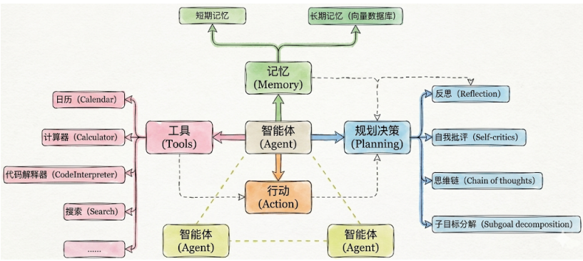


### Agent创建

创建一个agent本质上是LangGraph的**CompiledStateGraph**实例，底层实现是一个图结构。

Agent在创建时，涉及到模型、可调用工具、系统提示词等信息。

```python
from langchain.agents import create_agent
agent = create_agent(
    model: str | BaseChatModel, # 必需：聊天模型
    tools: List[BaseTool], # 必需：工具列表
    *,
    system_prompt: str = "", # 系统提示词
    middleware: Seguence[AgentMiddleware[StateT_co, ContextT]] = () # 中间件
    interrupt_before: List[str] = None, # 在某些工具前暂停（人机协作）
    interrupt_after: List[str] = None, # 在某些工具后暂停
    debug: bool = False # 调试模式
    name: str 丨 None = None, # 设置模型名称
)
```

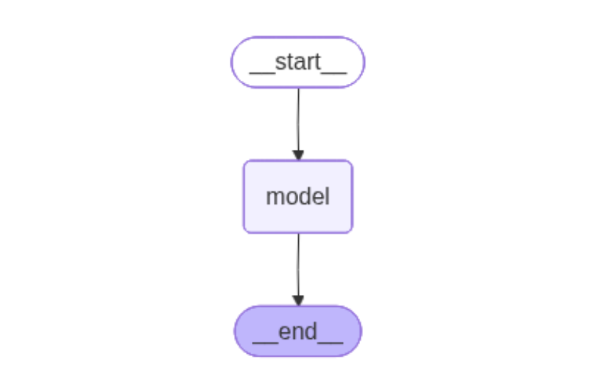

### Agent调用

**Agent的输入和输出都是messages字段的消息列表**

“ {"messages": [{"role": "...", "content": "..."}]} ”

```python
# response 是字典类型
{
    "messages": [
        HumanMessage(...), # 用户问题
        AIMessage(...), # AI 工具调用
        ToolMessage(...), # 工具返回结果
        AIMessage(...) # 最终回答 ← 通常取这个
    ]
}

```

LangChain对工具的使用就是一个**ReAct结构**，具备`思考-行动-观察`不断循环的自主工作者。

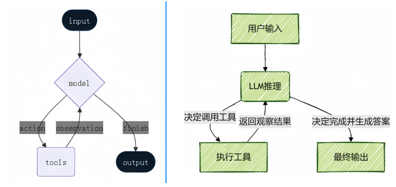

模型在返回调用工具时，可以一次返回多个工具的调用，AImessage返回多个工具的调用，调用完成后返回大模型请求结果。

```json
tool_calls=[
    {
        'name': 'get_weather',
        'args': {'city': '杭州'},
        'id': 'call_w9ARuAgN8iqfG2GR7gv00iBq',
        'type': 'tool_call'
    },
    {'name': 'get_news', 'args': {}, 'id':
    'call_vOLekRymIme8bWuVQdIew4vu', 'type': 'tool_call'}
]
```

**工具选择：**

大模型根据问题的内容、每个工具的描述、自动选择最匹配的工具。

### Agent命名

创建Agent时可以指定名称，返回AIMessage中带有**Name**信息

```python
agent = create_agent(
	model=model,
	name = "chat_assistant"
)

```

**使用场景**

- 流式输出通过name可以标识是哪个agent的输出
- 消息身份标记：AIMessage携带Agent的name，使它在保存会话记录、回放执行过程、构建审计日志时能够明确识别消息的生产者
- 调试和trace可读性方面，可以帮助开发者快速识别是哪个agent
- 组件化封装：工程实践中，Agent被封装为可复用的能力模块，设置名称方便保持一致的身份标识

### Agent系统提示词

创建agent时可以传入系统提示词，提示词为Agent 提供了任务背景、行为准则和操作指南。AIMessage返回时没有返回SystemMessage


### Agent的结构化输出

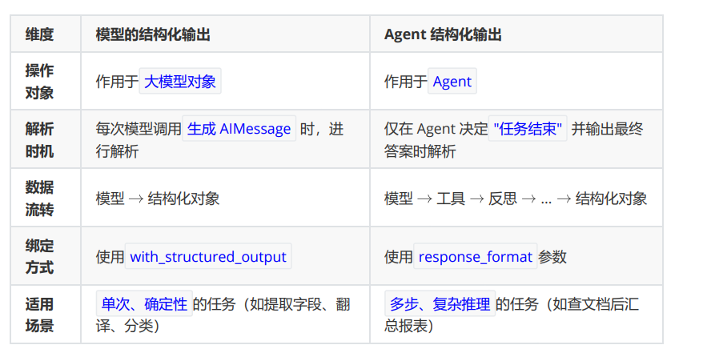

LangChain的create_agent()函数自动处理结构化输出的全过程。用户只需通过 `response_format`参数设置期望的输出模式（Schema）。

 当模型生成结构化数据时，系统会自动捕获、验证并将结果存储在Agent状态的 `structured_response` 键中。

#### ToolStrategy

当前模型兼容绝大部分模型，

**目的是**在模型生成最终答案时，系统会引导模型间接产生符合要求的结构化数据结果。

ToolStrategy通过 工具调用 （Tool Calling/Function Calling）实现结构化输出，所以LangChain会在 消息列表末尾 追加一条ToolMessage ，让整个链路完整。但实际上没有实际的工具执行，这是一条伪 消息。

受限于模型能力，大模型输出的内容可能并 不符合格式要求 ，ToolStrategy通过其 handle_errors参 数 提供了结构化过程错误处理策略，以下是主要的几种方式及其用途：

- handle_errors=True： LangChain默认方式 ， 捕获所有异常 ，并使用LangChain 内置的、信 息明确的 错误消息模板 提示模型重试，确保最终能得到符合预定格式的有效数据。适用于大多数 希望自动处理错误的通用场景。 
- handle_errors=False：关闭自动重试机制，任何异常都会 直接抛出 ，会 中断程序 运行。 
- handle_errors="自定义字符串"：捕获所有异常，但使用开发者 预设的固定字符串 作为错误消 息。适用于需要统一、友好的用户提示，或进行特定业务引导的场景。 
- handle_errors=ExceptionType：仅 捕获指定类型(如ValueError) 或元组中的异常类型并进行重 试， 其他异常直接抛出 。适用于需要 精准控制 ，只对特定错误进行重试的场景。 
- handle_errors=callable：灵活性最高的方式，使用开发者 自定义的函数来处理异常 ，可根据不 同的异常类型返回差异化的提示信息。适用于需要复杂、精细化错误处理的场景。


# 8、中间件

## 介绍

Middleware(中间件)，简单说就是Agent 执行过程中的钩子函数，开发者可以高度定制和控制Agent运行的每一个环节。

**没有中间件时：**

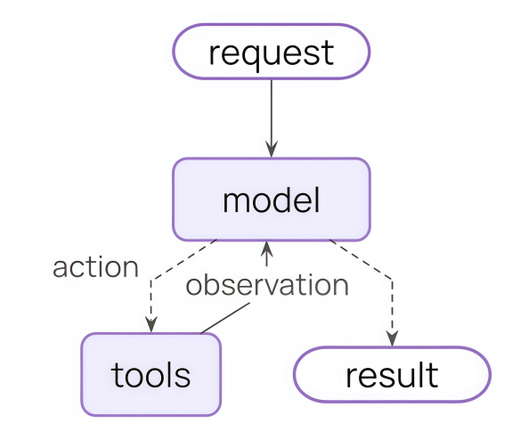

**有中间件后**：

在模型调用前、调用后、在工具调用前、工具调用后

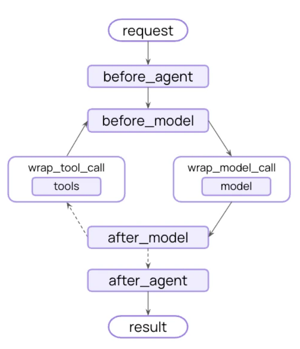

**它们不是 Agent 的核心业务逻辑，但又会影响 Agent 的执行过程。**没有中间件可能遇到的问题:

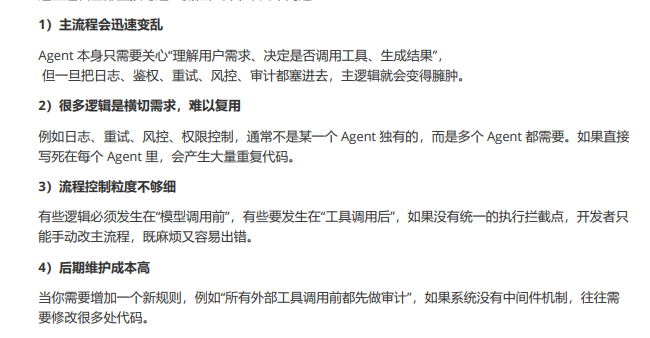

因此，Agent能够**把这些与业务无关的、但与执行过程强相关的横切逻辑，从Agent主流程中抽离出来，**让Agent主体代码**聚焦业务**，借助中间件，实现‘‘**拦截流程，修改流程，增强流程**’’。

可以自定义中间件，也可以使用LangChain提供的一些常用中间件。

- 成本统计和控制类
  - Model call limit：限制模型调用次数，防止一次任务反复请求 LLM，导致费用失控 
  - Tool call limit：限制工具调用次数，避免 Agent 无限试错、死循环调工具
  - Summarization：在上下文快满时自动总结历史，减少 token 消耗 
  - Context editing：裁剪上下文、清理工具调用痕迹，本质上也是为了节省上下文成本

适用于：控制成本、配额治理、长会话优化、以及产品控费等

- 稳定性与容错保障类
  - Model fallback：主模型失败时切换备用模型 
  - Model retry：模型调用失败后自动重试 
  - Tool retry：工具调用失败后自动重试

适用于：生产系统中高可用，容灾，鲁棒性建设

- 安全和合规风控
  - Human-in-the-loop：在关键工具调用前暂停，等人工审批 
  - PII detection：检测和处理个人敏感信息 
  - Model call limit / Tool call limit：某种意义上也可归到风控，因为它能防止异常滥用

- 执行能力拓展
  - Shell tool：给 Agent 持久 shell，会执行命令 
  - File search：给 Agent 文件搜索能力，能做 
  - Glob/Grep Filesystem：给 Agent 文件系统读写与长期存储能力

适用于：解决Agent只能聊天，不能真正操作环境


##  SummarizationMiddleware中间件

作用是：对历史消息进行总结&摘要，达到压缩上下文的效果

原理：在达到触发条件后，调用大模型对历史消息进行摘要，**将摘要结果作为HumanMessage，放在消息列表最开始的位置。用一条摘要消息替换旧消息，保留 `keep` 指定的最近消息，原样继续发送给模型。**

参数1：model —用于摘要的模型 可以是模型名称也可以是模型对象，如果传递的是模型名称，底层会调用 init_chat_model 初始化模 型。 

参数2：trigger —摘要触发条件 是一个列表，每个元素对应一个条件，当 任一条件满足 时，触发摘要。

1. tokens ：token的数量，历史token的累计数量达到该值触发摘要。 
2. messages ：历史消息数量，历史消息条数达到该值触发摘要。
3. fraction ：上下文长度比例。历史token的累计数量达到模型的 max_input_tokens*fraction 触 发摘要

参数3：keep —摘要时保留的原始消息 

支持三种条件，但和trigger不同，keep同一时间只接收一种条件。 

1. tokens ：摘要时保留的token数量。 
2. messages ：摘要时保留的历史消息条数。
3. fraction ：摘要时保留 max_input_tokens*fraction 个token。


**与Codex的区别**：

LangChain 是可明确配置的“摘要旧消息 + 保留最近 N 条”；Codex 也是摘要压缩，但保留策略更偏内部的任务连续性管理，不保证固定保留最近几条。

## hook

钩子函数，实现自定义中间件。类似AOP的方法，在某个特定的时机，被框架、系统或者主程序自动调用的拓展函数。无论是官方或者自定义中间件都是实现截图中的一个或者多个hook节点实现的。

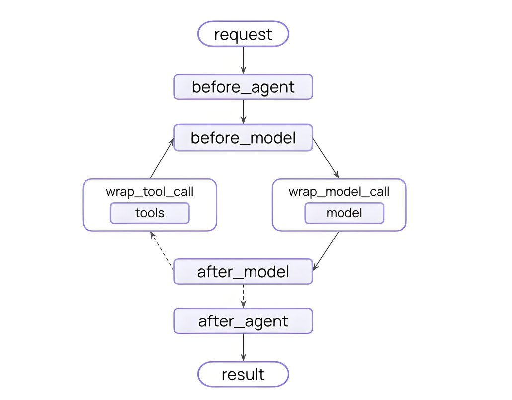

**Node-style hooks(节点风格钩子)**

在流程的特定节点运行：before_agent、before_model、after_model、after_agent

**Wrap-style hooks(包装风格钩子)**

在模型或者工具调用前后：wrap_model_call (包裹模型调用) wrap_tool_call (包裹工具调用)


### Node-style hooks

参数：

**state**: 是一个AgentState实例，维护Agent运行过程中的状态，这类状态会随着Agent的运行而发生变化，包括 消息列表 。 

**runtime**: 是一个Runtime实例，维护Agent运行过程中的上下文环境，包括 上下文 、 长期记忆 等。

**返回值**

- None：不修改状态
- 返回 {"jump_to": "..."}：跳转到其他节点


#### **函数用法**

装饰器是函数式挂载，把一个hook快速挂载到Agent的某个节点。在中间件方法增加注释，装饰器底层会基于重写的方法构造一个 **AgentMiddleware子类** 的实例，

**装饰器实现原理：**

1. 创建一个AgentMiddleware的子类 
2. 类名为middleware_name，即创建agent时传递的中间件名称，上述案例中是 after_model_middleware
3. 这个子类有两个属性 state_schema 和 tools 
4. 有一个方法： after_model ，逻辑等同于 func(state, runtime) 。
5. 最后的括号 () 表示实例化子类，返回一个对象

```python
return type(
    middleware_name,
    (AgentMiddleware,),
    {
        "state_schema": state_schema or AgentState,
        "tools": tools or [],
        "after_model":func(state, runtime),
    },
)()
```


**示例**

```python
# 1. 定义 before_model 钩子
@before_model
def before_model_middleware(
    state: AgentState,
    runtime: Runtime,
) -> dict[str, Any] | None:
    state["messages"][-1].content += " -> before_model <- "
    return None


# 2. 定义 after_model 钩子
@after_model
def after_model_middleware(
    state: AgentState,
    runtime: Runtime,
) -> dict[str, Any] | None:
    state["messages"][-1].content += " -> after_model <- "
    return None


# 3. 定义 before_agent 钩子
@before_agent
def before_agent_middleware(
    state: AgentState,
    runtime: Runtime,
) -> dict[str, Any] | None:
    state["messages"][-1].content += " -> before_agent <- "
    return None


# 4. 定义 after_agent 钩子
@after_agent
def after_agent_middleware(
    state: AgentState,
    runtime: Runtime,
) -> None:
    state["messages"][-1].content += " -> after_agent <- "
    return None


agent = create_agent(
    model=model,
    middleware=[
        before_model_middleware,
        after_model_middleware,
        before_agent_middleware,
        after_agent_middleware,
    ],  # 👈 添加中间件
)
```


#### **继承类实现**

1. 必须继承 AgentMiddleware ← 这个固定 
2. 方法名固定 ( before_model , after_model ) ← 这个固定 
3. 类名随意 ← 这个不固定


```python
class MyMiddleware(AgentMiddleware):
    def __init__(self) -> None:
        super().__init__()

    def before_model(self, state: AgentState, runtime: Runtime) -> dict[str, Any] | None:
        state["messages"][-1].content += " -> before_model <- "
        return None

    def after_model(self, state: AgentState, runtime: Runtime) -> dict[str, Any] | None:
        state["messages"][-1].content += " -> after_model <- "
        return None

    def before_agent(self, state: AgentState, runtime: Runtime) -> dict[str, Any] | None:
        state["messages"][-1].content += " -> before_agent <- "
        return None

    def after_agent(self, state: AgentState, runtime: Runtime) -> None:
        state["messages"][-1].content += " -> after_agent <- "
        return None


my_middleware = MyMiddleware()

agent = create_agent(
    model=model,
    middleware=[my_middleware],
)
```

### Wrap-style hooks

装饰器模式：@wrap_model_call

基于类实现：继承AgentMiddleware

和Node-style hook相似。**场景用于：拦截、重试、缓存模型的调用等。**

```python
class WrapModelCallMiddleware(AgentMiddleware):
    def wrap_model_call(self, request: ModelRequest, handler: Callable[[ModelRequest], ModelResponse]) -> ModelResponse | None:
        request.messages[-1].content += " -> wrap_model_call_before <- "

        response = handler(request)

        response.result[0].content += " -> wrap_model_call_after <- "
        return response


agent = create_agent(
    model=model,
    middleware=[WrapModelCallMiddleware()],
)
```


装饰器和类的选择 

- 装饰器写法适合把单个 hook 快速挂到 agent 生命周期的某个节点上； 
- 类写法更适合把多个 hook 组织为一个完整的中间件组件； 
- 当中间件同时涉及 before_model 、 after_model 等多个钩子时，虽然装饰器工厂也能实现，但 类写法在结构表达、配置归属、可维护性上更好。


装饰器写法更适合单个 hook、逻辑简单、快速原型的场景； 类写法更适合多个 hook 组合、复杂配置、需要同时提供同步/异步实现、以及更强复用与可测试 性的场景；


# 9、上下文与记忆

大模型是无状态的，不会记忆上下文，所以需要记忆模块去保存我们和模型对话的上下文信息，在下次请求时把历史信息都输入给模型，让模型输出结果。

记忆(Memory) 模块：核心作用是「 保存上下 文 」和「 提供上下文 」

LangChain提供了三种管理上下文的方法：

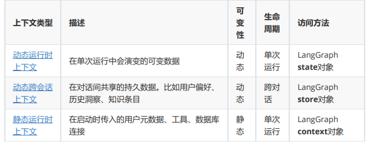

动态运行时上下文：就是短期记忆

动态跨会话上下文：长期记忆

- 短期记忆（Short-term memory、会话级记忆、thread-scoped memory）：作用范围是单个 对话线程（Thread）内，一旦开启新对话（更换 thread_id ），记忆即消失。 
- 长期记忆（Long-term memory，跨会话级记忆 ）：在会话间存储用户特定或应用级数据， 并 在 会话线程间共享 。它可以随时在任何线程中被调用。记忆的范围是任意自定义命名空间，而不 仅仅是单一线程 ID。

在LangChain中：Agent是构建在LangGraph图结构上的，通过state和store构 建记忆系统。使用更简单、功能更统一。 

- state：短期记忆对象，以 会话 为单位组织，包含当前会话的所有消息记录以及自定义信息。 
- store：长期记忆对象， 跨会话持久化 的数据，通常需要结合向量数据库或外部存储实现。


## 短期记忆

短期记忆是三者的组合：

State（会话内部状态） + Checkpointer（持久化机制） + Thread ID（会话作用域）

- State ：默认 存储历史消息列表messages ，通过State 管理历史消息 
- Checkpointer ：负责将State 作为检查点持久化保存，检查点是某个时刻的State 快照 （不是任何时刻都存储，而且到关键节点才会存储）
- Thread ID ：用于唯一标识State ，LangChain运行时会按照 thread_id 读写State快照

短期记忆的实现：

不必自己手动把所有的请求和返回Message进行组装，state会自己组装。


1. 第1步：初始化记忆引擎： checkpointer = InMemorySaver() ——创建一个内存级的记忆存储。 注意：InMemorySaver内存中保存，进程结束就丢失数据，适合测试。**生产环境可换成数据库持 久化的 SqliteSaver 、 PostgresSaver 等** 
2. 第2步：绑定 Agent：在 create_agent 时传入 checkpointer ，让 Agent 具备状态存储能力。 **创建Agent时传入InMemorySaver表示开启短期记忆**
3. 第3步：设定会话 ID：通过 config = {"configurable": {"thread_id": "1"}} 为每次调用指定线程标识。 同一个 thread_id 共享记忆，不同 thread_id 完全隔离。**会话时传入指定会话ID，即可共享当前会话的记忆，不同会话ID是隔离的**

**latest_state = agent.get_state(config)**可以获取配置中会话的所有短期记忆信息。

