# 1，NIO基础

non-blocking io 非阻塞 IO

## 1，三大组件

### 1.1， Channel & Buffer

- channel：读写数据的**双向通道**
- buffer：缓存
- channel可以把数据读取到buffer，也可以将buffer的数据写入到channel


常见的 Channel 有

* FileChannel
* DatagramChannel
* SocketChannel
* ServerSocketChannel

buffer 则用来缓冲读写数据，常见的 buffer 有

* ByteBuffer
  * MappedByteBuffer
  * DirectByteBuffer
  * HeapByteBuffer
* ShortBuffer
* IntBuffer
* LongBuffer
* FloatBuffer
* DoubleBuffer
* CharBuffer

### 1.2 Selector（选择器）


- ## 服务器的演化

  - ### 多线程版设计

    - ```mermaid
      graph TD
      subgraph 多线程版
      t1(thread) --> s1(socket1)
      t2(thread) --> s2(socket2)
      t3(thread) --> s3(socket3)
      end
      ```

    - 多线程处理，每个线程处理一个连接。（类似饭店吃饭，一名服务员会服务一个客人，多个客人就多名服务员）

    - ###### ==缺点==

      - 多线程占用内存高，（每个链接都占用一个线程）
    - 线程上下文切换成本高（因为太多的线程需要切换，所以切换频繁，消耗性能）
      - **只适合连接数少的场景**

  - ### 线程池版设计

    - ```mermaid
      graph TD
      subgraph 线程池版
      t4(thread) --> s4(socket1)
      t5(thread) --> s5(socket2)
      t4(thread) -.-> s6(socket3)
      t5(thread) -.-> s7(socket4)
      end
      ```
  
      （类似，一名服务员服务客人，必须服务完该客人点餐吃饭走后，才能去服务其他人）
  
    - ==缺点==
  
      - 线程池为**阻塞模式**，即（一个线程完全处理完该链接才能处理下一个链接）
      - 仅适合短链接的情况（会很快断开连接，以提高线程的使用率）
  
  - ### Selector 版设计
  
    - selector的作用就是配合一个线程管理多个channel，获取这些channel上发送的事件，channel是处于非阻塞模式下，有事件时，selector会发现，交给线程处理。**适合连接数特别多，但流量低的场景（low traffic）**（如果流量高的情况，则多个channel都请求处理，则一个线程只能执行一个请求，所以不适用）
  
    - ```mermaid
      graph TD
      subgraph selector 版
      thread --> selector
      selector --> c1(channel)
      selector --> c2(channel)
      selector --> c3(channel)
      end
      ```
  
    - 调用 selector 的 select() 会阻塞直到 channel 发生了读写就绪事件，这些事件发生，select 方法就会返回这些事件交给 thread 来处理


## 2，ByteBuffer

###  2.1 ByteBuffer的正确使用

```java
@Slf4j
public class ChannelDemo1 {
    public static void main(String[] args) {
        try (RandomAccessFile file = new RandomAccessFile("helloword/data.txt", "rw")) {
            FileChannel channel = file.getChannel();
            ByteBuffer buffer = ByteBuffer.allocate(10);
            do {
                // 向 buffer 写入
                int len = channel.read(buffer);
                log.debug("读到字节数：{}", len);
                if (len == -1) {
                    break;
                }
                // 切换 buffer 读模式
                buffer.flip();
                while(buffer.hasRemaining()) {
                    log.debug("{}", (char)buffer.get());
                }
                // 切换 buffer 写模式
                buffer.clear();
            } while (true);
        } catch (IOException e) {
            e.printStackTrace();
        }
    }
}
```


1. 读取文件的数据，向buffer中写入数据，例如调用 channel.read(buffer)
2. 调用flip（）切换至读模式
3. 从buffer读取数据，例如调用 buffer.get()
4. 调用clear（）或者 compact() 切换至**写模式**
5. 重复 1~4 步骤


### 2.2 ByteBuffer 结构

ByteBuffer有三个重要属性变量

- capacity
- position
- limit

开始时，如图。


**开始为写模式**，position为写入位置，limit等于capacity容量，下图表示写入了 4 个字节后的状态

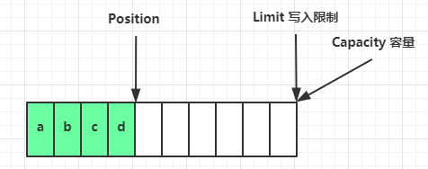

调用flip（）方法后，**ByteBuffer进行读模式**，position切换到起始位置，limit切换为读取限制

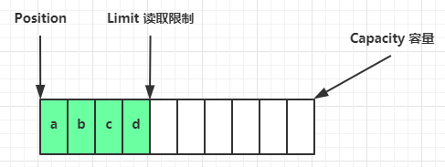

读取 4 个字节后，状态


调用clear()方法，重新进入读模式

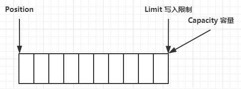

调用compact()方法，则是将未读完的数据向前压缩，然后切换至写模式。（clear()方法是直接全部清除，重新写入）

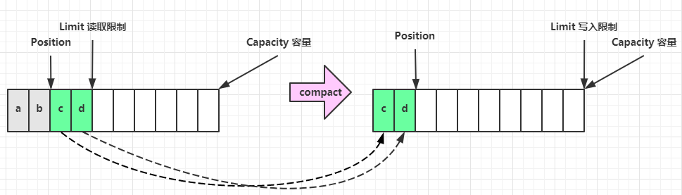

**注意：compact（）方法是将未读完的数据全部向前迁移，例：[A,B,C,D],读模式下，读取[A,B]，调用compact（）方法迁移后，实际为[C,D,C,D]。但是写的位置是从数组[2]，即第二个C的位置开始操作，也就是会覆盖向前迁移后遗留下的byte**


### 2.3 ByteBuffer 常见方法

#### 分配空间

- Bytebuffer buf = ByteBuffer.allocate(16);   class java.nio.HeapByteBuffer
- ByteBuffer.allocateDirect(16)；                     class java.nio.DirectByteBuffer  

两种方法属于不同的类，可以看出分别为堆内存和直接内存

- HeapByteBuffer：使用java堆内存，读写效率低，会受到GC影响（GC情况下会产生停顿以及垃圾回收后，为减少内存碎片会进行内存数据的迁移，都会造成效率的底下）
- DirectByteBuffer：使用系统的直接内存，读写效率高（因为首先是读数据到系统内存，然后再从系统内存到java管理的内存，而使用直接内存少了一次拷贝，效率必然高），不会受到GC的影响，分配效率低

#### 向 buffer 写入数据

- 调用 channel 的 read 方法
- 调用 buffer 自己的 put 方法

```java
int readBytes = channel.read(buf);
```

和

```java
buf.put((byte)127);
```

#### 从 buffer 读取数据

同样有两种办法

* 调用 channel 的 write 方法
* 调用 buffer 自己的 get 方法

```java
int writeBytes = channel.write(buf);
```

和

```java
byte b = buf.get();
```

get（）方法会使得position读指针后移，如果需要从头读取数据

- 可以调用 rewind 方法将 position 重新置为 0
- 或者调用 get(int i) 方法获取索引 i 的内容，**它不会移动读指针**


#### mark 和 reset

mark 是在读取时，做一个标记，即使 position 改变，只要调用 reset 就能回到 mark 的位置

> **注意**
>
> rewind 和 flip 都会清除 mark 位置

#### 字符串与 ByteBuffer 互转

Charset会直接切换到读模式，而put方法不会

```java
buffer.put("hello".getBytes());

ByteBuffer buffer1 = StandardCharsets.UTF_8.encode("你好");
ByteBuffer buffer2 = Charset.forName("utf-8").encode("你好");

debug(buffer1);
debug(buffer2);

CharBuffer buffer3 = StandardCharsets.UTF_8.decode(buffer1);
System.out.println(buffer3.getClass());
System.out.println(buffer3.toString());
```

#### ⚠️ Buffer 的线程安全

> Buffer 是**非线程安全的**

#### 2.4 Scattering Reads 分散读取

```java
try (RandomAccessFile file = new RandomAccessFile("helloword/3parts.txt", "rw")) {
    FileChannel channel = file.getChannel();
    ByteBuffer a = ByteBuffer.allocate(3);
    ByteBuffer b = ByteBuffer.allocate(3);
    ByteBuffer c = ByteBuffer.allocate(5);
    channel.read(new ByteBuffer[]{a, b, c});
    a.flip();
    b.flip();
    c.flip();
    debug(a);
    debug(b);
    debug(c);
} catch (IOException e) {
    e.printStackTrace();
}
```

## 3，文件编程

### 3.1 FileChannel

#### ⚠️ FileChannel 工作模式

> FileChannel 只能工作在阻塞模式下

#### 获取

不能直接打开FileChannel，必须通过FileInputStream、FileOutputStream或者RandomAccessFile 来获取 FileChannel，它们都有 getChannel 方法

* 通过 FileInputStream 获取的 channel 只能读
* 通过 FileOutputStream 获取的 channel 只能写
* 通过 RandomAccessFile 是否能读写根据构造 RandomAccessFile 时的读写模式决定

#### 读取

从channel中读取数据填充ByteBuffer，返回值表示读到了多少字节，-1表示达到了文件的末尾。

```java
int readBytes = channel.read(buffer);
```

#### 写入

写入的正确姿势如下， SocketChannel

```java
ByteBuffer buffer = ...;
buffer.put(...); // 存入数据
buffer.flip();   // 切换读模式

while(buffer.hasRemaining()) {
    channel.write(buffer);
}
```

在 while 中调用 channel.write 是因为 write 方法并不能保证一次将 buffer 中的内容全部写入 channel

#### 关闭

channel 必须关闭，不过调用了 FileInputStream、FileOutputStream 或者 RandomAccessFile 的 close 方法会间接地调用 channel 的 close 方法

#### 大小

使用 size 方法获取文件的大小


#### 强制写入

操作系统出于性能的考虑，会将数据缓存，不是立刻写入磁盘。可以调用 force(true)  方法将文件内容和元数据（文件的权限等信息）立刻写入磁盘


## 4. 网络编程

### 4.1 非阻塞 vs 阻塞

#### 阻塞

- 阻塞模式下，方法会导致线程暂停
  - ServerSocketChannel.accept 等待与客户端的连接建立，没有连接建立时线程阻塞
  - SocketChannel.read 等待接收数据，如果没有数据则阻塞
  - **阻塞的表现是线程暂停，暂停期间不会占用CPU，线程相当于闲置**
- 阻塞方法会相互影响，需要在多线程下进行
- **多线程存在的问题**
  - 32位JVM 一个线程320kb，64位jvm 一个线程1024kb，如果连接数过多，则必然出现OOM，并且线程数过多，线程切换频繁，消耗性能，执行效率不高
  - 可以采用**线程池技术来减少线程数和线程上下文切换**，但治标不治本，如果有很多连接建立，但长时间 inactive，会阻塞线程池中所有线程，因此不适合长连接，只适合短连接

#### 非阻塞

- 非阻塞模式下，相关方法不会造成阻塞
  -  ServerSocketChannel.accept 没有连接建立时，会返回null，继续运行
  - SocketChannel.read 在没有数据可读时，会返回 0，但线程不必阻塞，可以去执行其它 SocketChannel 的 read 或是去执行 ServerSocketChannel.accept 
  - 非阻塞模式下，写数据，线程只需等待数据写入channel即可，不必等待channel通过网络发送数据
- ==**问题**==
  - 非阻塞模式下，即使没有连接建立和数据可读，但线程仍在不断执行，CPU白白占用
  - 数据复制过程中，数据仍是阻塞的


### 4.2 Selector


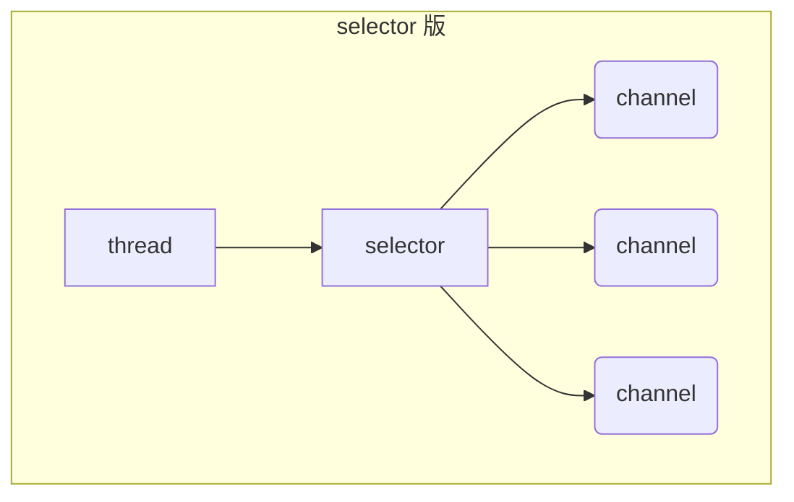

selector要与channel进行关联，即进行注册。事件发生后，可以通过selector查找相关channel的事件。

==**优点**==

- 一个线程配合selector可以监控多个channel的事件，只要事件发生后才回去处理。避免非阻塞模式下的性能消耗
- 线程能够充分利用。
- 节约了线程的数量
- 减少了线程间的上下文切换


- ### 流程

  - #### 创建

    ```java 
    Selector selelctor = Selector.open();
    ```

  - #### 绑定Channel事件

    注册事件，只有绑定的事件selector才能处理

    ```java
    channel.configureBlocking(false);
    SelectionKey key = channel.register(selector, 绑定事件);
    ```

  - channel必须工作在非阻塞模式下

  - FileChannel 没有非阻塞模式，因此不能配合 selector 一起使用

  - 绑定的事件类型为：

    - connect - 客户端连接成功时触发
    - accept - 服务器端成功接受连接时触发
    - read - 数据可读入时触发，有因为接收能力弱，数据暂不能读入的情况
    - write - 数据可写出时触发，有因为发送能力弱，数据暂不能写出的情况

  - #### 监听Channel事件

    - 通过以下三种方法监听是否有事件发生，方法的返回值表示有多少channel发生了事件

    - 阻塞直到绑定事件发生

      ```java
      int count = selector.select();
      ```

    - 阻塞直到绑定事件发生，或是超时（时间单位为 ms）

      ```java
      int count = selector.select(long timeout);
      ```

    - 不会阻塞，也就是不管有没有事件，立刻返回，自己根据返回值检查是否有事件

      ```java
      int count = selector.selectNow();
      ```

      

#### 💡select何时不阻塞

- 事件发生时
  - 客户端发起连接请求，会触发accept事件
  - 客户端发送数据过来，客户端正常、异常关闭，都会触发read事件，另外如果发送的数据大于buffer缓冲区，会触发多次读取事件
  - channel可写，会触发write事件
  - 在Linux下nio bug发生时
- 调用 selector.wakeup()
- 调用 selector.close()
- selector 所在线程 interrupt

### 4.3 处理 accept 事件

#### 💡 事件发生后能否不处理

> 事件发生后，要么处理，要么取消（cancel），不能什么都不做，否则下次该事件仍会触发，这是因为 nio 底层使用的是水平触发

### 4.4 处理 read 事件

```java
@Slf4j
public class ChannelDemo6 {
    public static void main(String[] args) {
        try (ServerSocketChannel channel = ServerSocketChannel.open()) {
            channel.bind(new InetSocketAddress(8080));
            System.out.println(channel);
            Selector selector = Selector.open();
            channel.configureBlocking(false);
            channel.register(selector, SelectionKey.OP_ACCEPT);

            while (true) {
                int count = selector.select();
//                int count = selector.selectNow();
                log.debug("select count: {}", count);
//                if(count <= 0) {
//                    continue;
//                }

                // 获取所有事件
                Set<SelectionKey> keys = selector.selectedKeys();

                // 遍历所有事件，逐一处理
                Iterator<SelectionKey> iter = keys.iterator();
                while (iter.hasNext()) {
                    SelectionKey key = iter.next();
                    // 判断事件类型
                    if (key.isAcceptable()) {
                        ServerSocketChannel c = (ServerSocketChannel) key.channel();
                        // 必须处理
                        SocketChannel sc = c.accept();
                        sc.configureBlocking(false);
                        sc.register(selector, SelectionKey.OP_READ);
                        log.debug("连接已建立: {}", sc);
                    } else if (key.isReadable()) {
                        SocketChannel sc = (SocketChannel) key.channel();
                        ByteBuffer buffer = ByteBuffer.allocate(128);
                        int read = sc.read(buffer);
                        if(read == -1) {
                            key.cancel();
                            sc.close();
                        } else {
                            buffer.flip();
                            debug(buffer);
                        }
                    }
                    // 处理完毕，必须将事件移除
                    iter.remove();
                }
            }
        } catch (IOException e) {
            e.printStackTrace();
        }
    }
}
```

#### 💡 为何要 iter.remove()

因为select在事件发生后，就会将相关的 key 放入 selectedKeys 集合，处理后，不会自动删除，需要我们自己进行删除。例如：

* 第一次触发了 ssckey 上的 accept 事件，没有移除 ssckey 。
* 第二次触发了 sckey 上的 read 事件，但这时 selectedKeys 中还有上次的 ssckey ，在处理时因为没有真正的 serverSocket 连上了，就会导致空指针异常（空指针异常的原因是，accept事件已经被处理过一次，再次调用accept()方法，会返回null，则后续的处理出现空指针异常）


#### 💡 cancel 的作用

> cancel 会取消注册在 selector 上的 channel，并从 keys 集合中删除 key 后续不会再监听事件

cancel可以用在客户端取消连接后，服务器捕获到异常后，将该key取消，即selector中不再监听该channel。


#### 处理消息的边界

发送消息长度是不固定的，所以在发送和接收方的处理方式有三种

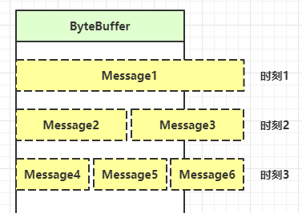

- 一种思路是固定消息长度，数据包大小一样，服务器按预定长度读取，缺点是浪费带宽
- 另一种思路是按分隔符拆分，缺点是效率低
- TLV 格式，即 Type 类型、Length 长度、Value 数据，类型和长度已知的情况下，就可以方便获取消息大小，分配合适的 buffer，缺点是 buffer 需要提前分配，如果内容过大，则影响 server 吞吐量
  * Http 1.1 是 TLV 格式
  * Http 2.0 是 LTV 格式


#### ByteBuffer 大小分配

- 每个channel都需要记录可能被切分消息，因为ByteBuffer不能被多个channel共同使用，因此需要为每个channel维护一个独立的ByteBuffer
- ByteBuffer不能太大，比如一个ByteBuffer 1Mb的话，如果支持百万连接，则需要1Tb内存，因此需要设计大小可变的ByteBuffer
  - 一种思路是首先分配一个较小的 buffer，例如 4k，如果发现数据不够，再分配 8k 的 buffer，将 4k buffer 内容拷贝至 8k buffer，优点是消息连续容易处理，缺点是数据拷贝耗费性能，参考实现 [http://tutorials.jenkov.com/java-performance/resizable-array.html](http://tutorials.jenkov.com/java-performance/resizable-array.html)
  - 另一种思路是用多个数组组成 buffer，一个数组不够，把多出来的内容写入新的数组，与前面的区别是消息存储不连续解析复杂，优点是避免了拷贝引起的性能损耗


### 4.5 处理 write 事件


一次无法写完的例子

- 非阻塞模式下，无法保证吧buffer中所有的数据都写入到channel，因此需要追踪write方法的返回值（代表实际写入的字节数）
- 用selector监听所有channel的可写事件，每个channel都需要一个key来跟踪buffer，到哪这样又会占用内存过多，因此通过两阶段策略
  - 当消息处理器第一次写消息时，财经channel注册到selector上
  - selector检查channel上的可写事件，如果所有的数据写完了就取消channel的注册
  - 如果不取消，会每次可写均触发write事件

## 5，NIO 和BIO

### 5.1 stream 和channel

- 不同点

  - stream不能自动缓冲数据，channel会利用系统提供的发送缓冲区，接收缓冲区

  - stream仅支持阻塞API（即调用方法会阻塞），channel阻塞API和非阻塞API均支持，网络channel可配合selector实现多路复用

- 相同点：
  - 二者均为全双工，即读写同时进行

### 5.2 IO 模型

看复习-操作系统-IO模型梳理

### 5.3 零拷贝技术

看复习-操作系统-零拷贝技术


# 2，Netty入门

## 1，了解Netty

### 1.1 定义

Netty是一个异步的，基于事件驱动的网络应用框架，用于快速开发可维护，高性能的网络服务器和客户端


### 1.3 Netty 的地位

涉及到java开发，凡是涉及到网络通信，都有Netty的影子。如同Spring在java中的地位

### 1.4 Netty优势

- Netty是基于NIO开发，直接使用NIO开发，工作量大，bug多
  - 需要自己构建协议
  - 解决TCP传输问题，如粘包，半包
  - epoll 空轮询导致CPU100%
  - 对API进行增强，使之更易用，
- Netty vs 其他应用框架
  - Netty开发迭代快，API更简洁，文档更优秀
  - netty已经出版将近20年，稳定性强


## 2 hello world

客户端向服务器发送hello，world

### 服务器端

```java
// 1 启动服务器，组装netty组件
new ServerBootstrap()
    // 2 绑定selector和线程 分组
    .group(new NioEventLoopGroup()) // 1
    // 3 选择服务器的实现类
    .channel(NioServerSocketChannel.class) // 2
    // 4 handler 处理器 负责处理哪些读写
    .childHandler(  //3
    // 5 channel 代表和客户端进行数据读写的通道初始化，
    new ChannelInitializer<NioSocketChannel>() {
        @Override
        protected void initChannel(NioSocketChannel nioSocketChannel) throws Exception {
            // 添加具体的handler
            nioSocketChannel.pipeline().addLast(new StringDecoder()); //4
            nioSocketChannel.pipeline().addLast(new ChannelInboundHandlerAdapter() { // 5
                @Override
                // 读事件
                public void channelRead(ChannelHandlerContext ctx, Object msg) throws Exception {
                    System.out.println(msg);
                }
            });
        }
    }
)
    .bind(8080); //6
```

1. 创建NioEventLoopGroup， 选择线程池和seletor
2. 选择服务socket实现类，其中NioserverSocketChannel 表示基于NIO的服务器端实现，其他实现还有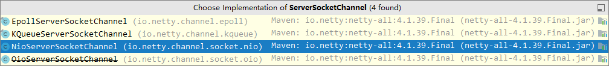
3. handler ，添加处理器给socketChannel调用，而ChannelInitializer 处理器（仅执行一次），它的作用是待客户端SocketChannel 建立连接后，执行initChannel 添加更多的处理器
4. SocketChannel 的处理器，解码 ByteBuf => String
5. SocketChannel 的业务处理器，使用上一个处理器的处理结果
6. 绑定端口

### 客户端

```java
// 1 启动类
new Bootstrap()
    // 2 增加Eventloop
    .group(new NioEventLoopGroup()) // 1
    // 3 选择客户端 channel 实现
    .channel(NioSocketChannel.class) // 2
    // 4 添加处理器
    .handler(new ChannelInitializer<Channel>() { // 3

        @Override // 在连接建立后被调用
        protected void initChannel(Channel channel){
            channel.pipeline().addLast(new StringEncoder());  //8
        }
    })
    // 5 连接到服务器
    .connect("127.0.0.1", 8080) //4
    .sync()  //5
    .channel() // 6
    // 6 向服务器发送数据
    .writeAndFlush("hello, world");  7
```

1. 创建NioEventLoopGroup 

2. 选择客户Socket 实现类，NioSocketChannel 表示基于NIO的客户端实现，还有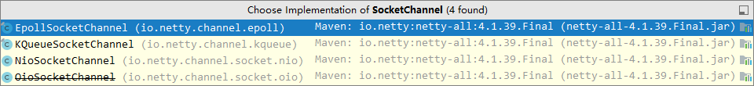

3. 与server相同

4. 指定要连接的服务器和端口

5. Netty 调用sync，异步等待connet建立连接

6. 获取channel对象，通过channel进行数据读写

7. 写入数据并清空缓冲区

8.  消息会经过通道handler 处理，此处是将String->ByteBuf

   数据通过网络传输，到达服务器，服务器端5,6,的handler先后被触发（将byteBuf转换为string，再调用handler处理）

### 流程梳理

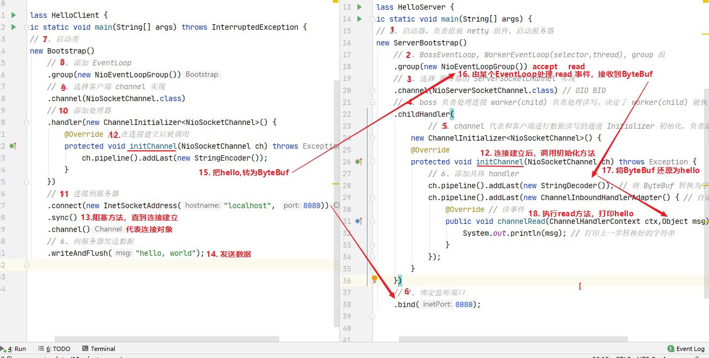

首先创建server服务器，创建客户端，然后连接客户端，然后再执行服务器的channel初始化方法，再执行客户端的channel初始化方法，客户端发送数据，，客户端会将数据进行处理，将string转换为bytebuf，服务器收到数据也是将bytebuf转换成string，然后再执行数据的处理操作


- channel：数据的传输通道
- msg为流动的数据，流入通道为byteBuf，经过pipeline加工，会变成其他类型对象，最后输出又变成ByteBuf
- handler为数据处理适配器
  - pipeline，负责发布事件，传播给每个handler，handler对自己负责的事情进行处理（会重新对应事件的处理方法）
  - 即pipeline发布对通道channel的处理操作
- 把eventloop理解为处理数据的seletor
  - eventloop负责多个channel的io操作，一旦绑定了该channel，则需要一直负责
  - eventloop 还可以执行任务处理，都有任务队列，可以放多个channel的任务，任务可以是普通任务和定时任务
  - eventloop按照pipeline顺序，依次按照handler的规划处理数据

## 3 组件

### 3.1 Eventloop

Eventloop 本质上是一个单线程的执行器（同时维护了一个seletor），里面有run方法处理channel上的IO事件

它的继承关系比较复杂

* 一条线是继承自 j.u.c.ScheduledExecutorService 因此包含了线程池中所有的方法
* 另一条线是继承自 netty 自己的 OrderedEventExecutor，
  * 提供了 boolean inEventLoop(Thread thread) 方法判断一个线程是否属于此 EventLoop
  * 提供了 parent 方法来看看自己属于哪个 EventLoopGroup


EventloopGroup 是一组EventLoop，channel一般会调用EventLoopGroup的register方法绑定其中一个EventLoop，后续该channel的IO事件由该EventLoop来处理（保证了IO事件处理时的线程安全，因为只有该eventLoop处理该事件）

可遍历EventLoopGroup


#### 关闭EventLoopGroup

优雅关闭 `shutdownGracefully` 方法。该方法会首先切换 `EventLoopGroup` 到关闭状态从而拒绝新的任务的加入，然后在任务队列的任务都处理完成后，停止线程的运行。从而确保整体应用是在正常有序的状态下退出的

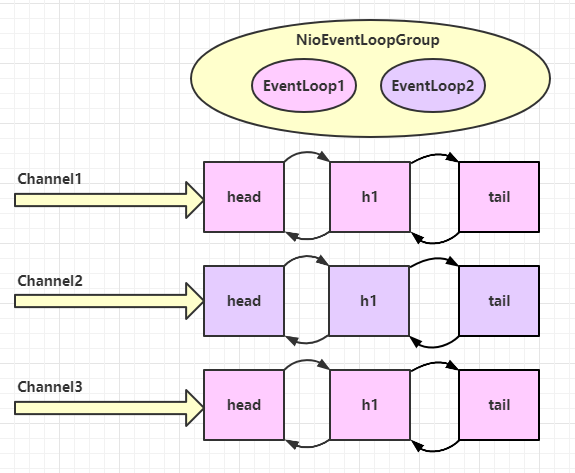

若EventLoopGroup中只有两个eventLoop，则即使多个通道，仍是只有这两个处理，且一旦绑定，则该eventloop一直处理该channel。一个eventloop可以绑定多个channel。


#### 更换EventLoopGroup

若事件处理复杂，消耗时间，可以指定外部新的eventloop指定任务。

外部创建新的eventloop。在初始化channel时，添加处理时addLast（），指定group。下图所示

```java
DefaultEventLoopGroup normalWorkers = new DefaultEventLoopGroup(2);
new ServerBootstrap()
    .group(new NioEventLoopGroup(1), new NioEventLoopGroup(2))
    .channel(NioServerSocketChannel.class)
    .childHandler(new ChannelInitializer<NioSocketChannel>() {
        @Override
        protected void initChannel(NioSocketChannel ch)  {
            ch.pipeline().addLast(new LoggingHandler(LogLevel.DEBUG));
            ch.pipeline().addLast(normalWorkers,"myhandler",
              new ChannelInboundHandlerAdapter() {
                @Override
                public void channelRead(ChannelHandlerContext ctx, Object msg) {
                    ByteBuf byteBuf = msg instanceof ByteBuf ? ((ByteBuf) msg) : null;
                    if (byteBuf != null) {
                        byte[] buf = new byte[16];
                        ByteBuf len = byteBuf.readBytes(buf, 0, byteBuf.readableBytes());
                        log.debug(new String(buf));
                    }
                }
            });
        }
    }).bind(8080).sync();
```

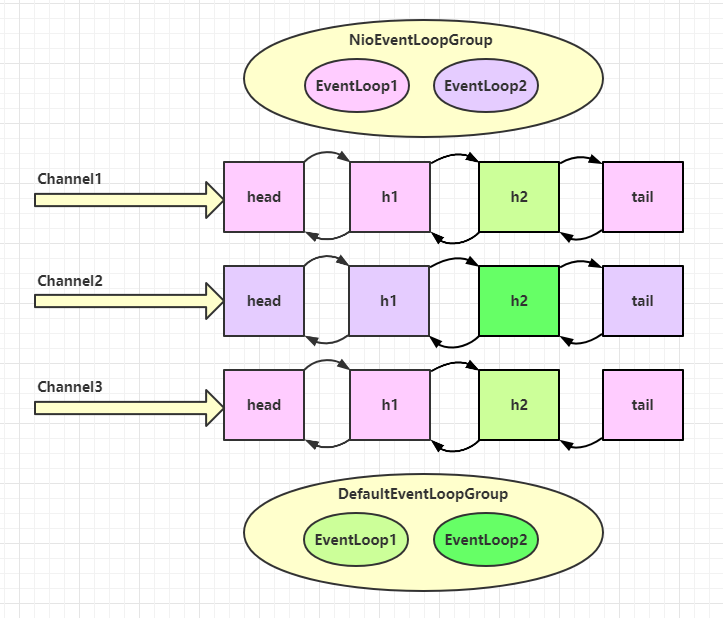


**Netty源码**

解释了可以进行更换eventloopGroup，在代码执行时，首先获取下一个执行的handler（即eventloop），判断是否为当前的eventloop，若是，则直接执行下一个handler的invokeChannelRead，若不是，则由新的eventloop以线程的方式执行invokeChannelRead方法

键代码 `io.netty.channel.AbstractChannelHandlerContext#invokeChannelRead()`

```java
static void invokeChannelRead(final AbstractChannelHandlerContext next, Object msg) {
    final Object m = next.pipeline.touch(ObjectUtil.checkNotNull(msg, "msg"), next);
    // 下一个 handler 的事件循环是否与当前的事件循环是同一个线程
    EventExecutor executor = next.executor();
    
    // 是，直接调用
    if (executor.inEventLoop()) {
        next.invokeChannelRead(m);
    } 
    // 不是，将要执行的代码作为任务提交给下一个事件循环处理（换人）
    else {
        executor.execute(new Runnable() {
            @Override
            public void run() {
                next.invokeChannelRead(m);
            }
        });
    }
}
```

* 如果两个 handler 绑定的是同一个线程，那么就直接调用
* 否则，把要调用的代码封装为一个任务对象，由下一个 handler 的线程来调用


### 3.2 channel

channel主要用于传输数据

- conne连接建立：**客户端建立时，connect()方法是当前线程调用，但eventloop来异步执行建立连接的**
- sync方法，是同步阻塞，等待channel连接建立完成，当前线程继续执行。
- addListenter方法是异步等待channel连接建立，即连接建立后会调用addListenter方法中的设置，交给建立连接的eventloop来执行设置的内容

- close() 用来关闭channel
- closeFuture()用来处理channel的关闭
  - sync 方法作用是同步等待 channel 关闭，同上
  - 而 addListener 方法是异步等待 channel 关闭，同上
- pipeline（）方法添加handler处理器
- write（）方法将数据写入
- writeAndFlush（）方法将数据写入并flush清空缓存


若没有调用sync方法或者addListener方法，则连接未建立成功，就执行后续代码，未能成功发送数据

**sync方法**

```java
ChannelFuture channelFuture = new Bootstrap()
    .group(new NioEventLoopGroup())
    .channel(NioSocketChannel.class)
    .handler(new ChannelInitializer<Channel>() {
        @Override
        protected void initChannel(Channel ch) {
            ch.pipeline().addLast(new StringEncoder());
        }
    })
    .connect("127.0.0.1", 8080); // 1

channelFuture.sync().channel().writeAndFlush(new Date() + ": hello world!");
```

**注意** connect 方法是异步的，意味着不等连接建立，方法执行就返回了。因此 channelFuture 对象中不能【立刻】获得到正确的 Channel 对象

**addListener() 方法**

```java
ChannelFuture channelFuture = new Bootstrap()
    .group(new NioEventLoopGroup())
    .channel(NioSocketChannel.class)
    .handler(new ChannelInitializer<Channel>() {
        @Override
        protected void initChannel(Channel ch) {
            ch.pipeline().addLast(new StringEncoder());
        }
    })
    .connect("127.0.0.1", 8080);
System.out.println(channelFuture.channel()); // 1
channelFuture.addListener((ChannelFutureListener) future -> {
    System.out.println(future.channel()); // 2
});
```


### 异步提升的是什么

* 有些同学看到这里会有疑问：为什么不在一个线程中去执行建立连接、去执行关闭 channel，那样不是也可以吗？非要用这么复杂的异步方式：比如一个线程发起建立连接，另一个线程去真正建立连接

* 还有同学会笼统地回答，因为 netty 异步方式用了多线程、多线程就效率高。其实这些认识都比较片面，多线程和异步所提升的效率并不是所认为的


- 单线程没办法异步提高效率，必须配合多线程，多核CPU才能发挥异步的优势
- 异步并没有缩短相应时间，反而因为线程间的切换增加了时间消耗，但异步情况下，增加了整体的吞吐量（因为多线程并行执行，没有阻塞）
- 合理进行执行任务拆分，进行解耦

### 3.3 Future & Promise

异步处理时的两个接口。

Promise继承了netty.Future，netty.Future继承了jdk的Future

- jdk Future只能同步等待任务结束才能得到的结构
- netty.Future 可以同步等待任务结束得到的结果，也可以异步方式得到结构，但要等到如未能结束
- netty.Promise继承了netty.Future，并脱离了任务独立存在，作为两个线程间传递结果的容器

| 功能/名称    | jdk Future                     | netty Future                                                 | Promise      |
| ------------ | ------------------------------ | ------------------------------------------------------------ | ------------ |
| cancel       | 取消任务                       | -                                                            | -            |
| isCanceled   | 任务是否取消                   | -                                                            | -            |
| isDone       | 任务是否完成，不能区分成功失败 | -                                                            | -            |
| get          | 获取任务结果，阻塞等待         | -                                                            | -            |
| getNow       | -                              | 获取任务结果，非阻塞，还未产生结果时返回 null                | -            |
| await        | -                              | 等待任务结束，如果任务失败，不会抛异常，而是通过 isSuccess 判断 | -            |
| sync         | -                              | 等待任务结束，如果任务失败，抛出异常                         | -            |
| isSuccess    | -                              | 判断任务是否成功                                             | -            |
| cause        | -                              | 获取失败信息，非阻塞，如果没有失败，返回null                 | -            |
| addLinstener | -                              | 添加回调，异步接收结果                                       | -            |
| setSuccess   | -                              | -                                                            | 设置成功结果 |
| setFailure   | -                              | -                                                            | 设置失败结果 |


### 3.4 Handler & Pipeline

handler用来处理channel上的事件，分为入站和出站两种，而所有的handler连接在一串就是pipeline。

- 入站处理器就是channelInboundHandlerAdapter的子类，读取客户端传来的数据，写回结果
- 出站处理器就是channelOutBoundHandlerAdapter的子类，对写回的结果进行加工


channel.pipeline().addLast() 增加handler处理器。**ChannelInboundHandlerAdapter 是按照 addLast 的顺序执行的，而 ChannelOutboundHandlerAdapter 是按照 addLast 的逆序执行的。**ChannelPipeLine的实现是一个ChannelHandlerContext（包装了ChannelHandler）组成的双向链表


入站处理器为执行下一个入站处理器的方法，需要调用（ChannelHandlerContext）ctx.fireChannelRead(msg) 方法或者super.fireChannelRead(msg)，否则双向链表断裂。


super.fileChannelRead=>（ChannelHandlerContext）ctx.channel.fireChannelRead(msg)

因此，入站处理器中，调用ctx或者super都是从双向链表的当前位置向后遍历，找到下一个入站处理器。

出站处理器中，ctx是从双向链表的当前位置向前遍历，找到下一个出站处理器，super则是从channel整个pipeline中倒序遍历找到下一个出站处理器。


图1 - 服务端 pipeline 触发的原始流程，图中数字代表了处理步骤的先后次序

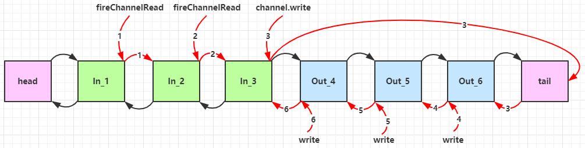


### 3.5 ByteBuf

对字节数据的封装

- ### 创建

  - ByteBuf buffer = ByteBufAllocator.DEFAULT.buffer(10); 
  - 基于直接内存创建对象

- ### 直接内存 和堆内存

  - 创建池化基于堆内存的ByteBuf
    - ByteBuf buffer = ByteBufAllocator.DEFAULT.heapBuffer(10);
  - 创建池化基于直接内存的ByteBuf
    - ByteBuf buffer = ByteBufAllocator.DEFAULT.directBuffer(10);
  - 直接内存创建和销毁的代价昂贵，但读写性能高（因为减少了用户态与内核态的转换，以及数据的复制）
  - 直接内存不涉及GC，而堆内存会受到jvm的GC影响，stop the world和内存数据迁移的问题

- ### 池化 vs 非池化

  - 池化可以重用ByteBuf，
    - 没有池化时，每次都需要创建新的ByteBuf，无论是在直接内存还是堆内存都消耗性能
    - 池化操作，重用池中的ByteBuf实例，并采用jemalloc类似的内存分配算法提升效率
    - 高并发时，池化功能更解约内存，减少内存溢出的可能
  - 默认开启ByteBuf的池化操作，但Android使用非池化。

- ### 组成

  - 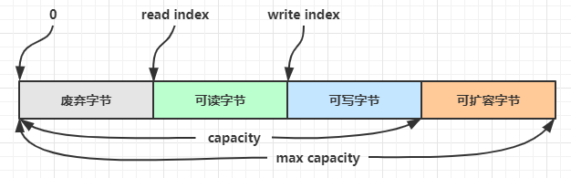
  - 开始时，读写指针都在0位置

- ### 写入

  - | 方法签名                                                     | 含义                   | 备注                                                    |
    | ------------------------------------------------------------ | ---------------------- | ------------------------------------------------------- |
    | writeBoolean(boolean value)                                  | 写入 boolean 值        | 用一字节 01\|00 代表 true\|false                        |
    | writeByte(int value)                                         | 写入 byte 值           |                                                         |
    | writeShort(int value)                                        | 写入 short 值          |                                                         |
    | writeInt(int value)                                          | 写入 int 值            | （高位写入）Big Endian，即 0x250，写入后 00 00 02 50    |
    | writeIntLE(int value)                                        | 写入 int 值            | （低位写入）Little Endian，即 0x250，写入后 50 02 00 00 |
    | writeLong(long value)                                        | 写入 long 值           |                                                         |
    | writeChar(int value)                                         | 写入 char 值           |                                                         |
    | writeFloat(float value)                                      | 写入 float 值          |                                                         |
    | writeDouble(double value)                                    | 写入 double 值         |                                                         |
    | writeBytes(ByteBuf src)                                      | 写入 netty 的 ByteBuf  |                                                         |
    | writeBytes(byte[] src)                                       | 写入 byte[]            |                                                         |
    | writeBytes(ByteBuffer src)                                   | 写入 nio 的 ByteBuffer |                                                         |
    | int writeCharSequence(CharSequence sequence, Charset charset) | 写入字符串             |                                                         |

  - > 注意
    >
    > * 这些方法的未指明返回值的，其返回值都是 ByteBuf，意味着可以链式调用
    > * 网络传输，默认习惯是 Big Endian

- ### 扩容

  - 写入数据，容量不足时，触发扩容。初始容量为10
  - 扩容规则是
    - 若写入后的数据未超过512，则选择16的整数倍
    - 若写入后的数据超过512，则为2^n
    - 扩容不能超过max capacity 否则会报错

- ### retain & release

  - **ByteBuf的特殊性，pipeline链式handler处理数据，若当前handler处理完byteBuf，可能后续的handler也会调用ByteBuf，因此不能直接回收，**

  - 内存回收，由于Netty中有堆内存和直接内存不同的实现，直接内存选择手动回收

    - 未池化的堆内存ByteBuf，使用jvm内存，等待GC回收
    - 未池化的直接内存ByteBuf，手动回收
    - 池化的ByteBuf和它的子类，需要更复杂的回收方式

  - > 回收内存的源码实现，请关注下面方法的不同实现
    >
    > `protected abstract void deallocate()`

  - Netty采用**引用计数法**进行回收，每个 ByteBuf 都实现了 ReferenceCounted 接口

    - 调用release方法，计数减一
    - 调用retain方法，计数加一，表示调用者还没处理结束，其他handler调用了release也不会回收
    - 计数为0，底层内存回收，即使ByteBuf对象存在，则各个方法均无法正常使用

  - 基于ByteBuf的特殊性，基本规则是**谁是最后使用者，谁负责release**，pipeline如下所示，出入站，head和tail分别是出站处理器和入站处理器，实现了对应类，可释放bytebuf消息

    - 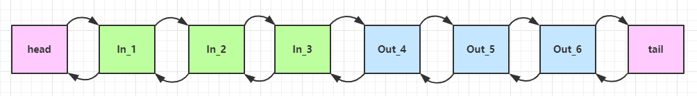
    - 入站ByteBuf处理原则
      - 对原始ByteBuf不做处理，调用fireChannelRead（msg）向后传递，不必release
      - 将原始的ByteBuf，转换为其他类型对象，则必须release
      - 若不调用fireChannelRead（msg），不再向后传递，必须release
      - 注意异常处理，出现异常情况导致没能传递到下一个handler，必须release
      - 若消息一直往后传，则tailContext会释放未处理的消息。
    - 出站ByteBuf处理原则
      - 出站消息最终都会转为 ByteBuf 输出，一直向前传，由 HeadContext flush 后 release
    - 异常处理原则
      * 有时候不清楚 ByteBuf 被引用了多少次，但又必须彻底释放，可以循环调用 release 直到返回 true

- ### 零拷贝的体现

  - #### slice 切片

    - 对原始ByteBuf进行切片分为多个ByteBuf，切片后的ByteBuf本质上没有发生内存复制，即还是使用原始的ByteBuf内存，但切片后的ByteBuf会维护独立的read，write指针。切片后的ByteBuf不能添加数据，因为会造成后续的ByteBuf的位置迁移
    - 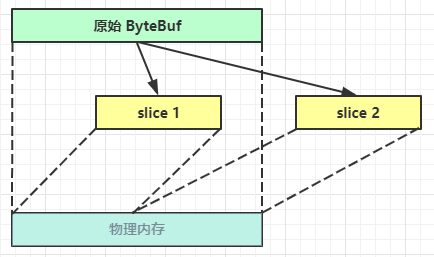

  - #### duplicate

    - 截取了原始ByteBuf的所有内容，并且没有max capacity的限制，但和原始ByteBuf使用同一块底层内存，但读写指针独立

  - #### CompositeByteBuf

    - 将多个ByteBuf合并为一个逻辑上的ByteBuf，避免了内存拷贝

    - CompositeByteBuf 是一个组合的 ByteBuf，它内部维护了一个 Component 数组，每个 Component 管理一个 ByteBuf，记录了这个 ByteBuf 相对于整体偏移量等信息，代表着整体中某一段的数据。

      * 优点，对外是一个虚拟视图，组合这些 ByteBuf 不会产生内存复制
      * 缺点，复杂了很多，多次操作会带来性能的损耗

      

- ### copy

  - 对bytebuf进行拷贝，与原始ByteBuf无关


#### 💡 ByteBuf 优势

* 池化 - 可以重用池中 ByteBuf 实例，更节约内存，减少内存溢出的可能
* 读写指针分离，不需要像 ByteBuffer 一样切换读写模式
* 可以自动扩容
* 支持链式调用，使用更流畅
* 很多地方体现零拷贝，例如 slice、duplicate、CompositeByteBuf


# 3，Netty 进阶

## 1，粘包，半包

- 粘包：
  - 发送123，456，接收到123456
  - 原因
    - 应用层：接收方ByteBuf设置太大（Netty默认1024）
    - TCP滑动窗口：发送方发送一个完成报文，而接收方处理不及时，且窗口容量足够大，则这报文就会缓存在 滑动窗口中，若缓存多个，则造成粘包
    - Nagle算法：（为避免发送少量数据时，http请求头和TCP请求头过于占用流量，Nagle会对数据进行累积，再统一发送）也会造成粘包。

- 半包
  - 发送 123456，接收到123，456
  - 原因：
    - 应用层：接收方ByteBuf小于实际发送的数量
    - 滑动 窗口：滑动窗口过小，接收方的容量不足以容纳完整报文，则造成半包
    - MSS限制：发送的数据超过了MSS限制，会将数据进行切分发送。MSS限制，不同网络设备会对发送数据包的大小有限制

粘包半包的主要原因就是TCP发送数据，是没有边界的。


Nagle 算法

* 即使发送一个字节，也需要加入 tcp 头和 ip 头，也就是总字节数会使用 41 bytes，非常不经济。因此为了提高网络利用率，tcp 希望尽可能发送足够大的数据，这就是 Nagle 算法产生的缘由
* 该算法是指发送端即使还有应该发送的数据，但如果这部分数据很少的话，则进行延迟发送
  * 如果 SO_SNDBUF 的数据达到 MSS，则需要发送
  * 如果 SO_SNDBUF 中含有 FIN（表示需要连接关闭）这时将剩余数据发送，再关闭
  * 如果 TCP_NODELAY = true，则需要发送
  * 已发送的数据都收到 ack 时，则需要发送
  * 上述条件不满足，但发生超时（一般为 200ms）则需要发送
  * 除上述情况，延迟发送


MSS 限制

* 链路层对一次能够发送的最大数据有限制，这个限制称之为 MTU（maximum transmission unit），不同的链路设备的 MTU 值也有所不同，例如

 * 以太网的 MTU 是 1500
 * FDDI（光纤分布式数据接口）的 MTU 是 4352
 * 本地回环地址的 MTU 是 65535 - 本地测试不走网卡

* MSS 是最大段长度（maximum segment size），它是 MTU 刨去 tcp 头和 ip 头后剩余能够作为数据传输的字节数

 * ipv4 tcp 头占用 20 bytes，ip 头占用 20 bytes，因此以太网 MSS 的值为 1500 - 40 = 1460
 * TCP 在传递大量数据时，会按照 MSS 大小将数据进行分割发送
 * MSS 的值在三次握手时通知对方自己 MSS 的值，然后在两者之间选择一个小值作为 MSS

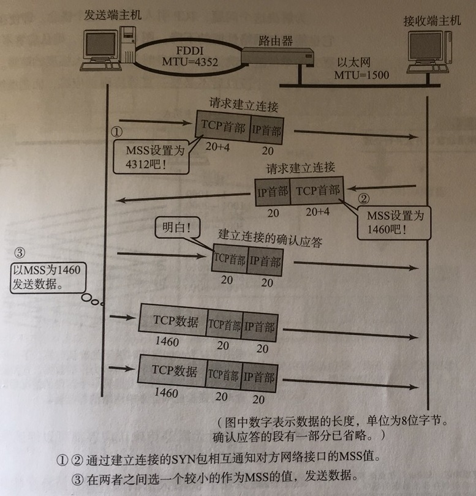

==**解决方案**==

1. 短链接，发送每个包都建立一次连接，连接的建立和断开，则是消息的边界，粘包问题可以解决，但半包问题仍存在（即发送方的数据过大，超过了接收方单次接收消息容量），而且每次发送消息都建立连接，效率低下。
2. 每条消息固定长度，缺点：长度过大，浪费空间，过小，不足以容纳所有消息
3. 每条消息采用分隔符，缺点：效率低，需要转义（实质是检测每个字节，判断是否为分隔符，因此效率低）。
4. 每条消息分为head和body（请求头和请求体），head中包含body的长度
   - 请求体的偏移量（即起始位置）
   - 长度本身占用的字节数
   - 长度调整：（除长度字段和内容外，可能传送其他字段信息，需要指定该变量。表示长度之后，再加上几个字节才是内容数据）
   - 从头剥离几个字节（只读取内容，不读取长度信息，可指定剥离head 信息）

## 2，协议涉及和解析

### 2.1 为什么需要协议

TCP/IP传输基于流的方式，没有边界。

协议的目的是指定消息的边界，指定通信共同遵守的通信规则

常用的的协议：定长字节表示数据长度+实际数据

### 2.2 自定义协议要素

- 魔数：判断是否为无效数据包
- 版本号：支持协议的升级
- 序列化算法：消息正文采用的序列化，反序列化方式，json，protobuf，hessian，jdk等序列化方法
- 指令类型：一般会指定与业务类型的指令
- 请求序号：避免接收乱序，提供异步能力
- 正文长度
- 消息正文数据

自定义协议进行编码和解码

```java
@Slf4j
public class MessageCodec extends ByteToMessageCodec<Message> {

    @Override
    protected void encode(ChannelHandlerContext ctx, Message msg, ByteBuf out) throws Exception {
        // 1. 4 字节的魔数
        out.writeBytes(new byte[]{1, 2, 3, 4});
        // 2. 1 字节的版本,
        out.writeByte(1);
        // 3. 1 字节的序列化方式 jdk 0 , json 1
        out.writeByte(0);
        // 4. 1 字节的指令类型
        out.writeByte(msg.getMessageType());
        // 5. 4 个字节
        out.writeInt(msg.getSequenceId());
        // 无意义，对齐填充
        out.writeByte(0xff);
        // 6. 获取内容的字节数组
        ByteArrayOutputStream bos = new ByteArrayOutputStream();
        ObjectOutputStream oos = new ObjectOutputStream(bos);
        oos.writeObject(msg);
        byte[] bytes = bos.toByteArray();
        // 7. 长度
        out.writeInt(bytes.length);
        // 8. 写入内容
        out.writeBytes(bytes);
    }

    @Override
    protected void decode(ChannelHandlerContext ctx, ByteBuf in, List<Object> out) throws Exception {
        int magicNum = in.readInt();
        byte version = in.readByte();
        byte serializerType = in.readByte();
        byte messageType = in.readByte();
        int sequenceId = in.readInt();
        in.readByte();
        int length = in.readInt();
        byte[] bytes = new byte[length];
        in.readBytes(bytes, 0, length);
        ObjectInputStream ois = new ObjectInputStream(new ByteArrayInputStream(bytes));
        Message message = (Message) ois.readObject();
        log.debug("{}, {}, {}, {}, {}, {}", magicNum, version, serializerType, messageType, sequenceId, length);
        log.debug("{}", message);
        out.add(message);
    }
}
```

注意：需要添加编解码器，若没有，可能存在粘包，半包现象。即发送消息时，若网络卡顿，消息只发送了一半，则解码消息时，根据请求头中的数据长度解码会出现异常，编解码器会对消息进行判断，若发现异常，则不会调用后续的协议解码。

```java
EmbeddedChannel channel = new EmbeddedChannel(
    new LoggingHandler(),
    new LengthFieldBasedFrameDecoder(
        1024, 12, 4, 0, 0),
    new MessageCodec()
);
```

### 2.3 @Sharable

Netty是多线程处理消息，那编解码器，日志handler等对象是否可以多线程调用一个？

- 若handler不保存状态，则可以被多线程共享，就可以加注解@Sharable
- 不能继承 ByteToMessageCodec 或 CombinedChannelDuplexHandler 父类，他们的构造方法对 @Sharable 有限制

### 2.4 空闲检测


#### 连接假死

**原因**

- 网络设备出现故障，底层TCP断开连接，服务器未感知到
- 公网网络不稳定，出现丢包，如果出现连续丢包，现象就是客户端和服务器都发送和接收不到数据
- 服务器线程阻塞，无法进行数据读写

**问题**

- 假死的连接占用的资源不能自动释放
- 向假死的连接发送数据，得到的反馈是发送超时

**服务器解决**

- **心跳机制**
- 客户端定时向服务器发送空包数据，只要这个时间间隔小于服务器定义的空闲检测的时间间隔，那么就能防止前面提到的误判。


# 4，Netty 优化与算法

## 1，优化

### 1.1 扩展序列化算法（略）

通过netty进行网络编程，可以指定多种序列化方法。来表明netty的方便

- JDK自带序列化方法：实现serialize接口
  - 会将类信息也进行序列化，反序列时，不必指定类型，但占用字节多，性能慢，仅限于java语言
- JSON：占用空间少，跨语言使用，方便，但需要指定类型


### 1.2 参数调优

#### 1）CONNECT_TIMEOUT_MILLIS

- 属于SocketChannel参数
- 在客户端连接时，若指定毫秒没无法连接，则抛出异常。可指定超时时间
- SO_TIMEOUT 主要用在阻塞 IO，阻塞 IO 中 accept，read 等都是无限等待的，如果不希望永远阻塞，使用它调整超时时间


另外源码部分 `io.netty.channel.nio.AbstractNioChannel.AbstractNioUnsafe#connect`

```java
@Override
public final void connect(
        final SocketAddress remoteAddress, final SocketAddress localAddress, final ChannelPromise promise) {
    // ...
    // Schedule connect timeout.
    int connectTimeoutMillis = config().getConnectTimeoutMillis();
    if (connectTimeoutMillis > 0) {
        connectTimeoutFuture = eventLoop().schedule(new Runnable() {
            @Override
            public void run() {                
                ChannelPromise connectPromise = AbstractNioChannel.this.connectPromise;
                ConnectTimeoutException cause =
                    new ConnectTimeoutException("connection timed out: " + remoteAddress); // 断点2
                if (connectPromise != null && connectPromise.tryFailure(cause)) {
                    close(voidPromise());
                }
            }
        }, connectTimeoutMillis, TimeUnit.MILLISECONDS);
    }
	// ...
}
```

#### 2）SO_BACKLOG

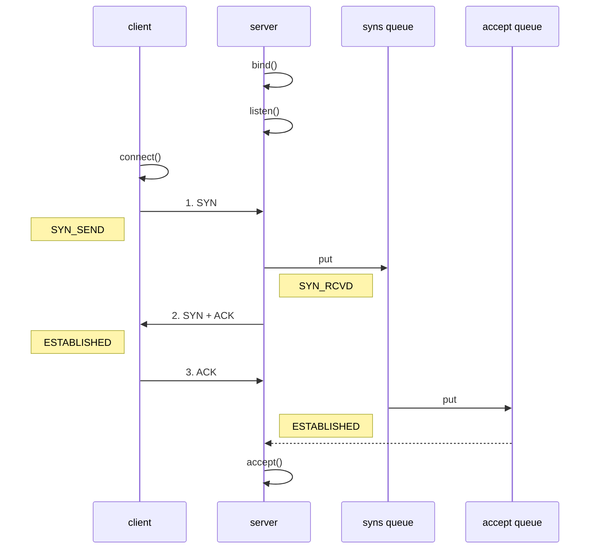

上述为tcp三次握手，

* 在 linux 2.2 之前，backlog 大小包括了两个队列的大小，在 2.2 之后，分别用下面两个参数来控制

* sync queue - 半连接队列
  * 大小通过 /proc/sys/net/ipv4/tcp_max_syn_backlog 指定，在 `syncookies` 启用的情况下，逻辑上没有最大值限制，这个设置便被忽略
* accept queue - 全连接队列
  * 其大小通过 /proc/sys/net/core/somaxconn 指定，在使用 listen 函数时，内核会根据传入的 backlog 参数与系统参数，取二者的较小值
  * 如果 accpet queue 队列满了，server 将发送一个拒绝连接的错误信息到 client

netty 中

可以通过  option(ChannelOption.SO_BACKLOG, 值) 来设置大小


#### 3）ulimit -n

* 属于操作系统参数，文件描述符的个数，即打开文件的数量


#### 5）SO_SNDBUF & SO_RCVBUF

- 发送缓冲区和接收缓冲区大小，不用碰

* SO_SNDBUF 属于 SocketChannal 参数
* SO_RCVBUF 既可用于 SocketChannal 参数，也可以用于 ServerSocketChannal 参数（建议设置到 ServerSocketChannal 上）

#### 6）ALLOCATOR

* 属于 SocketChannal 参数
* 用来分配 ByteBuf， ctx.alloc()

#### 7）RCVBUF_ALLOCATOR

* 属于 SocketChannal 参数
* 控制 netty 接收缓冲区大小
* 负责入站数据的分配，决定入站缓冲区的大小（并可动态调整），统一采用 direct 直接内存，具体池化还是非池化由 allocator 决定

## 2，源码

### 2.1 启动分析

启动时的主要代码：主线为5步

```java
//1 netty 中使用 NioEventLoopGroup （简称 nio boss 线程）来封装线程和 selector
Selector selector = Selector.open(); 

//2 创建 NioServerSocketChannel，同时会初始化它关联的 handler，以及为原生 ssc 存储 config
NioServerSocketChannel attachment = new NioServerSocketChannel();

//3 创建 NioServerSocketChannel 时，创建了 java 原生的 ServerSocketChannel
ServerSocketChannel serverSocketChannel = ServerSocketChannel.open(); 
serverSocketChannel.configureBlocking(false);

//4 启动 nio boss 线程执行接下来的操作

//5 注册（仅关联 selector 和 NioServerSocketChannel），未关注事件
SelectionKey selectionKey = serverSocketChannel.register(selector, 0, attachment);

//6 head -> 初始化器 -> ServerBootstrapAcceptor -> tail，初始化器是一次性的，只为添加 acceptor

//7 绑定端口
serverSocketChannel.bind(new InetSocketAddress(8080));

//8 触发 channel active 事件，在 head 中关注 op_accept 事件
selectionKey.interestOps(SelectionKey.OP_ACCEPT);
```


**init & register regFuture 处理**

- 1.1 init   ==main主线程执行，创建主线的ServerSocketChannel==
  - 创建NIOServerSocketChannel   ==main主线程执行==
  - 添加 NIOServerSocketChannel 初始化 handler  ==main主线程执行==
    - 初始化handler 等待调用
- 1.2 register  ==将ServerSocketChannel绑定到selector上==
  - 启动nio boss 线程  main主线程执行  ==main主线程执行==
  - **原生ssc 注册至selector 未关注事件** ==nio-thread执行==
  - 执行NIOServerSocketChannel 初始化 handler  ==nio-thread执行==
- 2 regFuture 等待回调 doBind0方法   ==将ServerSocketChannel监听指定端口，并制定触发事件==
  - 原生NIOServerSocketChannel 绑定   ==nio-thread执行==
  - 触发NIOServerSocketChannel active 事件  ==nio-thread执行==


入口 `io.netty.bootstrap.ServerBootstrap#bind`

关键代码 `io.netty.bootstrap.AbstractBootstrap#doBind`

```java
private ChannelFuture doBind(final SocketAddress localAddress) {
	// 1. 执行初始化和注册 regFuture 会由 initAndRegister 设置其是否完成，从而回调 3.2 处代码
    final ChannelFuture regFuture = initAndRegister();
    final Channel channel = regFuture.channel();
    if (regFuture.cause() != null) {
        return regFuture;
    }

    // 2. 因为是 initAndRegister 异步执行，需要分两种情况来看，调试时也需要通过 suspend 断点类型加以区分
    // 2.1 如果已经完成
    if (regFuture.isDone()) {
        ChannelPromise promise = channel.newPromise();
        // 3.1 立刻调用 doBind0
        doBind0(regFuture, channel, localAddress, promise);
        return promise;
    } 
    // 2.2 还没有完成
    else {
        final PendingRegistrationPromise promise = new PendingRegistrationPromise(channel);
        // 3.2 回调 doBind0
        regFuture.addListener(new ChannelFutureListener() {
            @Override
            public void operationComplete(ChannelFuture future) throws Exception {
                Throwable cause = future.cause();
                if (cause != null) {
                    // 处理异常...
                    promise.setFailure(cause);
                } else {
                    promise.registered();
					// 3. 由注册线程去执行 doBind0
                    doBind0(regFuture, channel, localAddress, promise);
                }
            }
        });
        return promise;
    }
}
```


