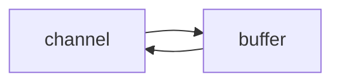
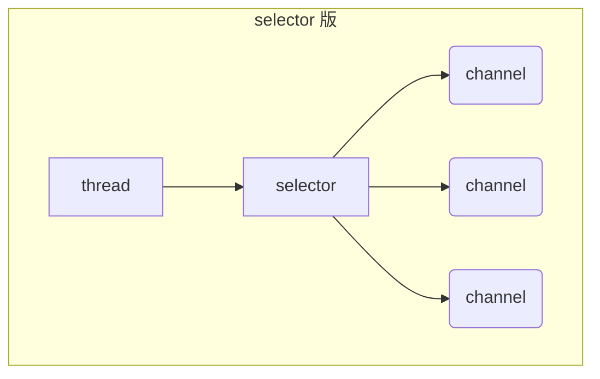

背景：

现在的互联网环境下，分布式系统大行其道，而分布式系统的根基在于网络编程，而 Netty 恰恰是 Java 领域网络编程的王者。如果要致力于开发高性能的服务器程序、高性能的客户端程序，必须掌握 Netty，而本课程的目的就是带领你进入基于 Netty 的网络编程世界。本课程从基础 NIO 编程开始，到 Netty 入门及进阶，参数优化到源码分析，由浅入深，为 Netty 学习打下坚实基础。本课程的目标是带你 Netty 入门，理解其基本运行原理和高效原因，并具备一定的 Netty 编码能力。


# 1，NIO基础

non-blocking io 非阻塞 IO

## 1，三大组件

### 1.1， Channel & Buffer

- channel：读写数据的**双向通道**
- buffer：缓存
- channel可以把数据读取到buffer，也可以将buffer的数据写入到channel



常见的 Channel 有

* FileChannel
* DatagramChannel
* SocketChannel
* ServerSocketChannel

buffer 则用来缓冲读写数据，常见的 buffer 有

* ByteBuffer
  * MappedByteBuffer
  * DirectByteBuffer
  * HeapByteBuffer
* ShortBuffer
* IntBuffer
* LongBuffer
* FloatBuffer
* DoubleBuffer
* CharBuffer

### 1.2 Selector（选择器）


- ## 服务器的演化

  - ### 多线程版设计

    - ```mermaid
      graph TD
      subgraph 多线程版
      t1(thread) --> s1(socket1)
      t2(thread) --> s2(socket2)
      t3(thread) --> s3(socket3)
      end
      ```

    - 多线程处理，每个线程处理一个连接。（类似饭店吃饭，一名服务员会服务一个客人，多个客人就多名服务员）

    - ###### ==缺点==

      - 多线程占用内存高，（每个链接都占用一个线程）
    - 线程上下文切换成本高（因为太多的线程需要切换，所以切换频繁，消耗性能）
      - **只适合连接数少的场景**

  - ### 线程池版设计

    - ```mermaid
      graph TD
      subgraph 线程池版
      t4(thread) --> s4(socket1)
      t5(thread) --> s5(socket2)
      t4(thread) -.-> s6(socket3)
      t5(thread) -.-> s7(socket4)
      end
      ```
  
      （类似，一名服务员服务客人，必须服务完该客人点餐吃饭走后，才能去服务其他人）
  
    - ==缺点==
  
      - 线程池为**阻塞模式**，即（一个线程完全处理完该链接才能处理下一个链接）
      - 仅适合短链接的情况（会很快断开连接，以提高线程的使用率）
  
  - ### Selector 版设计
  
    - selector的作用就是配合一个线程管理多个channel，获取这些channel上发送的事件，channel是处于非阻塞模式下，有事件时，selector会发现，交给线程处理。**适合连接数特别多，但流量低的场景（low traffic）**（如果流量高的情况，则多个channel都请求处理，则一个线程只能执行一个请求，所以不适用）
  
    - ```mermaid
      graph TD
      subgraph selector 版
      thread --> selector
      selector --> c1(channel)
      selector --> c2(channel)
      selector --> c3(channel)
      end
      ```
  
    - 调用 selector 的 select() 会阻塞直到 channel 发生了读写就绪事件，这些事件发生，select 方法就会返回这些事件交给 thread 来处理


## 2，ByteBuffer

###  2.1 ByteBuffer的正确使用

```java
@Slf4j
public class ChannelDemo1 {
    public static void main(String[] args) {
        try (RandomAccessFile file = new RandomAccessFile("helloword/data.txt", "rw")) {
            FileChannel channel = file.getChannel();
            ByteBuffer buffer = ByteBuffer.allocate(10);
            do {
                // 向 buffer 写入
                int len = channel.read(buffer);
                log.debug("读到字节数：{}", len);
                if (len == -1) {
                    break;
                }
                // 切换 buffer 读模式
                buffer.flip();
                while(buffer.hasRemaining()) {
                    log.debug("{}", (char)buffer.get());
                }
                // 切换 buffer 写模式
                buffer.clear();
            } while (true);
        } catch (IOException e) {
            e.printStackTrace();
        }
    }
}
```


1. 读取文件的数据，向buffer中写入数据，例如调用 channel.read(buffer)
2. 调用flip（）切换至读模式
3. 从buffer读取数据，例如调用 buffer.get()
4. 调用clear（）或者 compact() 切换至**写模式**
5. 重复 1~4 步骤


### 2.2 ByteBuffer 结构

ByteBuffer有三个重要属性变量

- capacity
- position
- limit

开始时，如图。


**开始为写模式**，position为写入位置，limit等于capacity容量，下图表示写入了 4 个字节后的状态


调用flip（）方法后，**ByteBuffer进行读模式**，position切换到起始位置，limit切换为读取限制


读取 4 个字节后，状态


调用clear()方法，重新进入读模式


调用compact()方法，则是将未读完的数据向前压缩，然后切换至写模式。（clear()方法是直接全部清除，重新写入）


**注意：compact（）方法是将未读完的数据全部向前迁移，例：[A,B,C,D],读模式下，读取[A,B]，调用compact（）方法迁移后，实际为[C,D,C,D]。但是写的位置是从数组[2]，即第二个C的位置开始操作，也就是会覆盖向前迁移后遗留下的byte**


### 2.3 ByteBuffer 常见方法

#### 分配空间

- Bytebuffer buf = ByteBuffer.allocate(16);   class java.nio.HeapByteBuffer
- ByteBuffer.allocateDirect(16)；                     class java.nio.DirectByteBuffer  

两种方法属于不同的类，可以看出分别为堆内存和直接内存

- HeapByteBuffer：使用java堆内存，读写效率低，会受到GC影响（GC情况下会产生停顿以及垃圾回收后，为减少内存碎片会进行内存数据的迁移，都会造成效率的底下）
- DirectByteBuffer：使用系统的直接内存，读写效率高（因为首先是读数据到系统内存，然后再从系统内存到java管理的内存，而使用直接内存少了一次拷贝，效率必然高），不会受到GC的影响，分配效率低

#### 向 buffer 写入数据

- 调用 channel 的 read 方法
- 调用 buffer 自己的 put 方法

```java
int readBytes = channel.read(buf);
```

和

```java
buf.put((byte)127);
```

#### 从 buffer 读取数据

同样有两种办法

* 调用 channel 的 write 方法
* 调用 buffer 自己的 get 方法

```java
int writeBytes = channel.write(buf);
```

和

```java
byte b = buf.get();
```

get（）方法会使得position读指针后移，如果需要从头读取数据

- 可以调用 rewind 方法将 position 重新置为 0
- 或者调用 get(int i) 方法获取索引 i 的内容，**它不会移动读指针**


#### mark 和 reset

mark 是在读取时，做一个标记，即使 position 改变，只要调用 reset 就能回到 mark 的位置

> **注意**
>
> rewind 和 flip 都会清除 mark 位置

#### 字符串与 ByteBuffer 互转

Charset会直接切换到读模式，而put方法不会

```java
buffer.put("hello".getBytes());

ByteBuffer buffer1 = StandardCharsets.UTF_8.encode("你好");
ByteBuffer buffer2 = Charset.forName("utf-8").encode("你好");

debug(buffer1);
debug(buffer2);

CharBuffer buffer3 = StandardCharsets.UTF_8.decode(buffer1);
System.out.println(buffer3.getClass());
System.out.println(buffer3.toString());
```

#### ⚠️ Buffer 的线程安全

> Buffer 是**非线程安全的**

#### 2.4 Scattering Reads 分散读取

```java
try (RandomAccessFile file = new RandomAccessFile("helloword/3parts.txt", "rw")) {
    FileChannel channel = file.getChannel();
    ByteBuffer a = ByteBuffer.allocate(3);
    ByteBuffer b = ByteBuffer.allocate(3);
    ByteBuffer c = ByteBuffer.allocate(5);
    channel.read(new ByteBuffer[]{a, b, c});
    a.flip();
    b.flip();
    c.flip();
    debug(a);
    debug(b);
    debug(c);
} catch (IOException e) {
    e.printStackTrace();
}
```

## 3，文件编程

### 3.1 FileChannel

#### ⚠️ FileChannel 工作模式

> FileChannel 只能工作在阻塞模式下

#### 获取

不能直接打开FileChannel，必须通过FileInputStream、FileOutputStream或者RandomAccessFile 来获取 FileChannel，它们都有 getChannel 方法

* 通过 FileInputStream 获取的 channel 只能读
* 通过 FileOutputStream 获取的 channel 只能写
* 通过 RandomAccessFile 是否能读写根据构造 RandomAccessFile 时的读写模式决定

#### 读取

从channel中读取数据填充ByteBuffer，返回值表示读到了多少字节，-1表示达到了文件的末尾。

```java
int readBytes = channel.read(buffer);
```

#### 写入

写入的正确姿势如下， SocketChannel

```java
ByteBuffer buffer = ...;
buffer.put(...); // 存入数据
buffer.flip();   // 切换读模式

while(buffer.hasRemaining()) {
    channel.write(buffer);
}
```

在 while 中调用 channel.write 是因为 write 方法并不能保证一次将 buffer 中的内容全部写入 channel

#### 关闭

channel 必须关闭，不过调用了 FileInputStream、FileOutputStream 或者 RandomAccessFile 的 close 方法会间接地调用 channel 的 close 方法

#### 大小

使用 size 方法获取文件的大小


#### 强制写入

操作系统出于性能的考虑，会将数据缓存，不是立刻写入磁盘。可以调用 force(true)  方法将文件内容和元数据（文件的权限等信息）立刻写入磁盘


## 4. 网络编程

### 4.1 非阻塞 vs 阻塞

#### 阻塞

- 阻塞模式下，方法会导致线程暂停
  - ServerSocketChannel.accept 等待与客户端的连接建立，没有连接建立时线程阻塞
  - SocketChannel.read 等待接收数据，如果没有数据则阻塞
  - **阻塞的表现是线程暂停，暂停期间不会占用CPU，线程相当于闲置**
- 阻塞方法会相互影响，需要在多线程下进行
- **多线程存在的问题**
  - 32位JVM 一个线程320kb，64位jvm 一个线程1024kb，如果连接数过多，则必然出现OOM，并且线程数过多，线程切换频繁，消耗性能，执行效率不高
  - 可以采用**线程池技术来减少线程数和线程上下文切换**，但治标不治本，如果有很多连接建立，但长时间 inactive，会阻塞线程池中所有线程，因此不适合长连接，只适合短连接

#### 非阻塞

- 非阻塞模式下，相关方法不会造成阻塞
  -  ServerSocketChannel.accept 没有连接建立时，会返回null，继续运行
  - SocketChannel.read 在没有数据可读时，会返回 0，但线程不必阻塞，可以去执行其它 SocketChannel 的 read 或是去执行 ServerSocketChannel.accept 
  - 非阻塞模式下，写数据，线程只需等待数据写入channel即可，不必等待channel通过网络发送数据
- ==**问题**==
  - 非阻塞模式下，即使没有连接建立和数据可读，但线程仍在不断执行，CPU白白占用
  - 数据复制过程中，数据仍是阻塞的


### 4.2 Selector




selector要与channel进行关联，即进行注册。事件发生后，可以通过selector查找相关channel的事件。

==**优点**==

- 一个线程配合selector可以监控多个channel的事件，只要事件发生后才回去处理。避免非阻塞模式下的性能消耗
- 线程能够充分利用。
- 节约了线程的数量
- 减少了线程间的上下文切换


- ### 流程

  - #### 创建

    ```java 
    Selector selelctor = Selector.open();
    ```

  - #### 绑定Channel事件

    注册事件，只有绑定的事件selector才能处理

    ```java
    channel.configureBlocking(false);
    SelectionKey key = channel.register(selector, 绑定事件);
    ```

  - channel必须工作在非阻塞模式下

  - FileChannel 没有非阻塞模式，因此不能配合 selector 一起使用

  - 绑定的事件类型为：

    - connect - 客户端连接成功时触发
    - accept - 服务器端成功接受连接时触发
    - read - 数据可读入时触发，有因为接收能力弱，数据暂不能读入的情况
    - write - 数据可写出时触发，有因为发送能力弱，数据暂不能写出的情况

  - #### 监听Channel事件

    - 通过以下三种方法监听是否有事件发生，方法的返回值表示有多少channel发生了事件

    - 阻塞直到绑定事件发生

      ```java
      int count = selector.select();
      ```

    - 阻塞直到绑定事件发生，或是超时（时间单位为 ms）

      ```java
      int count = selector.select(long timeout);
      ```

    - 不会阻塞，也就是不管有没有事件，立刻返回，自己根据返回值检查是否有事件

      ```java
      int count = selector.selectNow();
      ```

      

#### 💡select何时不阻塞

- 事件发生时
  - 客户端发起连接请求，会触发accept事件
  - 客户端发送数据过来，客户端正常、异常关闭，都会触发read事件，另外如果发送的数据大于buffer缓冲区，会触发多次读取事件
  - channel可写，会触发write事件
  - 在Linux下nio bug发生时
- 调用 selector.wakeup()
- 调用 selector.close()
- selector 所在线程 interrupt

### 4.3 处理 accept 事件

#### 💡 事件发生后能否不处理

> 事件发生后，要么处理，要么取消（cancel），不能什么都不做，否则下次该事件仍会触发，这是因为 nio 底层使用的是水平触发

### 4.4 处理 read 事件

```java
@Slf4j
public class ChannelDemo6 {
    public static void main(String[] args) {
        try (ServerSocketChannel channel = ServerSocketChannel.open()) {
            channel.bind(new InetSocketAddress(8080));
            System.out.println(channel);
            Selector selector = Selector.open();
            channel.configureBlocking(false);
            channel.register(selector, SelectionKey.OP_ACCEPT);

            while (true) {
                int count = selector.select();
//                int count = selector.selectNow();
                log.debug("select count: {}", count);
//                if(count <= 0) {
//                    continue;
//                }

                // 获取所有事件
                Set<SelectionKey> keys = selector.selectedKeys();

                // 遍历所有事件，逐一处理
                Iterator<SelectionKey> iter = keys.iterator();
                while (iter.hasNext()) {
                    SelectionKey key = iter.next();
                    // 判断事件类型
                    if (key.isAcceptable()) {
                        ServerSocketChannel c = (ServerSocketChannel) key.channel();
                        // 必须处理
                        SocketChannel sc = c.accept();
                        sc.configureBlocking(false);
                        sc.register(selector, SelectionKey.OP_READ);
                        log.debug("连接已建立: {}", sc);
                    } else if (key.isReadable()) {
                        SocketChannel sc = (SocketChannel) key.channel();
                        ByteBuffer buffer = ByteBuffer.allocate(128);
                        int read = sc.read(buffer);
                        if(read == -1) {
                            key.cancel();
                            sc.close();
                        } else {
                            buffer.flip();
                            debug(buffer);
                        }
                    }
                    // 处理完毕，必须将事件移除
                    iter.remove();
                }
            }
        } catch (IOException e) {
            e.printStackTrace();
        }
    }
}
```

#### 💡 为何要 iter.remove()

因为select在事件发生后，就会将相关的 key 放入 selectedKeys 集合，处理后，不会自动删除，需要我们自己进行删除。例如：

* 第一次触发了 ssckey 上的 accept 事件，没有移除 ssckey 。
* 第二次触发了 sckey 上的 read 事件，但这时 selectedKeys 中还有上次的 ssckey ，在处理时因为没有真正的 serverSocket 连上了，就会导致空指针异常（空指针异常的原因是，accept事件已经被处理过一次，再次调用accept()方法，会返回null，则后续的处理出现空指针异常）


#### 💡 cancel 的作用

> cancel 会取消注册在 selector 上的 channel，并从 keys 集合中删除 key 后续不会再监听事件

cancel可以用在客户端取消连接后，服务器捕获到异常后，将该key取消，即selector中不再监听该channel。


#### 处理消息的边界

发送消息长度是不固定的，所以在发送和接收方的处理方式有三种


- 一种思路是固定消息长度，数据包大小一样，服务器按预定长度读取，缺点是浪费带宽
- 另一种思路是按分隔符拆分，缺点是效率低
- TLV 格式，即 Type 类型、Length 长度、Value 数据，类型和长度已知的情况下，就可以方便获取消息大小，分配合适的 buffer，缺点是 buffer 需要提前分配，如果内容过大，则影响 server 吞吐量
  * Http 1.1 是 TLV 格式
  * Http 2.0 是 LTV 格式


#### ByteBuffer 大小分配

- 每个channel都需要记录可能被切分消息，因为ByteBuffer不能被多个channel共同使用，因此需要为每个channel维护一个独立的ByteBuffer
- ByteBuffer不能太大，比如一个ByteBuffer 1Mb的话，如果支持百万连接，则需要1Tb内存，因此需要设计大小可变的ByteBuffer
  - 一种思路是首先分配一个较小的 buffer，例如 4k，如果发现数据不够，再分配 8k 的 buffer，将 4k buffer 内容拷贝至 8k buffer，优点是消息连续容易处理，缺点是数据拷贝耗费性能，参考实现 [http://tutorials.jenkov.com/java-performance/resizable-array.html](http://tutorials.jenkov.com/java-performance/resizable-array.html)
  - 另一种思路是用多个数组组成 buffer，一个数组不够，把多出来的内容写入新的数组，与前面的区别是消息存储不连续解析复杂，优点是避免了拷贝引起的性能损耗


### 4.5 处理 write 事件


一次无法写完的例子

- 非阻塞模式下，无法保证吧buffer中所有的数据都写入到channel，因此需要追踪write方法的返回值（代表实际写入的字节数）
- 用selector监听所有channel的可写事件，每个channel都需要一个key来跟踪buffer，到哪这样又会占用内存过多，因此通过两阶段策略
  - 当消息处理器第一次写消息时，财经channel注册到selector上
  - selector检查channel上的可写事件，如果所有的数据写完了就取消channel的注册
  - 如果不取消，会每次可写均触发write事件

## 5，NIO 和BIO

### 5.1 stream 和channel

- 不同点

  - stream不能自动缓冲数据，channel会利用系统提供的发送缓冲区，接收缓冲区

  - stream仅支持阻塞API（即调用方法会阻塞），channel阻塞API和非阻塞API均支持，网络channel可配合selector实现多路复用

- 相同点：
  - 二者均为全双工，即读写同时进行

### 5.2 IO 模型

看复习-操作系统-IO模型梳理

### 5.3 零拷贝技术

看复习-操作系统-零拷贝技术


# 2，Netty入门

## 1，了解Netty

### 1.1 定义

Netty是一个异步的，基于事件驱动的网络应用框架，用于快速开发可维护，高性能的网络服务器和客户端


### 1.3 Netty 的地位

涉及到java开发，凡是涉及到网络通信，都有Netty的影子。如同Spring在java中的地位

### 1.4 Netty优势

- Netty是基于NIO开发，直接使用NIO开发，工作量大，bug多
  - 需要自己构建协议
  - 解决TCP传输问题，如粘包，半包
  - epoll 空轮询导致CPU100%
  - 对API进行增强，使之更易用，
- Netty vs 其他应用框架
  - Netty开发迭代快，API更简洁，文档更优秀
  - netty已经出版将近20年，稳定性强


## 2 hello world

客户端向服务器发送hello，world

### 服务器端

```java
// 1 启动服务器，组装netty组件
new ServerBootstrap()
    // 2 绑定selector和线程 分组
    .group(new NioEventLoopGroup()) // 1
    // 3 选择服务器的实现类
    .channel(NioServerSocketChannel.class) // 2
    // 4 handler 处理器 负责处理哪些读写
    .childHandler(  //3
    // 5 channel 代表和客户端进行数据读写的通道初始化，
    new ChannelInitializer<NioSocketChannel>() {
        @Override
        protected void initChannel(NioSocketChannel nioSocketChannel) throws Exception {
            // 添加具体的handler
            nioSocketChannel.pipeline().addLast(new StringDecoder()); //4
            nioSocketChannel.pipeline().addLast(new ChannelInboundHandlerAdapter() { // 5
                @Override
                // 读事件
                public void channelRead(ChannelHandlerContext ctx, Object msg) throws Exception {
                    System.out.println(msg);
                }
            });
        }
    }
)
    .bind(8080); //6
```

1. 创建NioEventLoopGroup， 选择线程池和seletor
2. 选择服务socket实现类，其中NioserverSocketChannel 表示基于NIO的服务器端实现，其他实现还有
3. handler ，添加处理器给socketChannel调用，而ChannelInitializer 处理器（仅执行一次），它的作用是待客户端SocketChannel 建立连接后，执行initChannel 添加更多的处理器
4. SocketChannel 的处理器，解码 ByteBuf => String
5. SocketChannel 的业务处理器，使用上一个处理器的处理结果
6. 绑定端口

### 客户端

```java
// 1 启动类
new Bootstrap()
    // 2 增加Eventloop
    .group(new NioEventLoopGroup()) // 1
    // 3 选择客户端 channel 实现
    .channel(NioSocketChannel.class) // 2
    // 4 添加处理器
    .handler(new ChannelInitializer<Channel>() { // 3

        @Override // 在连接建立后被调用
        protected void initChannel(Channel channel){
            channel.pipeline().addLast(new StringEncoder());  //8
        }
    })
    // 5 连接到服务器
    .connect("127.0.0.1", 8080) //4
    .sync()  //5
    .channel() // 6
    // 6 向服务器发送数据
    .writeAndFlush("hello, world");  7
```

1. 创建NioEventLoopGroup 

2. 选择客户Socket 实现类，NioSocketChannel 表示基于NIO的客户端实现，还有

3. 与server相同

4. 指定要连接的服务器和端口

5. Netty 调用sync，异步等待connet建立连接

6. 获取channel对象，通过channel进行数据读写

7. 写入数据并清空缓冲区

8.  消息会经过通道handler 处理，此处是将String->ByteBuf

   数据通过网络传输，到达服务器，服务器端5,6,的handler先后被触发（将byteBuf转换为string，再调用handler处理）

### 流程梳理


首先创建server服务器，创建客户端，然后连接客户端，然后再执行服务器的channel初始化方法，再执行客户端的channel初始化方法，客户端发送数据，，客户端会将数据进行处理，将string转换为bytebuf，服务器收到数据也是将bytebuf转换成string，然后再执行数据的处理操作


- channel：数据的传输通道
- msg为流动的数据，流入通道为byteBuf，经过pipeline加工，会变成其他类型对象，最后输出又变成ByteBuf
- handler为数据处理适配器
  - pipeline，负责发布事件，传播给每个handler，handler对自己负责的事情进行处理（会重新对应事件的处理方法）
  - 即pipeline发布对通道channel的处理操作
- 把eventloop理解为处理数据的seletor
  - eventloop负责多个channel的io操作，一旦绑定了该channel，则需要一直负责
  - eventloop 还可以执行任务处理，都有任务队列，可以放多个channel的任务，任务可以是普通任务和定时任务
  - eventloop按照pipeline顺序，依次按照handler的规划处理数据

## 3 组件

### 3.1 Eventloop

Eventloop 本质上是一个单线程的执行器（同时维护了一个seletor），里面有run方法处理channel上的IO事件

它的继承关系比较复杂

* 一条线是继承自 j.u.c.ScheduledExecutorService 因此包含了线程池中所有的方法
* 另一条线是继承自 netty 自己的 OrderedEventExecutor，
  * 提供了 boolean inEventLoop(Thread thread) 方法判断一个线程是否属于此 EventLoop
  * 提供了 parent 方法来看看自己属于哪个 EventLoopGroup


EventloopGroup 是一组EventLoop，channel一般会调用EventLoopGroup的register方法绑定其中一个EventLoop，后续该channel的IO事件由EventLoop来处理（保证了IO事件处理时的线程安全，因为只有该eventLoop处理该事件）

可遍历EventLoopGroup


