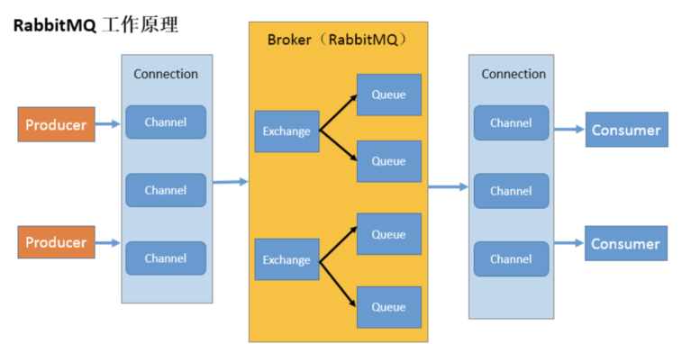
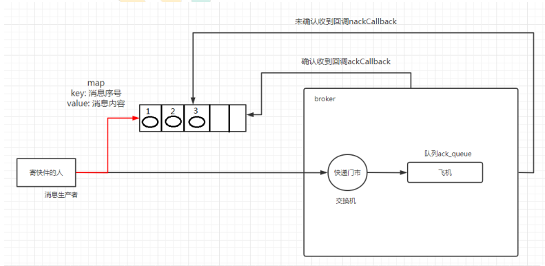
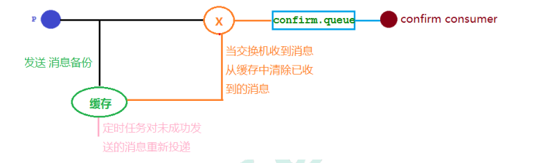
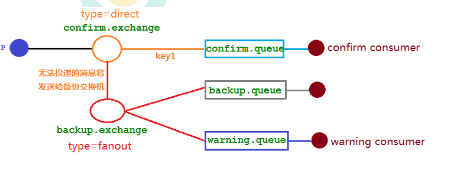
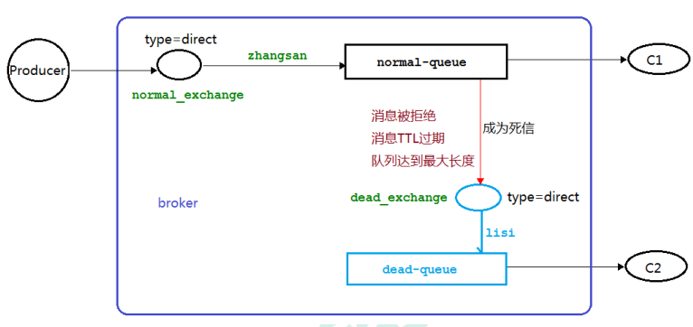
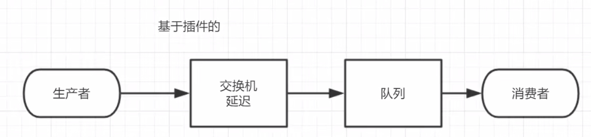

# 1，介绍

MQ是一个队列，先进先出的队列。可以实现跨进程的通信机制。

RabbitMQ类似一个中转站，接收，存储，和转发消息。并不能处理消息

- ## 作用

  - 流量削峰
    - 若订单系统同一时刻处理订单的能力是有限的，若超出上限，则系统宕机，若使用消息队列，处理订单请求放入消息队列进行排队，订单系统从队列中取请求再处理，提高可用性
  - 应用解耦
    - 多系统间，需要一个微服务通过接口调用另一个微服务，耦合严重。各微服务之间统一使用消息队列发送消息，进行解耦
  - 异步处理
    - 通过消息队列，将一些耗时操作放入消息队列，交给其他系统处理，异步处理。
    - 原本一个微服务通过接口（http）调用另一个服务。将一些比较耗时的操作放在其他系统中，通过消息队列将需要进行处理的消息进行存储，其他系统可以异步消费消息队列中的数据。

- ## 概念

  - 生产者：生产消息放入消息队列
  - 消费者：从消息队列中取出消息
  - 交换机：接收生产者消息，并将消息交给消息队列
  - 队列：消息只能存储在队列中。消费者从队列中取出消息
  - **信道**：生产者和消费者都是使用信道向MQ交互，避免重复的TCP连接。一个TCP连接可以有多个信道。
  - 


# 2，Hello World

无论生产者还是消费者都配置连接工厂。

生产者

```Java
//channel 实现了自动 close 接口 自动关闭 不需要显示关闭
try(Connection connection = factory.newConnection();Channel channel =
connection.createChannel()) {
/**
* 生成一个队列
* 1. 队列名称
* 2. 队列里面的消息是否持久化 默认消息存储在内存中
* 3. 该队列是否只供一个消费者进行消费 是否进行共享 true 可以多个消费者消费
* 4. 是否自动删除 最后一个消费者端开连接以后 该队列是否自动删除 true 自动删除
* 5. 其他参数
*/
channel.queueDeclare(QUEUE_NAME,false,false,false,null);
String message="hello world";
/**
* 发送一个消息
* 1. 发送到那个交换机
* 2. 路由的 key 是哪个
* 3. 其他的参数信息
* 4. 发送消息的消息体
*/
channel.basicPublish("",QUEUE_NAME,null,message.getBytes());
```

消费者

```Java
// 推送的消息如何进行消费的接口回调
DeliverCallback deliverCallback=(consumerTag,delivery)->{
String message= new String(delivery.getBody());
System.out.println(message);
};
// 取消消费的一个回调接口 如在消费的时候队列被删除掉了
CancelCallback cancelCallback=(consumerTag)->{
System.out.println(" 消息消费被中断");
};
/**
* 消费者消费消息
* 1. 消费哪个队列
* 2. 消费成功之后是否要自动应答 true 代表自动应答 false 手动应答
* 3. 消费者未成功消费的回调
*/
channel.basicConsume(QUEUE_NAME,true,deliverCallback,cancelCallback);
```

# 3，Work Queue

- ##  轮训分发消息

**MQ队列默认是轮询模式**

队列将消息轮询的分发给监听同一消息的所有消费者，避免所有消息只交给一个消费者处理，其他消费者空闲。并且一个消息只能处理一次，避免重复消费

- **不公平分发**
  - 轮询分发，是轮询的将消息给消费者，**若该消费者处理缓慢，其他消费者空闲，属于该队列处理的消息也必须等待。**
  - 不公平分发，若有消费者空闲，则将消息分派给该消费者
  - 在消费者设置为不公平分发。channel.basicQos(1);
- **预取值**
  - 会将消息分配给对应的消费者，按设置的预取值设置。
  - 分给该消费者，最多有几条未处理消息。

- ## 消息应答

  - **自动应答**
    - 消息队列中将消息发给消费者，就删除队列中的消息，不管消费者是否处理。
    - 不安全

  - **手动应答**（可以保证消息消费过程不丢失）
    - 将消息发给消息队列，并等待消费者返回应答后才会删除队列中的消息
    - 应答方式:
      - Channel.basicAck(用于肯定确认),MQ得知消息已被接收处理，可以丢弃
      - Channel.basicNack(用于否定确认)
      - Channel.basicReject(用于否定确认)：不出来该消息，队列可以丢弃该消息
    - **批量应答**：在手动应答时设置
      - 可以减少网络拥堵，不建议使用
      - 该消息的应答结果对信道的所有消息都按此结果处理。

- ## 消息自动重新入队

如果消费者由于某些原因失去连接(其通道已关闭，连接已关闭或 TCP 连接丢失)，导致该消费者没有回复ACK，则MQ会将该消息重新入队（放在队头），交由其他消费者处理。实现了即使某个消费者偶尔死亡，也可以确保不会丢失消息

- ## 持久化

  MQ默认将消息放在内存中，为避免MQ退出或者崩溃将队列信息和消息信息丢失。可以进行持久化。**重启MQ后依然存在。**

  - ### 队列持久化

    - 不能在已存在有的队列，将未持久化队列改为持久化，会报错
    - 所以只能在新建队列时，设置持久化

  - ### 消息持久化

    - 在发布消息时设置
    - **持久化保证不强，简单队列可以使用**，设置后并不能保证绝对的消息不丢失。因为MQ将消息存储到磁盘需要一个过程，若此时MQ停止，消息会丢失。
    - 更强有力的持久化策略：发布确认

# 4，发布确认策略

将发布消息达到持久化的目标，需要

- 队列持久化
- 队列中的消息持久化
- **发布确认**

与确认应答不用，发布确认是，生产者发布消息时用到的，确认应答时，消费者收到消息时回复的。

- ## 发布确认的策略

  - 单个确认发布：发布一个消息后，只有被确认发布，才能发布后续消息
    - 发布速度慢
    - 若指定时间内没有确认，则抛出异常
  - 批量确认发布：发布一批消息，一起确认
    - 速度相较于单个确认发布，快很多
    - 若出现故障导致发布出现问题，无法得知哪个消息出现问题
    - 若出现故障，会阻塞消息发布，等待确认后再发布
  - **异步确认发布**
    - 它是异步的，一旦发布一条消息，生产者应用程序就可以在等信道返回确认的同时继续发送下一条消息
    - 即发布消息，返回结果会调用回调函数，成功，调用成功回调函数，失败调用失败回调函数。
    - 配置监听器，监听回调消息，是异步调用的。即一个线程发布消息，一个线程监听回调结果
    - **处理异步未确认消息**
      - 由于发布消息和监听回调函数是不同线程，需要调用线程安全的队列。
      - 可以使用 ConcurrentSkipListMap，发布消息时，保存要发布的消息序号，以及消息对象。，在应答回调函数中，删除已经发布的消息。
    - 

```Java
/**
* 确认收到消息的一个回调
* 1. 消息序列号
* 2.true 可以确认小于等于当前序列号的消息
* false 确认当前序列号消息
*/
ConfirmCallback ackCallback = (sequenceNumber, multiple) -> {
if (multiple) {
// 返回的是小于等于当前序列号的未确认消息 是一个 map
ConcurrentNavigableMap<Long, String> confirmed =
outstandingConfirms.headMap(sequenceNumber, true);
// 清除该部分未确认消息
confirmed.clear();
}else{
// 只清除当前序列号的消息
outstandingConfirms.remove(sequenceNumber);
}
};
ConfirmCallback nackCallback = (sequenceNumber, multiple) -> {
String message = outstandingConfirms.get(sequenceNumber);
System.out.println(" 发布的消息"+message+" 未被确认，序列号"+sequenceNumber);
};
/**
* 添加一个异步确认的监听器
* 1. 确认收到消息的回调
* 2. 未收到消息的回调
*/
channel.addConfirmListener(ackCallback, nackCallback);
```

- **三种发布方式对比**
  - 单独发布消息
    - 同步等待确认，简单，但吞吐量非常有限。
  - 批量发布消息
    - 批量同步等待确认，简单，合理的吞吐量，一旦出现问题但很难推断出是那条
      消息出现了问题。
  - 异步处理：
    - 最佳性能和资源使用，在出现错误的情况下可以很好地控制，但是实现起来稍微难些

## 发布确认高级

在生产环境中由于一些原因，导致rabbitmq重启或者宕机，在RabbitMQ重启期间生产者消息投递失败，导致消息丢失，需要手动处理和回复。不能保证可靠传递。

实现：生产者提交消息，若MQ出现问题，未提交成功，则将消息保存到缓存



- **交换机有问题**：即生产者无法提交到交换机。设置mandatory 参数

  - 写RabbitTemplate.ConfirmCallback的实现类，提交消息会将结果回调

  - 将实现类，注入到RabbitTemplate

  - 生产者发布消息，需要传入CorrelationData，yam文件配置

  - ```Java
    // yml配置：发布消息成功到交换器后会触发回调方法
    spring.rabbitmq.publisher-confirm-type=correlated
    //  生产者  ，注入实现类
    @PostConstruct
    public void init(){
    	rabbitTemplate.setConfirmCallback(myCallBack);
    }
    // 发布时传入CorrelationData
    CorrelationData correlationData1=new CorrelationData("1");
    String routingKey="key1";
    rabbitTemplate.convertAndSend(CONFIRM_EXCHANGE_NAME,routingKey,message+routingKey,correl
    ationData1);
    ```

- 队列有问题：即交换机收到消息，由于routingkey等原因，发送不到队列

  - 在仅开启了生产者确认机制的情况下，交换机接收到消息后，会直接给消息生产者发送确认消息，如果发现该消息不可路由，那么消息会被直接丢弃，此时生产者是不知道消息被丢弃这个事件的。

  - 开启消息回退：

    - 写RabbitTemplate.ReturnCallback实现类，交换机找不到队列时，会执行回调函数

    - 将实现类注入到RabbitTemplate,写yml配置

    - ```Java
      // yml配置：发布消息成功到交换器后会触发回调方法
      spring.rabbitmq.publisher-returns=true
      ```

**备份交换机**：交换机出现问题，虽然可以回调，但消息仍未发布到队列，

备份交换机可以理解为 RabbitMQ 中交换机的“备胎”，当我们为某一个交换机声明一个对应的备份交换机时，就是为它创建一个备胎，当交换机接收到一条不可路由消息时，将会把这条消息转发到备份交换机中，由备份交换机来进行转发和处理，通常备份交换机的类型为 Fanout ，这样就能把所有消息都投递到与其绑定的队列中，然后我们在备份交换机下绑定一个队列，这样所有那些原交换机无法被路由的消息，就会都进入这个队列了。当然，我们还可以建立一个报警队列，用独立的消费者来进行监测和报警。



备份交换机与mandatory 方法共同使用，则**备份交换机优先级高。**


# 5，交换机

可以实现一个消息被多个消费者消费

- 绑定消息队列，发布消息时，可以指定某个交换机的特定队列，
- 交换机需要绑定队列，默认绑定AMQP队列
  - 直接(direct), 主题(topic) ,标题(headers) , 扇出(fanout)

- 临时队列：没有持久化的队列


- **交换机与队列的绑定**
  - 指定队列名，交换机名，Routing key。发布消息指定交互机和Routing key，可以发布到对应的队列
  - channel.queueBind(Queue_Name, Exchange_Name,routingKey)

- ### 交换机类型

  - 在声明信道时，指定交换机类型
  - Fanout:发布订阅模式：一个发布，多个接收.
    - 发布消息，会将与该交换机绑定的队列都会收到该消息
  - Direct：路由交换机：（需要完全匹配，才能发送，点对点的交换机）
    - 指定路由键routingKey，交换机会发给对应的队列
  - Topic: 模式匹配，一个交换机可以将消费发给routingKey匹配的队列
    - 绑定队列指定routingKey时，#匹配0个或多个单词，*匹配一 个单词。单词不能是一个字母
    - 发送消息时，给出准确的routingKey，与交换机匹配的队列发送消息

  

# 6，死信队列

死信：由于特定的原因导致 queue 中的某些消息无法被消费

**应用场景**：在消息消费发生异常，可以将消息投入到死信队列。用户下订单成功，但没有支付，规定时间内会进入死信

- **死信来源**
  - 消息TTL过期（可以设置两种，发布消息时，设置该消息的过期时间，获取设置消息在队列未消费的过期时间）
  - 队列达到最大长度，（队列已满，无法添加到MQ，会将消息放入死信）
  - 消息被拒绝，并且设置了不放回消息队列，则进入死信队列

死信队列实质上是绑定在死信交换机上的普通队列，死信交换机也是一个普通交换机，被专门用来处理死信。



```Java
/ 声明死信和普通交换机 类型为 direct
channel.exchangeDeclare(NORMAL_EXCHANGE, BuiltinExchangeType.DIRECT);
channel.exchangeDeclare(DEAD_EXCHANGE, BuiltinExchangeType.DIRECT);
// 声明死信队列
String deadQueue = "dead-queue";
channel.queueDeclare(deadQueue, false, false, false, null);
// 死信队列绑定死信交换机与 routingkey
channel.queueBind(deadQueue, DEAD_EXCHANGE, "lisi");
// 正常队列绑定死信队列信息
Map<String, Object> params = new HashMap<>();
// 正常队列设置死信交换机 参数 key 是固定值
params.put("x-dead-letter-exchange", DEAD_EXCHANGE);
// 正常队列设置死信 routing-key 参数 key 是固定值
params.put("x-dead-letter-routing-key", "lisi");
String normalQueue = "normal-queue";
channel.queueDeclare(normalQueue, false, false, false, params);
channel.queueBind(normalQueue, NORMAL_EXCHANGE, "zhangsan");
```

# 7，延时队列

应用死信队列的消息被拒绝的方式，若没有消费者C1，则只能在死信队列消费，达到了延时的效果，

**延时队列**：有序，

**场景**：

1.订单在十分钟之内未支付则自动取消
2.新创建的店铺，如果在十天内都没有上传过商品，则自动发送消息提醒。
3.用户注册成功后，如果三天内没有登陆则进行短信提醒。
4.用户发起退款，如果三天内没有得到处理则通知相关运营人员。
5.预定会议后，需要在预定的时间点前十分钟通知各个与会人员参加会议

SpringBoot监听消息

@rabbitListener（queue=””）

**问题**：

**延时队列只有在队头时，过期后才能进入死信队列，也就是说，消息队列中，即使消息先于队头过期，也需要等待前面的消息过期才能处理该消息**

**解决办法：**

- 为确保消息过期的有效性，为不同的延时时间设置不同的延时队列。（不友好，因为需求需要添加各种队列）
- 使用RabbitMQ插件：
  - 
  - 延时功能不再通过普通队列将消息给死信队列的方式。而是直接在交换机出进行延迟，时间过期后，放入队列被消费
  - 设置新型的交换机类型，消息传递后并不会立即投递到目标队列中，而是存储在 mnesia(一个分布式数据系统)表中，当达到投递时间时，才投递到目标队列中。



**配置**

```Java
@Configuration
public class DelayedQueueConfig {
    public static final String DELAYED_QUEUE_NAME = "delayed.queue";
    public static final String DELAYED_EXCHANGE_NAME = "delayed.exchange";
    public static final String DELAYED_ROUTING_KEY = "delayed.routingkey";

    @Bean
    public Queue delayedQueue() {
        return new Queue(DELAYED_QUEUE_NAME);
    }

    // 自定义交换机 我们在这里定义的是一个延迟交换机
    @Bean
    public CustomExchange delayedExchange() {
        Map<String, Object> args = new HashMap<>();
// 自定义交换机的类型
        args.put("x-delayed-type", "direct");
        return new CustomExchange(DELAYED_EXCHANGE_NAME, "x-delayed-message", true, false,
                args);
    }

    @Bean
    public Binding bindingDelayedQueue(@Qualifier("delayedQueue") Queue queue,
                                       @Qualifier("delayedExchange") CustomExchange
                                               delayedExchange) {
        return
                BindingBuilder.bind(queue).to(delayedExchange).with(DELAYED_ROUTING_KEY).noargs();
    }
}
```

# 8，优先&惰性队列

**问题：**消费者在消费 MQ 中的消息时，MQ 已把消息发送给消费者，消费者在给 MQ 返回 ack 时网络中断，故 MQ 未收到确认信息，该条消息会重新发给其他的消费者，或者在网络重连后再次发送给该消费者，但实际上该消费者已成功消费了该条消息，造成消费者消费了重复的消息

**思路**：MQ 消费者的幂等性的解决一般使用全局 ID 或者写个唯一标识比如时间戳 或者 UUID 或者订单消费者消费 MQ 中的消息也可利用 MQ 的该 id 来判断，或者可按自己的规则生成一个全局唯一 id，每次消费消息时用该 id 先判断该消息是否已消费过。

**方法：**最好的方法，使用redis执行setnx命令，天生有幂等性

- 优先级队列
  - MQ队列可以是优先级队列，优先级越高，越优先，不遵从先进先出的原则
  - 消费者需要等待消息已经发送到队列中才去消费因为，这样才有机会对消息进行排序。即将所有的消息发送给优先级队列
- 惰性队列
  - 将消息直接保存到磁盘中，在消费者消费到相应的消息时才会被加载到内存中


