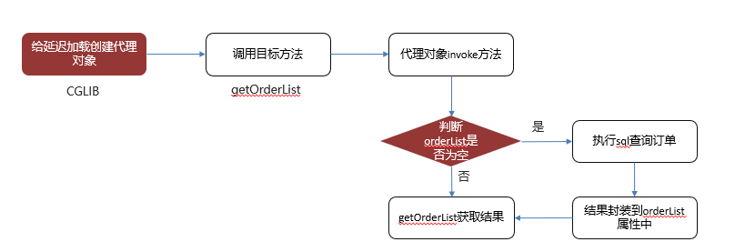

---

---

# Spring

1      Spring概述

①Spring是一个开源框架

②Spring为简化企业级开发而生，使用Spring，JavaBean就可以实现很多以前要靠EJB才能实现的功能。同样的功能，在EJB中要通过繁琐的配置和复杂的代码才能够实现，而在Spring中却非常的优雅和简洁。

③Spring是一个**IOC**(DI)和**AOP**容器框架。

④Spring的优良特性

[1]**非侵入式**：基于Spring开发的应用中的对象可以不依赖于Spring的API

[2]**依赖注入**：DI——Dependency Injection，反转控制(IOC)最经典的实现。

[3]**面向切面编程**：Aspect Oriented Programming——AOP

[4]**容器**：Spring是一个容器，因为它包含并且管理应用对象的生命周期

[5]**组件化**：Spring实现了使用简单的组件配置组合成一个复杂的应用。在 Spring 中可以使用XML和Java注解组合这些对象。

[6]**一站式**：在IOC和AOP的基础上可以整合各种企业应用的开源框架和优秀的第三方类库（实际上Spring 自身也提供了表述层的SpringMVC和持久层的Spring JDBC）。

框架流程：  1），导包  2），写配置  3），测试

spring的缺点：spring体系过于复杂，需要开发人员投入一定的学习成本

## 1，IOC

IOC :控制反转；==（本质就是一个Map）==

IOC其实准确的说是编程思想，依赖一个对象时，由原来的主动创建，编程了通过IOC注入，使用方不需要过多的关注创建细节，比如创建对象细节，相互依赖等问题，全部由IOC容器完成，达到解耦的目的。

DI：依赖注入。

- ### 依赖注入DI和IOC的关系：

  - 依赖注入不完全等同于IOC，依赖注入只是一个IOC的实现策略，还有依赖查找方式。
    - 依赖查找：在应用程序里，调用IOC容器的接口去获取对应的Bean对象。有代码侵入性，使用较少。
    - 依赖注入：在IOC容器启动时，通过构造器、字段、setter方法或接口等方式注入依赖。推荐使用

- ### 注入方式有：构造器注入和setter注入

  - **构造器注入不允许出现循环依赖，因为它要求注入的对象是成熟态。**不推荐使用（不懂的，可以看spring如何避免循环依赖）
    ==在 Spring 框架中，构造器注入不允许出现循环依赖的主要原因是构造器注入要求在对象被创建时所有依赖都已经可用。这与 Spring 的实例化和依赖注入机制有关==
    
    有些代码里面，注入对象通过private final xxxx，那么需要创建构造器，并传入该参数，在spring构建该对象时，也是通过构造器的方式传入需要注入的对象。
    
    - 优点：因为传入的是成熟态对象，因此一些变量是不可变的，这对程序的维护更方便

- ### BeanFactory和ApplicationContext的关系（源码中有讲解）

- ### spring中 初始化方法的执行顺序

  1. **Aware接口：**aware:可感知的，它本身是一个空接口，但是spring中有各种它的实现接口**（原来接口也可以继承）**，IOC容器创建时，会回调用各个setxxx方法，注入指定的信息。可以在注入信息时，执行相关操作。

     ```java
     public interface BeanNameAware extends Aware {
         void setBeanName(String name);
     }
     
     public interface BeanClassLoaderAware extends Aware {
         void setBeanClassLoader(ClassLoader classLoader);
     }
     
     public interface BeanFactoryAware extends Aware {
         void setBeanFactory(BeanFactory var1) throws BeansException;
     }
     ```

  2. **@PostConstruct注解：**用来修饰非静态的void方法，只会执行一次。是java的注解，不是spring的

     - 执行的时间是 Constructor(构造方法) -> @Autowired(依赖注入) -> @PostConstruct(注释的初始化方法)

  3. **InitializingBean 接口：**实现了该接口，spring会调用afterPropertiesSet方法，spring提供的初始化方式。

     - 在初始化Bean对象的时候调用。必须是Beanfactory设置完所有属性后，才会执行。

  4. **xml配置initiate-method**，指定自定义初始化方法

- @Bean的处理流程


**核心容器**

```
spring-beans-5.2.6.RELEASE
spring-context-5.2.6.RELEASE
spring-core-5.2.6.RELEASE
spring-expression-5.2.6.RELEASE
```

### 使用（可忽略）

#### 1，使用

创建SpringIOC.xml配置文件

```xml
    <bean id="person01" class="com.example.bean.person">
        <property name="lastname" value="张三"></property>
        <property name="age" value="13"></property>
        <property name="email" value="12"></property>
        <property name="gender" value="男"></property>
    </bean>
```

写测试

```java
        ApplicationContext context = new ClassPathXmlApplicationContext("ioc.xml");
        person person01 = (person)context.getBean("person01");
        System.out.println("person01 = " + person01);
```

#### 2，细节：

1. ApplicationContext (IOC容器的接口)
2. 在容器中注册bean组件，我们通过id获取对象
   1. bean组件的创建，是容器完成
   2. 容器中对象的创建在容器完成的时候就已经创建完成，会将xml配置好的bean创建完成
3. 同一组件在IOC容器中时单实例的，可以设置为多实例
4. IOC容器创建组件对象时，是首先通过空参构造器创建对象，然后再通过getter/setter方法配置属性

#### 3，获取组件Bean方式

从IOC容器中获取bean时，可以通过 id值获取，bean类型获取，若xml配置了多个该类型对象，获取时会出现报错

```Java
       //通过id值取对象，需要强转
       person person01 = (person)context.getBean("person01");
		//通过bean类型获取，不需要强转
        person person01 = context.getBean(person.class);
        //二者结合
        person person01 = context.getBean("person02",person.class);

```

#### 4，xml配置属性方法

##### 1，set方法属性赋值

```xml
<bean id="person01" class="com.example.bean.person">
    <property name="lastname" value="张三"></property>
    <property name="age" value="13"></property>
    <property name="email" value="12"></property>
    <property name="gender" value="男"></property>
</bean>
```

##### 2，通过构造器属性赋值

通过有参构造器，直接进行创建对象,不必经过get，set方法（name，可以省略，但是赋值顺序是，构造器的默认顺序）

```xml
    <bean id="person03" class="com.example.bean.person">
        <constructor-arg name="lastname" value="消灭"></constructor-arg>
        <constructor-arg name="age" value="16"></constructor-arg>
        <constructor-arg name="gender" value="nv"></constructor-arg>
        <constructor-arg name="email" value="132"></constructor-arg>
    </bean>
```

##### 3，名称标签赋值

通过p名称空间为bean赋值（可防止标签重复）

（但另外一个名称标签使用的set方法，此方法创建对象实质也是通过构造器创建，即若构造器四参数，该方法只配置三个参数，则出现错误）

 idea导入时，可以直接在bean内写，p: 直接Alt+Enter,create ->Unbound namespace prefix problems。

**注意，p名称空间在bean标签内部 <bean p:  p: >**

```xml
<bean id="person3" class="bean.person"  
    p:age="18" p:lastname="小明" p:gender="女" p:email="我二哥">
</bean>
```

##### 4，赋值null

```xml
    <bean id="person01" class="com.example.bean.Person">
        <property name="lastName">
            <null></null>
        </property>
    </bean>
```

##### 5，引用类型赋值


**引用其他bean**，ref为 其他配置类的

引用类，仅仅是引用该类，赋值为其他配置类地址

```xml
<property name="car" ref="car01"></property>
```


**引用内部类**  （内部类即使标注id，但不可在容器中获取到）

```xml
    <bean id="person01" class="com.example.bean.Person">
        <property name="lastName">
            <null></null>
        </property>
        <property name="gender" value="男"></property>
<!--        <property name="car" ref="car01"></property>-->
        <property name="car">
            <bean id="car02" class="com.example.bean.Car">
                <property name="carName" value="五菱小野猫"></property>
                <property name="color" value="粉色"></property>
                <property name="price" value="21300"></property>
            </bean>
        </property>
```

##### 6，集合类型赋值

###### list类型

```xml
        <property name="books">
            <list>
                <bean class="com.example.bean.Book">
                    <property name="bookName" value="西游记"></property>
                </bean>
                <ref bean="book01"></ref>
            </list>
        </property>
```

<list> 表示创建一个ArrayList

###### Map类型

<map> 创建 LinkedHashMap

```xml
        <property name="maps">
            <map>
                <entry key="12" value="123"></entry>
                <entry key="你好" value-ref="book01"></entry>
            </map>
        </property>
```

###### properties类型

properties为键值对。k=v，k，v都是string，值写在标签体中

```xml
        <property name="properties">
            <props>
                <prop key="123">sf</prop>
                <prop key="s" >32435</prop>
            </props>
        </property>
```

###### util名称空间，创建一个公共变量

```xml
    <util:map id="maputil">
        <entry key="12" value="123"></entry>
        <entry key="你好" value-ref="book01"></entry>
    </util:map>
```

##### 7,级联属性赋值 

级联属性（属性.属性）即对引用来的bean也可进行更改其属性，即该引用对象信息改动

```xml
    <bean id="person02" class="com.example.bean.Person">
        <property name="car" ref="car01"></property>
        <property name="car.price" value="642134521"></property>
    </bean>
```

##### 8，继承属性

parent：指定该bean配置继承哪个已经配置的bean属性。**继承重用设置的信息。可以property更改信息，但仅改动当前对象**

```xml
    <bean id="person02" class="com.example.bean.Person" parent="person01">
        <property name="car" ref="car01"></property>
        <property name="car.price" value="642134521"></property>
    </bean>
```

abstract属性：abstract="true",创建对象只能被继承,即不能通过getBean获取

##### 9，单实例多实例配置

scope：属性，配置作用域范围，本质为控制IOC创建对象是否是单实例

prototype：多实例的

1. 容器启动默认不会去创建多实例bean
2. 获取对象的时候，IOC容器会创建bean对象
3. 每次获取都会创建一个新的对象

singleton：单实例的

1. 在容器启动完成之前就已经创建了对象，保存在容器中
2. 任何获取都是获取IOC提前创建好的对象	


```xml
    <bean id="person02" class="com.example.bean.Person" parent="person01" scope="prototype">
        <property name="car" ref="car01"></property>
        <property name="car.price" value="642134521"></property>
    </bean>
```

##### 10，静态工厂与实例工厂

工厂帮助我们创建对象，有一个专门帮助我们创建对象的类，这个类就是工厂

静态工厂：工厂本身不用创建对象，通过静态方法调用， 对象=工厂类.工厂方法名

实例工厂：工厂本身需要创建对象

​						工厂类工厂对象 = new 工厂类()

​						工厂对象.getAirPlane（"张三"）

##### 静态工厂

工厂类

```Java
public class AirPlaneStaticFactory {
    public static AirPlane getAirPlane(String name){
        AirPlane plane = new AirPlane();
        plane.setFdj(name);
        plane.setFjsName("太行--静态");
        plane.setPersonNum(123);
        return plane;
    }
}
```

主要是xml配置

factory-method ：指定为工厂类，并应用constructor-arg传入参数

```xml
    <bean id="airplane01" class="com.example.bean.AirPlaneStaticFactory" factory-method="getAirPlane">
        <constructor-arg value="你好"></constructor-arg>
    </bean>
```

###### 实例工厂

1. 配置出实例工厂对象
2. 配置我们要创建的bean，使用哪个工厂创建
   1. factory-bean:指定使用哪个工厂实例
   2. factory-method：指定使用哪个工厂方法

```xml
    <bean id="airPlaneInstanceFactory" class="com.example.bean.AirPlaneInstanceFactory"></bean>
    
    
    <bean id="airplane02" class="com.example.bean.AirPlaneInstanceFactory"
          factory-bean="airPlaneInstanceFactory"
          factory-method="getAirPlane">
        <constructor-arg value="你好"></constructor-arg>
    </bean>
```

###### 实现FactoryBean接口

实现该接口，Spring自动识别为Factory，

1. 实现接口，并重新方法
   1. getObject 获取对象
   2. getObjectType 对象类型
   3. isSingleton 是否是单实例
2. xml配置

```xml
    <bean class="com.example.bean.MyFactoryBean" id="myFactoryBean"></bean>
```

FactoryBean

```Java
public class MyFactoryBean implements FactoryBean<Book> {
    @Override
    public Book getObject() throws Exception {
        Book book = new Book();
        book.setBookName(UUID.randomUUID().toString());
        return book;
    }

    @Override
    public Class<?> getObjectType() {
        return Book.class;
    }

    @Override
    public boolean isSingleton() {
        return true;
    }
}
```

##### 11，创建带有生命周期的Bean

生命周期：bean的创建到销毁  ioc容器中的bean：    

 1），单例bean，创建容器对象时，创建bean，关闭容器时，销毁bean     

2），多实例bean，获取bean对象时创建，**容器关闭不会调用销毁方法**

自定义初始化方法和销毁方法：**不能有参数传递流程** 

创建对象->执行初始化方法->销毁方法->销毁

```xml
    <bean id="book01" class="com.example.bean.Book" init-method="myInit" destroy-method="myDistory">
        <property name="bookName" value="东游记"></property>
    </bean>
```

##### 12后置处理器方法

**在IOC容器初始化每一个对象前后，调用该方法**

1. 实心接口类BeanPostProcessor
   1. 重写 初始化前，初始化后方法
2. 在IOC容器配置该类，（普通bean 配置）

```Java
public class MyBeanPostMethod implements BeanPostProcessor {
    @Override
    public Object postProcessBeforeInitialization(Object bean, String beanName) throws BeansException {
        System.out.println(beanName+"初始化之前的方法");
        return bean;
    }

    @Override
    public Object postProcessAfterInitialization(Object bean, String beanName) throws BeansException {
        System.out.println(beanName+"初始化之后的方法");
        return bean;
    }
}
```

xml配置

```xml
<bean class="com.example.bean.MyBeanPostMethod" id="beanPostMethod"></bean>
```

##### 12,spring连接外部文件

==应用为：spring管理数据库连接池==

数据库连接池需要导入包

```
mysql-connector-java-5.1.7-bin.jar
c3p0-0.9.1.2.jar
```

xml配置

```xml
    <bean class="com.mchange.v2.c3p0.ComboPooledDataSource" id="dataSource">
        <property name="user" value="root"></property>
        <property name="password" value="root"></property>
        <property name="jdbcUrl" value="jdbc:mysql://localhost:3306/test"></property>
        <property name="driverClass" value="com.mysql.jdbc.Driver"></property>
    </bean>
```


导入外部文件 

- context配置名称空间，指定外部文件 （idea 输入 <contesxt:   会自动导入名称空间）
- ${key}提取外部文件的内容
- 在配置文件中编辑（**user的key不能为username，username表示电脑系统的名称，而非自己设置的**）

```xml
<context:property-placeholder location="dbconfig.properties"></context:property-placeholder>
 <bean class="com.mchange.v2.c3p0.ComboPooledDataSource" id="dataSource">
     <property name="user" value="${user}"></property>
     <property name="password" value="${password}"></property>
     <property name="jdbcUrl" value="${jdbcUrl}"></property>
     <property name="driverClass" value="${driverClass}"></property>
 </bean>
```

properties文件

```
user=root
password=root
jdbcUrl=jdbc:mysql://localhost:3306/test
driverClass=com.mysql.jdbc.Driver
```

##### 13，XML自动装配（自动赋值）

**autowire 配置自动装配**

```xml
<bean class="com.example.bean.Person" id="person" autowire="byName">
</bean>
```

**autowire=default  /no**   

不自动装配，不自动为该bean内属性赋值

**autowire=byName**

按照类中属性名字   private Car **car;**

以属性名作为id去容器中查找该组件，给它赋值，为找到则装配null

**autowire=byType**

按照类中属性类   private Car **car;**

1. 若存在多个该类组件，报错
2. 若list类型已经配置泛型，且IOC容器有此类型对象，则自动装配到list中。

**autowire=constructor**

根据public Person(Car car)按照构造器进行自动赋值 （若没有该构造器则赋值null）

-  先按照有参构造器参数的类型进行装配（成功就赋值）；没有就直接为组件装配null即可。    
- 如果按照类型找到了多个；参数的名作为id继续匹配;找到就装配；找不到就null；   
- 不会报错； 自动的为属性赋值：

##### 14，SpEL

SpEL使用#{...}作为定界符，所有大框号内的字符都被认为是SpEL表达式

在SpEL中使用字面量

引用其他bean

引用其他bean的某个属性值

调用静态方法，调用非静态方法

使用运算符

```xml
   <bean id="person01" class="bean.person">
<!--        字面量，应用运算-->
        <property name="age" value="#{13*5}"></property>
<!--引用其他bean的某个属性值-->
        <property name="lastname" value="#{car01.carName}"></property>
<!--引用其他bean-->
        <property name="car" value="#{car}"></property>
<!--引用静态方法 #{类名}.静态方法-->
        <property name="email" value="#{T(java.lang.Math).PI*20}"></property>
<!--引用其他对象的方法， #{id.方法（）}-->
        <property name="gender" value="#{car.getCarName()}"></property>
     </bean>
```

#### 5，注解创建Dao，Service，Controller

Sping四个注解

@Controller ：控制器，推荐添加该注解

@Service：业务逻辑层，

@Repository：给数据库层（持久化层，dao层）添加该注解

@Component ：给其他类别添加到该层

**步骤：**

1. 需导入包spring-aop-5.2.6.RELEASE.jar

2. 在xml文件内添加代码，启动自动扫描，指定文件夹

   ```xml
       <context:component-scan base-package="com.example">
       </context:component-scan>
   ```

3. 添加注解后，id为类名（首字母小写），也可自己指定  @Controller（"新ID名"）

   默认作用域单实例

@Repository("dao")==更改新类名==

@Scope(value="prototype")==更改为多实例==


**xml配置可以指定，或者排除要包含的类**

type指定排除规则

- type=annotation ，排除指定接口

```
    <context:component-scan base-package="com.example">
        <context:exclude-filter type="annotation" expression="org.springframework.stereotype.Repository"/>
    </context:component-scan>
```

- type=assignable,排除指定类

```xml
    <context:component-scan base-package="com.example">
        <context:exclude-filter type="assignable" expression="com.example.dao.BookDao"/>
    </context:component-scan>
```


context:include-filter 添加指定

#### 6，@Autowired （自动注入）

通过该注释，自动为属性赋值

#### 步骤

1. 按类型查找

2. 若找到一个，则赋值，

   若找到多个

   1. 按变量名作为id查找
      1. 找的，则匹配
      2. 没找到则报错

##### @Qualifier("id")

若antowired注释还有@Qualifier("id")查找，则直接选择id查找，注入

未找到，则报错

##### @Autowired 内置属性： request

默认为request=true  因此，为找到注入，则报错

request=false，则注入null。不会报错

##### @Autowired 可以修饰方法

- 该方法会在Bean创建时自动运行

- 为方法的每一个形参自动注入参数值
- 参数上也可标注注释**@Qualifier("id")**

##### @Autowired，@Resource，@Inject都是自动装配的意思

区别：

 @Autowired：功能更强大，是spring自己的注解（即离开Spring框架就不可用）

@Resource: java的标准注释，拓展性更强。若使用其他的容器框架，@Resource仍可用，@Autowired则不可用

#### 7，泛型依赖注入

Spring可以使用带泛型的父类类型来确定这个子类类型


如下图所示，调用bookservice和userservice方法，因为继承baseservice，所以继承的方法以及属性也可调用。以bookservice为例，调用bookservice的save方法，会传入泛型Book，则自动注入泛型，会找到baseDao，baseDao的泛型为Book，因此找到BookDao。BookDao继承了baseDao。所以即使baseservice以及basedao没有加入IOC容器仍可进行调用。就是因为真正调用的方法为继承子类。


### ==Spring中的Bean==

BeanDefinition是Spring框架中定义了Bean配置元信息的接口，这些信息并未保存在使用者写的Bean信息中，Bean通过BeanDefinition配置元信息对象生成的。解耦，方便管理。在Bean的声明周期中，会根据该对象进行实例化和初始化操作。其中包含：

- Bean的类名
- Bean行为配置类，如作用域、自动绑定模式、生命周期回调等
- 其他Bean的依赖关系
- 配置设置，Bean的属性


**不同方式注入的Bean是不同的，如下：**

1. XML 定义 Bean：GenericBeanDefinition
2. @Component 以及派生注解定义 Bean：ScannedGenericBeanDefinition
3. 借助于 @Import 导入 Bean：AnnotatedGenericBeanDefinition
4. @Bean 定义的方法：ConfigurationClassBeanDefinition 私有静态类

上面的 `1`、`2`、`3` 三种 BeanDefinition 实现类具有层次性，在 Spring BeanFactory 初始化 Bean 的前阶段，会根据 BeanDefinition 生成一个合并后的 RootBeanDefinition 对象

### ==BeanDefinition的加载阶段（XML文件）==

#### 使用

xml中配置对象

```xml
<bean id="user" class="org.geekbang.thinking.in.spring.ioc.overview.domain.User">
        <property name="id" value="1"/>
        <property name="name" value="小马哥"/>
</bean>
```


```java
// 创建 BeanFactory 容器
DefaultListableBeanFactory beanFactory = new DefaultListableBeanFactory();
XmlBeanDefinitionReader reader = new XmlBeanDefinitionReader(beanFactory);
// XML 配置文件 ClassPath 路径
String location = "classpath:/META-INF/dependency-lookup-context.xml";
// 加载配置
int beanDefinitionsCount = reader.loadBeanDefinitions(location);
System.out.println("Bean 定义加载的数量：" + beanDefinitionsCount);
// 依赖查找
System.out.println(beanFactory.getBean("user"));;
```

IOC容器的使用过程：

1. 创建BeanFactory对象，（底层的IOC容器，真实对象保存在该Factory中的一个属性 currentHashMap中）
2. 将BeanFactory于BeanDefinitionReader进行关联
3. BeanDefinitionReader 解析xml配置文件
4. 通过依赖查找该对象


#### BeanDefinitionReader依赖关系：


- org.springframework.beans.factory.support.BeanDefinitionReader 接口，BeanDefinition读取器
- org.springframework.beans.factory.support.AbstractBeanDefinitionReader：读取器抽象类，提供了通用实现
- org.springframework.beans.factory.xml.XmlBeanDefinitionReader：xml文件字段解析器，解析出BeanDefinition配置元信息对象并注册
- org.springframework.beans.factory.support.PropertiesBeanDefinitionReader：properies 文件解析器


#### BeanDefinitionReader 接口

包括：注册中心，Resource资源加载器，类加载器，

定义了各种方法，主要是通过Resource资源加载BeanDefinition

```java
public interface BeanDefinitionReader {

	/** 返回 BeanDefinition 注册中心 */
	BeanDefinitionRegistry getRegistry();

	/** 返回 Resource 资源加载器，默认为 PathMatchingResourcePatternResolver */
	@Nullable
	ResourceLoader getResourceLoader();

	/** 返回类加载器 */
	@Nullable
	ClassLoader getBeanClassLoader();

	/** 返回 Bean 的名称生成器，默认为 DefaultBeanNameGenerator */
	BeanNameGenerator getBeanNameGenerator();


	/** 从 Resource 资源中加载 BeanDefinition 并返回数量 */
	int loadBeanDefinitions(Resource resource) throws BeanDefinitionStoreException;

	int loadBeanDefinitions(Resource... resources) throws BeanDefinitionStoreException;
    
	int loadBeanDefinitions(String location) throws BeanDefinitionStoreException;

	int loadBeanDefinitions(String... locations) throws BeanDefinitionStoreException;
}
```

##### AbstractBeanDefinitionReader 抽象类

该接口实现了BeanDefinitionReader接口，**添加了很多默认配置（看来很多默认配置是在抽象类中配置好的）**

- 创建该对象时需要传入注册中心，配置资源加载器ResourceLoader，默认是PathMatchingResourcePatternResolver
-  loadBeanDefinitions的所有方法，最终都会调用到一个方法loadBeanDefinitions(String location, @Nullable Set<Resource> actualResources)
  - 获取资源加载器ResourceLoader
  - ResourceLoader资源加载器通过传入的location，获取Resource数组  （为什么可能是数组，有可能传入的资源是 `/app/*.xml`）这种风格的，那么就是多个资源了
  - 然后调用loadBeanDefinitions 加载所有的资源信息 （**该方法留给子类开发，来适配多种方式的实现**）
  - 并将资源信息保存到actualResources 

```java
public abstract class AbstractBeanDefinitionReader implements BeanDefinitionReader, EnvironmentCapable {

	private final BeanDefinitionRegistry registry;

	@Nullable
	private ResourceLoader resourceLoader;

	@Nullable
	private ClassLoader beanClassLoader;

	private Environment environment;

	private BeanNameGenerator beanNameGenerator = new DefaultBeanNameGenerator();

	protected AbstractBeanDefinitionReader(BeanDefinitionRegistry registry) {
		Assert.notNull(registry, "BeanDefinitionRegistry must not be null");
		this.registry = registry;

		// Determine ResourceLoader to use.
		if (this.registry instanceof ResourceLoader) {
			this.resourceLoader = (ResourceLoader) this.registry;
		}
		else {
			this.resourceLoader = new PathMatchingResourcePatternResolver();
		}

		// Inherit Environment if possible
		if (this.registry instanceof EnvironmentCapable) {
			this.environment = ((EnvironmentCapable) this.registry).getEnvironment();
		}
		else {
			this.environment = new StandardEnvironment();
		}
	}

	@Override
	public int loadBeanDefinitions(Resource... resources) throws BeanDefinitionStoreException {
		Assert.notNull(resources, "Resource array must not be null");
		int count = 0;
		for (Resource resource : resources) {
			count += loadBeanDefinitions(resource);
		}
		return count;
	}

	@Override
	public int loadBeanDefinitions(String location) throws BeanDefinitionStoreException {
		return loadBeanDefinitions(location, null);
	}

	public int loadBeanDefinitions(String location, @Nullable Set<Resource> actualResources) throws BeanDefinitionStoreException {
		// 获得 ResourceLoader 对象
		ResourceLoader resourceLoader = getResourceLoader();
		if (resourceLoader == null) {
			throw new BeanDefinitionStoreException(
					"Cannot load bean definitions from location [" + location + "]: no ResourceLoader available");
		}

		if (resourceLoader instanceof ResourcePatternResolver) {
			// Resource pattern matching available.
			try {
				// 获得 Resource 数组，因为 Pattern 模式匹配下，可能有多个 Resource 。例如说，Ant 风格的 location
				Resource[] resources = ((ResourcePatternResolver) resourceLoader).getResources(location);
				// 加载 BeanDefinition 们
				int count = loadBeanDefinitions(resources);
				if (actualResources != null) {
					// 添加到 actualResources 中
					Collections.addAll(actualResources, resources);
				}
				if (logger.isTraceEnabled()) {
					logger.trace("Loaded " + count + " bean definitions from location pattern [" + location + "]");
				}
				return count;
			}
			catch (IOException ex) {
				throw new BeanDefinitionStoreException(
						"Could not resolve bean definition resource pattern [" + location + "]", ex);
			}
		}
		else {
			// Can only load single resources by absolute URL.
			// 获得 Resource 对象
			Resource resource = resourceLoader.getResource(location);
			// 加载 BeanDefinition 们
			int count = loadBeanDefinitions(resource);
			if (actualResources != null) {
				// 添加到 actualResources 中
				actualResources.add(resource);
			}
			if (logger.isTraceEnabled()) {
				logger.trace("Loaded " + count + " bean definitions from location [" + location + "]");
			}
			return count;
		}
	}

	@Override
	public int loadBeanDefinitions(String... locations) throws BeanDefinitionStoreException {
		Assert.notNull(locations, "Location array must not be null");
		int count = 0;
		for (String location : locations) {
			count += loadBeanDefinitions(location);
		}
		return count;
	}
    
    // ... 省略相关代码
}

```

#### XmlBeanDefinitionReader

xml 文件资源解析器，解析真正的BeanDefinition配置元数据信息，并在注册中心注册

- 构造器中，需要传入BeanDefinitionRegistry 注册中心
- loadBeanDefinitions 方法中
  - 获取当前线程正在加载的Resurce资源Set集合，并且获取该Set集合，避免重复添加
  - 从Resurce 资源中获取InputStream流对象
  - 调用`doLoadBeanDefinitions(InputSource inputSource, Resource resource)` 方法，加载Resource资源，解析出BeanDefinition 进行注册
    - 通过调用`doLoadDocument(inputSource, resource);`,读取xml文件实例对象，读取过程中会进行校验、解析生成Document对象
    - 调用`registerBeanDefinitions`，通过xml文件实例，解析出BeanDefinition 对象们，并返回注册数量。当前方法中
      - 创建BeanDefinition文件读取器
      - 获取已经注册的BeanDefinition对象
      - 此时会创建 XmlReaderContext 对象（读取 Resource 资源的上下文对象）
      - 根据传入的文件对象和XmlReaderContext 解析出所有的BeanDefinition 并注册
      - 计算新注册的BeanDefinition 数量并返回
  - 执行结束后，删除当前加载的Resource对象

```java
public class XmlBeanDefinitionReader extends AbstractBeanDefinitionReader {
	/**
	 * 禁用验证模式
	 */
	public static final int VALIDATION_NONE = XmlValidationModeDetector.VALIDATION_NONE;

	/**
	 * 自动获取验证模式
	 */
	public static final int VALIDATION_AUTO = XmlValidationModeDetector.VALIDATION_AUTO;

	/**
	 * DTD 验证模式
	 */
	public static final int VALIDATION_DTD = XmlValidationModeDetector.VALIDATION_DTD;

	/**
	 * XSD 验证模式
	 */
	public static final int VALIDATION_XSD = XmlValidationModeDetector.VALIDATION_XSD;

	/** Constants instance for this class. */
	private static final Constants constants = new Constants(XmlBeanDefinitionReader.class);

	/**
	 * 验证模式，默认为自动模式。
	 */
	private int validationMode = VALIDATION_AUTO;

	private boolean namespaceAware = false;

	private Class<? extends BeanDefinitionDocumentReader> documentReaderClass = DefaultBeanDefinitionDocumentReader.class;

	/**
	 * 解析过程中异常处理器
	 */
	private ProblemReporter problemReporter = new FailFastProblemReporter();

	private ReaderEventListener eventListener = new EmptyReaderEventListener();

	private SourceExtractor sourceExtractor = new NullSourceExtractor();

	@Nullable
	private NamespaceHandlerResolver namespaceHandlerResolver;

	private DocumentLoader documentLoader = new DefaultDocumentLoader();

	@Nullable
	private EntityResolver entityResolver;

	private ErrorHandler errorHandler = new SimpleSaxErrorHandler(logger);

	/**
	 * XML 验证模式探测器
	 */
	private final XmlValidationModeDetector validationModeDetector = new XmlValidationModeDetector();

	/**
	 * 当前线程，正在加载的 EncodedResource 集合。
	 */
	private final ThreadLocal<Set<EncodedResource>> resourcesCurrentlyBeingLoaded = new NamedThreadLocal<>(
        "XML bean definition resources currently being loaded");

	/**
	 * Create new XmlBeanDefinitionReader for the given bean factory.
	 * @param registry the BeanFactory to load bean definitions into,
	 * in the form of a BeanDefinitionRegistry
	 */
	public XmlBeanDefinitionReader(BeanDefinitionRegistry registry) {
		super(registry);
	}
}

```

重写`loadBeanDefinitions(Resource resource)` 方法 

```java
@Override
public int loadBeanDefinitions(Resource resource) throws BeanDefinitionStoreException {
    return loadBeanDefinitions(new EncodedResource(resource));
}

public int loadBeanDefinitions(EncodedResource encodedResource) throws BeanDefinitionStoreException {
    Assert.notNull(encodedResource, "EncodedResource must not be null");
    if (logger.isTraceEnabled()) {
        logger.trace("Loading XML bean definitions from " + encodedResource);
    }

    // <1> 获取当前线程正在加载的 Resource 资源集合，添加当前 Resource，防止重复加载
    Set<EncodedResource> currentResources = this.resourcesCurrentlyBeingLoaded.get();
    if (currentResources == null) {
        currentResources = new HashSet<>(4);
        this.resourcesCurrentlyBeingLoaded.set(currentResources);
    }
    if (!currentResources.add(encodedResource)) { // 将当前资源加入记录中。如果已存在，抛出异常，防止循环加载同一资源出现死循环
        throw new BeanDefinitionStoreException(
                "Detected cyclic loading of " + encodedResource + " - check your import definitions!");
    }
    try {
        // <2> 从 Resource 资源获取 InputStream 流对象（支持编码）
        InputStream inputStream = encodedResource.getResource().getInputStream();
        try {
            InputSource inputSource = new InputSource(inputStream);
            if (encodedResource.getEncoding() != null) {
                inputSource.setEncoding(encodedResource.getEncoding());
            }
            // <3> 【核心】执行加载 Resource 资源过程，解析出 BeanDefinition 进行注册
            return doLoadBeanDefinitions(inputSource, encodedResource.getResource());
        } finally {
            // 关闭流
            inputStream.close();
        }
    } catch (IOException ex) {
        throw new BeanDefinitionStoreException(
                "IOException parsing XML document from " + encodedResource.getResource(), ex);
    } finally {
        // <4> 从当前线程移除当前加载的 Resource 对象
        currentResources.remove(encodedResource);
        if (currentResources.isEmpty()) {
            this.resourcesCurrentlyBeingLoaded.remove();
        }
    }
}

protected int doLoadBeanDefinitions(InputSource inputSource, Resource resource)
        throws BeanDefinitionStoreException {
    try {
        // <1> 获取 XML Document 实例
        Document doc = doLoadDocument(inputSource, resource);
        // <2> 根据 Document 实例，解析出 BeanDefinition 们并注册，返回注册数量
        int count = registerBeanDefinitions(doc, resource);
        if (logger.isDebugEnabled()) {
            logger.debug("Loaded " + count + " bean definitions from " + resource);
        }
        return count;
    }
    // 省略 catch 各种异常
}

/**
* 
*
*/
protected Document doLoadDocument(InputSource inputSource, Resource resource) throws Exception {
    // <3> 通过 DefaultDocumentLoader 根据 Resource 获取一个 Document 对象
    return this.documentLoader.loadDocument(inputSource,
            getEntityResolver(), // <1> 获取 `org.xml.sax.EntityResolver` 实体解析器，ResourceEntityResolver
            this.errorHandler,
            getValidationModeForResource(resource), isNamespaceAware()); // <2> 获取 XML 文件验证模式，保证 XML 文件的正确性
}


public int registerBeanDefinitions(Document doc, Resource resource) throws BeanDefinitionStoreException {
    // <1> 创建 BeanDefinitionDocumentReader 对象
    BeanDefinitionDocumentReader documentReader = createBeanDefinitionDocumentReader();
    // <2> 获取已注册的 BeanDefinition 数量
    int countBefore = getRegistry().getBeanDefinitionCount();
    // <3> 创建 XmlReaderContext 对象（读取 Resource 资源的上下文对象）
    // <4> 根据 Document、XmlReaderContext 解析出所有的 BeanDefinition 并注册
    documentReader.registerBeanDefinitions(doc, createReaderContext(resource));
    // <5> 计算新注册的 BeanDefinition 数量
    return getRegistry().getBeanDefinitionCount() - countBefore;
}
```


#### registerBeanDefinitions 创建细节

##### BeanDefinitionDocumentReader

获取BeanDefinition 文件阅读器


- 获取BeanDefinition 文件阅读器
  - Spring中的具体默认实现类是DefaultBeanDefinitionDocumentReader，解析xml文件，该类中定义了xml文件中常用标签
- registerBeanDefinitions 方法中，根据Document、xmlReadercontext解析出所有的BeanDefinition对象
  - 

```java
public class DefaultBeanDefinitionDocumentReader implements BeanDefinitionDocumentReader {

    /** bean */
	public static final String BEAN_ELEMENT = BeanDefinitionParserDelegate.BEAN_ELEMENT;

	public static final String NESTED_BEANS_ELEMENT = "beans";

	public static final String ALIAS_ELEMENT = "alias";

	public static final String NAME_ATTRIBUTE = "name";

	public static final String ALIAS_ATTRIBUTE = "alias";

	public static final String IMPORT_ELEMENT = "import";

	public static final String RESOURCE_ATTRIBUTE = "resource";

	public static final String PROFILE_ATTRIBUTE = "profile";

	@Nullable
	private XmlReaderContext readerContext;

	/**
	 * XML 文件的 BeanDefinition 解析器
	 */
	@Nullable
	private BeanDefinitionParserDelegate delegate;
}
```

registerBeanDefinitions 方法中，根据Document、xmlReadercontext解析出所有的BeanDefinition对象

- `parseBeanDefinitions(Element root, BeanDefinitionParserDelegate delegate)` 方法，解析 XML Document 的最外层的标签`<Beans>`，解析出 BeanDefinition 并注册
- 解析BeanDefinition中，遍历所有子节点，调用parseDefaultElement 进行解析
- parseDefaultElement中判断标签是`<import />`导入新的xml文件,`<alias />`Bean别名信息， `<bean />`解析并注册为BeanDefinition 调用processBeanDefinition 方法。

```java
@Override
public void registerBeanDefinitions(Document doc, XmlReaderContext readerContext) {
    this.readerContext = readerContext;
    // 获得 XML Document Root Element
    // 执行注册 BeanDefinition
    doRegisterBeanDefinitions(doc.getDocumentElement());
}

/**
 * Register each bean definition within the given root {@code <beans/>} element.
 */
@SuppressWarnings("deprecation")  // for Environment.acceptsProfiles(String...)
protected void doRegisterBeanDefinitions(Element root) {
    // 记录老的 BeanDefinitionParserDelegate 对象，避免再次调用当前方法时解析出现问题（默认值可能不同）
    BeanDefinitionParserDelegate parent = this.delegate;
    // <1> 创建 BeanDefinitionParserDelegate 对象 `delegate`，并初始化默认值
    this.delegate = createDelegate(getReaderContext(), root, parent);

    // <2> 检查 <beans /> 根标签的命名空间是否为空，或者是 http://www.springframework.org/schema/beans
    if (this.delegate.isDefaultNamespace(root)) {
        // <2.1> 获取 `profile` 属性
        String profileSpec = root.getAttribute(PROFILE_ATTRIBUTE);
        if (StringUtils.hasText(profileSpec)) {
            // <2.2> 使用分隔符切分，可能有多个 `profile`
            String[] specifiedProfiles = StringUtils.tokenizeToStringArray(
                profileSpec, BeanDefinitionParserDelegate.MULTI_VALUE_ATTRIBUTE_DELIMITERS);
            // We cannot use Profiles.of(...) since profile expressions are not supported
            // in XML config. See SPR-12458 for details.
            // <2.3> 根据 Spring Environment 进行校验，如果所有 `profile` 都无效，则不进行注册
            if (!getReaderContext().getEnvironment().acceptsProfiles(specifiedProfiles)) {
                if (logger.isDebugEnabled()) {
                    logger.debug("Skipped XML bean definition file due to specified profiles [" + profileSpec +
                            "] not matching: " + getReaderContext().getResource());
                }
                return;
            }
        }
    }
    // <3> 解析前处理
    preProcessXml(root);
    // <4> 解析出 XML Document 中的 BeanDefinition 并注册【重点】
    parseBeanDefinitions(root, this.delegate);
    // <5> 解析后处理
    postProcessXml(root);
    // 设置 delegate 回老的 BeanDefinitionParserDelegate 对象
    this.delegate = parent;
}


protected void parseBeanDefinitions(Element root, BeanDefinitionParserDelegate delegate) {
    // <1> 如果根节点使用默认命名空间，执行默认解析
    if (delegate.isDefaultNamespace(root)) {
        // <1.1> 遍历所有的子节点
        NodeList nl = root.getChildNodes();
        for (int i = 0; i < nl.getLength(); i++) {
            Node node = nl.item(i);
            if (node instanceof Element) {
                Element ele = (Element) node;
                // <1.2> 如果该节点使用默认命名空间，执行默认解析
                if (delegate.isDefaultNamespace(ele)) {
                    parseDefaultElement(ele, delegate);
                }
                // <1.3> 如果该节点非默认命名空间，执行自定义解析
                else {
                    delegate.parseCustomElement(ele);
                }
            }
        }
    }
    // <2> 如果根节点非默认命名空间，执行自定义解析
    else {
        delegate.parseCustomElement(root);
    }
}
/**
* Spring 默认解析xml配置
*/

private void parseDefaultElement(Element ele, BeanDefinitionParserDelegate delegate) {
    if (delegate.nodeNameEquals(ele, IMPORT_ELEMENT)) {
        // 解析 `<import />`
        importBeanDefinitionResource(ele);
    }
    else if (delegate.nodeNameEquals(ele, ALIAS_ELEMENT)) {
        // 解析 `<alias />`，将 name 对应的 alias 别名进行注册
        processAliasRegistration(ele);
    }
    else if (delegate.nodeNameEquals(ele, BEAN_ELEMENT)) {
        // 解析 `<bean />` 【重点】
        processBeanDefinition(ele, delegate);
    }
    else if (delegate.nodeNameEquals(ele, NESTED_BEANS_ELEMENT)) {
        // 循环处理，解析 `<beans />`
        doRegisterBeanDefinitions(ele);
    }
}
/**
* 【重点】解析Bean对象
*/
protected void processBeanDefinition(Element ele, BeanDefinitionParserDelegate delegate) {
    // <1> 解析 `<bean />` 标签，返回 BeanDefinitionHolder 对象（包含 BeanDefinition、beanName、aliases） 【重点】
    BeanDefinitionHolder bdHolder = delegate.parseBeanDefinitionElement(ele);
    if (bdHolder != null) {
        // <2> 对该标签进行装饰，一般不会，暂时忽略
        bdHolder = delegate.decorateBeanDefinitionIfRequired(ele, bdHolder);
        try {
            // Register the final decorated instance.
            // <3> 进行 BeanDefinition 的注册 【重点】
            BeanDefinitionReaderUtils.registerBeanDefinition(bdHolder, getReaderContext().getRegistry());
        }
        catch (BeanDefinitionStoreException ex) {
            getReaderContext().error("Failed to register bean definition with name '" +
                    bdHolder.getBeanName() + "'", ele, ex);
        }
        // Send registration event.
        // <4> 发出响应事件，通知相关的监听器，已完成该 Bean 标签的解析
        getReaderContext().fireComponentRegistered(new BeanComponentDefinition(bdHolder));
    }
}
```


#### processBeanDefinition方法

该方法将xml文件中某个`<bean>`标签，解析成BeanDefinition。方法返回一个BeanDefinitionHolder

- 获取别名信息

  - 获取标签中的ID和name属性   （id和name区别不大，若两个都配置，则优先使用id，若都没配置，则使用默认的类名）

  - 将Bean的别名全部添加到新建的别名集合（当前临时集合，后续会统一管理中）
  - 优先选择id作为Bean的别名，若为空，则选择name

  - 若都没有，则自动生成一个BeanName

  - 校验Bean别名的唯一性

- 解析XML文件中的`<bean/>`标签，调用重载方法:parseBeanDefinitionElement方法，解析默认的命名空间，解析`<bean>  <bean/>`一对标签中的配置信息，赋值到GenericBeanDefinition对象

  - 获取Bean标签中的Class和parent属性并赋值。指定当前类和父类。
  - 解析Bean的各种属性赋值（scope、abstract、lazy-init、autowire、depends-on、autowire-candidate、primary、init-method、destroy-method、factory-method）
  - 解析Bean的各种子标签
    - 解析 `<meta />` 元数据标签，将 key-value 保存至 Map 中
    - 解析 `<lookup-method />` 标签，解析成 LookupOverride 对象，用于实现 Bean 中的某个方法
    - 解析 `<replaced-method />` 标签，解析成 ReplaceOverride 对象，用于替换 Bean 中的某个方法
    - 解析 `<constructor-arg />` 构造函数的参数集合标签，将各个参数解析出来，可根据 index 属性进行排序
    - 解析 `<property />` 属性标签，将各个属性解析出来，每个属性对应一个 PropertyValue，添加至 `bd` 的 MutablePropertyValues 属性中
    - 解析 `<qualifier />` 标签，解析出需要注入的对象 AutowireCandidateQualifier
  - 设置resource资源方式为XML文件资源
  - 设置Bean的来源source=为Bean标签

```java
@Nullable
public BeanDefinitionHolder parseBeanDefinitionElement(Element ele) {
    return parseBeanDefinitionElement(ele, null);
}

public BeanDefinitionHolder parseBeanDefinitionElement(Element ele, @Nullable BeanDefinition containingBean) {
    // <1> 计算 BeanDefinition 的 `beanName` 名称和 `aliases` 别名集合
    // <1.1> 获取标签的 `id` 和 `name` 属性
    String id = ele.getAttribute(ID_ATTRIBUTE);
    String nameAttr = ele.getAttribute(NAME_ATTRIBUTE);

    // <1.2> 将 `name` 属性全部添加至别名集合
    List<String> aliases = new ArrayList<>();
    if (StringUtils.hasLength(nameAttr)) {
        String[] nameArr = StringUtils.tokenizeToStringArray(nameAttr, MULTI_VALUE_ATTRIBUTE_DELIMITERS);
        aliases.addAll(Arrays.asList(nameArr));
    }

    // <1.3> 设置 Bean 的名称，优先 `id` 属性，其次 `name` 属性
    String beanName = id;
    if (!StringUtils.hasText(beanName) && !aliases.isEmpty()) {
        beanName = aliases.remove(0); // 移除出别名集合
        if (logger.isTraceEnabled()) {
            logger.trace("No XML 'id' specified - using '" + beanName +
                    "' as bean name and " + aliases + " as aliases");
        }
    }

    // <1.4> 检查 `beanName` 的唯一性
    if (containingBean == null) {
        checkNameUniqueness(beanName, aliases, ele);
    }

    // <2> 解析 `<bean />` 标签相关属性，构造出一个 GenericBeanDefinition 对象
    AbstractBeanDefinition beanDefinition = parseBeanDefinitionElement(ele, beanName, containingBean);
    if (beanDefinition != null) {
        // <3> 如果不存在 `beanName`，则根据 Class 对象的名称生成一个
        if (!StringUtils.hasText(beanName)) {
            try {
                if (containingBean != null) { // 内部 Bean
                    // <3.1> 生成唯一的 `beanName`
                    beanName = BeanDefinitionReaderUtils.generateBeanName(
                            beanDefinition, this.readerContext.getRegistry(), true);
                }
                else {
                    // <3.2> 生成唯一的 beanName
                    beanName = this.readerContext.generateBeanName(beanDefinition);
                    // Register an alias for the plain bean class name, if still possible,
                    // if the generator returned the class name plus a suffix.
                    // This is expected for Spring 1.2/2.0 backwards compatibility.
                    String beanClassName = beanDefinition.getBeanClassName();
                    if (beanClassName != null &&
                            beanName.startsWith(beanClassName) && beanName.length() > beanClassName.length() &&
                            !this.readerContext.getRegistry().isBeanNameInUse(beanClassName)) {
                        aliases.add(beanClassName);
                    }
                }
                if (logger.isTraceEnabled()) {
                    logger.trace("Neither XML 'id' nor 'name' specified - " +
                            "using generated bean name [" + beanName + "]");
                }
            }
            catch (Exception ex) {
                error(ex.getMessage(), ele);
                return null;
            }
        }
        // <4> 创建 BeanDefinitionHolder 对象，设置 `beanName` 名称和 `aliases` 别名集合，返回
        String[] aliasesArray = StringUtils.toStringArray(aliases);
        return new BeanDefinitionHolder(beanDefinition, beanName, aliasesArray);
    }

    return null;
}
```


parseBeanDefinitionElement()方法，

```java
@Nullable
public AbstractBeanDefinition parseBeanDefinitionElement(
        Element ele, String beanName, @Nullable BeanDefinition containingBean) {

    this.parseState.push(new BeanEntry(beanName));

    // <1> 获取 `class` 和 `parent` 属性
    String className = null;
    if (ele.hasAttribute(CLASS_ATTRIBUTE)) {
        className = ele.getAttribute(CLASS_ATTRIBUTE).trim();
    }
    String parent = null;
    if (ele.hasAttribute(PARENT_ATTRIBUTE)) {
        parent = ele.getAttribute(PARENT_ATTRIBUTE);
    }
    try {
        // <2> 构建一个 GenericBeanDefinition 对象 `bd`
        AbstractBeanDefinition bd = createBeanDefinition(className, parent);

        // <3> 解析 `<bean />` 的各种属性并赋值
        parseBeanDefinitionAttributes(ele, beanName, containingBean, bd);
        // 提取 description
        bd.setDescription(DomUtils.getChildElementValueByTagName(ele, DESCRIPTION_ELEMENT));

        // <4> 解析 `<bean />` 的子标签，生成的对象设置到 `bd` 中

        // <4.1> 解析 `<meta />` 元数据标签
        parseMetaElements(ele, bd);
        // <4.2> 解析 `<lookup-method />` 标签
        parseLookupOverrideSubElements(ele, bd.getMethodOverrides());
        // <4.3> 解析 `<replaced-method />` 标签
        parseReplacedMethodSubElements(ele, bd.getMethodOverrides());

        // <4.4> 解析 `<constructor-arg />` 构造函数的参数集合标签
        parseConstructorArgElements(ele, bd);
        // <4.5> 解析 `<property />` 属性标签
        parsePropertyElements(ele, bd);
        // <4.5> 解析 `<qualifier />` 标签
        parseQualifierElements(ele, bd);

        // <5> 设置 Bean 的 `resource` 资源为 XML 文件资源
        bd.setResource(this.readerContext.getResource());
        // <6> 设置 Bean 的 `source` 来源为 `<bean />` 标签对象
        bd.setSource(extractSource(ele));

        return bd;
    }
    // ... 省略 catch 各种异常
    finally {
        this.parseState.pop();
    }

    return null;
}
```


#### registerBeanDefinition方法

通过上一步解析xml文件返回的BeanDefinitionHolder，生成注册成BeanDefinition

- 注册BeanDefinition，registry.registerBeanDefinition(beanName, definitionHolder.getBeanDefinition());方法， 实际调用的是实现类是DefaultListableBeanFactory，Spring底层的IOC容器，
- 注册alias别名 （别名也存储在一个currentHashMap中，key：类名，value：Alias别名）

```java
public static void registerBeanDefinition(
        BeanDefinitionHolder definitionHolder, BeanDefinitionRegistry registry)
        throws BeanDefinitionStoreException {

    // <1> 注册 BeanDefinition
    // Register bean definition under primary name.
    String beanName = definitionHolder.getBeanName();
    registry.registerBeanDefinition(beanName, definitionHolder.getBeanDefinition());

    // <2> 注册 alias 别名
    // Register aliases for bean name, if any.
    String[] aliases = definitionHolder.getAliases();
    if (aliases != null) {
        for (String alias : aliases) {
            registry.registerAlias(beanName, alias);
        }
    }
}
```

##### registerBeanDefinition 注册beanDefinition

- 校验beanName和BeanDefinition
- 从`currentHashMap<String,BeanDefinition>`中通过BeanName获取，以此判断是否注册了该BeanDefinition,不允许名称相同，则抛异常
- 注册时，首先判断是否已经开始创建Bean
  - 若是：则需要对currentHashMap加锁（是不是很奇怪？ currentHashmap的put和get都是原子操作，可以保证线程安全，但是如果多个线程分别调用get和put，则需要加锁 。另外BeanDefinitionNames `List<String>`集合，使用时创建一个新的，则也是为了避免并发问题）
    - 在map中添加数据信息，并且创建一个新的BeanDefinitionNames `List<String>`集合，添加值，最后赋值。
  - 若不是，则直接在map和BeanDefinitionNames中添加数据信息

```java
// org.springframework.beans.factory.support.DefaultListableBeanFactory
@Override
public void registerBeanDefinition(String beanName, BeanDefinition beanDefinition)
        throws BeanDefinitionStoreException {

    // 校验 beanName 与 beanDefinition 非空
    Assert.hasText(beanName, "Bean name must not be empty");
    Assert.notNull(beanDefinition, "BeanDefinition must not be null");

    // <1> 校验 BeanDefinition
    // 这是注册前的最后一次校验了，主要是对属性 methodOverrides 进行校验
    if (beanDefinition instanceof AbstractBeanDefinition) {
        try {
            ((AbstractBeanDefinition) beanDefinition).validate();
        }
        catch (BeanDefinitionValidationException ex) {
            throw new BeanDefinitionStoreException(beanDefinition.getResourceDescription(), beanName,
                    "Validation of bean definition failed", ex);
        }
    }

    // <2> 从缓存中获取指定 beanName 的 BeanDefinition
    BeanDefinition existingDefinition = this.beanDefinitionMap.get(beanName);
    // <3> 如果已经存在
    if (existingDefinition != null) {
        // 如果存在但是不允许覆盖，抛出异常
        if (!isAllowBeanDefinitionOverriding()) {
            throw new BeanDefinitionOverrideException(beanName, beanDefinition, existingDefinition);
        }
        // 覆盖 beanDefinition 大于 被覆盖的 beanDefinition 的 ROLE ，打印 info 日志
        else if (existingDefinition.getRole() < beanDefinition.getRole()) {
            // e.g. was ROLE_APPLICATION, now overriding with ROLE_SUPPORT or ROLE_INFRASTRUCTURE
            if (logger.isInfoEnabled()) {
                logger.info("Overriding user-defined bean definition for bean '" + beanName +
                        "' with a framework-generated bean definition: replacing [" +
                        existingDefinition + "] with [" + beanDefinition + "]");
            }
        }
        // 覆盖 beanDefinition 与 被覆盖的 beanDefinition 不相同，打印 debug 日志
        else if (!beanDefinition.equals(existingDefinition)) {
            if (logger.isDebugEnabled()) {
                logger.debug("Overriding bean definition for bean '" + beanName +
                        "' with a different definition: replacing [" + existingDefinition +
                        "] with [" + beanDefinition + "]");
            }
        }
        // 其它，打印 debug 日志
        else {
            if (logger.isTraceEnabled()) {
                logger.trace("Overriding bean definition for bean '" + beanName +
                        "' with an equivalent definition: replacing [" + existingDefinition +
                        "] with [" + beanDefinition + "]");
            }
        }
        this.beanDefinitionMap.put(beanName, beanDefinition);
    }
    // <4> 如果未存在
    else {
        // 检测创建 Bean 阶段是否已经开启，如果开启了则需要对 beanDefinitionMap 进行并发控制
        if (hasBeanCreationStarted()) {
            // beanDefinitionMap 为全局变量，避免并发情况
            // Cannot modify startup-time collection elements anymore (for stable iteration)
            synchronized (this.beanDefinitionMap) {
                // 添加到 BeanDefinition 到 beanDefinitionMap 中
                this.beanDefinitionMap.put(beanName, beanDefinition);
                // 添加 beanName 到 beanDefinitionNames 中
                List<String> updatedDefinitions = new ArrayList<>(this.beanDefinitionNames.size() + 1);
                updatedDefinitions.addAll(this.beanDefinitionNames);
                updatedDefinitions.add(beanName);
                this.beanDefinitionNames = updatedDefinitions;
                // 从 manualSingletonNames 移除 beanName
                removeManualSingletonName(beanName);
            }
        }
        else {
            // 添加到 BeanDefinition 到 beanDefinitionMap 中
            // Still in startup registration phase
            this.beanDefinitionMap.put(beanName, beanDefinition);
            // 添加 beanName 到 beanDefinitionNames 中，保证注册顺序
            this.beanDefinitionNames.add(beanName);
            // 从 manualSingletonNames 移除 beanName
            removeManualSingletonName(beanName);
        }
        this.frozenBeanDefinitionNames = null;
    }

    // <5> 重新设置 beanName 对应的缓存
    if (existingDefinition != null || containsSingleton(beanName)) {
        resetBeanDefinition(beanName);
    }
}
```

##### registerAlias 注册Alias别名

- 判断别名是否与BeanName相同，相同则registerAlias <String,String> 可以移除该别名，也就是说 **registerAlias只记录那些提供了指定别名的Bean**
- 若出现别名一致，但没有注册的情况（上面在注册BeanDefinition时已经进行了校验，还还出现别名相同的情况吗？ 会，因为是多线程执行，可能其他线程只注册别名，这也是为什么加锁的原因）
- registerAlias为currentHashMap<String,String>

```java
// org.springframework.core.SimpleAliasRegistry
@Override
public void registerAlias(String name, String alias) {
   // 校验 name 、 alias
   Assert.hasText(name, "'name' must not be empty");
   Assert.hasText(alias, "'alias' must not be empty");
   synchronized (this.aliasMap) {
      // name == alias 则去掉alias
      if (alias.equals(name)) {
         this.aliasMap.remove(alias);
         if (logger.isDebugEnabled()) {
            logger.debug("Alias definition '" + alias + "' ignored since it points to same name");
         }
      }
      else {
         // 获取 alias 已注册的 beanName
         String registeredName = this.aliasMap.get(alias);
         // 已存在
         if (registeredName != null) {
            // 相同，则 return ，无需重复注册
            if (registeredName.equals(name)) {
               // An existing alias - no need to re-register
               return;
            }
            // 不允许覆盖，则抛出 IllegalStateException 异常
            if (!allowAliasOverriding()) {
               throw new IllegalStateException("Cannot define alias '" + alias + "' for name '" +
                     name + "': It is already registered for name '" + registeredName + "'.");
            }
            if (logger.isDebugEnabled()) {
               logger.debug("Overriding alias '" + alias + "' definition for registered name '" +
                     registeredName + "' with new target name '" + name + "'");
            }
         }
         // 校验，是否存在循环指向
         checkForAliasCircle(name, alias);
         // 注册 alias
         this.aliasMap.put(alias, name);
         if (logger.isTraceEnabled()) {
            logger.trace("Alias definition '" + alias + "' registered for name '" + name + "'");
         }
      }
   }
}
```


#### BeanDefinition 加载阶段简述

解析出 XML 文件中的 BeanDefinition 并注册的整个过程大致如下：

1. 根据 XSD 文件对 XML 文件进行校验
2. 将 XML 文件资源转换成 `org.w3c.dom.Document` 对象
3. 根据 Document 对象解析`<beans/>`标签，遍历所有的子标签
   1. 如果是子标签是默认的命名空间（为空或者 `http://www.springframework.org/schema/beans`）则进行处理，例如：`<import>`、`<alias />`、`<bean />`和`<beans />`，其中 `<bean />` 会被解析出一个 **GenericBeanDefinition** 对象，然后进行注册
   2. 否则，找到对应的 **NamespaceHandler** 对象进行解析，例如：`<context:component-scan />` 、`<context:annotation-config />`、`<util:list />`，这些非默认命名空间的标签都会有对应的 **BeanDefinitionParser** 解析器


### ==BeanDefinition的解析过程 （注解方式）==

xml文件中会通过**ClassPathBeanDefinitionScanner** 进行扫描，来获取所有的注解`@component`

@compinentScant注解也是基于该扫描器实现

#### ClassPathBeanDefinitionScanner

继承了**ClassPathScanningCandidateComponentProvider**，classpath下BeanDefinition的扫描器，支持设置过滤器。默认三个过滤器**@Component**，javax.annotation.ManagedBean和JSR-330 的 javax.inject.Named注解过滤器

- ClassPathBeanDefinitionScanner 最后调用的都是一个方法
- 传入注册中心
- 最后执行registerDefaultFilters()方法

```java
public class ClassPathBeanDefinitionScanner extends ClassPathScanningCandidateComponentProvider {

	/** BeanDefinition 注册中心 DefaultListableBeanFactory */
	private final BeanDefinitionRegistry registry;

	/** BeanDefinition 的默认配置 */
	private BeanDefinitionDefaults beanDefinitionDefaults = new BeanDefinitionDefaults();

	@Nullable
	private String[] autowireCandidatePatterns;

	/** Bean 的名称生成器 */
	private BeanNameGenerator beanNameGenerator = new AnnotationBeanNameGenerator();

	private ScopeMetadataResolver scopeMetadataResolver = new AnnotationScopeMetadataResolver();

	/** 是否注册几个关于注解的 PostProcessor 处理器 */
	private boolean includeAnnotationConfig = true;

	public ClassPathBeanDefinitionScanner(BeanDefinitionRegistry registry) {
		this(registry, true);
	}

	public ClassPathBeanDefinitionScanner(BeanDefinitionRegistry registry, boolean useDefaultFilters) {
		this(registry, useDefaultFilters, getOrCreateEnvironment(registry));
	}

	public ClassPathBeanDefinitionScanner(BeanDefinitionRegistry registry, boolean useDefaultFilters,
			Environment environment) {
		this(registry, useDefaultFilters, environment,
				(registry instanceof ResourceLoader ? (ResourceLoader) registry : null));
	}

	public ClassPathBeanDefinitionScanner(BeanDefinitionRegistry registry, boolean useDefaultFilters,
			Environment environment, @Nullable ResourceLoader resourceLoader) {

		Assert.notNull(registry, "BeanDefinitionRegistry must not be null");
		this.registry = registry;

		if (useDefaultFilters) {
			// 注册默认的过滤器，@Component 注解的过滤器（具有层次性）
			registerDefaultFilters();
		}
		setEnvironment(environment);
		// 设置资源加载对象，会尝试加载出 CandidateComponentsIndex 对象（保存 `META-INF/spring.components` 文件中的内容，不存在该对象为 `null`）
		setResourceLoader(resourceLoader);
	}
}

```

##### 构造函数

###### registerDefaultFilters()

注册默认的过滤器，默认的过滤器包括@Component注解、@ManagedBean注解和@Named注解 三个注解的过滤器。

- 

```java
protected void registerDefaultFilters() {
    // 添加 @Component 注解的过滤器（具有层次性），@Component 的派生注解都符合条件
    this.includeFilters.add(new AnnotationTypeFilter(Component.class));
    ClassLoader cl = ClassPathScanningCandidateComponentProvider.class.getClassLoader();
    try {
        this.includeFilters.add(new AnnotationTypeFilter(
                ((Class<? extends Annotation>) ClassUtils.forName("javax.annotation.ManagedBean", cl)), false));
        logger.trace("JSR-250 'javax.annotation.ManagedBean' found and supported for component scanning");
    }
    catch (ClassNotFoundException ex) {
        // JSR-250 1.1 API (as included in Java EE 6) not available - simply skip.
    }
    try {
        this.includeFilters.add(new AnnotationTypeFilter(
                ((Class<? extends Annotation>) ClassUtils.forName("javax.inject.Named", cl)), false));
        logger.trace("JSR-330 'javax.inject.Named' annotation found and supported for component scanning");
    }
    catch (ClassNotFoundException ex) {
        // JSR-330 API not available - simply skip.
    }
}

```


###### setResourceLoader(resourceLoader)

 第一步加载了默认的过滤器，第二步设置资源加载器

- 通过资源加载器生成资源解析器
- 通过资源加载器生成元数据读取工厂 metadataReaderFactory
- 设置加载器，并加载出**CandidateComponentsIndex对象**


```java
@Override
public void setResourceLoader(@Nullable ResourceLoader resourceLoader) {
    this.resourcePatternResolver = ResourcePatternUtils.getResourcePatternResolver(resourceLoader);
    this.metadataReaderFactory = new CachingMetadataReaderFactory(resourceLoader);
    // 获取所有 `META-INF/spring.components` 文件中的内容
    this.componentsIndex = CandidateComponentsIndexLoader.loadIndex(this.resourcePatternResolver.getClassLoader());
}

```

##### scan方法

scan(String... basePackages) 扫描给定包路径下的BeanDefinition并注册。并返回本次扫描的数量

```java
public int scan(String... basePackages) {
    // <1> 获取扫描前的 BeanDefinition 数量
    int beanCountAtScanStart = this.registry.getBeanDefinitionCount();

    // <2> 进行扫描，将过滤出来的所有的 .class 文件生成对应的 BeanDefinition 并注册
    doScan(basePackages);

    // Register annotation config processors, if necessary.
    // <3> 如果 `includeAnnotationConfig` 为 `true`（默认），则注册几个关于注解的 PostProcessor 处理器（关键）
    // 在其他地方也会注册，内部会进行判断，已注册的处理器不会再注册
    if (this.includeAnnotationConfig) {
        AnnotationConfigUtils.registerAnnotationConfigProcessors(this.registry);
    }

    // <4> 返回本次扫描注册的 BeanDefinition 数量
    return (this.registry.getBeanDefinitionCount() - beanCountAtScanStart);
}
```

**过程如下：**

- 获取扫描前的BeanDefinition数量
- 执行doScan方法扫描所有.class文件生成的BeanDefinition并注册
- 如果 `includeAnnotationConfig` 为 `true`（默认），则注册几个关于注解的 PostProcessor 处理器（关键），在其他地方也会注册，内部会进行判断，已注册的处理器不会再注册。

##### doScan 方法

这些在线咨询

```java
protected Set<BeanDefinitionHolder> doScan(String... basePackages) {
    Assert.notEmpty(basePackages, "At least one base package must be specified");
    // <1> 定义个 Set 集合 `beanDefinitions`，用于保存本次扫描成功注册的 BeanDefinition 们
    Set<BeanDefinitionHolder> beanDefinitions = new LinkedHashSet<>();
    for (String basePackage : basePackages) { // 遍历需要扫描的包名
        // <2> 【核心】扫描包路径，通过 ASM（Java 字节码的操作和分析框架）解析出所有符合条件的 BeanDefinition
        Set<BeanDefinition> candidates = findCandidateComponents(basePackage);
        // <3> 对第 `2` 步解析出来的 BeanDefinition 依次处理，并注册
        for (BeanDefinition candidate : candidates) {
            // <3.1> 解析出 @Scope 注解的元信息并设置
            ScopeMetadata scopeMetadata = this.scopeMetadataResolver.resolveScopeMetadata(candidate);
            candidate.setScope(scopeMetadata.getScopeName());

            // <3.2> 获取或者生成一个的名称 `beanName`
            String beanName = this.beanNameGenerator.generateBeanName(candidate, this.registry);

            // <3.3> 设置相关属性的默认值
            if (candidate instanceof AbstractBeanDefinition) {
                postProcessBeanDefinition((AbstractBeanDefinition) candidate, beanName);
            }

            // <3.4> 根据这个类的相关注解设置属性值（存在则会覆盖默认值）
            if (candidate instanceof AnnotatedBeanDefinition) {
                AnnotationConfigUtils.processCommonDefinitionAnnotations((AnnotatedBeanDefinition) candidate);
            }

            // <3.5> 检查 beanName 是否已存在，已存在但是不兼容则会抛出异常
            if (checkCandidate(beanName, candidate)) {
                // <3.6> 将 BeanDefinition 封装成 BeanDefinitionHolder 对象，这里多了一个 `beanName`
                BeanDefinitionHolder definitionHolder = new BeanDefinitionHolder(candidate, beanName);
                // <3.7> 如果代理模式是 `TARGET_CLASS`，则再创建一个 BeanDefinition 代理对象（重新设置了相关属性），原始 BeanDefinition 已注册
                definitionHolder = AnnotationConfigUtils.applyScopedProxyMode(scopeMetadata, definitionHolder, this.registry);
                // <3.8> 添加至 `beanDefinitions` 集合
                beanDefinitions.add(definitionHolder);
                // <3.9> 注册该 BeanDefinition
                registerBeanDefinition(definitionHolder, this.registry);
            }
        }
    }
    // <4> 返回 `beanDefinitions`（已注册的 BeanDefinition 集合）
    return beanDefinitions;
}

```

#### ClassPathScanningCandidateComponentProvider

`org.springframework.context.annotation.ClassPathScanningCandidateComponentProvider`，classpath 下扫描符合条件的 BeanDefinition


### 8，IOC源码

**问题：**

1）ioc容器的启动过程？启动期间都做了什么（什么时候创建所有单实例bean）  

 2）ioc是如何创建这些单实例bean，并如何管理的；到底保存在了那里？

IOC启动创建了所有的单实例对象

- **IOC启动**

```Java
ApplicationContext context = new ClassPathXmlApplicationContext("ioc.xml");
```

然后进入：使用构造器，创建IOC对象

```Java
public ClassPathXmlApplicationContext(String configLocation) throws BeansException {
    this(new String[]{configLocation}, true, (ApplicationContext)null);
}
```

**构造器内**

```java
    public ClassPathXmlApplicationContext(String[] configLocations, boolean refresh, @Nullable ApplicationContext parent) throws BeansException {
        super(parent);
        this.setConfigLocations(configLocations);
        if (refresh) {
            //真正的方法
            this.refresh();
        }
    }
```

**最终调用refresh方法。在该方法内，IOC所有对象全部构造完成**

```Java
    public void refresh() throws BeansException, IllegalStateException {
        synchronized(this.startupShutdownMonitor) {
            //预阶段，请求IOC资源
            this.prepareRefresh();
            //Spring解析xml配置文件将要创建的所有bean信息保存到一个Bean工厂
            //包括 xml中的id等信息
            ConfigurableListableBeanFactory beanFactory = this.obtainFreshBeanFactory();
            
            this.prepareBeanFactory(beanFactory);

            try {
                //Bean工厂的后置处理器
                this.postProcessBeanFactory(beanFactory);
                //执行后置处理器的方法
                this.invokeBeanFactoryPostProcessors(beanFactory);
                
                this.registerBeanPostProcessors(beanFactory);
                //支持国际化功能
                this.initMessageSource();
                //初始化事件转换器
                this.initApplicationEventMulticaster();
                //留给子类的方法，方便继承后在创建Bean前进行新的操作
                this.onRefresh();
                //注册监听器
                this.registerListeners();
                //真正创建Bean的方法
                this.finishBeanFactoryInitialization(beanFactory);
                this.finishRefresh();
            } catch (BeansException var9) {
                if (this.logger.isWarnEnabled()) {
                    this.logger.warn("Exception encountered during context initialization - cancelling refresh attempt: " + var9);
                }

                this.destroyBeans();
                this.cancelRefresh(var9);
                throw var9;
            } finally {
                this.resetCommonCaches();
            }

        }
    }
```

ApplicationContext最终实现BeanFactory：ConfigurableListableBeanFactory可以创建bean对象。IOC功能与bean工厂类似。为创建Bean对象


BeanFactory和ApplicationContext的区别；

ApplicationContext是BeanFactory的子接口：

BeanFactory：Bean工厂的接口，负责创建Bean实例，容器里面保存所有单实例Bean。

Spring最底层的接口：

​	ApplicationContext：容器接口，更多的负责容器功能的实现；（可以基于beanFactory创建好的对象之上完成强大的容器）

​	容器可以从map获取Bean，并且aop，自动注入等。在ApplicationContext接口下的这些类里面

BeanFactory：最底层的接口，ApplicationContext留给程序员使用的ioc容器接口。applicationContext是BeanFactory的子接口


==this.finishBeanFactoryInitialization(beanFactory);==

```Java
    protected void finishBeanFactoryInitialization(ConfigurableListableBeanFactory beanFactory) {
        if (beanFactory.containsBean("conversionService") && beanFactory.isTypeMatch("conversionService", ConversionService.class)) {
            beanFactory.setConversionService((ConversionService)beanFactory.getBean("conversionService", ConversionService.class));
        }

        if (!beanFactory.hasEmbeddedValueResolver()) {
            beanFactory.addEmbeddedValueResolver((strVal) -> {
                return this.getEnvironment().resolvePlaceholders(strVal);
            });
        }

        String[] weaverAwareNames = beanFactory.getBeanNamesForType(LoadTimeWeaverAware.class, false, false);
        String[] var3 = weaverAwareNames;
        int var4 = weaverAwareNames.length;

        for(int var5 = 0; var5 < var4; ++var5) {
            String weaverAwareName = var3[var5];
            this.getBean(weaverAwareName);
        }

        beanFactory.setTempClassLoader((ClassLoader)null);
        beanFactory.freezeConfiguration();
        //初始化所有单实例对象
        beanFactory.preInstantiateSingletons();
    }
```

==beanFactory.preInstantiateSingletons();==  **初始化所有单实例对象**

```Java
    public void preInstantiateSingletons() throws BeansException {
        if (this.logger.isTraceEnabled()) {
            this.logger.trace("Pre-instantiating singletons in " + this);
        }
//创建数组，数组内保存所有要创建Bean的id
        List<String> beanNames = new ArrayList(this.beanDefinitionNames);
        Iterator var2 = beanNames.iterator();

        while(true) {
            String beanName;
            Object bean;
            do {
                while(true) {
                    RootBeanDefinition bd;
                    do {
                        do {
                            do {
                                if (!var2.hasNext()) {
                                    var2 = beanNames.iterator();

                                    while(var2.hasNext()) {
                                        beanName = (String)var2.next();
                                        Object singletonInstance = this.getSingleton(beanName);
                                        if (singletonInstance instanceof SmartInitializingSingleton) {
                                            SmartInitializingSingleton smartSingleton = (SmartInitializingSingleton)singletonInstance;
                                            if (System.getSecurityManager() != null) {
                                                AccessController.doPrivileged(() -> {
                                                    smartSingleton.afterSingletonsInstantiated();
                                                    return null;
                                                }, this.getAccessControlContext());
                                            } else {
                                                smartSingleton.afterSingletonsInstantiated();
                                            }
                                        }
                                    }

                                    return;
                                }

                                beanName = (String)var2.next();
                                //根据Bean的id获取Bean的定义信息0
                                bd = this.getMergedLocalBeanDefinition(beanName);
                            } while(bd.isAbstract());
                        } while(!bd.isSingleton());
                    } while(bd.isLazyInit());

                    if (this.isFactoryBean(beanName)) {
                        bean = this.getBean("&" + beanName);
                        break;
                    }
					//最终调用getBean。创建一个对象
                    this.getBean(beanName);
                }
            } while(!(bean instanceof FactoryBean));

            FactoryBean<?> factory = (FactoryBean)bean;
            boolean isEagerInit;
            if (System.getSecurityManager() != null && factory instanceof SmartFactoryBean) {
                SmartFactoryBean var10000 = (SmartFactoryBean)factory;
                ((SmartFactoryBean)factory).getClass();
                isEagerInit = (Boolean)AccessController.doPrivileged(var10000::isEagerInit, this.getAccessControlContext());
            } else {
                isEagerInit = factory instanceof SmartFactoryBean && ((SmartFactoryBean)factory).isEagerInit();
            }

            if (isEagerInit) {
                this.getBean(beanName);
            }
        }
    }
```

==this.getBean(beanName);== 所有的getBean都是调用doGetBean

```java
    public Object getBean(String name) throws BeansException {
        return this.doGetBean(name, (Class)null, (Object[])null, false);
    }
```

==this.doGetBean(name, (Class)null, (Object[])null, false);==

```java
protected <T> T doGetBean(String name, @Nullable Class<T> requiredType, @Nullable Object[] args, boolean typeCheckOnly) throws BeansException {
        String beanName = this.transformedBeanName(name);
    	//从已经创建的单实例Bean，获取名称为beanName的对象。为null，则没有创建。（本质是判断是否为第一个创建对象，且为单实例）
        Object sharedInstance = this.getSingleton(beanName);
        Object bean;
        if (sharedInstance != null && args == null) {
            if (this.logger.isTraceEnabled()) {
                if (this.isSingletonCurrentlyInCreation(beanName)) {
                    this.logger.trace("Returning eagerly cached instance of singleton bean '" + beanName + "' that is not fully initialized yet - a consequence of a circular reference");
                } else {
                    this.logger.trace("Returning cached instance of singleton bean '" + beanName + "'");
                }
            }
			//从ConcurrentHashMap中获取已经创建的Bean 
            bean = this.getObjectForBeanInstance(sharedInstance, name, beanName, (RootBeanDefinition)null);
        } else {
            if (this.isPrototypeCurrentlyInCreation(beanName)) {
                throw new BeanCurrentlyInCreationException(beanName);
            }

            BeanFactory parentBeanFactory = this.getParentBeanFactory();
            if (parentBeanFactory != null && !this.containsBeanDefinition(beanName)) {
                String nameToLookup = this.originalBeanName(name);
                if (parentBeanFactory instanceof AbstractBeanFactory) {
                    return ((AbstractBeanFactory)parentBeanFactory).doGetBean(nameToLookup, requiredType, args, typeCheckOnly);
                }

                if (args != null) {
                    return parentBeanFactory.getBean(nameToLookup, args);
                }

                if (requiredType != null) {
                    return parentBeanFactory.getBean(nameToLookup, requiredType);
                }

                return parentBeanFactory.getBean(nameToLookup);
            }

            if (!typeCheckOnly) {
                this.markBeanAsCreated(beanName);
            }

            try {
                //获取Bean的定义信息
                RootBeanDefinition mbd = this.getMergedLocalBeanDefinition(beanName);
                this.checkMergedBeanDefinition(mbd, beanName, args);
                //拿到创建当前Bean之前，需要提前创建的depends-on依赖的Bean。如果有则循环创建
                /*
xml中的配置： <bean id="person02" class="com.example.bean.Person" depends-on="person01">
                */
                String[] dependsOn = mbd.getDependsOn();
                String[] var11;
                if (dependsOn != null) {
                    var11 = dependsOn;
                    int var12 = dependsOn.length;

                    for(int var13 = 0; var13 < var12; ++var13) {
                        String dep = var11[var13];
                        if (this.isDependent(beanName, dep)) {
                            throw new BeanCreationException(mbd.getResourceDescription(), beanName, "Circular depends-on relationship between '" + beanName + "' and '" + dep + "'");
                        }

                        this.registerDependentBean(dep, beanName);

                        try {
                            this.getBean(dep);
                        } catch (NoSuchBeanDefinitionException var24) {
                            throw new BeanCreationException(mbd.getResourceDescription(), beanName, "'" + beanName + "' depends on missing bean '" + dep + "'", var24);
                        }
                    }
                }
				//获取真正的单实例对象，进行创建
                if (mbd.isSingleton()) {
                    sharedInstance = this.getSingleton(beanName, () -> {
                        try {
                            return this.createBean(beanName, mbd, args);
                        } catch (BeansException var5) {
                            this.destroySingleton(beanName);
                            throw var5;
                        }
                    });
                    bean = this.getObjectForBeanInstance(sharedInstance, name, beanName, mbd);
                } else if (mbd.isPrototype()) {
                    var11 = null;

                    Object prototypeInstance;
                    try {
                        this.beforePrototypeCreation(beanName);
                        prototypeInstance = this.createBean(beanName, mbd, args);
                    } finally {
                        this.afterPrototypeCreation(beanName);
                    }

                    bean = this.getObjectForBeanInstance(prototypeInstance, name, beanName, mbd);
                } else {
                    String scopeName = mbd.getScope();
                    Scope scope = (Scope)this.scopes.get(scopeName);
                    if (scope == null) {
                        throw new IllegalStateException("No Scope registered for scope name '" + scopeName + "'");
                    }

                    try {
                        Object scopedInstance = scope.get(beanName, () -> {
                            this.beforePrototypeCreation(beanName);

                            Object var4;
                            try {
                                var4 = this.createBean(beanName, mbd, args);
                            } finally {
                                this.afterPrototypeCreation(beanName);
                            }

                            return var4;
                        });
                        bean = this.getObjectForBeanInstance(scopedInstance, name, beanName, mbd);
                    } catch (IllegalStateException var23) {
                        throw new BeanCreationException(beanName, "Scope '" + scopeName + "' is not active for the current thread; consider defining a scoped proxy for this bean if you intend to refer to it from a singleton", var23);
                    }
                }
            } catch (BeansException var26) {
                this.cleanupAfterBeanCreationFailure(beanName);
                throw var26;
            }
        }

        if (requiredType != null && !requiredType.isInstance(bean)) {
            try {
                T convertedBean = this.getTypeConverter().convertIfNecessary(bean, requiredType);
                if (convertedBean == null) {
                    throw new BeanNotOfRequiredTypeException(name, requiredType, bean.getClass());
                } else {
                    return convertedBean;
                }
            } catch (TypeMismatchException var25) {
                if (this.logger.isTraceEnabled()) {
                    this.logger.trace("Failed to convert bean '" + name + "' to required type '" + ClassUtils.getQualifiedName(requiredType) + "'", var25);
                }

                throw new BeanNotOfRequiredTypeException(name, requiredType, bean.getClass());
            }
        } else {
            return bean;
        }
    }
```

==DefaultSingletonBeanRegistry：==

/** Cache of singleton objects: bean name --> bean instance */  

**private** **final** Map<String, Object> singletonObjects = **new** ConcurrentHashMap<String, Object>(64);

ConcurrentHashMap为map。key为那么，value为instance

==singletonObjects IOC容器之一的对象则最终保存在这个Map中==

==还有多实例对象的Map。。。。==


```java
   public Object getSingleton(String beanName, ObjectFactory<?> singletonFactory) {
        Assert.notNull(beanName, "Bean name must not be null");
        synchronized(this.singletonObjects) {
            Object singletonObject = this.singletonObjects.get(beanName);
            if (singletonObject == null) {
                if (this.singletonsCurrentlyInDestruction) {
                    throw new BeanCreationNotAllowedException(beanName, "Singleton bean creation not allowed while singletons of this factory are in destruction (Do not request a bean from a BeanFactory in a destroy method implementation!)");
                }

                if (this.logger.isDebugEnabled()) {
                    this.logger.debug("Creating shared instance of singleton bean '" + beanName + "'");
                }

                this.beforeSingletonCreation(beanName);
                boolean newSingleton = false;
                boolean recordSuppressedExceptions = this.suppressedExceptions == null;
                if (recordSuppressedExceptions) {
                    this.suppressedExceptions = new LinkedHashSet();
                }

                try {
                    //创建Bean
                    
                    singletonObject = singletonFactory.getObject();
                    newSingleton = true;
                } catch (IllegalStateException var16) {
                    singletonObject = this.singletonObjects.get(beanName);
                    if (singletonObject == null) {
                        throw var16;
                    }
                } catch (BeanCreationException var17) {
                    BeanCreationException ex = var17;
                    if (recordSuppressedExceptions) {
                        Iterator var8 = this.suppressedExceptions.iterator();

                        while(var8.hasNext()) {
                            Exception suppressedException = (Exception)var8.next();
                            ex.addRelatedCause(suppressedException);
                        }
                    }

                    throw ex;
                } finally {
                    if (recordSuppressedExceptions) {
                        this.suppressedExceptions = null;
                    }

                    this.afterSingletonCreation(beanName);
                }

                if (newSingleton) {
                    //创建了新的Ban，则添加到Map中
                    this.addSingleton(beanName, singletonObject);
                }
            }

            return singletonObject;
        }
    }
```


## ==Bean的周期==

IOC启动创建了所有的单实例对象

Bean的生命周期

IOC启动过程，即单实例对象创建过程

ApplicationContext context = new ClassPathXmlApplicationContext("ioc.xml");

- 通过xml配置文件，创建IOC容器
  - 在IOC容器内通过调用refresh方法，将所有的对象创建
    - 首先spring加载并解析xml配置文件，bean的名称，作用域这些信息
    - 把要创建的所有Bean保存到一个（beanFactory）bean工厂
    - //IOC容器实现了BeanFactory来创建对象
    - 通过bean工厂来创建对象
      - 首先初始化所有的单实例对象
        - 保存所有要创建bean的id，后续通过id来获取要创建的bean的相关信息
        - 通过getBean来创建对象，getBean都会调用dogetBean（）来获取对象
        - 在dogetBean中
          - 首先判断是否已经创建，创建则从**concurrentHashMap**中获取，没创建则继续执行。
          - 再判断是否有依赖，有依赖先注册依赖bean
          - 单实例工厂singletonFactory通过反射创建对象，创建一个空对象。通过set为属性赋值
      - **如果配置了初始化方法，会再执行一下初始化方法，完成对象的创建，默认初始化方法为空**
      - 创建完成后，将对象添加到concurrentHashMap中。


**Bean的生命周期**

- 通过构造器构造对象
- 通过通过set为属性赋值
- 调用bean的初始化方法**（此方法需要使用者自动配置，否则不会生效；一般用来完成一些自定义的初始化过程）**
- 获取bean实例
- 容器关闭，调用bean的销毁方法（需要自己配置销毁方法）


配置了后置处理器的Bean生命周期

- 通过构造器构造对象
- 通过通过set为属性赋值
- 后置处理器before方法
- 调用bean的初始化方法**（此方法需要使用者自动配置，否则不会生效；一般用来完成一些自定义的初始化过程）**
- 后置处理器after方法
- 获取bean实例
- 容器关闭，调用bean的销毁方法（实现DisposableBean接口，重写destroy（）方法，调用该方法即可）

**后置处理器方法**

若配置了后置处理器方法，调用before和after方法，实现初始化前后的配置。通过AOP实现。


## 2，Spring单元测试

可直接使用Spring框架的测试部分  ==（获取bean更加方便）==

需要导包

```
spring-test-5.2.6.RELEASE.jar
```

编写测试类

需要添加注解 

- @ContextConfiguration(locations = "classpath:ioc3.xml")：指定配置文件

- @RunWith(SpringJUnit4ClassRunner.class) 指定test文件  **需要指定为SpringJUnit4ClassRunner才可以**

- **导入@Test类时，选择 import org.junit.Test;**，而不是 import org.junit.jupiter.api.Test

```
@ContextConfiguration(locations = "classpath:ioc3.xml")
@RunWith(SpringJUnit4ClassRunner.class)
public class IOCTest {

}
```

## 3，AOP（面向切面编程）

AOP：在程序运行期间，将**某段代码**==动态的切入==到**指定方法**的**指定位置**进行运行的编程方式，为面向切面编程。

应用场景：

- 日志场景，打印日志，获取出入参信息等
- 统计场景：统计执行次数等
- 熔断，限流，降级等

#### ==两种动态代理==

 JDK动态代理和Cglib动态代理

##### JDK动态代理

通过接口实现，通过反射实现一个实现代理接口的类，在调用具体方法时会调用InvokeHandler来处理。

- ### 实现

  - 通过java.lang.reflect.Proxy 创建代理对象，调用Proxy.newProxyInstance(ClassLoader loader, Class<?>[] interfaces, InvocationHandler h) 创建一个代理对象    入参为（类加载器，代理对象需要实现的接口，代理对象的处理器）

  - 新生产的对象会继承Proxy类，是实现入参 代理对象实现的接口，调用的代理对象的方法，实际是调用InvocationHandler.invoke方法。

  - jdk 动态代理在jvm运行时，会生成代理对象.class（这个文件可保存到本地目录）。其内部是通过调用Invocation.invoke方法，实际是 通过反射获取传入类的指定方法

- ### Proxy.newProxyInstance方法

  - JDK动态代理通过该方法创建代理对象，其内部通过getProxyClass0获取代理类的Class对象，通过构造器创建一个代理对象，该类因为上述继承了Proxy对象，构造器则有Proxy(InvocationHandler h)。可通过该方法创建对象

- getProxyClass0(ClassLoader loader, Class<?>... interfaces) 方法

  - 其内部首先从缓存中获取对应的代理类，若不存在，则通过ProxyClassFactory 代理类工厂创建代理对象
  - 创建过程中，**首先校验接口，若接口为空，则抛出异常**，若被代理类方法
  - **接口，是被代理对象的方法集，若是被代理类的方法，不是接口的方法，则无法进行动态代理**


- #### 为什么jdk代理只能基于接口代理

  - 创建对象过程中，会校验接口参数是否为空，若为空，则抛出异常
  - 生成的代理对象会继承Proxy这个类（不是被代理类，是一个指定类），java是单继承关系。若是通过继承创建代理对象，则无法再继承Proxy对象，也无法创建该代理对象，因此只能通过接口代理。
    - 通过继承该Proxy类实现所有的代理方法，实际是通过invoke调用
  - 静态代理有两种方式，也分别是cglib和jdk代理的实现方式
    - 继承需要代理的类，然后在代理类中进行一些操作，然后调用父类的方法 cglib
    - 使用接口的方法，代理类和被代理类实现相同的接口，然后代理类内部聚合了被代理类对象，执行方法时，执行完相应的逻辑后，调用被代理类的相应方法（这也表明如果代理对象的方法不是接口定义的方法，则无法代理）

##### CgLib动态代理

CgLib基于类代理，将被代理类的class文件加载进来，通过**修改字节码**生成被代理类的子类来处理

实现（不做）

- 需要通过org.springframework.cglib.proxy.Enhancer类来创建代理对象，
  - 传入参数为：被代理的类Class<?> superClass 和Callback callback 回调接口
- 新生成的代理对象，继承了supperClass被代理类，重写目标方法中会调用callback回调接口（方法拦截器）


**接口**

```java
public interface HelloService {
    String sayHello(String name);
}
```


**实现类**

```java
public class HelloServiceImpl implements HelloService{

    @Override
    public String sayHello(String name) {
        System.out.println("Hello " + name);
        return "Hello " + name;
    }


    public String testMethod(String name) {
        System.out.println("Hello " + name);
        return "Hello " + name;
    }
}
```

**动态代理类**

JDK动态代理生成的class文件在JVM内存中生成，并不会保存为文件，需要配置JVM参数： 

```
-Dsun.misc.ProxyGenerator.saveGeneratedFiles=true
```

生产文件默认会保存在项目名/com/sun/proxy/$Proxy0.class

```java
//
// Source code recreated from a .class file by IntelliJ IDEA
// (powered by FernFlower decompiler)
//

package com.sun.proxy;

import com.example.demo.Test.HelloService;
import java.lang.reflect.InvocationHandler;
import java.lang.reflect.Method;
import java.lang.reflect.Proxy;
import java.lang.reflect.UndeclaredThrowableException;

public final class $Proxy0 extends Proxy implements HelloService {
    private static Method m1;
    private static Method m3;
    private static Method m2;
    private static Method m0;

    public $Proxy0(InvocationHandler var1) throws  {
        super(var1);
    }

    public final boolean equals(Object var1) throws  {
        try {
            return (Boolean)super.h.invoke(this, m1, new Object[]{var1});
        } catch (RuntimeException | Error var3) {
            throw var3;
        } catch (Throwable var4) {
            throw new UndeclaredThrowableException(var4);
        }
    }

    public final String sayHello(String var1) throws  {
        try {
            return (String)super.h.invoke(this, m3, new Object[]{var1});
        } catch (RuntimeException | Error var3) {
            throw var3;
        } catch (Throwable var4) {
            throw new UndeclaredThrowableException(var4);
        }
    }

    public final String toString() throws  {
        try {
            return (String)super.h.invoke(this, m2, (Object[])null);
        } catch (RuntimeException | Error var2) {
            throw var2;
        } catch (Throwable var3) {
            throw new UndeclaredThrowableException(var3);
        }
    }

    public final int hashCode() throws  {
        try {
            return (Integer)super.h.invoke(this, m0, (Object[])null);
        } catch (RuntimeException | Error var2) {
            throw var2;
        } catch (Throwable var3) {
            throw new UndeclaredThrowableException(var3);
        }
    }

    static {
        try {
            m1 = Class.forName("java.lang.Object").getMethod("equals", Class.forName("java.lang.Object"));
            m3 = Class.forName("com.example.demo.Test.HelloService").getMethod("sayHello", Class.forName("java.lang.String"));
            m2 = Class.forName("java.lang.Object").getMethod("toString");
            m0 = Class.forName("java.lang.Object").getMethod("hashCode");
        } catch (NoSuchMethodException var2) {
            throw new NoSuchMethodError(var2.getMessage());
        } catch (ClassNotFoundException var3) {
            throw new NoClassDefFoundError(var3.getMessage());
        }
    }
}

```

动态代理类继承了`java.lang.reflect.Proxy`类，将接口的方法通过反射，调用Invocation.invoke方法进行创建各个方法。（**注意：若是被代理类中的方法，而不是接口的方法，则动态代理类不会进行创建**）

- #### 那么为什么只创建接口的方法，而被代理类中的新的方法不会被创建呢？

  - 创建动态代理类的静态方法 newProxyInstance，主要分为两步，
    1. 获取动态代理类 ==getProxyClass0==
    2. 获取动态代理类的构造器方法，并创建

```java
public static Object newProxyInstance(ClassLoader loader,
                                      Class<?>[] interfaces,
                                      InvocationHandler h)
    throws IllegalArgumentException
{
    Objects.requireNonNull(h);

    final Class<?>[] intfs = interfaces.clone();
    final SecurityManager sm = System.getSecurityManager();
    if (sm != null) {
        checkProxyAccess(Reflection.getCallerClass(), loader, intfs);
    }

    /*
     * Look up or generate the designated proxy class.
     */
    Class<?> cl = getProxyClass0(loader, intfs);

    /*
     * Invoke its constructor with the designated invocation handler.
     */
    try {
        if (sm != null) {
            checkNewProxyPermission(Reflection.getCallerClass(), cl);
        }

        final Constructor<?> cons = cl.getConstructor(constructorParams);
        final InvocationHandler ih = h;
        if (!Modifier.isPublic(cl.getModifiers())) {
            AccessController.doPrivileged(new PrivilegedAction<Void>() {
                public Void run() {
                    cons.setAccessible(true);
                    return null;
                }
            });
        }
        return cons.newInstance(new Object[]{h});
    } catch (IllegalAccessException|InstantiationException e) {
        throw new InternalError(e.toString(), e);
    } catch (InvocationTargetException e) {
        Throwable t = e.getCause();
        if (t instanceof RuntimeException) {
            throw (RuntimeException) t;
        } else {
            throw new InternalError(t.toString(), t);
        }
    } catch (NoSuchMethodException e) {
        throw new InternalError(e.toString(), e);
    }
}
```

其中最重要的则是getProxyClass0 获取动态代理类方法。其中

- 判断接口个数，不能超过65535

- 在动态代理类缓存中获取目标类，若有，则直接返回，若无，则通过代理类工厂进行创建。

**getProxyClass0**

```java
    private static Class<?> getProxyClass0(ClassLoader loader,
                                           Class<?>... interfaces) {
        if (interfaces.length > 65535) {
            throw new IllegalArgumentException("interface limit exceeded");
        }

        // If the proxy class defined by the given loader implementing
        // the given interfaces exists, this will simply return the cached copy;
        // otherwise, it will create the proxy class via the ProxyClassFactory
        return proxyClassCache.get(loader, interfaces);
```


工厂中，指定了

- 动态代理类名前缀是$Proxy，拼接数字往上累积。
- 动态代理类保存在 com.sun.proxy文件夹下
- 目标方法是从各个接口中 （解释了为什么被代理对象中存在接口中不存在的方法不会被代理。因为方法集是从接口获取的）

```java
private static final class ProxyClassFactory
        implements BiFunction<ClassLoader, Class<?>[], Class<?>>
    {
        // prefix for all proxy class names
        private static final String proxyClassNamePrefix = "$Proxy";

        // next number to use for generation of unique proxy class names
        private static final AtomicLong nextUniqueNumber = new AtomicLong();

        @Override
        public Class<?> apply(ClassLoader loader, Class<?>[] interfaces) {

            Map<Class<?>, Boolean> interfaceSet = new IdentityHashMap<>(interfaces.length);
            for (Class<?> intf : interfaces) {
                /*
                 * Verify that the class loader resolves the name of this
                 * interface to the same Class object.
                 */
                Class<?> interfaceClass = null;
                try {
                    interfaceClass = Class.forName(intf.getName(), false, loader);
                } catch (ClassNotFoundException e) {
                }
                if (interfaceClass != intf) {
                    throw new IllegalArgumentException(
                        intf + " is not visible from class loader");
                }
                /*
                 * Verify that the Class object actually represents an
                 * interface.
                 */
                if (!interfaceClass.isInterface()) {
                    throw new IllegalArgumentException(
                        interfaceClass.getName() + " is not an interface");
                }
                /*
                 * Verify that this interface is not a duplicate.
                 */
                if (interfaceSet.put(interfaceClass, Boolean.TRUE) != null) {
                    throw new IllegalArgumentException(
                        "repeated interface: " + interfaceClass.getName());
                }
            }

            String proxyPkg = null;     // package to define proxy class in
            int accessFlags = Modifier.PUBLIC | Modifier.FINAL;

            /*
             * Record the package of a non-public proxy interface so that the
             * proxy class will be defined in the same package.  Verify that
             * all non-public proxy interfaces are in the same package.
             */
            for (Class<?> intf : interfaces) {
                int flags = intf.getModifiers();
                if (!Modifier.isPublic(flags)) {
                    accessFlags = Modifier.FINAL;
                    String name = intf.getName();
                    int n = name.lastIndexOf('.');
                    String pkg = ((n == -1) ? "" : name.substring(0, n + 1));
                    if (proxyPkg == null) {
                        proxyPkg = pkg;
                    } else if (!pkg.equals(proxyPkg)) {
                        throw new IllegalArgumentException(
                            "non-public interfaces from different packages");
                    }
                }
            }

            if (proxyPkg == null) {
                // if no non-public proxy interfaces, use com.sun.proxy package
                proxyPkg = ReflectUtil.PROXY_PACKAGE + ".";
            }

            /*
             * Choose a name for the proxy class to generate.
             */
            long num = nextUniqueNumber.getAndIncrement();
            String proxyName = proxyPkg + proxyClassNamePrefix + num;

            /*
             * Generate the specified proxy class.
             */
            byte[] proxyClassFile = ProxyGenerator.generateProxyClass(
                proxyName, interfaces, accessFlags);
            try {
                return defineClass0(loader, proxyName,
                                    proxyClassFile, 0, proxyClassFile.length);
            } catch (ClassFormatError e) {
                /*
                 * A ClassFormatError here means that (barring bugs in the
                 * proxy class generation code) there was some other
                 * invalid aspect of the arguments supplied to the proxy
                 * class creation (such as virtual machine limitations
                 * exceeded).
                 */
                throw new IllegalArgumentException(e.toString());
            }
        }
    }
```


#### **通知注解**

@Before 在目标方法执行之前         										前置通知

@After  在目标方法执行之后												   后置通知

@AfterReturning  在目标方法正常返回之后       				   返回通知

@AfterThrowing  在目标方法抛出异常之后运行 				  异常通知

@Around   环绕																		异常通知

```
try {
	@Before
    方法体
    @AfterReturning
} catch (Exception e) {
    @AfterThrowing
} finally {
	@After
}
```

#### 实现步骤：

- 将目标类和切面类（封装了通知方法 （在目标方法执行前后执行的方法））添加到IOC容器中
- 在切面类添加注解 @Aspect，标注为切面类
- 在切面类的通知方法加上注解以及切面表达式
- 在xml配置，开启基于注解的AOP模式

```xml
<aop:aspectj-autoproxy></aop:aspectj-autoproxy>
```

**切面表达式**：execution(public int 方法(形参类型...)) 若*代表符合其他即可，该条件自动符合     **方法需要指定文件夹.文件.类.方法.参数**

```Java
@Before("execution(public int com.atguigu.impl.MyMathCalculator.*(int, int))")
    public static void logStart(){
        System.out.println("【xxx】方法开始执行，用的参数列表【xxx】");
    }

    //想在目标方法正常执行完成之后执行
    @AfterReturning("execution(public int com.atguigu.impl.MyMathCalculator.*(int, int))")
    public static void logReturn(){
        System.out.println("【xxxx】方法正常执行完成，计算结果是：");
    }

    //想在目标方法出现异常的时候执行
    @AfterThrowing("execution(public int com.atguigu.impl.MyMathCalculator.*(int, int))")
    public static void logException() {
        System.out.println("【xxxx】方法执行出现异常了，异常信息是：；这个异常已经通知测试小组进行排查");
    }

    //想在目标方法结束的时候执行
    @After("execution(public int com.atguigu.impl.MyMathCalculator.*(int, int))")
    public static void logEnd() {
        System.out.println("【xxx】方法最终结束了");
    }
```

#### 细节

##### 1，IOC容器保存的组件是代理对象

**在需要用到AOP模式下，使用getBean(Class)**，在IOC容器中查找对象，注意若想通过类型查找，则一定要用接口类型，而不是它本类。

AOP的底层就是动态代理，容器中保存的组件是它的代理对象。因此，不使用接口类型，通过本类类型查找，查找不到。因为是通过接口类，应用动态代理，进而invoke实现方法。并未经过本类，本类与动态代理唯一的共同点都有应用接口。所以使用接口类

仅仅是通过类型查找有问题，通过id查找getBean（id）可以。返回值为接口类，而不是本类

**若没有接口类，则可以通过本类查找该对象。**

##### 2,切入点表达式

​		固定格式：execution（访问权限 返回值类型  方法全类名（参数列表））

通配符 ：

​	***：**匹配一个或者多个字符

​						1），可以设置为任意方法，任意字符开始，任意字符结束，任意类型，任意文件夹

​						2），只能匹配一层路径，一个变量

​						3），*不能匹配权限   （但是可以通过不写权限表示）

​	**..：**  匹配任意多个参数，任意类型参数          **注意是两个点**

​			匹配任意多层路径

==最重要的两个==

最精确的匹配：

最模糊的匹配  execution（* *.*（..））

==切入点表达式的重用==

1. 任意声明一个没有实现的返回void的空方法

2. 给方法上标注@Pointcut注解，注解内为重用的表达式

3. 要使用重用的表达式的，为@Before("方法名()")

   ```java 
       @Pointcut("execution(public int com.impl.MyMathCalculator.*(int,int))")
       public void anyone(){};
   
       @Before("anyone()")
       public void logstart(JoinPoint joinPoint){
           //获取参数
           Object[] args = joinPoint.getArgs();
           //获取方法名
           Signature signature = joinPoint.getSignature();
           String name = signature.getName();
           System.out.println(name+"方法开始执行"+ Arrays.asList(args));
       }
   ```

   

##### 3，通知方法执行顺序

try {
	@Before
    方法体
    @AfterReturning
} catch (Exception e) {
    @AfterThrowing
} finally {
	@After
}

与Java的不同**（先执行finally中Dev代码，再执行返回值通知）。**

正常执行：@Before（前置通知）--->@After(后置通知)--->@AfterReturning（正常返回）

异常执行：@Before（前置通知）--->@After(后置通知)-->@AfterThrowing(异常通知)

##### 4，获取参数信息

（方法形参不能随便写）

spring对通知方法的参数列表要求严格

原因：     

通知方法时spring通过反射调用，每次方法的调用得确定该方法的参数列表的值；  JoinPoint参数，spring已确定该值，但其余参数，spring无法获知参数值的意义（即含义，代表的变量），   需要在注释内标明

==JoinPoint获取目标方法信息==

**注意为 import org.aspectj.lang.JoinPoint; 而不是import org.aopalliance.intercept.Joinpoint;**

```Java
        //获取参数
        Object[] args = joinPoint.getArgs();
        //获取方法名
        Signature signature = joinPoint.getSignature();
        String name = signature.getName();
```

==获取返回值==

首先在AfterReturning=“变量名”,再在通知方法中，添加该形参。

```Java
    @AfterReturning(value = "execution(public int com.impl.MyMathCalculator.*(int,int)))",returning = "result")
    public void logreturn(int result){
            System.out.println("方法返回值"+result);
    }
```

==获取异常信息==

与Result类似

```Java
    @AfterThrowing(value = "execution(public int com.impl.MyMathCalculator.*(int,int)))",throwing = "exection")
    public void logThrow(Exception exection){
        System.out.println("方法异常"+exection.getMessage());
    }
```

##### 5,环绕通知

@Around 为Spring中最强大的通知。本质就是动态代理，相当于其他注解，四合一的功能

@Around传入参数为ProceedingJoinPoint，joinPoint的子类，可是通过反射执行方法。joinPoint.proceed(args);与method.invoke()相同。

```Java
    @Around("execution(public int com.impl.MyMathCalculator.*(int,int))")
    public int around(ProceedingJoinPoint joinPoint){
        Object[] args = joinPoint.getArgs();
        Object proceed = null;
        try {
            System.out.println("方法开始执行");
            proceed= joinPoint.proceed(args);
            System.out.println("方法返回值");
        } catch (Throwable e) {
            e.printStackTrace();
            System.out.println("异常");
        } finally {
            System.out.println("方法结束");
        }
        return (int) proceed;
    }
```

**环绕通知的执行顺序**（与Java的顺序相同）

正常执行：@Before（前置通知）--->@AfterReturning（正常返回）--->@After(后置通知)

异常执行：@Before（前置通知）--->@AfterThrowing(异常通知)-->@After(后置通知)


**环绕注释与前四种注释在一块 顺序：**

环绕通知优先于普通通知，执行顺序（优先执行环绕通知，再执行普通通知）

环绕前置->普通前置->执行方法->环绕返回/环绕异常->环绕后置->普通后置->普通返回

##### 6，多个切面共同运行

若多个切面运行。（切面1 LogUtils，切面2 VaAspect）执行顺序


多切面 的执行顺序：按切面类的首字母顺序。或者配置@order顺序

​	首先执行LogUtils的前置通知，再执行VaAspect的前置通知，再执行方法，再执行VaAspect的后置通知，再执行LogUtils的后置通知。

**若切面类内有环绕通知，则在该切面类内优先环绕通知，而不是优先于所有切面类**


#### xml配置AOP

**重要的用xml；不重要的用注解**

```xml
<!--切面类和目标类加入到容器中-->
    <bean id="logutils" class="com.util.logutils"></bean>
<!--    aop配置-->
    <aop:config>
<!--        指定切面类-->
        <aop:aspect ref="logutils">
<!--            指定切面方法付-->
            <aop:pointcut id="mypointcut" expression="execution(public int com.impl.MyMathCalculator.*(int,int))"/>
            <aop:before method="logstart" pointcut-ref="mypointcut"></aop:before>
            <aop:after-returning method="logreturn" pointcut-ref="mypointcut" returning="result"></aop:after-returning>
            <aop:after-throwing method="logThrow" pointcut-ref="mypointcut" throwing="exection"></aop:after-throwing>
            <aop:after method="logend" pointcut-ref="mypointcut"></aop:after>
            <aop:around method="around" pointcut-ref="mypointcut"></aop:around>
        </aop:aspect>
    </aop:config>
```


#### spring AOP 自动代理的实现

spring中低层通过cgLib和JDK动态代理实现

spring IOC中Bean的加载过程中，Bean在实例化前和初始化后等位置都进行提供了拓展点，会调用相应的BeanPostProcessor处理器对Bean进行处理。若开启了AspectJ动态代理（`@EnableAspectJAutoProxy` 注解），则会在IOC容器启动时，创建并注入一个AbstractAutoProxyCreator 自动代理对象，该对象实现了多个BeanPostProcessor，获取对象时，首先创建一个代理类，


#### spring中@EnableAspectJAutoProxy 原理

@EnableAspectJAutoProxy 内部有导入@Import({AspectJAutoProxyRegistrar.class})注解，AspectJAutoProxyRegistrar类实现了ImportBeanDefinitionRegistrar 接口，该类注册了一个AnnotationAwareAspectJAutoProxyCreator 动态代理对象，该代理对象时一个BeanPostprocessor 处理器，spring加载Bean时，如果它需要被代理，则会创建一个代理对象


## 4，声明式事务

### 1，简介

事务：要么都执行，要么都不执行

四大属性：原子性，一致性，隔离性，持久性

**事务管理代码的固定模式作为一种横切关注点，可以通过AOP方法模块化，进而借助Spring AOP框架实现声明式事务管理**。

事务管理器：（本质是管理事务的切面类，即应用的也是AOP。所以需要导入AOP的包）


### 2，步骤

由于是基于AOP的事物管理，所以需要导入AOP的所有包

1. 配置事物管理器让其进行事务控制（或者main类上加上注解 @EnableTransactionManagement）
2. 开启基于注解的事物
3. 在事物方法上添加@Transactional注解

```xml
<!--    配置事物管理器-->
    <bean id="tm" class="org.springframework.jdbc.datasource.DataSourceTransactionManager">
<!--        配置控制事物，本例为控制数据源-->
        <property name="dataSource" ref="dataSource"></property>
    </bean>
    <tx:annotation-driven transaction-manager="tm"></tx:annotation-driven>
```

### 3，细节

#### 1，timeout-int（以秒为单位）

超时，事物执行超过指定执行时长后自动终止并回滚

#### 2，readOnly = Boolean

设置事物为只读模式。可以进行事物优化。加快查询速度，不必管理事物其他操作

若标记为true，但有其他操作，则报错

异常分类：

​	运行时异常（idea不能检查出来的异常）：可以不处理，默认回滚

​	编译时异常（idea可以检查出异常）：可以try-catch，或者throws，默认不回滚

​	运行时异常：编译时的错误异常，由于try-catch，或者throw使其不报错，不会滚

​	编译时异常：


事物回滚：**编译时的错误异常，由于try-catch，或者throws使其不报错，不回滚**        

​					 **编译时没报错，但运行时异常，则回滚**        

 noRollbackFor和rollbackFor可以使原本可以不回滚的，回滚。应该回滚的不回滚。

#### 3，noRollbackFor

使原本默认回滚的事物不回滚

noRollbackFor = {ArithmeticException.class,NullPointerException.class}

或者

noRollbackForClassName = {"java.lang.ArithmeticException","java.lang.NullPointerException"}

#### 4，rollbackFor

使默认不回滚的事物，回滚

本质为发生异常后，原本是不回滚。在错误位置停止，现在可以改为回滚。

```
rollbackFor = {FileNotFoundException.class}
```

#### 5，事物的隔离级别

ioslation-Isolation:事务的隔离级别选择：  

 **脏读：**一个事务内更改但未提交，其他事务也可读取此更改值  

**不可重复读：**事务提交后才能读取，是事务提交前后提交后，读取的数值不一致（因为事务更改了数据  

**幻读：**在一个事务内读取，数值不会更改。即使其他事务已经进行了提交更改

#### 6，事物的传播行为

传播行为：如果有多个事物进行嵌套运行，子事物是否和大事物一起回滚

**主要应用这两种传播行为**


```java

```

大事物{

​	小事务{}

​	小事务{}

}

事物的传播行为，是设置该事物方法是否与大事物共享为一个事物

**propagation = Propagation.REQUIRED**

当前事务与之前的大事务公用一个事务

**propagation = Propagation.REQUIRES_NEW**

当前事物总是使用一个新的事务，若已经有了事务，则会将之前的事务挂起


**复杂事物的逻辑：**

默认为REQUIRED

1. 任何出现异常，已经执行的REQUIRES_NEW都会成功
2. 子事物为Propagation.REQUIRED，则子事物的属性（timeout。。。）只能由大事物来配置。（子事物配置也无效）。但是Propagation.REQUIRES_NEW可以调整自己的属性
3. **即使每个方法都修饰了Transactional，本类方法的嵌套调用仅为一个事物。（本类方法的调用，本质是执行该方法的代码，并不存在方法的调用）**

大事务{

​	A事务{A代码}

​	B事务{B代码}

C事务{A事务方法，B事务方法}

}

C事务仅仅是一个事务。与A，B事务无关。因为在一个类中，本质是

‘C事务{A代码，B代码}’，而不是方法的调用

### 4，Xml配置事务

```xml
<aop:config>
        <aop:pointcut expression="execution(* com.atguigu.ser*.*.*(..))" id="txPoint"/>
        <!-- 事务建议；事务增强     advice-ref:指向事务管理器的配置 -->
        <aop:advisor advice-ref="myAdvice" pointcut-ref="txPoint"/>
     </aop:config>


     <!--  配置事务管理器；    事务建议；事务增强；事务属性；
     transaction-manager="transactionManager"：指定是配置哪个事务管理器；
     -->
     <tx:advice id="myAdvice" transaction-manager="transactionManager">
            <!--事务属性  -->
            <tx:attributes>
                <!-- 指明哪些方法是事务方法；切入点表达式只是说，事务管理器要切入这些方法，哪些方法加事务使用tx:method指定的 -->
                <tx:method name="*"/>
                <tx:method name="checkout" propagation="REQUIRED" timeout="-1"/>
                <tx:method name="get*" read-only="true"/>
            </tx:attributes>
     </tx:advice>


     <!-- 都用；重要的用配置，不重要的用注解 -->
```

# SpringMVC

- Spring MVC是Spring Framework的一部分，是基于Java实现MVC的轻量级Web框架。

**SpringMVC有一个前端控制器。在xml配置，拦截所有请求，并将请求送入到能处理该请求的controller**

Spring MVC的特点：

- 轻量级，简单易学
- 高效 , 基于请求响应的MVC框架
- 与Spring兼容性好，无缝结合
- 约定优于配置
- 功能强大：**RESTful**、数据验证、格式化、本地化、主题等
- 简洁灵活


## 1，helloworld

**实现显示helloworld功能。**

### 1，DispatcherServlet

**在web.xml中配置前置控制器DispatcherServlet。**

需导入servlet包

插入dispatcherServlet快捷键：shift+Alt+s->选择servlet。搜索dispatcherServlet：自动生成代码。**需手动添加指定spring配置文件位置**


**在web.xml中不指定spring配置文件位置？**   完全没必要

会报错，默认去找一个文件： /WEB-INF/前端控制器名-servlet.xml因此，可以不指定spring配置文件位置，而是在web应用的/WEB-INF、下创建一个名叫**前端控制器名-servlet.xml**

```xml
  <servlet>
    <servlet-name>servlet</servlet-name>
    <servlet-class>org.springframework.web.servlet.DispatcherServlet</servlet-class>
    <init-param>
<!--      contextConfigLocation:指定配置文件位置-->
      <param-name>contextConfigLocation</param-name>
      <param-value>classpath:mvc.xml</param-value>
    </init-param>
<!--      启动加载等级-->
<!--servlet启动加载，servlet原本是第一次创建对象
    load-on-startup：服务器启动的时候创建对象，值越小优先级越高，越先创建对象
    -->
    <load-on-startup>1</load-on-startup>
  </servlet>
  <servlet-mapping>
    <servlet-name>servlet</servlet-name>
<!--      /*和/都是拦截所有请求，但是/*会拦截.jsp请求，而/不会-->
    <url-pattern>/</url-pattern>
  </servlet-mapping>
```

### 2，视图解析器

功能：可以简化方法的返回值，返回值就是目标页面地址，视图解析器可以进行拼串

在spring.xml中配置。

转发请求中，添加前缀以及后缀

```xml
<bean class="org.springframework.web.servlet.view.InternalResourceViewResolver" id="resolver">
    <property name="prefix" value="/WEB-INF/pages/"></property>
    <property name="suffix" value=".jsp"></property>
</bean>
```

### 3，Controller

处理/hello请求，并转发到success.jsp

```
@Controller
public class helloController {
    @RequestMapping("/hello")
    public String hello() {
        return "success";
    }
}
```

### 4，细节

#### 1，流程：

1. 客户端向tomcat发送请求

2. 来到Tomcat服务器，由于设置的前端控制器DispatcherServlet来拦截并处理请求

3. 前端控制器根据请求地址，与ReQuestMapping注解下的地址进行比对，找到目标controller类和方法

4. 找到并执行，返回字符串。该字符串，springMVC认为是请求，实际效果为转发请求

5. 后经过spring配置的试图解析器，进行拼串得到完成的请求地址

6. 前端控制器得到新的地址，进行转发。

   **（若前端控制器的拦截地址设为/*，则无法请求到真的页面，前端控制器会进行拦截，查找controller进行处理）**

#### 2，前端控制器拦截请求问题

/：拦截所有请求，不拦截jsp页面 ，即*.jsp

/*：拦截所有的请求，包括jsp请求

​		所有的servlet都继承与Tomcat中的DefaultServlet。DefaultServlet为Tomcat默认处理静态资源的。DefaultServlet设置的url-pattern拦截等级为 /。由于servlet以及jsp（特殊的servlet）都是动态资源，无法拦截。会有jsp.servlet拦截jsp请求

​	在没有springMVC时，静态资源会请求到DefaultServlet，从服务器下查找请求资源。jsp会找到jspservlet，从服务器查找相应的jsp资源。

​	而springmvc中前端控制器DispatcherServlet继承于DefaultServlet，重写了拦截等级。而且DefaultServlet的功能也失效了，**即无法访问静态资源**。因为请求静态资源，会找到DispatcherServlet，默认DispatcherServlet没有请求静态资源的相关设置。**但是没有覆盖jsp.servelt。所以可以访问jsp页面。**

​	若我们设置DispatcherServlet的拦截请求为/*，则拦截所有请求，jsp的请求无法到达jspservlet。这也是为什么前端控制器DispatcherServlet的url-pattern拦截等级设为 /。也有为了迎合后来Rest风格的URL地址

#### 3，@RequestMapping

##### 1，位置

**@RequestMapping可以修饰方法和类，向springMVC提供映射信息，确定请求所对应的处理方法**

**类定义处：**提供初步的请求映射信息。相当于WEB应用的根目录（即添加一层目录）

**方法处：**提供进一步的细分映射信息。相对于类定义的url，若类定义处未标注 @RequestMapping，则方法处标记的 URL 相对于 WEB 应用的根目录。

**一个请求地址只能映射一个方法**

##### 2，属性

**value:**指定请求的映射信息， （可以加"/"也可以不加）

**method:**指定请求方式

​	Http协议的所有请求方式：【GET】, HEAD, 【POST】, PUT, PATCH, DELETE, OPTIONS, TRACE

params：规定请求参数

- params = {"username"}   请求中包含username的变量。
- params = {"!username"} 请求中不能包含username变量
- params = {"username=123"} 请求中包含username变量，并且值为123
- params = {"username!=123"} 请求中包含username变量,值不为123。或者没有该变量
- params = {"username=123","password"}  请求中包含username=123，并且包含password变量。

**headers：**规定请求头；也和params一样能写简单的表达式

##### 3，模糊匹配

URL地址可以写模糊的通配符：   

**？：**能替代任意一个字符   

***：**能替代任意多个字符，和一层路径  

 **：能替代多层路径

#### 4，@PathVariable

功能：可以将URL中占位符绑定到方法的形参中

```java
@RequestMapping(value = "/user/{id}")
public String hello12(@PathVariable("id") String id) {
    System.out.println(id);
    return "success";
}
```

**若方法参数名称和需要绑定的url中变量名称一致时,可以简写**

```java
@RequestMapping(value = "/user/{id}")
public String hello12(@PathVariable String id) {
    System.out.println(id);
    return "success";
}
```

**属性：required:** 可以指定该变量是否在url中一定带。 true为一定携带

## 2，Rest

### 1，简介

Rest：系统希望以非常简洁的URL地址来发请求；怎样表示对一个资源的增删改查用请求方式来区分

Get：查询  ；Put：更新   Delete：删除  Post：添加

### 2，步骤

服务器端处理put，Rest风格请求

get，post请求，直接指定即可。

**put，delete请求**

在**web.xml中配置过滤器**，实现put，delete操作

```xml
    <filter>
        <filter-name>HiddenHttpMethodFilter</filter-name>
        <filter-class>org.springframework.web.filter.HiddenHttpMethodFilter</filter-class>
    </filter>
    <filter-mapping>
        <filter-name>HiddenHttpMethodFilter</filter-name>
        <url-pattern>/*</url-pattern>
    </filter-mapping>
```

**应用 HiddenHttpMethodFilter过滤器。对所有的请求进行拦截**

获取请求参数中，若`_method`的值。put或者为delete。创建一个新的请求，将原来的请求参数，以及`_method`的值作为新的请求，传入filter。

若为get，post，则直接放行

```java
@Override
    protected void doFilterInternal(HttpServletRequest request, HttpServletResponse response, FilterChain filterChain)
            throws ServletException, IOException {
     //获取表单上_method带来的值（delete\put）
        String paramValue = request.getParameter(this.methodParam);
     
     //判断如过表单是一个post而且_method有值
        if ("POST".equals(request.getMethod()) && StringUtils.hasLength(paramValue)) {
          //转为PUT、DELETE
            String method = paramValue.toUpperCase(Locale.ENGLISH);
          //重写了request.getMethod()；
            HttpServletRequest wrapper = new HttpMethodRequestWrapper(request, method);
          //wrapper.getMethod()===PUT；
            filterChain.doFilter(wrapper, response);
        }
        else {
             //直接放行
            filterChain.doFilter(request, response);
        }
    }
```

**高版本的Tomcat会出现问题**


==所以在put和delete请求Controller，添加@responseBody，rest风格的Controller中，都添加上@responseBody，将数据封装为json数据，可直接在页面写入数据==

```java
    @RequestMapping(value = "/book/{id}",method = RequestMethod.GET)
    public String getBook(@PathVariable String id){
        System.out.println("查询"+id+"号图书");
        return "success";
    }

    @RequestMapping(value = "/book/{id}",method = RequestMethod.POST)
    public String addBook(@PathVariable String id){
        System.out.println("添加"+id+"号图书");
        return "success";
    }

    @ResponseBody
    @RequestMapping(value = "/book/{id}",method = RequestMethod.PUT)
    public String updateBook(@PathVariable String id){
        System.out.println("更新"+id+"号图书");
        return "success";
    }
    @ResponseBody
    @RequestMapping(value = "/book/{id}",method = RequestMethod.DELETE)
    public String deleteBook(@PathVariable String id){
        System.out.println("删除"+id+"号图书");
        return "success";
    }
```

==若要经过视图解析器转发页面，则需要在请求页面添加如下==

```xml
<%@ page contentType="text/html;charset=UTF-8" language="java" isErrorPage="true" %>
```

**网页端发送put，和delete请求**

首先为form表单的格式，将属性设置为post请求。另外表单项中，携带一个`_method`的参数。`_method`的值指定为 delete,put

```jsp
<form action="book/1" method="post">
    <input type="hidden" name="_method" value="put">
    <input type="submit" value="更新">
</form>
<form action="book/1" method="post">
    <input type="hidden" name="_method" value="delete">
    <input type="submit" value="删除">
</form>
```

## 3，请求处理

### 1，获取请求参数

- 直接在方法形参上写一个和请求参数名相同的变量，这个变量会接收请求来的值。（若请求中没有该参数，则为null）

- **@RequestParam：**获取请求参数   参数默认是必须带的

  @RequestParam：=>request.getParam(id)

  @RequestParam内部参数

  - value：指定要获取的参数的key
  - required：这个参数是否是必须的
  - defaultValue：默认值，没带默认为null

**@RequestParam与@PathVariable的区别**

**http://localhost:8080/05springMVC/hello02**?==username=tomcat==

@RequestParam获取请求变量，？后面的变量为请求变量。高亮部分

@PathVariable，获取路径变量	？前面的变量为路径变量。加粗部分

### 2，获取请求头中的值

**@RequestHeader()：**获取请求头中参数

​	默认请求头是必须的。可以设置为非必须的。注释内部参数：

- value：指定要获取的参数的key
- required：这个参数是否是必须的
- defaultValue：默认值，没带默认为null

### 3，获取请求Cookie的参数

**@CookieValue：**可以获取指定Cookie

注释内部参数：

- value：指定要获取的参数的key
- required：这个参数是否是必须的
- defaultValue：默认值，没带默认为null

### 4，自动封装POJO

POJO：自定义类

SpringMVC会自动的创建POJO，并赋值

1. 将pojo的每一个属性，从request参数中提取，并封装在controller
2. 也可以进行级联封装。即POJO的某个属性，在请求页面jsp中。name = 属性.属性
3. 只需将请求参数的名称与对象的属性名称一致即可

### 5，调用原生API

在controller方法上直接填入形参。即可调用

**（一般只用前三个，记得导入servlet-jar包）**   

**HttpServletRequest**   

**HttpServletResponse**   

**HttpSession**     

java.security.Principal  

 Locale：国际化有关的区域信息对象   

InputStream：        ServletInputStream inputStream = request.getInputStream();   

OutputStream：        ServletOutputStream outputStream = response.getOutputStream();   

Reader：      BufferedReader reader = request.getReader();   

Writer：        PrintWriter writer = response.getWriter();

### 6，客户端与服务器端的中文乱码

​	**get乱码：**服务器的server配置文件。Tomcat8.0版本及以上已经进行了更改，不会出现乱码

​	**post乱码：**需要在服务器获取参数之前设置请求的字符集。可以调用filter。在得到request之后，首先设置字符集

需要**在web.xml中设置**.设置Filter，将请求的字符集设置为我们要用的UTF-8.（值得注意的是，一定要在获取参数之前，一旦获取了参数，再设置字符集，会失效。而Rest设置就会获取request的method。并重新设置请求方法。所以==在web.xml配置中，字符集的Filter配置要在其他Filter的配置之前==）

```xml
    <filter>
        <filter-name>character</filter-name>
        <filter-class>org.springframework.web.filter.CharacterEncodingFilter</filter-class>
        <init-param>
<!--            encoding:指定解决post请求乱码-->
            <param-name>encoding</param-name>
            <param-value>UTF-8</param-value>
        </init-param>
        <init-param>
<!--            forceEncoding解决响应乱码，即Response.setCharacterEncoding("UTF-8");-->
            <param-name>forceEncoding</param-name>
            <param-value>true</param-value>
        </init-param>
    </filter>
    <filter-mapping>
        <filter-name>character</filter-name>
        <url-pattern>/*</url-pattern>
    </filter-mapping>
```

## 4，数据输出

### 1，方法形参为Model，Map，ModelMap

controller的方法形参为 Model，Map，ModelMap，这些参数的数据均保存在Request域中，可以在页面获取。value=${requestScope.key}

**Model，Map，ModelMap关系**

Model，Map，ModelMap最终都会被BindingAwareModelMap继承或者实现。所有这三个参数的操作，本质上都是对BindingAwareModelMap的操作。相当于在BindingAwareModelMap中保存的东西都会在请求域中。


### 2，ModelAndView

**方法返回值可以为ModelAndView**

ModelAndView可以包含视图信息（网页地址）也包含模型数据（给页面带的数据），而且数据都是方法request请求域中

```java
    @RequestMapping("/helloo4")
    public ModelAndView hello04(){
        ModelAndView modelAndView = new ModelAndView("success");
        modelAndView.addObject("msg","大家好");
        return modelAndView;
    }
```

### 3，@SessionAttributes

@SessionAttributes只能修饰类，**在session域中添加数据**

- value指定key，在BindingAwareModelMap存入该key的数据，保存到request域中时，@SessionAttributes修饰的类，会再存该key的数据到session域中。
- 也可为 types={String.class}。只要保存的是这种类型的数据，则会在session域中保存一份

**建议：**@SessionAttributes就别用了，可能会引发异常；给session中放数据请使用原生API；

​                                                                                                                                      

## 5，SpringMVC-源码

### 1，前端控制器DispatcherServlet


**DispatcherServlet的继承关系**

servlet最终调用doGet和doPost方法来处理请求。FrameworkServlet中有重写doGET，doPOST，doPUT，doDELETE方法（HttpServletBean中没有重写这些方法）重写的方法都是在调用processRequest(request, response)方法。该方法最终会调用doService方法。最后调用doDispatch方法

### 2，doDispatch方法

```java
protected void doDispatch(HttpServletRequest request, HttpServletResponse response) throws Exception {
        HttpServletRequest processedRequest = request;
        HandlerExecutionChain mappedHandler = null;
        boolean multipartRequestParsed = false;
        WebAsyncManager asyncManager = WebAsyncUtils.getAsyncManager(request);
        try {
            ModelAndView mv = null;
            Exception dispatchException = null;
            try {
                //检查是否为文件上传请求
                processedRequest = checkMultipart(request);
                multipartRequestParsed = processedRequest != request;
                // Determine handler for the current request.
				//根据当前的请求，获取能够处理当前请求的处理器。返回一个执行链 
                //执行链为，拦截器的那一套链，类处理器类中包括多个拦截器
                mappedHandler = getHandler(processedRequest);
				//如果没有找到当前请求，则抛出异常
                if (mappedHandler == null || mappedHandler.getHandler() == null) {
                    noHandlerFound(processedRequest, response);
                    return;
                }
                // Determine handler adapter for the current request.
				//获取能处理执行这个类的所有方法的适配器（反射工具，即应该反射的方式执行方法）
                HandlerAdapter ha = getHandlerAdapter(mappedHandler.getHandler());
                // Process last-modified header, if supported by the handler.
                //获取请求方式
                String method = request.getMethod();
                boolean isGet = "GET".equals(method);
                if (isGet || "HEAD".equals(method)) {
                    long lastModified = ha.getLastModified(request, mappedHandler.getHandler());
                    if (logger.isDebugEnabled()) {
                        String requestUri = urlPathHelper.getRequestUri(request);
                        logger.debug("Last-Modified value for [" + requestUri + "] is: " + lastModified);
                    }
                    if (new ServletWebRequest(request, response).checkNotModified(lastModified) && isGet) {
                        return;
                    }
                }
				//执行所有的拦截器的preHandle
                if (!mappedHandler.applyPreHandle(processedRequest, response)) {
                    return;
                }
                try {
 // Actually invoke the handler.处理（控制）器的方法被调用。目标方法调用
					//通过适配器来执行目标方法，并最终返回ModelAndView。并将目标方法执行完成后的返回值作为视图名，保存在ModelAndView
                    mv = ha.handle(processedRequest, response, mappedHandler.getHandler());
                }
                finally {
                    if (asyncManager.isConcurrentHandlingStarted()) {
                        return;
                    }
                }
                //如果视图名为空（controller处理方法并未返回地址），则设置一个默认的视图名（即请求前的地址）
                applyDefaultViewName(request, mv);
                //执行所有拦截器的PostHandle方法
                mappedHandler.applyPostHandle(processedRequest, response, mv);
            }
            catch (Exception ex) {
                dispatchException = ex;
            }
            //转发到目标页面；
            //根据方法最终执行完成后封装的ModelAndView，转发到对应页面
            processDispatchResult(processedRequest, response, mappedHandler, mv, dispatchException);
        }
        catch (Exception ex) {
            
            triggerAfterCompletion(processedRequest, response, mappedHandler, ex);
        }
        catch (Error err) {
            triggerAfterCompletionWithError(processedRequest, response, mappedHandler, err);
        }
        finally {
            if (asyncManager.isConcurrentHandlingStarted()) {
                // Instead of postHandle and afterCompletion
                mappedHandler.applyAfterConcurrentHandlingStarted(processedRequest, response);
                return;
            }
            // Clean up any resources used by a multipart request.
            if (multipartRequestParsed) {
                cleanupMultipart(processedRequest);
            }
        }
    }
```

**文字描述：**

1. getHandler()：根据当前请求地址找到能处理这个请求的目标处理类（处理器）
2. **getHandlerAdapter()：**根据当前处理类获取到能处理这个方法的适配器
3. 使用适配器（RequestMappingHandlerAdapter）通过反射执行目标方法
4. 目标方法执行后返回一个ModelAndView对象（里面包含处理后的数据，以及要转发的页面）
5. 根据ModelAndView 对象中的信息，转发到对应的页面。并在请求域中取出ModelAndView中的模型数据

### 3，getHandler()

getHandler返回值为执行链（包括处理器和拦截器）

```java
    protected HandlerExecutionChain getHandler(HttpServletRequest request) throws Exception {
        if (this.handlerMappings != null) {
            Iterator var2 = this.handlerMappings.iterator();

            while(var2.hasNext()) {
                HandlerMapping mapping = (HandlerMapping)var2.next();
                HandlerExecutionChain handler = mapping.getHandler(request);
                if (handler != null) {
                    return handler;
                }
            }
        }

        return null;
    }
```

**handlerMappings：保存了每一个适配器能处理哪些请求的映射信息**


HandlerMapping包括创建对象形式的和注解形式的。因此需要遍历

HandlerMaping中的mappingRegistry保存所有的映射信息。


**为什么HandlerMapping中有每个处理器能处理哪些请求的映射信息？**

 HandlerMap：IOC容器启动创建Controller事会扫描每个处理器（@controller）以及适配器（@requestMapping）能处理什么请求，并保存在HandlerMapping的mappingRegistry属性中。所以**在请求收到后，将请求与HandlerMap进行匹配。不为null，则匹配成功**

### 4，getHandlerAdapter()

getHandlerAdapter(mappedHandler.getHandler()) **传入目标处理器类，返回目标处理器类的适配器**

目标处理器类（Controller）可以有多个适配器（RequestMapping修饰的方法）

```java
    protected HandlerAdapter getHandlerAdapter(Object handler) throws ServletException {
        if (this.handlerAdapters != null) {
            Iterator var2 = this.handlerAdapters.iterator();

            while(var2.hasNext()) {
                HandlerAdapter adapter = (HandlerAdapter)var2.next();
                if (adapter.supports(handler)) {
                    return adapter;
                }
            }
        }

        throw new ServletException("No adapter for handler [" + handler + "]: The DispatcherServlet configuration needs to include a HandlerAdapter that supports this handler");
    }
```

handlerAdapters包括：


**RequestMappingHandlerAdapter**：能解析@RequestMapping注解方法的适配器

处理器类中只要有标了注解的这些方法就能用；

### 5，SpringMVC九大组件

DispatcherServlet的引用类型，为SpringMVC的九大组件：

SpringMVC在工作的时候，关键位置都是由这些组件完成的；

共同点：九大组件全部都是接口，接口就是规范，提供了非常强大的拓展性。

```java
   /** 文件上传解析器*/
    private MultipartResolver multipartResolver;
    /** 区域信息解析器；和国际化有关 */
    private LocaleResolver localeResolver;
    /** 主题解析器；强大的主题效果更换 */
    private ThemeResolver themeResolver;
    /** Handler映射信息；HandlerMapping */
    private List<HandlerMapping> handlerMappings;
    /** Handler的适配器 */
    private List<HandlerAdapter> handlerAdapters;
    /** SpringMVC强大的异常解析功能；异常解析器 */
    private List<HandlerExceptionResolver> handlerExceptionResolvers;
    /**  */
    private RequestToViewNameTranslator viewNameTranslator;
    /** FlashMap+Manager：SpringMVC中允许重定向携带数据的功能 */
    private FlashMapManager flashMapManager;
    /** 视图解析器； */
    private List<ViewResolver> viewResolvers;
```

IOC启动会调用onRefresh方法，该方法会调用initStrategies():初始化九大组件

```java
    protected void initStrategies(ApplicationContext context) {
        this.initMultipartResolver(context);
        this.initLocaleResolver(context);
        this.initThemeResolver(context);
        this.initHandlerMappings(context);
        this.initHandlerAdapters(context);
        this.initHandlerExceptionResolvers(context);
        this.initRequestToViewNameTranslator(context);
        this.initViewResolvers(context);
        this.initFlashMapManager(context);
    }
```

可以在web.xml中修改DispatcherServlet某些属性的默认配置；

```xml
<init-param>      
	<param-name>detectAllHandlerMappings</param-name>      
	<param-value>false</param-value> 
</init-param>
```

以初始化HandlerMapping为例：

```java
    private void initHandlerMappings(ApplicationContext context) {
        this.handlerMappings = null;
        if (this.detectAllHandlerMappings) {
            Map<String, HandlerMapping> matchingBeans = BeanFactoryUtils.beansOfTypeIncludingAncestors(context, HandlerMapping.class, true, false);
            if (!matchingBeans.isEmpty()) {
                this.handlerMappings = new ArrayList(matchingBeans.values());
                AnnotationAwareOrderComparator.sort(this.handlerMappings);
            }
        } else {
            try {
                HandlerMapping hm = (HandlerMapping)context.getBean("handlerMapping", HandlerMapping.class);
                this.handlerMappings = Collections.singletonList(hm);
            } catch (NoSuchBeanDefinitionException var3) {
            }
        }

        if (this.handlerMappings == null) {
            this.handlerMappings = this.getDefaultStrategies(context, HandlerMapping.class);
            if (this.logger.isTraceEnabled()) {
                this.logger.trace("No HandlerMappings declared for servlet '" + this.getServletName() + "': using default strategies from DispatcherServlet.properties");
            }
        }

    }
```

**组件的初始化：**  

有些组件在容器中使用类型查找，有些组件使用id查找；  

在容器中查找，若没有找到，则使用默认的配置。在jar包下的有properties文件，读取默认配置。

### 6，方法执行

```java
public String updateBook(@RequestParam(value="author")String author,Map<String, Object> model,
                      HttpServletRequest request, @ModelAttribute("haha")Book book
            )
mv = ha.handle(processedRequest, response, mappedHandler.getHandler());执行目标方法的细节；
     ||
     \/
return invokeHandlerMethod(request, response, handler);
     ||
     \/
protected ModelAndView invokeHandlerMethod(HttpServletRequest request, HttpServletResponse response, Object handler)
            throws Exception {
           //拿到方法的解析器
        ServletHandlerMethodResolver methodResolver = getMethodResolver(handler);
          //方法解析器根据当前请求地址找到真正的目标方法
        Method handlerMethod = methodResolver.resolveHandlerMethod(request);
          //创建一个方法执行器；
        ServletHandlerMethodInvoker methodInvoker = new ServletHandlerMethodInvoker(methodResolver);
          //包装原生的request, response，
        ServletWebRequest webRequest = new ServletWebRequest(request, response);
          //创建了一个，隐含模型 implicitModel
        ExtendedModelMap implicitModel = new BindingAwareModelMap();
       //真正执行目标方法；目标方法利用反射执行期间确定参数值，提前执行modelattribute等所有的操作都在这个方法中；
        Object result = methodInvoker.invokeHandlerMethod(handlerMethod, handler, webRequest, implicitModel);
        ModelAndView mav =
                methodInvoker.getModelAndView(handlerMethod, handler.getClass(), result, implicitModel, webRequest);
        methodInvoker.updateModelAttributes(handler, (mav != null ? mav.getModel() : null), implicitModel, webRequest);
        return mav;
    }
```

**invokeHandlerMethod，创建了implicitModel，隐含模型，储存数据**


**方法执行的细节**invokeHandlerMethod

```java
publicfinal Object invokeHandlerMethod(Method handlerMethod, Object handler,
            NativeWebRequest webRequest, ExtendedModelMap implicitModel) throws Exception {
        Method handlerMethodToInvoke = BridgeMethodResolver.findBridgedMethod(handlerMethod);
        try {
            boolean debug = logger.isDebugEnabled();
            for (String attrName : this.methodResolver.getActualSessionAttributeNames()) {
                Object attrValue = this.sessionAttributeStore.retrieveAttribute(webRequest, attrName);
                if (attrValue != null) {
                    implicitModel.addAttribute(attrName, attrValue);
                }
            }
               
          //找到所有@ModelAttribute注解标注的方法；
            for (Method attributeMethod : this.methodResolver.getModelAttributeMethods()) {
                Method attributeMethodToInvoke = BridgeMethodResolver.findBridgedMethod(attributeMethod);
                //先确定modelattribute方法执行时要使用的每一个参数的值；下方有该方法源码注解
                //@ModelAttribute注解标注的方法,每个传入的形参的值
               Object[] args = resolveHandlerArguments(attributeMethodToInvoke, handler, webRequest, implicitModel);
                if (debug) {
                    logger.debug("Invoking model attribute method: " + attributeMethodToInvoke);
                }
                String attrName = AnnotationUtils.findAnnotation(attributeMethod, ModelAttribute.class).value();
                if (!"".equals(attrName) && implicitModel.containsAttribute(attrName)) {
                    continue;
                }
                ReflectionUtils.makeAccessible(attributeMethodToInvoke);
               
               //传入处理器以及参数，提前运行@ModelAttribute修饰的方法（不是真正执行的@requestMapping修饰的方法），
                Object attrValue = attributeMethodToInvoke.invoke(handler, args);
                if ("".equals(attrName)) {
                    Class<?> resolvedType = GenericTypeResolver.resolveReturnType(attributeMethodToInvoke, handler.getClass());
                    attrName = Conventions.getVariableNameForReturnType(attributeMethodToInvoke, resolvedType, attrValue);
                }
                //把提前运行的ModelAttribute方法的返回值也放在隐含模型中
                if (!implicitModel.containsAttribute(attrName)) {
                    implicitModel.addAttribute(attrName, attrValue);
                }
            }
               //再次解析目标方法参数是哪些值，将这些参数，传入@RequestMapping修饰的方法
            Object[] args = resolveHandlerArguments(handlerMethodToInvoke, handler, webRequest, implicitModel);
            if (debug) {
                logger.debug("Invoking request handler method: " + handlerMethodToInvoke);
            }
            ReflectionUtils.makeAccessible(handlerMethodToInvoke);
            //真正执行目标方法
            return handlerMethodToInvoke.invoke(handler, args);
        }
        catch (IllegalStateException ex) {
            // Internal assertion failed (e.g. invalid signature):
            // throw exception with full handler method context...
            throw new HandlerMethodInvocationException(handlerMethodToInvoke, ex);
        }
        catch (InvocationTargetException ex) {
            // User-defined @ModelAttribute/@InitBinder/@RequestMapping method threw an exception...
            ReflectionUtils.rethrowException(ex.getTargetException());
            return null;
        }
    }
```

**确定方法运行时传入的每一个参数的值**

```java
private Object[] resolveHandlerArguments(Method handlerMethod, Object handler,
            NativeWebRequest webRequest, ExtendedModelMap implicitModel) throws Exception {
        Class<?>[] paramTypes = handlerMethod.getParameterTypes();
          //创建了一个和参数个数一样多的数组，会用来保存每一个参数的值
        Object[] args = new Object[paramTypes.length];
                      
        for (int i = 0; i < args.length; i++) {
            MethodParameter methodParam = new MethodParameter(handlerMethod, i);
            methodParam.initParameterNameDiscovery(this.parameterNameDiscoverer);
            GenericTypeResolver.resolveParameterType(methodParam, handler.getClass());
            String paramName = null;
            String headerName = null;
            boolean requestBodyFound = false;
            String cookieName = null;
            String pathVarName = null;
            String attrName = null;
            boolean required = false;
            String defaultValue = null;
            boolean validate = false;
            Object[] validationHints = null;
            int annotationsFound = 0;
            Annotation[] paramAnns = methodParam.getParameterAnnotations();
            //找到目标方法这个参数的所有注解，如果有注解就解析并保存注解的信息；
                //整个for循环的目的
            for (Annotation paramAnn : paramAnns) {
                if (RequestParam.class.isInstance(paramAnn)) {
                    RequestParam requestParam = (RequestParam) paramAnn;
                    paramName = requestParam.value();
                    required = requestParam.required();
                    defaultValue = parseDefaultValueAttribute(requestParam.defaultValue());
                    annotationsFound++;
                }
                else if (RequestHeader.class.isInstance(paramAnn)) {
                    RequestHeader requestHeader = (RequestHeader) paramAnn;
                    headerName = requestHeader.value();
                    required = requestHeader.required();
                    defaultValue = parseDefaultValueAttribute(requestHeader.defaultValue());
                    annotationsFound++;
                }
                else if (RequestBody.class.isInstance(paramAnn)) {
                    requestBodyFound = true;
                    annotationsFound++;
                }
                else if (CookieValue.class.isInstance(paramAnn)) {
                    CookieValue cookieValue = (CookieValue) paramAnn;
                    cookieName = cookieValue.value();
                    required = cookieValue.required();
                    defaultValue = parseDefaultValueAttribute(cookieValue.defaultValue());
                    annotationsFound++;
                }
                else if (PathVariable.class.isInstance(paramAnn)) {
                    PathVariable pathVar = (PathVariable) paramAnn;
                    pathVarName = pathVar.value();
                    annotationsFound++;
                }
                else if (ModelAttribute.class.isInstance(paramAnn)) {
                    ModelAttribute attr = (ModelAttribute) paramAnn;
                    attrName = attr.value();
                    annotationsFound++;
                }
                else if (Value.class.isInstance(paramAnn)) {
                    defaultValue = ((Value) paramAnn).value();
                }
                else if (paramAnn.annotationType().getSimpleName().startsWith("Valid")) {
                    validate = true;
                    Object value = AnnotationUtils.getValue(paramAnn);
                    validationHints = (value instanceof Object[] ? (Object[]) value : new Object[] {value});
                }
            }
            if (annotationsFound > 1) {
                throw new IllegalStateException("Handler parameter annotations are exclusive choices - " +
                        "do not specify more than one such annotation on the same parameter: " + handlerMethod);
            }
             //没有找到注解的情况；
            if (annotationsFound == 0) {
                //解析普通参数，下面有该方法的源码注解
                Object argValue = resolveCommonArgument(methodParam, webRequest);//--》会进入resolveStandardArgument（解析标准参数，即判断是否为原生API）
                //argValue 不是未解析（双重否定表肯定，即是否解析，解析则进入if）
                if (argValue != WebArgumentResolver.UNRESOLVED) {
                    args[i] = argValue;
                }
                //是否有默认值
                else if (defaultValue != null) {
                    args[i] = resolveDefaultValue(defaultValue);
                }
                else {
                    Class<?> paramType = methodParam.getParameterType();
                    //判断普通参数是否为model或者map，是则赋值为隐含模型
                    if (Model.class.isAssignableFrom(paramType) || Map.class.isAssignableFrom(paramType)) {
                        if (!paramType.isAssignableFrom(implicitModel.getClass())) {
                            throw new IllegalStateException("Argument [" + paramType.getSimpleName() + "] is of type " +
                                    "Model or Map but is not assignable from the actual model. You may need to switch " +
                                    "newer MVC infrastructure classes to use this argument.");
                        }
                        args[i] = implicitModel;
                    }
                    else if (SessionStatus.class.isAssignableFrom(paramType)) {
                        args[i] = this.sessionStatus;
                    }
                    else if (HttpEntity.class.isAssignableFrom(paramType)) {
                        args[i] = resolveHttpEntityRequest(methodParam, webRequest);
                    }
                    else if (Errors.class.isAssignableFrom(paramType)) {
                        throw new IllegalStateException("Errors/BindingResult argument declared " +
                                "without preceding model attribute. Check your handler method signature!");
                    }
                    else if (BeanUtils.isSimpleProperty(paramType)) {
                        paramName = "";
                    }
                    else {
                        attrName = "";
                    }
                }
            }
            //有注解的情况下，确定值的环节
            if (paramName != null) {
                args[i] = resolveRequestParam(paramName, required, defaultValue, methodParam, webRequest, handler);
            }
            else if (headerName != null) {
                args[i] = resolveRequestHeader(headerName, required, defaultValue, methodParam, webRequest, handler);
            }
            else if (requestBodyFound) {
                args[i] = resolveRequestBody(methodParam, webRequest, handler);
            }
            else if (cookieName != null) {
                args[i] = resolveCookieValue(cookieName, required, defaultValue, methodParam, webRequest, handler);
            }
            else if (pathVarName != null) {
                args[i] = resolvePathVariable(pathVarName, methodParam, webRequest, handler);
            }
               //确定自定义类型参数的值；还要将请求中的每一个参数赋值给这个对象
            else if (attrName != null) {
              //  【POJO对象创建三部曲】
                WebDataBinder binder =
                        resolveModelAttribute(attrName, methodParam, implicitModel, webRequest, handler);
                boolean assignBindingResult = (args.length > i + 1 && Errors.class.isAssignableFrom(paramTypes[i + 1]));
                if (binder.getTarget() != null) {
                //    【将请求参数中提交的每一个属性和javaBean进行绑定】
                    doBind(binder, webRequest, validate, validationHints, !assignBindingResult);
                }
                args[i] = binder.getTarget();
                if (assignBindingResult) {
                    args[i + 1] = binder.getBindingResult();
                    i++;
                }
                implicitModel.putAll(binder.getBindingResult().getModel());
            }
        }
        return args;
    }
```

- **获取参数值**
  - 创建一个新的参数数组
  - 判断是否为有参数注解，若是，则采用注解的方式赋值（@CookieValue）
  - 若没有注解
    - 判断是否为原生参数，httpservletRequest...
    - 判断是否为Model,Map,ModelAndMap
    - 若都不是，则自定义封装POJO，反射创建对象，getset方法进行赋值

**获取参数值**

如果没有注解：   

​	1）、先看是否普通参数（resolveCommonArgument）；最终会调用resolveStandardArgument。----就是确定当前的参数是否是原生API；

```java
@Override
        protected Object resolveStandardArgument(Class<?> parameterType, NativeWebRequest webRequest) throws Exception {
            HttpServletRequest request = webRequest.getNativeRequest(HttpServletRequest.class);
            HttpServletResponse response = webRequest.getNativeResponse(HttpServletResponse.class);
            if (ServletRequest.class.isAssignableFrom(parameterType) ||
                    MultipartRequest.class.isAssignableFrom(parameterType)) {
                Object nativeRequest = webRequest.getNativeRequest(parameterType);
                if (nativeRequest == null) {
                    throw new IllegalStateException(
                            "Current request is not of type [" + parameterType.getName() + "]: " + request);
                }
                return nativeRequest;
            }
            else if (ServletResponse.class.isAssignableFrom(parameterType)) {
                this.responseArgumentUsed = true;
                Object nativeResponse = webRequest.getNativeResponse(parameterType);
                if (nativeResponse == null) {
                    throw new IllegalStateException(
                            "Current response is not of type [" + parameterType.getName() + "]: " + response);
                }
                return nativeResponse;
            }
            else if (HttpSession.class.isAssignableFrom(parameterType)) {
                return request.getSession();
            }
            else if (Principal.class.isAssignableFrom(parameterType)) {
                return request.getUserPrincipal();
            }
            else if (Locale.class.equals(parameterType)) {
                return RequestContextUtils.getLocale(request);
            }
            else if (InputStream.class.isAssignableFrom(parameterType)) {
                return request.getInputStream();
            }
            else if (Reader.class.isAssignableFrom(parameterType)) {
                return request.getReader();
            }
            else if (OutputStream.class.isAssignableFrom(parameterType)) {
                this.responseArgumentUsed = true;
                return response.getOutputStream();
            }
            else if (Writer.class.isAssignableFrom(parameterType)) {
                this.responseArgumentUsed = true;
                return response.getWriter();
            }
            return super.resolveStandardArgument(parameterType, webRequest);
        }
```

 2）、判断是否是Model或者是Map旗下的，如果是将之前创建的隐含模型直接赋值给这个参数；       隐含模型（implicitModel）


方法上标注的ModelAttribute注解如果有value值  

@ModelAttribute("abc")    

标了 ：  attrName="abc"    

没标：attrName="";attrName就会变为返回值类型首字母小写，比如void ,或者book; 

【@ModelAttribute标在方法上的另外一个作用；可以把方法运行后的返回值按照方法上@ModelAttribute("abc")指定的key放到隐含模型中；如果没有指定这个key；就用返回值类型的首字母小写】

{haha=Book [id=100, bookName=西游记, author=吴承恩, stock=98, sales=10, price=98.98], void=null} 


**如何确定方法的每一个参数的值：**

```
标了注解：
          保存时哪个注解的详细信息；
          如果参数有ModelAttribute注解；
               拿到ModelAttribute注解的值让attrName保存
                    attrName="haha"
          
没标注解：
          1）、先看是否普通参数（是否原生API）
               再看是否Model或者Map，如果是就传入隐含模型；
          2）、自定义类型的参数没有ModelAttribute 注解
                    1）、先看是否原生API
                    2）、再看是否Model或者Map
                    3）、再看是否是其他类型的比如SessionStatus、HttpEntity、Errors
           4)、再看是否简单类型的属性；比如是否Integer，String，基本类型
                    如果是paramName=“”
           5)、attrName=""；
如果是自定义类型对象，最终会产生两个效果；
     1）、如果这个参数标注了ModelAttribute注解就给attrName赋值为这个注解的value值
     2）、如果这个参数没有标注ModelAttribute注解就给attrName赋值空串""；
```


**确定自定义类型参数的值；**

```java


private WebDataBinder resolveModelAttribute(String attrName, MethodParameter methodParam,
            ExtendedModelMap implicitModel, NativeWebRequest webRequest, Object handler) throws Exception {
        // Bind request parameter onto object...  
        String name = attrName;
     
        if ("".equals(name)) {
               //如果attrName是空串；就将参数类型的首字母小写作为值  Book book2121;name=book
            name = Conventions.getVariableNameForParameter(methodParam);
        }
        Class<?> paramType = methodParam.getParameterType();
        Object bindObject;//确定目标对象的值
    	//1，判断隐含模型中是否保存了该对象，保存了则直接赋值
        if (implicitModel.containsKey(name)) {
            bindObject = implicitModel.get(name);
        }
    	//2，若是sessionAttributes标注的属性，则从sessionAttributes中赋值
        else if (this.methodResolver.isSessionAttribute(name, paramType)) {
            bindObject = this.sessionAttributeStore.retrieveAttribute(webRequest, name);
            if (bindObject == null) {
                raiseSessionRequiredException("Session attribute '" + name + "' required - not found in session");
            }
        }
        else {
            //否，则创建对象
            bindObject = BeanUtils.instantiateClass(paramType);
        }
        WebDataBinder binder = createBinder(webRequest, bindObject, name);
        initBinder(handler, name, binder, webRequest);
        return binder;
    }
```

SpringMVC确定POJO值的三步：

1. 如果隐含模型中有这个key（标了ModelAttribute注解就是注解指定的value，没标就是参数类型的首字母小写）指定的值；如果有将这个值赋值给bindObject；
2. 如果是SessionAttributes标注的属性，就从session中拿；
3. 如果都不是就利用反射创建对象；


两件事：

1. 运行流程简单版；
2. 确定方法每个参数的值：
   1. 标注解：保存注解的value，required，defaultValue等信息，并得到该注解对应解析的值
   2. 没标注解：
      1. 判断是否为原生API
      2. 判断是否为Model或者Map
      3. 若都不是，则判断是否为简单类型（Integer，String，基本类型）
      4. 给attrName赋值，attrName（@ModelAttribute指定value，则为指定值，没有则为空串“ ”）
         1. 确定自定义类型的参数：
            1. attrName使用参数的类型首字母小写；或者使用之前@ModelAttribute("")的值
            2. 判断隐含模型中是否有attrName作为key的值，有，则直接赋值
            3. 判断@SessionAttribute（）标注的属性，如果是，则从session中获取并赋值，有该属性，但获取不到，则抛异常
            4. 以上都不行，则利用反射创建对象
      5. 拿到之前创建好的对象，使用数据绑定器(WebDataBinder)将请求中的每个数据绑定到这个对象中；


## 6，视图解析

### 1，若要请求，视图解析器设置的前缀地址之外的地址，

**三种方法：**

1.  返回值为  “../../hello”    ../表示上一级
2. 转发： forward：转发的路径 **（不进行视图解析）**
3. 重定向:  redirect :重定向的路径  **（不进行视图解析，本质为游览器直接请求地址）**

==一定加上/，如果不加/就是相对路径。容易出问题；设置为绝对路径==

### 2，视图解析源码

执行方法，返回值都会包装成ModelAndView **（保存为model和视图，即转发请求）**

**视图渲染方法，传入上述的ModelAndView，并转到页面**

this.processDispatchResult(processedRequest, response, mappedHandler, mv, (Exception)dispatchException)

视图渲染流程：将域中的数据在页面显示，页面就是用来渲染数据的

```java
    private void processDispatchResult(HttpServletRequest request, HttpServletResponse response, @Nullable HandlerExecutionChain mappedHandler, @Nullable ModelAndView mv, @Nullable Exception exception) throws Exception {
        boolean errorView = false;
        //异常处理
        if (exception != null) {
            if (exception instanceof ModelAndViewDefiningException) {
                this.logger.debug("ModelAndViewDefiningException encountered", exception);
                mv = ((ModelAndViewDefiningException)exception).getModelAndView();
            } else {
                Object handler = mappedHandler != null ? mappedHandler.getHandler() : null;
                mv = this.processHandlerException(request, response, handler, exception);
                errorView = mv != null;
            }
        }

        if (mv != null && !mv.wasCleared()) {
			//最终调用render方法，渲染页面
            this.render(mv, request, response);
            if (errorView) {
                WebUtils.clearErrorRequestAttributes(request);
            }
        } else if (this.logger.isTraceEnabled()) {
            this.logger.trace("No view rendering, null ModelAndView returned.");
        }

        if (!WebAsyncUtils.getAsyncManager(request).isConcurrentHandlingStarted()) {
            if (mappedHandler != null) {
                mappedHandler.triggerAfterCompletion(request, response, (Exception)null);
            }

        }
    }
```

**render方法：**渲染页面

**View与ViewResolver；** 

  ViewResolver的作用是根据视图名（方法的返回值）得到View对象；

```java
    protected void render(ModelAndView mv, HttpServletRequest request, HttpServletResponse response) throws Exception {
        Locale locale = this.localeResolver != null ? this.localeResolver.resolveLocale(request) : request.getLocale();
        response.setLocale(locale);
        //（viewName为方法的返回地址）
        String viewName = mv.getViewName();
        View view;
        if (viewName != null) {
            //根据视图名（方法的返回值）得到View对象
            view = this.resolveViewName(viewName, mv.getModelInternal(), locale, request);
            if (view == null) {
                throw new ServletException("Could not resolve view with name '" + mv.getViewName() + "' in servlet with name '" + this.getServletName() + "'");
            }
        } else {
            view = mv.getView();
            if (view == null) {
                throw new ServletException("ModelAndView [" + mv + "] neither contains a view name nor a View object in servlet with name '" + this.getServletName() + "'");
            }
        }

        if (this.logger.isTraceEnabled()) {
            this.logger.trace("Rendering view [" + view + "] ");
        }

        try {
            if (mv.getStatus() != null) {
                response.setStatus(mv.getStatus().value());
            }

            view.render(mv.getModelInternal(), request, response);
        } catch (Exception var8) {
            if (this.logger.isDebugEnabled()) {
                this.logger.debug("Error rendering view [" + view + "]", var8);
            }

            throw var8;
        }
    }
```


resolveViewName：

视图解析器得到View的流程为：

1. 所有配置的视图解析器都来尝试根据视图名（返回值）得到View（视图）对象；如果能得到就返回，得不到就换下一个视图解析器；
2. 调用View对象的render方法；（ view.render(mv.getModelInternal(), request, response);）

```java
protected View resolveViewName(String viewName, Map<String, Object> model, Locale locale,
            HttpServletRequest request) throws Exception {
          //遍历所有的ViewResolver（viewResolvers 九大组件 List<viewResolver>）；
        for (ViewResolver viewResolver : this.viewResolvers) {
          //viewResolver视图解析器根据方法的返回值，得到一个View对象；
            View view = viewResolver.resolveViewName(viewName, locale);
            if (view != null) {
                return view;
            }
        }
        return null;
    }
```

resolveViewName的实现

```java
    public View resolveViewName(String viewName, Locale locale) throws Exception {
        if (!this.isCache()) {
            return this.createView(viewName, locale);
        } else {
            Object cacheKey = this.getCacheKey(viewName, locale);
            View view = (View)this.viewAccessCache.get(cacheKey);
            if (view == null) {
                synchronized(this.viewCreationCache) {
                    view = (View)this.viewCreationCache.get(cacheKey);
                    if (view == null) {
                        //根据方法的返回值，创建view。（viewName为方法的返回地址）
                        view = this.createView(viewName, locale);
                        if (view == null && this.cacheUnresolved) {
                            view = UNRESOLVED_VIEW;
                        }

                        if (view != null && this.cacheFilter.filter(view, viewName, locale)) {
                            this.viewAccessCache.put(cacheKey, view);
                            this.viewCreationCache.put(cacheKey, view);
                        }
                    }
                }
            } else if (this.logger.isTraceEnabled()) {
                this.logger.trace(formatKey(cacheKey) + "served from cache");
            }

            return view != UNRESOLVED_VIEW ? view : null;
        }
    }
```

**createView创建 view对象**

```java
@Override
    protected View createView(String viewName, Locale locale) throws Exception {
        // If this resolver is not supposed to handle the given view,
        // return null to pass on to the next resolver in the chain.
        if (!canHandle(viewName, locale)) {
            return null;
        }
        // Check for special "redirect:" prefix.
        //判断viewName是否以redirect开头，即是否重定向
        if (viewName.startsWith(REDIRECT_URL_PREFIX)) {
            String redirectUrl = viewName.substring(REDIRECT_URL_PREFIX.length());
            RedirectView view = new RedirectView(redirectUrl, isRedirectContextRelative(), isRedirectHttp10Compatible());
            return applyLifecycleMethods(viewName, view);
        }
        // Check for special "forward:" prefix.
        //判断viewName是否以forward开头，即是否转发
        if (viewName.startsWith(FORWARD_URL_PREFIX)) {
            String forwardUrl = viewName.substring(FORWARD_URL_PREFIX.length());
            return new InternalResourceView(forwardUrl);
        }
        // Else fall back to superclass implementation: calling loadView.
        //如果没有前缀就使用父类默认创建一个View；
        //若没有前缀，则创建view
        return super.createView(viewName, locale);
    }
```

创建完view，会在resolveViewName方法中，返回view，并调用view.render（）方法

```java
@Override
    public void render(Map<String, ?> model, HttpServletRequest request, HttpServletResponse response) throws Exception {
        if (logger.isTraceEnabled()) {
            logger.trace("Rendering view with name '" + this.beanName + "' with model " + model +
                " and static attributes " + this.staticAttributes);
        }
        Map<String, Object> mergedModel = createMergedOutputModel(model, request, response);
        prepareResponse(request, response);
        //渲染要给页面输出的所有数据
        renderMergedOutputModel(mergedModel, request, response);
    }
```


**renderMergedOutputModel：//渲染要给页面输出的所有数据**

```java
@Override
    protected void renderMergedOutputModel(
            Map<String, Object> model, HttpServletRequest request, HttpServletResponse response) throws Exception {
        // Determine which request handle to expose to the RequestDispatcher.
        HttpServletRequest requestToExpose = getRequestToExpose(request);
        // Expose the model object as request attributes.
        //将模型中的数据放在请求域中，下面有方法源码
        exposeModelAsRequestAttributes(model, requestToExpose);
        // Expose helpers as request attributes, if any.
        exposeHelpers(requestToExpose);
        // Determine the path for the request dispatcher.
        String dispatcherPath = prepareForRendering(requestToExpose, response);
        // Obtain a RequestDispatcher for the target resource (typically a JSP).
        //转发器
        RequestDispatcher rd = getRequestDispatcher(requestToExpose, dispatcherPath);
        if (rd == null) {
            throw new ServletException("Could not get RequestDispatcher for [" + getUrl() +
                    "]: Check that the corresponding file exists within your web application archive!");
        }
        // If already included or response already committed, perform include, else forward.
        if (useInclude(requestToExpose, response)) {
            response.setContentType(getContentType());
            if (logger.isDebugEnabled()) {
                logger.debug("Including resource [" + getUrl() + "] in InternalResourceView '" + getBeanName() + "'");
            }
            rd.include(requestToExpose, response);
        }
        else {
            // Note: The forwarded resource is supposed to determine the content type itself.
            if (logger.isDebugEnabled()) {
                logger.debug("Forwarding to resource [" + getUrl() + "] in InternalResourceView '" + getBeanName() + "'");
            }
            rd.forward(requestToExpose, response);
        }
    }
```

**将模型中的所有数据取出来全放在request域中**

```java
protected void exposeModelAsRequestAttributes(Map<String, Object> model, HttpServletRequest request) throws Exception {
        for (Map.Entry<String, Object> entry : model.entrySet()) {
            String modelName = entry.getKey();
            Object modelValue = entry.getValue();
            if (modelValue != null) {
                request.setAttribute(modelName, modelValue);
                if (logger.isDebugEnabled()) {
                    logger.debug("Added model object '" + modelName + "' of type [" + modelValue.getClass().getName() +
                            "] to request in view with name '" + getBeanName() + "'");
                }
            }
            else {
                request.removeAttribute(modelName);
                if (logger.isDebugEnabled()) {
                    logger.debug("Removed model object '" + modelName +
                            "' from request in view with name '" + getBeanName() + "'");
                }
            }
        }
    }
```

视图解析器只是为了得到视图对象（view）；视图对象才能真正的**转发（将模型数据全部放在请求域中）或者重定向到页面**

视图对象才能真正的==渲染视图==；

### 3，view-controller方法

**WEB-INF文件夹下的页面，客户端无法直接请求访问，需要一个controller内的方法（空方法），转发才行。可以使用view-controller方式**

**view-controller操作：**不必再写一个空方法，依然经过springMVC流程，进行视图解析

**在spring.xml中配置**

path：表示要接收的请求，   view-name表示要请求的页面  

```xml
<mvc:view-controller path="/tologinpage" view-name="success"></mvc:view-controller>
```

另外，开启MVC注解驱动模式

<!-- 开启mvc注解驱动模式；开启了mvc的开挂模式 --><mvc:annotation-driven></mvc:annotation-driven>

```xml
<!-- 开启mvc注解驱动模式；开启了mvc的开挂模式，使springMVC的动态资源能够访问 -->
<mvc:annotation-driven></mvc:annotation-driven>
```

与之搭配的是 ：**静态资源访问，动态资源失效**

```xml
<mvc:default-servlet-handler></mvc:default-servlet-handler>
```

二者搭配使用，可以两个都生效

### 4，自定义viewi以及viewResovler

​	视图解析器根据方法的返回值得到视图对象；     

​	多个视图解析器都会尝试能否得到视图对象；    

​	视图对象不同就可以具有不同功能；

```java
for (ViewResolver viewResolver : this.viewResolvers) {
          //viewResolver视图解析器根据方法的返回值，得到一个View对象；
            View view = viewResolver.resolveViewName(viewName, locale);
            if (view != null) {
                return view;
            }
        }
```


**自定义viewResolver,实现ViewResolver，完成Resolver规范。实现order，设置读取viewResolver顺序。另外，需要将视图解析器加入到IOC容器中，**

```java 
public class MyViewResovler implements ViewResolver, Ordered {
    private Integer order;
    @Override
    public View resolveViewName(String s, Locale locale) throws Exception {
        if(s.startsWith("meinv")){
            return new Myview();
        }else{
            return null;
        }
    }
    public void setOrder(Integer order) {
        this.order = order;
    }
    @Override
    public int getOrder() {
        return this.order;
    }
}
```

重要的配置，应用xml配置

```xml
    <bean class="com.example.controller1.MyViewResovler">
        <property name="order" value="1"></property>
    </bean>
```

在viewResolver中，根据视图名，获取 view对象，可以**重写view对象，在render方法中，进行操作，view对象最终会封装为modelAndView。返回给客户端游览器**

```java
public class Myview implements View {

    @Override
    public String getContentType() {
        return "text/html";
    }

    @Override
    public void render(Map<String, ?> map, HttpServletRequest httpServletRequest, HttpServletResponse httpServletResponse) throws Exception {
        httpServletResponse.setContentType("text/html");
        httpServletResponse.getWriter().write("你好");
    }
}
```

==流程：请求过来，获取处理器类，再获取处理器类中的适配器。在执行方法。根据执行方法返回值modelandview。进行视图渲染。渲染过程为：根据视图解析器，解析视图名，并返回view，view再调用view类的render对象，进行数据渲染。将所有的数据保存在request和response中。最终返回。==

## 7，数据转换 & 数据格式化 & 数据校验

SpringMVC封装自定义类型对象的时候？

javaBean要和页面提交的数据进行一一绑定？

1）、页面提交的所有数据都是字符串？

2）、Integer age,Date birth;     employName=zhangsan&age=18&gender=1     String age = request.getParameter("age");

牵扯到以下操作；

1）、数据绑定期间的数据类型转换？

​			String--Integer String--Boolean,xxx

2）、数据绑定期间的数据格式化问题？

​			比如提交的日期进行转换        birth=2017-12-15----->Date   2017/12/15  2017.12.15  2017-12-15

3）、数据校验？        

​	我们提交的数据必须是合法的？        

​	前端校验：js+正则表达式；        

​	后端校验：重要数据也是必须的；        

​		1）、校验成功！数据合法        

​		2）、校验失败？

### 1，数据绑定

自定义类：

request请求为 http://localhost:8080/08_springMVC/toaddpage?lastName=1&age=3  字符串，经过数据绑定，转换为相对应的数据类型，创建javaBean对象，并进行绑定。

在ModelAttributeMethodProcessor类中：

```java
    public final Object resolveArgument(MethodParameter parameter, @Nullable ModelAndViewContainer mavContainer, NativeWebRequest webRequest, @Nullable WebDataBinderFactory binderFactory) throws Exception {
        Assert.state(mavContainer != null, "ModelAttributeMethodProcessor requires ModelAndViewContainer");
        Assert.state(binderFactory != null, "ModelAttributeMethodProcessor requires WebDataBinderFactory");
        String name = ModelFactory.getNameForParameter(parameter);
        ModelAttribute ann = (ModelAttribute)parameter.getParameterAnnotation(ModelAttribute.class);
        if (ann != null) {
            mavContainer.setBinding(name, ann.binding());
        }

        Object attribute = null;
        BindingResult bindingResult = null;
        if (mavContainer.containsAttribute(name)) {
            attribute = mavContainer.getModel().get(name);
        } else {
            try {
                attribute = this.createAttribute(name, parameter, binderFactory, webRequest);
            } catch (BindException var10) {
                if (this.isBindExceptionRequired(parameter)) {
                    throw var10;
                }

                if (parameter.getParameterType() == Optional.class) {
                    attribute = Optional.empty();
                }

                bindingResult = var10.getBindingResult();
            }
        }

        if (bindingResult == null) {
            WebDataBinder binder = binderFactory.createBinder(webRequest, attribute, name);
            if (binder.getTarget() != null) {
                if (!mavContainer.isBindingDisabled(name)) {
                    //将页面提交过来的数据封装到javaBean中
                    this.bindRequestParameters(binder, webRequest);
                }

                this.validateIfApplicable(binder, parameter);
                if (binder.getBindingResult().hasErrors() && this.isBindExceptionRequired(binder, parameter)) {
                    throw new BindException(binder.getBindingResult());
                }
            }

            if (!parameter.getParameterType().isInstance(attribute)) {
                attribute = binder.convertIfNecessary(binder.getTarget(), parameter.getParameterType(), parameter);
            }

            bindingResult = binder.getBindingResult();
        }

        Map<String, Object> bindingResultModel = bindingResult.getModel();
        mavContainer.removeAttributes(bindingResultModel);
        mavContainer.addAllAttributes(bindingResultModel);
        return attribute;
    }
```

#### **WebDataBinder数据绑定器：**

**进行数据转换，数据格式化和数据校验。**


**ConversionService组件：**

​	负责数据类型的转换以及格式化功能，**其内部有非常多的converter**，不同类型的转换和格式化，用自己的converter

```java
   java.lang.String -> @org.springframework.format.annotation.DateTimeFormat java.util.Calendar: org.springframework.format.datetime.DateTimeFormatAnnotationFormatterFactory@32abc654
    java.lang.String -> @org.springframework.format.annotation.DateTimeFormat java.util.Date: org.springframework.format.datetime.DateTimeFormatAnnotationFormatterFactory@32abc654
    java.lang.String -> @org.springframework.format.annotation.NumberFormat java.lang.Double: org.springframework.format.number.NumberFormatAnnotationFormatterFactory@140bb45d
    java.lang.String -> @org.springframework.format.annotation.NumberFormat java.lang.Float: org.springframework.format.number.NumberFormatAnnotationFormatterFactory@140bb45d
    java.lang.String -> @org.springframework.format.annotation.NumberFormat java.lang.Integer: org.springframework.format.number.NumberFormatAnnotationFormatterFactory@140bb45d
    java.lang.String -> @org.springframework.format.annotation.NumberFormat java.lang.Short: org.springframework.format.number.NumberFormatAnnotationFormatterFactory@140bb45d
    java.lang.String -> @org.springframework.format.annotation.NumberFormat java.math.BigDecimal: org.springframework.format.number.NumberFormatAnnotationFormatterFactory@140bb45d
    java.lang.String -> @org.springframework.format.annotation.NumberFormat java.math.BigInteger: org.springframework.format.number.NumberFormatAnnotationFormatterFactory@140bb45d
    java.lang.String -> java.lang.Boolean : org.springframework.core.convert.support.StringToBooleanConverter@22f562e2
    java.lang.String -> java.lang.Character : org.springframework.core.convert.support.StringToCharacterConverter@5f2594f5
    java.lang.String -> java.lang.Enum : org.springframework.core.convert.support.StringToEnumConverterFactory@1347a7be
    【java.lang.String -> java.lang.Number : org.springframework.core.convert.support.StringToNumberConverterFactory@28a5e291】
    java.lang.String -> java.time.Instant: org.springframework.format.datetime.standard.InstantFormatter@1eb74d34
    java.lang.String -> java.util.Locale : org.springframework.core.convert.support.StringToLocaleConverter@6def03d3
    java.lang.String -> java.util.Properties : org.springframework.core.convert.support.StringToPropertiesConverter@569d2e80
    java.lang.String -> java.util.UUID : org.springframework.core.convert.support.StringToUUIDConverter@343b18b
    java.time.Instant -> java.lang.String : org.springframework.format.datetime.standard.InstantFormatter@1eb74d34
    java.time.ZoneId -> java.util.TimeZone : org.springframework.core.convert.support.ZoneIdToTimeZoneConverter@63b3b722
    java.util.Calendar -> java.lang.Long : org.springframework.format.datetime.DateFormatterRegistrar$CalendarToLongConverter@1f07f950
    java.util.Calendar -> java.util.Date : org.springframework.format.datetime.DateFormatterRegistrar$CalendarToDateConverter@3bfdcdf6
    java.util.Date -> java.lang.Long : org.springframework.format.datetime.DateFormatterRegistrar$DateToLongConverter@19cfea5e
    java...
```

**validators负责数据校验工作；**

.png)![img](data:image/png;base64,iVBORw0KGgoAAAANSUhEUgAAAfIAAAB3CAYAAAD4m8IPAAAAAXNSR0IArs4c6QAAAARnQU1BAACxjwv8YQUAAAAJcEhZcwAADsMAAA7DAcdvqGQAAA7KSURBVHhe7d3fq6VVHcfx/SdEUCCoxVQex/FiBC9SZDAc8ELPTXbupMZSpsgbYXC6mOrYQCL+AB0YTC1/hnAEk4KKBkLvZi6im7mJSPKmqSBQYeZCZVbPdz2/1o/ven7svc8+ez3nPfBizl7Petaz1rP3Xp+9nnPYz8yYDwwAAMjTSoL8L/++BGCNaO9TAHkiyIF9SHufAsjTWga5/Lvxu2fNfT99w5Kf5Z9WF8B42vsUQJ7WNsglwMN/Wl0A42nvUwB5yiLItTqLecEcnW2aJ+Tn906YA7MNc/y9sE7lxU0z2zhh3tK2YZy+c52LCbxmtPcpgDyt/aV1+V+rs5j9FOTvmuMbMzPbfEHZtlvKYx59MSjftSCvxjhzVc/vEr11YqM8j7v2mpHX5cwcOPGuX26P147NO6+JbU9sKu04tPcpgDyNDvKrV/85qlxoE0kX+beyFXmfwZNyIrz2mkz0GxvFZL/8YEtb5FzMs+8Kzr09jwPDeXSQ1x9ENs3RKIDLcG/GJm03z2XXNmkz/WFDe58CyNOoIH/55afMyZM/MJ9++g+vXB5L+SuvPO2V17SJpIv8q4Nc2764/RPksoqUYJAV2ur6tsi5mGff3T/3o87f6CBvxSvp8LUqj+uA7tpWkH4krsRo71MAeRoc5J999r4N6zvv/LoX5nWI1+VSL9xXm0hqF+4+EpF/Q/9SXSZwd+Kzlz/rSTR5SdKZAG2dcDJs97HcSVltM9inqR+25R6nDp+qTrWP7b9S3y9vdV0+LY9RTexRuGjH1/ukj7ms6x2/OUbdTlVeC851PNbUeQxU/WnbTxyvZut3XArvJe07+wfj6HvNjHnutEvisn9TFoRz1zbbz8Q5DN+jAPI1akX+ySd+aF+58jfvcbhSr4WTiOvCXXeYK889E5FyrX7ECyh3Qi9+3nQmManXTL4y8VY/e5NyOSG7gSATq9d+ss0wTMq2oqAL6rthHQfEgrxzI/1xw0w5fqosNWavfXfVGp6Liju+5FgT+zZ9c58PZVstWom6dbTjdnFeL2LUa2acVJC7Y3O3d22L+u3Q3qcA8jT6d+TuCvzee+/qDXERTiKuC0dut8F9+dSphg3yolyrH3MCSgkHf6JzJ9/qZ3efIJgspUxvMwggrS2vTlDfKkNhttDqsRWGgv9YO75WVkqfx7qvbmgk2lECMB6rsq/dT+9XKd1vVW97AanvPpdzvGaGioLcHss9R+V5s33v2mYfy3nRX0va+xRAnkYHuQgvp3eFuAgnEdf5w7eay49um4827zcfF+R/eSzlWn1NPflJ2DSTYDVZ+4/dEKl+HjMpd7YZhEkyyOuJtSt8ym1uyIUrr5o36XvqoAwl+psq6xxz2S/ZZvvXrIITYwv2deu2Y03s29Rzx+Bv089lrWv/Ps7rRbjjGBDkY567MMj98+rX6dpWPg767dDepwDyNFeQCwnvV199xl5u17a7wknEdf7gLeZ/p0+bS8eOFR6w5PH5g4fV+iqZWDc2zVF39aFOpvWklgjyKvzaQKgm/7qdzjbDMCnb8iZrb38lfIq+HA+O3R1OHeRY0STujk9rXynrHHNBO/epvrvnOjnWAeO27bh1evax9d3+jSXnzdnfHUffa2akpa7IvX76tPcpgDzNHeRjhJOI6/x1N5tLZ56MSLlWX1dNnt7qpCorJja7+tncDCbfNlC8yc4GYL1fMUmeiMNXb9NZeTX1y4m1bc+dVPXwkYm8qR/9nnc4246yf1uuHT9dVvcpHLOwbXrB5e9jyfbgXKfGGp/HPsrxFgrumPQ1GZCdr5lx5DhekAuv/eD56duWeA1p71MAedr7IL/mpiStPtaPGj5TI+E9ZzjvDflwk/4wo71PAeRpz4Mcmeu4fDs19krBAldJVqnvw5X2PgWQJ4Icc6svjfuX4pED7X0KIE8EObAPae9TAHkiyIF9SHufAsgTQQ7sQ9r7FECeVhLkAABgdxDkAABkjCAHACBjBDkAABkjyAc7a7Zm95gddRuW45zZPjQzWzvatsLFR8yh2Q1m+6Kybd319X3nHjM79Ii5qG0DgA4E+WDrHORlALrfuT1bx77aMHP7GAbb6oN8Z6vqy9bZqkye57h/Tb2RYXtx+4ay7d0IctlH6WvJHUfwWvCeB3+Mh7bPtfUAZIEgH2ydgjwMPCUAq0k+GYqengBdBtufIGyqQOkcx1LF7Ut4hcdvwsz22XnOx4atjG9o/bFty+vRre/1VcbR9tt+CAk+qDRj9o4r+3V82ACwlgjywTILcmGDckifE/svTRAeriiAdrMfcftekEfnK6g/Mmz9Dwk9Rgd5SM5xIoTdtqPjyBid/WR7E/oAcjDJIN94+E1zww/fVLf1K0OnvmTZXmoMg7yrXjEx7rSXL+1kLhNkVHdAO9vhfn79clJOBWBQ7l1Srcu19lJ1S/ZysbOt5o/L0RlS1ThtkNT99fvk93/Ic6Bte0Qdpxe2SojJ9qbdznGEgoDs6bvbJ9k+1zn22m91j0F5jQweI4B1MLkg/8rxN8w3f/4nc1/hwPd/rdZJc0NFuJOcbKsnyr56zqRsJ9jicR0Q3oQ+oB1vvzDwtP1cbnnx85YzQXsTv9Jesu4covBwBX0sfvaO5R575LmLQy8cpx/kze+zm/qLBLn0wRlH1Pe4H8PbDti2/fbqMnntaeVNmT2/bp2g3wDW3uSC/PoHXze3/egdc9vJd8z1D72u1kmqJrVQOZE7E1xvPTdgOh6PakdCqH4cBlIcUPE+JX+lV0/Y+v563Tl0BmDXuIIyNwy7zl3yeHH7bpDb/ZYV5NJXt27Y97CdMW07yufIf45D0YcEOVZ9zory7a3U6wxADiYV5Nd87xVz7YOvmmsfeq1Q/P/ga7ZMq6vqnEyDIO+s506EPUE+uJ2uwIsDynLbr1ZiTSi5wRLu31l3jsu+dixK/4QNlUQ/wrK+MKwlt8XtR0Hu7RfU7zpmRMbcnrPevgdlQ86xDejgg4cufC2F25x+Ro8BrLtJBfkXvvMr842Tv/F88djLal1dHDg7W/Wk5k5wffUSwR09HtOOhEr9OAykOKBsMLj7q0FRH6s7sPy681FXjtUHhnAcbjh5x/Y+UPSdO3fbWbNtAzA+T16Q95yH6HGn4Pnr7Hs17sFtF7z2lG3hOUy07V1xEF3tAlhLkwnyz3/7l+Zbj/1eJdu0fVR2ImtXQG4YxCusVD03sHoeD25HJvv2cRlwxT52gq6CwGknnrj9OoeK0HMn7K72wrpzC8YaXxIuj7tVHK+tE57zIc9BuC01zjDI0/tZo4I8aDvsu7TVHKc4D/JHjSPa9vdv1cdrxmm54wie2/AqirQ7aJUPYF1MJsg/d/9LnbR9kJkwDJcgCvIuI4Pc9ndM/T0nIR9+uAKw7ib3x26Yrq5LxPOSILer055VaFNv5PFtnzNZ4coY03/nAGBdEeRYf81l5OWuxgFgCghyAAAyRpADAJAxghwAgIwR5AAAZIwgBwAgYwQ5AAAZI8gBAMgYQb5KY78ZDACAHgT5KqlBLt+pXn1r2IBvGFsfbr/5Wk8A2CsE+SqFQV59Y5n3Xd9F2e5+TWZ1Y5Kh3y+uKtto+mnHwbeuAcBemGSQ//mlGy1t257ygrxc0S4WqPNYQpBHNy9ZxocDAMA8JhfkNsA/fscaH+bVrUN32ltZ2nCqVs7CXy0Hl8WjVWm4vVAHuRfqKR3th2HqPa7GIbfGrPYt+x20Vx3fv+VlK3llQPoe/AqAG24AwN6YVJCfe37DmP8+2/rPs+bcL4oypa6uCjo3bOVxHVpRWAbhZev7291Vqr2D1uAg72m/N8jDfte/x1589azd0YsgB4C9MZkg/+OZrxrzr+eNef/HvqLsD2e+pu4TkwB0/3Cr47EaxE5Iatvdsr4g72u/N8jdfst+ywty2zeCHADWwmSC/LdPHzBX//6UufrXh31F2e+Kbdo+sWUEecd2ryxsO9DX/hKDfK5L617flvDhAAAwl0ldWn/78S+bq++f9bz9+JfUuroRQW5/Vi59e0HthlsZdm4AlgHqtl8o2ijb7Gnfu1xet7WiFXnYhvqhAwCwCpP7Y7edx65rQnznZ9erddLCABzy2F3FOitkIQHXbCv2kz8+CwPPq1PwLll3t++upA9tFR8ABgW5s98i4Ws/SOj9AgCszuSCXLz5k2stbRsAAFMyySAHAGC/IMgBAMgYQQ4AQMYIcgAAMkaQAwCQMYIcAICMEeQAAGSMIAcAIGMEOQAAGSPIhwi+1xwAgHVBkA+xZ0Huftc6HyQAADGCfG2Vdxhr7n5mb67CzUkAAD6CfF159xcXy7j9KABgaiYV5BfuPpKk1de4twZtVsBOqPrbK82tR/3bjrr3Elf3C+p4ZAXu3dL0A7Oz1VEfALAvTSvI77rDXHnumYiUa/Uj0Sq4p1zCtrmnt3YP8PlX0Db4CXIAQI9pBfmR221wXz51qmGDvCjX6sfqFXXwh2VakIdl9nfYI1bcfViRAwAGmFSQnz98q7n86Lb5aPN+83FB/pfHUq7VTytX002gR0Eerr4L3uo8Ntelda89fkcOAIhNK8gP3mL+d/q0uXTsWOEBSx6fP3hYrR8pAnu7CUonOL0gTwVquZp3y3e2lMvxgwXH6fmgAADYn6YV5NfdbC6deTIi5Vp9jVy+blbM9aVtJ8i97Wq9tnzh1bPX3iIfCgAAUzWtIL/mpiStPgAAuZtUkAMAsN8Q5AAAZIwgBwAgYwQ5AAAZm3344YcGAADkiSAHACBjBDkAABnjd+QAAGSMIAcAIGMEOQAAGSPIAQDImBfk2g1BFr7xBwAA2DUEOQAAGUtfWpf7XxPkAACsNYIcAICMEeQAAGSMIAcAIGMEOQAAGSPIAQDIGEEOAEDGCHIAADJGkAMAkDGCHACAjBHkAABkjCAHACBjBDkAABkjyAEAyBhBDgBAxrwg537kAADkhSAHACBj6UvrAABg7RHkAABkjCAHACBjBDkAABkjyAEAyBhBDgBAxghyAAAyRpADAJAxghwAgIwR5AAAZIwgBwAgYwQ5AAAZI8gBAMjWB+b/C7prasejJHMAAAAASUVORK5CYII=)     

**bindingResult负责保存以及解析数据绑定期间数据校验产生的错误**

.png![img](data:image/png;base64,iVBORw0KGgoAAAANSUhEUgAAA0sAAABWCAYAAAAe5A2uAAAAAXNSR0IArs4c6QAAAARnQU1BAACxjwv8YQUAAAAJcEhZcwAADsMAAA7DAcdvqGQAABmOSURBVHhe7Z09qybHlYDv39hgQcEw4L0baMGRMULgwAODw5s50P6ACZQYBwJfcLhgIy0MzhxZ4ItSBWYMSmfS4cLiwLYMBguMQR6QEQJNb1fXR9fHqaquerv7/ZjnwsO8XV0fp845VXVO93vnXg3DX4a9eP36c7Ecng2314+HO3f9dLi5uhqub595dQDOHfz8HLi/fThc3TwV750adzf4DwAAbMuuyRIUuH9/uB4DxysDAQBcJPg5AAAAnBEkSwAAAAAAAAIkSwAAAAAAAAIkSwAAAAAAAAInmyz94Q+fAQBAA9JeCgAAAP2QLAEAXAjSXgoAAAD9kCwBAFwI0l4KAAAA/ZAsAQBcCNJeCgAAAP28ocnSr4cnD66GRx9K90Y+fW94cPXW8ORT4V6ND98drh68N3yqPh/Sz1H52fDo6t3hQ/EenBT46nq+WtOBr68TRdpLAQAAoJ9dk6XXrz8XyyWkQGA9zi1Z0vLaP+Q5sWnQtn6y9OGjPeVXpDrL2vvEKeoOXz3YVz998tZw9ehnGyZLSsar4cGTX6f3VJ9OV948JllmHVrfVb4g9mOQ9lIAAADoZ7dk6eXL3w2fffbb4dtv/yzej5ECgfWoJEuHsMnT51TeKYBWAV5Qby38AHQdXcVB3rbyK5TcXuC7WjKwFsv1upnu8FXtF0t10KwvLY9Kgh5FNpzI9qeTKzePKaHy55j3Y2kvBQAAgH52SZbUGyWVKH388UeLEyYpEFiPjqBqKTsFoNM4Z5wsuaf5Xp11SYPKWIbjslyvm+kOX510u7j+AfpKfS/1zxl/Tvbaq1vQp7SXAgAAQD+7vVlSCVJLwiQFApYXP3wni1Q/xQZV+glu/FUX/RbCBismUHkyBiimXhj0hH1M2ICqux9TzwVmcRCor0tyJMG1u2fkCWSLr1Vf6nM0NyNP2N9MKE9IGCxKQW1efi3bfG9up9rkdJoGo7MMkf2dnqP5+vqJ2xiWzSEe761gPlcP3h0exfb0AvOi7vDVsS/1OZqbk6eEks3zkXicuM+o35Z1kCRLaqyxrydjudRO9e2u4+TItJXmJ+2lAAAA0M+uv7PUkjDFQYDPix98f/jXR79IUOVS/RQdwAXBsApI7HUSjI11bbAy3bMBlr7nB8wqKMoHoEv7MfK5gMjKa/ECPNe3X6brT/0FMnjE5Yms9rPXl63bwaQXJ/9IEOwV5FefH3l1fTsVdar68PpM7ik5fL3ovoKANhhLaJPIUphDMp5/f0T15elE6cveK+ousdt4H1+d2xbx244IOsjqqxHVNvUtr/9Ax2kiFrSN5faQ9lIAAADoZ9dkSfHNN38cPvnkV1PCdH//TKyjiIMAnxfvfG9Kjr764APHlCyN5VL9FCmoygVtUnBnrqMAd8IvW6ufSN4paLOBrK3rBVZhgKWDviRoDWSLr/1gTNJVO3KwaMYoyq/ri28cSjo1cs9t4nrRnCQbBPUkPXhlxTlU2k7X/lx8/Vd0h696upL0XED148/F77c6zzZEG0Z9uTqTHL4OtF7meXn28NorpL0UAAAA+jnLN0vP3/7u8NVPbod//ujHw6sR9a+6VuVS/RQpqPLKkmCsM3Bcq59E3ih4kton6D5cIBrIFl+XA9CWrx9ZkmDR10dJ/kkur+1SnQafY9I5yTLE/UVt/LKiDSptTZn96tWkXy/BKOpuLR9bq59kXqov77qoJ4vuYw1fLeO3HfH7rc6zbR0kNlRjRf3bOrH9/Xv6OpLbQ9pLAQAAoJ+z/J2l59/5r+EfP//58Lf33hv57wl1/fw7b4v1U0ww5gUkOvAxAcjSwDEOBG2/Nghaqx9z7QeBk7zuftxeBVfzXJ5E/U71JtlmeYL5T/3Zz+nYPSTBogo8g/Ey8osBqt8up1P/c4w0Jy1DImNkg6zPlOYgjieUTQG0+v2lUO6i7vDVsT/7OR27TDTPRAelebaR2ND058r8OUbzTWQJ5AyR9lIAAADoZ5dkae3/De/5v//n8Lf//Z8EVS7VTzFB1RikzU+EveAjCZr8wEW19a6nwNX2MZb7v+ze0s9UN9OPlTcIAnWZC96D9mFdFag5GZNgX5c/GHURyjrrw9XrDBQVgQwTnr4VWfnNPE15KmdOp5F+AyR9KnRQascKZTRtcj6jqMwhHk/S66SnSM9F3bX4GL6aoMZz4wc6GCnpqxE1TpgsKUJ/C3QWjC3c83TjI+2lAAAA0M9ub5bW/DtLz//tP7JI9c8SFRB1BmawBXLCszZyUH3inLOvqgTprGSPEtcIaS8FAACAfnb9nSX1hkkql5ACgctFBUDeE23zxPnsguaLZodkKX6zcZJcnq9Ob6Myb2pOjVoyLe2lAAAA0M+uyVILUiBw0URfTSJROjW2TZbs18+2fnO1CvjqySLtpQAAANAPyRIAwIUg7aUAAADQD8kSAMCFIO2lAAAA0A/JEgDAhSDtpQAAANDPySZLAAAAAAAAx4RkCQAAAAAAQIBkCQAAAAAAQIBkCQAAAAAAQIBk6Vy4f3+4vno43N4L906Nc5I14Nlwe63/dtDNnXR/CU+Hm6vHw5147ww5W1uuCGsvT228u8fD1fX7w710DwAA4AzYNVl6/fpzsRwWsGoQpAL6+Y+K9icGGY4SXM6Jzkxb0nJ/+3C4unkq3ltOKVkSZDz1QHJ1W4a+d7i+d4C1l+DWSm287mRJ6+n69pkrm8b0dJfq0NftvAbvbsJ+AAAAWtgtWXr58nfDZ5/9dvj22z+L92EvdEAxBxgqgL+ENyE6EQmCTxWoBXMts05QpfRr9RnLJMh4dHaUUbLHWPbmBLIXsvZUgrQ0AWpOlrT/qWTnprYep0TNX2thgjQn4ure3g9vAADgUtglWVJvlFSi9PHHH5EwHZuWQOesyAT5QUBVhmRJul6LOFF4A7mQtafWyWI7dr9Zqq/HohzxuOr6HN5iAgDAybHbmyWVIK2VML344TtZpPoyOnizX+WYD+WwPPwql7r3cLi91U/I53Y6wPQP9ukrI+6wzo1lA1Nz39QPv25ixk+C/h4553b5YGeprI+Hm9ycK7LGsqTl+a/c+HVCckF+XC6POT2JduW+zudy10c8v+Ba9a8+h+No2+ZktO28+oH+JD9Rn0cb380yTv2qoNBcB7oS5xLL+DCok9rSjCn6VdyfqWd8elnQHMkT6CA3ttaNLwdrLy9rLEtaXkPJMs7PvqWp6mbEs3vLui4mSxV/StoqOQv1AQAAcuz6O0trJUwvfvD94V8f/SJBlUv1U/SBnh7EQvkUfNpgwAQC9gnlFCiYwCE4vG1wY9t4wUVwT38Ogq0k+JDKD5DT1Y3Gde0aZM3NuSarK8+N1UOuvV9eHjMMsMZ7N15w5es3tlEyX/s5lklfp0GioKPAnradN6Zp4/RvbRrY3Gufm0tGRnct2FL2K30vmasvXzFYremgMHbQty+/atPgz8FcPQQddMnp6kbjunYNsubmXJPVlefGqqHaenII4/n9TA8hinbPk0+WMvJOsig9SXOJ5AYAAFjIrsmS4ptv/jh88smvpoTp/l46COu8eOd7U3L01QcfOKZkaSyX6icEgUat3D+YpSDDXnv3/ADCBUchOgiQDn0dcExP5t04I3Gf3XLOuKe8NrDrklWYc1VWU54dK6q7CEk+W25krIwpBWeL3jQE10on9nMsU0bGqj2ldrGNa9eZudRkTObm96nqerqN5+CXiXP0qOqgMLZ/L/Y9N98Z1l5prKhujOrf77M2Xk6GBWSTJX/MDGmSJtsBAACgxlm+WXr+9neHr35yO/zzRz8eXo2of9W1KpfqJ5SCiKTcP2TLgZA93FUg5A75YrAgBUHhPRe4VYOg5XKG6ABxkqFDVnHOSwO27FhtX9fRZHTpj1MZMwjOpjnE12ZOcbAWXCt92s+xTAtkdPg2k9rFNi5cl+ZSkzGZmz+GJ6M0h6AsbhtR1UFh7PGatSfYNtdncawaSmbrDyO18aKylnUdrMcF5SGxHSK5AQAAFnL15ZdfDgAAAAAAABBCsgQAAAAAACBAsgQAAAAAACCw+3/wAADrcvXT/4MLRrI5AAAA7APJEsCZIwXYcDlINgcAAIB9IFkCOHOkABsuB8nmAAAAsA8kSwBnjhRgw+Ug2RwAAAD2gWRpD6a/ReL93RapDkAnUoB9Uvzy78P9KOkwfD3c/lK4f+ocWX7J5gAny6mdd5y/AHAgJEs74P8hxvofU9wL+4c3Q+Q/0gmHo/8Aaf8fA80jBdjr86fh9otxOP/ni78P12LdkOvff20ajHHL7/8k1ilx81K1PF6idaj8hyLZHOBU2fu8U3+kuJQIneb5e24I8cIGZxnAqUKytAcn92TLBO4CJEtb8eYmS4e+mVkzWbKJz91v5Psi5/hm6e6xuL4nbp7KbU6Jc5d/J2wisPq+fYj+dz7vasnSSZy/ToaU8zhz+5KlzfyzF8EOJNCwBJKlNxD3pI2gY0fOPVnyMYnT0mTpQI6eLB0ZyeZVSsGu4tSfCtfkP5kHT8flKMmS4oT8p5osnQKFZElxXgG7SZzOLFlycY8EsRBUIFl6A9GHy+PhTrgHW0Gy1AvJkmz3IibYTYMw+1b5xIPLqvwEOIqtk6Vz8J+zSpYin50D+HM6j88wWfKS1UAW76HAKSR0cLqkyZLwREl+6hEtmKhd9kmJ0P/MChveUvlNvWmBJE99pI2rdb6Nr62b5TF06HNZstRnX/HpTRLU6ANX9THXN7J644hjCE/okk3O16Vf7pHdxAV9ynNt1U8uWfKCv5J/FLj66V9HW6qfV8ONEGy7+0Jy4/8+jvt5+degTsqSZKnza3vuK2/xj5wsLZL/N6/MjdJPrLtO+YWxxN9zMvWmpC2ZcyiLZPMqxh8l3y0Gl0vWl8ey9T7ir8kl+1tBftc+WC/rnUdi3Vb5LYv12SC/IHOKL1MtwRH2JjPGcv/Z6bwT9Kk5kjxFW3gy2T6TtWHlXGc9SvKU/Fm6V09wIl+NKerEssTGhTqN2DmVdLHKw5fF9mpY7131DYIt5Lpb93/+BMmS3gQzJAtjVu5tpl2stGL/E7nNfBml/hOHNUa+vhYO+4l4obbO19T36yQ69KjJI7RdrE9hAYsEY6xs32AjMslSPNebx3PiMBHaQAzMLH7/Zr6lRav7Cv1tW/+XkqU5USoegBVUQG2TBikwz93Tb2wyP8WEaZtkSUx83E+aLC2Wf6dkqShP3NbIdP9FZs5efcnmVex+Eq8Buxck/tywvgzL1/tI6/6Wk18hzmHl/Sonz+LzolWfDfIbWcrIe6ekT3sv2IOa/Wf7866ozyR22F6exeevqm/1lrO7EPusuR6z8c9SfwiYfVXUZ4d/+vjzOORcnLE6Fsa0dlGU/GMBbfaaddgUTy6u37i/rdz/OnY7LVyyNBs6dqg5oBONZ+4FzmAXi28Q55RR/1LdLqRgVKOMmtssNL5M87wOmm/A7IjZOWblsfqPNtMWffobQolAvvb5Kj3HC0qWf/Yp3a93beajF6Jw2MTzdXIK/TuZU/3r/ue+Nvd/248rs/2mh2QrU/Bt304kAb0N+tO3Tiq4T5Mr+5aq9LW3JcmSz4L6hf9EIfc1vB75bULW9jW8uvxzohfr2coTyRokcH6bVH7J5lWC/SQkXaMjTetLs3y9j7Tub6Z+vv/D1mPzes/KP48b1G/WZ+t+oqkHtgYrT9KHHTeSM5hvSGqTGNOnIK8jq8+MPzh9yn4olc9sKU9Gb/FYtr5v1xEte6H+Yv8xcgpzVGPk4h/JlnWfWqBPw2L/9MnOvRdBN24MnwPGa7aXLTdU13tb/f3jmRnR3y4AkyzlDGqwjiAaT2pj7vn1C4tTbxiHLozZ2IsMZR0g2rwm7HyDe43zbbo/IjqkRtxwDtDnMn0fMt8QPZ7fj12wVgY71jzHuI3WgSTLiLHXrAvTn7VfspHF8pfmOrKG//ubi5MnM14jNgAXkwqbhFS/WjeTS05m1k+W9JijWwtJTF2ekFL9bZIlcz8no5TI2mRJ6DOWUbJ5Fbuf5Ij2vbb1VSZd7yOd+1uWpJ+W9dix3q08C8+Ldn227icaUXcZRLvkbNvoPyF5eR2N/qBll+cpzitgfXls/cXnr/URkfQs7vefZb5Qkr/uUwv0aWjxz+2Qzl6L1rFoswb67SW1kfTbUr9Ud8TqoLt/r2zs57i23Q+TLOWzRE1JWQsdzDlpVL+wSTWTWQhi3cJmIeujcb4Bkv4iWjevA/S5bGPom6891FJ8Wxj9ugM31U98AOb79cj1p3Ry/XDSl9ahue/q7+D/dgxHjx/JuEDbfrXLe4OhA+98omGTlPRnz2TJJhvp2y9FKflplX+bZCn/O2Eaob1gK8uayVK6n8x+6O8nbetrSbto723d3+w+lpDb01vWY8d6L8gv9deuz9b9RNMUjApzyAZ5jf4TIu2XEU3+UNZNfFakrC3PSOv5m8QmmpwOu9bjSvFP3acW6NPQ5J+bEZ+9sW761p7P9uu9pX7H/tajgxZ/uwD2S5ZGSg617mJKF0fSf2GzkPXR4UwOSX8RHZtXrz51u9o8WucrbUg+/kIydd3mkepHyzi3ad2M/Dmqz0qvU9lUR48/61qyt49kv079jH3cGXsmh10nc6AdB+WlIH/+epj8c+rJUp/8JEsj9pBL1kuFwF9b1vtI6/5W3J8lWtZjx3pvPC/a9dm6n2jagtF4DCO3tA81+k+IoL+YJn8o60bruhSorS2PpmTjxB6lNSfosd1/fNK1mcjTMd+ZBfo0tPnnVlj/UUh+UtsP6my/3lvqd+xvzfL4LPC3C6Dta3gHGTtVqKa0ya2Ay34jOUuHgbl32Hx9JOeMaN68+vWpF3ZtHm3ztTJKc9Tj+XIZ2Z1+U/3EbdI+ymh5VH01lmk36Xicj/GJWdd2rpn+1/R/M0enr6DPPtJA2yQK5utfUmJgA3IpwC+9ydGsnSyVxkx/h0fRK/82yZK5n9OZ9FXIk0yWWtfX7M/+PbGv1v2tJL9Iy3rsWO8lecy9Q/TZvp9oRN0VCOpPcmdkLM1X3A99zFxWPO/y+rTnYEnX68vTfP4Wz5DUfu3+k8GOG/tVdr55mZI6JX0aWv1zK7Q+M3IYXeT9uc72672lvq3b44tt+09Czt8ugPp/8OAmHztam3J1/52L3zpzqf0kpyRLRs7cZuHmG491iDOZtitu1ofoUy/s2jx67DvWjzac2a98WduTpdkHFurf1L+5Gf91/epxb261jVN9Cv2v5P9xsqTKcjpLqPh/GGzr5EIF4Trolt/WuGQj+l0mV75zsuTG9eu4//RB/WSSpUb5xXGqNMgf69ubQ5CgHZIsVfzBr5PuJ3OQF/hz4/pqW+8jWXnmNpI8Un2Zzv1q6XrPyZM7Lxr12b6faNw8FgSumnnvnfbYXLus/jP+E5Du5wmN/iDO07NVcS1sJk9pzAgra7zXWz+JZWv1n6l/qW7Gr5zu/PLZtvF8Qxbo09DunyOibAfi+Yq0rptsKdFqr+b13lbf6T2un9NDqzyt/nYBuGQpXigJSUDXqBTnTBmyi8mOY8gFlp4TiOQ2qQzpprnyfON+TP2lm3W/PrdJlqr6Dzaj+cDW12YsT2bpSY0uyxFtdr48nu3nPuLNcWP/t/1HdnHyHOD/cbA9vVn54tVwpwL83H/sECQi0k+UbJjgPv8TJQmt9bNfq/t6uHupkodInlb5q+22kt/8xHboTpbq/jBR2x+Edt3rSySq37m/SfVlOtdjjlg/FX1Kcjbps1l+Q9YO+X58ubIBcav/1OrH8rT6Q9ZeD4ebG1Vf9rc8B8pT6z/ez62dCusutsWq6zEZN9pHPOx/n94035y/beWfHZT0uXyfydNkr+b1vvH+1tp/s7+dP16ypJEMLjts++Y+Z7s5Mn25hRo7XETGgKL82cWfm0/jfFs3F1N/+eHRr09t49o82u0rzXmSeSr3bWcWsltQZqxKsjSR1Wtcd94sAr259iXdhKzj/0YeISmax8z4t5NZvh8H23Ogn0kYLEJCMAXoU/neyZIiSjjMmxydPAhzaZHfR0yY1pDffgUw/AneKFlM/1u/WUoptFG0tBPqyut9rtsajC4PYjr2q5HF6z2rl8p42XaxPvvknxDPvUI/rn6hzmK5a/Ut0VgF++bOuyQANHupri/7W57D5Wk6f63OpSCyZI8WO7TEPxNxQG36NGNK6zFPwZe28M9eknlk/LmXxfZqXe8b7289/Tf723mTJEtbYY1WNtTKjlvCOPXyw/i0ODl9wtGIg224LCSbw86c+XkRcElzORKcvwBvFjslS5mn/JYtnyTkOOsD4wT1CUdDCrDhcpBsDjtzKQmGmQdnwyFw/gK8aez+ZqnErgfRmR9+J6dPOBpSgA2Xg2Rz2JlzPi+Er8vIb0RgKZy/AG8WuyVLE+6pVswRnsBcwpPCU9InHA0pwIbLQbI57MzFJEucDavB+QvwxrBvsgQAqyMF2HA5SDYHAACAfSBZAgAAAAAAECBZAgAAAAAAECBZAgAAAAAAECBZAgAAAAAAECBZAgAAAAAAECBZAgAAAAAAECBZAgAAAAAAECBZAgAAAAAAECBZAgAAAAAAECBZAgAAAAAAECBZAgAAAAAAECBZAgAAAAAAECBZAgAAAAAAECBZAgAAAAAAECBZAgAAAAAAECBZAgAAAAAAECBZAgAAAAAAECBZAgAAAAAAECBZAgAAAAAAECBZAgAAAAAAECBZAgAAAAAAECBZAgAAAAAASPjL8P+YaMD51rmoIwAAAABJRU5ErkJggg==)


#### **自定义类型转换**

Converter是COnversionService中的组件，因此，

1. Converter需要放进ConversionService中，而ConversionService是工厂ConversionServiceFactoryBean创建得到的。因此需要放进工厂中
2. 需要将WebDataBinder中的ConversionSionService设置成我们自定义的类型转换器


- **首先自定义转换器**，实现converter接口（直接处理请求来的字符串，返回类型，都可以自己设置）

```java
@Component
public class MyStringToEmployeeController implements Converter<String, Employee> {
    @Autowired
    DepartmentDao departmentDao;

    @Override
    public Employee convert(String s) {
        System.out.println("s = " + s);
        if(s.contains("-")){
            String[] split = s.split("-");
            Employee employee = new Employee();
            employee.setLastName(split[0]);
            employee.setEmail(split[1]);
            employee.setGender(Integer.parseInt(split[2]));
            employee.setDepartment(departmentDao.getDepartment(Integer.parseInt(split[3])));
            return employee;
        }
        return null;
    }
}
```


- **将Converter配置在ConverSionService中，是在spring.xml中配置。选择Bean中class类时，选择FormattingConversionServiceFactoryBean**。而不是conversionServiceFactoryBean，因为可以进行数据格式化操作，而conversionServiceFactoryBean没有此操作

1. 设置自定义类型转换service

   ```xml
       <!--    在springMVC中配置，使得不使用默认的Converter，-->
   <!--    而使用自定义的ConverterService，可能有我们自定义的Converter-->
       <bean class="org.springframework.format.support.FormattingConversionServiceFactoryBean" id="FormattingConversionServiceFactoryBean">
   <!--        converter转换器中添加我们自定义的类型转换器-->
           <property name="converters">
               <set>
                   <bean class="com.example.componment.MyStringToEmployeeController"></bean>
               </set>
           </property>
       </bean>
   ```

2. 优先使用我们的自定义的类型转换组件

```xml
    <!--    指定conversion使用自定义的service-->
    <mvc:annotation-driven conversion-service="FormattingConversionServiceFactoryBean"></mvc:annotation-driven>
```


#### mvc:annotation-driven作用：

==（请求失效，则使用mvc:annotation-driven）==

两个标签：

`<mvc:default-servlet-handler/>`     `<mvc:annotation-driven/>`

- 两个标签都没配置
  动态资源（@RequestMapping映射的资源能访问，不能访问静态资源（.html,js,img））
- 只配置标签`<mvc:default-servlet-handler/>` ，静态资源可以访问，动态资源不能访问
- 两个标签都配置，则静态资源和动态资源都能访问

```java
class AnnotationDrivenBeanDefinitionParser implements BeanDefinitionParser {


    private static final boolean jsr303Present = ClassUtils.isPresent(
            "javax.validation.Validator", AnnotationDrivenBeanDefinitionParser.class.getClassLoader());


    private static final boolean jaxb2Present =
            ClassUtils.isPresent("javax.xml.bind.Binder", AnnotationDrivenBeanDefinitionParser.class.getClassLoader());


    private static final boolean jackson2Present =
            ClassUtils.isPresent("com.fasterxml.jackson.databind.ObjectMapper", AnnotationDrivenBeanDefinitionParser.class.getClassLoader()) &&
                    ClassUtils.isPresent("com.fasterxml.jackson.core.JsonGenerator", AnnotationDrivenBeanDefinitionParser.class.getClassLoader());


    private static final boolean jacksonPresent =
            ClassUtils.isPresent("org.codehaus.jackson.map.ObjectMapper", AnnotationDrivenBeanDefinitionParser.class.getClassLoader()) &&
                    ClassUtils.isPresent("org.codehaus.jackson.JsonGenerator", AnnotationDrivenBeanDefinitionParser.class.getClassLoader());


    private static boolean romePresent =
            ClassUtils.isPresent("com.sun.syndication.feed.WireFeed", AnnotationDrivenBeanDefinitionParser.class.getClassLoader());


    @Override
    public BeanDefinition parse(Element element, ParserContext parserContext) {
        Object source = parserContext.extractSource(element);


        CompositeComponentDefinition compDefinition = new CompositeComponentDefinition(element.getTagName(), source);
        parserContext.pushContainingComponent(compDefinition);


        RuntimeBeanReference contentNegotiationManager = getContentNegotiationManager(element, source, parserContext);


        RootBeanDefinition handlerMappingDef = new RootBeanDefinition(RequestMappingHandlerMapping.class);
        handlerMappingDef.setSource(source);
        handlerMappingDef.setRole(BeanDefinition.ROLE_INFRASTRUCTURE);
        handlerMappingDef.getPropertyValues().add("order", 0);
        handlerMappingDef.getPropertyValues().add("contentNegotiationManager", contentNegotiationManager);
        String methodMappingName = parserContext.getReaderContext().registerWithGeneratedName(handlerMappingDef);
        if (element.hasAttribute("enable-matrix-variables") || element.hasAttribute("enableMatrixVariables")) {
            Boolean enableMatrixVariables = Boolean.valueOf(element.getAttribute(
                    element.hasAttribute("enable-matrix-variables") ? "enable-matrix-variables" : "enableMatrixVariables"));
            handlerMappingDef.getPropertyValues().add("removeSemicolonContent", !enableMatrixVariables);
        }


        RuntimeBeanReference conversionService = getConversionService(element, source, parserContext);
        RuntimeBeanReference validator = getValidator(element, source, parserContext);
        RuntimeBeanReference messageCodesResolver = getMessageCodesResolver(element, source, parserContext);


        RootBeanDefinition bindingDef = new RootBeanDefinition(ConfigurableWebBindingInitializer.class);
        bindingDef.setSource(source);
        bindingDef.setRole(BeanDefinition.ROLE_INFRASTRUCTURE);
        bindingDef.getPropertyValues().add("conversionService", conversionService);
        bindingDef.getPropertyValues().add("validator", validator);
        bindingDef.getPropertyValues().add("messageCodesResolver", messageCodesResolver);


        ManagedList<?> messageConverters = getMessageConverters(element, source, parserContext);
        ManagedList<?> argumentResolvers = getArgumentResolvers(element, source, parserContext);
        ManagedList<?> returnValueHandlers = getReturnValueHandlers(element, source, parserContext);
        String asyncTimeout = getAsyncTimeout(element, source, parserContext);
        RuntimeBeanReference asyncExecutor = getAsyncExecutor(element, source, parserContext);
        ManagedList<?> callableInterceptors = getCallableInterceptors(element, source, parserContext);
        ManagedList<?> deferredResultInterceptors = getDeferredResultInterceptors(element, source, parserContext);


        RootBeanDefinition handlerAdapterDef = new RootBeanDefinition(RequestMappingHandlerAdapter.class);
        handlerAdapterDef.setSource(source);
        handlerAdapterDef.setRole(BeanDefinition.ROLE_INFRASTRUCTURE);
        handlerAdapterDef.getPropertyValues().add("contentNegotiationManager", contentNegotiationManager);
        handlerAdapterDef.getPropertyValues().add("webBindingInitializer", bindingDef);
        handlerAdapterDef.getPropertyValues().add("messageConverters", messageConverters);
        if (element.hasAttribute("ignore-default-model-on-redirect") || element.hasAttribute("ignoreDefaultModelOnRedirect")) {
            Boolean ignoreDefaultModel = Boolean.valueOf(element.getAttribute(
                    element.hasAttribute("ignore-default-model-on-redirect") ? "ignore-default-model-on-redirect" : "ignoreDefaultModelOnRedirect"));
            handlerAdapterDef.getPropertyValues().add("ignoreDefaultModelOnRedirect", ignoreDefaultModel);
        }
        if (argumentResolvers != null) {
            handlerAdapterDef.getPropertyValues().add("customArgumentResolvers", argumentResolvers);
        }
        if (returnValueHandlers != null) {
            handlerAdapterDef.getPropertyValues().add("customReturnValueHandlers", returnValueHandlers);
        }
        if (asyncTimeout != null) {
            handlerAdapterDef.getPropertyValues().add("asyncRequestTimeout", asyncTimeout);
        }
        if (asyncExecutor != null) {
            handlerAdapterDef.getPropertyValues().add("taskExecutor", asyncExecutor);
        }
        handlerAdapterDef.getPropertyValues().add("callableInterceptors", callableInterceptors);
        handlerAdapterDef.getPropertyValues().add("deferredResultInterceptors", deferredResultInterceptors);
        String handlerAdapterName = parserContext.getReaderContext().registerWithGeneratedName(handlerAdapterDef);


        String uriCompContribName = MvcUriComponentsBuilder.MVC_URI_COMPONENTS_CONTRIBUTOR_BEAN_NAME;
        RootBeanDefinition uriCompContribDef = new RootBeanDefinition(CompositeUriComponentsContributorFactoryBean.class);
        uriCompContribDef.setSource(source);
        uriCompContribDef.getPropertyValues().addPropertyValue("handlerAdapter", handlerAdapterDef);
        uriCompContribDef.getPropertyValues().addPropertyValue("conversionService", conversionService);
        parserContext.getReaderContext().getRegistry().registerBeanDefinition(uriCompContribName, uriCompContribDef);


        RootBeanDefinition csInterceptorDef = new RootBeanDefinition(ConversionServiceExposingInterceptor.class);
        csInterceptorDef.setSource(source);
        csInterceptorDef.getConstructorArgumentValues().addIndexedArgumentValue(0, conversionService);
        RootBeanDefinition mappedCsInterceptorDef = new RootBeanDefinition(MappedInterceptor.class);
        mappedCsInterceptorDef.setSource(source);
        mappedCsInterceptorDef.setRole(BeanDefinition.ROLE_INFRASTRUCTURE);
        mappedCsInterceptorDef.getConstructorArgumentValues().addIndexedArgumentValue(0, (Object) null);
        mappedCsInterceptorDef.getConstructorArgumentValues().addIndexedArgumentValue(1, csInterceptorDef);
        String mappedInterceptorName = parserContext.getReaderContext().registerWithGeneratedName(mappedCsInterceptorDef);


        RootBeanDefinition exceptionHandlerExceptionResolver = new RootBeanDefinition(ExceptionHandlerExceptionResolver.class);
        exceptionHandlerExceptionResolver.setSource(source);
        exceptionHandlerExceptionResolver.setRole(BeanDefinition.ROLE_INFRASTRUCTURE);
        exceptionHandlerExceptionResolver.getPropertyValues().add("contentNegotiationManager", contentNegotiationManager);
        exceptionHandlerExceptionResolver.getPropertyValues().add("messageConverters", messageConverters);
        exceptionHandlerExceptionResolver.getPropertyValues().add("order", 0);
        String methodExceptionResolverName =
                parserContext.getReaderContext().registerWithGeneratedName(exceptionHandlerExceptionResolver);


        RootBeanDefinition responseStatusExceptionResolver = new RootBeanDefinition(ResponseStatusExceptionResolver.class);
        responseStatusExceptionResolver.setSource(source);
        responseStatusExceptionResolver.setRole(BeanDefinition.ROLE_INFRASTRUCTURE);
        responseStatusExceptionResolver.getPropertyValues().add("order", 1);
        String responseStatusExceptionResolverName =
                parserContext.getReaderContext().registerWithGeneratedName(responseStatusExceptionResolver);


        RootBeanDefinition defaultExceptionResolver = new RootBeanDefinition(DefaultHandlerExceptionResolver.class);
        defaultExceptionResolver.setSource(source);
        defaultExceptionResolver.setRole(BeanDefinition.ROLE_INFRASTRUCTURE);
        defaultExceptionResolver.getPropertyValues().add("order", 2);
        String defaultExceptionResolverName =
                parserContext.getReaderContext().registerWithGeneratedName(defaultExceptionResolver);


        parserContext.registerComponent(new BeanComponentDefinition(handlerMappingDef, methodMappingName));
        parserContext.registerComponent(new BeanComponentDefinition(handlerAdapterDef, handlerAdapterName));
        parserContext.registerComponent(new BeanComponentDefinition(uriCompContribDef, uriCompContribName));
        parserContext.registerComponent(new BeanComponentDefinition(exceptionHandlerExceptionResolver, methodExceptionResolverName));
        parserContext.registerComponent(new BeanComponentDefinition(responseStatusExceptionResolver, responseStatusExceptionResolverName));
        parserContext.registerComponent(new BeanComponentDefinition(defaultExceptionResolver, defaultExceptionResolverName));
        parserContext.registerComponent(new BeanComponentDefinition(mappedCsInterceptorDef, mappedInterceptorName));


        // Ensure BeanNameUrlHandlerMapping (SPR-8289) and default HandlerAdapters are not "turned off"
        MvcNamespaceUtils.registerDefaultComponents(parserContext, source);


        parserContext.popAndRegisterContainingComponent();


        return null;
    }
```

##### 1，两个标签都没配置

handlerMapping （处理器类Map集合）


**动态资源能访问：**

DefaultAnnotationHandlerMapping中的handlerMap中保存了每一个资源的映射信息；

**静态不能访问：**

​	handlerMap中没有保存静态资源映射的请求， 

RequestMappingHandlerMapping中保存了每一个资源的映射信息，静态资源不能访问。因为handlerMaping中没有保存静态资源映射的请求

handlerAdapter：方法执行的适配器，有帮助我们执行目标方法的AnnotationMethodHandlerAdapter


##### 2，只配置`<mvc:default-servlet-handler/>`  

静态资源能够访问，动态资源不能访问

HandlerMapping中  变化：**DefaultAnnotationHandlerMapping动态资源处理集合没有了，只有静态资源处理的SimpleUrlHandlerMapping集合**


**SimpleUrlHandlerMapping作用：将所有的请求移交Tomcat**

静态能够访问的原因：静态资源的请求，经过Tomcat可以获取。访问动态资源，由于没有配置servlet的相关处理，则不能访问。**并且适配器集合中对应的动态资源适配器集合也没有了。（即：既没有处理器，也没有适配器。动态资源肯定无法访问）**

##### 3，两个标签都配置

HandlerMapping中有：

​	**RequsetMappingHandlerMapping：**该集合中的handleMathods保存了每一个请求用哪个方法来处理。（即可以访问动态资源）

​	**SimpleUrlHandlerMapping：**将请求直接交给tomcat。静态资源可以访问


**RequestMappingHandlerMapping:中的handleMethods属性保存了每一个请求用哪个方法来处理；即保存了映射信息**

HandlerAdapter：


原来的AnnotationMethodHandlerAdapter；被换成RequestMappingHandlerAdapter；

### 2，数据格式化

应用标签，在数据属性上

@DateTimeFormat(pattern = "yyyy-MM-dd")   @NumberFormat  两个相似，只介绍第一个

pattern 指定格式，即收到数据为该格式，若数据不符合格式，则400。

修饰bean属性且spring.xml配置文件中应用FormattingConversionServiceFactoryBean，（内置数据格式化器和数据转换器）而ConversionServiceFactoryBean（内只有数据转换器）

### 3，数据校验

*只做前端校验是不安全的；在重要数据一定要加上后端验证；

1. 可以写程序将我们每一个数据取出进行校验，如果失败直接来到添加页面，提示其重新填写；

2. SpringMVC；可以JSR303来做数据校验   *JSR303：规范-----Hibernate Validator（第三方校验框架）*

   JSR 303 通过在 Bean 属性上标注类似于 @NotNull、@Max 等标准的注解指定校验规则，并通过标准的验证接口对 Bean 进行验证

#### **步骤**

1. 导包
    *有几个带el的jar不导入；tomcat中有，导入会两者冲突*  
   hibernate-validator-5.0.0.CR2.jar  
   hibernate-validator-annotation-processor-5.0.0.CR2.jar  
   classmate-0.8.0.jar  
   jboss-logging-3.1.1.GA.jar  
   validation-api-1.1.0.CR1.jar

2. 添加注解
   在javaBean的属性添加上校验注解

   ```java
   	@NotEmpty
   	private String lastName;
   	@Email
   	private String email;
   //	@Future  必须是一个未来的时间
   //	@Past   必须是一个过去的时间
   	@DateTimeFormat(pattern = "yyyy-MM-dd")
   	@Past
   	private Date birth;
   ```

3.  加上 @Valid注解，选择需要校验的对象

   ```java
       @RequestMapping(value = "/add",method = RequestMethod.POST)
       public String add(@Valid Employee employee){
           System.out.println(employee);
           employeeDao.save(employee);
           return "redirect:/emps";
       }
   ```

4. 获取校验结果
   给需要校验的javaBean后面**紧跟**一个BindingResult。这个BindingResult就是封装前一个bean的校验结果；**（必须是紧跟）**

   ```java
       @RequestMapping(value = "/add",method = RequestMethod.POST)
       public String add(@Valid Employee employee, BindingResult bindingResult){
           if(!bindingResult.hasErrors()){
               System.out.println(employee);
               employeeDao.save(employee);
               return "redirect:/emps";
           }else{
               System.out.println("校验有误");
               return "add";
           }
       }
   ```

5. 来到页面可以获取错误信息

```jsp
    lastName:<form:input path="lastName"></form:input> <form:errors path="lastName"/><br>
    email:<form:input path="email"></form:input> <form:errors path="email"/><br>
    gender:<br>
        男：<form:radiobutton path="gender" value="1"></form:radiobutton><br>
        女：<form:radiobutton path="gender" value="0"></form:radiobutton><br>
    <form:input path="birth" ></form:input> <form:errors path="birth"/><br>
```


也在原生表单获取错误信息。需要在controller中将错误信息添加在model中。发送到游览器

```java
   @RequestMapping(value = "/add",method = RequestMethod.POST)
    public String add(@Valid Employee employee, BindingResult bindingResult,Model model){
        if(!bindingResult.hasErrors()){
            System.out.println(employee);
            employeeDao.save(employee);
            return "redirect:/emps";
        }else{
            HashMap<String, Object> errorMap = new HashMap<>();
            List<FieldError> allErrors = bindingResult.getFieldErrors();
            for (FieldError allError : allErrors) {
                errorMap.put(allError.getField(),allError.getDefaultMessage());
            }

            model.addAttribute("command",employee);
            model.addAttribute("errInfo",errorMap);
            System.out.println("校验有误");
            return "add";
        }
    }
```


## 8，Ajax

SpringMVC快速完成ajax功能

要求：**返回数据格式为json，页面调用通过 $.ajax();**


### 步骤

**1，导包**

jackson-annotations-2.1.5.jar

jackson-core-2.1.5.jar

jackson-databind-2.1.5.jar

**2，写配置**

controller中，调用的方法会返回数据，供Ajax解析添加到页面。并非转发到另一个页面。所以加上注解@ResponseBody

@ResponseBody：返回json数据，表示将返回的数据，加入到response返回体中，返回给客户端。

**如果是对象，则Jackson包自动的将对象转成json格式，并放在response中，返回客户端，并在客户端显示**


### @requestBody标签

获取请求的请求体，可以获取post请求的请求体。get请求没有请求体。**以form表单的形式发送。或者将请求体中的数据，封装成对象，需要在Ajax中指定文件类型**

```jsp
$("a:first").click(function () {
        var emp = {lastName:"zhangs",email:"aaa@qq.com",gender:0};
        var empstr = JSON.stringify(emp);
        $.ajax({
            url:"${ctp}/testRequestBody",
            type:"POST",
            contentType:"application/json",
            data:empstr,
            success:function (data) {
                console.log(data);
                $("div").append(data);
            }
        });
        return false;
    });
```

**区别：**

 **@RequestBody：**游览器发送json数据，使服务器接收。可以将json数据封装成对象，发给游览器

 **@ResponseBody：**服务器发送json数据。可以把对象转为json数据，返回给游览器。

### `HttpEntity<String>：`

 如果参数位置写`HttpEntity<String>` str;比@RequestBody更强，**可以拿到所有请求头**；其他相同

```java
    @RequestMapping("/test2")
    public String index2(HttpEntity<String> body){
        System.out.println("body = " + body);
        return "emps";
    }
```

### `ResponseEntity<String>`

响应体中内容的类型，**并将返回数据放在响应体中。即可以编辑新的响应头和新的网页内容**

```java
    @ResponseBody
    @RequestMapping("/test3")
    public ResponseEntity<String> index3(){
        MultiValueMap<String, String> headers = new HttpHeaders();
        String body = "<h1>success</h1>";
        headers.add("Set-Cookie", "username=hahahaha");
        return new ResponseEntity<String>(body , headers, HttpStatus.OK);
    }
```

使用`ResponseEntity<byte[]>`可以应用为文件下载

```java
   @ResponseBody
    @RequestMapping("/download")
    public ResponseEntity<byte[]> index4(HttpServletRequest request) throws IOException {
        //得到要下载的路径资源
        String location="";
        //找到下载文件的真实路径
        ServletContext context = request.getServletContext();
        String realPath = context.getRealPath("/script/jquery-1.7.2.js");
        FileInputStream fileInputStream = new FileInputStream(realPath);
        //设置请求体
        byte[] bytes = new byte[fileInputStream.available()];
        fileInputStream.read(bytes);
        fileInputStream.close();

        //将要下载的文件流返回
        MultiValueMap<String, String> headers = new HttpHeaders();
        headers.add("Content-Disposition", "attachment;filtname=jquery-1.7.2.js");

        return new ResponseEntity<byte[]>(bytes , headers, HttpStatus.OK);
    }
```


### `HttpMessageConverter<T>`

负责将请求信息转换为一个对象（T），将对象（类型为T）输出为相应信息

## 9，文件上传

需要导包

commons-fileupload-1.2.1.jar
commons-io-2.0.jar

**步骤**

1. 在xml中添加配置，设置文件上传解析器 ==配置变量id和class，都不能更改==

   ```xml
   <!--配置文件上传解析器-->
   <bean class="org.springframework.web.multipart.commons.CommonsMultipartResolver" id="multipartResolver">
       <!--指定文件编码格式-->
       <property name="defaultEncoding" value="utf-8"></property>
       <!--指定上传最大文件-->
       <property name="maxUploadSize" value="#{1024*1024*5}"></property>
   </bean>
   ```

2. 在Controller中配置处理

   ```java
       @RequestMapping("upload1")
       public String upload(@RequestParam(required = false) String username, @RequestParam("headerimg")MultipartFile file) throws IOException {
           //获取文件请求对应的名
           String name = file.getName();
   		//获取文件名
           String filename = file.getOriginalFilename();
           System.out.println("name = " + name);
           //文件保存
           file.transferTo(new File("D:\\"+filename));
   
           return "forward:index.jsp";
       }
   ```

   

**多文件上传**：上同，在controller配置不一样。即将传入参数MultipartFile，改为数组MultipartFile[]

```java
    @RequestMapping("upload1")
    public String upload(@RequestParam(required = false) String username, @RequestParam("headerimg")MultipartFile[] file) throws IOException {
        for (MultipartFile multipartFile : file) {
            if(!multipartFile.isEmpty()){
                String filename = multipartFile.getOriginalFilename();
                multipartFile.transferTo(new File("D:\\"+filename));
            }
        }
        return "forward:index.jsp";
    }
```

## 10,拦截器


### 1，简介

springMVC提供了拦截机制，允许目标方法执行前后进行一些拦截或者处理操作，与JavaWeb中的Filter类似，但更加强大（因为是在springMVC中配置，可以调用各种MVC组件）

**HandlerInterceptor内置方法：**

- preHandle：目标方法运行之前调用返回的Boolean，返回true 放行，返回false 拦截
- postHandle：目标方法运行之后调用
- afterCompletion：在这个请求完成后，来带目标页面，执行

### **2，步骤**

1. 自定义类实现HandlerInterceptor接口，在各方法内编写逻辑代码
2. 在springMVC配置注册该拦截器的工作（配置这个拦截器来拦截哪些请求的目标方法）

spring.xml配置（方法一和方法二，**建议方法二可以精确到请求地址，**）

```xml
    <!--配置拦截器-->
    <mvc:interceptors>
        <!--方法一：配置某个拦截器，默认是拦截该类的所有请求-->
<!--         <bean class="com.testController"></bean>-->
<!--        &lt;!&ndash;方法二：配置拦截器更详细的信息&ndash;&gt;-->
        <mvc:interceptor>
            <mvc:mapping path="/hello"/>
            <bean class="com.example.MyInterceptor"></bean>
        </mvc:interceptor>
    </mvc:interceptors>
```

==**正常运行流程**==

 拦截器的preHandle------目标方法-----拦截器postHandle-----页面-------拦截器的afterCompletion;

- 若preHandle方法返回false，则后续流程不执行
- 若返回true，即使目标方法出现错误，流程依然执行

==**多拦截器**==

拦截器的preHandle：是按照顺序执行        A，B

拦截器的postHandle：是按照逆序执行        B，A

拦截器的afterCompletion：是按照逆序执行； B，A

**若拦截器不放心，则之前放行的拦截器的afterCompletion总会执行；**


### 3,源码

在doDispatch方法中，获取处理器类，得到执行链，即处理器类中包括多个拦截器。首先执行applyPreHandle，若返回false，则直接跳转

```java
//执行所有拦截器的preHandle
if (!mappedHandler.applyPreHandle(processedRequest, response)) {
	return;
}
```

**applyPreHandle方法**

遍历所有的拦截器，若有false，则 执行triggerAfterCompletion方法。this.interceptorIndex = i++，记录执行到第几个拦截器，方便倒序执行拦截器执行链后续方法倒序顺位置。

```java
boolean applyPreHandle(HttpServletRequest request, HttpServletResponse response) throws Exception {
    HandlerInterceptor[] interceptors = this.getInterceptors();
    if (!ObjectUtils.isEmpty(interceptors)) {
        for(int i = 0; i < interceptors.length; this.interceptorIndex = i++) {
            //记录已经成功通过的拦截器，若有的拦截器return false，则可以通过interceptor获取已经执行的拦截器
            HandlerInterceptor interceptor = interceptors[i];
            if (!interceptor.preHandle(request, response, this.handler)) {
                //跳转到afterCompletion
                this.triggerAfterCompletion(request, response, (Exception)null);
                return false;
            }
        }
    }

    return true;
}
```

**applyPostHandle：**

逆序执行每个拦截器的postHandle

```java
void applyPostHandle(HttpServletRequest request, HttpServletResponse response, @Nullable ModelAndView mv) throws Exception {
    HandlerInterceptor[] interceptors = this.getInterceptors();
    if (!ObjectUtils.isEmpty(interceptors)) {
        for(int i = interceptors.length - 1; i >= 0; --i) {
            HandlerInterceptor interceptor = interceptors[i];
            interceptor.postHandle(request, response, this.handler, mv);
        }
    }

}
```

**AfterCompletion**

**进入渲染页面方法processDispatchResult**，正常render渲染后，可以执行AfterCompletion方法。若render渲染异常，则跳出processDispatchResult方法，在doDispatch方法执行AfterCompletion。

```java
private void processDispatchResult(HttpServletRequest request, HttpServletResponse response, @Nullable HandlerExecutionChain mappedHandler, @Nullable ModelAndView mv, @Nullable Exception exception) throws Exception {
    boolean errorView = false;
    if (exception != null) {
        if (exception instanceof ModelAndViewDefiningException) {
            this.logger.debug("ModelAndViewDefiningException encountered", exception);
            mv = ((ModelAndViewDefiningException)exception).getModelAndView();
        } else {
            Object handler = mappedHandler != null ? mappedHandler.getHandler() : null;
            mv = this.processHandlerException(request, response, handler, exception);
            errorView = mv != null;
        }
    }

    if (mv != null && !mv.wasCleared()) {
        //页面渲染
        this.render(mv, request, response);
        if (errorView) {
            WebUtils.clearErrorRequestAttributes(request);
        }
    } else if (this.logger.isTraceEnabled()) {
        this.logger.trace("No view rendering, null ModelAndView returned.");
    }

    if (!WebAsyncUtils.getAsyncManager(request).isConcurrentHandlingStarted()) {
        if (mappedHandler != null) {
            //无论如何都会执行该方法
            mappedHandler.triggerAfterCompletion(request, response, (Exception)null);
        }

    }
}
```

**triggerAfterCompletion方法：**

```java
    void triggerAfterCompletion(HttpServletRequest request, HttpServletResponse response, @Nullable Exception ex) throws Exception {
        HandlerInterceptor[] interceptors = this.getInterceptors();
        if (!ObjectUtils.isEmpty(interceptors)) {
             //有记录最后一个放行拦截器的索引，从他开始把之前所有放行的拦截器的afterCompletion都执行
            for(int i = this.interceptorIndex; i >= 0; --i) {
                HandlerInterceptor interceptor = interceptors[i];

                try {
                    interceptor.afterCompletion(request, response, this.handler, ex);
                } catch (Throwable var8) {
                    logger.error("HandlerInterceptor.afterCompletion threw exception", var8);
                }
            }
        }

    }
```

## 11，异常处理

### 1，简介

**异常处理默认为使用异常处理器**

ExceptionHandlerExceptionResolver  自定义异常处理方法的解析器 @ExceptionHandler；

ResponseStatusExceptionResolver   自定义异常类的解析器。            @ResponseStatus;

DefaultHandlerExceptionResolver：  默认处理异常方法的解析器

**如果三个异常解析器都不能处理，则异常抛出也可自定义异常解析器**

若目标方法出现异常，会抛出。统一在dpDIspatch方法中的页面渲染方法在processDispatchResult中

processDispatchResult方法中，会首先验证是否有错误，有的话，会进入processHandlerException方法。

```java
private void processDispatchResult(HttpServletRequest request, HttpServletResponse response, @Nullable HandlerExecutionChain mappedHandler, @Nullable ModelAndView mv, @Nullable Exception exception) throws Exception {
    boolean errorView = false;
    if (exception != null) {
        if (exception instanceof ModelAndViewDefiningException) {
            this.logger.debug("ModelAndViewDefiningException encountered", exception);
            mv = ((ModelAndViewDefiningException)exception).getModelAndView();
        } else {
            //处理异常
            Object handler = mappedHandler != null ? mappedHandler.getHandler() : null;
            //进入异常处理方法
            mv = this.processHandlerException(request, response, handler, exception);
            errorView = mv != null;
        }
    }

    if (mv != null && !mv.wasCleared()) {
        //页面渲染
        this.render(mv, request, response);
        if (errorView) {
            WebUtils.clearErrorRequestAttributes(request);
        }
    } else if (this.logger.isTraceEnabled()) {
        this.logger.trace("No view rendering, null ModelAndView returned.");
    }

    if (!WebAsyncUtils.getAsyncManager(request).isConcurrentHandlingStarted()) {
        if (mappedHandler != null) {
            mappedHandler.triggerAfterCompletion(request, response, (Exception)null);
        }

    }
}
```

**processHandlerException**

该方法遍历所有的异常解析器，来解析此异常。若三个异常解析器都不能处理这个异常，则抛出

```java
    protected ModelAndView processHandlerException(HttpServletRequest request, HttpServletResponse response, @Nullable Object handler, Exception ex) throws Exception {
        request.removeAttribute(HandlerMapping.PRODUCIBLE_MEDIA_TYPES_ATTRIBUTE);
        ModelAndView exMv = null;
        if (this.handlerExceptionResolvers != null) {
            Iterator var6 = this.handlerExceptionResolvers.iterator();

            while(var6.hasNext()) {
                HandlerExceptionResolver resolver = (HandlerExceptionResolver)var6.next();
                exMv = resolver.resolveException(request, response, handler, ex);
                if (exMv != null) {
                    break;
                }
            }
        }

        if (exMv != null) {
            if (exMv.isEmpty()) {
                request.setAttribute(EXCEPTION_ATTRIBUTE, ex);
                return null;
            } else {
                if (!exMv.hasView()) {
                    String defaultViewName = this.getDefaultViewName(request);
                    if (defaultViewName != null) {
                        exMv.setViewName(defaultViewName);
                    }
                }

                if (this.logger.isTraceEnabled()) {
                    this.logger.trace("Using resolved error view: " + exMv, ex);
                } else if (this.logger.isDebugEnabled()) {
                    this.logger.debug("Using resolved error view: " + exMv);
                }

                WebUtils.exposeErrorRequestAttributes(request, ex, this.getServletName());
                return exMv;
            }
        } else {
            throw ex;
        }
    }
```

### 2，自定义异常处理方法

#### @ExceptionHandler

1. 在方法上加上@ExceptionHandler注解，表示通知springMVC应用此方法处理异常
2. 在注解内，指定该方法处理哪些异常
3. **该方法只能传入一个参数 Exception exception**
4. **若要进行数据的传输，需要返回值为ModelAndView，在ModelAndView中加入数据，可以在客户端 ${ex}获取**
5. 如果有多个@ExceptionHandler能处理该异常，则精确的@ExceptionHandler方法优先

```java
    @ExceptionHandler(value = {ArithmeticException.class})
    public ModelAndView handleExection01(Exception exception){
        System.out.println("exception = " + exception);
        //设置转发网址
        ModelAndView view = new ModelAndView("error");
        view.addObject("ex",exception);
        return view;
    }
```

##### **设置全局处理异常类**

- 可以设置一个全局处理异常类，来处理所有的异常，（将所有的异常集中在一起，方便更改处理），**类内每个方法都是处理异常方法**

- 异常处理类，用@ControllerAdvice标记，加入IOC容器

- ==若全局处理异常类有处理异常方法，目标方法类（所在的controller类）也有异常处理方法，则优先选择方法所在类（本类）的方法，无论是否精确的@ExceptionHandler==
- 若存在多个@ExceptionHandler可以处理该异常，则优先精确指定的

#### @ResponseStatus

自定义异常标注。即自定义一个异常规则，符合规则，则抛出该异常。

可以修饰方法和类

reason：错误信息

value：状态码

**修饰方法**

controller中的方法，请求该方法，则会抛出异常（可以指定错误信息与状态码）

```java
@ResponseStatus(reason = "错了就错了",value = HttpStatus.NOT_ACCEPTABLE)
@RequestMapping("/handle02")
public String handler01(){
    return "success";
}
```


**修饰类，则可设置为异常类，将可以将该类抛出，表示异常**

```java
@ResponseStatus(reason = "错了就错了",value = HttpStatus.NOT_ACCEPTABLE)
public class exectiontest1 extends RuntimeException{
    static final long serialVersionUID = 1L;

}
```

### 3，SpringMVC默认异常

DefaultHandlerExceptionResolver，为SpringMVC默认异常

其他异常处理器不能处理该异常，则使用DefaultHandlerExceptionResolver


```java
try {
            if (ex instanceof NoSuchRequestHandlingMethodException) {
                return handleNoSuchRequestHandlingMethod((NoSuchRequestHandlingMethodException) ex, request, response,
                        handler);
            }
            else if (ex instanceof HttpRequestMethodNotSupportedException) {
                return handleHttpRequestMethodNotSupported((HttpRequestMethodNotSupportedException) ex, request,
                        response, handler);
            }
            else if (ex instanceof HttpMediaTypeNotSupportedException) {
                return handleHttpMediaTypeNotSupported((HttpMediaTypeNotSupportedException) ex, request, response,
                        handler);
            }
            else if (ex instanceof HttpMediaTypeNotAcceptableException) {
                return handleHttpMediaTypeNotAcceptable((HttpMediaTypeNotAcceptableException) ex, request, response,
                        handler);
            }
            else if (ex instanceof MissingServletRequestParameterException) {
                return handleMissingServletRequestParameter((MissingServletRequestParameterException) ex, request,
                        response, handler);
            }
            else if (ex instanceof ServletRequestBindingException) {
                return handleServletRequestBindingException((ServletRequestBindingException) ex, request, response,
                        handler);
            }
            else if (ex instanceof ConversionNotSupportedException) {
                return handleConversionNotSupported((ConversionNotSupportedException) ex, request, response, handler);
            }
            else if (ex instanceof TypeMismatchException) {
                return handleTypeMismatch((TypeMismatchException) ex, request, response, handler);
            }
            else if (ex instanceof HttpMessageNotReadableException) {
                return handleHttpMessageNotReadable((HttpMessageNotReadableException) ex, request, response, handler);
            }
            else if (ex instanceof HttpMessageNotWritableException) {
                return handleHttpMessageNotWritable((HttpMessageNotWritableException) ex, request, response, handler);
            }
            else if (ex instanceof MethodArgumentNotValidException) {
                return handleMethodArgumentNotValidException((MethodArgumentNotValidException) ex, request, response, handler);
            }
            else if (ex instanceof MissingServletRequestPartException) {
                return handleMissingServletRequestPartException((MissingServletRequestPartException) ex, request, response, handler);
            }
            else if (ex instanceof BindException) {
                return handleBindException((BindException) ex, request, response, handler);
            }
            else if (ex instanceof NoHandlerFoundException) {
                return handleNoHandlerFoundException((NoHandlerFoundException) ex, request, response, handler);
            }
        }
        catch (Exception handlerException) {
            logger.warn("Handling of [" + ex.getClass().getName() + "] resulted in Exception", handlerException);
        }
        return null;
    }
```


SimpleMappingExceptionResolver：**自定义异常解析器**

**上述的异常处理均为异常的处理方法，使用的仍是默认的异常解析器**ExceptionHandlerExceptionResolver  自定义异常处理方法的解析器 

ResponseStatusExceptionResolver   自定义异常类的解析器。            @ResponseStatus;

DefaultHandlerExceptionResolver：  默认处理异常方法的解析器


自定义异常解析器，在xml中配置。

```xml
<!--配置异常解析器，SimpleMappingExceptionResolver-->
<bean class="org.springframework.web.servlet.handler.SimpleMappingExceptionResolver">
    <!--配置哪些异常去哪些页面-->
    <property name="exceptionMappings">
        <props>
            <!--key：异常全类名，value要去的页面视图名-->
            <prop key="java.lang.NullPointerException">error</prop>
        </props>
    </property>
    <!--指定错误信息取出的key-->
    <property name="exceptionAttribute" value="ex"></property>
</bean>
```


## ==12，SpringMVC-运行流程==

1. **所有请求，前端控制器（DispatcherServlet）收到请求，调用doDispatch进行处理。**
2. **根据HandlerMapping中保存的请求映射信息找到，处理当前请求的处理器执行链（包含拦截器）**
3. **根据当前处理器找到它的HandlerAdapter（适配器）**
4. **拦截器的preHandle先执行**
5. **适配器执行目标方法，并返回ModelAndView**
   1. ModelAndView注解的方法提前运行
   2. 执行目标方法的时候（先确定目标方法用的参数）
      1. 有注解（则根据注解直接导入）
      2. 没注解
         1. 首先查看是否为Model ，Map或者其他的
         2. 如果是自定义类型
            1. 从隐含模型中查看是否有，有则从隐含模型中获取
            2. 如果没有，再查看是否SessionAttribute标注的属性，如果是，则从session中获取，如果不是，则抛出异常（使用较少）
            3. 如果不是，则利用反射创建对象
6. **拦截器的postHandle执行**
7. **处理结果（页面渲染过程）**
   1. **如果有异常则使用异常解析器处理异常，处理完后依然返回ModelAndView**
   2. **调用render进行页面渲染**
      1. **视图解析器根据视图名得到视图对象**
      2. **视图对象调用render方法，进行渲染**
   3. **执行拦截器的afterCompletion**


## 13，Spring与SpringMVC结合

### 1，分工明确

SpringMVC的配置文件就来配置和网站转发逻辑以及网站功能有关的（视图解析器，文件上传解析器，支持ajax，xxx）；

Spring的配置文件来配置和业务有关的（事务控制，数据源，xxx）；

### 2，合并配置文件

<import resource=*"spring.xml"*/>：可以合并配置文件；

### 3，SpringMVC和Spring分容器

创建两个容器，且两个容器装配不同的bean。不要将一个bean加入两个容器

**Spring管理业务逻辑组件；**

配置内容扫描com下所有文件，除了注解为@Controller和@ControllerAdvice

```xml
    <context:component-scan base-package="com.atguigu">
        <context:exclude-filter type="annotation" expression="org.springframework.stereotype.Controller"/>
        <context:exclude-filter type="annotation" expression="org.springframework.web.bind.annotation.ControllerAdvice"/>
    </context:component-scan>
```

**SpringMVC管理控制器组件；**

配置内容扫描com下注解为@Controller和@ControllerAdvice的对象

```xml
  <context:component-scan base-package="com" use-default-filters="false">
        <context:include-filter type="annotation" expression="org.springframework.stereotype.Controller"/>
        <context:include-filter type="annotation" expression="org.springframework.web.bind.annotation.ControllerAdvice"/>
    </context:component-scan>
```

==Spring默认设置：Spring是一个父容器，SpringMVC是一个子容器；子容器还可以引用父容器的组件；父容器不能引用子容器的组件；==

# MyBatis

1，简介

MyBatis：与数据库进行交互，持久化层框架（SQL映射框架）

一个框架能支持定制化sql，而且还功能强大；sql也不要硬编码在java文件中（导致维护修改起来比较麻烦）；

1. MyBatis将重要的步骤抽取出来可以人工定制，其他步骤自动化；
2. 重要步骤都是写在配置文件中（好维护）；
3. 完全解决数据库的优化问题；
4. MyBatis底层就是对原生JDBC的一个简单封装；
5. 既将java编码与sql抽取了出来，还不会失去自动化功能；半自动的持久化层框架；
6. mybatis是一个轻量级的框架；

## 1，helloWorld

环境搭建  

1），创建一个Java工程  

2），创建测试库，测试表，以及封装数据的JavaBean，以及操作数据库的dao接口         

创建表：自己用工具创建         

创建JavaBean：Employee（封装表导包的数据）         

创建Dao接口，用来操作数据库

**1，导包**

```
log4j-1.2.17.jar
mybatis-3.5.8.jar
mysql-connector-java-5.1.37-bin.jar
```


**2，写配置**

需要写入两个配置文件。在Maven创建的module中，两个配置文件都在resource中。

- 第一个配置文件（称为Mybatis的全局配置文件，指导Mybatis如何运行，即连接数据库和指向每个dao方法）
- 第二个配置文件（编写每一个方法如何向数据库发送SQL语句如何执行）

**第一个配置文件：**（配置连接池，自己编写的dao接口实现文件的注册）

```xml
<?xml version="1.0" encoding="UTF-8" ?>
<!DOCTYPE configuration
        PUBLIC "-//mybatis.org//DTD Config 3.0//EN"
        "http://mybatis.org/dtd/mybatis-3-config.dtd">
<configuration>
    <environments default="development">
        <environment id="development">
            <transactionManager type="JDBC"/>
<!--            配置连接池-->
            <dataSource type="POOLED">
                <property name="driver" value="com.mysql.jdbc.Driver"/>
                <property name="url" value="jdbc:mysql://localhost:3306/mybatis?characterEncoding=utf-8&amp;serverTimezone=UTC&amp;useSSL=false"/>
                <property name="username" value="root"/>
                <property name="password" value="root"/>
            </dataSource>
        </environment>
    </environments>
<!--    引入我们自己编写的每一个接口的实现文件-->
    <mappers>
        <mapper resource="EmployeeDao.xml"/>
    </mappers>
</configuration>
```

**第二个配置文件**：

namespace名称空间：写接口的全类名，相当于告诉Mybatis这个配置文件是实现哪个接口。==注意文件递进用.而不是/。  自定义SQL语句不要写分号==

select用来定义一个查询操作     

**id：方法名，相当于这个配置是对某个方法的实现   

resultType：指定方法运行后的返回值类型，全类名（查询操作必须是指定的）

**update:改  insert：增  delete：删**   

**增删改不用写返回类型，增删改是返回影响多少行，myBatis自动判断返回值  如果是Boolean（影响0行自动封装false，否则为true）**

 **\#{属性名}：自动从传入的参数对象中取出该属性。**

```xml
<?xml version="1.0" encoding="UTF-8" ?>
<!DOCTYPE mapper
        PUBLIC "-//mybatis.org//DTD Mapper 3.0//EN"
        "http://mybatis.org/dtd/mybatis-3-mapper.dtd">
<!--配置名称空间，写接口的全类名，表示，mybatis的配置文件对应哪个接口-->
<mapper namespace="com.example.dao.EmployeeDao">
<!--
select：表示为查询操作
id：方法名，对应方法的实现
resultType：指定返回值类型
#{属性名}：代表取出传递过来的某个参数的值
-->
    <select id="getEmpById" resultType="com.example.bean.Employee">
        select * from t_employee where id = #{id}
    </select>
    <update id="updateEmployee">
        update t_employee set empname=#{empName},gender=#{gender},email=#{email} where id=#{id}
    </update>

    <delete id="deleteEmployee">
        delete from t_employee where id=#{id}
    </delete>

    <insert id="insertEmployee">
        insert into t_employee (empname,gender,email) values (#{empName},#{gender},#{email})
    </insert>
</mapper>

```

**3，测试**

1，根据全局配置文件创建出一个sqlSessionFactory，获取sqlsession，与数据库进行对话


```java
String resource = "mybatis-config.xml";
        InputStream inputStream = Resources.getResourceAsStream(resource);
        SqlSessionFactory sqlSessionFactory = new SqlSessionFactoryBuilder().build(inputStream);
```

从sqlSessionFactory中获取sqlSession，操作数据库

```java
            //开启一次与数据库的对话
        SqlSession sqlSession = sqlSessionFactory.openSession(true);
        Employee empById=null;
        try {
//        使用sqlSession操作数据库
            EmployeeDao employeeDao = sqlSession.getMapper(EmployeeDao.class);
            empById = employeeDao.getEmpById(1);
        }finally {
            sqlSession.close();
        }
```

==默认sqlSession会话不提交，需要手动设置==

**手动提交：** 可以在sqlSession.close()前，提交sqlSession.commit();

sqlSession.commit();

sqlSession.close()；

**开启自动提交：**开启会话时，传入参数true   SqlSession sqlSession = sqlSessionFactory.openSession(true);

## 2，配置文件

- 全局配置文件：Mybatis-config.xml 指导mybatis正确运行一些全局设置
- SQL映射文件：Dao.xml相当于对Dao 接口的一个实现描述

在运行中，获取的Dao对象是代理对象，Mybatis自动创建的。


### 1，全局配置文件

- configuration 配置
- [properties 属性](http://www.mybatis.org/mybatis-3/zh/configuration.html#properties)[settings 设置](http://www.mybatis.org/mybatis-3/zh/configuration.html#settings)（重要）
- [typeAliases 类型命名](http://www.mybatis.org/mybatis-3/zh/configuration.html#typeAliases)
- [typeHandlers 类型处理器](http://www.mybatis.org/mybatis-3/zh/configuration.html#typeHandlers)（不重要）
- [objectFactory 对象工厂](http://www.mybatis.org/mybatis-3/zh/configuration.html#objectFactory)（不重要）
- [plugins 插件](http://www.mybatis.org/mybatis-3/zh/configuration.html#plugins)
- [environments 环境](http://www.mybatis.org/mybatis-3/zh/configuration.html#environments)
  - environment 环境变量
    - transactionManager 事务管理器
    - dataSource 数据源
- [databaseIdProvider 数据库厂商标识](http://www.mybatis.org/mybatis-3/zh/configuration.html#databaseIdProvider)

- [mappers 映射器](http://www.mybatis.org/mybatis-3/zh/configuration.html#mappers)


#### 1， properties 属性

引用外部配置

   参数：       

​	resource：从类路径下开始引用       

​	url：引用磁盘路径或者网络路径的资源

首先指定properties文件位置，在进行引用，，引用方式为${}.

Maven创建的对象都放在resource中

```xml
<?xml version="1.0" encoding="UTF-8" ?>
<!DOCTYPE configuration
        PUBLIC "-//mybatis.org//DTD Config 3.0//EN"
        "http://mybatis.org/dtd/mybatis-3-config.dtd">
<configuration>
    <properties resource="dbconfig.properties"></properties>
    <environments default="development">
        <environment id="development">
            <transactionManager type="JDBC"/>
            <!--            配置连接池-->
            <dataSource type="POOLED">
                <property name="driver" value="${driver}"/>
                <property name="url" value="${url}"/>
                <property name="username" value="${username}"/>
                <property name="password" value="${password}"/>
            </dataSource>
        </environment>
    </environments>
    <!--    引入我们自己编写的每一个接口的实现文件-->
    <mappers>
        <mapper resource="EmployeeDao.xml"/>
    </mappers>
</configuration>
```

dbconfig.properties

```properties
url=jdbc:mysql://localhost:3306/mybatis?characterEncoding=utf-8&amp;serverTimezone=UTC&amp;useSSL=false
driver=com.mysql.jdbc.Driver
username=root
password=root

```

#### 2，setting设置（重要）

这是 MyBatis 中极为重要的调整设置，它们会改变 MyBatis 的运行时行为

##### **驼峰命名**

**sql不区分大小写，可以开启驼峰命名自动映射**，即数据库为a_column 映射到javaBean的属性名为aColumn

```
<settings>
<!--name为key，可以查看官方文档-->
    <setting name="mapUnderscoreToCamelCase" value="true"/>
</settings>
```

#### typeAliases 类型命名

类型别名：为常用的 javaBean起别名**（不建议取别名）**

其他位置引用该类时默认为全类名，有了此设置，可以直接应用别名。

若没有填写alias，默认为类名，不区分大小写

```xml
<typeAliases>
    <typeAlias type="com.bean.Employee" alias="emp"></typeAlias>
</typeAliases>
```

也可以批量起别名，默认别名为类名

```
    <typeAliases>
        <package name="com.bean"/>
    </typeAliases>
```

**插件（plugins）**

MyBatis 允许你在映射语句执行过程中的某一点进行拦截调用。默认情况下，MyBatis 允许使用插件来拦截的方法调用包括：

这些类中方法的细节可以通过查看每个方法的签名来发现，或者直接查看 MyBatis 发行包中的源代码。 如果你想做的不仅仅是监控方法的调用，那么你最好相当了解要重写的方法的行为。 因为在试图修改或重写已有方法的行为时，很可能会破坏 MyBatis 的核心模块。 这些都是更底层的类和方法，所以使用插件的时候要特别当心。

#### environments 环境

- environments （可以可以多个环境）
  - environment
    - transactionManager   事物管理器
    - dataSource      数据源

配置一个具体的环境，需要一个事物管理器和一个数据源

**后来的数据源，和事务管理器都通过spring控制，不用配置多个环境**

**databaseIdProvider 数据库厂商标识，用来考虑数据库移植性，一般不应用**

#### mappers 映射器

写好的sql映射文件需要使用mappers注册进来

`<mapper>`内置属性：指定sql映射文件

- url：从磁盘或者网络路径引用
- resource：在资源路径下找到映射文件
- class：直接引用接口的全类名

**按class方式注册mapper，两种方法**

**方法一：xml配置**

在mybatis-config.xml中，mapper指定Dao.class。将xml文件指定在资源的同文件夹下的。**即创建与dao类完全相同的文件夹路径（相同的相对路径，java，resources为同一级路径）。另外xml文件与Dao类名一直**

在编译的时候会将resources，java类合并再一处，在执行。所以两个不同路径的文件，编译后在一起，所以可以直接执行


**方法二：接口设置**

在mybatis-config.xml中，mapper指定Dao.class。

```java
public interface EmployeeDaoAnno {

    @Select("select * from t_employee where id = #{id}")
    public Employee getEmpById(Integer id);

    @Update("update t_employee set empname=#{empName},gender=#{gender},email=#{email} where id=#{id}")
    public int updateEmployee(Employee employee);

    @Delete("delete from t_employee where id=#{id}")
    public int deleteEmployee(Integer id);

    @Insert("insert into t_employee (empname,gender,email) values (#{empName},#{gender},#{email})")
    public int insertEmployee(Employee employee);

}
```

==注解和xml的mappers映射器配合使用，简单的dao使用注解，复杂的dao写配置==

**mappers批量注册：**

指定dao文件夹。是按指定class全类名绑定。若xml文件没有在dao文件夹下则出现错误。

```xml
    <mappers>
        <package name="org.example.dao"/>
    </mappers>
```

### 2，SQL映射文件

SQL映射文件能写的标签

cache，cache-ref与缓存相关

paramterMap：结果映射，自定义结果集的封装规则

sql，抽取可重用的sql

delete，update，insert，select 增删查改

####  增删改：


##### 获取自增主键的值：

在插入对象后，虽然数据库设置了自增主键，但是无法获取该自增id。**可以设置插入对象获取自增id，并赋值给传入对象的id属性。**

在dao.xml中配置：

useGeneratedKeys=“true”：在原生jdbc获取自增主键的方法。MySQL只能有一列数据自增

 keyProperty=“id”： keyProperty指向存入对象的id属性

```xml
<insert id="insertEmployee" useGeneratedKeys="true" keyProperty="id">
    insert into t_employee(empName,gender,email) values (#{empName},#{gender},#{email})
</insert>
```

##### 获取非自增主键的值：

**在一些操作，需要首先获取数据库中的值，对这些值再进行SQL操作。**

（适用于未设置自增，或者数据库不支持该列自增）

order,设置该sql执行顺序是before还是after。

例子： **在核心sql语句运行之前先运行一个查询sql查到id，将查到的id赋值给JavaBean的哪个属性**

```xml
<insert id="insertEmployee2" >
    <selectKey order="BEFORE" resultType="Integer"  keyProperty="id">
        select max(id)+1 from t_employee
    </selectKey>
    insert into t_employee(id,empName,gender,email) values  (#{id},#{empName},#{gender},#{email})
</insert>
```

#### **查询：**

##### 传入参数

- 单个参数

  - 取值：#{随便写}   **因为只有一个参数变量，即使参数名不对应，依然可以传入该参数。**

  - 多个参数：

    ​	public Employee getEmpByIdAndEmpName(Integer id,String empName)
    ​	**传入参数名无效**

    - 方法一：

    ​	**参数的索引为#{param1}   #{param2} ， 第N个参数为paramN**

    ​	原因：只要传入参数，mybatis会将这个参数封装在map中默认${paramN}为key

    - **方法二：@Param**

    ​	为参数指定key，在方法位置添加注解  **推荐**

    ```java
    public Employee getEmpByIdAndEmpName(@Param("id") Integer id, @Param("empName") String empName);
    ```

  - 传入pojo（自定义类）

    ​	**取值为 ：#{key.属性名} **

    ​    **若只传入一个pojo参数，则可以 #{属性名}取值**

  - 可以传入map，

    在map中，自己put添加，则sql语句可调用自己的#{key}。（即手动封装参数，不用系统封装，则可以直接#{key}取值）

**\#{key}可指定传入类型：**

  \#{id,jdbcType=Integer} 

 jdbcType，指定传入参数类型  

默认不传入jdbcType，MySQL和Oracle都没问题。但传入数据null，不指定数据类型，Oracle无法识别其类型。MySQL可以识别

##### #{}和${}

两种都可以取值，**交叉使用**

取值方式：

#{key}：是参数预编译的方式，**SQL语句只有参数位置支持预编译。**参数位置用？代替，参数后来通过预编译设置进去，安全

${key}:不是参数预编译，直接和sql语句进行拼串。不安全

==#{key}只支持参数，若表名信息也需要传入，则不能进行预编译，只用${}==

##### 查询返回List

查询方法返回List，resultType只需指定List泛型，select查询到多个值，mybatis自动封装成List。在方法处指定返回值为list

```xml
    <select id="getEmps" resultType="Employee">
        select * from t_employee
    </select>
```

##### 查询返回Map

**若返回值为一个结果，**

方法为：public Map<String,Object> getEmpByIdReturnMap(Integer id);

方法标红，但可以运行。

xml配置

（查询单条记录封装Map，key=列名；value=值）resultType="map"

```xml
    <select id="getEmpByIdReturnMap" resultType="map">
        select * from t_employee  where id = #{id}
    </select>
```

**返回值为多个结果**

加入标签，@MapKey（主键）使用标签修饰方法。把查询记录的id的值作为key封装这个map

```java
    @MapKey("id")
    public Map<Integer,Employee> getEmpByIdReturnMaps();
```

xml配置

（查询多条记录封装Map，key=主键；value=这条记录封装好的对象）    

```xml
<select id="getEmpByIdReturnMaps" resultType="Employee">
    select * from t_employee
</select>
```

##### 自定义自动封装规则

1. 按照列名和属性名一一对应（名称不区分大小写，但要求一致）
2. 若不一一对应：   
   1. 开启驼峰命名法（满足驼峰命名规则，aa_bb  aaBb）    
   2. 起别名，   
   3. **自定义封装规则：**

即javaBean中的属性名与数据库中的列名不一致，需要自己设定对应关系

自定义结果集（resultMap）自己定义每一列数据和javaBean的映射规则

JavaBean中（需设定getset方法）

type="":指定为哪个javaBean自定义封装规则 ，全类名

id=“”：唯一标识，便于引用。**在select引用是，resultMap=“该id值”**


指定主键规则：

column="id":指定哪一列是主键列 property="":指定Bean的哪个属性封装id这一列数据

指定普通列的对应规则：上同

```xml
   <resultMap id="mycat" type="org.example.bean.Cat">
		<--!主键--></--!主键-->
       <id property="id" column="id"></id>
       <--!普通列-->
        <result property="age" column="cAge"></result>
        <result property="gender" column="cgender"></result>
        <result property="name" column="cName"></result>
    </resultMap>
```

select的xml配置

```xml
    <select id="getCatById" resultMap="mycat">
        select * from t_cat where id=#{id}
    </select>
```

#### 联合查询

级联属性，应用联合查询。javaBean中有一个内部类。使用级联属性封装联合查询后的结果

select：联合查询，**若有相同的列名，则需要指定列名，并起别名。还要使用resultMap**

```xml
    <select id="getKeyById" resultMap="mykey">
        SELECT k.id,k.`keyname`,k.`lockid`, l.`id` lid,l.`lockName` FROM t_key k LEFT JOIN t_lock l ON k.lockid=l.`id` WHERE k.id=#{id}
    </select>
```

自定义封装规则

- 方法一，级联属性     属性.属性

```xml
<resultMap id="mykey" type="org.example.bean.Key">
    <id property="id" column="id"></id>
    <result property="keyName" column="keyName"></result>
    <result property="lock.id" column="lid"></result>
    <result property="lock.lockName" column="lockName"></result>
</resultMap>
```

- 方法二：association  **推荐**

**association：定义联合查询的封装规则，表示一个级联对象，只能表示一个javaBean，不能表示集合类**

```xml
    <resultMap id="mykey1" type="org.example.bean.Key">
        <id property="id" column="id"></id>
        <result property="keyName" column="keyName"></result>
        <association property="lock" javaType="org.example.bean.Lock">
            <id property="id" column="lid"></id>
            <result property="lockName" column="lockName"></result>
        </association>
    </resultMap>
```

关联关系：  

1-n关联，n-1关联，n-n关联   

1-n，**则外键一定值放在n的一端，即个数多的那一端**（n-1相同）  

 n-n：需要中间表来存储对应关系


**集合类型的封装规则**

若内部属性为一个集合，可使用collection。

**collection：级联对象封装为List集合**,可表示多个级联对象 即Bean属性为list对象。

属性：

property：指定哪个属性是集合属性

ofType：指定集合里面元素的类型

```xml
<resultMap id="mylock" type="com.bean.Lock">
    <id property="id" column="id"></id>
    <result property="lockName" column="lockName"></result>
    <collection property="keys" ofType="com.bean.Key">
        <id property="id" column="kid"></id>
        <result property="keyName" column="keyName"></result>
    </collection>
</resultMap>
```

**分步查询：**

查询表1，将表1的某一列作为参数，查询表2，返回联合查询结果

在resultMap中，

级联对象的标签：association或者collection

**select:**指定一个查询sql的唯一标识， 可以为  路径.方法名 ，也可以是语句。mybatis自动调用指定的SQL将查出的对象封装进来

**property：表1的列 的值     **

**column：将property指定的值传入到表2的哪一列。若要传入多个值，则需要{key1=列名，key2=列名2}**


```xml
<resultMap id="mykey02" type="org.example.bean.Key">
    <id property="id" column="id"></id>
    <result property="keyName" column="keyName"></result>
    <association property="lock" select="org.example.dao.LockDao.getLockByIdSimple" column="lockid">
        <id property="id" column="id"></id>
        <result property="lockName" column="lockName"></result>
    </association>
</resultMap>
```

**按需加载**

分布查询：严重浪费性能，我可能只需要第一步查询出的数据，

开启按需加载，延迟加载。调用该属性时，执行后续SQL语句。

```xml
    <settings>
<!--        开启延迟加载开关-->
        <setting name="lazyLoadingEnabled" value="true"/>
<!--        开启属性按需加载-->
        <setting name="aggressiveLazyLoading" value="false"/>
    </settings>
```

## 3，动态SQL

### if标签

   test=""：编写判断条件 id!=null：取出传入的javaBean属性中的id的值，判断其是否为空

**在最上方的sql语句添加where**

```xml
    <select id="getTeacherByCondition" resultMap="myteacher">
            SELECT k.* FROM t_teacher k where
            <if test="id!=null">
                id > #{id} and
            </if>
            <if test="name!=null" >
                teacherName like #{name}
            </if>

    </select>
```

**xml的特殊字符需要转义才能使用**


空串 “”    `&quot;&quot;`        

与： and 或者 `&amp;&amp; `

或：or ||

**`<where>`标签：**

- 可以替代手打的where，若if标签都不符合要求，则where语句则不存在。
- `<where>`可以去除`<if>`标签中SQL语句首部的and，仅仅是去除第一个满足if条件的SQL首部and，所以，`<if>`标签以and开头，无论条件是否为第一个满足

```xml
    <select id="getTeacherByCondition" resultMap="myteacher">
            SELECT k.* FROM t_teacher k
          <where>
              <if test="id!=null">
                  and id > #{id}
              </if>
              <if test="name!=null" >
                  and teacherName like #{name}
              </if>
              <if test="birth!=null" >
                  and birth_date &lt; #{birth}
              </if>
          </where>
    </select>
```

### trim标签

`<trim>`标签：截取字符串

prefix：前缀，为`<trim>`标签内部的SQL添加一个前缀

prefixOverride：去除整体字符串前面多余的字符

suffix：整体添加一个后缀

suffixOverride：去除后面多余的后缀

```xml
    <select id="getTeacherByCondition" resultMap="myteacher">
            SELECT k.* FROM t_teacher k
        <trim prefix="where" prefixOverrides="and"  suffixOverrides="and">
                <if test="id!=null">
                     id > #{id} and
                </if>
                <if test="name!=null" >
                     teacherName like #{name} and
                </if>
                <if test="birth!=null" >
                     birth_date &lt; #{birth} and
                </if>
        </trim>
    </select>
```

**不建议使用，因为`<where>`标签可以满足要求，仅仅是将and 放在首部，trim标签限制太多**

### foreach标签

`<foreach>`标签：遍历集合应用的标签，需要取出集合中的值，再传入SQL查询

collection：指定要索引的集合

close：以什么结束，即添加字符在SQL末尾

​	如果遍历的是一个list：

​		index：为当前索引

​		item：保存了当前遍历的元素的值

​	如果遍历的是一个map：

​		index：指定的变量为 保存的当前遍历的元素的key

​		item：为当前元素的值

open：在`<foreach>`标签转换的SQL语句添加前缀

separator：遍历的每一个元素的分隔符

```xml
    <select id="getTeacherByIdList" resultMap="myteacher">
            SELECT k.* FROM t_teacher k where id in 
            <foreach collection="list" close=")" open="(" separator="," item="item_index">
                #{item_index}
            </foreach>
    </select>
```

### choose标签

分支选择与Java中的switch相同


### set标签

update属性，会用到set，与`<where>`类似，可以去除每个`<if>`标签的逗号


由于条件累加的不确定，可能会在SQL末尾有逗号，可以使用SET标签解决

```xml
    <select id="updateTeacher" resultMap="myteacher">
            update t_teacher
            <set>
                <if test="name!=null">
                    teacherName =#{name},
                </if>
                <if test="address!=null">
                    address =#{address},
                </if>
            </set>
            <where>
                id=#{id}
            </where>
    </select>
```

OGNL表达式：对象导航图  

`<if>`,`<when>`等test中的代码为OGNL表达式


mybatis中，传入的参数，OGNL可以用来做判断。额外还有两个东西

`_paramter`：代表传入的所有参数： 

- 传入单个参数，_parameter代表这个参数  _
- _传入多个参数，_parameter代表多个参数的集合Map

`_databaseId:`代表当前环境  

如果配置了databaseIdProvider：_databaseId就有值

sql：抽取可用的sql语句  

​	sql写出公共代码   

`<include refid="">`引用

```xml
<sql id="mysql">
    SELECT k.* FROM t_teacher k WHERE k.id=#{id}
</sql>
<select id="getTeacherById" resultMap="myteacher">
        <include refid="mysql"></include>
</select>
```

## 4，缓存

### ==1，Mybatis缓存机制==

本质为一个Map，能保存查询出的一些数据，方便下次查询

- 一级查询：线程级别的查询，本地查询，sqlSession级别的缓存。即一个session中，同一个请求，只发送第一次。剩余请求在缓存中获取
- 二级缓存：二级缓存是 Mapper 级别，一级缓存是 SqlSession 级别，多个 SqlSession 级别的一级缓存可以共享一个 Mapper 级别的二级缓存。

### 2，一级缓存

SqlSession级别的缓存；默认缓存是一直存在的  

 机制：只要之前查过的数据，Mybatis就会保存一个缓存中（Map）；下次获取直接从缓存中获取

**一级缓存失效的情况**

- 不同的sqlsession，使用不同的缓存
- 同一个方法，不同的参数，会发送新的SQL查询
- 在这个SQLSession器件执行上任何一次增删改操作，都会把缓存清空
- 手动清空缓存

**在SQLSession会话中会创建一个Map。存入会话期间查询到的数据红框为value。key很长。key包含哈希值，方法全类名，sql中该数据的哈希值，参数。一个参数改变都会造成从缓存中获取失效**


### 3，二级缓存

- 全局作用域缓存
- 默认不开启二级缓存，需要手动配置
- MyBatis二极缓存实现要求POJO实现Serializable接口
- **二级缓存在Sqlsession关闭或者提交后才能生效**

**步骤**

1. 在全局配置文件，mybatis-config.xml中开启二级缓存

   ```xml
   <settings>
       <!--开启缓存-->
       <setting name="cacheEnabled" value="true"/>
   </settings>
   ```

2. 在dao.xml文件内部，需要开启二级缓存的mapper内加入`<cache></cache>`

3. pojo即Bean实现Serializable接口


==二级缓存，一级缓存的查询顺序：二 一 库==

任何时候查询优先查询二级缓存，再查询一级缓存，如果还没数据，则查询数据库。查询后，将查询后的结果放在一级缓存中。因次，不会出现一级缓存和二级缓存中有同一个数据


### 缓存原理（与查询顺序原理相同）


- 若没有二级缓存，查询数据首先会在一级缓存中查询。若没有则从数据库中查询
- 若存在二级缓存，则查询数据，首先查看二级缓存，不存在则查询一级查询，若还不存在则查询数据库。查询到结果后，sqlSession查询关闭后，将一级缓存的数据移交到二级缓存

### 缓存方法：

- 全局setting的cacheEnable：
  - 配置二级缓存的开关。一级缓存一直是打开的。
- select标签的useCache属性：（虽然通过设置dao.xml配置整个类的二级缓存开启，但也可配置单个方法select）
  - 配置这个select是否使用二级缓存。不影响一级缓存
- sql标签的flushCache属性：
  - 增删改默认flushCache=true。sql执行以后，会同时清空一级和二级缓存。查询默认flushCache=false。
- sqlSession.clearCache()：
  - 只是用来清除一级缓存。
- 当在某一个作用域 (一级缓存Session/二级缓存Namespaces) 进行了 C/U/D 操作后，默认该作用域下所有 select 中的缓存将被clear。

### 整合第三方包

MyBatits的Cache并不专业，可以导入包，实现强大功能

1. 导包

   ```
   ehcache-core-2.6.8.jar(ehcache核心包)
   mybatis-ehcache-1.0.3.jar(ehcache的整合包)
   slf4j-api-1.7.21.jar
   slf4j-log4j12-1.7.21.jar
   ```

2. ehcache要工作有一个配置文件；   
   文件名叫ehcache.xml；放在类路径的根目录下

3. 在mapper.xml中配置使用自定义的缓存

   ```xml
   <cache type="org.mybatis.caches.ehcache.EhcacheCache"></cache>
   ```

4. 别的dao还要用这个缓存；
   缓存引用cache-ref=已经配置好的Dao.xml。避免每次都要设置

   ```
   <!--  和别的dao共用一块缓存-->
       <cache-ref namespace="com.atguigu.dao.TeacherDao"/>
   ```

   

## ==Mybatis的运行原理==

- 通过sql的xml创建sqlSessionFactory，会话工厂，全局只有一个
- 每次执行，都会创建sqlSession


## ==延迟加载==

MyBatis支持延迟加载，但默认关闭。 配置 lazyLoadingEnabled=true|false

假设一个连接查询，是查询用户信息时，会把用户的订单页查询出来。

查询用户时，若没有用到订单信息，则不执行订单的查询操作，在调用订单信息时，才执行订单的查询操作


- ### 原理

  - 使用cglib创建目标对象的代理对象
  - 对get方法，进行方法增强，进入拦截器invoke方法，发现get的属性为null，则执行sql查询数据
  - 查询完成后，调用set操作进行赋值，然后返回get方法的调用

  




1
