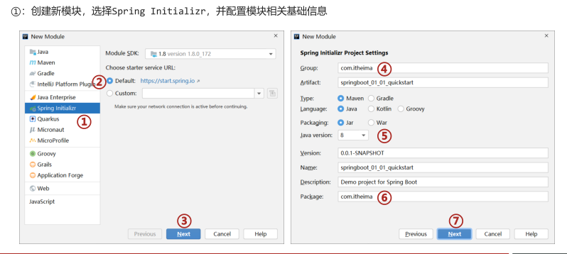
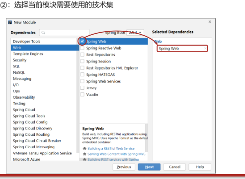
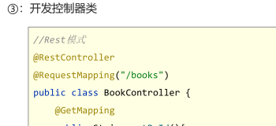

---

typora-copy-images-to: springBootImg
typora-root-url: springBootImg
---

# SpringBoot

##### 	快速创建









# SpringBoot基础篇（使用）

​	springBoot

### parent

parent：继承
     pom.xml文件中继承了spring-boot-starter-parent。spring-boot-starter-parent继承了spring-boot-dependencies。spring-boot-dependencies中定义了若干个依赖管理，即各种包的版本    

​	继承parent模块可以避免多个依赖使用相同技术时出现依赖版本的冲突，即（springboot已经配置了各个jar包版本的依赖）   
​     继承parent的形式也可采用引入依赖的形式实现效果   

### starter

开发SpringBoot程序需要导入坐标时通常导入对应的starter     每个不同的starter根据功能不同，通常包含多个依赖坐标     使用starter可以实现快速配置的效果，达到简化配置的目的

例如tomcat，有多个jar包，可以应用starter，spring-boot-starter-tomcat内部有tomcat依赖的所有坐标

starter与parent的区分：  

starter：       SpringBoot中常见项目名称，定义了当前项目使用的所有依赖坐标，以达到减少依赖配置的目的
parent：     所有SpringBoot项目要继承的项目，定义了若干个坐标版本号（依赖管理，而非依赖），以达到减少依赖冲突的目的。


spring-boot-starter-parent各版本间存在着诸多坐标版本不同。

因此，实际使用中，使用任意坐标时，仅书写GAV中的G，A，即groupId和artifactId，不指定版本号。  

​	若parent没有该artifactId，发生坐标错误，则需自己指定version

### 引导类

创建springboot项目时即创建了引导类

```
@SpringBootApplication
public class Springboot0101QuickstartApplication {
    public static void main(String[] args) {
        SpringApplication.run(Springboot0101QuickstartApplication.class, args);
    }
}
```

springboot的引导类是Boot工程的执行入口，运行main方法就可启动项目

springboot工程运行后创建初始化spring容器，==扫描引导类所在包==加载bean

### 辅助功能（内嵌Tomcat）

springboot内嵌了多款服务器，spring-boot-starter-tomcat。

- tomcat(默认)：apache出品，粉丝多，应用面广，负载了若干较重的组件

- jetty：更轻量级，负载性能远不及tomcat

- undertow：负载性能勉强跑赢tomcat

Java语言中万物皆对象，服务器也作为一个对象被Spring容器管理。

因此也可替换服务器

```
        <dependency>
            <groupId>org.springframework.boot</groupId>
            <artifactId>spring-boot-starter-web</artifactId>
            <exclusions>
                <exclusion>
                    <groupId>org.springframework.boot</groupId>
                    <artifactId>spring-boot-starter-tomcat</artifactId>
                </exclusion>
            </exclusions>
        </dependency>

        <dependency>
            <groupId>org.springframework.boot</groupId>
            <artifactId>spring-boot-starter-jetty</artifactId>
        </dependency>
```

总结：

1. ​	内嵌服务器是SpringBoot辅助功能之一
2. ​    内嵌Tomcat工作原理是将Tomcat服务器作为对象运行，并将该对象交给Spring容器管理
3. 变更内嵌服务器思想是去除现有服务器，添加新的服务器	

## 基础配置

所有的配置均在/resources/application.properties

### 属性配置

springBoot通过配置文件就可以修改默认配置。在properties文件依然是键值对的方式

服务器端口配置

```
server.port=80 
```

设置运行日志图表（logo）

```
spring.main.banner-mode=off
```

设置运行日志显示级别

```
logging.level.root=debug
```

配置文件可以在SpringBoot官方文档中查找文件

配置项需与pom配置的技术相关，否则无法配置

- SpringBoot中导入对应的starter后，提供对应配置属性

### 配置文件分类

- properties格式
- yml格式（==主流==）
- yaml格式

三种配置文件优先级：

​	properties格式>yml格式>yaml

- 若三个配置文件共存，都配置同一项内容，则按优先级配置。若配置内容各不相同，则不同配置全部保留

### yaml格式

​	yml文件和yaml文件均使用此格式

1. 大小写敏感
2. 属性层级关系使用多行描述，**每行结尾使用冒号结束**
3. 使用缩进表示层级关系，同层级左侧对齐，只允许使用空格（不允许使用Tab键）
4. 属性值前面添加空格（属性名与属性值之间使用冒号+空格作为分隔）
5. #号 表示注释

<font color="#ff0000"><b>数据前面要加空格与冒号隔开</b></font>

- 使用~ 表示null

- 字符串可以直接书写，若字符串中有特殊字符，则使用双引号

- 数组书写格式  [元素，元素]

  对象数组格式

```java
users:  //对象数组格式一
  - name: Tom
    age: 14
  - name: jerry
    age: 4

users1:  //对象数组格式二
  -
    name: Tom
    age: 14
  -
    name: jerry
    age: 4
users3: [{name: Tom,age: 4},{name: jerry, age: 14}] //对象数组格式三
```

#### 读取单一数据

​	yaml中保存单个数据，可以通过spring中的注解直接读取，  @value读取单个数据，属性名引用方式 <font color="#ff0000"><b>${一级属性名.二级属性名……}</b></font>


#### yaml文件中数据引用：

1. ​	在配置文件中可以使用${属性名}方式引用属性值

2. 如果属性中出现特殊字符，可以使用双引号包裹起来作为字符解析，例如 \t \n

   ```
   dir: c:/windows
   dir2: ${dir}/temp
   dir3: "${dir2}\t1\t2"
   ```

   

#### 读取全部数据

​	数据封装到Environment对象中，获取属性时，通过Environment的接口操作镜像，具体方法为getProperties（key）,key=属性名

1. 使用Environment对象封装全部配置信息
2. 使用@Autowired自动装配数据到Environment

#### 读取对象数据

springBoot提供了可以将一组yaml对象数据封装在一个Java对象的操作

1. 首先需要创建一个bean，通过@ConfigurationProperties指定该bean加载yaml中的哪一组信息，==@ConfigurationProperties必须添加数据前缀==
2. 创建的bean的数据属性名与yaml配置信息的变量名一一对象
3. 在调用方法中@autowaireed


## SpringBoot实现SSMP整合

### springBoot整合JUnit

​	spring整合Junit时，需要加载spring和整合Junit专用的类运行器，以及指定对应的配置信息。springBoot进行了简化。使用@SpringBootTest。默认在test.com.example内。启动测试，走默认值，启动引导类，获取spring容器。

​	若不在该包下，或者说手工指定引导类，

1. @SpringBootTest(classes = Springboot04JunitApplication.class)
2. @ContextConfiguration(classes = Springboot04JunitApplication.class)

因此，可知：

​		SpringBootTest注解会加载spring特有的Junit类运行器，并且指定配置信息，启动引导类，获取spring容器。

**总结**

1. 导入测试对应的starter
2. 测试类使用@SpringBootTest修饰
3. 使用自动装配的形式添加要测试的对象
4. 测试类如果存在于引导类所在包或子包中无需指定引导类
5. 测试类如果不存在于引导类所在的包或子包中需要通过classes属性指定引导类


### 整合MyBatis

**步骤①**：创建模块时勾选要使用的技术，MyBatis，由于要操作数据库，还要勾选对应数据库

- 创建springboot工程，添加一下模块


- 在application.yml中配置文件，

```
spring:
  datasource:
    driver-class-name: com.mysql.cj.jdbc.Driver
    url: jdbc:mysql://localhost:3306/book
    username: root
    password: root
```

在到impl层填写相关的select语句

- 创建实体类（注意，与MySQL内的列名相同，但img_path->imgPath）

```
public class Book {
    private Integer id;
    private String name;
    private String author;
    private Double price;
    private Integer sales;
    private Integer stock;
    private String imgPath;
```

- 映射接口（Dao）

```
@Mapper
public interface BookDao {
    @Select("select * from t_book where id = #{id}")
    public Book getById(Integer id);
}
```

**总结**

1. 整合操作需要勾选MyBatis技术，也就是导入MyBatis对应的starter

2. 数据库连接相关信息转换成配置

3. 数据库SQL映射需要添加@Mapper被容器识别到（容器会自动创建对象）


### 整合MyBatis-Plus

**步骤①**：，在pom.xml导入对应的start,创建工程时只选择MYSQL driver

```
        <dependency>
            <groupId>com.baomidou</groupId>
            <artifactId>mybatis-plus-boot-starter</artifactId>
            <version>3.4.2</version>
        </dependency>
```


**步骤②**：配置数据源相关信息

```yaml
#2.配置相关信息
spring:
  datasource:
    driver-class-name: com.mysql.cj.jdbc.Driver
    url: jdbc:mysql://localhost:3306/book
    username: root
    password: root
```

**步骤③**：，创建实体类（略）和映射接口（Dao）

```
@Mapper
public interface BookDao extends BaseMapper<Book> {
}
```

dao接口继承了BaseMapper的接口，其内部预定了多干个常用的API接口。可直接调用

<font color="#f0f"><b>温馨提示</b></font>

​	目前数据库的表明定义规则，是一个前缀，mybatis-plus无法找到该表，为能与实体类相对应，需添加配置，设置所有表名的通用前缀名

```
mybatis-plus:  global-config:    db-config:      table-prefix: t_		#设置所有表的通用前缀名称为tbl_
```

**总结**

1. 手工添加MyBatis-Plus对应的starter
2. 数据层接口使用BaseMapper简化开发
3. 需要使用的第三方技术无法通过勾选确定时，需要手工添加坐标

### 整合Druid

**步骤①**：添加starter，创建工程的时候，选中mybatis-framework和MySQL driver

```
<!-- https://mvnrepository.com/artifact/com.alibaba/druid-spring-boot-starter -->
<dependency>
    <groupId>com.alibaba</groupId>
    <artifactId>druid-spring-boot-starter</artifactId>
    <version>1.2.6</version>
</dependency>
```

**步骤②**：修改配置，mybatis通过druid连接数据库

```
spring:
  datasource:
    druid:
      driver-class-name: com.mysql.cj.jdbc.Driver
      url: jdbc:mysql://localhost:3306/book
      username: root
      password: root
```

**步骤③**：设置对象Bean，映射接口Dao，调用

#### 添加第三方技术总结：

1. ==导入对应的starter==
2. ==根据提供的配置格式，配置非默认值对应的配置项==


## ssmp整合案例

### 1，创建Bean对象，结合lombok

​	**lombok**：应用一个Java类库，提供了一组注解，简化POJO实体类开发，SpringBoot目前默认集成了lombok技术，并提供了对应的版本控制，所以只需要提供对应的坐标即可，在pom.xml中添加lombok的坐标。

```
        <dependency>
            <groupId>org.projectlombok</groupId>
            <artifactId>lombok</artifactId>
        </dependency>
```

使用lombok可以通过一个注解@Data完成一个实体类对应的getter，setter，toString，equals，hashCode等操作的快速添加

```
@Data
public class Book {
    private Integer id;
    private String name;
    private String author;
    private Double price;
    private Integer sales;
    private Integer stock;
    private String imgPath;
}
```

### 2，数据层开发-基础的crud

**步骤①**：导入MyBatisPlus与Druid对应的starter，mysql的驱动

```
        <dependency>            <groupId>com.alibaba</groupId>            <artifactId>druid-spring-boot-starter</artifactId>            <version>1.2.5</version>        </dependency>        <dependency>            <groupId>com.baomidou</groupId>            <artifactId>mybatis-plus-boot-starter</artifactId>            <version>3.4.2</version>        </dependency>        <dependency>            <groupId>org.projectlombok</groupId>            <artifactId>lombok</artifactId>        </dependency>
```

**步骤②**：配置数据库连接相关的数据源配置

```
  datasource:
    druid:
      driver-class-name: com.mysql.cj.jdbc.Driver
      url: jdbc:mysql://localhost:3306/book
      username: root
      password: root
server:
  port: 80
```

**步骤③**：使用Mapper的标准通用接口BaseMapper加速开发

```
@Mapper
public interface BookDao extends BaseMapper<Book> {
}
```

==**注意**==：

​	MP技术默认使用的主键生成策略为雪花算法，生成的主键ID长度较大，和目前的数据库规定规则不相符，需要配置一下使MP使用数据库的主键生成策略

```yaml
spring:
  datasource:
    druid:
      driver-class-name: com.mysql.cj.jdbc.Driver
      url: jdbc:mysql://localhost:3306/book
      username: root
      password: root
server:
  port: 80

mybatis-plus:
  global-config:
    db-config:
      table-prefix: tbl_
      id-type: auto  #舌标主键id字段的生成策略为参照数据库设定的策略
  configuration:
    log-impl: org.apache.ibatis.logging.stdout.StdOutImpl
```

##### 查看MP运行日志

​	为查看运行期间的SQL日志，则开启MP运行日志

```
mybatis-plus:  global-config:    db-config:      table-prefix: tbl_      id-type: auto  configuration:    log-impl: org.apache.ibatis.logging.stdout.StdOutImpl
```

再来看运行结果，此时就显示了运行期执行SQL的情况。

有多种日志格式可供选择


### 3，数据层-分页设置

selectPage方法需要传入封装分页数据的对象，通过new的方式创建，需指定当前页和每页个数

```
Page<Book> bookPage = new Page<>(1,5);
bookDao.selectPage(bookPage,null);

bookPage.getCurrent();  --->当前页
bookPage.getPages(); 	--->总页数
bookPage.getSize();		--->每页个数
bookPage.getTotal();	--->总数
bookPage.getRecords();	--->获取当前页详细数据
```

selectPage的返回值仍是一个page，为原来参数的那个page

原理是：IPage对象中封装了若干个数据，为了高度的封装，将查询到的结果作为IPage对象封装的一个数据。

```
IPage page = bookDao.selectPage(page, null);
```

对于Mysql的分页操作可以在原来查询语句添加limit关键字进行，但有些数据库并不使用limit。MP为了制作的兼容性强，将分页操作需要单独设置拦截器

**定义MP拦截器并将其设置为Spring管控的Bean**

```Java
@Configuration
public class MPconfig {
    @Bean
    public MybatisPlusInterceptor mybatisPlusInterceptor(){
    //创建MP拦截器栈，但该拦截器内没有具体的拦截器
        MybatisPlusInterceptor interceptor = new MybatisPlusInterceptor();
        //添加分页拦截器
        interceptor.addInnerInterceptor(new PaginationInnerInterceptor());
        return interceptor;
    }
}
```

如果后期开发其他功能，需要添加全新的拦截器，按照第二行的格式继续add进去新的拦截器就可以了。

**总结**

1. 使用IPage封装分页数据
2. 分页操作依赖MybatisPlus分页拦截器实现功能
3. 借助MybatisPlus日志查询执行SQL语句

### 4，数据层-条件查询

selectList，条件查询。like条件为like方法的调用

LambdaQueryWrapper对象封装查询条件的对象，该对象可通过调用API调用的方法添加条件，最终会转化成SQL语句。

大于 lt

小于 gt

等于 eq

包含 like

```
String name = "spring";
LambdaQueryWrapper<Book> lqw = new LambdaQueryWrapper<>();
lqw.like(name!=null,Book::getName,name);
bookDao.selectList(lqw);
```

方法为，boolean，为true时才进行条件查询，column为MySQL的哪一列，val为值

```
public Children like(boolean condition, R column, Object val) 
```

MP，全面支持Lambda表达式，所以在输入column时可以调用==Book::getName==。减少了异常的出现

**总结**

1. 条件查询selectList，传入LambdaQueryWrapper对象
2. 所有查询操作封装成LambdaQueryWrapper内的方法
3. 查询条件可以动态拼装  

### 5，业务层开发

业务层：<font color="#ff0000"><b>组织业务逻辑功能，并根据业务需求，对数据持久层发起调用</b></font>。

Service接口：

```
public interface BookService extends IService<Book> {
    boolean save(Book book);
    boolean delete(Integer id);
    boolean update(Book book);
    Book getById(Integer id);
    List<Book> getAll();
    IPage<Book> getPage(Integer currentpage,Integer pagesize);
}
```

ServiceImpl ：实现Service接口，加入IOC容器，导入BookDao对象

##### 业务层快速实现

==**（虽然有快速开发，但还是建议不使用。可以通过该方法创建。但自己写方法，因为若出现service层出现问题，无法排除）**==

接口类实现MP提供的IService<T>方法，添加非通用操作中，尽量不要重写方法，可以添加一个新的名字。

```Java
public interface BookService extends IService<Book> {
    //添加非通用操作API接口
}
```

业务层接口实现类快速开发，关注继承的类需要传入两个泛型，一个是数据层接口，另一个是实体类。

ServiceImpl<M,T> M为Dao，T为Bean。

```java
@Servicepublic class BookService extends ServiceImpl<BookDao, Book> {	//添加非通用操作API}
```

**总结**

1. 使用通用接口（ISerivce<T>）快速开发Service
2. 使用通用实现类（ServiceImpl<M,T>）快速开发ServiceImpl
3. 可以在通用接口基础上做功能重载或功能追加
4. 注意重载时不要覆盖原始操作，避免原始提供的功能丢失

### 6，表现层开发

表现层创建controller。建议：**测试使用postman工具进行**

**Request获取请求参数**

1. 默认方式获取请求参数：直接在方法形参上和请求参数名相同的变量，例如 getById（Integer id） 网址：http://localhost/books?id=xx **（不适用Rest风格）**

2. 标签方式

   1. @RequestPrarm（“请求参数”）修饰方法形参，主要用于请求参数与方法形参不同的情况。

      默认有请求参数，若没有请求参数报错        

      注解内变量：             

      ​	value=“请求参数”             

      ​	required：表明该参数是否是必须的，即false，则请求没有该请求参数也不报错。（默认为true）                     

      ​	 defaultValue:默认值。没带默认是null      

      **区分**

      ​	 @RequestParam("user")：获取请求参数值  

      ​	 @PathVariable("user")：获取请求路径值   ==Rest风格主要应用==

   2. @RequestHeader()获取请求头中某个key的值；         

      ​	若请求头没有这个值，则报错        

      ​	 可以设置required=false

   3. @CookieValue: 获取某个cookie的值；     

      输入cookie键值对的key，可得到value

   4. @RequestBody  请求体对象，一般内部属性会封装成Bean对象 ==Rest风格主要应用==

```
@RestController
@RequestMapping("/books")
public class BookController {
    @Autowired
    private BookServiceImpl bookService;

    @GetMapping
    public List<Book> getAll(){
        return bookService.getAll();
    }

    @GetMapping("{id}")
    public Book getById(@PathVariable Integer id){
        return bookService.getById(id);
    }

    @PostMapping
    public boolean save(@RequestBody Book book){
        return bookService.save(book);
    }
    @PutMapping
    public boolean update(@RequestBody Book book){
        return bookService.update(book);
    }

    @DeleteMapping("{id}")
    public boolean deleteById(@PathVariable Integer id){
        return bookService.delete(id);
    }

    @GetMapping("{currentpage}/{pagesize}")
    public IPage<Book> getPage(@PathVariable Integer currentpage,@PathVariable Integer pagesize){
        return bookService.getPage(currentpage,pagesize);
    }
}
```

**总结**

1. ​	基于Rest风格创建表现层接口
   - 增：post
   - 删：delete
   - 查：get
   - 改：put
2. 接收参数
   - 实体数据：@RequestBody，请求体中的对象
   - 路径变量：@PathVariable

### 7.表现层消息一致性处理

虽然通过测试，业务层接口功能连通，但返回结果差异性很大。必须将所有操作的操作结果数据格式统一起来，需要设计表现层返回结果的模型类，用于后端与前端进行数据格式统一，也称为**前后端数据协议**

flag：标识操作是否成功

data：封装数据

```
@Data
public class R {
    private boolean flag;
    private Object data;

    public R(boolean flag) {
        this.flag = flag;
    }

    public R() {
    }

    public R(boolean flag, Object data) {
        this.flag = flag;
        this.data = data;
    }
}
```

因此，数据层的数据

```Java
@RestController
@RequestMapping("/books")
public class BookController {
    @Autowired
    private BookServiceImpl bookService;

    @GetMapping
    public R getAll() {
        return new R(true, bookService.getAll());
    }

    @GetMapping("{id}")
    public R getById(@PathVariable Integer id) {
        return new R(true, bookService.getById(id));
    }

    @PostMapping
    public R save(@RequestBody Book book) {
//        if(true) {
//            throw new RuntimeException();
//        }
        boolean save = bookService.save(book);
        return new R(save, save ? "添加成功^_^" : "添加失败-_-!");
    }

    @PutMapping
    public R update(@RequestBody Book book) {
        return new R(bookService.update(book));
    }

    @DeleteMapping("{id}")
    public R deleteById(@PathVariable Integer id) {
        return new R(bookService.delete(id));
    }

    @GetMapping("{currentpage}/{pagesize}")
    public R getPage(@PathVariable Integer currentpage, @PathVariable Integer pagesize, Book book) {
        IPage<Book> page = bookService.getPage(currentpage, pagesize, book);
        if (currentpage > page.getPages()) {
            page = bookService.getPage((int) page.getPages(), pagesize, book);
        }
        return new R(true, page);
    }
}
```


总结：

- 设计统计的返回值结果便于前端开发读取数据
- 返回值类型可以根据需求自行设定，没有固定格式
- 返回值结果模型类用于后端与前端进行数据格式统一，也称为前后端数据协议

### 9.页面基础功能开发

#### F-1.列表功能（非分页版）

在vue中存在变量  dataList：[]

异步请求获取数据

```
getAll() {
    var that = this;
    axios.get("/books").then((res)=>{
        that.dataList=res.data.data;
    });
},
```

#### F-2.添加功能

添加功能首先显示弹窗，因为此弹窗一直存在，仅仅是不显示状态，改变状态即可

并且弹窗内每次数据输入后要进行清除，一般在打开窗口时清除

​	**定义清理数据操作**

```Java
//重置表单
resetForm() {
    this.formData = {};
},
```

​	**切换为显示状态**，

```java
//弹出添加窗口
handleCreate() {
    this.dialogFormVisible = true;
    this.resetForm();
},
```

**添加操作**

```Java
//添加
handleAdd () {
    //发送异步请求
    axios.post("/books",this.formData).then((res)=>{
        //如果操作成功，关闭弹层，显示数据
        if(res.data.flag){
            this.dialogFormVisible = false;
            this.$message.success("添加成功");
        }else {
            this.$message.error("添加失败");
        }
    }).finally(()=>{
        this.getAll();
    });
},
```

1. 将要保存的数据传递到后台，通过post请求的第二个参数传递json数据到后台
2. 根据返回的操作结果决定下一步操作
   - 如何是true就关闭添加窗口，显示添加成功的消息
   - 如果是false保留添加窗口，显示添加失败的消息
3. 无论添加是否成功，页面均进行刷新，动态加载数据（对getAll操作发起调用）

​		**取消添加操作**

```Java
//取消cancel(){    this.dialogFormVisible = false;    this.$message.info("操作取消");},
```

#### F-3.删除功能

**删除操作提示信息**

```java
// 删除
handleDelete(row) {
    //1.弹出提示框
    this.$confirm("此操作永久删除当前数据，是否继续？","提示",{
        type:'info'
    }).then(()=>{
        //2.做删除业务
        axios.delete("/books/"+row.id).then((res)=>{
       		if(res.data.flag){
            	this.$message.success("删除成功");
        	}else{
            	this.$message.error("删除失败");
        	}
        }).finally(()=>{
            this.getAll();
        });
    }).catch(()=>{
        //3.取消删除
        this.$message.info("取消删除操作");
    });
}，	
```

#### F-4.修改功能

修改功能可以说是列表功能、删除功能与添加功能的合体。几个相似点如下：

1. 页面也需要有一个弹窗用来加载修改的数据，这一点与添加相同，都是要弹窗

2. 弹出窗口中要加载待修改的数据，而数据需要通过查询得到，这一点与查询全部相同，都是要查数据

3. 查询操作需要将要修改的数据id发送到后台，这一点与删除相同，都是传递id到后台

4. 查询得到数据后需要展示到弹窗中，这一点与查询全部相同，都是要通过数据模型绑定展示数据

5. 修改数据时需要将被修改的数据传递到后台，这一点与添加相同，都是要传递数据

   所以整体上来看，修改功能就是前面几个功能的大合体

   **查询并展示数据**

```Java
//弹出编辑窗口
handleUpdate(row) {
    axios.get("/books/"+row.id).then((res)=>{
        if(res.data.flag){
            //展示弹层，加载数据
            this.formData = res.data.data;
            this.dialogFormVisible4Edit = true;
        }else{
            this.$message.error("数据同步失败，自动刷新");
        }
    });
},
```

​		**修改操作**

```java
//修改
handleEdit() {
    axios.put("/books",this.formData).then((res)=>{
        //如果操作成功，关闭弹层并刷新页面
        if(res.data.flag){
            this.dialogFormVisible4Edit = false;
            this.$message.success("修改成功");
        }else {
            this.$message.error("修改失败，请重试");
        }
    }).finally(()=>{
        this.getAll();
    });
},
```

**总结**

1. 加载要修改数据通过传递当前行数据对应的id值到后台查询数据（同删除与查询全部）
2. 利用前端双向数据绑定将查询到的数据进行回显（同查询全部）
3. 请求方式使用PUT调用后台对应操作（同新增传递数据）
4. 修改操作结束后动态刷新页面加载数据（同新增）
5. 根据操作结果不同，显示对应的提示信息（同新增）

### 10.业务消息一致性处理

功能制作基本达成正常使用的情况，若系统出现bug，则程序会立马崩掉。比如后台手工抛出一个异常，看看前端接收到的数据什么样子

```
{    "timestamp": "2021-09-15T03:27:31.038+00:00",    "status": 500,    "error": "Internal Server Error",    "path": "/books"}
```

因此，**不仅要对正确的操作数据格式做处理，还要对错误的操作数据格式做同样的格式处理**。

在业务消息一致类中添加新的字段

```
@Data
public class R{
    private Boolean flag;
    private Object data;
    private String msg;		//用于封装消息
}
```

后台代码也要根据情况做处理，即添加msg信息

```java
@PostMapping
public R save(@RequestBody Book book) throws IOException {
    Boolean flag = bookService.insert(book);
    return new R(flag , flag ? "添加成功^_^" : "添加失败-_-!");
}
```

以上仅仅是未出现异常的情况。将数据信息作统一处理，即网页输出msg信息

创建

**AOP拦截器**

拦截异常信息，构建新的业务消息一致类。并输入msg信息

```Java
@RestControllerAdvice
public class ProjectExceptionAdvice {
    @ExceptionHandler(Exception.class)
    public R doOtherException(Exception ex){
        //记录日志
        //发送消息给运维
        //发送邮件给开发人员,ex对象发送给开发人员
        ex.printStackTrace();
        return new R(false,null,"系统错误，请稍后再试！");
    }
}
```

**页面的方法**

页面得到数据，首先验证是否有数据，若没有成功，则读取后台传递来的

```
    //添加    handleAdd () {        axios.post("/books",this.formData).then((res)=>{           if(res.data.flag){                this.dialogFormVisible  = false;                this.$message.success(res.data.msg);           } else{               this.$message.error(res.data.msg);           }        }).finally(()=>{            this.getAll();        });    },
```

### 11，页面功能开发

##### 	F-5.分页功能

​		分页功能的制作用于替换前面的查询全部，其中要使用到elementUI提供的分页组件

​	为了配合分页组件，封装分页对应的数据模型

```Java
data:{
	pagination: {	
		//分页相关模型数据
		currentPage: 1,	//当前页码
		pageSize:10,	//每页显示的记录数
		total:0,		//总记录数
	}
},
```

修改查询全部功能为分页查询，通过路径变量传递页码信息参数。获取数据并进行绑定

```Java
getAll() {
  axios.get("/books/"+this.pagination.currentPage+"/"+this.pagination.pageSize).then((res) => {
       	this.pagination.total = res.data.data.total;
        this.pagination.currentPage = res.data.data.current;
        this.pagination.pagesize = res.data.data.size;
        this.dataList = res.data.data.records;
    });
},
```

后台提供对应的分页功能

```Java
@GetMapping("/{currentPage}/{pageSize}")
public R getAll(@PathVariable Integer currentPage,@PathVariable Integer pageSize){
    IPage<Book> pageBook = bookService.getPage(currentPage, pageSize);
    return new R(null != pageBook ,pageBook);
}
```

对切换页码操作设置调用当前分页操作

```Java
//切换页码
handleCurrentChange(currentPage) {
    this.pagination.currentPage = currentPage;
    this.getAll();
},
```

#### F-6.删除功能维护

​	由于使用了分页功能，当最后一页只有一条数据时，删除操作就会出现BUG，最后一页无数据但是独立展示，对分页查询功能进行后台功能维护，如果当前页码值大于最大页码值，重新执行查询。

```Java
@GetMapping("{currentPage}/{pageSize}")
public R getPage(@PathVariable int currentPage,@PathVariable int pageSize){
    IPage<Book> page = bookService.getPage(currentPage, pageSize);
    //如果当前页码值大于了总页码值，那么重新执行查询操作，使用最大页码值作为当前页码值
    if( currentPage > page.getPages()){
        page = bookService.getPage((int)page.getPages(), pageSize);
    }
    return new R(true, page);
}
```

#### F-7.条件查询功能

​		最后一个功能来做条件查询，其实条件查询可以理解为分页查询的时候除了携带分页数据再多带几个数据的查询。这些多带的数据就是查询条件。比较一下不带条件的分页查询与带条件的分页查询差别之处，这个功能就好做了

- 页面封装的数据：带不带条件影响的仅仅是一次性传递到后台的数据总量，由传递2个分页相关的数据转换成2个分页数据加若干个条件

- 后台查询功能：查询时由不带条件，转换成带条件，反正不带条件的时候查询条件对象使用的是null，现在换成具体条件，差别不大

- 查询结果：不管带不带条件，出来的数据只是有数量上的差别，其他都差别，这个可以忽略

  经过上述分析，看来需要在页面发送请求的格式方面做一定的修改，后台的调用数据层操作时发送修改，其他没有区别

  页面发送请求时，两个分页数据仍然使用路径变量，其他条件采用动态拼装url参数的形式传递

  **页面封装查询条件字段**

  ```vue
  pagination: {		
  //分页相关模型数据
  	currentPage: 1,		//当前页码
  	pageSize:10,		//每页显示的记录数
  	total:0,			//总记录数
  	name: "",
  	type: "",
  	description: ""
  },
  ```

  页面添加查询条件字段对应的数据模型绑定名称

  ```HTML
  <div class="filter-container">
      <el-input placeholder="图书类别" v-model="pagination.type" class="filter-item"/>
      <el-input placeholder="图书名称" v-model="pagination.name" class="filter-item"/>
      <el-input placeholder="图书描述" v-model="pagination.description" class="filter-item"/>
      <el-button @click="getAll()" class="dalfBut">查询</el-button>
      <el-button type="primary" class="butT" @click="handleCreate()">新建</el-button>
  </div>
  ```

  将查询条件组织成url参数，添加到请求url地址中，这里可以借助其他类库快速开发，当前使用手工形式拼接，降低学习要求

  ```JS
  getAll() {    //1.获取查询条件,拼接查询条件    param = "?name="+this.pagination.name;    param += "&type="+this.pagination.type;    param += "&description="+this.pagination.description;    console.log("-----------------"+ param);    axios.get("/books/"+this.pagination.currentPage+"/"+this.pagination.pageSize+param).then((res) => {        this.dataList = res.data.data.records;    });},
  ```

  后台代码中定义实体类封查询条件

  ```JAVA
  @GetMapping("{currentPage}/{pageSize}")public R getAll(@PathVariable int currentPage,@PathVariable int pageSize,Book book) {    System.out.println("参数=====>"+book);    IPage<Book> pageBook = bookService.getPage(currentPage,pageSize);    return new R(null != pageBook ,pageBook);}
  ```

  对应业务层接口与实现类进行修正

  ```JAVA
  public interface IBookService extends IService<Book> {    IPage<Book> getPage(Integer currentPage,Integer pageSize,Book queryBook);}
  ```

  ```JAVA
  @Servicepublic class BookServiceImpl2 extends ServiceImpl<BookDao,Book> implements IBookService {    public IPage<Book> getPage(Integer currentPage,Integer pageSize,Book queryBook){        IPage page = new Page(currentPage,pageSize);        LambdaQueryWrapper<Book> lqw = new LambdaQueryWrapper<Book>();        lqw.like(Strings.isNotEmpty(queryBook.getName()),Book::getName,queryBook.getName());        lqw.like(Strings.isNotEmpty(queryBook.getType()),Book::getType,queryBook.getType());        lqw.like(Strings.isNotEmpty(queryBook.getDescription()),Book::getDescription,queryBook.getDescription());        return bookDao.selectPage(page,lqw);    }}
  ```

  页面回显数据

  ```js
  getAll() {
      //1.获取查询条件,拼接查询条件
      param = "?name="+this.pagination.name;
      param += "&type="+this.pagination.type;
      param += "&description="+this.pagination.description;
      console.log("-----------------"+ param);
      axios.get("/books/"+this.pagination.currentPage+"/"+this.pagination.pageSize+param).then((res) => {
          this.pagination.total = res.data.data.total;
          this.pagination.currentPage = res.data.data.current;
          this.pagination.pagesize = res.data.data.size;
          this.dataList = res.data.data.records;
      });
  },
  ```

**总结**

1. 定义查询条件数据模型（当前封装到分页数据模型中）
2. 异步调用分页功能并通过请求参数传递数据到后台

# SpringBoot运维篇

打包：Maven -package

<font color="#ff0000"><b>特别关注</b></font>：在使用向导创建SpringBoot工程时，pom.xml文件中会有如下配置，这一段配置千万不能删除，否则打包后无法正常执行程序。，因为打包方式不同

```xml
<build>
    <plugins>
        <plugin>
            <groupId>org.springframework.boot</groupId>
            <artifactId>spring-boot-maven-plugin</artifactId>
        </plugin>
    </plugins>
</build>
```

  	Java开发会接触很多jar包，若pom.xml没有上述配置。打包差别，三处明显特征

- 打包后文件的大小不同
- 打包后所包含的内容不同
- 打包程序中个别文件内容不同

​	

​		带配置近30M，不带配置近1M。二者仅有META-INF一个相同的目录。其内容相同。但还有lib目录，里面有很多jar。需要将当前工程运行需要的jar包全部打包。因此可以独立运行。这也是为什么大的程序包容量比小的的程序容量包大30倍的主要原因。

​		在最外层目录包含一个org目录，进入此目录，目录名是org\springframework\boot\loader，在里面可以找到一个<font color="#ff0000"><b>JarLauncher.class</b></font>的文件。可得知，spring的框架也打包到该程序包。

​		回到两个程序包的最外层目录，查看名称相同的文件夹META-INF下都有一个叫做MANIFEST.MF的文件，但是大小不同，打开文件，比较内容区别

- 小容量文件的MANIFEST.MF

```
Manifest-Version: 1.0
Implementation-Title: springboot_08_ssmp
Implementation-Version: 0.0.1-SNAPSHOT
Build-Jdk-Spec: 1.8
Created-By: Maven Jar Plugin 3.2.0
```

- 大容量文件的MANIFEST.MF

```
Manifest-Version: 1.0
Spring-Boot-Classpath-Index: BOOT-INF/classpath.idx
Implementation-Title: springboot_08_ssmp
Implementation-Version: 0.0.1-SNAPSHOT
Spring-Boot-Layers-Index: BOOT-INF/layers.idx
Start-Class: com.itheima.SSMPApplication
Spring-Boot-Classes: BOOT-INF/classes/
Spring-Boot-Lib: BOOT-INF/lib/
Build-Jdk-Spec: 1.8
Spring-Boot-Version: 2.5.4
Created-By: Maven Jar Plugin 3.2.0
Main-Class: org.springframework.boot.loader.JarLauncher
```

​		大文件中明显比小文件中多了几行信息，其中最后一行是Main-Class: org.springframework.boot.loader.<font color="#ff0000"><b>JarLauncher</b></font>。在调用Java-jar执行此程序包，将执行Main-Class属性配置的类，这个类时前面的那个文件。springBoot打包程序中出现Spring框架的东西是在此处服务。而这个org.springframework.boot.loader.<font color="#ff0000"><b>JarLauncher</b></font>类内部要查找Start-Class属性中配置的类，并执行对应的类。该类的引导类类名。

因此，打包流程

1. SpringBoot程序添加配置后会打出一个特殊的包，里面包含Spring框架部分功能，原始工程内容，原始工程依赖的jar包
2. 首先读取MANIFEST.MF文件中的Main-Class属性，用来标记执行java-jar命令后运行的类
3. JarLauncher类执行时会找到Start-Class属性，即启动类
4. 运行启动类时会运行当前工程内容
5. 运行当前工程时会使用依赖的jar包，从lib目录中查找

### 1.命令行启动常见问题及解决方案

各位小伙伴在DOS环境下启动SpringBoot工程时，可能会遇到端口占用的问题。以下为windows的命令

```Java
# 查询端口
netstat -ano
# 查询指定端口
netstat -ano |findstr "端口号"
# 根据进程PID查询进程名称
tasklist |findstr "进程PID号"
# 根据PID杀死任务
taskkill /F /PID "进程PID号"
# 根据进程名称杀死任务
taskkill -f -t -im "进程名称"
```

### 2.1属性临时配置

​	程序包已经打好。例子：若jar包中的8080端口已经被占用，则该程序无法执行。SpringBoot提供了灵活的方式配置。可以在启动的时候添加对应的参数

```
java –jar springboot.jar –-server.port=80
```

​	上述命令是启动SpringBoot程序包的命令，在命令输入完毕后，空一格，然后输入两个-号。注意，这里的格式不是yaml中的书写格式。当属性存在多级属性时，中间使用点分割，和properties文件中的属性格式相同

```Java
java –jar springboot.jar –-server.port=80 --logging.level.root=debug
```

属性临时配置，本质是临时设置属性，覆盖原始属性。配置读取的优先顺序。


该图片的优先级顺序，自上而下，优先级加高。

#### 开发环境中使用临时属性

​	在开发时也可使用临时属性，主要分为三种方法：

1，在Program arguments对应位置添加临时属性。


2，改变传入的参数，args。

通过args可以获取参数，args传入引导类，通过该变量传入临时配置。因此，可以自己创建变量，传入引导类参数

```
public static void main(String[] args) {
    SpringApplication.run(SSMPApplication.class,args);
}
```

3，自己创建变量，传入引导类

```
public static void main(String[] args) {								     String[] arg = new String[1];
    arg[0] = "--server.port=8082";
	SpringApplication.run(SsmpApplication.class, arg);
}
```

### 2.2配置文件分类

开发时使用最低级别的application.yml，有4个级别的文件，可以覆盖。高级别覆盖低级别。有则覆盖，没有则执行。

- 类路径下配置文件（一直使用的是这个，也就是resources目录中的application.yml文件）
- 类路径下config目录下配置文件
- 程序包所在目录中配置文件
- 程序包所在目录中config目录下配置文件

4个文件的加载优先顺序为：

1. file ：config/application.yml **【最高】**
2. file ：application.yml
3. classpath：config/application.yml
4. classpath：application.yml  **【最低】**

多个配置文件共存，

**总结**

1. 配置文件分为4种

   - 项目类路径配置文件：服务于开发人员本机开发与测试
   - 项目类路径config目录中配置文件：服务于项目经理整体调控
   - 工程路径配置文件：服务于运维人员配置涉密线上环境
   - 工程路径config目录中配置文件：服务于运维经理整体调控

2. 多层级配置文件间的属性采用叠加并覆盖的形式作用于程序

### 3.1多环境开发（yaml单一文件版）

针对不同的环境，应用不同的配置。

```yaml
spring:
  profiles:
    active: test   # 设置启动test环境
---
#生产环境
spring:
  config:
    activate:
      on-profile: pro

server:
  port: 82
#测试环境
---
spring:
  config:
    activate:
      on-profile: test

server:
  port: 81

#开发环境
---
spring:
  config:
    activate:
      on-profile: dev

server:
  port: 80
```

**总结**

1. 多环境开发需要设置若干种常用环境，例如开发、生产、测试环境
2. yaml格式中设置多环境使用---区分环境设置边界
3. 每种环境的区别在于加载的配置属性不同
4. 启用某种环境时需要指定启动时使用该环境

### 3.2多环境开发（yaml多文件版）

​	将所有的配置都放在一个配置文件中，尤其是每一个配置应用场景都不一样，这显然不合理，于是就有了将一个配置文件拆分成多个配置文件的想法。拆分后，每个配置文件中写自己的配置，主配置文件中写清楚用哪一个配置文件就好了。

**主配置文件**

```yaml
spring:
	profiles:
		active: pro		# 启动pro
```

**环境配置文件**

```yaml
server:	port: 80
```

​		环境配置文件因为每一个都是配置自己的项，所以连名字都不用写里面了。那问题是如何区分这是哪一组配置呢？使用文件名区分。

**application-pro.yaml**

```yaml
server:
	port: 80
```

**application-dev.yaml**

```yaml
server:
	port: 81
```

​		文件的命名规则为：application-环境名.yml。

​		在配置文件中，如果某些配置项所有环境都一样，可以将这些项写入到主配置中，只有哪些有区别的项才写入到环境配置文件中。

- 主配置文件中设置公共配置（全局）
- 环境分类配置文件中常用于设置冲突属性（局部）

**总结**

1. 可以使用独立配置文件定义环境属性
2. 独立配置文件便于线上系统维护更新并保障系统安全性


### 3.3.多环境开发（properties多文件版）

SpringBoot最早期提供的配置文件格式是properties格式的，这种格式的多环境配置也了解一下吧。

**主配置文件**

```properties
spring.profiles.active=pro
```

**环境配置文件**

**application-pro.properties**

```properties
server.port=80
```

**application-dev.properties**

```properties
server.port=81
```

​		文件的命名规则为：application-环境名.properties。

**总结**

1. properties文件多环境配置仅支持多文件格式

### 3.4多环境开发独立配置文件书写技巧

作为程序员在搞配置的时候往往处于一种分久必合合久必分的局面。开始先写一起，后来为了方便维护就拆分。对于多环境开发也是如此，下面给大家说一下如何基于多环境开发做配置独立管理，务必掌握。

**准备工作**

​		将所有的配置根据功能对配置文件中的信息进行拆分，并制作成独立的配置文件，命名规则如下

- application-devDB.yml
- application-devRedis.yml
- application-devMVC.yml

**使用**

​		使用include属性在激活指定环境的情况下，同时对多个环境进行加载使其生效，多个环境间使用逗号分隔

```yaml
spring:
	profiles:
    	active: dev
        include: devDB,devRedis,devMVC
```

​		比较一下，现在相当于加载dev配置时，再加载对应的3组配置，从结构上就很清晰，用了什么，对应的名称是什么

**注意**

​		当主环境dev与其他环境有相同属性时，主环境属性生效；其他环境中有相同属性时，最后加载的环境属性生效

**改良(建议使用)**

​		但是上面的设置也有一个问题，比如我要切换dev环境为pro时，include也要修改。因为include属性只能使用一次，这就比较麻烦了。SpringBoot从2.4版开始使用group属性替代include属性，降低了配置书写量。简单说就是我先写好，你爱用哪个用哪个。

```yaml
spring:
	profiles:
    	active: dev
        group:
        	"dev": devDB,devRedis,devMVC
      		"pro": proDB,proRedis,proMVC
      		"test": testDB,testRedis,testMVC
```

​		现在再来看，如果切换dev到pro，只需要改一下是不是就结束了？完美！

**总结**

1. 多环境开发使用group属性设置配置文件分组，便于线上维护管理

### 3.5多环境开发控制

多环境开发中，若maven和SpringBoot同时设置多环境的话怎么搞。

​		要想处理这个冲突问题，你要先理清一个关系，究竟谁在多环境开发中其主导地位。也就是说如果现在都设置了多环境，谁的应该是保留下来的，另一个应该遵从相同的设置。

​		maven是做什么的？项目构建管理的，最终生成代码包的，SpringBoot是干什么的？简化开发的。简化，又不是其主导作用。最终还是要靠maven来管理整个工程，所以SpringBoot应该听maven的。整个确认后下面就好做了。大体思想如下：

- 先在maven环境中设置用什么具体的环境
- 在SpringBoot中读取maven设置的环境即可

**maven中设置多环境（使用属性方式区分环境）**

```yaml
<profiles>
    <profile>
        <id>env_dev</id>
        <properties>
            <profile.active>dev</profile.active>
        </properties>
        <activation>
            <activeByDefault>true</activeByDefault>		<!--默认启动环境-->
        </activation>
    </profile>
    <profile>
        <id>env_pro</id>
        <properties>
            <profile.active>pro</profile.active>
        </properties>
    </profile>
</profiles>
```

**SpringBoot中读取maven设置值**

```yaml
spring:
	profiles:
    	active: @profile.active@
```

​		上面的@属性名@就是读取maven中配置的属性值的语法格式。

**总结**

1. 当Maven与SpringBoot同时对多环境进行控制时，以Mavn为主，SpringBoot使用@..@占位符读取Maven对应的配置属性值
2. 基于SpringBoot读取Maven配置属性的前提下，如果在Idea下测试工程时pom.xml每次更新需要手动compile方可生效

### 4.日志

日志其实就是记录程序日常运行的信息，主要作用如下：

- 编程期调试代码
- 运营期记录信息
- 记录日常运营重要信息（峰值流量、平均响应时长……）
- 记录应用报错信息（错误堆栈）
- 记录运维过程数据（扩容、宕机、报警……）

### 4.1代码中使用日志工具记录日志

日志已经能够记录了，但是目前记录的格式是SpringBoot给我们提供的，如果想自定义控制就需要自己设置了。先分析一下当前日志的记录格式。


​		对于单条日志信息来说，日期，触发位置，记录信息是最核心的信息。级别用于做筛选过滤，PID与线程名用于做精准分析。了解这些信息后就可以DIY日志格式了。本课程不做详细的研究，有兴趣的小伙伴可以学习相关的知识。下面给出课程中模拟的官方日志模板的书写格式，便于大家学习。

```yaml
logging:
	pattern:
    	console: "%d %clr(%p) --- [%16t] %clr(%-40.40c){cyan} : %m %n"
```

**总结**

1. 日志输出格式设置规则

### 4.3日志文件

​	日志信息显示，记录已经控制住了，下面就要说一下日志的转存了。日志不能仅显示在控制台上，要把日志记录到文件中，方便后期维护查阅。

​		对于日志文件的使用存在各种各样的策略，例如每日记录，分类记录，报警后记录等。这里主要研究日志文件如何记录。

​		记录日志到文件中格式非常简单，设置日志文件名即可。

```YAML
logging:
	file:
    	name: server.log
```

​		虽然使用上述格式可以将日志记录下来了，但是面对线上的复杂情况，一个文件记录肯定是不能够满足运维要求的，通常会每天记录日志文件，同时为了便于维护，还要限制每个日志文件的大小。下面给出日志文件的常用配置方式：

```YAML
logging:
  file:
    name: server.log
  logback:
    rollingpolicy:
      max-file-size: 4KB
      file-name-pattern: server.%d{yyyy-MM-dd}.%i.log
```

​		以上格式是基于logback日志技术设置每日日志文件的设置格式，要求容量到达3KB以后就转存信息到第二个文件中。文件命名规则中的%d标识日期，%i是一个递增变量，用于区分日志文件。

**总结**

1. 日志记录到文件
2. 日志文件格式设置


# 雷神SpringBoot

## 基础入门

### 03，了解配置原理

#### 1，springBoot特点

##### 1.1，依赖管理

​	父项目做依赖管理

```xml
<!--依赖管理-->
依赖管理    
<parent>
        <groupId>org.springframework.boot</groupId>
        <artifactId>spring-boot-starter-parent</artifactId>
        <version>2.6.2</version>
    </parent>
```

它的依赖管理为

```xml
<parent>
    <groupId>org.springframework.boot</groupId>
    <artifactId>spring-boot-dependencies</artifactId>
    <version>2.6.2</version>
  </parent>
```

其内部声明了开发中基本应用依赖的版本号，自动版本匹配，不会发生版本冲突

**开发导入starter场景启动器**

- spring-boot-starter-* : 官方的某种场景启动器

-  *-spring-boot-starter： 第三方为提供的简化开发的场景启动器。

- SpringBoot所有支持的场景
  https://docs.spring.io/spring-boot/docs/current/reference/html/using-spring-boot.html#using-boot-starter

##### 1.2，自动配置

1. 自动引入Tomcat依赖，配置Tomcat

2. 自动配置SpringMVC，引入SpringMVC套件，以及Web常见功能

3. 默认包结构

   - ==主程序所在的包及其下面的所有子包里面的组件都会默认扫描进来==

     并非com.example下的包就会自动扫描，而是主程序所在的包目录及其子目录

   - 若改变扫描路径

     - @SpringBootApplication（scanPackages=“com.example”）

     - @ComponenSCan 指定扫描路径     该标签不能与@SpringBootApplication一块使用

       ```Java
       @SpringBootApplication
       等同于
       @SpringBootConfiguration
       @EnableAutoConfiguration
       @ComponentScan("com.example.boot")
       ```

       

4. 会按需加载自动配置项，以及所有配置都用默认值

#### 2，核心功能

##### 2,1 组件添加

**@Configuration**														标记为配置类与配置文件类似

1. 配置类里面使用@Bean标注在方法上给容器注册组件（即添加组件），默认是单实例

   ​	@Bean：在容器中添加组件，以方法名作为组件id，返回类型就是组件类型	

2. 配置类本事也是组件，就@Configuration修饰文件

3. proxyBeanMethods：代理bean的方法

   - Full（proxyBeanMethods = true）

     为单实例对象，每次@Bean修饰的方法被调用只会返回一个对象

   - Lite（proxyBeanMethods = false）

     - 每个@Bean方法，通过配置类，调用@Bean修饰的方法，返回不用的对象	

     - 若只是通过@Bean方法调用，也是单实例对象，即**通过同一种方法调用，则是一个对象，不同方法调用则不是一个对象**

```Java
Myconfig bean = run.getBean(Myconfig.class);
        User user = bean.user01();
        System.out.println(user01==user);
        Pet tom = run.getBean("tom", Pet.class);
        System.out.println(tom==user01.getPet());  //false
```

==原理上==，@Configuration(proxyBeanMethods = true)，获取该对象时，先从容器中查找，返回容器中的对象

- **Full模式与Lite模式**
  - 配置 类组件之间无依赖关系用Lite模式加速容器启动过程，减少判断
  - 配置类组件之间有依赖关系，方法会被调用得到之前单实例组件，用Full模式


**常用**

@Controller 控制器组件，

@Service 业务逻辑组件，

@Repository 数据层组件，

@Component 组件

@Bean 对象

@ComponentScan：扫描包


**@Import**

给容器中自动创建出指定类型的组件、默认组件的名字就是全类名

```
@Import({User.class, DBHelper.class})
```


**@Conditional**

条件装配：满足Conditional指定的条件，则进行组件注入


```Java
	@Bean
    public User user01(){
        User zhangsan = new User("zhangsan", 18);
        return zhangsan;
    }
    @ConditionalOnBean(name = "user01")
    @Bean("tom")
    public Pet tomcat(){
        return new Pet("tomcat");
    }
```

##### 2.2原生配置文件导入

**@ImportResource**

导入xml文件中配置的Bean对象。可以在启动时装配到容器中

##### 2.3配置绑定

Java读取properties文件中的内容，并把它封装在JavaBean中，以供随时使用，

**注意**

此时注意的是，配置绑定后，虽然加入容器，但加入的特殊实例对象存在与DefaultListableBeanFactory的容器中，但BeanFactory为子容器，所以无法通过getBean获得该对象，只能自动注入

**方法**

1. @Component + @ConfigurationProperties(prefix = "mycar")

   ```
   @Component
   @ConfigurationProperties(prefix = "mycar")
   public class Car {
       private String brand;
       private Integer price;
   }
   ```

2. @Component +@EnableConfigurationProperties(Car.class)

```Java
@Configuration(proxyBeanMethods = false)
@EnableConfigurationProperties(Car.class) 
public class Myconfig {
}
```

@EnableConfigurationProperties：功能

​	**在配置类中开启属性配置功能**

​	**并将指定类加入到IOC容器中**

```Java
@ConfigurationProperties(prefix = "mycar")
public class Car {
    private String brand;
    private Integer price;
}
```

**原理**

容器中，默认开启属性配置，所以只要能把该读取propeties的Bean加入到容器中，并指定读取properties指定位置。

#### 3，自动配置原理入门

##### 3.1引导加载自动配置类

@SpringBootApplication注解，自动装配实际起作用是

@SpringBootConfiguration
@EnableAutoConfiguration
@ComponentScan

```
@SpringBootConfiguration
@EnableAutoConfiguration
@ComponentScan(excludeFilters = { @Filter(type = FilterType.CUSTOM, classes = TypeExcludeFilter.class),
		@Filter(type = FilterType.CUSTOM, classes = AutoConfigurationExcludeFilter.class) })
public @interface SpringBootApplication {
...
}
```

1. @SpringBootConfiguration  

   其内部是@Configuration，一个配置类，本质为配置文件

2. @ComponentScan  

   扫描文件

3. **@EnableAutoConfiguration **（重点）

EnableAutoConfiguration 注解内部主要由两个注解修饰

EnableAutoConfiguration 注解内部仅表明一些空值属性

```Java
@AutoConfigurationPackage
@Import(AutoConfigurationImportSelector.class)
public @interface EnableAutoConfiguration {
    ...
}
```

1. **@AutoConfigurationPackage**

   器注解内部仅表明一些空值属性

   ```
   @Import(AutoConfigurationPackages.Registrar.class)
   public @interface AutoConfigurationPackage {
   	...
   }
   ```

   **@Import(AutoConfigurationPackages.Registrar.class)**

   import在容器中导入指定的类

   Registrar：**ImportBeanDefinitionRegistrar用于存储导入配置中的基包。**

   ​	获取修饰类所在包，由于是import导入，所以引导类所在包及其子包均被扫描，加入IOC容器中

2. @Import(AutoConfigurationImportSelector.class)

   1. **AutoConfigurationImportSelector**类中，有selectImports方法，

   2. 调用AutoConfigurationEntry autoConfigurationEntry = getAutoConfigurationEntry(annotationMetadata);

   3. 其内部，

      ```
      List<String> configurations = getCandidateConfigurations(annotationMetadata, attributes);
      ```

      获取到所有需要导入到容器中的配置类	

   4.   3调用方法内部，利用Spring工厂加载器，最终调用loadSpringFactories

      ```
      List<String> configurations = SpringFactoriesLoader.loadFactoryNames(getSpringFactoriesLoaderFactoryClass(),
      				getBeanClassLoader());
      ```

   5. 工厂加载 Map<String, List<String>> loadSpringFactories(@Nullable ClassLoader classLoader)；得到所有的组件

   6. 从META-INF/spring.factories位置来加载一个文件。默认扫描我们当前系统里面所有META-INF/spring.factories位置的文件。spring-boot-autoconfigure-2.3.4.RELEASE.jar包里面也有META-INF/spring.factories

读取配置文件，其内部是已经设置好的127个配置组件

##### 3.2按需开启自动配置项

​	默认是开启127个配置项，但由于配置项有contional条件，所以是按需开启

##### 3.3修改默认配置

对IOC容器中的命名不规范的文件上传解析器起了个别名，这个别名是SpringMVC要求的规范化名字。所以容器中的这个Bean有两个名字。

```Java
        @Bean
		@ConditionalOnBean(MultipartResolver.class)  //容器中有这个类型组件
		@ConditionalOnMissingBean(name = DispatcherServlet.MULTIPART_RESOLVER_BEAN_NAME) //容器中没有这个名字 multipartResolver 的组件
		public MultipartResolver multipartResolver(MultipartResolver resolver) {
            //给@Bean标注的方法传入了对象参数，这个参数的值就会从容器中找。
            //SpringMVC multipartResolver。防止有些用户配置的文件上传解析器不符合规范
			// Detect if the user has created a MultipartResolver but named it incorrectly
			return resolver;
		}
给容器中加入了文件上传解析器；

```

**自动配置文件，会有@ConditionalOnMissingBean这个注解，SpringBoot默认会在底层配好所有组件，若用户已经自己配置，则用户优先**

**总结**

- SpringBootApplication注解先加载所有的自动配置类，xxxxAutoConfigration

- 每个自动配置类按照条件进行生效，默认都会绑定配置文件指定位置

  xxxxProperties里面拿。xxxProperties和配置文件进行了绑定

- 生成的配置类会给容器 中装配很多组件

- 容器有这些组件，则这些功能就能实现

- 定制化配置

  - 用户可直接自己@Bean重新方法替换底层的组件
  - 用户也根据这个组件是获取的配置文件什么值再去配置文件中修改**（这也解释了为什么SpringBoot会写配置就能完成很多功能）**

==**xxxxxAutoConfiguration ---> 组件  --->** **xxxxProperties里面拿值  ----> application.properties**==

## **==自动装配==**

SpringBoot 在启动时会扫描外部引用 jar 包中的`META-INF/spring.factories`文件，将文件中配置的类型信息加载到 Spring 容器

**自动装配是什么？**

​	通过注解或者一些简单的配置就能在 Spring Boot 的帮助下实现某块功能。

自动装配就是让应用程序上下文为你找出依赖项的过程。说的通俗一点，就是Spring会在上下文中自动查找，并自动给bean装配与其关联的属性！

**自动装配的流程：**

- SpringBoot中的main方法有注解@SpringBootApplication，这个注解包含有

  - @SpringBootConfiguration （其内部是@Configuration，一个配置类，本质为配置文件，允许在 Spring 上下文中注册额外的 bean 或导入其他配置类）
  - @ComponentScan   （默认是开启扫描所在包下的所有类）
  - **@EnableAutoConfiguration（开启自动配置）**
- @EnableAutoConfiguration注解中有两个注解修饰，最重要的是这个注解有@Import(AutoConfigurationImportSelector.class)
- @Import(AutoConfigurationImportSelector.class)这个注解有import注解，加载AutoConfigurationImportSelector（自动装配类）类。
  - 这个类中会获取AutoConfigurationEntry **自动配置入口，实现了所有的自动配置，并加载到IOC容器**
  - 通过`getAutoConfigurationEntry` 方法中最终调用`loadFactoryNames`，获取所有需要自动配置类的信息

    - 这些类名从Spring -boot-autoconfigure这个jar包的spring.factories文件中获取所有的自动配置类的信息（不能叫全类名，因为可能还有条件）
    - **所有 Spring Boot Starter 下的`META-INF/spring.factories`都会被读取到。**
  - 通过全类名，利用**Spring工厂加载器**调用loadSpringFactories加载到容器中
    - 默认是开启127个配置项，但由于配置项有contional条件，会进行过滤，所以是按需开启


**怎样实现一个starter？**

- 首先创建一个`xxx--spring-boot-starter`工程
- 导入spring boot相关依赖
- 自定义自动配置类  autoconfigure
- 在`xxxx-spring-boot-starter`工程的 resources 包下创建`META-INF/spring.factories`文件，写下全类名这些信息
- 最后在其他工程的pom文件中导入starter
  - 其他工程导入后，会扫描`xxx--spring-boot-starter`工程的`spring.factories`文件，从而得到类信息，通过Spring工厂加载器加载


##### 3.4最佳实践

- 引入场景
- 修改配置
  - 参照文档修改配置项
  - - - https://docs.spring.io/spring-boot/docs/current/reference/html/appendix-application-properties.html#common-application-properties
      - 自己分析。xxxxProperties绑定了配置文件的哪些。	

#### 4，开发小技巧

##### 4.1 Lombok

```
        <dependency>
            <groupId>org.projectlombok</groupId>
            <artifactId>lombok</artifactId>
        </dependency>
idea中搜索安装lombok插件
```

## 核心功能

### 04，配置文件

##### 4.1 yaml

基本语法

1. key：value； kv之间有空格  “：”后有空格
2. 大小写敏感
3. 使用缩进表示层级关系
4. 缩进不允许使用tab，只允许空格
5. 缩进的空格不重要，只要相同层级的元素左对齐即可
6. ’#‘表示注释
7. 字符创无需加引号，如果要加，’ ‘与“ ”表示字符串内容 会被 转义/不转义

即  “  ” 中 \n  \t 换行，会生效     ’  ‘或者没有，仅认为是字符

### 05，Web开发


#### 2，简单功能分析

##### 2.1静态资源访问

只要静态资源放在类路径下： called `/static` (or `/public` or `/resources` or `/META-INF/resources`    **在这些文件夹下，系统均认为是静态路径，可直接访问**

访问 ： 当前项目根路径/ + 静态资源名 

原理：静态映射/**

请求进来，先通过Controller处理器进行处理，若未拦截，则不能处理的请求再交给静态资源处理器。若静态资源也不处理，则响应404

**静态资源前缀**

改变默认的静态资源路径

```yaml
spring:
  mvc:
#    在静态资源加入前缀，即访问为 根路径 / 前缀/资源路径
    static-path-pattern: /aa/**
  webflux:
#    添加一个静态资源文件夹
    static-path-pattern: classpath:/haha/
```

##### 2.2欢迎页支持

静态资源路径 index.html   

- 静态资源路径下  index.html 

- - 可以配置静态资源路径    (实际可以访问)
  - 但是不可以配置静态资源的访问前缀。否则导致 index.html不能被默认访问

- controller能处理/index

##### 2.3自定义 `Favicon`

favicon.ico 放在静态资源目录下即可。即访问网址，标签头的图像

设置静态资源前缀会导致Favicon失效

```yaml
spring:
#  mvc:
#    static-path-pattern: /res/**   这个会导致 Favicon 功能失效
```

##### 2.4 静态资源配置原理

- SpringBoot运行会执行xxxxAutoConfiguration
- 静态资源的配置在Spring-MVC配置中，对应的类为：spring-boot-autoconfigure\2.6.2\spring-boot-autoconfigure-2.6.2.jar!\org\springframework\boot\autoconfigure\web\servlet
- WebMvcAutoConfiguration.class配置具体的静态资源信息，**配置类以及加入容器**

```java
@Configuration(proxyBeanMethods = false)
@ConditionalOnWebApplication(type = Type.SERVLET)
@ConditionalOnClass({ Servlet.class, DispatcherServlet.class, WebMvcConfigurer.class })
@ConditionalOnMissingBean(WebMvcConfigurationSupport.class)
@AutoConfigureOrder(Ordered.HIGHEST_PRECEDENCE + 10)
@AutoConfigureAfter({ DispatcherServletAutoConfiguration.class, TaskExecutionAutoConfiguration.class,
		ValidationAutoConfiguration.class })
public class WebMvcAutoConfiguration {
	...
}
```

该类中，只有@Configuration注解才是配置属性

- 该类为配置类

```Java
@Configuration(proxyBeanMethods = false)
	@Import(EnableWebMvcConfiguration.class)
	@EnableConfigurationProperties({ WebMvcProperties.class, WebProperties.class })
	@Order(0)
	public static class WebMvcAutoConfigurationAdapter implements WebMvcConfigurer, ServletContextAware {...}

```


==@EnableConfigurationProperties：==    ：配置属性与配置文件绑定

WebMvcProperties==spring.mvc、   相关属性与配置文件的关系

ResourceProperties==spring.resources

- WebMvcAutoConfigurationAdapter配置类，只有一个有参构造器，即对属性赋值

有参构造器所有参数的值，均在容器中获得


```Java
//ResourceProperties resourceProperties；获取和spring.resources绑定的所有的值的对象
//WebMvcProperties mvcProperties 获取和spring.mvc绑定的所有的值的对象
//ListableBeanFactory beanFactory Spring的beanFactory
//HttpMessageConverters 找到所有的HttpMessageConverters
//ResourceHandlerRegistrationCustomizer 找到 资源处理器的自定义器。=========
//DispatcherServletPath  
//ServletRegistrationBean   给应用注册Servlet、Filter....
public WebMvcAutoConfigurationAdapter(WebProperties webProperties, WebMvcProperties mvcProperties,
				ListableBeanFactory beanFactory, ObjectProvider<HttpMessageConverters> messageConvertersProvider,
				ObjectProvider<ResourceHandlerRegistrationCustomizer> resourceHandlerRegistrationCustomizerProvider,
				ObjectProvider<DispatcherServletPath> dispatcherServletPath,
				ObjectProvider<ServletRegistrationBean<?>> servletRegistrations) {
			this.resourceProperties = webProperties.getResources();
			this.mvcProperties = mvcProperties;
			this.beanFactory = beanFactory;
			this.messageConvertersProvider = messageConvertersProvider;
			this.resourceHandlerRegistrationCustomizer = resourceHandlerRegistrationCustomizerProvider.getIfAvailable();
			this.dispatcherServletPath = dispatcherServletPath;
			this.servletRegistrations = servletRegistrations;
			this.mvcProperties.checkConfiguration();
		}
```

再下看会发现一个方法：

- addResourceHandlers： 资源处理器默认规则

  - this.resourceProperties.isAddMappings()   为一属性，默认为true，若为false，则静态资源默认配置不生效

  - addResourceHandler  处理单个资源的处理器方法

    - 添加webjars：classpath:/META-INF/resources/webjars/为静态资源地址

    - 添加this.resourceProperties.getStaticLocations()默认为

      ```Java
      private static final String[] CLASSPATH_RESOURCE_LOCATIONS = { "classpath:/META-INF/resources/",
      			"classpath:/resources/", "classpath:/static/", "classpath:/public/" };
      ```

      即开始的属性，这些路径为静态资源路径

```Java
		@Override
		public void addResourceHandlers(ResourceHandlerRegistry registry) {
			if (!this.resourceProperties.isAddMappings()) {
				logger.debug("Default resource handling disabled");
				return;
			}
			addResourceHandler(registry, "/webjars/**", "classpath:/META-INF/resources/webjars/");
			addResourceHandler(registry, this.mvcProperties.getStaticPathPattern(), (registration) -> {
				registration.addResourceLocations(this.resourceProperties.getStaticLocations());
				if (this.servletContext != null) {
					ServletContextResource resource = new ServletContextResource(this.servletContext, SERVLET_LOCATION);
					registration.addResourceLocations(resource);
				}
			});
		}
```

至此，该方法结束

- 欢迎页的处理规则
  - HandlerMapping：处理器映射。保存了每一个Handler能处理哪些请求。	

```Java
		@Bean
		public WelcomePageHandlerMapping welcomePageHandlerMapping(ApplicationContext applicationContext,
				FormattingConversionService mvcConversionService, ResourceUrlProvider mvcResourceUrlProvider) {
			WelcomePageHandlerMapping welcomePageHandlerMapping = new WelcomePageHandlerMapping(
					new TemplateAvailabilityProviders(applicationContext), applicationContext, getWelcomePage(),
					this.mvcProperties.getStaticPathPattern());
			welcomePageHandlerMapping.setInterceptors(getInterceptors(mvcConversionService, mvcResourceUrlProvider));
			welcomePageHandlerMapping.setCorsConfigurations(getCorsConfigurations());
			return welcomePageHandlerMapping;
		}
```

​	

- 欢迎页方法创建了一个对象，并传入了MVC配置的静态地址信息：this.mvcProperties.getStaticPathPattern()

  - 在该方法中，静态地址信息已经固定为 /**，。若在properties中配置了静态前缀地址，在此处失效。即构造欢迎页对象的时候只能是   static/index.html，没有静态前缀
  - 若没有欢迎页，则进入controller处理信息

  ```Java
  WelcomePageHandlerMapping(TemplateAvailabilityProviders templateAvailabilityProviders,
        ApplicationContext applicationContext, Resource welcomePage, String staticPathPattern) {
     if (welcomePage != null && "/**".equals(staticPathPattern)) {
        logger.info("Adding welcome page: " + welcomePage);
        setRootViewName("forward:index.html");
     }
     else if (welcomeTemplateExists(templateAvailabilityProviders, applicationContext)) {
        logger.info("Adding welcome page template: index");
        setRootViewName("index");
     }
  }
  ```

  

- favicon

功能，是游览器发送请求，只访问静态路径下的favicon.ico，又因为静态资源需要使用前缀，所以该favicon.ico无法访问


#### 3、请求参数处理

###### 3.1.1rest使用与原理

- @xxxMapping；
- Rest风格支持（*使用**HTTP**请求方式动词来表示对资源的操作*）

- - *现在： /user*    *GET-**获取用户*    *DELETE-**删除用户*     *PUT-**修改用户*      *POST-**保存用户*

- - 核心Filter；HiddenHttpMethodFilter

- - - 用法： 表单method=post，隐藏域 _method=put
    - SpringBoot中手动开启

- 

```Java
@Bean
	@ConditionalOnMissingBean(HiddenHttpMethodFilter.class)
	@ConditionalOnProperty(prefix = "spring.mvc.hiddenmethod.filter", name = "enabled", matchIfMissing = false)
	public OrderedHiddenHttpMethodFilter hiddenHttpMethodFilter() {
		return new OrderedHiddenHttpMethodFilter();
	}
```

**Rest原理**（表单提交要使用REST的时候）

- 表单提交会带上_method=PUT

- 请求过来会被拦截器hiddenHttpMethodFilter拦截，进入doFilterInternal方法

  - 查看请求是否正常，并且是POST请求

  - 获取到_method的值

  - 兼容以下请求

    ```Java
    Collections.unmodifiableList(Arrays.asList(HttpMethod.PUT.name(), HttpMethod.DELETE.name(), HttpMethod.PATCH.name()));
    ```

  - 原生的request（POST），包装模式RequestWrapper重写了getMethod方法，返回传入的值

  - 过滤器链放行的时候用wrapper，以后的方法调用getMethod是调用RequestWrapper的

```Java
 protected void doFilterInternal(HttpServletRequest request, HttpServletResponse response, FilterChain filterChain) throws ServletException, IOException {
        HttpServletRequest requestToUse = request;
        if ("POST".equals(request.getMethod()) && request.getAttribute("javax.servlet.error.exception") == null) {
            String paramValue = request.getParameter(this.methodParam);
            if (StringUtils.hasLength(paramValue)) {
                String method = paramValue.toUpperCase(Locale.ENGLISH);
                if (ALLOWED_METHODS.contains(method)) {
                    requestToUse = new HiddenHttpMethodFilter.HttpMethodRequestWrapper(request, method);
                }
            }
        }

        filterChain.doFilter((ServletRequest)requestToUse, response);
    }
```

值得注意的是，仅仅是表单请求使用该过滤器，若一些软件可以发送method=‘put’，delete这些请求，则会跳过，修改方法的指令直接进行过滤器链

```yaml
spring:
  mvc:
    hiddenmethod:
      filter:
        enabled: true   #开启页面表单的Rest功能
```

###### 3.1.2请求映射原理


SpringMVC功能分析都从 org.springframework.web.servlet.DispatcherServlet-》doDispatch（）

```Java
protected void doDispatch(HttpServletRequest request, HttpServletResponse response) throws Exception {
		HttpServletRequest processedRequest = request;
		HandlerExecutionChain mappedHandler = null;
		boolean multipartRequestParsed = false;

		WebAsyncManager asyncManager = WebAsyncUtils.getAsyncManager(request);

		try {
			ModelAndView mv = null;
			Exception dispatchException = null;

			try {
				processedRequest = checkMultipart(request);
				multipartRequestParsed = (processedRequest != request);

				// 找到当前请求使用的按个Handler（即controller的方法）处理
				mappedHandler = getHandler(processedRequest);
				if (mappedHandler == null) {
					noHandlerFound(processedRequest, response);
					return;
				}

				// HandlerMapping：处理器映射
				HandlerAdapter ha = getHandlerAdapter(mappedHandler.getHandler());

				// Process last-modified header, if supported by the handler.
				String method = request.getMethod();
```

HandlerMapping为多个，（处理器映射，即通过求取网址来判断交由哪个Handler处理）

1. 自动配置欢迎页HandlerMapping，

2. 有请求HandlerMapping，（controller，容器一启动就加载进来）

3. 其他一些Maping是Spring一启动就配置加载进来

   HandlerMapping中配置了请求和Handler（controller的对应信息）


**RequestMappingHandlerMapping**：保存了所有@RequestMapping 和handler的映射规则


所有的请求映射都在HandlerMapping中

- **SpringBoot自动配置欢迎页的 WelcomePageHandlerMapping 。访问 /能访问到index.html；**
- SpringBoot自动配置了默认 的 RequestMappingHandlerMapping
- 请求进入getHandler方法，遍历所有的HandlerMapping，查看是否满足请求信息
  - 如果满足，则返回该Handler
  - 若没有，则继续下一个

##### 3.2请求参数与基本注解

###### 3.2.1请求参数与基本注解

@PathVariable、获取请求路径上的参数

@RequestHeader、获取请求头


@RequestParam、获取请求参数（请求路径? id=1&name=ss）@MatrixVariable、

@CookieValue、获取Cookie

@RequestBody 获取请求体**只能在post请求中才能使用**

@RequestAttribute：获取请求域中参数


@ModelAttribute：获取混合矩阵参数，、

1. 语法：请求路径    /cars/sell;low=34;brand=byd,auid,yd
2. SpringBoot 默认禁用矩阵变量的功能
   1. 需要手动开启，请求参数中默认移除分号后面内容    removeSemicolonContent=true
3. 矩阵变量需要与url路径变量才能解析

- 手动开启（方法一，实现接口，重写改属性）

```Java
@Configuration(proxyBeanMethods = false)
public class Myconfig implements WebMvcConfigurer {
    @Override
    public void configurePathMatch(PathMatchConfigurer configurer) {
        UrlPathHelper urlPathHelper = new UrlPathHelper();
        urlPathHelper.setRemoveSemicolonContent(false);
        configurer.setUrlPathHelper(urlPathHelper);
    }
}
```

controller：带有矩阵变量的路径，需要{路径}，但获取路径参数PathVariable，不会获取矩阵变量路径

```Java
    @GetMapping("/cars/{path}")
    public Map carSell(@MatrixVariable("low") Integer low, @MatrixVariable("brand") List<String> brand,@PathVariable("path") String path){
        HashMap<String, Object> stringObjectHashMap = new HashMap<>();
        stringObjectHashMap.put("low",low);
        stringObjectHashMap.put("brand",brand);
        System.out.println("path = " + path);
        return  stringObjectHashMap;
    }
```


- 手动开启（方法二，创建方法，返回新构建的WebMvcConfigurer）

```Java
@Configuration(proxyBeanMethods = false)
public class Myconfig /*implements WebMvcConfigurer*/ {
    @Bean
    public WebMvcConfigurer webMvcConfigurer(){
        return new WebMvcConfigurer() {
            @Override
            public void configurePathMatch(PathMatchConfigurer configurer) {
                        UrlPathHelper urlPathHelper = new UrlPathHelper();
                        urlPathHelper.setRemoveSemicolonContent(false);
                        configurer.setUrlPathHelper(urlPathHelper);
            }
        };
    }
}
```

**若请求参数为多个矩阵变量，但矩阵变量明相同，需指定路径名**

http://localhost:8080/boss/1;age=20/2;age=10

```Java
@GetMapping("/boss/{bossId}/{empId}")
public Map getecomp(@MatrixVariable(value = "age",pathVar = "bossId")Integer bossage,@MatrixVariable(value = "age",pathVar = "empId") Integer empage){
    HashMap<String, Object> stringObjectHashMap = new HashMap<>();
    stringObjectHashMap.put("bossId",bossage);
    stringObjectHashMap.put("empId",empage);
    return  stringObjectHashMap;
}
```


##### 3.3请求参数处理（原理可在下列查询）


###### 3.3.1Servlet API：解析参数Servlet参数

WebRequest、ServletRequest、MultipartRequest、 HttpSession、javax.servlet.http.PushBuilder、Principal、InputStream、Reader、HttpMethod、Locale、TimeZone、ZoneId参数

**ServletRequestMethodArgumentResolver  解析以上的部分参数**

###### 3.3.2**复杂参数**

**Map**、**Model（map、model里面的数据会被放在request的请求域  request.setAttribute）、**Errors/BindingResult、**RedirectAttributes（ 重定向携带数据）**、**ServletResponse（response）**、SessionStatus、UriComponentsBuilder、ServletUriComponentsBuilder


Map<String,Object> map,  Model model, HttpServletRequest request   **都是可以给request域中放数据**
**request.getAttribute();**

参数处理器均为ModelMethodProcessor

**Model，Map在给参数赋值时，返回值都是ModelMap，并且，返回值为一个对象。即存储的键值对在一个Modelmap中**

返回值

```Java
private final ModelMap defaultModel = new BindingAwareModelMap();
```


###### 3.3.3pojo自定义类型参数自动封装


#### 3、参数处理原理

接收参数处理，进入 doServlet()->doDispatch()

方法中：

##### 3.1，寻找处理器

**首先，在许多的HandlerMapping中找到合适的Handler**

```Java
mappedHandler = this.getHandler(processedRequest);
```

- 

```Java
@Nullable
    protected HandlerExecutionChain getHandler(HttpServletRequest request) throws Exception {
        if (this.handlerMappings != null) {
            Iterator var2 = this.handlerMappings.iterator();

            while(var2.hasNext()) {
                HandlerMapping mapping = (HandlerMapping)var2.next();
                HandlerExecutionChain handler = mapping.getHandler(request);
                if (handler != null) {
                    return handler;
                }
            }
        }
```

##### 3.2，寻找适配器

**为当前的Handler找到合适的适配器HandlerAdapter**

```Java
HandlerAdapter ha = this.getHandlerAdapter(mappedHandler.getHandler());
```


**HandlerAdapter**：

​	0-对应的是自己编写的controller  即有@RestController的类，最终是**支持@RequestMapping 修饰的方法**

​	1-函数编程的适配器

​	2,3为系统自带的适配器


3.3，最终执行在handle

```
mv = ha.handle(processedRequest, response, mappedHandler.getHandler());
```

handle()->handleInternal()->invokeHandlerMethod()真正执行的方法

invokeHandlerMethod()中：

​	现在各种参数赋值，以及返回值类型，最终调用 invokeAndHandle执行


##### 3.3 参数解析器

**this.argumentResolvers():参数解析器的集合**，即包含标注各种注解的参数，RequestParam，PathVariable....共27种

​	Controller中方法能写多少种参数类型。取决于参数解析器。


##### 3.4返回值处理器

 **this.returnValueHandlers():返回值处理器**，即方法可以返回的返回值类型，Model ，view，或ModelAndView共15种


##### 3.5.1 执行目标方法，获取目法的参数值

**invokeAndHandle（）调用invokeForRequest**，真正执行目标方法，即RequestMapping修饰的方法

- invokeForRequest方法中：

​	Object[] args = this.getMethodArgumentValues(request, mavContainer, providedArgs);//获取相对应的参数

```Java
  protected Object[] getMethodArgumentValues(NativeWebRequest request, @Nullable ModelAndViewContainer mavContainer, Object... providedArgs) throws Exception {
        MethodParameter[] parameters = this.getMethodParameters();
        if (ObjectUtils.isEmpty(parameters)) {
            return EMPTY_ARGS;
        } else {
            Object[] args = new Object[parameters.length];

            for(int i = 0; i < parameters.length; ++i) {
                MethodParameter parameter = parameters[i];
                parameter.initParameterNameDiscovery(this.parameterNameDiscoverer);
                args[i] = findProvidedArgument(parameter, providedArgs);
                if (args[i] == null) {
                    if (!this.resolvers.supportsParameter(parameter)) {
                        throw new IllegalStateException(formatArgumentError(parameter, "No suitable resolver"));
                    }

                    try {
                        args[i] = this.resolvers.resolveArgument(parameter, mavContainer, request, this.dataBinderFactory);
                    } catch (Exception var10) {
                        if (logger.isDebugEnabled()) {
                            String exMsg = var10.getMessage();
                            if (exMsg != null && !exMsg.contains(parameter.getExecutable().toGenericString())) {
                                logger.debug(formatArgumentError(parameter, exMsg));
                            }
                        }

                        throw var10;
                    }
                }
            }

            return args;
        }
    }
```

在上述方法中

- 遍历所有参数解析器，判断是否可以解析该参数

```Java
//this.resolvers.supportsParameter(parameter) ，判定参数解析器是否支持该参数的解析，会调用getArgumentResolver，获取对应的参数解析器
@Nullable
	private HandlerMethodArgumentResolver getArgumentResolver(MethodParameter parameter) {
		HandlerMethodArgumentResolver result = this.argumentResolverCache.get(parameter);
		if (result == null) {
			for (HandlerMethodArgumentResolver resolver : this.argumentResolvers) {
				//supportsParameter，仅仅是判断该参数的修饰注解是否是当前参数解析器的注解，是 true，不是 false
                if (resolver.supportsParameter(parameter)) {
					result = resolver;
                    //加入缓存，方便解析参数的时候直接调用该参数解析器
					this.argumentResolverCache.put(parameter, result);
					break;
				}
			}
		}
		return result;
	}
```

最终会找到对应的参数解析器

- **参数解析**

调用resolveArgument（）->resolver.resolveArgument()->

```Java
	@Override
	@Nullable
	public final Object resolveArgument(MethodParameter parameter, @Nullable ModelAndViewContainer mavContainer,
			NativeWebRequest webRequest, @Nullable WebDataBinderFactory binderFactory) throws Exception {

		NamedValueInfo namedValueInfo = getNamedValueInfo(parameter);
		MethodParameter nestedParameter = parameter.nestedIfOptional();

		Object resolvedName = resolveEmbeddedValuesAndExpressions(namedValueInfo.name);
		if (resolvedName == null) {
			throw new IllegalArgumentException(
					"Specified name must not resolve to null: [" + namedValueInfo.name + "]");
		}
		//实际获取值的方法
		Object arg = resolveName(resolvedName.toString(), nestedParameter, webRequest);
		if (arg == null) {
			if (namedValueInfo.defaultValue != null) {
				arg = resolveEmbeddedValuesAndExpressions(namedValueInfo.defaultValue);
			}
			else if (namedValueInfo.required && !nestedParameter.isOptional()) {
				handleMissingValue(namedValueInfo.name, nestedParameter, webRequest);
			}
			arg = handleNullValue(namedValueInfo.name, arg, nestedParameter.getNestedParameterType());
		}
		else if ("".equals(arg) && namedValueInfo.defaultValue != null) {
			arg = resolveEmbeddedValuesAndExpressions(namedValueInfo.defaultValue);
		}

		if (binderFactory != null) {
			WebDataBinder binder = binderFactory.createBinder(webRequest, null, namedValueInfo.name);
			try {
				arg = binder.convertIfNecessary(arg, parameter.getParameterType(), parameter);
			}
			catch (ConversionNotSupportedException ex) {
				throw new MethodArgumentConversionNotSupportedException(arg, ex.getRequiredType(),
						namedValueInfo.name, parameter, ex.getCause());
			}
			catch (TypeMismatchException ex) {
				throw new MethodArgumentTypeMismatchException(arg, ex.getRequiredType(),
						namedValueInfo.name, parameter, ex.getCause());
			}
			// Check for null value after conversion of incoming argument value
			if (arg == null && namedValueInfo.defaultValue == null &&
					namedValueInfo.required && !nestedParameter.isOptional()) {
				handleMissingValueAfterConversion(namedValueInfo.name, nestedParameter, webRequest);
			}
		}

		handleResolvedValue(arg, namedValueInfo.name, parameter, mavContainer, webRequest);

		return arg;
	}
```


Object arg = resolveName(resolvedName.toString(), nestedParameter, webRequest);获取参数值

```Java
	@Override
	@Nullable
	protected Object resolveName(String name, MethodParameter parameter, NativeWebRequest request) throws Exception {
		HttpServletRequest servletRequest = request.getNativeRequest(HttpServletRequest.class);

		if (servletRequest != null) {
			Object mpArg = MultipartResolutionDelegate.resolveMultipartArgument(name, parameter, servletRequest);
			if (mpArg != MultipartResolutionDelegate.UNRESOLVABLE) {
				return mpArg;
			}
		}

		Object arg = null;
		MultipartRequest multipartRequest = request.getNativeRequest(MultipartRequest.class);
		if (multipartRequest != null) {
			List<MultipartFile> files = multipartRequest.getFiles(name);
			if (!files.isEmpty()) {
				arg = (files.size() == 1 ? files.get(0) : files);
			}
		}
		if (arg == null) {
			String[] paramValues = request.getParameterValues(name);
			if (paramValues != null) {
				arg = (paramValues.length == 1 ? paramValues[0] : paramValues);
			}
		}
		return arg;
	}
```

##### 3.5.2获取自定义参数的值

**（Bean对象的自动封装）**

**ServletModelAttributeMethodProcessor**：对应的参数解析器

判断该解析器是否支持参数类型

```Java
	@Override
	public boolean supportsParameter(MethodParameter parameter) {
		return (parameter.hasParameterAnnotation(ModelAttribute.class) ||
				(this.annotationNotRequired && !BeanUtils.isSimpleProperty(parameter.getParameterType())));
	}
```

其中会调用信息isSimpleProperty。判断数据数据类型是否是简单数据类型

```Java
    public static boolean isSimpleProperty(Class<?> type) {
        Assert.notNull(type, "'type' must not be null");
        return isSimpleValueType(type) || type.isArray() && isSimpleValueType(type.getComponentType());
    }
```

调用isSimpleValueType判断数据类型

```Java
    public static boolean isSimpleValueType(Class<?> type) {
            return Void.class != type && Void.TYPE != type && (ClassUtils.isPrimitiveOrWrapper(type) || 							Enum.class.isAssignableFrom(type) || CharSequence.class.isAssignableFrom(type) ||						
    Number.class.isAssignableFrom(type) || Date.class.isAssignableFrom(type) || 
    Temporal.class.isAssignableFrom(type) || URI.class == type || URL.class == type || 
    Locale.class == type || Class.class == type);
    }
```


**resolver.resolveArgument（）->createAttribute()->super.createAttribute()生成空的对象**

**createBinder将数据与对象进行绑定 **

```Java
WebDataBinder binder = binderFactory.createBinder(webRequest, attribute, name);
```

WebDataBinder：web数据绑定器，将请求参数的值绑定到指定的JavaBean中

WebDataBinder 利用其内部的Converters 将请求数据类型转换成指定的数据类型，然后再封装到JavaBean中


GenericConversionService：在设置每一个值的时候找到它里面的所有converter可以将这个数据类型（request带来参数的字符串）转换成指定的类型。

**byte -- > file**


##### 3.6目标方法执行完成

**目标方法执行完后，返回ModelAndView对象，包含view 前往的地址，以及Model数据**


##### 3.7处理派发结果

**返回方法后进行渲染，将model数据加入request中**

**进入 doDispatcher（）->processDispatchResult()->this.render()->view.rander()->this.renderMergedOutputModel()**

在其中的第一个方法exposeModelAsRequestAttributes   暴露模型作为参数的请求属性，在该方法中，遍历所有键值对添加到请求域中

```java 
    protected void renderMergedOutputModel(Map<String, Object> model, HttpServletRequest request, HttpServletResponse response) throws Exception {
        this.exposeModelAsRequestAttributes(model, request);
        this.exposeHelpers(request);
        String dispatcherPath = this.prepareForRendering(request, response);
        RequestDispatcher rd = this.getRequestDispatcher(request, dispatcherPath);
        if (rd == null) {
            throw new ServletException("Could not get RequestDispatcher for [" + this.getUrl() + "]: Check that the corresponding file exists within your web application archive!");
        } else {
            if (this.useInclude(request, response)) {
                response.setContentType(this.getContentType());
                if (this.logger.isDebugEnabled()) {
                    this.logger.debug("Including [" + this.getUrl() + "]");
                }

                rd.include(request, response);
            } else {
                if (this.logger.isDebugEnabled()) {
                    this.logger.debug("Forwarding to [" + this.getUrl() + "]");
                }

                rd.forward(request, response);
            }

        }
    }
```


```java 
    protected void exposeModelAsRequestAttributes(Map<String, Object> model, HttpServletRequest request) throws Exception {
        model.forEach((name, value) -> {
            if (value != null) {
                request.setAttribute(name, value);
            } else {
                request.removeAttribute(name);
            }

        });
    }
```

#### 4，数据响应与数据协商


##### 4.1返回值设定

###### 4.1.1返回值解析器：


invokeAndHandle方法中，在执行完invoke并返回值后，对返回值进行类型转换

**调用this.returnValueHandlers.handleReturnValue（）**

```Java
	@Override
	public void handleReturnValue(@Nullable Object returnValue, MethodParameter returnType,
			ModelAndViewContainer mavContainer, NativeWebRequest webRequest) throws Exception {

		HandlerMethodReturnValueHandler handler = selectHandler(returnValue, returnType);
		if (handler == null) {
			throw new IllegalArgumentException("Unknown return value type: " + returnType.getParameterType().getName());
		}
		handler.handleReturnValue(returnValue, returnType, mavContainer, webRequest);
	}
```


```Java
	@Nullable
	private HandlerMethodReturnValueHandler selectHandler(@Nullable Object value, MethodParameter returnType) {
		boolean isAsyncValue = isAsyncReturnValue(value, returnType);
		for (HandlerMethodReturnValueHandler handler : this.returnValueHandlers) {
			if (isAsyncValue && !(handler instanceof AsyncHandlerMethodReturnValueHandler)) {
				continue;
			}
			if (handler.supportsReturnType(returnType)) {
				return handler;
			}
		}
		return null;
	}
```


- 调用selectHandler方法选择返回值处理器。处理器内部方法如下


==SpringMVC支持的返回值类型==

```java
ModelAndView
Model
View
ResponseEntity 
ResponseBodyEmitter
StreamingResponseBody
HttpEntity
HttpHeaders
Callable
DeferredResult
ListenableFuture
CompletionStage
WebAsyncTask
有 @ModelAttribute 且为对象类型的
@ResponseBody 注解修饰的方法或者类 ---> RequestResponseBodyMethodProcessor；
```


###### 4.1.2返回值解析器原理：

1. 返回值处理器判断是否支持这种类型返回值 supportsReturnType
2. 返回值处理器调用handleReturnValue进行处理
3. RequestResponseBodyMethodProcessor 可以处理@ResponseBody注解的方法
   1. 利用writeWithMessageConverters将数据与json绑定
      1. 内容协商（游览器默认会以请求头的方式告诉服务器，游览器能接收什么类型的内容）
      2. 服务器最终自身的能力，决定服务器能生产出什么类型的数据 （最终二者进行匹配，达成一致）
      3. SpringMVC会遍历所有的messageConverters，查看该转换器能否转换
         1. 得到MappingJackson2HttpMessageConverter可以将对象写为json
         2. 利用MappingJackson2HttpMessageConverter将对象转为json再写出去。
      4. - - 

###### 4.1.3HttpMessageConverter原理：

- **MessageConverter规范**


HttpMessageConverter: 看是否支持将 此 Class类型的对象，转为MediaType类型的数据。

例子：Person对象转为JSON。或者 JSON转为Person

- **默认的MessageConverter**


0 - 只支持Byte类型的

1 - String

2 - String

3 - Resource

4 - ResourceRegion

5 - DOMSource.**class \** SAXSource.**class**) \ StAXSource.**class \**StreamSource.**class \**Source.**class**

**6 -** MultiValueMap

7 - **true** 

**8 - true**

9 - 支持注解方式xml处理的

最终 MappingJackson2HttpMessageConverter  把对象转为JSON（利用底层的jackson的objectMapper转换的）


##### 4.2内容协商

根据客户端接收能力的不同，返回不同媒体类型的数据

###### 4.2.1引入xml依赖

```Java
 <dependency>
            <groupId>com.fasterxml.jackson.dataformat</groupId>
            <artifactId>jackson-dataformat-xml</artifactId>
</dependency>
```

###### 4.2.2postman分别测试返回json和xml

只需要改变请求头中Accept字段。Http协议中规定的，告诉服务器本客户端可以接收的数据类型。


###### 4.2.3开启浏览器参数方式内容协商功能

为了方便内容协商，开启基于请求参数的内容协商功能。

- 设置yaml文件

  ```yaml
  spring:
      contentnegotiation:
        favor-parameter: true  #开启请求参数内容协商模式
  ```

  

发请求： http://localhost:8080/test/person?format=json

或者[http://localhost:8080/test/person?format=](http://localhost:8080/test/person?format=json)xml

设置yaml文件后，基于请求参数的内容协商也开启了，而且权重高于系统默认的内容协商


确定客户端接收什么样的内容类型；

1、Parameter策略优先确定是要返回请求参数设定的数据（获取请求头中的format的值）


2、最终进行内容协商返回给客户端设定的数据类型即可。


###### 4.2.4内容协商原理

1. 判断当前响应头中是否已经有确定的媒体类型。 MediaType
2. **获取客户端（游览器）支持接收的内容类型。（获取客户端Accept请求字段）**【application/xml】
   1. asd
3. 遍历循环所有当前系统的 **MessageConverter**，看谁支持操作这个对象（Person）
4. 找到支持操作Person的converter，把支持converter支持的媒体类型统计出来
5. 客户端需要【application/xml】。服务端能力【10种、json、xml】
6. 进行内容协商得出最佳的匹配媒体类型
7. 用支持将对象转为最佳匹配媒体类型 的converter。调用它进行转化


###### 4.2.5自定义 MessageConverter

**实现多协议数据兼容。json、xml、x-guigu**

1. **0、**@ResponseBody 响应数据出去 调用 **RequestResponseBodyMethodProcessor** 处理
2. Processor 处理方法返回值。通过 **MessageConverter** 处理
3. 所有 **MessageConverter** 合起来可以支持各种媒体类型数据的操作（读、写）
4. 内容协商找到最终的 **messageConverter**；


- 首先创建类，实现方法

```java
@Configuration(proxyBeanMethods = false)
public class WebConfig {
    //1、WebMvcConfigurer定制化SpringMVC的功能
    @Bean
    public WebMvcConfigurer webMvcConfigurer(){
        return new WebMvcConfigurer() {
            @Override
            public void extendMessageConverters(List<HttpMessageConverter<?>> converters) {
                converters.add(new yyMessageConverter());
            }
        };
    }
```

**并创建类yyMessageConverter 实现HttpMessageConverter方法**

```java
public class yyMessageConverter implements HttpMessageConverter<Person> {

    @Override
    public boolean canRead(Class<?> clazz, MediaType mediaType) {
        return false;
    }

    @Override
    public boolean canWrite(Class<?> clazz, MediaType mediaType) {
        return clazz.isAssignableFrom(Person.class);
    }

    @Override
    public List<MediaType> getSupportedMediaTypes() {
        return MediaType.parseMediaTypes("application/x-yy");
    }

    @Override
    public List<MediaType> getSupportedMediaTypes(Class<?> clazz) {
        return HttpMessageConverter.super.getSupportedMediaTypes(clazz);
    }

    @Override
    public Person read(Class<? extends Person> clazz, HttpInputMessage inputMessage) throws IOException, HttpMessageNotReadableException {
        return null;
    }
	/**
	* 真正的返回值	
	*/
    @Override
    public void write(Person person, MediaType contentType, HttpOutputMessage outputMessage) throws IOException, HttpMessageNotWritableException {
        String data = person.getUserName()+"sssssssssssssss"+person.getAge()+"ss"+person.getBirth();
        OutputStream body = outputMessage.getBody();
        body.write(data.getBytes());
    }
}
```


上述方法仅仅实现了在游览器请求 accept中设置参数。

若要在format中设置参数需要如下设置

- ```yaml
  spring.mvc.contentnegotiation.media-types.gg=application/x-yy
  ```

#### 5，视图解析与模板引擎

视图解析：**SpringBoot默认不支持 JSP，需要引入第三方模板引擎技术实现页面渲染。**


##### 1，视图解析原理流程

1. 目标方法处理的过程中，所有数据都会放在**ModelAndViewContainer里面，包括数据和视图地址**
2. 方法的参数为自定义类型对象（从请求参数中确定），系统会自动把对象放在ModelAndViewContainer（自己也可以setAttribute添加）
3. 任何目标方法执行完成以后都会返回ModelAndView对象（数据和视图地址）
4. processDispatchResult->处理派发结果方法。
   1. render(mv, request, response)**视图渲染逻辑**
      1. 根据方法的String返回值(即视图名)得到View对象【定义了页面的渲染逻辑】
         1. 通过所有的视图解析器尝试是否能根据当前返回值得到View对象
            
         2. 根据方法返回值请求，得到最好的View。本质是构造一个新的view
         3. ContentNegotiationViewResolver 里面包含所有的视图解析器，内部还是利用ContentNegotiationViewResolver得到视图对象。
            
         4. view.render(mv.getModelInternal(), request, response); -->视图对象调用自定义的render进行页面渲染
            1. **RedirectView 如何渲染【重定向到一个页面】**
            2. 获取目标url地址
            3. ****response.sendRedirect(encodedURL);**


**视图解析：**

- 返回值以forward开始： new **InternalResourceView(forwardUrl); -->  转发**
- 返回值以redirect开始：  **new RedirectView() --》 render就是重定向** 
- 返回值是普通字符串： new ThymeleafView（）--->


##### 2，模板引擎-Thymeleaf

###### 1，简介

Thymeleaf是一个现代的服务器端Java模板引擎，适用于web和独立环境，能够处理HTML、XML、JavaScript、CSS甚至纯文本。

###### 2、基本语法

==1、表达式==

| 表达式名字 | 语法   | 用途                               |
| ---------- | ------ | ---------------------------------- |
| 变量取值   | ${...} | 获取请求域、session域、对象等值    |
| 选择变量   | *{...} | 获取上下文对象值                   |
| 消息       | #{...} | 获取国际化等值                     |
| 链接       | @{...} | 生成链接                           |
| 片段表达式 | ~{...} | jsp:include 作用，引入公共页面片段 |


==2、字面量==

文本值: **'one text'** **,** **'Another one!'** **,…**数字: **0** **,** **34** **,** **3.0** **,** **12.3** **,…**布尔值: **true** **,** **false**

空值: **null**

变量： one，two，.... 变量不能有空格

==3、文本操作==

字符串拼接: **+**

变量替换: **|The name is ${name}|** 


==4、数学运算==

运算符: + , - , * , / , %


5、布尔运算

运算符:  **and** **,** **or**

一元运算: **!** **,** **not** 


==6、比较运算==

比较: **>** **,** **<** **,** **>=** **,** **<=** **(** **gt** **,** **lt** **,** **ge** **,** **le** **)**等式: **==** **,** **!=** **(** **eq** **,** **ne** **)** 


==7、条件运算==

If-then: **(if) ? (then)**

If-then-else: **(if) ? (then) : (else)**

Default: (value) **?: (defaultvalue)** 


==8、特殊操作==

无操作： _


###### 3，使用

- 1，引入自动配置thymeleaf

  ```
          <dependency>
              <groupId>org.springframework.boot</groupId>
              <artifactId>spring-boot-starter-thymeleaf</artifactId>
          </dependency>
  ```

  

- 2，SpringBoot已经配置好了thymeleaf

  自动配好的策略

  - 1、所有thymeleaf的配置值都在 ThymeleafProperties
  - 2、配置好了 **SpringTemplateEngine** 

  - **3、配好了** **ThymeleafViewResolver** 
  - 4、我们只需要直接开发页面

```Java
	public static final String DEFAULT_PREFIX = "classpath:/templates/";

	public static final String DEFAULT_SUFFIX = ".html";  //xxx.html
```

**==所有的取值都是使用$==**，只有在国际化时使用#

###### 4 构建后台管理系统

- **1、项目创建**

thymeleaf、web-starter、devtools、lombok


- **2、静态资源处理**

自动配置好，我们只需要把所有静态资源放到 static 文件夹下

- **3、路径构建**

th:action="@{/login}"

- **4、模板抽取**

th:insert/replace/include


- **5、页面跳转**

```java
    @PostMapping("/login")
    public String main(User user, HttpSession session, Model model){

        if(StringUtils.hasLength(user.getUserName()) && "123456".equals(user.getPassword())){
            //把登陆成功的用户保存起来
            session.setAttribute("loginUser",user);
            //登录成功重定向到main.html;  重定向防止表单重复提交
            return "redirect:/main.html";
        }else {
            model.addAttribute("msg","账号密码错误");
            //回到登录页面
            return "login";
        }

    }
```


- **6、数据渲染**

```java
    @GetMapping("/dynamic_table")
    public String dynamic_table(Model model){
        //表格内容的遍历
        List<User> users = Arrays.asList(new User("zhangsan", "123456"),
                new User("lisi", "123444"),
                new User("haha", "aaaaa"),
                new User("hehe ", "aaddd"));
        model.addAttribute("users",users);

        return "table/dynamic_table";
    }
        <table class="display table table-bordered" id="hidden-table-info">
        <thead>
        <tr>
            <th>#</th>
            <th>用户名</th>
            <th>密码</th>
        </tr>
        </thead>
        <tbody>
        <tr class="gradeX" th:each="user,stats:${users}">
            <td th:text="${stats.count}">Trident</td>
            <td th:text="${user.userName}">Internet</td>
            <td >[[${user.password}]]</td>
        </tr>
        </tbody>
        </table>
```

#### 6，拦截器

##### 1,设置拦截器步骤

1. 创建拦截器类，实现HandlerInterceptor
2. 创建配置类，添加该拦截器，设置放行与拦截地址，即指定拦截器规则

- **1，实现拦截器类**

```Java

public class LoginInterceptor implements HandlerInterceptor {
    /**
     * 目标方法执行之前
     * @param request
     * @param response
     * @param handler
     * @return
     * @throws Exception
     */
    @Override
    public boolean preHandle(HttpServletRequest request, HttpServletResponse response, Object handler) throws Exception {
        System.out.println("preHandle");
        //检查逻辑
        HttpSession session = request.getSession();
        Object loginUser = session.getAttribute("loginUser");
        if(loginUser!=null){
            return true;
        }
        request.setAttribute("msg","请先登录");
        request.getRequestDispatcher("/login").forward(request,response);
        return false;
    }

    /**
     * 目标方法执行完成之后
     * @param request
     * @param response
     * @param handler
     * @param modelAndView
     * @throws Exception
     */
    @Override
    public void postHandle(HttpServletRequest request, HttpServletResponse response, Object handler, ModelAndView modelAndView) throws Exception {
        HandlerInterceptor.super.postHandle(request, response, handler, modelAndView);
        System.out.println("postHandle");
    }

    /**
     * 页面渲染完成之后
     * @param request
     * @param response
     * @param handler
     * @param ex
     * @throws Exception
     */
    @Override
    public void afterCompletion(HttpServletRequest request, HttpServletResponse response, Object handler, Exception ex) throws Exception {
        HandlerInterceptor.super.afterCompletion(request, response, handler, ex);
        System.out.println("afterCompletion");
    }
}
```

- 2，配置类添加拦截器配置

```java
/**
 * 1、编写一个拦截器实现HandlerInterceptor接口
 * 2、拦截器注册到容器中（实现WebMvcConfigurer的addInterceptors）
 * 3、指定拦截规则【如果是拦截所有，静态资源也会被拦截】
 */
@Configuration
public class AdminWebConfig implements WebMvcConfigurer {
    @Override
    public void addInterceptors(InterceptorRegistry registry) {
        registry.addInterceptor(new LoginInterceptor())
                .addPathPatterns("/**")  //所有请求均被拦截包括静态请求
                .excludePathPatterns("/","/login","/css/**","/fonts/**","/images/**","/js/**");
    }
}
```


##### 2,拦截器原理

1. 感觉当前请求，可以找到**HandlerExecutionChain**【可以处理请求的handler以及handler的所有拦截器】
2. 先**顺序执行**所有拦截器的preHandle方法
   1. 如果当前拦截器返回为true，放行。执行下一拦截器的preHandle方法
   2. 如果为false，直接触发afterCompletion。**倒序执行所有已经执行了的拦截器的afterCompletion**
3. **如果任何一个拦截器失败，则跳出不执行目标方法**
4. 若执行成功，执行目标方法。
5. 执行结束后，**倒序执行applyPostHandle**
6. 前面的步骤有任何异常都会直接触发**afterCompletion（倒序执行）**


#### 7，文件上传

##### 1，步骤

1. 设置表单

   ```java
   <form method="post" action="/upload" enctype="multipart/form-data">
       <input type="file" name="file"><br>
       <input type="submit" value="提交">
   </form>
   ```

   

2. 文件上传代码

   ```Java
   @PostMapping("/upload")
       public String form_upload(@RequestParam("email")String email,
                                 @RequestParam("username") String username,
                                 @RequestPart("headerImg") MultipartFile headerImg,
                                 @RequestPart("photos") MultipartFile[] photos
                                 ) throws IOException {
           System.out.println("email = " + email);
           System.out.println("username = " + username);
           System.out.println(headerImg.getSize());
           System.out.println(photos.length);
   
           if(!headerImg.isEmpty()){
               String filename = headerImg.getOriginalFilename();
               headerImg.transferTo(new File("D:\\"+filename));
           }
           if(photos.length>0){
               for (MultipartFile photo : photos) {
                   String filename = photo.getOriginalFilename();
                   photo.transferTo(new File("D:\\"+filename));
               }
           }
   
           return "index";
       }
   ```

3. 设置文件上传大小

   ```yaml
   #单次文件上传不超过的大小
   logging:
     logback:
       rollingpolicy:
         max-file-size: 20MB
   #单个文件上传不超过的大小
   spring:
     servlet:
       multipart:
         max-file-size: 5MB
   
   ```

   

##### 2，配置原理

- 文件上传自动配置类**MultipartAutoConfiguration自动配置了-multipartProperties**
- 自动配置了StandardServletMultipartResolver，文件上传解析器
- 原理步骤：
  - 1，请求进来使用文件上传解析器判断(isMultipart)并封装为（resolveMultipart，返回MultipartHttpServletRequest）文件上传请求
  - 参数解析器来解析请求中的文件内容并封装成MultipartFile
  - 将Request中的文件信息封装Wie一个Map：MultiValueMap<String,MultipartFile>。获取文件时，通过get请求获取。

#### 8，错误处理

##### 1，默认错误处理规则

- 默认情况下，SpringBoot提过/error处理所有错误的映射请求

- 对于机器客户端，服务器生成json响应，其中包含错误，http状态和异常消息的详细信息。对于游览器客户端，响应一个“whitelabel”错误视图。以html格式呈现相同的数据

  


- 要对其进行自定义，添加View解析为error
- **要完全替换默认行为，可以实现 `ErrorController `并注册该类型的Bean定义，或添加`ErrorAttributes类型的组件`以使用现有机制但替换其内容。**
- **error/下的4xx，5xx页面会被自动解析**

##### 2，定制错误处理逻辑

- 自定义错误页

  - error/404.html  error/5xx.html 有精确错误状态码的就精确匹配，若没有，则模糊匹配， 即404 就找 4xx。若都没有，则触发白页

- @ControllerAdvice+@ExceptionHandler处理全局异常；**底层是 ExceptionHandlerExceptionResolver 支持的，即定义异常处理方法**

  ```java
  @Slf4j
  @ControllerAdvice
  public class GlobalExceptionHandler {
      @ExceptionHandler({ArithmeticException.class,NullPointerException.class})
      public String handleArithException(Exception e){
          log.error("异常是"+e);
          return "login";
      }
  }
  ```

- @ResponseStatus+自定义异常类，**底层是ResponseStatusExectionResolver，把responseStatus注解的自定义异常信息底层调用，然后response.sendError(statusCode, resolvedReason)；tomcat发送的/error**

  ```java
  @ResponseStatus(value = HttpStatus.FORBIDDEN,reason = "用户数量太多")
  public class UserTooManyException extends RuntimeException{
      public UserTooManyException() {
      }
  }
  ```

- Spring底层的异常，如参数类型转换异常，等等，使用**DefaultHandlerExceptionResolver 处理框架底层的异常**response.sendError(HttpServletResponse.SC_BAD_REQUEST, ex.getMessage());

  


- @ResponseStatus+自定义异常 ；底层是 **ResponseStatusExceptionResolver ，把responsestatus注解的信息底层调用** **response.sendError(statusCode, resolvedReason)；tomcat发送的/error**

- **自定义异常处理器**可以作为默认的全局异常处理规则，一定要有Order，否则系统自带的异常处理器会将异常拦截处理

  ```java
  @Order(value = Ordered.HIGHEST_PRECEDENCE)
  @Component
  public class CustomerHandlerExection implements HandlerExceptionResolver {
      @Override
      public ModelAndView resolveException(HttpServletRequest request, HttpServletResponse response, Object handler, Exception ex) {
          try {
              response.sendError(411,"我错啦");
          } catch (IOException e) {
              e.printStackTrace();
          }
          return new ModelAndView();
      }
  }
  ```

  

##### 3，异常处理自动配置原理

- ErrorMvcAutoConfiguration 自动配置异常处理规则

  - **容器中的组件：类型：DefaultErrorAttributes --->方法名为id：errorAttributes**

    - public class **DefaultErrorAttributes** implements ErrorAttributes, HandlerExceptionResolver
    - **DefaultErrorAttributes**：定义错误页面中可以包含哪些数据
      

  - **容器中的组件：类型：BasicErrorController -->id:basicErrorController**

    - 处理默认/error路径的请求，返回值：页面响应new ModelAndView(“error”,model)

      ```java
      @RequestMapping("${server.error.path:${error.path:/error}}")
      public class BasicErrorController extends AbstractErrorController
      ```

      

    - 容器中的组件：view -->id：error**（响应默认错误页）**，以及beanNameViewResolver配套的视图解析器，**按照返回的视图名作为组件的id去容器中找View对象。**

  如果要返回页面，就会找error视图【StaticView】。默认是一个白页。

  BasicErrorController 中会根据请求方式的不同，返回不同的对象。**即有两个处理方法，可以返回html数据和json数据**

  

  

- **DefaultErrorViewResolver：错误视图解析器**
  - 如果发送错误，会以http的状态码作为视图也地址（viewName），找到真正的页面
  - error/404.html   5xx.html
  - 

##### 4，异常处理步骤

1. 目标方法运行期间，出现任何异常都会进入catch，标志当前请求结束，并且用dispatchException

2. 进入视图解析流程（页面渲染），**mv为空，异常属性有值**

   ```Java
   processDispatchResult(processedRequest, response, mappedHandler, mv, dispatchException);
   ```

   

3. **processHandlerException：处理handler发生的异常，并返回mv（ModelAndView）**

   1. 遍历所有的handlerExceptionResolvers，寻找能处理当前异常的异常解析器【HandlerExceptionResolver处理器异常解析器】
   2. 系统默认的异常解析器：
      
      1. **DefaultErrorAttributes**首先处理异常，把异常信息保存到request域中，并返回null
      2. 默认没有处理器能够处理异常，所以异常会被抛出
      3. **如果异常抛出，底层会发送/error请求。BasicErrorController进行处理**
      4. 解析错误视图：遍历所有的ErrorViewResolver 查找能解析的解析器
         
      5. **默认的** **DefaultErrorViewResolver ,作用是把响应状态码作为错误页的地址，error/500.html** 
      6. 模板引擎最终响应这个页面** **error/500.html** 


#### 9，Web原生组件注入（Servlet，Filter，Listener）

##### 1，使用servlet API

==建议使用1，不使用2==

- **@ServletComponentScan(basePackages = "com.admin") :指定原生Servlet组件都放在那里**

```java
@ServletComponentScan
@SpringBootApplication
public class Boot08WebAdmin2Application {
    public static void main(String[] args) {
        SpringApplication.run(Boot08WebAdmin2Application.class, args);
    }
}
```

@WebServlet(urlPatterns = **"/my"**)：效果：直接响应，**不必经过拦截器**

```java
@WebServlet(urlPatterns = "/my")
public class MyServlet extends HttpServlet {
    @Override
    protected void doGet(HttpServletRequest req, HttpServletResponse resp) throws ServletException, IOException {
        resp.getWriter().write("6666666666666666");
    }
}
```


@WebFilter(urlPatterns={**"/css/\*"**,**"/images/\*"**})

```java
@WebFilter(urlPatterns = {"/css/*","/images/*"})
public class MyFilter implements Filter {

    @Override
    public void init(FilterConfig filterConfig) throws ServletException {
        Filter.super.init(filterConfig);
        System.out.println("filter+init");
    }

    @Override
    public void doFilter(ServletRequest servletRequest, ServletResponse servletResponse, FilterChain filterChain) throws IOException, ServletException {
        System.out.println("filter+doFilter");
        filterChain.doFilter(servletRequest,servletResponse);
    }

    @Override
    public void destroy() {
        Filter.super.destroy();
        System.out.println("filter+destroy");
    }
}
```

@WebListener

拓展：DispatchServlet如何注册进来：

- 容器中配置了DispatchServlet属性，并绑定了WebMvcProperties。而WebMvcProperties对应的配置文件为Spring.MVC。

- 通过DispatcherServletRegistrationBean<dispatcherServlet>把dispatcherServlet配置进来

- 默认映射路径为 /*
  

  解释为什么自己创建的servlet，拦截器并未拦截自己创建的servlet设置的路径。

  ​	多个servlet处理同一层路径，精确优先原则：

  SpringBoot 的路径为 /*

  自己设置servlet的为/my  更为精确，所以只通过自己设置的servlet。而自己设置的servlet直接交由Tomcat，不必通过Spring的流程，所以没有拦截器拦截

##### 2，使用RegistrationBean

#### 10，嵌入式Servlet容器

##### 1，切换嵌入式Servlet容器

- 默认支持的webServer
  - `Tomcat`, `Jetty`, or `Undertow`
  - `ServletWebServerApplicationContext`容器启动寻找`ServletWebServerFactory`并引导创建服务器

- 原理
  - SpringBoot应用启动发现当前是Web应用。web场景包导入tomcat
  - web应用会创建一个web版的ioc容器 `ServletWebServerApplicationContext`
  - `ServletWebServerApplicationContext`启动的时候寻找`ServletWebServerFactory` *(Servlet 的服务器工厂---->Servlet的web服务器)*
  - SpringBoot底层默认有很多的WebServer工厂；TomcatServletWebServerFactory, JettyServletWebServerFactory, or UndertowServletWebServerFactory
  - 底层会直接有一个自动配置类。`ServletWebServerFactoryAutoConfiguration`
  - ServletWebServerFactoryAutoConfiguration导入了ServletWebServerFactoryConfiguration（配置类）
  - `ServletWebServerFactoryConfiguration`配置类根据动态判断系统中导入了哪个web服务器的包。（默认是web-starter导入了tomcat包），容器中就有`TomcatServletWebServerFactory`
  - `TomcatServletWebServerFactory`创建出Tomcat服务器并启动；TomcatWebServer的构造器拥有初始化方法initialize--this.tomcat.start（）；方法
  - 内嵌服务器，就是手动把启动服务器的代码调用（tomcat核心jar包存在）

  ##### 2，定制Servlet容器

  三种方法：

  - 实现  WebServerFactoryCustomizer<ConfigurableServletWebServerFactory> 

  - - 把配置文件的值和`**ServletWebServerFactory 进行绑定**`

  - 修改配置文件 **server.xxx**
  - 直接自定义 **ConfigurableServletWebServerFactory** 

#### 11，定制化原理

##### 1，定制化的常见方式

- 修改配置文件；

- xxxxxCustomizer

- 编写自定义的配置类 xxxConfiguration：+@Bean替换、增加容器中默认组件；视图解析器

- ==Web应用 编写一个配置类实现 WebMvcConfigurer 即可定制化web功能；+ @Bean给容器中再扩展一些组件==

  ```java
  @Configuration
  public class AdminWebConfig implements WebMvcConfigurer {
  }
  ```

  

- @EnableWebMvc + WebMvcConfigurer —— @Bean可以全面接管SpringMVC，所有规则全部自己重新配置，实现定制和拓展功能
  1. WebMvcAutoConfiguration  默认的SpringMVC自动功能配置类，静态资源，欢迎页
  2. 一旦使用@EnableWebMvc，会导入@Import（DelegatingWebMvcConfiguration.class）
  3. **DelegatingWebMvcConfiguration**类的作用webMvc的各种配置。但自动配置下，只保证最基本的Spring功能
     1. 将所有系统中的WebMvcConfigurer集合起来，所有功能是这些WebMvcConfigurer合起来一起生效
     2. DelegatingWebMvcConfiguration自动配置了一些非常底层的组件。**RequestMappingHandlerMapping**这些组件都是从容器中获取
     3. ​    public class DelegatingWebMvcConfiguration extends WebMvcConfigurationSupport
  4. WebMvcAutoConfiguration  里面的配置能够生效。有此条件@ConditionalOnMissingBean(WebMvcConfigurationSupport.class)。
     - EnableWebMvc 会导入DelegatingWebMvcConfiguration类，而该类会继承WebMvcConfigurationSupport
  5. 所以一旦有@EnableWebMvc  导致系统设置的WebMvcAutoConfiguration  没有生效。

##### 2、原理分析套路

**场景starter** **- xxxxAutoConfiguration - 导入xxx组件 - 绑定xxxProperties --** **绑定配置文件项** 

### 06，数据访问

#### 1，SQL

##### 1，数据源的自动配置

###### 	**导入jdbc场景**

```java
        <dependency>
            <groupId>org.springframework.boot</groupId>
            <artifactId>spring-boot-starter-data-jdbc</artifactId>
        </dependency>
        
```

为什么导入JDBC场景，官方不导入驱动？

​	因为官方不知道使用者操作的数据库为Mysql，Oracle 等等，所以数据库驱动并一并导入

###### **引入数据库驱动**

```xml
默认版本：<mysql.version>8.0.22</mysql.version>

        <dependency>
            <groupId>mysql</groupId>
            <artifactId>mysql-connector-java</artifactId>
<!--            <version>5.1.49</version>-->
        </dependency>
想要修改版本
1、直接依赖引入具体版本（maven的就近依赖原则）
2、重新声明版本（maven的属性的就近优先原则）
    <properties>
        <java.version>1.8</java.version>
        <mysql.version>5.1.49</mysql.version>
    </properties>
```

###### 2，分析自动配置

- DataSourceAutoConfiguration 数据源的自动配置

  - 修改数据源相关的配置：Spring.datasource
  - 数据库连接池的配置，**在容器中没有DataSource才自动配置**
  - **底层默认配置好的连接池是HikariDataSource**
  - DataSourceTransactionManagerAutoConfiguration： 事务管理器的自动配置
  - JdbcTemplateAutoConfiguration： **JdbcTemplate的自动配置，可以来对数据库进行crud**

  - - 可以修改这个配置项@ConfigurationProperties(prefix = **"spring.jdbc"**) 来修改JdbcTemplate
    - @Bean@Primary    JdbcTemplate；容器中有这个组件

  - JndiDataSourceAutoConfiguration： jndi的自动配置
  - XADataSourceAutoConfiguration： 分布式事务相关的

#### 2，使用Driud官方starter方式

##### 1，引入Starter

```xml
<dependency>
            <groupId>com.alibaba</groupId>
            <artifactId>druid-spring-boot-starter</artifactId>
            <version>1.2.6</version>
        </dependency>
```

##### 2，分析自动配置

- 扩展配置项 **spring.datasource.druid**
- DruidSpringAopConfiguration.class,                 监控SpringBean，配置项为：spring.datasource.druid.aop-patterns
- DruidStatViewServletConfiguration.class,        监控页的配置  spring.datasource.druid.stat-view-servlet  默认开启
- DruidWebStatFilterConfiguration.class,           web监控配置：spring.datasource.druid.web-stat-filter  默认开启
- DruidFilterConfiguration.class                           所有Driud的filter配置项

```Java
 private static final String FILTER_STAT_PREFIX = "spring.datasource.druid.filter.stat";
    private static final String FILTER_CONFIG_PREFIX = "spring.datasource.druid.filter.config";
    private static final String FILTER_ENCODING_PREFIX = "spring.datasource.druid.filter.encoding";
    private static final String FILTER_SLF4J_PREFIX = "spring.datasource.druid.filter.slf4j";
    private static final String FILTER_LOG4J_PREFIX = "spring.datasource.druid.filter.log4j";
    private static final String FILTER_LOG4J2_PREFIX = "spring.datasource.druid.filter.log4j2";
    private static final String FILTER_COMMONS_LOG_PREFIX = "spring.datasource.druid.filter.commons-log";
    private static final String FILTER_WALL_PREFIX = "spring.datasource.druid.filter.wall";
    private static final String FILTER_WALL_CONFIG_PREFIX = FILTER_WALL_PREFIX + ".config";
```

##### 3、配置示例

```yaml
spring:
  datasource:
    url: jdbc:mysql://localhost:3306/db_account
    username: root
    password: 123456
    driver-class-name: com.mysql.jdbc.Driver

    druid:
      aop-patterns: com.atguigu.admin.*  #监控SpringBean
      filters: stat,wall     # 底层开启功能，stat（sql监控），wall（防火墙）

      stat-view-servlet:   # 配置监控页功能
        enabled: true
        login-username: admin
        login-password: admin
        resetEnable: false

      web-stat-filter:  # 监控web
        enabled: true
        urlPattern: /*
        exclusions: '*.js,*.gif,*.jpg,*.png,*.css,*.ico,/druid/*'


      filter:
        stat:    # 对上面filters里面的stat的详细配置
          slow-sql-millis: 1000
          logSlowSql: true
          enabled: true
        wall:
          enabled: true
          config:
            drop-table-allow: false

```


#### 3，MyBatis整合

##### 1，导入Starter

```xml
        <!-- https://mvnrepository.com/artifact/org.mybatis.spring.boot/mybatis-spring-boot-starter -->
        <dependency>
            <groupId>org.mybatis.spring.boot</groupId>
            <artifactId>mybatis-spring-boot-starter</artifactId>
            <version>2.1.3</version>
        </dependency>
```

##### 2，配置

Mapper： 只要我们写的操作MyBatis的接口标准了 **@Mapper 就会被自动扫描进来**

可以混合配置，注解配置和xm配置

- **注解模式**，在注解中写SQL语句

```java
@Mapper
public interface CityMapper {
    @Select("select * from city where id=#{id}")
    public City getById(Long id);

    public void insert(City city);
}
```

- **xml配置**

yaml配置，指定mapper配置位置

```yaml
mybatis:
  mapper-locations:
    - classpath:/Mapper/*.xml
```


mapper.xml

```xml
<?xml version="1.0" encoding="UTF-8" ?>
<!DOCTYPE mapper
        PUBLIC "-//mybatis.org//DTD Mapper 3.0//EN"
        "http://mybatis.org/dtd/mybatis-3-mapper.dtd">
<!--namespace名称空间：写接口的全类名，相当于告诉Mybatis这个配置文件是实现哪个接口-->
<mapper namespace="com.example.Mapper.CityMapper">
    <insert id="insert">
        insert into city (name, state, country) values (#{name}, #{state}, #{country})
    </insert>

</mapper>
```

**最佳实战：**

- 引入mybatis-starter
- **配置application.yaml中，指定mapper-location位置即可**

- 编写Mapper接口并标注@Mapper注解
- 简单方法直接注解方式

- 复杂方法编写mapper.xml进行绑定映射
- *@MapperScan("com.atguigu.admin.mapper") 简化，其他的接口就可以不用标注@Mapper注解*

#### 4,MyBatis-Plus整合

##### 1，xml文件：

```xml
        <!-- https://mvnrepository.com/artifact/com.baomidou/mybatis-plus-boot-starter -->
        <dependency>
            <groupId>com.baomidou</groupId>
            <artifactId>mybatis-plus-boot-starter</artifactId>
            <version>3.4.2</version>
        </dependency>
```

**自动配置**

- MybatisPlusAutoConfiguration配置类，MybatisPlusProperties配置文件绑定。

- SqlSessionTemplate，SqlSessionFactory已自动配置

- 配置文件中已经指定位置的xml文件为sql的映射文件

  ```java
  private String[] mapperLocations = new String[]{"classpath*:/mapper/**/*.xml"};
  ```

- **@Mapper 标注的接口也会被自动扫描；建议直接** @MapperScan(**"com.atguigu.admin.mapper"**) 批量扫描就行

##### 2，步骤

- 1，**接口类只需继承BaseMapper，则可实现基础的SQL语句。不必再进行简单sql的编写**

```Java
@Mapper
public interface UserMapper extends BaseMapper<User> {
    
}
```

- **Mapper默认将类名作为SQL查询中的表名。若SQL库表名与类名不一致，则需要在类名加上标签 @TableName("表名")**
- **若类中有属性，SQL库中没有该属性，则将该属性加上标签 @TableField(exist = false)**


- **2，service层** ：
  - 创建service接口，继承IService，并传入

```java
public interface UserService extends IService<User> {
}
```

- 

  - 接口实现类UserServiceImpl

  ```java
  @Service
  public class UserServiceImpl extends ServiceImpl<UserMapper, User> implements UserService {
  }
  ```

  

- **3, controller层**

```java
    @GetMapping("/dynamic_table")
    public String dynamic_table(Model model,@RequestParam(value = "pn",defaultValue = "1") int pn){
        List<User> list = userService.list();
        Page<User> userPage = new Page<>(pn, 2);

        Page<User> page = userService.page(userPage, null);
        model.addAttribute("users",page);
        return "table/dynamic_table";
    }

    @GetMapping("user/delete/{id}")
    public String deleteUser(@PathVariable("id") Long id, @RequestParam(value = "pn",defaultValue = "1") int pn,
                             RedirectAttributes ra){
        userService.removeById(id);
        ra.addAttribute("pn",pn);
        return "redirect:/dynamic_table";
    }
```


==若分页操作有附加条件，则如下设置==

**创建queryWrapper，添加查询条件**

```Java
        Page<DiscussPost> page = new Page<>(1,10);
        //查询页添加查询条件
        QueryWrapper<DiscussPost> queryWrapper = new QueryWrapper<>();
        //条件1：status！=2
        queryWrapper.ne("status",2);
        //条件2：查询结果降序排列
        queryWrapper.orderByDesc("type","create_time");

        discussPostMapper.selectPage(page,queryWrapper);
        for (DiscussPost record : page.getRecords()) {
            System.out.println("record = " + record);
        }
```


- 分页设置

  - controller层：传入数据页对象，添加每页数据个数

    ```java
        @GetMapping("/dynamic_table")
        public String dynamic_table(Model model,@RequestParam(value = "pn",defaultValue = "1") int pn){
            List<User> list = userService.list();
            Page<User> userPage = new Page<>(pn, 2);
    
            Page<User> page = userService.page(userPage, null);
            model.addAttribute("users",page);
            return "table/dynamic_table";
        }
    ```

    

  - config配置：设置配置类，添加分页拦截器

    ```java
    @Configuration
    public class MybatisPlusConfig {
        @Bean
        public MybatisPlusInterceptor mybatisPlusInterceptor() {
            MybatisPlusInterceptor interceptor = new MybatisPlusInterceptor();
            PaginationInnerInterceptor paginationInnerInterceptor = new PaginationInnerInterceptor(DbType.H2);
            paginationInnerInterceptor.setOverflow(true);
            interceptor.addInnerInterceptor(paginationInnerInterceptor);
            return interceptor;
        }
    }
    ```

#### 5，NoSQL整合（Redis数据库）

##### 1，引入Redis

```xml
<dependency>
            <groupId>org.springframework.boot</groupId>
            <artifactId>spring-boot-starter-data-redis</artifactId>
        </dependency>
```

**2，自动配置**

- RedisAutoConfiguration自动配置类，RedisProperties属性类，---> spring.redis.xxx 是对redis的配置
- 连接工厂已经配置好 LettuceConnectionConfiguration和JedisConnectionConfiguration
- 自动注入RedisTemplate<Object, Object>   xxxTemplate：真正操作数据库的的配置。已经配置好
- 自动注入StringRedisTemplate 本质为RedisTemplate<String, String>


##### 2，步骤

- **1，设置yaml配置文件**，有没有密码均可设置。主要是因为密码和账户为root

```yaml
spring:
  redis:
    database: 0
    host: 192.168.80.100   # 配置连接地址
    port: 6379  # 配置端口
#    password: root
    #      jedis:
    #        pool:
    #          max-active: 8
    #          max-wait: -1
    #          max-idle: 8
    #          min-idle: 0
    timeout: 500
```

- **2，测试配置**

```java
    @Test
    void contextLoads5() {
        ValueOperations<String, String> operations = stringRedisTemplate.opsForValue();
//        添加
        operations.set("hello","world");
//        获取
        String k2 = operations.get("k2");
        System.out.println("k2 = " + k2);

        String s = operations.get("hello");
        System.out.println("s = " + s);
    }
```


**RedisTemplate默认客户端为Lettuce客户端，可以切换成jedis**

- pom.xml添加 jedis文件

```xml
        <dependency>
            <groupId>org.springframework.boot</groupId>
            <artifactId>spring-boot-starter-data-redis</artifactId>
        </dependency>

<!--        导入jedis-->
        <dependency>
            <groupId>redis.clients</groupId>
            <artifactId>jedis</artifactId>
        </dependency>
```

- yaml文件配置

```yaml
spring:
  redis:
    database: 0
    host: 192.168.80.100
    port: 6379
    client-type: jedis  #  指定客户端类型即可
#    password: root
    #      jedis:
    #        pool:
    #          max-active: 8
    #          max-wait: -1
    #          max-idle: 8
    #          min-idle: 0
    timeout: 500

```


==面试题==

**Filter，Interceptor几乎拥有相同的功能？有什么不同**

1. **Filter是Servlet定义的原生组件，好处：是脱离Spring框架也能用**
2. **Interceptor是Spring定义的接口，可以使用Spring的自动装配等功能**

#### ==**SpringBoot事务如何开启**==

1. 使用注解 @EnableTransactionManagement 开启事务支持
2. 在main方法上添加@EnableTransactionManagement 开启事务支持
3. 在service层，需要添加事务的service方法上填上注解@Transactional

**Spring事务如何开启**

1. 配置事务管理器，让其进行事务配置
   控制住数据源数据源
2. 开启基于注解事务控制模式
3. 使用注解@Transactional


### 07，单元测试

==导入的包和类均为： import org.junit.jupiter.api.***;==

#### 1，简介

**SpringBoot 2.4 以上版本移除了默认对** **Vintage 的依赖。如果需要兼容junit4需要自行引入（不能使用junit4的功能 @Test****）**

**JUnit 5’s Vintage Engine Removed from** `**spring-boot-starter-test,如果需要继续兼容junit4需要自行引入vintage**`，但一般不需要

```xml
<dependency>
    <groupId>org.junit.vintage</groupId>
    <artifactId>junit-vintage-engine</artifactId>
    <scope>test</scope>
    <exclusions>
        <exclusion>
            <groupId>org.hamcrest</groupId>
            <artifactId>hamcrest-core</artifactId>
        </exclusion>
    </exclusions>
</dependency>
```

#### 2，JUnit5常用注解

JUnit5的注解与JUnit4的注解有所变化

https://junit.org/junit5/docs/current/user-guide/#writing-tests-annotations

- **@SpringBootTest：在测试类中，没有该注解依然可以普通测试，若需要Spring的自动注入，@autoware，则需要在类上加该注解**

- **@Test :**表示方法是测试方法。但是与JUnit4的@Test不同，他的职责非常单一不能声明任何属性，拓展的测试将会由Jupiter提供额外测试
- **@ParameterizedTest :**表示方法是参数化测试，下方会有详细介绍

- **@RepeatedTest :**表示方法可重复执行，下方会有详细介绍
- **@DisplayName :**为测试类或者测试方法设置展示名称

- **@BeforeEach :**表示在每个单元测试之前执行
- **@AfterEach :**表示在每个单元测试之后执行

- **@BeforeAll :**表示在所有单元测试之前执行
- **@AfterAll :**表示在所有单元测试之后执行

- **@Tag :**表示单元测试类别，类似于JUnit4中的@Categories
- **@Disabled :**表示测试类或测试方法不执行，类似于JUnit4中的@Ignore

- **@Timeout :**表示测试方法运行如果超过了指定时间将会返回错误
- **@ExtendWith :**为测试类或测试方法提供扩展类引用

#### 3，断言

断言（assertions）是测试方法中的核心部分，用来对测试需要满足的条件进行验证。**这些断言方法都是 org.junit.jupiter.api.Assertions 的静态方法**。JUnit 5 内置的断言可以分成如下几个类别：

**检查业务逻辑返回的数据是否合理。**

**所有的测试运行结束以后，会有一个详细的测试报告；**

==断言失败，后面的方法不会执行==

##### 1、简单断言

用来对单个值进行简单的验证。如：

| 方法            | 说明                                 |
| --------------- | ------------------------------------ |
| assertEquals    | 判断两个对象或两个原始类型是否相等   |
| assertNotEquals | 判断两个对象或两个原始类型是否不相等 |
| assertSame      | 判断两个对象引用是否指向同一个对象   |
| assertNotSame   | 判断两个对象引用是否指向不同的对象   |
| assertTrue      | 判断给定的布尔值是否为 true          |
| assertFalse     | 判断给定的布尔值是否为 false         |
| assertNull      | 判断给定的对象引用是否为 null        |
| assertNotNull   | 判断给定的对象引用是否不为 null      |


```java
    @Test
    void test1() {
        assertEquals(3, 1 + 2, "简单数学问题");
        assertNotEquals(3, 1 + 1, "这样才对嘛");

        assertNotSame(new User(), new User(), "不是一个");

        assertTrue(2 > 1, "错了");
        assertFalse(2 < 1, "错了");

        assertNull(null);
        assertNull(new User());
    }
```

##### 2，数组断言

通过 assertArrayEquals 方法来判断两个对象或原始类型的数组是否相等

```java
@Test
void test3(){
    assertArrayEquals(new int[]{1,2},new int[]{1,2,3},"不一致");
}
```

##### 3，组合断言

assertAll 方法接受多个 org.junit.jupiter.api.Executable 函数式接口的实例作为要验证的断言，可以通过 lambda 表达式很容易的提供这些断言

```java
@Test
void test4(){
    assertAll("Math",
            ()->assertArrayEquals(new int[]{1,2},new int[]{1,2},"数组不一致"),
            ()->assertNull(null,"不为null")
            );
}
```

##### 4，异常断言

在JUnit4时期，想要测试方法的异常情况时，需要用**@Rule**注解的ExpectedException变量还是比较麻烦的。而JUnit5提供了一种新的断言方式**Assertions.assertThrows()** ,配合函数式编程就可以进行使用。

即运行时，出现该异常则视为正确，可以正常运行

若没有报错，则assertThrows抛异常

```java
    @Test
    void test5(){
        assertThrows(ArithmeticException.class,()-> System.out.println(1/0));
    }
```

##### 5，超时断言

**Assertions.assertTimeout()** 为测试方法设置了超时时间

```java
    @Test
    void test6(){
        assertTimeout(Duration.ofMillis(500),()->
                Thread.sleep(500)
                );
    }
```

##### 6，快速失败

通过 fail 方法直接使得测试失败

```Java
@Test
void test7(){
    fail("错啦");
}
```

#### 4，前置条件（assumptions）

JUnit 5 中的前置条件（**assumptions【假设】**）类似于断言，不同之处在于**不满足的断言会使得测试方法失败**，而不满足的**前置条件只会使得测试方法的执行终止**。前置条件可以看成是测试方法执行的前提，当该前提不满足时，就没有继续执行的必要。

```java
@DisplayName("前置条件")
public class AssumptionsTest {
 private final String environment = "DEV";
 
 @Test
 @DisplayName("simple")
 public void simpleAssume() {
    assumeTrue(Objects.equals(this.environment, "DEV"));
    assumeFalse(() -> Objects.equals(this.environment, "PROD"));
 }
 
 @Test
 @DisplayName("assume then do")
 public void assumeThenDo() {
    assumingThat(
       Objects.equals(this.environment, "DEV"),
       () -> System.out.println("In DEV")
    );
 }
}
```

assumeTrue 和 assumFalse 确保给定的条件为 true 或 false，不满足条件会使得测试执行终止。assumingThat 的参数是表示条件的布尔值和对应的 Executable 接口的实现对象。只有条件满足时，Executable 对象才会被执行；当条件不满足时，测试执行并不会终止。

#### 5，嵌套测试

JUnit 5 可以通过 Java 中的内部类和@Nested 注解实现嵌套测试，从而可以更好的把相关的测试方法组织在一起。在内部类中可以使用@BeforeEach 和@AfterEach 注解，而且嵌套的层次没有限制。

**嵌套，需要在内部类加上注解@Nested**

**内部类可以驱动外部类的@BeforeEach 和@AfterEach 注解，外部类不能驱动内部类的。**

```java
@DisplayName("A stack")
class TestingAStackDemo {

    Stack<Object> stack;

    @Test
    @DisplayName("is instantiated with new Stack()")
    void isInstantiatedWithNew() {
        new Stack<>();
    }

    @Nested
    @DisplayName("when new")
    class WhenNew {

        @BeforeEach
        void createNewStack() {
            stack = new Stack<>();
        }

        @Test
        @DisplayName("is empty")
        void isEmpty() {
            assertTrue(stack.isEmpty());
        }

        @Test
        @DisplayName("throws EmptyStackException when popped")
        void throwsExceptionWhenPopped() {
            assertThrows(EmptyStackException.class, stack::pop);
        }

        @Test
        @DisplayName("throws EmptyStackException when peeked")
        void throwsExceptionWhenPeeked() {
            assertThrows(EmptyStackException.class, stack::peek);
        }

        @Nested
        @DisplayName("after pushing an element")
        class AfterPushing {

            String anElement = "an element";

            @BeforeEach
            void pushAnElement() {
                stack.push(anElement);
            }

            @Test
            @DisplayName("it is no longer empty")
            void isNotEmpty() {
                assertFalse(stack.isEmpty());
            }

            @Test
            @DisplayName("returns the element when popped and is empty")
            void returnElementWhenPopped() {
                assertEquals(anElement, stack.pop());
                assertTrue(stack.isEmpty());
            }

            @Test
            @DisplayName("returns the element when peeked but remains not empty")
            void returnElementWhenPeeked() {
                assertEquals(anElement, stack.peek());
                assertFalse(stack.isEmpty());
            }
        }
    }
}
```


#### 6，参数化测试

参数化测试是JUnit5很重要的一个新特性，它使得用不同的参数多次运行测试成为了可能，也为我们的单元测试带来许多便利。

==参数化测试，将@Test标签替换为@ParameterizedTest标签==

利用**@ValueSource**等注解，指定入参，我们将可以使用不同的参数进行多次单元测试，而不需要每新增一个参数就新增一个单元测试，省去了很多冗余代码。


**@ValueSource**: 为参数化测试指定入参来源，支持八大基础类以及String类型,Class类型

**@NullSource**: 表示为参数化测试提供一个null的入参

**@EnumSource**: 表示为参数化测试提供一个枚举入参

**@CsvFileSource**：表示读取指定CSV文件内容作为参数化测试入参

**@MethodSource**：表示读取指定方法的返回值作为参数化测试入参(注意方法返回需要是一个流)


当然如果参数化测试仅仅只能做到指定普通的入参还达不到让我觉得惊艳的地步。让我真正感到他的强大之处的地方在于他可以支持外部的各类入参。如:CSV,YML,JSON 文件甚至方法的返回值也可以作为入参。只需要去实现**ArgumentsProvider**接口，任何外部文件都可以作为它的入参。

```java
    @ParameterizedTest
    @DisplayName("参数化测试")
    @ValueSource(ints = {1,2,3,4,5})
    void testParameteriaed(int i){
        System.out.println("i = " + i);
    }
    @ParameterizedTest
    @DisplayName("方法参数化测试")
    @MethodSource("method")
    void testParameteriaed2(String i){
        System.out.println(i);
    }

    static Stream<String> method() {
        return Stream.of("apple", "banana","wyy");
    }
```

### 08，指标监控

#### 1、SpringBoot Actuator

##### 1、简介

未来每一个微服务在云上部署以后，我们都需要对其进行监控、追踪、审计、控制等。SpringBoot就抽取了Actuator场景，使得我们每个微服务快速引用即可获得生产级别的应用监控、审计等功能。

```xml
        <dependency>
            <groupId>org.springframework.boot</groupId>
            <artifactId>spring-boot-starter-actuator</artifactId>
        </dependency>
```


##### 2、1.x与2.x的不同


##### 3、如何使用

- 引入场景
- 访问 http://localhost:8080/actuator/**

- 暴露所有监控信息为HTTP

```yaml
management:
  endpoints:
    enabled-by-default: true #暴露所有端点信息
    web:
      exposure:
        include: '*'  #以web方式暴露
```

- 测试

http://localhost:8080/actuator/beans

http://localhost:8080/actuator/configprops

http://localhost:8080/actuator/metrics

http://localhost:8080/actuator/metrics/jvm.gc.pause

[http://localhost:8080/actuator/](http://localhost:8080/actuator/metrics)endpointName/detailPath
。。。。。。


##### 4、可视化

https://github.com/codecentric/spring-boot-admin


#### 2、Actuator Endpoint

##### 1、最常使用的端点


| ID                 | 描述                                                         |
| ------------------ | ------------------------------------------------------------ |
| `auditevents`      | 暴露当前应用程序的审核事件信息。需要一个`AuditEventRepository组件`。 |
| `beans`            | 显示应用程序中所有Spring Bean的完整列表。                    |
| `caches`           | 暴露可用的缓存。                                             |
| `conditions`       | 显示自动配置的所有条件信息，包括匹配或不匹配的原因。         |
| `configprops`      | 显示所有`@ConfigurationProperties`。                         |
| `env`              | 暴露Spring的属性`ConfigurableEnvironment`                    |
| `flyway`           | 显示已应用的所有Flyway数据库迁移。 需要一个或多个`Flyway`组件。 |
| `health`           | 显示应用程序运行状况信息。                                   |
| `httptrace`        | 显示HTTP跟踪信息（默认情况下，最近100个HTTP请求-响应）。需要一个`HttpTraceRepository`组件。 |
| `info`             | 显示应用程序信息。                                           |
| `integrationgraph` | 显示Spring `integrationgraph` 。需要依赖`spring-integration-core`。 |
| `loggers`          | 显示和修改应用程序中日志的配置。                             |
| `liquibase`        | 显示已应用的所有Liquibase数据库迁移。需要一个或多个`Liquibase`组件。 |
| `metrics`          | 显示当前应用程序的“指标”信息。                               |
| `mappings`         | 显示所有`@RequestMapping`路径列表。                          |
| `scheduledtasks`   | 显示应用程序中的计划任务。                                   |
| `sessions`         | 允许从Spring Session支持的会话存储中检索和删除用户会话。需要使用Spring Session的基于Servlet的Web应用程序。 |
| `shutdown`         | 使应用程序正常关闭。默认禁用。                               |
| `startup`          | 显示由`ApplicationStartup`收集的启动步骤数据。需要使用`SpringApplication`进行配置`BufferingApplicationStartup`。 |
| `threaddump`       | 执行线程转储。                                               |


如果您的应用程序是Web应用程序（Spring MVC，Spring WebFlux或Jersey），则可以使用以下附加端点：

| ID           | 描述                                                         |
| ------------ | ------------------------------------------------------------ |
| `heapdump`   | 返回`hprof`堆转储文件。                                      |
| `jolokia`    | 通过HTTP暴露JMX bean（需要引入Jolokia，不适用于WebFlux）。需要引入依赖`jolokia-core`。 |
| `logfile`    | 返回日志文件的内容（如果已设置`logging.file.name`或`logging.file.path`属性）。支持使用HTTP`Range`标头来检索部分日志文件的内容。 |
| `prometheus` | 以Prometheus服务器可以抓取的格式公开指标。需要依赖`micrometer-registry-prometheus`。 |


最常用的Endpoint

- **Health：监控状况**
- **Metrics：运行时指标**

- **Loggers：日志记录**


##### 2、Health Endpoint

健康检查端点，我们一般用于在云平台，平台会定时的检查应用的健康状况，我们就需要Health Endpoint可以为平台返回当前应用的一系列组件健康状况的集合。

重要的几点：

- health endpoint返回的结果，应该是一系列健康检查后的一个汇总报告
- 很多的健康检查默认已经自动配置好了，比如：数据库、redis等

- 可以很容易的添加自定义的健康检查机制


##### 3、Metrics Endpoint

提供详细的、层级的、空间指标信息，这些信息可以被pull（主动推送）或者push（被动获取）方式得到；

- 通过Metrics对接多种监控系统
- 简化核心Metrics开发

- 添加自定义Metrics或者扩展已有Metrics


##### 4、管理Endpoints

###### 1、开启与禁用Endpoints

- 默认所有的Endpoint除过shutdown都是开启的。
- 需要开启或者禁用某个Endpoint。配置模式为  **management.endpoint.****<endpointName>****.enabled = true**

```yaml
management:
  endpoint:
    beans:
      enabled: true
```

- 或者禁用所有的Endpoint然后手动开启指定的Endpoint

```yaml
management:
  endpoints:
    enabled-by-default: false
  endpoint:
    beans:
      enabled: true
    health:
      enabled: true
```


###### 2、暴露Endpoints

支持的暴露方式

- HTTP：默认只暴露**health**和**info** Endpoint
- **JMX**：默认暴露所有Endpoint

- 除过health和info，剩下的Endpoint都应该进行保护访问。如果引入SpringSecurity，则会默认配置安全访问规则

| ID                 | JMX  | Web  |
| ------------------ | ---- | ---- |
| `auditevents`      | Yes  | No   |
| `beans`            | Yes  | No   |
| `caches`           | Yes  | No   |
| `conditions`       | Yes  | No   |
| `configprops`      | Yes  | No   |
| `env`              | Yes  | No   |
| `flyway`           | Yes  | No   |
| `health`           | Yes  | Yes  |
| `heapdump`         | N/A  | No   |
| `httptrace`        | Yes  | No   |
| `info`             | Yes  | Yes  |
| `integrationgraph` | Yes  | No   |
| `jolokia`          | N/A  | No   |
| `logfile`          | N/A  | No   |
| `loggers`          | Yes  | No   |
| `liquibase`        | Yes  | No   |
| `metrics`          | Yes  | No   |
| `mappings`         | Yes  | No   |
| `prometheus`       | N/A  | No   |
| `scheduledtasks`   | Yes  | No   |
| `sessions`         | Yes  | No   |
| `shutdown`         | Yes  | No   |
| `startup`          | Yes  | No   |
| `threaddump`       | Yes  | No   |

#### 3，定制Endpoint

##### 1、定制 Health 信息

```java
import org.springframework.boot.actuate.health.Health;
import org.springframework.boot.actuate.health.HealthIndicator;
import org.springframework.stereotype.Component;

@Component
public class MyHealthIndicator implements HealthIndicator {

    @Override
    public Health health() {
        int errorCode = check(); // perform some specific health check
        if (errorCode != 0) {
            return Health.down().withDetail("Error Code", errorCode).build();
        }
        return Health.up().build();
    }

}

构建Health
Health build = Health.down()
                .withDetail("msg", "error service")
                .withDetail("code", "500")
                .withException(new RuntimeException())
                .build();
management:
    health:
      enabled: true
      show-details: always #总是显示详细信息。可显示每个模块的状态信息
```


```java
@Component
public class MyComHealthIndicator extends AbstractHealthIndicator {

    /**
     * 真实的检查方法
     * @param builder
     * @throws Exception
     */
    @Override
    protected void doHealthCheck(Health.Builder builder) throws Exception {
        //mongodb。  获取连接进行测试
        Map<String,Object> map = new HashMap<>();
        // 检查完成
        if(1 == 2){
//            builder.up(); //健康
            builder.status(Status.UP);
            map.put("count",1);
            map.put("ms",100);
        }else {
//            builder.down();
            builder.status(Status.OUT_OF_SERVICE);
            map.put("err","连接超时");
            map.put("ms",3000);
        }


        builder.withDetail("code",100)
                .withDetails(map);

    }
}
```


##### 2、定制info信息

常用两种方式

###### 1、编写配置文件

```yaml
info:
  appName: boot-admin
  version: 2.0.1
  mavenProjectName: @project.artifactId@  #使用@@可以获取maven的pom文件值
  mavenProjectVersion: @project.version@
```

###### 2、编写InfoContributor

```java
import java.util.Collections;

import org.springframework.boot.actuate.info.Info;
import org.springframework.boot.actuate.info.InfoContributor;
import org.springframework.stereotype.Component;

@Component
public class ExampleInfoContributor implements InfoContributor {

    @Override
    public void contribute(Info.Builder builder) {
        builder.withDetail("example",
                Collections.singletonMap("key", "value"));
    }

}
```


http://localhost:8080/actuator/info 会输出以上方式返回的所有info信息

##### 3、定制Metrics信息

###### 1、SpringBoot支持自动适配的Metrics

- JVM metrics, report utilization of:

- - Various memory and buffer pools
  - Statistics related to garbage collection

- - Threads utilization
  - Number of classes loaded/unloaded

- CPU metrics
- File descriptor metrics

- Kafka consumer and producer metrics
- Log4j2 metrics: record the number of events logged to Log4j2 at each level

- Logback metrics: record the number of events logged to Logback at each level
- Uptime metrics: report a gauge for uptime and a fixed gauge representing the application’s absolute start time

- Tomcat metrics (`server.tomcat.mbeanregistry.enabled` must be set to `true` for all Tomcat metrics to be registered)
- [Spring Integration](https://docs.spring.io/spring-integration/docs/5.4.1/reference/html/system-management.html#micrometer-integration) metrics


###### 2、增加定制Metrics

```java
class MyService{
    Counter counter;
    public MyService(MeterRegistry meterRegistry){
         counter = meterRegistry.counter("myservice.method.running.counter");
    }

    public void hello() {
        counter.increment();
    }
}


//也可以使用下面的方式
@Bean
MeterBinder queueSize(Queue queue) {
    return (registry) -> Gauge.builder("queueSize", queue::size).register(registry);
}
```


##### 4、定制Endpoint

```java
@Component
@Endpoint(id = "container")
public class DockerEndpoint {


    @ReadOperation
    public Map getDockerInfo(){
        return Collections.singletonMap("info","docker started...");
    }

    @WriteOperation
    private void restartDocker(){
        System.out.println("docker restarted....");
    }

}
```

场景：开发**ReadinessEndpoint**来管理程序是否就绪，或者**Liveness****Endpoint**来管理程序是否存活；

当然，这个也可以直接使用 https://docs.spring.io/spring-boot/docs/current/reference/html/production-ready-features.html#production-ready-kubernetes-probes


### 09、原理解析

#### 1，Profile功能

为了方便多环境适配，springboot简化了profile功能。即**多个配置文件，有优先级区别**

##### 1，application-Profile的功能

- 默认配置文件为 application.yaml；任何时候都会加载

- 指定环境配置文件 application-{env}.yaml

- 激活指定环境

  - 以配置文件激活

  - 命令行激活：：java -jar xxx.jar --**spring.profiles.active=prod  --person.name=haha**

    （--前面有两个空格，否则无效）

    - 修改配置文件的任意值，命令行优先

- 默认配置与环境配置同时生效

- 同名配置项，profile配置优先

##### 2，@Profile条件装配功能

@Profile（“环境名称”）

指定环境名称，只有在该环境下才会装配

@Profile("test")：**表示只有在application-test配置文件下才装配**

```java
@Profile("test")
@Data
@Component
@ConfigurationProperties("person")
public class boss implements person{
    private String name;
    private Integer age;
}
```

##### 3，profile分组

**分组可指定多个配置文件**

```properties
spring.profiles.active=myprod


spring.profiles.group.myprod[0]=prod
spring.profiles.group.myprod[1]=prod1

spring.profiles.group.mytest[0]=test
```

#### 2，外部化配置

##### 1，外部配置源

常用：**Java属性文件**、**YAML文件**、**环境变量**、**命令行参数**；

##### 2，配置文件查找位置（配置文件名为application）

1. classpath 根路径
2. classpath根路径下的config目录下
3. jar包当前目录 
4. jar包当前目录的config目录
5. jar包当前目录的config目录的一级子目录

##### 3，配置文件顺序

1. 当前jar包内部的application.properties和application.yml
2. 当前jar包内部的application-{profile}.properties 和 application-{profile}.yml
3. 引用的外部jar包的application.properties和application.yml
4. 引用的外部jar包的application-{profile}.properties 和 application-{profile}.yml

==**指定环境优先，外部优先，后面的可以覆盖前面的同名配置项**==

## 4，SpringBoot原理

Spring原理【[Spring注解](https://www.bilibili.com/video/BV1gW411W7wy?p=1)】、**SpringMVC**原理、**自动配置原理**、SpringBoot原理

## ==1，SpringBoot启动过程==

- 创建SpringBoot

  - 保存一些信息
  - 判定当前应用的类型 servlet
  - bootstrapRegistryInitializers：初始化启动引导器，**（**List<Bootstrapper>**）：去spring.factories文件中找** org.springframework.boot.**==Bootstrapper==**
  - 找==ApplicationContextInitializer==，**去spring.factories文件中找** 
    - List<ApplicationContextInitializer<?>> **initializers**
  - 找==ApplicationListener==，应用监听器 ，去**spring.factories找ApplicationListener**

  - - List<ApplicationListener<?>> **listeners**

- 运行SpringBoot

  - 记录应用的启动时间

  - 创建引导上下文（Context环境）createBootstrapContext()

    - 将之前所有的**bootstrappers** 遍历执行initializer()方法来完成对每一个bootstrappers的引导启动器上下文环境配置

  - 将当前应用进入headless模式，**java.awt.headless**

  - 获取所有的RunListenter（运行监听器），为了方便对所有listener进行事件监听

    - getSpringFactoriesInstances去spring.factories中找SpringApplicationRunListeners

  - 遍历SpringApplicationRunListeners，调用starting

    - 通知所有感兴趣系统正在启动过程的人，项目正在starting

  - 保存命令行参数，即args-->ApplicationArguments

  - 准备环境prepareEnvironment（）设置环境信息

    - 返回或创建基础环境信息对象。ApplicationServletEnvironment
    - 配置环境信息对象      application.yml
      - 读取配置源的配置属性值
    - 绑定环境信息
    - **通知所有监听器listeners.environmentPrepared，当前环境准备完成**

  - 创建IOC容器（createApplicationContext（））

    - 根据当前类型创建容器  （servlet）
    - 当前会创建AnnotationConfigServletWebServerApplicationContext

  -  **prepareContext()** ：准备ApplicationContext  IOC容器的基本信息

    - 设置保存环境信息

    - IOC的后置处理流程。（注册组件，读取配置文件资源，类型转换器等等）

    - 应用初始化器：applyInitializers()

      - 遍历所有的ApplicationContextInitializer，调用initialize(context)方法。对ioc容器进行初始化扩展功能。

      
    
  - contextPrepared()：遍历所有的listeners，**EventPublishRunListenr:通知所有的监听器，准备阶段**
    
  - listeners.contextLoaded(context);   **通知所有的监听器，IOC容器初始化结束，加载完成**
  
- refreshContext（）刷新IOC容器
  
  - **创建容器中的所有组件**
  
- afterRefresh 容器刷新后的工作 （未进行工作）
  
- listeners.started：**所有监听器调用该方法，通知所有的监听器started，容器开始阶段结束**
  
- callRunners()：调用所有的runners，
  
  - 获取容器中的ApplicationRunner
    - 获取容器中的CommandLineRunner
    - 合并所有的Runner，并进行排序，按@order注解排序
    - 遍历所有的Runner，调用Run方法
  
- listeners.ready：**通知所有的监听器，准备完成，开始运行**
  
- 如果以上有异常，
  
  - **调用Listener 的 failed，运行失败**
  
- 调用所有监听器的 running 方法  **listeners.running(context); 通知所有的监听器 running,即IOC容器正常运行** 
  
- running如果有问题。继续通知 failed 。调用所有 Listener 的 failed；通知所有的监听器 failed


### 简略版

1. **启动主类**：
   - 应用从一个带有 `@SpringBootApplication` 注解的主类启动。这个注解整合了 `@Configuration`、`@EnableAutoConfiguration` 和 `@ComponentScan`，简化了配置。

2. **创建 `SpringApplication` 实例**：
   - `SpringApplication.run(MainClass.class, args)` 是启动的核心入口。
   - `SpringApplication` 实例化时会设置应用类型（Web 或非 Web），并初始化默认的配置和监听器。

3. **准备环境**：
   - `prepareEnvironment()` 方法创建 `ConfigurableEnvironment`，加载系统属性、环境变量和配置文件（如 `application.properties`）。
   - 发布 `ApplicationEnvironmentPreparedEvent`，允许监听器对环境进行调整。

4. **打印启动横幅**：
   - 控制台输出一个启动横幅，可以通过配置关闭。

5. **创建和配置应用上下文**：
   - `createApplicationContext()` 根据应用类型创建合适的 `ApplicationContext` 实例。
   - `configure()` 方法应用初始化器和监听器。

6. **应用初始化器**：
   - 通过 `ApplicationContextInitializer` 对应用上下文进行进一步初始化。这些初始化器可以在启动时通过配置或代码添加。

7. **刷新应用上下文**（重点）：
   - `refreshContext()` 调用 `refresh()`，这是启动过程的核心步骤：
     - 加载所有的 bean 定义。
     - 实例化所有非懒加载的单例 bean。
     - 触发各种生命周期回调，如 `@PostConstruct` 和 `InitializingBean`（在当前Bean初始化时执行，而非IOC容器初始化完成后执行）。

8. **自动装配**（重点）：
   - 自动配置通过 `@EnableAutoConfiguration` 实现，扫描 `META-INF/spring.factories` 中的配置类。
   - 使用条件注解（如 `@ConditionalOnMissingBean`）来决定是否应用特定配置，自动配置常用于数据库连接池、视图解析器等。
   - 自动装配结束后才是IOC容器真正启动完， 实现了`ApplicationListener<ContextRefreshedEvent>` 接口的监听器在应用上下文完全准备就绪后执行逻辑。

9. **启动嵌入式 Web 服务器**：
   - 如果是 Web 应用，Spring Boot 会启动一个嵌入式服务器（如 Tomcat）。
   - 服务器启动后，应用部署在服务器上，准备处理请求。

10. **执行命令行运行器**：
    - 调用实现了 `CommandLineRunner` 和 `ApplicationRunner` 的 bean，用于执行启动后的逻辑。
      - 调用该所有的 **CommandLineRunner** 的实现类并调用其中的 **run** 方法 ，可以通过@order 指定顺序

11. **发布应用准备就绪事件**：
    - 发布 `ApplicationReadyEvent`，表明应用已启动并可以处理请求。

12. **异常处理**：
    - 启动过程中出现的异常会被捕获，通常会打印错误信息并终止应用。

通过以上步骤，Spring Boot 实现了从启动到运行的完整生命周期管理，自动配置和嵌入式服务器启动是其中的关键环节，极大地简化了开发和部署的复杂性。


# 复习

## 注解

- @AliasFor 表示别名：它可以注解到自定义注解的两个属性上，表示这两个互为别名。即两个属性是相同


## MVC

- Spring在启动时，默认加载HandlerMaping，保存所有的请求request以及处理方法。默认加载HandlerMaping会其中加入一个欢迎页，即请求‘/’到index.html页面
  - **RequestMappingHandlerMapping**：保存了所有@RequestMapping 和handler的映射规则
- 参数解析
  - Spring中有多个参数解析器，会尝试解析该参数


