# 1，简介

## 微服务架构

- 优点
  - 将服务更好的拆分，独立打包，部署，保证每个微服务清晰的任务划分，利于拓展
  - 微服务之间采用restful等轻量级http协议相互调用
- 缺点：
  - 分布式系统开发的成本高，（容错，分布式事务，分布式锁等）
  - 复杂性能高，各个微服务进行独立部署，在模块调用时，分布式会变得更麻烦

常见问题肌解决办法

- 管理微服务                                    (服务治理 注册中心[服务注册 发现 剔除])     nacos
- 微服务间的通信                            (restful rpc dubbo feign)    httpclient("url",参数)，  springBoot  ，restTemplate("url",参数) ,, feign
- 用户访问微服务                                 (网关)     gateway
- 微服务出现问题，如何处理            (容错)     sentinel
- 复杂度高，出现问题了如何拍错   (链路追踪)   skywalking

**SpringCloud是以微服务为核心的分布式系统构建标准**，SpringCloudAlibaba是对SpringCloud的一种实现。

微服务架构是一种风格，或者说一种思想，实现方式有主要有两种

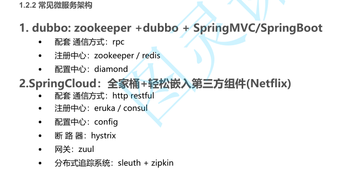

restTemplate可以发起远程调用请求，传入url地址以及返回值类型。

水平扩容：增加运行微服务的机器，即多台机器运行同一个程序

垂直扩容：增加该微服务运行的内存，容量（）

# 2，Nacos注册中心

官方：一个更易于构建云原生应用的动态服务发现( Nacos Discovery  )、服务配置( Nacos Config )和服务管理平台。

**集成了注册中心，配置中心，服务管理中心的平台**

注册中心发展过程：

- 问题：restTemplate使用，可以进行远程调用，但若一个微服务的请求，url地址或者端口发生变化，则所有涉及到该请求的其他微服务都需要更改
  - 解决：将所有的微服务请求地址保存到数据库中，每次请求都从中获取。
- 问题：微服务水平扩容后，客户端请求时无法负载均衡（即客户端只能请求一个固定的服务器），或者一个微服务宕机，明明其他服务器可用，该客户端不行
  - 解决：引入ngnix，由ngnix转发
- 问题：微服务过多，ngnix配置繁琐（需要手动配置），
  - 解决：nacos，注册中心

## 功能

- **服务注册：**微服务启动时，会通过发送REST请求的方式向Nacos Server注册自己的服务，提供IP,端口，微服务名称等元数据。Nacos Server收到请求后，会将数据保存在一个内存Map中。
- **服务心跳：**在服务注册后，Nacos Client会维护一个定时心跳来持续通知Nacos Server，说明服务一直处于可用状态，默认5s发送一次心跳。（放在该微服务宕机，还负载均衡的给该服务分配请求）
- 服务健康检查：Nacos Server会开启一个定时任务用来检查注册服务实例的健康情况，对于超过15s没有收到客户端心跳的实例会将它的healthy属性置为false(客户端服务发现时不会发现)，如果某个实例超过30秒没有收到心跳，直接剔除该实例(被剔除的实例如果恢复发送心跳则会重新注册)
- **服务发现：**在微服务feign远程调用时，会向Nacos Server获取一个注册清单，从清单中获取要调用的微服务地址，而且设置定时任务实时更新
- **服务同步：**Nacos Server集群之间会互相同步服务实例，用来保证服务信息的一致性。

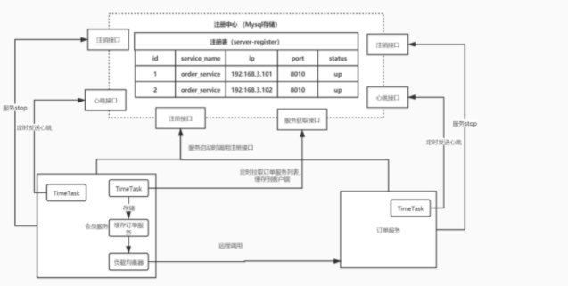

地址：用户名，密码 nacos

http://192.168.56.1:8848/nacos/index.html

在main类加注解@EnableDiscoveryClient   （可加可不加，已经默认启动了）

## Ribbon

Nacos自带的负载均衡器，是在消费端（客户端）来选择服务器。而不是统一请求到ngnix再由ngnix进行负载均衡判别

负载均衡有两种方案：

- 集中式负载均衡，在客户端与服务器之间添加中间件来实现负载均衡（硬件 F5 或者软件 Nginx）
  - 例如Nginx，通过Nginx进行负载均衡，先发送请求，然后通过负载均衡算法，在多个服务器之间选择一个进行访问；即在服务器端再进行负载均衡算法分配。
  - 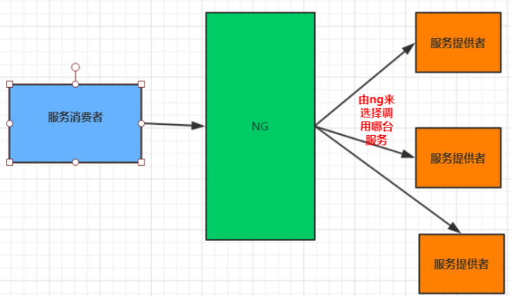
- 客户端负载均衡，（客户端使用负载均衡机制，选择服务器）
  - 例如spring cloud中的ribbon，客户端会有一个服务器地址列表，在发送请求前通过负载均衡算法选择一个服务器，然后进行访问，这是客户端负载均衡；即在客户端就进行负载均衡算法分配。
  - 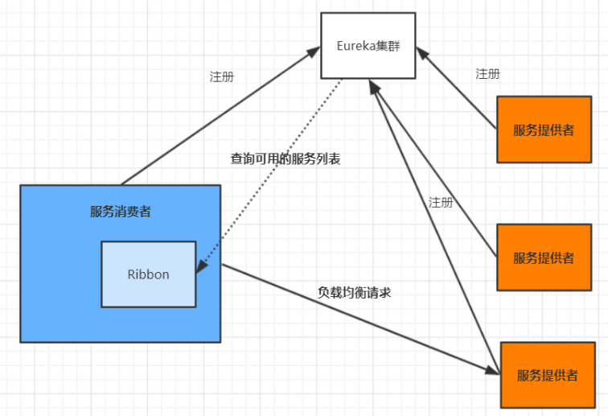
- 负载均衡算法 
  - 随机选择
  - 轮询，负载均衡默认的方式
  - 加权轮询，服务器的性能进行权重计算，性能好的权重高
  - 地址hash，通过客户端请求的地址的HASH值取模映射进行服务器调度。  ip --->hash
  - 最小链接数，即使请求均衡了，压力不一定会均衡，最小连接数法就是根据服务器的情况，比如请求积压数等参数，将请求分配到当前压力最小的服务器上。  最小活跃数

### Ribbon负载均衡策略

选择一个服务器

- RandomRule：随机选择一个服务实例
- RoundRobinRule：轮询
- RetryRule：在轮询的基础上进行重试，在失效时间之前，不断的采用轮询的方式重试
- WeightedResponseTimeRule：加权查询，如果一个服务的平均响应时间越短则权重越大，那么该服务实例被选中执行任务的概率也就越大。
- BestAvailableRule：过滤掉失效的服务实例的功能，然后顺便找出并发请求最小的服务实例来使用。
- ZoneAvoidanceRule ： **默认规则**，选择附近区域的服务器，再将所有的服务器进行轮询。本地的服务器没有区域概念，所以使用就是轮询

#### 修改负载平衡策略

- 写配置类	（不能写在@SpringbootApplication注解的@CompentScan扫描得到的地方，否则自定义的配置类就会被所有的RibbonClients共享）

  - ```Java
    @Configuration
    2 public class RibbonConfig {
    3
    4  /**
    5  * 全局配置
    6  * 指定负载均衡策略
    7  * @return
    8  */
    9  @Bean
    10  public IRule iRule() {
    11  // 指定使用Nacos提供的负载均衡策略（优先调用同一集群的实例，基于随机权重）
    12  return new NacosRule();
    13  }
    14 }
    ```

  - 利用微服务指定负载均衡策略
    @RibbonClient(name = "mall‐order",configuration = RibbonConfig.class)

- 修改配置文件，指定负载均衡策略

  - ```yml
    # 被调用的微服务名
    mall‐order:
    	ribbon:
    # 指定使用Nacos提供的负载均衡策略（优先调用同一集群的实例，基于随机&权重）  NFLoadBalancerRuleClassName: com.alibaba.cloud.nacos.ribbon.NacosRule
    ```

#### 自定义修改负载均衡策略

通过实现 IRule 接口可以自定义负载策略，主要的选择服务逻辑在 choose 方法中。

### Ribbon原理

处理的是是垂直扩容后的微服务，即多台服务器运行一个微服务程序

- 服务启动后，各个微服务会在Nacos服务器注册
- 客服端会定时从Nacos服务器获取各个微服务信息，并交给rabbon。
- 在客户端请求该服务器时，会有拦截器拦截，通过ribbon的负载均衡策略，选择合适的服务器，再发出请求。


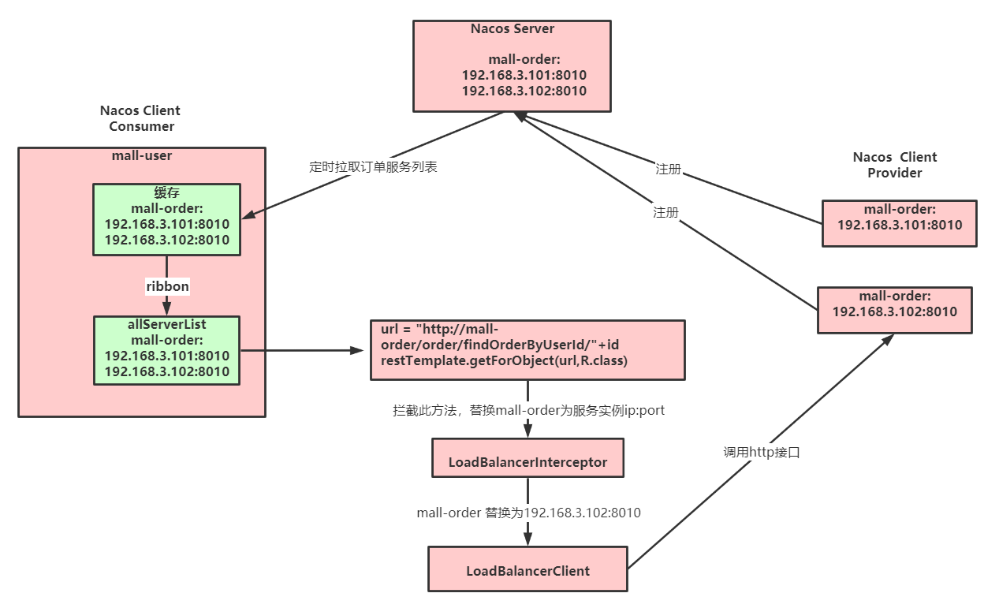

# 3，Feign

**实现各微服务间的调用**

Spring Cloud  openfeign 对Feign进行了增强，使其支持Spring MVC注解，另外还整合了
Ribbon和Nacos，从而使得Feign的使用更加方便

### 使用

- 引入依赖

  ```
  <dependency>
    <groupId>org.springframework.cloud</groupId>
    <artifactId>spring‐cloud‐starter‐openfeign</artifactId>
  </dependency>
  ```

- 编写调用接口+@FeignClient注解（消费方，即调用方）

  ```Java
  @FeignClient(value = "mall‐order",path = "/order")
   public interface OrderFeignService {
    @RequestMapping("/findOrderByUserId/{userId}")
   public R findOrderByUserId(@PathVariable("userId") Integer userId);
   }
  ```

- 调用端在启动类上添加@EnableFeignClients注解


### 自定义配置

- ### 日志

  - 获取feign的日志信息

    - 定义一个配置类，此处是全局生效，若只看指定微服务的日志，则选择2

      ```Java
      1 // 注意： 此处配置@Configuration注解就会全局生效，如果想指定对应微服务生效，就不能配置
      2 public class FeignConfig {
      3  /**
      4  * 日志级别
      5  *
      6  * @return
      7  */
      8  @Bean
      9  public Logger.Level feignLoggerLevel() {
      10  return Logger.Level.FULL;
      11  }
      12 }
      ```

    - NONE【性能最佳，适用于生产】：不记录任何日志（默认值）。

    - BASIC【适用于生产环境追踪问题】：仅记录请求方法、URL、响应状态代码以及执行时间。

    - HEADERS：记录BASIC级别的基础上，记录请求和响应的header。

    - FULL【比较适用于开发及测试环境定位问题】：记录请求和响应的header、body和元数据。

  - 局部配置，让调用的微服务生效，在@FeignClient 注解中指定使用的配置类

    - 局部配置也可以在yml文件中配置

      ```yml
      feign:
        client:
        config:
        mall‐order: #对应微服务
        loggerLevel: FULL
      ```

    - 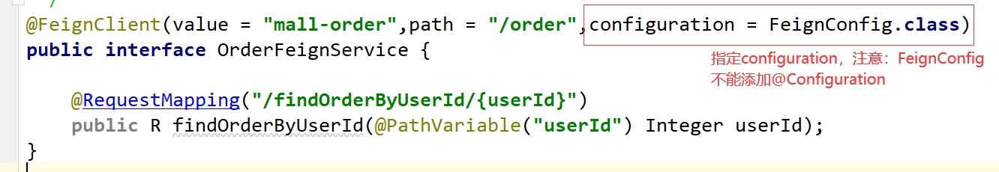

  - **在yml配置文件中执行 Client 的日志级别才能正常输出日志**，格式是"logging.level.feign接口全类名=debug"

- Feign设置过期时间

  - yml配置

  - ```yml
    1 feign:
    2  client:
    3  config:
    4  mall‐order: #对应微服务
    5  # 连接超时时间，默认2s
    6  connectTimeout: 5000
    7  # 请求处理超时时间，默认5s
    8  readTimeout: 10000
    ```

- #### 契约配置

  - 将原生的feign嵌入到springCloud Alibaba中
  - Spring Cloud 在 Feign 的基础上做了扩展，使用 Spring MVC 的注解来完成Feign的功能。原生的 Feign 是不支持 Spring MVC 注解的，如果你想在 Spring Cloud 中使用原生的注解方式来定义客户端也是可以的，通过配置契约来改变这个配置，Spring Cloud 中默认的是 SpringMvcContract。

- ### 自定义feign请求拦截器

  - 在请求feign调用时，进行拦截，只拦截微服务之间的调用
  - 普通拦截器是客户端请求时拦截
  - **使用**
    - 实现RequestInterceptor接口，重写apply方法
    - 在yml中配置，指定微服务和拦截器

# 4，Nacos 配置中心

为分布式系统中的外部化配置提供服务器端和客户端支持。

**可以在Nacos Server 集中管理所有的配置文件，不必重启微服务。**提高了可维护性，时效性，安全性。

配置中心统一配置信息

- 导入依赖

  - ```
    <dependency>
        <groupId>com.alibaba.cloud</groupId>
        <artifactId>spring-cloud-starter-alibaba-nacos-config</artifactId>
    </dependency>
    ```

- 创建一个bootstrap.properties

  - ```properties
    spring.application.name=mall-coupon
    spring.cloud.nacos.config.server-addr=127.0.0.1:8848
    ```

- 

- 在Nacos注册中心中，点击“配置列表”，添加配置规则：

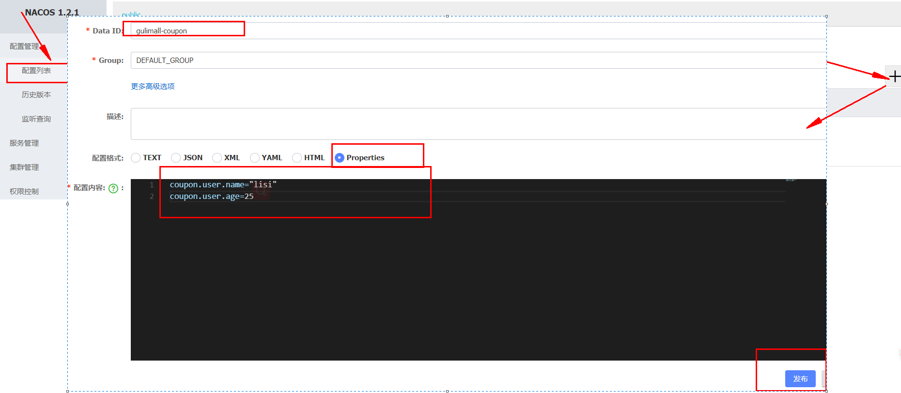

- 需要在配置中心默认添加一个数据集，
  - 数据集 Data Id： 应用名.properties

- 动态获取所需得配置
  - @RefreshScope：动态获取并刷新配置（修饰类，不能修饰属性）
  - @Value("${配置项的名}")：获取到配置。
  - 如果配置中心和当前应用的配置文件中都配置了相同的项，**优先使用配置中心的配置。**

- ## 支持profile粒度的配置

  - 配置中心加载配置时，不仅加载默认`${spring.application.name}.${file-extension:properties}`(Data Id)命名的基础配置文件，还会加载`${spring.application.name}-${profile}.${file-extension:properties} `加了profile的配置文件，
  - profile 的配置文件 大于 默认配置的文件。 两个文件形成互补。

- 支持自定义 namespace 的配置

  - 加载不同命名空间的配置文件。不同的命名空间下，可以存在相同的 Group 或 Data ID 的配置

  - ```properties
    spring.cloud.nacos.config.namespace=71bb9785‐231f‐4eca‐b4dc‐6be446e12ff8
    ```

- 支持自定义扩展的 Data Id 配置

  - 一个微服务可以对应多个配置文件

  - ```properties
    spring.cloud.nacos.config.extensionConfigs[0].data‐id=ext‐config‐common01.properties
    spring.cloud.nacos.config.extensionConfigs[0].group=REFRESH_GROUP
    spring.cloud.nacos.config.extensionConfigs[0].refresh=true
    
    
    spring.cloud.nacos.config.extensionConfigs[1].data‐id=ext‐config‐common02.properties
    spring.cloud.nacos.config.extensionConfigs[1].group=REFRESH_GROUP
    spring.cloud.nacos.config.extensionConfigs[1].refresh=true
    ```

# 5，sentinel


## 服务的可用性问题

一个高度服务化的系统，一个业务逻辑会依赖多个服务，也会出现服务间的问题

- **服务雪崩**：
  - 其中一个微服务不可用，导致线程池中所有的线程都在等待响应而阻塞，从而导致整个服务链路不可用，进而导致整个系统的不可用
  - 由一个点不可用，导致不可用逐渐放大（积分服务因为秒杀，流量过大，导致服务不可用，用户发现不可用后，重试，导致秒杀链路逻辑重试过多，秒杀链路不可用，商品微服务与购物车和普通购买链路相关联，则导致其他链路也不可用，整个服务崩掉）
  - 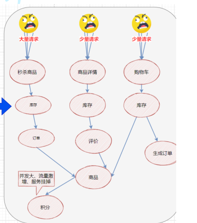

根本原因：大量请求线程同步等待造成的资源耗尽。当服务调用者使用同步调用时, 会产生大量的等待线程占用系统资源。一旦线程资源被耗尽,服务调用者提供的服务也将处于不可用状态, 于是服务雪崩效应产生了。

## 解决方法

- 超时机制
  - 一旦超时，就释放资源。由于释放资源速度较快，一定程度上可以抑制资源耗尽的问题。（积分微服务不可用，设置超时后，商品请求不到积分服务信息，则返回请求超时，进而不影响其他链路）
- **服务限流**
  - 设置最大QPS，超出后，降级处理或者采取拒绝策略
- 隔离
  - 用户的请求将不再直接访问服务，而是通过线程池中的空闲线程来访问服务，若线程池满了，则进行降级处理
- **服务熔断**
  - 实时监测应用，如果发现在一定时间内失败次数/失败率达到一定阈值，则进行熔断（跟保险丝类似），请求直接返回。
  - 在请求的服务大量请求超时时，则新的请求访问只是在消耗资源，不会得到响应。则进行熔断。
- **服务降级**
  - 出现服务熔断后，则进行服务降级。
  - 所谓降级，就是当某个服务熔断之后，服务将不再被调用，此时客户端可以自己准备一个本地的fallback（回退）回调，返回一个缺省值。 例如：(备用接口/缓存/mock数据) 。这样做，虽然服务水平下降，但好歹可用，比直接挂掉要强，当
    然这也要看适合的业务场景。

## Sentinel

面向分布式服务架构的流量控制组件，解决服务可用性问题

- 流控规则：原理是监控应用流量的 QPS 或并发线程数等指标，当达到指定的阈值时对流量进行控制，以避免被瞬时的流量高峰冲垮
  - 限流阈值类型 （QPS）
  - 并发线程数：超出指定线程数则直接拒绝
- 流控方式：
  - 快速失败：当超出阈值，直接抛出异常
- 熔断策略：熔断后，会等待熔断时长后，再探测恢复状态，若仍不满足熔断策略，则继续熔断，若满足，则结束熔断
  - 慢调用比例：请求超出最大响应时间的，则认为是慢调用。超出设置的比例，则熔断
  - 异常比例：请求会出现异常
  - 异常数：单位统计时长内，出现异常的数目
- 降级规则：

# 6，分布式事务Seata

常见的分布式事务解决方案

1. seata 阿里分布式事务框架
2. 消息队列
3. saga
4. XA

对应着4中模式：AT，TCC，Saga，XA。都是**二阶段提交**

## 2PC

- 两阶段提交协议：分为两个阶段：Prepare 和 Commit。
- 并不能实现100%的事务一致性，仅仅减少不一致的发生

- **Prepare**

  - 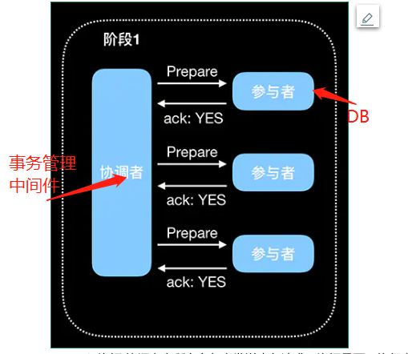
  - 流程
    - 询问：协调者向所有参与者发送事务请求，等待各个参与者响应
    - 执行：各个参与者执行事务操作，并记录Undo和redo记录
    - 响应：参与者执行后向协调者返回yes或者no响应。参与者也可能宕机不响应

- **Commit：**

  - 协调者向所有参与者发送commit/rollback请求
  - 进行事务提交或者事务回滚，执行完成后释放事务执行期间占用的所有资源
  - 将事务执行结果返回给协调者
  - 协调者收到所有的协调者ACk，事务执行完成

- #### 2PC 的问题

  - 同步阻塞，协调者等待参与者响应时，其他已经响应的参与者之鞥你等待，无法进行其他操作
  - 协调者宕机，参与者一直阻塞。若协调者为分布式，协调者在执行过程中宕机，其他协调者顶替，无法得知上个事务的全部状态信息
  - 数据不一致：在commit阶段，由于宕机或者网络问题，导致commit命令未收到，则参与者继续阻塞，造成不一致
  - 环境可靠性依赖：若由于参与者宕机或者网络问题，协调者无法收到所有参与者响应，等待响应超时，则触发事务中断。在这个过程中，协调者和所有其他参与者都是出于阻塞的。这种机制对网络问题常见的现实环境来说太苛刻了。

## AT模式

阿里**seata框架默认使用AT模式**，非侵入式的

- 一阶段
  - 拦截业务SQL，解析语句，先查询要更新前的数据，并保存成`before image`，然后执行业务SQL，将更新后的数据保存成`after image`，生成行锁，上述操作都在一个事务内执行，保证一阶段的原子性
  - 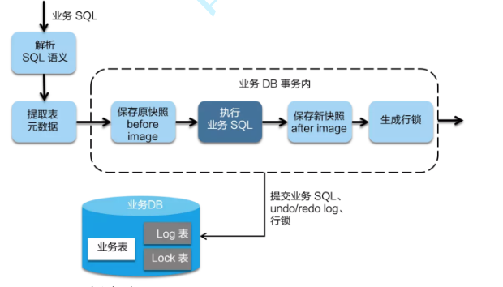
- **二阶段**
  - 提交：**因为一阶段已经将业务SQL提交到数据库**，所以，此时只需要将保存的快照数据和行锁删掉，完成数据清理即可
  - 回滚：
    - 回滚数据首先需要对比`after image` 与数据库中的数据，**避免脏写**，若有脏写，需要人工处理
    - 使用`before image`中的数据进行回滚，逆向生成SQL语句，进行数据还原
    - 删除`before image`和`after image`
    - 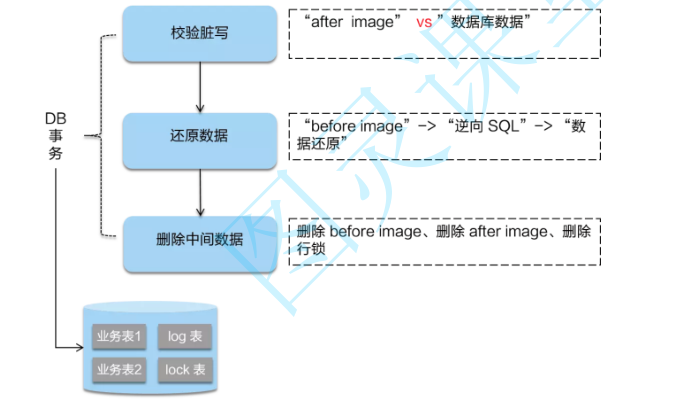

## TCC模式

侵入性较强，自己实现相关事务控制逻辑

整个过程没有锁，性能更强

- TCC模式需要用户根据自己的业务场景实现 Try、Confirm 和 Cancel 三个操作，事务发起方在一阶段执行 Try 方式，在二阶段提交执行 Confirm 方法，二阶段回滚执行 Cancel 方法。
- 若某一部分事务执行失败，则调用cancel方法进行回滚

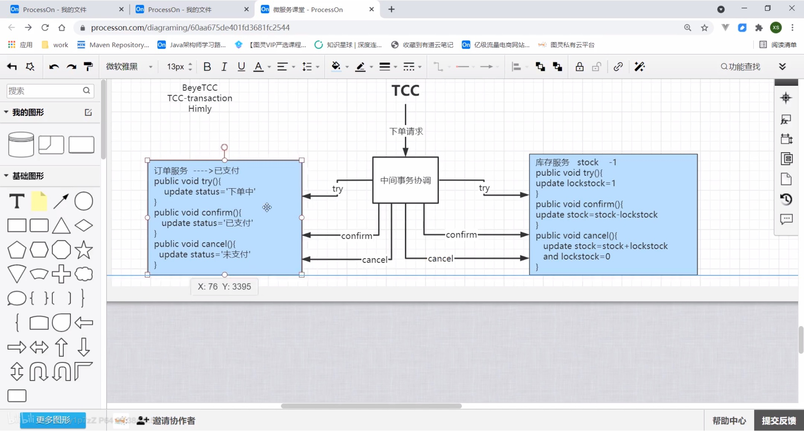

## seata特点

- 优点：
  -  应用层基于SQL解析实现了自动补偿，从而最大程度的降低业务侵入性；
  - 将分布式事务中TC（事务协调者）独立部署，负责事务的注册、回滚；
  - 通过全局锁实现了写隔离与读隔离
- 问题
  - 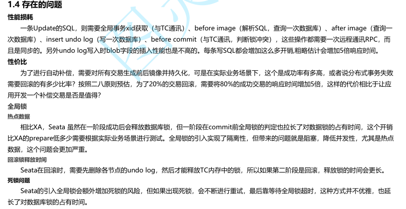

TC-事务协调者：单独的server服务端

TM-事务管理器：定义全局事务的范围：开始全局事务、提交或回滚全局事务。

RM-资源管理器：管理分支事务的资源

## 声明周期

1. TM请求TC开启一个全局事务，TC会生成一个XID作为该全局事务的ID，
   1. 一进入事务，就会生成XID， global_table 就是存储的全局事务信息 
2. RM请求TC将本地事务注册为全局事务的分支事务，通过XID关联
3. TM请求TC，得知XID对应的事务是提交还是回滚
4. TC驱动RM，将XID对应的分支事务提交或者回滚

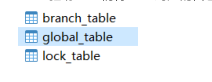

# 7，网关GateWay

作为系统统一入口，封装了应用程序的内部结构，为客户端提供统一服务，进行解耦，将一些与业务本身无关的公共逻辑：比如认证，鉴权，监控，路由转发。

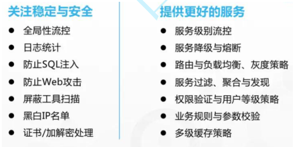

- **路由**
  - 包括ID，一个目的URI，一个断言工厂，一组Filter组成，若符合断言规则，则转发到目的URI
- 断言：
  - Java8中的断言函数，断言函数允许开发者去定义匹配Http request中的任何信息，比如请求头和参数等。
- 过滤器
  - filter分为Gateway FilIer和Global Filter。Filter可以对请求和响应进行处理。

请求过来，与断言匹配，成功后，经过过滤器操作后，转发到路由设置的URI。

网关与nacos进行结合，uri: lb//order-server会从nacos中获取order-server微服务的地址


## 工作原理

执行流程大体如下：
1. Gateway Client向Gateway Server发送请求
2. 请求首先会被HttpWebHandlerAdapter进行提取组装成网关上下文
3. 然后网关的上下文会传递到DispatcherHandler，它负责将请求分发给RoutePredicateHandlerMapping
4. RoutePredicateHandlerMapping负责路由查找，并根据路由断言判断路由是否可用
5. 如果过断言成功，由FilteringWebHandler创建过滤器链并调用
6.    请求会一次经过PreFilter--微服务--PostFilter的方法，最终返回响应


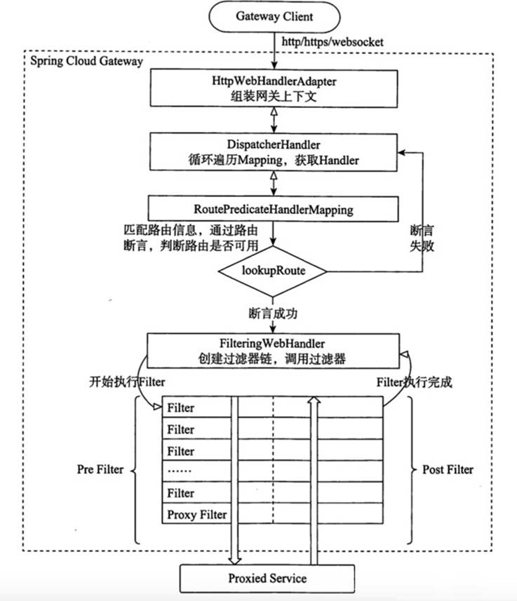


## 断言工厂

- 当请求gateway的时候，  使用断言对请求进行匹配， 如果匹配成功就路由转发， 如果匹配失败就返回404

- 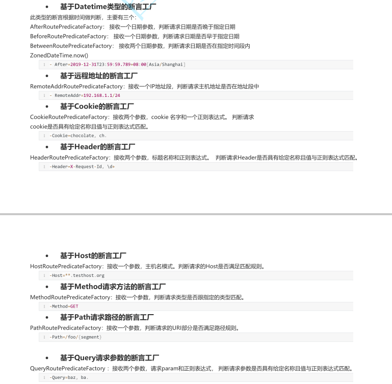

- **自定义断言工厂**

  - 需要继承AbstractRoutePredicateFactory 类，重写 apply 方法的逻辑。在 apply 方法中可以通过exchange.getRequest() 拿到 ServerHttpRequest 对象，从而可以获取到请求的参数、请求方式、请求头等信息。
  - 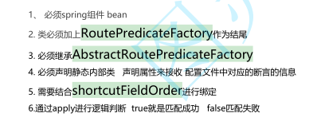

  ## 过滤器配置

  局部过滤器和全局过滤器区别： 
  局部：局部针对某个路由， 需要在路由中进行配置
  全局：针对所有路由请求， 一旦定义就会投入使用

# 8，链路追踪SkyWalking

链路追踪：分布式系统的应用程序**性能监控工具**，支持分布式追踪、性能指标分析、应用和服务依赖分析。

 Skywalking主要功能特性
1、多种监控手段，可以通过语言探针和service mesh获得监控的数据；
2、支持多种语言自动探针，包括 Java，.NET Core 和 Node.JS；
3、轻量高效，无需大数据平台和大量的服务器资源；
4、模块化，UI、存储、集群管理都有多种机制可选；
5、支持告警；
6、优秀的可视化解决方案；

**环境**

- skywalking agent与业务系统绑定，负责收集各种监控数据
- Skywalking oapservice负责处理监控数据，比如接受skywalking agent的监控数据，并存储在数据库中;接受skywalking webapp的前端请求，从数据库查询数据，并返回数据给前端Skywalking oapservice通常以集群的形式存在。
- skywalking webapp，前端界面，用于展示数据。

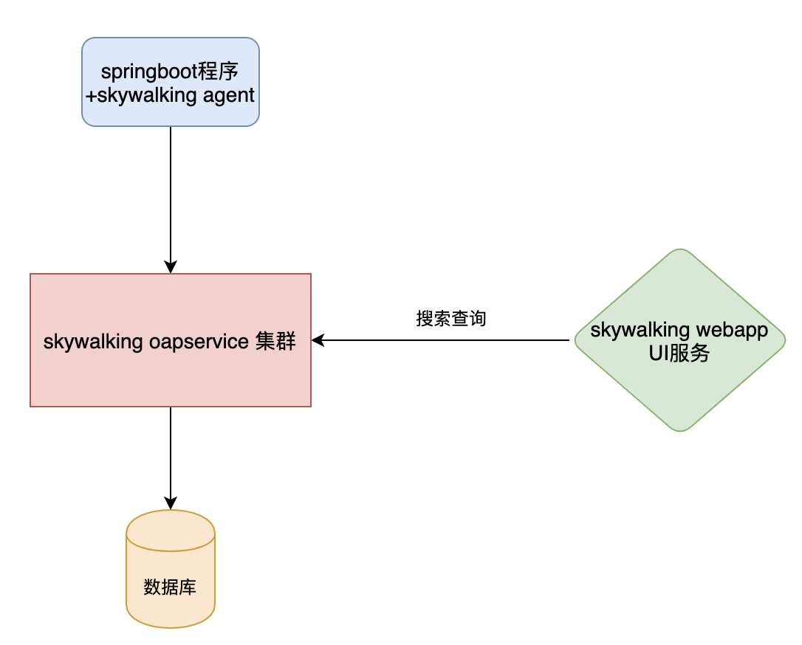