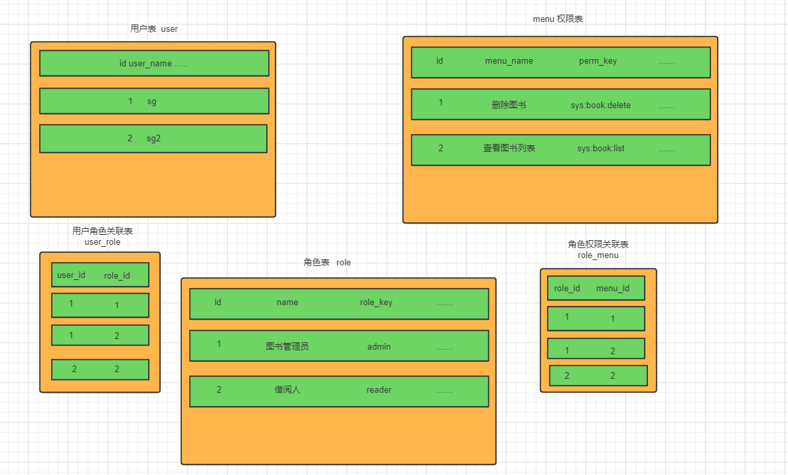

# 1，入门

- **Spring Security** 是spring家族的安全管理框架，功能更丰富，社区资源也比Shiro丰富
- Shiro：简单，小项目使用较多，上手简单

**Spring Security**核心：

- **认证：**验证当前访问系统的用户是不是本系统的用户
- **授权：**经过验证后，判断判断当前用户是否有权限进行该操作

作用：对资源进行保护，访问需要认证授权的流程

**默认：**

- 引入Spring Security包会自动开启
- 访问页面时，需要进行登录。默认用户名：user,密码在系统启动时由系统给出
- localhost:8080/logout  退出安全登录

# 2，认证

## 2.1 Spring Security完整流程

Spring Security访问流程是一个过滤链，内部包含各种过滤器。


- **UsernamePasswordAuthenticationFilter**：处理登录页的用户名，密码请求。**执行认证功能**
- **ExceptionTranslationFilter：**处理过滤器链中抛出的任何异常
- **FilterSecurityInterceptor：**负责权限处理（认证服务，授权）的过滤器

## 2.2 认证流程详解


大概流程与普通登录流程类似。

1. 用户登录请求，封装为用户对象，通过层层包装，最后通过用户名查询数据库的用户，进行密码校验，并将结果返回。

- Authentication接口：它的实现类，表示当前访问系统的用户，封装了用户信息
- AuthenticationManager接口：定义了认证Authentication的方法
- UserDetailsService：加载用户特定数据的接口，调用其内部方法通过用户名查询数据库中的用户信息
- UserDetails接口：提供核心用户信息，通过UserDetailsService查询到的用户信息封装成一个UserDetails对象，然后将这些信息封装到Authentication对象中

**目的：**

- 登录

  - 替换为自己的登录接口
    - 登录接口调用Spring Security中的ProviderManager（认证流程第二步）进行认证。（**加入到spring security流程**）
    - 认证成功后，生成jwt（登录令牌返回前端）
    - 将用户信息保存到redis（方便该用户其他网址访问时，可快速认证缓解数据库压力）

  - 替换为自己的用户查询方法（UserDetailsService）
    - 通过用户名查询用户信息

- 校验
  - 定义jwt认证过滤器
    - 获取token，从token中获取key，并在redis中查询
    - 并存入SecurityContextHolder（加入到**加入到spring security流程**）

## 2.3实现操作

- ### **替换为自己的用户查询方法（UserDetailsService）**

  - 在自己编写的userservice方法，实现UserDetailsService接口，重写loadUserByUsername方法（传入方法名），并返回UserDetail对象（UserDetail为接口）

  - security的过滤链需要通过loadUserByUsername方法获取用户对象，并进行对比。

  - 可以创建一个新的loginUser对象（内部属性为user）实现UserDetail接口。或者直接在user类直接实现UserDetail接口

  - **实现该类需要实现的方法**

  - ```Java
    //设置权限条件
    @Override
    public Collection<? extends GrantedAuthority> getAuthorities() {}
    // true 账号没过期
    public boolean isEnabled();
    // true 账号没锁定
    public boolean isAccountNonLocked();
    // true 凭证未过期
    public boolean isCredentialsNonExpired();
    // true 账号可用
    public boolean isEnabled();
    ```

- ### **密码验证阶段**

  - 默认使用的PasswordEncoder要求数据库中的密码格式为：{id}password 。它会根据id去判断密码的加密方式。但是我们一般不会采用这种方式。所以就需要替换PasswordEncoder。

  - 我们一般使用SpringSecurity为我们提供的BCryptPasswordEncoder。

  - **写一个SpringSecurity配置类，构建新的PasswordEncoder，并注入到IOC容器，并实现WebSecurityConfigurerAdapter方法**

  - ```Java
    @Configuration
    public class SecurityConfig extends WebSecurityConfigurerAdapter {
        @Bean
        public PasswordEncoder passwordEncoder(){
            return new BCryptPasswordEncoder();
        }
    }
    ```

  - BCryptPasswordEncoder有两个方法：

    - bc.encode()：加密，会加入随机字符串（加盐），再进行加密。相同密码每次加密结果不一样
    - bc.matches()：验证,明文密码与加密加盐后的密码进行比对，虽然每次加密后不一致，但仍可比对成功
    - 即多个加密后的密码对应一个明文

- ## 自定义登录接口

  - 导入security使得所有的请求都需要先登录，则自定义的登录接口需要放行，security不能拦截

  - 写配置类：登录接口允许匿名访问

    - ```Java
      @Configuration
      public class SecurityConfig extends WebSecurityConfigurerAdapter {
      
      
          @Bean
          public PasswordEncoder passwordEncoder(){
              return new BCryptPasswordEncoder();
          }
      
          @Override
          protected void configure(HttpSecurity http) throws Exception {
              http
                      //关闭csrf
                      .csrf().disable()
                      //不通过Session获取SecurityContext
                      .sessionManagement().sessionCreationPolicy(SessionCreationPolicy.STATELESS)
                      .and()
                      .authorizeRequests()
                      // 对于登录接口 允许匿名访问
                      .antMatchers("/user/login").anonymous()
                      // 除上面外的所有请求全部需要鉴权认证
                      .anyRequest().authenticated();
          }
      ```

  - 自定义接口需要加入到security过滤链中。

    - 在controller层定义网址，service层加入security。
    - 创建authenticationToken，加入到Authentication，
    - authenticationManager，在配置类中自己配置

    ```Java
     UsernamePasswordAuthenticationToken authenticationToken = new UsernamePasswordAuthenticationToken(user.getUserName(),user.getPassword());
            Authentication authenticate = authenticationManager.authenticate(authenticationToken);
    ```

  - 根据返回结果判定是否登录成功。

  - 若判定成功，则保存到redis

- ## 自定义认证过滤器

  - 我们需要自定义一个过滤器，这个过滤器会去获取请求头中的token，对token进行解析取出其中的userid。
    - 使用userid去redis中获取对应的LoginUser对象。
    - 然后封装Authentication对象存入SecurityContextHolder
  - 需要security配置类中配置，自定义过滤器需要先于登录功能的过滤器

- ## 退出登录

  - 我们只需要定义一个登陆接口，然后获取SecurityContextHolder中的认证信息，删除redis中对应的数据即可。

# 3，授权

针对不同的用户可以提供不同的功能

- **授权流程**
  - security会进行权限校验，默认在FilterSecurityInterceptor校验权限。在FilterSecurityInterceptor中会从SecurityContextHolder获取其中的Authentication，再从中获取当前用户的权限信息。
  - 所以需在FilterSecurityInterceptor之前，Authentication创建时传入该用户的权限。
  - 再设置我们资源的权限

## 3.2 授权实现

- ### 设置接口的权限

  - 开启全局配置@EnableGlobalMethodSecurity(prePostEnabled = true)
  - 在controller层相应方法加上@PreAuthorize("hasAuthority('权限名')")

- ### 封装权限信息

  - UserDetails实现类由方法，public  Collection<? extends GrantedAuthority> getAuthorities()放回当前用户的权限信息。可以在此处返回一个当前用户的权限集合

  - ```Java
        //存储SpringSecurity所需要的权限信息的集合
        @JSONField(serialize = false)
        private List<GrantedAuthority> authorities;
        @Override
        public  Collection<? extends GrantedAuthority> getAuthorities() {
            if(authorities!=null){
                return authorities;
            }
            //把permissions中字符串类型的权限信息转换成GrantedAuthority对象存入authorities中
            authorities = permissions.stream().
                    map(SimpleGrantedAuthority::new)
                    .collect(Collectors.toList());
            return authorities;
        }
    ```

  - UserDetails类在保存到redis中时需要序列化，` List<GrantedAuthority> authorities`无法进行序列化配置，所以需要加上标签，使其在序列化时失效

## 从数据库查询权限信息

- ### RBAC权限模型

  - RBAC权限模型（Role-Based Access Control）即：基于角色的权限控制。	
  - 用户表（一个用户可能有多个权限），权限表，角色表（一个用户可能有多个角色，一个角色可能有多个权限）
  - 

# 4，自定义异常处理机制

在认证失败或者是授权失败的情况下也能和我们的接口一样返回相同结构的json，这样可以让前端能对响应进行统一的处理。

认证或授权过程中，出现异常会被ExceptionTranslationFilter捕获到。在ExceptionTranslationFilter可以判断是认证失败还是授权失败

- 如果是认证过程中出现的异常会被封装成AuthenticationException然后调用**AuthenticationEntryPoint**对象的方法去进行异常处理。


- 如果是授权过程中出现的异常会被封装成AccessDeniedException然后调用**AccessDeniedHandler**对象的方法去进行异常处理。

只需要自定义AuthenticationEntryPoint和AccessDeniedHandler然后配置给SpringSecurity即可

- **自定义两个接口实现类**
- 配置给SpringSecurity
  - 在Security配置类中传入定义的两个接口

## 5，跨域

​	浏览器出于安全的考虑，使用 XMLHttpRequest对象发起 HTTP请求时必须遵守同源策略，否则就是跨域的HTTP请求，默认情况下是被禁止的。 同源策略要求源相同才能正常进行通信，即协议、域名、端口号都完全一致。 

前后端分离，使得前端和后端都是不同源的，所以会存在跨域要求。

需要两处配置

- 先对SpringBoot配置，运行跨域请求

  - ```Java
    @Configuration
    public class CorsConfig implements WebMvcConfigurer {
    
        @Override
        public void addCorsMappings(CorsRegistry registry) {
          // 设置允许跨域的路径
            registry.addMapping("/**")
                    // 设置允许跨域请求的域名
                    .allowedOriginPatterns("*")
                    // 是否允许cookie
                    .allowCredentials(true)
                    // 设置允许的请求方式
                    .allowedMethods("GET", "POST", "DELETE", "PUT")
                    // 设置允许的header属性
                    .allowedHeaders("*")
                    // 跨域允许时间
                    .maxAge(3600);
        }
    }
    ```

- 开启SpringSecurity的跨域访问：

  - http.cors(); 

  - ```Java
        @Override
        protected void configure(HttpSecurity http) throws Exception {
            http
                    //关闭csrf
                    .csrf().disable()
                    //不通过Session获取SecurityContext
    .sessionManagement().sessionCreationPolicy(SessionCreationPolicy.STATELESS)
                    .and()
                    .authorizeRequests()
                    // 对于登录接口 允许匿名访问
                    .antMatchers("/user/login").anonymous()
                    // 除上面外的所有请求全部需要鉴权认证
                    .anyRequest().authenticated();
            //添加过滤器
            http.addFilterBefore(jwtAuthenticationTokenFilter, UsernamePasswordAuthenticationFilter.class);
            //配置异常处理器
            http.exceptionHandling()
                    //配置认证失败处理器
                 .authenticationEntryPoint(authenticationEntryPoint)
                    .accessDeniedHandler(accessDeniedHandler);
    
            //允许跨域
            http.cors();
        }
    ```

# 5，其他校验配置

- hasAnyAuthority：设置多个访问权限

  - ```Java
    @PreAuthorize("hasAnyAuthority('admin','test','system:dept:list')")
        public String hello(){
            return "hello";
        }
    ```

  - hasRole:设置访问角色

  - hasAnyRole 

- ## 自定义权限校验方法

  - 在@PreAuthorize注解中使用我们的方法。

    - ```Java
      @Component("ex")
      public class SGExpressionRoot {
      
          public boolean hasAuthority(String authority){
              //获取当前用户的权限
              Authentication authentication = SecurityContextHolder.getContext().getAuthentication();
              LoginUser loginUser = (LoginUser) authentication.getPrincipal();
              List<String> permissions = loginUser.getPermissions();
              //判断用户权限集合中是否存在authority
              return permissions.contains(authority);
          }
      }
      ```

  - 调用该类的该方法

    - ```Java
      @RequestMapping("/hello")
      @PreAuthorize("@ex.hasAuthority('system:dept:list')")
      public String hello(){
          return "hello";
      }
      ```

- 基于配置的权限控制

  - ```Java
    @Configuration
    public class SecurityConfig extends WebSecurityConfigurerAdapter implements CommunityConstant {
    
        /**
         * 忽略对静态资源的权限验证
         * @param web
         * @throws Exception
         */
        @Override
        public void configure(WebSecurity web) throws Exception {
            web.ignoring().antMatchers("/resources/**");
            BCryptPasswordEncoder bc = new BCryptPasswordEncoder();
    
    
        }
    
        /**
         * 授权验证
         * @param http
         * @throws Exception
         */
        @Override
        protected void configure(HttpSecurity http) throws Exception {
            //授权,指定只有AUTHORITY_ADMIN,AUTHORITY_MODERATOR,AUTHORITY_USER，三种权限的时候才能真正访问我设置的这些地址
            // 即登录了才能有这些权限
            http.authorizeRequests()
                    .antMatchers(
                            "/user/setting",
                            "/user/upload",
                    )
                    .hasAnyAuthority(
                            AUTHORITY_ADMIN,
                            AUTHORITY_MODERATOR,
                            AUTHORITY_USER
                    )
                    .anyRequest().permitAll()
                    .and().csrf().disable();
    
            // 权限不够时的处理
            http.exceptionHandling()
                    //若没有登录
                    .authenticationEntryPoint(new AuthenticationEntryPoint() {
                        @Override
                        public void commence(HttpServletRequest request, HttpServletResponse response, AuthenticationException e) throws IOException, ServletException {
                            String xRequestedWith = request.getHeader("x-requested-with");
                            //判断是否是ajax请求，如果是，则发送json字符串，不是跳转到登录页面
                            if ("XMLHttpRequest".equals(xRequestedWith)){
                                response.setContentType("application/plain;charset=utf-8");
                                response.getWriter().write(CommunityUtil.getJSONString(403,"您还没有登录"));
    
                            }else{
                                response.sendRedirect(request.getContextPath() + "/login");
                            }
                        }
    
                    })
                    .accessDeniedHandler(new AccessDeniedHandler() {
                        //若是权限不足
                        @Override
                        public void handle(HttpServletRequest request, HttpServletResponse response, AccessDeniedException e) throws IOException, ServletException {
                            String xRequestedWith = request.getHeader("x-requested-with");
                            //判断是否是ajax请求，如果是，则发送json字符串，不是跳转到登录页面
                            if ("XMLHttpRequest".equals(xRequestedWith)){
                                response.setContentType("application/plain;charset=utf-8");
                                response.getWriter().write(CommunityUtil.getJSONString(403,"您没有此权限"));
    
                            }else{
                                response.sendRedirect(request.getContextPath() + "/denied");
                            }
                        }
                    });
            //security底层默认会拦截/logout请求，进行退出处理
            //覆盖它的默认逻辑，才能执行我们自己的代码
            http.logout().logoutUrl("/securitylogin");
        }
    }
    ```


# CSRF攻击

跨站请求伪造（Cross-site request forgery）

https://blog.csdn.net/freeking101/article/details/86537087

- CSRF攻击的方式：
  - 用户访问危险网址，获取了请求本服务器的cookie信息，危险网址通过cookie登录本服务器，会代替本用户执行一些操作。（判断用户登录通过cookie中的信息）
  - 

- 解决办法：
  - 在 HTTP 头中自定义属性并验证：将一些验证信息放入请求头中
  - CSRF攻击依靠的是cookie所携带的信息，所以直接将验证信息放在token，request请求头中，则避免了SCRF攻击
  - 双重Cookie采用以下流程：
    - 在用户访问网站页面时，向请求域名注入一个Cookie，内容为随机字符串（例如`csrfcookie=v8g9e4ksfhw`）。
    - 在前端向后端发起请求时，取出Cookie，并添加到URL的参数中（接上例`POST https://www.a.com/comment?csrfcookie=v8g9e4ksfhw`）。
    - 后端接口验证Cookie中的字段与URL请求参数中的字段是否一致，不一致则拒绝。（即使恶意网址发送攻击代码使用户重新访问A服务器，但在请求中没有带csrfcookie参数或者与当前用户设置的cookie（第三方cookie恶意网址无法获取）不一致）
  - Spring Security方法：
    - SpringSecurity去防止CSRF攻击的方式就是通过csrf_token。后端会生成一个csrf_token，前端发起请求的时候需要携带这个csrf_token,后端会有过滤器进行校验，如果没有携带或者是伪造的就不允许访问。
  - Spring Security方法：
    - 先通过tokenRepository从request中获取csrf token；
    - 如果未获取到token则新生成token并保存；
    - 判断是否需要进行csrf token校验，不需要则直接执行下一个过滤器；
    - 调用request的getHeader()方法或者getParameter()方法获取前端传过来的实际token；
    - 校验两个token是否相等，不相等则抛出异常，相等则校验通过，执行下一个过滤器；


