# 05｜领域建模实践（上）：怎样既准确又深刻地理解业务知识？
你好，我是钟敬。

上节课咱们完成了事件风暴，梳理了系统的行为需求。但你可能也发现了，其实还有些微妙的业务概念还没有澄清，这就要靠领域建模来完成了。

建立领域模型是DDD的核心。要建好领域建模，需要理论和实践相结合。由于我们的模型有一定的复杂性，所以我把领域建模的实践分成两节课。完成实践以后，我们会再用一节课，从理论层面让你进一步深化对领域建模的理解。

今天这节课，我们先通过租户、组织和员工这几个部分学会基础的建模方法。

## 领域建模中的一些基本概念

我们先来理清领域建模中的一些基本概念，方便你理解下面的建模实践。领域建模主要有两个目的：

- 将知识可视化，准确、深刻地反映领域知识，并且在业务和技术人员之间达成一致；

- 指导系统的设计和编码，也就是说，领域模型应该能够比较容易地转化成数据库模式和代码实现。

而我们建立领域模型，主要是要识别 **领域对象（domain object）**， **领域对象之间的关系**，以及 **领域对象的关键属性**，必要的时候还要 **将领域对象组织成模块**。当然了，还有一些比较深入的内容，我们会在迭代二中再讲。

那么，什么是领域对象呢？ **我们系统中要处理的各种“事物”就是领域对象**。比如说项目、员工、账户等等。这些对象都反映了名词性的概念。

其中，有些名词化了的动词也是领域对象。比如说我们进行了一笔支付操作，并且想把这笔操作记录下来。这时，“支付”也是领域对象。支付本来是动词，但这里实际上是要把一笔支付的信息记录下来，在这里就把“支付”当名词用了。

**领域模型是用领域模型图来表达的，通常用UML来画**。UML是“统一建模语言”的意思，英文是Unified Modeling Language，是面向对象建模的国际标准。其中，领域对象用下面这个符号来表示：

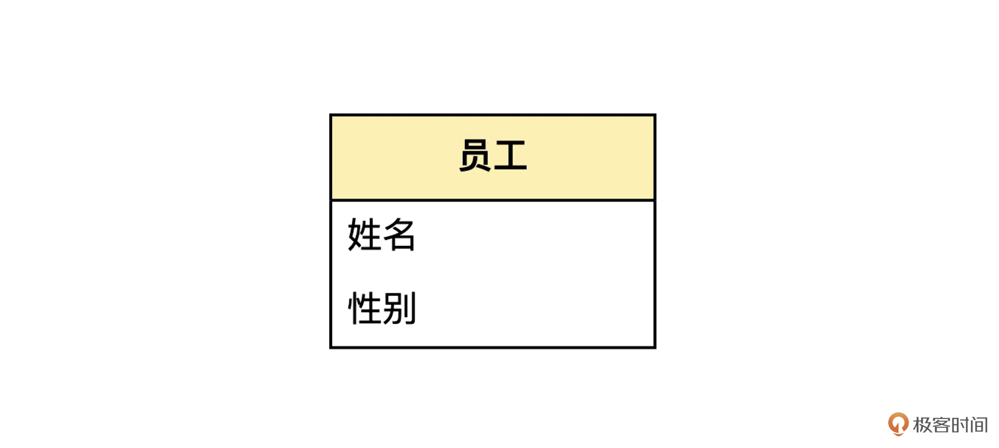

这个符号表示“员工”对象。其中第一栏是领域对象的名称，第二栏列出了对象的属性（attribute），姓名、性别都是员工的属性。

严格地说，在UML中，这个符号叫做“类”（class）。比如说，张三是员工，李四也是员工，我们可以说，员工指一类事物。这时我们可以用UML中的术语说，员工是领域对象的一个类，张三和李四是这个类的实例。在领域建模过程中，我们说领域对象时，有时指 **类**，有时指 **实例**，一般可以通过上下文来区分。

此外，DDD中将领域对象又分成 **实体**（entity）和 **值对象**（value object）。值对象我们等到第二个迭代再讲，这个迭代我们只关心实体。我们前面说的“员工”“账户”等都是实体。

由类和他们之间的关系组成的图叫做 **类图，** 这也是领域建模里用到的最主要的图。

下面我们就开始通过画类图的方式进行领域建模。同样，你扮演架构师，我扮演产品经理。

## 初步识别实体

我们可以从上节课中识别的领域名词入手，分成几部分来建模。我们先考虑租户、组织和人员。 [上节课](https://time.geekbang.org/column/article/612295) 的图是这样的：

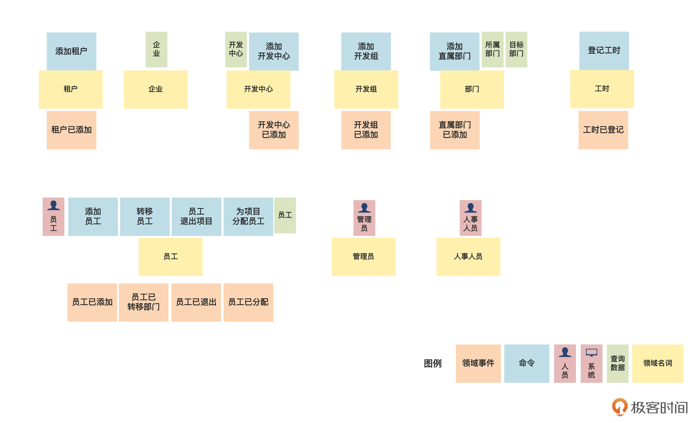

首先，你可以先假定每个领域名词都是一个实体，把它们用类的符号画出来。如下图：

这就可以算作一张最简单的类图了。你可能注意到了，这里并没有写属性。其实，在领域建模阶段，我们主要关注的是 **实体和它们之间的关系**。如果实体的名字已经能清晰说明实体的含义，那我们就不需要加属性了。如果名字还不足以充分表达含义，我们可以写几个关键属性，来辅助说明。

另外要注意，我们这里只是简单粗暴地假定了领域名词就是实体。通过后面的分析，我们还会发现，有些名词不是实体，有些要转换成其他形式。

## 识别“一对一”关联

现在，我们来识别实体之间的关系。先来看看租户和企业。

首先，你问我：“租户和企业这两个概念有没有关系呢？”我回答说：“肯定是有关系的。”于是你可以在它们两个之间画一条线，表示它们之间有关系。

然后，你又问了我两个有关业务的问题。第一个问题是：“一个租户最多可以对应几个企业？”我回答说：“只能对应一个企业。”于是，你在企业那一端写了一个 “1” 来表示。

然后你反过来问第二个问题：“一个企业可以作为几个租户？”我回答说：“一个企业也只能作为一个租户。”于是你在另一边也写上 “1” 。

这时，我们可以说， **租户和企业具有一对一的关系**。

这里的两个 “1” ，在UML中称为 **多重性**（multiplicity）。那么，这种关系整体上呢，在UML的术语里叫做“关联”（association）。后面我们都用这种严格的说法，说成 **一对一关联**。

这时你可能又想到了一个问题：“为什么不把租户和企业合并成一个概念呢？”

在有些情况下，一对一的两个实体确实是可以合并的。这取决于这两个概念的关注点是否相同。

但在我们的需求里，租户关注的是客户和提供云应用的供应商之间的协议，背后隐含的需求可能是云平台要为这个客户分配多少硬件资源、怎样收费、提供哪个级别的备份等需求。假如这不是一个基于SaaS的应用，根本不会有租户的概念。

而另一方面，企业是组织结构管理中的一个概念，即使不基于SaaS， **企业** 这个概念也存在。所以这是两个不同关注点的概念，不应该合并。

## 识别“一对多”关联

下面我们再分析企业和开发中心的关联关系。这时你同样考虑了两个问题。首先，一个开发中心可以属于多少个企业呢？只能属于一个企业。这和上面的画法相同。

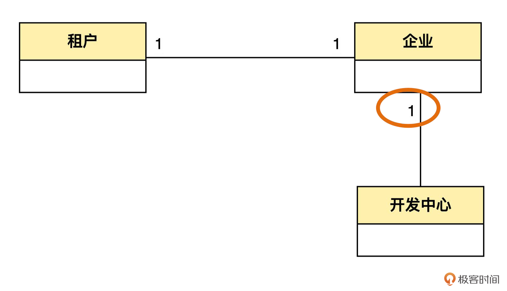

第二个问题是，一个企业可以有多少个开发中心？答案是可以有很多个。这可以在开发中心一端写一个 “\*” 来表达。

这时，我们可以说，企业和开发中心具有 **一对多关联**。

接着你用同样的方法画出了开发组，如下图：

现在咱们来考虑部门。你可能会发现，部门这个词其实用得不太准确，因为开发组也可以认为是部门。其实按照这里的需求我们想表达的是财务部、人事部等区别于开发中心和开发组的部门。

然后你又问我了：“在业务上，怎么称呼这种区别于开发中心的部门呢？”我说：“业务上一般叫做直属部门。”于是你在图中增加了直属部门。

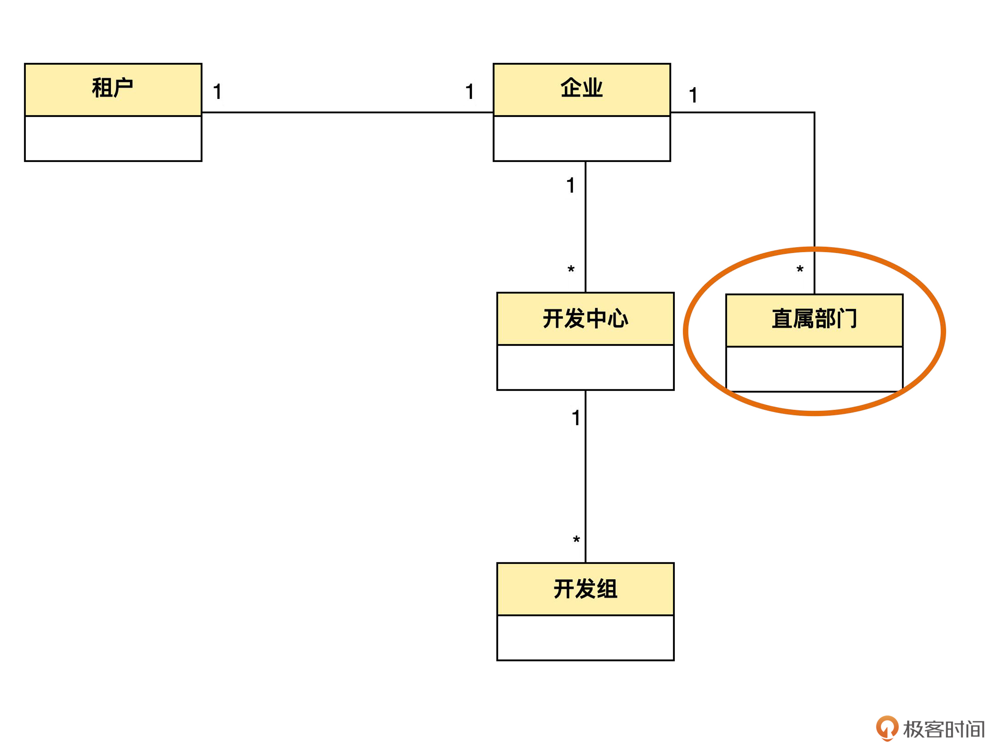

然后，你把员工也加上了。

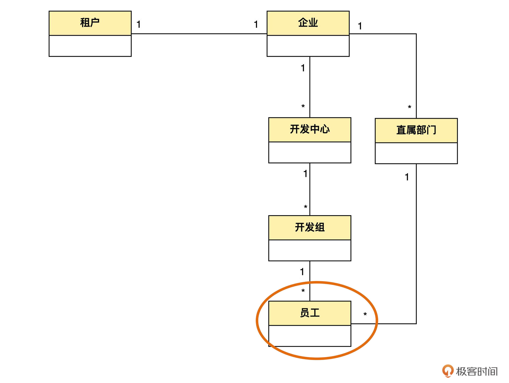

就这个图的含义而言，一个员工可以属于开发组，也可以属于直属部门，好像已经满足了需求，但是仔细想一下，你可能就会发现两个问题。

第一个问题是，如果将来组织层级发生变化，比如说在开发中心和开发组之间又增加了一层开发团队；或者有些开发组不属于任何开发中心，而是直属企业，那么这个模型就要修改了。也就是说， **这个模型不容易适应组织层级的变化**。

第二个问题是，一个员工其实可以不属于开发组，而只属于开发中心，比如开发中心的主管就是这样。同理，企业总经理也只属于企业本身而不属于任何下属部门。那么为了表达这种关系，我们就要再增加两条表示关联的线。

线越多，图就越杂乱。也就是说， **这个模型不够简洁**。

那么怎么解决这两个问题呢？我们要对这个模型进行抽象。

## 进行抽象

你可能已经注意到了，企业、开发中心、开发组、直属部门，其实都是组织结构中的节点而已，从这一点来说，他们是有共性的。

于是，你问我：“既然它们有共性，能否起一个统一的名字呢？也就是说，企业、开发中心、开发组、直属部门，可以统称为什么呢？”我回答说：“在业务上可以统称为 **组织**。”所以你把模型改成下面这个样子：

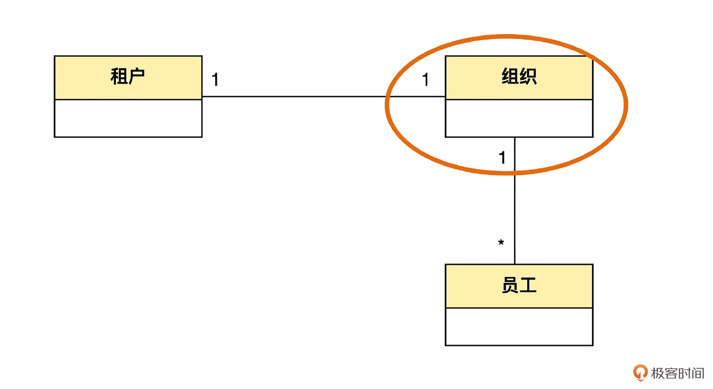

由于开发中心、开发组等都是组织，所以只画出组织就可以了，模型图变得很简洁。但是你马上就发现，无法区分出一个组织到底是开发组还是开发中心了，也就是 **归纳了共性，但个性却丢了**。

这时你问我：“一个组织是开发中心，另一个是开发组，那么在业务术语上可以说，这两个组织具有不同的‘什么’呢？”我告诉你：“可以说，这两个组织具有不同的 **组织类别**。”

于是你画出下面的模型图。

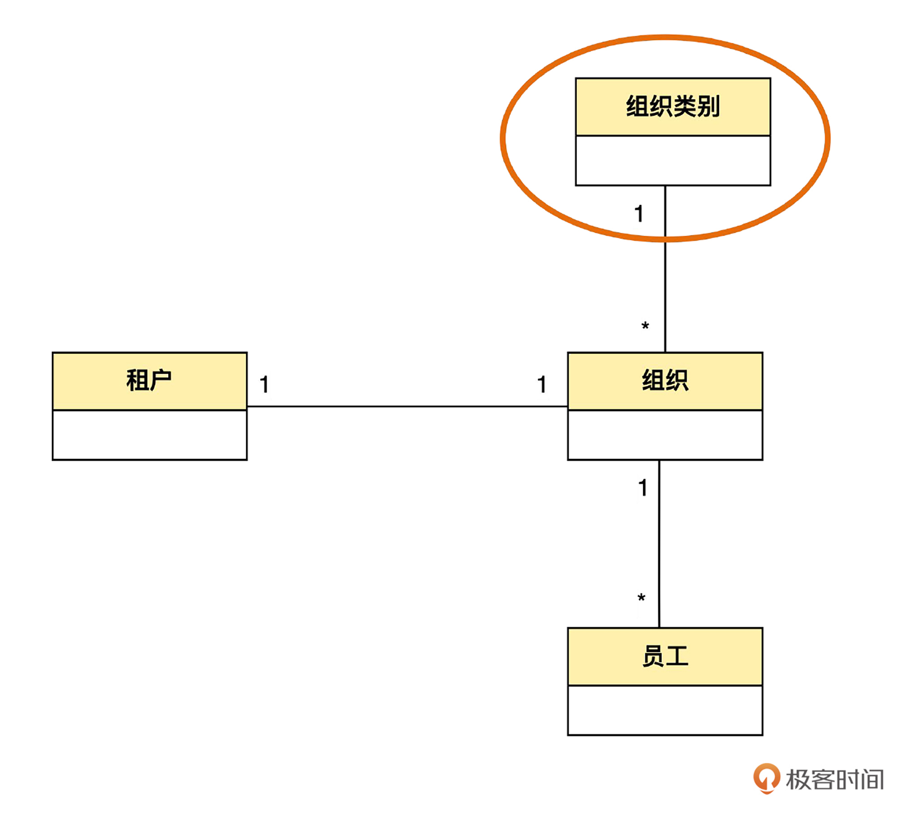

也就是在这个模型中增加了一个组织类别的实体。企业、开发中心、直属部门等都是组织类别的实例。 **一个组织类别下可以有多个组织，而一个组织只能属于一个组织类别**。比如说，开发组这个组织类别，下面可以有开发一组、开发二组等等很多具体的组织。

为了怕以后读这个模型图的人不理解什么是组织类别，我们还可以加一个注释，用来举例说明有哪些组织类别。在UML中，注释用折角的矩形表示，和被注释的实体之间用虚线连接，如下图：

## 识别“自关联”

然后，你又发现，这个图还不能表示企业、开发中心、开发组等之间的上下级关系。这可以用组织这个实体上的“自关联”来表达。画出来是下面这个样子：

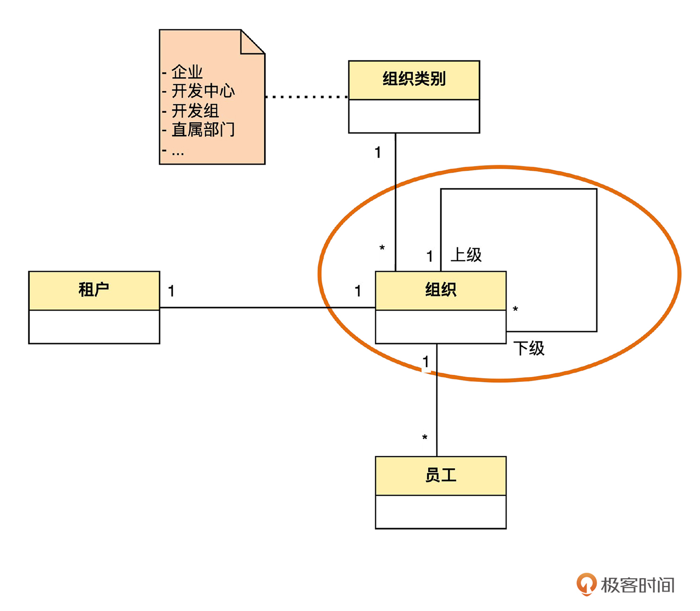

在这个图中，组织实体上有一个自己到自己的一对多关联。这个关联翻译成自然语言可以这么说： **一个组织可以有多个组织作为自己的下级；而一个组织只能有一个组织作为自己的上级**。这样就表现出了上下级的层级关系。这种一对多的自关联，实际上表达的是一种树形结构。

另外，在这个自关联的两端，有上级和下级两个词。它们在UML里称为 **“角色”**（role）。也就是说，在这个关联的 “1” 端的组织充当上级这个角色，在另一端充当下级角色。如果没有这两个角色名称的话，我们就不知道是一个上级有多个下级，还是一个下级有多个上级了。

## 增加“约束”

另外，为了说明“一个开发中心下面有多个开发组，而不是一个开发组下面有多个开发中心”这个业务规则，我又另外加了一个注释。如下图：

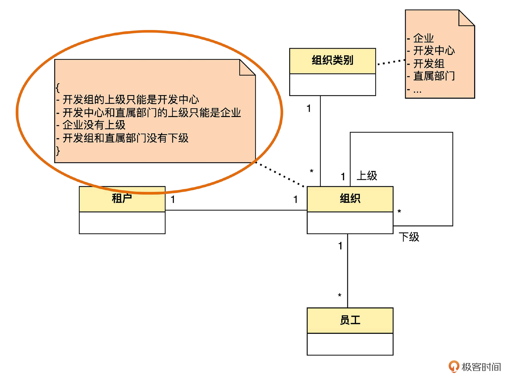

你可能发现了，这个注释和上一个有些区别，它的内容用大括号括起来了。在UML中，用大括号括起来的内容称为“约束”（constraint）。和一般性的注释不同， **凡是约束，必须在程序中的某个地方进行实现**。约束也是一种业务规则，应该加进前面讲过的业务规则表。

不过，细心的你又发现，关于租户还有两个问题没有在这个模型中表达出来。

第一个问题是，没有说明“只有企业才能作为租户，其他类别的组织不能作为租户”；另一个问题是，作为多租户系统，其实每一个实体都应该与租户有一个关联，说明这个实体是属于哪一个租户的，这样才能把不同租户的数据区分开。但是，如果把这些关联都画出来，模型图中的线条就会太多了，变得非常混乱。

于是，你又添加了一个注释和一个约束来说明上面两个问题。有了这个注释，租户和组织上原来的那个关联也可以省去了。如下图：

你看，这个模型既简洁又灵活，解决了我们前面说的员工实体上有多个关联以及组织层级难以扩展这两个问题。

## 识别“多对多”关联

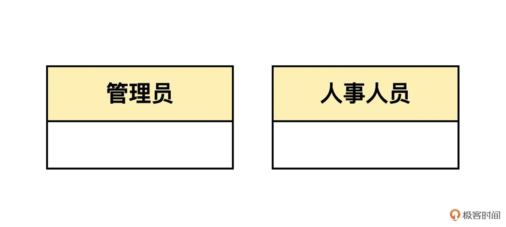

你问我：“管理员和人事人员其实也是员工是吧？”我说：“是。”但这时你可能会纠结，这两个东西到底是不是实体呢？

于是你又问我：“从业务的角度，可不可以认为管理员和人事人员其实都是员工担任的岗位呢？”我说：“这个理解很正确。”于是，你就画出了下面的图：

这个图表示，一个员工可以担任多个岗位，而一个岗位也可以有多个员工担任。 **员工和岗位之间是“多对多”关联**。我表示，这完全符合我对业务的理解。

## 更丰富的“多重性”

现在，我们再看一下多重性问题。前面说过，关联两端的 “1” 或者 “\*” 称为“多重性”。比如说下图中组织和员工之间就是一对多关联：

你还可以问两个问题，把多重性进一步细化。

第一个问题是：“一个组织可以没有任何员工吗？”我回答：“业务上允许先建立一个组织，但暂时不往里面分配任何员工。”那么，你可以在员工那一端的 “\*” 前面加上 “0..”，变成 “0..\*” 。如下图：

这里的 “0..\*” 我们也可以这样理解： **一个组织最少有0个员工，最多可以有很多员工**。

类似地，你可以从关联的另一个方向再问第二个问题：“一个员工可以不属于任何组织吗？”我回答：“不行。一个员工必须属于一个组织。”于是，你把另一端改成了 “1..1” 。

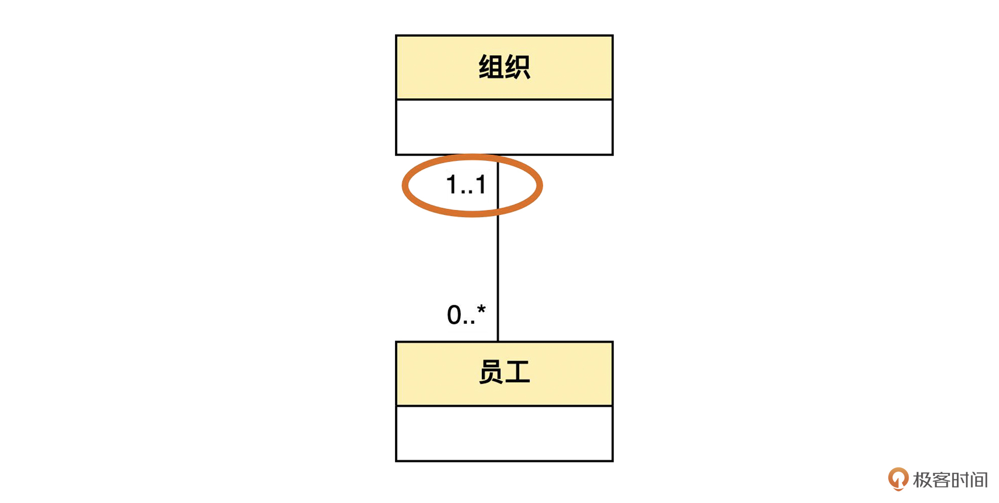

这里的 “1..1” 表示，一个员工最少要属于一个组织，最多也只能属于一个组织。

通过上面的方法，多重性的语义就变得更加丰富了。在实际项目中，团队可以自行决定，把多重性识别得粗一点，只写 “1”和 “\*” ；还是细一点，识别出 “1..1” “0..\*” 等等。一般来说，如果目的是在短时间内大致了解业务概念，就可以做粗一点；如果是为了指导具体的开发，则可以做细一点。在后面的例子中，我们都按照比较细的方法来做。

丰富了多重性以后，整个模型成为了下面的样子：

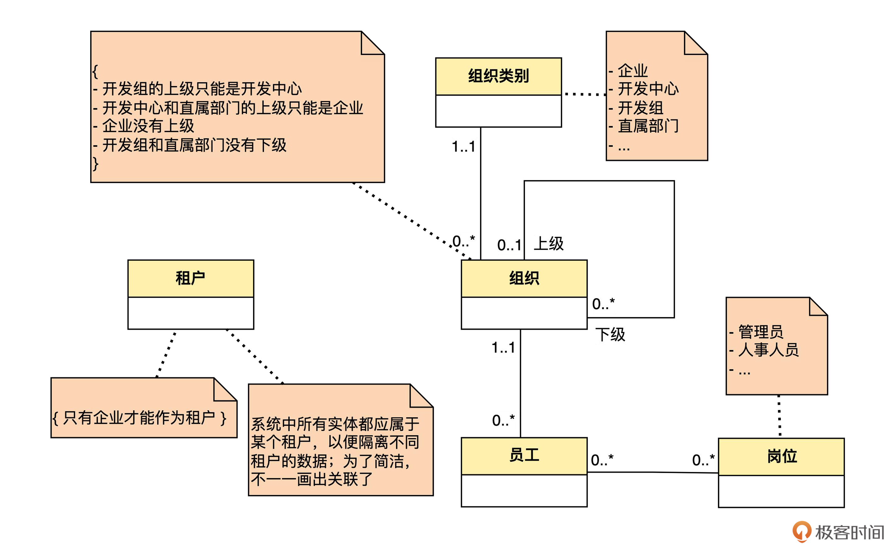

现在，我们终于完成了关于租户、组织和员工的领域模型。这节课就先到这，我们下节课再完成领域模型的其他部分。

## 总结

下面我们总结一下这节课的内容。

我们今天首先解释了用于领域建模的几个基本概念，包括UML、领域对象（domain object）、实体（entity）、类（class）、实例（instance）等。

然后我们从事件风暴识别出的领域名词出发，开始进行领域建模。首先假定每个领域名词都是一个实体。然后识别实体之间的关联。关联可以分为三种：一对一、一对多和多对多。而这些不同的关联，可以用多重性来表达。

假设有A和B两类实体，你可以通过问四个问题，来把多重性搞清楚：

- 一个实体A最多可以对应多少个实体B？
- 一个实体A最少可以对应多少个实体B？
- 一个实体B最多可以对应多少个实体A？
- 一个实体B最少可以对应多少个实体A？

这些问题看起来很“机械”，但对于初学者来说，关联关系是非常容易搞错的。所以如果你还不是很熟练的话，建议你老老实实地问自己这四个问题，一边问，一边把多重性写出来，这样可以保证不出错。

还有一种关联是实体自身上的“自关联”，可以表达由某种实体组成的树状或网状结构。这比一般的关联稍微难理解一些，但熟练以后就容易了。

在建模过程中，我们还可以通过“抽象”，找出领域名词中并没有直接揭示出来的实体。例如把企业、开发中心等抽象成组织和组织类别，把管理员、人事人员等抽象成岗位。这样的模型更能反映出业务的本质，从而更加灵活。通过这种抽象的过程，使模型和业务不仅仅是“形似”，更是“神似”。

我们还可以通过增加注释和约束，使模型中的业务知识更加丰富和准确。其中，约束是一种特殊的注释，它的内容必须以某种形式在代码或数据库中实现。约束也属于我们在之前说的业务规则，需要补充到业务规则表中去。

## 思考题

1.为什么领域建模要由业务人员和技术人员一起协作完成呢？

2.通过抽象思维，可以抓住需求的本质，达到“神似”，你可以在遇到过的实际项目中，举出类似的例子吗？

好，今天的课程结束了，有什么问题欢迎在评论区留言，下节课，我们继续进行领域建模的实践。