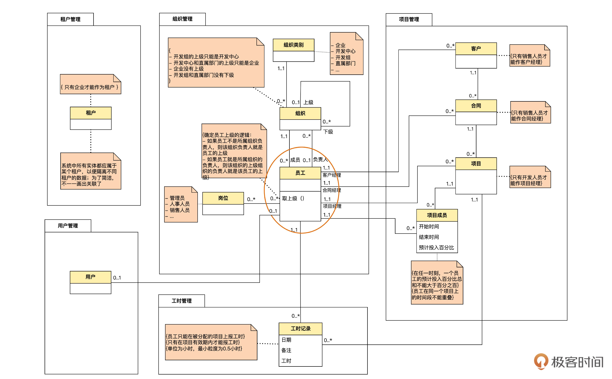
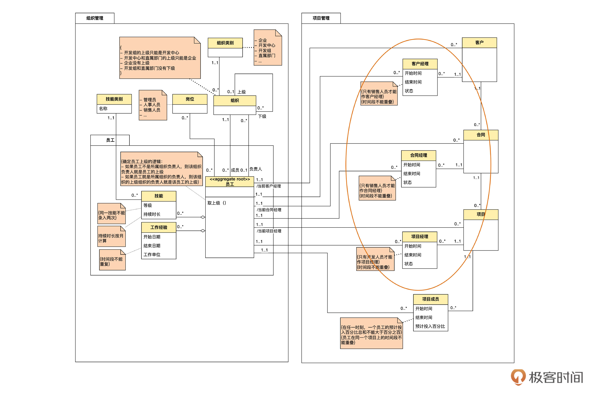
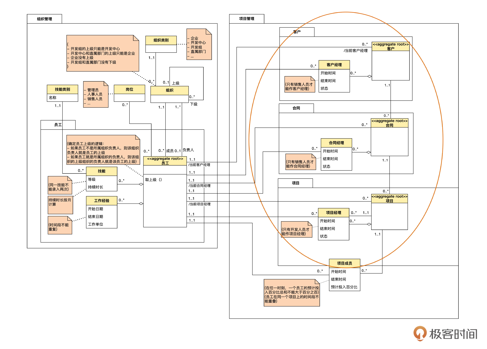

# 14｜聚合的概念：怎样保护业务规则？
你好，我是钟敬。

上节课我们介绍了迭代二的内容和目标。接下来几节课，咱们会通过实现几个新增的功能，学习DDD中的一个重要模式“聚合”（Aggregate)。今天，我们先来理解聚合的概念和领域建模，为我们后面几节课实现聚合打好基础。

到现在为止，我们已经识别出不少业务规则了。不过，其中有一些并不像表面上看起来那么容易维护，有时会被莫名其妙地破坏，而且这种破坏不容易发现。聚合就是保护业务规则的一种有效手段。

## 聚合的概念

现在我们来考虑怎么为 **员工** 的 **工作经验** 和 **技能** 建模。从业务角度，这两者其实都是员工信息的一部分。我们先从迭代一的模型中找到员工实体的位置，如下图。

然后，我们为员工添加上 **工作经验** 和 **技能** 两个实体，如下图。

在图里，我们先暂时忽略掉组织管理以外的其他模块。技能和工作经验与员工都是多对一的关系，这个容易理解。

另外，我们增加了 **技能类别** 实体，用来定义一共有多少种技能。也就是说，可能有Java、SQL、Linux等很多种技能，这些都会定义在 **技能类别** 里面，然后录入员工技能的时候，从列表中选择就可以了。

这里比较关键的问题是和 **技能**、 **工作经验** 有关的两个业务规则。我们先看和技能有关的规则：“同一技能不能录入两次”。比如说，小张给自己录入了一遍“10年，高级Java技能”，那么他就不能再新增一条“5年，中级Java技能”，而只能修改原来那条Java技能，或者删除原来的，再新增一条。这个规则很合理吧？

顺便说一下，这种业务规则在员工的整个生命周期都是有效的，不会有时候有效，有时候又无效了。这种规则在术语上称为“ **不变规则**”（invariant）。

问题在于，在并发的环境下，这个不变规则可能会被破坏。现在咱们想象一下，假设现在小张还没有Java的技能，有两个人事部门的同事A和B同时录入小张的技能。操作顺序是这样的。

1. A查询到小张没有Java技能。
2. 同一时刻，B也查询到小张没有Java技能。
3. A为小张添加Java技能并提交。这时，从A的线程来看，小张还没有Java技能。
4. 在A的线程还没有把数据保存到数据库那一刻，B也提交了小张的Java技能。这时，从B的线程来看，小张也还没有Java技能。
5. A和B的数据都保存到了数据库，这时，数据库中，小张就有了两条Java技能记录，不变规则就被破坏了。

那么，怎么避免破坏不变规则呢？

凡是并发引起的问题，你可能已经想到要用事务和锁了。问题是锁住什么。对于某些不变规则，锁住一条记录就可以解决问题。不过对我们现在这条规则而言，锁住一条技能记录是没有用的，因为新建的时候数据库里还没有记录呢。

问题的关键在于，从业务角度，小张的员工信息作为一个整体，不应该同时被两个人操作。从技术角度来说，不应该被两个线程同时操作。也就是说，只有一个人做完了，另一个人才能做。那么怎样保证这一点呢？

这就需要在一个人操作时，用事务把包含技能在内的员工信息作为一个整体锁起来，等到这个事务提交后，锁被释放，另一个人才能操作。这也可以说成“ **员工和技能都在同一个事务边界之内**”。

我们知道，事务有 ACID 特性。一般说“要么都成功，要么都失败”，说的是 A，也就是原子性（Atomicity），而这里强调的是 I ，隔离性（Isolation），以及 C，一致性（Consistency）。也就是说，事务之间必须相互隔离，不能互相干扰，从而保证数据是一致的。具体的实现方法，我们会在后面的课程讲解。

现在我们归纳一下，员工和技能这两个实体有两个重要特征。

第一， **具有整体与部分的关系**。也就是说，逻辑上，员工信息是整体，而技能信息是员工信息的一部分。

第二， **具有不变规则，而且这种不变规则在并发的时候可能被破坏**。要防止规则的破坏，仅仅锁住一条技能记录是不够的，必须把员工和所有技能作为一个整体锁住才能解决。或者说，员工和他的所有技能确定了一个事务边界。

具有这样特征的一组领域对象，在 DDD 里就叫做一个 **聚合**（Aggregate）。

**工作经验** 和 **员工** 也具有类似的关系。其中，工作经验是员工信息的一部分，这一点容易理解。那么“工作经验的时间段不能重复”这条规则在并发的情况下会怎样被破坏呢？你可以先思考一下，在第16课里我们会讲到。

## 聚合的表示法

下一步，我们把 **员工**、 **技能** 和 **工作经验** 的这种 **聚合** 关系，在领域模型中显式地表达出来，如下图。

让我们看看这个图是怎么表达的。

首先，在员工实体名字上方，我们加了一个 <<aggregate root>> 的标识，中文是聚合根的意思。 **在一个聚合里，像员工这样代表整体的实体就是聚合根。一个聚合只有一个聚合根。**

另外，<<aggregate root>> 外面这个像书名号一样的符号，其实不是书名号，而是两个小于号和两个大于号。这个符号在UML里叫做 stereotype ，中文译作“ **衍型**”。这是UML里用来扩充符号意思的一种机制。

比如说，表示员工实体的方框在UML中本来用来表示“类”。加上<<aggregate root>>以后，就衍生出了“表示聚合根的类”的符号。所谓“衍型”就是“衍生出来的符号类型”。这种机制我们后面还会用到。

再看表示 **员工** 和 **技能** 一对多关联的那条实线。在员工一端，变成了一个空心棱形。这种符号专门表示整体部分关系，有菱形的一端是代表“整体”的对象，另一端是代表“部分”的对象。整体部分关系是关联关系的一种特例。

另外，原来这一端的 “1..1” 被删掉了。因为，对于这种整体部分关系而言，这一端必然是 “1..1”。你可以思考一下为什么。虽然写上 “1..1” 也对，但由于必然是，所以出于简洁的原因，就可以不写了。

最后，我们用一个包把这个 **聚合** 中的类包起来，从而可以一眼看出这个 **聚合** 的边界。一般我们约定， **聚合包的名字和聚合根的名字是一样的**。

## 识别更多的聚合

现在我们继续看一下另外几个需求： **要为客户经理、合同经理以及项目经理保存变更历史**。比如说，要记录在什么时间段，某个客户的客户经理是张三，什么时间段又变成了李四，当前客户经理是哪一位。通过这几个需求看看能否找到更多的聚合。

让我们先看看目前模型的样子。

画红圈的部分就是我们要改进的地方。增加了三个变更信息后，变成下面的样子，看看和你心目中的一不一样？

在这个图里暂时省去了没有直接关系的模块。三个关联是类似的，我们以 **客户经理** 为例来说明。

客户经理的变更信息，实际上是员工和客户之间的一种多对多关联。也就是说，一个员工可以作为多个客户的客户经理，而一个客户，在不同的时间，也可以有多个不同的客户经理。我们在上一个迭代学过，一个多对多可以拆成两个一对多。对于这个需求，客户经理实体就是用来表达这个多对多关联的。

注意到图中“时间段不能重叠”这个不变规则没有？这个规则也是不能仅仅靠锁住一条记录就可以保证的。此外，客户经理的信息，可以看作客户信息的一部分。所以， **客户和客户经理也构成了聚合**。合同经理和项目经理也类似。

这里还有一个小问题。客户和员工之间原来直接的关联还存在，不过角色名由“客户经理”改成了“/当前客户经理”。按理说，客户经理实体中，状态为“有效”的就是当前客户经理，本来不必保留原来这条关联了。

不过，一般来说，业务人员最关心的就是当前客户经理，历史变更信息只在少数情况下才用到。所以，领域专家希望强调 **当前客户经理** 这个概念。因此，我们保留了这个关联。

这个关联是可以由客户经理推导出来的，称为“ **派生关联**”（derived association）。仔细看一下，在“/当前客户经理”前面有一个斜杠。在 UML中，凡是前面有斜杠的，就表示是派生出来的内容。

识别出聚合以后，模型图变成下面的样子。

## 进一步理解聚合概念

现在，相信你对聚合的基本概念和建模技术已经有了一定了解了吧。下面我们再进一步思考一下。

前面我们提到，聚合的两个基本特征是整体部分关系和不变规则。由此又可以得出几个推论。

首先，作为部分的实体，只能属于一个聚合根，不可能属于多个聚合根。比如说，一条技能信息，只能属于一个员工，不能属于多个员工。又比如说，我的手只能是我一个人的手，不能同时又是其他人的手。

其次，我的手是不能“跳槽”的。不能今天是我的手，明天就变成了别人的手。也就是说，一个聚合的一部分，不能再变成其他聚合根的一部分。

再次，由前两条自然可以推出，聚合根被删除，那么聚合中的所有对象都会被删除。

最后，还有一个“标识”的问题。在业务上，为了识别每个实体，实体必然要有一个 **标识**。例如，人的标识，可以是身份证号。如果这个人是学生，那么他的标识也可以是学号。注意，这里说的标识是一个业务概念，而不是技术概念，和数据库表中常见的没有业务概念的ID是不同的。

对于聚合而言， **聚合根要有全局的唯一标识**，而从属于聚合根的实体只需要有局部于聚合的标识。例如，员工是聚合根，员工号是全局标识。而工作经验没有必要进行全局编号，只需要在聚合内部编个号就可以了。例如，001号员工的第 1 份工作经验、第2份工作经验等等。

**我们再来考虑一下聚合的作用。** 聚合最基本的作用，是为一组具有整体部分关系的对象维护不变规则。而当我们掌握了这种建模技术以后，还可以发现其他一些层面的作用。

首先，聚合不仅是“被动地”实现不变规则，它还为我们提供了一个新的视角，可以更细致地和业务人员讨论业务规则。从这个视角去思考过去做过的系统，我们很可能会发现一些遗漏的业务规则。

其次，开发人员过去一般认为事务只是一个技术概念。现在我们可以看到，事务其实是来源于业务规则的，本质上是个业务问题。也就是说，聚合在业务规则和事务之间建立了起联系。

再次，我们在模型上为每个聚合建了一个包，可以认为，聚合是一种特殊的模块。这样，模型的层次就变得更清晰了。同时，我们也可以把 **聚合** 当作一个粗粒度的概念单位进行思考，降低了认知负载。

最后，不少开发人员编程时觉得事务范围的大小不好把握。聚合作为一个事务边界，给出了事务范围的下限，为开发时确定事务范围提供了参考。

## 总结

好，这节课的主要内容就讲完了，下面来总结一下。

聚合是 DDD 里的一个重要模式，主要作用是 **维护不变规则**。如果一组对象具有整体部分关系，并且需要维护整体上的不变规则，那么就可以识别为一个聚合。其中表示整体的那个实体叫做聚合根。

为了在模型中表示聚合，我们使用了叫做<<aggregate root>>的衍型来表示聚合根；在关联上用空心菱形符号表示整体部分关系；并用一个包把聚合包起来，包的名字一般和聚合根的名字相同。另外，在识别客户经理等聚合的时候，我们还介绍了 **派生关联**。

通过整体部分这一特征，我们还可以推出其他几个特征，包括：表示部分的实体只能属于一个聚合，并且不能再变成其他聚合的一部分；聚合根被删除的话，整个聚合的实体都要被删除；聚合根有全局标识，非聚合根实体只有局部标识。

聚合的作用，除了确保不变规则以外，还为我们增加了一个分析业务规则的视角，将业务规则和事务联系起来，增加了模型的清晰度，并且使开发人员更容易确定事务的范围。

## 思考题

1.能否在你的实际项目中找到不变规则的例子，这些规则有没有被恰当地保护起来？

2.仅仅依靠数据库提供的事务机制，可以保证这种不变规则吗？为什么？

好，今天的课程结束了，有什么问题欢迎在评论区留言，下节课，我们开始对今天的模型进行实现。