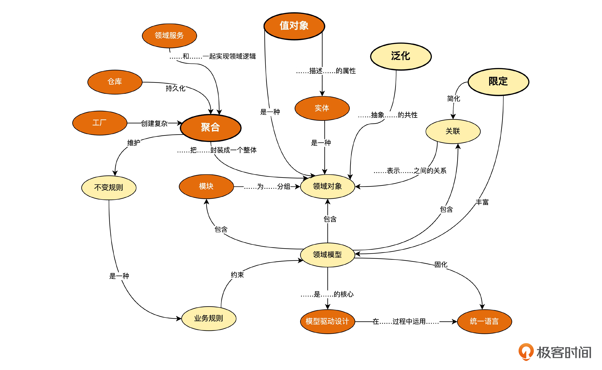
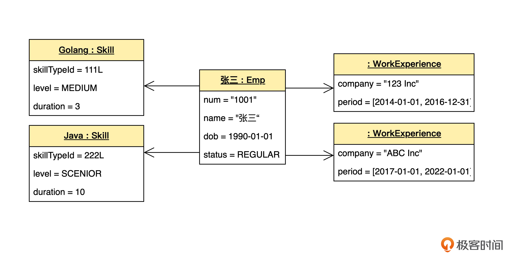
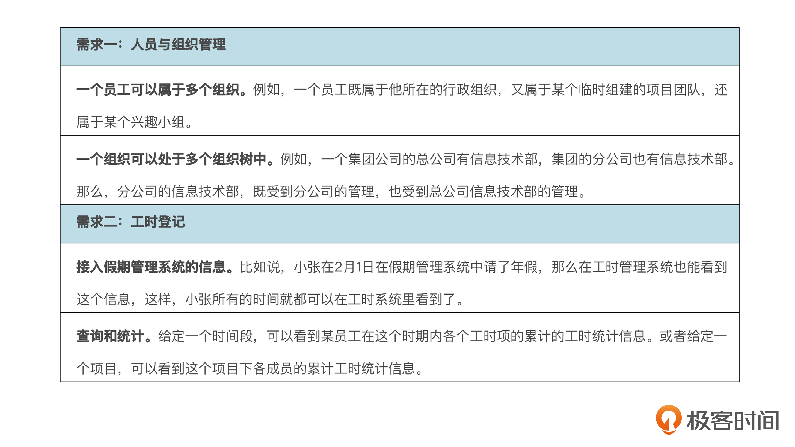

# 27｜迭代三概述：怎样处理规模更大的系统？
你好，我是钟敬。

通过前两个迭代的学习，对于一个开发组范围内的项目，我们应该可以从容应对了。不过随着项目范围变大，逻辑变得更加复杂，还会引出新的挑战，这时候又要如何应对呢？

在接下来的第三个迭代中，我们会结合“卷卷通”公司的新需求进一步思考和实战，深化DDD的相关技能，解决这些问题。

## 迭代二回顾

我们先复习一下迭代二的知识，然后再了解迭代三的内容和需求。

在第二个迭代，我们主要讲了聚合、值对象、限定和泛化，同时补充了一些必要的UML知识。我把迭代一和迭代二的主要模式和实践，合并成下面这张概念图。

橙色的椭圆代表《领域驱动设计》原书中的模式。黄色椭圆表示在书里提过，但没有算作模式的知识点。另外，我把代表迭代二内容的图标放大了一点，这样更加醒目，方便你识别。

### 聚合

聚合（aggregate）是一组有整体部分关系，并且要满足一定不变规则的领域对象，其中只有一个实体表示整体，这个实体叫做聚合根。

聚合的整体与部分是强关联的，也就是一旦聚合根被删除，其他部分必然也被删除。由于这种强关系，所以外界只能通过聚合根来访问非根对象，因此，只有聚合根有业务意义上的全局标识，非聚合根实体只有局部标识。

对于那些单独存在，而不属于其他聚合的实体，可以认为是只有聚合根的、退化的聚合。

在模型图里， **我们可以用<<aggregarte root>>衍型结合菱形符号表示聚合根，并且把聚合相关的实体以及专属于聚合的值对象放在一个包里。**

不变规则，指的是每时每刻都不能打破的规则。如果可以暂时打破，后面再补救，就不算不变规则了。对于聚合整体上的不变规则，需要在聚合根或者和聚合配合的领域服务中维护。

此外，我们还要考虑不变规则在并发的情况下被破坏的情况，这就要用事务把聚合的操作保护起来。所以，聚合决定了事务的最小边界。这种事务常常要用乐观锁或悲观锁来实现。

在编程上，非根实体的增、删、改，一般要由聚合根或者和聚合配合使用的工厂或领域服务来负责，外部不能直接修改非聚合根。为了实现这一点，我们可以将非聚合根的构造器和 setter 设成包级私有权限。此外，聚合根返回非根实体的列表时，应该转换成不可变列表。

《领域驱动设计》原书的第 6.1 节介绍了聚合，你可以去看看。

### 值对象

值对象（value object）通常用来表示实体的属性值。由于值对象是纯粹的概念产物，因此并不存在从创建到消亡的生命周期，在概念上也是不可变的。而另一方面，实体则是现实中的概念，存在从产生到消亡的生命周期，理论上是可变的。

由于实体的属性变了，仍然是这个实体，所以必须具有独立于其他属性的标识，通过这个标识来判断实体的同一性。也就是只要标识一样，哪怕属性变了，这个实体还是这个实体。而值对象是不变的，所以不需要独立于其他属性的标识，而是以所有的属性值作为一个整体来判断同一性。

在模型图上， **可以用 <<value>>衍型来表示值对象。我们还要注意一点，值对象也是要封装领域逻辑的，因此不是 DTO（数据传输对象）。**

值对象的主要优点是在内存和数据库布局上的灵活性，既可以采用共享的方式，也可以采用不共享的方式，这是实体所不具备的。同时，不变性也可以避免程序错误，有利于并发程序的编写和函数式编程。

《领域驱动设计》原书第 5.3 节介绍了值对象。

### 限定

限定（qualification）可以起到简化关联的多重性，丰富模型语义的作用。如果两个实体之间本来是一对多的关系，而某个属性固定后，就可以变成一对一的关系，那么就可以使用限定。

限定在数据库里可以表现为主键和限定属性组成的唯一索引；而在程序里可以用 **Map** 来表示。

《领域驱动设计》原书第 5.1节介绍关联的时候，也同时讲了限定。

### 泛化

泛化（generalization）表示的是分类关系，是领域建模中强大的抽象机制。当我们发现一些对象既有共性又有个性的时候，就可以考虑使用泛化。另一方面，泛化又有可能使模型复杂化，因此，是否使用泛化要经过权衡，可以从简洁性、可理解性、可维护性等方面，想一想使用泛化是否合适。

在模型中， **泛化用空三角箭头来表示**。

在数据库表的设计上，有三种策略：每个类一个表、每个子类一个表、整个泛化体系一个表。这三种策略的选择要考虑多种因素进行权衡。另外，还有共享主键和不共享主键两种关于主键的策略。

在编程上，通常用类的继承或接口的实现来表示泛化。由仓库进行数据库数据到内存数据的转换。仓库屏蔽了不同数据库设计策略的差别。

《领域驱动设计》原书中不少章节（例如第 3.2 节、8.1 节、8.4 节、9.1 节、9.2 节 、10.4 节、10.8 节 、11章、12.1 节、 12.2 节、14.12 节、 16.4 节、16.5 节）的例子都使用了泛化， 但书里并没有章节专门介绍泛化，算是一个小小的缺憾吧。

### UML知识

在 UML 知识方面我们讲了属性和关联的等价性，这个原理在一般的UML书里很少讲到，但对于理解 UML 以及面向对象的原理很有帮助，如果你对这个原理还没什么感觉，可以回头再看看。另外，我们也讲了UML中的一些可省略的部分，这个应该容易理解。

最后，我们还学习了对象图（可以回看 [第19课](https://time.geekbang.org/column/article/623512)），用来表示对象的内存布局。在某些场合，对象图也用来辅助理解领域概念。

## 迭代三的内容

回顾完迭代二的内容，我们继续看看迭代三会学到什么。

### 限界上下文

迭代三里第一个要讲的是“限界上下文”。当系统比较大，开发人员比较多的时候，我们就要考虑模型的拆分了。

限界上下文就是一种通过划分模型边界，分而治之的手段。一个上下文，大体上可以理解为一个子系统。

说到这你可能有点疑问，子系统的概念早就存在了，那么《领域驱动设计》的作者为什么又要提出“限界上下文”这个听起来有点古怪的概念呢？

如果翻翻《领域驱动设计》原书，我们会看到讲限界上下文这一章（第14章）叫做“保持模型的完整性”。为什么这一章不叫“划分模型边界”之类的名字呢？而且，书中把这一章归为“战略设计”，DDD中所谓战略和战术又有什么区别呢（这个问题课程交流群里也有同学问过）？

事实上，限界上下文是化解大型系统的利器，也是架构设计的基础。比如说微服务就可以基于限界上下文来设计。这个迭代，我们将通过限界上下文的建模 、架构设计、代码实现等层面，带你弄清楚限界上下文的概念和用法。

### CQRS

第二个知识点是 CQRS（Command Query Responsibility Segration）。中文可以叫做“命令查询职责分离”。这是一种架构模式，可以和DDD配合起来，处理查询功能。

我们在前两个迭代没有涉及太多查询的内容。这个迭代里，我们会指出仅仅使用领域模型的思路实现查询功能有什么不足，还会讲解怎样通过 CQRS 解决问题。

### 分析模式初探

目前课程里我们已经学到的技能可以解决中等复杂的需求。但如果需求更加复杂，可能需要更抽象的建模技能。这种技能不容易掌握，而分析模式给我们提供了一条掌握抽象复杂建模技能的途径。

我们会通过一个实例，带你理解分析模式是怎样发挥作用的，从而为进一步深入学习奠定基础。

### 实践推广

最后，我们会讨论在实践中推广DDD的一些问题。比如说如何选择 DDD 的切入点，如何选择试点团队，如何改造遗留系统等等。

## 迭代三的挑战和需求

下面，我们把目光投注到“卷卷通”公司，了解一下这个迭代开发团队遇到的新挑战。

### 项目范围扩大的挑战

我们的“卷卷通”产品自推向市场后，受到大量客户的欢迎，市场需求火爆。同时，越来越多的需求，也让系统开始膨胀，团队规模也变大了。由开始的 4、5 个人，发展到了将近 20 个人。这时候团队发现了几个问题。

一是 **系统变得不容易理解了**。过去，每个开发人员都几乎理解系统的所有细节，现在，没有人懂系统的所有部分，有时就会影响后续的工作。

二是 **沟通成本升高了**，由于每个人只了解的系统的一部分，团队成员之间经常发生误解，难以快速达成一致。

三是 **系统的缺陷增加了**。修改系统时常常牵一发而动全身，修改一个部分，不小心就会碰到其他部分，发生意想不到的错误。

不难预测，随着系统规模的进一步增大，这些挑战必然更加严峻，那么团队该怎么办呢？

下面再看一下新的业务需求。

### 需求一：人员和组织管理

在人员和组织管理方面，由于使用我们系统的企业多种多样，需求变得非常灵活。

第一个需求是，员工可以属于多个组织。比如说对于一些矩阵式管理的企业，一个员工既属于他所在的行政组织，又属于某个临时组建的项目团队，还属于某个兴趣小组。

第二个需求是，一个组织可以处于多个组织体系里。比如说，一个集团公司的总公司有信息技术部，集团的分公司也有信息技术部。那么，分公司的信息技术部，既受到分公司的管理，也受到总公司信息技术部的管理。这时候，分公司信息技术部就处在两个组织体系，或者说两颗组织树里面了。

### 需求二：工时管理

在工时管理方面，又新增了两个需求。

第一个需求是，接入假期系统信息。有一些企业有专门的假期管理系统，他们希望把员工休假信息也纳入工时管理。比如说，小张在2月1日休了年假，那么在工时管理系统也能看到这个信息，这样，小张花费的所有时间就都可以在工时系统里看到了，也便于相关部门进行各种统计分析。

第二个需求是，查询和统计。比如说，给定一个时间段，可以看到某员工在这个时期内各个工时项的累计工时信息。或者给定一个项目，可以看到这个项目下各成员的累计工时信息。

我把上面的需求汇总到一张表里，你可以看一下，方便后面的实战。

## 总结

今天的内容告一段落，我们来总结一下。

通过对第二个迭代的内容回顾，我们复习了不少知识点，包括聚合、值对象、限定、泛化以及补充的 UML 知识。我也给你列出了原书中对应的章节号，以便你在课后对照阅读，加深理解。

而迭代三的主要内容，包括限界上下文、CQRS、分析模式，以及实践和推广 DDD 中的一些具体问题。其中限界上下文和分析模式用于范围更大、需求更灵活的系统。CQRS是用于处理查询需求的架构模式。

为了帮你更好地消化这些新内容，我们在这个迭代里引入了一些新挑战和新需求。针对这些新需求，你不妨自己先想想怎样建模，怎样写代码。在后面的学习过程中，再对比一下我们的课程是怎么讲的，这样你的理解会更加深刻。

## 思考题

下面我给你留了两道思考题。

1.你以前听说过限界上下文吗？如果听说过，说说你的理解。

2.你是否已经在实践中尝试过 DDD？如果有，说说你遇到过哪些困难，如果没有，说说你现在有哪些顾虑。

好，今天的课程结束了，有什么问题欢迎在评论区留言，下节课，我们开始讨论限界上下文。