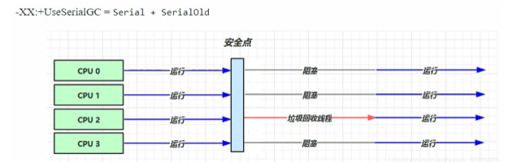
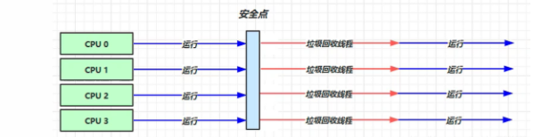
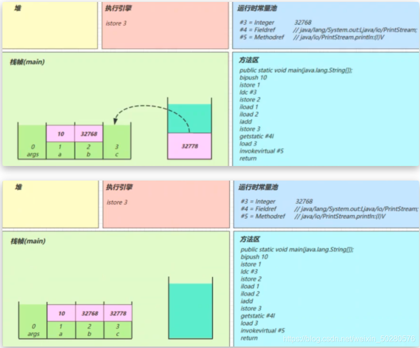
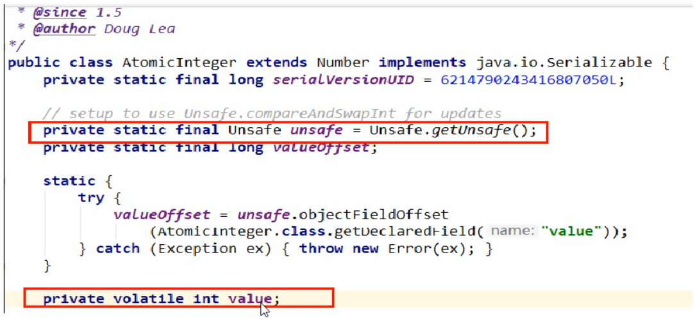

# 引言

jvm：Java虚拟机，Java二进制字节码的运行环境

优点：

- 一次编写，到处运行

- 自动内存管理，垃圾回收功能

- 数组下标越界检查

- 多态

# 内存结构

## 1，程序计数器

本质为一个寄存器

**作用：** 记录下一条jvm指令的执行地址

**每一个线程都有属于自己的线程计数器，会记录要执行的jvm指令行数。在切换到该线程时，从程序计数器读取该线程执行的行数**

**特点：**

- 线程私有的，即每一个线程都有属于自己的程序计数器
- 不会存在内存溢出

## 2，栈

### **定义：**

虚拟机栈：线程运行需要的内存空间

- 每个线程运行时所需要的内存，称为虚拟机栈
- 每个栈由多个栈帧（Frame）组成，对应着每次方法调用时所占用的内存    **一个方法即一个栈帧，执行时压入到虚拟机栈，执行完弹出**
- 每个线程只能有一个活动栈帧，对应着当前正在执行的那个方法

栈帧中包括：

参数，局部变量表、操作数栈，返回地址

问题辨析
1. 垃圾回收是否涉及栈内存？

   不涉及，因为栈内存仅仅是方法调用占用的内存，不需要进行垃圾回收。垃圾回收只回收堆内存。

2. 栈内存分配越大越好吗？
   不是，栈内存分配越大，反而会让线程数变少。 因为物理内存大小是一定的。

3. 方法内的局部变量是否线程安全？

   ​	如果方法内局部变量没有逃离方法的作用访问，它是线程安全的（方法内没有传入参数并且局部变量没有作为返回值返回（即局部变量的作用域只作用在该方法内），则安全）

   ​	如果是局部变量引用了对象，并逃离方法的作用范围，需要考虑线程安全（局部变量为传入的参数，或者有局部变量返回，则不安全）


### 栈内存溢出

Stack Overflow

- 栈帧过多导致栈内存溢出

- 栈帧过大导致栈内存溢出

## 3，本地方法栈

使用native[标识符](https://so.csdn.net/so/search?q=标识符&spm=1001.2101.3001.7020)修饰的方法就是本地方法

在定义一个native method时，并不提供实现体（有些像定义一个java interface），因为其实现体是由非java语言在外面实现的。

本地接口的作用是融合不同的编程语言为java所用，它的初衷是融合C/C++程序。

- java虚拟机栈用于管理java方法的调用，而本地方法栈用于管理本地方法的调用
- 本地方法栈，也是线程私有的
- 本地方法是使用C语言实现的

## 4，堆


### 定义：

**通过 new 关键字，创建对象都会使用堆内存**。

jdk1.7开始，**静态变量，字符串常量池放在堆中**。便于垃圾回收。

**元空间使用的是直接内存**

特点

- 它是线程共享的，堆中对象都需要考虑线程安全的问题
- 有垃圾回收机制

### 堆内存溢出

java.lang.OutofMemoryError ：java heap space. 堆内存溢出
可以使用 -Xmx8m 来指定堆内存大小。

### 堆内存诊断

1. jps 工具
   查看当前系统中有哪些 java 进程
2. jmap 工具
   查看堆内存占用情况 jmap - heap 进程id
3. jconsole 工具
   图形界面的，多功能的监测工具，可以连续监测
4. jvisualvm 工具

## 5，方法区

### 1，定义

Java 虚拟机有一个在所有 Java 虚拟机线程之间共享的方法区域。**它存储每个类的结构**，例如**运行时常量池、字段和方法数据，以及方法和构造函数的代码，包括特殊方法，用于类和实例初始化以及接口初始化方法区域是在虚拟机启动时创建的。**本质上是与类相关的代码

尽管方法区域在逻辑上是堆的一部分，但是简单的实现可能不会选择垃圾回收或压缩它。方法区域可以具有固定的大小，或者可以根据计算的需要进行扩展，并且如果不需要更大的方法区域，则可以收缩。方法区域的内存不需要是连续的。

### 组成

Hotspot 虚拟机 jdk1.6 1.7 1.8 内存结构图

方法区在jdk1.6时，在永久代中。**堆中**

方法区在jdk1.8时，在元空间中。**本地内存中**


### 5.3方法区内存溢出

- 1.8 之前会导致永久代内存溢出
  - 使用 -XX:MaxPermSize=8m 指定永久代内存大小
- 1.8 之后会导致元空间内存溢出
  - 使用 -XX:MaxMetaspaceSize=8m 指定元空间大小

### 5.4运行时常量池

.class文件的常量池是不够的，需要一个运行时常量池为JVM服务，与.class文件的常量池一一对应。

二进制字节码包含（类的基本信息，常量池，类方法定义，包含虚拟机的指令）

class二进制文件使用 javap -v Test.class 命令反编译查看结果。


每条指令都会对应常量池中的一个地址，常量池中的地址可能对应一个类名，方法名，参数名，等信息


- 常量池，就是一张表，虚拟机指令根据这张常量表找到要执行的类名、方法名、参数类型、字面量等信息
- 运行时常量池，常量池是 *.class 文件中的，**当该类被加载，它的常量池信息就会放入运行时常量池，并把里面的符号地址变为真实地址**，即每个类的常量池不一样

### 5）StringTable（串池）

StringTable底层实现为hashTable，通过数组+链表的形式实现

**StringTable为一个HashTable结构，key为一个字符串，value为一个String对象的引用，String对象存放在堆中。在代码运行时，会自动生成一个空的StringTable 。**

- 常量池中的信息，都会被加载到运行时常量池，创建的字符串变量仅仅是符号，只有在被用到时才会转化为对象，
  并将其加入到串池
- 利用串池的机制，来避免重复创建字符串对象
  - 字符串变量拼接的原理是StringBuilder
    String3 = String1+String2 
    jvm的调用为new StringBuilder().append(String1).append(String2).toString()  	
  - 而toString方法实际是new String（变量）创建一个新的字符串，**即在堆中**
- 字符串**常量**拼接的原理是编译器优化
- **可以使用intern方法，主动将串池中还没有的字符串对象放入串池中**

intern方法 JDK 1.8

调用字符串对象的 intern 方法，会将字符串对象引用放入串池

- 如果串池中没有该字符串对象，则放入成功
- 如果串池中有，则放入不成功

**无论是否放入成功，都会返回串池中的对象**

注意：此时如果调用 intern 方法成功，堆内存与串池中的字符串对象是同一个对象；如果失败，则不是同一个对象

### 6）StringTable 的位置

jdk1.6中，StringTable位置是在永久代中。

jdk1.8中，**StringTable位置在堆中**

### 7）StringTable 垃圾回收

-Xmx10m 指定堆内存大小
-XX:+PrintStringTableStatistics 打印字符串常量池信息
-XX:+PrintGCDetails
-verbose:gc 打印 gc 的次数，耗费时间等信息

### 8）StringTable 性能调优

- StringTable 使用HashTable来实现，所以适当增加HashTable桶的个数（即容量），来减少字符串所需要的的时间。**本质是避免哈希碰撞**

```Java
-XX:StringTableSize=桶个数（最少设置为 1009 以上）
```

- 考虑将一些字符串对象入池，（串池为hashTable，可以去重）

  可以通过 intern 方法减少重复入池

## 6、直接内存

### 1）定义

Direct Memory

- 常见于NIO操作时，用于数据缓冲区
- 分配回收成本较高，但读写性能高
- 不受JVM内存回收管理

### 2）使用直接内存的好处


因为在Java不能直接操作文件，需要向操作系统发出请求，由操作系统进行操作。然后读取磁盘文件，并会在系统内存中创建一个缓存区，将文件加载进来。然后再复制到Java堆内存。然后Java再对其进行操作。

复制了两次。时间花费巨大

**使用了 DirectBuffer 文件读取流程**


直接内存是操作系统和Java都可以访问的一块缓冲区，减少了从系统内存复制到Java堆内存的过程，提高了效率

### 3）直接内存回收原理

直接内存也可以进行回收，但不是调用jvm的垃圾回收来释放的。而是通过unsafe.freeMemory来手动释放。

**直接内存的回收机制总结**

- 使用了Unsafe类来完成直接内存的分配回收，回收需要主动调用freeMemory方法
- ByteBuffer的实现内部使用了Cleaner（虚引用）来检测ByteBuffer。一旦ByteBuffer被垃圾回收，则会由ReferenceHandler（守护线程）来调用Cleaner的clean方法调用freeMemory来释放内存。


一般用 jvm 调优时，会加上下面的参数：

```Java
-XX:+DisableExplicitGC  // 禁用显示的GC垃圾回收
```

意思是禁止我们手动System.GC（）,使其无效。

System.GC（）： 手动垃圾回收

它是一种完全的GC，则会回收新生代，老年代，会造成程序执行时间过长。

直接内存：

**我们就通过unsafe对象调用freeMemory的方式来释放直接内存**

# 2.垃圾回收

一般都是在空间不足时触发

## 1、如何判断对象可以回收

### 1）引用计数法

当一个对象被引用时，就引用对象的值+1，为0时，表示该引用对象不被引用，可以被垃圾回收器回收。


### 2）可达性分析算法

- JVM中的垃圾回收器通过可达性分析来探索所有存活的对象
- 扫描堆中的对象，看能否沿着GC Root对象作为起点的引用链来找到该对象，如果找不到，则表示可以回收
- GC Root对象
  - 虚拟机栈（栈帧中的本地变量表）中引用的对象
  - 本地方法中JNI（即一般说的Native方法）引用的对象
  - 方法区中类静态属性引用的对象
  - 方法区中常量引用的对象
  - **所有被同步锁持有的对象**

### 3）四种引用

强引用，软引用。。。这些引用也是一个对象。图中的A1，A2,....都是引用对象所引用的对象


1. 强引用   
   只有在所有GC root对象都不通过强引用对象 引用，则该对象才能被垃圾回收。（即**强引用不回收，宁可内存溢出也不回收。**）
   **场景：new一个对象时是强引用**

2. 软引用
   在没有强引用对象引用，该对象只有软引用时，在垃圾回收后，内存仍不足时才会垃圾回收该软引用对象。
   回收软引用对象可以配合引用队列来释放软引用自身
   **场景：可用于图片缓存中，内存不足时系统会自动回收不再使用的Bitmap；**

3. 弱引用
   在没有强引用引用该对象，只有弱引用时，无论是否内存充足，都会垃圾回收该弱引用对象。
   可以配合引用队列来释放弱引用自身
   **场景：同样可用于图片缓存中，这时候只要Bitmap不再使用就会被回收；**

4. 虚引用

   虚引用等价于没引用。随时都可以被垃圾回收

   必须配合引用队列使用，主要配合ByteBuffer使用，被引用对象回收时，会将虚引用入队，由 Reference Handler 线程调用虚引用相关方法释放直接内存

   **场景：为了查看该对象什么时候进行垃圾回收，才使用须引用，因为在垃圾回收时，会发送一个通知**

5. 终结器引用
   无需手动编码，在其内部配合引用队列使用，在垃圾回收时，终结器引用入队（被引用对象暂时没有被回收），再由Finalizer线程通过终结器引用找到被引用对象并调用它的finalize方法。第二次GC时才能回收被引用对象.

关联了引用队列，当引用所关联的 byte[] 被回收时，软引用自己会加入到 队列中去

ArrayList<SoftReference<byte[]>> list = new ArrayList<>();


**软引用示例**

```java 
/**
 * 演示 软引用
 * -Xmx20m -XX:+PrintGCDetails -verbose:gc
 */
public class Code_08_SoftReferenceTest {

    public static int _4MB = 4 * 1024 * 1024;

    public static void main(String[] args) throws IOException {
        method2();
    }

    // 设置 -Xmx20m , 演示堆内存不足,
    public static void method1() throws IOException {
        ArrayList<byte[]> list = new ArrayList<>();

        for(int i = 0; i < 5; i++) {
            list.add(new byte[_4MB]);
        }
        System.in.read();
    }

    // 演示 软引用
    public static void method2() throws IOException {
        ArrayList<SoftReference<byte[]>> list = new ArrayList<>();
        for(int i = 0; i < 5; i++) {
            SoftReference<byte[]> ref = new SoftReference<>(new byte[_4MB]);
            System.out.println(ref.get());
            list.add(ref);
            System.out.println(list.size());
        }
        System.out.println("循环结束：" + list.size());
        for(SoftReference<byte[]> ref : list) {
            System.out.println(ref.get());
        }
    }
}
```

method1 方法解析：

首先设置堆内存大小为20M，运行method1方法，会抛出异常，因为堆内存不足。mothod1中的list都是强引用。无法垃圾回收


method2方法解析：

list结合加入了软引用对象，即创建的是软引用对象所引用的对象。则在4次后发生内部不足，无法进行第5次创建对象，则进行了新生代垃圾回收。回收后依然不足，最终进行垃圾全回收。包括新生代和老年代。最终得以常见第5个对象。但是前几个对象已经被回收。变为null


## **方法区的垃圾回收**

**方法区的垃圾回收分为两种：字符串的垃圾回收以及类的卸载**

## 2、垃圾回收算法

### 1）标记清除

扫描堆中的对象，看能否沿着GC Root对象作为起点的引用链来找到该对象，如果找不到，则表示可以回收。

一阶段：

首先根据可达性分析算法分析是否可以回收。若可以回收，则进行标记。

二阶段：清除

经标记的空间进行释放。

**特点：**

标记和清除两个过程的效率都不高，会产生内存碎片（缺点）。

### 2）标记整理

一阶段：标记

首先根据可达性分析算法分析是否可以回收。若可以回收，则进行标记。

二阶段：整理

清除垃圾内存，并将内存进行整理移动


**特点：**

速度慢，没有内存碎片

### 3）复制

将不用回收的内存空间复制到一块同样大小的内存中。其后的垃圾操作都在这块内存中进行操作。原来的内存进行回收。

特点：

- 不会有内存碎片
- 需要占用两倍内存空间

## 3、分代垃圾回收

垃圾回收，并不是只选择一种算法进行回收，而是三种方法交替使用。


垃圾回收，会将堆内存区分为新生代和老年代。

新生代：新创建的对象

老年代：创建了一直在使用的对象

幸存区from和幸存区to同等大小，除了在垃圾回收算法应用时，幸存区to不存放内容

**分代垃圾回收流程**

1. 新创建的对象首先分配在eden（伊甸园）区
2. 新生代空间不足时，触发minor gc，eden区和from区存活的对象使用-copy复制到to中，存活的对象年龄加1，然后交换幸存区from和幸存区to
3. minor gc会引发stop the world，暂停其他线程，等待垃圾回收结束后，恢复用户线程运行。（因为内存中的数据会发生移动，若还按之前的进行操作，势必造成混乱）
4. 当幸存区对象的寿命超过阈值，会晋升到老年代，最大的寿命是15（4bit）
5. 当老年代空间不足时，会先触发minor gc，如果空间仍然不足，那么**触发full gc（只作用于老年代）**，full gc也会引发stop the world，停止的时间更长。


当幸存区对象的寿命超过阈值，会晋升到老年代**是并非绝对的**

- 在一次次的加入数据，新生代实在没有空间存在数据时，会将一些数据存放在老年代中，不管是否超过阈值。
- 另外，开始存入的数据，直接超过了新生代的容纳空间，也可以直接放入老年代。而且并不触发垃圾回收。

一个线程内的线程溢出并不会影响其他线程的运行。

### ==1）相关 JVM参数==

含义 								参数
堆初始大小					 -Xms
堆最大大小 					-Xmx 或 -XX:MaxHeapSize=size
新生代大小					 -Xmn 或 (-XX:NewSize=size + -XX:MaxNewSize=size )
幸存区比例（动态） 	-XX:InitialSurvivorRatio=ratio 和 -XX:+UseAdaptiveSizePolicy
幸存区比例 					-XX:SurvivorRatio=ratio
晋升阈值 						-XX:MaxTenuringThreshold=threshold
晋升详情 						-XX:+PrintTenuringDistribution
GC详情 						   -XX:+PrintGCDetails -verbose:gc
FullGC 前 MinorGC 	   -XX:+ScavengeBeforeFullGC
禁止运行期显式地调用System.gc()来触发fulll GC。 -XX:+DisableExplicitGC


- -Xms2g：初始化推大小为 2g；
- -Xmx2g：堆最大内存为 2g；
- -XX:NewRatio=4：设置年轻的和老年代的内存比例为 1:4；
- -XX:SurvivorRatio=8：设置新生代 Eden 和 Survivor 比例为 8:2；
- –XX:+UseParNewGC：指定使用 ParNew + Serial Old 垃圾回收器组合；
- -XX:+UseParallelOldGC：指定使用 ParNew + ParNew Old 垃圾回收器组合；
- -XX:+UseConcMarkSweepGC：指定使用 CMS + Serial Old 垃圾回收器组合；
- -XX:+PrintGC：开启打印 gc 信息；
- -XX:+PrintGCDetails：打印 gc 详细信息。

## 4、垃圾回收器

- 并行收集：指多条垃圾收集线程并行工作，但此时用户线程仍处于等待状态。
- 并发收集：指用户线程与垃圾收集线程**同时**工作（不一定是并行的可能会交替执行）。用户程序在继续运行，而垃圾收集程序运行在另一个 CPU核上
- 吞吐量：即 CPU 用于运行用户代码的时间与 CPU 总消耗时间的比值（吞吐量 = 运行用户代码时间 / ( 运行用户代码时间 + 垃圾收集时间 )），也就是。例如：虚拟机共运行 100 分钟，垃圾收集器花掉 1 分钟，那么吞吐量就是 99% 。
  

### 1）串行

- 单线程，
- 堆内存较少，适合个人电脑

开启串行回收器

```Java
-XX:+UseSerialGC=serial + serialOld
```



**安全点：**让其他线程都在这个点停下来，来避免因为垃圾回收时内存数据移动，使得其他线程找不到原来的数据

**Serial 收集器**
Serial 收集器是最基本的、发展历史最悠久的收集器

**特点：**

单线程，简单高效，采用**复制算法，**对于限定单个CPU的环境来说，Serial收集器由于没有线程交互的开销，专心做垃圾回收，所以单线程垃圾回收效率可以达到最高。单线程进行垃圾回收时，必须**暂停其他所有的工作线程，直到结束**

**Serial Old 收集器**
Serial Old 是 Serial 收集器的老年代版本
**特点**：

同样是单线程收集器，采用**标记-整理算法**

**ParNew 收集器**

ParNew收集器是Serial 收集器的多线程版本

**特点：**

多线程，ParNew收集器默认开启的手机线程数与CPU的数量相同，在CPU非常多的环境中，可以使用 -XX:ParallelGCThreads参数来限制垃圾收集的线程数。和 Serial 收集器一样存在 Stop The World 问题。

### 2）吞吐量优先

- 多线程
- 堆内存较大，多核CPU
- 让单位时间内，STW（stop the world）的时间最短  可以理解为程序运行中stw总的时间最短，而不是单次最短

```Java
-XX:+UseParallelGC ~ -XX:+UsePrallerOldGC
//开启此标志，会将新生代中的幸存区和伊甸园区的比例动态调整
-XX:+UseAdaptiveSizePolicy
//调整垃圾回收时间与程序总运行时间的占比 ，jvm尝试调整垃圾回收尽量达到此占比
-XX:GCTimeRatio=ratio // 1/(1+radio)
//默认是垃圾回收的STW暂停时间，默认200ms
-XX:MaxGCPauseMillis=ms // 200ms
-XX:ParallelGCThreads=n

```

**采用标记-整理算法**



**Parallel Scavenge   收集器**     /ˈskævɪndʒ/    并行清除垃圾回收器

与吞吐量关系密切，也称为吞吐量优先收集器

**特点：**

属于新生代收集器也可以采用复制算法的收集器（即用在幸存区），又是并行的多线程收集器

该收集器的目标是达到一个可控制的吞吐量。

**GC自适应调节策略**（与parNew收集器最重要的一个区别）

Parallel Scavenge 收集器可设置 -XX:+UseAdptiveSizePolicy 参数，**打开开关自动调整新生代中，伊甸园区域幸存区的比例、晋升老年代的对象年龄**（-XX:PretenureSizeThreshold）等。

**虚拟机会根据系统的运行状况收集性能（怀疑打错了：系统）的监控信息，动态设置这些参数以提供最优的停顿时间和最高的吞吐量。**

Parallel Scavenge 收集器使用两个参数控制吞吐量：

- XX:MaxGCPauseMillis=ms 控制最大的垃圾收集停顿时间（默认200ms）
- XX:GCTimeRatio=rario 直接设置吞吐量的大小

**Parallel Old 收集器**
是 Parallel Scavenge 收集器的老年代版本
**特点**：多线程，采用标记-整理算法（老年代没有幸存区）

### 3）响应时间优先

- 多线程
- 堆内存较大，多核CPU
- 尽可能让STW的单次时间最短


并发运行：用户执行线程与垃圾回收线程并发执行。

**CMS收集器：**一种以最短停顿时间为目标的老年代收集器

**特点：**基于标记-清除算法实现。并发收集，低停顿，但会产生内存碎片

应用场景：适用于注重服务的响应速度，希望系统停顿时间最短，给用户带来更好的体验。如web程序，b/s服务

**CMS 收集器的运行过程分为下列4步：**

**初始标记：**标记GC Roots 能直接到的对象，速度很快但是存在Stop the word问题

**并发标记：**进行GC Roots Tracing的过程，找出存活对象并且用户线程可并发执行

**重新标记：**为了修正并发标记期间因用户程序继续运行而导致标记产生变动的那一部分对象的标记记录。仍然存在Stop the World问题

**并发清除:**对标记的对象进行清除回收，清除的过程中，可能仍然还有新的垃圾产生，这些垃圾就叫浮动垃圾。如果当用户需要存入一个很大的对象时，新生代放不下去，老年代由于浮动垃圾过多，就会退化为serial Old收集器，将老年代垃圾进行标记-整理。


**感觉垃圾回收器上述十分混乱**

## 4 垃圾收集器

**并行：**指多条垃圾收集线程并行工作，但此时用户线程仍然处理等待状态

**并发：**指用户线程与垃圾收集线程同时执行（并非是并行，也可是能交替执行），用户程序继续执行，而垃圾收集器运行在另一个CPU上。

### 4.1 Serial 收集器

 Serial 收集器：串行收集器。

新生代使用标记-复制算法，老年代采用标记-整理算法。

**单线程收集器：**只有一条垃圾收集线去完成垃圾收集工作，而且在进行垃圾收集工作时们需要暂停其他所有的工作线程（stop the world），直到收集结束。

**优点：**简单高效（与其他收集器的单线程相比），因为Serial收集器没有线程交互的开销，所以单线程最高。

Serial 收集器对于运行在 Client 模式下的虚拟机来说是个不错的选择。


### 4.2.Serial Old 收集器

**Serial 收集器的老年代版本**，同样是单线程收集器，两个用途：

一种用途是在JDK1.5以及以前的版本中与 Parallel Scavenge 收集器搭配使用，另一种用途是作为 CMS 收集器的后备方案。

### 4.3 ParNew 收集器

新生代使用标记-复制算法，老年代采用标记-整理算法

ParNew收集器本质是Serial收集器的多线程版本，除了使用多线程处理以外，其他一样。

它是许多运行在 Server 模式下的虚拟机的首要选择，

### 4.4 Parallel Scavenge 收集器

Parallel Scavenge 收集器使用标记-复制算法的多线程收集器。

新生代使用标记-复制算法，老年代采用标记-整理算法

Parallel Scavenge 收集器关注点是**吞吐量（高效率的利用CPU）**。CMS等垃圾收集器的关注点主要在用户线程的停顿时间。**吞吐量是CPU用于运行用户代码的时间与CPU总消耗的时间的比值。也可以理解为STW停顿时间在程序运行的总的时间占比很小**

**这是 JDK1.8 默认收集器**


### 4.5 Parallel Old 收集器

 Parallel Scavenge 收集器的老年代版本。使用多线程和`标记-整理`算法。

着重于吞吐量以及CPU资源的情况下，可以选择优先考虑 Parallel Scavenge 收集器和 Parallel Old 收集器。

### 4.6 CMS 收集器

==CMS收集器是老年代的收集器==

CMS收集器是一种以获取**最短停顿时间**为目标的收集器。它适用于注重用户体验的应用上。

**CMS实现了垃圾收集线程与用户线程同时工作，并发**

**使用“标记-清除”算法实现**

四个步骤：

**初始标记：**暂停所有的其他线程，只是记录下GC roots的直接连接对象。时间很短

**并发标记：**开始从GC roots 直接关联对象变量整个对象图，标记不用垃圾回收的对象。但在这个阶段结束，并不能保证包含所有的可达对象。因为用户线程可能会不断的更新引用域，所以GC 线程无法保证可达性分析的实时性。所以这个算法会跟踪记录这些发生引用更新的地方。

**重新标记：**重新标记阶段是为了修正并发标记期间因为用户程序继续运行而导致标记产生变动的那一部分。这个阶段的停顿时间一般会比初始标记阶段的时间稍长，远远比并发标记阶段时间短。

**并发清除：**开启用户线程，同时GC线程开始大于为标记的区域进行清扫。


对没有标记的对象进行清除回收，清除的过程中，可能仍然还有新的垃圾产生，这些垃圾就叫浮动垃圾。

如果当用户需要存入一个很大的对象时，新生代放不下去，老年代由于浮动垃圾过多，造成**并发失败**。垃圾收集器会退化为serial Old收集器，将老年代垃圾进行标记-整理。**并发失败会使的停顿时间很长**

优点：

**并发收集、低停顿**。

缺点：

- **对 CPU 资源敏感；**
- **无法处理浮动垃圾；**
- **它使用的回收算法-“标记-清除”算法会导致收集结束时会有大量空间碎片产生。**


### 4.7 G1回收器

Garbage First  （读音：噶壁纸 one ）

JDK9中，替换了CMS，作为新的默认垃圾回收器，为**并行的垃圾回收器**


G1（Garbage-First），它是一款面向服务端应用的垃圾收集器，在多 CPU 和大内存的场景下有很好的性能。HotSpot 开发团队赋予它的使命是未来可以替换掉 CMS 收集器。

堆被分为新生代和老年代，其它收集器进行收集的范围都是整个新生代或者老年代，而 G1 可以直接对新生代和老年代一起回收。

[](https://camo.githubusercontent.com/28712794ed2119169d543cf480dea5072e62cec8c6e8f921b71803cf6cb7bf1d/68747470733a2f2f63732d6e6f7465732d313235363130393739362e636f732e61702d6775616e677a686f752e6d7971636c6f75642e636f6d2f34636637313161382d376162322d343135322d623835632d6435633232363733333830372e706e67)


G1 把堆划分成多个大小相等的独立区域（Region），新生代和老年代不再物理隔离。

[](https://camo.githubusercontent.com/ffb4cb91bfdaafef8b38257b244aec0f9270b858d08b68f3e3215afe7e679090/68747470733a2f2f63732d6e6f7465732d313235363130393739362e636f732e61702d6775616e677a686f752e6d7971636c6f75642e636f6d2f39626264646565622d653933392d343166302d386538652d3262316130616137653061372e706e67)


通过引入 Region 的概念，从而将原来的一整块内存空间划分成多个的小空间，使得每个小空间可以单独进行垃圾回收。这种划分方法带来了很大的灵活性，使得可预测的停顿时间模型成为可能。通过记录每个 Region 垃圾回收时间以及回收所获得的空间（这两个值是通过过去回收的经验获得），并维护一个优先列表，每次根据允许的收集时间，优先回收价值最大的 Region。

每个 Region 都有一个 Remembered Set，用来记录该 Region 对象的引用对象所在的 Region。通过使用 Remembered Set，在做可达性分析的时候就可以避免全堆扫描。

[](https://camo.githubusercontent.com/e3b1e67b58e1d4ffd8acc8a17ba04768278597178b955e4102555273337acc05/68747470733a2f2f63732d6e6f7465732d313235363130393739362e636f732e61702d6775616e677a686f752e6d7971636c6f75642e636f6d2f66393965653737312d633536662d343766622d393134382d6330303336363935623566652e6a7067)


如果不计算维护 Remembered Set 的操作，G1 收集器的运作大致可划分为以下几个步骤：

- 初始标记
- 并发标记
- 最终标记：为了修正在并发标记期间因用户程序继续运作而导致标记产生变动的那一部分标记记录，虚拟机将这段时间对象变化记录在线程的 Remembered Set Logs 里面，最终标记阶段需要把 Remembered Set Logs 的数据合并到 Remembered Set 中。这阶段需要停顿线程，但是可并行执行。
- 筛选回收：首先对各个 Region 中的回收价值和成本进行排序，根据用户所期望的 GC 停顿时间来制定回收计划。此阶段其实也可以做到与用户程序一起并发执行，但是因为只回收一部分 Region，时间是用户可控制的，而且停顿用户线程将大幅度提高收集效率。

具备如下特点：

- 空间整合：整体来看是基于“标记 - 整理”算法实现的收集器，从局部（两个 Region 之间）上来看是基于“复制”算法实现的，这意味着运行期间不会产生内存空间碎片。
- 可预测的停顿：能让使用者明确指定在一个长度为 M 毫秒的时间片段内，消耗在 GC 上的时间不得超过 N 毫秒。


**大对象的分配**：

Humongous Region 大对象分配对象

「**Humongous区域**」，专门用来存储大对象，可以简单理解为对应着老年代。

**G1认为只要大小超过了一个Region容量一半的对象（即超过0.5个region）即可判定为大对象。**

而对于那些超过了整个Region容量的超级大对象，将会被存放在N个连续的Humongous Region之中。

G1的大多数行为都把Humongous Region作为老年代的一部分来进行看待。

#### JDK 8u20 字符串去重

过程：

- 将所有新分配的字符串（底层为char[]）放入一个队列
- 当新生代回收时，G1并发检查是否有重复的字符串
- 如果字符串的值相同，则让他们引用一个字符串对象
- 其与 String.intern() 的区别
  - String.intern() 关注的是字符串对象
  - 字符串去重关注的是 char[]
  - 在 JVM 内部，使用了不同的字符串标

优点与缺点

- 节省了大量内存
- 新生代回收时间略微增加，导致略微多占用 CPU

```
-XX:+UseStringDeduplication
```

#### JDK 8u40 并发标记类卸载

在并发标记阶段结束以后，就能知道哪些类不再被使用。如果一个类加载器的所有类都不在使用，则卸载它所加载的所有类

#### JDK 8u60 回收巨型对象

- 一个对象大于region的一半时，就称为巨型对象
- G1不会对巨型对象进行拷贝
- 回收时被优先考虑
- G1会跟踪老年代所有的引用，如果老年代引用为0的巨型对象，就可以在新生代垃圾回收时处理掉

#### JDK 9 并发标记起始时间的调整

- 并发标记必须在对空间占满之前完成，否则退化为FullGc


jdk1.7 默认垃圾收集器Parallel Scavenge（新生代【标记-复制算法】）+Parallel Old（老年代【标记整理算法】）
jdk1.8 默认垃圾收集器Parallel Scavenge（新生代）+Parallel Old（老年代）
jdk1.9 默认垃圾收集器G1【从局部(两个Region之间)来看是基于"标记—复制"算法实现，从整体来看是基于"标记-整理"算法实现】


### 4.8 ZGC垃圾回收器

https://tech.meituan.com/2020/08/06/new-zgc-practice-in-meituan.html

#### 介绍

ZGC（Z Garbage Collector）收集器，在JDK11时引入，JDK15开始被正式视为生产就绪级别的垃圾回收器。目标是保持较低的停顿时间，并且能够处理非常大的堆内存。停顿时间降低至10ms。

**关键技术**

ZGC通过染色指针和读屏障技术，解决了转移过程中准确访问对象的问题，实现了并发转移。大致原理描述如下：并发转移中“并发”意味着GC线程在转移对象的过程中，应用线程也在不停地访问对象。假设对象发生转移，但对象地址未及时更新，那么应用线程可能访问到旧地址，从而造成错误。而在ZGC中，应用线程访问对象将触发“读屏障”，如果发现对象被移动了，那么“读屏障”会把读出来的指针更新到对象的新地址上，这样应用线程始终访问的都是对象的新地址。那么，JVM是如何判断对象被移动过呢？就是利用对象引用的地址，即染色指针。

- **读屏障**
  - 读屏障是JVM向应用代码插入一小段代码的技术。当应用线程从堆中读取对象引用时，就会执行这段代码。需要注意的是，仅“从堆中读取对象引用”才会触发这段代码。

#### 特点

ZGC 跟G1垃圾回收器一样，没有区分新生代和老年代，而是采用的region。将内存分为多个小块进行单独的处理。

- 低停顿时间
- 处理大内存堆：ZGC被设计处理非常大的堆内存，支持8MB~4TB级别的堆内存。
- 并发收集：ZGC在垃圾回收时，会与应用程序并发工作，减少停顿时间，降低了对应用性能的影响
- 可预测的停顿
- 处理不同的内存分配模式：ZGC对大对象、小对象、短期存活对象有不同的内存分配方式
- 实时可达性分析
- **即时回收空间**：染色指针在某个region的存活对象移走后，该Region能立即被释放和重用，而不是等整个堆中，指向该Region的引用都修正后才清理


ZGC触发时机

- 堆空间占用达到阈值：堆空间的占用达到一定阈值
- 对象分配速率过高：如果对象分配效率过高，导致对堆空间快速被占满，ZGC可能会触发
- 空闲时间较长：ZGC具有适应性的特性，会根据程序的运行情况和空闲时间判断。若是空闲状态，ZGC可能


#### 原理

ZGC与G1垃圾回收器都采用了Region的堆内存处理方式，但是ZGC中，引入了动态概念，Region的大小不是固定不变的，不区分新生代老年代。

- ~~动态创建：ZGC的Region可以根据需要动态创建，系统可以根据应用程序的实际内存需求，动态生成新的内存区域。~~
- ~~动态销毁：ZGC的Region可以根据垃圾回收的情况，动态销毁，当某个区域内的对象被动态回收后，该区域被标记为可用，随后被重新分配或销毁。~~
- ~~**动态的区域容量大小**：ZGC引入了不同大小的Region，包括Small Region（2MB）、Medium Region（32MB）和Large Region（可变大小 N*2MB），使得ZGC在内存分配时能够更好的适用不同的对象，提高内存利用率~~

##### ZGC的Region分类

- **Small Region（小区域）：**大小为2MB，用于存放小于256kb的小对象，有助于提高对小对象的分配和回收效率
- **Medium Region（中等区域）：** 大小为32MB，存放大于等于256kb，但小于4MB的对象。中等区域有助于处理中等大小的对象
- **Large Region（大区域）：** 大区域的大小是可变的，最小时4MB，**每个大区域只能存放一个大对象，且不会被重新分配，有助于处理大对象，减少内存碎片化**

动态的内存区域设计是的ZGC能够更好地适应不同的工作负载和对象分布模式。它能够在提供低延迟的同时，更高效地管理内存空间，减少内存碎片化。


##### 垃圾标记算法-染色指针

**将额外少量的垃圾标记信息（颜色信息）存储在对象指针上，在64位的操作系统中，对象指针的长度也是64位。**


高18位没有用到，剩余的46位实际能支持646TB的内存管理，但是计算机内存没那么大，4TB已经是很大的内存了。46位中，高4位保存了4个标志位，低42位才是保存的对象的指针。

**一般GC信息都放在对象头的Mark Word中，Mark  Word 中放有对象的GC标记，对象的哈希码，分代年龄、锁记录等**。对象实体存储在堆内存中。也就是说，获取GC的相关信息需要获取JVM中的虚拟机栈中的栈帧，栈帧中局部变量表保存着对中对象的地址。然后访问堆内存，获取Mark Word 中的GC信息。如果是ZGC，GC信息放在了指针上，即在栈帧中的引用地址里面就有GC信息，省去了访问堆内存的Mark Word信息。这就提高了性能。

1. Marked 0 和Marked 1 标志位
   - 作用：表示对象的三色标记状态，通常用于垃圾回收算法的标记阶段
   - 意义：提供了更直观的对象垃圾收集状态，通过两个标志位表示三个状态   未标记、已标记（Marked 0 或 Marked 1）
2. Remapped标志位
   - 作用：表示对象是否进入了重分配集，表示 是否需要在内存重分配时进行特殊处理
   - 意义：对于ZGC垃圾回收算法，增加了一个标志位表示内存重分配的方式，避免不必要的赋值和移动，从而提高垃圾回收性能
3. Finalizable标志位
   - 作用：标识对象是否需要通过finalize方法进行访问，即是否需要执行清理和释放资源的操作
   - 意义：更灵活的处理对象周期，根据Finalizable标志位判断是否触发finalize方法


**染色指针优点**

- **即时回收空间**：染色指针在某个region的存活对象移走后，该Region能立即被释放和重用，而不是等整个堆中，指向该Region的引用都修正后才清理
- 减少内存屏障使用：染色指针可以大幅减少在垃圾收集过程中内存屏障的使用数量
- 可拓展性强：获取GC信息更加便捷，提高了性能。并且是一种可拓展的存储结果，最大能拓展到64TB。


**三色标记算法**

将所有对象分为白、黑和灰三种类型。CMS、G1、ZGC都采用该方式。将GC完全分成标记阶段和清除阶段，GC过于耗时。

- 黑色：从GC Root 开始扫描它引用的所有对象；
- 灰色：扫描过当前对象，但是没完全扫描过它引用的对象
- 白色：还没扫描的对象。

~~根据可达性分析，将整个GC过程分为初始标记、并发标记、重新标记、并发清除四个阶段。G1垃圾回收器的步骤~~

- ~~初始标记阶段：只标记GC Roots 引用的节点，并将它们标记为灰色，这个阶段需要 STW~~
- ~~并发标记阶段：从灰色节点开始i，扫描整个引用链，将它们标记为黑色。不需要STW~~
- ~~重新标记阶段：去矫正并发标记阶段 因程序运行 而发生变化的部分，需要STW~~
- ~~并发清退切断：将已经确认为垃圾的对象清退，不要STW。~~

~~**将最耗时的引用链扫描节点剥离处理，不影响用户线程，降低了GC时间。~~**


##### 虚拟内存映射

染色指针的实现方式有一个问题是指针不能随意的更改，也就是说系统是无法识别这种染色指针的。会把它看做一个完整的内存地址去映射物理地址，而不是只关注低42位。所以，ZGC引入虚拟内存映射解决该问题。

**ZGC通过虚拟内存映射技术，每个对象在虚拟内存 Marked 0、Marked 1和Remapped三块区域都分配虚拟地址，但是都指向同一个物理地址。**

Marked0、Marked 1和Remapped 作为ZGC的三个视图空间，同一时间点，只有一个是有效的。通过切换着三个视图空间，ZGC实现并发的垃圾回收。


##### 自愈能力

ZGC采取了读屏障。读屏障类似Spring AOP操作，内存屏障实质上是JVM向应用代码上插入了一小段代码的技术。**读屏障则是在从堆中读取对象时才触发该代码。**

在ZGC中，读取处于重分配阶段，会被读屏障拦截，获取新赋值对象的地址，并且修正引用该对象的地址信息，指向新地址。这就是自愈能力，此阶段不会STW。但是这种自愈能力，只有在第一次访问旧对象会进行更新操作，影响性能。不过自愈后，后续访问就不慢了。


#### 运作过程


1. 初始标记阶段：初始标记节点，会出现短暂的STW阶段。标记出根对象直接引用的对象，标记的过程是并发执行的。链路短且是并发执行，所以STW时间短
2. 并发标记阶段：根据可达性分析，ZGC并发标记引用链路上所有的对象，GC线程与用户线程并发执行
3. 再标记阶段：如果是并发标记阶段有新的对象在被创建或者有对象被回收，ZGC可能需要进行一次短暂的STW标记。这一阶段的停顿时间不超过1ms。ZGC会修正并发标记可能因为并发引起的标记不一致。
4. 并发转移准备：ZGC进行整堆扫描，确定哪些Region被收集，并将剩余Region进行重分配集。与G1收集器不同，ZGC的重分配是扫描所有的Region，而不是像G1 计算最有价值回收的Region。因为是染色指针，只需要扫描虚拟机栈，无需访问对象的Mark Word
5. 初始转移阶段：ZGC回收的核心阶段，ZGC并发的将重分配集中的存活对象，复制到新的Region。为每个Region维护一个转发表进行重分配
   - 因为染色指针，通过引用地址就可知是否需要重分配，若此时用户线程访问位于重分配集的对象，那么通过读屏障读取值，并且将Region上的转发表上改对象的指针进行修正，同时修正该引用值（既更新转发表，也更新引用对象指针）【自愈能力】
   - ZGC的自愈能力，在一次访问时才触发自愈，会变慢一点。而Shenandoah的Brooks转发指针是每次都会变慢。 一旦重分配集中某个Region的存活对象都复制完毕后，这个Region就可以立即释放用于新对象的分配，但是转发表还得留着不能释放掉，因为可能还有访问在使用这个转发表。
6. 并发转移阶段：修正堆中指向重分配集中旧对象的所有引用，因为复制到新的Region，地址发生了变化，也可以视为是自愈。从这一点来看shenandoah的并发引用更新阶段是一样的。但是ZGC并不需要马上完成这个操作（因为有指针自愈的特性），ZGC把并发重映射阶段要做的工作巧妙的合并到**下一次垃圾收集循环**中的并发标记阶段中去完成，这样做的好处是节省遍历对象图的开销。一旦所有指针修复，新旧对象的引用关系**转发表**就可以释放了。


**新流程**

- 并发标记（Concurrent Mark）：与G1、Shenandoah一样，并发标记是遍历对象图做可达性分析的阶段，`前后`也要经过类似于G1、Shenandoah的初始标记和最终标记（ZGC中就是名字不同而已）的短暂的停顿，整个标记阶段只会更新染色指针中的Marked 0、Marked 1标志位。
- `停顿时间和堆大小无关，只和GC Roots数量有关`。
- 总结就是：`并发标记阶段会有两个短暂STW`。
- ZGC只有短暂的STW，大部分的过程都是和应用线程并发执行，比如最耗时的并发标记和并发移动过程。
- **并发预备重分配（Concurrent Prepare for Relocate）**：这个阶段需要根据特定的查询条件统计得出本次收集过程要清理哪些Region，将这些Region组成重分配集（Relocation Set）。ZGC每次回收都会扫描所有的Region，用范围更大的扫描成本换取省去G1中记忆集的维护成本。
- ZGC的重分配集只是决定里面的存活对象会被`复制`到其他的Region。不是为了效益回收。
- `JDK12的ZGC中开始支持的类卸载以及弱引用的处理，也是在这个阶段完成的。`
- 并发重分配（Concurrent Relocate）：`重分配是ZGC执行过程中的核心阶段`，`这个过程要把重分配集中的存活对象复制到新的Region上`，并为重分配集中的每个Region维护一个转发表（Forward Table），记录从旧对象到新对象的转向关系。
- ZGC收集器能仅从引用上就明确得知一个对象是否处于重分配集之中，如果用户线程此时并发访问了位于重分配集中的对象，这次访问将会被预置的内存屏障所截获，然后立即根据Region上的转发表记录将访问转发到新复制的对象上，并同时修正更新该引用的值，使其直接指向新对象，ZGC将这种行为称为指针的“自愈”（Self-Healing）能力。


#### 优缺点

- ## 优点

  - 低停顿：每一阶段都是并发，且由于染色指针，STW短暂
  - 高吞吐量：ZGC吞吐量明显
  - 内存小：不涉及写屏障等其他的数据结构，收集过程中额外的内存占用小
  - 局部内存分配
  - 并发停顿：都是并发处理，STW停顿时间短
  - 无分代：没有新老分代
  - 无内存碎片：采用的Region，采用的是标记-整理算法，没有内存碎片

- ## 缺点

  - 浮动垃圾：仍然会有浮动垃圾
  - 执行时间长：虽然停顿时间短，但是整个垃圾回收的执行时间长
  - 无分代：可能短暂引用的对象无法及时收回
  - 平台限制：只有Linux/x64 可用

# 3，类加载与字节码技术


## 1、类文件结构

通过 javac 类名.java 编译 java 文件后，会生成一个 .class 的文件！

以下是字节码文件：（第一列为行号）

```.class
0000000 ca fe ba be 00 00 00 34 00 23 0a 00 06 00 15 09 
0000020 00 16 00 17 08 00 18 0a 00 19 00 1a 07 00 1b 07 
0000040 00 1c 01 00 06 3c 69 6e 69 74 3e 01 00 03 28 29 
0000060 56 01 00 04 43 6f 64 65 01 00 0f 4c 69 6e 65 4e 
0000100 75 6d 62 65 72 54 61 62 6c 65 01 00 12 4c 6f 63 
0000120 61 6c 56 61 72 69 61 62 6c 65 54 61 62 6c 65 01 
0000140 00 04 74 68 69 73 01 00 1d 4c 63 6e 2f 69 74 63 
0000160 61 73 74 2f 6a 76 6d 2f 74 35 2f 48 65 6c 6c 6f 
0000200 57 6f 72 6c 64 3b 01 00 04 6d 61 69 6e 01 00 16 
0000220 28 5b 4c 6a 61 76 61 2f 6c 61 6e 67 2f 53 74 72 
0000240 69 6e 67 3b 29 56 01 00 04 61 72 67 73 01 00 13 
0000260 5b 4c 6a 61 76 61 2f 6c 61 6e 67 2f 53 74 72 69 
0000300 6e 67 3b 01 00 10 4d 65 74 68 6f 64 50 61 72 61 
0000320 6d 65 74 65 72 73 01 00 0a 53 6f 75 72 63 65 46 
0000340 69 6c 65 01 00 0f 48 65 6c 6c 6f 57 6f 72 6c 64
0000360 2e 6a 61 76 61 0c 00 07 00 08 07 00 1d 0c 00 1e 
0000400 00 1f 01 00 0b 68 65 6c 6c 6f 20 77 6f 72 6c 64 
0000420 07 00 20 0c 00 21 00 22 01 00 1b 63 6e 2f 69 74 
0000440 63 61 73 74 2f 6a 76 6d 2f 74 35 2f 48 65 6c 6c 
0000460 6f 57 6f 72 6c 64 01 00 10 6a 61 76 61 2f 6c 61 
0000500 6e 67 2f 4f 62 6a 65 63 74 01 00 10 6a 61 76 61 
0000520 2f 6c 61 6e 67 2f 53 79 73 74 65 6d 01 00 03 6f 
0000540 75 74 01 00 15 4c 6a 61 76 61 2f 69 6f 2f 50 72 
0000560 69 6e 74 53 74 72 65 61 6d 3b 01 00 13 6a 61 76 
0000600 61 2f 69 6f 2f 50 72 69 6e 74 53 74 72 65 61 6d 
0000620 01 00 07 70 72 69 6e 74 6c 6e 01 00 15 28 4c 6a 
0000640 61 76 61 2f 6c 61 6e 67 2f 53 74 72 69 6e 67 3b 
0000660 29 56 00 21 00 05 00 06 00 00 00 00 00 02 00 01 
0000700 00 07 00 08 00 01 00 09 00 00 00 2f 00 01 00 01 
0000720 00 00 00 05 2a b7 00 01 b1 00 00 00 02 00 0a 00 
0000740 00 00 06 00 01 00 00 00 04 00 0b 00 00 00 0c 00 
0000760 01 00 00 00 05 00 0c 00 0d 00 00 00 09 00 0e 00 
0001000 0f 00 02 00 09 00 00 00 37 00 02 00 01 00 00 00 
0001020 09 b2 00 02 12 03 b6 00 04 b1 00 00 00 02 00 0a 
0001040 00 00 00 0a 00 02 00 00 00 06 00 08 00 07 00 0b 
0001060 00 00 00 0c 00 01 00 00 00 09 00 10 00 11 00 00 
0001100 00 12 00 00 00 05 01 00 10 00 00 00 01 00 13 00 
0001120 00 00 02 00 14
```

根据JVM规范，类文件结构如下：

```java
u4 			   magic
u2             minor_version;    
u2             major_version;    
u2             constant_pool_count;    
cp_info        constant_pool[constant_pool_count-1];    
u2             access_flags;    
u2             this_class;    
u2             super_class;   
u2             interfaces_count;    
u2             interfaces[interfaces_count];   
u2             fields_count;    
field_info     fields[fields_count];   
u2             methods_count;    
method_info    methods[methods_count];    
u2             attributes_count;    
attribute_info attributes[attributes_count];
```

### 1）魔数

u4 		magic

对应字节码文件的 0~3 个字节

0000000 **ca fe ba be** 00 00 00 34 00 23 0a 00 06 00 15 09

ca fe ba be ：意思是 .class 文件，不同的东西有不同的魔数，比如 jpg、png 图片等！

### 2）版本

u2 minor_version;
u2 major_version;
0000000 ca fe ba be **00 00 00 34** 00 23 0a 00 06 00 15 09
00 00 00 34：34H（16进制） = 52（10进制），代表JDK8

### 3）常量池

8~9 字节，表示常量池长度，00 23 （35） 表示常量池有 #1~#34项，注意 #0 项不计入，也没有值。
0000000 ca fe ba be 00 00 00 34 **00 23** 0a 00 06 00 15 09

[传送门](https://docs.oracle.com/javase/specs/jvms/se8/html/)

## 2、字节码指令

[字节码指令](https://docs.oracle.com/javase/specs/jvms/se8/html/jvms-6.html#jvms-6.5)

### 1）javap 工具

Java 中提供了 javap 工具来反编译 class 文件

```Java
javap -v D:Demo.class    //D:Demo.class为文件地址
```

### 2）图解方法执行流程

```Java
public class Demo3_1 {    
	public static void main(String[] args) {        
		int a = 10;        
		int b = Short.MAX_VALUE + 1;        
		int c = a + b;        
		System.out.println(c);   
    } 
}
```

**.class文件的常量池载入运行时常量池**

**运行时常量池属于方法区的一部分，这里是把它单独提出来观察**


**方法字节码载入方法区**

（stack=2，locals=4）对应操作数栈有两个空间（每个空间4个字节），局部变量表中有4个槽位。


执行引擎开始执行字节码

**bipush 10**

- 将一个byte压入操作数栈（其长度会补齐4个字节）

类似的指令还有

- sipush将一个short压入操作数栈（其长度会补齐4个字节）
- ldc 将一个int压入到操作数栈
- ldc2_w 将一个long 压入操作数栈（分两次压入，以为long占8个字节）
- **因为小的数字会默认创建缓存数据，直接导入，放在方法区，超过short范围的数字存入常量池**


**istore 1**

将操作数栈栈顶的元素弹出，放入局部变量表中。istore 为1，则放入1号槽中

对应代码中的 a = 10


**ldc #3**

**istore 2**

读取常量池 #3即32768（超过short最大值范围的数会被放在运行时常量池中），将其加载到操作数栈中，并放在局部变量表的2号位置。

注意 Short.MAX_VALUE 是 32767，所以 32768 = Short.MAX_VALUE + 1 实际是在编译期间计算好的

**iload1 iload2**

将局部变量表中的1号和2号位置的数据放回到操作数栈中。**因为只能在操作数栈中执行运算操作**

**iadd**

将操作数栈中的两个元素弹出栈并相加，结果再压入操作数栈中


**istore 3**

将操作数栈中的元素弹出，放在局部变量表饿的3号位置




**getstatic #4**

在运行时常量池中找到#4，发现是一个对象，在堆内存中找到该对象，将对象的地址压入到操作栈中


**iload 3**
将局部变量表中 3 号位置的元素压入操作数栈中。

**invokevirtual #5**

找到常量池中的#5，定位到方法区的 java/io/PrintStream.println:(I)V 方法

**生成新的栈帧，一个方法一个栈帧。传递参数，执行新栈帧中的字节码**


执行完毕，弹出栈帧
清除 main 操作数栈内容

**return**
完成 main 方法调用，弹出 main 栈帧，程序结束

### 3）通过字节码指令分析问题

```java
public class Code_11_ByteCodeTest {
    public static void main(String[] args) {

        int i = 0;
        int x = 0;
        while (i < 10) {
            x = x++;
            i++;
        }
        System.out.println(x); // 输出：0
    }
}
```

由于x自增，会在局部变量表的槽位直接进行运算，不会在操作栈中运行，所以x=x++，先使得局部变量表的数值自增1，然后将操作栈中的数值重新赋值到局部变量，所以x最终为0

解析字节码文件：

```Java
Code:
     stack=2, locals=3, args_size=1	//操作数栈分配两个空间，局部变量分配3个空间
        0: iconst_0	//准备一个常数 0
        1: istore_1	// 将0加入到局部变量的1号槽位   i
        2: iconst_0	// 准备一个常数 0
        3: istore_2	// 将0加入到局部变量的2号槽位    x
        4: iload_1	//将局部变量1号槽位的数值压入操作栈中
        5: bipush        10	//将数字10压入到操作栈中
        7: if_icmpge     21	// 比较操作数栈中的两个数，若下面的大于上面的，就跳转到21，这里的比较是将两个数作减法。因为涉及到运算，所以需要出栈运算。
       10: iload_2		// 将局部变量2号槽位的数值加入到操作栈， x=0
       11: iinc          2, 1	// 将局部变量2号槽位的数值自增1（x++操作，操作的是局部变量表中的数据），
       14: istore_2	//将操作栈的数放入到局部变量表的2号操作，2号槽位的数值重新变为0.
       15: iinc          1, 1 // 1 号槽位的值自增 1   i自增1 
       18: goto          4 // 跳转到第4条指令
       21: getstatic     #2                  // Field java/lang/System.out:Ljava/io/PrintStream;
       24: iload_2
       25: invokevirtual #3                  // Method java/io/PrintStream.println:(I)V
       28: return
```

### 4）构造方法

**cinit()V**

```Java
public class Code_12_CinitTest {
	static int i = 10;

	static {
		i = 20;
	}

	static {
		i = 30;
	}

	public static void main(String[] args) {
		System.out.println(i); // 30
	}
}

```

编译器会按从上至下的顺序，收集所有static静态代码块和静态成员的赋值，合并为一个特殊的方法cinit()V 

**init()V**

编译器会按从上至下的顺序，收集所有的{}代码块和成员变量赋值的代码，形成新的构造方法，但原始构造器的方法始终在最后。

### 5）方法调用

不同方法在调用时，对应的虚拟机指令有所区别

- 私有，构造，被final修饰的方法，在调用时都是用invokespecial指令
- 普通成员方法在调用时，使用invokevirtual指令。因为编译期间无法确定该方法的内容，只有在运行期间才能确定。（需要动态绑定）
- 静态方法在调用时使用invokestatic 指令

```Java
public class Code_14_MethodTest {

    public Code_14_MethodTest() {

    }

    private void test1() {

    }

    private final void test2() {

    }

    public void test3() {

    }

    public static void test4() {

    }

    public static void main(String[] args) {
        Code_14_MethodTest obj = new Code_14_MethodTest();
        obj.test1();
        obj.test2();
        obj.test3();
        Code_14_MethodTest.test4();
    }
}


```


```Java
Code:
      stack=2, locals=2, args_size=1
         0: new           #2                  //
         3: dup // 复制一份对象地址压入操作数栈中
         4: invokespecial #3                  // Method "<init>":()V
         7: astore_1
         8: aload_1
         9: invokespecial #4                  // Method test1:()V
        12: aload_1
        13: invokespecial #5                  // Method test2:()V
        16: aload_1
        17: invokevirtual #6                  // Method test3:()V
        20: invokestatic  #7                  // Method test4:()V
        23: return

```


- new是常见对象，给对象分配内存，执行成功会将【对象引用】压入操作数栈
- dup是赋值操作数栈栈顶的内容，本例即为【对象引用】，为什么需要两个引用，一个要配合invokespecial 调用该对象的init方法，会消耗掉一个，另一个会配合astore_1，赋值给局部变量
- 终方法（final），私有方法（private），构造方法都是由invokespecial 指令调用，属于静态绑定
- 普通成员方法是有invokevirtual 调用，输入动态绑定，即支持多态，成员方法与静态方法调用的另一个区别就是执行方法前是否需要【对象引用】

### 6）多态原理

因为普通成员方法需要在运行时才能确定具体的内容，所以虚拟机需要调用invokevirtual 指令在执行 invokevirtual 指令时，经历了以下几个步骤

- 先通过栈帧中对象的引用找到对象
- 分析对象头，找到对象实际的class
- Class结构中有被vtable
- 执行方法的字节码

**普通成员方法需要在运行时才能确定具体的内容?,为什么呢**

以为一些方法的调用，虽然通过继承，可以获取很多方法，但是子类并没有重写该方法。又因为多重继承，所以真正执行该方法的类具体是哪个，只有在执行时才能知道（机器是以这样的逻辑思考，我们的逻辑是先调用子类的方法，子类没有再调用父类，一层层往父类调用）。

### 7）异常处理

**try-catch**

```Java
public class Code_15_TryCatchTest {

    public static void main(String[] args) {
        int i = 0;
        try {
            i = 10;
        }catch (Exception e) {
            i = 20;
        }
    }

}

```

对应的字节码指令：

```Java
Code:
     stack=1, locals=3, args_size=1
        0: iconst_0
        1: istore_1
        2: bipush        10
        4: istore_1
        5: goto          12
        8: astore_2
        9: bipush        20
       11: istore_1
       12: return
     //多出来一个异常表
     Exception table:
        from    to  target type
            2     5     8   Class java/lang/Exception

```

- 可以看到多出来一个Exception table:，[from，to)左闭右开的检测范围，一旦这个范围内的字节码执行出现了异常，则通过type匹配异常类型，如果一致，进入target所指示行号
- 第8行的字节码指令astore_2是将异常对象引用存入局部变量表的2号位置（ execption e）赋值对象引用

**多个 single-catch**

```Java
public class Code_16_MultipleCatchTest {

    public static void main(String[] args) {
        int i = 0;
        try {
            i = 10;
        }catch (ArithmeticException e) {
            i = 20;
        }catch (Exception e) {
            i = 30;
        }
    }
}
```

对应的字节码：

```Java
Code:
     stack=1, locals=3, args_size=1
        0: iconst_0
        1: istore_1
        2: bipush        10
        4: istore_1
        5: goto          19
        8: astore_2
        9: bipush        20
       11: istore_1
       12: goto          19
       15: astore_2
       16: bipush        30
       18: istore_1
       19: return
     Exception table:
        from    to  target type
            2     5     8   Class java/lang/ArithmeticException
            2     5    15   Class java/lang/Exception

```

因为异常出现时，只能进入Execption table中的一个分支，所以局部变量表slot 2位置被公用

**finally**

```Java
public class Code_17_FinallyTest {
    
    public static void main(String[] args) {
        int i = 0;
        try {
            i = 10;
        } catch (Exception e) {
            i = 20;
        } finally {
            i = 30;
        }
    }
}
```

对应字节码

```Java
Code:
     stack=1, locals=4, args_size=1
        0: iconst_0
        1: istore_1
        // try块
        2: bipush        10
        4: istore_1
        // try块执行完后，会执行finally    
        5: bipush        30
        7: istore_1
        8: goto          27
       // catch块     
       11: astore_2 // 异常信息放入局部变量表的2号槽位
       12: bipush        20
       14: istore_1
       // catch块执行完后，会执行finally        
       15: bipush        30
       17: istore_1
       18: goto          27
       // 出现异常，但未被 Exception 捕获，会抛出其他异常，这时也需要执行 finally 块中的代码   
       21: astore_3
       22: bipush        30
       24: istore_1
       25: aload_3
       26: athrow  // 抛出异常
       27: return
     Exception table:
        from    to  target type
            2     5    11   Class java/lang/Exception
            2     5    21   any
           11    15    21   any
```

因为存在finally，所以finally中的代码复制了多份。首先在try，catch中的末尾位置各一份，但是为了避免，try方法执行时，出现的异常catch方法并不能捕获，会影响finally内部代码的执行，所以会再添加一个catch，剩余的异常类型流程

注意：虽然从字节码指令看来，每个块中都有 finally 块，但是 finally 块中的代码只会被执行一次

**finally 中的 return**

```Java
public class Code_18_FinallyReturnTest {

    public static void main(String[] args) {
        int i = Code_18_FinallyReturnTest.test();
        // 结果为 20
        System.out.println(i);
    }

    public static int test() {
        int i;
        try {
            i = 10;
            return i;
        } finally {
            i = 20;
            return i;
        }
    }
}
```

```Java
Code:
     stack=1, locals=3, args_size=0
        0: bipush        10
        2: istore_0
        3: iload_0
        4: istore_1  // 暂存返回值
        5: bipush        20
        7: istore_0
        8: iload_0
        9: ireturn	// ireturn 会返回操作数栈顶的整型值 20
       // 如果出现异常，还是会执行finally 块中的内容，没有抛出异常
       10: astore_2
       11: bipush        20
       13: istore_0
       14: iload_0
       15: ireturn	// 这里没有 athrow 了，也就是如果在 finally 块中如果有返回操作的话，且 try 块中出现异常，会吞掉异常！
     Exception table:
        from    to  target type
            0     5    10   any
```

- 由于finally中的return被插入到所以可能的流程，因此返回结果肯定会以finally的为准

- 跟上例中的 finally 相比，发现没有 athrow 了，这告诉我们：如果在 finally 中出现了 return，会吞掉异常
- **所以不要在finally中进行返回操作**

## 3、编译期处理

**语法糖**

指Java编译器把.java源码编译为.class字节码的过程，自动生成和转换一些代码，主要是为了减轻程序员的负担


注意，以下代码的分析，借助了 javap 工具，idea 的反编译功能，idea 插件 jclasslib 等工具。另外， 编译器转换的结果直接就是 class 字节码，只是为了便于阅读，给出了 几乎等价 的 java 源码方式，并不是编译器还会转换出中间的 java 源码，切记。

目的是进行在编译前后对比

### 变量处理

- 将final修饰的变量直接赋值
- String ab = “a”+“b”+“c”直接简化为String ab=“abc”
- 简单方法调用时直接替换为计算，不使用方法调用
  - mul(int a,int b) return a*b;    在方法调用时可以转换为公式计算`a*b`没有方法调用
- final修饰的简单方法可直接调用（Java早版本，现在已经去除，因为并发发现太多的性能提升）


### 1）默认构造器

```
public class Candy1 {

}
```

经过编译期优化后

```Java
public class Candy1 {
   // 这个无参构造器是java编译器帮我们加上的
   public Candy1() {
      // 即调用父类 Object 的无参构造方法，即调用 java/lang/Object." <init>":()V
      super();
   }
}

```

### 2）自动拆装箱

基本类型和其包装类型的相互转换过程，称为拆装箱
在 JDK 5 以后，它们的转换可以在编译期自动完成

```Java
public class Candy2 {
   public static void main(String[] args) {
      Integer x = 1;
      int y = x;
   }
}
```

转换过程如下

```Java
public class Candy2 {
   public static void main(String[] args) {
      // 基本类型赋值给包装类型，称为装箱
      Integer x = Integer.valueOf(1);
      // 包装类型赋值给基本类型，称谓拆箱
      int y = x.intValue();
   }
}

```

编译器会自动生成和转换一些代码：

装箱：基本数据类型转换为包装类型，  Integer.valueOf(1)

拆箱：包装类型赋值给基本类型  x.intvalue（）


### 3）泛型集合取值

泛型擦除操作：Java再编译泛型代码后执行泛型擦除操作，即泛型信息在编译为字节码之后就丢失了，实际的类型都是object。

在获取对象时，会执行checkcast，将object对象强转换为泛型类型

如果要将返回结果赋值给一个 int 类型的变量，则还有自动拆箱的操作

```Java
public class Candy3 {
   public static void main(String[] args) {
      List<Integer> list = new ArrayList<>();
      list.add(10);
      Integer x = list.get(0);
   }
}

```

对应字节码

```Java
Code:
    stack=2, locals=3, args_size=1
       0: new           #2                  // class java/util/ArrayList
       3: dup
       4: invokespecial #3                  // Method java/util/ArrayList."<init>":()V
       7: astore_1
       8: aload_1
       9: bipush        10
      11: invokestatic  #4                  // Method java/lang/Integer.valueOf:(I)Ljava/lang/Integer;
      // 这里进行了泛型擦除，实际调用的是add(Objcet o)
      14: invokeinterface #5,  2            // InterfaceMethod java/util/List.add:(Ljava/lang/Object;)Z

      19: pop
      20: aload_1
      21: iconst_0
      // 这里也进行了泛型擦除，实际调用的是get(Object o)   
      22: invokeinterface #6,  2            // InterfaceMethod java/util/List.get:(I)Ljava/lang/Object;
// 这里进行了类型转换，将 Object 转换成了 Integer
      27: checkcast     #7                  // class java/lang/Integer
      30: astore_2
      31: return

```

### 4）可变参数

```Java
public class Candy4 {
   public static void foo(String... args) {
      // 将 args 赋值给 arr ，可以看出 String... 实际就是 String[]  
      String[] arr = args;
      System.out.println(arr.length);
   }

   public static void main(String[] args) {
      foo("hello", "world");
   }
}

```

可变参数String。。。args其实是一个String[] args，从代码中的赋值语句中可以看出来，同样Java编译器在编译期间将上述代码装换为：

```Java
public class Candy4 {
   public Candy4 {}
   public static void foo(String[] args) {
      String[] arr = args;
      System.out.println(arr.length);
   }

   public static void main(String[] args) {
      foo(new String[]);
   }
}
```

如果调用foo（）；未传递参数，等价代码为foo（new String[] {}），创建了一个空数组，而不是直接传递null

### 5）foreach 循环

```Java
public class Candy5 {
	public static void main(String[] args) {
        // 数组赋初值的简化写法也是一种语法糖。
		int[] arr = {1, 2, 3, 4, 5};
		for(int x : arr) {
			System.out.println(x);
		}
	}
}

```

编译器会帮我们转换为

```Java
public class Candy5 {
    public Candy5() {}

	public static void main(String[] args) {
		int[] arr = new int[]{1, 2, 3, 4, 5};
		for(int i = 0; i < arr.length; ++i) {
			int x = arr[i];
			System.out.println(x);
		}
	}
}

```

如果是集合使用 foreach

```
public class Candy5 {
   public static void main(String[] args) {
      List<Integer> list = Arrays.asList(1, 2, 3, 4, 5);
      for (Integer x : list) {
         System.out.println(x);
      }
   }


```

集合要使用 foreach ，需要该集合类实现了 Iterable 接口，因为集合的遍历需要用到迭代器 Iterator.

```Java
public class Candy5 {
    public Candy5(){}
    
   public static void main(String[] args) {
      List<Integer> list = Arrays.asList(1, 2, 3, 4, 5);
      // 获得该集合的迭代器
      Iterator<Integer> iterator = list.iterator();
      while(iterator.hasNext()) {
         Integer x = iterator.next();
         System.out.println(x);
      }
   }
}

```

### 6）switch 字符串

过程说明：

- 在编译期间，单个switch被分为两个
  - 第一个用来匹配字符串，给x赋值
    - 字符串的匹配用到了字符串的hashCode，还用到了equals方法，**先使用hashcode进行比较，提高效率**
    - 使用hashCode是为了提高比较效率，使用equals是为了防止hashCode冲突
  - 第二个是根据x的值来判断执行那个case中的代码块

```Java
public class Cnady6 {
   public static void main(String[] args) {
      String str = "hello";
      switch (str) {
         case "hello" :
            System.out.println("h");
            break;
         case "world" :
            System.out.println("w");
            break;
         default:
            break;
      }
   }
}

```

在编译器中执行的操作

```Java
public class Candy6 {
   public Candy6() {
      
   }
   public static void main(String[] args) {
      String str = "hello";
      int x = -1;
      // 通过字符串的 hashCode + value 来判断是否匹配
      switch (str.hashCode()) {
         // hello 的 hashCode
         case 99162322 :
            // 再次比较，因为字符串的 hashCode 有可能相等
            if(str.equals("hello")) {
               x = 0;
            }
            break;
         // world 的 hashCode
         case 11331880 :
            if(str.equals("world")) {
               x = 1;
            }
            break;
         default:
            break;
      }

      // 用第二个 switch 在进行输出判断
      switch (x) {
         case 0:
            System.out.println("h");
            break;
         case 1:
            System.out.println("w");
            break;
         default:
            break;
      }
   }
}

```

### 7）switch 枚举

```Java
enum SEX {
   MALE, FEMALE;
}
public class Candy7 {
   public static void main(String[] args) {
      SEX sex = SEX.MALE;
      switch (sex) {
         case MALE:
            System.out.println("man");
            break;
         case FEMALE:
            System.out.println("woman");
            break;
         default:
            break;
      }
   }
}

```


```Java
enum SEX {
   MALE, FEMALE;
}

public class Candy7 {
   /**     
    * 定义一个合成类（仅 jvm 使用，对我们不可见）     
    * 用来映射枚举的 ordinal 与数组元素的关系     
    * 枚举的 ordinal 表示枚举对象的序号，从 0 开始     
    * 即 MALE 的 ordinal()=0，FEMALE 的 ordinal()=1     
    */ 
   static class $MAP {
      // 数组大小即为枚举元素个数，里面存放了 case 用于比较的数字
      static int[] map = new int[2];
      static {
         // ordinal 即枚举元素对应所在的位置，MALE 为 0 ，FEMALE 为 1
         map[SEX.MALE.ordinal()] = 1;
         map[SEX.FEMALE.ordinal()] = 2;
      }
   }

   public static void main(String[] args) {
      SEX sex = SEX.MALE;
      // 将对应位置枚举元素的值赋给 x ，用于 case 操作
      int x = $MAP.map[sex.ordinal()];
      switch (x) {
         case 1:
            System.out.println("man");
            break;
         case 2:
            System.out.println("woman");
            break;
         default:
            break;
      }
   }
}

```

### 8）枚举类

```Java
enum SEX {
   MALE, FEMALE;
}
```

转换后的代码

```Java
public final class Sex extends Enum<Sex> {   
   // 对应枚举类中的元素
   public static final Sex MALE;    
   public static final Sex FEMALE;    
   private static final Sex[] $VALUES;
   
    static {       
    	// 调用构造函数，传入枚举元素的值及 ordinal
    	MALE = new Sex("MALE", 0);    
        FEMALE = new Sex("FEMALE", 1);   
        $VALUES = new Sex[]{MALE, FEMALE}; 
   }
 	
   // 调用父类中的方法
    private Sex(String name, int ordinal) {     
        super(name, ordinal);    
    }
   
    public static Sex[] values() {  
        return $VALUES.clone();  
    }
    public static Sex valueOf(String name) { 
        return Enum.valueOf(Sex.class, name);  
    } 
   
}
```

### 9）try-with-resources

JDK 7 开始新增了对需要关闭的资源处理的特殊语法，‘try-with-resources’

```
try(资源变量 = 创建资源对象) {
	
} catch() {

}
```

其中资源对象需要实现AutoCloseable接口，例如 InputStream 、 OutputStream 、 Connection 、 Statement 、 ResultSet 等接口都实现了AutoCloseable，使用try-with-resourses可以不用写finally语句块，编译器会帮助生成关闭资源代码

```Java
public class Candy9 { 
	public static void main(String[] args) {
		try(InputStream is = new FileInputStream("d:\\1.txt")){	
			System.out.println(is); 
		} catch (IOException e) { 
			e.printStackTrace(); 
		} 
	} 
}
```

会被转换为：

```Java
public class Candy9 { 
    
    public Candy9() { }
   
    public static void main(String[] args) { 
        try {
            InputStream is = new FileInputStream("d:\\1.txt");
            Throwable t = null; 
            try {
                System.out.println(is); 
            } catch (Throwable e1) { 
                // t 是我们代码出现的异常 
                t = e1; 
                throw e1; 
            } finally {
                // 判断了资源不为空 
                if (is != null) { 
                    // 如果我们代码有异常
                    if (t != null) { 
                        try {
                            is.close(); 
                        } catch (Throwable e2) { 
                            // 如果 close 出现异常，作为被压制异常添加
                            t.addSuppressed(e2); 
                        } 
                    } else { 
                        // 如果我们代码没有异常，close 出现的异常就是最后 catch 块中的 e 
                        is.close(); 
                    } 
                } 
            } 
        } catch (IOException e) {
            e.printStackTrace(); 
        } 
    }
}

```

**为什么要设计一个 addSuppressed(Throwable e) （添加被压制异常）的方法呢？因为在finally执行关闭连接，若关闭过程出现了异常，通过addSuppressed可以将资源关闭的异常信息也添加到了之前的那个抛出异常中**

### 10）方法重写时的桥接方法

我们都知道，方法重写时对返回值分两种情况：
\- 父子类的返回值完全一致
\- **子类返回值可以是父类返回值的子类（比较绕口，见下面的例子）**

子类重写的方法，通过编译器编译后，会更改为两个方法，

- 第一个方法时返回父类返回值子类的普通方法。
- 第二个方法返回父类返回值类型的桥接方法，在内部调用第一个方法，就实现了重写的规则

```Java
class A { 
	public Number m() { 
		return 1; 
	} 
}
class B extends A { 
	@Override 
	// 子类 m 方法的返回值是 Integer 是父类 m 方法返回值 Number 的子类 	
	public Integer m() { 
		return 2; 
	} 
}
```

对于子类，java 编译器会做如下处理：

```Java
class B extends A { 
	public Integer m() { 
		return 2; 
	}
	// 此方法才是真正重写了父类 public Number m() 方法 
	public synthetic bridge Number m() { 
		// 调用 public Integer m() 
		return m(); 
	} 
}

```

### 11）匿名内部类


```Java
public class Candy10 {
   public static void main(String[] args) {
      Runnable runnable = new Runnable() {
         @Override
         public void run() {
            System.out.println("running...");
         }
      };
   }
}
```

转换后的代码

```Java
public class Candy10 {
   public static void main(String[] args) {
      // 用额外创建的类来创建匿名内部类对象
      Runnable runnable = new Candy10$1();
   }
}

// 创建了一个额外的类，实现了 Runnable 接口
final class Candy10$1 implements Runnable {
   public Demo8$1() {}

   @Override
   public void run() {
      System.out.println("running...");
   }
}

```

**引用局部变量的匿名内部类，源代码：**

```Java
public class Candy11 { 
	public static void test(final int x) { 
		Runnable runnable = new Runnable() { 
			@Override 
			public void run() { 	
				System.out.println("ok:" + x); 
			} 
		}; 
	} 
}

```

转换后代码：

```Java
// 额外生成的类 
final class Candy11$1 implements Runnable { 
	int val$x; 
	Candy11$1(int x) { 
		this.val$x = x; 
	}
	public void run() { 
		System.out.println("ok:" + this.val$x); 
	} 
}

public class Candy11 { 
	public static void test(final int x) { 
		Runnable runnable = new Candy11$1(x); 
	} 
}

```


这解释了为什么匿名内部类yinyong局部变量时，局部变量必须是final的，因为在`Candy11$1`创建时，将x的值赋值给了`Candy11$1`对象的值后，无法再次进行赋值调用。如不是final声明的x值，匿名内部类则值不一致

## 4、类加载阶段

### 1）加载

- **将类的字节码载入方法区（1.8后为元空间，在本地内存中），内部采用C++的instanceKlass描述Java类，它的重要属性field有：**
  - _java_mirror 即 java 的类镜像，例如对String 来说，它的镜像类就是 String.class，作用是把 klass 暴露给 java 使用
  - _super 即父类
  - _fields 即成员变量
  - _methods 即方法
  - _constants 即常量池
  - _class_loader 即类加载器
  - _vtable 虚方法表
  - _itable 接口方法
- **如果这个类还有父类没有加载，先加载父类**
- **加载和连接可能交替运行**


- instanceKlass保存在方法区，jdk8以后，方法区位于元空间中，而元空间又位于本地内存中
- _Java_mirror保存在堆内存中
- InstanceKlasshe*.class（JAVA镜像类）互相保存了对方的地址
- 类对象在对象头保存了*.class的地址。让对象可以其找到方法区的instanceKlass，从而获取Java类的各种信息

### 2）连接

**验证**

验证类是否符合jvm规范，安全性检查


如果出现异常，则 Java虚拟机会抛出一个`java.lang.VerifyError`。程序停止

可能异常：字节码不合法、不兼容的字节码版本、类文件损坏等信息。


**准备**

类变量是被 static 修饰的变量，准备阶段是正式为类变量分配内存并设置类变量初始值的阶段

为static变量分配空间，设置默认值

- static变量分配空间和赋值两个步骤，分配空间在准备阶段完成，赋值在初始阶段完成

- static final 基本类型，则准备阶段完成赋值

- static final 引用类型，则在初始化阶段赋值


**解析**

- **将常量池中的符号引用解析为直接引用，即在内存中加载**

### 3）初始化

初始化即调用 `<cinit>()` ，虚拟机会保证这个类的『构造方法』的线程安全；`<clinit> ()`方法是编译之后自动生成的。

- 执行static代码段
- 为static变量赋值（没有final修饰的基本数据类型，和引用类型）

#### 发生的时机

虚拟机规范中并没有强制约束何时进行加载，但是规范严格规定了有且只有下列五种情况必须对类进行初始化（加载、验证、准备都会随之发生）

概括得说，类初始化是【懒惰的】

- main 方法所在的类，总会被首先初始化
- 首次访问类的静态变量（static 而不是static final）或静态方法时
- 子类初始化时，如果父类还没初始化，会先初始化父类
- new 对象会导致初始化
- Class.forName  (对该类进行反射调用的时候）

不会导致类初始化的情况

- 访问类的 static final 静态常量（static final 基本类型和字符串）不会触发初始化
  - **因为在解析阶段将静态常量的符号引用改为直接引用，即将static final常量直接放入该类的常量池中**

- 类对象.class 不会触发初始化
- 创建该类的数组不会触发初始化
- 通过子类引用父类的静态字段，**只会初始化父类，不会导致子类初始化**

典型应用 - 完成懒惰初始化单例模式

```Java
public class Singleton {

    private Singleton() { } 
    // 内部类中保存单例
    private static class LazyHolder { 
        static final Singleton INSTANCE = new Singleton(); 
    }
    // 第一次调用 getInstance 方法，才会导致内部类加载和初始化其静态成员 
    public static Singleton getInstance() { 
        return LazyHolder.INSTANCE; 
    }
}
```

以上的实现特点是：

- 懒惰初始化
- **初始化时的线程安全是有保障的**

## 5、类加载器

类加载器虽然只用于实现类的加载动作，但它在Java程序中起到的作用却远超类加载阶段
对于任意一个类，都必须由加载它的类加载器和这个类本身一起共同确立其在 Java 虚拟机中的唯一性，每一个类加载器，都拥有一个独立的类名称空间。这句话可以表达得更通俗一些：**比较两个类是否“相等”，只有在这两个类是由同一个类加载器加载的前提下才有意义，否则，即使这两个类来源于同一个 Class 文件，被同一个 Java 虚拟机加载，只要加载它们的类加载器不同，那这两个类就必定不相等！**


### 1）启动类的加载器

可通过在控制台输入指令，使得类被启动类加器加载

Bootstrap ClassLoader由C++编写，Java不能直接访问。

### 2）扩展类的加载器

- 如果classpath和 JAVA_HOME/jre/lib/ext 下有同名类，加载时会使用拓展类加载器加载。当应用程序类加载器发现拓展类加载器已将同名类加载过，则不会再次加载

### 3）双亲委派模式

每一个类都有一个对应它的类加载器。系统中的ClassLoader在协同工作的时候默认使用双亲委派模型。

即在类加载的时候，系统首先判断当前类是否被加载过。已经加载过的类则直接返回。否则会交父类进行加载。父类无法加载，自己再尝试加载。

加载的时候，首先会把该请求委派给父类加载器的`loadClass()`处理，因此所有的请求最终都应该传送到顶层的启动类加载器`BootstrapClassLoader`中。在父类加载器无法处理时，才由自己来处理。当父类加载器为null时，会使用启动类加载器`BootstrapClassLoader`作为父类加载器


### 4）自定义类加载器

**使用场景**

- 想加载非 classpath 随意路径中的类文件
- 通过接口来使用实现，希望解耦时，常用在框架设计
- 这些类希望予以隔离，不同应用的同名类都可以加载，不冲突，常见于 tomcat 容器

**步骤**

- **继承ClassLoader父类**
- **要遵从双亲委派机制**，**重写 findClass 方法**
- **不走双亲委派机制，则重写loadClass 方法**
- 读取类文件的字节码
- 调用父类的 defineClass 方法来加载类
- 使用者调用该类加载器的 loadClass 方法

**破坏双亲委派模式**

- 双亲委派模型的第一次“被破坏”其实发生在双亲委派模型出现之前——即JDK1.2面世以前的“远古”时代

  建议**用户重写findClass()方法**，在类加载器中的loadClass()方法中也会调用该方法

- 双亲委派模型的第二次“被破坏”是由这个模型自身的缺陷导致的	
  - 如果有基础类型又要调用回用户的代码，此时也会破坏双亲委派模式
- 双亲委派模型的第三次“被破坏”是由于用户对程序动态性的追求而导致的
  - 这里所说的“动态性”指的是一些非常“热”门的名词：代码热替换（Hot Swap）、模块热部署（Hot Deployment）等


## 6、运行期优化

### 1）（JIT）即时编译

**分层编译**

JVM将执行状态分为5个层次

- 0层：解释执行，用解释器将字节码翻译为机器码
- 1层：使用C1即时编译器编译执行（不带profiling）
- 2层：使用C1即时编译器编译执行（带基本的profiling）
- 3层：使用C1即时编译器编译执行（带完全的profiling）
- 4层：使用C2即时编译器编译执行

profiling是指在运行过程中收集一些程序执行状态的数据，例如【方法的调用次数】，【循环的回边次数】等

**即时编译器（JIT）**与解释器的区别

- 解释器
  - 将字节码解释为机器码，下次即使遇到相同的字节码，仍会执行重复的解释
  - 是将字节码解释为针对所有平台都通用的机器码
- 即时编译器
  - 将一些字节码编译为机器码，并存入Code Cache，下次遇到相同的代码，直接执行，无需再编译
  - 根据平台类型，生成平台特定的机器码

对于大部分的不常用的代码，我们无需耗费时间将其编译成机器码，而是采取解释执行的方式运行；另一方面，对于仅占据小部分的热点代码，我们则可以将其编译成机器码，以达到理想的运行速度。 执行效率上简单比较一下 Interpreter < C1 < C2，总的目标是发现热点代码（hotspot名称的由 来），并优化这些热点代码。

### 2）逃逸分析

逃逸分析（Escape Analysis）简单来讲就是，Java Hotspot 虚拟机可以分析新创建对象的使用范围，并决定是否在 Java 堆上分配内存的一项技术。**（即判断该创建的对象，是否有引用，若没有引用，则创建无意义，不在堆上分配内存）**

逃逸分析的 JVM 参数如下：

- 开启逃逸分析：-XX:+DoEscapeAnalysis
- 关闭逃逸分析：-XX:-DoEscapeAnalysis
- 显示分析结果：-XX:+PrintEscapeAnalysis

逃逸分析技术在 Java SE 6u23+ 开始支持，并默认设置为启用状态，可以不用额外加这个参数

**对象逃逸状态**

全局逃逸（GlobalEscape）

- 即一个对象的作用范围逃出了当前方法或者当前线程，有以下几种场景：
  - 对象是一个静态变量
  - 对象是一个已经发生逃逸的对象
  - 对象作为当前方法的返回值

参数逃逸（ArgEscape）

- 即一个对象被作为方法参数传递或者被参数引用，但在调用过程中不会发生全局逃逸，这个状态是通过被调方法的字节码确定的

没有逃逸

- 即方法中的对象没有发生逃逸

**逃逸分析优化**

针对上面第三点，当一个对象没有逃逸时，可以得到以下几个虚拟机的优化

- 栈上分配
  - 对于不逃逸的对象，可以在线程栈中分配空间
    - 优点：栈上分配提高了内存的使用效率，没有GC的开销，减少了GC的压力
- 标量替换
  - **实际HotSpot JVM没有实现真正的栈上分配，而是通过标量替换达到了该效果。**对于不逃逸的对象，JVM将它的成员变量分解为若干个独立的局部变量（int、long、reference）在栈上分配
    - 优点：对象被拆解了，不存在对象则不必分配内存，标量对立提高内存的访问速度
- 锁消除
  - 不再多言

### 锁消除

我们知道线程同步锁是非常牺牲性能的，当编译器确定当前对象只有当前线程使用，那么就会移除该对象的同步锁
例如，StringBuffer 和 Vector 都是用 synchronized 修饰线程安全的，但大部分情况下，它们都只是在当前线程中用到，这样编译器就会优化移除掉这些锁操作
锁消除的 JVM 参数如下：

- 开启锁消除：-XX:+EliminateLocks
- 关闭锁消除：-XX:-EliminateLocks

锁消除在 JDK8 中都是默认开启的，并且锁消除都要建立在逃逸分析的基础上

### 标量替换

首先要明白标量和聚合量，基础类型和对象的引用可以理解为标量，它们不能被进一步分解。而能被进一步分解的量就是聚合量，比如：对象
对象是聚合量，它又可以被进一步分解成标量，将其成员变量分解为分散的变量，这就叫做标量替换。

这样，如果一个对象没有发生逃逸，那压根就不用创建它，只会在栈或者寄存器上创建它用到的成员标量，节省了内存空间，也提升了应用程序性能

标量替换的 JVM 参数如下：

- 开启标量替换：-XX:+EliminateAllocations
- 关闭标量替换：-XX:-EliminateAllocations
- 显示标量替换详情：-XX:+PrintEliminateAllocations

标量替换同样在 JDK8 中都是默认开启的，并且都要建立在逃逸分析的基础上

**栈上分配**

当对象没有发生逃逸时，该对象就可以通过标量替换分解成成员标量分配在栈内存中，和方法的生命周期一致，随着栈帧出栈时销毁，减少了 GC 压力，提高了应用程序性能

**方法内联**

内联函数就是在程序编译时，编译器将程序中出现的内联函数的调用表达式用内联函数的函数体来直接进行替换（**仅适用于简单方法，比如说调用mul方法，就可以优化为a*b**）

**JVM内联函数**

- **final修饰的方法也可能会内联**

C++ 是否为内联函数由自己决定，Java 由编译器决定。Java 不支持直接声明为内联函数的，如果想让他内联，你只能够向编译器提出请求: 关键字 final 修饰 用来指明那个函数是希望被 JVM 内联的，如

```Java
public final void doSomething() {  
        // to do something  
}

```

**总的来说，一般的函数都不会被当做内联函数，只有声明了final后，编译器才会考虑是不是要把你的函数变成内联函数**

JVM内建有许多运行时优化。首先短方法更利于JVM推断。流程更明显，作用域更短，副作用也更明显。如果是长方法JVM可能直接就跪了。

第二个原因则更重要：方法内联

**如果JVM监测到一些小方法被频繁的执行，它会把方法的调用替换成方法体本身**，如

```Java
private int add4(int x1, int x2, int x3, int x4) { 
		//这里调用了add2方法
        return add2(x1, x2) + add2(x3, x4);  
    }  

    private int add2(int x1, int x2) {  
        return x1 + x2;  
    }

```

方法调用被替换后

```Java
private int add4(int x1, int x2, int x3, int x4) {  
    	//被替换为了方法本身
        return x1 + x2 + x3 + x4;  
    }
```

### 2）反射优化

```Java
public class Reflect1 {
   public static void foo() {
      System.out.println("foo...");
   }

   public static void main(String[] args) throws NoSuchMethodException, InvocationTargetException, IllegalAccessException {
      Method foo = Demo3.class.getMethod("foo");
      for(int i = 0; i<=16; i++) {
         foo.invoke(null);
      }
   }
}
```

foo.invoke 前面 0 ~ 15 次调用使用的是 MethodAccessor 的 NativeMethodAccessorImpl 实现
invoke 方法源码

```Java
@CallerSensitive
public Object invoke(Object obj, Object... args)
    throws IllegalAccessException, IllegalArgumentException,
       InvocationTargetException
{
    if (!override) {
        if (!Reflection.quickCheckMemberAccess(clazz, modifiers)) {
            Class<?> caller = Reflection.getCallerClass();
            checkAccess(caller, clazz, obj, modifiers);
        }
    }
    //MethodAccessor是一个接口，有3个实现类，其中有一个是抽象类
    MethodAccessor ma = methodAccessor;             // read volatile
    if (ma == null) {
        ma = acquireMethodAccessor();
    }
    return ma.invoke(obj, args);
}
```

会由 DelegatingMehodAccessorImpl 去调用 NativeMethodAccessorImpl
NativeMethodAccessorImpl 源码

```Java
class NativeMethodAccessorImpl extends MethodAccessorImpl {
    private final Method method;
    private DelegatingMethodAccessorImpl parent;
    private int numInvocations;

    NativeMethodAccessorImpl(Method var1) {
        this.method = var1;
    }
	
	//每次进行反射调用，会让numInvocation与ReflectionFactory.inflationThreshold的值（15）进行比较，并使使得numInvocation的值加一
	//如果numInvocation>ReflectionFactory.inflationThreshold，则会调用本地方法invoke0方法
    public Object invoke(Object var1, Object[] var2) throws IllegalArgumentException, InvocationTargetException {
        if (++this.numInvocations > ReflectionFactory.inflationThreshold() && !ReflectUtil.isVMAnonymousClass(this.method.getDeclaringClass())) {
            MethodAccessorImpl var3 = (MethodAccessorImpl)(new MethodAccessorGenerator()).generateMethod(this.method.getDeclaringClass(), this.method.getName(), this.method.getParameterTypes(), this.method.getReturnType(), this.method.getExceptionTypes(), this.method.getModifiers());
            this.parent.setDelegate(var3);
        }

        return invoke0(this.method, var1, var2);
    }

    void setParent(DelegatingMethodAccessorImpl var1) {
        this.parent = var1;
    }

    private static native Object invoke0(Method var0, Object var1, Object[] var2);
}

```

```Java
//ReflectionFactory.inflationThreshold()方法的返回值
private static int inflationThreshold = 15;

```

- **一开始if条件不满足，就会调用本地方法 invoke0**
- **随着 numInvocation 的增大，当它大于 ReflectionFactory.inflationThreshold 的值 16 时，就会本地方法访问器替换为一个运行时动态生成的访问器，来提高效率**
  - **这时会从反射调用变为正常调用，即直接调用 Reflect1.foo()**


# 内存模型JMM【JAVA 内存模型】

- java内存模型
  - Java内存模型规定所有的变量都是存在主存中，每个线程都有自己的工作[内存](https://so.csdn.net/so/search?q=内存&spm=1001.2101.3001.7020)。线程堆变量的操作都必须在工作内存进行，不能直接堆主存进行操作，并且每个线程不能访问其他线程的工作内存。

**注意 不是jvm内存模型，是java的内存模型。**

JMM 即 Java Memory Model，它定义了主存（共享内存）、工作内存（线程私有）抽象概念，底层对应着 CPU 寄存器、缓存、硬件内存、 CPU 指令优化等。


JMM体现在以下几个方面：

- 原子性-保证指令不会受到线程上下文切换的影响
- 可见性-保证指令不会受到CPU缓存的影响
- 有序性-保证指令不会受CPU指令优化的影响


jvm内存模型就是：JVM内存主要分为：程序计数器，Java虚拟机栈，本地方法栈，Java堆，方法区。


## 1、原子性

问题提出，两个线程对初始值为 0 的静态变量一个做自增，一个做自减，各做 5000 次，结果是可能是正数，也可能是负数，也可能是0

但多线程下这 8 行代码可能交错运行（为什么会交错？思考一下）：
出现负数的情况：

```Java
// 假设i的初始值为0
getstatic   i // 线程1-获取静态变量i的值 线程内i=0
getstatic   i // 线程2-获取静态变量i的值 线程内i=0
iconst_1     // 线程1-准备常量1
iadd       // 线程1-自增 线程内i=1
putstatic   i // 线程1-将修改后的值存入静态变量i 静态变量i=1
iconst_1     // 线程2-准备常量1
isub       // 线程2-自减 线程内i=-1
putstatic   i // 线程2-将修改后的值存入静态变量i 静态变量i=-1
```

**所以结果未必是0**

**加锁：保证原子性**

synchronized （同步关键字）

```Java
synchronized(同步监视器){
      //需要被同步的代码
 }
```

1.被同步的代码为操作共享数据的代码，共享数据为，多个线程操作的变量

 2.同步监视器，俗称：锁。任何一个对象即可。要求：**多个线程必须要共用同一把锁**

## 2、可见性

### 1）退不出的循环

```Java
public static boolean run = true;

    public static void main(String[] args) {

        Thread t1 = new Thread(() -> {
            while(run) {

            }
        }, "t1");

        t1.start();

        try {
            Thread.sleep(1000);
        } catch (InterruptedException e) {
            e.printStackTrace();
        }
        log.info("t1 Stop");
        run = false;
    }
```

首先 t1 线程运行，然后过一秒，主线程设置 run 的值为 false，想让 t1 线程停止下来，但是 t1 线程并没有停，分析如下图：


JVM为了提高效率，将每次循环需要读取的run的值再进行判断，JIT编译器会将run的值缓存至自己工作内存中的高速缓存区，减少对主存中run的访问，提高效率。所以当run的值修改后，t线程没有停，是因为t读取的run值是从高速缓存中读取的，是旧值。

**解决方法**

- 使用volatile （易变关键字）
- 它可以用来修饰成员变量和静态变量（放在主存中的变量），他可以避免线程从自己的工作缓存中查找变量的值，必须从主存中获取它的值，线程操作volatile变量都是直接操作主存

### 2）可见性与原子性

- **volatile 关键字只能保证可见性，并不能保证原子性**。只适用于一个写，多个读的情况。
- 注意 synchronized 语句块既可以保证代码块的原子性，也同时保证代码块内变量的可见性。但缺点是 synchronized 是属于重量级操作，性能相对更低。
- 若是在`退不出的循环`例子中，循环中添加一个System.out.println();也可以保证原子性和可见性。这是因为println（）方法内部有synchronized 保证了print的单线程


## 3、有序性

### 1）指令重排

指令重排：在单线程下程序结果不受影响的前提下，可以调整指令语句执行顺序。多线程下指令重排会影响正确性。

```Java
// 可以重排的例子 
int a = 10; 
int b = 20; 
System.out.println( a + b );

// 不能重排的例子 
int a = 10;
int b = a - 5;
```

### 2）多线程下指令重排问题

首先看一段代码：

```Java
int num = 0;

// volatile 修饰的变量，可以禁用指令重排 volatile boolean ready = false; 可以防止变量之前的代码被重排序
boolean ready = false; 
// 线程1 执行此方法
public void actor1(I_Result r) {
 if(ready) {
 	r.r1 = num + num;
 } 
 else {
 	r.r1 = 1;
 }
}
// 线程2 执行此方法
public void actor2(I_Result r) {
 num = 2;
 ready = true;
}

```

在多线程环境下，以上的代码 r1 的值有三种情况：

-  结果为1 ：线程1先执行，执行结束2线程才执行
- 结果为4：线程2先执行，执行结束1线程才执行
- **结果为0：线程2先执行，但是发生了指令重排，num = 2 与 ready = true 这两行代码语序发生变换，所以先进入if判断，在读取num=0**

### 3）解决方法

volatile 修饰的变量，可以禁用指令重排，禁止的是加 volatile 关键字变量**之前的代码**重排序

### **懒汉式单例设计模式**

```Java
public final class Singleton {
        private Singleton() { }
        private static volatile Singleton INSTANCE = null;
        public static Singleton getInstance() {
            // 实例没创建，才会进入内部的 synchronized代码块
            if (INSTANCE == null) {
                synchronized (Singleton.class) { // t2
                    // 也许有其它线程已经创建实例，所以再判断一次
                    if (INSTANCE == null) { // t1
                        INSTANCE = new Singleton();
                    }
                }
            }
            return INSTANCE;
        }
    }
```

## 4、volatile 原理

volatile 的底层实现原理是内存屏障

对volatile变量的写指令**后会加入写屏障**

对volatile变量的读指令**前会加入读屏障**

内存屏障：

是CPU或编译器在对内存随机访问的操作中的一个同步点，使得此点之前的所有读写操作都执行后才可以开始执行此点之后的操作。**简单说就是加入内存屏障，则之前的读写操作全部执行后再执行内存屏障后的代码。内存屏障为一个同步点，点之前的代码执行完，再执行点之后的代码**


内存屏障之前的所有写操作都要写入内存；内存屏障之后的读操作都可以获得同步屏障之前的写操作的结果。

### 1）如何保证可见性

- 写屏障（sfence）保证在该屏障之前的，对共享变量的改动，都同步到主存当中

```Java
public void actor2(I_Result r) {
     num = 2;
     ready = true; // ready 是被 volatile 修饰的，赋值带写屏障
     // 写屏障
}
```

- 而读屏障（lfence）保证在该屏障之后，对共享变量的读取，加载的是主存中最新数据

```Java
public void actor1(I_Result r) {
 // 读屏障
 // ready是被 volatile 修饰的，读取值带读屏障
 if(ready) {
 	r.r1 = num + num;
 } else {
 	r.r1 = 1;
 }
}
```

### 2）如何保证有序性

- 写屏障会确保指令重排序时，不会将写屏障之前的代码排在写屏障之后
- 读屏障会确保指令重排序时，不会将读屏障之后的代码排在读屏障之前

注意：volatile 不能解决指令交错
写屏障仅仅是保证之后的读能够读到最新的结果，但不能保证其它线程的读跑到它前面去。
而**有序性的保证也只是保证了本线程内相关代码不被重排序**。

## 5、CAS

compareAndSwap（比较并设置值），它必须**是原子操作**，它体现的一种乐观锁的思想，比如多个线程要对一个共享的整型变量执行 +1 操作：

```Java
// 需要不断尝试
while(true) {
 int 旧值 = 共享变量 ; // 比如拿到了当前值 0
 int 结果 = 旧值 + 1; // 在旧值 0 的基础上增加 1 ，正确结果是 1
 /*
  这时候如果别的线程把共享变量改成了 2，本线程的正确结果 1 就作废了，这时候
  compareAndSwap 返回 false，重新尝试，直到：
  compareAndSwap 返回 true，表示我本线程做修改的同时，别的线程没有干扰
 */
 if( compareAndSwap ( 旧值, 结果 )) {
  // 成功，退出循环
	}
}
```

流程：

当一个线程要去修改共享变量，先获取一个旧值，在修改共享变量，先赋值给一个结果值，进行CAS比较：

流程重写版：

CAS有3个参数，内存值，旧值，新值。比较旧值是否与内存值相等，相等，则将新值赋值到内存，否则循环执行此步骤。

- 传入之前的旧值与现在读取的旧值是否相等，相等，则表明该值还没有被其他线程修改，此时便可以进行修改操作。
- 若不相等，则重新进行循环。重新获取旧值，在将其设置为结果值，（调用CAS比较），直到修改成功

### CAS底层

- CAS底层使用的是**lock cmpxchg指令**（X86架构）（发音：compareXchange），无论单核CPU还是多核CPU都是使用该指令
- 在多核状态下，某个核执行到带 lock 的指令时，CPU 会让总线锁住，当这个核把此指令执行完毕，再开启总线。这个过程中不会被线程的调度机制所打断，保证了多个线程对内存操作的准确性，是原子的。

### 2）volatile

获取共享变量时，为了保证该变量的可见性，需要使用volatile修饰。

CAS 是原子性操作借助 volatile 读取到共享变量的新值来实现【**比较并交换**】的效果

### 3）为什么无锁效率高

- 无锁情况下，即使重试失败，线程始终在高速运行，没有停歇，而 synchronized 会让线程在没有获得锁的时候，发生上下文切换，进入阻塞。
- 但无锁情况下，因为线程要保持运行，需要额外 CPU 的支持，CPU 在这里就好比高速跑道，没有额外的跑道，线程想高速运行也无从谈起，虽然不会进入阻塞，但由于没有分到时间片，仍然会进入可运行状态，还是会导致上下文切换。

结合 CAS 和 volatile 可以实现无锁并发，**适用于竞争不激烈、多核 CPU 的场景下**。

### 4）CAS 的特点

- CAS是基于乐观锁的思想：最乐观的估计，不怕别的线程来修改共享变量，就算发生了修改，我所在线程重试即可
- synchronized 是基于悲观锁的思想：最悲观的设计，得防着其他线程来修改共享变量，我所在操作进行上锁，其他线程不能操作，我执行完，其他线程才能执行
- **CAS 体现的是无锁并发、无阻塞并发**
  - 优点：
    - **无锁并发、无阻塞并发。**效率高
    - **因为没有synchronized，所以线程不会陷入阻塞，这是效率提升的原因之一**
  - 缺点
    - 但如果线程竞争激烈，重试循环必然频繁发生，反而效率不高。使得循环时间长开销大。
    - **可能会出现ABA问题**
      - CAS算法实现一个重要前提需要取出[内存](https://so.csdn.net/so/search?q=内存&spm=1001.2101.3001.7020)中某时刻的数据并在当下时刻比较并交换，那么在这个时间差中会导致数据的变化
      - 即，多个线程获取到旧值A，一个线程执行了多次操作，将旧值A替换为B，然后又将B替换为了A。另外的线程在CAS验证时，发现与旧值A相同，则执行成功。但是过程是有问题的
    

### 5）CAS应用： AtomicInteger

```Java
while (true){
            //创建一个原子类
            AtomicInteger atomicInteger = new AtomicInteger(5);
            if(atomicInteger.compareAndSet(5, 2019)){
                //成功，则执行成功
                //失败则继续循环
                break;
            }
        }
```

### 6）Unsafe类

**原子类底层就是通过Unsafe类实现，为CAS的具体实现**

- 调用`atomicInteger.getAndIncrement();`原子类该方法，自增1。**内部通过调用unsafe类，来实现赋值的操作** 通过CAS完整操作，保证原子性。

```Java
/**
this-当前对象
valueOffset-内存偏移量（内存地址）
*/
public final int getAndIncrement() {
    return unsafe.getAndAddInt(this, valueOffset, 1);
}
```

**为什么AtomicInteger能解决i++多线程下不安全的问题，靠的是底层的Unsafe类？**

- unsafe类获取的变量值是通过volatile修饰
  - Unsafe是CAS的核心类，Java方法无法访问，用native修饰，是C / C++语言编写的方法。
    - **Unsafe类中的方法时直接调用操作系统底层资源来执行任务。使用的就是CAS思想（通过内存地址直接获取数据的值，与旧值进行比较，若相等，则赋予新的值，否则继续循环）**
  - valueOffset是获取该变量的内存偏移地址，
  - 用volatile修饰保证多线程的内存可见



### 7）原子类与解决ABA问题 

==**原子类AtomicInteger的ABA问题？原子更新引用知道吗？**==

原子类不仅有各种数字类，也可以是我们需要修改类型。并非是数字。我们应用CAS思想，当时，一般不会操作数字，而是处理一些对象。我们可以传入对象，来判断当前对象是否发生了变化，而不是子类。

- 原子引用（通过泛型传入类型）

  - AtomicReferenceDemo

    - ```Java
      AtomicReference<User> atomicReference = new AtomicReference<>();
      ```

  - 时间戳原子引用（**真正解决ABA问题，也可以传入泛型**）

    - 每次原子引用不仅对比对象，还会比较一个版本号。看版本是否一致。解决了对象经过多次修改，则和原来的对象一致的问题。
    - **利用原子引用+修改版本号**（类似[时间戳](https://so.csdn.net/so/search?q=时间戳&spm=1001.2101.3001.7020)），每次需要获取到版本最新的值进行处理。
    - AtomicStampedReference

## 6、synchronized 

Java HotSpot 虚拟机中，每个对象都有对象头（包括 class 指针和 Mark Word）。Mark Word 平时存储这个对象的 哈希码 、 分代年龄 ，当加锁时，这些信息就根据情况被替换为 标记位 、 线程锁记录指针 、 重量级锁指针 、 线程ID 等内容

### 1）轻量级锁

轻量级锁的使用场景是：如果一个对象虽然有多个线程要对它进行加锁，但是加锁的时间是错开的（也就是没有人可以竞争的），那么可以使用轻量级锁来进行优化。轻量级锁对使用者是透明的，即语法仍然是 synchronized ，假设有两个方法同步块，利用同一个对象加锁


### synchronized 特性

**1.1 原子性**

**所谓原子性就是指一个操作或者多个操作，要么全部执行并且执行的过程不会被任何因素打断，要么就都不执行。**


**注意！面试时经常会问比较synchronized和volatile，它们俩特性上最大的区别就在于原子性，volatile不具备原子性。**

**1.2 可见性**

**可见性是指多个线程访问一个资源时，该资源的状态、值信息等对于其他线程都是可见的。**

synchronized和volatile都具有可见性，其中synchronized对一个类或对象加锁时，一个线程如果要访问该类或对象必须先获得它的锁，而这个锁的状态对于其他任何线程都是可见的，并且在释放锁之前会将对变量的修改刷新到主存当中，保证资源变量的可见性，如果某个线程占用了该锁，其他线程就必须在锁池中等待锁的释放。

而volatile的实现类似，被volatile修饰的变量，每当值需要修改时都会立即更新主存，主存是共享的，所有线程可见，所以确保了其他线程读取到的变量永远是最新值，保证可见性。

**1.3 有序性**

**有序性值程序执行的顺序按照代码先后执行。**

synchronized和volatile都具有有序性，Java允许编译器和处理器对指令进行重排，但是指令重排并不会影响单线程的顺序，它影响的是多线程并发执行的顺序性。synchronized保证了每个时刻都只有一个线程访问同步代码块，也就确定了线程执行同步代码块是分先后顺序的，保证了有序性。

**1.4 可重入性**

synchronized和ReentrantLock都是可重入锁。当一个线程试图操作一个由其他线程持有的对象锁的临界资源时，将会处于阻塞状态，但当一个线程再次请求自己持有对象锁的临界资源时，这种情况属于重入锁。通俗一点讲就是说一个线程拥有了锁仍然还可以重复申请锁。


### synchronized 原理

流程：

1. 每次指向到 synchronized 代码块时，都会创建锁记录（Lock Record）对象，每个线程都会包括一个锁记录的结构，锁记录内部可以储存对象的 Mark Word 和对象引用 reference
2. 让锁记录中的 Object reference 指向对象，并且尝试用 cas(compare and sweep) 替换 Object 对象的 Mark Word ，将 Mark Word 的值存入锁记录中。
3. 如果 cas 替换成功，那么对象的对象头储存的就是锁记录的地址和状态 00 表示轻量级锁，如下所示
4. 如果cas失败，有两种情况
   1. 如果是其它线程已经持有了该 Object 的轻量级锁，那么表示有竞争，首先会进行自旋锁，自旋一定次数后，如果还是失败就进入锁膨胀阶段。
   2. 如果是自己的线程已经执行了 synchronized 进行加锁，那么再添加一条 Lock Record 作为重入的计数。
5. 当线程退出 synchronized 代码块的时候，如果获取的是取值为 null 的锁记录，表示有重入，这时重置锁记录，表示重入计数减一
6. 当线程退出 synchronized 代码块的时候，如果获取的锁记录取值不为 null，那么使用 cas 将 Mark Word 的值恢复给对象
   1. 成功则解锁成功
   2. 失败，则说明轻量级锁进行了锁膨胀或已经升级为重量级锁，进入重量级锁解锁流程


### JDK1.6

JDK1.6 对锁的实现引入了大量的优化，如偏向锁、轻量级锁、自旋锁、适应性自旋锁、锁消除、锁粗化等技术来减少锁操作的开销。

### 锁主要存在四种状态

锁主要存在四种状态，依次是：无锁状态、偏向锁状态、轻量级锁状态、重量级锁状态，他们会随着竞争的激烈而逐渐升级。注意锁可以升级不可降级，这种策略是为了提高获得锁和释放锁的效率。


### 2）锁膨胀

如果在尝试加轻量级锁的过程中，CAS 操作无法成功，这时一种情况就是有其它线程为此对象加上了轻量级锁（有竞争），这时需要进行锁膨胀，将轻量级锁变为重量级锁。

### 3）重量级锁-自旋

重量级锁竞争的时候，可以使用自旋来进行优化，如果当前线程自旋成功（即这个时候持锁线程已经退出了同步块，释放了锁），此时当前线程就可以避免阻塞

在 Java 6 之后自旋锁是自适应的，比如对象刚刚的一次自旋操作成功过，那么认为这次自旋成功的可能性会高，就多自旋几次；反之，就少自旋甚至不自旋，总之，比较智能。

- 自旋会占用 CPU 时间，单核 CPU 自旋就是浪费，多核 CPU 自旋才能发挥优势。
- 好比等红灯时汽车是不是熄火，不熄火相当于自旋（等待时间短了划算），熄火了相当于阻塞（等待时间长了划算）
- Java 7 之后不能控制是否开启自旋功能

### 4）偏向锁

轻量级锁在没有竞争时（就自己这个线程），每次重入仍然需要执行 CAS 操作。Java 6 中引入了偏向锁来做进一步优化：只有第一次使用 CAS 将线程 ID 设置到对象的 Mark Word 头，之后发现这个线程 ID是自己的就表示没有竞争，不用重新 CAS.

- 撤销偏向需要将持锁线程升级为轻量级锁，这个过程中所有线程需要暂停（STW）
- 访问对象的 hashCode 也会撤销偏向锁
- 如果对象虽然被多个线程访问，但没有竞争，这时偏向了线程 T1 的对象仍有机会重新偏向 T2，重偏向会重置对象的 Thread ID
- 撤销偏向和重偏向都是批量进行的，以类为单位
- 如果撤销偏向到达某个阈值，整个类的所有对象都会变为不可偏向的
- 可以主动使用 -XX:-UseBiasedLocking 禁用偏向锁

​                                                                                                                                                                                                                                                                                                                                                                                                                                                                                                                                                                                                                                                                                                                                                                                                                                               
