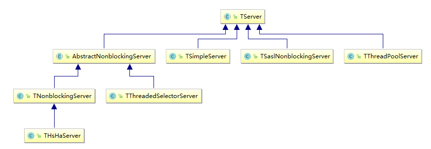
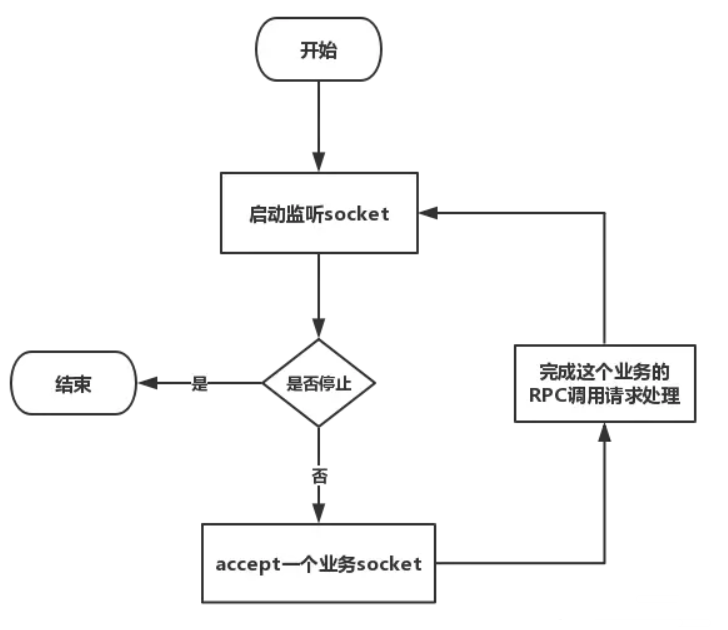
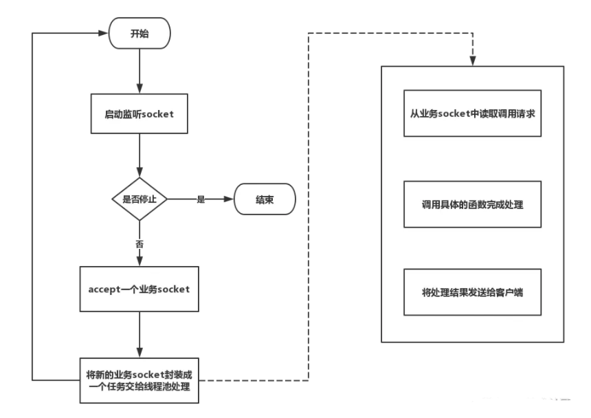
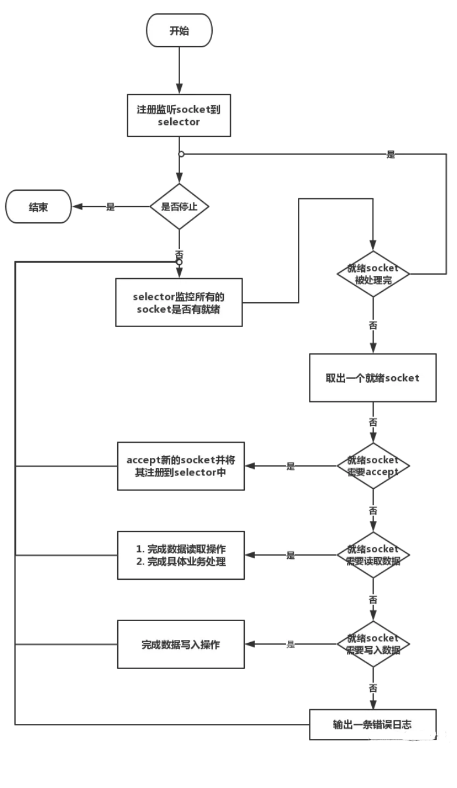
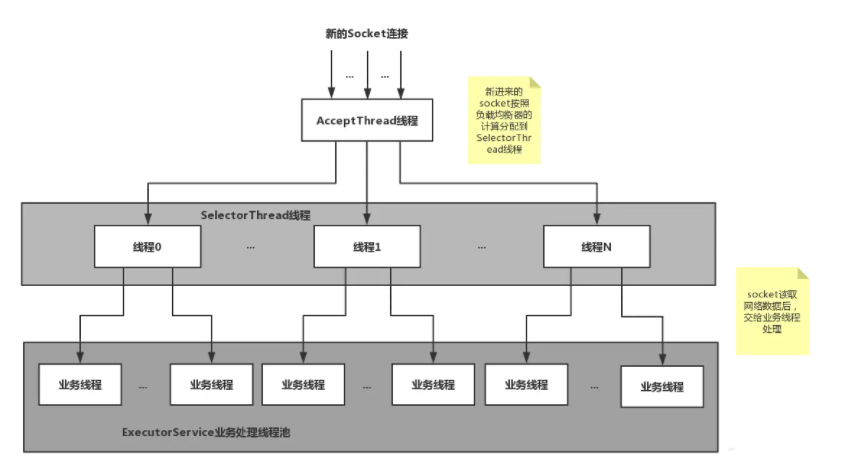

# Thrift：介绍

thrift是一个轻量级，跨语言的RPC框架，主要用于各个服务之间的RPC调用。RPC【远程过程调用】。它通过自身的IDL中间语言，并借助代码生成引擎生成各种主流语言的RPC服务/客户端模板代码

# Thrift特性

- 开发速度快
  - 通过编写RPC接口Thrift IDL文件，利用编译器生成器自动生成服务端骨架（Skeeletons）和客户端桩（Stubs）。从而省去了开发者自定义和维护接口编码，消息传输，服务器多线程模型等基础工作
  - 服务端：只需要按照服务骨架即接口，编写好具体的业务处理程序（handler）即实现类即可
  - 客户端：只需要拷贝IDL定义好的客户端桩和服务对象，就可以调用远程服务
- 接口维护简单
- 学习成本低，
- 多语言/跨语言支持
- 稳定/广泛使用

### 了解RPC

#### 概述：

RPC（Remote Procedure Call）即 **远程过程调用**，说的这么抽象，其实简化理解就是一个节点如何请求另一节点所提供的服务。

**ServiceA ---> ServiceB ---> ServiceC** 就是一个远程调用的例子。

#### RPC与普通http协议区别：

**HTTP协议在应用层完成的，但有时效率并不高效；**

**RPC可以不依赖于应用层协议，可以直接基于TCP进行远程调用，在传输层中即可完成通信，因此更适于某些对效率要求更高的场景。**

由于RPC调用方式依赖于客户端与服务端之间建立Socket连接来实现二进制数据通信，底层会比较复杂，所以一些RPC框架应运而生来封装这种复杂性，让开发者将精力聚焦于业务之上。

常见的RPC框架包括：Thrift、gRPC、Finagle、Dubbo等。


# IDL详解


Thrift采用IDL来定义通用的服务接口，然后通过Thrift提供的编译器，可以将服务接口编译成不同语言编写的代码，通过这种方式实现跨语言。  

类似  A->中间件->B，这时中间件采用的是**IDL语言** ，IDL是一种关联客户端和服务端的一种语言。

## IDL语法

### 基本类型

- **bool**: 布尔值
- **byte**: 8位**有符号**整数
- **i16**: 16位**有符号**整数
- **i32**: 32位**有符号**整数
- **i64**: 64位**有符号**整数
- **double**: 64位浮点数
- **string**: UTF-8编码的字符串
- **binary**: 二进制串：string的特殊形式，方便某些场景下Java调用。对应java.nio.byteBuffer类型


### 常量类型

```IDL
const i32 INT_CONST = 1234;    // a
const map<string,string> MAP_CONST = {"hello": "world", "goodnight": "moon"}
```


### 结构体类型：

- **struct**: 定义的结构体对象

```IDL
struct Tweet {
 
1: required i32 userId;                  // a
 
2: required string userName;             // b
 
3: required string text;
 
4: optional Location loc;                // c
 
16: optional string language = "english" // d
 
}
```

说明：

a. 每个域有一个唯一的，正整数标识符

b. 每个域可以标识为required或者optional（也可以不注明, 默认 为optional）

c. 结构体可以嵌套，包含其他结构体，但不能嵌套自己。

d. 域可以有缺省值

e. 一个thrift中可定义多个结构体，并存在引用关系

- 规范的struct定义中的每个域均会使用required或者optional关键字进行标识。

  - required必须填充，必须序列化

  - optional 不填充则不会序列化。

如果required标识的域没有赋值，thrift将提示错误。如果optional标识的域没有赋值，该域将不会被序列化传输。如果某个optional标识域有缺省值而用户没有重新赋值，则该域的值一直为缺省值。

与service不同，结构体不支持继承，即，一个结构体不能继承另一个结构体。


### 容器类型：

- **list**: 有序元素列表
- **set**: 无序无重复元素集合
- **map**: 有序的key/value集合

### 异常类型：

- **exception**: 异常类型

### 服务类型：

- **service**: 具体对应服务的类

```IDL
//“Twitter”与“{”之间需要有空格！！！
service Twitter {
	// 方法定义方式类似于C语言中的方式，它有一个返回值，一系列参数和可选的异常
	// 列表. 注意，参数列表和异常列表定义方式与结构体中域定义方式一致.
	void ping(),                                    // a
	bool postTweet(1:Tweet tweet);                  // b
	TweetSearchResult searchTweets(1:string query); // c
	// ”oneway”标识符表示client发出请求后不必等待回复（非阻塞）直接进行下面的操作，
	// ”oneway”方法的返回值必须是void
	oneway void zip()                               // d
	void test() throws (1:MyException exception);//声明抛出自定义异常
}
```


# Thrift协议

thrift可以选择客户端与服务端之间的传输 协议类别

- TBinaryProtocol：二进制编码格式进行数据传输
- TCompactProtocol：高效率的、密集的二进制编码格式进行数据传输
- TJSONProtocol： 使用JSON文本的数据编码协议进行数据传输
- TSimpleJSONProtocol：只提供JSON只写的协议，适用于通过脚本语言解析

## Thrift的传输层

- TSocket：使用阻塞式I/O进行传输，是最常见的模式
- TNonblockingTransport：使用非阻塞方式，用于构建异步客户端
- TFramedTransport：使用非阻塞方式，按块的大小进行传输，类似于Java中的NIO

# 使用


对于开发人员而言，使用原生的Thrift框架，仅需要关注以下四个核心内部接口/类：Iface, AsyncIface,
Client和AsyncClient。


- Iface：服务端通过实现UserService.Iface接口，向客户端的提供具体的同步业务逻辑。
- AsyncIface：服务端通过实现UserService.Iface接口，向客户端的提供具体的异步业务逻辑。
- Client：客户端通过UserService.Client的实例对象，以同步的方式访问服务端提供的服务方法。
- AsyncClient：客户端通过UserService.AsyncClient的实例对象，以异步的方式访问服务端提供的服务方法。

# 网络服务模型详解

thrift提供了网络服务模型：单线程，多线程，时间驱动。从另外一个角度分为：阻塞服务模型，非阻塞服务模型


- 阻塞服务模型：TSimpleServer、TThreadPoolServer。
- 非阻塞服务模型：TNonblockingServer、THsHaServer和TThreadedSelectorServer。



## TServer（最基本的Server）

TServer定义了静态内部类Args，Args继承自抽象类AbstractServerArgs。AbstractServerArgs采用了建造者模式，向TServer提供各种工厂：


Tserver的三个方法：serve()、stop()和isServing()。serve()用于启动服务，stop()用于关闭服务，isServing()用于检测服务的起停状态。

## TSimpleServer

使用阻塞IO（BIO）。Server启动后，一次只能启动接收和处理一个Socket连接，即此时server正在处理一个client请求，另外一个请求进来只能阻塞。等待处理结束该请求后，才能处理下一个client请求。



## TThreadPoolServer   （线程池模式）

TThreadPoolServer模式采用阻塞socket方式工作，主线程负责阻塞式监听是否有新的Socket到来，交给一个线程池具体执行。



- **优点**
  - 拆分了监听线程和处理客户端连接的工作线程。**将数据读取和业务处理交给线程池来做。**（不是仅把业务处理交给线程池，而是将数据读取也交线程池来做，与THsHaServer区别）
- **缺点**
  - 该模型受限于线程池的工作能力，若请求数多于线程池数，则依然会阻塞等待
  - 默认线程池允许创建的最大线程数量为Integer.MAX_VALUE，可能会创建出大量线程，导致OOM(内存溢出)

## TNonblockingServer

采用NIO模式，利用IO多路复用模型处理socket。即可以监控多个socket是否就绪，就绪的话，使用单线程处理。

TNonblockingServer要求底层的传输通道必须使用TFramedTransport。



- **优点**
  - 利用了多路复用，可以监听多个socket的变化，
- **缺点**
  - 仍然采用单线程顺序执行。仅仅是监听了多个socket，**监听到某个socket就绪后，仍然是单线程进行数据读取和业务处理。**后续socket等待

## THsHaServer

在TNonblockingServer的基础上，进行了拓展，引入了线程池提高任务处理并发能力。

THsHaServer和TNonblockingServer一样，要求底层的传输通道必须使用
TFramedTransport。

- **优点**
  - 与TNonblockingServer相比，THsHaServer在读取socket后，将处理请求的业务交给线程池，提高了数据读写能力。
- **缺点**
  - **主线程（单线程）仍然需要完成所有socket的监听接收、数据读取和数据写入操作。然后才调用线程池进行业务处理**，当并发请求数较大时，且发送数据量较多时，监听socket上新连接请求不能被及时接受。

## TThreadedSelectorServer

是对THsHaServer的扩充。它将selector中的读写IO事件，从主线程中分离出来。同时引入worker线程池。

- 一个AcceptThread线程专门处理socket上连接
- 通过负载均衡器SelectorThreadLoadBalance，将AcceptThread线程接收到一个新socket连接请求分配给哪个SelectorThread
- 若干个SelectorThread专门用于处理socket的网路I/O操作，所有的网路数据读写，在此处完成。
- 在SelectorThread将请求数据读取后，交给ExecutorService线程池完成业务工作。




