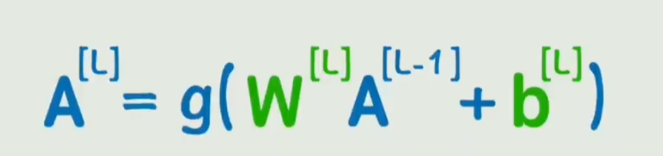
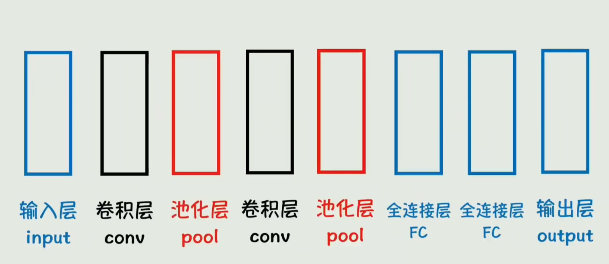
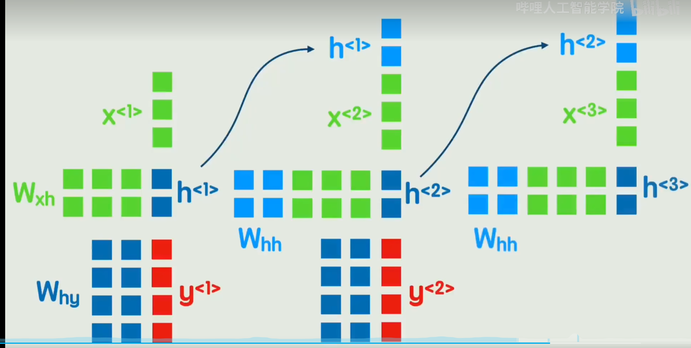

# 前置知识

前向传播:计算结果

线性回归

损失函数：

学习率

反向传播：通过复合函数求导，计算每个参数的梯度和系数

过拟合：在训练数据表现完美，在没见过的数据表现糟糕，则是过拟合。

泛化能力：要求训练的模型在没见过的数据中也表现不错，这种能力就是泛化能力

数据增强：原始训练数据不足，可以对原数据进行反转，旋转，裁剪，加噪声等处理，也就是基于原始数据进行处理成为新数据，这种操作叫数据增强，

正则化：对损失函数中，增加原始参数（惩罚项）的方法，抑制参数的野蛮增长

dropout：训练时，每次随机丢弃部分参数数据，使得模型必须依赖所有参数，而不能仅依赖某几个关键参数，避免模型过于依赖某几个参数，使得训练时大多数参数是无效的。

梯度消失：模型层数越多，反向传播时梯度会越来越小，导致参数更新困难。

梯度爆炸：梯度的调整越来越大，导致参数的调整幅度失去了控制。

收敛速度：可能陷入局部最有或者来回震荡

计算开销：每次完整的前向、反向传播非常耗时

**算法并行运算**：将模型计算 A = g(wa+b),把计算方式设置成矩阵计算，使用GPU可以提供计算效率，加速神经网络的推理过程。

**卷积**conv：从关注一个点到关注局部，把原输入数据，通过卷积核，计算局部的结果，遍历整张图得到新的特征数据。卷积核的值是未知的，是需要训练微调出来的结果。卷积的作用是从关注一个点到关注一个局部，对于图片这种周围像素关联性强的对象来说很有必要。全连接层的叠加是数据量的倍增，可以通过卷积层提取局部特征，减少计算量。节省计算压力，并且提取有效特征。

**池化**：对卷积层后的特征数据进行降维，，减少计算量，同时保留主要特征。

**卷积神经网络CNN**：卷积、池化、全连接层的网络称为CNN，**局限性：主要用于静态数据、比如图片，如果是处理时间序列的数据 文本、视频、语音等动态数据，则存在局限性。**

**词嵌入**：需要把词转换成计算机可以理解的数字，通过编码得到词向量。如果穷举所有词则词库过大，增加计算量。两个词之间可以通过点积运算计算相关性。词表是通过深度学习计算出来的，词可以在词表中找到对应词向量，**所有词向量的词表就称为嵌入矩阵。词嵌入则是计算嵌入矩阵的过程**。已经有成熟的词嵌入矩阵 例如：word2vec

解决词语先后顺序问题，又要降低输入层的参数量。

**循环神经网络RNN**：每个词作为输入，通过矩阵运算的到h，作为下一个词的输入，另外h跟W权重计算的到结果y。后面一个词x和上一个词计算得到的h拼接起来共同作为输入。

- **目的：**后面词的输入时包含前面词的全部数据信息，不必把所有词作为输入进行计算。
- 缺点：1、无法捕捉长期依赖（词增加越多，则前面词的数据特征会丢失或者失真，因此后面每一个词的输入都会对前面词进行一次特征压缩）；2、无法并行运算（依赖上一个词的隐藏状态计算结果h）

