学习文档：https://wxler.github.io/2021/03/01/175946/#7-zookeeper%E7%9B%91%E5%90%AC%E9%80%9A%E7%9F%A5%E6%9C%BA%E5%88%B6

# 前言 ZNode

Paxos描述了这样一个场景，有一个叫做Paxos的小岛(Island)上面住了一批居民，岛上面所有的事情由一些特殊的人决定，他们叫做议员(Senator)。议员的总数(Senator Count)是确定的，不能更改。岛上每次环境事务的变更都需要通过一个提议(Proposal)，每个提议都有一个编号(PID)，这个编号是一直增长的，不能倒退。每个提议都需要超过半数((Senator Count)/2 +1)的议员同意才能生效。每个议员只会同意大于当前编号的提议，包括已生效的和未生效的。如果议员收到小于等于当前编号的提议，他会拒绝，并告知对方：你的提议已经有人提过了。这里的当前编号是每个议员在自己记事本上面记录的编号，他不断更新这个编号。整个议会不能保证所有议员记事本上的编号总是相同的。现在议会有一个目标：保证所有的议员对于提议都能达成一致的看法。
好，现在议会开始运作，所有议员一开始记事本上面记录的编号都是0。有一个议员发了一个提议：将电费设定为1元/度。他首先看了一下记事本，嗯，当前提议编号是0，那么我的这个提议的编号就是1，于是他给所有议员发消息：1号提议，设定电费1元/度。其他议员收到消息以后查了一下记事本，哦，当前提议编号是0，这个提议可接受，于是他记录下这个提议并回复：我接受你的1号提议，同时他在记事本上记录：当前提议编号为1。发起提议的议员收到了超过半数的回复，立即给所有人发通知：1号提议生效！收到的议员会修改他的记事本，将1好提议由记录改成正式的法令，当有人问他电费为多少时，他会查看法令并告诉对方：1元/度。
现在看冲突的解决：假设总共有三个议员S1-S3，S1和S2同时发起了一个提议:1号提议，设定电费。S1想设为1元/度, S2想设为2元/度。结果S3先收到了S1的提议，于是他做了和前面同样的操作。紧接着他又收到了S2的提议，结果他一查记事本，咦，这个提议的编号小于等于我的当前编号1，于是他拒绝了这个提议：对不起，这个提议先前提过了。于是S2的提议被拒绝，S1正式发布了提议: 1号提议生效。S2向S1或者S3打听并更新了1号法令的内容，然后他可以选择继续发起2号提议。
好，我觉得Paxos的精华就这么多内容。现在让我们来对号入座，看看在ZK Server里面Paxos是如何得以贯彻实施的。
小岛(Island)——ZK Server Cluster
议员(Senator)——ZK Server
提议(Proposal)——ZNode Change(Create/Delete/SetData…)
提议编号(PID)——Zxid(ZooKeeper Transaction Id)
正式法令——所有ZNode及其数据


# 1、ZooKeeper 简介

- Zookeeper主要服务于分布式系统，用来，统一配置管理、统一命名管理（注册中心）、分布式锁和集群管理
- ZooKeeper作为分布式的中间件解决了分布式系统中无法避免的对结点管理的问题（需要实时感知结点的状态、对节点进行统一管理等等）


使用Zookeeper的项目

- Kafka：主要为Kafka提供Broker和topic的注册一级多个Partiton的负载均衡等功能
- Dubbo：使用Zookeeper为期命名服务，维护各个机器的信息，维护全局的服务地址列表


**Zookeeper 的三种运行模式**

- 单机模式：开发测试环境需要
- 集群模式：Zookeeper集群通常由一组机器组成，一般是3台机器网上，每台机器都在内存中维护了当前的服务状态，并且每台机器进行通信
- 伪集群模式：集群所有的机器都在一台机器上，Zookeeper允许暴露不同的接口，则一台机器可以部署多个Zookeeper服务实例。


**Zookeeper的特点**

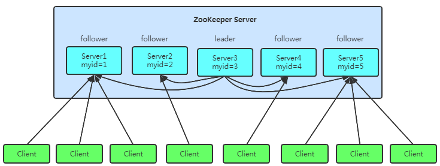

1. Zookeeper的支持集群部署的，集群由一个领导者和多个跟随者组成
2. **高可用性：**集群中只要有半数以上节点存活，则Zookeeper集群就能正常服务
3. **全局一致性：**每个Service保存相同的数据副本，Client无论连接到哪个service，数据均是一致的
4. **更新请求顺序执行**：来自同一个client的更新请求按期发送顺序依次执行
5. **数据更新原子性：**更新数据要么都成功，要么都失败
6. **实时性**：Client能读取到最新的数据
7. 从设计模式的角度来说，Zk是一个观察者设计模式的框架，它负责管理和存储数据，给接收观察者的注册，数据发生变化会通知各个观察者做出反应。
8. Zookeeper保证的**CP（数据一致性）**


# 2、CAP和BASE理论

CAP定理：系统需要在系统可用性和数据一致性中做出权衡。 C：一致性   A： 可用性   P： 分区容忍性

分布式系统都是接收P的，因此主要的区别是CP（数据一致性）还是AP（可用性）。**Zookeeper保证的是CP（数据一致性）**。Eureka保证了AP（可用性）。


**BASE理论**：无法做到强一致性，分布式系统可通过自己的业务特点采取适当的方式来使得系统达到最终的一致性。分为三个部分

- **基本可用（Basically Available）**：分布式系统在出现故障的时候，允许损失部分可用性，保证核心功能的高可用。电商大促时，需要先加入购物车再下单
- **软状态（Soft State）**：允许系统存在中间状态，但最终是一致的，且中间状态不影响系统整体的可用性。分布式中存在副本，副本同步的延时则是中间态
- **最终一致性（Eventual Consistency）**：经过软状态后，最终达到一致装填，这是**弱一致性**，强一致性则不允许有中间态

平时要求系统基本可用，运行有可容忍的延迟装填，但经过一段时间后，达到最终的一致性。

**Zookeeper是让系统尽可能的高可用，而且数据能达到最终的一致性。**


# 3、一致性协议 TAB

Zookeeper为解决分布式数据一致性问题，自己定制了一致性协议 ZAB（Zookeeper Automic Broadcast）原子广播协议，能够支持崩溃恢复


## 3.1 ZAB的三个角色

Leader 领导者、Follower 跟随者、Observer 观察者。统称为zkService

- Leader：集群中唯一的写请求处理者，能够发起投票
- Follower：能够接收客户端的请求，如果是读请求则，自己处理，若是写请求，转发给Leader。选举过程中，会参与投票，有选举和被选举权
- Observer：没有选举权和被选举权的Follower

ZAB的协议，则是对该三种角色的协议，分为 **消息传播**和**崩溃恢复**


## 3.2 ZXID和myid

**zxid**

zookeeper采用全局递增的事物Id来标识。所有的变更发生时都会有一个Zookeeper Transaction Id。ZXID 是64位的Long类型。**各个角色根据该Id保证事务顺序一致性。**ZXID 高32位表示纪元epoch，低32位表示xid。


- 每个leader 都会有不同的epoch值。表示一个朝代。从1开始，每次新的选举，选出新的leader后，epoch递增1。并且将该值更新到所有zkService的epoch。
- xid是一个递增的事务编号。数值越大说明数据越新。每次epoch变化，都将低32位的xid重置。

**myid**

每个Zookeeper服务器都会在数据文件夹下创建myid的文件，这个文件包含整个Zookeeper集群的唯一性ID（整数）.


## 3.3 历史队列

每个follower节点都会有一个先进先出（FIFO）队列用来存放收到的事物请求，保证事物的顺序。

- 可靠提交由ZAB的事务一致性协议保证
- 全局有序由TCP协议保证
- 因果有序由follower的历史队列(history queue)保证


## 3.4 消息广播模式

消息广播就是ZkService如何处理写请求和数据同步。

**ZAB协议两种模式：消息广播模式和崩溃恢复模式。**

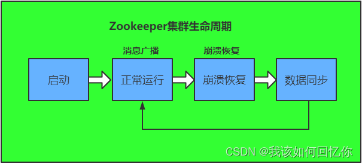

- ### 写请求

ZkService收到写请求后，转发到Leader。Leader根据写请求，询问所有的Follower是否同意更新，要是超过半数同意，则将Follower和Observer更新。**数据同步是保证事务的顺序一致性的。**根据版本的Id  ZXID进行有序同步

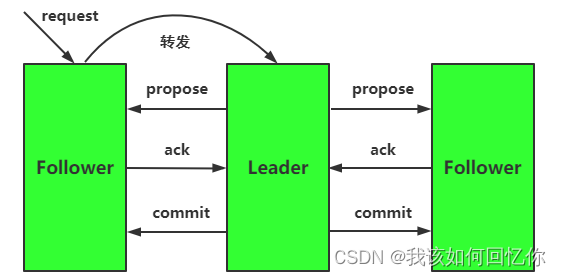

1. Zkserver收到写请求转发到 leader
2. leader生成一个新的事务，并生成ZXID。
3. Leader 将事务发给所有的Follower，携带ZXID作为一个提案（propose）分发给所有Follower
4. follower节点将收到的事务请求加到历史队列（history queue）中，当follower收到提案propose，现将propose写到磁盘，完成后再回复leader一个ACK。
5. 当leader收到超过半数的follower的ack消息，leader向follower发送commit请求（leader自身也需要提交事务）
6. 当follower收到commit请求后，判断当前事务的ZXID是否比历史队列里的事务ZXID都小。如果是则执行该事务。若不是则等待比它更小的事务的执行（保证有序性）
7. Leader将执行结果返给客户端


**过半成功策略**

Leader节点接收到写请求后，Leader将会把写请求广播给各个server。各个Server将该写请求加入到历史队列，并向Leader发送Ack信息。收到超过半数的Ack信息后，说明该操作可以执行。Leader会向各个Server提交commit消息，各个Server收到消息后执行操作

- **Leader不需要得到Observer的Ack**（Observer无投票权）
- Leader不需要得到所有Follower的Ack，只需要得到一半即可（Leader本身对自己就有一个Ack）
- Observer虽然无投票权，但仍同步Leader数据，从而在处理读请求时，可以返回新数据


- Follower 和Observer都有可能收到写请求，zkserver收到请求后，将该请求转发到Leader
- 无论是Follower和Observer，都会执行commit命令，即写请求

读请求的话，任何zkServer都可以处理，在本地内存中读取


## 3.5 崩溃恢复模式

 崩溃恢复模式分为四步：选举、发现、同步、广播

1. 选举阶段：当Leader崩溃后，集群进度选举阶段，选出准leader
2. 发现阶段：从各个节点中发现最新的ZXID和事务日志。准Leader接收所有Follower的各自的epoch值。Leader从中选取最大的epoch + 1，将新值发给各个Follower。Follower回应Ack给Leader，带上各自最大的ZXID和存储的信息。Leader选取最大的ZXID，并更新自身历史日志。Leader有了最新的提议历史（每次epoch变化时，ZXID重新从0开始）【准Leader接受所有Follower最新的数据，同步自己，保证自身是最新的数据】
3. 同步阶段：Leader获取到最新的提议历史，则同步所有Follower。超过半数Follower同步成功，准Leader才成为正式Leader。（再同步提议时，follower只同步zxid比自己lastZxid大的提议）
4. 广播阶段：集群恢复到广播模式，开始接受客户端的写请求。


- **Leader被选为主节点后，已经是最新的数据，为什么还要从各节点寻找最新的事务？**

  - **确保已经被Leader提交的提案最终被所有Follower提交**

    - Leader(server2)发送了commit请求，然后发给server3，还没发给server1时，挂了。若选举server1作为新Leader，则server2收到的commit请求，则会被丢弃。
    - **在选举时，比较ZXID**，只有最新的server3当选Leader。当前Leader后，将最新的Leader同步到Follower。若是server2恢复，则作为Follower加入集群

    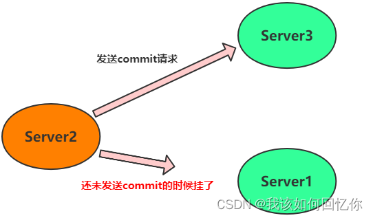

  - **确保跳过那些已经被丢弃的提案**
    
    - Leader（server2）统一了提案N1,自身提交了提议，没提交到server1和server3时挂了。无论是server1还是server3选举成Leader。server2恢复后作为Follower加入集群，同步Leader的提案历史，sever2的提案N1会被丢弃。
      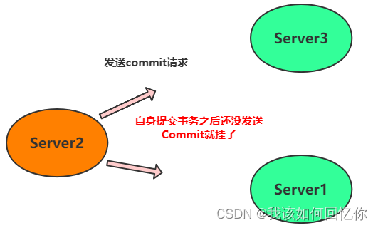

## 3.6 脑裂问题

当前集群需要选举leader，当所有节点通信没有问题时，会选举出一个master。若通信出现了问题，至少两个节点被选为leader，所以一个集群有两个及以上个leader。

ZAB协议为解决脑裂问题，要求集群内的结点数量为2N+1（奇数），当网络分裂后，始终有一个集群的结点数量超过半数，而另一个集群节点数量小于N+1（小于半数），**选举需要过半数节点同意。**所以不会有两个leader。

因此，过半机制，对于Zookeeper集群，要么没有leader，要么只有一个1个leader，由此避免了脑裂问题。


# 4、Zookeeper 选举机制

leader选举可以分为两个种

1. leader 宕机重新选举新的leader
2. Zookeeper新启动，需要初始化选举出一个leader

**选举阶段**

- looking：不确定leader的状态，该状态下的zk认为没有leader，会发起leader选举
- following：跟随者状态，明确一台机器为leader，当前服务器作为跟随者
- leading：领导者状态，明确当前机器为领导者，会与following维持心跳
- observing：观察者状态，与following相似，但是不参与选举，也不参与集群写操作的投票


## 4.1 初始化选举

假设三台机器myid为 1、2、3

ZXID = 高32位epoch + 低32位epoch

1. 机器1 启动，发起选举，会投给自己，投票内容为**（myid，ZXID）**，初始化时，ZXID为0，此时Server1 只能收到1票，不够半数以上，则无法选举为leader。该状态为looking

2. 机器2启动，发起选举，会投给自己，投票内容为（2,0），并将投票消息广播出去（Server1 机器也会广播，不过是只有一台机器，所以广播无效）。Server1 收到Server2 的投票信息后：

   - **首先会对比ZXID，ZXID大的优先为leader；**
   - **若ZXID相同，则对比myid，myid大的优先为leader**

   因此，Server1 选举Server2 为leader。超过半数票，Server2 状态变更为leading，Server1 状态变更为following

3. 机器3启动，发现Server1和Server2 都不为looking状态，则直接以following的身份加入集群


## 4.2 运行时选举

运行时如果Leader节点崩溃，会走崩溃恢复模式，**新leader选出前会暂停对外服务**，大致分为四个阶段：选举、发现、同步、广播

1. Leader宕机，剩下的两个Follower的状态由Following变为Looking状态，每个Server会发出一个投票，第一次都是投给自己，投票内容为（myid，ZXID）。因为是运行时选举，zxid可能不为0
2. 服务器收集各个服务器的投票
   - 优先比较ZXID，然后比较myid，大的优先
   - 统计投票，只有超过半数的机器收到同样的投票信息，才可以确定leader
3. Follower的状态由Looking分别变更为Leading和Following
4. 然后依次进去发现、通过、广播节点  （见3.5 崩溃恢复模式）

假设集群有三台服务器，`Leader (server2)`挂掉了，只剩下server1和server3。 `server1` 给自己投票为(1,99)，然后广播给其他 `server`，`server3` 首先也会给自己投票(3,95)，然后也广播给其他 `server`。`server1` 和 `server3` 此时会收到彼此的投票信息，和一开始选举一样，他们也会比较自己的投票和收到的投票（`zxid` 大的优先，如果相同那么就 `myid` 大的优先）。这个时候 `server1` 收到了 `server3` 的投票发现没自己的合适故不变，`server3` 收到 `server1` 的投票结果后发现比自己的合适于是更改投票为(1,99)然后广播出去，最后 `server1` 收到了发现自己的投票已经超过半数就把自己设为 `Leader`，`server3` 也随之变为 `Follower`。


# 5、Zookeeper 数据模型

ZooKeeper 数据模型  采用层次化的多叉树结构，每个数据节点（znode）上的都可以存储数据。数据可以是 数字、字符串 或者布尔值。最上层是根节点 以 `/`代表。

znode是ZK数据的最小单元，每个znode都一个唯一的路径标识。**Zookeeper 主要是用来协调服务的，而不是用来存储业务数据的，这种特性使得Zookeeper不能存放大量的数据，每个节点的存放数据上线是1M。**

Zookeeper能自由的增加、删除znode，类似文件系统，znode默认有四种类型：

- 持久化目录节点 Persistent：客户端与Zookeeper断开连接后，该节点依旧存在
- 持久化顺序编号目录节点 PERSISTENT_SEQUENTIAL：客户端与Zookeeper断开连接后，该节点依旧存在，Zookeeper 给该节点名称进行了编号
- 临时目录节点 EPHEMERAL：客户端与Zookeeper断开连接后，该节点被删除
- 临时顺序编号目录节点 EPHEMERAL_SEQUENTIAL：客户端与zookeeper断开连接后，该节点被删除，只是Zookeeper给该节点名称进行顺序编号。

Znode的数据信息

| znode 状态信息 | 解释                                                         |
| -------------- | ------------------------------------------------------------ |
| cZxid          | create ZXID，即该数据节点被创建时的事务 id                   |
| ctime          | create time，znode 被创建的毫秒数(从1970 年开始)             |
| mZxid          | modified ZXID，znode 最后更新的事务 id                       |
| mtime          | modified time，znode 最后修改的毫秒数(从1970 年开始)         |
| pZxid          | znode 最后更新子节点列表的事务 id，只有子节点列表变更才会更新 pZxid，子节点内容变更不会更新 |
| cversion       | znode 子节点变化号，znode 子节点修改次数，子节点每次变化时值增加 1 |
| dataVersion    | znode 数据变化号，节点创建时为 0，每更新一次节点内容(不管内容有无变化)该版本号的值增加 1 |
| aclVersion     | znode 访问控制列表(ACL )版本号，表示该节点 ACL 信息变更次数  |
| ephemeralOwner | 如果是临时节点，这个是 znode 拥有者的 sessionid。如果不是临时节，则 ephemeralOwner=0 |
| dataLength     | znode 的数据长度                                             |
| numChildren    | znode 子节点数量                                             |


# 6、Zookeeper 监听通知机制

watcher监听机制，监听Zookeeper上节点的变化，绑定监听事件，监听节点数据的变更、节点删除、状态变更等。通过该机制，可以实现基于Zookeeper分布式锁、集群管理。

watcher监听机制：**客户端想服务端注册指定的watcher，当服务端符合了watcher指定的某些事件，则向客户端发送事件通知，客户端收到通知后找到自己定义的watcher然后执行相应的回调方法。**

客户端在Zookeeper上某个节点监听了事件，事件被触发后，Zookeeper会通过回调函数的方式通知客户端，**但后续即使再次满足事件要求都不会发消息通知（watcher是一次性操作），可以通过循环监听达到永久监听的效果。**


## Watcher机制过程

1. 客户端注册watcher，注册方式：getData，exists，getChildren
2. 服务器处理watcher
3. 客户端回调watcher客户端

## 流程

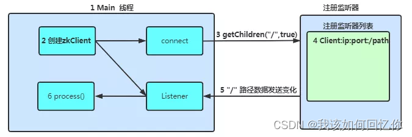

1. 有个main主线程，连接Zookeeper
2. main线程创建zkClient，此动作创建了两个线程：一个负责网络连接通信（connect），一个负责监听（listener）
3. 通过connect线程连接服务端，将注册的监听事件发送给Zookeeper
4. 在Zookeeper的监听事件列表中将注册的监听事件添加到表中
5. Zookeeper监听到有数据或者路径变化，将该消息发给listener线程
6. listener线程内部调用了process()方法


# 7、Zookeeper 会话（session）

session 是Zookeeper服务端与客户端的一个TCP长连接。默认端口 218。

会话包括：全局的会话状态变化、创建会话、会话管理 三个方面


## 会话状态

session 会话状态包括 

- connecting：连接中
- connected：已连接
- closed：已关闭

客户端通过 `host1 : port,host2: port ,host3:port`连接服务器，客户端状态变更为connecting。在成功连接后，状态变更为connected。网络中断之类的操作，客户端会重新从connected变为connecting。若是连接过程中，出现连接超时、权限检查失败等，则状态变更为close。


## 会话ID的生成

**会话的组成**

- sessionID：会话的ID会唯一标识，全局唯一
- TimeOut：指定连接服务器的最长连接时间。
- ExpirationTime：过期时间。TimeOut是相对时间，**ExpirationTime是一个绝对时间**。但计算方式不是 `ExpirationTime = CurrentTime + Timeout`，后续会讲解。
- TickTime：下一次会话超时时间点，为了便于Zookeeper对会话实行分桶策略管理，同时为了高效低耗地实现会话的超时检查与清理。Zookeeper会为每个会话标记一个下次会话的超时时间点，TickTime是一个13位的Long类型数值，一般情况下该值接近TimeOut，但不完全相等
- isCloseing：用来标记当前会话是否处于被关闭的状态。如果服务端检测到当前会话的超时时间，则将isCloseing属性标记为已关闭，再有该会话的请求都不会处理

**SessionID的生成：**

Session保证了集群环境下全局唯一性标识

SessionTracker初始化时，会调用**initializeNextSession**方法初始化SessionID


```java
public static long initializeNextSession(long id ) {
    long nextSid = 0;
    nextSid = (System.currentTimeMillis() << 24) >>> 8;
    nextSid=nextSid|(id << 56);
    return nextSid;
}
```

二进制

1. 获取当前毫秒数，左移24位，右移8位。即获取的数据扩大了2^16次方，且高8位为0。
2. id一般为myid 当前zkserver的id，上述右移8位后，表明前8为myid值。

因此：SessionId 是通过高8位确定zkServer所在的机器，后56位按照当前毫秒随机。

有个问题是：若时间过大，则向左移24位，高1位为1，就是负数了，因此向右移8位时，需要是无符号移位 >>>。

> 在java中最高位为1时表示负数，为0表示正整数

上面`>>>`为无符号右移，当目标是负数时，**在移位时忽略符号位，空位都以0补齐，这样就保证了结果永远是正数**。


## SessionTracker与ClientCnxn

SessionTracker：Zookeeper的会话管理器，负责整个zk生命周期中会话的创建、管理和清理工作。

会话在SessionTracker保存了三个数据结构：

```java
protected final ConcurrentHashMap<Long, SessionImpl> sessionsById =
    new ConcurrentHashMap<Long, SessionImpl>();
private final ConcurrentMap<Long, Integer> sessionsWithTimeout;
```

1. SessionWithTimeOut 是一个concurrentHashMap类型的数据结构，用来管理会话的超时时间，该参数会持久化到快照文件中
2. SessionById是一个HashMap类型的数据结构，用于根据SessionId来管理Session实体
3. SessionSets是一个HashMap类型的数据结构，用于会话超时的归档，便于进行会话会话恢复和管理

**ClientCnxn**： Zookeeper客户端的核心工作类，负责维护客户端与服务端之间的网络连接进行一系列网络通信，

包含两个线程：

- SendThread：一个I/O线程，主要负责Zookeeper客户端和服务端之间的网络I/O通信
  - SendThread维护了客户端与服务端之间的会话周期，其以固定的频率向服务端发送一个ping心跳包来保持链接；
  - SendThread管理了客户端所有请求发送和响应接收操作；
  - 客户端调用方转换成相应的请求协议并发送给服务端，并完成对同步调用和异步调用的回调；
  - 将服务端的事件传递给EventThread去处理
- EventThread：事件线程，主要负责对服务端事件进行处理，并触发客户端注册的watcher监听
  - EventThread有一个waitingEvent队列，用于存放那些需要被触发的object，包括那些客户端注册的watcher和异步接口中注册的回调器AsyncCallback。
  - EventThread不断从waitingEvents队列中取出object。实现对事件的触发和回调


ClientCnxn有两个核心队列：outgoingQueue、pendingQueue,。都是客户端的队列。

- outgoing队列：客户端的请求发送队列，存储那些客户端需要发送到服务端的集合
- pendingQueue：服务端响应等待队列，那些已经又客户端发送给服务端的，等待服务端响应的集合


**发送请求**

- outgoingQueue队列中按先进先出的顺序，取出一个可发送的Packet对象，同时生成一个客户端请求序号XID并将其设置到Packet请求头中，然后将其序列化发送
- 请求发送完毕后，将请求Packet保存到pendingQueue队列中，等待服务端响应返回后，返回给客户端

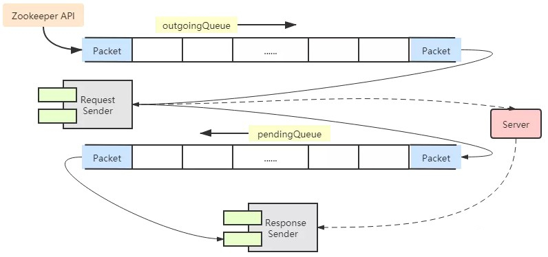


## 会话创建

1. Client随机选一个服务端地址列表提供的地址，委托给ClientCnxnSocket创建与zk之间的TCP长连接
2. SendThread会根据当前客户端的设置，创建一个连接请求，，客户端会将该请求包装成网络IO的Packet对象，放入请求队列-outgoingQueue队列中去
3. ClientCnxnSocket从outgoingQueue中取出Packet对象，将其序列化成ByteBuffer，向服务器发送请求
4. 服务端收到请求后，服务端SessionTracker为该会话分配一个sessionId，并发送响应
5. Client收到响应后，首先判断客户端状态是否已初始化，如果未完成初始化，则该响应是会话创建的相应，则交由ConnectResult方法处理该请求
6. 客户端ClientCnxnSocket会对服务端响应反序列化，得到ConnectResponse对象，并从中获取Zookeeper服务端分配的SessionId
7. 连接成功后，一方面通知SendThread线程，对客户端进行会话参数设置，包括readTimeOut和ConnectTimeOut，并更新客户端状态，另一方面通知地址管理器当前服务器地址已成功连接
8. SendThread会生成一个事件SyncConnected-None，代表客户端与服务器会还创建成功，将该事件传递给EventThread线程
9. EventThread线程收到事件后，找到对应的watcher，将其放到EventThread的waiting队列中
10. EventThread不断从waitingEvent队列中取出待处理的watcher对象，然后调用该对象的process接口方法

至此，完成会话创建的全部过程

## 会话超时创建

Session是由ZK服务端管理，服务端可能连接多个客户端服务，服务端为方便管理过期时间，则将会话维护在桶中。桶区分的维度则是通过ExpirationTime。

如果不区分的话，ZK服务端在运行期间对会话超时检测时，则需要遍历所有的会话，性能差。若是以桶的概念，只扫描对应的桶即可

ExpirationInterval 是ZK服务端定时检查过期Session的频率，默认是2000ms。得到的ExpirationTime是ExpirationInterval 的倍数，取得是会话设置的过期时间的近似值。

```java
ExpirationTime = CurrentTime + SessionTimeout;
ExpirationTime = (ExpirationTime / ExpirationInterval + 1) * ExpirationInterval;
```

ZK在超时会话检测时，只需要扫描一个桶就可以了。而且过期时间是扫描频率的倍数，避免了刚扫描完后，立马就有一个会话过期了，只能等到下一次才能超时扫描关闭会话。

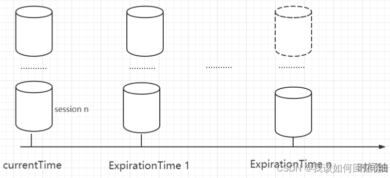

SessionA 超时时间是3000ms后过期，SessionB是1500ms后过期，则SessionA 计算结果是5000ms，则放在4000ms的桶里。SessionB计算结果是3000ms，则放在2000ms的桶里。

| 0    | 2000ms   | 4000ms   | 6000ms | 8000ms |
| :--- | :------- | :------- | :----- | :----- |
|      | sessionB | sessionA |        |        |

ZK避免了遍历所有的会话，如果检测到当前会话已超时，则将isCloseing属性标记为已关闭。再有会话请求，则也不会被处理


## 会话激活

在客户端与服务端完成连接后，设置过期时间，该时间不是一直不变的，随着客户端与服务端的交互会不断更新。过期时间的更新，则所在桶的位置会迁移。**会话激活即过期时间的刷新。**

变更桶的方式有

- 客户端每次向服务端发送请求，包括读请求和写请求，都会触发一个激活，刷新过期时间
- 客户端与服务端一直没有请求时，则会在TimeOut的三分之一时间内发送ping心跳，来保持Session的激活状态。

Zk会有一个单独的线程按**ExpriationInterval** 倍数的时间点进行超时检查


## 会话清理

会话检查操作以后，发现超时的清理步骤

1. 会话请求需要时间，为避免清理过程中该会话还会接受和处理请求，则在发现超时后，会先将会话的isClose标记为true。则该会话无法再处理请求
2. 发起会话请求给PrepRequestProcessor，使其在整个Zk集群生效
3. 通过分桶策略，找到需要清理的会话，找到对应的临时节点
4. Zk将需要删除所有节点的List变为删除节点的请求，给事件变更队列OutStandingChanges中，接着FinalRequestProcessor处理器会出发删除节点的操作，从内存中删除
5. 会话对应的临时节点删除后，将会话从SessionTracker中移除，主要从SessionById，sessionWithTimeOut以及sessionSets中将会话移除，最后关闭最终的连接NioServerCnxn

 

# 8 分布式锁

Zookeeper的设计之初就是为了实现方便的分布式锁。

## 获取锁

Zookeeper创建一个持久节点ParentLock。

当用户1需要获取锁时，需要在PartLock节点下创建一个临时顺序节点Lock1。用户1 查询ParentLock下面所有的临时顺序节点，判断自己创建的Lock1是不是顺序最靠前的一个，如果是，则成功获取到锁。

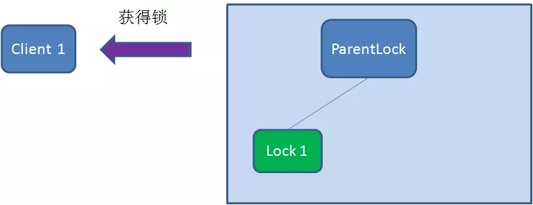


用户2也需要获取锁时，也需要在PartLock节点下创建一个临时顺序节点Lock2，用户2查询ParentLock下面顺序节点，最靠前的是Lock1，并不是Lock2，则获取锁失败。因此，用户2向Lock1 注册watcher，用户监听Lock1 是否存在，用户2抢锁失败，进入等待。

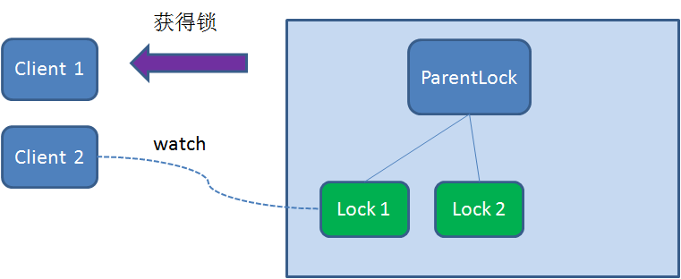


用户3 尝试获取到锁时，也需要在PartLock节点创建一个临时顺序节点Lock3，发现Lock3不是最小的锁，则创建监听Lock2的watcher，抢锁失败，进入等待状态。

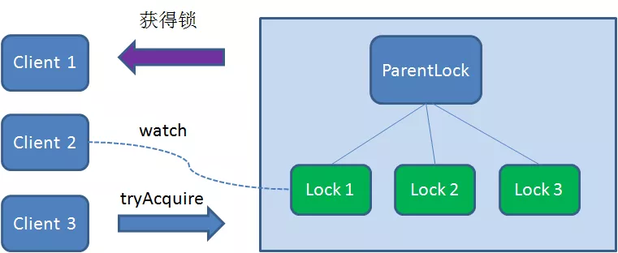

用户1获取到锁，用户2 监听Lock1，用户3监听Lock2，形成等待队列，类似AQS。


## 释放锁

释放锁有两种情况

-  用户1的任务完成，调用删除节点Lock1指令
- 用户1在任务执行中崩溃，未能解释释放锁
  - 会断开Zookeeper服务端的连接，关联节点Lock1因此也会删除。

用户2 一直在监听Lock1，Lock1节点删除，则会通知用户2，用户2会再次查询ParentLock下面的所有节点，确认自己创建的节点Lock2是不是最小的临时节点，若是，则获取锁，执行用户2 的任务。

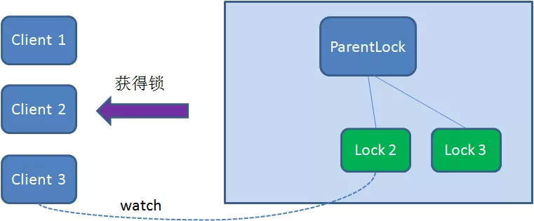

同理，用户2执行完任务，删除Lock2后，通知用户3，用户3 再获取Lock3


## Zookeeper 分布式锁与Redis分布式锁的比较

| 分布式锁  | 优点                                                         | 缺点                                                         |
| --------- | ------------------------------------------------------------ | ------------------------------------------------------------ |
| Zookeeper | 1. 有封装好的框架，容易实现<br />2. 有等待锁的队列，大大提升了抢锁的效率<br />3. ZK支持可重入，Redis的锁重入需要在客户端实现 | 添加和删除节点性能比较低                                     |
| Redis     | set和del指令的性能较高                                       | 1. 实现复杂，需要考虑超时、原子性、超时等情况<br />2.没有等待锁的队列。需要客户端自旋等待锁，效率低 |


# Zookeeper 应用场景


## 数据发布/订阅

某些数据由机器共享，而且这些信息经常发生变化，而且数据量下，则这些数据适合存储在Zookeeper中

- 数据存储：将数据存储到Zookeeper上一个数据节点上
- 数据获取：应用在启动初始化节点从Zookeeper数据节点读取数据，并在该节点上注册一个数据变更的watcher
- 数据变更：数据变更会更新Zookeeper对应节点数据，Zookeeper会将数据变更通知发给各客户端，客户端收到通知后会重新读取变更后的数据


## 统一配置管理

统一配置管理和数据发布/订阅一张，配置文件可配置在Zookeeper上。统一配置管理更倾向于，公共的配置，若集群分属不同机房，更倾向于同机房调用时，则不必抽离到公共配置中。

1. 将配置文件写入到Zookeeper的一个ZNode
2. 各个客户端服务监听这一个ZNode
3. 一旦ZNode发生改变，Zookeeper 将通知各个客户端服务

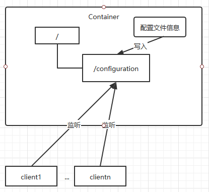

## 统一集群管理

监控整个集群有多少机器在工作，对运行状态进行采集，对RPC接口进行上下线操作。若是通过监控系统，则需要监控系统定时检测每个机器，或者每个机器不断向监控系统发送ping请求。

1. 集群中机器有变动时，牵连修改内容多
2. 有一定延时


Zookeeper可支持，监控

1. 客户端在ZK节点上注册一个watcher，如果该节点的子节点变化，会通知该客户端
2. 创建ephemeral类型的节点，客户端与服务器的会话结束或者过期，则该节点消失


监控系统在manage节点上注册一个Watcher，如果manage子节点列表发生变动，则该监控系统就能实时得知集群中机器的增减情况

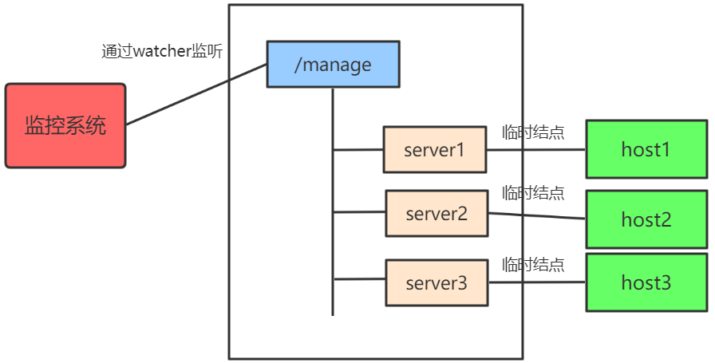

## 负载均衡

提供方有多台机器提供服务，可以通过nginx 在服务端进行负载均衡的配置，也可以通过Zookeeper在客户端进行负载均衡的配置。选择哪台机器进行访问，落在调用方计算。并且负载均衡的策略也可以实时变更，最后同步到调用方

- 多个提供相同服务的机器注册
- 调用方获取中间件地址集合
- 从集合中随机选一个服务执行任务。

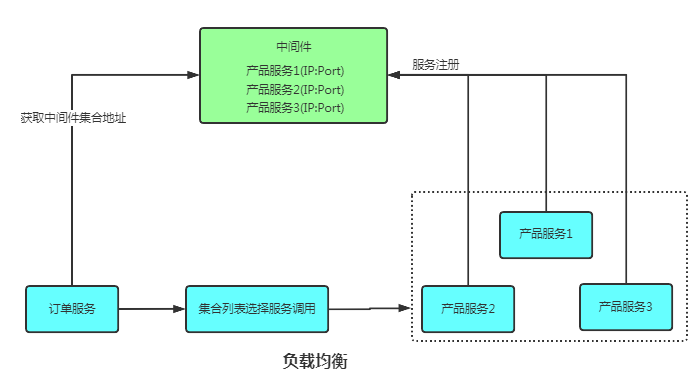


## 命名服务（注册中心）

**命名服务实际上就是注册中心。**常见的有RPC的注册中心、kafka注册中心

通过别名获取到指定的资源或者提供服务的地址。

Dubbo通过Zookeeper作为注册中心，维护全局的服务地址列表

- 提供方在启动时，向Zookeeper上的固定节点/dubbo/${serverName}/providers 目录下写入自己的URL地址，写入后意味着服务的发布
- 调用方启动时，订阅/dubbo/${serverName}/consumers目录下写入自己的URL地址
- Dubbo有针对服务粒度的监控，订阅/dubbo/${serverName}目录下所有提供者和消费者的信息，发生变更后都会同步所有消费者和提供方


**所有向Zookeeper上注册地址都是临时节点**，保证提供方和调用方都可以自动感应资源的变化


**分布式锁和选举也是Zookeeper的应用场景**


