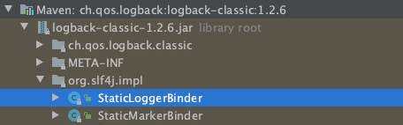
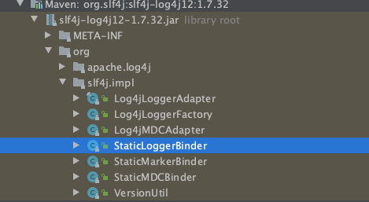
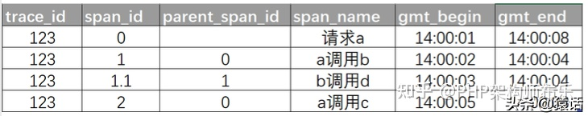
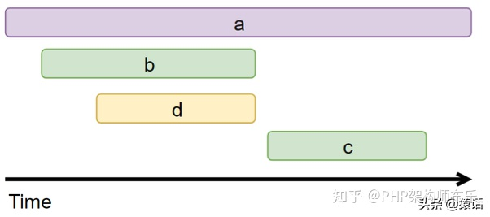

# java 优雅

## 用流更优雅

```java
for (Message message : messageList) {
		......                        
}
```

改为

```
messageList.forEach(message ->
		......     
);
```

==**stream的filter是过滤掉为false的对象**==

## 集合null和empty()判断

```Java
CollectionUtils.isNotEmpty(messageList) // 既判断null，也判断empty（）
Objects.nonNull() & Objects.isNull() // 判断null
StringUtils 。。。 // 大同小异，用jd的包
  
```

## Collectors.emptyList() 慎用

Collectoers.emptyList()创建的集合无法add和remove对象

原因：

创建的对象虽然是ArrayList，但与我们理解的ArrayList是两个类，虽然都继承了AbstractList，但是该类没有重写add和remove方法，而abstractList类的add和 remove方法是勾子方法，即直接抛出异常，使得继承类必须重写该方法。

**Arrays.asList()同理**


Collections.emptyList(); 内部

```java
public static final <T> List<T> emptyList() {
        return (List<T>) EMPTY_LIST;
    }

    /**
     * @serial include
     */
    private static class EmptyList<E>
        extends AbstractList<E>
        implements RandomAccess, Serializable {
        private static final long serialVersionUID = 8842843931221139166L;

        public Iterator<E> iterator() {
            return emptyIterator();
        }
        public ListIterator<E> listIterator() {
            return emptyListIterator();
        }

        public int size() {return 0;}
        public boolean isEmpty() {return true;}

        public boolean contains(Object obj) {return false;}
        public boolean containsAll(Collection<?> c) { return c.isEmpty(); }

        public Object[] toArray() { return new Object[0]; }

        public <T> T[] toArray(T[] a) {
            if (a.length > 0)
                a[0] = null;
            return a;
        }

        public E get(int index) {
            throw new IndexOutOfBoundsException("Index: "+index);
        }

        public boolean equals(Object o) {
            return (o instanceof List) && ((List<?>)o).isEmpty();
        }

        public int hashCode() { return 1; }

        @Override
        public boolean removeIf(Predicate<? super E> filter) {
            Objects.requireNonNull(filter);
            return false;
        }
        @Override
        public void replaceAll(UnaryOperator<E> operator) {
            Objects.requireNonNull(operator);
        }
        @Override
        public void sort(Comparator<? super E> c) {
        }

        // Override default methods in Collection
        @Override
        public void forEach(Consumer<? super E> action) {
            Objects.requireNonNull(action);
        }

        @Override
        public Spliterator<E> spliterator() { return Spliterators.emptySpliterator(); }

        // Preserves singleton property
        private Object readResolve() {
            return EMPTY_LIST;
        }
    }
```

AbstractList内部

```java
public E set(int index, E element) {
    throw new UnsupportedOperationException();
}

/**
 * {@inheritDoc}
 *
 * <p>This implementation always throws an
 * {@code UnsupportedOperationException}.
 *
 * @throws UnsupportedOperationException {@inheritDoc}
 * @throws ClassCastException            {@inheritDoc}
 * @throws NullPointerException          {@inheritDoc}
 * @throws IllegalArgumentException      {@inheritDoc}
 * @throws IndexOutOfBoundsException     {@inheritDoc}
 */
public void add(int index, E element) {
    throw new UnsupportedOperationException();
}

/**
 * {@inheritDoc}
 *
 * <p>This implementation always throws an
 * {@code UnsupportedOperationException}.
 *
 * @throws UnsupportedOperationException {@inheritDoc}
 * @throws IndexOutOfBoundsException     {@inheritDoc}
 */
public E remove(int index) {
    throw new UnsupportedOperationException();
}
```


## 构造器

@NoArgsConstructor 无构造器注解

@AllArgsConstructor 全构造器注解

## Try-catch异常打印

**不要使用e.printStackTrace()**,只是打印到控制台，并且过多占用内存空间

建议使用以下方式

```java
try{
  xxxx
}catch (Exception e) {
	log.error("xxx错误，阿巴阿巴xxx", e.getMessage());
	/*也可以e.getCause().getMessage()
	在getMessage()获取异常名称的基础上，
	添加了异常原因
	e.getMessage()是将错误打印至error.log日志文件中
	*/
}
```

## Optional

工具类，与stream功能类似，主要应用于object对象，而非集合

**Optional.ofNullable**(T value) ：传入参数，若为null，则返回Optional.empty()

- 内部相关方法

  - **ifPresent**：如果存在，则执行内部方法。

    - ```java
      Optional.ofNullable(getUserById(id)).ifPresent(()->{xxxxx});
      ```

    ```java
    Optional<User> user = Optional.ofNullable(getUserById(id));
    user.ifPresent(u -> System.out.println("Username is: " + u.getUsername()));
    ```

  - **orElse**: 如果optional没有值，返回orElse 方法传入的参数

    - ```java
      User user = Optional
              .ofNullable(getUserById(id))
              .orElse(new User(0, "Unknown"));
      ```

  - **orElseGet**：与orElse()区别，可以穿入参数

  - **orElseThrow**：在方法内部抛出异常

  - **map**：可以多次map，与stream类似，输出值

  - **filter**：过滤，==为true时通过，false滤除==

  - 例子：

    ```java
    Optional<String> username = Optional
            .ofNullable(getUserById(id))
            .filter(user -> user.getId() < 10)
            .map(user -> user.getUsername());
    ```

凡是涉及到字符转换的，建议使用optional进行转换，尤其，空null传入报异常的情况，建议采用以下方法规避

```java
Optional.ofNullable(info.getFirstLevelName()).orElse(null);
```

## JSON转换

  常用的JSON转换，需要判断str=null和**str=“”**（很容易被忽略，因此选择stringutils.isEmpty()判断）的情况

```java
JSON.parseObject(str);
```

因此，写法改为：

```java
JSON.parseObject(Optional.ofNullable(str)
                    .filter(StringUtils::isNotEmpty).orElse("{}")
            );
```


## 断言

阿里规范中，强制单元测试中，不能使用sout手动比对，而是使用断言。

，满足条件才能继续运行，若不满足条件，则出现异常

Assert.assertEquals

Assert.assertTrue

## 反序列化

`List<DTO>`的反序列化，只要指定泛型内的泛型。

```java
// 普通对象DTO对象的反序列化
JSON.parse(string, DTO.class);
// 有泛型集合的反序列化,List<DTO> 需要指定泛型。两种方法均可
JSON.parseArray(stringm,DTO.class);
JSON.parse(string,new TypeReference< List<DTO>{});
```


# 多线程

## 异步编排

### CountDownLatch

**CountDownLatch是一个工具类，用来协调多个线程间的同步。CountDownLatch能等待其他的一些线程完成工作后，再执行相应的代码。通过一个计数器完成。**计数器初始值为线程的数量。当每一个线程完成自己任务后，计数器的值就会减一。当计数器的值为0时，表示所有的线程都已经完成一些任务，然后在CountDownLatch上等待的线程就可以恢复执行接下来的任务。

**CountDownLatch的用法**

- 用法一：某个线程在开始运行前等待n个线程执行完毕，首先创建初始化new CountDownLatch(n),每个任务执行完毕后，将计数器减一，countdownLatch.countDown()。当计数器的值变为0后，在Count DownLatch上await()的线程就被唤醒。
  - 用于等待多个任务执行结束后，再继续执行。（任务数不固定，无法使用CompletableFuture异步编排）
- 用法二：做法初始化一个共享的CountDownLatch(1),将其计算器值设为1，多个线程在开始任务前首先countdownlatch.await()，当主线程调用countDown()时，计数器变为0，多个线程同时被唤醒。
  - 用于要求多个线程同时并行执行

**CountDownLatch的不足**

CountDownLatch是一次性的，计算器的值只能在构造方法中初始化一次，之后没有任何机制再次对其设置值，当CountDownLatch使用完毕后，它不能再次被使用。


### **CompletableFuture**

==**为什么使用异步编排？**==

- 将两个异步计算之间相互独立，同时第二个又依赖于第一个的结果。此时需要异步编排。（若是结果不相互依赖，直接异步即可，没必要异步编排）
- 查询商品详情页的逻辑复杂，有些数据需要远程调用。必然花费更多时间。可以使用线程池，异步获取数据，进行编排提高响应速度。
- 例如：进入商品详情页（携带skuId）
  1. 获取SKu的基本信息    异步1
  2. 获取SKU的图片信息    异步1
  3. 获取SKU的促销信息     异步1
  4. 获取spu的所有销售属性   需要等待查询到（获取SKu的基本信息中的spuId）才能获取spuId     异步2
  5. 获取规格参数  异步2
  6. 获取spu详情    异步2
- 原本需要等待6个请求时间累加，变为两次异步操作的时间，极大的提高了响应时间。


jdk1.8，添加了CompletableFuture，进行异步编排。

将两个异步计算之间相互独立，同时第二个又依赖于第一个的结果。此时需要异步编排。

- ### 创建异步对象

  - 没返回值runAsync

    ```Java
            ExecutorService executor = newFixedThreadPool(10);
            CompletableFuture<Void> future = CompletableFuture.runAsync(() -> {
                System.out.println(Thread.currentThread().getId());
            }, executor);
    ```

  - 有返回值supplyAsync

    ```Java
    CompletableFuture<Long> future = CompletableFuture.supplyAsync(() -> {
                long id = Thread.currentThread().getId();
                System.out.println(id);
                return id;
            }, executor);
            Long aLong = future.get();
    ```

- ### 线程执行完成的回调方法

  - whenComplete(BiConsumer<? super T,? super Throwable> action);
    - 在线程执行完成后，将返回值和异常，进行操作，T为线程执行结果，action为异常信息。
  - exceptionally(Function<Throwable,? extends T> fn);
    - 线程出现异常，优先进入该方法，可以设置返回值，使得即使异常也会有返回值
  - whenComplete与exceptionally一块执行，若出现异常，先执行exceptionally，再执行whenComplete

whenComplete 和 whenCompleteAsync 的区别：
		whenComplete：是执行当前任务的线程执行继续执行 whenComplete 的任务。
		whenCompleteAsync：是执行把 whenCompleteAsync 这个任务继续提交给线程池来进行执行。

- ###  线程串行化方法

  ​	（即一个线程执行结束，再执行下一个线程）

  - thenRun，thenRunAsync方法：上一个线程结束，执行thenRun，不能获取上一个线程的结果，也不能有返回值
  - thenAccept，thenAcceptAsync：能获取上一个线程的结果进行操作，但不能有返回值
  - thenApply，thenApplyAsync：能获取上一个任务的结果，并返回当前值

```Java
        ExecutorService executor = newFixedThreadPool(10);
        CompletableFuture<Long> future = CompletableFuture.supplyAsync(() -> {
            long id = Thread.currentThread().getId();
            System.out.println(id);
            return id;
        }, executor).thenApplyAsync(res->{
            return res*2;
        },executor);
        Long aLong = future.get();
        System.out.println(aLong);
```

- ### 多任务组合

  - allOf：等待所有任务完成

  - anyOf：只要有一个任务完成。返回值调用anyof方法，可以获取率先执行结束线程的结果

    ```Java
    public static CompletableFuture<Void> allOf(CompletableFuture<?>... cfs);
    
    public static CompletableFuture<Object> anyOf(CompletableFuture<?>... cfs);
    ```

  - 注意：这两个方法调用，要使用get();,否则在anyof中不能，达到any的目的


    ```Java
            CompletableFuture<Void> all = CompletableFuture.allOf(future1, future2, future3);
            all.get();
    ```

# MySql

## 批量将分组后数据排序，然后取第一条数据

```sql
select * from (select distinct(a.id) tid, a.* from template_detail a
               where a.template_id in (3, 4)
              order by a.id desc) tt
group by tt.template_id;
```

步骤：先进行排序（排序时where过滤），再进行分组，会自动获取分组后的第一条数据

- **==distinct(a.id)==**为什么是distinct呢？
  - 为了避免合并中使用derived_merge。（合并的构造）

derived_merge：指的是一种查询优化技术，作用就是把派生表合并到外部的查询中，提高数据检索的效率。这个特性在MySQL5.7版本中被引入。

虽然看着吊但是不好用且容易出错。

子查询调用下面操作可以关闭该优化操作：

```sql
可以通过在子查询中使用任何阻止合并的构造来禁用合并，尽管这些构造对实现的影响并不明确。 防止合并的构造对于派生表和视图引用是相同的：
   1.聚合函数（ SUM() ， MIN() ， MAX() ， COUNT()等）
   2.DISTINCT
   3.GROUP BY
   4.HAVING
   5.LIMIT
   6.UNION或UNION ALL
   7.选择列表中的子查询
   8.分配给用户变量
   9.仅引用文字值（在这种情况下，没有基础表）

```

如果没有distinct，子查询中的order by失效。加上distinct则结果正确。临时表中使用order by，为使其生效，则需要满足三个条件

- 外部查询禁止分组或者聚合
- 外部查询未指定`having，HAVING， order by`
- 外部查询将派生表或者视图作为`from`句中唯一指定源

不满足全部条件，则order by会被忽略。原因在于derived_merge优化后不会执行filesort操作，所有order by失效。所以添加distinct。


# Spring：

## @Qualifier 注解

根据名称进行注入，避免了通过类注入时，有多个同一类。下面代码会报错。

```
 @Component("fooFormatter")
    public class FooFormatter implements Formatter {
        public String format() {
            return "foo";
        }
    }

    @Component("barFormatter")
    public class BarFormatter implements Formatter {
        public String format() {
            return "bar";
        }
    }

    @Component
    public class FooService {
        @Autowired
        private Formatter formatter;
        
        //todo 
    }
```

需要该操作

```
 @Component
     @Qualifier("fooFormatter")
     public class FooFormatter implements Formatter {
         public String format() {
             return "foo";
         }
     }
 
     @Component
     @Qualifier("barFormatter")
     public class BarFormatter implements Formatter {
         public String format() {
             return "bar";
         }
     }

    @Component
    public class FooService {
        @Autowired
        @Qualifier("fooFormatter")
        private Formatter formatter;
        
        //todo 
    }
```

## @Bean注解

@Bean 注解方法时，参数 是通过 @Autowrited 注解方式，进行自动注入的

```java
	@Bean
	public MyBeanTest MyBeanTest(@Qualifier(value="mytest") Mybean mytest){
		return MyBeanTest (mytest);
	}
```


## 读取配置文件值

yml配置文件

```
api:
  mes:
    MES_SOCKET: http://192.168.99.140:8081
```

### 方法一

方法一优雅

```
@Component
@ConfigurationProperties(prefix = "api.mes")
public class MesApiConfig {

    /**
     * 读取yml下配置好的api-mes——socket
     */
    private String MES_SOCKET;
   
}
```

方法二

```
@Component
public class MesApiConfig {

    /**
     * 读取yml下配置好的mes——socket
     */
    @Value("${api.mes.MES_SOCKET}")
    private String MES_SOCKET;

}
```

## @primary注解

当IOC容器中，有同一类型的多个实现，可以指定名称进行注入。@Autoware @Qualifier(“beanName”)，或者是@resource("beanName")

@Primary和@Bean一起使用，再获取该类型的对象时，优先注入有@primart注解的类。


# 日志系统

以常用的Slf4J举例子，日志系统是门面模式的典型实现。

这种辅助系统，不得参与到业务的具体实现，解耦合，可插拔的。

门面模式：**外部与一个子系统的通信必须通过一个统一的外观对象使得子系统更易用**


门面系统的核心即Facade门面对象，实现的核心点

- 清晰所有子角色的功能
- 将客户端发来的请求分派到子系统，不进行实际的业务处理
- 不参与到子系统内部的业务逻辑中

**slf4j是一个日志标准，而不是日志系统的具体实现。即只有slf4j无法打印日志**

slf4j

- 提供了日志接口
- 提供了获取日志的方法

我们系统使用了logback日志系统，若引用的jar包A，使用log4j日志系统，在我们系统运行时，需要支持和维护至少两个日志系统框架，十分不便。因此，在日志系统上层加入一个适配层，由适配层选择日志系统，调用方只关注打印日志，不必关注如何打印。

并非所有的日志系统都是slf4j的具体实现。slf4j-simple，logback是，但log4j不是，此时需要一个专门的桥接slf4j-log4j12实现。因为日志标准化接口，除了slf4j，还有commons-logging等。

注意：若系统中引入多个日志系统，一条日志不会多个日志系统都打印执行，而是选择其中一个实现slf4j的实现进行打印。

具体实现：

我们通常使用@Slf4j注解，该注解在编译时，会成为

```java
private static final org.slf4j.Logger log = org.slf4j.LoggerFactory.getLogger(LogExample.class);
```

lombok的功劳，与@Data,@Get,@Set注解类似。

首先在代码获取log日志对象

```java
Logger logger = LoggerFactory.getLogger(Object.class);
```

获取方法内部

```Java
    public static Logger getLogger(Class<?> clazz) {
        Logger logger = getLogger(clazz.getName());
        if (DETECT_LOGGER_NAME_MISMATCH) {
            Class<?> autoComputedCallingClass = Util.getCallingClass();
            if (autoComputedCallingClass != null && nonMatchingClasses(clazz, autoComputedCallingClass)) {
                Util.report(String.format("Detected logger name mismatch. Given name: \"%s\"; computed name: \"%s\".", logger.getName(), autoComputedCallingClass.getName()));
                Util.report("See http://www.slf4j.org/codes.html#loggerNameMismatch for an explanation");
            }
        }

        return logger;
    }
    public static Logger getLogger(String name) {
        ILoggerFactory iLoggerFactory = getILoggerFactory();
        return iLoggerFactory.getLogger(name);
    }
```

其中的getLogger(clazz.getName())方法中首先获取log日志工厂，再通过工厂获取日志系统对象的具体实现。


```java
// 初始对象为0，保证线程安全
static volatile int INITIALIZATION_STATE = 0;
public static ILoggerFactory getILoggerFactory() {
        if (INITIALIZATION_STATE == 0) {
            Class var0 = LoggerFactory.class;
            synchronized(LoggerFactory.class) {
                if (INITIALIZATION_STATE == 0) {
                    INITIALIZATION_STATE = 1;
                    performInitialization();
                }
            }
        }

        switch(INITIALIZATION_STATE) {
        case 1:
            return SUBST_FACTORY;
        case 2:
            throw new IllegalStateException("org.slf4j.LoggerFactory in failed state. Original exception was thrown EARLIER. See also http://www.slf4j.org/codes.html#unsuccessfulInit");
        case 3:
            return StaticLoggerBinder.getSingleton().getLoggerFactory();
        case 4:
            return NOP_FALLBACK_FACTORY;
        default:
            throw new IllegalStateException("Unreachable code");
        }
    }
```

执行初始化方法，重点在bind方法，

```java
private static final void performInitialization() {
        bind();
        if (INITIALIZATION_STATE == 3) {
            versionSanityCheck();
        }

    }

   private static final void bind() {
        try {
            String msg;
            try {
                Set<URL> staticLoggerBinderPathSet = null;
                if (!isAndroid()) {
                  // 寻找可能的log系统绑定路径集合
                    staticLoggerBinderPathSet = findPossibleStaticLoggerBinderPathSet();
                    reportMultipleBindingAmbiguity(staticLoggerBinderPathSet);
                }

                StaticLoggerBinder.getSingleton();
                INITIALIZATION_STATE = 3;
                reportActualBinding(staticLoggerBinderPathSet);
            } catch (NoClassDefFoundError var7) {
                msg = var7.getMessage();
                if (!messageContainsOrgSlf4jImplStaticLoggerBinder(msg)) {
                    failedBinding(var7);
                    throw var7;
                }

                INITIALIZATION_STATE = 4;
                Util.report("Failed to load class \"org.slf4j.impl.StaticLoggerBinder\".");
                Util.report("Defaulting to no-operation (NOP) logger implementation");
                Util.report("See http://www.slf4j.org/codes.html#StaticLoggerBinder for further details.");
            } catch (NoSuchMethodError var8) {
                msg = var8.getMessage();
                if (msg != null && msg.contains("org.slf4j.impl.StaticLoggerBinder.getSingleton()")) {
                    INITIALIZATION_STATE = 2;
                    Util.report("slf4j-api 1.6.x (or later) is incompatible with this binding.");
                    Util.report("Your binding is version 1.5.5 or earlier.");
                    Util.report("Upgrade your binding to version 1.6.x.");
                }

                throw var8;
            } catch (Exception var9) {
                failedBinding(var9);
                throw new IllegalStateException("Unexpected initialization failure", var9);
            }
        } finally {
            postBindCleanUp();
        }

    }
```

findPossibleStaticLoggerBinderPathSet 方法中，首先获取日志工厂，然后通过路径查找。根据路径可得知：查找所有slg4j标准接口的实现。

```java
private static String STATIC_LOGGER_BINDER_PATH = "org/slf4j/impl/StaticLoggerBinder.class";
static Set<URL> findPossibleStaticLoggerBinderPathSet() {
        LinkedHashSet staticLoggerBinderPathSet = new LinkedHashSet();

        try {
            ClassLoader loggerFactoryClassLoader = LoggerFactory.class.getClassLoader();
            Enumeration paths;
            if (loggerFactoryClassLoader == null) {
                paths = ClassLoader.getSystemResources(STATIC_LOGGER_BINDER_PATH);
            } else {
                paths = loggerFactoryClassLoader.getResources(STATIC_LOGGER_BINDER_PATH);
            }

            while(paths.hasMoreElements()) {
                URL path = (URL)paths.nextElement();
                staticLoggerBinderPathSet.add(path);
            }
        } catch (IOException var4) {
            Util.report("Error getting resources from path", var4);
        }

        return staticLoggerBinderPathSet;
    }
```

注意，StaticLoggerBinder类地址的存储对象是一个set集合，避免多个系统都引入该日志系统，从而报错。

查看日志系统jar包中，确实存在该文件。






reportMultipleBindingAmbiguity方法，会在系统启动时标红，因为系统启动包含多个日志系统的绑定实现。

```java
    private static void reportMultipleBindingAmbiguity(Set<URL> binderPathSet) {
        if (isAmbiguousStaticLoggerBinderPathSet(binderPathSet)) {
            Util.report("Class path contains multiple SLF4J bindings.");
            Iterator var1 = binderPathSet.iterator();

            while(var1.hasNext()) {
                URL path = (URL)var1.next();
                Util.report("Found binding in [" + path + "]");
            }

            Util.report("See http://www.slf4j.org/codes.html#multiple_bindings for an explanation.");
        }

    }
```

在bind()方法后面，会选择绑定实现的其中一个进行执行获取。 StaticLoggerBinder.getSingleton();

```java
private static final void bind() {
        try {
            String msg;
            try {
                Set<URL> staticLoggerBinderPathSet = null;
                if (!isAndroid()) {
                    staticLoggerBinderPathSet = findPossibleStaticLoggerBinderPathSet();
                    reportMultipleBindingAmbiguity(staticLoggerBinderPathSet);
                }

                StaticLoggerBinder.getSingleton();
                INITIALIZATION_STATE = 3;
                reportActualBinding(staticLoggerBinderPathSet);
            } catch (NoClassDefFoundError var7) {
                /**/
            }
        } finally {
            postBindCleanUp();
        }

    }
```

获取StaticLoggerBinder后，不同的StaticLoggerBinder中的loggerFactory实现不同，拿到日志工厂后，再调用getLogger获取logger对象进行日志输出。


整体梳理，

若系统中，无论是本系统还是引用的jar包，有多个日志系统实现，会根据日志系统的适配层选择其中一个执行获取。jar包会选择它代码中日志bingder选择日志系统实现。

- 通过LoggerFactory.getLogger(Object.class); 获取日志对象
  - 获取日志工厂getLoggerFactory()
    - 其内部调用performInitialization();执行初始化方法，主要是执行bind()方法，绑定相应的日志系统StaticLoggerBinder，
      - 执行findPossibleStaticLoggerBinderPathSet()方法，通过STATIC_LOGGER_BINDER_PATH 固定路经，通过set集合保存，多个jar包下均存在该实现。
      - 执行reportMultipleBindingAmbiguity()方法，报告存在多个日志实现
      - 执行StaticLoggerBinder.getSingleton();获取其中一个
      - reportActualBinding(staticLoggerBinderPathSet); 报告绑定的日志
    - 不同的StaticLoggerBinder中，获取loggerFactory的实现不同。
  - 通过工厂调用getLogger，获取logger

# 链路追踪

单系统的链路追踪可以使用AOP实现。

由于分布式架构，链路追踪的困难点在于 请求链路A->B->C->D，每个服务有多台机器，若链路出现问题，无法得知具体的服务，和机器等

痛点：

1. 排查问题难度大，周期长
2. 特定场景难复现
3. 系统性能瓶颈分析较难

OpenTracing是链路追踪的标准。

OpenTracing包含三个变量：

- Trace：整个请求链路
- Span：调用过程（包含请求的开始时间和结束时间）
- SpanContext：Trace的全局上下文信息，包含TraceId（链路之间的区分标志）


链路追踪系统有个collector在收集每个点上的数据，数据包括

- 全局 trace_id：同一个链路，trace_id相同
- span_id: 当前节点的id，和parent_span_id来联系哪个调用
- parent_span_id：

还可以记录一些其他信息，比如发起调用服务名称、被调服务名称、返回结果、IP、调用服务的名称等，最后，链路追踪系统再把相同spanid的信息合成一个大的span块，collertor根据trace_id构建出完整的调用链。

数据列表



可视化界面



## 存在的问题：

- 怎么自动采集 span 数据：自动采集，对业务代码无侵入
  - 插件化的方式进行span数据的自动采集，实现对代码的无侵入性
- 如何跨进程传递 context
  - 数据传输分为请求头header和请求体body，将context所有数据序列化添加到请求头handler中，传递context流程均由插件执行，业务无感知。不应把context放在请求体body中，因为body中存放着业务数据，不方便处理。
- traceId 如何保证全局唯一
  - 分布式生成ID或者本地生成ID，分布式ID，需要获取时，发送一个请求。本地生成ID则选择雪花算法。
  - 雪花算法缺点：由于雪花算法是根据时间生成ID，缺点是时间回拨。若发现时间回拨，即当前生成的ID比上次的ID值小，则可以生成一个随机数作为Trace_id
- 请求量这么多采集会不会影响性能
  - 若每个请求都采集，则数据量巨大，且影响性能。可以**采样部分数据**。但可能出现请求链路中A->B->C->D，对A进行了采样，B未必采样。解决方式可以是，上游若携带context数据，则下游必须采集数据。
  - 采样部分数据，即采样率，意味着无法记录所有请求的数据。


## 线程池，异步线程执行时，traceID丢失问题

**疑问：**web服务可以通过header中设置traceId在不同服务中传递，而在服务中，多线程异步执行，traceId也可能存在不一致的问题。很多时候，traceId保存在threadLocal中，异步执行时，则threadlocal中的数据丢失。

**前置知识：**InheritableThreadLocal,Thread.class中声明的变量

```java
    /*
     * InheritableThreadLocal values pertaining to this thread. This map is
     * maintained by the InheritableThreadLocal class.
     */
    ThreadLocal.ThreadLocalMap inheritableThreadLocals = null;
```

在子线程创建时，会将父线程的inheritableThreadLocals赋值到子线程中。而线程池没有完成 该代码。

```java
    private void init(ThreadGroup g, Runnable target, String name,
                      long stackSize, AccessControlContext acc,
                      boolean inheritThreadLocals) {
        /** 。。。 */
      if (inheritThreadLocals && parent.inheritableThreadLocals != null)
            this.inheritableThreadLocals =
                ThreadLocal.createInheritedMap(parent.inheritableThreadLocals);
        /** 。。。 */
    }
```


**问题表述：**当一个线程执行过程中，开启了新的一步线程，会导致异步线程和当前线程的traceid不一致。异步线程与当前线程的traceId不一致。线程TraceId在线程创建时，就已经确定的，而且线程池在线程复用时，都是该traceID，造成traceID混乱。

**最终导致异步线程在日志中，无法准确追踪整个调用链路。**

Zipkin的解决方案：

有个专门的TtlRunnable和TtlCallable包装类，用于读取原Thread的ThreadLocal对象及值并存于Runnable/Callable中，在执行run或者call方法的时候再将存于Runnable/Callable中的ThreadLocal对象和值读取出来，存入调用run或者call的线程中。


# 阿里 Java开发规范


# JAVA序列化和反序列化

- java序列化：将JAVA对象转换为字节序列的过程
- java反序列化：将字节序列恢复为java对象的过程（此时数是创建新的对象）


# 流量录制和回放

某个时间段内，通过流量录制平台将请求到A应用的所有请求录制下来，并将这些请求回放给B应用，验证代码的正确性。

**意义：**研发团队因为流量复杂（请求构建成本高），业务复杂（业务场景梳理困难），服务复杂（服务调用复杂），通过记录线上流量，在开发或者测试环境回放，来发现系统是否能够正常运行，降低代码变动给整个系统带来的风险。

## 为什么不直接构造请求，测试接口？

常规的请求过于简单，而且大多是常规的请求，另外环境依赖过多。

- 测试用例编写难，数据构造难，用户真实的使用行为不容易模拟

- 测试脚本通过测试脚本难以严重，例如发送消息无法验证消息内容没有问题

- 严重依赖人工测试，若人工未能考虑到所有场景，则容易出现线上问题

  

流量录制过程：一条完整的调用链路包括入口调用和若干次的子调用。录制时，通过traceId（链路追踪时的唯一标识）绑定成一条完整的调用记录。然后平台进行记录，存储。


