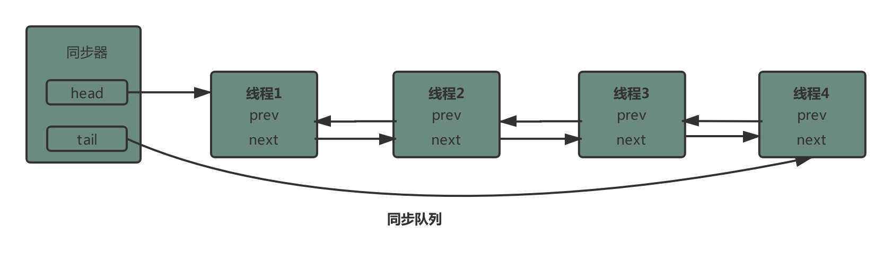

# 1，进程与线程

- 进程：

  - 一个程序由指令和数据组成。程序执行需要执行指令，数据读写，需要CPU时间片，数据加载到内存，等等操作。进程是用来加载指令，管理内存，管理IO的
  - 程序运行的一个实例

- 线程

  - 一个进程内有多个线程，线程为一个指令流，按一定顺序交由CPU执行

- ## 并行与并发

  - 并发：单核CPU下，一段时间内线程轮流执行（频繁切换）
  - 并行：多核CPU下，同一时刻，每个核执行自己的线程，同一时刻有多个线程执行

- ## 异步同步

  - 同步：需要等在结果返回，才继续运行
  - 异步：不需要等待结果返回，就能继续运行。
    - 多核CPU下，异步执行会快一些，若是单核CPU，异步执行反倒比同步执行慢一些。因为需要上下文切换

IO操作不占用CPU。但是若线程执行需要等待IO结束，则对CPU的利用率则不高

# 2，JAVA线程

## 创建线程

1. 自定义线程类继承Thread类（重写run方法）
2. 使用 Runnable 配合 Thread（把线程和任务（要执行的代码分割开））

   - 通过实现Runnable 接口来创建线程类 RThread，但是使用的时候，仍需要创建Thread 对象，把RThread的对象当成参数传入。


   - 方法1将线程与任务合并在一起，方法2是把线程和任务分开

3. FutureTask配合Thread（**可以获取线程的返回值**）

   1. 创建FutureTask，并传入Callable类，重写方法，**可以设置返回值。**

   2. （1）创建一个类实现Callable接口

      （2）重写 call() 方法
      （3）传入Thread

   ```Java
       FutureTask<Integer> task = new FutureTask<Integer>(
                   new Callable<Integer>() {
                       @Override
                       public Integer call() throws Exception {
                           log.debug("aaaa");
                           return 1000;
                       }
                   }
           );
           new Thread(task).start();
   		//获取多线程的返回值
           Integer integer = task.get();
   
           log.debug("running");
   ```

   主线程能够接收Callable类型的参数

4. 基于线程池的execute()，创建临时线程

   1. （1）创建线程池

      （2）调用线程池的execute()方法

      （3）采用匿名内部类的方法，创建Runnable对象，并重写run()方法


## 查看进程线程的方法

- linux：
  - top查看所有进程（包括占用内存，CPU等情况）
  - `top -H -p <PID>`  查看某个进程下的线程。没有PID号，则查看所有线程，有则查看指定线程
- **Java**
  - `jstack <PID>`  查看某个Java进程的所有线程状态
  - `jstack 进程号 | grep 线程ID`   查找该进程下某线程的详细情况

## 线程上下文切换

- **CPU不再执行当前线程的原因：**
  1. 线程的CPU时间片用完
  2. 垃圾回收
  3. 调用了阻塞类型的系统中断，比如请求 IO，线程被阻塞。
  4. 线程自己调用了sleep,yield,wait,join,park,synchronized、lock 等方法
- 线程切换需要使用程序计数器。是线程私有的
  - **程序计数器保存jvm要执行的下一条指令地址。**
  - 保存当前线程的运行状态，方便切换。
  - 运行转态包括：程序计数器，虚拟机栈中的每个栈帧的信息，（局部变量，操作数栈，返回地址）
- 频繁切换线程消耗性能

## 线程常见方法

- start（）与run方法
  - 直接调用线程的run()方法，仅仅是调用thread类的方法，在main线程执行，没有创建新线程
  - 调用start()，启动新线程，新线程会间接执行run方法
  - **一个线程多次调用start（）会报错**
- sleep（）与yield()
  - sleep
    - Thread的静态方法，使得当前线程由运行态转为阻塞态，陷入睡眠。让出CPU占用，若此时持有锁，则带锁一起阻塞。不会释放。
    - sleep会阻塞设定的时间，不会被其他notify（）方法唤醒。但是可以被interrupt 方法打断。
    - **睡眠结束后，会进入就绪态，等待CPU时间片的分配，未必会立刻得到执行**
  - yield
    - 使得当前线程由运行态转为就绪态。
    - 当该线程重新获得CPU时间片后，由于程序计数器，不会再次执行该条yield（）指令
  - **sleep应用：防止CPU占用100%**
    - 在服务器长时间运行，未避免没有请求来时，while(true)空转浪费CPU资源，可以使用sleep让如CPU的使用。sleep则陷入睡眠，让出CPU占用
- join()与join（long n）
  - **join（）：线程对象调用该方法，等待该线程结束**
  - join（long n）等待线程运行结束，等待指定时间，即若线程执行结束，等待时间未结束，依然会进行等待
  - join()方法的底层就是wait
  - ```
    线程对象.join();     // 执行该语句的线程 会等待该线程对象的线程先执行结束    （该线程对象与执行该语句的线程不是一个）
    ```
- interrupt()    打断线程
  - 若打断的线程正在sleep，wait，join正睡眠的线程，会导致被打断线程抛出 InterruptedException异常，**并清除打断标记,即打断标记位为false**
  - 打断的正在运行的线程，则会设置 打断标记 ；park 的线程被打断，也会设置 打断标记（）。**interrupt并不会直接打断运行的线程，而仅仅是改变打断标记，由运行线程判断并进行下一步处理。若不处理，也不会停止线程**
  - interrupt()会打断调用park而阻塞的线程，**但不会清空打断状态，即当前线程打断标记为true，则不能进入park阻塞态，park（）方法失效**
    - `interrupt()`会使得`中断状态`为true，并调用`unpark`。所以会打断因为park而正在阻塞的线程。
- interrupted()  static方法，判断当前线程是否被打断。
  - **无论是否有打断标记，都会清除当前线程的标记**

## 主线程和守护线程

- 主线程：默认Java进程需要等待所有进程执行结束才执行结束。
- 守护线程，只要其他非守护线程执行结束，即使守护线程没执行完，也会**强制结束**，垃圾回收器线程就是Java线程的守护线程
  - // 设置该线程为守护线程
    t1.setDaemon(true);

## 线程状态（六种）

- 

- **new状态：**线程创建但没有调用start（）运行
- **Runnable状态：**
  - 调用start（）方法，就绪态，运行都是Runnable状态，即有没有分配时间片是都Runnable状态。
  - **一些IO操作陷入阻塞，也是运行状态**
- 阻塞态：（**这三种阻塞态不会分配时间片**）**阻塞方式不同，分为不同的阻塞态**
  - **BLOCKED ：**没抢到锁，阻塞，**等待下一次竞争**
  - **waiting：**线程调用了wait方法，未指定阻塞时间
    - 经过notify（）和notifyAll（）唤醒后，或者interrupt打断，wait会重新竞争锁，
      - 若抢到锁，则进入Runnable状态
      - 没抢到，则进入BLOCKED 状态
  - **TIMED_WAITING：**线程调用了sleep(long n)或者wait(long n)指定阻塞时间
- **TERMINATED** 当线程代码运行结束

# 3，共享模型之管程（synchronized）

## 3.1 共享问题

- 对共享资源的更新操作会造成了多线程的结果不一致

## 3.2  synchronized

- synchronized对象锁，采取互斥的方式，最多只有一个线程能持有对象锁。其他线程获取对象锁，则会阻塞。

- synchronized保证三大特性：

  - 原子性：
    - **通过对象锁保证了原子性，即使发生了线程切换，由于其他线程没有对象锁，也无法进行打断**
  - 可见性：
    - 每次synchronized上锁，都会在主存中读取对应的变量到本地内存中，synchronized代码块执行后，会将线程内的本地内存更新到主存中，来保证更新的可见性。来保证读取的可见性
  - 有序性：
    - synchronized保证单线程执行，所以指令重排都对执行成功。指令重排保证单线程下结果正确
  
- 场景题：线程1：i++100次，加synchronized锁，线程2：i--，100次，没加synchronized锁。最终结果会是0吗？

  - **不会**，线程1，保证了每次执行必须要获取锁对象，线程2执行，不必获取锁对象，即不必等待线程1释放锁，不必等待线程1执行完一次i++操作。线程2直接在内存中获取值。**不会为0**

- 使用：

  - 代码块加锁

    - ```Java
      synchronized(对象) // 线程1， 线程2(blocked)
      {
      临界区
      }
      ```

  - 方法加锁

    - 普通方法加锁，锁对象为当前类实例

    - ```Java
      public synchronized void test() {
      }
      
      ======>等价于
      class Test{
          public void test() {
              synchronized(this) {
              }
          }
      }
      ```

    - static方法加锁，锁对象为类对象

    - ```java
      class Test{
      	public synchronized static void test() {
      	}
      }
      ====>等价于
      class Test{
          public static void test() {
              synchronized(Test.class) {
              }
          }
      }
      ```

  ## 3.4 变量的线程安全

  - 成员变量
    - 若成员变量没有共享，则是线程安全
    - 若成员变量有共享，仅仅是读操作，也是线程安全
    - 若共享且为更新操作，则需要考虑线程安全（因为指令重排，只保证单线程的线程安全）
  - 局部变量
    - **局部变量是线程安全的**
    - 该线程逃离了该方法的作用范围，则需要考虑线程安全
  - 场景：方法1，ArrayList添加元素，方法2：创建新线程删除元素。
    - 若方法2没有创建新线程，且ArrayList为该类的对象，则线程安全
    - 创建线程，由于指令重排，不会对新创建线程的位置考虑，所以可能会报错（指令重排下，可能删除元素早于添加元素）

## 3.5 线程安全类

- String
- Integer
- StringBuffer
- Random
- Vector
- Hashtable
- java.util.concurrent 包下的类

线程安全类：即多个线程调用同一个对象的某个方法时线程安全的。即调用每个方法时加锁，是原子的。**但多个方法的组合不是原子的**

String，Integer为不可变类，因为内部状态不可变，String底层为 

```Java
 private final char value[];
```

- **String底层为char数组，并且是final，private，不能被修饰和改变。 replace，substring方法为创建新String对象。**
- final修饰的变量，不一定是线程安全的，若基本变量，是线程安全的。若为引用对象，且是非线程安全类，final仅保证该对象地址不变，并不能保证对象实例的属性没有改变

## 3.6 Monitor

**Java对象头**：每个对象都有对象头和对象实例


**Monitor（锁的底层实现）**

每个Java对象都可以作为锁对象，**与Monitor进行关联**

Monitor结构如下：

​		waitSet  等待集合（调用wait方法）

​		EntryList： 阻塞队列（竞争锁失败）

​		Owner ： 持有者


- 开始时，Monitor中的Owner为null。**Monitor由操作系统提供**
- 当线程2执行synchronized(obj) 指令。
  - jvm执行monitorEnter指令
  - obj对象由于没有加锁，则将obj对象头与Monitor进行关联，关联后，obj对象头中的Mark Word指向Monitor地址，锁计数器+1；
- Monitor的Owner指向线程2
- 若线程3，执行synchronized(obj) 指令，查看obj是否关联了Monitor，是否关联了主人Owner，owner是否与当前线程相同（如果可以锁重入，则锁计数器+1）
- 此时线程2为Owner，所以此时线程3进入EntryList队列，进行排队。等待线程2执行结束，竞争锁


解锁：

- jvm执行monitorExit 
- 根据锁对象的Mark Word找到Monitor对象
- 判断锁计数器是否为1，不为1，status--，为1，删除该锁
- Monitor对象的owner对象设为null，唤醒EntryList阻塞对象中的线程。


## 3.7 synchronized优化

### 偏向锁

一个线程反复的去获取/释放一个锁，如果这个锁是轻量级锁或者重量级锁，不断的加解锁显然是没有必要的，造成了资源的浪费。于是引入了偏向锁，偏向锁在获取资源的时候会在资源对象上记录该对象是偏向该线程的，偏向锁并不会主动释放，这样每次偏向锁进入的时候都会判断该资源是否是偏向自己的，如果是偏向自己的则不需要进行额外的操作，直接可以进入同步操作。
- 偏向锁：锁对象第一次被线程占用，CAS将线程ID设置到对象的Mark Word中，**默认开启偏向锁**
  - **即第一次作为锁对象，会将锁对象设置为偏向锁，会保存锁对象的偏向锁状态，直到出现锁撤销**
  - 开启偏向锁之后，Mark Word内容为线程ID。。。信息，而不是普通的hashcode，age等信息
  - 
- 之后锁重入在只有当前线程锁重入时，不必进行CAS获取锁（避免资源消耗）
- **若有其他线程使用该锁对象，升级到轻量级锁，偏向锁与轻量级锁都没有发生竞争**，若发生竞争，则升级为重量级锁。加锁执行完成后，退出锁作用部分，锁对象Mark Word部分变为Normal。
- **偏向锁撤销**
  - 若调用了锁对象的hashCode()，偏向锁失效，转为普通状态
  - 多个线程使用该锁对象，（交替使用，未发生竞争），则偏向锁升级为轻量级锁
  - 调用wait/notify()方法，会撤销锁对象的偏向锁
- **批量重偏向**
  - 原对象加偏向锁，由于另一个线程使用时，升级为轻量级锁，退出锁后，对象头的Mark Word转为normal格式。无锁状态；
  - 撤销偏向锁的次数超过阈值，默认20次，则会对将加锁对象重偏向项到新加锁线程；
  - **锁对象并不是同一个对象，而是同一个类。而是jvm发现撤销偏向锁太多，且都偏向同一个线程，所以进行重偏向**
- 批量撤销
  - 撤销偏向锁的阈值超过40次，jvm会将加下来该类的所有对象设为不可偏向，新建对象也不可偏向

### 轻量级锁

- 一个对象，多线程访问，但没有竞争，则可以使用轻量级锁

- 使用语法：仍为synchronized

- **轻量级锁加锁流程：**

  - 加锁：

    - 每个线程的栈帧都会包含锁记录结构，创建锁记录对象（一个锁记录对应一个当前线程持有的锁对象），锁记录内部包含当前线程持有锁对象的Mark Word

    - 锁记录中的Object reference指向锁对象，并尝试用CAS将锁对象头的mark word标记为轻量级锁标记（Mark Word为锁记录地址），锁对象头的hashcode等信息保存在锁记录中（对象头空间有限，只能在放锁记录中，获取时，通过对象头中的锁记录地址查找到hashcode等信息）。加锁完成

    - 

    - CAS失败：

      - 其他线程占用该锁，有竞争，进行锁膨胀
      - 锁重入问题，需要在当前线程加入一个新的锁记录

      

  - 解锁：

    - 获取最后一条锁记录，若锁记录的值为null，表明有锁重入，删除最后一条锁记录
    - 若不为null，则使用CAS将对象头中的Mark Word替换原来的轻量级锁（即擦除对象头中的锁记录信息）
      - CAS成功，解锁成功
      - 失败，轻量级锁已经进行了锁膨胀，或升级为重量级锁

### 锁膨胀

- 锁对象已经被其他线程加上轻量级锁，其他线程在尝试加轻量级锁时，无法成功，进行锁膨胀，转为重量级锁
- **锁膨胀流程**
  - 该线程尝试加轻量级锁时，无法成功，申请Monitor锁，并锁对象的Mark Word指向Monitor地址（即重量级锁地址）
  - 该线程进入Monitor中的EntryList阻塞对象


- 解锁流程与重量级锁一致：
  - 首先持有锁线程尝试以轻量级锁方法CAS解锁，不成功，进入重量级锁流程
  - 按照 Monitor 地址找到 Monitor 对象，设置 Owner 为 null，唤醒 EntryList 中 BLOCKED 线程

### 锁自旋

- **只有在重量级锁竞争的时候**，可以使用锁自旋，尽量避免自旋 （轻量级锁没有锁自旋）
- 锁自旋是自适应的，即锁的自旋次数是不固定的。与之前锁自旋成功的记录有关
- 上次自旋成功，则本次自旋次数 = 上次自旋次数 + 1；上次自旋失败，则本次自旋次数= 上次自旋次数 - 1

### 锁消除

编译器的一种优化方式：

- **即时编译器JIT会对代码进行优化，若需要加锁的过程不可能存在共享数据竞争，则该锁进行消除**
- JIT进行逃逸分析，若该锁对象不会逃出方法，且其他线程不会访问锁对象，则该锁会被优化掉

## 3.8 wait & notify

- wait():object的原生方法，使当前线程陷入waitSet阻塞
- notify()：唤醒在waitSet阻塞的**任意一个线程**。**不能唤醒sleep（）方法阻塞的线程**
- notifyAll()：唤醒所在在waitSet阻塞的线程。
- **为Object的方法，必须获取对象锁才能调用该方法**
- sleep(long n)与wait（long n）的区别：
  - sleep为Thread的静态方法，wait是object方法
  - sleep不需要强制与 synchronized 使用，wait需要加锁后，才能执行调用
  - 在使用 synchronized后，调用sleep或wait都会陷入阻塞，但是sleep会带着锁一起阻塞，wait会在等待时释放锁

**使用方式**

```Java
synchronized(lock) {
	while(条件不成立) {
	lock.wait();
	}
// 干活
}
//另一个线程
synchronized(lock) {
	lock.notifyAll();
}
```

## 同步模式-保护性暂停

**多个线程间的消息传递**

- 多个线程，让他们关联同一个 GuardedObject
- 如果有结果不断从一个线程到另一个线程那么可以使用消息队列（见生产者/消费者）
- JDK 中，join 的实现、Future 的实现，采用的就是此模式
- 因为要等待另一方的结果，因此归类到同步模式


t1线程等待某个资源，t2获取到该资源后，唤醒t1，使其执行。

- 多个线程之间使用一个对象不方便，所以设计一个中间类，进行解耦。
- 能够解耦【结果等待者】和【结果生产者】，还能够同时支持多个任务的管理。
- 生产者消费者模式的区别
  - 同步模式下生产者与消费者是一一对应的，rpc 框架的调用中就使用到了这种模式。
  - 生产者消费者模式并不是，可以多对一

## 异步模式-生产者/消费者模式

**多个线程间的消息传递**

- 与保护性暂停不同，不需要产生结果和消费结果的线程一一对应
- 生产线程只生产结果数据，消息线程只消费线程
- 消息队列有容量限制，以此来平衡生产和消费的线程资源

同步：生产者产生消息后，被立刻消费

异步：生产者产生消息后，在阻塞队列等待，没有立即被消费

## 3.9 Park& Unpark

park（）：使当前线程阻塞

Unpark（**线程对象**）：恢复当前线程的运行

**与Object的wait&notify（）对比：**

- wait,notify,notifyAll必须配合监视器一起使用（即必须获取对象锁），而park&unpark不用
- **Park& Unpark以线程为单位 来阻塞和唤醒线程，可以精确唤醒线程**，而notify只能随机唤醒一个等待线程，notifyAll唤醒所有线程，**无法精确唤醒某个唤醒**
- **park & unpark 可以先 unpark**，而 wait & notify 不能先 notify


- ### Park& Unpark原理

  - 每个线程都有自己的Parker 对象，由三部分组成 _counter ， _cond 和 _mutex 
    - `_counter` 表示当前线程是否有unpark，有=1，没有=0,（多次unpark也是1，不会累加）
    -  `_mutex` 互斥锁， `_cond`阻塞队列
  - **Park**
    - 当前线程调用Unsafe.park（）方法
    - 当前线程的`_count`是否为1，为0，则获取`_mutex` 互斥锁
    - 线程进入 `_cond` 条件变量，阻塞（此时已经阻塞，更改count值为唤醒后执行）
    - 设置`_count`=0
  - **Unpark**
    - 调用Unsafe.unpark(Thread_0) 方法，设置 _counter 为 1
    - 唤醒 `_cond` 条件变量中的Thread_0
    - Thread_0继续运行
    - _counter 设为0
  - Unpark先于Park执行，在执行到Park后，不会陷入阻塞，而是继续执行。**多次Unpark，也只能`_count`=1，不实现累加**
    - Park时，发现当前线程`_count`为1，无需阻塞，继续执行
    - 设置`_count`=0

## 检查死锁

- TOP指令查看所有进程的CPU占用情况
- 通过jps，定位进程ID
- TOP -H 进程ID，获取该进程下所有线程的CPU占用情况
- jstack  进程。查看当前进程下的所有线程信息，可以查看是否有死锁情况

## 活锁

活锁出现在两个线程**互相改变对方的结束条件**，谁也无法结束。

**避免活锁的方法：**

在线程执行时中途给予不同的间隔时间

**死锁和活锁的区别：**

- 死锁是因为线程互相持有对方想要的资源，并且不释放已有资源，则造成线程阻塞，停止运行（无法运行）
- **活锁是因为多线程间修改了对方的结束条件，代码一直运行，却无法停止**（无法结束）

## 饥饿

某些线程因为优先级太低，导致无法获取资源的现象，即没有陷入死锁，却无法执行

出现场景：**使用顺序加锁时，会出现饥饿现象**

## 3.13 ReentrantLock

使用该锁：该类继承ReentrantLock方法（类锁），或者创建ReentrantLock对象。对象锁

与synchronized 相比的特点

- 可中断
  - 可以中断阻塞队列指定的线程，使其放弃锁的竞争，停止运行
- 可以设置超时时间
- 可以设置公平锁，非公平锁
- 支持多条件变量（即有多个waitSet阻塞队列）


ReentrantLock特点

- ### 1）可重入

  - 同一个线程在已经获取锁未释放的情况下，可以再次获取该锁，进入synchronized ，lock代码块

- ### 2）可打断（interrupt（）方法）

  - 使用lock.lock()方法为不可打断锁，即打断无效果

  - lock.lockInterruptibly(); ：为可打断锁

  - 可打断：**处于阻塞队列的线程，被打断了跳出阻塞，停止运行**，只用于阻塞队列

- ### 3）锁超时

  - lock.tryLock（）尝试释放锁，成功返回true，失败返回false。
  - tryLock(long timeout, TimeUnit unit)：可以指定等待时间，**为重载方法**，若等待时间内锁对象释放，会立即竞争锁，而不是将等待时间结束

- ### 4）公平锁

  - **ReentrantLock默认不是公平锁**
  - 开启公平锁，创建ReentrantLock时，new ReentrantLock（true）
  - 会降低并发度，使用不多
  - 公平锁：
    - 线程竞争锁，若阻塞队列不为空，则会选择阻塞队列头结点的线程来获取锁
  - 非公平锁
    - 线程竞争锁，若竞争时，有一个新线程要获取对象，还没有进入阻塞队列，则此时会与阻塞队列头结点一起竞争锁

- ### 5）多条件变量

  - waitSet中的线程都是waiting（调用wait方法陷入阻塞），entryList中的是blocked（竞争锁失败）

  - 支持多条件变量，本质是有多个阻塞队列，使得当前线程能进入指定的阻塞队列，方便唤醒指定阻塞队列，而不用唤醒所有的阻塞线程

  - 使用：

    - 创建新条件

      ```Java
      Condition waitCigaretteQueue = lock.newCondition();
      ```

    - 获取锁后才能执行await（）方法

      ```java
      waitCigaretteQueue.await（）
      ```

    - await（）执行后会释放锁，进入指定的阻塞队列

    - 唤醒指定阻塞对列的线程signal

      ```Java
      waitCigaretteQueue.signal();
      ```

    - 竞争 lock 锁成功后，从 await 后继续执行

### 哲学家问题

有五个哲学家，他们的生活方式是交替地进行思考和进餐。他们共用一张圆桌，分别坐在五张椅子上。

在圆桌上有五个碗和五支筷子，平时一个哲学家进行思考，饥饿时便试图取用其左、右最靠近他的筷子，只有在他拿到两支筷子时才能进餐。进餐完毕，放下筷子又继续思考。

你打算怎么写代码


- 哲学家对象，需要传入左右筷子锁对象。只有占有这两个锁才能吃饭。**以哲学家为线程**，五个哲学家，五个线程

- 将筷子作为锁对象实现reentrantlock（）锁，创建五个对象，（c1,c2,c3,c4,c5）
- 每个哲学家吃饭需要左右两根筷子。吃饭过程为**while（true）**
  - while（true）
    - 首先获取左筷子锁对象，**tryLock（）方法**
    - 再获取右筷子锁对象  tryLock（）方法
      - 吃饭
    - 释放右筷子锁对象
    - 释放左筷子锁对象
  - 若获取锁对象失败，则释放已经获取的锁，并进行下一次循环


# 5，共享模型之内存（volatile）

**volatile只适用于：**（其他情况不使用）

- 一个线程写，多个线程读的情况，**不适用多线程写的情况**
- **synchronsize代码块内部仍然会出现指令重排问题，尤其一个变量的作用域超出synchronsize代码块，需要使用使用volatile来避免指令重排问题**。所以volatile与synchronize是合作关系，而不是对立的存在。两个关键词搭配使用。

## 5.1 内存模型（JMM）

- JMM（将内存分为两部分）
  - 主存：所有线程共享的数据
  - 工作内存 ：每个线程私有的数据

- ## **原子性**：

  - **volatile不能保证原子性**
  - 一个操作不能被中断，要么全部执行成功，要么全部失败
  - 一个操作一旦开始，就不会被其他线程所干扰

## 5.2 可见性

一个线程对变量的修改对其他线程可见

- synchronize：可以实现可见性
  - 在执行代码块时，从主存中读取最新的数据到工作内存，再执行代码块。维护了可见性。
  - 为避免，在执行代码块期间，其他线程对代码块中引用的变量进行修改，则需要volatile对一些变量进行修饰，保证实时的可见性。所以是：volatile与synchronize搭配使用

**volatile：可以保证可见性**，不能保证原子性

- **两个线程 volatile变量修饰的i，一个进行i++，一个进行i--，能得到想要的结果吗？**

  - **不能。**（此时多线程的执行没有保证原子性）

  - i++与i--对应jvm四条指令

    ```Java
    getstatic i // 线程1-获取静态变量i的值 线程内i=0
    iconst_1 // 线程1-准备常量1
    iadd // 线程1-自增 线程内i=1
    putstatic i // 线程1-将修改后的值存入静态变量i 静态变量i=1
    ```

  - 所以多线程的执行可能会产生指令交错，（只要不是一条指令，而是多条，就会出现交错）

  - **有可能:**线程1，读取i，线程2读取i，并执行i--，四条指令，然后线程1再执行i++操作。（既保证了可见性，又出现了指令交错，并未得到想要的结果）

## 5.3 有序性

volatile 能保证有序性；

**指令重排**：jvm在**不影响单线程准确性**的前提下，调整语句的执行顺序

指令重排存在的原因：

- 每条指令分为五阶段：`取指令-指令译码-执行指令-内存访问-数据写回`
- 在不影响程序结果的前提下，这些指令的各个阶段可以通过重排序和组合来实现指令级并行。（因为出现了jvm为了提高吞吐量进行了并行运行指令）
  - **即：现在CPU支持多级指令流水线，一条指令分为5个阶段，可以同时运行五条指令的不同阶段，这样虽然没有提高单条指令的执行时间，但提高了指令的吞吐率。**
  - 就像烧饭做菜，可以先烧上饭，烧着同时进行炒菜

## 5.4 volatile原理

volatile的实现原理是：**内存屏障**，可以理解为一个分界线，指令重排不能越过该分界线，并且分界线一边（读写屏障）所有的操作都会同步到主存中。

**可见性：**

- 对volatile变量的写指令后会加入**写屏障**
  - **写屏障保证在该屏障之前所有对共享变量的改动都同步到主存中**
- 对volatile变量的读指令前会加入**读屏障**
  - **读屏障保证该屏障后的所有对共享变量的读取，都加载的是主存中最新的数据**

**有序性**

- **内存屏障为一个分界线，指令重排不能越过该分界线**
- 写屏障会确保指令重排序时，不会将写屏障之前的代码排在写屏障之后
- 读屏障会确保指令重排序时，不会将读屏障之后的代码排在读屏障之前
- **volatile不能解决线程间的指令重排**，**volatile仅保证内存屏障在该线程内有效，作用域在本线程**，其他线程的读取操作可能并不在当前线程的读写屏障中。
  - 例子：两个线程，一个i++，一个i--，volatile修饰
    - 即使可见，有序，也仅仅是一个线程内，不能保证2线程的读取i指令晚于1线程的i++所有操作。还是因为指令重排，i++在jvm层面是四个指令，指令重排的作用下，可能出现,线程一获取i的值0，线程二获取i的值0，再各自执行对应的操作，即保证了可见性和有序性，也得不到想要的结果。

## 单例设计模式问题

单例方式：饿汉、懒汉、静态内部类、枚举类

问题：

### 懒汉式

```Java
public final class Singleton {
    private Singleton() { }
        // 问题1：解释为什么要加 volatile ?
        private static volatile Singleton INSTANCE = null;
        // 问题2：对比实现3, 说出这样做的意义
        public static Singleton getInstance() {
            if (INSTANCE != null) {
            	return INSTANCE;
            }
            synchronized (Singleton.class) {
                // 问题3：为什么还要在这里加为空判断, 之前不是判断过了吗
                if (INSTANCE != null) { // t2
                	return INSTANCE;
                }
            INSTANCE = new Singleton();
            return INSTANCE;
        }
    }
}
```

- 问题1：
  - **volatile此时主要是避免因为指令重排而出现的问题**
    - 若创建对象 [INSTANCE = new Singleton()] 出现重排序，先给INSTANCE赋予地址值，但单实例此时没有完全初始化。后续线程进入getInstance方法，因为INSTANCE不为空（第一个判断），会获取到还没有初始化完成的单实例。**单实例有问题**
  - volatile加入了写屏障，使得INSTANCE赋值之前，其他指令已经完成。
  - 保证了可见性
- **问题2：实现3为在单实例获取方法上加synchronized**
  - 避免了已经创建对象，却仍要竞争锁的情况，（影响速度）
- **问题3：**
  - 在INSTANCE为null时，多个线程同时来获取单实例，第一次判断INSTANCE为null。只有一个线程竞争到锁并创建了对象，其他线程也会继续竞争锁，进入synchronized方法，若没有该判断，则会继续创建对象，而不是使用已经创建的对象

### 饿汉式：

```java
// 问题1：为什么加 final
// 问题2：如果实现了序列化接口, 还要做什么来防止反序列化破坏单例
public final class Singleton implements Serializable {
    // 问题3：为什么设置为私有? 是否能防止反射创建新的实例?
    private Singleton() {}
    // 问题4：这样初始化是否能保证单例对象创建时的线程安全?
    private static final Singleton INSTANCE = new Singleton();
    // 问题5：为什么提供静态方法而不是直接将 INSTANCE 设置为 public, 说出你知道的理由
    public static Singleton getInstance() {
    	return INSTANCE;
    }
    public Object readResolve() {
    	return INSTANCE;
    }
}
```

1. 避免继承，子类继承后可以改变getInstance()方法
2. **反序列化会创建一个新的对象，与单例模式的创建对象不同**，可以在该类中添加readResolve()方法，返回单实例
3. 单实例对象的构造器当然不能暴露出来，但是不能阻止反射的方式创建新对象
4. 能保证
5.    1.提供更好的封装性；2.提供范型的支持

###  枚举单例

默认实现序列化接口

```Java
// 问题1：枚举单例是如何限制实例个数的：创建枚举类的时候就已经定义好了，每个枚举常量其实就是枚举类的一个静态成员变量
// 问题2：枚举单例在创建时是否有并发问题：没有，这是静态成员变量
// 问题3：枚举单例能否被反射破坏单例：不能
// 问题4：枚举单例能否被反序列化破坏单例：枚举类默认实现了序列化接口，枚举类已经考虑到此问题，无需担心破坏单例
// 问题5：枚举单例属于懒汉式还是饿汉式：饿汉式
// 问题6：枚举单例如果希望加入一些单例创建时的初始化逻辑该如何做：加构造方法就行了
enum Singleton {
 INSTANCE;
}
```

### **静态内部类懒汉式**

```Java
public final class Singleton {
    private Singleton() { }
    // 问题1：属于懒汉式还是饿汉式：懒汉式，这是一个静态内部类。类加载本身就是懒惰的，在没有调用getInstance方法时是没有执行LazyHolder内部类的类加载操作的。
    private static class LazyHolder {
        static final Singleton INSTANCE = new Singleton();
    }
    // 问题2：在创建时是否有并发问题，这是线程安全的，类加载时，jvm保证类加载操作的线程安全
    public static Singleton getInstance() {
        return LazyHolder.INSTANCE;
    }
}
```

# 6，共享模型之无锁（CAS）

**CAS：**获取对象旧值，内存值，新值，若旧值与对象值比较相等，则进行设置新值，否则进行下一次循环或者其他操作

**CAS底层**

- CAS底层使用的是**lock cmpxchg指令**（X86架构）（发音：compareXchange），无论单核CPU还是多核CPU都是使用该指令
- CAS算法在操作系统底层是对应一条 **cmpxchg** 字节码指令，指令的作用就是比较并且交换操作数，并且在多处理器的情况下，会在 cmpxchg 字节码指令前面加上 lock 前缀，确保了对内存的读写操作的原子性。
- 在多核状态下，某个核执行到带 lock 的指令时，CPU 会让总线锁住，当这个核把此指令执行完毕，再开启总线。这个过程中不会被线程的调度机制所打断，保证了多个线程对内存操作的准确性，是原子的。

## CAS 的特点

- CAS是基于乐观锁的思想：最乐观的估计，不怕别的线程来修改共享变量，就算发生了修改，我所在线程重试即可
- synchronized 是基于悲观锁的思想：最悲观的设计，得防着其他线程来修改共享变量，我所在操作进行上锁，其他线程不能操作，我执行完，其他线程才能执行
- **CAS 体现的是无锁并发、无阻塞并发**
  - 优点：
    - 使用乐观锁，**无锁并发、无阻塞并发。**效率高
    - **因为没有synchronized，所以线程不会陷入阻塞，这是效率提升的原因之一**
  - 缺点
    - 但如果线程竞争激烈，重试循环必然频繁发生，反而效率不高。使得循环时间长开销大。
    - **可能会出现ABA问题**
      - CAS算法实现一个重要前提需要取出内存中某时刻的数据并在当下时刻比较并交换，那么在这个时间差中会导致数据的变化
      - 即，多个线程获取到旧值A，一个线程执行了多次操作，将旧值A替换为B，然后又将B替换为了A。另外的线程在CAS验证时，发现与旧值A相同，则执行成功。但是过程是有问题的

## CAS应用-原子类

原子类：**内部方法是原子操作，实现方式应用的CAS。是线程安全的**

**内部实现都调用的Unsafe类中的方法**，为native修饰的c,c++方法

- 原子整数：

  - AtomicBoolean，AtomicInteger，AtomicLong

- 原子引用（可以指定要操作的类，而不仅仅是基本数据类型）

  - 原子类不仅修改基本数据类型，可能是修改一个对象，可以使用原子引用。通过泛型传入对象

  - AtomicReference，AtomicMarkableReference，AtomicStampedReference

  - ```Java
    AtomicReference<BigDecimal> ref = new AtomicReference<>(balance);
    ```

- AtomicStampedReference：**解决ABA问题**

  - 每个原子引用不仅比较对象，还会比较版本号，看版本是否一致。解决了对象经过多次修改，则和原来的对象一致的问题。

  - **利用原子引用+修改版本号**（类似[时间戳](https://so.csdn.net/so/search?q=时间戳&spm=1001.2101.3001.7020)），每次需要获取到版本最新的值进行处理。

    - ```Java
      ref.getStamp()  //当前版本
       ref.getReference()  //获取引用值
      ```

      

- AtomicMarkableReference：简化版的时间戳原子引用：

  - CAS操作并不关注版本更新了几次，只需要关注CAS此次执行期间，其他线程是否更改过，至于更新了几次，并不关注。所以可以选择Boolean类型作为版本号

  - ```Java
     ref.getReference()  //获取引用值
     ref.isMarked();   //获取当前版本标记
    ```

- 原子数组：AtomicIntegerArray 

  - **原子数组是线程安全的，普通数组不安全**

## 原子累加器：LongAdder

- **设置累加器，比普通的原子类加法更快**，CAS在高并发下，极大的浪费CPU性能（无法更新值，只能继续循环），所以出现了原子累加器

- ### 原因：

  - **在有竞争时，设置多个累加单元，Therad-0 操作 Cell[0]，而 Thread-1 操作Cell[1]… 最后将结果汇总，在一次循环中进行多个累加单元的操作，减少了CAS失败重试次数。提高性能**

- ### 源码

  - LongAdder 类有几个关键域

  - ```Java
    // 累加单元数组, 懒惰初始化
    transient volatile Cell[] cells;
    // 基础值, 如果没有竞争, 则用 cas 累加这个域
    transient volatile long base;
    // 在 cells 创建或扩容时, 置为 1, 表示加锁，0表示没加锁
    transient volatile int cellsBusy; 
    ```

- ### 原理：

  - 本质也是通过CAS进行累加

  - ```Java
    // 防止缓存行伪共享
    @sun.misc.Contended
    static final class Cell {
        volatile long value;
        Cell(long x) { value = x; }
        // 最重要的方法, 用来 cas 方式进行累加, prev 表示旧值, next 表示新值
        final boolean cas(long prev, long next) {
            return UNSAFE.compareAndSwapLong(this, valueOffset, prev, next);
        }
        // 省略不重要代码
    }
    ```

  - @sun.misc.Contended注解：


## LongAdder（原子累加器）-多读多写的情况

一写多读的情况，volatile+CAS可以很好的解决对应的并发问题（普通原子类），**但高并发情况下，是多写的情况，则上述方法不适用。可以选择原子累加器**

普通原子类：多个线程竞争处理一个变量，高并发情况下，竞争激烈，多次循环，占用CPU性能。

LongAdder:设置一个cell数组，降低并发，每个线程处理不同的cell，该变量为所有cell的累加。降低了写操作的并发度。与currentHashMap类似


- LongAdder
  - **本质是以空间换时间，在高并发，竞争大的情况下性能好**，内部维护了一个base，和一个cell[]，cellsBusy锁。
    - base：基础值，若没有竞争，则直接通过CAS设置值，不需要使用cell[]
    - cell[]:累加单元，是惰性初始化，（使用时才初始化，尽量避免占用内存）
    - cellsBusy：数组锁，1：表示加锁（初始化cell[]，创建cell[i]中的cell，或者扩容时cell[] 都加锁），0，没加锁
  - **求取真正的值，并不精确，只是一个接近值，因为求和过程中，仍可能会出现并发更新**
  - 功能实现：
    - cell防止缓存行伪共享
      - 缓存行：CPU与内存速度差异大，可以内存中的数据预读到多级缓存中，可以提高速度。多次缓存以缓存行为单位。一个缓存行为64byte。
        - 由于CPU是多核，所以可以同一份数据会保存到多个CPU核的多级缓存中。（即每个CPU核都有一个多级缓存，CPU读取数据优先在缓存中读取，速度快）。
        - 若一个CPU核改变了多级缓存中的数据，会导致所有核中多级缓存关于该变量的整个缓存行失效
      - cell为数据形式，24byte，一个缓存行可以保存两个cell。若更新一个cell会导致另一个cell也失效，降低CPU操作速度
      - **解决办法：**@sun.misc.Contended
        - cell类添加该注解，每个cell会前后各增加 128 字节大小的padding填充
        - 使得CPU将每个cell预读到不同缓存行，一个cell 失效不会影响其他缓存行中cell
    - add（long x）方法
      1. cell[]为空表示没有竞争，没有竞争情况下，开始直接对base基础值进行CAS操作。
      2. cell！=null或者CAS失败，则使用cell[]操作变量
      3. 首先初始化cell[]，判断当前线程对应的cell[线程hash值%cell长度]是否为空，为空则进入longAccumulate，创建对应的cell
      4. 若对应的cell不为空后，经常CAS赋值，赋值失败，则进入longAccumulate重试或者扩容
    - longAccumulate：完成重试或者扩容操作，cell[]容量最大为CPU核数（最大并发线程数）
      - 当前有多个线程访问cell[]中的同一个元素，其中一个线程CAS失败会进行扩容
      - 每次扩容，变为之前的两倍
  - LongAdder的真正值：sum求和
    - 将每个cell进行累加，再加锁base为最后的值

## Unsafe类

原子类底层实现是通过Unsafe类实现的。为CAS的具体实现类

**看JVM**

# 7，共不可变

## final原理

看JVM

3，类加载与字节码技术->3、编译期处理


# 8，线程池

线程池优点：

- 降低资源消耗
- 提高响应速度
- 提高线程的可管理性（线程资源是稀缺的）

## 1，自定义线程池

- 阻塞队列

  - 设置阻塞队列容量，链表队列，锁，多条件变量（队列满的条件变量【生成任务的线程】，队列空时的条件变量【消费任务的线程】）多条件变量好像没什么卵用
  - 方法：从阻塞队列获取任务**（可以添加超时时间）**
    - 上锁，若队列为空，则加入队列空条件变量队列
    - 不空，获取任务，并从阻塞队列中移除该任务
    - 唤醒队列满的条件变量对应的线程（即阻塞队列不满）
  - 方法：在阻塞队列中添加任务
    - 上锁，若队列满，则加入队列满条件变量队列
    - 不满，从阻塞队列中添加该任务
    - 并唤醒队列空时的条件变量对应的线程任务（即阻塞队列不空）
  - 设置拒接策略：（与多条件变量有冲突）
    - 若执行线程数达到核心线程数，且阻塞队列已满，执行的策略
      - 死等
      - 超时等待
      - 放弃该任务
      - 抛出异常
      - 调用者自己执行

- 线程池

  - 设置核心线程数，获取任务超时时间

  - 线程集合

    - 首先判断当前执行线程是否超出核心线程数，若超出，加入阻塞队列，没有，则直接执行
    - 线程不仅执行任务，还要从阻塞队列获取任务，所以集合泛型不能为thread。而是任务。执行结束一个任务，从阻塞队列中获取下一个任务
    - 若所有任务执行结束，在线程结合中移除该线程

  - 阻塞队列


## 2，ThreadPoolExecutor

**线程池状态：**

ThreadPoolExecutor选用高三位作为线程池状态，低29位表示线程数量

**原因：**（为什么不使用另外一个数字来储存状态）

- 因为信息存储是一个原子操作，若将线程池状态与线程个数放在一起，即可用一次原子操作进行赋值


### 线程池核心参数

看复习，核心参数


### JDK提供的线程池

-  newFixedThreadPool(int nThreads)-->固定大小的线程池
  - 核心线程数==最大线程数（**没有救急线程**），也没有超时时间
  - 阻塞队列是没有容量限制，可以放任意数量的任务
  - **评价**：适用于任务量已知，相对耗时的任务
- newCachedThreadPool()-->带缓冲线程池
  - 核心线程数=0，全部是救急线程，最大线程数为MAX_VALUE，即可以无限创建
  - 救急线程的空闲存活时间为60s
  - 阻塞队列不能放入任务，容量为0.由线程直接领取任务，不放入队列（线程与任务一手交钱一手交货）
  - **评价：**线程数随着任务量不断增长，没有上限，当任务执行完毕，空闲一分钟释放线程。适用于任务数密集，但执行时间短的情况
- newSingleThreadExecutor()-->单线程线程池
  - 只有一个线程，任务多于1时，放入无限制的阻塞队列，以此来实现顺序执行
  - 任务执行完毕，这唯一的线程也不会被释放
  - **区别**：
    - 单线程线程池与新建一个线程的区别
      - 自己创建一个单线程执行任务，若执行失败，则执行结束。没有补救措施
      - 若线程池还会新建一个新的线程，保证线程池的工作
    - 单线程线程池与固定大小的线程池总线程数为1的区别：
      - 单线程线程池使用装饰者模式，对外暴露ExecutorService 接口，不能调用 ThreadPoolExecutor 中特有的方法
      - 固定大小的线程池，初始总线程数设置为1，之后还可以修改总线程数
        - 对外暴露的是 ThreadPoolExecutor 对象，可以强转后调用 setCorePoolSize 等方法进行修改
  
- **周期性线程池（newScheduledThreadPool）**
  
  - 相比于第一个固定个数的线程池强大在 **①可以执行延时任务或者周期性的执行任务，②也可以执行带有返回值的任务**
  
  - 核心线程数是需要给定一个固定值，最大线程数为Integer.MAX_VALUE，救急线程没有存活时间，一旦空闲立马回收。

### 提交任务（异步编排）

-  执行任务
  - void execute(Runnable command); 
- 提交任务，有返回值，future.get()获取返回值
  - `<T> Future<T> submit(Callable<T> task);`
- 执行全部任务集合，T为返回值类型，可以设置超时时间，超时则取消任务
  - `<T> List<Future<T>> invokeAll（）`
- 执行任一任务，传入任务集合，一个任务执行成功，则将该任务的结果返回，其他任务取消
  - `<T> T invokeAny `

### 关闭线程池

改变线程池的状态

- shutdown（）
  - 不接收新任务。
  - 将已提交的任务执行完。
- shutdownNow（）
  - 不接受新任务
  - 将阻塞队列中的任务返回
  - 打断正在执行任务的线程 

### 异步模式之工作线程

**不同任务类型，使用不同的线程池。避免饥饿，提高效率**

就像一个饭店，工人分为两种，服务员使用一个线程池来点菜。厨师使用一个线程池来做菜。	

不要：使用一个线程池，将池内的线程执行不一样的任务。

### 线程池线程数目确定

**线程数目是核心线程数**

跟任务性质有关

- 任务为CPU密集型运算
  - 线程数=**CPU核数+1**（+1是保证当某个线程因为操作系统故障导致暂停时，可以使用这额外的线程）
- 任务为IO密集型
  - IO操作时，CPU空闲。所以可以加大线程数
  - 线程数 = 核数 * 期望 CPU 利用率 * 总时间(CPU计算时间+等待时间) / CPU 计算时间 （可大概计算为 **核心线程数 * 2 +2**）

### **任务调度线程池**：

- ScheduledExecutorService（延时，定时执行任务）

  - 创建任务

    ```Java
    ScheduledExecutorService executor = Executors.newScheduledThreadPool(2);
    ```

  - 延时执行任务（加入线程池，指定延时时间后执行）

  - 定时执行任务，重复执行

    - 上一个任务执行开始的时间与下一个任务开始的时间。**指定定时时间，若上一个任务执行时间>间隔时间，则等待上一个任务执行完，直接执行下一任务**
    - 上一个任务执行结束的时间与下一个任务开始的时间。

## Tomcat线程池


- LimitLatch用来限流，可以控制最大连接个数
- Acceptor 只负责【接收新的 socket 连接】
- Poller 只负责监听 socket channel 是否有【可读的 I/O 事件】
- 一旦可读，封装一个任务对象（socketProcessor），提交给 Executor 线程池处理
- **Executor 线程池中的工作线程最终负责【处理请求】**


- Tomcat拓展了ThreadPoolExecutor，区别
  - 若总线程数达到最大线程数，新任务进来**（一般不会发生）**
    - 不会立马抛出异常，
    - 再次尝试将任务加入到队列，若仍失败，则抛出异常
  - Tomcat阻塞队列为MAX_VALUE。但是会创建救急线程，判断流程有所改变
    - 提交任务若小于核心线程数，则执行任务
    - **若提价任务数高于核心线程，此时即创建救急线程。若超出最大线程数，则加入阻塞队列。（与普通的线程池不同，普通线程池是先加入阻塞队列，阻塞队列满了以后再创建救急线程）**


## Fork/Join线程池

不了解

# AQS

## 1，简介

AQS本质是一个阻塞式锁的一个框架，，许多锁继承AQS

ReentrantLock | CountDownLatch | ReentrantReadWriteLock | Semaphore


AQS使用一个volatile的int类型的成员变量status来表示同步状态，通过内置的FIFO队列实现资源的获取排队工作，将每条要抢占资源的线程封装成一个Node节点来实现锁的分配，通过CAS完成对status的修改

status可以表示为独占模式和共享模式

### AQS内部结构

- AQS内部int变量: status 
- CLH队列(三个大牛的名字组成),为一个双向队列，内部对象类型为`Node<Thread>`
- owner：拥有当前锁的线程

**Node内部结构为**

- 成员变量：waitStatus 表明当前Node的等待状态
- 前后Node指针

**AQS同步队列的基本结构**



## 2，Reentrantlock

Reentrant默认使用非公平锁。

```Java
	final void lock() {
	 	// 没有竞争时, 直接加锁
        if (compareAndSetState(0, 1))
        	// 设置持有锁的线程
            setExclusiveOwnerThread(Thread.currentThread());
        else
        	// 有竞争, 会调用这个方法
            acquire(1);
    }

```


```Java
public final void acquire(int arg) {
        if (!tryAcquire(arg) &&
            acquireQueued(addWaiter(Node.EXCLUSIVE), arg))
            selfInterrupt();
    }
```


```Java
    private Node addWaiter(Node mode) {
        Node node = new Node(Thread.currentThread(), mode);
        // Try the fast path of enq; backup to full enq on failure
        Node pred = tail;
        if (pred != null) {
            node.prev = pred;
            if (compareAndSetTail(pred, node)) {
                pred.next = node;
                return node;
            }
        }
        enq(node);
        return node;
    }
```


```Java
final boolean acquireQueued(final Node node, int arg) {
        boolean failed = true;
        try {
            boolean interrupted = false;
            for (;;) {
                final Node p = node.predecessor();
                if (p == head && tryAcquire(arg)) {
                    setHead(node);
                    p.next = null; // help GC
                    failed = false;
                    return interrupted;
                }
                if (shouldParkAfterFailedAcquire(p, node) &&
                    parkAndCheckInterrupt())
                    interrupted = true;
            }
        } finally {
            if (failed)
                cancelAcquire(node);
        }
    }
```


```Java
public final boolean release(int arg) {
    if (tryRelease(arg)) {
        Node h = head;
        if (h != null && h.waitStatus != 0)
            unparkSuccessor(h);
        return true;
    }
    return false;
}
```

- ### 加锁过程：

  - 没有竞争，通过CAS设置status为1,
  - 设定持有锁的线程owner为当前线程

- 若有竞争：（图片可以看）**从竞争锁到进入park有三次竞争锁的机会**

  - CAS方式尝试改变status值，失败

  - 进入acquire方法，会执行tryAcquire，再次尝试改变status值，失败，判断持有锁线程是否为当前线程（判断锁重入）

  - 执行acquireQueued前先执行addWaiter（）方法，构建Node队列，node封装线程

    - 将当前线程封装到一个Node中，设置Node的waitStatus状态为0，正常状态
    - Node的创建时懒惰的，判断是否有Node队列，若没有，则创建一个哨兵，哨兵执行当前线程的Node
    - 

  - 进入acquireQueued方法

    - 内部是一个死循环，判断当前Node是否是阻塞队列第一个线程，若是，不断的尝试获取锁。失败

    - shouldParkAfterFailedAcquire方法， 将阻塞队列中哨兵Node的waitStatus改为-1。-1表示会唤醒后续Node节点。 会返回false，进行下一次循环

    - 每次循环都在尝试获取锁，失败

    - 进入parkAndCheckInterrupt方法。当前线程.park 阻塞

    - 若有多个线程竞争失败，

      

- ###  **释放锁流程**

  - 占用锁的线程执行结束，执行release()方法
    - tryRelease方法
      - 将status的状态改为0
      - 将Owner持有锁线程改为null
    - 判断阻塞队列是否不为空，并判断哨兵节点的waitStatus=-1
    - 唤醒park的线程流程
    - 
    - 回到 acquireQueued 流程
  - 竞争锁，因为是非公平锁，所以可能与新进来的线程一起竞争锁
    - 若抢占成功，将status=1，owner为抢占到的线程
    - 将原阻塞队列的头结点移除，将下一个节点设置为新的头结点，该Node清空Thread
    - 若抢占失败
    - 该线程重新进入park阻塞
    - 

- ### 可重入原理

  - 在调用lock（）方法时调用
    - 尝试CAS获取锁，获取失败
    - 判断当前线程是否与占有锁的线程相同，相同。status++。锁重入
  - 释放锁时：status--；
    - 判断status是否为0，不为0，则不释放锁
    - 为0，释放锁，并唤醒阻塞队列的其他线程

- ### 可打断原理

  - **reentrantlock默认是不可打断的，**
  - 不可打断模式
    - 此模式下，即使被打断，仍会在阻塞队列中，一直等到获取锁后，继续执行，将当前线程的打断状态改为true。不影响执行，仅是将打断状态改为true
  - 可打断模式
    - 等待唤醒该线程，该线程抛出异常。不会再进入循环。

- ### 条件变量实现原理

  - 每个条件变量对应一个**阻塞队列**，该阻塞队列为单向链表，而且没有哨兵节点
  - await流程：将持有锁的线程调用await（）到条件变量阻塞队列
    - 当前线程封装为Node，waitStatus=-2（等待状态）
    - fullyRelease（）**释放掉当前线程的所有锁**，并唤醒阻塞队列中的线程，因为当前线程可能锁重入，同一把锁持有多个。全部释放掉
    - 在普通阻塞队列中的线程竞争到锁，进入条件变量阻塞队列的线程阻塞
    - 
  - signal流程：（**由持有锁的线程唤醒在条件变量阻塞队列头结点的线程，并将该线程添加到普通阻塞队列队尾**）
    - 将该节点的waitStatus改为0，并将该原队尾节点改为-1.

## 3，ReentrantReadWriteLock

**读写锁**

当读操作远高于写操作时，读读可以并发执行，提高性能。读锁并不是互斥的，可以与其他读操作并发执行。读写互斥，写写互斥

**特点**

- 多个线程都可以获取读锁，可以并发，读写互斥，写写互斥
- 读写锁不支持条件变量
- 锁重入时，**不能在持有读锁的情况下获取写锁**
- **当前线程持有写锁时，当前线程可以获取读锁，其他线程不能获取读锁**，拥有这两个锁时，释放锁没有顺序问题，即不必按持有锁的顺序释放锁

**应用：缓存与数据库的读写一致问题需要加锁**

- 加锁操作，分布式下是失效的。因为同一个微服务程序，可能运行在多台服务器，所以一个锁对象可能有多个拥有者。但可以使用分布式锁，分布式没有读写锁
- **读写锁应用**：
  - 查
    - 加读锁，查询缓存Map中的数据
    - 若没有找到：加写锁，在数据库查找，并将结果保存到缓存中。
  - 改
    - 加写锁，更新数据库中的数据，将缓存中的数据清空

### 原理

- ### 加锁流程

  - 与ReentrantLock相同，**不同点**
  - 锁状态status，低16位为写锁状态，高16位表示读锁状态
  - t1写锁：
    - 由于之前没有线程，则直接抢占成功，低16位+1.
  - t2读锁
    -  tryAcquireShared：尝试获取锁，获取失败后，判断是否是锁重入。由于t1持有锁，获取失败
      - tryAcquireShared返回-1，抢占失败，+1，抢占成功，后续节点需要唤醒
    - .doAcquireShared(1) ：抢占失败，进入阻塞队列。
      - addWaiter 添加结点，结点模式为Node.SHARED 模式
      - 进入for(;;)死循环，判断自己是否是哨兵后的节点，若是，尝试获取锁
      - 失败后，将阻塞队列中当前节点的前一个节点的waitStatus设置为-1，进入下一次循环，再次尝试获取锁，不成功，park进入阻塞

Node节点的状态：share读锁状态（共享），exclude写锁状态（独占）

- ### 解锁流程

  - **读锁获取线程**
  - t1线程执行结束，执行release方法，唤醒阻塞队列的第二个线程节点
  - 第二个结点唤醒，重新执行for(;;)循环，抢占到锁，status的高16位+1，即status+2^16-1，因为status的高16位表示读锁，
  - **抢占到锁后，移除旧的头结点**
    - **设置阻塞队列新的头结点，此时判断status>2^16-1,即判断是否是读锁，**
    - **若是，判断当前新头结点的下一结点，是否也是读锁，**
    - **是，将头结点的waitStatus改为0，doReleaseShared(）唤醒该线程节点，最终status+2^16-1。**
    - **此时，有多个读锁，若下一个是写锁，或者无锁，设为Node的waitStatus=-1**
  - **读线程执行结束，释放锁，判断status==0？ 因为可能有多个读锁。**
  - 直到所有锁释放完，唤醒阻塞队列的线程，

- 写锁获取锁与ReentrantLock相同

## 4，StampedLock

-  /stæmpt/  

JDK8以后添加，进一步优化锁性能。读写锁，配合戳使用。**读操作时首先进行一次乐观读，若戳相同，表示期间没有进行写操作，不必进行加锁，可直接读，若不相同，锁升级，进行加锁操作，读取数据**

- ```Java
   StampedLock lock = new StampedLock();
  //读锁
  long stamp = lock.readLock();
  lock.unlockRead(stamp);
  //写锁
  long stamp = lock.writeLock();
  lock.unlockWrite(stamp);
  ```

- 写操作时，

  - 加写锁，获取一个戳
  - 在释放锁时传入该戳

- **读操作**

  - 首先执行一个乐观读tryOptimisticRead，获取戳。
  - 进行读操作时，
    - 判断该戳是否与锁内部的戳相同，相同则不必进行加锁可直接读
    - 若不相同，则需要加锁，释放锁时，传入新的戳

- 特点：

  - 不能锁重入，不支持条件变量

## 5，Semaphore

信号量，限制共享资源的同一时刻访问的线程上限，超出上限阻塞，**只限制线程数，不限制资源数。**，默认使用非公平锁。**仅限与单机使用，若是分布式，则不适用**

**获取和释放信号量**

- semaphore.acquire();  获取许可
  - 将总的信号量减一
  - 若总信号量已经为0，则将该线程添加到阻塞队列，哨兵节点为-1.
  - 
- semaphore.release(); 释放许可
  - 释放一个线程，总信号量+1，唤醒在阻塞队列阻塞的线程，唤醒阻塞的线程，通过CAS抢占许可，若抢占成功，则总信号量-1。抢占失败，重新进入park。与ReentrantLock方法相同

## 6，CountdownLatch

进行线程间的同步协作，等待所有线程完成。

每一个线程可以使CountdownLatch计数值-1。countDown() 用来让计数减一，await() 用来等待计数归零。计数值为0后，唤醒执行后续代码。

不能重用，即计数减少后，就减少了，无法恢复。

**应用：**

- 异步编排，等待其他全部线程结束后，再执行该线程的任务。（远程调用）

## 7，CyclicBarrier

用于线程协作，等待线程满足计数。与CountdownLatch相似，但是能重用。在计数值达到0后，会恢复为原来的值。

cyclicBarrier.await();cyclicBarrier内部的计数值-1，若不为0，会使当前线程陷入阻塞，等待其他线程调用await。为0时，所有阻塞的线程运行。

# ConcurrentHashMap

## 线程安全类

线程安全类：Blocking、CopyOnWrite、Concurrent

- Blocking大部分实现基于锁，提供用来阻塞的方法
- CopyOnWrite的容器修改时消耗资源多
- Concurrent 类型的容器
  - 优点：内部使用CAS优化，可以提供较高吞吐量
  - 缺点：弱一致性
    - 遍历弱一致性，（使用迭代器遍历时，若此时容器发送修改，迭代器继续遍历的数据是旧的）
    - size操作未必100%正确
    - 读取弱一致性

若非安全容器，在遍历时，数据发生了修改，则会抛出异常


## HashMap并发问题

JDK1.7时，HashMap添加数据是头插法，插入数据是在链表的头部，指向原来的元素

JDK1.8时，为尾插法，旧的元素指向新的元素，避免了死循环的问题，但并发情况下，扩容丢数据的问题仍存在

- ## JDK7，HashMap并发扩容死循环

- 原因：

  - Thread0，Thread1共同操作HashMap

  - 正常情况：

    - 长度为16时，数组下标1处的key  1->16->35->50
    - 扩容到32后，数组下标1处的key  35->1

  - 并发时，若线程扩容时，Thread0切换时间片，到Thread1

    - Thread0：遍历就数组中数据，迁移到新数组中，此时发送线程切换，到Thread1

    - 此时Thread1也需要操作Map，完成Map正常的扩容操作。即

      - ```Java
        newTable[1] (35)->(1)->null
        ```

      - 此时发生线程切换，切换为Thread0

    - Thread0中此时仍保存着（此时已经获取了原头结点 e，和next）

      - ```java 
        newTable[1] (35)->(1)->null
        e (1)->null
        next (35)->(1)->null
        ```

      - 再次使用头插法，加入到数组中

        - 先从数组中取出35->1->null，此时为：

        - ```Java
          newTable[1] (1)->null
          e           (35)->(1)->null
          next         (1)->null
          ```

        - 插入35节点

        - ```java
          newTable[1] (35)->(1)->null
          e 			(1)->null
          next 		null
          ```

        - 再插入e节点，头插法使得（1）指向（35）。导致1->35->1->35......

    - 出现死循环

https://blog.csdn.net/cy973071263/article/details/122869909


## ConcurrentHashMap：

其内部的方法是线程安全的，即原子曹组，但是多个操作下，并不是线程安全的。即，

**get（key），对value进行操作，再保存到map中。不是线程安全的。因为get，put线程安全，是原子操作，但组合在一起并不是原子操作**，即直接调用方法并不能保证原子性

- **使用**
  - 将所有的操作合并到一个方法中。
  - map中指定key，对结果进行计算，并将结果保存到map中。若没有该key，则添加到map中。并将最新的value进行返回。
  - map.computeIfAbsent(word, (key) -> new LongAdder()).increment();

**看复习**

# LinkedBlockingQueue 原理

- 队列维护Head头结点指向哨兵节点，last尾结点，内部类Node

- 内部节点Node

  - ```Java
    E item;  //值
    /**
    * 下列三种情况之一
    * - 真正的后继节点
    * - 自己, 发生在出队时
    * - null, 表示是没有后继节点, 是最后了
    */
    Node<E> next;
    Node(E x) { item = x; }
    ```

- 有一个哨兵节点，初始化时，头结点和最后节点都指向哨兵节点
- 入队，尾插法，出队，移除哨兵节点，并将新的节点变为哨兵节点，移除item值

- 入队出队安全性：**加锁**，使用两把锁，头结点，尾结点两个锁对象。互不影响，运行入队出队同时运行
  - 若结点数>2,则入队出队没有竞争
  - 若结点数=2（一个哨兵节点，一个正常节点），不会竞争
  - 若结点数=1，则只有哨兵节点，出队线程会阻塞
- put流程：
  - 若队列超出容量，则陷入阻塞，等待队列不满时唤醒
  - 没有，则添加元素
  - 判断当前队列容量+1<设定容量，入队阻塞队列唤醒其他线程

##  LinkedBlockingQueue 与 ArrayBlockingQueue

**比较：**

- Linked支持有界，Array必须有界
- Linked底层是链表实现，Array是数组
- Linked是懒初始化，Array需要提前初始化好数组
- Linked 每次入队会生成新 Node，而 Array 的 Node 是提前创建好的
- Linked 两把锁（提高了并发性），Array 一把锁

# CopyOnWriteArrayList

- 底层实现是写入时拷贝，增删改操作会先将底层数组保存一份，从新数组中进行增删改，最后赋值到旧的数组中
- **可以并发读**，不能并发写。**适合读多写少的情况**
- 写操作会加锁，复制出一份新的数组进行写操作，若此时有读操作，是从旧数组中读取数据。
- 读操作不加锁，可能会get弱一致性，即有延时。并发读写操作get（0），并发写操作将0对应位置的数值删除，此时读操作已经获取到0对应的值，实际已经删除
- 使用reentrantlock加锁，


**CopyOnWriteArraySet使用CopyOnWriteArrayList实现。**
