# 1，java

## 容易遗忘

- static修饰的成员变量，在[类加载](https://so.csdn.net/so/search?q=类加载&spm=1001.2101.3001.7020)时会被分配到数据区的方法区。没被static修饰，保存在堆内存中，局部变量保存在栈内存中
- 多态：父类类型 变量名=new 子类类型(); 

## 重载和重写

- 重载：在一个类中，方法名相同，参数列表不同，**返回值和访问权限可以不同**（也可以相同）

- 重写：子类重写父类的方法，

  - 方法名和参数列表必须相同，返回值类型相同，也可以是返回值的子类

  - 抛出异常小于等于父 类，访问权限大于等于父类

  - 如果父类方法访问修饰符为 `private/final/static` 则子类就不能重写该方法，但是被 `static` 修饰的方法能够被再次声明。

    - **static方法不参与继承，也不参与序列化**，父类有static修饰的方法，则子类可以调用，也可以声明一个static修饰的一样的方法。

    - ```java
      class A{
       public static void a(){
        System.out.println("a");
       }
      }
      class B extends A{
       public static void a(){
        System.out.println("b");
       }
      }
      ```

    - 调用时，只看是哪个类调用。若是A调用，则输出’a‘,若是B调用，则输出’b‘。static修饰的方法属于类，与对象无关。


## 接⼝和抽象类的区别是什么？

- 相同点：
  - 接口和抽象类都不能实例化，只能被继承/实现
  - 都可以包含抽象方法，等待继承类重写该方法
  - 都可以有默认实现的方法（Java 8 可以用 `default` 关键字在接口中定义默认方法）。
- 不同点：
  - 抽象类可以有普通方法的实现，接口不是实现
  - 抽象类成员变量可以是多种，接口的成员变量必须是 **public static final** ，必须赋值，没有默认值
  - 抽象类可以有构造器，接口没有。而且可以有初始化代码块，接口没有
  - 接口可以实现多个，类只能继承一个

**抽象类的使用场景**：

描述一类事物的时候，发现该事物确实存在着某种行为，但是目前该行为是不具体的，那么这时候我们应该抽取该方法的声明，不去实现该方法，这时候我们应该使用抽象类。eg:所有的接口都默认有abstract修饰，即都是抽象的。

- 既需要统一的接口，有需要实例变量或缺省的方法的情况下就使用它


**接口的使用场景：**

- 类与类之间需要特定的接口进行协调，方法的实现可以是多样的
- 需要将一组类事务单一的类，该一组类都实现了该功能，可能效果不相同


**接口主要用于对类的行为进行约束，你实现了某个接口就具有了对应的行为。抽象类主要用于代码复用，强调的是所属关系。**

接口和抽象类的选择？

用于规定共有属性选择抽象类，只规定方法，则选择接口

## float和double有什么区别

- **单精度**，也即float，一般在计算机中存储占用4字节，也32位，有效位数为7位；
- **双精度**（double）在计算机中存储占用8字节，64位，有效位数为16位。

float有效位（准确位）是6位，double是15位


- 范围

  - float的范围为-2^128 ~ +2^128，也即-3.40E+38 ~ +3.40E+38；double的范围为-2^1024 ~ +2^1024，也即-1.79E+308 ~ +1.79E+308。

  - **float的指数位有8位，而double的指数位有11位**，分布如下：

    float：

    1bit（符号位） 8bits（指数位） 23bits（尾数位）

    double：

    1bit（符号位） 11bits（指数位） 52bits（尾数位）

    于是，float的指数范围为-127~+128，而double的指数范围为-1023~+1024，并且指数位是按补码的形式来划分的。

- 有效精度

  - float：2^23 = 8388608，一共七位，这意味着最多能有7位[有效数字](https://www.baidu.com/s?wd=有效数字&tn=SE_PcZhidaonwhc_ngpagmjz&rsv_dl=gh_pc_zhidao)，但绝对能保证的为6位，也即float的精度为6~7位[有效数字](https://www.baidu.com/s?wd=有效数字&tn=SE_PcZhidaonwhc_ngpagmjz&rsv_dl=gh_pc_zhidao)；
  - double：2^52 = 4503599627370496，一共16位，同理，double的精度为15~16位。

- 空间

  - 单精度浮点数在机内占4个字节，用32位二进制描述。
  - 双精度浮点数在机内占8个字节，用64位二进制描述。


## a=a+b与a+=b有什么区别吗?

- **+= 操作符将加操作的结果类型强制转换为持有结果的类型**
- a=a+b则不会自动进行类型转换


**为什么两个short类型相加会自动提升为int？**

与jvm指令集有关，较小的数据类型基本只用于数组，为较小的类型引入专门的计算逻辑不值得，所以全部转换为int


##  1.2 一个Java文件里可以有多个类吗（不含内部类）？

一个java文件中可以定义多个类，但是最多只有一个类被public修饰，并且这个类的类名与文件名必须相同，


## 单例设计模式

饿汉式单例设计模式:

先创建出对象，什么时候调用方法，则返回该对象，但会出现一直占用内存的问题。因为类加载则创建对象。一直在内存中，等待调用

```java 
class Bank{
    //私有化构造器
    private Bank(){}
    //内部创建私有化类对象
    private static Bank instance = new Bank();
    //静态方法只能调用静态属性，单例设计模式只能获取一个对象
    //即使多次调用该静态方法，返回一个对象
    public static Bank getBank(){
        return instance;
    }
}
```

懒汉式设计模式：

什么时候调用，则再加载，但会出现线程安全问题（可能同时调用getBank，则可能会出现创建两个Bank对象，不满足单例设计模式的要求）。

不止是考虑线程安全的问题，还要考虑jvm中的指令重排

```Java
public final class Singleton {
  private Singleton() { }
  private volatile static Singleton INSTANCE = null;
  public static Singleton getInstance() {
    // 实例没创建，才会进入内部的 synchronized代码块
    if (INSTANCE == null) {      
      synchronized (Singleton.class) {
        // 也许有其它线程已经创建实例，所以再判断一次
        if (INSTANCE == null) {
          INSTANCE = new Singleton();
       }
     }
   }
    return INSTANCE;
}
}
```

## 如何打破单例设计模式

- 克隆
- 反射
- 反序列化


## Java创建对象的几种方式：

1. new 对象
2. 通过反射创建对象
3. clone()方法创建对象
4. 反序列化创建对象（反序列化也是创建一个新对象）
   1. **将创建一个新的对象，并将序列化流中的信息保存在新对象中**

## 反射获取对象class的三种方式

- 对象.getClass
- 类.class
- Class.forName("类名");

**反射创建类对象主要有两种方式：**

- Class的newInstance()
- Constructor的newInstance()

## PriorityQueue是否真正有序

```Java
public class A {
    public static void main(String[] args) {
        //设置队列的初始长度为10
        PriorityQueue<Integer> queue = new PriorityQueue<>(10);
        //入队
        for(int i=10;i>=5;i--)
            queue.offer(i);
        //遍历元素
        for(Integer i:queue)
            System.out.print(i+" ");
    }
}
//输出结果：5 7 6 10 8 9

```

PriorityQueue的底层是object数组通过最小堆实现有序输出。数组并不是有序的。所以最小堆，只能实现根节点为最小值，并不能保证它的左右节点谁大谁小。也就是说PriorityQueue内部的数据是无序的。**每次从队列中取出的是具有最高优先权的元素而已。**

最大堆：根结点的键值是所有堆结点键值中最大者。

最小堆：根结点的键值是所有堆结点键值中最小者。

注意：维护最小堆时，实际上会将最小的元素放在数组[0]位置，


## **三种权限修饰符**public，protected，private

- public，表示所有其他类都可以访问。
- protected，当前类或子类可以访问，同时相同包内的其他类也可以访问protected成员；
- default，默认（没有修饰符）：表示本包内可以使用。（子类不能访问父类的default修饰的变量和方法，前提是不在同一个包下）
- private，表示的是在本类内可以使用；

## final、finally、finalize区别

- **final**
  - final修饰类，方法，变量，final关键字提高性能。
  - 修饰类：不能被继承，类中的所有方法不能重写（不能继承当然不能重写），但类内可以重载，不能abstract和final同时修饰类。（abstract类就是为了被继承，final不能被继承，两个作用相反）
  - 修饰方法：不能被重写，但子类可以调用该方法
  - 修饰变量：该变量不可变，而且不能使用默认值，需要赋值。若是基本数据类型则是值不变，若是引用数据类型，则地址不变，对象属性可变.若是基本数据类型，在编译时就赋值
- **Finally**
  - try-catch中使用。一般用于释放连接，关闭IO流，释放锁
    - （return在jvm中赋值一个变量值，所以try和finally中的return会进行覆盖）
  - **finally与return的关系：**不建议在finally中写入return
    - **try中有return，finally中没有return**
      - 先执行try中return之前的语句->finally中的语句->return 
      - 若finally修改了return中的变量，若基本数据类型，则不会改变，若引用类型，则改变
    - **try和finally中均有return**
      - try代码块中的return会保存到一个变量中，finally中的return会进行覆盖。
      - try代码块->finally代码块。finally中的return会覆盖try中的return
  - **Finalize：**
    -  Object 类的一个方法，GC准备释放时，可以调用一次Finalize（）方法进行自救。存活过这次GC。
    -  为什么要有Finalize（）这个方法呢？
       -  Finalize（）方法一般用于释放非Java资源（文件资源，数据库连接），或是释放调用native方法时分配的内存。

## 深拷贝和浅拷贝区别了解吗

拷贝都需要实现Cloneable接口，重写clone方法。

- 都会创建一个新的对象，区别在于该对象中的引用对象，与原对象是相同的地址值还是也 拷贝了


## 泛型擦除

泛型：**编译器可以对泛型参数进行检测，并且通过泛型变量限定类型**

Java的泛型是伪泛型，在编译期间，所有的泛型信息都会被擦掉。

**通过反射添加其它类型元素**，当我们利用反射调用`add()`方法的时候，却可以存储字符串，这说明了`Integer`泛型实例在编译之后被擦除掉了，只保留了原始类型。

```java
    public static void main(String[] args) throws Exception {

        ArrayList<Integer> list = new ArrayList<Integer>();

        list.add(1);  //这样调用 add 方法只能存储整形，因为泛型类型的实例为 Integer

        list.getClass().getMethod("add", Object.class).invoke(list, "asd");

        for (int i = 0; i < list.size(); i++) {
            System.out.println(list.get(i));
        }
    }
```

- **问题：** 既然说类型变量会在编译的时候擦除掉，那为什么我们往 ArrayList 创建的对象中添加整数会报错呢？不是说泛型变量String会在编译的时候变为Object类型吗？为什么不能存别的类型呢？
- 关于泛型变量的使用，是会在编译之前检查的。Java编译器是**先检查代码中泛型的类型，然后在进行类型擦除，再进行编译**。

## Stack和Heap的区别

栈(stack)与堆(heap)都是Java用来在Ram中存放数据的地方。java自动管理栈和堆。

- 堆：创建新对象和数组在堆中分配内存，只有被垃圾回收后才能释放内存

- 栈：包括虚拟机栈和本地方法栈，执行方法的地方，每执行一个方法，在栈中压入栈帧，执行结束，弹出栈帧。栈帧中包含，局部变量表，操作数栈，动态链接，方法返回地址。 
- 栈的存储效率高于堆，而且共享存储数据，但是其中数据的大小和生存期必须在运行前确定
- heap是运行时动态 分配的数据区，从速度看比stack慢，但heap中的数据不共享，大小和生产期都可以在运行时确定。


- 物理地址
  - 堆的物理地址分配对对象是不连续的。因此性能慢些。在GC的时候也要考虑到不连续的分配，所以有各种算法。比如，标记-消除，复制，标记-整理，分代（即新生代使用复制算法，老年代使用标记——压缩）
  - 栈使用的是数据结构中的栈，先进后出的原则，物理地址分配是连续的。所以性能快。

- 内存分别
  - 堆因为是不连续的，所以分配的内存是在运行期确认的，因此大小不固定。一般堆大小远远大于栈。
  - 栈是连续的，所以分配的内存大小要在编译期就确认，大小是固定的。

- 存放的内容
  - 堆存放的是对象的实例和数组。因此该区更关注的是数据的存储
  - 栈存放：局部变量，操作数栈，返回结果。该区更关注的是程序方法的执行。

PS：

1. 静态变量放在方法区
2. 静态的对象还是放在堆。

- **程序的可见度**
  - 堆对于整个应用程序都是共享、可见的。
  - 栈只对于线程是可见的。所以也是线程私有。他的生命周期和线程相同。


## 如何防止一个类被实例化

- 方法1：将该类定义成抽象类
  这种方式虽然能避免该类不能被创建实例，但是他的子类可以创建对象
- 方法2：将该类的构造方法私有化
  这种方式正常情况下，不能new对象，但是，可以通过java反射，来创建对象，所以该方式也不可行
- 方式3：在方法2的基础上，在私有构造方法中，抛出异常


## 线程池execute和submit的区别

- execute只能提交Runnable类型的任务，无返回值。submit既可以提交Runnable类型的任务，也可以提交Callable类型的任务，会有一个类型为Future的返回值，但当任务类型为Runnable时，返回值为null。
- execute在执行任务时，如果遇到异常会直接抛出，而submit不会直接抛出，只有在使用Future的get方法获取返回值时，才会抛出异常。

## 内部类有几种

- 静态内部类（在类中，用static修饰）
- 成员内部类（在类中）
- 局部内部类（在方法中，写class）
- 匿名内部类
  - 匿名内部类必须继承一个抽象类或者实现一个接口。
  - 匿名内部类不能定义任何静态成员和静态方法。
  - 当所在的方法的形参需要被匿名内部类使用时，必须声明为 final。
  - 匿名内部类不能是抽象的，它必须要实现继承的类或者实现的接口的所有抽象方法。

 


##  Debug原理

在【java】里，有JVM的存在，可以省好多事，分三层

1.JVMTI【虚拟机接口，jvm提供 native修饰】，底层

2.JDWP【虚拟机传输协议，格式】，中间传输

3.JDI【程序调试接口，java编写】，发送指令控制接口

我个人理解是，把水流切断，处理，再放回去，对执行透明，比较像面向切面编程

**我们每次在IDE里进行代码调试时，实质上是通过IDE里的debugger这个界面执行GUI操作，然后通过JDI发送数据到JDWP，再经过JVMTI最终实现程序的高度。**

调试者（debugger）和被调试者（Target JVM），以及它们的交互通道。图2展示了三者的相互关系。


https://blog.csdn.net/qq_36838191/article/details/85551836

## 反射实现原理

- 创建对象 

  - 第一步：首先调用了 java.lang.Class 的静态方法，获取类信息
    - 主要是先获取 ClassLoader, 然后调用 native方法，获取信息。
    - class类信息获取到之后开始实例化，有两种（一：无参构造函数，二：有参构造函数）

  - 第二步（无参构造函数）： 调用 newInstance() 的实现方式
    - 权限检测，如果不通过直接抛出异常；
      查找无参构造器，并将其缓存起来；
      调用具体方法的无参构造方法，生成实例并返回
  - 第二步（有参构造函数）：获取所有的构造器主要步骤
    - 先尝试从缓存中获取
      如果缓存没有，则从jvm中重新获取，并存入缓存，缓存使用软引用进行保存，保证内存可用
      jvm获取 — getConstructor0() 为获取匹配的构造方器
      先获取所有的constructors, 然后通过进行参数类型比较
      找到匹配后，通过 ReflectionFactory copy一份constructor返回
      否则抛出 NoSuchMethodException;

- 方法调用：

  - 第一步，先获取 Method
    获取所有方法列表（获取所有构造器的方法很相似，都是先从缓存中获取方法，如果没有，则从jvm中获取）
    根据方法名称和方法列表，选出符合要求的方法
    如果没有找到相应方法，抛出异常，否则返回对应方法
  - 第二步，根据方法名和参数类型过滤指定方法返回（最优匹配或者精准匹配）
  - 第三步，调用 method.invoke() 方法
    跟踪底层源码发现Method的invoke方法，是由本地方法invoke0决定的。

## 反射的原理

Java的反射机制允许我们运行时动态地调用某个对象的方法、新建对象实例、获取对象的属性等。


java语言实现反射的方法除了**本地实现**之外，还会采用**动态生成字节码的方式直接调用目标方法**，运用委派模式的目的就是在本地实现和动态实现之间进行切换。

动态实现和本地实现相比，其运行效率是本地实现的20倍左右，但是第一次生成字节码是比较耗时的，所以仅单次调用的话，本地实现的性能反而是动态实现的3到4倍。JVM通过参数**-Dsun.reflect.inflationThresHold**来进行调整，默认是15次，即前15次调用会使用本地实现，15次之后会生成字节码，采用动态实现的方式。

**反射的核心是通过类加载在内存中类实例的指针找到对应的方法区结构，进而获取变量和执行方法**

- Method.invoke（）委派给MethodAccessor来处理。具体有两种实现，委托实现和本地实现。
- 接下来看下获取MethodAccessor实现方法，首先检查是否已经创建，如果创建了就使用创建的，如果没有创建就调用工厂方法创建一个
- 看下反射工厂的newMethodAccessor 方法，从下面可以看到先是检查初始化，然后判断是否开启动态代理实现，如果开启了就会使用动态实现方式（直接生成字节码方式），如果没有开启就会生成一个委派实现，委派实现的具体实现是使用本地实现来完成。
- 看到这里可能会有一个疑问，为什么使用委派实现穿插在中间，这是因为Java反射实现机制还有一种动态生成字节码，通过invoke指令直接调用目标的方法，委派实现是为了在动态实现和本地实现之间进行切换。

动态实现和本地实现相比，执行速度要快上20倍，这是因为动态实现直接执行字节码，不用从java到c++ 再到java 的转换，但是因为生成字节码的操作比较耗费时间，所以如果仅一次调用的话反而是本地时间快3到4倍。


为了防止很多反射调用只调用一次，java 虚拟机设置了一个阀值等于15（通过-Dsun.reflect.inflationThreshold 参数来调整），当一个反射调用次数达到15次时，委派实现的委派对象由本地实现转换为动态实现，这个过程称之为Inflation。


反射调用的Inflation机制可以通过参数（-Dsun.reflect.noInflation=true）来关闭（对应代码是newMethodAccessor 方法中的if 判断）。这样在反射调用开始的时候就会直接使用动态实现，而不会使用委派实现或者本地实现。


## 丢失精度问题

double x = 0.3
x*3==0.9?   不等于，为什么

- **原因在于**我们的计算机是二进制的。浮点数没有办法使用二进制进行精确表示。

  计算机的 CPU 表示浮点数由两个部分组成：指数和尾数，这样的表示方法一般都会失去一定的精确度，有些浮点数运算也会产生一定的误差。

  浮点运算很少是精确的，只要是超过精度能表示的范围就会产生误差。往往产生误差不是因为数的大小，而是因为数的精度。因此，产生的结果接近但不等于想要的结果。尤其在使用 float 和 double 作精确运算的时候要特别小心。

- 你计算金额用什么方式？  BigDecimal  ，**还可以在原来的计算精度上，分对应的位数，乘1000。变成整数进行计算。输出最后结果时再除以该值，以保存精度。**

## 序列化的种类

- Serializable

  - 接口的序列化，除了对象的数据以外，还是包含有这个对象的类信息的
  - 缺点：占用空间大，性能差
  - 优点：只有可以一键还原将序列化的数据直接还原为一个Object，不需要告知还原的类型

- JSON，fastJSON

  - **轻量级，没有多余的数据。**

    **与语言无关，所以能兼容所有平台语言。**

    **易读性，易解析。**


## java8 新特性

- Lambda表达式：Lambda表达式的本质：作为函数式接口的实例
- 函数式接口：
  - 在一个接口中，只声明了一个抽象方法，该接口即函数接口
  - 我们自己定义函数式接口的时候，@Functionallnterface是可以选的，就算我们不写这个注解，只要保证满足函数式接口定义的条件，也照样是函数式接口。但是，建议加上该注解
  - 


# 容器

## ArrayList

- `ArrayList` 的底层是数组队列，相当于动态数组
- 支持**快速随机访问**的。在 `ArrayList` 中，我们即可以通过元素的序号快速获取元素对象，这就是快速随机访问。
- **内存空间占用：** `ArrayList` 的空 间浪费主要体现在在 list 列表的结尾会预留一定的容量空间
- 线程不安全
- 扩容方面
  - jdk1.6以后改的，（1.6还没有改）**以无参数构造方法创建 `ArrayList` 时，实际上初始化赋值的是一个空数组。当真正对数组进行添加元素操作时，才真正分配容量。即向数组中添加第一个元素时，数组容量扩为 10。**
  - **ArrayList 每次扩容之后容量都会变为原来的 1.5 倍左右**
  - 没有扩容因子，只有在插入数据发现没有空间时会进行扩容

## PriorityQueue

- `PriorityQueue` 是在 JDK1.5 中被引入的, 其与 `Queue` 的区别在于元素出队顺序是与优先级相关的，即总是优先级最高的元素先出队。
- **PriorityQueue底层是数组，而且不是有序的，PriorityQueue仅仅是维护了一个最小堆，使优先级最高的元素出队，并没有对数据进行sort操作**

## 在使用 HashMap 的时候，用 String 做 key 有什么好处？

HashMap 内部实现是通过 key 的 hashcode 来确定 value 的存储位置，因为字符串是不可变的，所以当创建字符串时，它的 hashcode 被缓存下来，不需要再次计算，所以相比于其他对象更快。

## HashMap如何扩容

用文字来叙述下HashMap扩容的过程:

- 如果table == null, 则为HashMap的初始化, 生成空table返回即可;
- 如果table不为空, 需要重新计算table的长度, newLength = oldLength << 1(注, 如果原oldLength已经到了上限, 则newLength = oldLength);
- 遍历oldTable:
  - 首节点为空, 本次循环结束;
  - 无后续节点, 重新计算hash位, 本次循环结束;
  - 当前是红黑树, 走红黑树的重定位;
  - 当前是链表, JAVA7时还需要重新计算hash位, 但是JAVA8做了优化, 通过(e.hash & oldCap) == 0来判断是否需要移位; 如果为真则在原位不动, 否则则需要移动到当前hash槽位 + oldCap的位置

2.1 计算新索引的位置（e.hash & oldCap）
关于e.hash & oldCap == 0 的讲解在之前的HashMap底层原理概要笔记和上面的代码注释中已经说过了，这里再结合图详细说一下。

为什么是e.hash & oldCap 来确定在新数组中的索引位置呢，因为在put 的时候 (n - 1) & hash 得到索引位置

举个例子，扩容前 table 的容量n为16，a 节点和 b 节点在扩容前处于同一索引位置


 扩容后，table 长度n为32，新表的 n - 1 只比老表的 n - 1 在高位多了一个1（图中标红的1）。

                                                                                                                                                      

 因为 2 个节点在老表是同一个索引位置，因此计算新表的索引位置时，只取决于新表在高位多出来的这一位（图中标红1），而这一位的值刚好等于 oldCap。

因此会存在两种情况：

(e.hash & oldCap) == 0 ，则新表索引位置为“原索引位置” ；
(e.hash & oldCap) != 0，则新表索引位置为”原索引 + oldCap 位置”。

## HashMap红黑树的阈值为什么是8？

在负载因子0.75（HashMap默认）的情况下，单个hash槽内元素个数为8的概率小于百万分之一，

那么这个时候说明由于元素本身和hash函数的原因，此次操作的hash碰撞的可能性非常大了，后序可能还会继续发生hash碰撞。所以，这个时候，就应该将链表转换为红黑树了

## HashMap生成红黑树后，如果删除元素，会退化为链表吗？

- 扩容 resize( ) 时，红黑树拆分成的 树的结点数小于等于临界值6个，则退化成链表。
- 移除元素 remove( ) 时，在removeTreeNode( ) 方法会检查红黑树是否满足退化条件，与结点数无关。如果红黑树根 root 为空，或者 root 的左子树/右子树为空，root.left.left 根的左子树的左子树为空，都会发生红黑树退化成链表。


## HashMap如何将传入的容量数值转换为相近的2次幂

https://www.cnblogs.com/xiyixiaodao/p/14483876.html

源码，调用了tableSizeFor（）方法，**对任意十进制数转换为2的整数幂，结果是这个数本身的最高有效位的前一位变成1，最高有效位以及其后的位都变为0**。

```java
    /**
     * Returns a power of two size for the given target capacity.
     */
    static final int tableSizeFor(int cap) {
        int n = cap - 1;
        n |= n >>> 1;
        n |= n >>> 2;
        n |= n >>> 4;
        n |= n >>> 8;
        n |= n >>> 16;
        return (n < 0) ? 1 : (n >= MAXIMUM_CAPACITY) ? MAXIMUM_CAPACITY : n + 1;
    }

```

**核心思想：**

**先将最高有效位以及其后的位都变为1，最后再+1，则进位到2的整数幂。**效率很高

**初始容量-1**： 为了避免给定容量的8,16这种已经是2次幂的数值，在转换后与原给定数值大。

n数值，最高位虽然不清楚在哪，但一定为1。**先移位，再与最高位的1或运算。**


右移一位，再或运算，就有两位变为1；

右移两位，再或运算，就有四位变为1，

最后右移16位再或运算，保证32位的int类型整数最高有效位之后的位都能变为1.


## ArrayList如何保证线程安全

- 自己手动加锁

- 使用Collections工具类进行操作:List objects = Collections.synchronizedList(new ArrayList<>());这个ArrayList的操作方式是线程安全的。
- CopyOnWriteArrayList<>();也是线程安全的ArrayList


# 操作系统

## 操作系统-锁机制

所谓的锁，可以理解为[内存](https://so.csdn.net/so/search?q=内存&spm=1001.2101.3001.7020)中的一个整型数，拥有两种状态：空闲状态和上锁状态。加锁时，判断锁是否空闲，如果空闲，修改为上锁状态，返回成功；如果已经上锁，则返回失败。解锁时，则把锁状态修改为空闲状态。
加锁过程用如下伪[码表](https://so.csdn.net/so/search?q=码表&spm=1001.2101.3001.7020)示：
1、read lock；
2、判断lock状态；
3、如果已经加锁，失败返回；
4、把锁状态设置为上锁；
5、返回成功。
虽然每一步是原子性的，但是每一步之间却是可以中断的。比如进程A在执行完2后发生中断，中断中进程B也执行了加锁过程，返回中断后就会发生两个进程都会加锁。
对于这个问题，计算机已经解决，**方法是采用原子级汇编指令test and set 和Compare and Swap 。**

**并发性问题**

- 中断：假设线程A执行完第一步，发生中断，中断返回后，OS调度线程B，线程B也来加锁并且加锁成功，这时OS调度线程A执行，线程从第二步开始执行，也加锁成功。
- 多核：描述的就是两个核同时获取到锁的情况

**解决办法：**

- 单核：硬件层面实现加锁的原子操作，test and set。
- 关闭中断
- 但是：多核情况下，两个核同时执行test and set ，则硬件执行时还是得从内存中读取lock，判断并设置状态到内存，这个过程不是原子操作。
  - 其实**硬件提供了锁内存总线的机制，我们在锁内存总线的状态下执行test and set操作，就能保证同时只有一个核来test and set，从而避免了多核下发生的问题。**
  - **锁总线**，
    - 当一个处理器想要更新某个变量的值时，向总线发出LOCK#信号，此时其他处理器的对该变量的操作请求将被阻塞，发出锁定信号的处理器将独占共享内存，于是更新就是原子性的了。


**总结一下**

- 在硬件层面，CPU提供了原子操作、关中断、锁内存总线的机制；
- OS基于这几个CPU硬件机制，就能够实现锁的上锁和释放锁；
- 再基于锁，就能够实现各种各样的同步机制（信号量、消息、Barrier等等等等）。


## 伙伴系统和slab机制（内存分配机制）

内存在进行申请和释放内存的情况下，难免会产生碎片。Linux采用伙伴系统解决外部碎片的问题，采用slab解决内部碎片的问题。

内存碎片是由内存的申请和释放产生的，通常分为内部碎片和外部碎片。

- 内部碎片是由于采用固定大小的内存分区，即以固定的大小块为单位来分配，采用这种方法，进程所分配的内存可能会比所需要的大，这多余的部分便是内部碎片。
- 外部碎片是由于未分配的连续内存区域太小，以至于不能满足任意进程所需要的内存分配请求，这些小片段且不连续的内存空间被称为外部碎片。


内存分配机制

https://www.cnblogs.com/linhaostudy/p/12445163.html


https://blog.csdn.net/qq_44272681/article/details/124199068

- ## 伙伴系统

  - 问题：页大小占用4Kb。在实际应用中，经常需要分配一组连续的页，而频繁地申请和释放不同大小的连续页，必然导致在已分配页的内存块中分散了许多小块的空闲页。这样，即使这些页是空闲的，其他需要分配连续页的应用也很难得到满足。
  - **伙伴系统算法：将所有的空闲页分为11个链表，链表分别为：页个数为1，2，4，8，16，32，64，128，256，512和1024个连续页的位置（对应值4Kb，8Kb，16Kb...）**
    - 伙伴系统从物理连续的大小固定的段上进行分配，保证内核在申请一小块内存的情况下，不会从大块的连续空间内截取一小段，从而保证了大块内存的连续性和完整性。满足请求分配单元的大小为 2 的幂（4KB、 8KB、16KB 等）。请求单元的大小如不适当，就调整到下一个更大的 2 的幂。例如请求大小为 11KB，则按 16KB 的段来请求。
    - 假设内存段的大小最初为 256KB，内核请求 21KB 的内存。最初，这个段分为两个伙伴，称为 AL 和 AR，每个的大小都为 128KB；这两个伙伴之一进一步分成两个 64KB 的伙伴，即 BL 和 BR。然而，从 21KB 开始的下一个大的 2 的幂是 32KB，因此 BL 或 BR 再次划分为两个 32KB 的伙伴 CL 和 CR。其中一个 32KB 的段可用于满足 21KB 请求。这种方案如图所示，其中 CL 段是分配给 21KB 请求的。
      - 
    - 释放内存时，会与相邻的伙伴结合，组成更大的链表。
  - **优点：**解决外部碎片问题，在申请一小块连续内存时，不会从大块内存中进行获取，保证了大块内存的连续性 和完整性
  - **缺点：**
    1，内部碎片仍然存在，即申请33kb连续内存 ，则需要64Kb的内存空间，存在浪费
    2，系统中可能存在许多空闲块，即伙伴，但因为各个内存之间不连续，被很小的页阻断，导致无法合并成更大的连续内存块

- ## SLAB机制

  - slab是Linux操作系统的一种内存分配机制。其工作是针对一些经常分配并释放的对象，如进程描述符等，这些对象的大小一般比较小，如果直接采用伙伴系统来进行分配和释放，不仅会造成大量的内碎片，而且处理速度也太慢。而slab分配器是基于对象进行管理的，相同类型的对象归为一类(如进程描述符就是一类)，每当要申请这样一个对象，slab分配器就从一个slab列表中分配一个这样大小的单元出去，而当要释放时，将其重新保存在该列表中，而不是直接返回给伙伴系统，从而避免这些内碎片。slab分配器并不丢弃已分配的对象，而是释放并把它们保存在内存中。当以后又要请求新的对象时，就可以从内存直接获取而不用重复初始化。
  - **将经常分配以及释放的小对象放入一个列表中，而没有放入页中，因为页太大，导致内部的内存碎片过多。**
    - **在申请小对象时，slab分配器会从列表中有已经分配好并且标记为空闲的对象返回，**
    - **释放时，将其重新保存在列表中，仅仅是释放但仍将其保存在内存中，在下一次申请新对象时，直接获取不必进行重复初始化。**


## 灰度发布

灰度发布指在黑与白之间，能够平滑过渡的一种发布方式。在其上可以进行A/B testing，即让一部分用户继续用产品特性A，一部分用户开始用产品特性B，如果用户对B没有什么反对意见，那么逐步扩大范围，把所有用户都迁移到B 上面来。灰度发布可以保证整体系统的稳定，在初始灰度的时候就可以发现、调整问题，以保证其影响度。

灰度发布流程细节如下：

1.在灰度发布开始后，先启动一个新版本应用，但是并不直接将流量切过来，而是测试人员对新版本进行线上测试，启动的这个新版本应用，就是我们的金丝雀。

2.如果测试没有问题，那么可以将少量的用户流量导入到新版本上，然后再对新版本做运行状态观察，收集各种运行时数据，如果此时对新旧版本做各种数据对比，就是所谓的A/B测试。

3.当确认新版本运行良好后，再逐步将更多的流量导入到新版本上，在此期间，还可以不断地调整新旧两个版本的运行的服务器副本数量，以使得新版本能够承受越来越大的流量压力。直到将100%的流量都切换到新版本上，最后关闭剩下的老版本服务，完成灰度发布。如果在灰度发布过程中发现了新版本有问题，就应该立即将流量切回老版本上，这样，就会将负面影响控制在最小范围内。


## 搜索目录下所有文件包含某个内容的文件

从文件内容查找匹配指定[字符串](https://so.csdn.net/so/search?q=字符串&spm=1001.2101.3001.7020)的行：
$ [grep](https://so.csdn.net/so/search?q=grep&spm=1001.2101.3001.7020) “被查找的字符串” 文件名

## 文件描述符

Linux 系统中，把一切都看做是文件，当进程打开现有文件或创建新文件时，内核向进程返回一个文件描述符，文件描述符就是内核为了高效管理已被打开的文件所创建的索引，用来指向被打开的文件，所有执行I/O操作的系统调用都会通过文件描述符。

https://segmentfault.com/a/1190000009724931

## linux 如何查看端口被哪个进程占用？

- **lsof -i**：端口号
- **netstat -tunlp**     
- **netstat -tunlp |grep 端口号**      指定端口号

杀死进程 

- **kill -9 进程号**

**查看连接状态**

- *netstat -nat* 

## | grep就是管道操作，说一下对于管道操作的了解

我们在Linux下经常要用到管道操作符，也就是"|"，即一个竖线。

终端执行时，只能执行一条指令，如果要执行多条，可以使用管道操作。

就是将前面每一个进程的输出直接作为下一个进程的输入。
举例： 

- cut:从某一行信息中取出某部分我们想要的信息 
- grep:分析一行信息，如果其中有我们需要的信息，就将该行拿出来 
- 排序命令：sort
- wc：显示/统计信息数量
- uniq：去重
- tr：用来删除一段信息当中的文字，或者进行文字信息得替换 
- split：顾名思义，讲一个大文件依据文件大小或行数切割成为小文件


## TOP指令如何实现的

1. 首先会读取一系列以依赖文件
2. 然后会读取一些系统配置信息
3. 最后就是从`/proc`目录下读取进程的statm信息
   1. 获取cpu使用率


## Linux：怎么查IO的流量？

**查看网络流量**

​	`nload` 命令可以查看各个网络设备的当前网络速率，也会展示流经设备的总流量。


## Linux的5种IO模型梳理

IO操作是：网络IO还是磁盘IO，分为两阶段：1，从磁盘中把数据读取到内核空间的缓冲区，2，从内核空间拷贝到用户空间的缓冲区


- 同步阻塞IO**（BIO）**
  - 同步阻塞 IO 模型中，应用程序发起 read 调用后，两阶段都会阻塞
  - 
  - 
  
- 同步非阻塞IO
  - 用户进程发起一个IO请求后可以返回做其它事情，但是该用户进程不停的询问第一阶段是否完成（消耗资源），若完成，则用户线程进入阻塞，将数据拷贝到进程的缓存区。
  - 轮询过程消耗CPU资源
  - 
  
- 同步多路复用IO**（NIO）**
  
  - **文件描述符**（FD），关联一个Linux中的一个文件。可以监听它为是否是可读状态
  
  - **IO多路复用**：第一阶段：单独一个线程监听多个FD，若某个FD可读可写时，通知对应的用户线程执行第二阶段。（可能有多个用户进程提交IO请求，都交给该监听线程，用户进程两阶段均阻塞，本质为**阻塞IO**）
  
  - 本质类似于餐厅点餐，
    - 原本的IO模型是，前面的人先点餐，后面的人等着前面的点完后面的再点。若是前面的人点餐很拖沓，即使后面的人能很快点餐，仍会无效等待
    - IO多路复用：专门一个人不断询问排队的人，谁想好点什么餐了，就提交给前台。避免了一个线程阻塞，后续所有线程都阻塞的情况。
  
  - 
  
  - ### IO多路复用方案
  
  - 调用 select，poll，epoll来提交到单线程
  
  - https://zhuanlan.zhihu.com/p/367591714   有动画可看懂
  
  - **文件描述符**（FD），关联一个Linux中的一个文件。可以监听它为是否是可读状态
  
  - **select**
  
    - rfds  一个整数（FD集合）每个bit位代表一个fd，0代表未就绪，1代表就绪：
    - 监听的FD个数最大不超过1024【有个数限制】
    - 每次select都是将要监听的FD集合从用户空间拷贝到内核空间，【消耗性能】
    - 有数据就绪后，返回就绪的FD集合【即从内核空间拷贝到用户空间】，此时用户线程需要遍历整个集合来判断是哪些FD就绪（遍历消耗时间）
    -   随着连接数的增加，性能急剧下降
  
  - **poll**
  
    - 使用链表表示FD集合，解决了select监听FD上限问题，仍需要遍历所有FD。（性能提升不明显）
    -   随着连接数的增加，性能急剧下降
  
  - **epoll**
  
    - 用户空间提交FD，内核构建红黑树；内核使用红黑树保存要监听的FD，且查找效率高
    - 用户主需要将要监听的FD拷贝到内核空间一次
    - 有数据就绪后，返回的只是就绪的FD，无序再次遍历
  
  |              | select                                                       | poll                                                         | epoll                                             |
  | ------------ | ------------------------------------------------------------ | ------------------------------------------------------------ | ------------------------------------------------- |
  | 性能         | 随着连接数的增加，性能急剧下降，处理成千上万的并发连接数时，性能很差 | 随着连接数的增加，性能急剧下降，处理成千上万的并发连接数时，性能很差 | 随着连接数的增加，性能基本没有变化                |
  | 连接数       | 一般1024                                                     | 无限制                                                       | 无限制                                            |
  | 内存拷贝     | 每次调用select拷贝                                           | 每次调用poll拷贝                                             | fd首次调用epoll_ctl拷贝，每次调用epoll_wait不拷贝 |
  | 数据结构     | bitmap                                                       | 数组                                                         | 红黑树                                            |
  | 内在处理机制 | 线性轮询                                                     | 线性轮询                                                     | FD挂在红黑树，通过事件回调callback                |
  | 时间复杂度   | O(n)                                                         | O(n)                                                         | O(1)                                              |
  
  
  
  
  
  - 多路：指的是多个网络连接客户端（Socket），复用：复用同一个线程(单进程)，即**一个线程内处理多个IO请求**
  - 与同步非阻塞IO不同，所有的IO请求到同一个线程（内核中的），该线程轮询查询所有IO读取状态，读取完成后，通知对应线程进行拷贝工作。
  - **注意：用户调用select进行IO请求，该进程会进入阻塞。**本质是同步阻塞IO。
  - IO 多路复用的系统调用，有 select，poll，epoll。 epoll是select的优化版本
  - **避免了将每一个IO请求分配给一个线程来单独处理，多路复用将IO请求统一交给一个线程处理，轮询查询状态**
  
- 信号驱动式IO（signal-driven IO）
  - Linux 用socket进行信号驱动 IO，用户线程发起一个IO请求操作会给对应的socket安装一个信号处理函数，进程继续运行并不阻塞，当IO事件就绪，进程收到SIGIO 信号，然后处理 IO 事件。（用户进程提交一个IO请求，建立一个信号处理函数。用户执行自己的程序，不阻塞，内核将数据准备完成，会主动的通知用户进程，用户进程阻塞，进行数据拷贝）
  
- **异步IO（A IO）**
  
  - 异步 IO 是基于事件和回调机制实现的，提交IO请求后会直接返回，不会堵塞在那里，在内核态将一二阶段都完成，通知相应的线程进行后续的操作。**（AIO）**
  - 唯一的异步方式：在第二阶段是异步，才是异步操作

## epoll的LT和ET

epoll有两种工作模式：LT（水平触发 ）和ET（边缘触发）模式

默认采用LT，水平触发。

- LT：水平触发，可以处理阻塞和非阻塞套接字
- ET：边缘触发，只支持非阻塞套接字，

LT模式状态时，主线程正在epoll_wait等待事件时，请求到了，epoll_wait返回后没有去处理请求(recv)，那么下次epoll_wait时此请求还是会返回（立刻返回了）；而ET模式状态下，这次没处理，下次epoll_wait时将不返回（所以我们应该每次一定要处理），可见很大程度降低了epoll的触发次数


## 二、进程和线程的区别以及协程

一个进程可以有多个线程

地址空间：

线程共享本进程的地址空间，而进程之间是独立的地址空间。

资源：

线程共享本进程的资源如内存、I/O、cpu等，不利于资源的管理和保护，而进程之间的资源是独立的，能很好的进行资源管理和保护。

健壮性：

多进程要比多线程健壮，一个进程崩溃后，在保护模式下不会对其他进程产生影响，但是一个线程崩溃整个进程都死掉。

执行过程：

每个独立的进程有一个程序运行的入口、顺序执行序列和程序入口，执行开销大。

但是线程不能独立执行，必须依存在应用程序中，由应用程序提供多个线程执行控制，执行开销小。

创建和销毁消耗：

线程创建和销毁比进程快，因为进程创建过程中，还需要资源管理信息，比如页全局目录等信息，线程不需要这些信息

可并发性：

两者均可并发执行。

切换时：

进程切换时，消耗的资源大，线程切换消耗资源少。所以涉及到频繁的切换时，使用线程要好于进程。同样如果要求同时进行并且又要共享某些变量的并发操作，只能用线程不能用进程。

其他：

线程是CPU处理器调度的基本单位，但是进程是系统运行程序的基本单位。

**协程**

**协程是一种比线程更加轻量级的一种函数**。正如一个进程可以拥有多个线程一样，一个线程可以拥有多个协程。**协程不是被操作系统内核所管理的，而是完全由程序所控制的，即在用户态执行**。 这样带来的好处是：性能有大幅度的提升，因为不会像线程切换那样消耗资源。

一个进程可以包含多个线程，一个线程也可以包含多个协程。简单来说，在一个线程内可以有多个这样的特殊函数在运行，但是有一点必须明确的是：**一个线程中的多个协程的运行是串行的。** 如果是多核CPU,那多个进程或一个进程内的多个线程是可以并行运行的。但是在一个线程内协程 却绝对是串行的，无论CPU有多少个核毕竟协程虽然是一个特殊的函数，但仍然是一个函数。 一个线程内可以运行多个函数，但这些函数都是串行运行的。当一个协程运行时，其他协程必须被挂起


进程、线程、协程的对比如下：

- 协程既不是进程也不是线程，协程仅是一个特殊的函数。协程、进程和线程不是一个维度的。
- 一个进程可以包含多个线程，一个线程可以包含多个协程。虽然一个线程内的多个协程可以切换但是这多个协程是串行执行的，某个时刻只能有一个线程在运行，没法利用CPU的多核能力。
- 协程与进程一样，也存在上下文切换问题。
- 进程的切换者是操作系统，切换时机是根据操作系统自己的切换策略来决定的，用户是无感的。**进程的切换内容包括页全局目录、内核栈和硬件上下文，切换内容被保存在内存中。** 进程切换过程采用的是“从用户态到内核态再到用户态”的方式，切换效率低。
- 线程的切换者是操作系统，切换时机是根据操作系统自己的切换策略来决定的，用户是无感的。**线程的切换内容包括内核栈和硬件上下文。线程切换内容被保存在内核栈中。**线程切换过程采用的是“从用户态到内核态再到用户态”的方式，切换效率中等。
- 协程的切换者是用户(编程者或应用程序),切换时机是用户自己的程序来决定的。**协程的切换内容是硬件上下文，切换内存被保存在用自己的变量(用户栈或堆)中。协程的切换过程只有用户态(即没有陷入内核态),因此切换效率高。**


## 线程上下文切换的操作

**进程切换分两步：**

1.切换**页目录**以使用新的地址空间

2.切换**内核栈**和**硬件上下文**  【切换的数据保存在内核栈中】

线程切换不需要做第1步，第2步是进程和线程都要做的

**性能消耗：**

- 线程上下文切换，虚拟地址空间时相同的，不用切换，进程则不同。
- 进程和线程的上下文切换都需要操作系统内核完成。需要内核态与用户态的转换。
- 上下文切换会扰乱缓存机制，一旦切换上下文，则缓存的内存地址信息都作废了，


**进程上下文包含了进程执行所需要的所有信息。**

用户地址空间：包括程序代码，数据，用户堆栈等；
控制信息：进程描述符，内核栈等；
硬件上下文：进程恢复前，必须装入寄存器的数据统称为硬件上下文。


## 进程的通信方式与线程的通信方式

- **进程通信的方式**
  - **管道/匿名管道(Pipes)** ：用于具有亲缘关系的父子进程间或者兄弟进程之间的通信。shell 命令中的「`|`」竖线就是匿名管道。**管道通信都是单向的，通信效率低，不适合进程间频繁的数据交换。**
  - **有名管道(Names Pipes)** : 匿名管道由于没有名字，只能用于亲缘关系的进程间通信。为了克服这个缺点，提出了有名管道。有名管道严格遵循**先进先出(first in first out)**。有名管道以磁盘文件的方式存在，可以实现本机任意两个进程通信。
  - **信号(Signal)** ：信号是一种比较复杂的**异步通信机制**，用于通知接收进程某个事件已经发生；
  - **消息队列(Message Queuing)** ：消息队列是消息的链表,具有特定的格式,存放在内存中并由消息队列标识符标识。管道和消息队列的通信数据都是先进先出的原则。与管道（无名管道：只存在于内存中的文件；命名管道：存在于实际的磁盘介质或者文件系统）不同的是消息队列存放在内核中，只有在内核重启(即，操作系统重启)或者显式地删除一个消息队列时，该消息队列才会被真正的删除。消息队列可以实现消息的随机查询,消息不一定要以先进先出的次序读取,也可以按消息的类型读取.比 FIFO 更有优势。**消息队列克服了信号承载信息量少，管道只能承载无格式字 节流以及缓冲区大小受限等缺点。**
  - **信号量(Semaphores)** ：信号量是一个计数器，用于多进程对共享数据的访问，信号量的意图在于进程间同步。这种通信方式主要用于解决与同步相关的问题并避免竞争条件。
  - **共享内存(Shared memory)** ：使得多个进程可以访问同一块内存空间，不同进程可以及时看到对方进程中对共享内存中数据的更新。这种方式需要依靠某种同步操作，如互斥锁和信号量等。可以说这是最有用的进程间通信方式。
  - **套接字(Sockets)** : 此方法主要用于在客户端和服务器之间通过网络进行通信。套接字是支持 TCP/IP 的网络通信的基本操作单元，可以看做是不同主机之间的进程进行双向通信的端点，简单的说就是通信的两方的一种约定，用套接字中的相关函数来完成通信过程。
- **线程间的同步的方式**
  - **互斥量(Mutex)**：采用互斥对象机制，只有拥有互斥对象的线程才有访问公共资源的权限。因为互斥对象只有一个，所以可以保证公共资源不会被多个线程同时访问。比如 Java 中的 synchronized 关键词和各种 Lock 都是这种机制。
  - **信号量(Semaphore)** ：它允许同一时刻多个线程访问同一资源，但是需要控制同一时刻访问此资源的最大线程数量。
  - **事件(Event)** :Wait/Notify：通过通知操作的方式来保持多线程同步，还可以方便的实现多线程优先级的比较操作。


## 多级反馈队列调度算法

多级反馈队列调度算法是一种根据先来先服务原则给就绪队列排序，为就绪队列赋予不同的优先级数，不同的时间片，按照优先级抢占CPU的调度算法。


## 僵尸进程与孤儿进程

- 多进程程序，⽗进程⼀般需要跟踪⼦进程的退出状态，当⼦进程退出，⽗进程在运⾏，⼦进程必须等到⽗进程捕获到了⼦进程的退出状态才真正结束。在⼦进程结束后，⽗进程读取状态前，此时⼦进程为**僵⼫进程**。
- 若父进程先于子进程结束，则此时子进程是**孤儿进程**。孤儿进程将被 init 进程（进程号为1）领养，并由 init 进程对孤儿进程完成状态收集工作。**孤儿进程不会成为僵尸进程**
- 设置僵⼫进程的⽬的是维护⼦进程的信息，以便⽗进程在以后某个时候获取。这些信息⾄少包括进程ID，进程的终⽌状态，以及该进程使⽤的CPU时间。所以当终⽌⼦进程的⽗进程调⽤wait或waitpid时就可以得到这些信息。
- 但是**⼦进程停⽌在僵⼫态会占据内核资源，所以需要避免僵⼫进程的产⽣或⽴即结束⼦进程的僵⼫态**。（缩短僵尸进程的时间）
  - **僵尸进程不能使用kill指令杀死**。因为子进程已经执行结束。仅仅处于等待状态
  - 杀死父进程，则僵尸进程会被回收


- **预防僵尸进程**
  - **父进程调用waitpid**，若此时没有子进程是僵尸状态，会进入阻塞。
  - **通过signal(SIGCHLD, SIG_IGN)通知内核对⼦进程的结束不关⼼，由内核回收**。
    - 如果不想让⽗进程挂起，可以在⽗进程中加⼊⼀条语句：signal(SIGCHLD,SIG_IGN);表示⽗进程忽略SIGCHLD信号，该信号是⼦进程退出的时候向⽗进程发送的。

## 硬链接和软连接的区别

- 软连接

  - 特殊文件，指向linux系统上的另一个文件或者目录。
  - 与Windows电脑中的快捷方式类似，只记录原始文件的路径，并不记录内容。

- 硬链接

  - 原始文件的镜像副本，创建链接后，即使原文件删除，链接文件也不会受到影响，因为原始文件与硬链接文件互为镜像
  - 硬链接与直接复制文件的不同
    - 复制文件到各个文件夹下，若是修改源文件内容，则其他文件不会随着源文件改动
    - 但是链接文件，无论哪个镜像副本的文件内容 改动都会同时更新


## TOP指令

再来看 top 命令的第二部分输出，主要是系统进程信息，各个字段的含义如下：

- PID：进程的 ID。
- USER：该进程所属的用户。
- PR：优先级，数值越小优先级越高。
- NI：优先级，数值越小、优先级越高。
- VIRT：该进程使用的虚拟内存的大小，单位为 KB。
- RES：该进程使用的物理内存的大小，单位为 KB。
- SHR：共享内存大小，单位为 KB。
- S：进程状态。
- %CPU：该进程占用 CPU 的百分比。
- %MEM：该进程占用内存的百分比。
- TIME+：该进程共占用的 CPU 时间。
- COMMAND：进程的命令名。


## 零拷贝技术

https://cloud.tencent.com/developer/article/1922497

https://www.51cto.com/article/700731.html

**内核空间和用户空间**

- 内核空间：主要提供进程调度、内存分配、连接硬件资源等功能
- 用户空间：提供给各个程序进程的空间，它不具有访问内核空间资源的权限，如果应用程序需要使用到内核空间的资源，则需要通过系统调用来完成。进程从用户空间切换到内核空间，完成相关操作后，再从内核空间切换回用户空间。

**DMA技术**

直接内存访问，DMA本质上是主板上独立的芯片，允许外围设备和内存存储器之间直接进行IO数据传输，不需要CPU的参与。

优点：

- 更少的用户态与内核态之间的 转换
- 不利用CPU计算，减少了CPU缓存伪共享
- 零拷贝技术更适合小文件传输（读取数据到内核缓冲区，再发送到网卡，文件只读取使用了一次，没有起到缓冲的效果，并且过多占用内核缓冲区空间）

帮助了CPU来完成IO请求，则CPU可以去做其他的事情。提高了CPU的利用率。


- 用户应用进程调用read函数，向操作系统发起IO调用，进入阻塞状态，等待数据返回。
- CPU收到指令后，对DMA控制器发起指令调度。
- DMA收到IO请求后，将请求发送给磁盘；
- 磁盘将数据放入磁盘控制缓冲区，并通知DMA
- DMA将数据从磁盘控制器缓冲区拷贝到内核缓冲区。
- DMA向CPU发出数据读完的信号，把工作交换给CPU，由CPU负责将数据从内核缓冲区拷贝到用户缓冲区。
- 用户应用进程由内核态切换回用户态，解除阻塞状态

说白了就是，在内核态中，原本需要CPU执行的IO指令，交由DMA来执行，CPU可以执行其他指令

**零拷贝技术**实际上三个方法，向操作系统发起IO请求

- mmap+write
- sendfile
- 带有DMA收集拷贝功能的sendfile


为什么要拷贝到网卡？

**因为用户向网卡写数据**

web服务器需要从磁盘中读取数据到内存，然后再通过网卡传输给用户


**mmap+write**

原来读取请求是，调用read()方法，将内核缓存区中的数据拷贝到用户的缓冲区。为了减少这份开销，改用mmap（）代替read（）

流程

读取指令时：**应用进程和内核会共享这个内核缓冲区**

1. 用户进程通过`mmap方法`向操作系统内核发起IO调用，**上下文从用户态切换为内核态**。
2. CPU利用DMA控制器，把数据从硬盘中拷贝到内核缓冲区。
3. **上下文从内核态切换回用户态**，mmap方法返回。
4. 用户进程通过`write()`方法发起调用，上下文从用户态转为内核态【写指令：必然是先读再写】
5. **CPU将读缓冲区中数据拷贝到socket缓冲区**
6. DMA控制器把数据从socket缓冲区拷贝到网卡，上下文从内核态切换回用户态，`write()`返回

`mmap+write`实现的零拷贝，I/O发生了**4**次用户空间与内核空间的上下文切换，以及3次数据拷贝。其中3次数据拷贝中，包括了**2次DMA拷贝和1次CPU拷贝**。

mmap主要实现方式是将**内核读缓冲区**的地址和**用户缓冲区**的地址进行**映射**，内核缓冲区和应用缓冲区共享。**因此不需要将内核缓存区的数据拷贝到用户缓存区。**

**sendfile实现零拷贝**

sendfile表示在两个文件描述符之间传输数据，它是在**操作系统内核**中操作的，**避免了数据从内核缓冲区和用户缓冲区之间的拷贝操作**

linux 2.1版本


1. 用户进程发起sendfile系统调用，**上下文（切换1）从用户态转向内核态**
2. DMA控制器，把数据从硬盘中拷贝到内核缓冲区。
3. CPU将读缓冲区中数据拷贝到socket缓冲区
4. DMA控制器，异步把数据从socket缓冲区拷贝到网卡，
5. **上下文（切换2）从内核态切换回用户态**，sendfile调用返回。

I/O发生了2次用户空间与内核空间的上下文切换，包括了**2次DMA拷贝和1次CPU拷贝**。


**带有DMA收集拷贝功能的sendfile**

linux 2.4 版本进行了优化，不涉及CPU的拷贝

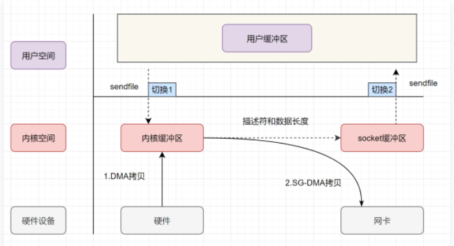

1. 用户进程发起sendfile系统调用，**上下文（切换1）从用户态转向内核态**
2. DMA控制器，把数据从硬盘中拷贝到内核缓冲区。
3. CPU把内核缓冲区中的**文件描述符信息**（包括内核缓冲区的内存地址和偏移量）发送到socket缓冲区
4. DMA控制器根据文件描述符信息，直接把数据从内核缓冲区拷贝到网卡【2,3统称为SG-DMA】
5. **上下文（切换2）从内核态切换回用户态**，sendfile调用返回。

 **java提供的零拷贝方式** 

- Java NIO对mmap的支持
  - Java NIO有一个`MappedByteBuffer`的类，可以用来实现内存映射。它的底层是调用了Linux内核的**mmap**的API。
- Java NIO对sendfile的支持
  - FileChannel的`transferTo()/transferFrom()`，底层就是sendfile() 系统调用函数。Kafka 这个开源项目就用到它，平时面试的时候，回答面试官为什么这么快，就可以提到零拷贝`sendfile`这个点。

kafka就调用的sendfile

## fork()作用

Linux中fork函数是非常重要的函数，它的作用是从已经存在的进程中创建一个子进程，而原进程称为父进程。

调用fork(),当控制转移到内核中的fork代码后，内核开始做：
1.分配新的内存块和数据结构给子进程。
2.将父进程部分数据结构内容拷贝至子进程。
3.将子进程添加到系统进程列表。
4.fork返回开始调度器，调度。


•fork的返回值
1.fork的子进程返回为0；
2.父进程返回的是子进程的pid。


•fork的常规用法
1.一个父进程希望复制自己，使得子进程同时执行不同的代码段，例如：父进程等待客户端请求，生成一个子进程来等待请求处理。
2.一个进程要执行一个不同的程序。

•fokr调用失败的原因
1.系统中有太多进程
2.实际用户的进程数超过限制

# 并发篇

## Java多线程——交替打印ABC

https://blog.csdn.net/weixin_41070695/article/details/112596316


交替打印 1-10；

```java
public class Main{

    static volatile Integer count = 1;
    public static void main(String[] args){

        new Thread(()->{
            for (int i = 0; i < 5; ) {
                while (count%2!=1){

                }
                synchronized (count){
                    i++;
                    System.out.println(count);
                    count++;
                }
            }
        }).start();;
        new Thread(()->{
            for (int i = 0; i < 5; ) {
                while (count%2!=0){

                }
                synchronized (count){
                    i++;
                    System.out.println(count);
                    count++;
                }
            }
        }).start();;
    }
}
```


## 生产者消费者问题


生产者消费者问题（Producer-consumer problem），是一个多线程同步问题的经典案例。生产者生成一定量的数据放到缓冲区中，然后重复此过程；与此同时，消费者也在缓冲区消耗这些数据。生产者和消费者之间必须保持同步，要保证生产者不会在缓冲区满时放入数据，消费者也不会在缓冲区空时消耗数据。不够完善的解决方法容易出现死锁的情况，此时进程都在等待唤醒。


```java
class Storge {
    private final int MAX_SIZE = 10;
    private LinkedList<Object> list = new LinkedList<>();

    public void produce() {
        synchronized (list) {
            // 首先判断仓库是否已满，已满则调用wait，不生产
            while (list.size() == MAX_SIZE) {
                System.out.println("【生产者" + Thread.currentThread().getName()
                        + "】仓库已满");
                try {
                    list.wait();
                } catch (InterruptedException e) {
                    e.printStackTrace();
                }
            }
            list.add(new Object());
            System.out.println("【生产者" + Thread.currentThread().getName()
                    + "】生产一个产品，现库存" + list.size());
            list.notifyAll();
        }
    }

    public void consume() {
        synchronized (list) {
            while (list.size() == 0) {
                System.out.println("【消费者" + Thread.currentThread().getName()
                        + "】仓库为空");
                try {
                    list.wait();
                } catch (InterruptedException e) {
                    e.printStackTrace();
                }
            }
            list.remove();
            System.out.println("【消费者" + Thread.currentThread().getName()
                    + "】消费一个产品，现库存" + list.size());
            list.notifyAll();
        }
    }
}


public class Main {

    public static void main(String[] args) {
        Storge storge = new Storge();
        
        new Thread(()->{
            for (int i = 0; ; i++) {
                storge.produce();
            }
        }).start();
        
        new Thread(()->{
            for (int i = 0; ; i++) {
                storge.produce();
            }
        }).start();

        new Thread(()->{
            for (int i = 0; ; i++) {
                storge.produce();
            }
        }).start();

        new Thread(()->{
            while (true){
                storge.consume();
            }
        }).start();
        

    }
}
```


##  读者-写者问题

（1）允许多个读者同时执行读操作；

（2）不允许读者、写者同时操作；

（3）不允许多个写者同时操作。一次只能一个写者  


```java
public class Main {

    public static void main(String[] args) {
        Disk disk = new Disk();
        new Thread(() -> {
            for (int i = 0; i < 50; i++) {
                try {

                    disk.start_read();
                    Thread.sleep((long) Math.random() * 1000);


                } catch (InterruptedException e) {
                    e.printStackTrace();
                }
                disk.finish_read();
            }
        }).start();
        new Thread(() -> {
            for (int i = 0; i < 50; i++) {
                try {

                    disk.start_read();
                    Thread.sleep((long) Math.random() * 1000);


                } catch (InterruptedException e) {
                    e.printStackTrace();
                }
                disk.finish_read();
            }
        }).start();
        new Thread(() -> {
            for (int i = 0; i < 50; i++) {
                try {

                    disk.start_read();
                    Thread.sleep((long) Math.random() * 1000);


                } catch (InterruptedException e) {
                    e.printStackTrace();
                }
                disk.finish_read();
            }
        }).start();


        new Thread(() -> {
            for (int i = 0; i < 50; i++) {
                try {

                    disk.start_write();
                    Thread.sleep((long) Math.random() * 1000);

                } catch (InterruptedException e) {
                    e.printStackTrace();
                }
                disk.finish_write();
            }
        }).start();


    }
}


class Disk {
    // 写者信号量
    private Semaphore write_mutex = new Semaphore(1);
    // 读者信号量
    private  Semaphore read_mutex = new Semaphore(1000);

    // 读者数量
    private volatile Integer read_count = 0;

    public void start_read() throws InterruptedException {
        while (write_mutex.availablePermits() == 0) {
        }
        // 获取读者信号量
        read_mutex.acquire();
        System.out.println(Thread.currentThread().getName() + "    start_read");
        synchronized (read_count) {
            read_count++;
        }

    }

    public void finish_read() {
        // 修改读者数量
        synchronized (read_count) {
            read_count--;
        }
        System.out.println(Thread.currentThread().getName() + "    finish_read");
        // 释放读者信号量
        read_mutex.release();

    }

    public void start_write() throws InterruptedException {
        while (read_count != 0) {}

        write_mutex.acquire();
        System.out.println(Thread.currentThread().getName() + "    start_write");
    }

    public void finish_write() {
        write_mutex.release();
        System.out.println(Thread.currentThread().getName() + "    finish_write");
    }

}

```


## 1.线程状态

**要求**

* 掌握 Java 线程六种状态
* 掌握 Java 线程状态转换
* 能理解五种状态与六种状态两种说法的区别

**六种状态及转换**


分别是

- 新建
  - 当一个线程对象被创建，但还未代用start方法运行时处理**新建**状态
  - 此时未与操作系统底层线程相关
- 可运行
  - 调用了start方法，就会由**新建**状态进入**可运行**
  - 此时与底层线程关联，由操作系统调度执行
- 终结
  - 线程内代码执行完毕，由**可运行**进入终结
  - 此时会取消与底层线程关联
- 阻塞
  - 当获取锁失败后，由**可运行**进入Monitor的阻塞队列**阻塞**，此时不占用CPU
  - 当持锁线程放锁时，会按照一定规则唤醒阻塞队列中的**阻塞**线程，唤醒后的各线程进行竞争，最终一个线程进入**可运行状态**
- 等待
  - 当获取锁成功后，但由于条件不满足，调用了wait()方法，此时从可运行状态释放锁进入Monitor等待集合**等待**，同样不占用CPU时间
  - 当其它持锁线程调用 **notify() 或 notifyAll() 方法**，会按照一定规则唤醒等待集合中的**等待**线程，恢复为**可运行**状态
- 有时限等待
  - 当获取锁成功后，但由于条件不满足，调用了 wait(long) 方法，此时从**可运行**状态释放锁进入 Monitor 等待集合进行**有时限等待**，同样不占用 cpu 时间
  - 当其它持锁线程调用 notify() 或 notifyAll() 方法，会按照一定规则唤醒等待集合中的**有时限等待**线程，恢复为**可运行**状态，并重新去竞争锁
  - 当等待超时，也会从**有时限等待**状态恢复为**可运行**状态，并重新去竞争锁
  - **还有一种情况是调用sleep（long）方法也会从可运行状态进入有时限等待状态，**但与 Monitor 无关，不需要主动唤醒，超时时间到自然恢复为**可运行**状态

**五种状态**

五种状态的说法来自于操作系统层面的划分，即**进程的状态**


- 新建态：
- 就绪态：有资格分配到CPU时间，但还未轮到它
- 运行态：分到CPU时间，能真正执行线程内代码
- 阻塞态：
  - 涵盖了 java 状态中提到的**阻塞**、**等待**、**有时限等待**
  - 多出了阻塞I/O，指线程在调用阻塞I/O时，实际活动由I/O设备完成，此时线程无事可做，只能等待
- 终结态

**三种状态的转换：阻塞->就绪->运行态**

## Runnable和Callable之间的区别

Runnable和Callable之间的区别

1、Runnable任务执行后没有返回值；Callable任务执行后可以获得返回值

2、Runnable的方法是run()，没有返回值；Callable的方法是call()，有返回值

3、**Runnable的run()方法不能抛异常，有异常的话只能在run方法里面解决；Callable的call()方法可以抛异常**

4、Runnable可以直接传递给Thread对象执行；Callable不可以，Callable执行可以放在FutureTask中，然后把futureTask传递给Thread执行

## 2. 线程池核心参数

- 掌握线程池的 7 大核心参数

**七大参数**

- corePoolSize 核心线程数目=池中会保留的最少线程数：
  - **在队列未满的情况下，只使用核心线程。若队列容量满了，则核心线程和救急线程共同工作**
  - 线程池创建好，就准备就绪的线程数量，等待异步执行。**与线程池一直存在，除非设置参数allowCoreThreadTimeOut,允许线程池过期**

- maximumPoolSize 最大线程数目=核心线程+救急线程的最大数目
- keepAliveTime 生存时间：救急线程的生存时间，生存时间内没有新任务，则此线程等待设置时间后，资源释放
- unit 时间单位 - 救急线程的生存时间单位，如秒、毫秒等
- workQueue ：**当没有空闲核心线程时，新来的任务会加入到此队列排队，队列满会创建救急线程执行任务**
- threadFactory 线程工厂 - 可以定制线程对象的创建，例如设置线程名字、是否是守护线程等
- handler 拒绝策略(饱和策略) - 当所有线程都在繁忙，workQueue 也放满时，会触发拒绝策略
  - jdk的拒绝策略
    - 抛异常
    - 由调用者执行任务 
    - 丢弃任务 
    - 丢弃最早排队任务，本任务取而代之 
  
  - ActiveMQ
    - 带超时等待（60s）尝试放入队列
  

**线程池重用线程时，会对ThreadLocal的值进行清空吗？**

**不会清空，要你自己去清空。**

如果你能够在使用ThreadLocal的时候管理它的创建、销毁，那么就可以用，否则会出问题。原因是ThreadLocal是和Thread绑定的，如果Thread是从Thread Pool中拿出来的，那么意味着Thread可能会被复用，如果被复用，你就一定得保证这个Thread上一次结束的时候，其关联的ThreadLocal被清空掉，否则就会串到下一次使用。


**工作流程**：

- 线程池创建，线程池中会创建core数量的核心线程，准备接收任务
- 核心线程满了，将再进来的任务放入阻塞队列，空闲的线程会在阻塞线程中获取任务
- **若阻塞也满了，则创建救急线程执行任务，此时救急线程新创建执行的任务是刚进来的任务而不是阻塞队列中的任务，执行完该任务后，从阻塞队列中获取任务**，线程总量只能是maximumPoolSize 数目
- 若已经达到最大线程数目，且阻塞队列也满了，则执行拒绝策略
- 线程执行完毕
- 若任务执行完，等待一定的存活时间，救急线程注销


## **execute和submit的区别**

- execute只能提交Runnable类型的任务，无返回值。submit既可以提交Runnable类型的任务，也可以提交Callable类型的任务，会有一个类型为Future的返回值，但当任务类型为Runnable时，返回值为null。
- execute在执行任务时，如果遇到异常会直接抛出，而submit不会直接抛出，只有在使用Future的get方法获取返回值时，才会抛出异常。


## 线程池获取返回值

```java
ThreadPoolExecutor executor = new ThreadPoolExecutor();
Future<Integer> submit = executor.submit(() -> {
    return 1;
});
Integer integer = submit.get();
```


## JAVA 分析线程池中的keepAliveTime参数具体实现

https://blog.csdn.net/a17816876003/article/details/107682030

- 从阻塞队列中获取元素是调用poll（）方法，移除队头的元素

  - poll 方法作用是移除并返回队列的头节点。但是如果当队列里面是空的，没有任何东西可以移除的时候，便会返回 null 作为提示。

  - 带时间参数的 poll 方法：如果能够移除，便会立刻返回这个节点的内容；如果队列是空的就会进行等待，等待时间正是我们指定的时间，直到超时时间到了，如果队列里依然没有元素可供移除，便会返回 null 作为提示。

- **阻塞队列的poll方法又是怎么实现超时的呢？**

  - poll（）方法 调用了available.awaitNanos(delay)方法
  - 其内部执行了UNSAFE.park(false, nanos);

## 关闭线程池

- ### 关闭线程池 shutdown 和 shutdownNow 的区别

- shutdown：调用 shutdown() 方法后线程池会在执行完正在执行的任务和队列中等待的任务后才彻底关闭。

- shutdownNow：

- shutdown 会等待线程池中的任务执行完成之后关闭线程池，而 shutdownNow 会给所有线程发送中断信号，中断任务执行，然后关闭线程池

  shutdown 没有返回值，而 shutdownNow 会返回关闭前任务队列中未执行的任务集合（List）

## 关闭线程的方式

https://www.cnblogs.com/liyutian/p/10196044.html

1. 使用退出标志，使线程正常退出，也就是当 run() 方法完成后线程中止。

2. 使用 stop() 方法强行终止线程，但是不推荐使用这个方法，该方法已被弃用。

   1. stop（）会停止run（）方法剩余的全部工作，包括在 catch 或 finally 语句中的，并抛出ThreadDeath异常(通常情况下此异常不需要显示的捕获)，因此可能会导致一些清理性的工作的得不到完成，如文件，数据库等的关闭。
   2. 调用 stop() 方法会立即释放该线程所持有的所有的锁，导致数据得不到同步，出现数据不一致的问题。

3. 使用 interrupt 方法中断线程。

   1. 调用 interrupt() 方法仅仅是在当前线程中打一个停止的标记，并不是真的停止线程。

      也就是说，线程中断并不会立即终止线程，而是通知目标线程，有人希望你终止。至于目标线程收到通知后会如何处理，则完全由目标线程自行决定

## 写一个死锁

- 线程1，先抢占锁1，thread.sleep(50ms)   ,再抢占锁2
- 线程2，先抢占锁2，thread.sleep(50ms)   ,再抢占锁1

## 阻塞队列中线程取消竞争锁

lock.lockInterruptibly()  方法

https://www.jianshu.com/p/287c9f3ae16d


## JDK中的七大阻塞队列

- ArrayBlockingQueue：由数组实现的有界阻塞队列，需要指定数组容量，该队列按照 FIFO 对元素进行排序。维护两个整形变量，标识队列头尾在数组中的位置，在生产者放入和消费者获取数据共用一个锁对象，意味着两者无法真正的并行运行，性能较低。
- LinkedBlockingQueue：由链表组成的有界阻塞队列，如果不指定大小，默认使用 Integer.MAX_VALUE 作为队列大小，该队列按照 FIFO 对元素进行排序，对生产者和消费者分别维护了独立的锁来控制数据同步，意味着该队列有着更高的并发性能。
- SynchronousQueue：不存储元素的阻塞队列，无容量，可以设置公平或非公平模式，插入操作必须等待获取操作移除元素，反之亦然。
- PriorityBlockingQueue：支持优先级排序的无界阻塞队列，默认情况下根据自然序排序，也可以指定 Comparator。
- DelayQueue：支持延时获取元素的无界阻塞队列，创建元素时可以指定多久之后才能从队列中获取元素，常用于缓存系统或定时任务调度系统。
- LinkedTransferQueue：一个由链表结构组成的无界阻塞队列，与LinkedBlockingQueue相比多了transfer和tryTranfer方法，该方法在有消费者等待接收元素时会立即将元素传递给消费者。
- LinkedBlockingDeque：一个由链表结构组成的双端阻塞队列，可以从队列的两端插入和删除元素。

## jdk中非阻塞队列

ConcurrentLinkedQueue 利用循环CAS来实现线程安全。它是一个基于链表的无界线程安全队列。


## 3. wait vs sleep

**要求**

* 能够说出二者区别

**一个共同点，三个不同点**

共同点

* wait() ，wait(long) 和 sleep(long) 的效果都是让当前线程暂时放弃 CPU 的使用权，进入阻塞状态

不同点

* 方法归属不同
  * sleep(long) 是 Thread 的静态方法
  * 而 **wait()，wait(long) 都是 Object 的成员方法**，每个对象都有

* 醒来时机不同
  * 执行 sleep(long) 和 wait(long) 的线程都会在等待相应毫秒后醒来
  * wait(long) 和 wait() 还可以被 notify 唤醒，wait() 如果不唤醒就一直等下去
  * 它们都可以被打断唤醒

* 锁特性不同（重点）
  * wait 方法的调用必须先获取 wait 对象的锁，而 sleep 则无此限制
  * wait 方法执行后会释放对象锁，允许其它线程获得该对象锁（我放弃 cpu，但你们还可以用）
  * 而 sleep 如果在 synchronized 代码块中执行，并不会释放对象锁（我放弃 cpu，你们也用不了）

## 4. lock vs synchronized

**三个层面**

不同点

* 语法层面
  * synchronized 是关键字，源码在 jvm 中，用 c++ 语言实现
  * Lock 是接口，源码由 jdk 提供，用 java 语言实现
  * 使用 synchronized 时，退出同步代码块锁会自动释放，而使用 Lock 时，需要手动调用 unlock 方法释放锁。【即获取到锁后出现异常，则synchronize会自动释放锁，而lock需要手动释放】
  * **synchronized 不可被打断**
* 功能层面
  * 二者均属于悲观锁、都具备基本的互斥、同步、锁重入功能
  * Lock 提供了许多 synchronized 不具备的功能，例如获取等待状态、公平锁、可打断、可超时、多条件变量
  * Lock 有适合不同场景的实现，如 ReentrantLock， ReentrantReadWriteLock
  * 二者的锁机制其实也是不一样的。ReentrantLock 底层调用的是 Unsafe 的park 方法加锁，synchronized 操作的应该是对象头中 mark word
* 性能层面，或者说适用场景不同
  * 在没有竞争时，synchronized 做了很多优化，如偏向锁、轻量级锁，性能不赖  （jdk1.6以后）
  * 在竞争激烈时，Lock 的实现通常会提供更好的性能

**公平锁**

* 公平锁的公平体现
  * **已经处在阻塞队列**中的线程（不考虑超时）始终都是公平的，先进先出
  * 公平锁是指**未处于阻塞队列**中的线程来争抢锁，如果队列不为空，则老实到队尾等待
  * 非公平锁是指**未处于阻塞队列**中的线程来争抢锁，与队列头唤醒的线程去竞争，谁抢到算谁的
* 公平锁会降低吞吐量，一般不用

**条件变量**

- ReentrantLock中的条件变量功能类似于普通synchronized的wait，notify，用在当前线程获得锁后，发现条件不满足时，进入临时等待的链表结构
- 与 synchronized 的等待集合不同之处在于，ReentrantLock 中的条件变量可以有多个，可以实现更精细的等待、唤醒控制

## 5. volatile


**原子性**

- 起因：多线程下，不同线程的**指令发生了交错**导致的共享变量的读写混乱
- 解决：用悲观锁或乐观锁解决，**volatile 并不能解决原子性**

**可见性**

* 起因：由于**编译器优化、或缓存优化、或 CPU 指令重排序优化**导致的对共享变量所做的修改另外的线程看不到
* 起因应该是：线程对公共变量操作时，首先从公共内存加载到线程本地内存，再进行操作，导致各个线程的操作是不可见的。
* 解决：**用 volatile 修饰共享变量，能够防止JIT编译器等优化发生，让一个线程对共享变量的修改对另一个线程可见**

**有序性**

- 起因：由于**编译器优化、或缓存优化、或 CPU 指令重排序优化**导致指令的实际执行顺序与编写顺序不一致

- 解决：**用volatile修饰共享变量会在读，写共享变量时加入不同的屏障，阻止其他读写操作越过屏障，从而达到阻止重排的效果**

- 注意：

  对volatile变量的写指令**后会加入写屏障**

  对volatile变量的读指令**前会加入读屏障**

  - **volatile 变量写屏障**阻止的是阻止前面其他写操作越过屏障排到**volatile 变量写后面**（这句话和上面的写指令后会加入写屏障并不冲突，因为写屏障使得写屏障前的代码不能越过屏障到后面，**但不能阻止后面的屏障到面前来，读屏障类似**）
  - **volatile 变量读屏障**阻止的是阻止后面的其他读操作越过屏障排到 **volatile 变量读前面**
  - volatile 读写加入的屏障只能防止同一线程内的指令重排

  （**所以读写屏障的插入应该是在所有写操作之后，所有读操作之前**）

内存屏障：

是CPU或编译器在对内存随机访问的操作中的一个同步点，使得此点之前的所有读写操作都执行后才可以开始执行此点之后的操作。**简单说就是加入内存屏障，则之前的读写操作全部执行后再执行内存屏障后的代码。内存屏障为一个同步点，点之前的代码执行完，再执行点之后的代码**

## volatile和synchronized的区别

1. volatile本质是在告诉jvm当前变量在寄存器（工作内存）中的值是不确定的，需要从主存中读取； synchronized则是锁定当前变量，只有当前线程可以访问该变量，其他线程被阻塞住。所以volatile是与synchronize是互助的存在，不是对立的
2. volatile仅 修饰 在变量级别；synchronized则可以使用在代码段，方法上。
3. volatile仅能实现变量的修改可见性，不能保证原子性；而synchronized则可以保证变量的修改可见性和原子性
4. volatile不会造成线程的阻塞；synchronized可能会造成线程的阻塞。
5. volatile标记的变量不会被编译器优化；synchronized标记的变量可以被编译器优化，实现锁消除


## 6. 悲观锁 vs 乐观锁

**要求**

* 掌握悲观锁和乐观锁的区别

**对比悲观锁与乐观锁**

* 悲观锁的代表是 synchronized 和 Lock 锁
  * 其核心思想是【线程只有占有了锁，才能去操作共享变量，每次只有一个线程占锁成功，获取锁失败的线程，都得停下来等待】
  * 线程从运行到阻塞、再从阻塞到唤醒，涉及线程上下文切换，如果频繁发生，影响性能
  * 实际上，线程在获取 synchronized 和 Lock 锁时，如果锁已被占用，都会做几次重试操作，减少阻塞的机会

* 乐观锁的代表是 AtomicInteger |e toa mi ke  Integer|，使用 cas 来保证原子性
  * 其核心思想是【无需加锁，每次只有一个线程能成功修改共享变量，其它失败的线程不需要停止，不断重试直至成功】
  * 由于线程一直运行，不需要阻塞，因此不涉及线程上下文切换
  * 它需要多核 cpu 支持，且线程数不应超过 cpu 核数

AtomicInteger 的底层实现使用的是Unsafe，保证操作的原子性

## 如何判断是否当前线程持有该锁

- 如果用synchronized，用`Thread.holdsLock(lockObj)` 获取
- 如果使用 Lock（juc下的），则用 `lock.isHeldByCurrentThread()` (**不能用 Thread.holdsLock(lockObj)**)

## 线程间同步的方式

**互斥锁**（Mutex）、**条件变量**（condition variable）、**读写锁**（reader-writer lock）、**信号量**（semaphore）


## 线程通信的方式

- volatile 
- synchronized 临界区方式，ReentrantLock
- CountDownLatch
- 基本LockSupport实现线程间的阻塞和唤醒（park和unpark方法）
- 网络通信
- 信号量机制(Semaphore)
- 管道通信


## 7. Hashtable vs ConcurrentHashMap

**Hashtable 对比 ConcurrentHashMap**

* Hashtable 与 ConcurrentHashMap 都是线程安全的 Map 集合
* Hashtable 的底层是数组+链表，ConcurrentHashMap 底层是`Node 数组 + 链表或红黑树`
* Hashtable 并发度低，整个 Hashtable 对应一把锁，同一时刻，只能有一个线程操作它
* ConcurrentHashMap 并发度高，整个 ConcurrentHashMap 对应多把锁，只要线程访问的是不同锁，那么不会冲突
* CurrentHashMap不能存储null值，不论是key还是value。

**ConcurrentHashMap 1.7**

* 数据结构：`ReentrantLock+Segment分段数组 + HashEntry数组 + 链表`，每个 Segment 对应一把锁，如果多个线程访问不同的 Segment，则不会冲突。（Segment数组中包含HashEntry数组，其内部有链表），**Segment继承了ReentrantLock**
* 并发度：Segment 数组大小即并发度，决定了同一时刻最多能有多少个线程并发访问。Segment 数组不能扩容，意味着并发度在 ConcurrentHashMap 创建时就固定了。**Segment数组的大小size默认为** DEFAULT_CONCURRENCY_LEVEL =**16(阿里面试官曾问过)** HashEntry数组默认为2个。
* 索引计算
  * 假设大数组长度是 $2^m$​，key 在大数组内的索引是 key 的二次 hash 值的高 m 位（二进制hash值的高M位）
  * 假设小数组长度是 $2^n$​，key 在小数组内的索引是 key 的二次 hash 值的低 n 位（二进制hash值的低n位）
* **put新节点时，若是超出阈值，则会先进行扩容，再添加新节点**
* **并发GET操作**
  * ConcurrentHashMap第一次需要经过一次hash定位到Segment的位置，然后再hash定位到指定的HashEntry，遍历该HashEntry下的链表进行对比，成功就返回，不成功就返回null
  * **get操作没有加锁**
  * 使用Unsafe类保证可见性，因为数组某个位置的值改变，volatile只能保证整个数组的可见性，而数组中某个值的需要改变通过Unsafe类保证。Unsafe.getObjectVolatile(数组，下标)。获取指定位置的volatile值
  * 扩容时，若get先进行，则从旧表中取。get后发生则从新表中取
  
* **并发put操作**
  * 第一次key的hash来定位segment的位置。若Segment没有初始化，则CAS进行初始化操作
  * 第二次hash操作找到相应的hashEntry的位置
  * 继承了ReentrantLock，通过tryLock（）尝试获取锁，成功则插入元素。
  * 失败，则以**自旋的方式**去调用 tryLock（）方法去获取锁，超过指定次数则挂起，等待唤醒
* **size**
  * 计算元素个数前，先不加锁计算两次，如果前后两次结果如一样，认为个数正确返回
  * 如果不一样，进行重试，重试次数超过 3，将所有 segment 锁住，重新计算个数返回


* **扩容：**每个小数组的扩容相对独立，小数组在超过扩容因子时会触发扩容，每次扩容翻倍（扩容时，一般情况下是头插法，遍历链表。若链表中，在某个节点以及后续节点与扩容后仍在一个链表，则之间将剩余链表迁移，不必挨个遍历头插法）
* Segment[0] 原型：首次创建其它小数组时，会以此原型为依据，数组长度，扩容因子都会以原型为准

**ConcurrentHashMap 1.8**

* 数据结构：`syncronized+CAS+Node 数组 + 链表或红黑树`，数组的每个头节点作为锁，如果多个线程访问的头节点不同，则不会冲突。**首次生成头节点时如果发生竞争，利用 cas 而非 syncronized**，进一步提升性能

* 并发度：Node 数组有多大，并发度就有多大，与 1.7 不同，Node 数组可以扩容

* 扩容条件：Node 数组满 3/4 时就会扩容

* 扩容单位：以链表为单位从后向前迁移链表，迁移完成的将旧数组头节点替换为 ForwardingNode。**七上八下**

* **并发 get**
  
  * 根据是否为 ForwardingNode**（一种标记，是 ForwardingNode代表该数组位置已经迁移结束）**来决定是在新数组查找还是在旧数组查找，不会阻塞
  * 如果链表长度超过 1，则需要对节点进行复制（创建新节点），怕的是节点迁移后 next 指针改变
  * 如果链表最后几个元素扩容后相对位置不变，则节点无需复制
  
* **并发 put**
  
  * 首先通过hash找到对应位置，判断是否初始化了，没有初始化怎么调用initTable方法进行初始化。因为是懒惰初始化，省内存
  * 如果没有hash冲突，则直接CAS方式插入
  * 如果还在扩容，则先扩容，再插入元素（链表超过阈值8则进行转换成红黑树）
  * **如果存在hash冲突**，则加锁（synchronize）保证线程安全，
    * 链表结构则直接遍历到尾端插入
    * 红黑树按红黑树结构插入
  
  
  
  
  
  
  
  
  * 首先判断map是否为空。**空表示没有进行初始化，初始化Map，因为是懒惰初始化，省内存**
  * 如果 put 的线程与扩容线程正在迁移的链表为同一个，put 线程会阻塞【不是重点】
  * 如果 put 的线程操作的链表还未迁移，即该链表还未迁移（还没轮到该链表迁移），则可以并发执行【不是重点】
  * 如果 put 的线程操作的链表（在旧map中）已经迁移完成，则协助扩容，等扩容完成后，再从扩容后的map中put。（也是考虑插入数据的顺序，先进来的元素可能也与正要put的元素在一个链表，为维护链表的相对位置，所以需要等待扩容完成）【不是重点】
  
* 与 1.7 相比是懒惰初始化**（只有在储存元素时才会创建对象）**

* 并发初始化table，原子操作【不知道在干嘛】

  * 设置一个变量sc
  * 进入循环，条件table=null。
    * if判断若sc<0,则yield，让出CPU时间片
    * else if：CAS操作，将sc赋值-1，加锁操作，其他线程进来，会进入第一个if判断。内部创建table。sc=正值。
    * 释放锁，退出循环

* put操作时，增加数值。统计size。1.8使用synchronized 进行加锁

  * 与LongAddr类似，有一个累加单元数组，put时的+1操作会对某个cell单元进行CAS操作
  * 累加单元数组是懒初始化，累加单元也是懒初始化操作。所以需要判断两次
  * CAS累加操作
  * 若此时size超出阈值，进行扩容
  * **求取size时，遍历所有的累加单元，可能存在误差，因为遍历时，其他线程可能还在操作**

  

* capacity 代表预估的元素个数，capacity / factory 来计算出初始数组大小，需要贴近 $2^n$ 
* loadFactor 只在计算初始数组大小时被使用，之后扩容固定为 3/4，**不可修改**
  **（意思是，扩容因子，只有在初始创建的时候才会用到，后面的扩容依然为jdk设置的0.75）**
* 超过树化阈值时的扩容问题，如果容量已经是 64，直接树化，否则在原来容量基础上做 3 轮扩容

**ConcurrentHashMap 1.7和1.8的区别**

https://blog.csdn.net/xuxinyuande/article/details/105738873

**区别**

https://blog.csdn.net/xingxiupaioxue/article/details/88062163

(1) 从1.7到1.8版本，由于HashEntry从链表 变成了红黑树所以 concurrentHashMap的时间复杂度从O(n)到O(log(n))

(2)  HashEntry最小的容量为2

(3)Segment的初始化容量是16;

(4)HashEntry在1.8中称为Node,链表转红黑树的值是8 ,当Node链表的节点数大于8时Node会自动转化为TreeNode,会转换成红黑树的结构


JDK1.8为什么使用内置锁synchronized来代替重入锁ReentrantLock？

因为粒度降低了，在相对而言的低粒度加锁方式，synchronized并不比ReentrantLock差，在粗粒度加锁中ReentrantLock可能通过Condition来控制各个低粒度的边界，更加的灵活，而在低粒度中，Condition的优势就没有了
JVM的开发团队从来都没有放弃synchronized，而且基于JVM的synchronized优化空间更大，使用内嵌的关键字比使用API更加自然
在大量的数据操作下，对于JVM的内存压力，基于API的ReentrantLock会开销更多的内存，虽然不是瓶颈，但是也是一个选择依据

## 为什么ConcurrentHashMap 的key，value不允许为null？map允许？

ConCurrentHashMap是在多线程场景下使用的，如果ConcurrentHashMap.get(key)的值为null，那么无法判断到底是key对应的value的值为null还是不存在对应的key值。

存在二义性：

- 可能这个map不存在这个key
- 可能map是存在这个key，value的，但value为null。

**所以当map.get(key)返回的值是null，在HashMap中虽然存在二义性，但是结合containsKey方法可以避免二义性。**

虽然concurrentHashMap也可以调用containsKey进行判断，但是concurrentHashMap是多线程的操作集合，中间有时间间隔。主要是为了线程安全。

- 例：若concurrentHashMap没有保存该key-value，此时获取key，value=null，再判断是否含有key，此时另一个插入了该key-value，则出现了差错。


## 8.ThreadLocal

* ThreadLocal 可以实现【资源对象】的线程隔离，让每个线程各用各的【资源对象】，避免争用引发的线程安全问题
* ThreadLocal 同时实现了线程内的资源共享，**即各个方法内的共享**

**原理**

每个线程内有一个 ThreadLocalMap 类型的成员变量，用来存储资源对象**（ThreadLocalMap是线程独立的）**

* 调用 set 方法，就是以 ThreadLocal 自己作为 key，资源对象作为 value，放入当前线程的 ThreadLocalMap 集合中
* 调用 get 方法，就是以 ThreadLocal 自己作为 key，到当前线程中查找关联的资源值
* 调用 remove 方法，就是以 ThreadLocal 自己作为 key，移除当前线程关联的资源值


**ThreadLocal一个线程只能存放一个变量吗？想存多个怎么搞**

- 每一个ThreadLocal只能保存一个对象，因为以ThreadLocal为key（key是唯一的，所以value也是唯一的）
- 解决办法
  - 一个线程内创建多个ThreadLocal，就可以保存多个对象
  - 在一个ThreadLocal中，value为一个map，这样也可以保存多个对象


ThreadLocalMap 的一些特点

* key 的 hash 值统一分配（**对象加一个数字作为hash值**）
* 初始容量 16，扩容因子 2/3，扩容时容量翻倍
* key 索引冲突后用解决冲突。（**开放寻址法，是发生哈希碰撞，则寻找数组中下一个空闲位置，而不是构建链表**）
* ThreadLocalMap 中的 key 被设计为弱引用


明明每一个ThreadLocal只能保存一个对象，为什么会涉及到扩容的问题？

- 因为一个线程内可以创建多个ThreadLocal
- 每一个线程只有一个ThreadLocalMap ，但是可以有多个ThreadLocal


为什么ThreadLocalMap 中的 key 被设计为弱引用？

**弱引用 key，仅仅是通过GC回收了key，value未回收**

ThreadLocalMap 中的 key 被设计为弱引用，原因如下

* Thread 可能需要长时间运行（如线程池中的线程），如果 key 不再使用，需要在内存不足（GC）时释放其占用的内存


**内存释放时机，即GC回收了key，如何释放value？**（**ThreadLocalMap 存在内存泄露问题**）

- 被动GC释放key
  - 仅是让key的内存释放，关联value的内存并不会释放
- 懒惰被动释放value
  - get Key时，发现是null key，则释放其value内存
  - set key时，使用启发式扫描，清除临近额null key的value内存，启发次数与元素个数，是否发现null key有关。**即存储或者是修改key时，会将临近的null key清理掉**
- 主动remove释放key，value
  - 会同时释放 key，value 的内存，也会清除临近的 null key 的 value 内存
  - **推荐使用它，因为一般使用 ThreadLocal 时都把它作为静态变量（即强引用），因此无法被动依靠 GC 回收key，懒惰被动释放value的方法全部失效**


## 9. CAS

在JVM中。

## 10. AQS

### 1，简介

- **抽象的队列同步器**

是用来构建锁或者其它同步器组件的重量级基础框架及整个JUC体系的基石，通过内置的CLH（FIFO）队列的变种来完成资源获取线程的排队工作。并通过**int类型变量表示持有锁的状态。**


AQS使用一个volatile的int 类型的成员变量status 来表示同步状态，通过内置的FIFO队列来完成资源获取的排队工作，将每条要去抢占资源的线程封装成一个**Node节点**来实现锁的分配，通过CAS的方法完成对status 值的修改


CLH:Craig、Landin and Hagersten 队列,是一个单向链表,AQS中的队列是CLH变体的虚拟双向队列FIFO

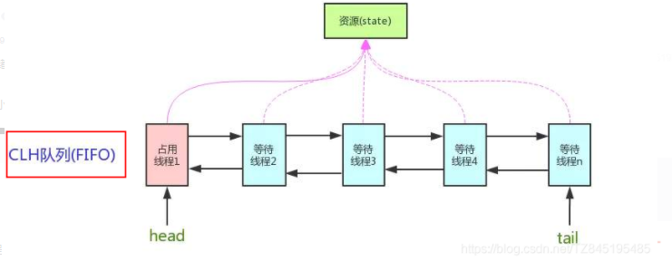

- AQS为什么是JUC内容中最重要的基石

  这些锁都继承了AQS

  (ReentrantLock | CountDownLatch | ReentrantReadWriteLock | Semaphore)


-  锁,面向锁的使用者。同步器,面向锁的实现者
- **加锁会导致阻塞、有阻塞就需要排队,实现排队必然需要队列**
- 如果共享资源被占用,就需要一定的阻塞等待唤醒机制来保证锁分配。这个机制主要用的是**CLH队列**的变体实现的,将暂时获取不到锁的线程加入到队列中,**这个队列就是AQS的抽象表现。**它将请求共享资源的线程封装成队列的结点(**Node**) ,通过CAS、自旋以及LockSuport.park()的方式,维护state变量的状态,使并发达到同步的效果

### AQS内部结构

- AQS内部int变量: status 
- CLH队列(三个大牛的名字组成),为一个双向队列，内部对象类型为Node<Thread>

**Node内部结构为**

- 成员变量：waitStatus 表明当前Node的等待状态
- 前后Node指针

**AQS同步队列的基本结构**

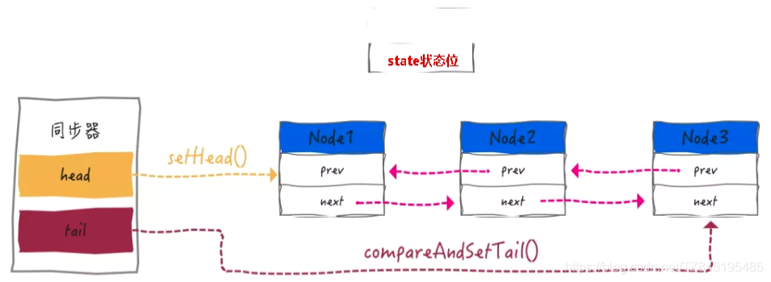


### AQS源码

- 公平锁与非公平锁
  - 创建锁时判断是否传入参数 true|false|不填。 不填或者false为非公平锁，true为公平锁
  - 公平锁是指**未处于阻塞队列**中的线程来争抢锁，如果队列不为空，则老实到队尾等待
  - 非公平锁是指**未处于阻塞队列**中的线程来争抢锁，与队列头唤醒的线程去竞争，谁抢到算谁的
  - 二者区别： 公平锁与非公平锁的lock()方法唯一的区别就在于公平锁在获取同步状态时多了一个限制条件:**hasQueuedPredecessors()**
    - hasQueuedPredecessors()：是公平锁加锁时判断等待队列中是否存在有效节点的方法

**流程**

- **lock.lock( ) 源码**
  - 加锁，进入锁内方法，通过CAS抢占线程。若抢占不到，则二次抢占或者说后续线程抢占


- **acquire( ):源码和3大流程走向**

  - tryAcquire(arg)再次抢占线程，区分为公平锁和非公平锁方法。抢占不到，则添加到等待队列

  

- **非公平锁中，**再抢占一次，查看是否成功。成功则抢占。不成功，else if判断：当前线程是否是当前持有的线程（即锁重入），是的话，抢占。不成功则返回false。调用acquire中的addWaiter方法


- **addWaiter（Node.EXCLUSIVE）入队操作**

**传入要入队的Node**，若时队列为空，头结点和尾结点为null。进入enq(node)方法。若不为空，则加入到队列

- 初始化队列，**会创建一个哨兵，即空节点，不存储任何信息，只是占位**。真正第一个数据的结点在第二个开始。
- 第二次循环，将Node插入到队列。首先新节点的prev指向旧的尾结点。旧尾结点的next指向新节点。tail更新为新节点。


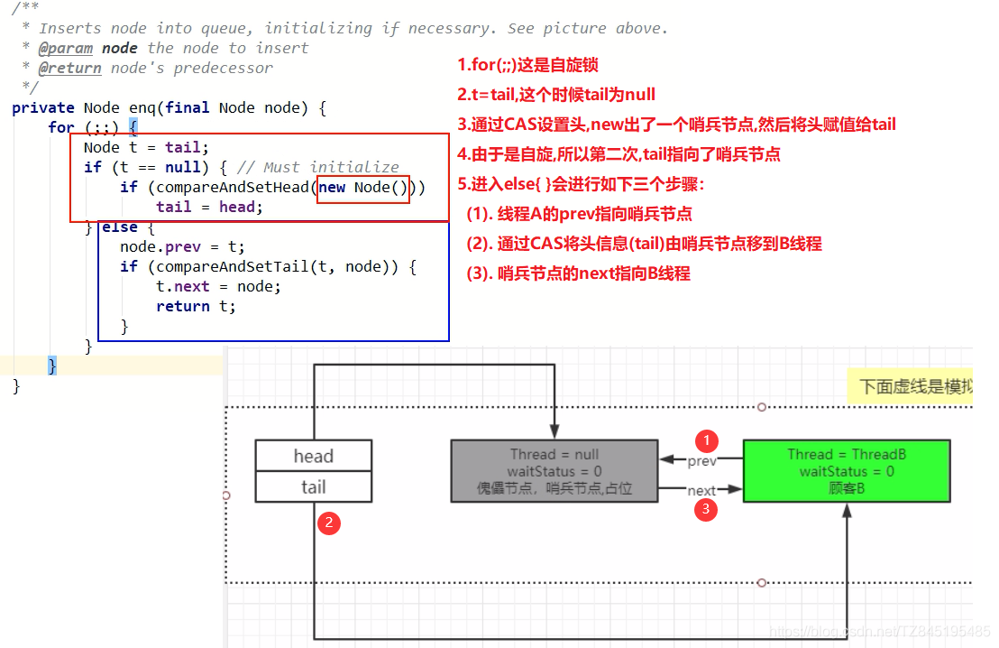

- **acquireQueued(addWaiter(Node.EXCLUSIVE), arg)**
  - 在进入队列后会进入该方法。进入一个死循环，首先获取头节点，再次尝试获取锁。
  - 没获取到则进入shouldParkAfterFailedAcquire方法。
    - 第一次进入该方法，则将Node的waitstatus设置赋值为Node.SIGNAL 为-1。
  - 退出再次回到acquireQueued重新循环，再次抢占锁。再次进入shouldParkAfterFailedAcquire方法。
    - 由于头结点的值为Node.SIGNAL，则返回true。
  - 执行parkAndCheckInterrupt方法
    - park方法，将线程挂起。


shouldParkAfterFailedAcquire


parkAndCheckInterrupt

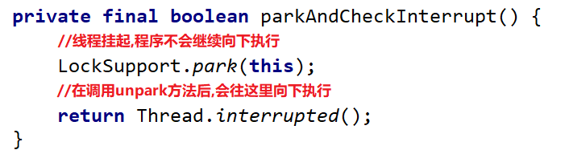

**入队和阻塞完成，等待执行线程结束**

- **执行线程结束会执行unlock（）方法**，unlock方法会调用tryRelease()
  - tryRelease（）方法会调用tryRelease()方法，将AQS的status设置为0，将Owner持有锁线程改为null，并返回true
  - 返回true，调用unparkSuccessor( ) ：将哨兵的状态改为0。并激活线程  Unpark
- 上面的acquireQueued.parkAndCheckInterrupt（）方法重新执行，并将重新获取线程。
  - 方法中，将阻塞队列的头节点（哨兵）设置为当前获取到线程的node，并取消原哨兵的引用，使其等待GC回收。并将新哨兵节点的线程清除


# Redis

## Redis单线程为什么这么快？

Redis是单线程还是多线程？

- 若是核心业务，命令处理部分，是单线程
- 要是整个redis，则是多线程

**原因**

- 基于内存操作，CPU不是Redis的性能瓶颈，Redis的瓶颈是根据机器的内存大小和网络带宽
- 核心是基于IO多路复用机制
- 单线程反而避免了多线程频繁上下文切换带来的性能问题
- 多线程会面临线程安全问题，使得复杂度增高


Redis基于Recator模式开发了网络事件处理器，文件事件处理器。。因为事件处理器是单线程的，所以redis才叫做**单线程的模型**。

文件事件处理器包括：

- 多个Socket
- IO多路复用程序
- 文件事件分派器
- 事件处理器

**单线程处理流程：**Socket（套接字，接收请求）

多个Socket可能并发的产生不同的事件，IO多路复用会监听多个Socket，有事件发生，字符将Socket加入到队列中排队。每次队列有序，同步从队列中取出Socket给事件分派器，事件分派器把Socket交给对应的事件处理器。然后事件处理器执行完，IO多路复用会将队列职中下一个Socket给事件分派器。


## Redis各种命令时间复杂度一览表

https://blog.csdn.net/qq_23564667/article/details/110917900


## 为什么要用Redis而不直接用Map做缓存?

1、Redis 可以用几十 G 内存来做缓存，Map 不行，一般 JVM也就分几个 G 数据就够大了

2、Redis 的缓存可以持久化，Map 是内存对象，程序一重启数据就没了

3、Redis 可以实现分布式的缓存，【多个微服务机器可共享】，Map 只能存在创建它的程序里

4、Redis 单点吞吐量能达到10万级，是专业的缓存服务，Map 只是一个普通的对象

5、Redis 缓存有过期机制，Map 本身无此功能

6、Redis 有丰富的 API，Map 就简单太多了


## Redis事务

- **Redis 事务提供了一种将多个命令请求打包的功能。然后，再按顺序执行打包的所有命令，并且不会被中途打断。**
- r**edis不支持回滚，所以不支持原子性**（又是基于内存操作，不支持持久性或者说持久化性能不足）
- 通过4个指令完成事务
  - `MULTI` 开始事务。Redis 不会立即执行这些命令，而是将它们放到队列，当调用了 `EXEC`命令将执行所有命令。
  - `EXEC` 执行事务
  - `DISCARD` 取消该事务 
  - `WATCH` 监听指定的键，当调用 `EXEC` 命令执行事务时，如果一个被 `WATCH` 命令监视的键被修改的话，整个事务都不会执行，直接返回失败。

若事务中某一行执行错误，不影响其他行的执行


## 1，项目注意点

- 请求用户信息时，不能返回用户所有的信息，只封装用户需要的信息。（不能说请求用户名，把用户所有信息，用户名，id，密码都返回这是不应该的）
  - 解决方法：DTO类与TO类相仿，只保存请求相关的信息


## 2，redis解决分布式场景Session共享

- 将之前保存在session中的value信息保存在redis。key保存在cookie中
- 拦截器功能：拦截需要登录的功能，判断用户是否登录，若登录，更新redis的登录用户的过期时间。**避免因为用户一直操作却自动下线的功能**
- **登录拦截器优化**（用处不大，因为很多页面都会进行登录校验，因为登录和未登录显示界面不同）
  - 拦截器拦截，进行登录验证。若用户登录，但只请求不需要拦截的网址。则拦截器失效。另外redis的过期时间也无法更新
  - **解决方法：**
    - 再设置一个拦截器，
    - 拦截器1，所有请求均会通过，若已登录，获取用户登录信息，并更新过期时间
    - 拦截器2，判断当前请求是否为需要登录的请求，若是且未登录拦截。

## 3，redis作为缓存

将用户数据保存到redis，获取数据时先在redis中获取，若没有则数据库获取，并保存到redis。

- redis自带内存淘汰机制。在内存不足时随机淘汰数据

### 缓存一致性问题

主动更新缓存和数据库来保证高一致性。更新缓存都会设置过期时间

- ### 更新操作是更新缓存还是删除缓存

  - 更新缓存：每次更新数据库都要更新缓存，无效写操作太多
  - **删除缓存：**更新数据库时缓存失效，查询缓存时再更新缓存

- ### 如何保证缓存与数据库操作的同时失败与成功，保证原子性

  - 单体系统，将缓存与数据库放在一个事务中
  - 分布式系统，利用AT，TCC等分布式事务方案

- ### 更新操作的一致性

  - 先删缓存，再操作数据库（存在线程安全问题，概率高，因为操作数据库慢，更新缓存快）
    - 线程1先删缓存，此时线程1并未将新值保存到数据库。线程2进来查询缓存查不到，查询数据库（旧值），并写入缓存（旧值），此时线程1更新数据库（新值）   **缓存数据库不一致**
    - 
  - **先操作数据库，再删缓存**（也存在线程安全问题，但概率低，1，查询该缓存刚好失效，2，且其他线程更新此数据，最后3，线程1慢于线程2（操作缓存慢于操作数据库））
    - 线程1查询缓存，此时缓存失效，从数据库中查（旧值），此时线程2更新数据库（新值），并删除redis中的缓存。线程1此时更新缓存（旧值）
    - 

### 高并发情况下的缓存失效问题

### 缓存穿透

- 客户端恶意发送请求查询缓存数据库都不存在的空值，redis没有则从数据库中查询，查询压力落在数据库。
- **解决方法**
  - 缓存空对象，设置短期的过期时间
    - 优点：实现简单，维护方便
    - 缺点：
      额外的内存消耗（需要redis保存空值，可以设置过期时间来解决）
      可能造成短期的不一致（此时redis保存空值，但数据库添加了该数据库，则造成了不一致）
  - 布隆过滤
    - 先查询布隆过滤器，若存在，再从redis和数据库中查询
    - 原理：https://www.cnblogs.com/wangwust/p/9467720.html
      - **布隆过滤器说某个元素存在，小概率会误判。布隆过滤器说某个元素不在，那么这个元素一定不在。**
      - 内部维护一个全为0的bit数组，和多个hash计算函数
      - 输入数据时，每个hash函数计算，并将每个结果值对应的数组位置置为1.
      - 验证数据时，依然每个hash函数计算，若每个结果对应的数组位置为1，则认为存在。
      - 数组越长，所占空间越大，误判率越低

### 缓存雪崩

- 同一个时段，大量的缓存key同时失效，或者redis宕机，则所有的请求打到数据库，数据库压力过大
- 解决方法：
  - 给不同的key的过期时间添加随机值
  - redis集群提高服务的可用性（防止redis宕机）
  - 对缓存业务进行降级限流

### 缓存击穿

- 热点key：高并发访问并且缓存重建业务复杂。这个key失效，则无数请求瞬间落在数据库。
- 解决方法：
  - **加互斥锁**，可以使用分布式锁（互斥更新是指热点key失效，多个请求只有一个请求更新，其他请求等待）
    - 不能在方法上加锁（与单例设计模式类似），否则没有过期时由于互斥锁而导致请求过慢
      - 只能在请求数据库时加锁。
  - **逻辑过期**
    - 在redis中保存一个逻辑过期时间（可以理解为一个数值，并不是真正的过期时间）
      - value为一个类对象，对象{过期时间，值信息}
    - 线程1请求，发现逻辑过期，则获取互斥锁，并分出一个子线程，查询数据库对缓存中的数据更新。若此时其他线程也获取该数据，发现逻辑过期，并获取不到锁，则返回旧数据
    - 

## 4，Redis秒杀

生成唯一性ID，作为订单ID

- **超卖问题**
  - 线程1查询库存，线程2查询库存，线程1判断是否有库存，有则下单成功（只有一个商品）。线程2判断有库存（依然是只有一个商品）下单成功。导致超卖
  - 使用乐观锁，
    - **所以下单时，先减库存，再下订单**，下订单过程已经释放锁。
      - 减库存时，判断是否有库存。**需要库存-1操作并且判读是否还有库存（利用数据库的原子性）。**本质为CAS，即更新操作时判断是否还有库存，若没有则下单失败。
      - 降低占用锁的时间。
    - **问题：**有可能会出现200个请求抢100个商品，由于CAS，只能有一个线程进行下单，导致其他线程请求失败，（请求只请求了一次）。虽然没有超卖，但造成了可能只有15个人抢到了商品，85个商品没卖出。
    - 可以设置并发，将信号量设置为货物量，每次购买中减少信号量个数。
  - 实现一人一单
    - 需要确保一个用户只能秒杀一次，加悲观锁。（不能用CAS，因为先减库存，涉及不到用户信息，若CAS，导致减了库存，又发现当前用户已经购买，则再进行回滚）【先判断用户是否购买过】
    - 也可以在redis中保存已经购买的用户信息，下库存时，先判断redis是否保存了该用户信息，若有，则无法不能再次购买
    - 加悲观锁（不建议）**可以设置信号量，信号量为货物量，每次购买中减少信号量个数。避免了加锁的问题**
      - 锁对象为用户ID，注意每次请求都会创建新的对象，导致锁不住。可以toString().intern()。转化成字符串并加入到串池，避免同一时刻多个下单
      - 另外，下单时，会再次验证当前用户是否购买，若已购买，则不能重复下单

超卖问题什么解决？**保证 检验有库存并减库存 为原子操作就可以解决。**

我们将库存数作为Redis该商品的信号量，每次购买成功都会删减信号量，此外，使用乐观锁，解决如下问题【有可能会出现200个请求抢100个商品，由于CAS，只能有一个线程进行下单，导致其他线程请求失败，（请求只请求了一次）。虽然没有超卖，但造成了可能只有15个人抢到了商品，85个商品没卖出】，这个问题的解决是**上述。**

**问题：**有可能会出现200个请求抢100个商品，由于CAS，只能有一个线程进行下单，导致其他线程请求失败，（请求只请求了一次，请求超时，则失效）。虽然没有超卖，但造成了可能只有15个人抢到了商品，85个商品没卖出。

我们将库存数作为Redis该商品的信号量，每次购买成功都会删减信号量，信号量为我们允许的并发数。并且只进行减库存操作，将消息交给消息队列，进行流量削峰，并且降低占用锁的时间。

实现一人一单，下订单时，先检验是不是已经购买过了，若是购买了则不能进行购买。


### 秒杀商品购买

- ## 高并发问题

  - **服务单一职责：**
    将每个功能作为一个微服务进行独立部署
  - **秒杀链接加密：**
    下单链接加上随机码，只有在秒杀活动开启后才能获取
  - **库存预热：**
    提前加入到redis中。信号量控制请求进来的秒杀请求
  - **动静分离，**
    Nginx实现动静分离，静态页面的获取直接在Nginx中获取，不会落到后端服务器上。动态请求来到后端服务器
  - **恶意请求拦截：**
    识别非法攻击请求并进行拦截，网关层面
  - **流量错峰：**
    购买秒杀商品，需要加入购物车才能购买，避免了直接购买而导致的高并发请求。加入购物车，用户的操作的快慢不一致，可以实现流量错峰。
  - **限流&熔断&降级**
  - **队列削峰**

- **秒杀商品购买流程**

  1. 立即抢购商品，发送请求，该商品随机码，秒杀商品号（redis的key），数量
  2. 秒杀微服务：
     1. 获取当前秒杀商品的详细信息
     2. 校验合法性（时间合法性，随机码一致性，购物数量是否合理）**恶意请求拦截，秒杀链接加密：**
     3. 该用户是否购买过该秒杀商品，redis保存临时信息。设置过期时间，过期时间为秒杀活动结束时间【此时已经保存了用户信息】
     4. 生成订单号，对信号量进行扣除（信号量为该秒杀商品的总数），没有信号量则无法进行购买
     5. 生成MQ通知订单服务生成订单。**队列削峰**
     6. **订单微服务生成订单后，转发到订单请求结果页面**
        1. 若抢购成功，显示生成订单号和和5秒后跳转支付请求，也可以立即支付链接。到支付页面。（**流量错峰：**）

  调用MQ进行削峰

  创建订单成功后，有直接去支付按钮，请求中携带这订单号。


## 5，分布式锁

**向redis保存值作为锁，分布式的服务中加锁**

- **上锁**（向redis保存值，并设置过期时间（原子指令）。setnx ex）
  - 使用setnx ：保存该key，value。若该key不存在才保存，否则执行失败
  - **设置过期时间**：避免因为上锁后，线程出现异常，无法释放锁。
  - **保存锁值，设置过期时间为一条指令**：避免在保存锁值后，设置过期时间时出现异常，则锁一直存在。
- **释放锁**（校验要删除的value是否与保存的value是否一致，一致再删除，不一致，则视为为已经删除。使用lua脚本）
  - **校验value：**占有该锁时，线程执行时间过长，或者陷入阻塞，此期间锁过期，线程未执行完。则其他线程开始获取该锁，并进行业务操作。多个线程持有锁
    - 保存锁的value值不能为随意值。设置value：UUID+特征符号。UUID可以避免分布式下多个特征符号相同，导致value相同的情况。
  - **删除锁必须保证原子性。使用redis+Lua脚本完成：**若判断锁存在，此时陷入阻塞，此期间锁过期，其他线程竞争到了锁。该线程恢复运行时，会执行删除锁操作。删除了其他线程的锁

- **Lua脚本**：
- **Redisson**，在redis基础上实现的Java驻内存网格，包含多种分布式Java对象，其中就有分布式锁，**有实现锁重入，锁重试，信号量**
  - **锁重入**：利用hash结构记录线程id和重入次数
    - 借鉴的AQS，将键值对的分布式锁改为hash形式。key获取hash，hash的key为线程，value为status（当前线程持有锁个数，进行锁重入）
    - 获取锁和释放锁使用lua脚本。
    - **持有锁：**首先判断是否有其他线程占有锁，若占有，则判断是否为当前线程，status+1，进行锁重入。并重置有效期
    - **释放锁：**获取锁，判断锁是否是自己占有的锁，若是则status-1，重置锁有效期。若status为0，释放锁，删除hash。否则锁已经释放
  - **可重试**：使用信号量和发布订阅功能实现等待，唤醒，获取，锁失败的重试机制
  - **超时续约**：利用watchDog，每隔一段时间（releaseTime / 3），重置超时时间

## Redis的持久化机制

- **RDB**： Redis DataBase将某一时刻的内存快照，以二进制的方式将**数据**写入磁盘
  
  - 手动触发
    - save命令，是Redis处于阻塞状态，直到redis持久化完成，才会继续响应客户端请求（慎用）
    - bgsave命令，fork出一个子进程执行持久化，主进程会在fork过程（分出一个子进程）中有短暂的阻塞，子进程创建后，主进程就可以响应客户端请求（由于子进程持久化过程与主进程读写数据并行执行，使用COW（copy  all write  写时拷贝）避免因为主进程修改数据，使得子进程的持久化出现错误，父进程将要修改的内容copy出一个备份，在备份中操作，持久化完成后，写入父子进程的共享内存）
  - 自动触发
    - save m n：在m秒内，如果有n个键发生改变，则自动触发持久化，通过bgsave执行，如果设置多个，只要满足一个，则出触发持久化。
    - flushall：清空redis所有数据库的内容，flushdb清空当前redis所在库，会清空reb文件，生成新的dump.rdb,内容为空
    - 主从复制：全量同步时会自动出发bgsave命令，自动生成rdb发动给从节点
  
  **优点**
  
  1. 整个redis数据库只有一个dump.rdb文件，方便持久化
  2. 容灾性好，方便备份
  3. 性能最大化，fork子进程来完成写操作，让主进程继续处理命令，保证了IO最大化（并行执行），使用子进程进行持久化，主进程不会进行任何IO操作（写时拷贝），保证了reids的高性能。
  4. 相对于数据集大时，比AOF的启动效率更高
  
  **缺点**
  
  1. 数据安全性低，RDB是间隔一段时间持久化，若持久化期间发生故障，则数据丢失。
  2. 若降低间隔时间，则fork子进程操作频繁，则阻塞次数过多，则阻塞时间也会变长  （2,3好像是一个意思）
  3. 若数据集较大，fork子进程会占用CPU时间过长，可能导致服务器停止服务几百毫秒，甚至1s
  
- **AOF**：以日志的形式记录redis所处理的每一个**修改操作**，以文本的方式记录。（**redis默认不开启**）

  - 流程
    1. 所有修改命令会append追加到AOF缓冲末尾
    2. AOF缓冲区根据对应的**策略**刷盘
    3. rewrite模式：随着修改操作的增加，AOF会定期进行重写，将多条指令合并，达到压缩的目的
    4. redis重启，加载aof可以进行数据恢复
  - 刷盘策略（和MySQL相似）
    - 每秒同步：异步完成，效率非常高，一旦系统出现宕机，则最多丢失1s修改的数据
    - 修改同步：每次修改操作，都会刷新到磁盘。最多丢失一条
    - 不同步：将要刷盘的内容交给操作系统，由操作系统决定什么时候刷盘
  - **优点**
    - 数据安全
    - 通过append模式写文件，即使由于服务器宕机也不会损坏已经写入的内容，可以通过redis-check-aof工具解决数据一致性问题
      - **append表示追加数据，并不会影响文件之前的数据，这样读写速度会快一些，而且不会损坏已经写入的数据**
    - AOF机制的rewrite模式，定期对AOF文件进行重写，以达到压缩的目的
  - **缺点**
    - AOF文件比RDB文件大，且恢复速度慢
    - 数据集大的时候，比rdb启动效率低
    - **运行效率没有rdb高**

**AOF与RDB对比**

- AOF文件比RDB更新频率高，优先使用AOF还原数据

- AOF比RDB更安全也更大

- RDB性能比AOF好

- 如果两个都搭配，优先加载AOF


## Redis集群方案

- 主从模式
  - 这种模式较为简单，主库可以读写，并会和从库进行数据同步，这种模式下，客户端直连接主库或某个从库，若主库或者从库宕机，客户端需要手动修改IP，另外这种模式下也比较难进行扩容，整个集群所能存储的数据受到某台机器的内存容量限制，所以不能支持特大数据量。
  - 不具备自动容错与恢复功能，master或slave的宕机都可能导致客户端请求失败，需要等待机器重启或手动切换客户端IP才能恢复
- 哨兵模式
  - 这种模式是主从模式的升级版，主机宕机后，哨兵会发现主库节点宕机，然后在从库中选择一个库作为主库继续，另外哨兵也可以做集群，从而保证某一个节点宕机后，还有其他哨兵节点可以继续工作。这种模式可以很好的保证redis集群的高可用，但仍不能很好的解决redis容量上限问题
- 分片集群（Cluster模式）
  - Cluster模式支持多主多从，这种模式可以按照key进行槽位分配，可以使得不同key分散到不同的主节点上，利用这种模式可以使得整个集群支持更大的数据容量，同时每个主节点可以拥有自己的多个从节点，如果该节点宕机，会从它的从节点再选举一个新的主节点
- 如果redis要存的数据量不大，可以选择哨兵模式，如果redis要存的数据量大，需要持续扩容，则选择cluster模式


### 主从模式

**单节点redis的并发能力是有限的，要进一步提高redis的并发能力，搭建Redis集群**

- **Replication Id**：简称replid，是数据集的标记，id一致则说明是同一数据集。每一个master都有唯一的replid，slave则会继承master节点的replid
- **offset**：偏移量，随着记录在repl_baklog中的数据增多而逐渐增大。slave完成同步时也会记录当前同步的offset。如果slave的offset小于master的offset，说明slave数据落后于master，需要更新。

**主从模式**（读写分离）

- **步骤**

  - ### 全量同步（发生在第一次主从同步）

    - （速度慢，性能较差，尽量避免）
    - 第一阶段：**判断是否为第一次请求数据同步，**
      - slave请求增量同步，写携带replid和偏移量
      - master判断请求replid是否与自己的一致，第一次请求一定不一致因为slave原来的replid可能是自己的或之前的master的。
      - 不一致，返回主节点的replid和偏移量
    - 执行bgsave生成的RDB发送给slave，slave清空本地数据并加载rdb
    - 在生成rdb期间执行的所有命令写入repl_baklog日志，
    - 持续的将日志发送给slave，slave执行命令保持同步
    - 

  - ### 增量同步（速度较快）

    - 若slave重启，重启后第一次连接，使用增量同步，只更新slave与master有差异的部分（性能较好）
    - 步骤
      - slave请求发送replid和偏移量，master判断replid一致，使用增量同步。
      - 从repl_backlog中找到slave的offset对应位置后的数据，发给slave

  - ### repl_backlog

    - 固定大小的数组，是环形的，角标到达数组末尾后，会再次从0开始读写，覆盖原来的数据。
    - repl_baklog中会记录Redis处理过的命令日志及offset，包括master当前的offset，和slave已经拷贝到的offset：
    - 增量同步时，将slave与master差异的数据发给slave
    - 
    - 若slave与master差异过大，导致master覆盖了slave设置的offset的位置数据，则只能做**全量同步**

  - **优化主从集群**

    - 在master中配置repl-diskless-sync yes启用无磁盘复制，直接网络发送到slave，避免全量同步时的磁盘IO。（适用于IO慢，网络快的情况）
    - Redis单节点上的内存占用不要太大，减少RDB导致的过多磁盘IO
    - 适当提高repl_baklog的大小，发现slave宕机时尽快实现故障恢复，尽可能避免全量同步
    - 限制一个master上的slave节点数量，如果实在是太多slave，则可以采用主-从-从链式结构，减少master压力
      - 

  **简述全量同步和增量同步区别？**

  - 全量同步：master将完整内存数据生成RDB，发送RDB到slave。后续命令则记录在repl_baklog，逐个发送给slave。
  - 增量同步：slave提交自己的offset到master，master获取repl_baklog中从offset之后的命令给slave

  **什么时候执行全量同步？**

  - slave节点第一次连接master节点时
  - slave节点断开时间太久，repl_baklog中的offset已经被覆盖时

  **什么时候执行增量同步？**

  - slave节点断开又恢复，并且在repl_baklog中能找到offset时


- 特点：
  - 只有一个master，master可以读写数据，执行写操作，将要出现变化的数据自动同步到slave
  - slave只能读数据，可以有多个slave
  - **数据的复制是单向的，只能从主节点到从节点，即Master以写为主，slave以读为主**

**主从复制的作用：**

1. 数据冗余：主从复制实现数据的备份，是持久化之外的一种数据冗余方式
2. 故障恢复：党主节点出现问题，可以由从节点提供服务，实现快速的故障恢复，实际上是一种服务的冗余
3. 负载均衡：在主从复制基础上，配合读写分离，可以由主节点提供写服务，由从节点提供读服务（即写redis数据时应用连接主节点，读redis数据时应用连接从节点），分担服务器负载，尤其是在写少读多的情景下，通过多个从节点分担读负载，可以大大提高redis服务器的并发量
4. 高可用基石：主从复制是哨兵和集群能够实施的基础，因此说主从复制是Redis高可用的基础


**具体：**

1. 主机可以读写，从机不能写只能读！主机中的所有信息和数据，都会自动被从机保存！
2. 若主机断开，从机依然可以查询数据。但从机不能写。若主机重新启动，则从机依然可直接获取主机的信息
3. 若从机断开，重新连接主机，若已配置为从机（配置文件中配置）,则可以获取当前主机的全部数据


### 哨兵模式

避免了因为master宕机导致redis集群全部不可用的情况。


哨兵Sentinel有以下功能：

- 集群监控：负责监控redis master和slave进程是否正常工作
- 消息通知：如果某个redis实例有故障，那么哨兵负责发送消息作为报警通知给管理员
- 故障转移：如果master node挂掉，会自动转移到slave node（选举一个新的master）
- 配置中心：如果故障发生，通知client客户端新的master地址

哨兵用于实现redis集群高可用的特点（上面是哨兵模式的功能，下面是redis实现哨兵模式）


- **服务状态监控**
  - 应用心跳机制，每一秒向集群的每个master和slave发送一个ping指令
  - **主观下线**：哨兵节点发现某个实例未在规定时间内响应
  - **客观下线：**多个哨兵（最好超过哨兵一半个数）都认为该节点主观下线，则认为客观下线。
- **选举新master**：发现master出现故障，则从slave中选择新的master
  - 首先判断slave与master断开时间长短，若时间过长，则舍弃
  - 再判断slave节点的slave-priority值，越小优先级越高
  - 若优先级一致，则对比offset，越大表明，数据越新。
  - 最后判断slave节点的id大小，越小优先级越高
- **实现步骤**
  - 选举成功后，哨兵向该节点发送slaveof no one命令，成为新master
  - 哨兵向其他节点发送新节点的地址和端口
  - 最后哨兵将故障节点标记为slave，故障恢复后成为slave节点

### 分片集群

**解决主从复制中，每个节点redis保存内存过少的问题，因为但节点设置过大，使得redis主从复制困难，并解决写操作较多的情况**

- 有多个master，每个master保存不同数据，即分片集群内部有多个小集群，缓存不一样的数据
- 每个master有多个slave
- master之间通过ping检测彼此健康状态
- 客户端请求任意节点，会最终路由到正确节点
- 


- ### 散列插槽

  - redis将16384个插槽分配给不同的master节点。
  - set和get数据时，redis通过key计算插槽值，找到对应的master，并操作
    - set {xxx}key value   将{}内的内容进行计算插槽值
    - set key value 计算key的插槽值

- ### 集群伸缩

  - 在集群添加和删除master。注意要对插槽进行重新分配。要指定旧master的插槽迁移到新的master中


## 假如Redis里面有1亿个key，其中有10w个key是以某个固定的已知的前缀开头的，如果将它们全部找出来？

使用keys指令可以扫出指定模式的key列表。

(*表示多个任意字符，？表示任意一个字符)

对方接着追问：如果这个redis正在给线上的业务提供服务，那使用keys指令会有什么问题？
这个时候你要回答redis关键的一个特性：redis的单线程的。keys指令会导致线程阻塞一段时间，线上服务会停顿，直到指令执行完毕，服务才能恢复。这个时候可以使用scan指令，scan指令可以无阻塞的提取出指定模式的key列表，但是会有一定的重复概率，在客户端做一次去重就可以了，但是整体所花费的时间会比直接用keys指令长。


## redis热点缓存优化

https://blog.csdn.net/fuqianming/article/details/99682764

**如何发现热点缓存**

- *方法一:凭借业务经验，进行预估哪些是热key*
  其实这个方法还是挺有可行性的。比如某商品在做秒杀，那这个商品的key就可以判断出是热key。缺点很明显，并非所有业务都能预估出哪些key是热key。
- *方法二:在客户端进行收集*
  这个方式就是在操作redis之前，加入一行代码进行数据统计。那么这个数据统计的方式有很多种，也可以是给外部的通讯系统发送一个通知信息。缺点就是对客户端代码造成入侵。
- *方法三:在Proxy层做收集*
  有些集群架构是下面这样的，Proxy可以是Twemproxy，是统一的入口。可以在Proxy层做收集上报，但是缺点很明显，并非所有的redis集群架构都有proxy。
  - 
- 方法四:用redis自带命令
  (1)monitor命令，该命令可以实时抓取出redis服务器接收到的命令，然后写代码统计出热key是啥。当然，也有现成的分析工具可以给你使用，比如redis-faina。但是该命令在高并发的条件下，有内存增暴增的隐患，还会降低redis的性能。
  (2)hotkeys参数，redis 4.0.3提供了redis-cli的热点key发现功能，执行redis-cli时加上–hotkeys选项即可。但是该参数在执行的时候，如果key比较多，执行起来比较慢。
- *方法五:自己抓包评估*
  Redis客户端使用TCP协议与服务端进行交互，通信协议采用的是RESP。自己写程序[监听](https://so.csdn.net/so/search?q=监听&spm=1001.2101.3001.7020)端口，按照RESP协议规则解析数据，进行分析。缺点就是开发成本高，维护困难，有丢包可能性。

**如何解决**

- (1)利用二级缓存

  比如利用ehcache，或者一个HashMap都可以。在你发现热key以后，把热key加载到系统的JVM中。

  针对这种热key请求，会直接从jvm中取，而不会走到redis层。

  假设此时有十万个针对同一个key的请求过来,如果没有本地缓存，这十万个请求就直接怼到同一台redis上了。

  现在假设，你的应用层有50台机器，OK，你也有jvm缓存了。这十万个请求平均分散开来，每个机器有2000个请求，会从JVM中取到value值，然后返回数据。避免了十万个请求怼到同一台redis上的情形。

- (2)备份热key【使用redis集群】

  这个方案也很简单。不要让key走到同一台redis上不就行了。我们把这个key，在多个redis上都存一份不就好了。接下来，有热key请求进来的时候，我们就在有备份的redis上随机选取一台，进行访问取值，返回数据。


## bitmap的使用

Bitmaps 并不是实际的数据类型，而是定义在[String类](https://so.csdn.net/so/search?q=String类&spm=1001.2101.3001.7020)型上的一个面向字节操作的集合。因为字符串是二进制安全的块，他们的最大长度是512M，最适合设置成2^32个不同字节。bitmap可以直接对位进行操作。

- `bitcount key [start] [end]` 获取指定范围为1的个数

- `getbit key offset` 获取指定位的值
- `setbit key offset value`：给对应的位设置值


## redis阻塞的原因

- 慢查询，
  - 可能会造成阻塞，keys 可能会出现慢查询。
- bigkey：
  - 导致内存分布不均匀，超时阻塞，网络传输慢
- **swap**：交换
  - 如果内存是的使用率超过了电脑的实际内存，则会将一部分内存数据保存到磁盘上，那再查找数据时，会进行交换。速率就慢了
  - 预防内存交换：
    1. 保证机器充足的可用内存；
    2. 确保所有 redis 示例设置最大可用内存（maxmemory），防止极端情况下 redis 内存不可控的增长；
    3. 降低系统使用 swap 优先级，如 echo 10>/proc/sys/vm/swappiness。
- 持久化操作
  - rdb：save命令，fork子线程
  - aof：开启 AOF，文件刷盘一般每秒一次，硬盘压力过大时，fsync 需要等待写入完成。
- 网络延迟
- Redis 输入缓冲区可能导致的阻塞
  - 输入缓冲区：redis 为每个客户端分配了输入缓冲区，其会将客户端发送命令临时保存，然后取出来执行。 qbuf 表示总容量（0 表示没有分配查询缓冲区），qbuf-free 表示剩余容量（0 表示没有剩余空间）；大小不能超过 1G，当大小超过 1G 时会将客户端自动关闭，输入缓冲区不受 maxmemory 限制。
- Redis 输出缓冲区可能导致的阻塞
  - 输出缓冲区（client output buffer）：是 redis-server 端实现的一个读取缓冲区，redis-server 在接收到客户端的请求后，把获取结果写入到 client buffer 中，而不是直接发送给客户端。从而可以继续处理客户端的其他请求，这样异步处理方式使 redis-server 不会因为网络原因阻塞其他请求的处理。

# Redis原理

## 数据结构

### 1，简单动态字符串SDS


Redis自定义了字符串结构：SDS（**简单动态字符串**）

- **原因**：
  - 在 C 语言中，字符串可以用一个 `\0` 结尾的 `char` 数组来表示。所以不能随意的在尾部追加字符串。
  - 另外redis保存的数据要求是二进制安全的。因为数据可能是单纯的字节数组， 以及服务器协议，所以避免转义符等问题，所以选择SDS

- **SDS结构：**为一个结构体，（与Java中的类相似）
  - **char[] 数组，保存字符串**

  - **len：字符串长度 【避免了C语言的结束符】**

  - **alloc:C语言需要自己申请字节数，为字符串留出裕量，则alloc>len**

  - flag：指定当前SDS最大容量，避免容量太大，占用空间，容量太小，不能盛放数据。（好像不重要，这个属性）
    - 有多种大小的SDS

  - 

- **动态扩容**
  - 在原本内容上添加字符串，**会申请更多的内存空间**，避免多次申请内存，因为申请过程消耗性能
    - 如果新字符串小于1M，则新空间为扩展后字符串长度的两倍+1；
    - 如果新字符串大于1M，则新空间为扩展后字符串长度+1M+1。称为**内存预分配**
- 优点：

  - 获取字符串长度时间复杂度为O（1）
  - 支持动态扩容，减少内存分配次数
  - 二进制安全

### 2，IntSet


- 整数集合，**使用连续内存**
  - 集合编码方式 不同的编码方式表示每个元素占空间大小不同。
    - **节省空间，若2字节不能表示新添加的整数时，再对insert升级，以此节省内存空间**
  - 数组实际指向元素地址，只保存地址值。encoding指定每个元素所占字节数
  - 
- **特点**
  - **Redis会确保Intset中的元素唯一、有序。**计算元素位置：startPar+（sizeof（encoding）*index）
    - 
  - **intset升级**
    - 向intset添加元素，若此元素超出encoding设置的范围，则进行intset升级。【新的编码方式是占用相同的空间表示更大容量的数值元素】
    - 流程
      - 升级到合适的编码encoding，并按新的编码方式更新旧的数据
      - 倒序依次将数组中的元素拷贝到扩容后的正确位置（正序会覆盖原来的元素）
      - 添加新的元素
      - 更改encoding和length属性
  - **由于intset有序，唯一，所以通过二分法插入和查找元素**

### 3，Dict


- redis的键值对通过Dict实现
- Dict包括 哈希表（DictHashTable）、哈希节点（DictEntry）、字典（Dict）
  - Dict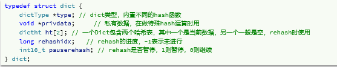
  - DictHashTable
    - sizemask掩码计算插入位置，与Java的hashmap相同，与运算节省计算量。出现hash冲突，则生成链表
      - 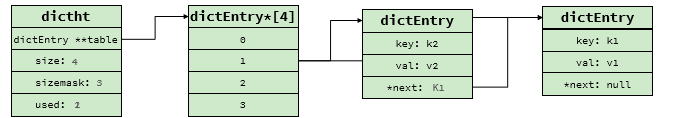
    - table为DictEntry结合
    - 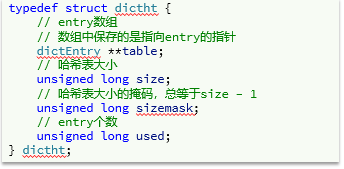
  - DictEntry
- **Dict扩容/收缩**size必须是2^n
  - **扩容**
    - 在hash表元素过多时，需要进行扩容
    - 触发扩容条件（负载因子（LoadFactor = used/size）【`哈希表以保存节点数量 / 哈希表的大小` 因为节点可以是链表，所以负载因子可以>=1】）
      - hash表的LocalFactor>=1,并且服务器没有执行bgsave或者AOF持久化操作
      - hash表的LocalFactor>5
  - **收缩**
    - 若LocalFactor<0.1时，收缩
  - **渐进式rehash**：扩容/收缩会创建新的hash表，导致hash表的size和sizemask变化，将旧hash表的数据重新计算位置到新hash表。渐进式为了避免因为hash表过大,一次性执行扩容/收缩操作过慢，阻塞主线程。**所以每一次访问dict都会进行rehash。**
    - **步骤**
      - 计算新的hash表的size
      - 创建新的大小为size的hash表，赋值给Dict的dict.ht[1]
      - **rehash操作不是一次性完成**，每次增删查改，都会将dict.ht[0]旧hash表中的一个链表迁移到新hash表。直到全部迁移，
      - 交换dict.ht[0]和dict.ht[1]，并释放dict.ht[1]，rehash结束
      - 新增操作直接写入ht[1],查，改，删会在rehash操作时两个表都查找执行

### 4，ZipList

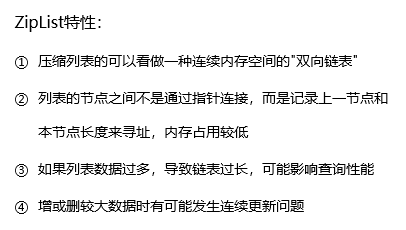

压缩列表：特殊双端链表，底层并不是双向链表，但可以实现双向链表功能。**使用连续内存**


- zlbytes：记录整个压缩列表占用的字节数
- zltail：记录尾结点距离拉锁列表起始位置的偏移量。可以计算确定尾结点的地址（快速查找）
- zllen：包含的结束数
- zlend：结束字符，标记压缩列表末端
- entry：节点，长度不固定，随内容变化，节省内存
  - 
  - previous_entry_length：前一节点的长度，占1个或5个字节（以此实现倒序遍历）
    - 前一节点的长度小于254字节，占1个字节，大于则占5个字节
  - encoding：编码属性，记录content的数据类型，以及长度    占用1 byte。
    - 00、01或者10开头代表字符串，分别占有1,2,5比特。后面为content长度
    - 11开头，content为整数，只占用1字节，表示整数占用字节数
      - 
  - contents：节点数据

压缩列表操作到指定位置的数据，每个节点，可知上一个节点的长度，进而得知previous_entry_length，在根据encoding的前两位知道encoding的长度和content的长度，得到了整个entry的长度，可以到下一个entry

- **连续更新问题**
  - 如下链表时，在首节点插入一个超过254字节的entry，则后续的第一个entry的previous_entry_length就要增加4，，但该entry的结点长度原来是是250字节，增加后，后续节点也要加4.
  - 
  - ZipList这种特殊情况下产生的连续多次空间扩展操作称之为**连锁更新（**Cascade Update）。新增、删除都可能导致连锁更新的发生。

### 5，QuickList


- 为双向链表，每个节点为ZipList（ZipList需要连续内存，双向链表使得可以使用多个ZipList，从而一定程度缓解使用连续内存的问题）。
- ZipList可以设置list上限，可以设置大小或者节点个数
- 可以对ZipList进行压缩。进一步节省内存
- 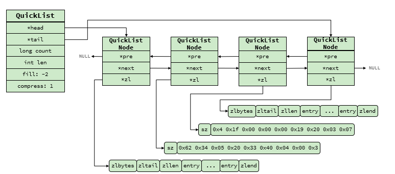

### 6，SkipList


**跳表**

- 双向链表，**有序**
- **多级指针：**每个节点不仅可以指向下一个节点，还可以指向不同跨度的节点（在查找元素时更快）
- 

**跳表与红黑树的区别**

- 跳表特点

  - 增删改查性能与红黑树类似，但实现简单
  - 批量查询方便，可以很方便的找到区间中的批量数据，更方便做批量操作


### RedisObject

redis中的数据，键和值都会封装为一个RedisObject。


redis会根据不同的数据类型，选择不同的编码方式，即一个对象类型有多种编码方式。HT为hashtable


包含11种不同类型：11种不同类型：


### BigKey

- 定义

  - **字符串类型**：它的big体现在单个value值很大，一般认为超过10KB就是bigkey。

  - **非字符串类型**：哈希、列表、集合、有序集合，它们的big体现在元素个数太多，一般来说超过5000个。

- 危害
  1. 内存空间不均匀（单个内容过大，当然不均匀）
  2. 超时阻塞：由于Redis单线程的特性，操作bigkey的通常比较耗时，也就意味着阻塞Redis可能性越大
  3. 网络拥塞：bigkey也就意味着每次获取要产生的网络流量较大。流量大就容易产生网络阻塞
- 查询 bigkey：   redis-cli --bigkeys
- 优化
  1. 拆分：将一个元素拆分为多个：将一个list集合中的数据改为：一个list包含多个list。每个list再保存数据
  2. 合理使用数据类型：不要直接保存 key = user:1 ，value=user信息。可以改为  key = user:name:1 ,value = 名字  


### 五种基本数据类型

首先都是redisObject对象，更底层使用不同的编码方式

#### String

- 基本编码方式：RAW，基于简单动态字符串（SDS）实现，上限是512MB。
- 若存储的SDS长度小于44字节，则采用EMBSTR编码（读法：M String）编码，
  - **注意**，此编码格式下，RedisObject与SDS在内存中为连续空间，不是指针指向的关系。（申请内存时只需要调用一次内存分配函数，效率高）
  - 此编码下，该对象最多占用64字节
  - 此时底层仍使用SDS保存对象
- 若存储为整数值，采用INT编码，RedisObject中的pre直接保存数值，不用使用SDS了 

#### List

- 底层使用QuickList，可以双端访问，且内存占用较低，包含多个ZipList，存储上限高


#### Set

无序，元素唯一，可以求交集并集，差集

- 底层采用HT编码，即Redis中的Dict。Dict 可以保存键值对,value统一为null
- 若存储的所有数据都是整数时，且元素数量不超过set-max-intset-entries阈值，采用intset节省内存

#### Zset

set存储，且按分数排序，元素唯一，可以通过元素获取分数

- 底层使用SkipList和HT（Dict）结合的方式，

  - SkipList：可以排序，按分数排序，可以同时存储元素和分数。（保证有序性）

  - HT（Dict）：键值存储，key=元素，value=分数   （保证键值对，通过元素获取分数）

- 在数量较小时，采用ZipList结构节省内存。

- （同时维护两个结构，消耗内存，数量很小时，无序和有效没有太大差别）

  - 同时满足如下两个条件
    - 元素数量小于阈值（默认128）
    - 元素大小小于64字节
  - ZipList没有排序功能，也不是键值对存储，采用了新的编码方式
    - ZipList为连续内存，因此score和element是紧挨在一起的两个entry， element在前，score在后
    - score越小越接近队首，score越大越接近队尾，按照score值升序排列

#### Hash

键值存储，唯一

- 底层使用HT（Dict），与Zset类似
- Hash结构默认采用ZipList编码，相邻的两个entry分别保存key和value（若数据较少时底层使用ziplist）
- 数据量较大时，会转为HT编码（Dict），触发条件（满足一个则转变）
  - ZipList的元素数量超过了阈值，默认512
  - ZipList的entry大小超过阈值64字节

## 网络模型

### 1，用户空间和内核空间

为了避免用户应用与操作系统在计算机上冲突，分为内核空间和用户空间（用户态和内核态）

- 用户态只能调用自己的资源，系统资源需要向系统申请，由内核态代为执行
- 内核态可以调用系统一切资源


- ## Linux下的IO过程

  - 在用户空间和内核空间都有缓冲区
  - 写数据时，要把用户缓冲数据拷贝到内核缓冲区，然后写入设备
  - l读数据时，要从设备读取数据到内核缓冲区，然后拷贝到用户缓冲区
  - 五种IO模型 
    - 看操作系统的IO模型

### 2，Redis网路模型

- 看redis 单线程

### RESP协议

是RESP2协议，客户端发送遵从此协议的信息，与Redis的Service通信

- u单行字符串：首字节是 ‘**+**’ ，后面跟上单行字符串，以CRLF（ "**\r\n**" ）结尾。例如返回"OK"： "+OK\r\n"

- 错误（Errors）：首字节是 ‘**-**’ ，与单行字符串格式一样，只是字符串是异常信息，例如："-Error message\r\n"

- 数值：首字节是 ‘**:**’ ，后面跟上数字格式的字符串，以CRLF结尾。例如：":10\r\n"

- 多行字符串：首字节是 ‘**$**’ ，表示二进制安全的字符串，最大支持512MB：

- 如果大小为0，则代表空字符串："$0\r\n\r\n"

- 如果大小为-1，则代表不存在："$-1\r\n"

- 数组：首字节是 ‘*****’，后面跟上数组元素个数，再跟上元素，元素数据类型不限:（一般都使用数组）

- set name ”虎哥”

  - ```
    *3\r\n
    $3\r\nset\r\n
    $4\r\nname\r\n
    $6\r\n虎哥\r\n
    ```


## 内存策略

若占用内存过多，影响性能，若是达到上限，则无法存储其他数据。所以采用了一些策略实现内存回收

#### 内存过期策略

- Redis是如何知道一个key是否过期呢？
  - 数据库中保存有两个Dict，即两个字典，一个是key-value，一个是key-ttl保存过期时间。所以在获取数据时，从一个Dict中获取值，从一个Dict中获取过期时间，验证是否过期

- 是不是TTL到期就立即删除了呢？
  - 不是，因为实时检测每个key的过期时间过于消耗性能，Redis 采用的是 **周期删除+惰性删除** 。
  - **惰性删除：**获取数据时，检测是否过去，若过期，则删除该key。
    - 为避免保存在redis的key，已过期没有访问，又引入了周期删除
  - **周期删除**：周期性的抽样部分key，判断是否过期，进行删除
    - 服务器初始化时，按照server.hz的频率执行过期key的处理，使用SLOW模式
    - 每个事件循环前，执行过期key清理，使用FAST模式
  - SLOW模式（速度较慢，但效率高）
    - 执行频率受server.hz影响，默认为10，每个周期100ms。
    - 执行一次删除操作不超过周期的25%
    - 每个遍历db，遍历db中的bucket，抽取20个key判断是否过期。
    - 如果没达到时间上限（25ms）并且过期key比例大于10%，再进行一次抽样，否则结束
  - FAST模式（速度快）
    - 执行频率受事件调用影响，两次之间间隔不低于2ms
    - 执行清理耗时不超过1ms
    - 每个遍历db，遍历db中的bucket，抽取20个key判断是否过期。
    - 如果没达到时间上限（1ms）并且过期key比例大于10%，再进行一次抽样，否则结束


## 其他场景对过期key的处理


1、快照生成RDB文件时

  过期的key不会被保存在RDB文件中。

2、服务重启载入RDB文件时

  Master载入RDB时，文件中的未过期的键会被正常载入，过期键则会被忽略。Slave 载入RDB 时，文件中的所有键都会被载入，当主从同步时，再和Master保持一致。

3、AOF 文件写入时

  因为AOF保存的是执行过的Redis命令，当过期key被删除时，DEL 命令也会被同步到 AOF 文件中去。

4、重写AOF文件时

  执行 BGREWRITEAOF 时 ，过期的key不会被记录到 AOF 文件中。

5、主从同步时

  Master 删除 过期 Key 之后，会向所有 Slave 服务器发送一个 DEL命令，Slave 收到通知之后，会删除这些 Key。

  Slave 在读取过期键时，不会做判断删除操作，而是继续返回该键对应的值，只有当Master 发送 DEL 通知，Slave才会删除过期键，这是统一、中心化的键删除策略，保证主从服务器的数据一致性。


#### 内存淘汰策略

在redis内存使用超出阈值，会主动删除部分key，释放内存。**需要设置redis内存上限才会执行内存淘汰**

- noeviction： 不淘汰任何key，但是内存满时不允许写入新数据，默认就是这种策略。
- volatile-ttl： 对设置了TTL的key，比较key的剩余TTL值，TTL越小越先被淘汰
- allkeys-random：对全体key ，随机进行淘汰。也就是直接从db->dict中随机挑选
- volatile-random：对设置了TTL的key ，随机进行淘汰。也就是从db->expires中随机挑选。
- allkeys-lru： 对全体key，基于LRU算法进行淘汰
- volatile-lru： 对设置了TTL的key，基于LRU算法进行淘汰
- allkeys-lfu： 对全体key，基于LFU算法进行淘汰
- volatile-lfu： 对设置了TTL的key，基于LFI算法进行淘汰

LRU（Least Recently Used），最少最近使用。用当前时间减去最后一次访问时间，这个值越大则淘汰优先级越高。

LFU（Least Frequently Used），最少频率使用。会统计每个key的访问频率，值越小淘汰优先级越高。

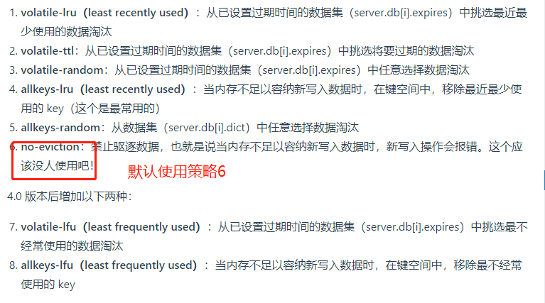


# 数据结构

## 红黑树

自平衡的二叉搜索树：**本质红黑树是对2-3-4树的一种实现**，将所有的结点看做为黑结点形成2叉结点，红结点与父黑结点结合形成3-4叉结点。都是黑色结点

2叉结点：只包含大于它的结点和小于它的结点

3叉结点：一个黑结点与一个红结点结合     （15,30） 指向3个位置：x<15  15<x<30,x>30

4叉结点：一个黑结点与两个个红结点结合   （15,27,33）

https://zhuanlan.zhihu.com/p/273829162

规则：

1. 结点是红色或黑色。
2. 根结点是黑色。
3. 每个叶子结点都是黑色的空结点（NIL结点）。
4. 每个红色结点的两个子结点都是黑色。(从每个叶子到根的所有路径上不能有两个连续的红色结点)
   - **因为红黑树是2-3-4树的具体体现，红色结点可以连接，则意味着不止是4叉的结点，可能多个，不满足条件**
5. 从任一结点到其每个叶子的所有路径都包含相同数目的黑色结点。
   - **红色结点与黑色结点绑定，则只有黑色结点贡献真实高度，所以在相同的黑色结点意味着该树真正的平衡**
6. 从根到叶子的最长的可能路径不多于最短的可能路径的两倍长。


调整的方式有两种：变色和旋转（左旋和右旋），来满足规则

从根到叶子的最长的可能路径不多于最短的可能路径的两倍长。

- **原因：因为任一结点到叶子节点的所有路径都包含相同的黑色节点个数，则最长路径为最短路径的2倍往上，则以为着一条路径上，红色结点个数多于黑色节点个数，也就是说：红色结点连接在一起，与定义矛盾**


“您应该知道红黑树的五条定义，如果我构造一颗只有黑色节点的红黑树，这样子可行吗？因为这样子没有破坏任何一条红黑树的规则。”

- 您说的一点问题也没有，但需要满足如下要求
- 由于任一节点到每一个叶子节点的所有路径包含相同数目的黑色节点。**则需要所有叶子节点等高**
- **添加元素或者删除元素，需要保存等高的要求，也就是说添加结点需要添加一整层才可以，删除也是。**


## JDK提供的排序算法是怎样的？

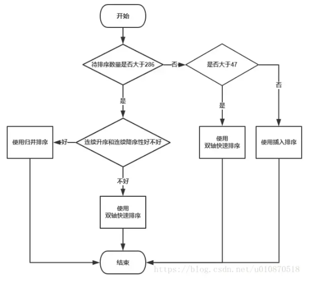

在JDK中当待排序的元素个数小于 286 时使用快速排序，当待排序的元素个数小于47时使用插入排序，

快排进行了优化，双轴快排

​         JDK的双轴快排，选两个轴，排序方式，比轴1小的数据放到轴1左侧，比轴2大的数据放到轴2右侧，其余的数据在轴1和轴2之间

## 排序时间复杂度

https://blog.csdn.net/yushiyi6453/article/details/76407640


## 堆排序

堆排序的基本思想是：1、将带排序的序列构造成一个大顶堆，根据大顶堆的性质，当前堆的根节点（堆顶）就是序列中最大的元素；2、将堆顶元素和最后一个元素交换，然后将剩下的节点重新构造成一个大顶堆；3、重复步骤2，如此反复，从第一次构建大顶堆开始，每一次构建，我们都能获得一个序列的最大值，然后把它放到大顶堆的尾部。最后，就得到一个有序的序列了。**第i次取堆顶的记录重建堆需要用Olog（i）的时间，需要进行n-1次堆顶记录，时间复杂度为O(nlog(n))无论好坏都是nlog（n）**

HeapAdjust：选择i为根节点的树，该树中每一个结点都大于它的子节点，解释了什么倒序，因为从底层的结点开始。为什么for (int j = 2*i; j<=i1; j++)  因为子节点为根节点位置的 `2*i`和`2*i+1`

**缺点：**堆的维护问题，实际场景中的数据是频繁发生变动的，而对于待排序序列的每次更新（增，删，改），我们都要重新做一遍堆的维护，以保证其特性。


使用场景

1.**快速排序**是目前基于比较的内部排序中被认为是最好的方法，当待排序的关键字是**随机分布**时，快速排序的平均时间最短。数组若是倒序，则排序时间复杂度=O(N^2)
2.**堆排序**所需的辅助空间少于快速排序，并且不会出现快速排序可能出现的最坏情况，适合**超大数据量**。这两种排序都是不**稳定的**。
3.若要求**排序稳定**，则可选用**归并排序**。


```java
public void HeapSort(int[] arr){
        if(arr==null||arr.length==0){
            return;
        }
        int len = arr.length;
        buildMaxHeap(arr,len);
        for (int i = len-1; i >0 ; i--) {
            // 移除最大值，到末尾位置，遍历一遍后，则数组通过堆排序，实现升序
            swap(arr,0,i);
            len--;
            // 再次建立一个最大堆
            heapify(arr,0,len);
        }
    }
    // 建立一个最大堆，数组元素是  [i,len]
    private void heapify(int[] arr, int i, int len) {
        int left = 2*i+1;
        int right = 2*i+2;
        // 默认当前节点是最大值
        int maxIndex = i;
        if(left<len&&arr[left]>arr[maxIndex]){
            // 如果有左节点，并且左节点的值更大，更新最大值的索引
            maxIndex = left;
        }
        if(right<len&&arr[right]>arr[maxIndex]){
            maxIndex = right;
        }
        if(maxIndex!=i){
            // 如果最大值不是当前非叶子节点的值，那当前节点和最大值的子节点值互换
            swap(arr,i,maxIndex);
            heapify(arr,maxIndex,len);
        }
    }

    // 建立一个最大堆
    public void buildMaxHeap(int[] arr, int len) {
        for (int i = len/2-1; i >=0 ; i--) {
            heapify(arr,i,len);
        }
    }
    private void swap(int[] arr, int i, int j) {
        int temp = arr[i];
        arr[i] = arr[j];
        arr[j] = temp;
    }

```


## Hash一致性算法

对于分布式存储，不同机器上存储不同对象的数据，我们使用哈希函数建立从数据到服务器之间的映射关系。**只要是用于缓存服务器。**

**问题：**

m = hash(o) mod n

o为对象名称，n为机器的数量，m为机器编号。


所以当集群中数据量很大时，采用一般的哈希函数，在节点数量动态变化的情况下会造成大量的数据迁移，导致网络通信压力的剧增，严重情况，还可能导致数据库宕机。

梳理：

因为hash请求不到原来的服务器，查询不到缓存，导致缓存雪崩，进而导致数据库宕机。

**hash一致性算法来解决这个问题**：

它可以保证当机器增加或者减少时，节点之间的数据迁移只限于两个节点之间，不会造成全局的网络问题。**是一种负载均衡的方案。**对于大量的请求或者调用，通过一定的hash将他们均匀的散列，从而实现压力的平均化。


hash一致性算法：使用环形的hash，计算公式：   hash（key）/2^32=  位置

- 分别对服务器计算hash，并记录它们的位置（group0，group1，group2）
- 再对每个key计算hash，沿着顺时针方向找到下一个服务器的位置，则该key保存到该服务器


**在插入或者删除缓存服务器节点，只会改变相邻节点key的位置，对其他节点没有影响**


**问题：**

- **数据倾斜**
  - 可能会出现，服务器都集中在hash环的一部分，即服务器的位置不是均匀分布，则key的分布也不均匀。十分依赖服务器的hash位置
- **缓存雪崩**
  - 如上图，三个group集群，如果group0删除，则将key统一交给group1，此时group1的请求量增加，可能会崩溃，则group1也移除hash环，则所有的key转移到group2，成滚雪球一样，最终导致雪崩。

**解决办法**

- #### **引入虚拟节点**

  - 一台服务器会映射多个虚拟节点，都分布到 hash环上，此时所有的服务器就能均匀分布，在删除某一节点后，该节点的数据也能均匀的分布到其他服务器上，而不是交由一台服务器。

## 雪花算法

分布式情况下生成递增的UID，但不是严格递增的。缺点：**严重依赖时间。**

###  Snowflake(雪花算法) 结构

Snowflake 是 Twitter 开源的分布式 ID 生成算法。Snowflake 由 64 bit 的二进制数字组成，这 64bit 的二进制被分成了几部分，每一部分存储的数据都有特定的含义：

- **第 0 位**： 符号位（标识正负），始终为 0，没有用，不用管。
- **第 1~41 位** ：一共 41 位，用来表示时间戳，单位是毫秒，可以支撑 2 ^41 毫秒（约 69 年）
- **第 42~52 位** ：一共 10 位，一般来说，前 5 位表示机房 ID，后 5 位表示机器 ID（实际项目中可以根据实际情况调整）。这样就可以区分不同集群/机房的节点。
- **第 53~64 位** ：一共 12 位，用来表示序列号。 序列号为自增值，代表单台机器每毫秒能够产生的最大 ID 数(2^12 = 4096),也就是说单台机器每毫秒最多可以生成 4096 个 唯一 ID。


### 优化

- 41位时间戳，因为我们时间计算是1970年开始，可以使用69年。所以可以以项目开始的时间为基准时间。
- 获取唯一ID并发对性能要求高，所以计算通过位运算和位移操作来提交处理速度

### 时间回拨问题

服务器上的时间突然倒退到之前的时间，那么基于时间的UID可能出现重复

- 人为原因，把服务器环境的时间回拨了
- 不同机器的时间可能存在不一致，可能存在时间回拨问题

### 解决方案


### 分布式雪花算法

```java

class Snowflake {
    private long lastTime = System.currentTimeMillis();
    // 机房内的机器Id
    private long workId = 0L;
    // 机房Id
    private long dataId = 0L;
    // 最大序列号
    private long max = (long) Math.pow(2, 12) - 1;
    //序列号，可以自增1
    private AtomicLong seq = new AtomicLong();

    public Snowflake(long workId, long dataId) {
        this.workId = workId;
        this.dataId = dataId;
        seq.set(-1);
    }
    public synchronized long getId() {
        if (System.currentTimeMillis() == lastTime) {
            if (seq.get() > max) {
                while (System.currentTimeMillis() == lastTime) {
                }
                seq.set(-1);
            }
        }else{
            seq.set(-1);
        }
        lastTime = System.currentTimeMillis();
        return lastTime << 22
                | dataId << 17
                | workId << 12
                | seq.incrementAndGet();
    }
}
```


https://www.cnblogs.com/binyue/p/11596763.html

## 限流算法及各类常用方案

### 限流定义

限流：由于API接口无法控制调用方的请求次数，若请求瞬间增多时，服务器因为处理该过多请求，会占用服务器过多资源，从而影响其他请求的响应速度，甚至服务器宕机

限流：限制应用服务的请求次数，超过限制次数会执行提前配置的代码或者快速失败

**限流用途**

限流可以应对：

- 热点业务带来的突发请求；
- 调用方 bug 导致的突发请求；
- 恶意攻击请求。

### 问题

若单点限流，分布式机器部署下，可能存在，每个节点并未达到限流限制，但数据库等资源却被击垮的情况。


### 算法

#### 1，固定窗口计数器算法

1. 将时间划分为多个窗口；
2. 每个窗口内每次请求则将计数器加一
3. 如果计数器超过限制数量，则本窗口内所有请求都被丢弃，当时间达到下一个窗口时，计数器重置

==评价：==固定窗口为最简单的限流算法，但是可能会出现一下问题：限制1秒内最多处理5个请求，在第一个窗口的后半秒处理5个请求，在第二个窗口的前半秒再处理5个请求，则1s内处理了10个请求。


#### 2，滑动窗口计数器算法

- 根据时间分为多个区间
- 在每个区间内每次请求就将计数器加一，一个时间窗口占据多个区间
- 每经过一个区间的时间，则抛弃最老的区间，并纳入最新的一个区间。
- 若当前区间内的请求技术总和超过了限制数量，则本区间所有请求都被丢弃

==评价：==通过窗口滑动的方式，避免了固定窗口计算器带来的双倍突发请求，但**时间区间的精度越高，则需要划分的窗口越多，算法需要的容量空间就越大，即越消耗性能**

#### 3，漏桶算法

漏桶算法(Leaky Bucket)是流量整形（Traffic Shaping）或速率限制（Rate Limiting）时经常使用的一种算法，它的主要目的是控制数据注入到网络的速率，平滑网络上的突发流量。漏桶算法提供了一种机制，通过它，突发流量可以被整形以便为网络提供一个稳定的流量。

漏桶可以看作是一个带有常量服务时间的单服务器队列，如果漏桶（包缓存）溢出，那么数据包会被丢弃。 在网络中，漏桶算法可以控制端口的流量输出速率，平滑网络上的突发流量，实现流量整形，从而为网络提供一个稳定的流量。

**以固定速率消费请求，漏桶容量固定，每次用户请求都得放入桶中，桶满则拒绝请求或等待。达到应对突发流量，平滑网络请求的效果。**

**像底部漏水的水桶一样，水桶漏的速度比不上进水的速度，则桶内水原来越多，当要溢出时，则该桶拒绝进水，以保证平滑网络请求，应对突发流量，提供一个稳定的流量的目的**

==**缺点**==：短时间内如果有大量请求进来，即使服务器闲置，能够处理，由于服务器只能以固定速率处理请求，会等待一段时间才能被处理，甚至可能被丢弃请求。**即无法应对突发请求**


**伪代码**

```
when（有请求）{
	bt = now()        // bt现在的时间
	at = last()
	Wb = (bt-at)*r;   //at上次请求处理的时间，r进水的速度，wb上次请求到这次请求的时间内消耗数
	w  = max(w-wb,0)  // w桶内的请求数，
	if(w<C){          // 判断桶内的请求数，是否超出桶容量
		w++;  
		return true;
	}else{
		return false;
	}
}
```


#### 4，令牌桶算法（限流算法）

- 令牌以固定速率生成
- 生成的令牌存放在桶中，如果桶满，则丢弃多余的令牌，请求进来时，手心啊在令牌桶中获取令牌，取不到令牌则无法处理请求，会被丢弃

令牌桶算法用来发送到网络上的数据的数目，并允许突发数据 的发送。

系统以一个固定的速度往桶内放入令牌，如果请求进来，需要从桶中获取令牌才能被处理。

==**评价：**==**令牌桶能够将所有请求平均分布到时间区间内，也能够处理服务器的突发请求。**


**伪代码**

```
when(有请求){
	bt = now() // 当前时间
	at = last()// 上次处理请求的时间
 	   
                     // 上次请求处理完，桶内剩余的令牌数
 	wb = (bt-at)*r   //r,为令牌进入桶的速度，wb上次请求到这个请求的时间间隔内令牌数
    w = min(wb+w,C)  // C为桶的容量
    if(w>=1){
    	w--;
    	return true;
    }else{
        return false;
    }
}
```


#### 漏桶算法和令牌桶算法的区别

漏桶算法能够强行限制数据的传输速率，令牌桶算法能够在限制数据的平均传输速率的同时还允许某种程度的突发传输。


在某些情况下，漏桶算法不能够有效地使用网络资源，因为漏桶的漏出速率是固定的，所以即使网络中没有发生拥塞，漏桶算法也不能使某一个单独的数据流达到端口速率。因此，漏桶算法对于存在突发特性的流量来说缺乏效率。而令牌桶算法则能够满足这些具有突发特性的流量。通常，漏桶算法与令牌桶算法结合起来为网络流量提供更高效的控制。

**使用场景**

**并不能说明令牌桶一定比漏洞好，她们使用场景不一样。**令牌桶可以用来保护自己，主要用来对调用者频率进行限流，为的是让自己不被打垮。所以如果自己本身有处理能力的时候，如果流量突发（实际消费能力强于配置的流量限制），那么实际处理速率可以超过配置的限制。而漏桶算法，这是用来保护他人，也就是保护他所调用的系统。主要场景是，当调用的第三方系统本身没有保护机制，或者有流量限制的时候，我们的调用速度不能超过他的限制，由于我们不能更改第三方系统，所以只有在主调方控制。这个时候，即使流量突发，也必须舍弃。因为消费能力是第三方决定的。

总结起来：如果要让自己的系统不被打垮，用令牌桶。如果保证被别人的系统不被打垮，用漏桶算法。

**分布式令牌桶代码**

```

```

**漏桶算法，令牌桶算法**

### 分布式限流

分布式下，可能存在多个服务，或者一个服务部署在多台机器上。所以限流不能是单纯的单机限流

- **分布式限流方案**
  - **中间件限流：**借助sentinel中间件或者redis+lua脚本实现对应的限流逻辑。（redis是服务之间共享的）
  - **网关层限流：**最常用的方案，直接在网关层进行转发时进行限流。也可以使用中间件sentinel或者redis+lua脚本进行限流

**为什么使用redis？**

- 速度快，减少网络开销，redis执行lua脚本，会一次执行，多条redis命令，减少了网络的传输开销
- 原子性：redis执行lua脚本是原子操作，保证了操作不会被其他指令插入或者打扰。


### 限流方案

三个方面

- ### 容器限流

  1. #### Tomcat

     - Tomcat可以配置连接器的最大线程数（Tomcat的线程池是请求直接创建线程处理，超过最大线程数后，再进行排队，与并发的线程池不同）

  2. #### Nginx

     - Nginx有两种限流手段，控制速率或者控制并发连接数

     - 控制速率

       - limit_req_zone 配置限制单位时间内的请求数

       - ```nginx
         limit_req_zone $binary_remote_addr zone=mylimit:10m rate=2r/s;
         ```

     - 并发连接数

       - 利用 `limit_conn_zone` 和 `limit_conn` 两个指令即可控制并发数
       - :warning:只有在请求被后端服务器被处理后，才能计数

- ### 服务端限流

  - #### Semaphore

    - 信号量的实现，请求进来时可首先尝试获取信号量， 若获取不到，则阻塞，或者返回快速失败

  - #### RateLimiter

    - Guava中基于令牌桶实现的一个限流工具，使用非常简单，通过方法`create()`创建一个桶，然后通过`acquire()`或者`tryAcquire()`获取令牌：
    - 令牌桶算法，可以允许流量暴增的情况，若令牌桶空了，再请求获取令牌，会陷入阻塞，在令牌补充后返回结果

  - #### Sentinel

    - 阿里开源的限流熔断组件，底层通过滑动窗口算法。
    - 通过为方法增加注解`@SentinelResource(String name)`或者手动调用`SphU.entry(String name)`方法开启流控。

- ### 分布式下的限流

  - 若对公共资源进行限流，则单机的限流算法失效，分布式下的限流方案主要采取中心系统统一管控流量配额。redis结合lua脚本实现原子性设置

  - #### Redis 通过lua脚本实现简单窗口：

    - 设置窗口大小即过期时间，和请求数。redis保存值过期后，则可以重新获取值

  - #### Redis通过lua脚本实现令牌桶

    - 获取令牌后，用set记录请求时间和剩余token数量
    - 每次请求令牌时，都会通过这两个参数，与请求的时间，流速值进行计算，返回时候获取令牌成功。
    - （网上有很多该算法）

## 负载均衡算法

https://www.jianshu.com/p/7b2b9d646746

- 轮询：
  - 各个服务节点被访问的概率也基本相同，也主要应用在各个服务节点性能差异不大的情况下。
- 加权轮询算法
  - 在轮询算法基础上的改进，可以通过给每个节点设置不同的权重来控制访问的概率，因此主要被用在服务节点性能差异比较大的情况。比如经常会出现一种情况，因为采购时间的不同，新的服务节点的性能往往要高于旧的节点，这个时候可以给新的节点设置更高的权重，让它承担更多的请求，充分发挥新节点的性能优势。
- 负载最低优先（可以从连接数、http请求数、cpu负载等情况来）
  - 由于复杂度和不可控制原因，实际应用还是很少的
- Hash 类算法
  - 因为它能够保证同一个客户端的请求始终访问同一个服务节点，所以适合服务端节点处理不同客户端请求差异较大的场景。比如服务端缓存里保存着客户端的请求结果，如果同一客户端一直访问一个服务节点，那么就可以一直从缓存中获取数据。

**hash类算法**

负载均衡系统根据任务中的某些关键信息进行 Hash 运算，将相同 Hash 值的请求分配到同一台服务器上，这样做的目的主要是为了满足特定的业务需求。例如：
 （1）源地址 Hash
 将来源于同一个源 IP 地址的任务分配给同一个服务器进行处理，适合于存在事务、会话的业务。
 （2）ID Hash
 将某个 ID 标识的业务分配到同一个服务器中进行处理，这里的 ID 一般是临时性数据的 ID（如 session id）。
 （3）一致性hash
 **一致性hash算法，是通过某个hash函数，把同一个来源的请求都映射到同一个节点上。**一致性hash算法最大的特点就是同一个来源的请求，只会映射到同一个节点上，可以说是具有记忆功能。只有当这个节点不可用时，请求才会被分配到相邻的可用节点上。


推荐：将IP进行hash，并且使用hash一致性算法 。


# JVM

## 如何让正在运行的 Java 工程的优雅停机？

linux中停止进程的方式：kill 命令发送指定信号到相应进程

- 2 (SIGINT：[中断](https://so.csdn.net/so/search?q=中断&spm=1001.2101.3001.7020)，Ctrl+C)。
- 15 (SIGTERM：终止，默认值)。
- 9 (SIGKILL：强制终止)。

`kill -15 PID`系统向相应的应用程序发送信号，然后释放相应资源后停止，此时程序可能会再执行一段时间

`kill -9 PID` 命令，程序会直接终止


**java的关闭钩子（Shutdown Hook）**

```
Runtime.getRuntime().addShutdownHook(shutdownHook);
```

**jvm关闭时，会执行系统同已经设置的所有钩子方法，执行完所有钩子后，jvm才会关闭。**

在以下情景会生效

- 程序正常退出
- 程序中使用`System.exit()`退出JVM
- 系统发生`OutofMemory`异常
- 使用`kill pid`干掉JVM进程的时候（kill -9时候是不能触发ShutdownHook生效的）


 JVM 自己定义了信号处理函数，这样当发送 kill pid 命令（默认会传 15 也就是 SIGTERM）后，JVM 就可以在信号处理函数中执行一些资源清理之后再调用 exit 退出。


## 一个对象的创建过程

## jvm怎么调优？

## OOM的排查

- 堆OOM
  - 异常
    - **`java.lang.OutOfMemoryError: GC Overhead Limit Exceeded`** ： 当 JVM 花太多时间执行垃圾回收并且只能回收很少的堆空间时，就会发生此错误。	
    - **`java.lang.OutOfMemoryError: Java heap space`** :假如在创建新的对象时, 堆内存中的空间不足以存放新创建的对象, 就会引发此错误。(和配置的最大堆内存有关，且受制于物理内存大小。最大堆内存可通过`-Xmx`参数配置，若没有特别配置，将会使用默认值，
  - 解决办法：
    - 内存泄露或者堆的大小设置不当引起。对于内存泄露，需要通过内存监控软件查找程序中的泄露代码，而堆大小可以通过虚拟机参数-Xms,-Xmx等修改。

- 方法区OOM
  - 异常：
    - 当元空间溢出时会得到如下错误： `java.lang.OutOfMemoryError: MetaSpace`
  - 解决办法
    - JDK1.7  `-XX:PermSize`设置永久代初始大小。`-XX:MaxPermSize`设置永久代最大可分配空间
    - `JDK8`及以后：可以使用`-XX:MetaspaceSize`和`-XX:MaxMetaspaceSize`设置元空间初始大小以及最大可分配大小。
- 栈OOM
  - -Xss来设置栈的大小。


- ### **排查手段**

  - **重点是确认内存中的对象是否是必要的，也就是要先分清楚到底是出现了内存泄漏还是内存溢出。**
    - 如果是内存泄漏，可进一步通过工具查看泄漏对象到GC Roots的引用链。这样就能够找到泄漏的对象是通过怎么样的路径与GC Roots相关联的导致垃圾回收机制无法将其回收。掌握了泄漏对象的类信息和GC Roots引用链的信息，就可以比较准确地定位泄漏代码的位置。
    - 如果不存在泄漏，那么就是内存中的对象确实必须存活着，那么此时就需要通过虚拟机的堆参数（ -Xmx和-Xms）来适当调大参数；从代码上检查是否存在某些对象存活时间过长、持有时间过长的情况，尝试减少运行时内存的消耗。

**其实与程序内存占用内存过高相仿** 

## 如何查看当前Java程序里哪些对象正在使用，哪些对象已经被释放

等价于**使用jmap查看堆和对象的信息**

可以加给-histo加上live选项,只输出存活的对象
jmap -histo:live pid

查看内容：

num     #instances         #bytes  classname


输出的信息中带方括号的符号是java类型在jvm的表示式：
[C 等价于 char[]
[S 等价于 short[]
[I 等价于 int[]
[B 等价于 byte[]
[[I 等价于 int[][]


## Java中的对象一定在堆上分配吗？

一 、栈上分配

JVM在Server模式下的逃逸分析可以分析出某个对象是否永远只在某个方法、线程的范围内，并没有“逃逸”出这个范围，逃逸分析的一个结果就是对于某些未逃逸对象可以直接在栈上分配，由于该对象一定是局部的，所以栈上分配不会有问题。在实际的应用程序，尤其是大型程序中反而发现实施逃逸分析可能出现效果不稳定的情况，或因分析过程耗时但却无法有效判别出非逃逸对象而导致性能（即时编译的收益）有所下降，所以在很长的一段时间里，即使是Server Compiler，也默认不开启逃逸分析，甚至在某些版本（如JDK 1.6 Update18）中还曾经短暂地完全禁止了这项优化。

## System.GC() 一定会触发吗？

- Runtime.getRuntime().gc();也会触发GC

- System.GC() 不会马上进行垃圾回收，甚至不一定会执行垃圾回收

- ## 如果就是要立马触发垃圾回收，怎么做？

  - 添加上**runtime.runFinalizationSync();**

  - 其实当我们直接调用System.gc()只会把这次gc请求记录下来，等到runFinalization=true的时候才会先去执行GC，runFinalization=true之后会在允许一次system.gc()。之后在call System.gc()还会重复上面的行为。 

  - ```
        System.gc();
        runtime.runFinalizationSync();
        System.gc();
    ```

- ## System.gc()与Runtime.gc()的区别

  (1) GC是垃圾收集的意思（Gabage Collection）,内存处理是编程人员容易出现问题的地方，忘记或者错误的内存回收会导致程序或系统的不稳定甚至崩溃，Java提供的GC功能可以自动监测对象是否超过作用域从而达到自动回收内存的目的，[Java语言](https://link.jianshu.com/?t=https%3A%2F%2Fwww.baidu.com%2Fs%3Fwd%3DJava%E8%AF%AD%E8%A8%80%26tn%3D44039180_cpr%26fenlei%3Dmv6quAkxTZn0IZRqIHckPjm4nH00T1YvPjcYryP-ujfvuj0kPvmk0ZwV5Hcvrjm3rH6sPfKWUMw85HfYnjn4nH6sgvPsT6K1TL0qnfK1TL0z5HD0IgF_5y9YIZ0lQzqlpA-bmyt8mh7GuZR8mvqVQL7dugPYpyq8Q1R4njnkPWn1P0)没有提供释放已[分配内存](https://link.jianshu.com/?t=https%3A%2F%2Fwww.baidu.com%2Fs%3Fwd%3D%E5%88%86%E9%85%8D%E5%86%85%E5%AD%98%26tn%3D44039180_cpr%26fenlei%3Dmv6quAkxTZn0IZRqIHckPjm4nH00T1YvPjcYryP-ujfvuj0kPvmk0ZwV5Hcvrjm3rH6sPfKWUMw85HfYnjn4nH6sgvPsT6K1TL0qnfK1TL0z5HD0IgF_5y9YIZ0lQzqlpA-bmyt8mh7GuZR8mvqVQL7dugPYpyq8Q1R4njnkPWn1P0)的显示操作方法。

  (2) 对于GC来说，当程序员创建对象时，GC就开始监控这个对象的地址、大小以及使用情况。通常，GC采用有向图的方式记录和管理堆(heap)中的所有对象。通过这种方式确定哪些对象是”可达的”，哪些对象是”不可达的”。当GC确定一些对象为”不可达”时，GC就有责任回收这些内存空间。可以。程序员可以手动执行System.gc()，通知GC运行，但是[Java语言](https://link.jianshu.com/?t=https%3A%2F%2Fwww.baidu.com%2Fs%3Fwd%3DJava%E8%AF%AD%E8%A8%80%26tn%3D44039180_cpr%26fenlei%3Dmv6quAkxTZn0IZRqIHckPjm4nH00T1YvPjcYryP-ujfvuj0kPvmk0ZwV5Hcvrjm3rH6sPfKWUMw85HfYnjn4nH6sgvPsT6K1TL0qnfK1TL0z5HD0IgF_5y9YIZ0lQzqlpA-bmyt8mh7GuZR8mvqVQL7dugPYpyq8Q1R4njnkPWn1P0)规范并不保证GC一定会执行。

  (3) [垃圾回收](https://link.jianshu.com/?t=https%3A%2F%2Fwww.baidu.com%2Fs%3Fwd%3D%E5%9E%83%E5%9C%BE%E5%9B%9E%E6%94%B6%26tn%3D44039180_cpr%26fenlei%3Dmv6quAkxTZn0IZRqIHckPjm4nH00T1YvPjcYryP-ujfvuj0kPvmk0ZwV5Hcvrjm3rH6sPfKWUMw85HfYnjn4nH6sgvPsT6K1TL0qnfK1TL0z5HD0IgF_5y9YIZ0lQzqlpA-bmyt8mh7GuZR8mvqVQL7dugPYpyq8Q1R4njnkPWn1P0)是一种动态存储管理技术，它自动地释放不再被程序引用的对象，当一个对象不再被引用的时候,按照特定的垃圾收集算法来实现资源自动回收的功能。

  (4) System.gc();就是呼叫java虚拟机的[垃圾回收](https://link.jianshu.com/?t=https%3A%2F%2Fwww.baidu.com%2Fs%3Fwd%3D%E5%9E%83%E5%9C%BE%E5%9B%9E%E6%94%B6%26tn%3D44039180_cpr%26fenlei%3Dmv6quAkxTZn0IZRqIHckPjm4nH00T1YvPjcYryP-ujfvuj0kPvmk0ZwV5Hcvrjm3rH6sPfKWUMw85HfYnjn4nH6sgvPsT6K1TL0qnfK1TL0z5HD0IgF_5y9YIZ0lQzqlpA-bmyt8mh7GuZR8mvqVQL7dugPYpyq8Q1R4njnkPWn1P0)器运行回收内存的垃圾。

  (5) 当不存在对一个对象的引用时，我们就假定不再需要那个对象，那个对象所占有的存储单元可以被收回，可通过System.gc()方法回收，但一般要把不再引用的对象标志为null为佳。

  (6) 每个 Java 应用程序都有一个 Runtime 类实例，使应用程序能够与其运行的环境相连接。可以通过 getRuntime 方法获取当前运行时。 Runtime.getRuntime().gc();

  (7) **java.lang.System.gc()只是java.lang.Runtime.getRuntime().gc()的简写，两者的行为没有任何不同。**

  (8) 唯一的区别就是System.gc()写起来比Runtime.getRuntime().gc()简单点. 其实基本没什么机会用得到这个命令, 因为这个命令只是建议JVM安排GC运行, 还有可能完全被拒绝。 GC本身是会周期性的自动运行的,由JVM决定运行的时机,而且现在的版本有多种更智能的模式可以选择,还会根据运行的机器自动去做选择,就算真的有性能上的需求,也应该去对GC的运行机制进行微调,而不是通过使用这个命令来实现性能的优化

## java线程栈桢上只有引用还是拷贝了对象？

栈帧中局部变量表中存储的是引用，不是对象。局部变量表中的对象：基本数据类型、对象引用+

## java中的静态变量存在哪？

静态变量存在方法区，但是静态变量如果是引用数据类型，则该对象保存在堆中，仅地址保存在方法区。


## 继承

### 类可以extends一个泛型嘛？

子类可以继承父类的泛型。

**泛型继承类：**可以限制泛型的类型，泛型可以指定继承的类型。


## 运行时出现了while （true）即Java运行程序占用CPU100%，问题排查？（Linux）


https://juejin.cn/post/7040422748981100551


https://www.cnblogs.com/rinack/p/12969851.html

https://blog.csdn.net/baiye_xing/article/details/90483169

1. **top**   （查看系统CPU的占用情况）
2. top -Hp 进程ID   （查看进程下所有线程的CPU占用，进程ID从第一条命令获取）
3. printf "%x\n" 线程ID    （将需要的线程ID转换为16进制格式，也可以自己手动转换，不输入指令）
4.  jstack 进程号 | grep 线程ID   （查找该进程下某线程的详细情况，也可以只查进程，**注意此时线程ID需要写16进制数字**， stack  ）
   1. "VM Thread" os_prio=0 tid=0x00007f871806e000 nid=0xa runnable   （如果显示“VM Thread”，表示为垃圾回收线程，当前系统缓慢的原因主要是垃圾回收过于频繁，导致GC停顿时间较长。）
      1. jstat -gcutil 进程号 统计间隔毫秒 统计次数（缺省代表一直统计）   **查看某进程GC持续变化情况**
      2. 如果发现返回中FGC很大且一直增大，则可以确认为**内存溢出问题**
         1. 代码中一次获取了大量的对象，导致内存溢出，此时可以通过eclipse的mat工具查看内存中有哪些对象比较多；
      3. 内存占用不高，但是Full GC次数还是比较多，此时可能是显示的System.gc()调用导致GC次数过多，这可以通过添加-XX:+DisableExplicitGC来禁用JVM对显示GC的响应。
      4. jmap -heap 进程ID   查看进程堆内存使用情况
   2. 如果不是垃圾回收线程，则是执行问题，可能出现了while（true）问题，**在步骤4 jstack，可直接定位到代码行**，所以下面1,2意义不大
      1. jstack [进程]|grep -A 10 [线程的16进制]    -A 10表示查找到所在行的后10行
         1. 例子： jstack 21125|grep -A 10 52f1  
         1. 所以也可以直接  jstack 进程ID |grep 线程ID   定位到出现问题的代码
   3. 还有可能是死锁，此时会直接提示。关键字：deadlock.
5.  jmap -dump:format=b,file=filename pid   （导出某进程下内存heap输出到文件中。可以通过eclipse的mat工具查看内存中有哪些对象比较多）

## 运行时，如果程序内存过高，怎么排查

例如频繁创建对象,内存泄露等这里会有俩种情况,一种报oom,一种导致系统卡,访问等待.

1. Top指令查看

2.  分析JVM内存分配，老年性，新生代的内存使用率，GC情况

   jstat -gc PID
   查看堆内存使用情况
   jmap -heap 71614
   jmap -heap 进程号

3. 导出dump;使用分析工具分析对象    分析工具：HeapAnalyzer

   jmap -dump:live,format=b,file=dump.hprof PID

**操作**

- top：找到占用内存(RES列)高的Java进程PID。
- jmap -heap PID：查看heap内存使用情况。
- jps -lv ：查看JVM参数配置。
- jstat -gc PID 1000：收集每秒堆的各个区域具体占用大小的gc信息。
- jmap -dump:live,format=b,file=heap_dump.hprof PID ：导出堆文件。
- 使用MAT打开堆文件，分析问题。


## jdk8默认的垃圾回收器

java -XX:+PrintCommandLineFlags -version  查看指令

 -XX:+UseParallelGC    

## 怎样将两个全路径相同的类加载到内存中？

1. 自己写一个类加载器，重写loadClass方法。【不遵循双亲委派模式】
2. 创建两个类加载器对象，都加载该类的全类名。则有两个相同的类，由于类加载器不同，则导致可以加载两个。
3. 判断两个对象时，两个对象不等，因为判断相等的条件，首先判断类加载器相同再判断相等与否

## 如果发生了full gc，怎么去排查？

- 内存泄漏（代码有问题，对象引用没及时释放，导致对象不能及时回收） 

- 死循环 

- 大对象 

- 程序执行了System.gc()

```
-XX:+PrintGC 输出GC日志
-XX:+PrintGCDetails 输出GC的详细日志
-XX:+PrintGCTimeStamps 输出GC的时间戳（以基准时间的形式）
-XX:+PrintGCDateStamps 输出GC的时间戳（以日期的形式，如 2013-05-04T21:53:59.234+0800）
-XX:+PrintHeapAtGC 在进行GC的前后打印出堆的信息
-Xloggc:../logs/gc.log 日志文件的输出路径
```

**导出堆内存文件**

jmap -dump:live,format=b,file=dump.hprof PID


# 网络篇

## TCP 如何保证传输的可靠性？

1. **基于数据块传输** ：应用数据被分割成 TCP 认为最适合发送的数据块，再传输给网络层，数据块被称为报文段或段。
2. **对失序数据包重新排序以及去重**：TCP 为了保证不发生丢包，就给每个包一个序列号，有了序列号能够将接收到的数据根据序列号排序，并且去掉重复序列号的数据就可以实现数据包去重。
3. **校验和** : TCP 将保持它首部和数据的检验和。这是一个端到端的检验和，目的是检测数据在传输过程中的任何变化。如果收到段的检验和有差错，TCP 将丢弃这个报文段和不确认收到此报文段。
4. **超时重传** : 当发送方发送数据之后，它启动一个定时器，等待目的端确认收到这个报文段。接收端实体对已成功收到的包发回一个相应的确认信息（ACK）。如果发送端实体在合理的往返时延（RTT）内未收到确认消息，那么对应的数据包就被假设为[已丢失open in new window](https://zh.wikipedia.org/wiki/丢包)并进行重传。
5. **流量控制** : TCP 连接的每一方都有固定大小的缓冲空间，TCP 的接收端只允许发送端发送接收端缓冲区能接纳的数据。当接收方来不及处理发送方的数据，能提示发送方降低发送的速率，防止包丢失。TCP 使用的流量控制协议是可变大小的滑动窗口协议（TCP 利用滑动窗口实现流量控制）。
6. **拥塞控制** : 当网络拥塞时，减少数据的发送
7. **发送确认机制（ARQ协议）**

## TCP 请求头

- **Source Port（源端口）**：源端口号 （占用16位），发送端程序端口
- **Destination Port（目的端口）**：目的端口号（占用16位），接收端程序端口
- **Sequence Number（发送数据序号）**：用来标识从TCP发端向TCP收端发送的数据字节流，它表示在这个报文段中的的第一个数据字节在数据流中的序号；主要用来解决网络报乱序的问题；（占用32位）
- **Acknowledgment Number （ACK 确认号）**： 32位确认序列号包含发送确认的一端所期望收到的下一个序号，因此，确认序号应当是上次已成功收到数据字节序号加1。不过，只有当标志位中的ACK标志（下面介绍）为1时该确认序列号的字段才有效。主要用来解决不丢包的问题；
- **Data Offset（数据偏移量）** ： 数据偏移量（4位）给出首部中32 bit字的数目，需要这个值是因为任选字段的长度是可变的。这个字段占4bit（最多能表示15个32bit的的字，即4*15=60个字节的首部长度），因此TCP最多有60字节的首部。然而，没有任选字段，正常的长度是20字节； 如果有额外的 TCP 的 option 选项，还得加上 option 的长度。
- **TCP Flags（控制位）** ：TCP控制位（6位），每一位代表一个控制位，它们中的多个可同时被设置为1，主要是用于操控TCP的状态机的，依次为URG，ACK，PSH，RST，SYN，FIN。每个标志位的意思如下：
  - URG：此标志表示TCP包的紧急指针域（后面马上就要说到）有效，用来保证TCP连接不被中断，并且督促中间层设备要尽快处理这些数据；
  - **ACK**：此标志表示应答域有效，就是说前面所说的TCP应答号将会包含在TCP数据包中；有两个取值：0和1，为1的时候表示应答域有效，反之为0；
  - PSH：这个标志位表示Push操作。所谓Push操作就是指在数据包到达接收端以后，立即传送给应用程序，而不是在缓冲区中排队；
  - RST：这个标志表示连接复位请求。用来复位那些产生错误的连接，也被用来拒绝错误和非法的数据包；
  - **SYN**：表示同步序号，用来建立连接。SYN标志位和ACK标志位搭配使用，当连接请求的时候，SYN=1，ACK=0；连接被响应的时候，SYN=1，ACK=1；这个标志的数据包经常被用来进行端口扫描。扫描者发送一个只有SYN的数据包，如果对方主机响应了一个数据包回来 ，就表明这台主机存在这个端口；但是由于这种扫描方式只是进行TCP三次握手的第一次握手，因此这种扫描的成功表示被扫描的机器不很安全，一台安全的主机将会强制要求一个连接严格的进行TCP的三次握手；
  - **FIN**： 表示发送端已经达到数据末尾，也就是说双方的数据传送完成，没有数据可以传送了，发送FIN标志位的TCP数据包后，连接将被断开。这个标志的数据包也经常被用于进行端口扫描。
- **Reserved（保留字段）**：保留字段，目前还没有使用
- **Window（窗口）** ：窗口大小（16位），表示接收端可用缓冲区大小，根据缓冲区大小和每次包大小，就可以计算出同时处理的 TCP 包的个数。同时处理的包个数越多，则网速越快。
- **Checksum （校验和）**： 用来检查 TCP 包是否完整（16位）
- **Urgent Pointer （紧急指针）**：表示应紧急处理的数据位置（16位）。路由器可以把紧急的数据包优先处理。
- **Options（可选字段）**：可选字段，可变长度，最长为40字节。（因为 Data Offset 最多能表示60个字节长度的 TCP 头信息，固定的 TCP 头部为 20 字节）
- **Padding （填充）**：填充位。因为 Data Offset 只能表示 TCP 头部的长度 必须是 4 字节的整倍数。如果 Options 选项不足 4字节的整倍数，就需要 Padding 填充为 4 字节的整倍数。.

## TCP三次握手和四次挥手后，它的状态

**三次握手的状态**


**四次挥手的状态**


## TCP三次握手，问握手的ack/ACK和[数据](https://www.nowcoder.com/jump/super-jump/word?word=数据)交换的ack一样吗？

TCP的请求头中有一些字段：常用的源端口，目标端口，校验和，序列号SYN，ACK和确认号（ack）.

所以，**TCP请求报文中存在ACK和ack两个数值**

- ACK：这里出现的ACK即为上面所说的TCP报文段首部中的“ACK字段”，置1时该报文段为确认报文段。
  - **ACK字段**：在TCP报文段中，字段ACK=1时，确认号字段才有效。TCP规定，在连接建立后所有传送的报文段都必须把ACK置1。
- ack：而ack则为TCP报文段首部中“确认号字段”的具体数值。ack=x+1说明B希望A下次发来的报文段的第一个数据字节为序号=x+1的字节；ack=y+1说明A希望B下次发来的报文段的第一个数据字节为序号=y+1的字节。
  - **确认号字段：**该字段存放的信息为期望收到对方下一个报文段的第一个数据字节的序号。 例：A向B发送数据报文段，B需给A发送一个收到确认报文段来告知A已收到其发来的数据报文段。在B给A发送的确认报文段中，确认号为501，即表明序号1-500的字节已成功收到，接下来期望收到从A发来的序号为501的字节。

## UDP的请求头信息

- 源端口： 主机的应用程序使用的端口号。
- 目的端口：目的主机的应用程序使用的端口号。
- 长度：是指UDP头部和UDP数据的字节长度。因为UDP头 部长度为8字节，所以该字段的最小值为8。
- 校验和：检测UDP数据报在传输中是否有错，有错则丢弃。


## http与https

- ssl/tls协议中，通过公钥进行加密（发送者保存，公共获取的），通过私钥进行解密（接收者，只此一把，注意私钥的保密性）。
  - 公钥私钥的生成是单向陷门函数，即f(x;h)=y。可以通过输入x，陷门h生成加密后的结果y。可以通过y（加密后密文）和h（陷门）解密得到x。
  - f（x;h）计算方法为公钥，h陷门为私钥。
- http1.0与http1.1新增特性
  - 缓存机制：细化
  - HTTP/1.0 默认使用短连接，HTTP/1.1 优化为默认长连接模式。
  - Host头，能够使不同域名配置在同一个IP地址的服务器上。（即多个域名绑定一个IP）

**对称加密：AES，DES**

**非对称加密：RSA，DSA**

## 用了HTTPS就安全了吗？HTTPS 会被抓包吗？

会被抓包，HTTPS 只防止用户在不知情的情况下通信被监听，如果用户主动授信【明明游览器提示不安全，用户坚持访问】，是可以构建“中间人”网络，代理软件可以对传输内容进行解密。


## XSS

XSS，跨站脚本攻击，允许攻击者将恶意代码植入到提供给其它用户使用的页面中

## CSRF

CSRF（Cross-site request forgery）跨站请求伪造


##  数字签名

数字签名保证发送者的正确身份，避免客户端与服务端之间还有一个攻击者，作为中间人获取发送和结束消息。

数字签名，是采用私钥加密，公钥解密。

服务端与客户端都信任CA机构，获取公钥进行解密验证。

服务端为：小明；

客户端为：小红

服务端与客户端都信任CA机构，分别从CA机构获取私钥和公钥

- 服务端：将文件进行哈希运算，得到摘要（只是验证信息是否被篡改），将该摘要通过CA机构上的私钥加密，生成签名，将文件，数字证书（上面有数字签名）传输给客户端
- 客户端：将收到的数字证书上的数字签名通过CA的公钥进行解密，生成摘要，而将文件进行hash运算生成摘要，两个摘要对比来比较是否有被篡改过。

**对称加密：AES，DES**

**非对称加密：RSA，DSA**


## 浏览器怎么识别自签名证书

只适用于本地，上线的话，还是申请

点击浏览器地址栏那个不能访问的标志，导出站点的的自签名证书。然后在谷歌浏览器的证书管理当中导入这个证书，重启浏览器站点即可访问。

 步骤

1. 生成证书
2. 安装证书
3. 将生产的证书拷贝到Nginx目录中
4. 再重启Nginx

## 如何将IP与域名进行绑定

1. 首先购买一个域名，阿里上可以购买
2. 在申请域名首页里，有个解析
3. 解析按键：
   **主机记录填写：www
   解析线路选择：默认
   记录值：填写我们申请服务器的公网IP
   TTL：10分钟 默认就可以
   保存确认
   到现在域名和ip的关系已经绑定了**

## IP数据包传输的完整过程

**ping使用的协议是ICMP协议（网络层），与IMAP协议作区分：**IMAP协议：负责邮件接收的协议


**首先区分是否是同一子网**

- **主机A与主机B通信,A Ping B,图1:A-交换机-B,AB同一子网**

  

  1. ping数据包用的是ICMP协议（网络层），IP协议的一个子协议，位于三层，包含A的IP，B的IP,三层进行IP封装成包,进入二层
  2. A,B处于相同子网,查看缓存中对与目的对应得B第2层mac地址,如果存在，直接进行第2层封装成帧，经物理层信号编码，以0101010010这样的bits流传输在网络介质上。
  3. 如果不存在B的MAC，则发送ARP广播请求B的MAC，ARP数据包经物理层进入交换机端口，需要进行源端口号学习，目的端口查找，B响应ARP请求，交换机又可以学习一目的MAC地址与哪个端口对应，在下次传送数据时就不再需要对所有端口进行广播了。B通过**ARP单播**把B的MAC响应给A,此时再返回(2)的处理过程。
  4. 当再进行A与B之间数据包转发，将直接用B的MAC地址封装，数据转发得以高速交换

- **主机A与主机C通信，A Ping C,图:A-交换机-路由器M-路由器N-交换机-C，AC不同子网**

  

  1. 两个机器不在同一子网内，A要与目的C通信，A要向“缺省网关”发出ARP包，而“缺省网关”的IP地址已经在A系统软件中设置。这个IP地址实际上对应路由器M的E0的IP地址。所以A对“缺省网关”的IP地址广播出一个ARP请求时，路由器M的E0口的MAC回复给A，此时A数据包的目的MAC替换为M的E0口MAC。
  2. MAC替换后，经物理层，传输到交换机物理层，再传到交换机数据链路层，再经数据数据链路层到物理层。
  3. 经bit流传到路由器M的物理层，然后传到数据链路层，二层解封装，目的IP与路由器M三层IP路由表比较，若匹配正确，交给上层处理，否则会缓存数据包内容，然后根据目标地址查找路由表找到相关表项，得到NEXT HOP及出接口的MAC地址，用这两个地址作为新的目的及源MAC地址封装事先缓存的数据包，然后转发，这个过程称为帧的重写（REWRITE）。
  4. 重复进行MAC替换后， 在路由器N中，找到与目的IP匹配表项，若N中存在C对应的MAC表项，则数据传输到C网络层，否则N发送ARP广播请求C的MAC。
  5. 当C收到A的数据包后，再从A到C进行一次反向MAC替换过程。反向过程中，每一步省略掉ARP请求NEXT HOP的MAC，因为MAC表已经建立起来。


IP报文传输过程包括：
　　1. Host sends packet to default gateway（主机将数据包发送到默认网关）
　　2. Packet placed in frame（数据包被封装入帧）
　　3. Router receives frame（路由器接到帧）
　　4. Router finds destination network in route table（路由器在路由表中发现目标网络）
　　5. Router chooses next hop toward destination（路由器选择一个更接近目标的下一跳）
　　6. MAC address of next hop determined（下一跳的MAC地址被确定）
　　7. Packet placed in frame（数据包被封装入帧）
　　8. Repeats steps 2 through 7 as necessary（如果需要的话，重复步骤2～7）
　　9. Router receives frame（路由器接到帧）
　　10. Router finds network directly connected（路由器发现直连网络）
　　11. MAC address of end host determined（最终主机的MAC地址被确定）
　　12. Packet placed in frame to final destination（帧中的数据包被发送到最终主机）


## Http协议常用的状态码

- 14种常用的HTTP状态码列表

| 状态码 | 状态码英文名称                                               | 中文描述                                                     |
| ------ | ------------------------------------------------------------ | ------------------------------------------------------------ |
| 100    | continue                                                     | 继续。客户端应继续其请求                                     |
| 101    | Switching [Proto](https://www.nowcoder.com/jump/super-jump/word?word=Proto)cols | 切换协议。服务器根据客户端的请求切换协议。只能切换到更高级的协议，例如，切换到HTTP的新版本协议 |
| 200    | OK                                                           | `请求成功`。一般用于GET与POST请求                            |
| 204    | No Content                                                   | 无内容。`服务器成功处理，但未返回内容`。在未更新网页的情况下，可确保浏览器继续显示当前文档 |
| 206    | Partial Content                                              | `是对资源某一部分的请求`，服务器成功处理了部分GET请求，响应报文中包含由Content-Range指定范围的实体内容。 |
|        |                                                              |                                                              |
| 301    | Moved Permanently                                            | `永久性重定向`。请求的资源已被永久的移动到新URI，返回信息会包括新的URI，浏览器会自动定向到新URI。今后任何新的请求都应使用新的URI代替 |
| 302    | Found                                                        | `临时性重定向`。与301类似。但资源只是临时被移动。客户端应继续使用原有URI |
| 303    | See Other                                                    | `查看其它地址`。与302类似。使用GET和POST请求查看             |
| 304    | Not Modified                                                 | 未修改。所请求的资源未修改，服务器返回此状态码时，不会返回任何资源。客户端通常会缓存访问过的资源，通过提供一个头信息指出客户端希望只返回在指定日期之后修改的资源 |
| 307    | Temporary Redirect                                           | `临时重定向`。与302类似。使用GET请求重定向，会按照浏览器标准，不会从POST变成GET。 |
|        |                                                              |                                                              |
| 400    | Bad Request                                                  | `客户端请求报文中存在语法错误，服务器无法理解`。浏览器会像200 OK一样对待该状态吗 |
| 401    | Unauthorized                                                 | `请求要求用户的身份认证`，通过HTTP认证（BASIC认证，DIGEST认证）的认证信息，若之前已进行过一次请求，则表示用户认证失败 |
| 402    | Payment Required                                             | 保留，将来使用                                               |
| 403    | Forbidden                                                    | `服务器理解请求客户端的请求，但是拒绝执行此请求`             |
| 404    | Not Found                                                    | 服务器无法根据客户端的请求找到资源（网页）。通过此代码，网站设计人员可设置"您所请求的资源无法找到"的个性页面。也可以在服务器拒绝请求且不想说明理由时使用 |
| 408    | Request timed out                                            | 请求超时                                                     |
|        |                                                              |                                                              |
| 500    | Internal Server Error                                        | `服务器内部错误，无法完成请求`，也可能是web应用存在bug或某些临时故障 |
| 501    | Not Implemented                                              | 服务器不支持请求的功能，无法完成请求                         |
| 503    | Service Unavailable                                          | `由于超载或系统维护，服务器暂时的无法处理客户端的请求`。延时的长度可包含在服务器的Retry-After头信息中 |
| 504    |                                                              | 请求超时，                                                   |


## 拥塞控制

使用4种算法，代表4个阶段

- 慢开始
  - 假设当前发送方拥塞窗口cwnd的值为1，而发送窗口swnd等于拥塞窗口cwnd，因此发送方当前只能发送一个数据报文段（拥塞窗口cwnd的值是几，就能发送几个数据报文段），接收方收到该数据报文段后，给发送方回复一个确认报文段，发送方收到该确认报文后，将拥塞窗口的值翻倍，
  - 当前的拥塞窗口cwnd的值已经等于慢开始门限值，之后改用拥塞避免算法。
- 拥塞避免：
  - 也就是每个传输轮次，拥塞窗口cwnd只能线性加一。
- 快重传：
  - 假设接收方已经收到M1,M2数据，一直没收到M3，根据可靠重传，接收方可以在适当时机发送一次对 M2 的确认（之前已经确认过此时再确认一次，重复确认）。发送方只要一连收到三个重复确认。**则进入快恢复阶段**
- 快恢复
  - 将拥塞窗口大小减半，把慢开始门限ssthresh 减半，而不是慢开始（从1开始）。


## TCP 面试系列之快重传与快恢复

https://zhuanlan.zhihu.com/p/261096328

- 快重传算法首先要求接收方每收到一个失序的报文段后就立即发出重复确认（为的是使发送方及早知道有报文段没有到达对方）而不要等待自己发送数据时才进行捎带确认。
- 快重传算法规定，发送方只要一连收到三个重复确认就应当立即重传对方尚未收到的报文段 M3，而不必继续等待为 M3 设置的重传计时器到期。

快恢复

- 当发送方连续收到三个重复确认时，就执行“乘法减小”算法，把慢开始门限ssthresh 减半。这是为了预防网络发生拥塞。请注意，接下去不执行慢开始算法。
  （慢开始算法，拥塞窗口最开始为1，快恢复只用将窗口减半）


## SYN攻击

**简介**：利用TCP协议栈三次握手弱点来进行网络攻击，

- TCP协议建立连接的时候需要双方相互确认信息，
- SYN攻击通过故意不完成建立连接所需要的三次握手过程，造成连接一方的资源耗尽。
- 通过发送大量的半连接请求，耗费CPU和内存资源。

**相关概念：**

- **半连接**：服务器发送SYN-ACK之后，收到客户端的ACK之前的TCP连接称为半连接
- **半连接队列**：服务器维护一个半连接队列，存放半连接
- **SYN-ACK 重传次数**：服务器发送完SYN－ACK包，如果未收到客户确认包，服务器进行重传，有次数限制
- **半连接存活时间**：服务从收到SYN包到确认这个报文无效的最长时间

**SYN攻击**

- 大量发送伪造源IP的SYN包也就是**伪造第一次握手数据包**，服务器每接收到一个SYN包就会为这个连接信息分配核心内存并放入半连接队列，如果短时间内接收到的SYN太多，半连接队列就会溢出
- 客户端在短时间内伪造大量不存在的IP地址，向服务器不断地发送syn包，服务器回复确认包，并等待客户的确认，由于源地址是不存在的，服务器需要不断的重发直至超时，这些伪造的SYN包将长时间占用未连接队列


攻击梳理：

- 通过伪造源IP，发送第一次握手数据包，服务器将其添加到半连接队列，（队列溢出）
- 不断的超时重传第二次握手，占用网络资源。

**SYN攻击防范技术**

- **SYN攻击不能完全被阻止**
- 通过防火墙、路由器等**过滤网关防护**
- 通过**加固TCP/IP协议栈防范**

- 缩短超时时间


## TCP建立连接后怎么保持连接？

用TCP协议自身的保活定时器实现**心跳机制**。

- 心跳机制的实现有两种方式：
  - 应用层自己实现心跳包
    - 应用程序发送心跳包
  - TCP本身存在心跳机制
- 定时向被检测系统发送心跳包，被检测系统收到心跳包进行回复，收到回复说明对方存活。心跳能够给长连接提供保活功能，能够检测长连接是否正常，一旦链路死了，不可用了，能尽快知道，


## URI与URL的区别

- url一般是一个完整的链接，我们可以直接通过这个链接（url）访问到一个网站
- uri是一个标识，用来区别于其他资源的标识。
  - 要求找到一本书（书就是资源），这本书在A省份/B市/C区/D街道/xx栋/392-1住户/1号房间/名字叫做《xxx》 (整个地址是URL)
    那么此时的 《xxx》 这本书 对于 1号房间 来说就是uri。


**1、作用的区别**

URL（统一资源定位符）主要用于链接网页，网页组件或网页上的程序，借助访问方法（http，ftp，mailto等协议）来检索位置资源。

URI（统一资源标识符）用于定义项目的标识，此处单词标识符表示无论使用的方法是什么（URL或URN），都要将一个资源与其他资源区分开来。

**2、可以说URL是URI（URL是URI的子集），但URI永远不能是URL。**

**3、协议区别**

URL指定要使用的协议类型，而URI不涉及协议规范。

## GET与POST的区别

https://cloud.tencent.com/developer/article/1498283

GET和POST的区别： 

- GET请求，用于获取数据，无副作用的，是幂等的，且可缓存(可作为书签)，请求的数据会附加在URL之后，以?分割URL和传输数据，多个参数用&连接。URL的编码格式采用的是ASCII编码，而不是uniclde，即是说所有的非ASCII字符都要编码之后再传输。  
- GET提交有数据大小的限制，一般是不超过1024个字节，而这种说法也不完全准确，HTTP协议并没有设定URL字节长度的上限，而是浏览器做了些处理，所以长度依据浏览器的不同有所不同；POST请求在HTTP协议中也没有做说明，一般来说是没有设置限制的，但是实际上浏览器也有默认值。总体来说，少量的数据使用GET，大量的数据使用POST;
- POST请求：用于提交数据，  有副作用，非幂等，不可缓存（不可作为书签），POST请求会把请求的数据放置在HTTP请求包的body中。上面的item=bandsaw就是实际的传输数据，没有直接暴露在链接地址上

 因此，GET请求的数据会暴露在地址栏中，所以安全性比较低，比如密码是不能暴露的，就不能使用GET请求 , 而POST请求中，请求参数信息是放在请求头的，所以安全性较高，可以使用。在实际中，涉及到登录操作的时候，尽量使用HTTPS请求，安全性更好。而POST请求则不会;

GET书签可被收藏、POST为书签不可收藏。

- GET历史参数保留在浏览器历史中、POST参数不会保存在浏览器历史中。

- Get限制Form表单的数据集的值必须为ASCII字符；而Post支持整个ISO10646字符集。

- GET产生一个TCP数据包；POST产生两个TCP数据包。

  对于GET方式的请求，浏览器会把http header和data一并发送出去，服务器响应200（返回数据）；

  而对于POST，浏览器先发送header，服务器响应100 continue，浏览器再发送data，服务器响应200 ok（返回数据）。


# MySQL

## SQL字段执行顺序


**顺序**

SQL的执行顺序也是SQL算子，可以理解为一个关键字即为一个算子。所以SQL语句变成了多个算子组成的结构。通过一个个算子得到最终的结构，因此也就形成了SQL字段执行的顺序。

1. from 表
2. 连接查询的 on 
3. 连接查询的 join
4. where 过滤
5. group by 分组
6. 函数计算（avg，count，first，last，sum，max，min）  
   - 此处才进行函数计算，此时已经通过where条件过滤，索引上记录的是原始值，where过滤时未计算出查询条件，则无法通过索引进行查询，则索引失效。

7. with 
8. having
9. select 选出指定列
10. distinct 去重
11. order by 排序
12. limit 限制行数


## SQL注入以及如何避免

http://c.biancheng.net/view/8283.html

SQL注入是一种安全漏洞。

SQL 注入就是在用户输入的字符串中加入 SQL 语句，如果在设计不良的程序中忽略了检查，那么这些注入进去的 SQL 语句就会被数据库服务器误认为是正常的 SQL 语句而运行，攻击者就可以执行计划外的命令或访问未被授权的数据。

- 1）恶意拼接查询

  - SELECT * FROM users WHERE user_id = $user_id
  - SELECT * FROM users WHERE user_id = 1234; DELETE FROM users

- 2）利用注释执行非法命令。

  - ```
    SELECT COUNT(*) AS 'num' FROM game_score WHERE game_id=24411 AND version=$version
    ```

  - ```
    SELECT COUNT(*) AS 'num' FROM game_score WHERE game_id=24411 AND version='-1' OR 3 AND SLEEP(500)--
    ```

- 3）传入非法参数

- 4）添加额外条件

  - ```
    UPDATE users SET userpass='$userpass' WHERE user_id=$user_id;
    ```

  - ```
    UPDATE users SET userpass= '123456' WHERE user_id=1234 OR TRUE;
    ```

    


**避免的方法**

- 过滤输入内容，校验字符串
- 参数化查询
- 安全测试、安全审计

开发中避免的方法

- #### 避免使用动态SQL

  - 需要使用准备好的SQL语句和参数查询

- #### 不要将敏感数据保留在纯文本中

  - 加密存储在数据库中的私有/机密数据，这样可以提供了另一级保护，以防攻击者成功地排出敏感数据。

- #### 限制数据库权限和特权

  - 将数据库用户的功能设置为最低要求；这将限制攻击者在设法获取访问权限时可以执行的操作。

- #### 避免直接向用户显示数据库错误

  - 攻击者可以使用这些错误消息来获取有关数据库的信息。


count（*），


## 索引倒排（反向索引）ES

正向索引：

**当用户发起查询时（假设查询为一个关键词），搜索引擎会扫描索引库中的所有文档，找出所有包含关键词的文档，这样依次从文档中去查找是否含有关键词的方法叫做正向索引**。

反向索引：

**搜索引擎会把正向索引变为反向索引（倒排索引）即把“文档→单词”的形式变为“单词→文档”的形式**。

倒排索引主要由两个部分组成：**“单词词典”和“倒排文件”。**

- 单词词典(Lexicon)：搜索引擎的通常索引单位是单词，单词词典是由文档集合中出现过的所有单词构成的字符串集合，单词词典内每条索引项记载单词本身的一些信息以及指向“倒排列表”的指针。
- 倒排列表(PostingList)：倒排列表记载了出现过某个单词的所有文档的文档列表及单词在该文档中出现的位置信息，每条记录称为一个倒排项(Posting)。根据倒排列表，即可获知哪些文档包含某个单词。
- 倒排文件(Inverted File)：所有单词的倒排列表往往顺序地存储在磁盘的某个文件里，这个文件即被称之为倒排文件，倒排文件是存储倒排索引的物理文件。

## 行锁：间隙锁，临键锁是自动上锁的

只需要开启事务，命中索引，SQL语句是for  update。

间隙锁：gap lock

## 加锁操作

表锁：   https://www.jianshu.com/p/3206ec85f056

行锁：   http://www.hollischuang.com/archives/923

- **表锁**

```SQL
LOCK TABLES table_name [READ | WRITE] 
  select 操作
Unlock tables;
```

- **行锁**

读锁

```SQL
SELECT ... LOCK IN SHARE MODE;
```

写锁

```SQL 
SELECT ... FOR UPDATE;
```


## 幻读怎么解决

- Innodb使用MVCC和next-key locks解决幻读，MVCC解决的是普通读（快照读）的幻读，next-key locks解决的是当前读情况下的幻读。
- 事务隔离级别：串行

## MySQL左连接，什么情况会效率变差

**left join是依据左表匹配右表数据，先是对左表进行全表查询，如果左表的数据量太大，则效率会很差。**

解决办法：

- **小表驱动大表**，避免大表的全表查询

  - **STRAIGHT_JOIN：1，指定驱动表和被驱动表 2，明确前后两表的数量级**

    STRAIGHT_JOIN=> inner join  

    STRAIGHT_JOIN前面为驱动表，后面为被驱动表。

    适用于 MySQL优化器选择的驱动表不好情况下，要替换驱动表

    

## 如何知道一条sql事务是否正确的被执行了

- 首先是try catch 

try{}

catch  (SQLException    e)  {   }  

- 然后又返回值

jdbc中Statment.execute(sql)返回true|false可以判断是否执行成功


## 存储过程

简介：都类似于java中的方法，将一组完成特定功能的逻辑语句包装起来，对外暴露名字

- 创建   procedure  ` /prəˈsiːdʒə(r)/ `

  - ```
    create procedure 存储过程名(参数模式 参数名 参数类型)
    begin
              存储过程体
    end
    注意：
    1.参数模式：in、out、inout，其中in可以省略
    2.存储过程体的每一条sql语句都需要用分号结尾
    ```

- 调用

  - call 存储过程名(实参列表)

- 删除

  - drop procedure 存储过程名;

创建和使用

```sql
# 创建
DELIMITER $
CREATE PROCEDURE sql2()
BEGIN
    SELECT * FROM beauty;
END $
# 使用
CALL sql2()$ 
```


存储函数

```SQL
CREATE FUNCTION CustomerLevel(p_creditLimit double) RETURNS VARCHAR(10)
    DETERMINISTIC
BEGIN
    DECLARE lvl varchar(10);

    IF p_creditLimit > 50000 THEN
 SET lvl = 'PLATINUM';
    ELSEIF (p_creditLimit <= 50000 AND p_creditLimit >= 10000) THEN
        SET lvl = 'GOLD';
    ELSEIF p_creditLimit < 10000 THEN
        SET lvl = 'SILVER';
    END IF;

 RETURN (lvl);
END $$
```


## 存储过程与存储函数的区别和联系

存储过程是一个预编译的SQL语句，优点是允许模块化的设计，就是说只需要创建一次，以后在该程序中就可以调用多次。如果某次操作需要执行多次SQL，使用存储过程比单纯SQL语句执行要快。

- 相同点：
  - 创建语法结构相似，都可以有传入参数和传出参数。
  - 都是一次编译，可以被多次调用执行，预编译的SQL语句。

- 不同点：
  - 定义
    - 存储过程定义关键字用procedure，函数定义用function。
    - 存储过程的实现比较复杂，而函数的实现比较有针对性。
  -  参数值
    - 返回值不同。存储函数必须有返回值,且仅返回一个结果值；存储过程可以没有返回值,但是能返回结果集(out，inout)。
    - 参数的不同。存储函数的参数类型类似于IN参数，没有类似于`OUT`和`INOUT`的参数。存储过程的参数类型有三种，`in`、`out`和`inout`，函数使用return 返回值
  - 执行方式
    - 调用时的不同。存储函数嵌入在SQL中使用，可以在select 存储函数名(变量值)；存储过程通过call语句调用 call 存储过程名。
      - 存储过程能单独执行，函数必须要被调用
    - 可以在存储过程中调用函数，不可以在函数中调用存储过程。

## delete和truncate的区别

truncate和delete只删除数据，而drop则删除整个表

- delete
  - 表空间中其被删除数据的表占用的空间还在，便于以后的使用，**即可以进行恢复**
  - delete 可以有where条件，所以可以删除指定的数据，
  - delete 是逐条删除
  - truncate 重置auto_increment的值。而delete不会
  - 删除数据，保留表结构，需要commit，可以回滚，如果数据量大，很慢
- truncate
  - 删除表再创建，清空了表的数据
  - 无法进行回滚恢复，
    - 即执行事务，使用delete删除数据，可以回滚恢复
    - 使用truncate无法恢复
  - 删除所有数据，保留表结构，自动commit，不可以回滚，一次全部删除所有数据，速度相对较快。
- drop
  - 删除数据和表结构,不需要commit（即自动提交，不可回滚），删除速度最快。

|          | **Delete**                               | **Truncate**                   | **Drop**                                             |
| :------- | :--------------------------------------- | :----------------------------- | :--------------------------------------------------- |
| 类型     | 属于DML                                  | 属于DDL                        | 属于DDL                                              |
| 回滚     | 可回滚                                   | 不可回滚                       | **不可回滚**                                         |
| 删除内容 | 表结构还在，删除表的全部或者一部分数据行 | 表结构还在，删除表中的所有数据 | 从数据库中删除表，所有的数据行，索引和权限也会被删除 |
| 删除速度 | 删除速度慢，需要逐行删除                 | 删除速度快                     | 删除速度最快                                         |


## Mysql 单表适合的最大数据量是多少？

Mysql 的 B+树索引存储在磁盘上，Mysql 每次读取磁盘 Page 的大小是 16KB，为了保证每次查询的效率，需要保证每次查询访问磁盘的次数，**一般设计为 2-3 次磁盘访问**，再多性能将严重不足。Mysql B+树索引的每个节点需要存储一个指针（8Byte）和一个键值（8Byte）。因此计算16KB/(8B+8B)=1K 16KB 可以存储 1K 个节点，3 次磁盘访问(即 B+树 3 的深度)可以存储 1K _ 1K _ 1K 即 10 亿数据。


B+树的的层数一般不超过4层 ，设计为2到3层合适。


## 数据库中间件--垂直拆分，读写分离，分库分表

由于数据量过多，，单机无法满足要求。

- 主从分离
  - **优点：**可以避免读请求过多导致的数据库承受不了的问题。业务方无感知。
  - **缺点：**
    - 写数据到主库，读数据走从库。实际很困难，若某个从库挂了，那么请求需要转发到其他的从库上，若是扩容或者缩容了从库，应用应有感知。主库挂了，需要从库选举，主从切换
    - 主从数据同步有延时：主库插入数据后，从库读取不到该数据。
    - 事务问题：涉及多个表时，会开启事务。若事务中涉及多个读请求和写请求，则该事务涉及多个库，属于分布式事务，但分布式事务复杂且性能较低。（主流做法是事务中的所有sql统一走主库，本地事务即可完成）
- 分库分表
  - 数据量过大，单个主库无法承担太多的写请求，而且表中数据量大，维护成本高，此时需要分库分表
    - 优点：存储能力的水平拓展，写能力的水平拓展
    - 缺点：
      - SQL不变，但需要分配到各个库和表中
      - 分布式事务：实际更新多个库和表，需要维护多个表的性能
      - 分布式ID：不同表中查询数据，id冲突（基本采用推特的雪花算法）
      - 动态扩容和缩容：原本4台机器，查询一条数据请求到机器2，若机器数据发生变化，那么查询该数据的请求未必能分配到机器2
      - **数据库分库分表后，连接查询困难，只能提供简单查询**

上述的问题，但从数据库层面解决困难，因此出现了数据库中间件。数据库的处理请求到数据库中间件，由中间件进行分配给相应的数据库

**数据库中间件设计方案**

- proxy
  - 该数据库中间件直接连接管理多个数据库，请求都发给该中间件。
  - 优点：对于调用方完全隔离，无序代理改造即可接入
  - 缺点：
    - 实现困难，需要实现被代理数据库的通信协议
    - 成为了单点模式，需要保证程序的高可用性
- smart-client
  - 业务代码需要改造，需要引入指定的jar包，其实质是对原有连接池或driver的再一层封装
  - 优点：实现简单且无需proxy的高可用，因为数据库是自己运营
  - 缺点：固定语言不能跨语言，因为是java包（哈哈哈）

**中间件的功能**

- 路由功能
  - 基本原则：读到从库，写走主库
  - 也可以强制走主库：通过指定的api或者hint （SQL语句中的标记，不影响SQL的执行）4
- 高可用，动态拓展
  - 主库宕机，从库选主，主从切换
  - 动态扩容或缩容数据库
- SQL执行过程
  - sql解析：首先对sql进行解析，得到抽象语法树，从语法树中得到一些关键sql信息
  - sql路由：sql路由包括库路由和表路由。库路由用于确定这条记录应该操作哪个分库，表路由用于确定这条记录应该操作哪个分表。
  - sql改写：将sql改写成正确的执行方式。例如，对于一个批量插入sql，同时插入4条记录。但实际上用户希望4个记录分表存储到一个分表中，那么就要对sql进行改写成4条sql，每个sql都只能插入1条记录。
  - sql执行：一条sql经过改写后可能变成了多条sql，为了提升效率应该并发的去执行，而不是按照顺序逐一执行
  - 结果集合并：每个sql执行之后，都会有一个执行结果，我们需要对分库分表的结果集进行合并，从而得到一个完整的结果。
    - 查询条件：一些模糊查询like，between and，in，not in，需要全表查询
    - **连接查询，子查询，支持功能有限**
    - 分页查询：分库分表下分页查询效率低，需要读取各个库表中的offset+rows条记录 

## 表多且表数据很多，怎么分库分表

https://cloud.tencent.com/developer/article/1819045

- 数据切分（单表的数据超过1000万条，或者单表超过100G，影响到了处理性能，即使添加索引，性能仍下降）：
  - 作用：减少数据库的负担，缩短查询时间
- **垂直分库**：根据业务耦合性，将关联度低的不同表存储在不同的数据库。【主要是区分不同微服务，一般情况下用垂直分表用的多】
- **垂直分表**：将表中的某些列拆分到扩展表。MySQL底层使用数据页存储，若单条记录占用空间过大，导致跨页（多页来保存一条记录）。必然会消耗性能。此时垂直分表就十分重要
  - 优点
    - 解决了业务系统层面的耦合，业务清晰
    - 与微服务的治理类似，对不同业务的数据进行了分级管理，维护
    - 高并发场景下，垂直切分一定程度的提升IO、数据库连接数、单机硬件资源的瓶颈
  - 缺点：
    - 依然存在单表数据量过大的问题（数据行数过多）
    - 分布式事务处理复杂
    - 存在冗余列，因为多个表内需要一一对应，都得有Id列，有重复
- 水平分表【**水平分库比较少**】
  - 当一个应用难以再细粒度的垂直切分，或切分后数据量行数巨大，存在单库读写、存储性能瓶颈，这时候就需要进行水平切分
  - 根据表内数据内在的逻辑关系，将同一个表按不同的条件分散到多个数据库或者多个表中，达到分布式的效果
  - 优点：
    - 不存在单库数据量过大，高并发性能瓶颈，提高系统稳定性和负载能力
    - 应用端改造小，不需要拆分业务模块

  - 缺点
    - 跨分片的事务一致性难以保证
    - 跨库的join关联查询性能较差
    - 数据多次拓展难度和维护量极大

- 库内分表
  - 库内分表只解决了单一表数据量过大的问题，但没有将表分不到不同机器的库上。并没有减去MySQL数据库的压力。程序仍然是竞争同一个服务器的CPU，内存，网络IO，**最好通过分库分表来解决**

- **分库分表的问题**

  - 分布式事务（一个表内写成功，另一个表内没写成怎么解决）
    - 保证数据库操作的原子性，检测多个节点是否操作成功，对于一致性要求不高的场景，可以实现最终一致性，比如说：对数据进行对账检查，鉴于日志对比。


  - 跨节点关联查询join问题
    - 查询两次，在service层进行字段拼装
    - 字段冗余，避免多表查询
  - 跨节点分页，排序，函数问题
    - 需要对每个表都进行相应操作，再进行合并
  - 全局主键自增问题
    - 雪花算法分布式自增ID

- **数据迁移**【数据量比较大时，分库分表，已经存在的数据怎么进行迁移到新的表中】
  - 迁移到指定表的方式
    - 将前1/3放在一个库，【1/3,2/3】再另一个表中，【2//3,1】在第三个表中
      - **缺点：活跃度不均匀，一般新增的数据活跃度更高。**
    - 利用hash求余的方式
      - **缺点：**再添加新表的时候，需要将所有的数据进行迁移到新表，过于麻烦
    - 使用hash一致性方案迁移到指定表【**最适用**】
  - 迁移方式：
    - 停服迁移
    - 双写数据迁移【写入，修改，删除操作均实现双写，即新旧表中都写入】
      - 先开启双写，再使用定时任务刷新数据
      - 定时任务刷新，会根据指定行数或者时间进行约束，只有小于这个时间或者行数才进行迁移
      - 定时任务刷新一次并不能保证新旧数据的一致性，比如：旧的数据没有在新库中，但是被修改了。**需要将第一遍数据迁移后的数据进行一次校验和补充修复**

## sql 语句 having的作用

having 子句的作用是筛选满足条件的组，即在分组之后过滤数据，条件中经常包含聚组函数，使用having 条件显示特定的组，也可以使用多个分组标准进行分组。

SELECT A COUNT(B) FROM TABLE GROUP BY A HAVING COUNT(B)>2


## MySQL中InnoDB引擎的行锁是怎么实现的？

答：InnoDB是基于索引来完成行锁

例: select * from tab_with_index where id = 1 for update;

for update 可以根据条件来完成行锁锁定，并且 id 是有索引键的列，如果 id 不是索引键那么InnoDB将完成表锁，并发将无从谈起


创建行锁条件：

1、表中创建索引， select 。。。 where   字段（必须是索引）  不然行锁就无效。

2、必须要有事务，这样才是 行锁（排他锁）

3、在select  语句后面 加 上    FOR UPDATE；


## 视图

视图：（视图实际并非为一个表，而是保存的sql逻辑操作，所有对视图的操作，实际上是对原始表的操作）

**特点**

- 视图的列可以来自不同的表，是表的抽象和在逻辑意义上建立的新关系。
- 视图是由基本表(实表)产生的表(虚表)。
- 视图的建立和删除不影响基本表。
- 对视图内容的更新(添加，删除和修改)直接影响基本表。
- 当视图来自多个基本表时，不允许添加和删除数据。

视图的操作包括创建视图，查看视图，删除视图和修改视图。

### 视图的优点

1. 查询简单化。视图能简化用户的操作
2. 数据安全性。视图使用户能以多种角度看待同一数据，能够对机密数据提供安全保护
3. 逻辑数据独立性。视图对重构数据库提供了一定程度的逻辑独立性

### 视图的缺点

1. 性能。数据库必须把视图的查询转化成对基本表的查询，如果这个视图是由一个复杂的多表查询所定义，那么，即使是视图的一个简单查询，数据库也把它变成一个复杂的结合体，需要花费一定的时间。

2. 修改限制。当用户试图修改视图的某些行时，数据库必须把它转化为对基本表的某些行的修改。事实上，当从视图中插入或者删除时，情况也是这样。对于简单视图来说，这是很方便的，但是，对于比较复杂的视图，可能是不可修改的

   这些视图有如下特征：1.有UNIQUE等集合操作符的视图。2.有GROUP BY子句的视图。3.有诸如AVG\SUM\MAX等聚合函数的视图。 4.使用DISTINCT关键字的视图。5.连接表的视图（其中有些例外）


## 一张自增表里面总共有 7 条数据，删除了最后 2 条数据，重启 mysql 数据库，又插入了一条数据，此时 id 是几？

一般情况下，我们创建的表类型是InnoDB。

不重启MySQL，如果新增一条记录，id是8；
重启，ID是6；因为InnoDB表只把自增主键的最大ID记录在内存中，如果重启，已删除的最大ID会丢失。
如果表类型是MyISAM，重启之后，最大ID也不会丢失，ID是8；

InnoDB必须有主键（建议使用自增主键，不用UUID，自增主键索引查询效率高）、支持外键、支持事务、支持行级锁。

系统崩溃后，MyISAM很难恢复；

综合考虑，优先选择InnoDB，MySQL默认也是InnoDB。

## mysql中 in 和 exists 区别

- 相同点：
  - 都可以进行子查询
- 不同点：
  - 原理：
    - mysql中的in语句是把外表和子查询表hash连接，exits语句是对外表做loop循环，每次loop循环都会对子查询表进行查询。即先查询外表再从子查询表中查询是否符合条件。
  - 使用：
    - 子查询表大，用exists。子查询表小，用in。若一样大，in和exist性能相同
  - not in与not exist：如果查询语句使用了not in ，即!= null 索引失效，若使用not exists 子查询仍能使用索引。

```SQL
# 2759174行数据
SELECT COUNT(*) FROM tb_data t1;

# 7262行数据
SELECT COUNT(*) FROM tb_task t2;

# 执行时间为44.88s
SELECT SQL_NO_CACHE t1.id FROM tb_data t1 WHERE t1.task_id IN (SELECT t2.id FROM tb_task t2);

# 执行时间为28.93s
SELECT SQL_NO_CACHE t1.id FROM tb_data t1 WHERE EXISTS (SELECT * FROM tb_task t2 WHERE t1.task_id = t2.id);

```


## 关系型数据库与非关系型数据库的区别

**等价于数据库的行式存储与列式存储的区别**

- 关系型数据库（mysql）

  ​	**优点**

  - 采用二维表结构非常贴近正常开发逻辑
  -  支持通用的SQL（结构化查询语言）语句；
  - 可以用SQL做多表之间的联合查询，十分方便
  - 存储在磁盘上，安全可靠
  - 关系型数据库提供对事务的支持，能保证系统中事务的正确执行，同时提供事务的恢复、回滚、并发控制和死锁问题的解决。

  **缺点**

  - 高并发读写性能低，
  - 数据量大时，读写效率低
  - 可拓展性不足：不能简单的添加硬件节点来拓展性能和负荷工作能力
  - 数据模型灵活度低，即关系型数据库的数据模型定义严格，无法快速容纳新的数据类型

- 非关系型数据库（Redis）

  **优点**

  - 非关系性数据库存储的格式是key-value键值对，文档，图片形式等。使用灵活，应用场景广泛，而关系型数据库只支持基础类型
  - 速度快，效率高。
  - 拓展简单，高并发，高稳定性，成本低廉；

  **缺点**

  - 没有事务处理，无法保证数据的完整性和安全性，适合处理海量数据，但不一定安全
  - 功能没有关系型数据库完善
  - 复杂表关联查询不容易实现

## 数据库三大范式是什么

第一范式：每个列都不可以再拆分。

第二范式：在第一范式的基础上，非主键列完全依赖于主键，而不能是依赖于主键的一部分。

第三范式：在第二范式的基础上，非主键列只依赖于主键，不依赖于其他非主键。

在设计数据库结构的时候，要尽量遵守三范式，如果不遵守，必须有足够的理由。比如性能。事实上我们经常会为了性能而妥协数据库的设计。

## Mysql索引大概有五种类型

- 普通索引(INDEX)：最基本的索引，没有任何限制

- 唯一索引(UNIQE)：与"普通索引"类似，不同的就是：索引列的值必须唯一，但允许有空值。

- **主键索引(PRIMARY)：它 是一种特殊的唯一索引，不允许有空值。**
  - 由一个或多个列组成

- 全文索引(FULLTEXT )：可用于 MyISAM 表，mysql5.6之后也可用于innodb表， 用于在一篇文章中，检索文本信息的, 针对较大的数据，生成全文索引很耗时和空间。

- 联合（组合）索引：为了更多的提高mysql效率可建立组合索引，遵循”最左前缀“原则。


**spring的默认隔离级别是：读已提交**

**mysql数据库的默认隔离级别是：可重复度**


## InnoDB支持自适应的hash索引

即自动生成hash索引，InnoDB进行维护，不能人为的操作它


## mysql分页查询为什么会变慢？如何进行优化？

因为分页查询时查询，起始地址offset+size行数。所以分页越靠后越慢，可以使用子查询

https://blog.csdn.net/daidaineteasy/article/details/110875811

#### 为什么分页查询越到后面越慢

MySQL不像数组，无法直接通过下标找到第x位，及时使用索引，也是通过索引建立B+树，查询B+树。使用B+树也无法找到第x位置上的记录，因为无法得知每个节点左右子树的有多少条记录。那么，查找时，则需要通过B+树特性，叶子节点为链表，通过链表遍历，直到要数的起始数目即目标节点。

更严重的是，MySQL分为聚簇索引和非聚簇索引，不是通过主键ID查询时，所以查询时，会遍历前x个节点获取它的ID值，然后回表查询。

**虽然是前x个值是无效数据，为什么MySQL还回表查询所有数据呢？**因为引擎层无法辨识，它只是执行查询功能，查询语句实际是一个个算子组成，可以与sql执行关键词顺序结合共同理解。先select查询，，distinct 去重 ，然后order by，最后再limit去除数据。所以查询是包所有数据都查询到，最后再limit。

select * from t_order a Join (select id from t_order order by id limit 10000000, 10) b ON a.id = b.id;


## 在事务中请求数据库时，操作的是同一个Connection连接吗？

是的，

事务是针对一个connection的我昨天试了一下，多个connection的话就是分布式事务了，在一个方法内，不管通过DataSourceUtils获得多少个连接，它始终是同一个连接对象，而且在同一个类里面所有连接都是同一个，但是事务只对方法有效果，出了方法体，事务就不管用了。


## MySQL数据库一行能存储的多少数据

MySQL数据库中一行最大存储65535字节的数据（2^16-1）

官文文档对行大小的限制

```
•The internal representation of a MySQL table has a maximum row size limit of 65,535 bytes, even if the storage engine is capable of supporting larger rows. BLOB and TEXT columns only contribute 9 to 12 bytes toward the row size limit because their contents are stored separately from the rest of the row.
•The maximum row size for an InnoDB table, which applies to data stored locally within a database page, is slightly less than half a page for 4KB, 8KB, 16KB, and 32KB innodb_page_size settings. For example, the maximum row size is slightly less than 8KB for the default 16KB InnoDB page size. For 64KB pages, the maximum row size is slightly less than 16KB.

• MySQL 表的内部表示的最大行大小限制为 65,535 字节，即使存储引擎能够支持更大的行。 BLOB 和 TEXT 列仅对行大小限制贡献 9 到 12 个字节，因为它们的内容与行的其余部分分开存储。
• InnoDB 表的最大行大小（适用于数据库页中本地存储的数据）对于 4KB、8KB、16KB 和 32KB innodb_page_size 设置略小于半页。 例如，对于默认的 16KB InnoDB 页大小，最大行大小略小于 8KB。 对于 64KB 页面，最大行大小略小于 16KB。
```

##### **为什么一行数据存储必须低于半个数据页的大小呢？，换句话说，为什么InnoDB数据页中最少存储两条记录呢**

页：数据库的最小单位，磁盘与内存的交互中的基本单元。大小：4kb，8kb，16kb，32kb，64kb

**因为B+树的特性，如果只存储一条数据，索引无效**

常见的行存储格式为Compact和Dynamic

##### 行存储计算公式

列大小 + 变长字段长度 + NULL 值列表 = 字节数

char(100)，则是占用100个字节

varchar(100) 变长字段，若是ASCII字符集，则占用100个字符，若是utf-8，则最大占用300个字节。

null列表中的null值不会存储在真实数据，会用null值列表记录，null占用一个字节。

## InnoDB行存储

行存储格式分为：compact、redundant、dynamic和compressed行格式，创建和修改时可以指定

mysql5.0之前默认的行格式是redundant，mysql5.0之后的默认行格式为compact ，**MySQL 5.7以后得行格式默认是dynamic**


### Compact格式


记录的额外信息：变长字段的长度列表，null值和记录头信息。

1. 变长字段的长度列表：varchar，text（text数据能存储1字节到4GB的数据，不会填充空格，无需执行长度）

   - 因为该字段存储数据长度不固定，随着存储内容变化而变化，所有变长字段的真实数据占用的字节长度存放在记录开头位置。
   - 只存储非null的字段，值为null的列长度不在此处存储
   - 若表中没有varchar，text，则该部分无需存在

2. null值列表

   - null值列表是Compact会将所有可以为null的列统一管理，存在一个null值列表中。若没有允许为null，则无需存在

   - 为什么要存在null值列表？

     若列的真实数据存储null，浪费空间，所以将所有的null值进行统一管理。

     1. 首先统计表中所有允许为null的列有哪些
     2. 根据列的值，填充 0或1 。 1表示为空

3. 记录头信息

   | 名称         | 大小(单位:bit) | 描述                                                         |
   | ------------ | -------------- | ------------------------------------------------------------ |
   | 预留位1      | 1              | 未使用                                                       |
   | 预留位2      | 1              | 未使用                                                       |
   | delete_mask  | 1              | 标记改记录是否被删除                                         |
   | min_rec_mask | 1              | B+树非叶子节点中最小记录都会添加该标记                       |
   | n_owned      | 4              | 当前记录拥有的记录数                                         |
   | heap_no      | 13             | 当前记录在记录堆的位置信息                                   |
   | record_type  | 3              | 记录类型 0：普通记录 1：B+树非叶子节点记录2：最小记录3：最大记录 |
   | next_record  | 16             | 下一条记录的相对位置                                         |

### Dynamic格式

MySQL 5.7及以后得默认格式。

dynamic格式与Compact格式相似，在溢出页的处理上不相同。

- Compact格式中，若占用空间大的列，则真实数据处只存储前768个字节的数据，把剩余的数据存储在其他几个页中，并在真实数据处用20个字节存储指向这些页的地址。由于真实数据处只存储768字节的数据，超过则是行溢出，超出的部分存储在其他页面，则叫溢出页
- Dynamic格式中，只记录溢出页地址，而不会再去记录768字节的数据


## InnoDB页结构


- delete_mask：删除标记符，删除的数据不会被立马删除，因为删除再重新组合排列，过于消耗性能。所有被删除的数据会组成一个垃圾链表，新数据可以对这些数据进行覆盖
- Min_rec_mask:  B+树的非叶子节点中的最小记录会添加该标记，若是0则表示不是最小记录
- N_owned：当前页目录中有多少条记录
- Heap_no: 当前数据在本页中的位置，0,1是虚假记录，代表最小记录和最大记录
- next_record：从当前数据到下一条记录的真实数据的地址偏移量。从而，一个数据页中，数据按主键组成了一个单向链表

### 页目录

由于数据在一个数据页中是以单向链表的方式存储，删除和添加方便，但查询可能存在遍历整个链表的情况。因此，在一个页中，存在一个页目录。根据二分法进行检索提升 速度

- 该页内的所有记录分为几个组
- 每个组的n_owned 记录该组拥有几条记录
- 页目录中，每个分组的最后一条记录的地址偏移量单独抽离出来，便于找到下一分组的起始真实数据。（页目录只为主键服务）


- 分组：

  - 第一个小组，只有一条最小的记录

  - 最后一个小组最大记录的分组，有1-8条记录

  - 剩下的分组会包含4-8条记录

插入数据的操作：

- 找到主键值比本条记录的主键值大，最近的组。该组的n_owned 值+1
- 直到n_owned=8，再插入数据，会将该分组拆分成两个分组，一个是4条，一个是5条


查找数据，首先在页目录中，通过二分法进行查找

### B+树索引

B+树中，叶子节点 是通过双向链表连接。数据页中的数据则是通过单向链表连接在一起。

因此，数据的查询：通过主键索引查找到对应的数据页，在数据页中，若是主键索引，根据页目录通过二分法进行查询。若是非主键索引，则是遍历该数据页。

若查找条件没有索引，则是通过主键索引找到数据页，根据B+树叶子节点的双向链表，遍历所有数据，查找满足条件的记录。

 **B+树与数据页的关系？**

每个节点则是一个数据页。叶子节点存储真实数据。

参考： https://www.zhihu.com/tardis/zm/art/605856746?source_id=1003


# Spring

## 事务怎么配置，事务什么时候会失效

- spring事务操作的方式
  - 声明式事务（用的较多）
    - 基于xml配置文件方式
    - 基于注解方式
  - 编码式事务  (硬编码)
- spring事务管理**通过AOP方法来实现**
- **事务管理代码的固定模式作为一种横切关注点，可以通过AOP方法模块化，进而借助Spring AOP框架实现声明式事务管理**
- 步骤：
  - 开启事务管理器（本质为管理事务的切面类）
  - 在事务方法上添加@Transactional注解
- **事务失效的情况**
  - **事务通过AOP进行了切面增强，失效根本原因是AOP没起作用**
  - 事务方法所在类没有被spring管理，->首先是一个spring的Bean才能使用AOP
    - **AOP的实现基于动态代理。所以需要满足动态代理的要求**
      - 在同一个类中的方法直接内部调用,会失效>对象本身通过this调用，绕过了代理类调用。
      - 该事务方法被final修饰的->子类无法继承和重写，代理类无法重写该方法来添加事务
      - 方法不是public修饰， **@Transactional注解只能⽤于 public 的⽅法上**
  - 数据库不支持事务
  - 异常在方法内被catch掉，事务不会回滚
  - 未发生@Transactional指定的异常。（默认是RuntimeExcelption，运行时异常）

### 在同一个类中的方法直接内部调用,事务失效的问题解决办法

可以通过aspectj来解决

- 引入AspectJ的相关配置包
- 开启注解@EnableAspectJAutoProxy(exposeProxy = true)：开启AspectJ动态代理，**并暴露代理对象**
- 本类的方法的相互调用
  - 本类方法的直接调用

```Java
MallOrderApplication order =(MallOrderApplication) AopContext.currentProxy();
order.method1();
order.method2();
```


## AOP：AspectJ、原生动态代理，CGLIB关系 

## Spring 中的bean 是线程安全的吗？

https://www.cnblogs.com/myseries/p/11729800.html

**不是线程安全的**

- Spring容器没有提供Bean的安全策略。所以容器中的Bean不具备线程安全的特性。但具体还是要结合Bean的作用范围
  - 若是原型Bean，不被容器管理，则每次线程使用需要自己创建对象。**不存在Bean共享问题**
  - 单实例Bean，所有线程使用一个单实例Bean，所以存在线程间的资源竞争
  - **spring单例，为什么controller、service和dao能保证线程安全？**
    - Spring中的Bean默认是单实例的，又没有准备Bean安全策略。不具备线程安全的特性。
    - 虽然controller、service和dao层本身不是线程安全的。但是这些Bean不会保存数据。多线程调用的是一个实例方法，也就是在每个线程的虚拟机栈的栈帧来处理。所以是安全的。
- 解决办法：把一些状态信息保存在threadLocal中

## Spring能不能解决循环依赖问题？

https://cloud.tencent.com/developer/article/1769948

循环依赖：A依赖B，B依赖A。

能

spring内部有三级缓存：

- singletonObjects 一级缓存，用于保存实例化、属性填充、初始化完成的bean实例。（真正实例化对象）
- earlySingletonObjects 二级缓存，用于保存实例化完成的bean实例（**提前暴露的对象**，虽然已实例化，但是没有进行属性填充，还没有完成初始化，是一个不完整的对象。）
- singletonFactories 三级缓存，用于保存bean创建工厂，以便于后面扩展有机会创建代理对象。


首先Spring尝试通过ApplicationContext.getBean()方法获取A对象的实例，由于Spring容器中还没有A对象实例，因而其会创建一个A对象

然后发现其依赖了B对象，因而会尝试递归的通过ApplicationContext.getBean()方法获取B对象的实例

但是Spring容器中此时也没有B对象的实例，因而其还是会先创建一个B对象的实例。

读者需要注意这个时间点，此时A对象和B对象都已经创建了，并且保存在Spring容器中了，只不过A对象的属性b和B对象的属性a都还没有设置进去。

在前面Spring创建B对象之后，Spring发现B对象依赖了属性A，因而还是会尝试递归的调用ApplicationContext.getBean()方法获取A对象的实例

因为Spring中已经有一个A对象的实例，虽然只是半成品（其属性b还未初始化），但其也还是目标bean，因而会将该A对象的实例返回。

此时，B对象的属性a就设置进去了，然后还是ApplicationContext.getBean()方法递归的返回，也就是将B对象的实例返回，此时就会将该实例设置到A对象的属性b中。

这个时候，注意A对象的属性b和B对象的属性a都已经设置了目标对象的实例了

读者朋友可能会比较疑惑的是，前面在为对象B设置属性a的时候，这个A类型属性还是个半成品。但是需要注意的是，这个A是一个引用，其本质上还是最开始就实例化的A对象。

而在上面这个递归过程的最后，Spring将获取到的B对象实例设置到了A对象的属性b中了

这里的A对象其实和前面设置到实例B中的半成品A对象是同一个对象，其引用地址是同一个，这里为A对象的b属性设置了值，其实也就是为那个半成品的a属性设置了值。


## Bean的注入过程

Bean的注入过程就是Bean的创建过程，IOC启动时的创建过程。

## SpringBoot之三种常见的依赖注入方式

https://blog.csdn.net/G_x_n/article/details/118693159

- 成员变量注入
- 构造函数注入
- setter方法注入


## Bean的自动注入方式

- **set方法注入**
- **构造器注入**
- **静态工厂注入**
- **实例工厂注入**

可以在xml中进行配置

==set方法注入==

这是最简单的注入方式，假设有一个SpringAction，类中需要实例化一个SpringDao对象，那么就可以定义一个private的SpringDao成员变量，然后创建SpringDao的set方法（这是ioc的注入入口）：

```java
package com.bless.springdemo.action; 
public class SpringAction { 
    //注入对象springDao 
    private SpringDao springDao; 
    //一定要写被注入对象的set方法 
    public void setSpringDao(SpringDao springDao) { 
    this.springDao = springDao; 
} 
 
public void ok(){ 
    springDao.ok(); 
} 
}
```

xml文件中进行配置

```xml
<!--配置bean,配置后该类由spring管理--> 
<bean name="springAction" class="com.bless.springdemo.action.SpringAction"> 
<!--(1)依赖注入,配置当前类中相应的属性--> 
<property name="springDao" ref="springDao"></property> 
</bean> 
<bean name="springDao" class="com.bless.springdemo.dao.impl.SpringDaoImpl"></bean>
```

==构造器注入==

```java
public class SpringAction { 
    //注入对象springDao 
    private SpringDao springDao; 
    private User user; 
 
    public SpringAction(SpringDao springDao,User user){ 
    this.springDao = springDao; 
    this.user = user; 
    System.out.println("构造方法调用springDao和user"); 
} 
 
public void save(){ 
    user.setName("卡卡"); 
    springDao.save(user); 
} 
} 
```

xml文件中配置

```xml
<!--配置bean,配置后该类由spring管理--> 
<bean name="springAction" class="com.bless.springdemo.action.SpringAction"> 
<!--(2)创建构造器注入,如果主类有带参的构造方法则需添加此配置--> 
<constructor-arg ref="springDao"></constructor-arg> 
<constructor-arg ref="user"></constructor-arg> 
</bean> 
<bean name="springDao" class="com.bless.springdemo.dao.impl.SpringDaoImpl"></bean> 
<bean name="user" class="com.bless.springdemo.vo.User"></bean> 
```

==静态工厂注入==

静态工厂顾名思义，就是通过调用静态工厂的方法来获取自己需要的对象，为了让spring管理所有对象，我们不能直接通过”工程类.静态方法()”来获取对象，而是依然通过spring注入的形式获取：

```java
package com.bless.springdemo.factory; 
 
import com.bless.springdemo.dao.FactoryDao; 
import com.bless.springdemo.dao.impl.FactoryDaoImpl; 
import com.bless.springdemo.dao.impl.StaticFacotryDaoImpl; 
 
public class DaoFactory { 
//静态工厂 
public static final FactoryDao getStaticFactoryDaoImpl(){ 
    return new StaticFacotryDaoImpl(); 
    } 
}
```

同样看关键类，这里我需要注入一个FactoryDao对象，这里看起来跟第一种注入一模一样，但是看随后的xml会发现有很大差别:

```java
public class SpringAction { 
//注入对象 
private FactoryDao staticFactoryDao; 
 
public void staticFactoryOk(){ 
    staticFactoryDao.saveFactory(); 
} 
//注入对象的set方法 
public void setStaticFactoryDao(FactoryDao staticFactoryDao) { 
    this.staticFactoryDao = staticFactoryDao; 
} 
} 
```

xml文件

```xml
<!--配置bean,配置后该类由spring管理--> 
<bean name="springAction" class="com.bless.springdemo.action.SpringAction" > 
<!--(3)使用静态工厂的方法注入对象,对应下面的配置文件(3)--> 
<property name="staticFactoryDao" ref="staticFactoryDao"></property> 
</property> 
</bean> 
<!--(3)此处获取对象的方式是从工厂类中获取静态方法--> 
<bean name="staticFactoryDao" class="com.bless.springdemo.factory.DaoFactory" factory-method="getStaticFactoryDaoImpl"></bean> 
```

==实例工厂的方法注入==

实例工厂的意思是获取对象实例的方法不是静态的，所以你需要首先new工厂类，再调用普通的实例方法：

```java
public class DaoFactory { 
//实例工厂 
public FactoryDao getFactoryDaoImpl(){ 
    return new FactoryDaoImpl(); 
} 
}
```

为该类注入factoryDao

```java 
public class SpringAction { 
//注入对象 
private FactoryDao factoryDao; 
 
public void factoryOk(){ 
    factoryDao.saveFactory(); 
} 
 
public void setFactoryDao(FactoryDao factoryDao) { 
    this.factoryDao = factoryDao; 
    } 
} 
```

xml文件配置

```xml
<!--配置bean,配置后该类由spring管理--> 
<bean name="springAction" class="com.bless.springdemo.action.SpringAction"> 
<!--(4)使用实例工厂的方法注入对象,对应下面的配置文件(4)--> 
<property name="factoryDao" ref="factoryDao"></property> 
</bean> 
 
 
<!--(4)此处获取对象的方式是从工厂类中获取实例方法--> 
<bean name="daoFactory" class="com.bless.springdemo.factory.DaoFactory"></bean> 
<bean name="factoryDao" factory-bean="daoFactory" factory-method="getFactoryDaoImpl"></bean> 
```


## Mybatis中分页方式有几种

- 数组分页：查询出所有的数据，返回list集合。从集合中截取想要的分页数据
- sql语句分页，使用 limit #{currIndex} , #{pageSize}
- 拦截器分页：实现Interceptor 接口，拦截mybatis接口方法id以ByPage结束的语句，对SQL语句进行拼接
- RowBounds分页 
  - Mybatis提供RowBounds类来实现逻辑分页。RowBounds中有2个字段offset和limit。这种方式获取所有的ResultSet，从ResultSet中的offset位置开始获取limit个记录。但这并不意味着JDBC驱动器会将所有的ResultSet存放在内存，实际上只加载小部分数据到内存，如果需要，再加载部分数据到内存。

## 从IOC容器中获取Bean实例的方法

1. 通过类型获取
2. 通过id名字获取
3. 二者结合，既指定类型，也指定id

## 如何获取ApplicationContext

有三种方式

- 实现ApplicationContextAware接口，将ApplicationContext变量设为static，方便从类中获取。
- 将实现ApplicationContextAware接口的类，加入到IOC容器中，可以直接注入
  - 使用注解@Resurce直接注入 applicationContext

- 将main类中创建的applicationContext设为static，则方便获取

## @Resource与@autoware的区别

- `@Autowired` 是 Spring 提供的注解，`@Resource` 是 JDK 提供的注解。
- `@Resource`属于 JDK 提供的注解，默认注入方式为 `byName`。如果无法通过名称匹配到对应的 Bean 的话，注入方式会变为`byType`。
- `@Autowired`是spring提供的注解，默认注入方式是`byType`。无法匹配时，通过`byName`进行获取；

## BeanFactory与ApplicationContext的区别

https://blog.csdn.net/pythias_/article/details/82752881

- **两者装载bean的区别**

**BeanFactory：**

BeanFactory在启动的时候不会去实例化Bean，中有从容器中拿Bean的时候才会去实例化；

**ApplicationContext：**

[ApplicationContext](https://so.csdn.net/so/search?q=ApplicationContext&spm=1001.2101.3001.7020)在启动的时候就把所有的Bean全部实例化了。它还可以为Bean配置lazy-init=true来让Bean延迟实例化； 

- 功能层面

**BeanFactory：**

是Spring里面最低层的接口，提供了最简单的容器的功能，只提供了实例化对象和获取对象的功能；

**ApplicationContext：**

应用上下文，继承BeanFactory接口，它是Spring的一各更高级的容器，提供了更多的有用的功能；

\1) 国际化（MessageSource）

\2) 访问支持不同方式的资源访问，如URL和文件（ResourceLoader）

\3) 载入多个（有继承关系）上下文 ，使得每一个上下文都专注于一个特定的层次，比如应用的web层  

\4) 消息发送、响应机制（ApplicationEventPublisher）**支持事件发布通知**

\5) AOP（拦截器）


ApplicationContext支持不同信息源头，支持 BeanFactory 工具类，支持层级容器，支持访问文件资源，支持事件发布通知，支持接口回调等等。

## Spring Boot 拦截器、过滤器、监听器

https://blog.csdn.net/weixin_42036952/article/details/102493045

- 拦截器(interceptor)：依赖于spring框架，基于Java的反射机制，属于AOP的一种应用。一个拦截器实例在一个controller生命周期内可以多次调用。只能拦截Controller的请求。
- 过滤器(Filter)：依赖于Servlet容器，基于函数回掉，可以对几乎所有请求过滤，一个过滤器实例只能在容器初使化调用一次。但无法获取ioc容器中的bean。过滤器是对数据进行过滤，预处理过程。
- 监听器(Listener)：web监听器是Servlet中的特殊的类，可以用于监听Web应用中某些对象、信息的创建、销毁和修改等动作发生，然后做出相应的响应处理。


**启动顺序**

监听器 > 过滤器 > 拦截器

## 拦截器的种类

- HandlerInterceptor：它拦截的是Http请求的信息，优先于MethodInterceptor。拦截请求地址，比后者先执行。类似过滤器。
- MethodInterceptor：  拦截指定类型的方法，通过动态代理模式实现。

## SpringBoot的启动过程 

https://www.cnblogs.com/Narule/p/14253754.html

**启动main方法开始**

1. **初始化配置**：通过类加载器，（loadFactories）读取classpath下所有的spring.factories配置文件，创建一些初始配置对象；通知监听者应用程序启动开始，创建环境对象environment，用于读取环境配置 如 application.yml
2. **创建应用程序上下文**-createApplicationContext，创建 bean工厂对象
3. **刷新上下文（启动核心）**
   1. 配置工厂对象，包括上下文类加载器，对象发布处理器，beanFactoryPostProcessor
   2. 注册并实例化bean工厂发布处理器，并且调用这些处理器，对包扫描解析(主要是class文件)
   3. 注册并实例化bean发布处理器 beanPostProcessor
   4. 初始化一些与上下文有特别关系的bean对象（创建tomcat服务器）
   5. 实例化所有bean工厂缓存的bean对象（剩下的）
   6. 发布通知-通知上下文刷新完成（启动tomcat服务器）
4. **通知监听者-启动程序完成**


注解@Order或者接口Ordered的作用是定义Spring IOC容器中Bean的执行顺序的优先级，而不是定义Bean的加载顺序，Bean的加载顺序不受@Order或Ordered接口的影响；

## **Spring 为啥把bean默认设计成单例？**

**优点**

- **减少了新生成实例的消耗**
  - 新生成实例消耗包括两方面，第一，spring会通过反射或者cglib来生成bean实例这都是耗性能的操作，其次给对象分配内存也会涉及复杂算法。

- **减少jvm垃圾回收**
  -  由于不会给每个请求都新生成bean实例，所以自然回收的对象少了。

- **可以快速获取到bean**
  -  因为单例的获取bean操作除了第一次生成之外其余的都是从缓存里获取的所以很快。

**缺点**

- **线程不安全**

## `<![CDATA[]]>`

特殊字符，在xml文件中，“<”和“&”是非法的，无法解释为原有含义。

“<”: 解析器把该符号作为新元素的开始

“&”：将该符号作为字符实体的开始。

因此，在MySQL中，若遇到特殊字符，可采用 `<![CDATA[xxxxx]]>`,填写内容，而不会被xml解析器解析。


# 消息队列

## 你为什么要用消息队列？

从优点上来说

- 异步处理（异步处理提高了并发性）
  - 将一些比较耗时的操作，放在其他系统，将消息队列需要处理的消息进行存储，其他系统可以消费消息队列中的数据
  - 那为什么不直接异步调用呢？干嘛要用消息队列？
    1. 可以提高系统的稳定性，若是多线程异步调用，程序宕机，请求丢失，若是消息队列，仍在保存在队列中等待消费
    2. 解耦更充分，架构更合理    A通过消息中间件 到B，更合理
    3. 
- 系统解耦
  - 若是微服务之间的相互调用，耦合过于严重，但凡有接口变化，则可能导致整个系统不可用。可以使用统一的中间件，都遵从这个格式，降低耦合
- 流量削峰
  - 若是流量很大，服务器无法立即处理所有请求，可以将请求缓存在消息队列中，由服务器慢慢处理。缓解服务器运行压力
  - 低延迟，高可靠，高吞吐，可以应对大量并发

## 消息队列有什么缺点吗

- 对于实时性要求很高的情况，不适用。或者请求很低，可以满足要求，若是请求量很大，则消息队列进行削峰处理，降低速度，不满足实时性要求
- 消息队列要引入中间件，则需要考虑消息中间件的可靠性，速率，以及性能。这些问题。而且出现问题如何解决，都需要一定的策略。
- 需要考虑分布式事务，（即更复杂的考虑）

## kafka是如何保证消息不丢失的

分为两个阶段：

- 生产端

  - 生产者生产消息，提交时，可以设置应答策略，会进行应答。若提交失败，可以重试。

- 消费端

  - broker会将生产者的消息进行持久化，一般不会删除，等待消息过期后自动删除。broker持久化应用 了分片和索引的方式。一个主题将多条数据分片。每一片建立索引进行存储。这个索引就使用的offset。

  - 由于消费者可能是多个，kafka维持了一个offset的队列，保存map数据，每个消费者，会定时更新该消费者已经消费消息的offset。

    - 此时，仍会出现重复消费和漏消费的情况，**需要使用消费者事务**

      - 重复消费
        - 自动提交offset情况下，在消费者提交offset之后，消费者继续消费，还没等到下一次提交，消费者宕机，重启后，继续从上次提交的offset处消费。造成了重复
      - 漏消费
        - 在手动提交offset情况下，offset方提交，消费者抓取的消息还在内存中，未持久化。消费者宕机，消息丢失

      **需要使用消费者事务**

## RabbitMQ是如何保证消息不丢失

消息丢失的原因：生产者丢失消息、消息列表丢失消息、消费者丢失消息；

- 生产者丢失消息：
  - transaction机制就是说：发送消息前，开启事务（channel.txSelect()）,然后发送消息，如果发送过程中出现什么异常，事务就会回滚（channel.txRollback()）,如果发送成功则提交事务（channel.txCommit()）。然而，这种方式有个缺点：吞吐量下降；
  - confirm模式用的居多：一旦channel进入confirm模式，所有在该信道上发布的消息都将会被指派一个唯一的ID（从1开始），一旦消息被投递到所有匹配的队列之后；rabbitMQ就会发送一个ACK给生产者（包含消息的唯一ID），这就使得生产者知道消息已经正确到达目的队列了；如果rabbitMQ没能处理该消息，则会发送一个Nack消息给你，你可以进行重试操作。
- **消息队列丢数据**：消息持久化。
  - 持久化配置可以和confirm机制配合使用，你可以在消息持久化磁盘后，再给生产者发送一个Ack信号。
  - 步骤
    - 将queue的持久化标识durable设置为true,则代表是一个持久的队列
    - 发送消息的时候将deliveryMode=2
- **消费者丢失消息**：消费者丢数据一般是因为采用了自动确认消息模式，改为手动确认消息即可！


# 项目

## 项目中遇到了什么问题吗？

- 论坛项目
  - 我在退出登录后，有时候还是会显示我登录的头像等信息？而且我已经在redis中移除了登录用户的信息，或者说改变了登录状态。
    - 后来是发现，我设置了拦截器，每次请求都会进行拦截器校验，判断是否登录，若是登录，则保存在threadLocal中。退出登录后，确实没有获取到该用户信息。但是在后续的方法中，threadLocal中有用户数据。这个threadLocal是线程隔离的，线程内共享，方便操作。但tomcat线程是有限的，即线程是会复用的，所以后续的请求，使用到了之前线程保存的用户信息。造成了退出登录，但仍有可能显示的问题。后续解决是：使用拦截器，在方式执行结束后，移除用户信息
- 你简历项目中都是用到了redis，说说你把什么数据放在redis中呢？
  - 将即时性，数据一致性要求不高的数据放在redis中。比如说验证码，已登录用户信息，物流信息
  - 访问量大且更新频率不高的 数据（读多，写少）

## 谈谈你对高并发的理解

高并发：意味着大流量，使用技术手段抵抗流量的冲击，使流量更平稳地被系统所处理，带给用户更好的体验。

并发量和QPS只是参考指标，还得具体情况具体分析

- 高性能：性能体现了系统的并行处理能力
- 高可用：服务不出现故障，不宕机
- 高拓展：系统的拓展能力，流量高时，能否在流量高峰时短时间内完成扩容。
- **高性能的实践方案**
  - 使用Redis多级缓存
  - 分库分表和索引优化
  - 使用多线程异步处理
  - 限流，熔断
  - 进行流量削峰
  - 缓存预热
  - 减少锁的使用
  - 优化代码逻辑

## 程序如果挂了/抛异常/结果有问题，该如何排查？

如果是在idea这种运行的错误，因为有错的话，会报错。看到是哪有错。如果是结果有问题，可以debug。

如果是在服务器上，如果是有异常，肯定是先查日志，我们项目使用的Tomcat，文件夹下，有一个文件logs。可以查看日志。自己在idea中进行测试查看问题来源。我们在项目中使用了@restControllerAdvice，来处理所有的异常，首先就会记录日志。


## 什么叫强一致性，弱一致性？还有一个最终一致性？

- 强一致性：系统中的某个数据被成功更新后，后续任何对该数据的读取操作都将得到更新后的值；

- 弱一致性：系统中的某个数据被更新后，后续对该数据的读取操作可能得到更新后的值，也可能是更改前的值。但经过“不一致时间窗口”这段时间后，后续对该数据的读取都是更新后的值；

- 最终一致性：是弱一致性的特殊形式，存储系统保证在没有新的更新的条件下，最终所有的访问都是最后更新的值。


# 简历

你实习最大的收货是什么？

- 首先来说，开拓了眼界，体验了一下生产环境，开发一个东西要写，技术方案，每天要有wiki产出。

- 了解了很多新的技术知识，

- 在遇到一个需求时，不是直接上手写代码，而是先写技术方案，写各种涉及到的东西和解决办法。而且还是思考plan B。若是线上出现问题后，可以及时补救。（在lion中配置开关）

- 我实习的时候，写的一个需求是切换orgId。将原本使用自己系统的orgId，切换为基础侧的orgId。所有的系统都要切换orgId。这就涉及一个点是，你不清楚自己

  - 需要先写技术方案，开会讨论。

  - 重点是：三个步骤

    1. 双写，将新旧orgId进行写入。添加新字段
       1. 双写不仅是在数据库写入，需要在接口处都要处理。
       2. 流量入口：分为其他服务的调用和前端的调用
          1. 将orgId统一切换新orgId（我们并不清楚其他系统使用的新的还是旧的orgId）BO，PO都要添加新字段（我们系统内部使用新orgId）
       3. 流量出口：我们并不清楚其他系统微服务使用的新旧接口，所以返回值涉及到orgId的，全部使用旧的。
    2. 数据刷新，将原本没有使用新orgId的数据添加新 的orgId

    前端请求调用


## TPS/QPS的区别：

一、QPS/TPS
QPS：Queries Per Second意思是“每秒查询率”，是一台服务器每秒能够相应的查询次数，是对一个特定的查询服务器在规定时间内所处理流量多少的衡量标准。
TPS：是TransactionsPerSecond的缩写，也就是事务数/秒。它是软件测试结果的测量单位。一个事务是指一个客户机向服务器发送请求然后服务器做出反应的过程。客户机在发送请求时开始计时，收到服务器响应后结束计时，以此来计算使用的时间和完成的事务个数。
Tps即每秒处理事务数，包括了
1）用户请求服务器
2）服务器自己的内部处理
3）服务器返回给用户
这三个过程，每秒能够完成N个这三个过程，Tps也就是3；
Qps基本类似于Tps，但是不同的是，对于一个页面的一次访问，形成一个Tps；但一次页面请求，可能产生多次对服务器的请求，服务器对这些请求，就可计入“Qps”之中。
例如：访问一个页面会请求服务器3次，一次放，产生一个“T”，产生3个“Q” 

## TP99 和TP999

TP99:处理99%的请求所消耗的时间

TP999:处理99.9%的请求所消耗的时间。


# MQ

## MQ如何保证消息不会丢失？

- 生产者
  - producer重试机制 
  - producer的ack机制
- broker
  - 副本故障处理。follower备份：leader和follow故障后的机制
  - 持久化（分片和稀疏索引）
- 消费者
  - 手动提交offset

## rabbitMq如何保证消息不丢失

- 生产者：RabbitMQ提供transaction和confirm模式来确保生产者不丢消息；

  - transaction机制就是说：发送消息前，开启事务（channel.txSelect()）,然后发送消息，如果发送过程中出现什么异常，事务就会回滚（channel.txRollback()）,如果发送成功则提交事务（channel.txCommit()）。然而，这种方式有个缺点：吞吐量下降；
  - confirm模式用的居多：一旦channel进入confirm模式，所有在该信道上发布的消息都将会被指派一个唯一的ID（从1开始），一旦消息被投递到所有匹配的队列之后；
  - 发送失败后，触发重试机制

- 消息队列：消息持久化

  - 这个持久化配置可以和confirm机制配合使用，你可以在消息持久化磁盘后，再给生产者发送一个Ack信号。

    这样，如果消息持久化磁盘之前，rabbitMQ阵亡了，那么生产者收不到Ack信号，生产者会自动重发。

    那么如何持久化呢？

    这里顺便说一下吧，其实也很容易，就下面两步

    1. 将queue的持久化标识durable设置为true,则代表是一个持久的队列
    2. 发送消息的时候将deliveryMode=2

- 消费者

  - 消费者接收每一条消息后都必须进行确认（消息接收和消息确认是两个不同操作）。只有消费者确认了消息，RabbitMQ 才能安全地把消息从队列中删除。


## kafka与rabbitMq的区别


Kafka是LinkedIn开源的分布式发布-订阅消息系统，目前归属于Apache顶级项目。Kafka主要特点是基于Pull的模式来处理消息消费，追求高吞吐量，一开始的目的就是用于日志收集和传输。0.8版本开始支持复制，不支持事务，对消息的重复、丢失、错误没有严格要求，适合产生大量数据的互联网服务的数据收集业务。**侧重点是高性能高吞吐量，对消息的重复，丢失，错误没有严格要求**


**RabbitMQ**


RabbitMQ是使用Erlang语言开发的开源消息队列系统，基于AMQP协议来实现。AMQP的主要特征是面向消息、队列、路由(包括点对点和发布/订阅)、可靠性、安全。AMQP协议更多用在企业系统内，对数据一致性、稳定性和可靠性要求很高的场景，对性能和吞吐量的要求还在其次。

**rabbitMq自身是基于erlang语言开发的，所以导致较为难以分析里面的源码，也较难进行深层次的源码定制和改造，毕竟需要较为扎实的erlang语言功底才可以。**


区别：


## 消息队列的有序性问题

https://xie.infoq.cn/article/c84491a814f99c7b9965732b1

**RabbitMQ**：

对于 RabbitMQ 来说，导致上面顺序错乱的原因通常是消费者是集群部署，不同的消费者消费到了同一订单的不同的消息，如消费者 A 执行了增加，消费者 B 执行了修改，消费者 C 执行了删除，但是消费者 C 执行比消费者 B 快，消费者 B 又比消费者 A 快，就会导致消费 binlog 执行到数据库的时候顺序错乱，本该顺序是增加、修改、删除，变成了删除、修改、增加。


**解决方案：**

RabbitMQ 的问题是由于不同的消息都发送到了同一个 queue 中，多个消费者都消费同一个 queue 的消息。解决这个问题，我们可以给 RabbitMQ 创建多个 queue，每个消费者固定消费一个 queue 的消息，生产者发送消息的时候，同一个订单号的消息发送到同一个 queue 中，由于同一个 queue 的消息是一定会保证有序的，那么同一个订单号的消息就只会被一个消费者顺序消费，从而保证了消息的顺序性。

**梳理：**所有消息都发给同一个消息队列，最后由多个消费者竞争消费，所以导致乱序。指定多个消息队列，队列与消费者一一对应。一个订单的消息只发给一个队列即可


**Kafka**

对于 Kafka 来说，一个 topic 下同一个 partition 中的消息肯定是有序的，生产者在写的时候可以指定一个 key，通过我们会用订单号作为 key，这个 key 对应的消息都会发送到同一个 partition 中，所以消费者消费到的消息也一定是有序的。
那么为什么 Kafka 还会存在消息错乱的问题呢？问题就出在消费者身上。通常我们消费到同一个 key 的多条消息后，会使用多线程技术去并发处理来提高消息处理速度，否则一条消息的处理需要耗时几十 ms，1 秒也就只能处理几十条消息，吞吐量就太低了。而多线程并发处理的话，binlog 执行到数据库的时候就不一定还是原来的顺序了。

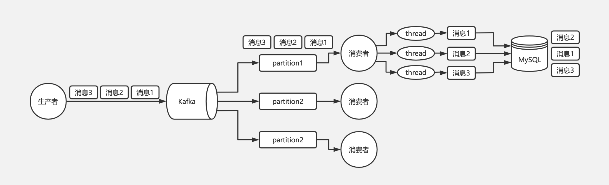

**解决方案：**

Kafka 从生产者到消费者消费消息这一整个过程其实都是可以保证有序的，导致最终乱序是由于消费者端需要使用多线程并发处理消息来提高吞吐量，比如消费者消费到了消息以后，开启 32 个线程处理消息，每个线程线程处理消息的快慢是不一致的，所以才会导致最终消息有可能不一致。
所以对于 Kafka 的消息顺序性保证，其实我们只需要保证同一个订单号的消息只被同一个线程处理的就可以了。由此我们可以在线程处理前增加个内存队列，每个线程只负责处理其中一个内存队列的消息，同一个订单号的消息发送到同一个内存队列中即可。


**梳理：**kafka从生产者到消费者是能够保证消息的有序性的，开启幂等性和事务，生产者发送消息时，指定分区，就可以将同一类事务放在指定分区，消息者顺序消费。但是消费者为提高吞吐量，可能会使用多线程处理消费的消息，可能会出现【消费者开始执行消息的顺序有序的，但是异步执行过程中，有的消息执行慢，有的消息执行快，导致最终乱序了】，可以使用一个内存队列，即执行线程消费，一个订单号或者一个用户都使用这一个异步线程处理。就可以解决。

如下图是 Kafka 保证消息顺序性的方案：


# 场景题

## 10000数据找出最大的1000个数字

快速排序：时间复杂度为nlog（n），可以选择 partition只求取最大1000的排序，若是取出的值==1000，不再进行排序。

最小堆: 时间复杂度为 nlog（k）

## 给你一个 多边形，如何判断一个点在多边形内部

对该点做一条射线，若是基数，则在内部，偶数，则外部。单独考虑是否与边重合，或者与多边形角重合的情况


## 用户访问不了一个网站，你怎么解决？

- 首先检查服务器：
  - **确定服务器部署的项目运行成功**
    1. 查看后台运行进程信息，像idea控制台一样
    2. 查看日志，可以在日志中查看运行信息【项目都用tomcat启动，所有服务器都在tomcat的日志记录中】
  - **确定访问地址地址是否正确**
    - IP地址，端口号是不是一直
  - **确定服务器安全规则是否添加了要访问的端口**
    - 即查看服务器是不是开放了该端口，防火墙问题。

- 追问：**服务器里面高内存，高CPU的情况怎么解决？**
  - CPU，内存，看上面 JVM部分
- 如果排查下来，都正常，还有一小部分用户不能方法，你怎么解决？
  - 可能是有限流
- 如果没有限流呢，而且那几个用户还着急要用，你怎么解决？
  - 上线小demo，实现对应功能，先解决用户着急使用数据 的问题，然后再排查。可以在开一台服务器


实际上是想问：Linux无法通过url获得服务器主页数据如何排查？

- **关防火墙、看host文件里边是否ip和域名绑定了**


## TOP K问题

通常最好的方案是使用分治 + 小顶堆。即先将数据集用Hash方法拆解成多个小数据集进行分治，然后用小顶堆在每个数据集中找到最大的前K个数，最后在所有小数据集的Top K数中通过系统排序找到最终的Top K个数。

**是否有足够内存：**如果机器内存足够可以直接在内存中使用Hash对数据进行切分，如果机器内存不足可以将原始文件切分成多个小文件

**如果含较多重复值**：先用hash / 依图法去重，可大大节省运算量

## 有几台机器存储着几亿淘宝搜索日志，你只有一台 2g 的电脑，怎么选出搜索热度最高的十个？

针对top k类文本问题，通常比较好的方案是【分治+trie树/hash+小顶堆】，即先将数据集按照hash方法分解成多个小数据集，然后使用trie树或者hash统计每个小数据集中的query词频，之后用小顶堆求出每个数据集中出频率最高的前K个数，最后在所有top K中求出最终的top K。

拆分成n多个文件：以首字母区分，不同首字母放在不同文件，长度仍过长的继续按照次首字母进行拆分。这样一来，每个文件的每个数据长度相同且首字母尾字母也相同，就能保证数据被独立的分为了n个文件，且各个文件中不存在关键词的交集。

分别词频统计：对于每个文件，使用hash或者Trie树进行进行词频统计

小顶堆排序：依次处理每个文件，并逐渐更新最大的十个词


## 双十一大家都挤在0点抢，怎么处理高并发的？

- 一个域名，多个IP地址，映射多个机房
- Nginx实现负载均衡
- 分布式的系统，当每个微服务只执行单一化职能，并设置使用分布式中的限流，熔断，降级等功能。
  - 熔断：某个服务发生故障，导致不可用。下次调用该服务，则直接返回不可用结果。
  - 降级：高并发时，由于系统运行高并发，手动关闭一些非核心业务。来使得核心业务顺利执行
  - 限流：限制流速，限制请求数量
- SQL数据库使用集群，redis使用分布式缓存，使用搜索引擎ES
- 以云平台映射承载系统，若请求量过高，可以临时申请多台机器运行。【使用docker,和K8S，通过docker将服务打包成镜像，K8S来动态分发和部署镜像】


# 实习

- 比较难的点，成体系的描述问题以及回答
- 锻炼了解决线上问题的能力
- 回答问题的时候，往进公司的目的靠拢，比如说喜欢技术等等，拿出例子来，而不是侃侃而谈。
- 面试的时候，并不一定所有的问题都能回答上来，可以有一两个问题答不上来。但是有的问题，回答的要有亮点，而不是普普通通
- 有可能一些面试是压力面试，不要慌，考的就是临场应变能力。
  - 比如说批量查询，
- 而且不要过度从自身上找原因，有可能不是你的问题。
- 从梳理项目的东西，为什么会存在这个作战平台，它的作用是什么
- 面试遇到不会的问题，可以直接说【这个问题，我还不了解，回头我先学习一下这块内容】


## SQL慢查询优化

==SQL慢查询优化，查询请求由176ms，优化到33ms，性能提升81.25%，已上线；==

### SQL问题

先描述这个SQL语句,索引是index_status_time (order_status,create_time)，

```
select `所有字段`
from
  yx_order
where
  order_status = 50
  and update_time <= '2022-06-02 00:00:00'
  and valid = 1
order by
  create_time desc
limit
  20
```

- 查询类型也表明：simple简单的select查询。不涉及子查询或者联合查询

- 查询困难程度：ref。

- 涉及到的索引：index_status_time (order_status,create_time)
- rows：物理查询的行数。6.9w，将近7w
- key_len=4，命中索引的长度为4
- extra： using where  【使用where字段过滤】

**查询过程是，命中联合索引字段order_status，粒度很低，order by create_time可以快速查找出需要的字段，由于非聚簇索引，回表查询将近7w行，再where 过滤。执行时间变为170ms；**

explain SQL语句


### 分析问题

- 由于只有两个字段的索引，而且为等值查询，索引没失效，
  order_status 为int类型，不涉及类型转换
  符合最佳左前缀原则，不涉及！=或者大于小于，范围查询，函数计算的情况。
- 起初是，原本的两个字段的联合索引，替换为4个。在原有的status，create_time  的字段顺序不变，在后面添加字段，valid，update_time。【一定不能改变原来索引字段的顺序，因为改变顺序，可能会导致其他SQL查询变慢】
- 其实没有效果。因为order by已经是进行了排序，后续的索引就不会再使用。所以直接添加两个字段是不能解决问题的。

### 解决办法

- 所以使用了索引覆盖，和join连接

  ```
  select '所有字段'
  from
    yx_order a join (select id from yx_order 
    WHERE order_status = 50
  	AND update_time <= '2022-06-03 00:00:00'
  	AND valid = 1
  ORDER BY create_time DESC
  LIMIT 20) b on a.id=b.id
  ORDER BY a.create_time DESC
  ```

- 

- 先查询2表，由于使用了索引覆盖，并且limit offset，count ，只返回查询到的id，所以，在查询1表时，只返回20行数据，在20行数据有可能是无序的，所以在order by一次。此时未命中索引。explain中extra中出现了using filesort，但是只有20行数据，并未产生临时文件，而且在查询时间降到了30ms

### 最大收获

- 由于mysql的性能优化，导致我们使用mysql查询时，是个黑箱操作，并不清楚内部如何查询的。也就是说，所有的索引优化的知识，只是书本上的知识，只有实际测试过后，真的速度变快了，才是有效的优化；
- 原本索引覆盖，只是作为一个知识点了解，我期初并未遇到过这种情况。然而这个SQL语句实际用到了，才明白，原来索引能这样用，不仅仅是简单的增加，删除索引字段
- 其实还有一点收获，这是我第一次请求虽然已经进行了验证，但仍然需要考虑线上出现问题的Plan B。所以在配置中心，添加一个Boolean变量，表明开关，来使用新SQL查询或者旧SQL查询。

## 任务文件导出

### 问题描述

- 使用人员反馈，在任务文件导出请求，超出一定阈值后【id阈值，或者说任务文件列表页的id】，请求失败，无法导出

### 问题分析

在发现这个问题时，首先发现，有些文件是可以导出，有些文件不能导出。那说明，请求能请求到，是生效的。是服务器内部错误

该请求过程是：

- 请求Nginx，再转发到相应的微服务
- 执行目标方法
  - 用户权限验证（没问题，因为有的文件能导出）
  - 从数据库获取数据
  - 上传至文件中心，并返回对应的url地址
- 返回对应的url地址

请求参数，是taskId=3313,不涉及请求参数溢出的情况。而且有的文件可以导出，说明有权限。所以问题出现在service层处理方法的过程。

**我查询了mttrace，链路追踪。**

方法内：

- 首先是查询一张表，根据参数能查询到1.5w的数据
- 在根据表中的参数id，查找到另外一张表中的状态。
  - 将第一张表中的数据进行遍历，查询每一条记录orderId的status状态。
  - 每次查询耗时2ms不到，1.5w次，差不多是30s。
- 将两个表的信息保存到Vo中。

整个请求的处理时间是30s。而Nginx设定的请求时间最长是20s。已经超时。所以无法返回给客户。但后台服务器已经执行，并保存到文件中兴，生成url地址。

### 解决办法

- 由于是线上问题，首先与管理Nginx的同事沟通，将Nginx的请求时间把原来的20s的请求时间改为60s。
- 然后从代码层面来改：将1.5w的请求改为批量查询，将多个orderId封装到一个list集合中。一次查询100次的请求。后续我们测试请求批次大小与响应时间的关系，分别测试了100,150，200,250,300...500.**发现随着请求批次大小增加，响应时间大体是一个减少的趋势。但考虑到mysql数据库处理的压力，以及查询数据量太大，网络传输问题，我们选择了批次=150**
  - 查询时，SQL语句使用了in和foreach。但仍出现了错误，未考虑请求为null的请求，若传入的list集合为
- 注意，即使传入list集合为null，也应该返回一个list空集合

## OrgId切换

看技术文档

- 东西不难，但是复杂。

### 痛点（将近十几个微服务）

- 销售侧所有的平台都要切换orgId，但每个微服务切换时间不固定，所以，调用其他微服务和被其他微服务调用，所携带的orgId使用新OrgId还是旧orgId
- 应该需求完成上线后，统一orgId切换时间后，我们所有服务，能立刻切换新OrgId。要有plan B。上线后，若是其中一个微服务使用新orgId出现了问题，能够立即切换会旧orgId，来挽回损失。


### 解决办法

配置了四个Lion开关，上线流程分为多阶段

#### lion开关

- 双写开关，人员侧orgId和基础侧orgId都写入数据库
- 流量入口开关，将request输入请求全部切换为基础侧OrgId还是人员侧orgId【入口表示的是，作战平台内部service处理使用新旧OrgId】
- 流量出口：http请求（前端请求）和thrift请求（thrift其他微服务调用）返回的数据中，避免字段的改变，否则改动太大。
  - 流量出口分为两个，是因为，前端获取orgId数据后，该orgId数据只会请求我们作战平台微服务。请求微服务时会重新获取。所以返回给前端的orgId新旧不影响其他操作
  - 但是被其他微服务调用，为避免请求的混乱，只能设置开关来决定使用新OrgId还是旧OrgId

#### 上线流程

- 上线后，开启双写开关，将新旧OrgId写入数据库，此时平台内部仍使用旧orgId
- 上线前，mysql，es添加新字段，采用定时任务的方式进行数据刷新；【先开启双写，再进行数据刷新，避免刷新后，再新增数据，新orgId没写入】
- 开启流量入口开关，将request请求携带的orgId转换成新OrgId，而且作战平台内部使用新orgId进行逻辑处理
- 没有问题后，开启前端请求的流量出口开关，前端请求的orgId转换成新OrgId，其他微服务请求作战平台时，仍使用旧orgId
- 等所有的平台都切换新OrgId后，开启其他微服务请求的流量出口开关，替换完成。最后将双写改为只写入新orgid

### 细节

- 我们的orgId的新旧映射需要请求其他微服务，若处理每一次orgid切换的请求都调用其他微服务，过慢。我们将请求保存在本地缓存中。
- 我们需要构建一个组织树，每天定时更新，每个节点保存orgId，parentOrgId和子节点集合的set集合。所以我们需要重新构建一个组织树，并不能将原组织树的orgId值替换。
  - 因为，每次只刷新一次组织树，若是替换，则可能导致刷新时使用旧OrgId构建组织树，后面我们开启流量入口开关，无法获取新orgId组织树节点。【所以此时需要构建两颗组织树】
- 存在前端与其他微服务都请求一个方法，而且无法没有携带orgId。我们可以根据请求参数来区分，是前端还是其他微服务
- 即使切换完成， 仍需要后续删除所有的冗余代码，涉及到orgId的部分都需要进行判断。将逻辑判断删除。工作量大
- 开启双写，在数据库（mysql，es）中添加新字段，还需要在BO，PO添加新字段。而且es部分不能只是开启开关能够进行数据替换的，而是与调用该数据的同事沟通，将orgId旧字段替换为新字段。
  - 作战平台是，从一个es索引中插入数据，从另一个es索引中获取数据。【维护数据但不获取，和获取数据但不维护，两个索引】所以需要分别与使用该es数据库的同事沟通替换新字段


**CAP定理：**分布式架构的基本理论。

指的是：一个分布式系统中，一致性（Consistency），可用性（Availability），分区容错性（Partition tolerance）。


只能保证CAP定理的两两组合，CAP不能同时满足：以电商为例：购买商品，需要订单系统创建订单，库存系统扣减库存。

- CP（一致性，分区容错性）：用户购买商品后，一直在页面等待，创建订单后，请求库存系统扣减库存。此期间用户一直等待，直到请求完成
- AP（可用性，分区容错性）：订单创建后，直接返回，不等待库存减少，扣减库存的工作交由异步线程处理
- AC（可用性，分区容错性）：不拆分系统，在一个数据库的一个事务完成该操作，即不使用微服务，而在一个服务中完成所有的操作


# ES 

## ES默认能查询到10000条数据

原因：ES一般是集群存在，那么查询10000条数据，每个节点都需要查询1000条数据，然后协调节点再重新组合数据，返回给用户，性能消耗太大，因而，不允许查询过多数据。分页查询 10000-10010，必然也是不允许的。分页查询也是查询0-10010的所有数据，协调节点再组合的。

## ES修改映射

**ES中，映射不可被修改**。若非修改映射，则

1. 创建一个中间索引，包含自己需要的所有映射
2. 将数据，从旧索引中迁移到新索引中
3. 将旧索引删除，并把新索引更改名称叫旧索引名


**有实际用途吗？**

==**有，若是新增映射错误，或者原索引副本分片数量需要修改，则此时需要此操作**==

数据迁移

```es
POST _reindex
{
  "source": {
    "index": "old_index"
  },
  "dest": {
    "index": "new_index"
  }
}
```
