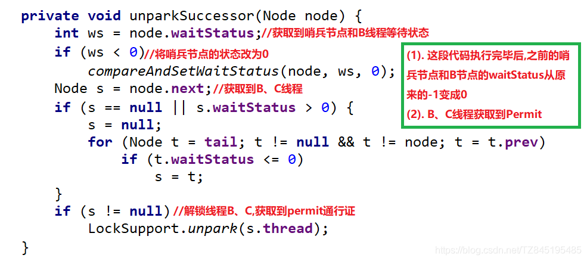

# 并发篇

## Java多线程——交替打印ABC

https://blog.csdn.net/weixin_41070695/article/details/112596316


交替打印 1-10；

```java
public class Main{

    static volatile Integer count = 1;
    public static void main(String[] args){

        new Thread(()->{
            for (int i = 0; i < 5; ) {
                while (count%2!=1){

                }
                synchronized (count){
                    i++;
                    System.out.println(count);
                    count++;
                }
            }
        }).start();;
        new Thread(()->{
            for (int i = 0; i < 5; ) {
                while (count%2!=0){

                }
                synchronized (count){
                    i++;
                    System.out.println(count);
                    count++;
                }
            }
        }).start();;
    }
}
```


## 生产者消费者问题


生产者消费者问题（Producer-consumer problem），是一个多线程同步问题的经典案例。生产者生成一定量的数据放到缓冲区中，然后重复此过程；与此同时，消费者也在缓冲区消耗这些数据。生产者和消费者之间必须保持同步，要保证生产者不会在缓冲区满时放入数据，消费者也不会在缓冲区空时消耗数据。不够完善的解决方法容易出现死锁的情况，此时进程都在等待唤醒。


```java
class Storge {
    private final int MAX_SIZE = 10;
    private LinkedList<Object> list = new LinkedList<>();

    public void produce() {
        synchronized (list) {
            // 首先判断仓库是否已满，已满则调用wait，不生产
            while (list.size() == MAX_SIZE) {
                System.out.println("【生产者" + Thread.currentThread().getName()
                        + "】仓库已满");
                try {
                    list.wait();
                } catch (InterruptedException e) {
                    e.printStackTrace();
                }
            }
            list.add(new Object());
            System.out.println("【生产者" + Thread.currentThread().getName()
                    + "】生产一个产品，现库存" + list.size());
            list.notifyAll();
        }
    }

    public void consume() {
        synchronized (list) {
            while (list.size() == 0) {
                System.out.println("【消费者" + Thread.currentThread().getName()
                        + "】仓库为空");
                try {
                    list.wait();
                } catch (InterruptedException e) {
                    e.printStackTrace();
                }
            }
            list.remove();
            System.out.println("【消费者" + Thread.currentThread().getName()
                    + "】消费一个产品，现库存" + list.size());
            list.notifyAll();
        }
    }
}


public class Main {

    public static void main(String[] args) {
        Storge storge = new Storge();
        
        new Thread(()->{
            for (int i = 0; ; i++) {
                storge.produce();
            }
        }).start();
        
        new Thread(()->{
            for (int i = 0; ; i++) {
                storge.produce();
            }
        }).start();

        new Thread(()->{
            for (int i = 0; ; i++) {
                storge.produce();
            }
        }).start();

        new Thread(()->{
            while (true){
                storge.consume();
            }
        }).start();
        

    }
}
```


##  读者-写者问题

（1）允许多个读者同时执行读操作；

（2）不允许读者、写者同时操作；

（3）不允许多个写者同时操作。一次只能一个写者  


```java
public class Main {

    public static void main(String[] args) {
        Disk disk = new Disk();
        new Thread(() -> {
            for (int i = 0; i < 50; i++) {
                try {

                    disk.start_read();
                    Thread.sleep((long) Math.random() * 1000);


                } catch (InterruptedException e) {
                    e.printStackTrace();
                }
                disk.finish_read();
            }
        }).start();
        new Thread(() -> {
            for (int i = 0; i < 50; i++) {
                try {

                    disk.start_read();
                    Thread.sleep((long) Math.random() * 1000);


                } catch (InterruptedException e) {
                    e.printStackTrace();
                }
                disk.finish_read();
            }
        }).start();
        new Thread(() -> {
            for (int i = 0; i < 50; i++) {
                try {

                    disk.start_read();
                    Thread.sleep((long) Math.random() * 1000);


                } catch (InterruptedException e) {
                    e.printStackTrace();
                }
                disk.finish_read();
            }
        }).start();


        new Thread(() -> {
            for (int i = 0; i < 50; i++) {
                try {

                    disk.start_write();
                    Thread.sleep((long) Math.random() * 1000);

                } catch (InterruptedException e) {
                    e.printStackTrace();
                }
                disk.finish_write();
            }
        }).start();


    }
}


class Disk {
    // 写者信号量
    private Semaphore write_mutex = new Semaphore(1);
    // 读者信号量
    private  Semaphore read_mutex = new Semaphore(1000);

    // 读者数量
    private volatile Integer read_count = 0;

    public void start_read() throws InterruptedException {
        while (write_mutex.availablePermits() == 0) {
        }
        // 获取读者信号量
        read_mutex.acquire();
        System.out.println(Thread.currentThread().getName() + "    start_read");
        synchronized (read_count) {
            read_count++;
        }

    }

    public void finish_read() {
        // 修改读者数量
        synchronized (read_count) {
            read_count--;
        }
        System.out.println(Thread.currentThread().getName() + "    finish_read");
        // 释放读者信号量
        read_mutex.release();

    }

    public void start_write() throws InterruptedException {
        while (read_count != 0) {}

        write_mutex.acquire();
        System.out.println(Thread.currentThread().getName() + "    start_write");
    }

    public void finish_write() {
        write_mutex.release();
        System.out.println(Thread.currentThread().getName() + "    finish_write");
    }

}

```


## 1.线程状态

**要求**

* 掌握 Java 线程六种状态
* 掌握 Java 线程状态转换
* 能理解五种状态与六种状态两种说法的区别

**六种状态及转换**


分别是

- 新建
  - 当一个线程对象被创建，但还未代用start方法运行时处理**新建**状态
  - 此时未与操作系统底层线程相关
- 可运行
  - 调用了start方法，就会由**新建**状态进入**可运行**
  - 此时与底层线程关联，由操作系统调度执行
- 终结
  - 线程内代码执行完毕，由**可运行**进入终结
  - 此时会取消与底层线程关联
- 阻塞
  - 当获取锁失败后，由**可运行**进入Monitor的阻塞队列**阻塞**，此时不占用CPU
  - 当持锁线程放锁时，会按照一定规则唤醒阻塞队列中的**阻塞**线程，唤醒后的各线程进行竞争，最终一个线程进入**可运行状态**
- 等待
  - 当获取锁成功后，但由于条件不满足，调用了wait()方法，此时从可运行状态释放锁进入Monitor等待集合**等待**，同样不占用CPU时间
  - 当其它持锁线程调用 **notify() 或 notifyAll() 方法**，会按照一定规则唤醒等待集合中的**等待**线程，恢复为**可运行**状态
- 有时限等待
  - 当获取锁成功后，但由于条件不满足，调用了 wait(long) 方法，此时从**可运行**状态释放锁进入 Monitor 等待集合进行**有时限等待**，同样不占用 cpu 时间
  - 当其它持锁线程调用 notify() 或 notifyAll() 方法，会按照一定规则唤醒等待集合中的**有时限等待**线程，恢复为**可运行**状态，并重新去竞争锁
  - 当等待超时，也会从**有时限等待**状态恢复为**可运行**状态，并重新去竞争锁
  - **还有一种情况是调用sleep（long）方法也会从可运行状态进入有时限等待状态，**但与 Monitor 无关，不需要主动唤醒，超时时间到自然恢复为**可运行**状态

**五种状态**

五种状态的说法来自于操作系统层面的划分，即**进程的状态**


- 新建态：
- 就绪态：有资格分配到CPU时间，但还未轮到它
- 运行态：分到CPU时间，能真正执行线程内代码
- 阻塞态：
  - 涵盖了 java 状态中提到的**阻塞**、**等待**、**有时限等待**
  - 多出了阻塞I/O，指线程在调用阻塞I/O时，实际活动由I/O设备完成，此时线程无事可做，只能等待
- 终结态

**三种状态的转换：阻塞->就绪->运行态**

## Runnable和Callable之间的区别

Runnable和Callable之间的区别

1、Runnable任务执行后没有返回值；Callable任务执行后可以获得返回值

2、Runnable的方法是run()，没有返回值；Callable的方法是call()，有返回值

3、**Runnable的run()方法不能抛异常，有异常的话只能在run方法里面解决；Callable的call()方法可以抛异常**

4、Runnable可以直接传递给Thread对象执行；Callable不可以，Callable执行可以放在FutureTask中，然后把futureTask传递给Thread执行

## 2. 线程池核心参数

- 掌握线程池的 7 大核心参数

**七大参数**

- corePoolSize 核心线程数目=池中会保留的最少线程数：
  - **在队列未满的情况下，只使用核心线程。若队列容量满了，则核心线程和救急线程共同工作**
  - 线程池创建好，就准备就绪的线程数量，等待异步执行。**与线程池一直存在，除非设置参数allowCoreThreadTimeOut,允许线程池过期**

- maximumPoolSize 最大线程数目=核心线程+救急线程的最大数目
- keepAliveTime 生存时间：救急线程的生存时间，生存时间内没有新任务，则此线程等待设置时间后，资源释放
- unit 时间单位 - 救急线程的生存时间单位，如秒、毫秒等
- workQueue ：**当没有空闲核心线程时，新来的任务会加入到此队列排队，队列满会创建救急线程执行任务**
- threadFactory 线程工厂 - 可以定制线程对象的创建，例如设置线程名字、是否是守护线程等
- handler 拒绝策略(饱和策略) - 当所有线程都在繁忙，workQueue 也放满时，会触发拒绝策略
  - jdk的拒绝策略
    - 抛异常
    - 由调用者执行任务 
    - 丢弃任务 
    - 丢弃最早排队任务，本任务取而代之 

  - ActiveMQ
    - 带超时等待（60s）尝试放入队列

**线程池重用线程时，会对ThreadLocal的值进行清空吗？**

**不会清空，要你自己去清空。**

如果你能够在使用ThreadLocal的时候管理它的创建、销毁，那么就可以用，否则会出问题。原因是ThreadLocal是和Thread绑定的，如果Thread是从Thread Pool中拿出来的，那么意味着Thread可能会被复用，如果被复用，你就一定得保证这个Thread上一次结束的时候，其关联的ThreadLocal被清空掉，否则就会串到下一次使用。


**工作流程**：

- 线程池创建，线程池中会创建core数量的核心线程，准备接收任务
- 核心线程满了，将再进来的任务放入阻塞队列，空闲的线程会在阻塞线程中获取任务
- **若阻塞也满了，则创建救急线程执行任务，此时救急线程新创建执行的任务是刚进来的任务而不是阻塞队列中的任务，执行完该任务后，从阻塞队列中获取任务**，线程总量只能是maximumPoolSize 数目
- 若已经达到最大线程数目，且阻塞队列也满了，则执行拒绝策略
- 线程执行完毕
- 若任务执行完，等待一定的存活时间，救急线程注销


## **execute和submit的区别**

- execute只能提交Runnable类型的任务，无返回值。submit既可以提交Runnable类型的任务，也可以提交Callable类型的任务，会有一个类型为Future的返回值，但当任务类型为Runnable时，返回值为null。
- execute在执行任务时，如果遇到异常会直接抛出，而submit不会直接抛出，只有在使用Future的get方法获取返回值时，才会抛出异常。


## 线程池获取返回值

```java
ThreadPoolExecutor executor = new ThreadPoolExecutor();
Future<Integer> submit = executor.submit(() -> {
    return 1;
});
Integer integer = submit.get();
```


## JAVA 分析线程池中的keepAliveTime参数具体实现

https://blog.csdn.net/a17816876003/article/details/107682030

- 从阻塞队列中获取元素是调用poll（）方法，移除队头的元素

  - poll 方法作用是移除并返回队列的头节点。但是如果当队列里面是空的，没有任何东西可以移除的时候，便会返回 null 作为提示。

  - 带时间参数的 poll 方法：如果能够移除，便会立刻返回这个节点的内容；如果队列是空的就会进行等待，等待时间正是我们指定的时间，直到超时时间到了，如果队列里依然没有元素可供移除，便会返回 null 作为提示。

- **阻塞队列的poll方法又是怎么实现超时的呢？**

  - poll（）方法 调用了available.awaitNanos(delay)方法
  - 其内部执行了UNSAFE.park(false, nanos);

## 关闭线程池

- ### 关闭线程池 shutdown 和 shutdownNow 的区别

- shutdown：调用 shutdown() 方法后线程池会在执行完正在执行的任务和队列中等待的任务后才彻底关闭。

- shutdownNow：

- shutdown 会等待线程池中的任务执行完成之后关闭线程池，而 shutdownNow 会给所有线程发送中断信号，中断任务执行，然后关闭线程池

  shutdown 没有返回值，而 shutdownNow 会返回关闭前任务队列中未执行的任务集合（List）

## 关闭线程的方式

https://www.cnblogs.com/liyutian/p/10196044.html

1. 使用退出标志，使线程正常退出，也就是当 run() 方法完成后线程中止。

2. 使用 stop() 方法强行终止线程，但是不推荐使用这个方法，该方法已被弃用。

   1. stop（）会停止run（）方法剩余的全部工作，包括在 catch 或 finally 语句中的，并抛出ThreadDeath异常(通常情况下此异常不需要显示的捕获)，因此可能会导致一些清理性的工作的得不到完成，如文件，数据库等的关闭。
   2. 调用 stop() 方法会立即释放该线程所持有的所有的锁，导致数据得不到同步，出现数据不一致的问题。

3. 使用 interrupt 方法中断线程。

   1. 调用 interrupt() 方法仅仅是在当前线程中打一个停止的标记，并不是真的停止线程。

      也就是说，线程中断并不会立即终止线程，而是通知目标线程，有人希望你终止。至于目标线程收到通知后会如何处理，则完全由目标线程自行决定

## 写一个死锁

- 线程1，先抢占锁1，thread.sleep(50ms)   ,再抢占锁2
- 线程2，先抢占锁2，thread.sleep(50ms)   ,再抢占锁1

## 阻塞队列中线程取消竞争锁

lock.lockInterruptibly()  方法

https://www.jianshu.com/p/287c9f3ae16d


## JDK中的七大阻塞队列

- ArrayBlockingQueue：由数组实现的有界阻塞队列，需要指定数组容量，该队列按照 FIFO 对元素进行排序。维护两个整形变量，标识队列头尾在数组中的位置，在生产者放入和消费者获取数据共用一个锁对象，意味着两者无法真正的并行运行，性能较低。
- LinkedBlockingQueue：由链表组成的有界阻塞队列，如果不指定大小，默认使用 Integer.MAX_VALUE 作为队列大小，该队列按照 FIFO 对元素进行排序，对生产者和消费者分别维护了独立的锁来控制数据同步，意味着该队列有着更高的并发性能。
- SynchronousQueue：不存储元素的阻塞队列，无容量，可以设置公平或非公平模式，插入操作必须等待获取操作移除元素，反之亦然。
- PriorityBlockingQueue：支持优先级排序的无界阻塞队列，默认情况下根据自然序排序，也可以指定 Comparator。
- DelayQueue：支持延时获取元素的无界阻塞队列，创建元素时可以指定多久之后才能从队列中获取元素，常用于缓存系统或定时任务调度系统。
- LinkedTransferQueue：一个由链表结构组成的无界阻塞队列，与LinkedBlockingQueue相比多了transfer和tryTranfer方法，该方法在有消费者等待接收元素时会立即将元素传递给消费者。
- LinkedBlockingDeque：一个由链表结构组成的双端阻塞队列，可以从队列的两端插入和删除元素。

## jdk中非阻塞队列

ConcurrentLinkedQueue 利用循环CAS来实现线程安全。它是一个基于链表的无界线程安全队列。


## 3. wait vs sleep

**要求**

* 能够说出二者区别

**一个共同点，三个不同点**

共同点

* wait() ，wait(long) 和 sleep(long) 的效果都是让当前线程暂时放弃 CPU 的使用权，进入阻塞状态

不同点

* 方法归属不同
  * sleep(long) 是 Thread 的静态方法
  * 而 **wait()，wait(long) 都是 Object 的成员方法**，每个对象都有

* 醒来时机不同
  * 执行 sleep(long) 和 wait(long) 的线程都会在等待相应毫秒后醒来
  * wait(long) 和 wait() 还可以被 notify 唤醒，wait() 如果不唤醒就一直等下去
  * 它们都可以被打断唤醒

* 锁特性不同（重点）
  * wait 方法的调用必须先获取 wait 对象的锁，而 sleep 则无此限制
  * wait 方法执行后会释放对象锁，允许其它线程获得该对象锁（我放弃 cpu，但你们还可以用）
  * 而 sleep 如果在 synchronized 代码块中执行，并不会释放对象锁（我放弃 cpu，你们也用不了）

## 4. lock vs synchronized

**三个层面**

不同点

* 语法层面
  * synchronized 是关键字，源码在 jvm 中，用 c++ 语言实现
  * Lock 是接口，源码由 jdk 提供，用 java 语言实现
  * 使用 synchronized 时，退出同步代码块锁会自动释放，而使用 Lock 时，需要手动调用 unlock 方法释放锁。【即获取到锁后出现异常，则synchronize会自动释放锁，而lock需要手动释放】
  * **synchronized 不可被打断**
* 功能层面
  * 二者均属于悲观锁、都具备基本的互斥、同步、锁重入功能
  * Lock 提供了许多 synchronized 不具备的功能，例如获取等待状态、公平锁、可打断、可超时、多条件变量
  * Lock 有适合不同场景的实现，如 ReentrantLock， ReentrantReadWriteLock
  * 二者的锁机制其实也是不一样的。ReentrantLock 底层调用的是 Unsafe 的park 方法加锁，synchronized 操作的应该是对象头中 mark word
* 性能层面，或者说适用场景不同
  * 在没有竞争时，synchronized 做了很多优化，如偏向锁、轻量级锁，性能不赖  （jdk1.6以后）
  * 在竞争激烈时，Lock 的实现通常会提供更好的性能

**公平锁**

* 公平锁的公平体现
  * **已经处在阻塞队列**中的线程（不考虑超时）始终都是公平的，先进先出
  * 公平锁是指**未处于阻塞队列**中的线程来争抢锁，如果队列不为空，则老实到队尾等待
  * 非公平锁是指**未处于阻塞队列**中的线程来争抢锁，与队列头唤醒的线程去竞争，谁抢到算谁的
* 公平锁会降低吞吐量，一般不用

**条件变量**

- ReentrantLock中的条件变量功能类似于普通synchronized的wait，notify，用在当前线程获得锁后，发现条件不满足时，进入临时等待的链表结构
- 与 synchronized 的等待集合不同之处在于，ReentrantLock 中的条件变量可以有多个，可以实现更精细的等待、唤醒控制

## 5. volatile


**原子性**

- 起因：多线程下，不同线程的**指令发生了交错**导致的共享变量的读写混乱
- 解决：用悲观锁或乐观锁解决，**volatile 并不能解决原子性**

**可见性**

* 起因：由于**编译器优化、或缓存优化、或 CPU 指令重排序优化**导致的对共享变量所做的修改另外的线程看不到
* 起因应该是：线程对公共变量操作时，首先从公共内存加载到线程本地内存，再进行操作，导致各个线程的操作是不可见的。
* 解决：**用 volatile 修饰共享变量，能够防止JIT编译器等优化发生，让一个线程对共享变量的修改对另一个线程可见**

**有序性**

- 起因：由于**编译器优化、或缓存优化、或 CPU 指令重排序优化**导致指令的实际执行顺序与编写顺序不一致

- 解决：**用volatile修饰共享变量会在读，写共享变量时加入不同的屏障，阻止其他读写操作越过屏障，从而达到阻止重排的效果**

- 注意：

  对volatile变量的写指令**后会加入写屏障**

  对volatile变量的读指令**前会加入读屏障**

  - **volatile 变量写屏障**阻止的是阻止前面其他写操作越过屏障排到**volatile 变量写后面**（这句话和上面的写指令后会加入写屏障并不冲突，因为写屏障使得写屏障前的代码不能越过屏障到后面，**但不能阻止后面的屏障到面前来，读屏障类似**）
  - **volatile 变量读屏障**阻止的是阻止后面的其他读操作越过屏障排到 **volatile 变量读前面**
  - volatile 读写加入的屏障只能防止同一线程内的指令重排

  （**所以读写屏障的插入应该是在所有写操作之后，所有读操作之前**）

内存屏障：

是CPU或编译器在对内存随机访问的操作中的一个同步点，使得此点之前的所有读写操作都执行后才可以开始执行此点之后的操作。**简单说就是加入内存屏障，则之前的读写操作全部执行后再执行内存屏障后的代码。内存屏障为一个同步点，点之前的代码执行完，再执行点之后的代码**

## volatile和synchronized的区别

1. volatile本质是在告诉jvm当前变量在寄存器（工作内存）中的值是不确定的，需要从主存中读取； synchronized则是锁定当前变量，只有当前线程可以访问该变量，其他线程被阻塞住。所以volatile是与synchronize是互助的存在，不是对立的
2. volatile仅 修饰 在变量级别；synchronized则可以使用在代码段，方法上。
3. volatile仅能实现变量的修改可见性，不能保证原子性；而synchronized则可以保证变量的修改可见性和原子性
4. volatile不会造成线程的阻塞；synchronized可能会造成线程的阻塞。
5. volatile标记的变量不会被编译器优化；synchronized标记的变量可以被编译器优化，实现锁消除


## 6. 悲观锁 vs 乐观锁

**要求**

* 掌握悲观锁和乐观锁的区别

**对比悲观锁与乐观锁**

* 悲观锁的代表是 synchronized 和 Lock 锁
  * 其核心思想是【线程只有占有了锁，才能去操作共享变量，每次只有一个线程占锁成功，获取锁失败的线程，都得停下来等待】
  * 线程从运行到阻塞、再从阻塞到唤醒，涉及线程上下文切换，如果频繁发生，影响性能
  * 实际上，线程在获取 synchronized 和 Lock 锁时，如果锁已被占用，都会做几次重试操作，减少阻塞的机会

* 乐观锁的代表是 AtomicInteger |e toa mi ke  Integer|，使用 cas 来保证原子性
  * 其核心思想是【无需加锁，每次只有一个线程能成功修改共享变量，其它失败的线程不需要停止，不断重试直至成功】
  * 由于线程一直运行，不需要阻塞，因此不涉及线程上下文切换
  * 它需要多核 cpu 支持，且线程数不应超过 cpu 核数

AtomicInteger 的底层实现使用的是Unsafe，保证操作的原子性

## 如何判断是否当前线程持有该锁

- 如果用synchronized，用`Thread.holdsLock(lockObj)` 获取
- 如果使用 Lock（juc下的），则用 `lock.isHeldByCurrentThread()` (**不能用 Thread.holdsLock(lockObj)**)

## 线程间同步的方式

**互斥锁**（Mutex）、**条件变量**（condition variable）、**读写锁**（reader-writer lock）、**信号量**（semaphore）


## 线程通信的方式

- volatile 
- synchronized 临界区方式，ReentrantLock
- CountDownLatch
- 基本LockSupport实现线程间的阻塞和唤醒（park和unpark方法）
- 网络通信
- 信号量机制(Semaphore)
- 管道通信


## 7. Hashtable vs ConcurrentHashMap

**Hashtable 对比 ConcurrentHashMap**

* Hashtable 与 ConcurrentHashMap 都是线程安全的 Map 集合
* Hashtable 的底层是数组+链表，ConcurrentHashMap 底层是`Node 数组 + 链表或红黑树`
* Hashtable 并发度低，整个 Hashtable 对应一把锁，同一时刻，只能有一个线程操作它
* ConcurrentHashMap 并发度高，整个 ConcurrentHashMap 对应多把锁，只要线程访问的是不同锁，那么不会冲突
* CurrentHashMap不能存储null值，不论是key还是value。

**ConcurrentHashMap 1.7**

* 数据结构：`ReentrantLock+Segment分段数组 + HashEntry数组 + 链表`，每个 Segment 对应一把锁，如果多个线程访问不同的 Segment，则不会冲突。（Segment数组中包含HashEntry数组，其内部有链表），**Segment继承了ReentrantLock**
* 并发度：Segment 数组大小即并发度，决定了同一时刻最多能有多少个线程并发访问。Segment 数组不能扩容，意味着并发度在 ConcurrentHashMap 创建时就固定了。**Segment数组的大小size默认为** DEFAULT_CONCURRENCY_LEVEL =**16(阿里面试官曾问过)** HashEntry数组默认为2个。
* 索引计算
  * 假设大数组长度是 $2^m$​，key 在大数组内的索引是 key 的二次 hash 值的高 m 位（二进制hash值的高M位）
  * 假设小数组长度是 $2^n$​，key 在小数组内的索引是 key 的二次 hash 值的低 n 位（二进制hash值的低n位）
* **put新节点时，若是超出阈值，则会先进行扩容，再添加新节点**
* **并发GET操作**
  * ConcurrentHashMap第一次需要经过一次hash定位到Segment的位置，然后再hash定位到指定的HashEntry，遍历该HashEntry下的链表进行对比，成功就返回，不成功就返回null
  * **get操作没有加锁**
  * 使用Unsafe类保证可见性，因为数组某个位置的值改变，volatile只能保证整个数组的可见性，而数组中某个值的需要改变通过Unsafe类保证。Unsafe.getObjectVolatile(数组，下标)。获取指定位置的volatile值
  * 扩容时，若get先进行，则从旧表中取。get后发生则从新表中取

* **并发put操作**
  * 第一次key的hash来定位segment的位置。若Segment没有初始化，则CAS进行初始化操作
  * 第二次hash操作找到相应的hashEntry的位置
  * 继承了ReentrantLock，通过tryLock（）尝试获取锁，成功则插入元素。
  * 失败，则以**自旋的方式**去调用 tryLock（）方法去获取锁，超过指定次数则挂起，等待唤醒
* **size**
  * 计算元素个数前，先不加锁计算两次，如果前后两次结果如一样，认为个数正确返回
  * 如果不一样，进行重试，重试次数超过 3，将所有 segment 锁住，重新计算个数返回


* **扩容：**每个小数组的扩容相对独立，小数组在超过扩容因子时会触发扩容，每次扩容翻倍（扩容时，一般情况下是头插法，遍历链表。若链表中，在某个节点以及后续节点与扩容后仍在一个链表，则之间将剩余链表迁移，不必挨个遍历头插法）
* Segment[0] 原型：首次创建其它小数组时，会以此原型为依据，数组长度，扩容因子都会以原型为准

**ConcurrentHashMap 1.8**

* 数据结构：`syncronized+CAS+Node 数组 + 链表或红黑树`，数组的每个头节点作为锁，如果多个线程访问的头节点不同，则不会冲突。**首次生成头节点时如果发生竞争，利用 cas 而非 syncronized**，进一步提升性能

* 并发度：Node 数组有多大，并发度就有多大，与 1.7 不同，Node 数组可以扩容

* 扩容条件：Node 数组满 3/4 时就会扩容

* 扩容单位：以链表为单位从后向前迁移链表，迁移完成的将旧数组头节点替换为 ForwardingNode。**七上八下**

* **并发 get**

  * 根据是否为 ForwardingNode**（一种标记，是 ForwardingNode代表该数组位置已经迁移结束）**来决定是在新数组查找还是在旧数组查找，不会阻塞
  * 如果链表长度超过 1，则需要对节点进行复制（创建新节点），怕的是节点迁移后 next 指针改变
  * 如果链表最后几个元素扩容后相对位置不变，则节点无需复制

* **并发 put**

  * 首先通过hash找到对应位置，判断是否初始化了，没有初始化怎么调用initTable方法进行初始化。因为是懒惰初始化，省内存
  * 如果没有hash冲突，则直接CAS方式插入
  * 如果还在扩容，则先扩容，再插入元素（链表超过阈值8则进行转换成红黑树）
  * **如果存在hash冲突**，则加锁（synchronize）保证线程安全，
    * 链表结构则直接遍历到尾端插入
    * 红黑树按红黑树结构插入

  

  

  


  * 首先判断map是否为空。**空表示没有进行初始化，初始化Map，因为是懒惰初始化，省内存**
  * 如果 put 的线程与扩容线程正在迁移的链表为同一个，put 线程会阻塞【不是重点】
  * 如果 put 的线程操作的链表还未迁移，即该链表还未迁移（还没轮到该链表迁移），则可以并发执行【不是重点】
  * 如果 put 的线程操作的链表（在旧map中）已经迁移完成，则协助扩容，等扩容完成后，再从扩容后的map中put。（也是考虑插入数据的顺序，先进来的元素可能也与正要put的元素在一个链表，为维护链表的相对位置，所以需要等待扩容完成）【不是重点】

* 与 1.7 相比是懒惰初始化**（只有在储存元素时才会创建对象）**

* 并发初始化table，原子操作【不知道在干嘛】

  * 设置一个变量sc
  * 进入循环，条件table=null。
    * if判断若sc<0,则yield，让出CPU时间片
    * else if：CAS操作，将sc赋值-1，加锁操作，其他线程进来，会进入第一个if判断。内部创建table。sc=正值。
    * 释放锁，退出循环

* put操作时，增加数值。统计size。1.8使用synchronized 进行加锁

  * 与LongAddr类似，有一个累加单元数组，put时的+1操作会对某个cell单元进行CAS操作
  * 累加单元数组是懒初始化，累加单元也是懒初始化操作。所以需要判断两次
  * CAS累加操作
  * 若此时size超出阈值，进行扩容
  * **求取size时，遍历所有的累加单元，可能存在误差，因为遍历时，其他线程可能还在操作**

  

* capacity 代表预估的元素个数，capacity / factory 来计算出初始数组大小，需要贴近 $2^n$ 

* loadFactor 只在计算初始数组大小时被使用，之后扩容固定为 3/4，**不可修改**
  **（意思是，扩容因子，只有在初始创建的时候才会用到，后面的扩容依然为jdk设置的0.75）**

* 超过树化阈值时的扩容问题，如果容量已经是 64，直接树化，否则在原来容量基础上做 3 轮扩容

**ConcurrentHashMap 1.7和1.8的区别**

https://blog.csdn.net/xuxinyuande/article/details/105738873

**区别**

https://blog.csdn.net/xingxiupaioxue/article/details/88062163

(1) 从1.7到1.8版本，由于HashEntry从链表 变成了红黑树所以 concurrentHashMap的时间复杂度从O(n)到O(log(n))

(2)  HashEntry最小的容量为2

(3)Segment的初始化容量是16;

(4)HashEntry在1.8中称为Node,链表转红黑树的值是8 ,当Node链表的节点数大于8时Node会自动转化为TreeNode,会转换成红黑树的结构


JDK1.8为什么使用内置锁synchronized来代替重入锁ReentrantLock？

因为粒度降低了，在相对而言的低粒度加锁方式，synchronized并不比ReentrantLock差，在粗粒度加锁中ReentrantLock可能通过Condition来控制各个低粒度的边界，更加的灵活，而在低粒度中，Condition的优势就没有了
JVM的开发团队从来都没有放弃synchronized，而且基于JVM的synchronized优化空间更大，使用内嵌的关键字比使用API更加自然
在大量的数据操作下，对于JVM的内存压力，基于API的ReentrantLock会开销更多的内存，虽然不是瓶颈，但是也是一个选择依据


**ConcurrentHashMap 的使用场景**

- 存储地址的code码和名称的映射关系，存储在concurrentHashMap中
- key：code码  Value 存储 名称和过期时间。默认是超过1天查最新的数据


## 为什么ConcurrentHashMap 的key，value不允许为null？map允许？

ConCurrentHashMap是在多线程场景下使用的，如果ConcurrentHashMap.get(key)的值为null，那么无法判断到底是key对应的value的值为null还是不存在对应的key值。

存在二义性：

- 可能这个map不存在这个key
- 可能map是存在这个key，value的，但value为null。

**所以当map.get(key)返回的值是null，在HashMap中虽然存在二义性，但是结合containsKey方法可以避免二义性。**

虽然concurrentHashMap也可以调用containsKey进行判断，但是concurrentHashMap是多线程的操作集合，中间有时间间隔。主要是为了线程安全。

- 例：若concurrentHashMap没有保存该key-value，此时获取key，value=null，再判断是否含有key，此时另一个插入了该key-value，则出现了差错。


## 8.ThreadLocal

* ThreadLocal 可以实现【资源对象】的线程隔离，让每个线程各用各的【资源对象】，避免争用引发的线程安全问题
* ThreadLocal 同时实现了线程内的资源共享，**即各个方法内的共享**

**原理**

每个线程内有一个 ThreadLocalMap 类型的成员变量，用来存储资源对象**（ThreadLocalMap是线程独立的）**

* 调用 set 方法，就是以 ThreadLocal 自己作为 key，资源对象作为 value，放入当前线程的 ThreadLocalMap 集合中
* 调用 get 方法，就是以 ThreadLocal 自己作为 key，到当前线程中查找关联的资源值
* 调用 remove 方法，就是以 ThreadLocal 自己作为 key，移除当前线程关联的资源值


**ThreadLocal一个线程只能存放一个变量吗？想存多个怎么搞**

- 每一个ThreadLocal只能保存一个对象，因为以ThreadLocal为key（key是唯一的，所以value也是唯一的）
- 解决办法
  - 一个线程内创建多个ThreadLocal，就可以保存多个对象
  - 在一个ThreadLocal中，value为一个map，这样也可以保存多个对象


ThreadLocalMap 的一些特点

* key 的 hash 值统一分配（**对象加一个数字作为hash值**）
* 初始容量 16，扩容因子 2/3，扩容时容量翻倍
* key 索引冲突后用解决冲突。（**开放寻址法，是发生哈希碰撞，则寻找数组中下一个空闲位置，而不是构建链表**）
* ThreadLocalMap 中的 key 被设计为弱引用


明明每一个ThreadLocal只能保存一个对象，为什么会涉及到扩容的问题？

- 因为一个线程内可以创建多个ThreadLocal
- 每一个线程只有一个ThreadLocalMap ，但是可以有多个ThreadLocal


为什么ThreadLocalMap 中的 key 被设计为弱引用？

**弱引用 key，仅仅是通过GC回收了key，value未回收**

ThreadLocalMap 中的 key 被设计为弱引用，原因如下

* Thread 可能需要长时间运行（如线程池中的线程），如果 key 不再使用，需要在内存不足（GC）时释放其占用的内存


**内存释放时机，即GC回收了key，如何释放value？**（**ThreadLocalMap 存在内存泄露问题**）

- 被动GC释放key
  - 仅是让key的内存释放，关联value的内存并不会释放
- 懒惰被动释放value
  - get Key时，发现是null key，则释放其value内存
  - set key时，使用启发式扫描，清除临近额null key的value内存，启发次数与元素个数，是否发现null key有关。**即存储或者是修改key时，会将临近的null key清理掉**
- 主动remove释放key，value
  - 会同时释放 key，value 的内存，也会清除临近的 null key 的 value 内存
  - **推荐使用它，因为一般使用 ThreadLocal 时都把它作为静态变量（即强引用），因此无法被动依靠 GC 回收key，懒惰被动释放value的方法全部失效**


## 9. CAS

在JVM中。

## 10. AQS

### 1，简介

- **抽象的队列同步器**

是用来构建锁或者其它同步器组件的重量级基础框架及整个JUC体系的基石，通过内置的CLH（FIFO）队列的变种来完成资源获取线程的排队工作。并通过**int类型变量表示持有锁的状态。**


AQS使用一个volatile的int 类型的成员变量status 来表示同步状态，通过内置的FIFO队列来完成资源获取的排队工作，将每条要去抢占资源的线程封装成一个**Node节点**来实现锁的分配，通过CAS的方法完成对status 值的修改


CLH:Craig、Landin and Hagersten 队列,是一个单向链表,AQS中的队列是CLH变体的虚拟双向队列FIFO


- AQS为什么是JUC内容中最重要的基石

  这些锁都继承了AQS

  (ReentrantLock | CountDownLatch | ReentrantReadWriteLock | Semaphore)


-  锁,面向锁的使用者。同步器,面向锁的实现者
-  **加锁会导致阻塞、有阻塞就需要排队,实现排队必然需要队列**
-  如果共享资源被占用,就需要一定的阻塞等待唤醒机制来保证锁分配。这个机制主要用的是**CLH队列**的变体实现的,将暂时获取不到锁的线程加入到队列中,**这个队列就是AQS的抽象表现。**它将请求共享资源的线程封装成队列的结点(**Node**) ,通过CAS、自旋以及LockSuport.park()的方式,维护state变量的状态,使并发达到同步的效果

### AQS内部结构

- AQS内部int变量: status 
- CLH队列(三个大牛的名字组成),为一个双向队列，内部对象类型为Node<Thread>

**Node内部结构为**

- 成员变量：waitStatus 表明当前Node的等待状态
- 前后Node指针

**AQS同步队列的基本结构**


### AQS源码

- 公平锁与非公平锁
  - 创建锁时判断是否传入参数 true|false|不填。 不填或者false为非公平锁，true为公平锁
  - 公平锁是指**未处于阻塞队列**中的线程来争抢锁，如果队列不为空，则老实到队尾等待
  - 非公平锁是指**未处于阻塞队列**中的线程来争抢锁，与队列头唤醒的线程去竞争，谁抢到算谁的
  - 二者区别： 公平锁与非公平锁的lock()方法唯一的区别就在于公平锁在获取同步状态时多了一个限制条件:**hasQueuedPredecessors()**
    - hasQueuedPredecessors()：是公平锁加锁时判断等待队列中是否存在有效节点的方法

**流程**

- **lock.lock( ) 源码**
  - 加锁，进入锁内方法，通过CAS抢占线程。若抢占不到，则二次抢占或者说后续线程抢占


- **acquire( ):源码和3大流程走向**

  - tryAcquire(arg)再次抢占线程，区分为公平锁和非公平锁方法。抢占不到，则添加到等待队列

  

- **非公平锁中，**再抢占一次，查看是否成功。成功则抢占。不成功，else if判断：当前线程是否是当前持有的线程（即锁重入），是的话，抢占。不成功则返回false。调用acquire中的addWaiter方法


- **addWaiter（Node.EXCLUSIVE）入队操作**

**传入要入队的Node**，若时队列为空，头结点和尾结点为null。进入enq(node)方法。若不为空，则加入到队列

- 初始化队列，**会创建一个哨兵，即空节点，不存储任何信息，只是占位**。真正第一个数据的结点在第二个开始。
- 第二次循环，将Node插入到队列。首先新节点的prev指向旧的尾结点。旧尾结点的next指向新节点。tail更新为新节点。


- **acquireQueued(addWaiter(Node.EXCLUSIVE), arg)**
  - 在进入队列后会进入该方法。进入一个死循环，首先获取头节点，再次尝试获取锁。
  - 没获取到则进入shouldParkAfterFailedAcquire方法。
    - 第一次进入该方法，则将Node的waitstatus设置赋值为Node.SIGNAL 为-1。
  - 退出再次回到acquireQueued重新循环，再次抢占锁。再次进入shouldParkAfterFailedAcquire方法。
    - 由于头结点的值为Node.SIGNAL，则返回true。
  - 执行parkAndCheckInterrupt方法
    - park方法，将线程挂起。


shouldParkAfterFailedAcquire


parkAndCheckInterrupt


**入队和阻塞完成，等待执行线程结束**

- **执行线程结束会执行unlock（）方法**，unlock方法会调用tryRelease()
  - tryRelease（）方法会调用tryRelease()方法，将AQS的status设置为0，将Owner持有锁线程改为null，并返回true
  - 返回true，调用unparkSuccessor( ) ：将哨兵的状态改为0。并激活线程  Unpark
- 上面的acquireQueued.parkAndCheckInterrupt（）方法重新执行，并将重新获取线程。
  - 方法中，将阻塞队列的头节点（哨兵）设置为当前获取到线程的node，并取消原哨兵的引用，使其等待GC回收。并将新哨兵节点的线程清除




## CompletableFuture 使用默认线程池

CompletableFuture使用默认线程池时，会根据机器的CPU核数相关。当CPU核心数-1>1 即至少4核机器，才会使用默认线程池（核心线程数=CPU核心数-1），否则为每一个CompletableFuture任务创建一个新线程去执行，没有使用线程，降低多线程执行的性能，并且存在资源耗尽的风险。

即使使用四核及以上的机器，对CPU密集型的任务来说勉强可以，但是IO密集型的任务，则远远不够，会导致大量的IO任务积压。

因此，CompletableFuture 建议自定义线程