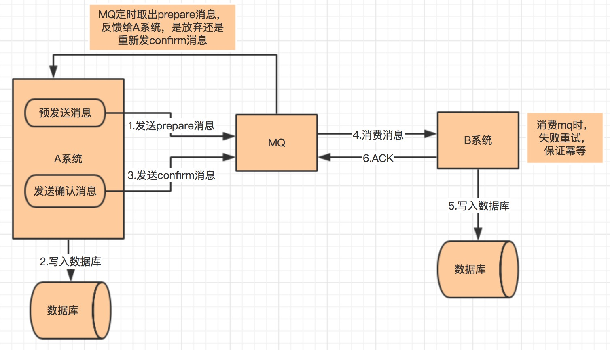

# 分布式事务

学习链接：https://xiaomi-info.github.io/2020/01/02/distributed-transaction/

## 简介

**单一性事务**包含：原子性、一致性、隔离性、持久性

**分布式事务**：事务管理器分布于不同的分布式系统中。接口的成功，不止依赖于本地的db操作，而且依赖第三方系统结果。**分布式事务是为了保证不同数据库的一致性**

下单的操作包括：扣减库存、减去用户优惠、创建订单

**一致性**

- ### 强一致性

  - 每一次读读到的都是最近一次的数据，系统中所有的进程都和时钟下的顺序一致

- ### 弱一致性

  - 数据更新后，能容忍后续的访问只能访问部分或者全部访问不到

- ### 最终一致性

  - 不保证在任务时刻任意点的数据是相同的，但最终会达到一致的状态

==**CAP原则**==：

C: Consistency 一致性：所有的系统数据的状态都是一致的

A：Availability 可用性：集群出现故障后，是否影响客户端的读写请求

P：Partition tolerance 分区容错性：系统如果不能在一定时间内达成数据一致性，是否会对系统有影响，导致无法后续操作

CAP是无法全部兼顾的，CA、CP、AP。CAP并非势必舍去其一。而且达成两个，尽力达成另外一个。

但是P是一定要达到的，分布式系统无法保证没有分区容错性，因为数据通信的限制，无法保证全部的一致性，则势必要系统拥有分区兼容性。

**CP系统**：若某个分布式系统无副本数据，是满足强一致性的要求，没有不一致的情况。但是系统挂掉或者网络问题，导致无法访问该系统，则可用性对其他系统造成影响。**为满足一致性，牺牲了系统的可用性。**

**AP系统**：数据库MVCC，读取数据时，若新数据还未同步到位，则读取的是旧版本的数据

**BASE理论**

BA：Basically Available 基本可用，分布式系统出现故障之前，允许损失部分可用性，保证核心可用

S：Soft State 软状态 允许系统存在中间状态，而且该状态并不影响系统可用性

E：Consistency 最终一致性 系统中所有数据副本经过一定时间后，达到最终的一致性

## 分布式事务的使用场景

- 转账：A给B转钱，A扣减，B添加。任何一方失败都是不允许的
- 下单扣减库存：下订单扣减库存、生成订单信息都是独立的服务
- 同步超时：支付订单成功，是支付成功，同步订单已支付。两步都可能出现超时，超时则未同步数据导致异常

## 具体实现

### 两阶段提交

两阶段提交：存在一个协调各个资源的事务管理器，**本地管理器一般由数据库实现**，事务管理器在第一个阶段询问字段管理器是否就绪。若都肯定后，才执行事务。若有字段回复no，则回滚事务

- 第一阶段（prepare）：事务管理器向所有本地资源管理器发起请求，询问是否ready状态，所有参与者将本事务是否成功的信息发给协调者
- 第二阶段（commit/rollback）：事务管理器得到所有在本地资源管理器的反馈后，再通知本地资源管理器执行或者回滚

问题：

**同步阻塞**：当分布式事务的参与方之一需要占用某个资源的情况下，当前资源被占用，则所有事务的参与者都需要等待该资源被释放，处于阻塞状态

**单点故障**：事务管理器发生故障，整个系统则不可用

**数据不一致**：若第二阶段发送commit请求时，部分参与者已收到请求，此时宕机或者网络异常，导致其他参与者未收到，则使得系统数据不一致

**不确定性**：事务管理器发送了commit请求，此时只有一个参与者收到请求，该参与者和事务管理器同时宕机，重新选举的事务管理器无法确定当前请求是否处理完成

**支付宝的支付就是两阶段提交**

### TCC事务机制

Try Confirm Cancel

- Try阶段：尝试执行，完成所有业务检查（一致性），预留业务资源
- Confirm阶段：确认参与方可以真正执行业务，不作任务检查，只使用Try阶段预留的业务资源，Comfirm 操作**满足幂等性**，Comfirm 失败后可以进行重试。
- Cancel阶段：取消执行，释放Try阶段预留的业务资源，Cancel操作满足幂等性Cancel阶段的异常和Confirm阶段异常处理方案一致

优点：

1. 解决了协调者单点：由业务发起方完成整个业务活动，业务活动管理器是多点，引入集群
2. 同步阻塞：引入超时，超时后进行补偿，并且不会锁定整个资源
3. 数据一致性补偿：有补偿机制，失败后可重试

下订单操作：检查库存剩余数量是否够用，并进行预留。预留操作是建一个可用预存数量字段，Try阶段操作是对该可用库存数量处理。而非实际库存。可以理解为预存出一些数据方便进行操作。

但是将一个接口拆分为Try、Confirm和Cancel三个接口，增加了实现的复杂度，**一般不推荐使用**

## 本地消息表

消息A被调用，发生数据修改后，需调用B的接口。

实际操作是：

1. 系统A执行更新数据库操作，并向本地的一个消息表写入操作（调用B的操作）
2. 系统A有个脚本定时轮询该消息表，向MQ发消息，会发送失败会重试。
3.  系统B消费MQ的消息，并处理业务逻辑，若执行失败，MQ重试。若业务上失败，则通知系统A该操作失败

**要求**：

- 生产者需要额外的创建消息表进行记录
- 生产者和消费者都需要幂等
- 需要提供补偿机制，若消费者业务执行失败，可以同步生产者回滚

该方式通过消息日志的方式异步执行，既保存了执行步骤，也记录了执行结果，可以通过业务规则自动或者人工重试

适用场景：跨行转账、对账系统对事后问题的处理

缺点：存在延时，无法适用于调用量高的场景

## 可靠消息最终一致性

与本地消息表类似，不过去除了本地消息表，全部依赖MQ实现。MQ失败后，会进行重试或者回滚。

1. 系统A发送prepare消息
2. 发送成功后，执行本地事务
3. 若本地事务执行成功，则发送confirm 的消息，若发送失败，则发送回滚消息
4. B系统消费MQ的confirm消息，执行本地事务，发送给A系统ACk消息。若B系统出现异常，则重试。若出现业务异常，则向A系统发送回滚请求。
5. MQ定时取出prepare消息向系统A确认是否执行成功，若成功则重新发confirm消息，否则执行回滚

## 最大努力通知

1. 系统 A 本地事务执行完之后，发送个消息到 MQ；
2. 这里会有个专门消费 MQ 的服务，这个服务会消费 MQ 并调用系统 B 的接口；
3. 要是系统 B 执行成功就 ok 了；要是系统 B 执行失败了，那么最大努力通知服务就定时尝试重新调用系统 B, 反复 N 次，最后还是不行就放弃。

场景：支付回调，支付服务收到第三方服务支付成功通知后，先更新自己库中订单支付状态，然后同步通知订单服务支付成功。如果此次同步通知失败，会通过异步脚步不断重试地调用订单服务的接口。

# 需求设计

## 短URL系统设计

https://cloud.tencent.com/developer/article/2365243

短URL，并非由长URL链接 通过计算算法映射出来。没有该必要。存在一个key，Value关系。通过短URL可以查出对应的长URL链接，游览器得到长URL链接后，重定向到真正链接

- #### 要求：

  1. 总量可能达到百亿级别的短URL数据量
  2. 短URL对应长URL链接，该场景需要快速响应，访问速度要求在50ms内
  3. 短URL链接存在有效期，过了有效期会定时清理url链接
  4. 生成的URL链接只包含大小写字母和数据，共62位
  5. 假设 每月生成5亿条url链接，每条访问

  

**实现**

#### url的数据量

- 字符量
  - 生成的URL，只包含大小写字母数字，共62位。62的6次方共 568亿。6位就可以支持

- 存储量：
  - 假设每月生成5亿条短url，则两年生成120亿。假设每条存储1kb（创建时间，短url，长url，是否过期），则大概12TB的数据量。

- 吞吐量
  - qps = (5亿 * 100) /  (30 * 24 * 60 * 60) = 2w, QPS **一般系统高峰期访问量是平均访问量的 2 倍，因此系统架构需要支持的吞吐能力应为 4万。**

####  URL生成方案

1. 自增长生成
   - 通过递增的方式，自增长生成url链接。容易被用户识别，这种容易泄露商品信息，不安全
2. hash运算
   - 通过hash运算，再截取前6位，容易重复
3. 随机生成
   - 随机生成，再校验是否重复，通过布隆过滤器判断是否重复。消耗性能，时间慢
4. 预存生成（真正有效的方式）
   - 预存生成短链接，存储在Redis中，提高访问性能。生成时按随机数生成，不过都存储到Redis中。可提前生成120亿的数据，先预存部分Redis中，用尽后读取刷新到Redis中。

#### redis性能

过期短 URL 清理服务器会每个月启动一次，将已经超过有效期（2 年）的 URL 数据删除，并将这些短 URL 追加写入到短 URL 预生成文件中。

为了保证系统**高可用**，应用服务器、文件服务器、数据库服务器都采用集群部署方案，单个服务器故障不会影响 Fuxi 短 URL 的可用性。

对于 高性能**要求，80% 以上的访问请求将被设计为通过缓存返回。Redis 的缓存响应时间 1ms 左右，服务器端请求响应时间小于 3ms，满足 80% 请求小于 5ms 的性能目标。对于缓存没有命中的数据，通过 HBase 获取，HBase 平均响应时间 10ms，也可以满足设计目标中的性能指标。

对于 Redis 缓存**内存空间**估算，业界一般认为，超过 80% 请求集中在最近 6 天生成的短URL 上，主要缓存最近六天生成的短 URL 即可。根据需求容量估计，最近 6 天生成的短 URL 数量约 1 亿条，因此需要 Redis 缓存服务器内存空间：1亿 × 1*KB* = 100*GB*

#### 重定向响应码

301,302都可。301是永久重定向，302是临时重定向。为避免游览器缓存，取302.

