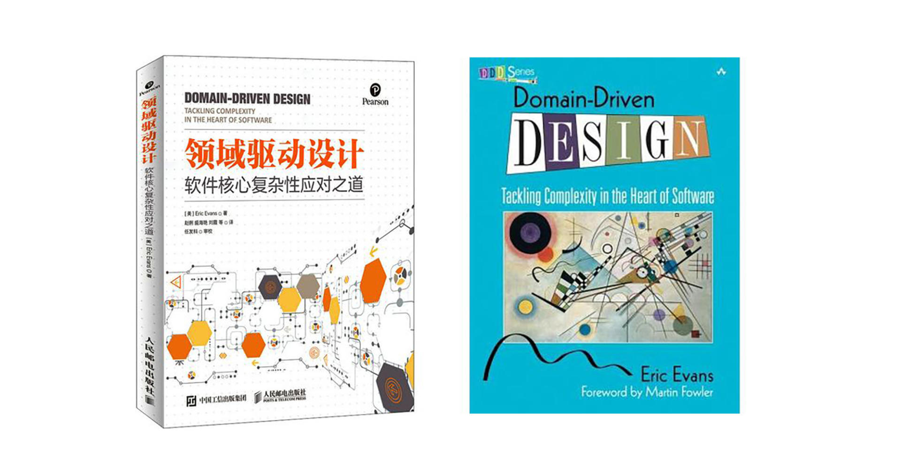

# 01｜DDD小传：领域驱动设计为什么这么火？
你好，我是钟敬。

今天咱们正式开始学习领域驱动设计（DDD）。

虽然DDD在这几年越来越流行，但是对于它的一些基本问题，业界仍然有很多不同看法。

有人说，DDD是划时代的创新；但也有人说，DDD只是新瓶装旧酒，毫无新意；有人认为，DDD仅仅是为了开发微服务；也有人认为，DDD只是一种面向对象编程的方法；还有人以为，DDD只是少数高手的专利。

这些看法都是片面的，说明还有不少人并没有真正理解DDD的基本概念。对基本概念缺乏了解，必然会影响对DDD的理解和学习。

所以，这节课咱们先聊聊DDD是什么，DDD的来源，DDD解决了什么问题以及DDD在这几年流行起来的原因。了解了这些，相信你对上面的问题就会有一个正确的认识，也会为后续的学习打下基础。

## DDD说的是什么？

2003年，Eric Evans 写了《领域驱动设计：软件核心复杂性应对之道》一书，正式提出了这种方法。领域驱动设计的英文是 Domain-Driven Design，所以简称 DDD。下面就是这本书的中英文封面：

按照作者自己的说法，“DDD是一种开发复杂软件的方法”。

为了把意思说得更透彻，我把作者的原话做一个扩展：“DDD是一种开发 **复杂** 软件的 **系统化** 的 **方法学** 和 **思想**”。咱们下面掰一下这句话。

首先，到底 **什么是方法学？**

方法学的英文名是 methodology。这么说吧，假如你Java代码写得特别溜，那么可以说你掌握了面向对象的 **编程方法**；假如你还很熟悉面向对象的设计原则，掌握很多设计模式，那可以说你懂面向对象的 **设计方法**；假如你能为业务概念构建领域模型，那么你就懂了面向对象的 **分析方法。面向对象的分析、设计、编码三种方法融会贯通，成为一个有机的整体，这个叫面向对象的方法学**。

我们发现，很多小伙伴都能熟练掌握编程方法，其中一些小伙伴，能掌握设计方法，但掌握分析方法的，就很少了。而分析方法，或者说领域建模的方法，正是DDD的重点。关于什么是领域建模，咱们在后面的课程中还会详细讲。

刚才说，DDD是 **系统化** 的方法学。那么 **什么是系统化呢**？

咱们用数学举个例子。古代数学家祖冲之花了一辈子时间，用“割圆术”把圆周率算到小数点后7位，在当时已经是世界领先了。而现在的大学生，只要掌握了微积分，用一天的时间算出来的圆周率，就比祖冲之一辈子算出来的还准。

那么是不是可以说，现在随便一个大学生，智商都比祖冲之高呢？这可不见得。之所以我们算得比祖冲之准，是因为前辈们总结了微积分这套方法，我们站在了巨人的肩膀上才能做到。微积分，就是解决高等数学问题的系统化的方法。

所以，系统化方法的作用在于，提供了一套相对容易的步骤，能够使我们这些中等智商的人，也能做到原来高智商的人才能做到的事情，从而让你能够省出时间和脑力，来探索更复杂的问题。在软件开发领域，DDD就是这样一套系统化的方法学。

不过，据说有人问过Evans本人：“DDD是一种方法学吗？” Evans说，DDD不只是一种方法学，更重要的是背后的一套开发软件的思想和哲学。那么， **DDD中又蕴含着哪些思想和哲学呢？**

归纳一下，大概有构建知识、分而治之、抓大放小、统一语言、抽象化、可视化、协作以及演进等等。凡是说到思想，都是一些大词儿，听起来都对，但是感觉好像没什么用，关键是不知道怎么落地。

**而DDD恰恰是通过总结了一套系统化的方法学，能够把这些大词落地**。具体做法，我们会在后续的课程中讲解。

## DDD的来源

为了让你进一步理解DDD的含义，我们再了解一下DDD的来源。

按照作者在原书中的说法，DDD是来自面向对象的方法学和敏捷软件开发。DDD对它们进行了总结和提炼，使之更容易学习和实践。

业界有一句话 “DDD 就是 OO Done right”。OO就是面向对象，也就是说把面向对象做对了，就是DDD。也可以反过来说，面向对象本来就是“领域驱动”的。

不过，面向对象方法学从80年代兴起，到了 2000 年前后已经走向成熟。那么问题就来了：既然有了面向对象，我们为什么还要提DDD呢？这是因为传统的面向对象方法学仍然存在一些问题。

## 传统面向对象方法学的问题

早期面向对象的成功，主要是在几个特定的领域，比如计算机语言、图形用户界面、办公自动化软件等等，但在企业应用方面还没有取得成功。所谓企业应用，包括像银行的贷款系统、保险公司的理赔系统、电信公司的计费系统等等。

那个时候的面向对象方法学还不能很好地应用于企业应用，大体上有以下几个原因。

**第一个原因是，很多开发人员走了一条只重技术不重业务的弯路。** 企业应用是用来解决业务问题的，所以我们应该首先把业务研究清楚，再通过技术手段来实现。但很多开发人员把主要精力放到技术的研究上，比如语言、框架、工具等等。以为把技术学会了，自然就能把系统开发好。

重技术、不重业务的思想造成了业务和技术人员之间难以相互理解，技术人员难以真正满足业务需求，如果连需求的方向都搞错了，那么技术再纯熟也会南辕北辙。这样的弯路走了十几年，早期面向对象方法学的大好形势也就烟消云散了。

**第二个原因是，围绕业务进行开发的方法本身就不好学。** 面向对象方法学主要是围绕领域建模开展的。领域建模这个东西，看老师傅做的时候好像挺简单，新手一上去，怎么做都不对。

这是因为，领域建模是一种“手艺”。凡是手艺，都不是看看书、学学理论就能掌握的，而是要经过实践中的磨炼。很多小伙伴听了DDD的课，也看了DDD的书，但是没法在实践中真正解决复杂的问题，就是因为没掌握这门手艺。

**第三个原因是，早期面向对象方法学主要考虑的是建模技术，很少考虑协作问题。** 历史上很多伟大的软件开始时都是个人作品，比如UNIX和C语言。作者在一开始是写给自己用的，所以并不存在协作问题。但是企业应用则不同，多数都是团队作战。即使只有一线开发人员，也免不了和需求方打交道。所以协作变得很重要。

**最后一个原因是难以适应变化。** 企业应用的需求往往变化频繁，很多变化根本无法预料。传统的面向对象方法学也很少讨论怎样应对变化的需求。

## DDD的解决之道

可以说，DDD正是为了解决上面这些问题而提出的。首先你从“领域驱动设计”这个名字就可以看出来。“领域”指的就是软件系统要解决的业务问题，也可以叫“业务领域”。用领域来驱动设计，就是说要从业务出发进行系统的设计。强调这个原则，就是希望把开发者从只重技术的弯路上拉回来。

要搞清业务，就要学会领域建模。前面也说了，这并不好学，那怎么办？DDD采用了“模式”的方法。

我们都知道，老专家做事比新手做得好，说明专家心里一定有些新手不知道的东西。这些东西以前不容易讲清楚，后来有人把专家心里的这些高招都进行了系统化的梳理，每一条都是解决特定难题的通用的解决方案，这就是所谓“模式”。

计算机界最有名的是设计模式，后来又有分析模式、架构模式等等。读这些讲模式的书，就好像同时有好几个大师在给你讲课一样。通过学习模式，原来不容易掌握的东西就变得相对容易了。

Eric Evans 正是对面向对象方法学和敏捷软件开发方法进行了提炼，总结出了一套围绕领域建模进行软件开发的模式，一共有四十多个。这些模式成为《领域驱动设计》这本书的主体。

除了模式，书里还有一套相关的原则和实践。其中最基础的模式包括：模型驱动设计，实体、值对象等等。这些在后续的课程中，咱们都会讲清楚。

另一方面，领域驱动设计非常强调业务人员和技术人员要一起协作进行领域建模，在这个过程中提炼领域知识。和协作密切相关的模式有通用语言、模型驱动设计、限界上下文等等。实际上，这几个模式贯穿了整个DDD。

此外，DDD提出了所谓“柔性设计”的概念，使得模型和系统可以随着需求的变化而演进。什么意思呢？书里打了一个比方：这就好比一副新的皮手套，开始时整副手套都很僵硬；戴得久了，关节处就会自然变得柔软，而其他部分还是比较硬的。

同样，在软件设计中，也不是一开始就把所有地方都设计得很灵活，而是先进行“足够的”和“整洁的”设计。

随着业务变化，将变化频繁的部分重构得越来越灵活，而不常变化的部分则保持不变。也就是说，模型中的哪些部分需要设计得灵活，是自然演进形成的，这样就避免了“过度设计”。这个过程就是柔性设计。而这个重构的过程，也是不断加深领域知识理解的过程。

关于协作和演进，正是DDD的来源之一，敏捷软件开发所解决的重点问题。

## 从“沉寂”到“爆火”

看到这里，你是不是觉得DDD还不错呀？不过，《领域驱动设计》这本书其实是2003年写的，到现在将近20年了。直到最近几年，才真正开始普及起来。

你可能会问了，既然DDD这么好，为什么之前不火，现在才火起来呢？

其实，在DDD刚出现的时候，很多企业软件还不太复杂。一些复杂的软件，变化也不像现在这样频繁。甚至还有一些企业，干脆每隔四五年把原来的系统推翻重建一次。

另一方面，当时一些新兴的产业，例如互联网，还处在跑马圈地、野蛮生长的阶段。这时关注的是系统快速上线，抢占市场，至于软件质量好不好，容不容易维护，暂时不是考虑的重点。

在这种情况下，DDD就成了一种“屠龙术”。杀龙是一项比较困难的技术，但是就算学会了，全世界也找不到几条龙，所以屠龙术就显得没有什么用处。DDD就面临着这样的尴尬，或者说，从整个业界来看，必要性还不够强。

另一方面，DDD普及的一些前提条件也还没准备好。

首先是敏捷软件开发刚刚出现不久，还不普及。如果没有迭代开发、持续重构、测试驱动、持续集成等敏捷实践的支持，构建良好的领域模型并在代码上落地是很困难的。

其次是配套的开发框架还不成熟。那时J2EE 还被认为是企业应用事实上的标准，而基于这种框架开发程序，是很难和DDD的领域模型相衔接的。2004年，Spring 发布了1.0版，从技术上基本解决了EJB的问题，理论上可以比较好地支持DDD。然而Spring的真正普及，还要假以时日。

那么DDD为什么在这几年又火起来了呢？

**首先是，数字化时代的到来，使DDD变得非常有必要。**

数字化时代，技术逐渐成为企业核心竞争力的主要因素，无论业务还是系统都变得更加复杂。因此，如何将业务和技术融为一体，就成了很多企业的主要问题，而这正是DDD的主要优势。

行业竞争的加剧也要求系统具有更好的用户体验、更高的质量、更快地满足变化的需求。这些问题很难解决，必须引入系统化的方法。再说了，云计算、微服务等新技术架构的产生，也需要方法学的支持。可以说，“恶龙”已经遍地都是，“屠龙术”终于有了用武之地。

**第二，DDD普及的道路已经铺好，这项技术逐渐变得可行。**

现在，敏捷软件开发已经普及。迭代、演进、协作等思想已经深入人心。DevOps技术应用得也日益广泛。而且Spring boot等轻量级框架已经得到广泛使用。这些框架支持了领域模型与具体技术的关注点分离，使开发人员从技术细节中解放出来，将更多的精力投入到领域逻辑本身的分析和设计。

再者，相关的架构实践也已经研究得比较透彻，像整洁架构、事件驱动架构以及CQRS等等，都有力地支持了DDD的落地实施。DDD本身也在不断完善，比如补充了像领域事件等新的模式，出现了事件风暴等新的实践。

可以说是天时地利人和皆备，DDD 终于咸鱼翻身、星火燎原了。

## 总结

好，现在我们来总结一下。

今天我们介绍了DDD的概念、内容，以及近年来兴起的原因。总的来说，DDD是一种开发 **复杂** 软件的 **系统化** 的 **方法学** 和 **思想。**

DDD建立在面向对象方法学和敏捷软件开发方法之上，一方面保留了面向对象的精华，另一方面又弥补了早期方法的不足。

DDD从面向对象和敏捷中提炼出了一套原则、模式和实践，使面向对象方法学在企业应用中更加容易学习和掌握。

DDD的核心是领域建模。领域模型是浓缩的领域知识。此外，DDD还重视业务与技术人员的沟通，以及如何应对变化。

最后，我想说，数字化时代为软件开发带来了新的挑战。如何实现业技融合，如何应对复杂多变的需求，如何防止架构和代码的腐化等问题，需要新的解决办法。而DDD正是顺应了时代的要求，才日益普及起来。

## 思考题

下面有两道思考题：

1.有人说DDD的目的就是为了开发微服务，你同意这种说法吗，为什么？

2.有人说DDD是创新，有人说不是，你的看法是怎样的呢？

欢迎在评论区分享你的想法。下一节课，我们将从实战中体会DDD的魅力，开启第一个迭代。