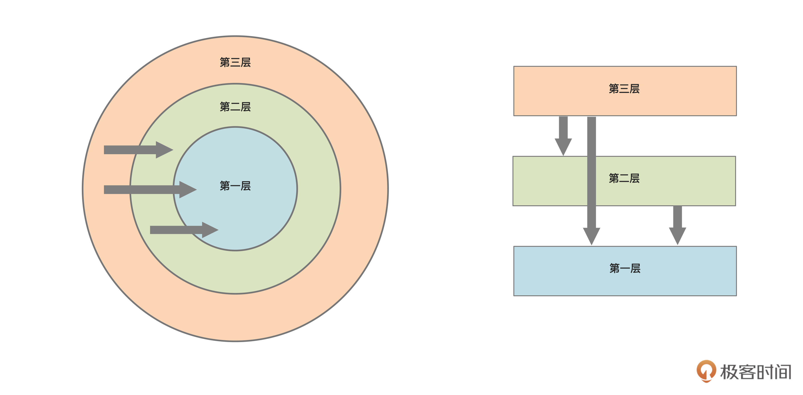
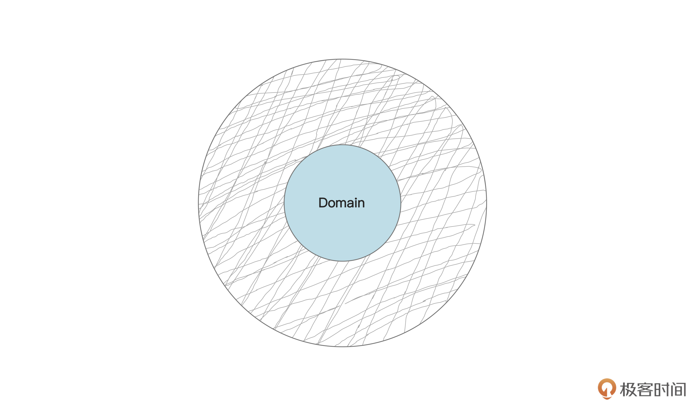
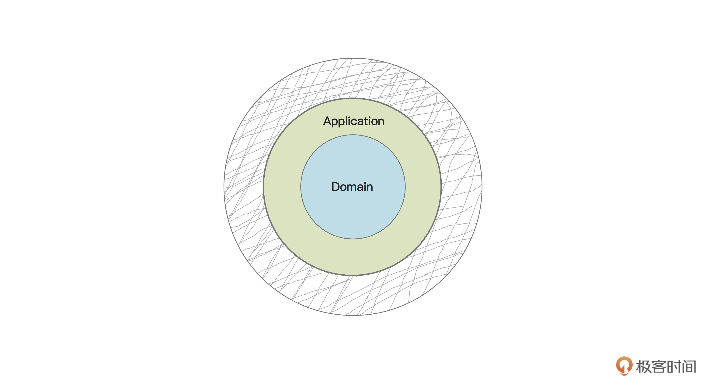
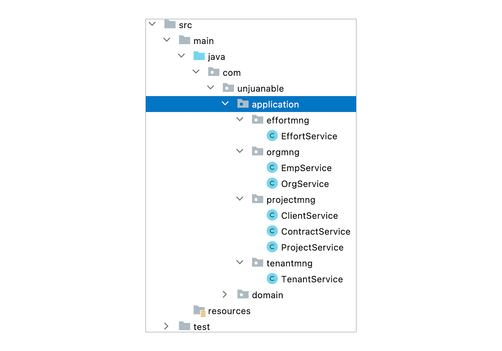
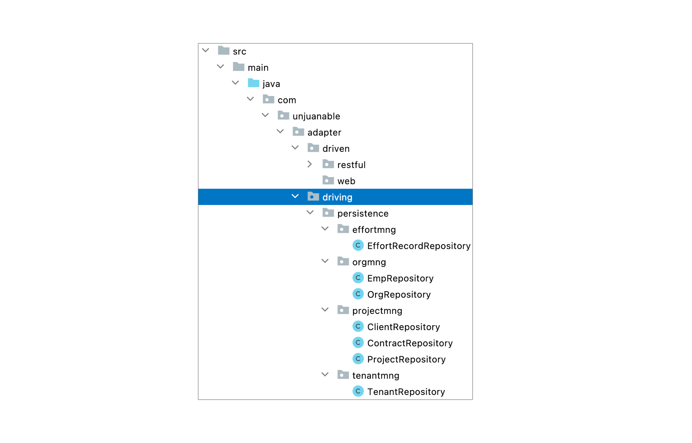
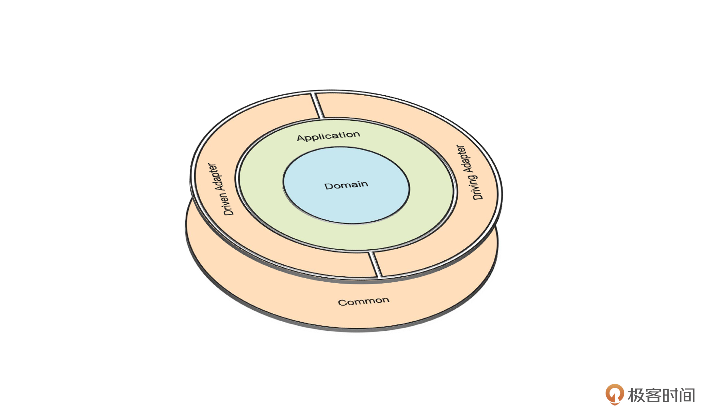
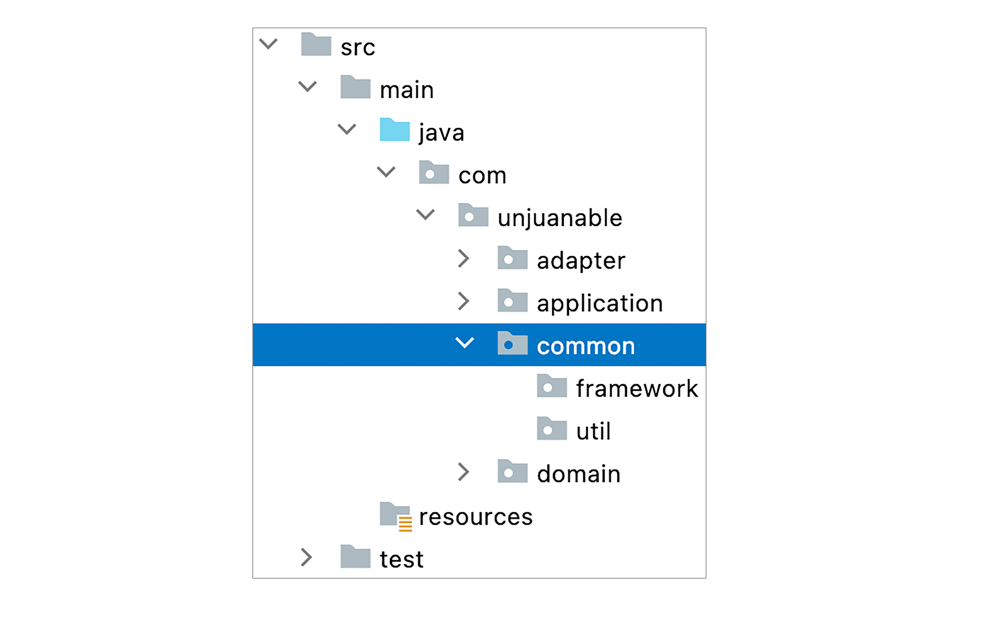
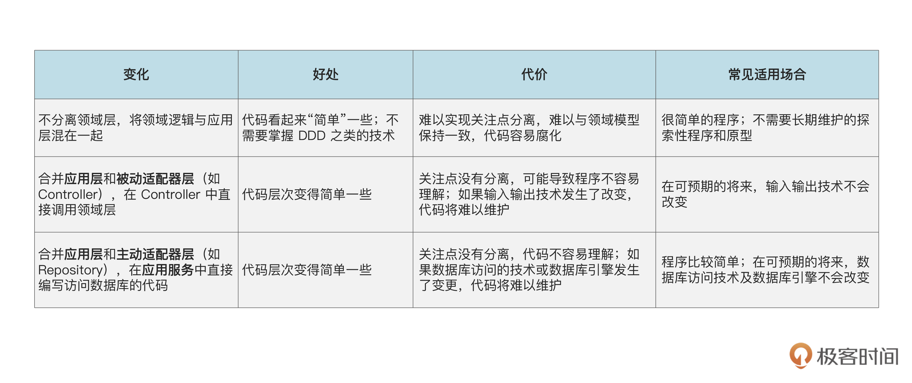

# 09｜分层架构：怎样逃离“大泥球”？
你好，我是钟敬。

上节课，我们完成了数据库设计，解决的是怎样保证数据库和领域模型一致的问题。接下来，我们来解决怎样保证代码与模型一致的问题。

这个问题又分成两个层面。第一个层面是要有一个合理的代码架构，第二个层面是更详细的代码编写。今天我们主要解决第一个层面的问题，通过引入DDD的分层架构，建立代码的骨架。

我们这节课的方法综合了《领域驱动设计：软件核心复杂性应对之道》（后面简称《DDD》）这本书里的内容以及“六边形架构”的思想。六边形架构是由敏捷软件开发专家 Cockbun提出的，用来分离技术和非技术关注点。如果你只是想掌握分层架构的最佳实践，那么学习这门课就可以了；如果还想进一步了解六边形架构的来龙去脉，可以读一下 [作者本人的文章](https://zhuanlan.zhihu.com/p/113681224)。

那么，我们为什么要采用分层架构呢？原因就是为了避免“大泥球”式的代码。

## 逃离“大泥球”

我们知道，系统中的代码都有各自的目的，有些处理领域逻辑，有些处理用户界面，有些处理数据库的访问……这些代码的关注点各不相同。但在很多开发团队中，并没有明确的手段来分离代码的关注点，从而使不同关注点的代码混在一起，这样就会造成下面几个问题：

- **首先**，很难单独识别出反映领域逻辑的代码，从而难以保证与领域模型的一致性；
- **其次**，应该内聚的逻辑分散在不同地方，应该解耦的逻辑又混在一起，造成代码难以理解；
- **再次**，修改业务代码，可能会影响技术代码，修改技术代码，又可能会影响业务代码，造成代码很难维护；
- **最后**，经过一段时间的维护，代码变得日益混乱，代码中出现大量重复和不一致，经常出现质量问题。

这种难以维护，毫无规范的代码就被称为“大泥球”（big ball of mud），我们用这张图来表示：

而分层架构就是解决大泥球问题的一种最佳实践，可以有两种等价的画法，一种由内而外，另一种自下而上，如下所示：

不过，目前业界用左边这种圈层结构的比较多，所以我们在课程中也采用这种画法。

从图上面可以看到，分层架构把代码分成若干层，每层负责不同的关注点。图里的箭头表示依赖关系，这里的意思是只能外层依赖内层，内层不能依赖外层。

这背后其实是根据软件架构中的一个重要原则： **代码中不稳定的部分，应该依赖稳定的部分**。所以，分层架构中越是内层，就越稳定，越是外层，相对就越容易变化。

那么问题就来了，我们具体要怎么划分代码的层次呢？这就是我们这节课的重点。下面我们来具体学习每个层次。

## 分离领域

首先， **DDD 对代码架构最核心的要求就是要将领域层分离出来**。领域层封装了领域数据和逻辑，我们前面的领域模型所对应的代码，主要就体现在领域层。只有将领域层独立出来，才能保证与领域模型的一致，也才能让领域层独立演化。下面是分离领域层后的示意图：

在代码层面，一个层对应于一个Java包或者C#的命名空间，一般命名为domain。在domain 包里，我们要根据领域模型中的模块进一步分包。这样，就保证了在模块一级代码和模型的一致性。下面这张图包含了领域层和模块的程序结构：

图中的Unjuanable 是项目的根，这是咱们自造的单词，就是“不要卷了”（un-juan-able）的意思，这是开个玩笑。而Effortmng、orgmng、projectmng 和tenantmng就是领域模型中的四个模块，命名还是依据之前建立的词汇表。

这里再强调一句， **分离领域是DDD的基本要求**。当然对于简单应用，也可以不分离领域，但这时就不能宣称自己是按照DDD来编码了。

尽管领域层也会随着需求不断演化，但对于一会儿要介绍的其他层而言，这一层仍然是相对稳定的。所以，领域层处于我们架构的最内层，是整个系统的核心，这也符合DDD的基本理念。

按模块分包以后，我们接着按照领域模型，在模块包中建立实体类，这样就能在类的层面和模型保持一致了。这里先为每个类写一个“空壳”，至于怎么编写类的属性、关联、逻辑等，我们在后面的课程再介绍。下图是增加了实体类的代码结构，命名仍然是依据词汇表，后面就不重复说了：

## 给领域一个“门面”

那么，领域层封装的逻辑通常是细粒度的，并不适合直接作为API暴露给外部。另外，还有一些不属于领域层的横切关注点，比如像事务控制，应该单独处理。所以，我们往往要在领域层外面再加一层，DDD和六边形架构都将这一层称为Application，也就是 **应用层**。如下图所示：

这一层主要负责下面这些逻辑：

1.接受来自客户端的请求，调用和协调领域层的逻辑来解决问题；

2.将领域层的处理结果封装为更简单的粗粒度对象，作为对外 API 的参数。这里说的粗粒度对象一般是DTO（Data Transfer Object），也就是没有逻辑的数据传输对象，应用层负责 DTO 和领域对象的数据转换；

3.负责处理事务、日志、权限等等横切关注点。从设计模式的角度，这一层相当于 **“门面”**（Facade）模式，如果你想更深入地了解这个模式，可以读一下相关书籍，例如 《Head First 设计模式》。

**应用层** 本身并不包含领域逻辑，而是对 **领域层** 中的逻辑进行封装和编排。我们不妨把应用层的逻辑称为 **应用逻辑。** 应用逻辑和领域逻辑的区别有时比较微妙，在后面的课程里我们还会再举例说明。

封装应用逻辑的类通常没有状态，只有方法，一般称为 **应用服务**，我们可以用 XxxService的形式来命名。下面就是增加了一些主要应用服务的代码结构：

## 用“适配器”处理输入输出

除了业务功能之外，程序里还有另一个重要的关注点——输入输出技术。我们的系统要和外界打交道，可以通过不同技术来实现，比如Restful API、 RPC，以及传统的Web页面等等。对于同一个业务功能，可能过去使用Restful API ，现在由于技术变革，需要改为 RPC。但不论具体技术是哪一种，背后实现的业务功能很可能都是一样的。所以，输入输出技术和业务功能是两个不同的关注点。

为了分离这两个关注点，我们在 **应用层** 外面再加一层，专门处理输入输出技术，如下图所示：

六边形架构中将这层称为 **适配器**，英文是adapter。这是因为，这一层的目的是把业务功能“适配”到不同的输入输出技术。

适配器会把和具体技术有关的请求，翻译成和技术无关的请求，再调用应用层来实现业务功能；在接收到应用层的返回值以后，又转化成技术相关的响应，返回给外界。也就是说适配器层屏蔽了输入输出技术的差异，从而使应用层与具体技术无关，这样就达到了分离关注点的目的。

下图是增加了适配器层的代码结构：

如果我们的系统要处理多种输入输出技术，那么适配器层可以按照具体技术来分包。比如在上面的代码例子里， Restful包里是Resful Api，web包里面是传统的JSP页面。这些包里的适配器，在多数情况下，就是我们熟悉的Controller。不过，我们并不打算在这个项目里真的使用JSP，这里的web只是为了举例。

## 用“适配器”处理数据持久化

最后，我们还要处理一个关注点，就是数据的持久化。在传统上，数据持久化就是访问数据库。但是现在，对缓存、文件系统、对象存储服务等等的访问，一般也算作数据的持久化。

不过，在引入新的分层之前，我们先讲DDD里的另一个模式，叫做Repository，中文可以叫 **仓库**。这个模式用于封装持久化的代码，大体上类似于传统上说的DAO（Data Access Object），也就是“数据访问对象”。

但和DAO不同的是， **仓库是以聚合为单位的，每个聚合有一个仓库**，而 DAO 是以表为单位的，每个表有一个DAO。我们在第二个迭代才会正式介绍 **聚合**，现在咱们姑且认为，一个 **实体** 就对应一个 **仓库**。

那么， **仓库** 和 **适配器** 有什么关系呢？

其实，数据库访问也是和具体技术相关的。同样的数据，可以存到Oracle，也可以存到 MySQL；既可以用MyBatis访问，也可以用JPA访问。这些都是具体的技术，和前面一样， **我们需要一种适配器把具体的持久化技术和应用层以及领域层隔离开，而仓库就充当了这种适配器。**

但是仔细想一下，你可能会发现，仓库和前面的Controller虽然都是适配器，但有一个重要的区别。Controller处理的是从外界向系统的调用，比如说来自HTTP客户端的调用；而 **仓库** 处理的是由系统向外界的调用，比如说对数据库的调用。也就是说，两者的方向不同。

在六边形架构里，把由外向内的适配器叫做 driven adapter，我把它译作 **被动适配器**；而由内向外的适配器叫做 driving adapter，可以译作 **主动适配器**。准确地说， **主动适配器的作用不限于访问数据库，而是访问所有外部资源**。

现在，我们可以把原来的适配器层分成两个部分，像下面这样：

这两种适配器都处于同一层，但由于性质不同，因此又可以分成两个子层。相应的代码结构是下面这样：

我们可以看到，adaper包被分成了driven和driving两个子包，分别代表两种适配器。在 driven里还是上一节说的Controller，而driving包下的内容则是新加的。Persistence是“持久化”的意思，这个包里面就是用于持久化的各个 **仓库**。

## 存放通用工具和框架

到现在为止，我们已经讲了DDD分层架构中最主要的几层，但还有另外一些代码没有考虑。比如说，我们写了一些用于字符串和日期处理的工具类，这些工具可能被上面说的任何一层调用。又比如说，我们可能对Spring框架进行薄薄的一层封装，以便更适合自己的产品使用，甚至可以写一些自己的小框架，这些框架性的代码也可能用于上面说的任何一层。

既然这些代码可能被前面的所有层依赖，那么是不是说，这些代码应该处于整个系统的最内层呢？如果这样做，那么和DDD所强调的以领域层为核心的思想就矛盾了。但如果不这么做，是不是又违反了层间依赖原则呢？

事实上，我们可以认为这些代码和前面说的各层根本不在同一个维度， **它们是对各层代码起到公共的支撑作用的**。用下面这张图比较容易说明这个思路：

你看，我们前面讲过的领域层、应用层和适配器层处于同一个平面，而公共支撑部分在另一个平面，对上面的平面进行支撑。这一层倒是没有什么统一的名字，不过业界很多人喜欢把它叫做 **common**。下面就是增加了common层的代码结构：

这里，我们增加了一个common包，下面又有两个子包。其中framework存放框架性的代码，而util存放工具性的代码。框架和工具的区别一般是，框架会调用我们自己写的代码，而工具则被我们写的代码所调用。

## 分层架构的权衡

那么，学完前面所有的内容，你可能会问：“我在自己的项目里一定要按这里方法分层吗？不这样分层就不是DDD了吗？”

其实，这节课的目的并不是让你在实际项目里照搬这里的架构，而是希望你能够理解分层架构背后的原理，然后针对自己项目中存在的痛点进行权衡，形成适合自己项目的架构规范。

在实际项目中，根据具体情况，有些层次可以合并，而有些层次则可以分得再细一些。在下面的表里，我列出了几种分层架构的变化，供你参考：

## 总结

好，今天的主要内容就讲完了，下面来总结一下。

这节课，我们首先解释了分层架构的目的，也就是通过关注点分离，保证代码和领域模型的一致性，并避免大泥球式的代码，提高程序的可维护性。分层架构要求只能外层依赖内层，不能内层依赖外层。

然后，我们再结合《DDD》一书以及六边形架构，在代码里引入了各个层次：

**领域层**，用来封装领域数据和逻辑。这一层与领域模型直接对应，是整个系统的核心；

**应用层**，作为 **领域层** 的“门面”，把 **领域层** 封装成更粗粒度的服务供外部使用，并且处理事务、日志等横切关注点；

**被动适配器**，用来接收来自外部的请求。屏蔽具体的输入输出技术；

**主动适配器**，用来访问外部资源。主动适配器和被动适配器都属于适配器层，区别在于调用的方向不同。适配器层与具体输入输出和资源访问技术有关，而应用层和领域层与具体技术无关。这样我们就分离了技术和业务的关注点；

最后，我们引入了 **common层**，用于存放工具和框架。这一层对前面的各层进行支撑。

正如前面所说的，这节课的目的不是为了让你完全照搬这里的架构，而是希望你能够通过这节课的学习，理解背后的原理，并在实践中进行权衡，找到适合自己项目的架构。

## 思考题

最后是两道思考题：

1.在适配器中，我们举了Restful API、RPC、Web、Repository几种最常见的情况，根据你的经验，还有哪些其他种类的适配器？

2.分层架构规定只能外层依赖内层，在今天讲的几层中，有一处可能会破坏这种层间依赖关系，你能找出来吗，有没有解决办法？

好，今天的课程结束了，有什么问题欢迎在评论区留言，下节课，我们来一起编写具体的代码逻辑。