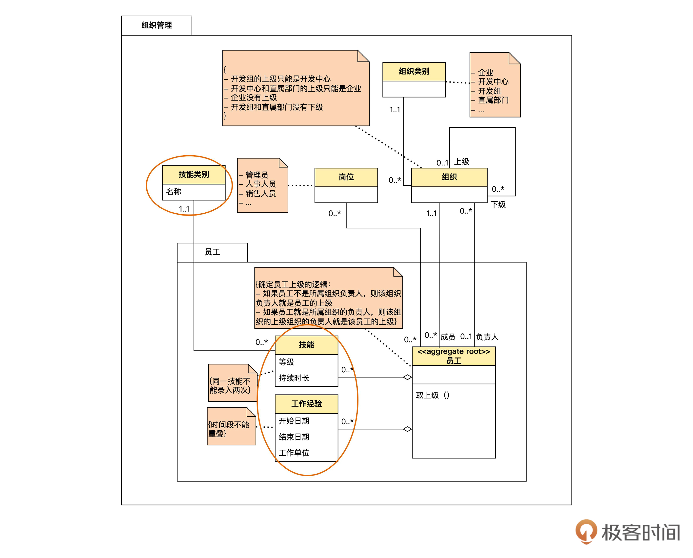
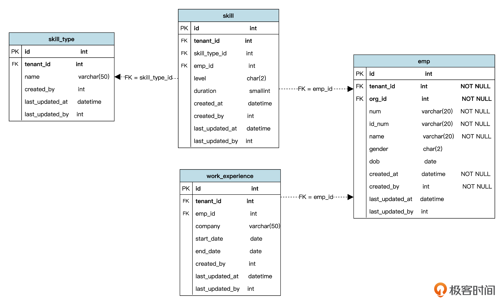
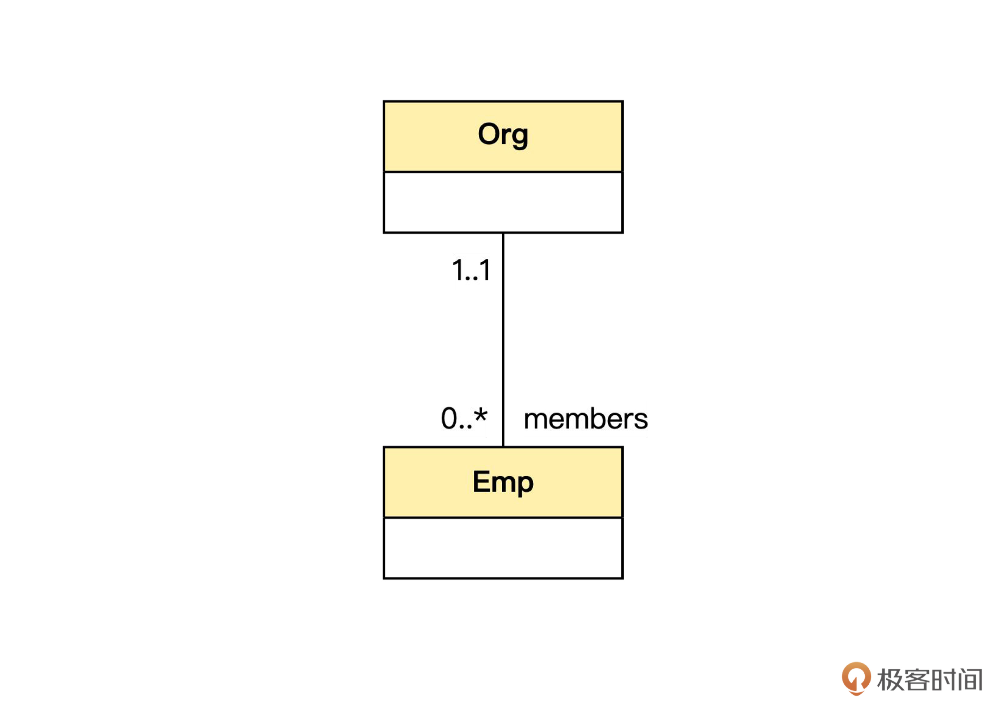
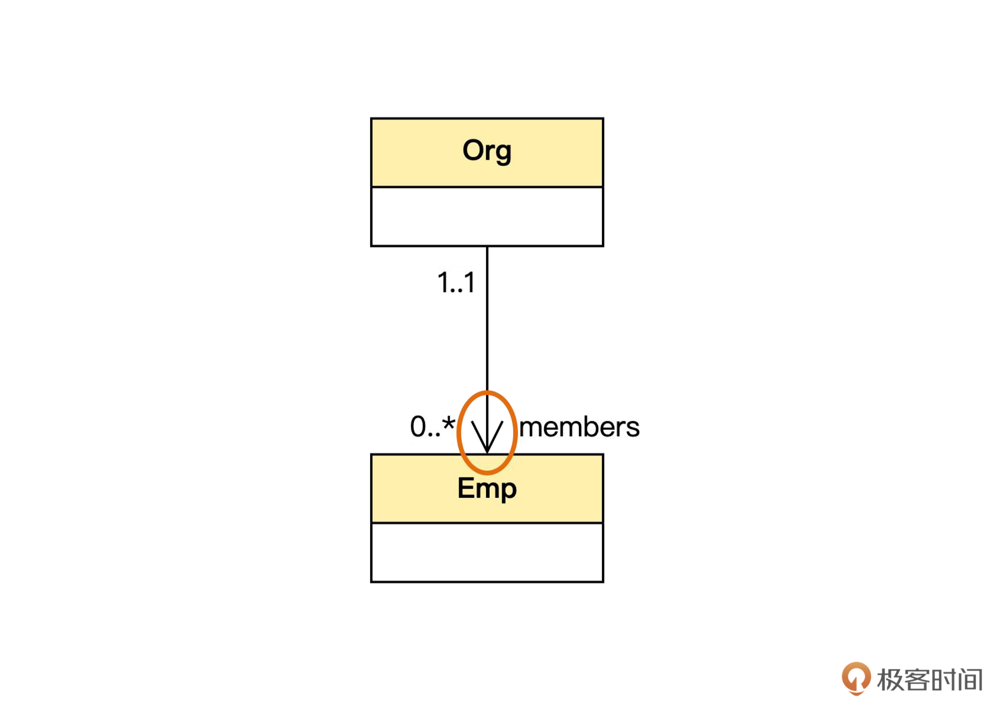
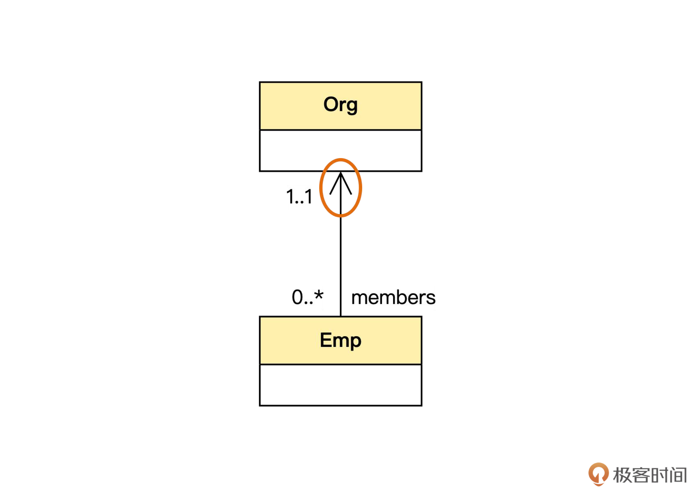
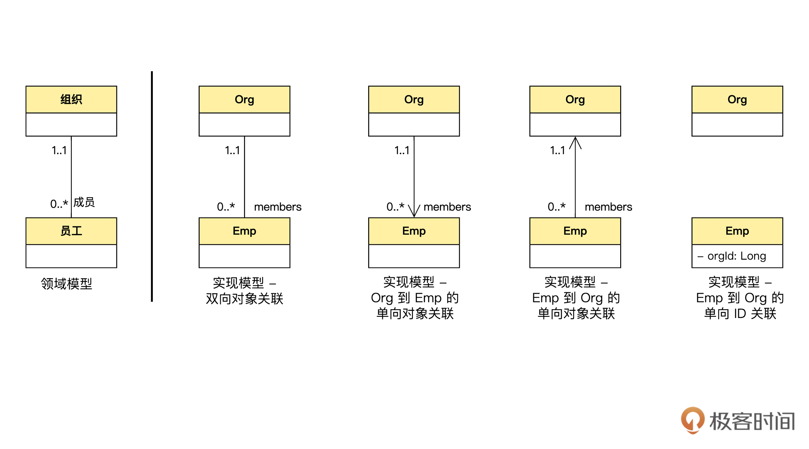
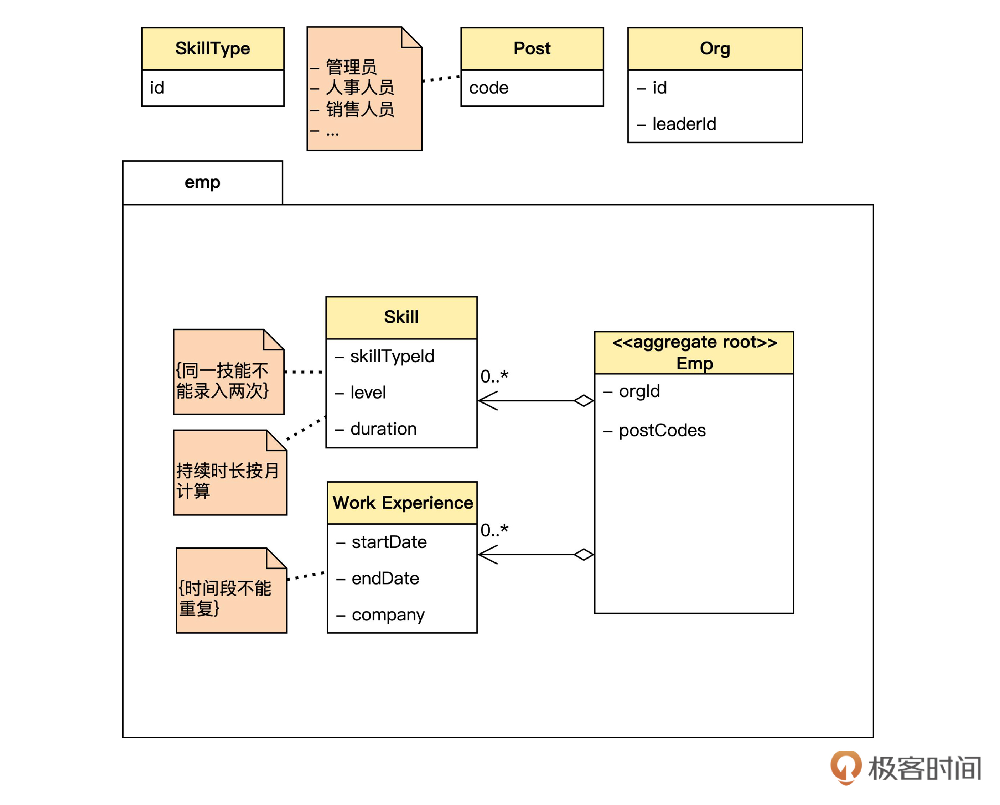

# 15｜聚合的实现（上）：怎样对聚合进行封装？
你好，我是钟敬。

[上节课](https://time.geekbang.org/column/article/620047) 我们通过为员工技能、工作经验等实体建立领域模型，学习了聚合的概念。接下来三节课，我们会以员工聚合为例，学习聚合的实现。

上节课我们讲过，聚合的一个主要特征是具有不变规则。而维护不变规则的前提是要做好对聚合的封装，否则，外部的对象就可能无意间破坏聚合内部的规则。

在上个迭代，我们已经通过 **组织（Org）对象学习了对单个对象的封装。而聚合** 是一组对象，那么封装的方法又有什么不同之处呢？这就是我们这一节课的重点。

下面，我们通过 **新增员工聚合** 的功能来讨论对聚合的封装。

## 数据库设计

我们先为员工聚合中新增的实体设计数据库表。回忆一下领域模型，如下图。



根据上个迭代学过的知识，我们不难设计出数据库表，如下图。



其中 **skill\_type、skill 和 work\_experience 就是为技能类别**、 **技能** 和 **工作经验** 新增的三个表。

## 实现关联的两种方法

在正式开始编码之前，我们有必要先聊一下在代码中怎样实现领域对象之间的关联。这一点在上个迭代还没有仔细谈。

实现关联主要有两种方式，一种是 **对象关联**，另一种是 **ID关联**。我们用下面这个简化的组织和员工的领域模型来说明问题。


### 对象关联

如果采用 **对象关联** 的话，这两个类的代码骨架是下面这样的。

```java
public class Org{
    private List<Emp> members;
    // other fields ...
    // getters and setters ...
}

```

```java
public class Emp{
    private Org org;
    // other fields ...
    // getters and setters ...
}

```

在这上面的实现中， **组织（Org）** 类里有 **员工（Emp）** 类的 List。

因此，我们可以从一个 **组织** 对象直接找到所有员工，反之，也可以从员工对象直接找到所属的组织。所以这是一个 **双向** 的对象关联。我们可以用下面的类图来表示这种代码设计。



注意，这个图虽然也是UML的类图，但是和上面的领域模型图的性质不一样。领域模型表示的是业务概念，是业务人员能够理解的。而这个图是实现层面的，只对开发人员有意义，业务人员不需要理解。

这种图在传统上叫 **设计模型图**，不过为了避免混淆，我们这里把它称为 **实现模型图**，以便和领域模型图区别。如果你觉得这里的实现模型和领域模型的差别还不够明显，那么我们再看一下另一种 **对象关联** 的实现模型。



这个图里有一个由组织对象指向员工对象的箭头，说明这是一个单向关联，相应的代码是下面这样。

```java
public class Org{
    private List<Emp> members;
    // other fields ...
    // getters and setters ...
}

```

```java
public class Emp{
    // private Org org; 由于是单向关联，所以从Emp不能直接导航到Org
    // other fields ...
    // getters and setters ...
}

```

在上面的代码中，只能由 **组织** 直接通过 **对象关联** 找到 **员工**，从 **员工** 不能直接找到 **组织**。如果把关联换一个方向就成了下面这样。



```java
public class Org{
    // private List<Emp> members; 单向关联，所以从Org不能导航到 members
    // other fields ...
    // getters and setters ...
}

```

```java
public class Emp{
    private Org org;
    // other fields ...
    // getters and setters ...
}

```

### ID关联

前面说了对象关联，而ID关联就更简单了。下面是代码。

```java
public class Org{
    // fields ...
    // getters and setters ...
}

```

```java
public class Emp{
    private Long OrgId;       // 员工所属组织的ID
    // other fields ...
    // getters and setters ...
}

```

这是由 **员工** 到 **组织** 的单向关联，只不过员工对象里只存了组织ID，由组织ID找到组织对象的工作只能留给 **领域服务** 或 **应用服务** 了。相应的实现模型图是下面的样子。


尽管从领域模型的角度，组织和员工之间是存在双向关联的，但在实现层面，由于两者之间没有对象关联，所以我们没有在图上画出表示关联的实线。

另外，orgId 前面的减号（-）表示这是一个私有（private）属性。在UML里还有其他几种表示权限的修饰符：加号（+）表示公有（public）权限；井号（#）表示保护（protected）权限；波浪号（~）表示包级私有（package private）权限。

在领域模型里，所用属性都可以看作公有的，所以没有必要加权限修饰符。但实现模型是直接和代码对应的，一般要说明属性和方法的权限。这也是领域模型和实现模型的一个区别。

不论是对象关联还是ID关联，这几种方式都是同一个领域模型的不同实现。对于同一个领域模型，具体采用哪种实现关联的策略，取决于开发者的权衡，与业务人员没有直接关系。

领域模型和实现模型图的区别，实际上反映的是我们思维的两个不同层面，一个是概念层面（或者叫领域层面），另一个是实现层面。这种思维方式对正确实践 DDD 很重要。

在 DDD 的实践中，领域模型图是必需的，而实现模型图则是可选的，一般只在逻辑比较复杂或者开发者还不熟练的时候才要画出来。熟练以后，通常在脑子里过一下，直接根据领域模型写代码就可以了。而在课程中，为了清晰，我们还是会把实现模型画出来。

### 两种关联方式的比较

那么在这几种方式中该怎么选择呢？我们把领域模型图和 4 种实现方式放在一起来看看。



基于对象的关联是传统面向对象编程的标准姿势。在这种方式下，对象之间通过自由地导航，共同完成任务。使用这种方式，大部分领域逻辑都可以在领域对象自身中完成，因此，只有少数情况才需要用到领域服务。

我们在上个迭代说过，传统的面向对象编程的基本假设是大部分对象都装入了内存，只有这样才能实现对象之间的自由导航。不过这种假设和企业应用是不符合的，因为企业应用的大部分数据都在数据库里，如果频繁地将数据库中大量的数据装入内存，必然引起性能问题。

要在企业应用里大量使用对象关联，必须采用 **懒加载方式（也叫延迟加载）**。也就是说，把一个对象从数据库中装入内存时，不装入关联的对象。只有当这个对象要用到某个关联对象的时候，才“透明地”把关联的对象装入内存。

懒加载一般要用到缓存、代理甚至字节码增强等技术，手动实现起来比较繁琐。好在实现了 JPA 的“全自动”的 ORM 框架（例如Hibernate）已经提供了成熟的实现，采用这些框架，就可以基于对象导航，实现传统的面向对象编程。

然而这是有代价的。由于 Hibernate 这样的框架背着程序员“偷偷地”做了很多事情，因此程序员就要对框架的原理有比较深入的理解，否则有可能带来意想不到的性能问题，而且有时也不容易进行精细化的性能调优。所以国内多数开发团队并不采用全自动的 ORM 框架，而是用MyBatis 这样的半自动框架，这样就只能以ID导航为主了。

使用ID导航的时候，由于领域对象之间难以通过导航来协作，所以对象内部能实现的领域逻辑就很有限了，大量的逻辑就要在领域服务中实现。所以这种方式下，多数聚合都至少要搭配一个自己的领域服务。这样，编程风格就只能是偏过程式的了。

另一方面，ID导航的优点在于简单直白，容易掌握，不容易出现隐蔽的问题。如果使用得当，同样可以一定程度上实现封装、继承等面向对象的特征，并实现整洁代码。

有趣的是，使用 JPA 的程序员在国内虽然是少数，在国外却是多数。其实，这两种方式都各有利弊，并没有绝对的对错，而且在实践中有时也会结合使用。

考虑到国内的现状，我们的代码总体上采用偏过程的风格。对于导航的设计来说，我们采用一种折衷的方式： **在聚合内部使用对象导航，跨聚合则使用ID导航**。

## 聚合代码的封装

好，下面我们开始为“添加员工”的功能编码了。

DDD 要求，代码和模型一定要保持一致。所以，在实践中，咱们通常一边打开领域模型图，一边打开 IDE，对着模型来写代码。下面是和员工有关的部分的领域模型。


我们把实现模型也画出来。



在实现模型里面，聚合内部， **员工** 和 **技能**、 **工作经验** 之间是单向的 **对象关联**；在聚合之间， **技能** 对象通过 skillTypeId 实现到 **技能类别** 的 **ID关联**； **员工** 对象通过 orgId 实现到 **组织** 对象的 **ID关联**，通过 postCodes（一个包含岗位代码的List）实现到 **岗位** 的 **ID关联**。

### 对非聚合根的封装

下面我们从封装的角度，完成聚合的基本代码。先看一下 **技能（Skill）** 类：

```plain
package chapter15.unjuanable.domain.orgmng.emp;
// imports ...

public class Skill extends AuditableEntity {
    private Long id;            // 只读
    private Long tenantId;      // 只读
    private Long skillTypeId;   // 只读，表示到技能类型的ID关联
    SkillLevel level;           // 读写
    private int duration;       // 读写

    // 包级私有权限
    Skill(Long tenantId, Long skillTypeId, LocalDateTime createdAt, Long createdBy) {
        super(createdAt, createdBy);
        this.tenantId = tenantId;
        this.skillTypeId = skillTypeId;
    }

    public Long getId() {
        return id;
    }

    public Long getSkillTypeId() {
        return skillTypeId;
    }

    public SkillLevel getLevel() {
        return level;
    }

    // 包级私有权限
    void setLevel(SkillLevel level) {
        this.level = level;
    }

    public int getDuration() {
        return duration;
    }

    // 包级私有权限
    void setDuration(int duration) {
        this.duration = duration;
    }
}

```

这个类比较简单，不过还是有几个微妙的地方要注意。

我们先分析哪些属性是只读的，哪些可以修改。和上个迭代的组织类一样，Id 和 tenantId 是只读的。那为什么 skillTypeId 也设计成只读呢？

我们在上节课说过，非聚合根对象有局部标识。由于在业务规则上，一个人同一个类别的技能不能出现两遍，所以我们就可以把技能类别当作技能对象的局部标识。

既然是标识，就不要变了。也就是说，如果张三有Java技能，那么可以把Java技能的等级由初级改成高级。但是不能把Java技能本身改成C#，如果一定要改，应该把Java技能删除，再新建 C# 技能。

对于这个类的所有属性，都有 public 的 getter，而只有可写的 2 个属性才有 setter。注意，这两个 setter 既不是 public的，也不是 private 的，在方法签名前面什么修饰符都没有。这种权限叫做“包级私有权限”（package private），后面我们都简称为“包级权限”。它的意思是，只有同一个包内的其他对象才能访问，出了包就不能访问了。为什么要这样做呢？

因为聚合的 **不变规则** 往往不是单个对象能够处理的。比如说，“同一技能不能录入两次”这个规则，通过查看单独的技能对象是无法验证的，必须查看员工的全部技能，才能判断一条新技能是否重复。所以这种规则必须由 **聚合根** 或者相应的 **领域服务** 负责验证。

因此，为了保证不绕过规则的校验，非聚合根对象就不能由外界直接创建或修改。这就得出了聚合编程的一个重要原则： **聚合外部对象对非聚合根对象只能读，不能写，必须通过聚合根才能对非根对象进行访问**。

由于每个聚合都在同一个包里，把 **技能** 的 setter 设置成包级权限，就保证了只有在聚合内部的聚合根、领域服务、工厂等才能对他进行修改，外界只能读取。同样， **技能** 对象的构造器也是包级权限，这样，就只有聚合内部才能创建 **技能** 对象了。

工作经验（WorkExperience）的代码是类似的。

```plain
package chapter15.unjuanable.domain.orgmng.emp;
// imports ...

public class WorkExperience extends AuditableEntity {
    private Long id;              // 只读
    private Long tenantId;        // 只读
    private LocalDate startDate;  // 只读
    private LocalDate endDate;    // 只读
    private String company;       // 读写

    // 包级私有权限
    WorkExperience(Long tenantId, LocalDate startDate, LocalDate endDate
            ,LocalDateTime createdAt, Long createdBy) {

        super(createdAt, createdBy);
        this.tenantId = tenantId;
        this.startDate = startDate;
        this.endDate = endDate;
    }

    // setters and getters ...

    // 包级私有权限
    void setCompany(String company) {
        this.company = company;
    }

}

```

由于工作经验的时间段不能重叠，所以我们可以把时间段，也就是开始时间和结束时间，作为局部标识。

### 对聚合根的封装

聊完了非聚合根，我们下面再来看看聚合根，也就是员工（Emp）类的代码：

```java
package chapter15.unjuanable.domain.orgmng.emp;
// imports ...

public class Emp extends AuditableEntity {
    private Long id;          // 只读
    private Long tenantId;    // 只读
    private Long orgId;        // 读写
    private String num;       // 读写，员工编号
    private String idNum;     // 读写，身份证号
    private Gender Gender;    // 读写
    private LocalDate dob;    // 读写
    private EmpStatus status; // 读写

    private List<Skill> skills;              // 读写
    private List<WorkExperience> experiences;// 读写
    private List<String> postCodes;          // 读写，岗位代码

    public Emp(Long tenantId, LocalDateTime createdAt, Long createdBy) {
        super(createdAt, createdBy);
        this.tenantId = tenantId;
    }

    // other getters and setters ...

    public EmpStatus getStatus() {
        return status;
    }

    public void becomeRegular() {
        status = EmpStatus.REGULAR;
    }

    public void terminate() {
        status = EmpStatus.TERMINATED;
    }

    // 对 skills、experiences 和 postCodes 的操作 ...
}

```

对于 **状态（status）** 属性，我们没有写 setStatus() 方法，而是用 becomeRegular()（转正）和teminate() （终止）这两个方法来切换状态。这和上个迭代中对组织状态的封装是类似的。而且在下一节课里我们还会看到，这种封装更便于业务规则的实现。

下面我们重点看一看聚合根对非聚合根的封装。

```java
package chapter15.unjuanable.domain.orgmng.emp;
// imports ...

public class Emp extends AuditableEntity {
    // other fields ...

    private List<Skill> skills;              // 读写
    private List<WorkExperience> experiences;// 读写
    private List<String> postCodes;          // 读写，岗位代码

    // constructors and other getters and setters ...

    public Optional<Skill> getSkill(Long skillTypeId) {
        return skills.stream()
                .filter(s -> s.getSkillTypeId() == skillTypeId)
                .findAny();
    }

    public List<Skill> getSkills() {
        return Collections.unmodifiableList(skills);
    }

    void addSkill(Long skillTypeId, SkillLevel level
                  , int duration, Long userId) {
        Skill newSkill = new Skill(tenantId, skillTypeId
                  , LocalDateTime.now(), userId);
        newSkill.setLevel(level);
        newSkill.setDuration(duration);

        skills.add(newSkill);
    }

    // 对 experiences、postCodes 进行类似的处理 ...

}

```

技能、工作经验和岗位的处理是类似的，我们只看 **技能** 就可以了。

用来查询技能对象的方法有两个，一个查询单个技能，另一个查询整个技能列表。查询单个技能对象的方法 getSkill(Long skillTypeId) 用技能类别ID作为查询条件，这是因为技能类别是技能的局部标识。这个方法的其他部分没有什么特殊之处，不过要强调一点，由于已经用包级权限对技能对象进行了封装，所以在聚合以外无法修改技能对象。

再看一下查询技能列表的 getSkills() 方法。我们过去可能会像下面这样写：

```java
    public List<Skill> getSkills() {
        return skills;
    }

```

这种写法直接把包含Skill的List返回给外界。这样，尽管外界不能修改单独的技能对象，但可以对列表进行增删，这样还是有可能破坏业务规则。

所以我们可以用下面的技巧，把员工对象内部的技能列表转换成一个只读列表后再返回。这样，外界就只能读这个列表，不能进行增删了，从而对 **技能** 实现了完全的封装。

```plain
Collections.unmodifiableList(experiences);

```

另外，我们用 addSkill() 方法来增加技能。这样，外界就不是直接创建技能对象，而是把创建技能对象的“素材”作为参数传递给 addSkill() 方法，从而在聚合根内部创建技能对象。对修改功能的封装也类似，我们会在后面的课程里讲。

## 总结

今天我们谈的重点是聚合的封装。

我们首先讨论了实现关联的两种方式，一种是 **对象关联**，另一种是 **ID关联**。无论哪种方式，领域模型都是一样的，区别只是实现策略。对象关联是传统面向对象编程的常规方式，但在企业应用的场景下，通常需要可以实现懒加载的ORM框架的支持。ID关联比较简单，但导致偏过程式的编程。我们的课程采用了折衷的方式，在聚合内部用对象关联，聚合之间用ID关联。

我们还介绍了两个层面类图的区别，一个是领域层面，一个是实现层面。这反映了思维的两个层次。这种区别是理解DDD的一个重点。

接着，我们以 **员工** 聚合为例，分别实现了对非聚合根和聚合根对象的封装。为了确保不变规则不被破坏，总的原则是： **聚合外部对象对非聚合根对象只能读，不能写，必须通过聚合根才能对非根对象进行访问。** 用到的具体技术包括用包级私权限封装构造器和方法，返回不可变列表，用聚合根创建和访问非根对象等。

## 思考题

最后是两道思考题。

1.在面向对象编程中，对象是类的实例。那么，你认为聚合是对象之间的关系还是类之间的关系？

2.课程里的程序在聚合内部使用对象导航，聚合间则使用ID导航。可否分析一下这么做背后的权衡思路呢？

好，今天的课程结束了，有什么问题欢迎在评论区留言，下节课，我们继续聊不变规则的实现和聚合的持久化。