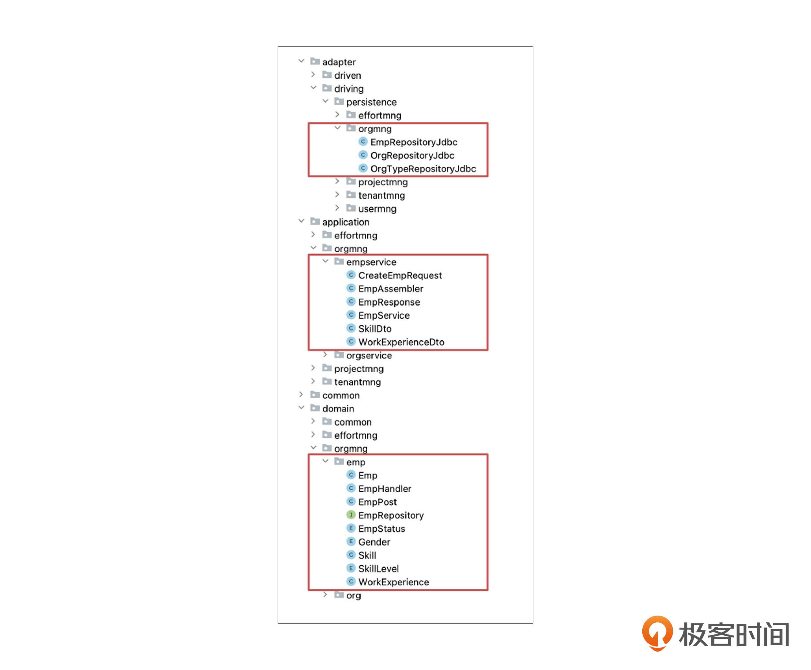
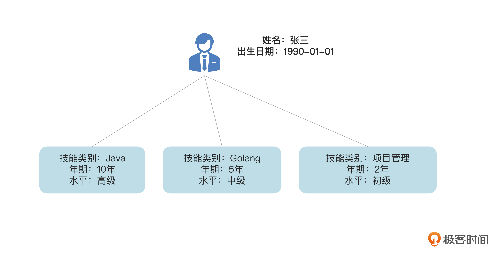
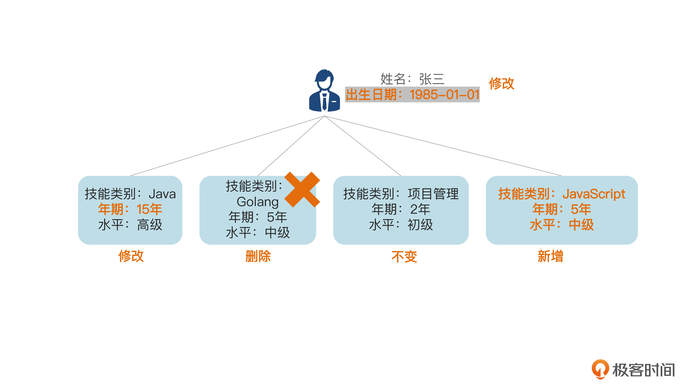

# 16｜聚合的实现（中）：怎样实现不变规则？
你好，我是钟敬。

上节课我们学习了聚合的封装，它的目的是确保不变规则。那么，具体来说，封装是怎样确保不变规则的呢？为回答这个问题，今天我们继续来讨论怎样为聚合实现不变规则。

另外，上个迭代我们说过， **仓库（Repository）是以聚合** 为单位进行持久化的，不过，对这一点，我们之前还没有充分展开。今天，我们也会来实现聚合的持久化，带你理解这个知识点。

此外，完成了添加员工的功能后，我们也会为 **修改员工** 功能做一些准备。

## 实现不变规则

我们首先来实现和改变状态有关的两个规则。


后面是具体的代码。

```java
package chapter15.unjuanable.domain.orgmng.emp;
// imports ...

public class Emp extends AuditableEntity {
    // other fields ...
    private EmpStatus status;

    // other getters and setters ...

    public EmpStatus getStatus() {
        return status;
    }

    //转正
    void becomeRegular() {
        // 调用业务规则: 试用期的员工才能被转正
        onlyProbationCanBecomeRegular();
        status = REGULAR;
    }

    //终止
    void terminate() {
        // 调用业务规则: 已经终止的员工不能再次终止
        shouldNotTerminateAgain();
        status = TERMINATED;
    }

    // 实现业务规则
    private void onlyProbationCanBecomeRegular() {
        if (status != PROBATION) {
            throw new BusinessException("试用期员工才能转正！");
        }
    }

    private void shouldNotTerminateAgain() {
        if (status == TERMINATED) {
            throw new BusinessException("已经终止的员工不能再次终止！");
        }
    }
}

```

代码本身并不复杂。这里的要点主要有两个。首先，这两个规则都是业务规则，因此必须在领域层来实现。其次，由于聚合根，也就是Emp，已经拥有了实现业务规则所需要的数据，所以我们应该直接在 **聚合根** 里实现业务规则，而不是 **领域服务** 里。

对比一下，上个迭代完成 **增加组织** 功能时的业务规则是在 **领域服务** 里实现的，那是因为 **组织** 对象里并没有所需的数据，而是要从数据库里取。

最后，只要改变状态，相应的规则就会被调用，所以规则总不会被破坏。

类似地，我们来实现关于 **技能** 和 **工作经验** 的不变规则。


我们看看代码。

```java
package chapter15.unjuanable.domain.orgmng.emp;
// imports ...

public class Emp extends AuditableEntity {
    // other fields ...
    private List<Skill> skills;
    private List<WorkExperience> experiences;

    // constructor and other operations ...

    public void addSkill(Long skillTypeId, SkillLevel level
                        , int duration, Long userId) {
        // 调用业务规则: 同一技能不能录入两次
        skillTypeShouldNotDuplicated(skillTypeId);

        Skill newSkill = new Skill(tenantId, skillTypeId, userId)
                .setLevel(level)
                .setDuration(duration);

        skills.add(newSkill);
    }

    private void skillTypeShouldNotDuplicated(Long newSkillTypeId) {
        if (skills.stream().anyMatch(
                    s -> s.getSkillTypeId() == newSkillTypeId)) {
            throw new BusinessException("同一技能不能录入两次！");
        }
    }

    public void addExperience(LocalDate startDate, LocalDate endDate, String company, Long userId) {
        // 调用业务规则: 工作经验的时间段不能重叠
        durationShouldNotOverlap(startDate, endDate);

        WorkExperience newExperience = new WorkExperience(
                tenantId
                , startDate
                , endDate
                , LocalDateTime.now()
                , userId)
                .setCompany(company);

        experiences.add(newExperience);
    }

    private void durationShouldNotOverlap(LocalDate startDate
                                        , LocalDate endDate) {
        if (experiences.stream().anyMatch(
                e -> overlap(e, startDate, endDate))) {
            throw new BusinessException("工作经验的时间段不能重叠!");
        }
    }

    private boolean overlap(WorkExperience experience
                    , LocalDate otherStart, LocalDate otherEnd) {
        LocalDate thisStart = experience.getStartDate();
        LocalDate thisEnd = experience.getEndDate();

        return otherStart.isBefore(thisEnd)
                && otherEnd.isAfter(thisStart);
    }
}

```

我们在增加技能【 addSkill() 】和增加工作经验 【addExperience() 】的时候校验不变规则，这样，外界就不可能破坏这些规则了。

此外，咱们还要体会的是，这样的规则，某一个单独的 **技能**（Skill）或 **工作经验**（WorkExperience）对象自身是无法校验的，必须从员工聚合整体上考虑。所以，规则的实现必须在聚合根里面完成。当然，如果聚合根没有足够的数据，需要从数据库取的话，那么这个逻辑就要放到领域服务了。

## 创建聚合的另一种做法

完成了主要的业务规则，现在我们来补充 **添加员工**（Emp）的应用服务。在上个迭代 **添加组织** 的时候，我们用了 Builder 模式，这实际是工厂（Factory）模式的一种实现。今天我们再尝试一种不同的写法。咱们先看看代码。

```java
package chapter15.unjuanable.application.orgmng.empservice;
// imports ...

@Service
public class EmpService {
    private final EmpRepository empRepository;
    private final EmpAssembler assembler;

    @Autowired
    public EmpService(EmpRepository empRepository
            , EmpAssembler assembler) {
        this.empRepository = empRepository;
        this.assembler = assembler;
    }

    @Transactional
    public EmpResponse addEmp(CreateEmpRequest request, User user) {
        Emp emp = assembler.fromCreateRequest(request, user);

        empRepository.save(emp);
        return assembler.toResponse(emp);
    }

}

```

这里我们用了一个叫做 assembler （装配器）的对象进行领域对象和DTO之间的转换。Assembler的代码是这样的。

```plain
package chapter15.unjuanable.application.orgmng.empservice;
// imports...

@Component
public class EmpAssembler {
    EmpHandler handler; // Emp的领域服务
    OrgValidator orgValidator;

    @Autowired
    public EmpAssembler(EmpHandler handler, OrgValidator orgValidator) {
        this.handler = handler;
        this.orgValidator = orgValidator;
    }

    // 由 DTO 生成领域对象
    Emp fromCreateRequest(CreateEmpRequest request, User user) {
        //校验参数
        validateCreateRequest(request);

        // 生成员工号
        String empNum = handler.generateNum();

        Emp result = new Emp(request.getTenantId(), user.getId());
        result.setNum(empNum)
                .setIdNum(request.getIdNum())
                .setDob(request.getDob())
                .setOrgId(request.getOrgId())
                .setGender(Gender.ofCode(request.getGenderCode()));

        request.getSkills().forEach(s -> result.addSkill(
                s.getSkillTypeId()
                , SkillLevel.ofCode(s.getLevelCode())
                , s.getDuration()
                , user.getId()));

        request.getExperiences().forEach(e -> result.addExperience(
                e.getStartDate()
                , e.getEndDate()
                , e.getCompany()
                , user.getId()));

        return result;
    }

    void validateCreateRequest(CreateEmpRequest request) {
        //业务规则：组织应该有效
        orgValidator.orgShouldValid(
                request.getTenantId(), request.getOrgId());
    }

    // 将领域对象转换成 DTO
    EmpResponse toResponse(Emp emp) {
      // ...
    }
}

```

Assembler 和上个迭代的 Builder 在作用上是类似的，都用来创建领域对象。不过，assembler 用到了在应用层定义的DTO（也就是 CreateEmpRequest），所以只能放在应用层，不能放到领域层，否则就会破坏层间依赖。当然，我们在这里也可以用 Builder，但写起来会更繁琐一点。

Builder是 **工厂** 模式的一种实现，现在我们把 assembler 和 **工厂** 做一个比较。

**工厂** 位于领域层，入口参数可以是基本类型、领域对象或者在领域层定义的DTO，但不能是在应用层定义的DTO。与assembler相比，用 **工厂** 模式的好处是，对领域逻辑的封装更彻底一些。

比如说，上面代码的“组织应该有效”这条业务规则现在是在服务层调用的，如果用 **工厂** 的话，就会在领域层调用了。但使用 **工厂** 模式的代价就是，如果需要在领域层定义DTO，或者采用 Builder 模式，就要写更多的代码和数据转换逻辑。

顺便说一句，“组织应该有效”这条业务规则要查询数据库，所以我们没有在领域对象中实现，而是在OrgValidator这个领域服务里实现的。

Assembler位于应用层，入口参数可以是应用层定义的DTO。使用 asembler 的优点是代码比较简洁；代价是，从理论上来说，有时领域逻辑可能稍有泄漏。对于“组织应该有效”这条业务规则，尽管规则的实现仍然在领域层，但却是从应用层调用的。不过这到底算不算领域规则的泄漏，以及泄漏得是否严重，就见仁见智了。

Assembler的命名只是一种常见的习惯，目的是和领域层的 **工厂** 相区别。Assembler中的逻辑也可以都写在应用服务（EmpService）里，从而取消单独的 assembler。不过，使用assembler可以避免庞大的应用服务类，使代码更加整洁。像assembler这样对service起辅助作用的类，一般统称为 **Helper**。

我们刚才说过，工厂的参数不能是应用层定义的DTO。这个规则可以推广到整个领域层。也就是 **领域层中所有对象，包括领域对象、领域服务、工厂、仓库，对外暴露的方法的输入和输出参数，都只能是领域对象、基本类型，或者领域层内部定义的DTO**。

分析了工厂和 assembler 的利弊，咱们就可以根据项目的具体情况和团队的偏好做出选择。不过，要注意，一个开发团队内部应该采用统一的做法。

## 新建聚合的持久化

接下来，我们看看怎样持久化聚合。在 EmpService 的 addEmp( ) 方法里，是用 empRepository.save( ) 方法对员工聚合进行持久化的。

我们之前提到过，Repository（仓库） 和传统的 DAO（数据访问对象） 虽然都用来访问数据库，但有一个重要的区别——DAO 是针对单个表的，而 Repository 是针对整个聚合的。下面我们通过代码再来理解一下。

```java
package chapter16.unjuanable.adapter.driving.persistence.orgmng;
// imports ...

@Repository
public class EmpRepositoryJdbc implements EmpRepository {

    final JdbcTemplate jdbc;
    // SimpleJdbcInsert 是 Spring JDBC 提供的插入数据表的机制
    final SimpleJdbcInsert empInsert;
    final SimpleJdbcInsert skillInsert;
    final SimpleJdbcInsert insertWorkExperience;
    final SimpleJdbcInsert empPostInsert;

    @Autowired
    public EmpRepositoryJdbc(JdbcTemplate jdbc) {
        this.jdbc = jdbc;
        this.empInsert = new SimpleJdbcInsert(jdbc)
                .withTableName("emp")
                .usingGeneratedKeyColumns("id");

         // 初始化其他几个 SimpleJdbcInsrt ...
    }

    @Override
    public void save(Emp emp) {
        insertEmp(emp);  // 插入 emp 表

        //插入 skill 表
        emp.getSkills().forEach(s ->
                        insertSkill(s, emp.getId()));
        //插入 work_experience 表
        emp.getExperiences().forEach(e ->
                        insertWorkExperience(e, emp.getId()));
        //插入 emp_post表
        emp.getEmpPosts().forEach(p ->
                        insertEmpPost(p, emp.getId()));

    }

    private void insertEmp(Emp emp) {
        Map<String, Object> parms = Map.of(
                "tenant_id", emp.getTenantId()
                , "org_id", emp.getOrgId()
                , "num", emp.getNum()
                , "id_num", emp.getIdNum()
                , "name", emp.getName()
                , "gender", emp.getGender().code()
                , "dob", emp.getDob()
                , "status", emp.getStatus().code()
                , "created_at", emp.getCreatedAt()
                , "created_by", emp.getCreatedBy()
        );

        Number createdId = empInsert.executeAndReturnKey(parms);
        //通过反射为私有 id 属性赋值
        forceSet(emp, "id", createdId.longValue());
    }

    private void insertWorkExperience(WorkExperience experience, Long empId) {
        // 类似 insertEmp...
    }

    private void insertSkill(Skill skill, Long empId) {
        // 类似 insertEmp...

    }

    private void insertEmpPost(EmpPost empPost, Long empId) {
        // 类似 insertEmp...
    }

    // 其他方法 ...

}

```

我们的程序用了Spring JDBC的SimpleJdbcInsert机制来插入数据表。这本身不重要，不论用MyBatis还是JDBCTemplate，道理都是一样的。

这个程序首先把员工信息自身保存到emp表，然后分别遍历技能、工作经验和员工岗位，把这些记录依次插入skill、work\_experience和emp\_post表。这样，就把员工聚合整体存入了数据库。

如果采用JPA的话，那么整个过程都是框架自动完成的，不需要像上面这样手工编程，不过原理是一样的。

## 包结构回顾

完成了添加员工的功能，我们来看看现在整体的包结构长什么样了。



咱们从下往上看。

在 **领域（domain）层**，我们为 **组织管理** 模块建立了orgmng包，在这个模块中，又为 **员工** 聚合建立了emp包。在emp包里，Emp 是聚合根，EmpHandler是配合Emp的领域服务，用来保存不便于写在领域对象内部的逻辑，例如需要访问数据库的逻辑。EmpRepository是 **仓库** 的接口。其他类都是非聚合根的领域对象和枚举类。

如果你觉得包里的内容有点多，可以把 EmpStatus 枚举作为 Emp 的内部类来定义，其他枚举也类似。这样会更紧凑一点。之所以把这些类放在同一个包，是基于内聚的关系。

在 **应用（application）层**，同样按照模块来分包。在orgmng包里，为员工的 **应用服务** empservice建立了一个包，包里EmpService是 **应用服务** 类，EmpAssembler是配合 **应用服务** 的 **装配器**。其他都是EmpService用到的DTO。这个包也是按照内聚关系组织的。

在 **适配器（adapter）层**，也有一个orgmng包，里面是这个模块用到的3 个仓库的实现。由于只有3个类，所以我们就不再分子包了。

## 聚合修改所面临的问题

完成了 **添加员工** 的功能，我们来考虑 **修改员工** 的功能。对于把聚合作为整体保存到数据库而言，修改比添加要复杂一些。让我们举个例子来说明。

比如说有一个员工“张三”，出生日期是1990年1月1日。他在相应的emp表里有一条记录。张三有三条技能，分别是Java、Golang和“项目管理”。所以他在skill表里也有3条记录，如下图。



现在我们对张三这个员工聚合进行修改。假定我们要修改后面的信息。

- 张三的出生日期输入错了，现在要由1990年1月1日改为1985年1月1日。
- Java技能的年期由10年改为15年。
- 删掉Golang技能。
- 增加JavaScript技能。

后面图里画了修改后的情况。



我们看到，从数据库的角度，员工表要update一条记录；技能表分别 update、 insert和delete一条记录，还有一条记录不变。也就是说，虽然对聚合整体而言是“修改”，但具体到聚合内部的各个对象和相应的数据表来说，却不一定都是 “update”。

## 标记领域对象的修改状态

处理这种复杂情况，可以有不同的方法。我们这里采用的方法是，在每个实体中增加一个“修改状态”，在程序中合适的地方把状态设置正确，然后在 EmpRepository 里根据状态进行相应的处理。

由于每个实体都要有这个状态，所以我们只要在实体的公共父类 AuditableEntity 里增加这个状态就可以了。

我们先写一个表示修改状态的枚举。

```plain
package chapter16.unjuanable.common.framework.domain;

public enum ChangingStatus {
    NEW,            // 新增
    UNCHANGED,      // 不变
    UPDATED,        // 更改
    DELETED         // 删除
}

```

这个枚举表示了 4 种状态。

- 新增：表示新建的对象，数据库还没有，需要向数据表插入记录。
- 不变：表示从数据库里取出的对象，数据没有变化，因此不需要任何数据库操作。
- 更改：表示从数据库里取出的对象，数据发生了变化，需要在数据表里更改记录。
- 删除：表示从数据库里取出的对象，需要在数据表里删除记录。

然后，我们把这个状态加到实体的公共父类AuditableEntity。

```plain
package chapter16.unjuanable.common.framework.domain;
import static chapter16.unjuanable.common.framework.domain.ChangingStatus.*;

public abstract class AuditableEntity {
    protected ChangingStatus changingStatus = NEW;
    // 其他属性、构造器 ...

    public ChangingStatus getChangingStatus() {
        return changingStatus;
    }

    public void toUpdate() {
        this.changingStatus = UPDATED;
    }

    public void toDelete() {
        this.changingStatus = DELETED;
    }

    public void toUnChang() {
        this.changingStatus = UNCHANGED;
    }

    // 其他方法 ...
}

```

“修改状态”的默认值是“NEW”，可以通过 toUpdate()、 toDelete()和 toUnChange() 来改变。这样，程序中的应用服务、仓库等等就可以对实体的状态进行操作了。

## 总结

好，今天先讲到这，我们来总结一下。这节课我们主要探讨的是怎样实现 **聚合** 的不变规则以及聚合的持久化问题。同时也介绍了和 **工厂** 不一样的另一种创建聚合的方式。

关于不变规则的实现，有两个要点需要注意。

**第一**，如果规则的验证不需要访问数据库，那么首先应该考虑在领域对象里实现，而不是在领域服务里实现。

**第二**，关于技能和工作经验的两条规则，必须从整个聚合层面才能验证，所以无法在Skill和WorkExperience两个类内部实现，只能在聚合根（Emp）里实现，这也是聚合存在的价值。

在创建聚合方面，我们采用了和上个迭代不同的另一种方式：Assembler。这种方式和 **工厂** 模式各有利弊，可以根据实际情况选择。

在持久化方面，我们用仓库（EmpRepository）来把聚合保存到数据库，要点是，仓库是针对聚合整体的，而不是针对单独的表的。也就是说，聚合和它的仓库有一一对应关系。此外，为了对修改过的聚合进行持久化，我们为实体增加了“修改状态”（ChangingStatus）属性，下节课会利用这个属性完成整个持久化功能。

## 思考题

最后是两道思考题。

1.如果要对身份证号格式进行校验，这种逻辑放在哪里比较好？

2.在目前的程序里，改变员工状态的业务规则是在员工类中实现的，你觉得放在哪里会更合适？

好，今天的课程结束了，有什么问题欢迎在评论区留言，下节课，我们继续实现修改员工的功能，并讲解如何在并发环境下保护聚合的不变规则。