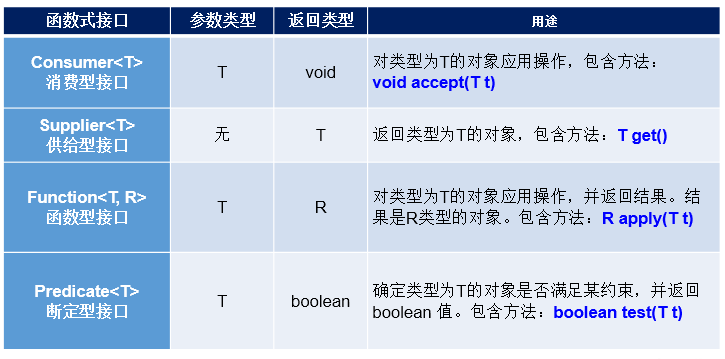

# 1，java

## 容易遗忘

- static修饰的成员变量，在[类加载](https://so.csdn.net/so/search?q=类加载&spm=1001.2101.3001.7020)时会被分配到数据区的方法区。没被static修饰，保存在堆内存中，局部变量保存在栈内存中
- 多态：父类类型 变量名=new 子类类型(); 

## 重载和重写

- 重载：在一个类中，方法名相同，参数列表不同，**返回值和访问权限可以不同**（也可以相同）

- 重写：子类重写父类的方法，

  - 方法名和参数列表必须相同，返回值类型相同，也可以是返回值的子类

  - 抛出异常小于等于父 类，访问权限大于等于父类

  - 如果父类方法访问修饰符为 `private/final/static` 则子类就不能重写该方法，但是被 `static` 修饰的方法能够被再次声明。

    - **static方法不参与继承，也不参与序列化**，父类有static修饰的方法，则子类可以调用，也可以声明一个static修饰的一样的方法。

    - ```Java
      class A{
        public static void a(){
        	System.out.println("a");
        }
      }
      
      class B extends A{
        public static void a(){
        	System.out.println("b");
        }
      }
      ```
    
      

    - 调用时，只看是哪个类调用。若是A调用，则输出’a‘,若是B调用，则输出’b‘。static修饰的方法属于类，与对象无关。


## 接⼝和抽象类的区别是什么？

- 相同点：
  - 接口和抽象类都不能实例化，只能被继承/实现
  - 都可以包含抽象方法，等待继承类重写该方法
  - 都可以有默认实现的方法（Java 8 可以用 `default` 关键字在接口中定义默认方法）。
- 不同点：
  - 抽象类可以有普通方法的实现，接口不是实现
  - 抽象类成员变量可以是多种，接口的成员变量必须是 **public static final** ，必须赋值，没有默认值
  - 抽象类可以有构造器，接口没有。而且可以有初始化代码块，接口没有
  - 接口可以实现多个，类只能继承一个

**抽象类的使用场景**：

描述一类事物的时候，发现该事物确实存在着某种行为，但是目前该行为是不具体的，那么这时候我们应该抽取该方法的声明，不去实现该方法，这时候我们应该使用抽象类。eg:所有的接口都默认有abstract修饰，即都是抽象的。

- 既需要统一的接口，有需要实例变量或缺省的方法的情况下就使用它


**接口的使用场景：**

- 类与类之间需要特定的接口进行协调，方法的实现可以是多样的
- 需要将一组类事务单一的类，该一组类都实现了该功能，可能效果不相同


**接口主要用于对类的行为进行约束，你实现了某个接口就具有了对应的行为。抽象类主要用于代码复用，强调的是所属关系。**

接口和抽象类的选择？

用于规定共有属性选择抽象类，只规定方法，则选择接口

## float和double有什么区别

- **单精度**，也即float，一般在计算机中存储占用4字节，也32位，有效位数为7位；
- **双精度**（double）在计算机中存储占用8字节，64位，有效位数为16位。

float有效位（准确位）是6位，double是15位


- 范围

  - float的范围为-2^128 ~ +2^128，也即-3.40E+38 ~ +3.40E+38；double的范围为-2^1024 ~ +2^1024，也即-1.79E+308 ~ +1.79E+308。

  - **float的指数位有8位，而double的指数位有11位**，分布如下：

    float：

    1bit（符号位） 8bits（指数位） 23bits（尾数位）

    double：

    1bit（符号位） 11bits（指数位） 52bits（尾数位）

    于是，float的指数范围为-127~+128，而double的指数范围为-1023~+1024，并且指数位是按补码的形式来划分的。

- 有效精度

  - float：2^23 = 8388608，一共七位，这意味着最多能有7位[有效数字](https://www.baidu.com/s?wd=有效数字&tn=SE_PcZhidaonwhc_ngpagmjz&rsv_dl=gh_pc_zhidao)，但绝对能保证的为6位，也即float的精度为6~7位[有效数字](https://www.baidu.com/s?wd=有效数字&tn=SE_PcZhidaonwhc_ngpagmjz&rsv_dl=gh_pc_zhidao)；
  - double：2^52 = 4503599627370496，一共16位，同理，double的精度为15~16位。

- 空间

  - 单精度浮点数在机内占4个字节，用32位二进制描述。
  - 双精度浮点数在机内占8个字节，用64位二进制描述。


## a=a+b与a+=b有什么区别吗?

- **+= 操作符将加操作的结果类型强制转换为持有结果的类型**
- a=a+b则不会自动进行类型转换


**为什么两个short类型相加会自动提升为int？**

与jvm指令集有关，较小的数据类型基本只用于数组，为较小的类型引入专门的计算逻辑不值得，所以全部转换为int


## 1.2 一个Java文件里可以有多个类吗（不含内部类）？

一个java文件中可以定义多个类，但是最多只有一个类被public修饰，并且这个类的类名与文件名必须相同，


## 单例设计模式

饿汉式单例设计模式:

先创建出对象，什么时候调用方法，则返回该对象，但会出现一直占用内存的问题。因为类加载则创建对象。一直在内存中，等待调用

```
class Bank{
    //私有化构造器
    private Bank(){}
    //内部创建私有化类对象
    private static Bank instance = new Bank();
    //静态方法只能调用静态属性，单例设计模式只能获取一个对象
    //即使多次调用该静态方法，返回一个对象
    public static Bank getBank(){
        return instance;
    }
}
```

懒汉式设计模式：

什么时候调用，则再加载，但会出现线程安全问题（可能同时调用getBank，则可能会出现创建两个Bank对象，不满足单例设计模式的要求）。

不止是考虑线程安全的问题，还要考虑jvm中的指令重排

```
public final class Singleton {
  private Singleton() { }
  private volatile static Singleton INSTANCE = null;
  public static Singleton getInstance() {
    // 实例没创建，才会进入内部的 synchronized代码块
    if (INSTANCE == null) {      
      synchronized (Singleton.class) {
        // 也许有其它线程已经创建实例，所以再判断一次
        if (INSTANCE == null) {
          INSTANCE = new Singleton();
       }
     }
   }
    return INSTANCE;
}
}
```

## 如何打破单例设计模式

- 克隆
- 反射
- 反序列化


## Java创建对象的几种方式：

1. new 对象
2. 通过反射创建对象
3. clone()方法创建对象
4. 反序列化创建对象（反序列化也是创建一个新对象）
   1. **将创建一个新的对象，并将序列化流中的信息保存在新对象中**

## 反射获取对象class的三种方式

- 对象.getClass
- 类.class
- Class.forName("类名");

**反射创建类对象主要有两种方式：**

- Class的newInstance()
- Constructor的newInstance()

## PriorityQueue是否真正有序

```
public class A {
    public static void main(String[] args) {
        //设置队列的初始长度为10
        PriorityQueue<Integer> queue = new PriorityQueue<>(10);
        //入队
        for(int i=10;i>=5;i--)
            queue.offer(i);
        //遍历元素
        for(Integer i:queue)
            System.out.print(i+" ");
    }
}
//输出结果：5 7 6 10 8 9

```

PriorityQueue的底层是object数组通过最小堆实现有序输出。数组并不是有序的。所以最小堆，只能实现根节点为最小值，并不能保证它的左右节点谁大谁小。也就是说PriorityQueue内部的数据是无序的。**每次从队列中取出的是具有最高优先权的元素而已。**

最大堆：根结点的键值是所有堆结点键值中最大者。

最小堆：根结点的键值是所有堆结点键值中最小者。

注意：维护最小堆时，实际上会将最小的元素放在数组[0]位置，


## **~~三种权限修饰符**public，protected，private~~

- ~~public，表示所有其他类都可以访问。~~
- ~~protected，当前类或子类可以访问，同时相同包内的其他类也可以访问protected成员；~~
- ~~default，默认（没有修饰符）：表示本包内可以使用。（子类不能访问父类的default修饰的变量和方法，前提是不在同一个包下）~~
- ~~private，表示的是在本类内可以使用；~~

## final、finally、finalize区别

- **final**
  - final修饰类，方法，变量，final关键字提高性能。
  - 修饰类：不能被继承，类中的所有方法不能重写（不能继承当然不能重写），但类内可以重载，不能abstract和final同时修饰类。（abstract类就是为了被继承，final不能被继承，两个作用相反）
  - 修饰方法：不能被重写，但子类可以调用该方法
  - 修饰变量：该变量不可变，而且不能使用默认值，需要赋值。若是基本数据类型则是值不变，若是引用数据类型，则地址不变，对象属性可变.若是基本数据类型，在编译时就赋值
- **Finally**
  - try-catch中使用。一般用于释放连接，关闭IO流，释放锁
    - （return在jvm中赋值一个变量值，所以try和finally中的return会进行覆盖）
  - **finally与return的关系：**不建议在finally中写入return
    - **try中有return，finally中没有return**
      - 先执行try中return之前的语句->finally中的语句->return 
      - 若finally修改了return中的变量，若基本数据类型，则不会改变，若引用类型，则改变
    - **try和finally中均有return**
      - try代码块中的return会保存到一个变量中，finally中的return会进行覆盖。
      - try代码块->finally代码块。finally中的return会覆盖try中的return
  - **Finalize：**
    - Object 类的一个方法，GC准备释放时，可以调用一次Finalize（）方法进行自救。存活过这次GC。
    - 为什么要有Finalize（）这个方法呢？
      - Finalize（）方法一般用于释放非Java资源（文件资源，数据库连接），或是释放调用native方法时分配的内存。

## 深拷贝和浅拷贝区别了解吗

拷贝都需要实现Cloneable接口，重写clone方法。

- 都会创建一个新的对象，区别在于该对象中的引用对象，与原对象是相同的地址值还是也 拷贝了


## 泛型擦除

泛型：**编译器可以对泛型参数进行检测，并且通过泛型变量限定类型**

Java的泛型是伪泛型，在编译期间，所有的泛型信息都会被擦掉。

**通过反射添加其它类型元素**，当我们利用反射调用`add()`方法的时候，却可以存储字符串，这说明了`Integer`泛型实例在编译之后被擦除掉了，只保留了原始类型。

```
    public static void main(String[] args) throws Exception {

        ArrayList<Integer> list = new ArrayList<Integer>();

        list.add(1);  //这样调用 add 方法只能存储整形，因为泛型类型的实例为 Integer

        list.getClass().getMethod("add", Object.class).invoke(list, "asd");

        for (int i = 0; i < list.size(); i++) {
            System.out.println(list.get(i));
        }
    }
```

- **问题：** 既然说类型变量会在编译的时候擦除掉，那为什么我们往 ArrayList 创建的对象中添加整数会报错呢？不是说泛型变量String会在编译的时候变为Object类型吗？为什么不能存别的类型呢？
- 关于泛型变量的使用，是会在编译之前检查的。Java编译器是**先检查代码中泛型的类型，然后在进行类型擦除，再进行编译**。

## Stack和Heap的区别

栈(stack)与堆(heap)都是Java用来在Ram中存放数据的地方。java自动管理栈和堆。

- 堆：创建新对象和数组在堆中分配内存，只有被垃圾回收后才能释放内存
- 栈：包括虚拟机栈和本地方法栈，执行方法的地方，每执行一个方法，在栈中压入栈帧，执行结束，弹出栈帧。栈帧中包含，局部变量表，操作数栈，动态链接，方法返回地址。 
- 栈的存储效率高于堆，而且共享存储数据，但是其中数据的大小和生存期必须在运行前确定
- heap是运行时动态 分配的数据区，从速度看比stack慢，但heap中的数据不共享，大小和生产期都可以在运行时确定。


- 物理地址
  - 堆的物理地址分配对对象是不连续的。因此性能慢些。在GC的时候也要考虑到不连续的分配，所以有各种算法。比如，标记-消除，复制，标记-整理，分代（即新生代使用复制算法，老年代使用标记——压缩）
  - 栈使用的是数据结构中的栈，先进后出的原则，物理地址分配是连续的。所以性能快。
- 内存分别
  - 堆因为是不连续的，所以分配的内存是在运行期确认的，因此大小不固定。一般堆大小远远大于栈。
  - 栈是连续的，所以分配的内存大小要在编译期就确认，大小是固定的。
- 存放的内容
  - 堆存放的是对象的实例和数组。因此该区更关注的是数据的存储
  - 栈存放：局部变量，操作数栈，返回结果。该区更关注的是程序方法的执行。

PS：

1. 静态变量放在方法区
2. 静态的对象还是放在堆。

- **程序的可见度**
  - 堆对于整个应用程序都是共享、可见的。
  - 栈只对于线程是可见的。所以也是线程私有。他的生命周期和线程相同。


## 如何防止一个类被实例化

- 方法1：将该类定义成抽象类 这种方式虽然能避免该类不能被创建实例，但是他的子类可以创建对象
- 方法2：将该类的构造方法私有化 这种方式正常情况下，不能new对象，但是，可以通过java反射，来创建对象，所以该方式也不可行
- 方式3：在方法2的基础上，在私有构造方法中，抛出异常


## 线程池execute和submit的区别

- execute只能提交Runnable类型的任务，无返回值。submit既可以提交Runnable类型的任务，也可以提交Callable类型的任务，会有一个类型为Future的返回值，但当任务类型为Runnable时，返回值为null。
- execute在执行任务时，如果遇到异常会直接抛出，而submit不会直接抛出，只有在使用Future的get方法获取返回值时，才会抛出异常。

## 内部类有几种

- 静态内部类（在类中，用static修饰）
- 成员内部类（在类中）
- 局部内部类（在方法中，写class）
- 匿名内部类
  - 匿名内部类必须继承一个抽象类或者实现一个接口。
  - 匿名内部类不能定义任何静态成员和静态方法。
  - 当所在的方法的形参需要被匿名内部类使用时，必须声明为 final。
  - 匿名内部类不能是抽象的，它必须要实现继承的类或者实现的接口的所有抽象方法。

 


## Debug原理

在【java】里，有JVM的存在，可以省好多事，分三层

1.JVMTI【虚拟机接口，jvm提供 native修饰】，底层

2.JDWP【虚拟机传输协议，格式】，中间传输

3.JDI【程序调试接口，java编写】，发送指令控制接口

我个人理解是，把水流切断，处理，再放回去，对执行透明，比较像面向切面编程

**我们每次在IDE里进行代码调试时，实质上是通过IDE里的debugger这个界面执行GUI操作，然后通过JDI发送数据到JDWP，再经过JVMTI最终实现程序的高度。**

调试者（debugger）和被调试者（Target JVM），以及它们的交互通道。图2展示了三者的相互关系。


https://blog.csdn.net/qq_36838191/article/details/85551836

## 反射实现原理

- 创建对象 
  - 第一步：首先调用了 java.lang.Class 的静态方法，获取类信息
    - 主要是先获取 ClassLoader, 然后调用 native方法，获取信息。
    - class类信息获取到之后开始实例化，有两种（一：无参构造函数，二：有参构造函数）
  - 第二步（无参构造函数）： 调用 newInstance() 的实现方式
    - 权限检测，如果不通过直接抛出异常； 查找无参构造器，并将其缓存起来； 调用具体方法的无参构造方法，生成实例并返回
  - 第二步（有参构造函数）：获取所有的构造器主要步骤
    - 先尝试从缓存中获取 如果缓存没有，则从jvm中重新获取，并存入缓存，缓存使用软引用进行保存，保证内存可用 jvm获取 — getConstructor0() 为获取匹配的构造方器 先获取所有的constructors, 然后通过进行参数类型比较 找到匹配后，通过 ReflectionFactory copy一份constructor返回 否则抛出 NoSuchMethodException;
- 方法调用：
  - 第一步，先获取 Method 获取所有方法列表（获取所有构造器的方法很相似，都是先从缓存中获取方法，如果没有，则从jvm中获取） 根据方法名称和方法列表，选出符合要求的方法 如果没有找到相应方法，抛出异常，否则返回对应方法
  - 第二步，根据方法名和参数类型过滤指定方法返回（最优匹配或者精准匹配）
  - 第三步，调用 method.invoke() 方法 跟踪底层源码发现Method的invoke方法，是由本地方法invoke0决定的。

## 反射的原理

**Java的反射机制允许我们运行时动态地调用某个对象的方法、新建对象实例、获取对象的属性等。**

java语言实现反射的方法除了**本地实现**之外，还会采用**动态生成字节码的方式直接调用目标方法**，运用委派模式的目的就是在本地实现和动态实现之间进行切换。

动态实现和本地实现相比，其运行效率是本地实现的20倍左右，但是第一次生成字节码是比较耗时的，所以仅单次调用的话，本地实现的性能反而是动态实现的3到4倍。JVM通过参数**-Dsun.reflect.inflationThresHold**来进行调整，默认是15次，即前15次调用会使用本地实现，15次之后会生成字节码，采用动态实现的方式。

**反射的核心是通过类加载在内存中类实例的指针找到对应的方法区结构，进而获取变量和执行方法**

- Method.invoke（）委派给MethodAccessor来处理。具体有两种实现，委托实现和本地实现。
- 接下来看下获取MethodAccessor实现方法，首先检查是否已经创建，如果创建了就使用创建的，如果没有创建就调用工厂方法创建一个
- 看下反射工厂的newMethodAccessor 方法，从下面可以看到先是检查初始化，然后判断是否开启动态代理实现，如果开启了就会使用动态实现方式（直接生成字节码方式），如果没有开启就会生成一个委派实现，委派实现的具体实现是使用本地实现来完成。
- 看到这里可能会有一个疑问，为什么使用委派实现穿插在中间，这是因为Java反射实现机制还有一种动态生成字节码，通过invoke指令直接调用目标的方法，委派实现是为了在动态实现和本地实现之间进行切换。

动态实现和本地实现相比，执行速度要快上20倍，这是因为动态实现直接执行字节码，不用从java到c++ 再到java 的转换，但是因为生成字节码的操作比较耗费时间，所以如果仅一次调用的话反而是本地时间快3到4倍。

为了防止很多反射调用只调用一次，java 虚拟机设置了一个阀值等于15（通过-Dsun.reflect.inflationThreshold 参数来调整），当一个反射调用次数达到15次时，委派实现的委派对象由本地实现转换为动态实现，这个过程称之为Inflation。

反射调用的Inflation机制可以通过参数（**-Dsun.reflect.noInflation=true**）来关闭（对应代码是newMethodAccessor 方法中的if 判断）。这样在反射调用开始的时候就会直接使用动态实现，而不会使用委派实现或者本地实现。

## 丢失精度问题

double x = 0.3 x*3==0.9?   不等于，为什么

- **原因在于**我们的计算机是二进制的。浮点数没有办法使用二进制进行精确表示。

  计算机的 CPU 表示浮点数由两个部分组成：指数和尾数，这样的表示方法一般都会失去一定的精确度，有些浮点数运算也会产生一定的误差。

  浮点运算很少是精确的，只要是超过精度能表示的范围就会产生误差。往往产生误差不是因为数的大小，而是因为数的精度。因此，产生的结果接近但不等于想要的结果。尤其在使用 float 和 double 作精确运算的时候要特别小心。

- 你计算金额用什么方式？  BigDecimal  ，**还可以在原来的计算精度上，分对应的位数，乘1000。变成整数进行计算。输出最后结果时再除以该值，以保存精度。** 使用BigDecimal(double val)构造函数时仍会存在精度丢失问题，建议使用BigDecimal(String val)。

## 序列化的种类

- Serializable

  - 接口的序列化，除了对象的数据以外，还是包含有这个对象的类信息的
  - 缺点：占用空间大，性能差
  - 优点：只有可以一键还原将序列化的数据直接还原为一个Object，不需要告知还原的类型

- JSON，fastJSON

  - **轻量级，没有多余的数据。**

    **与语言无关，所以能兼容所有平台语言。**

    **易读性，易解析。**


## java8 新特性

- Lambda表达式：Lambda表达式的本质：作为函数式接口的实例
- 函数式接口：
  - 在一个接口中，只声明了一个抽象方法，该接口即函数接口
  - 我们自己定义函数式接口的时候，@Functionallnterface是可以选的，就算我们不写这个注解，只要保证满足函数式接口定义的条件，也照样是函数式接口。但是，建议加上该注解
  - 


## JDK8之后版本，大更新

- **JDK9**

  - 接口私有方法：支持接口定义私有方法

- **JDK11**

  - HTTP Client API标准化 支持http2.0的客户端
  - ZGC垃圾回收器
  - 单文件源码运行
    - java解释器直接执行java代码，源码在内存中生成，无需在磁盘生成.class文件
  - 字符串增强：isBlank()、stripLeading 去除头部空格、stripTrailing 去除尾部空格

- **JDK14**

  - **`switch` 表达式 (标准化)**：简化 switch 语法，进行了增强，支持Lambda表达式
  - Record类型：在枚举、接口、类新增了Record类型，不可变类，自带toString、hashCode、equals，全参构造器等

- **JDK16**

  - 模式匹配增强 **`instanceof`**：instanceof 判断类型正确后，直接转换为该类型，无需手动转换

- **JDK17**

  - **Switch 模式匹配 (预览)**：支持类型匹配

- **JDK21**

  - 支持虚拟线程：轻量级线程，支持百万级并发

  

​	

# 集合

## ArrayList

- `ArrayList` 的底层是数组队列，相当于动态数组
- 支持**快速随机访问**的。在 `ArrayList` 中，我们即可以通过元素的序号快速获取元素对象，这就是快速随机访问。
- **内存空间占用：** `ArrayList` 的空 间浪费主要体现在在 list 列表的结尾会预留一定的容量空间
- 线程不安全
- 扩容方面
  - jdk1.6以后改的，（1.6还没有改）**以无参数构造方法创建 `ArrayList` 时，实际上初始化赋值的是一个空数组。当真正对数组进行添加元素操作时，才真正分配容量。即向数组中添加第一个元素时，数组容量扩为 10。**
  - **ArrayList 每次扩容之后容量都会变为原来的 1.5 倍左右**
  - 没有扩容因子，只有在插入数据发现没有空间时会进行扩容


## List 多线程下如何保证List的线程安全

- Vertor 队列 底层使用synchronized 

- Collections类的synchronizedList()方法，传入参数为普通的Arraylist

  - 使用set、add以及remove都是使用synchronized加锁机制执行的

- JUC下的CopyOnWriteArrayList方法,底层采用写入时复制

  - 原理是添加元素的时候首先会给原数组加锁，之后取原数组的长度，然后在此基础上复制一份并把长度+1，然后再把原数组的元素添加到新数组，然后再解锁，做到了线程安全，使用ReentrantLock加锁。但是在get方法是不加锁的，所以执行效率会比较高。

    


## PriorityQueue

- `PriorityQueue` 是在 JDK1.5 中被引入的, 其与 `Queue` 的区别在于元素出队顺序是与优先级相关的，即总是优先级最高的元素先出队。
- **PriorityQueue底层是数组，而且不是有序的，PriorityQueue仅仅是维护了一个最小堆，使优先级最高的元素出队，并没有对数据进行sort操作**

## 在使用 HashMap 的时候，用 String 做 key 有什么好处？

HashMap 内部实现是通过 key 的 hashcode 来确定 value 的存储位置，因为字符串是不可变的，所以当创建字符串时，它的 hashcode 被缓存下来，不需要再次计算，所以相比于其他对象更快。

## HashMap如何扩容

用文字来叙述下HashMap扩容的过程:

- 如果table == null, 则为HashMap的初始化, 生成空table返回即可;
- 如果table不为空, 需要重新计算table的长度, newLength = oldLength << 1(注, 如果原oldLength已经到了上限, 则newLength = oldLength);
- 遍历oldTable:
  - 首节点为空, 本次循环结束;
  - 无后续节点, 重新计算hash位, 本次循环结束;
  - 当前是红黑树, 走红黑树的重定位;
  - 当前是链表, JAVA7时还需要重新计算hash位, 但是JAVA8做了优化, **通过(e.hash & oldCap) == 0来判断是否需要移位; 如果为真则在原位不动, 否则则需要移动到当前hash槽位 + oldCap的位置**

计算新索引的位置（e.hash & oldCap） 关于e.hash & oldCap == 0 的讲解在之前的HashMap底层原理概要笔记和上面的代码注释中已经说过了，这里再结合图详细说一下。

为什么是e.hash & oldCap 来确定在新数组中的索引位置呢，因为在put 的时候 (n - 1) & hash 得到索引位置

举个例子，扩容前 table 的容量n为16，a 节点和 b 节点在扩容前处于同一索引位置


 扩容后，table 长度n为32，新表的 n - 1 只比老表的 n - 1 在高位多了一个1（图中标红的1）。

                                                                                                                                                      

 因为 2 个节点在老表是同一个索引位置，因此计算新表的索引位置时，只取决于新表在高位多出来的这一位（图中标红1），而这一位的值刚好等于 oldCap。

因此会存在两种情况：

(e.hash & oldCap) == 0 ，则新表索引位置为“原索引位置” ； (e.hash & oldCap) != 0，则新表索引位置为”原索引 + oldCap 位置”。

## HashMap红黑树的阈值为什么是8？

在负载因子0.75（HashMap默认）的情况下，单个hash槽内元素个数为8的概率小于百万分之一，

那么这个时候说明由于元素本身和hash函数的原因，此次操作的hash碰撞的可能性非常大了，后序可能还会继续发生hash碰撞。所以，这个时候，就应该将链表转换为红黑树了

## HashMap生成红黑树后，如果删除元素，会退化为链表吗？

- 扩容 resize( ) 时，红黑树拆分成的 树的结点数小于等于临界值6个，则退化成链表。
- 移除元素 remove( ) 时，在removeTreeNode( ) 方法会检查红黑树是否满足退化条件，与结点数无关。如果红黑树根 root 为空，或者 root 的左子树/右子树为空，root.left.left 根的左子树的左子树为空，都会发生红黑树退化成链表。


## HashMap如何将传入的容量数值转换为相近的2次幂

https://www.cnblogs.com/xiyixiaodao/p/14483876.html

源码，调用了tableSizeFor（）方法，**对任意十进制数转换为2的整数幂，结果是这个数本身的最高有效位的前一位变成1，最高有效位以及其后的位都变为0**。

```
    /**
     * Returns a power of two size for the given target capacity.
     */
    static final int tableSizeFor(int cap) {
        int n = cap - 1;
        n |= n >>> 1;
        n |= n >>> 2;
        n |= n >>> 4;
        n |= n >>> 8;
        n |= n >>> 16;
        return (n < 0) ? 1 : (n >= MAXIMUM_CAPACITY) ? MAXIMUM_CAPACITY : n + 1;
    }

```

**核心思想：**

**先将最高有效位以及其后的位都变为1，最后再+1，则进位到2的整数幂。**效率很高

**初始容量-1**： 为了避免给定容量的8,16这种已经是2次幂的数值，在转换后与原给定数值大。

n数值，最高位虽然不清楚在哪，但一定为1。**先移位，再与最高位的1或运算。**


右移一位，再或运算，就有两位变为1；

右移两位，再或运算，就有四位变为1，

最后右移16位再或运算，保证32位的int类型整数最高有效位之后的位都能变为1.


## ArrayList如何保证线程安全

- 自己手动加锁
- 使用Collections工具类进行操作:List objects = Collections.synchronizedList(new ArrayList<>());这个ArrayList的操作方式是线程安全的。
- CopyOnWriteArrayList<>();也是线程安全的ArrayList