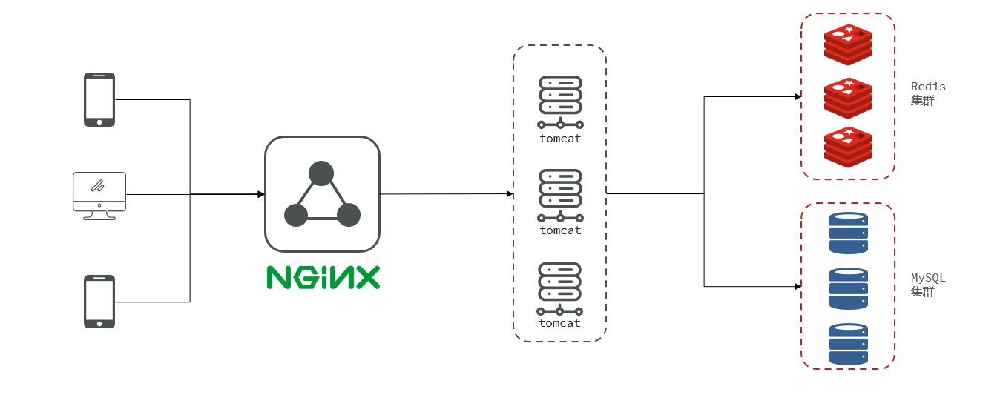
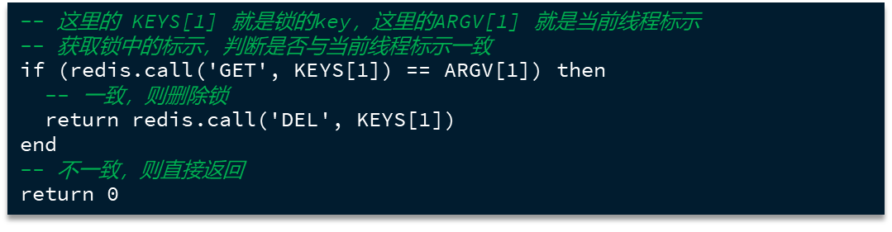
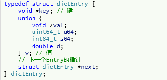
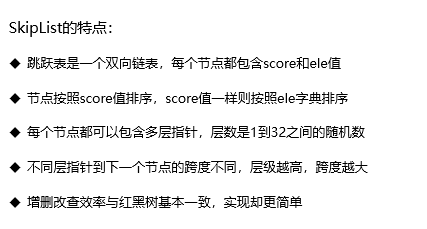

# Redis

## Redis单线程为什么这么快？

Redis是单线程还是多线程？

- 若是核心业务，命令处理部分，是单线程
- 要是整个redis，则是多线程 （网络 I/O，处理大量的请求时）

**原因**

- 基于内存操作，CPU不是Redis的性能瓶颈，Redis的瓶颈是根据机器的内存大小和网络带宽
- 核心是基于IO多路复用机制
- 单线程反而避免了多线程频繁上下文切换带来的性能问题
- 多线程会面临线程安全问题，使得复杂度增高


Redis基于Recator模式开发了网络事件处理器，文件事件处理器。。因为事件处理器是单线程的，所以redis才叫做**单线程的模型**。

文件事件处理器包括：

- 多个Socket
- IO多路复用程序
- 文件事件分派器
- 事件处理器

**单线程处理流程：**Socket（套接字，接收请求）

多个Socket可能并发的产生不同的事件，IO多路复用会监听多个Socket，有事件发生，字符将Socket加入到队列中排队。每次队列有序，同步从队列中取出Socket给事件分派器，事件分派器把Socket交给对应的事件处理器。然后事件处理器执行完，IO多路复用会将队列中下一个Socket给事件分派器。

- 接收请求是多线程的，基于IO多路复用监听
- **执行完命令，会将结果写入缓冲区，命令回复器回复命令也是多线程的，从缓冲区取结果返回**


**单线程模型的缺点**

1. CPU利用不足，无法充分利用多核机器，受限于单个CPU核的处理能力
2. 大key，或者慢查询，会阻塞进而影响所有客户端


## Redis各种命令时间复杂度一览表

https://blog.csdn.net/qq_23564667/article/details/110917900

## 为什么要用Redis而不直接用Map做缓存?

1、Redis 可以用几十 G 内存来做缓存，Map 不行，一般 JVM也就分几个 G 数据就够大了

2、Redis 的缓存可以持久化，Map 是内存对象，程序一重启数据就没了

3、Redis 可以实现分布式的缓存，【多个微服务机器可共享】，Map 只能存在创建它的程序里

4、Redis 单点吞吐量能达到10万级，是专业的缓存服务，Map 只是一个普通的对象

5、Redis 缓存有过期机制，Map 本身无此功能

6、Redis 有丰富的 API，Map 就简单太多了

## Redis事务

- **Redis 事务提供了一种将多个命令请求打包的功能。然后，再按顺序执行打包的所有命令，并且不会被中途打断。**
- **redis不支持回滚，所以不支持原子性**（又是基于内存操作，不支持持久性或者说持久化性能不足）
- 通过4个指令完成事务
  - `MULTI` 开始事务。Redis 不会立即执行这些命令，而是将它们放到队列，当调用了 `EXEC`命令将执行所有命令。
  - `EXEC` 执行事务
  - `DISCARD` 取消该事务 
  - `WATCH` 监听指定的键，当调用 `EXEC` 命令执行事务时，如果一个被 `WATCH` 命令监视的键被修改的话，整个事务都不会执行，直接返回失败。**先watch后multi，否则无效。**

若事务中某一行执行错误，不影响其他行的执行

## 数据库如何与Redis数据保持一致性

数据库刷新Redis数据时，发MQ。可能存在频繁更新，MQ刷库乱序的问题

更新数据时：

前提：该表有版本号，每次更新变更版本号。

- 使用redis事务
  1. watch key 监控需要变更的key
  2. **查询Redis中的数据是否超过了 本次更新的版本号 若否则继续执行下去**
  3. mutli  开启事务
  4. set & exec

- 使用lua脚本
  - 事务多次IO操作，性能差


## ~~1，项目注意点~~

- 请求用户信息时，不能返回用户所有的信息，只封装用户需要的信息。（不能说请求用户名，把用户所有信息，用户名，id，密码都返回这是不应该的）
  - 解决方法：DTO类与TO类相仿，只保存请求相关的信息




## ~~2，redis解决分布式场景Session共享~~

- 将之前保存在session中的value信息保存在redis。key保存在cookie中
- 拦截器功能：拦截需要登录的功能，判断用户是否登录，若登录，更新redis的登录用户的过期时间。**避免因为用户一直操作却自动下线的功能**
- **登录拦截器优化**（用处不大，因为很多页面都会进行登录校验，因为登录和未登录显示界面不同）
  - 拦截器拦截，进行登录验证。若用户登录，但只请求不需要拦截的网址。则拦截器失效。另外redis的过期时间也无法更新
  - **解决方法：**
    - 再设置一个拦截器，
    - 拦截器1，所有请求均会通过，若已登录，获取用户登录信息，并更新过期时间
    - 拦截器2，判断当前请求是否为需要登录的请求，若是且未登录拦截。

## redis作为缓存缓存一致性问题

将用户数据保存到redis，获取数据时先在redis中获取，若没有则数据库获取，并保存到redis。

- redis自带内存淘汰机制。在内存不足时随机淘汰数据


主动更新缓存和数据库来保证高一致性。更新缓存都会设置过期时间

缓存与数据库保持一致性的方式是多种的，需要根据业务进行区分。大体分为强一致和延迟一致的情况。

**以下为强一致的情况。**

- ### 更新操作是更新缓存还是删除缓存

  - 更新缓存：每次更新数据库都要更新缓存，无效写操作太多
  - **删除缓存：**更新数据库时缓存失效，查询缓存时再更新缓存

- ### 如何保证缓存与数据库操作的同时失败与成功，保证原子性

  - 单体系统，将缓存与数据库放在一个事务中
  - 分布式系统，利用AT，TCC等分布式事务方案

- ### 更新操作的强一致性

  - 先删缓存，再操作数据库（存在线程安全问题，概率高，因为操作数据库慢，更新缓存快）
    - 线程1先删缓存，此时线程1并未将新值保存到数据库。线程2进来查询缓存查不到，查询数据库（旧值），并写入缓存（旧值），此时线程1更新数据库（新值）   **缓存数据库不一致**
    - 
  - **先操作数据库，再删缓存**（也存在线程安全问题，但概率低，1，查询该缓存刚好失效，2，且其他线程更新此数据，最后3，线程1慢于线程2（操作缓存慢于操作数据库））
    - 线程1查询缓存，此时缓存失效，从数据库中查（旧值），此时线程2更新数据库（新值），并删除redis中的缓存。线程1此时更新缓存（旧值）
    - 
  - **延时双删：写数据时，先删缓存，更新完数据库后，延时一段时间，再删一次缓存。为啥需要延迟呢？因为数据库主从同步存在延迟，等数据同步完成后再删缓存**，时间不好把控，（此处使用binlog是合理的）
    - 缺点：仍可能存在短时间的不一致，不适用于实时性要求极高的场景；第二次可能失败需要额外处理
  
- **为保证更新操作的强一致性，可以使用读写锁。读操作使用读锁，写操作使用写锁。保证了数据的强一致性。（分布式场景下，需使用Redis实现读写锁）。**

- **特点：保证了数据的强一致性，但性能差**


**更新操作的延迟一致**

该情况是主流的同步方式

- MQ 异步刷
- 接binlog消息，同步Es和Redis  （京东有binlake，阿里有canal：模拟为数据库的一个从节点，监听数据库消息，执行相应操作）


延迟双删的场景：

先更新数据库，再删缓存仍可能出现长期不一致的情况，为了避免这种情况则出现了延迟双删。延迟双删适合**读多写少的场景**。“**先更新数据库→删除缓存→延迟→再删缓存**”（策略 B）比 “先删缓存→更新数据库→延迟→再删缓存”（策略 A）更好，因为它从根源上规避了 “间隙期脏写”，一致性更可靠，且与标准缓存模式兼容，复杂度低。


## 高并发情况下的缓存失效问题

### 缓存穿透

- 客户端恶意发送请求查询缓存数据库都不存在的空值，redis没有则从数据库中查询，查询压力落在数据库。
- **解决方法**
  - 缓存空对象，设置短期的过期时间
    - 优点：实现简单，维护方便
    - 缺点：
      额外的内存消耗（需要redis保存空值，可以设置过期时间来解决）
      可能造成短期的不一致（此时redis保存空值，但数据库添加了该数据库，则造成了不一致）
  - 布隆过滤
    - 先查询布隆过滤器，若存在，再查redis、最后查数据库
    - 原理：https://www.cnblogs.com/wangwust/p/9467720.html
      - **布隆过滤器说某个元素存在，小概率会误判。布隆过滤器说某个元素不在，那么这个元素一定不在。**
      - 内部维护一个全为0的bit数组，和多个hash计算函数
      - 输入数据时，每个hash函数计算，并将每个结果值对应的数组位置置为1.
      - 验证数据时，依然每个hash函数计算，若每个结果对应的数组位置为1，则认为存在。
      - 数组越长，所占空间越大，误判率越低  guava有具体实现，可以指定特定的布隆过滤器。
      
        - ```java
           BloomFilter<Integer> bloomFilter =BloomFilter.create(Funnels.integerFunnel(), size);
          ```
      
          

### 缓存雪崩

- 同一个时段，大量的缓存key同时失效，或者redis宕机，则所有的请求打到数据库，数据库压力过大
- 解决方法：
  - 给不同的key的过期时间添加随机值
  - redis集群提高服务的可用性（防止redis宕机）
  - 对缓存业务进行降级限流

### 缓存击穿

- 热点key：高并发访问并且缓存重建业务复杂。这个key失效，则无数请求瞬间落在数据库。
  - 某个热点key过期，大量请求访问到数据库

- 解决方法：（两种方案无关乎谁好谁差，根据不同的业务场景，选择不同的方案）
  - **加互斥锁**，可以使用分布式锁（互斥更新是指热点key失效，多个请求只有一个请求更新，其他请求等待）【强一致，性能差】
    - 不能在方法上加锁（与单例设计模式类似），否则没有过期时由于互斥锁而导致请求过慢
      - 只能在请求数据库时加锁。
  - **逻辑过期** 【性能好，高可用】
    - 在redis中保存一个逻辑过期时间（可以理解为一个数值，并不是真正的过期时间）
      - value为一个类对象，对象{过期时间，值信息}
    - 线程1请求，发现逻辑过期，则获取互斥锁，并创建一个子线程，查询数据库对缓存中的数据更新。线程1创建完线程后直接返回旧数据。若此时其他线程也获取该数据，发现逻辑过期，并获取不到锁，则返回旧数据。
    - 

## 4，Redis秒杀

生成唯一性ID，作为订单ID

- **超卖问题**
  - 线程1查询库存，线程2查询库存，线程1判断是否有库存，有则下单成功（只有一个商品）。线程2判断有库存（依然是只有一个商品）下单成功。导致超卖
  - 使用乐观锁，
    - **所以下单时，先减库存，再下订单**，下订单过程已经释放锁。
      - 减库存时，判断是否有库存。**需要库存-1操作并且判读是否还有库存（利用数据库的原子性）。**本质为CAS，即更新操作时判断是否还有库存，若没有则下单失败。
      - 降低占用锁的时间。
    - **问题：**有可能会出现200个请求抢100个商品，由于CAS，只能有一个线程进行下单，导致其他线程请求失败，（请求只请求了一次）。虽然没有超卖，但造成了可能只有15个人抢到了商品，85个商品没卖出。
    - 可以设置并发，将信号量设置为货物量，每次购买中减少信号量个数。
  - 实现一人一单
    - 需要确保一个用户只能秒杀一次，加悲观锁。（不能用CAS，因为先减库存，涉及不到用户信息，若CAS，导致减了库存，又发现当前用户已经购买，则再进行回滚）【先判断用户是否购买过】
    - 也可以在redis中保存已经购买的用户信息，下库存时，先判断redis是否保存了该用户信息，若有，则无法不能再次购买
    - 加悲观锁（不建议）**可以设置信号量，信号量为货物量，每次购买中减少信号量个数。避免了加锁的问题**
      - 锁对象为用户ID，注意每次请求都会创建新的对象，导致锁不住。可以toString().intern()。转化成字符串并加入到串池，避免同一时刻多个下单
      - 另外，下单时，会再次验证当前用户是否购买，若已购买，则不能重复下单

超卖问题什么解决？**保证 检验有库存并减库存 为原子操作就可以解决。**

我们将库存数作为Redis该商品的信号量，每次购买成功都会删减信号量，此外，使用乐观锁，解决如下问题【有可能会出现200个请求抢100个商品，由于CAS，只能有一个线程进行下单，导致其他线程请求失败，（请求只请求了一次）。虽然没有超卖，但造成了可能只有15个人抢到了商品，85个商品没卖出】，这个问题的解决是**上述。**

**问题：**有可能会出现200个请求抢100个商品，由于CAS，只能有一个线程进行下单，导致其他线程请求失败，（请求只请求了一次，请求超时，则失效）。虽然没有超卖，但造成了可能只有15个人抢到了商品，85个商品没卖出。

我们将库存数作为Redis该商品的信号量，每次购买成功都会删减信号量，信号量为我们允许的并发数。并且只进行减库存操作，将消息交给消息队列，进行流量削峰，并且降低占用锁的时间。

实现一人一单，下订单时，先检验是不是已经购买过了，若是购买了则不能进行购买。


### 秒杀商品购买

- ## 高并发问题

  - **服务单一职责：**
    将每个功能作为一个微服务进行独立部署
  - **秒杀链接加密：**
    下单链接加上随机码，只有在秒杀活动开启后才能获取
  - **库存预热：**
    提前加入到redis中。信号量控制请求进来的秒杀请求
  - **动静分离，**
    Nginx实现动静分离，静态页面的获取直接在Nginx中获取，不会落到后端服务器上。动态请求来到后端服务器
  - **恶意请求拦截：**
    识别非法攻击请求并进行拦截，网关层面
  - **流量错峰：**
    购买秒杀商品，需要加入购物车才能购买，避免了直接购买而导致的高并发请求。加入购物车，用户的操作的快慢不一致，可以实现流量错峰。
  - **限流&熔断&降级**
  - **队列削峰**

- **秒杀商品购买流程**

  1. 立即抢购商品，发送请求，该商品随机码，秒杀商品号（redis的key），数量
  2. 秒杀微服务：
     1. 获取当前秒杀商品的详细信息
     2. 校验合法性（时间合法性，随机码一致性，购物数量是否合理）**恶意请求拦截，秒杀链接加密：**
     3. 该用户是否购买过该秒杀商品，redis保存临时信息。设置过期时间，过期时间为秒杀活动结束时间【此时已经保存了用户信息】
     4. 生成订单号，对信号量进行扣除（信号量为该秒杀商品的总数），没有信号量则无法进行购买
     5. 生成MQ通知订单服务生成订单。**队列削峰**
     6. **订单微服务生成订单后，转发到订单请求结果页面**
        1. 若抢购成功，显示生成订单号和和5秒后跳转支付请求，也可以立即支付链接。到支付页面。（**流量错峰：**）

  调用MQ进行削峰

  创建订单成功后，有直接去支付按钮，请求中携带这订单号。

## 5，分布式锁

**向redis保存值作为锁，分布式的服务中加锁**

- **上锁**（向redis保存值，并设置过期时间（原子指令）。setnx ex）
  - 使用setnx ：保存该key，value。若该key不存在才保存，否则执行失败
  - **设置过期时间**：避免因为上锁后，线程出现异常，无法释放锁。
  - **保存锁值，设置过期时间为一条指令**：避免在保存锁值后，设置过期时间时出现异常，则锁一直存在。
- **释放锁**（校验要删除的value是否与保存的value是否一致，一致再删除，不一致，则视为为已经删除。使用lua脚本）

  - **校验value：**占有该锁时，线程执行时间过长，或者陷入阻塞，此期间锁过期，线程未执行完。则其他线程开始获取该锁，并进行业务操作。多个线程持有锁
    - 保存锁的value值不能为随意值。设置value：UUID+特征符号。UUID可以避免分布式下多个特征符号相同，导致value相同的情况。
  - **删除锁必须保证原子性。使用redis+Lua脚本完成：**若判断锁存在，此时陷入阻塞，此期间锁过期，其他线程竞争到了锁。该线程恢复运行时，会执行删除锁操作。删除了其他线程的锁
- **Lua脚本**：
- **Redisson**，在redis基础上实现的Java的内存操作，包含多种分布式Java对象，其中就有分布式锁，**有实现锁重入，锁重试，信号量**
  - **锁重入**：利用hash结构记录线程id和重入次数
    - 借鉴的AQS，将键值对的分布式锁改为hash形式。key获取hash，hash的key为线程，value为status（当前线程持有锁个数，进行锁重入）
    - 获取锁和释放锁使用lua脚本。
    - **持有锁：**首先判断是否有其他线程占有锁，若占有，则判断是否为当前线程，status+1，进行锁重入。并重置有效期
    - **释放锁：**获取锁，判断锁是否是自己占有的锁，若是则status-1，重置锁有效期。若status为0，释放锁，删除hash。否则锁已经释放
  - **可重试**：使用信号量和发布订阅功能实现等待，唤醒，获取，锁失败的重试机制
    - 通过DelayQueue（可设置执行时间） 尝试多次获取锁
  - **超时续约**：利用watchDog，每隔一段时间（releaseTime / 3），重置超时时间
    - 看门狗即 创建一个守护线程，每隔一段时间进行校验，判断是否过期
- 加锁后，主节点宕机，从节点未同步到该锁，导致不同节点持有同一把锁：
  - **redisson**：支持红锁 redLock（不止在一个主节点上创建锁，而是在多个实例n/2 + 1），避免了在一个Redis主节点上加锁，避免了强一致的问题 
    - 红锁不能保证完全可用，假设网络问题，在大多数节点无法获取锁，则认为获取锁失败。在正确性和可用性之间选择平衡
  - 不建议使用，Redis保证是AP，可用性，分区容错性；如果考虑强一致性，建议使用Zookeeper（zk支持AP 一致性，分区容错性）

**分布式锁使用场景：**

- 防止重复处理：用户重复点击
- 控制对共享资源的访问：刷新缓存，只允许有一个线程刷新成功，其他不再刷新


## Redis的持久化机制

- **RDB**： Redis DataBase将某一时刻的内存快照，以二进制的方式将**数据**写入磁盘

  - 手动触发
    - save命令，是Redis处于阻塞状态，直到redis持久化完成，才会继续响应客户端请求（慎用）
    - bgsave命令，fork出一个**子进程**（是进程不是线程）执行持久化，主进程会在fork过程（分出一个子进程）中有短暂的阻塞，子进程创建后，主进程就可以响应客户端请求（由于子进程持久化过程与主进程读写数据并行执行，使用COW（copy  all write  写时拷贝）避免因为主进程修改数据，使得子进程的持久化出现错误，父进程将要修改的内容copy出一个备份，在备份中操作，持久化完成后，写入父子进程的共享内存）
  - 自动触发
    - save m n：在m秒内，如果有n个键发生改变，则自动触发持久化，通过bgsave执行，如果设置多个，只要满足一个，则出触发持久化。
    - flushall：清空redis所有数据库的内容，flushdb清空当前redis所在库，会清空reb文件，生成新的dump.rdb,内容为空
    - 主从复制：全量同步时会自动出发bgsave命令，自动生成rdb发动给从节点

  **优点**

  1. 整个redis数据库只有一个dump.rdb文件，方便持久化
  2. 容灾性好，方便备份
  3. 性能最大化，fork子进程来完成写操作，让主进程继续处理命令，保证了IO最大化（并行执行），使用子进程进行持久化，主进程不会进行任何IO操作（写时拷贝），保证了redis的高性能。
  4. 相对于数据集大时，比AOF的启动效率更高

  **缺点**

  1. 数据安全性低，RDB是间隔一段时间持久化，若持久化期间发生故障，则数据丢失。
  2. 若降低间隔时间，则fork子进程操作频繁，则阻塞次数过多，则阻塞时间也会变长  （2,3好像是一个意思）
  3. 若数据集较大，fork子进程会占用CPU时间过长，可能导致服务器停止服务几百毫秒，甚至1s

- **AOF**：以日志的形式记录redis所处理的每一个**修改操作**，以文本的方式记录。（**redis默认不开启**）

  - 流程
    1. 所有修改命令会append追加到AOF缓冲末尾
    2. AOF缓冲区根据对应的**策略**刷盘
    3. rewrite模式：随着修改操作的增加，AOF会定期进行重写，将多条指令合并，达到压缩的目的
    4. redis重启，加载aof可以进行数据恢复
  - 刷盘策略（和MySQL相似）
    - 每秒同步：异步完成，效率非常高，一旦系统出现宕机，则最多丢失1s修改的数据
    - 修改同步：每次修改操作，都会刷新到磁盘。最多丢失一条
    - 不同步：将要刷盘的内容交给操作系统，由操作系统决定什么时候刷盘
  - **优点**
    - 数据安全
    - 通过append模式写文件，即使由于服务器宕机也不会损坏已经写入的内容，可以通过redis-check-aof工具解决数据一致性问题
      - **append表示追加数据，并不会影响文件之前的数据，这样读写速度会快一些，而且不会损坏已经写入的数据**
    - AOF机制的rewrite模式，定期对AOF文件进行重写，以达到压缩的目的
  - **缺点**
    - AOF文件比RDB文件大，且恢复速度慢
    - 数据集大的时候，比rdb启动效率低
    - **运行效率没有rdb高**

**AOF与RDB对比**

- AOF文件比RDB更新频率高，优先使用AOF还原数据

- AOF比RDB更安全也更大

- RDB性能比AOF好

- 如果两个都搭配，优先加载AOF

## Redis集群方案

- 主从模式
  - 这种模式较为简单，主库可以读写，并会和从库进行数据同步，这种模式下，客户端直连接主库或某个从库，若主库或者从库宕机，客户端需要手动修改IP，另外这种模式下也比较难进行扩容，整个集群所能存储的数据受到单台机器的内存容量限制，所以不能支持特大数据量。
  - 不具备自动容错与恢复功能，master或slave的宕机都可能导致客户端请求失败，需要等待机器重启或手动切换客户端IP才能恢复
- 哨兵模式
  - 这种模式是主从模式的升级版，主机宕机后，哨兵会发现主库节点宕机，然后在从库中选择一个库作为主库继续，另外哨兵也可以做集群，从而保证某一个节点宕机后，还有其他哨兵节点可以继续工作。这种模式可以很好的保证redis集群的高可用，但仍不能很好的解决redis容量上限问题
- 分片集群（Cluster模式）
  - Cluster模式支持多主多从，这种模式可以按照key进行槽位分配，可以使得不同key分散到不同的主节点上，利用这种模式可以使得整个集群支持更大的数据容量，同时每个主节点可以拥有自己的多个从节点，如果该节点宕机，会从它的从节点再选举一个新的主节点
- 如果redis要存的数据量不大，可以选择哨兵模式，如果redis要存的数据量大，需要持续扩容，则选择cluster模式

### 主从模式

**单节点redis的并发能力是有限的，要进一步提高redis的并发能力，搭建Redis集群**

- **Replication Id**：简称replid，是数据集的标记，id一致则说明是同一数据集。每一个master都有唯一的replid，slave则会继承master节点的replid
- **offset**：偏移量，随着记录在repl_baklog中的数据增多而逐渐增大。slave完成同步时也会记录当前同步的offset。如果slave的offset小于master的offset，说明slave数据落后于master，需要更新。

**主从模式**（读写分离）

- **步骤**

  - ### 全量同步（发生在第一次主从同步）

    - （速度慢，性能较差，尽量避免）
    - 第一阶段：**判断是否为第一次请求数据同步，**
      - slave请求增量同步，写携带replid和偏移量
      - master判断请求replid是否与自己的一致，第一次请求一定不一致因为slave原来的replid可能是自己的或之前的master的。
      - 不一致，返回主节点的replid和偏移量
    - master执行bgsave生成的RDB发送给slave，slave清空本地数据并加载rdb
    - 在生成rdb期间执行的所有命令写入repl_baklog日志，
    - 持续的将日志发送给slave，slave执行命令保持同步
    - 

  - ### 增量同步（速度较快）

    - 若slave重启，重启后第一次连接，使用增量同步，只更新slave与master有差异的部分（性能较好）
    - 步骤
      - slave请求发送replid和偏移量，master判断replid一致，使用增量同步。
      - 从repl_backlog中找到slave的offset对应位置后的数据，发给slave

  - ### repl_backlog

    - 固定大小的数组，是环形的，角标到达数组末尾后，会再次从0开始读写，覆盖原来的数据。
    - repl_baklog中会记录Redis处理过的命令日志及offset，包括master当前的offset，和slave已经拷贝到的offset：
    - 增量同步时，将slave与master差异的数据发给slave
    - 
    - 若slave与master差异过大，导致master覆盖了slave设置的offset的位置数据，则只能做**全量同步**

  - **优化主从集群**

    - 在master中配置repl-diskless-sync yes启用无磁盘复制，直接网络发送到slave，避免全量同步时的磁盘IO。（适用于IO慢，网络快的情况）
    - Redis单节点上的内存占用不要太大，减少RDB导致的过多磁盘IO
    - 适当提高repl_baklog的大小，发现slave宕机时尽快实现故障恢复，尽可能避免全量同步
    - 限制一个master上的slave节点数量，如果实在是太多slave，则可以采用主-从-从链式结构，减少master压力
      - 

  **简述全量同步和增量同步区别？**

  - 全量同步：master将完整内存数据生成RDB，发送RDB到slave。后续命令则记录在repl_baklog，逐个发送给slave。
  - 增量同步：slave提交自己的offset到master，master获取repl_baklog中从offset之后的命令给slave

  **什么时候执行全量同步？**

  - slave节点第一次连接master节点时
  - slave节点断开时间太久，repl_baklog中的offset已经被覆盖时

  **什么时候执行增量同步？**

  - slave节点断开又恢复，并且在repl_baklog中能找到offset时

- 特点：
  - 只有一个master，master可以读写数据，执行写操作，将要出现变化的数据自动同步到slave
  - slave只能读数据，可以有多个slave
  - **数据的复制是单向的，只能从主节点到从节点，即Master以写为主，slave以读为主**

**主从复制的作用：**

1. 数据冗余：主从复制实现数据的备份，是持久化之外的一种数据冗余方式
2. 故障恢复：党主节点出现问题，可以由从节点提供服务，实现快速的故障恢复，实际上是一种服务的冗余
3. 负载均衡：在主从复制基础上，配合读写分离，可以由主节点提供写服务，由从节点提供读服务（即写redis数据时应用连接主节点，读redis数据时应用连接从节点），分担服务器负载，尤其是在写少读多的情景下，通过多个从节点分担读负载，可以大大提高redis服务器的并发量
4. 高可用基石：主从复制是哨兵和集群能够实施的基础，因此说主从复制是Redis高可用的基础


**具体：**

1. 主机可以读写，从机不能写只能读！主机中的所有信息和数据，都会自动被从机保存！
2. 若主机断开，从机依然可以查询数据。但从机不能写。若主机重新启动，则从机依然可直接获取主机的信息
3. 若从机断开，重新连接主机，若已配置为从机（配置文件中配置）,则可以获取当前主机的全部数据

### 哨兵模式

避免了因为master宕机导致redis集群全部不可用的情况，哨兵节点不区分主从，堆故障节点的处理是投票。

哨兵Sentinel有以下功能：

- 集群监控：负责监控redis master和slave进程是否正常工作
- 消息通知：如果某个redis实例有故障，那么哨兵负责发送消息作为报警通知给管理员
- 故障转移：如果master node挂掉，会自动转移到slave node（选举一个新的master）
- 配置中心：如果故障发生，通知client客户端新的master地址

哨兵用于实现redis集群高可用的特点（上面是哨兵模式的功能，下面是redis实现哨兵模式）


- **服务状态监控**
  - 应用心跳机制，每一秒向集群的每个master和slave发送一个ping指令
  - **主观下线**：哨兵节点发现某个实例未在规定时间内响应
  - **客观下线：**多个哨兵（最好超过哨兵一半个数）都认为该节点主观下线，则认为客观下线。
- **选举新master**：发现master出现故障，则从slave中选择新的master
  - 首先判断slave与master断开时间长短，若时间过长，则舍弃
  - 再判断slave节点的slave-priority值，越小优先级越高
  - 若优先级一致，则对比offset，越大表明，数据越新。
  - 最后判断slave节点的id大小，越小优先级越高
- **实现步骤**
  - 选举成功后，哨兵向该节点发送slaveof no one命令，成为新master
  - 哨兵向其他节点发送新节点的地址和端口
  - 最后哨兵将故障节点标记为slave，故障恢复后成为slave节点
- 脑裂
  - 可能存在脑裂问题：若master与哨兵节点发生网络故障，但仍处理读写请求，哨兵会在剩余节点中选择新master，等旧master与哨兵重新建立连接后，被降为slave，与新master同步数据，势必会丢失部分数据
  - 解决方案；修改Redis的配置，设置最少得从节点数据和缩短主从同步的延迟时间，不满足要求则拒绝请求，避免数据的丢失
    - 步骤：在主节点写入数据时，要求至少有指定数量的从节点同步数据，并且从节点的延迟不超过指定时间。
    - 效果：如果主节点无法满足条件，将拒绝写入操作，从而避免数据不一致


### 分片集群

**解决主从复制中，每个节点redis保存内存过少的问题，因为但节点设置过大，使得redis主从复制困难，并解决写操作较多的情况**

- 有多个master，每个master保存不同数据，即分片集群内部有多个小集群，缓存不一样的数据
- 每个master有多个slave
- master之间通过ping检测彼此健康状态
- 客户端请求任意节点，会最终路由到正确节点
- 


- ### 散列插槽

  - redis将16384（2的14次方）个插槽分配给不同的master节点。
  - set和get数据时，redis通过key计算插槽值，找到对应的master，并操作
    - set {xxx}key value   将{}内的内容进行计算插槽值
    - set key value 计算key的插槽值

- ### 集群伸缩

  - 在集群添加和删除master。注意要对插槽进行重新分配。要指定旧master的插槽迁移到新的master中


## 假如Redis里面有1亿个key，其中有10w个key是以某个固定的已知的前缀开头的，如果将它们全部找出来？

使用keys指令可以扫出指定模式的key列表。

(*表示多个任意字符，？表示任意一个字符)

对方接着追问：如果这个redis正在给线上的业务提供服务，那使用keys指令会有什么问题？
这个时候你要回答redis关键的一个特性：redis的单线程的。keys指令会导致线程阻塞一段时间，线上服务会停顿，直到指令执行完毕，服务才能恢复。这个时候可以使用scan指令，scan指令可以无阻塞的提取出指定模式的key列表，但是会有一定的重复概率，在客户端做一次去重就可以了，但是整体所花费的时间会比直接用keys指令长。


## redis热点缓存优化

https://blog.csdn.net/fuqianming/article/details/99682764

**如何发现热点缓存**

- *方法一:凭借业务经验，进行预估哪些是热key*
  其实这个方法还是挺有可行性的。比如某商品在做秒杀，那这个商品的key就可以判断出是热key。缺点很明显，并非所有业务都能预估出哪些key是热key。
- *方法二:在客户端进行收集*
  这个方式就是在操作redis之前，加入一行代码进行数据统计。那么这个数据统计的方式有很多种，也可以是给外部的通讯系统发送一个通知信息。缺点就是对客户端代码造成入侵。
- *方法三:在Proxy层做收集*
  有些集群架构是下面这样的，Proxy可以是Twemproxy，是统一的入口。可以在Proxy层做收集上报，但是缺点很明显，并非所有的redis集群架构都有proxy。
  - 
- 方法四:用redis自带命令
  (1)monitor命令，该命令可以实时抓取出redis服务器接收到的命令，然后写代码统计出热key是啥。当然，也有现成的分析工具可以给你使用，比如redis-faina。但是该命令在高并发的条件下，有内存增暴增的隐患，还会降低redis的性能。
  (2)hotkeys参数，redis 4.0.3提供了redis-cli的热点key发现功能，执行redis-cli时加上–hotkeys选项即可。但是该参数在执行的时候，如果key比较多，执行起来比较慢。
- *方法五:自己抓包评估*
  Redis客户端使用TCP协议与服务端进行交互，通信协议采用的是RESP。自己写程序[监听](https://so.csdn.net/so/search?q=监听&spm=1001.2101.3001.7020)端口，按照RESP协议规则解析数据，进行分析。缺点就是开发成本高，维护困难，有丢包可能性。

**如何解决**

- (1)利用二级缓存

  比如利用ehcache，或者一个HashMap都可以。在你发现热key以后，把热key加载到系统的JVM中。

  针对这种热key请求，会直接从jvm中取，而不会走到redis层。

  假设此时有十万个针对同一个key的请求过来,如果没有本地缓存，这十万个请求就直接怼到同一台redis上了。

  现在假设，你的应用层有50台机器，OK，你也有jvm缓存了。这十万个请求平均分散开来，每个机器有2000个请求，会从JVM中取到value值，然后返回数据。避免了十万个请求怼到同一台redis上的情形。

- (2)备份热key【使用redis集群】

  这个方案也很简单。不要让key走到同一台redis上不就行了。我们把这个key，在多个redis上都存一份不就好了。接下来，有热key请求进来的时候，我们就在有备份的redis上随机选取一台，进行访问取值，返回数据。

## bitmap的使用

Bitmaps 并不是实际的数据类型，而是定义在[String类](https://so.csdn.net/so/search?q=String类&spm=1001.2101.3001.7020)型上的一个面向字节操作的集合。因为字符串是二进制安全的块，他们的最大长度是512M，最适合设置成2^32个不同字节。bitmap可以直接对位进行操作。

- `bitcount key [start] [end]` 获取指定范围为1的个数

- `getbit key offset` 获取指定位的值
- `setbit key offset value`：给对应的位设置值


## redis阻塞的原因

- 慢查询，
  - 可能会造成阻塞，keys 可能会出现慢查询。
- bigkey：
  - 导致内存分布不均匀，超时阻塞，网络传输慢
- **swap**：虚拟内存交换
  - 如果内存是的使用率超过了电脑的实际内存，则会将一部分内存数据保存到磁盘上，那再查找数据时，会进行交换。速率就慢了
  - 预防内存交换：
    1. 保证机器充足的可用内存；
    2. 确保所有 redis 示例设置最大可用内存（maxmemory），防止极端情况下 redis 内存不可控的增长；
    3. 降低系统使用 swap 优先级，如 echo 10>/proc/sys/vm/swappiness。
- 持久化操作
  - rdb：save命令，fork子线程
  - aof：开启 AOF，文件刷盘一般每秒一次，硬盘压力过大时，fsync 需要等待写入完成。
- 网络延迟
- Redis 输入缓冲区可能导致的阻塞
  - 输入缓冲区：redis 为每个客户端分配了输入缓冲区，其会将客户端发送命令临时保存，然后取出来执行。 qbuf 表示总容量（0 表示没有分配查询缓冲区），qbuf-free 表示剩余容量（0 表示没有剩余空间）；大小不能超过 1G，当大小超过 1G 时会将客户端自动关闭，输入缓冲区不受 maxmemory 限制。
- Redis 输出缓冲区可能导致的阻塞
  - 输出缓冲区（client output buffer）：是 redis-server 端实现的一个读取缓冲区，redis-server 在接收到客户端的请求后，把获取结果写入到 client buffer 中，而不是直接发送给客户端。从而可以继续处理客户端的其他请求，这样异步处理方式使 redis-server 不会因为网络原因阻塞其他请求的处理。

## redis 慢查询 排查

#### 使用Redis内置命令 `SLOWLOG`（最直接）

这是Redis提供的专门用于查询慢查询日志的命令。

- **查看当前慢日志**：

```
127.0.0.1:6379> SLOWLOG GET [number] // number 为仅 n 条慢查询执行
```

- #### 检查Redis配置（确认阈值）

  - 慢查询的判定阈值是可配置的。你需要确认你的阈值是多少。

  - **查看当前配置**：修改配置无需重启

  - ```
    127.0.0.1:6379> CONFIG GET slowlog-log-slower-than
    ```

  - `slowlog-log-slower-than`：单位是微秒（μs）。默认值是10000，即10毫秒。执行时间超过此值的命令会被记录到慢日志。
  - **另一个相关配置**：`slowlog-max-len`：慢日志队列的最大长度。默认128，达到上限后会淘汰旧的日志。

- 监控工具

  

# Redis原理

## 数据结构

### 1，简单动态字符串SDS


Redis自定义了字符串结构：SDS（**简单动态字符串**）

- **原因**：
  - 在 C 语言中，字符串可以用一个 `\0` 结尾的 `char` 数组来表示。所以不能随意的在尾部追加字符串。
  - 另外redis保存的数据要求是二进制安全的。因为数据可能是单纯的字节数组， 以及服务器协议，所以避免转义符等问题，所以选择SDS

- **SDS结构：**为一个结构体，（与Java中的类相似）
  - **char[] 数组，保存字符串**

  - **len：字符串长度 【避免了C语言的结束符】**

  - **alloc:C语言需要自己申请字节数，为字符串留出裕量，则alloc>len**

  - flag：指定当前SDS最大容量，避免容量太大，占用空间，容量太小，不能盛放数据。（好像不重要，这个属性）
    - 有多种大小的SDS

  - 

- **动态扩容**
  - 在原本内容上添加字符串，**会申请更多的内存空间**，避免多次申请内存，因为申请过程消耗性能
    - 如果新字符串小于1M，则新空间为扩展后字符串长度的两倍+1；
    - 如果新字符串大于1M，则新空间为扩展后字符串长度+1M+1。称为**内存预分配**
- 优点：

  - 获取字符串长度时间复杂度为O（1）
  - 支持动态扩容，减少内存分配次数
  - 二进制安全

### 2，IntSet


- 整数集合，**使用连续内存**
  - 集合编码方式 不同的编码方式表示每个元素占空间大小不同。
    - **节省空间，若2字节不能表示新添加的整数时，再对insert升级，以此节省内存空间**
  - 数组实际指向元素地址，只保存地址值。encoding指定每个元素所占字节数
  - 
- **特点**
  - **Redis会确保Intset中的元素唯一、有序。**计算元素位置：startPar+（sizeof（encoding）*index）
    - 
  - **intset升级**
    - 向intset添加元素，若此元素超出encoding设置的范围，则进行intset升级。【新的编码方式是占用相同的空间表示更大容量的数值元素】
    - 流程
      - 升级到合适的编码encoding，并按新的编码方式更新旧的数据
      - 倒序依次将数组中的元素拷贝到扩容后的正确位置（正序会覆盖原来的元素）
      - 添加新的元素
      - 更改encoding和length属性
  - **由于intset有序，唯一，所以通过二分法插入和查找元素**

### 3，Dict


- redis的键值对通过Dict实现
- Dict包括 哈希表（DictHashTable）、哈希节点（DictEntry）、字典（Dict）
  - Dict
  - DictHashTable
    - sizemask掩码计算插入位置，与Java的hashmap相同，与运算节省计算量。出现hash冲突，则生成链表
      - 
    - table为DictEntry结合
    - 
  - DictEntry
- **Dict扩容/收缩**size必须是2^n
  - **扩容**
    - 在hash表元素过多时，需要进行扩容
    - 触发扩容条件（负载因子（LoadFactor = used/size）【`哈希表以保存节点数量 / 哈希表的大小` 因为节点可以是链表，所以负载因子可以>=1】）
      - hash表的LocalFactor>=1,并且服务器没有执行bgsave或者AOF持久化操作
      - hash表的LocalFactor>5
  - **收缩**
    - 若LocalFactor<0.1时，收缩
  - **渐进式rehash**：扩容/收缩会创建新的hash表，导致hash表的size和sizemask变化，将旧hash表的数据重新计算位置到新hash表。渐进式为了避免因为hash表过大,一次性执行扩容/收缩操作过慢，阻塞主线程。**所以每一次访问dict都会进行rehash。**
    - **步骤**
      - 计算新的hash表的size
      - 创建新的大小为size的hash表，赋值给Dict的dict.ht[1]
      - **rehash操作不是一次性完成**，每次增删查改，都会将dict.ht[0]旧hash表中的一个链表迁移到新hash表。直到全部迁移，
      - 交换dict.ht[0]和dict.ht[1]，并释放dict.ht[1]，rehash结束
      - 新增操作直接写入ht[1],查，改，删会在rehash操作时两个表都查找执行

### 4，ZipList


压缩列表：特殊双端链表，底层并不是双向链表，但可以实现双向链表功能。**使用连续内存**


- zlbytes：记录整个压缩列表占用的字节数
- zltail：记录尾结点距离拉锁列表起始位置的偏移量。可以计算确定尾结点的地址（快速查找）
- zllen：包含的结束数
- zlend：结束字符，标记压缩列表末端
- entry：节点，长度不固定，随内容变化，节省内存
  - 
  - previous_entry_length：前一节点的长度，占1个或5个字节（以此实现倒序遍历）
    - 前一节点的长度小于254字节，占1个字节，大于则占5个字节
  - encoding：编码属性，记录content的数据类型，以及长度    占用1 byte。
    - 00、01或者10开头代表字符串，分别占有1,2,5比特。后面为content长度
    - 11开头，content为整数，只占用1字节，表示整数占用字节数
      - 
  - contents：节点数据

压缩列表操作到指定位置的数据，每个节点，可知上一个节点的长度，进而得知previous_entry_length，**找到上一个节点的第一个字节，判断是否小于254**，如果小于则占用1个节，否则占用5字节，由此得知上一个节点的previous_entry_length长度。在根据encoding的前两位知道encoding的长度和content的长度，得到了整个entry的长度，可以到下一个entry

- **连续更新问题**
  - 如下链表时，在首节点插入一个超过254字节的entry，则后续的第一个entry的previous_entry_length就要增加4，，但该entry的结点长度原来是是250字节，增加后，后续节点也要加4.
  - 
  - ZipList这种特殊情况下产生的连续多次空间扩展操作称之为**连锁更新（**Cascade Update）。新增、删除都可能导致连锁更新的发生。

### 5，QuickList


- 为双向链表，每个节点为ZipList（ZipList需要连续内存，双向链表使得可以使用多个ZipList，从而一定程度缓解使用连续内存的问题）。
- ZipList可以设置list上限，可以设置大小或者节点个数
- 可以对ZipList进行压缩。进一步节省内存
- 

### 6，SkipList



**跳表**

- 双向链表，**有序** ，查询复杂度 **平均 O (log n)，最坏 O (n)**
- **多级指针：**每个节点不仅可以指向下一个节点，还可以指向不同跨度的节点（在查找元素时更快）
- 通过**随机化层级**构建多层链表
- 

**跳表与红黑树的区别**

- 增删改查性能与红黑树类似，但实现简单（跳表的性能是依据随机化的层级链表，性能不稳定，平均的性能与红黑树类似，红黑树的性能是严格保证）
- 批量查询方便，可以很方便的找到区间中的批量数据，更方便做批量操作
- 跳表 区间查询效率高，只需要直接遍历底层链表，红黑树需要中序遍历
- 跳表以**实现简单**和**区间查询高效**见长，适合写入频繁、需要范围操作的场景；红黑树则以**严格平衡**和**内存效率**取胜，适合对单点性能要求苛刻的场景。选择时需根据具体需求权衡。

  

### 7，ListPack

紧凑列表，redis 6.0以后 设计ListPack是为了替换掉zipList，相应的优点

1. 降低复杂度，实现更加简单
2. 在内存和CPU消耗，与zipList持平甚至更好
3. 避免了连续更新的问题


也需要申请**连续内存**使用

- ListPack结构
  - Total Bytes 整个ListPack的占用空间
  - Num 全部元素个数，占用两个字节最大值65535，但实际元素个数可超过 65535，若超过时，则遍历整个链表统计数量
  - Entry[] 元素数据
  - End 结束符，占用一个字节，内容：0xFF
- Entry的结构
  - encoding-type：元素类型，若数据较小时 ，则将data与类型一起存储
    - 小的数字  0|xxxxxxx 
    - 小的字符串  10|xxxxx 
    - 类型的不同，则data的长度不同。所以通过识别类型，则确认了encoding-type的类型
  - element-data：元素数据，data可能会没值，若是数据较小，则将data中的数据放在type字段中
    - 在整型存储中，**并不实际存储负数**，而是将负数转换为正数进行存储。例如，在13位整型存储中，存储范围为[0, 8191]，其中[0, 4095]对应非负的[0, 4095]（当然，[0, 127]将会采用7位[无符号整型]存储），而[4096, 8191]则对应[-4096, -1]。
  - element-tol-len：当前Entry的中（endcoding-type，element-data）的元素长度，而不包括element-tol-len 当前字段的长度，占用的字节小于等于5字节
    - element-tol-len占用的字节只有7个字节是生效的，每个字节的第一个bit位用户标识，0 代表结束 1代表 未结束
    - 字段长度是为了方便**从后向前**遍历，当我们需要找到当前元素的上一个元素时，从后向前遍历 element-tol-len 的每个字节的标识符，确认上一个节点的长度
    - **每个元素只记录了自己的长度信息，因此不会出现像zipList的连锁更新问题**

- 正向遍历
  - 正向遍历时，listpack 首先跳过 6 字节的头部，指针就会指向第一个元素，再根据元素的 encoding 字段得到元素的长度和类型，然后就可以正常访问元素了。再根据 encoding 计算当前元素长度占用的字节数，跳过当前元素占用的字节数，就可以访问下一个元素了，直到访问到结尾符，代表结束。

 


### RedisObject

redis中的数据，键和值都会封装为一个RedisObject。


redis会根据不同的数据类型，选择不同的编码方式，即一个对象类型有多种编码方式。HT为hashtable


包含11种不同类型：11种不同类型：


### BigKey

- 定义

  - **字符串类型**：它的big体现在单个value值很大，一般认为超过10KB就是bigkey。

  - **非字符串类型**：哈希、列表、集合、有序集合，它们的big体现在元素个数太多，一般来说超过5000个。

- 危害
  1. 内存空间不均匀（单个内容过大，当然不均匀）
  2. 超时阻塞：由于Redis单线程的特性，操作bigkey的通常比较耗时，也就意味着阻塞Redis可能性越大
  3. 网络拥塞：bigkey也就意味着每次获取要产生的网络流量较大。流量大就容易产生网络阻塞
- 查询 bigkey：   redis-cli --bigkeys
- 优化
  1. 拆分：将一个元素拆分为多个：将一个list集合中的数据改为：一个list包含多个list。每个list再保存数据
  2. 合理使用数据类型：不要直接保存 key = user:1 ，value=user信息。可以改为  key = user:name:1 ,value = 名字  

### 五种基本数据类型

首先都是redisObject对象，更底层使用不同的编码方式

#### String

- 基本编码方式：RAW，基于简单动态字符串（SDS）实现，上限是512MB。
- 若存储的SDS长度小于44字节，则采用EMBSTR编码（读法：M String）编码，
  - **注意**，此编码格式下，RedisObject与SDS在内存中为连续空间，不是指针指向的关系。（申请内存时只需要调用一次内存分配函数，效率高）
  - 此编码下，该对象最多占用64字节
  - 此时底层仍使用SDS保存对象
- 若存储为整数值，采用INT编码，RedisObject中的pre直接保存数值，不用使用SDS了 

#### List

- 底层使用QuickList，可以双端访问，且内存占用较低，包含多个ZipList，存储上限高


#### Set

无序，元素唯一，可以求交集并集，差集

- 底层采用HT编码，即Redis中的Dict。Dict 可以保存键值对,value统一为null
- 若存储的所有数据都是整数时，且元素数量不超过set-max-intset-entries阈值，采用intset节省内存

#### Zset

set存储，且按分数排序，元素唯一，可以通过元素获取分数

- 底层使用SkipList和HT（Dict）结合的方式，

  - SkipList：可以排序，按分数排序，可以同时存储元素和分数。（保证有序性）

  - HT（Dict）：键值存储，key=元素，value=分数   （保证键值对，通过元素获取分数）

- 在数量较小时，采用ZipList结构节省内存。

- （同时维护两个结构，消耗内存，数量很小时，无序和有效没有太大差别）

  - 同时满足如下两个条件
    - 元素数量小于阈值（默认128）
    - 元素大小小于64字节
  - ZipList没有排序功能，也不是键值对存储，采用了新的编码方式
    - ZipList为连续内存，因此score和element是紧挨在一起的两个entry， element在前，score在后
    - score越小越接近队首，score越大越接近队尾，按照score值升序排列

#### Hash

键值存储，唯一

- 底层使用HT（Dict），与Zset类似
- Hash结构默认采用ZipList编码，相邻的两个entry分别保存key和value（若数据较少时底层使用ziplist）
- 数据量较大时，会转为HT编码（Dict），触发条件（满足一个则转变）
  - ZipList的元素数量超过了阈值，默认512
  - ZipList的entry大小超过阈值64字节

## 网络模型

### 1，用户空间和内核空间

为了避免用户应用与操作系统在计算机上冲突，分为内核空间和用户空间（用户态和内核态）

- 用户态只能调用自己的资源，系统资源需要向系统申请，由内核态代为执行
- 内核态可以调用系统一切资源


- ## Linux下的IO过程

  - 在用户空间和内核空间都有缓冲区
  - 写数据时，要把用户缓冲数据拷贝到内核缓冲区，然后写入设备
  - l读数据时，要从设备读取数据到内核缓冲区，然后拷贝到用户缓冲区
  - 五种IO模型 
    - 看操作系统的IO模型

### 2，Redis网路模型

- 看redis 单线程

### RESP协议

是RESP2协议，客户端发送遵从此协议的信息，与Redis的Service通信

- u单行字符串：首字节是 ‘**+**’ ，后面跟上单行字符串，以CRLF（ "**\r\n**" ）结尾。例如返回"OK"： "+OK\r\n"

- 错误（Errors）：首字节是 ‘**-**’ ，与单行字符串格式一样，只是字符串是异常信息，例如："-Error message\r\n"

- 数值：首字节是 ‘**:**’ ，后面跟上数字格式的字符串，以CRLF结尾。例如：":10\r\n"

- 多行字符串：首字节是 ‘**$**’ ，表示二进制安全的字符串，最大支持512MB：

- 如果大小为0，则代表空字符串："$0\r\n\r\n"

- 如果大小为-1，则代表不存在："$-1\r\n"

- 数组：首字节是 ‘*****’，后面跟上数组元素个数，再跟上元素，元素数据类型不限:（一般都使用数组）

- set name ”虎哥”

  - ```
    *3\r\n
    $3\r\nset\r\n
    $4\r\nname\r\n
    $6\r\n虎哥\r\n
    ```


## 内存策略

若占用内存过多，影响性能，若是达到上限，则无法存储其他数据。所以采用了一些策略实现内存回收

#### 内存过期策略

- Redis是如何知道一个key是否过期呢？
  - 数据库中保存有两个Dict，即两个字典，一个是key-value，一个是key-ttl保存过期时间。所以在获取数据时，从一个Dict中获取值，从一个Dict中获取过期时间，验证是否过期

- 是不是TTL到期就立即删除了呢？
  - 不是，因为实时检测每个key的过期时间过于消耗性能，Redis 采用的是 **周期删除+惰性删除** 。
  - **惰性删除：**获取数据时，检测是否过期，若过期，则删除该key。
    - 为避免保存在redis的key，已过期没有访问，又引入了周期删除
  - **周期删除**：周期性的抽样部分key，判断是否过期，进行删除
    - 服务器初始化时，按照server.hz的频率执行过期key的处理，使用SLOW模式
    - 每个事件循环前，执行过期key清理，使用FAST模式
  - SLOW模式（速度较慢，但效率高）
    - 执行频率受server.hz影响，默认为10，每个周期100ms。
    - 执行一次删除操作不超过周期的25%
    - 每个遍历db，遍历db中的bucket，抽取20个key判断是否过期。
    - 如果没达到时间上限（25ms）并且过期key比例大于10%，再进行一次抽样，否则结束
  - FAST模式（速度快）
    - 执行频率受事件调用影响，两次之间间隔不低于2ms
    - 执行清理耗时不超过1ms
    - 每个遍历db，遍历db中的bucket，抽取20个key判断是否过期。
    - 如果没达到时间上限（1ms）并且过期key比例大于10%，再进行一次抽样，否则结束


## 其他场景对过期key的处理


1、快照生成RDB文件时

  过期的key不会被保存在RDB文件中。

2、服务重启载入RDB文件时

  Master载入RDB时，文件中的未过期的键会被正常载入，过期键则会被忽略。Slave 载入RDB 时，文件中的所有键都会被载入，当主从同步时，再和Master保持一致。

3、AOF 文件写入时

  因为AOF保存的是执行过的Redis命令，当过期key被删除时，DEL 命令也会被同步到 AOF 文件中去。

4、重写AOF文件时

  执行 BGREWRITEAOF 时 ，过期的key不会被记录到 AOF 文件中。

5、主从同步时

  Master 删除 过期 Key 之后，会向所有 Slave 服务器发送一个 DEL命令，Slave 收到通知之后，会删除这些 Key。

  Slave 在读取过期键时，不会做判断删除操作，而是继续返回该键对应的值，只有当Master 发送 DEL 通知，Slave才会删除过期键，这是统一、中心化的键删除策略，保证主从服务器的数据一致性。


#### 内存淘汰策略

在redis内存使用超出阈值，会主动删除部分key，释放内存。**需要设置redis内存上限才会执行内存淘汰**

- noeviction： 不淘汰任何key，但是内存满时不允许写入新数据，默认就是这种策略。
- volatile-ttl： 对设置了TTL的key，比较key的剩余TTL值，TTL越小越先被淘汰
- allkeys-random：对全体key ，随机进行淘汰。也就是直接从db->dict中随机挑选
- volatile-random：对设置了TTL的key ，随机进行淘汰。也就是从db->expires中随机挑选。
- allkeys-lru： 对全体key，基于LRU算法进行淘汰
- volatile-lru： 对设置了TTL的key，基于LRU算法进行淘汰
- allkeys-lfu： 对全体key，基于LFU算法进行淘汰
- volatile-lfu： 对设置了TTL的key，基于LFI算法进行淘汰

LRU（Least Recently Used），最少最近使用。用当前时间减去最后一次访问时间，这个值越大则淘汰优先级越高。（淘汰最近未访问的数据）

LFU（Least Frequently Used），最少频率使用。会统计每个key的访问频率，值越小淘汰优先级越高。


**LRU 与LFU对比**

- #### LRU

  - LRU实现简单，只需要维护一个链表或者队列即可
  - 适合访问方式有短期热点的
  - 低内存开销，只需要记录访问顺序，无需记录信息
  - 缺点：如果存在突发流量，偶发突然访问的冷数据，可能会淘汰掉真正的热点数据
  - 缺点：长期低频放问的数据可能长期占据内存

- #### LFU

  - 能够精准识别热点数据
  - 偶发访问冷数据，不影响高频数据的存留
  - 缺点：内存开销大，实现复杂（需要维护访问次数和时间戳），哈希表+双向链表
  - 缺点：早期高频但不再访问的数据无法被淘汰

  

#### LRU-K

LRU-K的主要目的是为了解决LRU算法“缓存污染”的问题，其核心思想是将“最近使用过1次”的判断标准扩展为“最近使用过K次”。也就是说没有到达K次访问的数据并不会被缓存，这也意味着需要对于缓存数据的访问次数进行计数，并且访问记录不能无限记录，也需要使用替换算法进行替换。当需要淘汰数据时，LRU-K会淘汰第K次访问时间距当前时间最大的数据。


## 跳表如何插入？

在跳表（Skip List）中插入数据时，需要维护跳表的多层结构，确保插入后跳表仍然保持有序性和平衡性。以下是向跳表 `[2, 4, 6, 8, 10]` 中插入数据 `5` 的详细步骤：

---

### 1. **跳表的基本结构**
跳表是一种多层链表结构，每一层都是一个有序链表。跳表的层数是通过随机算法决定的，通常越高层的链表节点越少。

假设初始跳表结构如下（简单示例，假设只有两层）：
- **第 1 层（最底层）**：`2 -> 4 -> 6 -> 8 -> 10`
- **第 2 层**：`2 -> 6 -> 10`

---

### 2. **插入数据 5 的步骤**
#### （1）**从最高层开始查找插入位置**
- 从跳表的最高层（第 2 层）开始，找到小于或等于 `5` 的最大节点。
  - 在第 2 层，`2 < 5`，移动到 `2`。
  - 从 `2` 向右移动，发现 `6 > 5`，停止移动。
- 下降到第 1 层，从 `2` 开始继续查找。
  - 在第 1 层，`2 < 5`，移动到 `2`。
  - 从 `2` 向右移动，发现 `4 < 5`，移动到 `4`。
  - 从 `4` 向右移动，发现 `6 > 5`，停止移动。

#### （2）**插入新节点**
- 在第 1 层，将 `5` 插入到 `4` 和 `6` 之间：
  - 修改 `4` 的指针，指向 `5`。
  - 修改 `5` 的指针，指向 `6`。
- 更新后的第 1 层链表：`2 -> 4 -> 5 -> 6 -> 8 -> 10`

#### （3）**随机决定是否提升到更高层**
- 跳表的每一层是否包含新节点是通过随机算法决定的（通常以 50% 的概率提升）。
- 假设随机算法决定将 `5` 提升到第 2 层：
  - 在第 2 层，找到小于或等于 `5` 的最大节点（`2`）。
  - 将 `5` 插入到 `2` 和 `6` 之间：
    - 修改 `2` 的指针，指向 `5`。
    - 修改 `5` 的指针，指向 `6`。
  - 更新后的第 2 层链表：`2 -> 5 -> 6 -> 10`

#### （4）**更新跳表结构**
- 最终跳表结构如下：
  - **第 1 层**：`2 -> 4 -> 5 -> 6 -> 8 -> 10`
  - **第 2 层**：`2 -> 5 -> 6 -> 10`

---

### 3. **插入后的跳表结构**
插入 `5` 后，跳表的结构如下：
- **第 1 层**：`2 -> 4 -> 5 -> 6 -> 8 -> 10`
- **第 2 层**：`2 -> 5 -> 6 -> 10`

---

### 5. **总结**
在跳表中插入数据 `5` 的步骤如下：
1. 从最高层开始查找插入位置。
2. 在最底层插入新节点。
3. 随机决定是否将新节点提升到更高层。
4. 更新跳表的结构。

通过以上步骤，跳表可以保持有序性和平衡性，同时提供高效的查找、插入和删除操作。