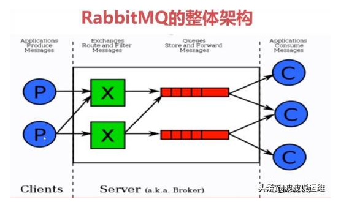
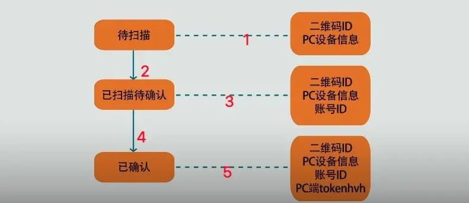

# 消息队列

## 你为什么要用消息队列？

从优点上来说

- 异步处理（异步处理提高了并发性）
  - 将一些比较耗时的操作，放在其他系统，将消息队列需要处理的消息进行存储，其他系统可以消费消息队列中的数据
  - 那为什么不直接异步调用呢？干嘛要用消息队列？
    1. 可以提高系统的稳定性，若是多线程异步调用，程序宕机，请求丢失，若是消息队列，仍在保存在队列中等待消费
    2. 解耦更充分，架构更合理    A通过消息中间件 到B，更合理
    3. 
- 系统解耦
  - 若是微服务之间的相互调用，耦合过于严重，但凡有接口变化，则可能导致整个系统不可用。可以使用统一的中间件，都遵从这个格式，降低耦合
- 流量削峰
  - 若是流量很大，服务器无法立即处理所有请求，可以将请求缓存在消息队列中，由服务器慢慢处理。缓解服务器运行压力
  - 低延迟，高可靠，高吞吐，可以应对大量并发

## 消息队列有什么缺点吗

- 对于实时性要求很高的情况，不适用。或者请求很低，可以满足要求，若是请求量很大，则消息队列进行削峰处理，降低速度，不满足实时性要求
- 消息队列要引入中间件，则需要考虑消息中间件的可靠性，速率，以及性能。这些问题。而且出现问题如何解决，都需要一定的策略。
- 需要考虑分布式事务，（即更复杂的考虑）

## kafka是如何保证消息不丢失的

分为两个阶段：

- 生产端

  - 生产者生产消息，提交时，可以设置应答策略，会进行应答。若提交失败，可以重试。

- 消费端

  - broker会将生产者的消息进行持久化，一般不会删除，等待消息过期后自动删除。broker持久化应用 了分片和索引的方式。一个主题将多条数据分片。每一片建立索引进行存储。这个索引就使用的offset。

  - 由于消费者可能是多个，kafka维持了一个offset的队列，保存map数据，每个消费者，会定时更新该消费者已经消费消息的offset。

    - 此时，仍会出现重复消费和漏消费的情况，**需要使用消费者事务**

      - 重复消费
        - 自动提交offset情况下，在消费者提交offset之后，消费者继续消费，还没等到下一次提交，消费者宕机，重启后，继续从上次提交的offset处消费。造成了重复
      - 漏消费
        - 在手动提交offset情况下，offset方提交，消费者抓取的消息还在内存中，未持久化。消费者宕机，消息丢失

      **需要使用消费者事务**

## RabbitMQ是如何保证消息不丢失

消息丢失的原因：生产者丢失消息、消息列表丢失消息、消费者丢失消息；

- 生产者丢失消息：
  - transaction机制就是说：发送消息前，开启事务（channel.txSelect()）,然后发送消息，如果发送过程中出现什么异常，事务就会回滚（channel.txRollback()）,如果发送成功则提交事务（channel.txCommit()）。然而，这种方式有个缺点：吞吐量下降；
  - confirm模式用的居多：一旦channel进入confirm模式，所有在该信道上发布的消息都将会被指派一个唯一的ID（从1开始），一旦消息被投递到所有匹配的队列之后；rabbitMQ就会发送一个ACK给生产者（包含消息的唯一ID），这就使得生产者知道消息已经正确到达目的队列了；如果rabbitMQ没能处理该消息，则会发送一个Nack消息给你，你可以进行重试操作。
- **消息队列丢数据**：消息持久化。
  - 持久化配置可以和confirm机制配合使用，你可以在消息持久化磁盘后，再给生产者发送一个Ack信号。
  - 步骤
    - 将queue的持久化标识durable设置为true,则代表是一个持久的队列
    - 发送消息的时候将deliveryMode=2
- **消费者丢失消息**：消费者丢数据一般是因为采用了自动确认消息模式，改为手动确认消息即可！


## 如何避免消息重复

Kafka

- 生产者端
  - 生产消息是幂等的，设置幂等开关 `enable.idempotence=true`，生产者可以保证每条消息只写入一次。消息附带key 
  - 生产者应答机制：确认消息被所有副本确认后再应答
- broker 端
  - 设置适当的分区数和副本数，确保机器的高可用和一致性
- 消费者端
  - 确保消费者消费逻辑是幂等的，即多次消息也无影响
  - Kafka消费应答，确认消费成功后应答
  - 消费者消费完消息后，提交offset偏移量。改为手动提交，并在消费成功后提交偏移量。确保消息消费成功后才更新偏移量


# RPC

### RPC协议和HTTP协议的区别？

RPC（Remote Procedure Call）协议和HTTP（Hypertext Transfer Protocol）协议是两种用于网络通信的协议，它们在设计目标、使用场景和技术实现上有一些显著的区别：

- ### 1. 设计目标

  - **RPC协议**：
    - 旨在使远程服务调用看起来像本地调用。开发者可以通过调用函数或方法的方式来与远程服务进行交互。
    - 通常用于分布式系统中，以实现服务之间的通信和协调。


    - **HTTP协议**：
      - 是一种应用层协议，主要用于在客户端和服务器之间传输超文本信息。
      - 设计用于Web浏览器与Web服务器之间的通信，但也广泛用于RESTful API、微服务等。


- ### 2. 通信模式

  - **RPC协议**：
    - 使用二进制协议


    - **HTTP协议**：
      - 使用文本协议


- ### 3. 数据格式

  - **RPC协议**：
    - 可以使用二进制格式（如Protobuf、Thrift）进行数据序列化，具有较高的性能和效率。
    - RPC接口使用函数参数传递参数


    - **HTTP协议**：
      - 数据通常以文本格式传输，如JSON、XML，易于阅读和调试，但可能在性能上不如二进制格式。


- ### 4. 使用场景

  - **RPC协议**：
    - 常用于需要高性能、低延迟的分布式系统。
    - 适合内部服务之间的通信，尤其是在微服务架构中。


    - **HTTP协议**：
      - 广泛用于Web应用程序和开放的RESTful API。
      - 适合需要与外部系统集成的场景。

- ### 5. 标准化和互操作性

  - **RPC协议**：
    - 通常与特定的框架绑定（如gRPC、Apache Thrift），可能需要特定的库支持。


    - **HTTP协议**：
      - 是一种标准化的协议，具有广泛的互操作性和支持，几乎所有的编程语言和平台都能处理HTTP。


综上所述，RPC和HTTP协议各有优缺点，选择使用哪种协议通常取决于具体的应用场景和需求。


# 项目

## 项目中遇到了什么问题吗？

- 论坛项目
  - 我在退出登录后，有时候还是会显示我登录的头像等信息？而且我已经在redis中移除了登录用户的信息，或者说改变了登录状态。
    - 后来是发现，我设置了拦截器，每次请求都会进行拦截器校验，判断是否登录，若是登录，则保存在threadLocal中。退出登录后，确实没有获取到该用户信息。但是在后续的方法中，threadLocal中有用户数据。这个threadLocal是线程隔离的，线程内共享，方便操作。但tomcat线程是有限的，即线程是会复用的，所以后续的请求，使用到了之前线程保存的用户信息。造成了退出登录，但仍有可能显示的问题。后续解决是：使用拦截器，在方式执行结束后，移除用户信息
- 你简历项目中都是用到了redis，说说你把什么数据放在redis中呢？
  - 将即时性，数据一致性要求不高的数据放在redis中。比如说验证码，已登录用户信息，物流信息
  - 访问量大且更新频率不高的 数据（读多，写少）

## 谈谈你对高并发的理解

高并发：意味着大流量，使用技术手段抵抗流量的冲击，使流量更平稳地被系统所处理，带给用户更好的体验。

并发量和QPS只是参考指标，还得具体情况具体分析

- 高性能：性能体现了系统的并行处理能力
- 高可用：服务不出现故障，不宕机
- 高拓展：系统的拓展能力，流量高时，能否在流量高峰时短时间内完成扩容。
- **高性能的实践方案**
  - 使用Redis多级缓存
  - 分库分表和索引优化
  - 使用多线程异步处理
  - 限流，熔断
  - 进行流量削峰
  - 缓存预热
  - 减少锁的使用
  - 优化代码逻辑

## 程序如果挂了/抛异常/结果有问题，该如何排查？

如果是在idea这种运行的错误，因为有错的话，会报错。看到是哪有错。如果是结果有问题，可以debug。

如果是在服务器上，如果是有异常，肯定是先查日志，我们项目使用的Tomcat，文件夹下，有一个文件logs。可以查看日志。自己在idea中进行测试查看问题来源。我们在项目中使用了@restControllerAdvice，来处理所有的异常，首先就会记录日志。


## 什么叫强一致性，弱一致性？还有一个最终一致性？

- 强一致性：系统中的某个数据被成功更新后，后续任何对该数据的读取操作都将得到更新后的值；

- 弱一致性：系统中的某个数据被更新后，后续对该数据的读取操作可能得到更新后的值，也可能是更改前的值。但经过“不一致时间窗口”这段时间后，后续对该数据的读取都是更新后的值；

- 最终一致性：是弱一致性的特殊形式，存储系统保证在没有新的更新的条件下，最终所有的访问都是最后更新的值。


## 遇没遇到过内存突然飙升的问题

遇到过，是CPU和内存同时飙升

-XX:+UseAdaptiveSizePolicy


## 与外部服务的API交互，如何防止因外部服务API不可用拖垮自己应用？

- **增加超时时间**：避免长时间等待
- **增加重试次数**：提高调用可用率
- **缓存机制**：减少对外部API的依赖
- **异步调用**：避免负责调用方服务
- **限流机制**：避免因突发流量导致外部API不可用
- **制定降级策略**：当外部API不可用时，返回默认值或者执行备用逻辑


# ~~简历~~

~~你实习最大的收货是什么？~~

- ~~首先来说，开拓了眼界，体验了一下生产环境，开发一个东西要写，技术方案，每天要有wiki产出。~~

- ~~了解了很多新的技术知识，~~

- ~~在遇到一个需求时，不是直接上手写代码，而是先写技术方案，写各种涉及到的东西和解决办法。而且还是思考plan B。若是线上出现问题后，可以及时补救。（在lion中配置开关）~~

- ~~我实习的时候，写的一个需求是切换orgId。将原本使用自己系统的orgId，切换为基础侧的orgId。所有的系统都要切换orgId。这就涉及一个点是，你不清楚自己~~

  - ~~需要先写技术方案，开会讨论。~~

  - ~~重点是：三个步骤~~

    1. ~~双写，将新旧orgId进行写入。添加新字段~~
       1. ~~双写不仅是在数据库写入，需要在接口处都要处理。~~
       2. ~~流量入口：分为其他服务的调用和前端的调用~~
          1. ~~将orgId统一切换新orgId（我们并不清楚其他系统使用的新的还是旧的orgId）BO，PO都要添加新字段（我们系统内部使用新orgId）~~
       3. ~~流量出口：我们并不清楚其他系统微服务使用的新旧接口，所以返回值涉及到orgId的，全部使用旧的。~~
    2. ~~数据刷新，将原本没有使用新orgId的数据添加新 的orgId~~

    ~~前端请求调用~~


## TPS/QPS的区别：

一、QPS/TPS
QPS：Queries Per Second意思是“每秒查询率”，是一台服务器每秒能够相应的查询次数，是对一个特定的查询服务器在规定时间内所处理流量多少的衡量标准。
TPS：是TransactionsPerSecond的缩写，也就是事务数/秒。它是软件测试结果的测量单位。一个事务是指一个客户机向服务器发送请求然后服务器做出反应的过程。客户机在发送请求时开始计时，收到服务器响应后结束计时，以此来计算使用的时间和完成的事务个数。
Tps即每秒处理事务数，包括了
1）用户请求服务器
2）服务器自己的内部处理
3）服务器返回给用户
这三个过程，每秒能够完成N个这三个过程，Tps也就是3；
Qps基本类似于Tps，但是不同的是，对于一个页面的一次访问，形成一个Tps；但一次页面请求，可能产生多次对服务器的请求，服务器对这些请求，就可计入“Qps”之中。
例如：访问一个页面会请求服务器3次，一次放，产生一个“T”，产生3个“Q” 

## TP99 和TP999

TP99:处理99%的请求所消耗的时间

TP999:处理99.9%的请求所消耗的时间。


# MQ

## MQ如何保证消息不会丢失？

Mq消息的重复消费问题如何解决

- 生产者
  - producer重试机制 
  - producer的ack机制
- broker
  - 副本故障处理。follower备份：leader和follow故障后的机制
  - 确认ISR队列中副本的数量，副本已经同步消息
  - 持久化（分片和稀疏索引）
- 消费者
  - 手动提交offset （consumer 进行重平衡，可能会重复消费或丢失消息，使用手动提交可以避免）
  - Kafka不支持消费失败重试，可以将消费失败的消息转发出去，或者存储下来

## rabbitMq如何保证消息不丢失

- 生产者：RabbitMQ提供transaction和confirm模式来确保生产者不丢消息；

  - transaction机制就是说：发送消息前，开启事务（channel.txSelect()）,然后发送消息，如果发送过程中出现什么异常，事务就会回滚（channel.txRollback()）,如果发送成功则提交事务（channel.txCommit()）。然而，这种方式有个缺点：吞吐量下降；
  - confirm模式用的居多：一旦channel进入confirm模式，所有在该信道上发布的消息都将会被指派一个唯一的ID（从1开始），一旦消息被投递到所有匹配的队列之后；
  - 发送失败后，触发重试机制

- 消息队列：消息持久化

  - 这个持久化配置可以和confirm机制配合使用，你可以在消息持久化磁盘后，再给生产者发送一个Ack信号。

    这样，如果消息持久化磁盘之前，rabbitMQ阵亡了，那么生产者收不到Ack信号，生产者会自动重发。

    那么如何持久化呢？

    这里顺便说一下吧，其实也很容易，就下面两步

    1. 将queue的持久化标识durable设置为true,则代表是一个持久的队列
    2. 发送消息的时候将deliveryMode=2

- 消费者

  - 消费者接收每一条消息后都必须进行确认（消息接收和消息确认是两个不同操作）。只有消费者确认了消息，RabbitMQ 才能安全地把消息从队列中删除。


## kafka与rabbitMq的区别


Kafka是LinkedIn开源的分布式发布-订阅消息系统，目前归属于Apache顶级项目。Kafka主要特点是基于Pull的模式来处理消息消费，追求高吞吐量，一开始的目的就是用于日志收集和传输。0.8版本开始支持复制，不支持事务，对消息的重复、丢失、错误没有严格要求，适合产生大量数据的互联网服务的数据收集业务。**侧重点是高性能高吞吐量，对消息的重复，丢失，错误没有严格要求**


**RabbitMQ**



RabbitMQ是使用Erlang语言开发的开源消息队列系统，基于AMQP协议来实现。AMQP的主要特征是面向消息、队列、路由(包括点对点和发布/订阅)、可靠性、安全。AMQP协议更多用在企业系统内，对数据一致性、稳定性和可靠性要求很高的场景，对性能和吞吐量的要求还在其次。

**rabbitMq自身是基于erlang语言开发的，所以导致较为难以分析里面的源码，也较难进行深层次的源码定制和改造，毕竟需要较为扎实的erlang语言功底才可以。**


区别：


## 消息队列的有序性问题

https://xie.infoq.cn/article/c84491a814f99c7b9965732b1

**RabbitMQ**：

对于 RabbitMQ 来说，导致上面顺序错乱的原因通常是消费者是集群部署，不同的消费者消费到了同一订单的不同的消息，如消费者 A 执行了增加，消费者 B 执行了修改，消费者 C 执行了删除，但是消费者 C 执行比消费者 B 快，消费者 B 又比消费者 A 快，就会导致消费 binlog 执行到数据库的时候顺序错乱，本该顺序是增加、修改、删除，变成了删除、修改、增加。


**解决方案：**

RabbitMQ 的问题是由于不同的消息都发送到了同一个 queue 中，多个消费者都消费同一个 queue 的消息。解决这个问题，我们可以给 RabbitMQ 创建多个 queue，每个消费者固定消费一个 queue 的消息，生产者发送消息的时候，同一个订单号的消息发送到同一个 queue 中，由于同一个 queue 的消息是一定会保证有序的，那么同一个订单号的消息就只会被一个消费者顺序消费，从而保证了消息的顺序性。

**梳理：**所有消息都发给同一个消息队列，最后由多个消费者竞争消费，所以导致乱序。指定多个消息队列，队列与消费者一一对应。一个订单的消息只发给一个队列即可


**Kafka**

对于 Kafka 来说，一个 topic 下同一个 partition 中的消息肯定是有序的，生产者在写的时候可以指定一个 key，通过我们会用订单号作为 key，这个 key 对应的消息都会发送到同一个 partition 中，所以消费者消费到的消息也一定是有序的。
那么为什么 Kafka 还会存在消息错乱的问题呢？问题就出在消费者身上。通常我们消费到同一个 key 的多条消息后，会使用多线程技术去并发处理来提高消息处理速度，否则一条消息的处理需要耗时几十 ms，1 秒也就只能处理几十条消息，吞吐量就太低了。而多线程并发处理的话，binlog 执行到数据库的时候就不一定还是原来的顺序了。


**解决方案：**

Kafka 从生产者到消费者消费消息这一整个过程其实都是可以保证有序的，导致最终乱序是由于消费者端需要使用多线程并发处理消息来提高吞吐量，比如消费者消费到了消息以后，开启 32 个线程处理消息，每个线程线程处理消息的快慢是不一致的，所以才会导致最终消息有可能不一致。
所以对于 Kafka 的消息顺序性保证，其实我们只需要保证同一个订单号的消息只被同一个线程处理的就可以了。由此我们可以在线程处理前增加个内存队列，每个线程只负责处理其中一个内存队列的消息，同一个订单号的消息发送到同一个内存队列中即可。


**梳理：**kafka从生产者到消费者是能够保证消息的有序性的，开启幂等性和事务，生产者发送消息时，指定分区，就可以将同一类事务放在指定分区，消息者顺序消费。但是消费者为提高吞吐量，可能会使用多线程处理消费的消息，可能会出现【消费者开始执行消息的顺序有序的，但是异步执行过程中，有的消息执行慢，有的消息执行快，导致最终乱序了】，可以使用一个内存队列，即执行线程消费，一个订单号或者一个用户都使用这一个异步线程处理。就可以解决。

如下图是 Kafka 保证消息顺序性的方案：


## Kafka 和 RocketMQ 的区别

Kafka 和 RocketMQ 作为主流的分布式消息队列系统，在架构设计、功能特性和适用场景上存在显著差异。以下是两者的详细对比分析：

---

### **1. 核心设计理念**
| **维度**     | **Kafka**                                | **RocketMQ**                                |
| ------------ | ---------------------------------------- | ------------------------------------------- |
| **设计目标** | 高吞吐量、低延迟的 **日志流处理平台**    | 高可靠、支持复杂业务的 **事务型消息中间件** |
| **数据模型** | 基于分区（Partition）的 **顺序追加日志** | 基于主题（Topic）和队列（Queue）的分片存储  |
| **核心场景** | 日志收集、实时流处理、大数据分析         | 订单处理、金融交易、消息通知、削峰填谷      |

---

### **2. 架构与存储机制**
| **维度**       | **Kafka**                                                    | **RocketMQ**                                                 |
| -------------- | ------------------------------------------------------------ | ------------------------------------------------------------ |
| **存储结构**   | - 消息按 **分区（Partition）** 顺序写入日志文件<br>- 每个分区是一个不可变的有序日志序列 | - 消息统一写入 **CommitLog**（顺序写）<br>- 消费队列（ConsumeQueue）存储索引，实现随机读 |
| **副本机制**   | 基于 **ISR（In-Sync Replicas）** 的副本同步：<br>- Leader 处理读写，Follower 异步/同步复制 | 基于 **主从复制（Master-Slave）**：<br>- 主节点负责读写，从节点仅备份 |
| **数据持久化** | 依赖 **PageCache** + 顺序写优化，适合高吞吐                  | 依赖 **文件系统** + 内存映射，兼顾顺序写和随机读             |
| **运维依赖**   | 依赖 **ZooKeeper** 管理元数据和选举                          | 自研 **NameServer** 实现轻量级服务发现，无外部依赖           |

---

### **3. 功能特性对比**
| **维度**       | **Kafka**                                     | **RocketMQ**                               |
| -------------- | --------------------------------------------- | ------------------------------------------ |
| **消息顺序性** | 仅保证 **分区内有序**                         | 支持 **全局有序**（单队列）和 **分区有序** |
| **事务消息**   | 支持（需配合 Kafka Streams 或外部事务管理器） | **原生支持事务消息**（二阶段提交）         |
| **消息过滤**   | 仅支持 **分区级过滤**（消费者自行处理）       | 支持 **Tag 过滤** 和 **SQL 表达式过滤**    |
| **消息重试**   | 需手动实现（如重发到特定 Topic）              | 内置 **重试队列** 和 **死信队列**          |
| **延迟消息**   | 不支持（需外部实现）                          | **原生支持**（18 个固定延迟级别）          |
| **消息追踪**   | 需集成外部工具（如 OpenTelemetry）            | 内置 **消息轨迹追踪** 功能                 |

---

### **4. 性能与扩展性**
| **维度**         | **Kafka**                     | **RocketMQ**                 |
| ---------------- | ----------------------------- | ---------------------------- |
| **吞吐量**       | **极高**（单集群百万级 TPS）  | **高**（单集群十万级 TPS）   |
| **延迟**         | 低（毫秒级，适合实时流处理）  | 低（毫秒级，但略高于 Kafka） |
| **水平扩展**     | 通过增加分区和 Broker 实现    | 通过增加队列和 Broker 实现   |
| **消息堆积能力** | 支持 **海量堆积**（日志场景） | 支持堆积，但需合理规划存储   |

---

### **5. 生态与工具支持**
| **维度**       | **Kafka**                                      | **RocketMQ**                                       |
| -------------- | ---------------------------------------------- | -------------------------------------------------- |
| **流处理集成** | **深度集成**（Kafka Streams、KSQL、Flink）     | 需通过 **RocketMQ Connect** 或外部框架（如 Flink） |
| **监控工具**   | Prometheus + Grafana、Confluent Control Center | RocketMQ Console、Prometheus Exporter              |
| **社区支持**   | **全球活跃社区**，文档全面（英文为主）         | **中文社区活跃**，文档完善（中英双语）             |
| **云原生支持** | 支持 Kubernetes，但依赖 ZooKeeper              | **云原生友好**（4.x 版本去 ZooKeeper 依赖）        |

---

### **6. 典型应用场景**
| **场景**         | **Kafka 适用性**                 | **RocketMQ 适用性**                   |
| ---------------- | -------------------------------- | ------------------------------------- |
| **日志收集**     | ⭐⭐⭐⭐⭐（海量日志实时采集）        | ⭐⭐（功能可满足，但吞吐量不足）        |
| **实时计算**     | ⭐⭐⭐⭐⭐（与 Flink/Spark 深度集成） | ⭐⭐（需结合外部流处理框架）            |
| **金融交易**     | ⭐⭐（需额外实现事务和可靠性）     | ⭐⭐⭐⭐⭐（原生事务、顺序消息、高可靠）   |
| **电商订单**     | ⭐⭐（需自行处理重试和死信）       | ⭐⭐⭐⭐⭐（内置重试、死信队列、延迟消息） |
| **IoT 数据处理** | ⭐⭐⭐⭐（高吞吐适配设备数据）       | ⭐⭐⭐（需优化存储和消费逻辑）           |

---

### **7. 选择建议**
- **选择 Kafka 的场景**：
  - 需要处理 **海量日志流** 或实时数据管道（如 ClickStream、Metrics）。
  - 与 **大数据生态**（Hadoop、Spark、Flink）深度集成。
  - 对吞吐量要求极高，允许牺牲部分功能灵活性。

- **选择 RocketMQ 的场景**：
  - 需要 **事务消息、顺序消息、延迟消息** 等高级功能。
  - 业务场景复杂（如金融交易、订单处理），需高可靠性和完备的消息治理。
  - 希望减少外部依赖（如 ZooKeeper），简化运维。

---

### **8. 总结对比表**
| **维度**       | **Kafka**            | **RocketMQ**          |
| -------------- | -------------------- | --------------------- |
| **设计目标**   | 高吞吐日志流         | 高可靠事务消息        |
| **消息顺序**   | 分区有序             | 全局有序 + 分区有序   |
| **事务支持**   | 需外部扩展           | 原生支持              |
| **消息过滤**   | 基础分区过滤         | Tag + SQL 表达式      |
| **延迟消息**   | 不支持               | 原生支持              |
| **吞吐量**     | 百万级 TPS           | 十万级 TPS            |
| **运维复杂度** | 高（依赖 ZooKeeper） | 低（自研 NameServer） |
| **社区生态**   | 全球活跃，英文为主   | 中文友好，本土化完善  |

---

### **9. 实际案例**
- **Kafka 典型用户**：
  - LinkedIn（实时用户行为分析）、Netflix（事件流处理）、Uber（实时数据管道）。
- **RocketMQ 典型用户**：
  - 阿里巴巴（双十一订单处理）、蚂蚁金服（金融交易）、滴滴（实时计费）。

---

根据业务需求的核心痛点（吞吐量、功能完备性、运维成本）选择合适的技术栈。若追求极致的吞吐量和生态整合，选 Kafka；若需要企业级消息中间件的完整功能，选 RocketMQ。


## MQ 延时消息如何实现

1. 发送消息携带时间戳
   - 实现方式：发送到普通的消息队列，携带时间戳，消费者拉取消息时，过滤未过期的消息
   - 缺点：高延迟误差（依赖拉取消息的间隔），频繁轮询浪费字段
2. 延迟队列
   - 实现方式：将延迟消息存储到数据库，后台线程定期扫描到期消息，将消息投递到指定队列消费
   - 优化点：按时间进行分片，提升扫描效率，可按到期时间区分，每天一个分片
3. 时间轮 （RocketMQ 时间轮+持久化存储）
   - 实现方式：消息按延迟时间计算所属时间槽，到期则执行
   - 优缺点：高性能，只需存储时间槽
4. 死信队列 （RabbitMQ）
   - 消息设置ttl 过期时间，过期后自动进入死信队列，消费者订阅死信队列消息，以此获取延迟消息
   - 固定的延迟消息，不支持动态延迟


# 场景题

## 10000数据找出最大的1000个数字

快速排序：时间复杂度为nlog（n），可以选择 partition只求取最大1000的排序，若是取出的值==1000，不再进行排序。

最小堆: 时间复杂度为 nlog（k）

## 给你一个 多边形，如何判断一个点在多边形内部

对该点做一条射线，若是基数，则在内部，偶数，则外部。单独考虑是否与边重合，或者与多边形角重合的情况


## 用户访问不了一个网站，你怎么解决？

- 首先检查服务器：
  - **确定服务器部署的项目运行成功**
    1. 查看后台运行进程信息，像idea控制台一样
    2. 查看日志，可以在日志中查看运行信息【项目都用tomcat启动，所有服务器都在tomcat的日志记录中】
  - **确定访问地址地址是否正确**
    - IP地址，端口号是不是一直
  - **确定服务器安全规则是否添加了要访问的端口**
    - 即查看服务器是不是开放了该端口，防火墙问题。

- 追问：**服务器里面高内存，高CPU的情况怎么解决？**
  - CPU，内存，看上面 JVM部分
- 如果排查下来，都正常，还有一小部分用户不能方法，你怎么解决？
  - 可能是有限流
- 如果没有限流呢，而且那几个用户还着急要用，你怎么解决？
  - 上线小demo，实现对应功能，先解决用户着急使用数据 的问题，然后再排查。可以在开一台服务器


实际上是想问：Linux无法通过url获得服务器主页数据如何排查？

- **关防火墙、看host文件里边是否ip和域名绑定了**


## TOP K问题

通常最好的方案是使用分治 + 小顶堆。即先将数据集用Hash方法拆解成多个小数据集进行分治，然后用小顶堆在每个数据集中找到最大的前K个数，最后在所有小数据集的Top K数中通过系统排序找到最终的Top K个数。

**是否有足够内存：**如果机器内存足够可以直接在内存中使用Hash对数据进行切分，如果机器内存不足可以将原始文件切分成多个小文件

**如果含较多重复值**：先用hash / 依图法去重，可大大节省运算量

## 有几台机器存储着几亿淘宝搜索日志，你只有一台 2g 的电脑，怎么选出搜索热度最高的十个？

针对top k类文本问题，通常比较好的方案是【分治+trie树/hash+小顶堆】，即先将数据集按照hash方法分解成多个小数据集，然后使用trie树或者hash统计每个小数据集中的query词频，之后用小顶堆求出每个数据集中出频率最高的前K个数，最后在所有top K中求出最终的top K。

拆分成n多个文件：以首字母区分，不同首字母放在不同文件，长度仍过长的继续按照次首字母进行拆分。这样一来，每个文件的每个数据长度相同且首字母尾字母也相同，就能保证数据被独立的分为了n个文件，且各个文件中不存在关键词的交集。

分别词频统计：对于每个文件，使用hash或者Trie树进行进行词频统计

小顶堆排序：依次处理每个文件，并逐渐更新最大的十个词


## 双十一大家都挤在0点抢，怎么处理高并发的？

- 一个域名，多个IP地址，映射多个机房
- Nginx实现负载均衡
- 分布式的系统，当每个微服务只执行单一化职能，并设置使用分布式中的限流，熔断，降级等功能。
  - 熔断：某个服务发生故障，导致不可用。下次调用该服务，则直接返回不可用结果。
  - 降级：高并发时，由于系统运行高并发，手动关闭一些非核心业务。来使得核心业务顺利执行
  - 限流：限制流速，限制请求数量
- SQL数据库使用集群，redis使用分布式缓存，使用搜索引擎ES
- 以云平台映射承载系统，若请求量过高，可以临时申请多台机器运行。【使用docker,和K8S，通过docker将服务打包成镜像，K8S来动态分发和部署镜像】


# 实习

- 比较难的点，成体系的描述问题以及回答
- 锻炼了解决线上问题的能力
- 回答问题的时候，往进公司的目的靠拢，比如说喜欢技术等等，拿出例子来，而不是侃侃而谈。
- 面试的时候，并不一定所有的问题都能回答上来，可以有一两个问题答不上来。但是有的问题，回答的要有亮点，而不是普普通通
- 有可能一些面试是压力面试，不要慌，考的就是临场应变能力。
  - 比如说批量查询，
- 而且不要过度从自身上找原因，有可能不是你的问题。
- 从梳理项目的东西，为什么会存在这个作战平台，它的作用是什么
- 面试遇到不会的问题，可以直接说【这个问题，我还不了解，回头我先学习一下这块内容】


## SQL慢查询优化

==SQL慢查询优化，查询请求由176ms，优化到33ms，性能提升81.25%，已上线；==

### SQL问题

先描述这个SQL语句,索引是index_status_time (order_status,create_time)，

```
select `所有字段`
from
  yx_order
where
  order_status = 50
  and update_time <= '2022-06-02 00:00:00'
  and valid = 1
order by
  create_time desc
limit
  20
```

- 查询类型也表明：simple简单的select查询。不涉及子查询或者联合查询

- 查询困难程度：ref。

- 涉及到的索引：index_status_time (order_status,create_time)
- rows：物理查询的行数。6.9w，将近7w
- key_len=4，命中索引的长度为4
- extra： using where  【使用where字段过滤】

**查询过程是，命中联合索引字段order_status，粒度很低，order by create_time可以快速查找出需要的字段，由于非聚簇索引，回表查询将近7w行，再where 过滤。执行时间变为170ms；**

explain SQL语句


### 分析问题

- 由于只有两个字段的索引，而且为等值查询，索引没失效，
  order_status 为int类型，不涉及类型转换
  符合最佳左前缀原则，不涉及！=或者大于小于，范围查询，函数计算的情况。
- 起初是，原本的两个字段的联合索引，替换为4个。在原有的status，create_time  的字段顺序不变，在后面添加字段，valid，update_time。【一定不能改变原来索引字段的顺序，因为改变顺序，可能会导致其他SQL查询变慢】
- 其实没有效果。因为order by已经是进行了排序，后续的索引就不会再使用。所以直接添加两个字段是不能解决问题的。

### 解决办法

- 所以使用了索引覆盖，和join连接

  ```
  select '所有字段'
  from
    yx_order a join (select id from yx_order 
    WHERE order_status = 50
  	AND update_time <= '2022-06-03 00:00:00'
  	AND valid = 1
  ORDER BY create_time DESC
  LIMIT 20) b on a.id=b.id
  ORDER BY a.create_time DESC
  ```

- 

- 先查询2表，由于使用了索引覆盖，并且limit offset，count ，只返回查询到的id，所以，在查询1表时，只返回20行数据，在20行数据有可能是无序的，所以在order by一次。此时未命中索引。explain中extra中出现了using filesort，但是只有20行数据，并未产生临时文件，而且在查询时间降到了30ms

### 最大收获

- 由于mysql的性能优化，导致我们使用mysql查询时，是个黑箱操作，并不清楚内部如何查询的。也就是说，所有的索引优化的知识，只是书本上的知识，只有实际测试过后，真的速度变快了，才是有效的优化；
- 原本索引覆盖，只是作为一个知识点了解，我期初并未遇到过这种情况。然而这个SQL语句实际用到了，才明白，原来索引能这样用，不仅仅是简单的增加，删除索引字段
- 其实还有一点收获，这是我第一次请求虽然已经进行了验证，但仍然需要考虑线上出现问题的Plan B。所以在配置中心，添加一个Boolean变量，表明开关，来使用新SQL查询或者旧SQL查询。

## ~~任务文件导出~~

### ~~问题描述~~

- ~~使用人员反馈，在任务文件导出请求，超出一定阈值后【id阈值，或者说任务文件列表页的id】，请求失败，无法导出~~

### ~~问题分析~~

~~在发现这个问题时，首先发现，有些文件是可以导出，有些文件不能导出。那说明，请求能请求到，是生效的。是服务器内部错误~~

~~该请求过程是：~~

- ~~请求Nginx，再转发到相应的微服务~~
- ~~执行目标方法~~
  - ~~用户权限验证（没问题，因为有的文件能导出）~~
  - ~~从数据库获取数据~~
  - ~~上传至文件中心，并返回对应的url地址~~
- ~~返回对应的url地址~~

~~请求参数，是taskId=3313,不涉及请求参数溢出的情况。而且有的文件可以导出，说明有权限。所以问题出现在service层处理方法的过程。~~

~~**我查询了mttrace，链路追踪。**~~

~~方法内：~~

- ~~首先是查询一张表，根据参数能查询到1.5w的数据~~
- ~~在根据表中的参数id，查找到另外一张表中的状态。~~
  - ~~将第一张表中的数据进行遍历，查询每一条记录orderId的status状态。~~
  - ~~每次查询耗时2ms不到，1.5w次，差不多是30s。~~
- ~~将两个表的信息保存到Vo中。~~

~~整个请求的处理时间是30s。而Nginx设定的请求时间最长是20s。已经超时。所以无法返回给客户。但后台服务器已经执行，并保存到文件中兴，生成url地址。~~

### ~~解决办法~~

- ~~由于是线上问题，首先与管理Nginx的同事沟通，将Nginx的请求时间把原来的20s的请求时间改为60s。~~
- ~~然后从代码层面来改：将1.5w的请求改为批量查询，将多个orderId封装到一个list集合中。一次查询100次的请求。后续我们测试请求批次大小与响应时间的关系，分别测试了100,150，200,250,300...500.**发现随着请求批次大小增加，响应时间大体是一个减少的趋势。但考虑到mysql数据库处理的压力，以及查询数据量太大，网络传输问题，我们选择了批次=150**~~
  - ~~查询时，SQL语句使用了in和foreach。但仍出现了错误，未考虑请求为null的请求，若传入的list集合为~~
- ~~注意，即使传入list集合为null，也应该返回一个list空集合~~

## ~~OrgId切换~~

~~看技术文档~~

- ~~东西不难，但是复杂。~~

### ~~痛点（将近十几个微服务）~~

- ~~销售侧所有的平台都要切换orgId，但每个微服务切换时间不固定，所以，调用其他微服务和被其他微服务调用，所携带的orgId使用新OrgId还是旧orgId~~
- ~~应该需求完成上线后，统一orgId切换时间后，我们所有服务，能立刻切换新OrgId。要有plan B。上线后，若是其中一个微服务使用新orgId出现了问题，能够立即切换会旧orgId，来挽回损失。~~


### ~~解决办法~~

~~配置了四个Lion开关，上线流程分为多阶段~~

#### ~~lion开关~~

- ~~双写开关，人员侧orgId和基础侧orgId都写入数据库~~
- ~~流量入口开关，将request输入请求全部切换为基础侧OrgId还是人员侧orgId【入口表示的是，作战平台内部service处理使用新旧OrgId】~~
- ~~流量出口：http请求（前端请求）和thrift请求（thrift其他微服务调用）返回的数据中，避免字段的改变，否则改动太大。~~
  - ~~流量出口分为两个，是因为，前端获取orgId数据后，该orgId数据只会请求我们作战平台微服务。请求微服务时会重新获取。所以返回给前端的orgId新旧不影响其他操作~~
  - ~~但是被其他微服务调用，为避免请求的混乱，只能设置开关来决定使用新OrgId还是旧OrgId~~

#### ~~上线流程~~

- ~~上线后，开启双写开关，将新旧OrgId写入数据库，此时平台内部仍使用旧orgId~~
- ~~上线前，mysql，es添加新字段，采用定时任务的方式进行数据刷新；【先开启双写，再进行数据刷新，避免刷新后，再新增数据，新orgId没写入】~~
- ~~开启流量入口开关，将request请求携带的orgId转换成新OrgId，而且作战平台内部使用新orgId进行逻辑处理~~
- ~~没有问题后，开启前端请求的流量出口开关，前端请求的orgId转换成新OrgId，其他微服务请求作战平台时，仍使用旧orgId~~
- ~~等所有的平台都切换新OrgId后，开启其他微服务请求的流量出口开关，替换完成。最后将双写改为只写入新orgid~~

### ~~细节~~

- ~~我们的orgId的新旧映射需要请求其他微服务，若处理每一次orgid切换的请求都调用其他微服务，过慢。我们将请求保存在本地缓存中。~~
- ~~我们需要构建一个组织树，每天定时更新，每个节点保存orgId，parentOrgId和子节点集合的set集合。所以我们需要重新构建一个组织树，并不能将原组织树的orgId值替换。~~
  - ~~因为，每次只刷新一次组织树，若是替换，则可能导致刷新时使用旧OrgId构建组织树，后面我们开启流量入口开关，无法获取新orgId组织树节点。【所以此时需要构建两颗组织树】~~
- ~~存在前端与其他微服务都请求一个方法，而且无法没有携带orgId。我们可以根据请求参数来区分，是前端还是其他微服务~~
- ~~即使切换完成， 仍需要后续删除所有的冗余代码，涉及到orgId的部分都需要进行判断。将逻辑判断删除。工作量大~~
- ~~开启双写，在数据库（mysql，es）中添加新字段，还需要在BO，PO添加新字段。而且es部分不能只是开启开关能够进行数据替换的，而是与调用该数据的同事沟通，将orgId旧字段替换为新字段。~~
  - ~~作战平台是，从一个es索引中插入数据，从另一个es索引中获取数据。【维护数据但不获取，和获取数据但不维护，两个索引】所以需要分别与使用该es数据库的同事沟通替换新字段~~


**CAP定理：**分布式架构的基本理论。

指的是：一个分布式系统中，一致性（Consistency），可用性（Availability），分区容错性（Partition tolerance）。


只能保证CAP定理的两两组合，CAP不能同时满足：以电商为例：购买商品，需要订单系统创建订单，库存系统扣减库存。

- CP（一致性，分区容错性）：用户购买商品后，一直在页面等待，创建订单后，请求库存系统扣减库存。此期间用户一直等待，直到请求完成
- AP（可用性，分区容错性）：订单创建后，直接返回，不等待库存减少，扣减库存的工作交由异步线程处理
- AC（可用性，分区容错性）：不拆分系统，在一个数据库的一个事务完成该操作，即不使用微服务，而在一个服务中完成所有的操作


# ES 

## ES默认能查询到10000条数据

原因：ES一般是集群存在，那么查询10000条数据，每个节点都需要查询1000条数据，然后协调节点再重新组合数据，返回给用户，性能消耗太大，因而，不允许查询过多数据。分页查询 10000-10010，必然也是不允许的。分页查询也是查询0-10010的所有数据，协调节点再组合的。

## ES 全量查询

- **深度分页:**  即分页查询时，后面页数的数据。比如说总共10034页，查看第1000页。避免该方式，因为无论是ES还是MySQL，都是先查到前所有的数据，再舍弃x-1页的数据，返回第x页的数据。

### from size

分页查询，最简单的方式。需要查询 from+size条的数据，向每个分片都发配该请求，每个分片查询到自己的from+size的数据，返给协调者，协调者进行汇总、排序。抽取from后的第size条记录。

若是遇到深度分页，则无法使用该方法，因为过于危险，容易出现 ooo （out of Memory）

### Search After

Search After跟Scroll原理一致。

**使用**

- 使用必须指定排序（根据排序指定坐标）

- 必须从第一页开始搜起（若是随便一条记录开始搜，不知道它是属于全量数据的何处）

- 指定查询size为固定值，查询条件为 新增需要排序的字段。下次查询时，取此次查询的最后一条数据的时间作为查询条件。

  ```java
  将  order by time offset 0 limit 100，
  改写成 order by time where time>0 limit 100
  ```

也就是说全量查询是指定顺序的多次查询，每次查询是选择上次查询的结构最后一条数据将需要排序的字段作为此次查询的条件。

优点：**每次查询都是查第一页**，避免了舍弃前from条数据的性能损耗，几乎没有风险

缺点：同一个查询请求可能请求成百或者上千次，仍存在性能低的情况。


### Scroll

与Search After查询类似，需要多次查询。

scroll 是将一次的查询结果快照缓存一段时间（可指定），返回值response 会返回scroll_id，下次请求时携带该scroll_id ，ES查询时从快照时查询，避免了从各个分片上查询数据。

**使用**

- 客户端向ES发起请求，指定快照生存时间，并查询数据。类似 `/{index}/_search?scroll=1m`
- ES 查询数据，并将所有数据聚合在协调者，过滤得到最后的数据
- 客户端再查询数据时，发起类似`/_search?scroll`的查询操作，每次查询返回上次查询返回的scroll_id，循环查询直到无结果返回
- 客户端向ES发起一个Delete的请求，向服务器表明查询已结束，清除快照缓存

**原理**

若是scroll 滚动查询，传的from字段会被ignore。ES内部设置了lastEmittedDoc 字段作为游标（与scroll_id相关联），以此确定游标位置。不需要像Search After，手动维护查询字段。但是需要每次修改scroll_id，也差不多了。与Search After 结果类似。


## ES修改映射

**ES中，映射不可被修改**。若非修改映射，则

1. 创建一个中间索引，包含自己需要的所有映射
2. 将数据，从旧索引中迁移到新索引中
3. 将旧索引删除，并把新索引更改名称叫旧索引名


**有实际用途吗？**

==**有，若是新增映射错误，或者原索引副本分片数量需要修改，则此时需要此操作**==

数据迁移

```es
POST _reindex
{
  "source": {
    "index": "old_index"
  },
  "dest": {
    "index": "new_index"
  }
}
```


# 需求设计


## 单点登录如何实现

1. 单点登录时用户只需登录一次，就可以访问所有信任的系统
2. 步骤
   1. 用户访问其他系统，会在网关判断token 是否有效
   2. 如果token 无效则会返回401（认证失败）前端跳转到登录页面
   3. 用户发起登录请求后，返给前端一个token
   4. 再次请求时，会将该token 添加到cookie，请求其他系统服务时也携带该cookie，由网关校验后路由到目标服务


## 权限认证如何实现

- 用户表、角色表、权限表、用户角色关联表、角色权限关联表 （5张表，实现权限控制）
- 判断某个用户有无权限时，先查询用户角色关联表，查到该用户拥有的角色，再根据角色查询所拥有的权限


## 二维码扫码登录

使用场景：二维码通常是手机端应用扫描PC段或者web端的二维码，例如，微信登录，qq登录等 

### 二维码的本质

- 二维码登录本质商业之一种登录认证方式。最后肯定是获取cookie，请求我们的系统。
  - 告诉系统，是当前账号要登录
  - 向系统证明，当前账号可以安全登录
- 二维码，本质和一维码类似，都是“码”，即，都是一种字符串的表达方式。一维码只能表示数字，而二维码则是字符串，即任何字符了。


## 登录认证机制

为了安全起见，**手机端是不会存储账号的密码的**，只会保存登录的凭证token，毕竟，输入密码最终的目的也是获取该token。这也是为什么很多软件是不需要每次打开软件都登录的问题。一般只有重置软件，或者切换账号时，才需要重新登录，获取token。


### 账号登录认证机制

登录认证机制都是基于一个token的认证。


1. 客户端登录时会携带，账号、密码、设备信息传递给服务端
2. 服务器校验通过后，会返回一个唯一token，内部含有：账号信息，设备信息（设备ID，设备类型如IOS，Android，pc...）
3. 客户端会保存该token，软件启动时，会读取该token，这个token是长期有效地。【客户端完全没有保存你密码的必要】
4. 客户端在后续的请求服务时，会携带该token，进行身份校验，除了密码，还包括设备信息

### 二维码认证机制

PC端显示登录二维码，等待手机端扫描，手机端扫描后，手机端点击确认，PC端登录成功



1. PC端向服务端发起请求，携带设备ID，设备类型等信息，服务器返回唯一性ID。【PC设备信息都包含在该ID中，但是没有账号信息，此时账号不确定】
2. 客户端收到的这个唯一性ID，展示成二维码，服务器会不断轮询访问服务器，请求服务端告诉当前二维码的状态及相关信息。【这也是为什么手机确认登录后，PC端需要等待下才能登录】
3. 手机端扫描该二维码，获取其中的唯一性ID信息，点击确认登录后，请求服务器，请求携带账号信息、唯一性ID
4. 服务器收到手机端的请求信息后，在PC端下次访问服务器，确认是否登录时，会返给PC端一个临时token
5. PC端根据该token，可以访问服务器资源


## ID生成器

首先谈到ID生成器，不能直接就是雪花算法，这是狭隘的视角。ID生成器生成的ID要求**唯一性**、**可排序**、**高性能**的ID。


- UUID
  - UUID虽然保证了唯一性，且高性能，但是无法排序。
- 数据库自增ID
  - 适合单机机器。保证了唯一性和可排序。若分库，则不是有个好的选择
- Redis incr 自增
  - 与数据库类似，但性能更高一些。但仍需每次都访问数据库或者Redis。

**目前适用于分布式主流的方式有两种**

- 通过方法预分配一段ID，来减少频繁的数据库或Redis操作
  - 适用场景：要求ID连续递增，灵活变更ID，数据库性能高
  - 库中有张表信息，保存了各个表的id信息，获取ID时，首先冲数据库取对应表的ID信息，并保存在Map中，方便后续的取用
  - 每次获取ID，则从该Map中获取ID信息
    - 若存在该值，则自增Id
    - 若没有，则从数据库中查询，并保存在Map中；
    - 若ID超出 起始值+区间block，则从数据库重新取值，并将新起始值+区间block保存在在数据库，该处使用乐观锁，避免同时更新MaxId，并保存在Map中
- 雪花算法，根据时间生成唯一的ID。具体见「数据结构-雪花算法」
  - 使用场景：超高并发的场景、时间信息嵌入、无中心化存储需求


强推美团ID生成器 **Leaf，树叶**（世界上没有两片完全一样的树叶）。

- ### Segment模式 预分配ID段生成唯一ID

  - **优点**
    - 高吞吐量：通过预分配ID段，较少数据库的访问频率，适合并发场景。ID段用尽后，通过乐观锁，更新表中的Max ID信息，避免了并发问题
    - 数据库管理：ID段的最大值MaxId存在数据库中，方便更换ID格式、位数等信息，即方便管理
    - 时钟独立：该方式避免了雪花算法中时间回拨的问题
  - **缺点**
    - 存在对数据库的依赖，可能成为系统的瓶颈
    - 延迟问题：如果数据库出现问题，可能影响ID的分配
    - 复杂性：增加了单独管理各表ID的库表结构，以及实现ID段的管理逻辑。
    - 有序性：该方式生成的ID大体上是有序的，但仍存在机器A生成了ID 102，机器B生成了ID112（此时已经有ID112的记录），创建请求到了机器A，则仍创建103的记录。**即短时间内并不是有序的记录。**

  

- ### Snowflake 模式 雪花算法，根据时间、机房等信息生成唯一ID

  - **优点**
    - 无数据库依赖：雪花算法完全内存计算，不依赖数据库，性能高，延迟低
    - 全局唯一性：通过时间戳、机器ID和序列号的组合，确保了全局唯一性ID
    - 趋势递增：生成的Id是递增的，适合排序的场景
  - **缺点**
    - 时钟依赖：生成Id依赖时钟，若时间回拨，可能导致Id冲突
    - 机器Id配置：需要为每台机器配置唯一的机器ID，管理和配置复杂，如果是大规模集群中
    - 单点故障风险：若某个节点的时钟出现了问题，则可能影响整个系统的ID生成


**所有的ID就直接利用工具生成都可以适用吗？**

不是，如果仅仅作为唯一性ID标记，上述是可以的。如果有其他含义，比如美团的订单ID。很多人在用。涉及到分库分表。订单ID= 时间戳 + 用户ID后四位 + 随机数。美团的订单存在32个库，每个库有32张表。

- 用户ID后四位%32 找到对应的库
- 用户ID后四位/32 %32 找到该库下的对应的表

这样设计的原因是，订单的查询场景都是用户查看自己的订单，所以需要将当前用户的订单放在一张表里。PS：商家有商家的订单，并不是查这个用户订单库。


## 10亿数据如何快速插入MySQL？

首先确认10亿数据以什么形式存储。每条数据多大，是否有序导入，是否不能重复，数据库是否是MySQL。

假设和面试官明确后，有如下约束

-  10亿条数据，每条数据1Kb；
-  数据内容是非结构化的用户访问日志，需要解析后写入到数据库；

 **2、** 数据内容是非结构化的用户访问日志，需要解析后写入到数据库； **3、** 数据存放在`Hdfs`或`S3`分布式[文件存储](https://cloud.tencent.com/product/cfs?from_column=20065&from=20065)里； **4、** 10亿条数据并不是1个大文件，而是被近似切分为100个文件，后缀标记顺序； **5、** 要求有序导入，尽量不重复； **6、** 数据库是`MySQL`；


## 短URL系统设计

https://cloud.tencent.com/developer/article/2365243

短URL，并非由长URL链接 通过计算算法映射出来。没有该必要。存在一个key，Value关系。通过短URL可以查出对应的长URL链接，游览器得到长URL链接后，重定向到真正链接

- #### 要求：

  1. 总量可能达到百亿级别的短URL数据量
  2. 短URL对应长URL链接，该场景需要快速响应，访问速度要求在50ms内
  3. 短URL链接存在有效期，过了有效期会定时清理url链接
  4. 生成的URL链接只包含大小写字母和数据，共62位
  5. 假设 每月生成5亿条url链接，每条访问

  

**实现**

#### url的数据量

- 字符量
  - 生成的URL，只包含大小写字母数字，共62位。62的6次方共 568亿。6位就可以支持

- 存储量：
  - 假设每月生成5亿条短url，则两年生成120亿。假设每条存储1kb（创建时间，短url，长url，是否过期），则大概12TB的数据量。

- 吞吐量
  - qps = (5亿 * 100) /  (30 * 24 * 60 * 60) = 2w, QPS **一般系统高峰期访问量是平均访问量的 2 倍，因此系统架构需要支持的吞吐能力应为 4万。**

####  URL生成方案

1. 自增长生成
   - 通过递增的方式，自增长生成url链接。容易被用户识别，这种容易泄露商品信息，不安全
2. hash运算
   - 通过hash运算，再截取前6位，容易重复
3. 随机生成
   - 随机生成，再校验是否重复，通过布隆过滤器判断是否重复。消耗性能，时间慢
4. 预存生成（真正有效的方式）
   - 预存生成短链接，存储在Redis中，提高访问性能。生成时按随机数生成，不过都存储到Redis中。可提前生成120亿的数据，先预存部分Redis中，用尽后读取刷新到Redis中。

#### redis性能

过期短 URL 清理服务器会每个月启动一次，将已经超过有效期（2 年）的 URL 数据删除，并将这些短 URL 追加写入到短 URL 预生成文件中。

为了保证系统**高可用**，应用服务器、文件服务器、数据库服务器都采用集群部署方案，单个服务器故障不会影响 系统 短 URL 的可用性。

对于 **高性能**要求，80% 以上的访问请求将被设计为通过缓存返回。Redis 的缓存响应时间 1ms 左右，服务器端请求响应时间小于 3ms，满足 80% 请求小于 5ms 的性能目标。对于缓存没有命中的数据，通过 HBase 获取，HBase 平均响应时间 10ms，也可以满足设计目标中的性能指标。

对于 Redis 缓存**内存空间**估算，业界一般认为，超过 80% 请求集中在最近 6 天生成的短URL 上，主要缓存最近六天生成的短 URL 即可。根据需求容量估计，最近 6 天生成的短 URL 数量约 1 亿条，因此需要 Redis 缓存服务器内存空间：1亿 × 1*KB* = 100*GB*


#### 重定向响应码

301,302都可。301是永久重定向，302是临时重定向。为避免游览器缓存，取302.


## 设计一个订单Id的生成方案，要求订单Id 长 32位，每天增量1000万，订单号中要求包含商品属性、时间属性、国家等因素

- 国家代码：4位 国家简称的ASCII码，两位表示一个字母 CN = 67 78
- 商品属性：4位 表示商品列表，1001表示电子产品
- 时间戳： 14位 年月日时分秒，精确到秒
- 序列号： 10位当前的序列号，每天从0开始，支持1000万订单， 10位数字是**10 亿-1** 
- 为避免用户或者其他平台可以看出当天的订单数，可以将数字交叉排列    
  - 序列号前三位：国家代码前两位：时间戳：序列号后7位：国家代码后两位：商品属性

序列号的起始值可以存储在redis中，每台机器运存1000条。避免重复更新或者调ID生成服务RPC


# 设计模式


## 策略模式

**查看审批流详情，使用的是策略模式。**

将核心算法抽取出来，针对不同的情景，执行不同的策略算法。使得某一种算法变化，而 不影响其他算法的使用


**策略模式可以有多种实现**

1. **定义策略接口**，具体的策略类继承该接口，并通过构造器进行注入
2. **定义一种枚举类型，并定义抽象的枚举方法**，每一种枚举对应着一种策略，在枚举中实现策略方法
3. **使用Lambda表达式**，定义function作为策略接口，获取对应的Handler后 执行apply方法


## 模版模式

**业务监控使用的就是模版模式**。泡茶与泡咖啡的流程相似。 【定义算法的骨架，将某些步骤延迟到子类实现】

- 泡茶的流程是：烧水，拿茶壶，放入茶叶，冲泡；

- 泡咖啡的流程：烧水，拿咖啡壶，放入可可，冲泡。

模版模式中模版流程是固定的，流程是相似的，只是有些步骤不同。将某些相近的步骤被写成抽象方法，放在具体的子类中实现


**定义了一个算法流程的框架，把一些可变节点交到具体的子类中去执行。**


- #### 策略模式与模版模式的区别：

  - 执行流程：模版模式按照一定的执行顺序执行，任何节点的重载不会影响顺序。策略模式，只提供了针对某个场景下的执行策略。即模版模式的一个执行步骤的具体实现
  - 可变节点：策略模式只有一个节点；模版模式有多个节点
  - 重载侧重点：模版模式要求算法流程中的某几个节点都可替换，但执行顺序不变；策略模式是整个算法均可替换


## 责任链模式

资质治理使用的就是责任链模式

走流程，需要走到各个部门处理，注意该处理是请求链路的每个节点，知道有对象处理它。手动的构建一个单向链。


## 工厂模式

将对象的创建逻辑封装，解耦调用方与具体实现类。


见设计模式- 4 创建者模式 - 4.2工厂模式


## 单例模式

不多赘述，注意两点

- 类可以被继承的风险
- 反序列化，怎么避免生成新对象的问题，重写解析方法或者使用枚举


## 建造者模式

分步构建复杂对象，避免构造方法参数过多。

实现方式

- 使用 注解 Builder 创建对象，
- request请求，构建各个参数信息


## 观察者模式

定义对象间的一对多依赖关系，当一个对象状态改变时，自动通知依赖它的对象

实现方式

- 事件监听
- Spring的EventListener监听器


## 代理模式

为对象提供了一种代理，方便对这个对象进行访问

- Spring AOP 动态代理
- RPC框架的远程调用封装


# binlog 中间件

京东有binlake，阿里有canal

阿里的canal 基于mysql的主从同步实现，模拟为MySQL数据的一个从节点，解析数据变更消息，执行相关的后续操作。需要单独一个应用，后续操作需在该应用下执行。

redis集群也可以，根据rdb文件和replication_log日志同步


- 修改字符长度 
  - **MySQL5.7**
    - 若修改前修改后字段均小于255或者均大于，则无需每一行变更数据
    - 若若变更前后 一个大于255，一个小于255，数据库会创建一个新表，把旧表数据迁移到新表，会发该表所有数据的binlog日志信息。（数据库每一行数据，会记录varchar字段的长度信息，若小于255则用1字节表示，大于则用2字节表示）
  - **MySQL 8**
    - 不会触发所有数据的变更
- 新增字段
  - **MySQL5.7**
    - 数据库会创建一个新表，把旧表数据迁移到新表，会发该表所有数据的binlog日志信息。（数据库每一行数据，会记录varchar字段的长度信息，若小于255则用1字节表示，大于则用2字节表示）
  - **MySQL 8**
    - 不会触发所有数据的变更，会将变更后的数据记录在元数据上
- 删除字段
  - 所有数据库版本均会新建表


####  **VARCHAR 的存储格式**

- **长度 ≤ 255**：使用 **1 字节** 存储长度信息。
- 000000000000000000000000**长度 > 255**：使用 **2 字节** 存储长度信息。00


# 分布式事务

学习链接：https://xiaomi-info.github.io/2020/01/02/distributed-transaction/

## 简介

**单一性事务**包含：原子性、一致性、隔离性、持久性

**分布式事务**：事务管理器分布于不同的分布式系统中。接口的成功，不止依赖于本地的db操作，而且依赖第三方系统结果。**分布式事务是为了保证不同数据库的一致性**

下单的操作包括：扣减库存、减去用户优惠、创建订单

**一致性**

- ### 强一致性

  - 每一次读读到的都是最近一次的数据，系统中所有的进程都和时钟下的顺序一致

- ### 弱一致性

  - 数据更新后，能容忍后续的访问只能访问部分或者全部访问不到

- ### 最终一致性

  - 不保证在任务时刻任意点的数据是相同的，但最终会达到一致的状态

==**CAP原则**==：

C: Consistency 一致性：所有的系统数据的状态都是一致的

A：Availability 可用性：集群出现故障后，是否影响客户端的读写请求

P：Partition tolerance 分区容错性：系统如果不能在一定时间内达成数据一致性，是否会对系统有影响，导致无法后续操作


CAP是无法全部兼顾的，CA、CP、AP。CAP并非势必舍去其一。而且达成两个，尽力达成另外一个。

但是P是一定要达到的，分布式系统无法保证没有分区容错性，因为数据通信的限制，无法保证全部的一致性，则势必要系统拥有分区兼容性。


**CP系统**：若某个分布式系统无副本数据，是满足强一致性的要求，没有不一致的情况。但是系统挂掉或者网络问题，导致无法访问该系统，则可用性对其他系统造成影响。**为满足一致性，牺牲了系统的可用性。**

**AP系统**：数据库MVCC，读取数据时，若新数据还未同步到位，则读取的是旧版本的数据


**BASE理论**

BA：Basically Available 基本可用，分布式系统出现故障之前，允许损失部分可用性，保证核心可用

S：Soft State 软状态 允许系统存在中间状态，而且该状态并不影响系统可用性

E：Consistency 最终一致性 系统中所有数据副本经过一定时间后，达到最终的一致性


## 分布式事务的使用场景

- 转账：A给B转钱，A扣减，B添加。任何一方失败都是不允许的
- 下单扣减库存：下订单扣减库存、生成订单信息都是独立的服务
- 同步超时：支付订单成功，是支付成功，同步订单已支付。两步都可能出现超时，超时则未同步数据导致异常


## 具体实现

### 两阶段提交

两阶段提交：存在一个协调各个资源的事务管理器，**本地管理器一般由数据库实现**，事务管理器在第一个阶段询问字段管理器是否就绪。若都肯定后，才执行事务。若有字段回复no，则回滚事务

- 第一阶段（prepare）：事务管理器向所有本地资源管理器发起请求，询问是否ready状态，所有参与者将本事务是否成功的信息发给协调者
- 第二阶段（commit/rollback）：事务管理器得到所有在本地资源管理器的反馈后，再通知本地资源管理器执行或者回滚

问题：

**同步阻塞**：当分布式事务的参与方之一需要占用某个资源的情况下，当前资源被占用，则所有事务的参与者都需要等待该资源被释放，处于阻塞状态

**单点故障**：事务管理器发生故障，整个系统则不可用

**数据不一致**：若第二阶段发送commit请求时，部分参与者已收到请求，此时宕机或者网络异常，导致其他参与者未收到，则使得系统数据不一致

**不确定性**：事务管理器发送了commit请求，此时只有一个参与者收到请求，该参与者和事务管理器同时宕机，重新选举的事务管理器无法确定当前请求是否处理完成


**支付宝的支付就是两阶段提交**


### TCC事务机制

Try Confirm Cancel

- Try阶段：尝试执行，完成所有业务检查（一致性），预留业务资源
- Confirm阶段：确认参与方可以真正执行业务，不作任务检查，只使用Try阶段预留的业务资源，Comfirm 操作**满足幂等性**，Comfirm 失败后可以进行重试。
- Cancel阶段：取消执行，释放Try阶段预留的业务资源，Cancel操作满足幂等性Cancel阶段的异常和Confirm阶段异常处理方案一致

优点：

1. 解决了协调者单点：由业务发起方完成整个业务活动，业务活动管理器是多点，引入集群
2. 同步阻塞：引入超时，超时后进行补偿，并且不会锁定整个资源
3. 数据一致性补偿：有补偿机制，失败后可重试


下订单操作：检查库存剩余数量是否够用，并进行预留。预留操作是建一个可用预存数量字段，Try阶段操作是对该可用库存数量处理。而非实际库存。可以理解为预存出一些数据方便进行操作。

但是将一个接口拆分为Try、Confirm和Cancel三个接口，增加了实现的复杂度，**一般不推荐使用**


## 本地消息表

消息A被调用，发生数据修改后，需调用B的接口。

实际操作是：

1. 系统A执行更新数据库操作，并向本地的一个消息表写入操作（调用B的操作）
2. 系统A有个脚本定时轮询该消息表，向MQ发消息，会发送失败会重试。
3. 系统B消费MQ的消息，并处理业务逻辑，若执行失败，MQ重试。若业务上失败，则通知系统A该操作失败

**要求**：

- 生产者需要额外的创建消息表进行记录
- 生产者和消费者都需要幂等
- 需要提供补偿机制，若消费者业务执行失败，可以同步生产者回滚

该方式通过消息日志的方式异步执行，既保存了执行步骤，也记录了执行结果，可以通过业务规则自动或者人工重试

适用场景：跨行转账、对账系统对事后问题的处理

缺点：存在延时，无法适用于调用量高的场景


## 可靠消息最终一致性

与本地消息表类似，不过去除了本地消息表，全部依赖MQ实现。MQ失败后，会进行重试或者回滚。


1. 系统A发送prepare消息
2. 发送成功后，执行本地事务
3. 若本地事务执行成功，则发送confirm 的消息，若发送失败，则发送回滚消息
4. B系统消费MQ的confirm消息，执行本地事务，发送给A系统ACk消息。若B系统出现异常，则重试。若出现业务异常，则向A系统发送回滚请求。
5. MQ定时取出prepare消息向系统A确认是否执行成功，若成功则重新发confirm消息，否则执行回滚


## 最大努力通知

1. 系统 A 本地事务执行完之后，发送个消息到 MQ；
2. 这里会有个专门消费 MQ 的服务，这个服务会消费 MQ 并调用系统 B 的接口；
3. 要是系统 B 执行成功就 ok 了；要是系统 B 执行失败了，那么最大努力通知服务就定时尝试重新调用系统 B, 反复 N 次，最后还是不行就放弃。


场景：支付回调，支付服务收到第三方服务支付成功通知后，先更新自己库中订单支付状态，然后同步通知订单服务支付成功。如果此次同步通知失败，会通过异步脚步不断重试地调用订单服务的接口。


# BFF架构

**BFF**：Backends For Frontends（服务于前端的后端）

用户交互体验的增强，统一的后端API难以满足不同场景下用户体验的需求。

BFF架构包括:  后台中心-BFF层-前端。BFF可以是多端的，针对PC，APP，甚至安卓，苹果 区分不同的bff。中台应用不受其影响


- ## 优点

  - 服务端针对数据展示服务进行解耦，展示服务由BFF端提供，服务端专注于业务处理
  - 多端展示，可以调取不同的中台服务，增加了获取数据的灵活性
  - 降低多端业务的耦合性

- ## 缺点

  - 模块和接口职责的划分不清晰
  - 分布式事务
  - 增加业务代码
  - 延长响应时间 (至少需要调两次服务)


# xxl-job

**路由策略**

- 轮询：机器1执行本次任务，机器2执行下一次
- 故障转移：选择心跳没问题的第一台机器，进行触发
- 分片广播：按取模匹配的方式，将所有任务均匀的分配给注册的机器


**任务执行失败**

- 可设置重试策略
- 可查看日志和页面，查看执行详情信息


**若大数据量任务需要执行，如果处理**

设置路由策略为分片广播，将任务均匀的分配给所有机器


# DDD

## 简介

领域驱动设计（Domain-Driven Design，DDD）是一种以**业务领域为核心**的软件设计方法论，旨在通过**领域模型**的构建和持续演进，解决复杂业务系统的开发问题。以下是DDD的核心概念和架构设计要点，以帮助您系统化理解：

---

### **一、DDD的核心思想**
1. **通用语言（Ubiquitous Language）**  
   - 开发团队与业务专家共同定义一套精确的、无歧义的术语，贯穿需求分析、设计、代码和文档，消除沟通障碍。
   
2. **限界上下文（Bounded Context）**  
   - 将系统划分为多个明确边界的子领域，每个上下文内维护独立的领域模型，避免模型污染。例如：电商系统中“订单”和“物流”属于不同上下文。

3. **领域模型（Domain Model）**  
   - 通过对象（实体、值对象）、聚合根等元素，抽象业务逻辑，体现领域知识的核心规则。

---

### **二、DDD的分层架构**
典型的四层架构（自上而下）：
1. **用户界面层（Presentation Layer）**  
   - 处理用户交互（如API、Web界面），不包含业务逻辑。
2. **应用层（Application Layer）**  
   - 协调领域对象，实现用例（如创建订单流程），负责事务管理、权限控制。
3. **领域层（Domain Layer）**  
   - 核心业务逻辑所在，包含实体、值对象、领域服务、领域事件等。
4. **基础设施层（Infrastructure Layer）**  
   - 提供技术实现（如数据库、消息队列），支撑上层功能。

**其他变体**：六边形架构（端口与适配器）、清洁架构（依赖倒置）进一步解耦技术细节。

---

### **三、战略设计：划分系统边界**
1. **子领域（Subdomain）**  
   - 核心域（核心竞争力）、支撑域（辅助业务）、通用域（通用功能，如支付）。
2. **上下文映射（Context Mapping）**  
   - 定义不同限界上下文之间的协作关系，如“共享内核”“防腐层（ACL）”“发布-订阅”。

---

### **四、战术设计：领域建模模式**
1. **实体（Entity）**  
   - 具有唯一标识的对象（如订单ID），状态可变。
2. **值对象（Value Object）**  
   - 无唯一标识，通过属性定义（如地址），不可变。
3. **聚合（Aggregate）**  
   - 一组相关对象的集合，由聚合根统一管理事务边界（如订单聚合包含订单项）。
4. **领域服务（Domain Service）**  
   - 处理跨聚合的业务逻辑（如转账服务）。
5. **领域事件（Domain Event）**  
   - 记录业务状态变化，触发后续动作（如“订单已支付”触发发货）。

---

### **五、技术实现模式**
- **仓储（Repository）**  
  提供聚合的持久化抽象，隔离领域层与数据库。
- **CQRS（命令查询职责分离）**  
  分离读写模型，优化复杂查询性能。
- **事件溯源（Event Sourcing）**  
  通过事件流重建对象状态，支持审计和回溯。

---

### **六、适用场景与挑战**
- **适用场景**：业务逻辑复杂、需求频繁变更、长生命周期系统（如金融、电商）。
- **挑战**：  
  - 需要领域专家深度参与。  
  - 初期设计成本高，需权衡过度设计风险。  
  - 团队需具备DDD思维，避免退化为“贫血模型”。

---

### **七、示例：电商系统简析**
- **限界上下文**：订单、库存、支付、物流。  
- **订单上下文聚合根**：`Order`（包含订单项、状态）。  
- **领域事件**：`OrderPlacedEvent`触发库存扣减。  
- **防腐层**：订单调用支付服务时，通过ACL转换数据格式。

---

### **八、总结**
DDD通过**聚焦业务价值**和**清晰的架构边界**，提升系统的可维护性与扩展性。其成功关键在于：  
1. 持续与业务方协作，精炼通用语言。  
2. 合理划分限界上下文，避免模型膨胀。  
3. 结合战术模式落地领域逻辑，而非生搬硬套。

若您的项目涉及复杂业务规则，DDD将是一个强大的工具，但需结合团队能力和项目阶段灵活应用。


## 如何划分领域的？

领域驱动设计（Domain-Driven Design，DDD）是一种软件开发方法论，旨在通过将系统的核心逻辑与业务领域紧密结合，构建出高内聚、低耦合的软件系统。在 DDD 中，**领域划分**是非常关键的一步，它决定了系统的结构和设计方向。以下是划分 DDD 领域的详细方法和步骤：

---

### 1. **理解业务领域**
在划分领域之前，首先需要深入理解业务领域。这包括：
- **业务目标**：系统的核心业务目标是什么？
- **业务流程**：业务是如何运作的？有哪些关键流程？
- **业务规则**：业务中有哪些规则和约束？
- **业务术语**：业务中有哪些专用术语和概念？

通过与业务专家（领域专家）的沟通，可以更好地理解业务领域。

---

### 2. **识别核心子域**
根据业务的重要性和复杂性，将业务领域划分为多个子域（Subdomain）。子域可以分为以下几类：
- **核心子域（Core Domain）**：业务的核心竞争力所在，通常是系统中最复杂、最重要的部分。
- **支撑子域（Supporting Subdomain）**：为核心子域提供支持的功能，虽然不是核心竞争力，但不可或缺。
- **通用子域（Generic Subdomain）**：通用的、与业务无关的功能，通常可以使用现成的解决方案（如身份认证、日志管理等）。

#### **示例**：
在一个电商系统中：
- **核心子域**：商品推荐、订单处理。
- **支撑子域**：库存管理、物流跟踪。
- **通用子域**：用户认证、支付网关。

---

### 3. **划分限界上下文（Bounded Context）**
限界上下文是 DDD 中的核心概念，它定义了领域模型的边界和上下文。每个限界上下文都有自己的领域模型、术语和规则。

#### **划分方法**：
- **业务功能**：根据业务功能划分限界上下文。例如，订单管理、库存管理、用户管理等。
- **团队结构**：根据团队的组织结构划分限界上下文。例如，订单团队负责订单管理，库存团队负责库存管理。
- **技术需求**：根据技术需求划分限界上下文。例如，高并发的订单处理可能需要单独划分。

#### **示例**：
在一个电商系统中，可以划分以下限界上下文：
- **订单上下文**：处理订单的创建、支付、取消等。
- **库存上下文**：管理商品的库存和补货。
- **用户上下文**：管理用户的注册、登录、个人信息等。

---

### 4. **定义上下文映射（Context Mapping）**
上下文映射用于描述不同限界上下文之间的关系。常见的上下文映射模式包括：
- **合作关系（Partnership）**：两个上下文紧密合作，共同完成某个功能。
- **共享内核（Shared Kernel）**：两个上下文共享一部分领域模型。
- **客户-供应商（Customer-Supplier）**：一个上下文是另一个上下文的客户，依赖其提供的服务。
- **防腐层（Anticorruption Layer）**：一个上下文通过防腐层隔离另一个上下文的领域模型，避免污染。
- **开放主机服务（Open Host Service）**：一个上下文通过开放接口为其他上下文提供服务。
- **发布语言（Published Language）**：定义一种通用的语言或协议，用于上下文之间的通信。

#### **示例**：
在电商系统中：
- **订单上下文** 和 **库存上下文** 之间是 **客户-供应商** 关系，订单上下文需要调用库存上下文检查库存。
- **订单上下文** 和 **支付上下文** 之间是 **合作关系**，共同完成订单支付流程。

---

### 5. **设计领域模型**
在限界上下文内部，设计领域模型。领域模型包括：
- **实体（Entity）**：具有唯一标识的对象，例如订单、用户。
- **值对象（Value Object）**：没有唯一标识的对象，例如地址、金额。
- **聚合（Aggregate）**：一组相关对象的集合，例如订单和订单项。
- **领域服务（Domain Service）**：处理跨实体的业务逻辑。
- **领域事件（Domain Event）**：表示领域中发生的重要事件，例如订单已创建。

#### **示例**：
在订单上下文中：
- **实体**：订单（Order）、订单项（OrderItem）。
- **值对象**：地址（Address）、金额（Money）。
- **聚合**：订单聚合（Order Aggregate），包含订单和订单项。
- **领域服务**：订单创建服务（OrderCreationService）。
- **领域事件**：订单已创建（OrderCreatedEvent）。

---

### 6. **持续迭代**
领域划分不是一次性的工作，而是需要随着业务的发展和变化持续迭代。通过以下方式保持领域划分的合理性：
- **与领域专家保持沟通**：及时了解业务的变化和需求。
- **定期回顾和重构**：根据业务的变化调整领域划分和模型设计。
- **使用事件风暴（Event Storming）**：通过事件风暴工作坊，快速识别领域事件和业务流程。

---

### 7. **工具和实践**
- **事件风暴（Event Storming）**：一种工作坊方法，用于快速识别领域事件和业务流程。
- **领域故事（Domain Storytelling）**：通过故事描述业务流程，帮助理解领域。
- **四色建模（Four Color Modeling）**：一种可视化领域模型的方法。

---

### 总结
划分 DDD 领域的核心步骤包括：
1. 理解业务领域。
2. 识别核心子域、支撑子域和通用子域。
3. 划分限界上下文，定义领域模型的边界。
4. 定义上下文映射，描述不同上下文之间的关系。
5. 设计领域模型，包括实体、值对象、聚合、领域服务和领域事件。
6. 持续迭代，保持领域划分的合理性。

通过合理的领域划分，可以构建出高内聚、低耦合的软件系统，更好地应对业务的变化和复杂性。


## DDD分层架构详解

领域驱动设计(Domain-Driven Design, DDD)的分层架构是一种旨在分离关注点、提高代码可维护性和可扩展性的软件架构模式。以下是标准的DDD分层架构及其核心组件：

### 标准四层架构


#### 1. 用户界面层（Presentation Layer）
**职责**：

- 处理用户交互和展示
- 接收输入并转换为DTO(Data Transfer Object)
- 不包含业务逻辑

**典型组件**：
- Web控制器(Controller)
- REST API端点
- 视图模板
- 移动端界面

**示例代码**：
```java
@RestController
@RequestMapping("/orders")
public class OrderController {
    
    @Autowired
    private OrderApplicationService appService;
    
    @PostMapping
    public ResponseEntity<OrderDto> createOrder(@RequestBody CreateOrderRequest request) {
        OrderDto order = appService.createOrder(request);
        return ResponseEntity.ok(order);
    }
}
```

#### 2. 应用层（Application Layer）
**职责**：
- 协调领域对象完成用例
- 事务管理
- 安全认证
- 不包含领域逻辑

**典型组件**：

- 应用服务(Application Services)
- DTO组装
- 事件发布

**示例代码**：
```java
public class OrderApplicationServiceImpl implements OrderApplicationService {
    
    @Autowired
    private OrderRepository orderRepo;
    
    @Transactional
    public OrderDto createOrder(CreateOrderRequest request) {
        Order order = new Order(request.getCustomerId());
        order.addItems(request.getItems());
        orderRepo.save(order);
        
        return OrderAssembler.toDto(order);
    }
}
```

#### 3. 领域层（Domain Layer）
**职责**：
- 包含核心业务逻辑
- 体现领域模型
- 不依赖其他层

**核心组件**：
| 组件类型                       | 说明                                                       |
| ------------------------------ | ---------------------------------------------------------- |
| 实体(Entity)                   | 具有唯一标识的领域对象（如Order、Product）                 |
| 值对象(Value Object)           | 通过属性定义的对象（如Address、Money）                     |
| 聚合根(Aggregate Root)         | 聚合的入口点，维护一致性边界（如Order是OrderItem的聚合根） |
| 领域服务(Domain Service)       | 处理跨聚合的业务逻辑（如TransferService）                  |
| 领域事件(Domain Event)         | 记录领域中的重要状态变化（如OrderShippedEvent）            |
| 仓储接口(Repository Interface) | 定义持久化操作（如OrderRepository）                        |

**示例代码**：

```java
public class Order {
    private OrderId id;
    private CustomerId customerId;
    private List<OrderItem> items;
    private OrderStatus status;
    
    public void addItem(Product product, int quantity) {
        // 业务规则验证
        if (status != OrderStatus.DRAFT) {
            throw new IllegalStateException("Cannot modify submitted order");
        }
        
        items.add(new OrderItem(product, quantity));
    }
    
    public void submit() {
        // 领域事件触发
        registerEvent(new OrderSubmittedEvent(this));
        status = OrderStatus.SUBMITTED;
    }
}
```

#### 4. 基础设施层（Infrastructure Layer）
**职责**：
- 提供技术实现
- 支持其他层的技术需求

**典型组件**：
- 数据库访问实现
- 消息队列客户端
- 文件存储
- 缓存实现
- 第三方服务集成

**示例代码**：
```java
@Repository
public class JpaOrderRepository implements OrderRepository {
    
    @Autowired
    private OrderJpaEntityDao dao;
    
    public Order findById(OrderId id) {
        OrderJpaEntity entity = dao.findById(id.getValue()).orElseThrow();
        return OrderMapper.fromEntity(entity);
    }
    
    public void save(Order order) {
        OrderJpaEntity entity = OrderMapper.toEntity(order);
        dao.save(entity);
    }
}
```

### 依赖规则


- **严格单向依赖**：上层可以依赖下层，下层不能依赖上层
- **领域层是核心**：不依赖任何其他层
- **基础设施层实现领域层定义的接口**

### 变体架构

#### 1. 六边形架构（端口与适配器）


#### 2. 清洁架构（Clean Architecture）


### 分层架构的优势

1. **关注点分离**：各层职责明确
2. **可测试性**：领域层可单独测试
3. **可维护性**：修改界面不影响业务逻辑
4. **技术无关性**：领域逻辑不依赖具体技术实现
5. **渐进式复杂化**：可从小规模开始逐步扩展

### 实际项目结构示例

```
src/
├── main/
│   ├── java/
│   │   ├── com/
│   │   │   ├── example/
│   │   │   │   ├── application/       # 应用层
│   │   │   │   │   ├── dto/
│   │   │   │   │   ├── service/
│   │   │   │   │   └── event/
│   │   │   │   ├── domain/            # 领域层
│   │   │   │   │   ├── model/
│   │   │   │   │   ├── service/
│   │   │   │   │   ├── event/
│   │   │   │   │   └── repository/
│   │   │   │   ├── infrastructure/    # 基础设施层
│   │   │   │   │   ├── persistence/
│   │   │   │   │   ├── messaging/
│   │   │   │   │   └── client/
│   │   │   │   └── presentation/      # 用户界面层
│   │   │   │       ├── web/
│   │   │   │       └── api/
└── test/
    └── ...                           # 对应各层的测试
```

DDD分层架构通过清晰的职责划分，使复杂业务系统的开发更加可控和可维护，特别适合长期演进的企业级应用程序。


## 领域驱动设计(DDD)的缺点与挑战

领域驱动设计虽然是一种强大的软件设计方法，但在实际应用中也存在一些明显的缺点和挑战。以下是DDD的主要局限性：

### 一、学习曲线陡峭

### 核心难点
1. **概念抽象**：
   - 聚合根、限界上下文、值对象等概念理解成本高
   - 需要区分实体、值对象、领域服务等不同模型

2. **模式复杂**：
   
   ```mermaid
   graph LR
       A[战略设计] --> B[限界上下文]
       A --> C[上下文映射]
       D[战术设计] --> E[聚合根]
       D --> F[领域事件]
       D --> G[仓储模式]
   ```
   
3. **思维转变**：
   
   - 从数据表驱动转向领域模型驱动
   - 需要业务专家深度参与

### 二、实施成本高昂

#### 人力资源需求
| 角色     | 参与程度 | 技能要求                  |
| -------- | -------- | ------------------------- |
| 领域专家 | 深度参与 | 业务知识+抽象能力         |
| 架构师   | 全程主导 | DDD经验+技术广度          |
| 开发团队 | 全员掌握 | 面向对象设计+模式应用能力 |

#### 时间成本
- **中小项目**：DDD前期设计可能占30%开发时间
- **复杂系统**：领域建模阶段可达2-3个月

### 三、过度设计风险

#### 常见过度工程现象
1. **不必要的分层**：
   ```java
   // 简单CRUD业务也强制使用完整DDD分层
   UserController → UserAppService → UserDomainService → UserRepository
   ```

2. **过度抽象**：
   ```java
   // 为可能永远不会变化的简单逻辑设计接口
   public interface PriceCalculator {
       Money calculate(Product product);
   }
   // 仅有一个实现类
   public class DefaultPriceCalculator implements PriceCalculator {...}
   ```

3. **模式滥用**：
   - 在不需要最终一致性的场景使用领域事件
   - 为小型聚合根实现复杂仓储

### 四、性能挑战

#### 典型性能问题
1. **聚合设计过大**：
   - 加载整个聚合导致查询性能低下
   - 示例：包含100个订单项的订单聚合

2. **领域模型与数据模型阻抗**：
   ```mermaid
   graph LR
       A[对象图] -->|转换| B[关系表]
       C[继承体系] -->|映射| D[单表/多表]
   ```

3. **事件溯源开销**：
   - 事件存储占用空间大
   - 重建聚合状态性能消耗

### 五、维护复杂度

### 演化困难
1. **模型变更成本**：
   - 修改聚合边界可能影响多个限界上下文
   - 示例：将"支付"从订单上下文分离

2. **上下文映射维护**：
   ```mermaid
   graph TD
       A[订单上下文] -->|防腐层| B[物流上下文]
       A -->|发布语言| C[支付上下文]
       B -->|开放主机服务| D[库存上下文]
   ```

3. **团队认知负担**：
   - 新成员需要理解整套领域模型
   - 文档缺失时代码难以理解

### 六、适用场景局限

#### 不推荐使用DDD的情况
| 场景类型         | 问题表现             | 更合适方案         |
| ---------------- | -------------------- | ------------------ |
| 简单CRUD系统     | 杀鸡用牛刀           | 事务脚本模式       |
| 算法密集型应用   | 领域模型价值低       | 函数式编程         |
| 已有稳定遗留系统 | 改造成本过高         | 绞杀者模式逐步改造 |
| 超高性能要求场景 | 领域抽象带来性能损耗 | 数据驱动开发       |

### 七、团队协作挑战

#### 沟通问题实例
1. **术语不一致**：
   - 业务方称"客户"，开发团队用"User"
   - 同一概念在不同上下文有不同含义

2. **模型漂移**：
   ```mermaid
   timeline
       title 模型逐渐偏离现实
       2023-01 : 精准反映业务
       2023-06 : 部分业务变更未同步
       2023-12 : 模型与实际严重脱节
   ```

3. **文档维护**：
   - 领域模型图难以持续更新
   - UML图与实际代码不同步

### 应对策略

#### 扬长避短的方法
1. **渐进式采用**：
   - 从核心子域开始试点
   - 逐步扩展其他限界上下文

2. **合理裁剪**：
   ```mermaid
   graph TD
       A[完整DDD] --> B{项目评估}
       B -->|简单业务| C[仅用仓储模式]
       B -->|中等复杂度| D[实体+值对象]
       B -->|复杂核心域| E[完整战术模式]
   ```

3. **性能优化技巧**：
   - CQRS分离读写模型
   - 为查询需求设计专用数据模型
   - 使用投影(Projection)减少聚合加载

4. **团队培养路径**：
   ```
   基础培训 → 小规模实践 → 代码评审 → 复杂场景应用
   ```

### 总结

DDD的主要缺点可以归纳为：
1. **高门槛**：需要团队具备较强的抽象和设计能力
2. **高成本**：前期投入大，适合长生命周期项目
3. **过度风险**：容易在不必要场景过度设计
4. **性能陷阱**：不当设计会导致性能问题
5. **维护挑战**：模型演化需要持续投入

**最佳实践建议**：
- 在复杂核心域使用完整DDD
- 在支撑子域使用简化模式
- 在通用子域直接使用现有解决方案
- 始终以解决业务问题为根本目标


## CQRS（命令查询职责分离）模式详解

CQRS（Command Query Responsibility Segregation）是一种架构模式，它将系统的**数据写入（命令）**和**数据读取（查询）**操作分离，使用不同的模型来处理这两类操作。以下是全面而深入的解析：

### 一、核心思想


#### 基本原则
1. **命令(Command)**：
   - 改变系统状态的操作（Create/Update/Delete）
   - 返回简单确认（成功/失败），不返回数据
   - 示例：`CreateOrderCommand`、`CancelPaymentCommand`

2. **查询(Query)**：
   - 获取系统状态的操作（Read）
   - 不改变任何状态
   - 示例：`GetOrderDetailsQuery`、`ListProductsQuery`

### 二、架构实现方式

#### 1. 基本实现（单数据库）


**特点**：
- 逻辑分离但物理存储未分离
- 适合初试CQRS的场景

#### 2. 高级实现（双存储）


**组件说明**：
- **命令存储**：通常使用关系型数据库，保证事务
- **事件总线**：Kafka/RabbitMQ等消息中间件
- **查询存储**：Elasticsearch/MongoDB等适合查询的结构

### 三、关键优势

| 优势       | 说明                   | 示例场景                           |
| ---------- | ---------------------- | ---------------------------------- |
| 模型优化   | 读写模型可独立优化     | 命令端用关系模型，查询端用文档模型 |
| 性能提升   | 查询端可无限扩展       | 电商商品列表查询                   |
| 复杂度管理 | 分离业务逻辑和展示逻辑 | 复杂报表生成                       |
| 弹性扩展   | 读写负载可独立伸缩     | 秒杀系统                           |

### 四、典型应用场景

1. **复杂业务系统**：
   ```mermaid
   graph LR
       A[订单命令] --> B[订单数据库]
       A --> C[订单创建事件]
       C --> D[订单查询视图]
   ```

2. **高并发查询**：
   
   - 查询端使用缓存/读副本
   - 示例：微博动态流
   
3. **审计需求**：
   - 通过事件溯源实现完整操作记录
   - 示例：金融交易系统

### 五、代码示例

#### 命令端实现
```java
// 命令定义
public class PlaceOrderCommand {
    private UUID orderId;
    private List<OrderItem> items;
    // getters/setters
}

// 命令处理器
public class OrderCommandHandler {
    
    private final OrderRepository repository;
    
    public void handle(PlaceOrderCommand command) {
        Order order = new Order(command.getOrderId());
        order.addItems(command.getItems());
        repository.save(order);
        
        // 发布领域事件
        EventBus.publish(new OrderPlacedEvent(order));
    }
}
```

#### 查询端实现
```java
// 查询定义
public class OrderQuery {
    private UUID orderId;
    // getters/setters
}

// 查询处理器
public class OrderQueryHandler {
    
    private final OrderReadRepository readRepository;
    
    public OrderView handle(OrderQuery query) {
        return readRepository.findById(query.getOrderId());
    }
}

// 读模型
public class OrderView {
    private String orderId;
    private String status;
    private List<OrderItemView> items;
    // 专为展示优化的数据结构
}
```

### 六、与相关模式结合

#### 1. CQRS + 事件溯源


**特点**：
- 命令端只存储事件
- 查询模型通过处理事件构建

#### 2. CQRS + DDD
- 命令端使用领域模型
- 查询端使用简单DTO

### 七、实施挑战

#### 主要难点
1. **最终一致性**：
   ```mermaid
   timeline
       title 数据同步延迟
       时刻1 : 用户提交订单(命令端)
       时刻2 : 查询端尚未更新(用户刷新看不到订单)
       时刻3 : 数据同步完成(通常<1s)
   ```

2. **复杂度成本**：
   
   - 需要维护两套模型
   - 开发团队学习曲线
   
3. **事务管理**：
   - 跨上下文一致性保障
   - 错误恢复机制

### 八、适用性评估

#### 推荐使用场景
- 读写负载差异大的系统（读QPS > 写QPS 10倍以上）
- 需要复杂查询的领域（如报表、分析）
- 高并发写入系统（如票务系统）

#### 不推荐场景
- 简单CRUD应用
- 实时一致性要求极高的系统（如银行核心）
- 小型项目（团队<5人）

### 九、演进建议

1. **渐进式采用路径**：
   ```
   单一模型 → 逻辑分离 → 物理分离 → 事件溯源
   ```

2. **性能优化技巧**：
   - 查询端使用物化视图
   - 命令端采用批量写入
   - 异步事件处理

CQRS通过分离关注点提供了极大的架构灵活性，但需要根据实际业务需求谨慎采用，避免不必要的架构复杂度。


## 领域模型与数据模型不一致的深度解析与解决方案

领域模型(概念模型)与数据模型(持久化模型)的不一致是软件系统演进过程中的常见现象，这种差异既有其必然性，也需要合理控制。以下是系统性分析和应对策略：

### 一、不一致的根本原因


#### 具体诱因分析
1. **设计目标不同**：
   - 领域模型：准确表达业务逻辑和规则
   - 数据模型：优化存储效率和查询性能

2. **演化速度差异**：
   - 业务需求变化导致领域模型频繁调整
   - 数据库Schema变更成本高导致数据模型滞后

3. **技术约束**：
   - 关系型数据库的范式约束
   - 分布式系统的CAP权衡

### 二、典型不一致场景

#### 1. 结构差异案例
```java
// 领域模型（富血模型）
class Order {
    private List<OrderItem> items;
    private Customer customer;
    public void addItem(Product p, int qty) {
        // 业务规则校验
        if (items.size() >= 100) throw... 
        items.add(new OrderItem(p, qty));
    }
}

// 数据模型（简化存储）
orders_table
│ id │ customer_id │ total │ status │

order_items_table
│ id │ order_id │ product_id │ quantity │ price │
```

#### 2. 行为与状态分离


### 三、解决方案框架

#### 1. 转换层模式（Anti-Corruption Layer）


**实现示例**：
```java
public class OrderDataMapper {
    public Order toDomain(OrderEntity entity) {
        Order order = new Order(entity.getId());
        order.setCustomer(new Customer(entity.getCustomerId()));
        // 复杂重建逻辑...
        return order;
    }
    
    public OrderEntity toEntity(Order domain) {
        OrderEntity entity = new OrderEntity();
        entity.setId(domain.getId());
        // 数据优化处理...
        return entity;
    }
}
```

#### 2. CQRS模式进阶应用


**优势**：
- 命令端保持纯净领域模型
- 查询端自由优化数据模型
- 通过事件保持最终一致性

#### 3. 状态-行为分离模式
```java
// 领域核心（行为）
class OrderService {
    void submitOrder(OrderState state) {
        if (state.items.isEmpty()) throw...;
        state.status = "SUBMITTED";
        eventBus.publish(new OrderSubmitted(state));
    }
}

// 数据载体（状态）
class OrderState {
    String id;
    String status;
    List<OrderItemState> items;
}
```

### 四、技术实现策略

#### 1. ORM映射优化
```java
@Entity
@Table(name = "orders")
public class OrderJpaEntity {
    @Id private String id;
    
    @Embedded
    private Address shippingAddress;
    
    @OneToMany(mappedBy = "order", cascade = ALL)
    private List<OrderItemEntity> items;
    
    // 转换方法
    public Order toDomain() {
        return new Order(this.id, 
            this.items.stream().map(OrderItem::new).toList());
    }
}
```

#### 2. 动态模型转换
```typescript
// 前端友好型转换
class OrderApiAdapter {
    static toResponse(order: Order): OrderResponse {
        return {
            id: order.id,
            items: order.items.map(item => ({
                name: item.product.name,
                image: resizeImage(item.product.image, '400x300')
            })),
            // 添加移动端特有字段
            estimated_delivery: calculateMobileDelivery(order)
        };
    }
}
```

#### 3. 版本化数据模型
```sql
ALTER TABLE contracts ADD COLUMN metadata JSONB;
-- 存储领域模型需要的额外信息
UPDATE contracts SET metadata = '{"negotiationHistory":[...]}';
```

### 五、不一致的合理管控

#### 差异评估矩阵
| 差异类型     | 可接受度 | 解决方案         |
| ------------ | -------- | ---------------- |
| 命名差异     | 高       | 转换层映射       |
| 结构扁平化   | 中       | CQRS查询模型优化 |
| 业务规则缺失 | 低       | 必须同步         |
| 历史数据兼容 | 高       | 版本化迁移       |

#### 演进管理流程
1. **变更检测**：
   
   - 领域模型变更时自动检测数据模型影响
   ```python
   # 伪代码：检测工具
   def check_mismatch(domain_model, data_model):
       for field in domain_model.fields:
           if not data_model.has_field(field):
               report_missing_field(field)
   ```
   
2. **自动化迁移**：
   ```bash
   # 数据库迁移脚本示例
   flyway migrate -target=2.1.0
   ```

3. **双模并行期**：
   ```mermaid
   timeline
       title 模型迁移过程
       阶段1 : 旧数据模型
       阶段2 : 新旧模型共存
       阶段3 : 淘汰旧模型
   ```

### 六、行业实践参考

#### 金融系统案例
- **领域模型**：精确到分位的利息计算
- **数据模型**：十进制存储+计算日志
- **同步机制**：每日对账作业修复差异

#### 电商系统案例
- **领域行为**：复杂的库存预留逻辑
- **数据存储**：最终一致的库存快照
- **补偿机制**：定时库存校准服务

### 七、架构选择建议


**决策因素**：
1. 业务逻辑复杂度
2. 性能要求
3. 团队技能水平
4. 变更频率
5. 合规性要求

领域模型与数据模型的不一致是必然存在的，关键是通过合理的架构模式控制差异范围，建立有效的转换机制，并确保业务规则在领域模型中得到完整表达。建议采用"演进式设计"，定期评估两者差异度，当转换逻辑过于复杂时考虑重构数据模型。


## 充血模型和贫血模型


