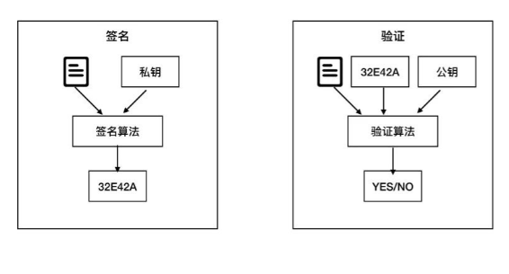
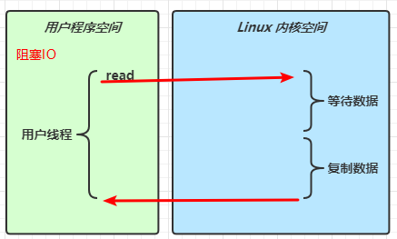
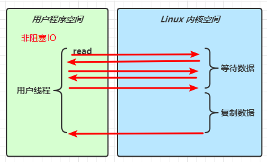
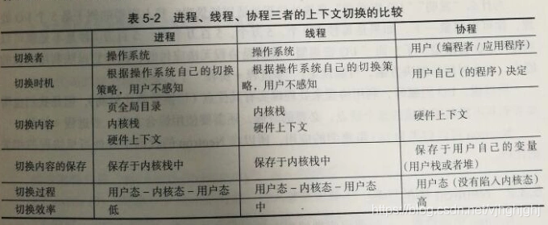
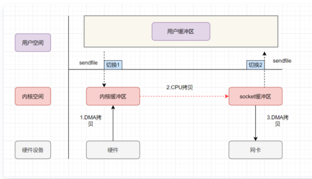

# 网络篇

## TCP 如何保证传输的可靠性？

1. **基于数据块传输** ：应用数据被分割成 TCP 认为最适合发送的数据块，再传输给网络层，数据块被称为报文段或段。
2. **对失序数据包重新排序以及去重**：TCP 为了保证不发生丢包，就给每个包一个序列号，有了序列号能够将接收到的数据根据序列号排序，并且去掉重复序列号的数据就可以实现数据包去重。
3. **校验和** : TCP 将保持它首部和数据的检验和。这是一个端到端的检验和，目的是检测数据在传输过程中的任何变化。如果收到段的检验和有差错，TCP 将丢弃这个报文段和不确认收到此报文段。
4. **超时重传** : 当发送方发送数据之后，它启动一个定时器，等待目的端确认收到这个报文段。接收端实体对已成功收到的包发回一个相应的确认信息（ACK）。如果发送端实体在合理的往返时延（RTT）内未收到确认消息，那么对应的数据包就被假设为[已丢失open in new window](https://zh.wikipedia.org/wiki/丢包)并进行重传。
5. **流量控制** : TCP 连接的每一方都有固定大小的缓冲空间，TCP 的接收端只允许发送端发送接收端缓冲区能接纳的数据。当接收方来不及处理发送方的数据，能提示发送方降低发送的速率，防止包丢失。TCP 使用的流量控制协议是可变大小的滑动窗口协议（TCP 利用滑动窗口实现流量控制）。
6. **拥塞控制** : 当网络拥塞时，减少数据的发送
7. **发送确认机制（ARQ协议）**
8. 网络拥塞控制

## TCP 请求头

- **Source Port（源端口）**：源端口号 （占用16位），发送端程序端口
- **Destination Port（目的端口）**：目的端口号（占用16位），接收端程序端口
- **Sequence Number（发送数据序号）**：用来标识从TCP发端向TCP收端发送的数据字节流，它表示在这个报文段中的的第一个数据字节在数据流中的序号；主要用来解决网络报乱序的问题；（占用32位）
- **Acknowledgment Number （ACK 确认号）**： 32位确认序列号包含发送确认的一端所期望收到的下一个序号，因此，确认序号应当是上次已成功收到数据字节序号加1。不过，只有当标志位中的ACK标志（下面介绍）为1时该确认序列号的字段才有效。主要用来解决不丢包的问题；
- **Data Offset（数据偏移量）** ： 数据偏移量（4位）给出首部中32 bit字的数目，需要这个值是因为任选字段的长度是可变的。这个字段占4bit（最多能表示15个32bit的的字，即4*15=60个字节的首部长度），因此TCP最多有60字节的首部。然而，没有任选字段，正常的长度是20字节； 如果有额外的 TCP 的 option 选项，还得加上 option 的长度。
- **TCP Flags（控制位）** ：TCP控制位（6位），每一位代表一个控制位，它们中的多个可同时被设置为1，主要是用于操控TCP的状态机的，依次为URG，ACK，PSH，RST，SYN，FIN。每个标志位的意思如下：
  - URG：此标志表示TCP包的紧急指针域（后面马上就要说到）有效，用来保证TCP连接不被中断，并且督促中间层设备要尽快处理这些数据；
  - **ACK**：此标志表示应答域有效，就是说前面所说的TCP应答号将会包含在TCP数据包中；有两个取值：0和1，为1的时候表示应答域有效，反之为0；
  - PSH：这个标志位表示Push操作。所谓Push操作就是指在数据包到达接收端以后，立即传送给应用程序，而不是在缓冲区中排队；
  - RST：这个标志表示连接复位请求。用来复位那些产生错误的连接，也被用来拒绝错误和非法的数据包；
  - **SYN**：表示同步序号，用来建立连接。SYN标志位和ACK标志位搭配使用，当连接请求的时候，SYN=1，ACK=0；连接被响应的时候，SYN=1，ACK=1；这个标志的数据包经常被用来进行端口扫描。扫描者发送一个只有SYN的数据包，如果对方主机响应了一个数据包回来 ，就表明这台主机存在这个端口；但是由于这种扫描方式只是进行TCP三次握手的第一次握手，因此这种扫描的成功表示被扫描的机器不很安全，一台安全的主机将会强制要求一个连接严格的进行TCP的三次握手；
  - **FIN**： 表示发送端已经达到数据末尾，也就是说双方的数据传送完成，没有数据可以传送了，发送FIN标志位的TCP数据包后，连接将被断开。这个标志的数据包也经常被用于进行端口扫描。
- **Reserved（保留字段）**：保留字段，目前还没有使用
- **Window（窗口）** ：窗口大小（16位），表示接收端可用缓冲区大小，根据缓冲区大小和每次包大小，就可以计算出同时处理的 TCP 包的个数。同时处理的包个数越多，则网速越快。
- **Checksum （校验和）**： 用来检查 TCP 包是否完整（16位）
- **Urgent Pointer （紧急指针）**：表示应紧急处理的数据位置（16位）。路由器可以把紧急的数据包优先处理。
- **Options（可选字段）**：可选字段，可变长度，最长为40字节。（因为 Data Offset 最多能表示60个字节长度的 TCP 头信息，固定的 TCP 头部为 20 字节）
- **Padding （填充）**：填充位。因为 Data Offset 只能表示 TCP 头部的长度 必须是 4 字节的整倍数。如果 Options 选项不足 4字节的整倍数，就需要 Padding 填充为 4 字节的整倍数。.

## TCP三次握手和四次挥手后，它的状态

**三次握手的状态**

**四次挥手的状态**

## TCP三次握手，问握手的ack/ACK和[数据](https://www.nowcoder.com/jump/super-jump/word?word=数据)交换的ack一样吗？

TCP的请求头中有一些字段：常用的源端口，目标端口，校验和，序列号SYN，ACK和确认号（ack）.

所以，**TCP请求报文中存在ACK和ack两个数值**

- ACK：这里出现的ACK即为上面所说的TCP报文段首部中的“ACK字段”，置1时该报文段为确认报文段。
  - **ACK字段**：在TCP报文段中，字段ACK=1时，确认号字段才有效。TCP规定，在连接建立后所有传送的报文段都必须把ACK置1。
- ack：而ack则为TCP报文段首部中“确认号字段”的具体数值。ack=x+1说明B希望A下次发来的报文段的第一个数据字节为序号=x+1的字节；ack=y+1说明A希望B下次发来的报文段的第一个数据字节为序号=y+1的字节。
  - **确认号字段：**该字段存放的信息为期望收到对方下一个报文段的第一个数据字节的序号。 例：A向B发送数据报文段，B需给A发送一个收到确认报文段来告知A已收到其发来的数据报文段。在B给A发送的确认报文段中，确认号为501，即表明序号1-500的字节已成功收到，接下来期望收到从A发来的序号为501的字节。

## UDP的请求头信息

- 源端口： 主机的应用程序使用的端口号。
- 目的端口：目的主机的应用程序使用的端口号。
- 长度：是指UDP头部和UDP数据的字节长度。因为UDP头 部长度为8字节，所以该字段的最小值为8。
- 校验和：检测UDP数据报在传输中是否有错，有错则丢弃。

## http与https

- ssl/tls协议中，通过公钥进行加密（发送者保存，公共获取的），通过私钥进行解密（接收者，只此一把，注意私钥的保密性）。
  - 公钥私钥的生成是单向陷门函数，即f(x;h)=y。可以通过输入x，陷门h生成加密后的结果y。可以通过y（加密后密文）和h（陷门）解密得到x。
  - f（x;h）计算方法为公钥，h陷门为私钥。
- http1.0与http1.1新增特性
  - 缓存机制：细化
  - HTTP/1.0 默认使用短连接，HTTP/1.1 优化为默认长连接模式。
  - Host头，能够使不同域名配置在同一个IP地址的服务器上。（即多个域名绑定一个IP）

**对称加密：AES，DES**

**非对称加密：RSA，DSA**

## 用了HTTPS就安全了吗？HTTPS 会被抓包吗？

会被抓包，HTTPS 只防止用户在不知情的情况下通信被监听，如果用户主动授信【明明游览器提示不安全，用户坚持访问】，是可以构建“中间人”网络，代理软件可以对传输内容进行解密。

## XSS

XSS，跨站脚本攻击，允许攻击者将恶意代码植入到提供给其它用户使用的页面中

## CSRF

CSRF（Cross-site request forgery）跨站请求伪造

##  数字签名

数字签名保证发送者的正确身份，避免客户端与服务端之间还有一个攻击者，作为中间人获取发送和结束消息。

数字签名，是采用私钥加密，公钥解密。

服务端与客户端都信任CA机构，获取公钥进行解密验证。

服务端为：小明；

客户端为：小红

服务端与客户端都信任CA机构，分别从CA机构获取私钥和公钥

- 服务端：将文件进行哈希运算，得到摘要（只是验证信息是否被篡改），将该摘要通过CA机构上的私钥加密，生成签名，将文件，数字证书（上面有数字签名）传输给客户端
- 客户端：将收到的数字证书上的数字签名通过CA的公钥进行解密，生成摘要，而将文件进行hash运算生成摘要，两个摘要对比来比较是否有被篡改过。

**对称加密：AES，DES**

**非对称加密：RSA，DSA**

## 浏览器怎么识别自签名证书

只适用于本地，上线的话，还是申请

点击浏览器地址栏那个不能访问的标志，导出站点的的自签名证书。然后在谷歌浏览器的证书管理当中导入这个证书，重启浏览器站点即可访问。

 步骤

1. 生成证书
2. 安装证书
3. 将生产的证书拷贝到Nginx目录中
4. 再重启Nginx

## 如何将IP与域名进行绑定

1. 首先购买一个域名，阿里上可以购买
2. 在申请域名首页里，有个解析
3. 解析按键：
   **主机记录填写：www
   解析线路选择：默认
   记录值：填写我们申请服务器的公网IP
   TTL：10分钟 默认就可以
   保存确认
   到现在域名和ip的关系已经绑定了**

## IP数据包传输的完整过程

**ping使用的协议是ICMP协议（网络层），与IMAP协议作区分：**IMAP协议：负责邮件接收的协议

**首先区分是否是同一子网**

- **主机A与主机B通信,A Ping B,图1:A-交换机-B,AB同一子网**

  

  1. ping数据包用的是ICMP协议（网络层），IP协议的一个子协议，位于三层，包含A的IP，B的IP,三层进行IP封装成包,进入二层
  2. A,B处于相同子网,查看缓存中对与目的对应得B第2层mac地址,如果存在，直接进行第2层封装成帧，经物理层信号编码，以0101010010这样的bits流传输在网络介质上。
  3. 如果不存在B的MAC，则发送ARP广播请求B的MAC，ARP数据包经物理层进入交换机端口，需要进行源端口号学习，目的端口查找，B响应ARP请求，交换机又可以学习一目的MAC地址与哪个端口对应，在下次传送数据时就不再需要对所有端口进行广播了。B通过**ARP单播**把B的MAC响应给A,此时再返回(2)的处理过程。
  4. 当再进行A与B之间数据包转发，将直接用B的MAC地址封装，数据转发得以高速交换

- **主机A与主机C通信，A Ping C,图:A-交换机-路由器M-路由器N-交换机-C，AC不同子网**

  

  1. 两个机器不在同一子网内，A要与目的C通信，A要向“缺省网关”发出ARP包，而“缺省网关”的IP地址已经在A系统软件中设置。这个IP地址实际上对应路由器M的E0的IP地址。所以A对“缺省网关”的IP地址广播出一个ARP请求时，路由器M的E0口的MAC回复给A，此时A数据包的目的MAC替换为M的E0口MAC。
  2. MAC替换后，经物理层，传输到交换机物理层，再传到交换机数据链路层，再经数据数据链路层到物理层。
  3. 经bit流传到路由器M的物理层，然后传到数据链路层，二层解封装，目的IP与路由器M三层IP路由表比较，若匹配正确，交给上层处理，否则会缓存数据包内容，然后根据目标地址查找路由表找到相关表项，得到NEXT HOP及出接口的MAC地址，用这两个地址作为新的目的及源MAC地址封装事先缓存的数据包，然后转发，这个过程称为帧的重写（REWRITE）。
  4. 重复进行MAC替换后， 在路由器N中，找到与目的IP匹配表项，若N中存在C对应的MAC表项，则数据传输到C网络层，否则N发送ARP广播请求C的MAC。
  5. 当C收到A的数据包后，再从A到C进行一次反向MAC替换过程。反向过程中，每一步省略掉ARP请求NEXT HOP的MAC，因为MAC表已经建立起来。

IP报文传输过程包括：

  　　1. Host sends packet to default gateway（主机将数据包发送到默认网关）
        　　2. Packet placed in frame（数据包被封装入帧）
              　　3. Router receives frame（路由器接到帧）
                    　　4. Router finds destination network in route table（路由器在路由表中发现目标网络）
          　　5. Router chooses next hop toward destination（路由器选择一个更接近目标的下一跳）
                  　　6. MAC address of next hop determined（下一跳的MAC地址被确定）
                         　　7. Packet placed in frame（数据包被封装入帧）
                            　　8. Repeats steps 2 through 7 as necessary（如果需要的话，重复步骤2～7）
                          　　9. Router receives frame（路由器接到帧）
                          　　10. Router finds network directly connected（路由器发现直连网络）
                                  　　11. MAC address of end host determined（最终主机的MAC地址被确定）
                                    　　12. Packet placed in frame to final destination（帧中的数据包被发送到最终主机）

## Http协议常用的状态码

- 14种常用的HTTP状态码列表

| 状态码 | 状态码英文名称                                               | 中文描述                                                     |
| ------ | ------------------------------------------------------------ | ------------------------------------------------------------ |
| 100    | continue                                                     | 继续。客户端应继续其请求                                     |
| 101    | Switching [Proto](https://www.nowcoder.com/jump/super-jump/word?word=Proto)cols | 切换协议。服务器根据客户端的请求切换协议。只能切换到更高级的协议，例如，切换到HTTP的新版本协议 |
| 200    | OK                                                           | `请求成功`。一般用于GET与POST请求                            |
| 204    | No Content                                                   | 无内容。`服务器成功处理，但未返回内容`。在未更新网页的情况下，可确保浏览器继续显示当前文档 |
| 206    | Partial Content                                              | `是对资源某一部分的请求`，服务器成功处理了部分GET请求，响应报文中包含由Content-Range指定范围的实体内容。 |
|        |                                                              |                                                              |
| 301    | Moved Permanently                                            | `永久性重定向`。请求的资源已被永久的移动到新URI，返回信息会包括新的URI，浏览器会自动定向到新URI。今后任何新的请求都应使用新的URI代替 |
| 302    | Found                                                        | `临时性重定向`。与301类似。但资源只是临时被移动。客户端应继续使用原有URI |
| 303    | See Other                                                    | `查看其它地址`。与302类似。使用GET和POST请求查看             |
| 304    | Not Modified                                                 | 未修改。所请求的资源未修改，服务器返回此状态码时，不会返回任何资源。客户端通常会缓存访问过的资源，通过提供一个头信息指出客户端希望只返回在指定日期之后修改的资源 |
| 307    | Temporary Redirect                                           | `临时重定向`。与302类似。使用GET请求重定向，会按照浏览器标准，不会从POST变成GET。 |
|        |                                                              |                                                              |
| 400    | Bad Request                                                  | `客户端请求报文中存在语法错误，服务器无法理解`。浏览器会像200 OK一样对待该状态吗 |
| 401    | Unauthorized                                                 | `请求要求用户的身份认证`，通过HTTP认证（BASIC认证，DIGEST认证）的认证信息，若之前已进行过一次请求，则表示用户认证失败 |
| 402    | Payment Required                                             | 保留，将来使用                                               |
| 403    | Forbidden                                                    | `服务器理解请求客户端的请求，但是拒绝执行此请求`             |
| 404    | Not Found                                                    | 服务器无法根据客户端的请求找到资源（网页）。通过此代码，网站设计人员可设置"您所请求的资源无法找到"的个性页面。也可以在服务器拒绝请求且不想说明理由时使用 |
| 408    | Request timed out                                            | 请求超时                                                     |
|        |                                                              |                                                              |
| 500    | Internal Server Error                                        | `服务器内部错误，无法完成请求`，也可能是web应用存在bug或某些临时故障 |
| 501    | Not Implemented                                              | 服务器不支持请求的功能，无法完成请求                         |
| 503    | Service Unavailable                                          | `由于超载或系统维护，服务器暂时的无法处理客户端的请求`。延时的长度可包含在服务器的Retry-After头信息中 |
| 504    |                                                              | 请求超时，                                                   |

## 拥塞控制

使用4种算法，代表4个阶段

- 慢开始
  - 假设当前发送方拥塞窗口cwnd的值为1，而发送窗口swnd等于拥塞窗口cwnd，因此发送方当前只能发送一个数据报文段（拥塞窗口cwnd的值是几，就能发送几个数据报文段），接收方收到该数据报文段后，给发送方回复一个确认报文段，发送方收到该确认报文后，将拥塞窗口的值翻倍，
  - 当前的拥塞窗口cwnd的值已经等于慢开始门限值，之后改用拥塞避免算法。
- 拥塞避免：
  - 也就是每个传输轮次，拥塞窗口cwnd只能线性加一。
- 快重传：
  - 假设接收方已经收到M1,M2数据，一直没收到M3，根据可靠重传，接收方可以在适当时机发送一次对 M2 的确认（之前已经确认过此时再确认一次，重复确认）。发送方只要一连收到三个重复确认。**则进入快恢复阶段**
- 快恢复
  - 将拥塞窗口大小减半，把慢开始门限ssthresh 减半，而不是慢开始（从1开始）。

## TCP 面试系列之快重传与快恢复

https://zhuanlan.zhihu.com/p/261096328

- 快重传算法首先要求接收方每收到一个失序的报文段后就立即发出重复确认（为的是使发送方及早知道有报文段没有到达对方）而不要等待自己发送数据时才进行捎带确认。
- 快重传算法规定，发送方只要一连收到三个重复确认就应当立即重传对方尚未收到的报文段 M3，而不必继续等待为 M3 设置的重传计时器到期。

快恢复

- 当发送方连续收到三个重复确认时，就执行“乘法减小”算法，把慢开始门限ssthresh 减半。这是为了预防网络发生拥塞。请注意，接下去不执行慢开始算法。
  （慢开始算法，拥塞窗口最开始为1，快恢复只用将窗口减半）

## SYN攻击

**简介**：利用TCP协议栈三次握手弱点来进行网络攻击，

- TCP协议建立连接的时候需要双方相互确认信息，
- SYN攻击通过故意不完成建立连接所需要的三次握手过程，造成连接一方的资源耗尽。
- 通过发送大量的半连接请求，耗费CPU和内存资源。

**相关概念：**

- **半连接**：服务器发送SYN-ACK之后，收到客户端的ACK之前的TCP连接称为半连接
- **半连接队列**：服务器维护一个半连接队列，存放半连接
- **SYN-ACK 重传次数**：服务器发送完SYN－ACK包，如果未收到客户确认包，服务器进行重传，有次数限制
- **半连接存活时间**：服务从收到SYN包到确认这个报文无效的最长时间

**SYN攻击**

- 大量发送伪造源IP的SYN包也就是**伪造第一次握手数据包**，服务器每接收到一个SYN包就会为这个连接信息分配核心内存并放入半连接队列，如果短时间内接收到的SYN太多，半连接队列就会溢出
- 客户端在短时间内伪造大量不存在的IP地址，向服务器不断地发送syn包，服务器回复确认包，并等待客户的确认，由于源地址是不存在的，服务器需要不断的重发直至超时，这些伪造的SYN包将长时间占用未连接队列

攻击梳理：

- 通过伪造源IP，发送第一次握手数据包，服务器将其添加到半连接队列，（队列溢出）
- 不断的超时重传第二次握手，占用网络资源。

**SYN攻击防范技术**

- **SYN攻击不能完全被阻止**
- 通过防火墙、路由器等**过滤网关防护**
- 通过**加固TCP/IP协议栈防范**

- 缩短超时时间

## TCP建立连接后怎么保持连接？

用TCP协议自身的保活定时器实现**心跳机制**。

- 心跳机制的实现有两种方式：
  - 应用层自己实现心跳包
    - 应用程序发送心跳包
  - TCP本身存在心跳机制
- 定时向被检测系统发送心跳包，被检测系统收到心跳包进行回复，收到回复说明对方存活。心跳能够给长连接提供保活功能，能够检测长连接是否正常，一旦链路死了，不可用了，能尽快知道，

## URI与URL的区别

- url一般是一个完整的链接，我们可以直接通过这个链接（url）访问到一个网站
- uri是一个标识，用来区别于其他资源的标识。
  - 要求找到一本书（书就是资源），这本书在A省份/B市/C区/D街道/xx栋/392-1住户/1号房间/名字叫做《xxx》 (整个地址是URL)
    那么此时的 《xxx》 这本书 对于 1号房间 来说就是uri。

**1、作用的区别**

URL（统一资源定位符）主要用于链接网页，网页组件或网页上的程序，借助访问方法（http，ftp，mailto等协议）来检索位置资源。

URI（统一资源标识符）用于定义项目的标识，此处单词标识符表示无论使用的方法是什么（URL或URN），都要将一个资源与其他资源区分开来。

**2、可以说URL是URI（URL是URI的子集），但URI永远不能是URL。**

**3、协议区别**

URL指定要使用的协议类型，而URI不涉及协议规范。

## GET与POST的区别

https://cloud.tencent.com/developer/article/1498283

GET和POST的区别： 

- GET请求，用于获取数据，无副作用的，是幂等的，且可缓存(可作为书签)，请求的数据会附加在URL之后，以?分割URL和传输数据，多个参数用&连接。URL的编码格式采用的是ASCII编码，而不是uniclde，即是说所有的非ASCII字符都要编码之后再传输。  
- GET提交有数据大小的限制，一般是不超过1024个字节，而这种说法也不完全准确，HTTP协议并没有设定URL字节长度的上限，而是浏览器做了些处理，所以长度依据浏览器的不同有所不同；POST请求在HTTP协议中也没有做说明，一般来说是没有设置限制的，但是实际上浏览器也有默认值。总体来说，少量的数据使用GET，大量的数据使用POST;
- POST请求：用于提交数据，  有副作用，非幂等，不可缓存（不可作为书签），POST请求会把请求的数据放置在HTTP请求包的body中。上面的item=bandsaw就是实际的传输数据，没有直接暴露在链接地址上

 因此，GET请求的数据会暴露在地址栏中，所以安全性比较低，比如密码是不能暴露的，就不能使用GET请求 , 而POST请求中，请求参数信息是放在请求头的，所以安全性较高，可以使用。在实际中，涉及到登录操作的时候，尽量使用HTTPS请求，安全性更好。而POST请求则不会;

GET书签可被收藏、POST为书签不可收藏。

- GET历史参数保留在浏览器历史中、POST参数不会保存在浏览器历史中。

- Get限制Form表单的数据集的值必须为ASCII字符；而Post支持整个ISO10646字符集。

- GET产生一个TCP数据包；POST产生两个TCP数据包。

  对于GET方式的请求，浏览器会把http header和data一并发送出去，服务器响应200（返回数据）；

  而对于POST，浏览器先发送header，服务器响应100 continue，浏览器再发送data，服务器响应200 ok（返回数据）。

# 操作系统

## 操作系统-锁机制

所谓的锁，可以理解为[内存](https://so.csdn.net/so/search?q=内存&spm=1001.2101.3001.7020)中的一个整型数，拥有两种状态：空闲状态和上锁状态。加锁时，判断锁是否空闲，如果空闲，修改为上锁状态，返回成功；如果已经上锁，则返回失败。解锁时，则把锁状态修改为空闲状态。
加锁过程用如下伪[码表](https://so.csdn.net/so/search?q=码表&spm=1001.2101.3001.7020)示：
1、read lock；
2、判断lock状态；
3、如果已经加锁，失败返回；
4、把锁状态设置为上锁；
5、返回成功。
虽然每一步是原子性的，但是每一步之间却是可以中断的。比如进程A在执行完2后发生中断，中断中进程B也执行了加锁过程，返回中断后就会发生两个进程都会加锁。
对于这个问题，计算机已经解决，**方法是采用原子级汇编指令test and set 和Compare and Swap 。**

**并发性问题**

- 中断：假设线程A执行完第一步，发生中断，中断返回后，OS调度线程B，线程B也来加锁并且加锁成功，这时OS调度线程A执行，线程从第二步开始执行，也加锁成功。
- 多核：描述的就是两个核同时获取到锁的情况

**解决办法：**

- 单核：硬件层面实现加锁的原子操作，test and set。
- 关闭中断
- 但是：多核情况下，两个核同时执行test and set ，则硬件执行时还是得从内存中读取lock，判断并设置状态到内存，这个过程不是原子操作。
  - 其实**硬件提供了锁内存总线的机制，我们在锁内存总线的状态下执行test and set操作，就能保证同时只有一个核来test and set，从而避免了多核下发生的问题。**
  - **锁总线**，
    - 当一个处理器想要更新某个变量的值时，向总线发出LOCK#信号，此时其他处理器的对该变量的操作请求将被阻塞，发出锁定信号的处理器将独占共享内存，于是更新就是原子性的了。

**总结一下**

- 在硬件层面，CPU提供了原子操作、关中断、锁内存总线的机制；
- OS基于这几个CPU硬件机制，就能够实现锁的上锁和释放锁；
- 再基于锁，就能够实现各种各样的同步机制（信号量、消息、Barrier等等等等）。

## 伙伴系统和slab机制（内存分配机制）

内存在进行申请和释放内存的情况下，难免会产生碎片。Linux采用伙伴系统解决外部碎片的问题，采用slab解决内部碎片的问题。

内存碎片是由内存的申请和释放产生的，通常分为内部碎片和外部碎片。

- 内部碎片是由于采用固定大小的内存分区，即以固定的大小块为单位来分配，采用这种方法，进程所分配的内存可能会比所需要的大，这多余的部分便是内部碎片。
- 外部碎片是由于未分配的连续内存区域太小，以至于不能满足任意进程所需要的内存分配请求，这些小片段且不连续的内存空间被称为外部碎片。

内存分配机制

https://www.cnblogs.com/linhaostudy/p/12445163.html

https://blog.csdn.net/qq_44272681/article/details/124199068

- ## 伙伴系统

  - 问题：页大小占用4Kb。在实际应用中，经常需要分配一组连续的页，而频繁地申请和释放不同大小的连续页，必然导致在已分配页的内存块中分散了许多小块的空闲页。这样，即使这些页是空闲的，其他需要分配连续页的应用也很难得到满足。
  - **伙伴系统算法：将所有的空闲页分为11个链表，链表分别为：页个数为1，2，4，8，16，32，64，128，256，512和1024个连续页的位置（对应值4Kb，8Kb，16Kb...）**
    - 伙伴系统从物理连续的大小固定的段上进行分配，保证内核在申请一小块内存的情况下，不会从大块的连续空间内截取一小段，从而保证了大块内存的连续性和完整性。满足请求分配单元的大小为 2 的幂（4KB、 8KB、16KB 等）。请求单元的大小如不适当，就调整到下一个更大的 2 的幂。例如请求大小为 11KB，则按 16KB 的段来请求。
    - 假设内存段的大小最初为 256KB，内核请求 21KB 的内存。最初，这个段分为两个伙伴，称为 AL 和 AR，每个的大小都为 128KB；这两个伙伴之一进一步分成两个 64KB 的伙伴，即 BL 和 BR。然而，从 21KB 开始的下一个大的 2 的幂是 32KB，因此 BL 或 BR 再次划分为两个 32KB 的伙伴 CL 和 CR。其中一个 32KB 的段可用于满足 21KB 请求。这种方案如图所示，其中 CL 段是分配给 21KB 请求的。
      - 
    - 释放内存时，会与相邻的伙伴结合，组成更大的链表。
  - **优点：**解决外部碎片问题，在申请一小块连续内存时，不会从大块内存中进行获取，保证了大块内存的连续性 和完整性
  - **缺点：**
    1，内部碎片仍然存在，即申请33kb连续内存 ，则需要64Kb的内存空间，存在浪费
    2，系统中可能存在许多空闲块，即伙伴，但因为各个内存之间不连续，被很小的页阻断，导致无法合并成更大的连续内存块

- ## SLAB机制

  - slab是Linux操作系统的一种内存分配机制。其工作是针对一些经常分配并释放的对象，如进程描述符等，这些对象的大小一般比较小，如果直接采用伙伴系统来进行分配和释放，不仅会造成大量的内碎片，而且处理速度也太慢。而slab分配器是基于对象进行管理的，相同类型的对象归为一类(如进程描述符就是一类)，每当要申请这样一个对象，slab分配器就从一个slab列表中分配一个这样大小的单元出去，而当要释放时，将其重新保存在该列表中，而不是直接返回给伙伴系统，从而避免这些内碎片。slab分配器并不丢弃已分配的对象，而是释放并把它们保存在内存中。当以后又要请求新的对象时，就可以从内存直接获取而不用重复初始化。
  - **将经常分配以及释放的小对象放入一个列表中，而没有放入页中，因为页太大，导致内部的内存碎片过多。**
    - **在申请小对象时，slab分配器会从列表中有已经分配好并且标记为空闲的对象返回，**
    - **释放时，将其重新保存在列表中，仅仅是释放但仍将其保存在内存中，在下一次申请新对象时，直接获取不必进行重复初始化。**

## 灰度发布

灰度发布指在黑与白之间，能够平滑过渡的一种发布方式。在其上可以进行A/B testing，即让一部分用户继续用产品特性A，一部分用户开始用产品特性B，如果用户对B没有什么反对意见，那么逐步扩大范围，把所有用户都迁移到B 上面来。灰度发布可以保证整体系统的稳定，在初始灰度的时候就可以发现、调整问题，以保证其影响度。

灰度发布流程细节如下：

1.在灰度发布开始后，先启动一个新版本应用，但是并不直接将流量切过来，而是测试人员对新版本进行线上测试，启动的这个新版本应用，就是我们的金丝雀。

2.如果测试没有问题，那么可以将少量的用户流量导入到新版本上，然后再对新版本做运行状态观察，收集各种运行时数据，如果此时对新旧版本做各种数据对比，就是所谓的A/B测试。

3.当确认新版本运行良好后，再逐步将更多的流量导入到新版本上，在此期间，还可以不断地调整新旧两个版本的运行的服务器副本数量，以使得新版本能够承受越来越大的流量压力。直到将100%的流量都切换到新版本上，最后关闭剩下的老版本服务，完成灰度发布。如果在灰度发布过程中发现了新版本有问题，就应该立即将流量切回老版本上，这样，就会将负面影响控制在最小范围内。

## 搜索目录下所有文件包含某个内容的文件

从文件内容查找匹配指定[字符串](https://so.csdn.net/so/search?q=字符串&spm=1001.2101.3001.7020)的行：
$ [grep](https://so.csdn.net/so/search?q=grep&spm=1001.2101.3001.7020) “被查找的字符串” 文件名

## 文件描述符

Linux 系统中，把一切都看做是文件，当进程打开现有文件或创建新文件时，内核向进程返回一个文件描述符，文件描述符就是内核为了高效管理已被打开的文件所创建的索引，用来指向被打开的文件，所有执行I/O操作的系统调用都会通过文件描述符。

https://segmentfault.com/a/1190000009724931

## linux 如何查看端口被哪个进程占用？

- **lsof -i**：端口号
- **netstat -tunlp**     
- **netstat -tunlp |grep 端口号**      指定端口号

杀死进程 

- **kill -9 进程号**

**查看连接状态**

- *netstat -nat* 

## | grep就是管道操作，说一下对于管道操作的了解

我们在Linux下经常要用到管道操作符，也就是"|"，即一个竖线。

终端执行时，只能执行一条指令，如果要执行多条，可以使用管道操作。

就是将前面每一个进程的输出直接作为下一个进程的输入。
举例： 

- cut:从某一行信息中取出某部分我们想要的信息 
- grep:分析一行信息，如果其中有我们需要的信息，就将该行拿出来 
- 排序命令：sort
- wc：显示/统计信息数量
- uniq：去重
- tr：用来删除一段信息当中的文字，或者进行文字信息得替换 
- split：顾名思义，讲一个大文件依据文件大小或行数切割成为小文件

## TOP指令如何实现的

1. 首先会读取一系列以依赖文件
2. 然后会读取一些系统配置信息
3. 最后就是从`/proc`目录下读取进程的statm信息
   1. 获取cpu使用率

## Linux：怎么查IO的流量？

**查看网络流量**

​	`nload` 命令可以查看各个网络设备的当前网络速率，也会展示流经设备的总流量。

## Linux的5种IO模型梳理

IO操作是：网络IO还是磁盘IO，分为两阶段：1，从磁盘中把数据读取到内核空间的缓冲区，2，从内核空间拷贝到用户空间的缓冲区

- 同步阻塞IO**（BIO）**

  - 同步阻塞 IO 模型中，应用程序发起 read 调用后，两阶段都会阻塞
  - 
  - 

- 同步非阻塞IO

  - 用户进程发起一个IO请求后可以返回做其它事情，但是该用户进程不停的询问第一阶段是否完成（消耗资源），若完成，则用户线程进入阻塞，将数据拷贝到进程的缓存区。
  - 轮询过程消耗CPU资源
  - 

- 同步多路复用IO**（NIO）**

  - **文件描述符**（FD），关联一个Linux中的一个文件。可以监听它为是否是可读状态

  - **IO多路复用**：第一阶段：单独一个线程监听多个FD，若某个FD可读可写时，通知对应的用户线程执行第二阶段。（可能有多个用户进程提交IO请求，都交给该监听线程，用户进程两阶段均阻塞，本质为**阻塞IO**）

  - 本质类似于餐厅点餐，

    - 原本的IO模型是，前面的人先点餐，后面的人等着前面的点完后面的再点。若是前面的人点餐很拖沓，即使后面的人能很快点餐，仍会无效等待
    - IO多路复用：专门一个人不断询问排队的人，谁想好点什么餐了，就提交给前台。避免了一个线程阻塞，后续所有线程都阻塞的情况。

  - 

  - ### IO多路复用方案

  - 调用 select，poll，epoll来提交到单线程

  - https://zhuanlan.zhihu.com/p/367591714   有动画可看懂

  - **文件描述符**（FD），关联一个Linux中的一个文件。可以监听它为是否是可读状态

  - **select**

    - rfds  一个整数（FD集合）每个bit位代表一个fd，0代表未就绪，1代表就绪：
    - 监听的FD个数最大不超过1024【有个数限制】
    - 每次select都是将要监听的FD集合从用户空间拷贝到内核空间，【消耗性能】
    - 有数据就绪后，返回就绪的FD集合【即从内核空间拷贝到用户空间】，此时用户线程需要遍历整个集合来判断是哪些FD就绪（遍历消耗时间）
    - 随着连接数的增加，性能急剧下降

  - **poll**

    - 使用链表表示FD集合，解决了select监听FD上限问题，仍需要遍历所有FD。（性能提升不明显）
    - 随着连接数的增加，性能急剧下降

  - **epoll**

    - 用户空间提交FD，内核构建红黑树；内核使用红黑树保存要监听的FD，且查找效率高
    - 用户主需要将要监听的FD拷贝到内核空间一次
    - 有数据就绪后，返回的只是就绪的FD，无需再次遍历

  |              | select                                                       | poll                                                         | epoll                                             |
  | ------------ | ------------------------------------------------------------ | ------------------------------------------------------------ | ------------------------------------------------- |
  | 性能         | 随着连接数的增加，性能急剧下降，处理成千上万的并发连接数时，性能很差 | 随着连接数的增加，性能急剧下降，处理成千上万的并发连接数时，性能很差 | 随着连接数的增加，性能基本没有变化                |
  | 连接数       | 一般1024                                                     | 无限制                                                       | 无限制                                            |
  | 内存拷贝     | 每次调用select拷贝                                           | 每次调用poll拷贝                                             | fd首次调用epoll_ctl拷贝，每次调用epoll_wait不拷贝 |
  | 数据结构     | bitmap                                                       | 数组                                                         | 红黑树                                            |
  | 内在处理机制 | 线性轮询                                                     | 线性轮询                                                     | FD挂在红黑树，通过事件回调callback                |
  | 时间复杂度   | O(n)                                                         | O(n)                                                         | O(1)                                              |

  

  - 多路：指的是多个网络连接客户端（Socket），复用：复用同一个线程(单进程)，即**一个线程内处理多个IO请求**
  - 与同步非阻塞IO不同，所有的IO请求到同一个线程（内核中的），该线程轮询查询所有IO读取状态，读取完成后，通知对应线程进行拷贝工作。
  - **注意：用户调用select进行IO请求，该进程会进入阻塞。**本质是同步阻塞IO。
  - IO 多路复用的系统调用，有 select，poll，epoll。 epoll是select的优化版本
  - **避免了将每一个IO请求分配给一个线程来单独处理，多路复用将IO请求统一交给一个线程处理，轮询查询状态**

- 信号驱动式IO（signal-driven IO）

  - Linux 用socket进行信号驱动 IO，用户线程发起一个IO请求操作会给对应的socket安装一个信号处理函数，进程继续运行并不阻塞，当IO事件就绪，进程收到SIGIO 信号，然后处理 IO 事件。（用户进程提交一个IO请求，建立一个信号处理函数。用户执行自己的程序，不阻塞，内核将数据准备完成，会主动的通知用户进程，用户进程阻塞，进行数据拷贝）

- **异步IO（A IO）**

  - 异步 IO 是基于事件和回调机制实现的，提交IO请求后会直接返回，不会堵塞在那里，在内核态将一二阶段都完成，通知相应的线程进行后续的操作。**（AIO）**
  - 唯一的异步方式：在第二阶段是异步，才是异步操作

## epoll的LT和ET

epoll有两种工作模式：LT（水平触发 ）和ET（边缘触发）模式

默认采用LT，水平触发。

- LT：水平触发，可以处理阻塞和非阻塞套接字
- ET：边缘触发，只支持非阻塞套接字，

LT模式状态时，主线程正在epoll_wait等待事件时，请求到了，epoll_wait返回后没有去处理请求(recv)，那么下次epoll_wait时此请求还是会返回（立刻返回了）；而ET模式状态下，这次没处理，下次epoll_wait时将不返回（所以我们应该每次一定要处理），可见很大程度降低了epoll的触发次数

## 二、进程和线程的区别以及协程

一个进程可以有多个线程

地址空间：

线程共享本进程的地址空间，而进程之间是独立的地址空间。

资源：

线程共享本进程的资源如内存、I/O、cpu等，不利于资源的管理和保护，而进程之间的资源是独立的，能很好的进行资源管理和保护。

健壮性：

多进程要比多线程健壮，一个进程崩溃后，在保护模式下不会对其他进程产生影响，但是一个线程崩溃整个进程都死掉。

执行过程：

每个独立的进程有一个程序运行的入口、顺序执行序列和程序入口，执行开销大。

但是线程不能独立执行，必须依存在应用程序中，由应用程序提供多个线程执行控制，执行开销小。

创建和销毁消耗：

线程创建和销毁比进程快，因为进程创建过程中，还需要资源管理信息，比如页全局目录等信息，线程不需要这些信息

可并发性：

两者均可并发执行。

切换时：

进程切换时，消耗的资源大，线程切换消耗资源少。所以涉及到频繁的切换时，使用线程要好于进程。同样如果要求同时进行并且又要共享某些变量的并发操作，只能用线程不能用进程。

其他：

线程是CPU处理器调度的基本单位，但是进程是系统运行程序的基本单位。

**协程**

**协程是一种比线程更加轻量级的一种函数**。正如一个进程可以拥有多个线程一样，一个线程可以拥有多个协程。**协程不是被操作系统内核所管理的，而是完全由程序所控制的，即在用户态执行**。 这样带来的好处是：性能有大幅度的提升，因为不会像线程切换那样消耗资源。

一个进程可以包含多个线程，一个线程也可以包含多个协程。简单来说，在一个线程内可以有多个这样的特殊函数在运行，但是有一点必须明确的是：**一个线程中的多个协程的运行是串行的。** 如果是多核CPU,那多个进程或一个进程内的多个线程是可以并行运行的。但是在一个线程内协程 却绝对是串行的，无论CPU有多少个核毕竟协程虽然是一个特殊的函数，但仍然是一个函数。 一个线程内可以运行多个函数，但这些函数都是串行运行的。当一个协程运行时，其他协程必须被挂起

进程、线程、协程的对比如下：

- 协程既不是进程也不是线程，协程仅是一个特殊的函数。协程、进程和线程不是一个维度的。
- 一个进程可以包含多个线程，一个线程可以包含多个协程。虽然一个线程内的多个协程可以切换但是这多个协程是串行执行的，某个时刻只能有一个线程在运行，没法利用CPU的多核能力。
- 协程与进程一样，也存在上下文切换问题。
- 进程的切换者是操作系统，切换时机是根据操作系统自己的切换策略来决定的，用户是无感的。**进程的切换内容包括页全局目录、内核栈和硬件上下文，切换内容被保存在内存中。** 进程切换过程采用的是“从用户态到内核态再到用户态”的方式，切换效率低。
- 线程的切换者是操作系统，切换时机是根据操作系统自己的切换策略来决定的，用户是无感的。**线程的切换内容包括内核栈和硬件上下文。线程切换内容被保存在内核栈中。**线程切换过程采用的是“从用户态到内核态再到用户态”的方式，切换效率中等。
- 协程的切换者是用户(编程者或应用程序),切换时机是用户自己的程序来决定的。**协程的切换内容是硬件上下文，切换内存被保存在用自己的变量(用户栈或堆)中。协程的切换过程只有用户态(即没有陷入内核态),因此切换效率高。**

## 线程上下文切换的操作

**进程切换分两步：**

1.切换**页目录**以使用新的地址空间

2.切换**内核栈**和**硬件上下文**  【切换的数据保存在内核栈中】

线程切换不需要做第1步，第2步是进程和线程都要做的

**性能消耗：**

- 线程上下文切换，虚拟地址空间时相同的，不用切换，进程则不同。
- 进程和线程的上下文切换都需要操作系统内核完成。需要内核态与用户态的转换。
- 上下文切换会扰乱缓存机制，一旦切换上下文，则缓存的内存地址信息都作废了，

**进程上下文包含了进程执行所需要的所有信息。**

用户地址空间：包括程序代码，数据，用户堆栈等；
控制信息：进程描述符，内核栈等；
硬件上下文：进程恢复前，必须装入寄存器的数据统称为硬件上下文。

## 进程的通信方式与线程的通信方式

- **进程通信的方式**
  - **管道/匿名管道(Pipes)** ：用于具有亲缘关系的父子进程间或者兄弟进程之间的通信。shell 命令中的「`|`」竖线就是匿名管道。**管道通信都是单向的，通信效率低，不适合进程间频繁的数据交换。**
  - **有名管道(Names Pipes)** : 匿名管道由于没有名字，只能用于亲缘关系的进程间通信。为了克服这个缺点，提出了有名管道。有名管道严格遵循**先进先出(first in first out)**。有名管道以磁盘文件的方式存在，可以实现本机任意两个进程通信。
  - **信号(Signal)** ：信号是一种比较复杂的**异步通信机制**，用于通知接收进程某个事件已经发生；
  - **消息队列(Message Queuing)** ：消息队列是消息的链表,具有特定的格式,存放在内存中并由消息队列标识符标识。管道和消息队列的通信数据都是先进先出的原则。与管道（无名管道：只存在于内存中的文件；命名管道：存在于实际的磁盘介质或者文件系统）不同的是消息队列存放在内核中，只有在内核重启(即，操作系统重启)或者显式地删除一个消息队列时，该消息队列才会被真正的删除。消息队列可以实现消息的随机查询,消息不一定要以先进先出的次序读取,也可以按消息的类型读取.比 FIFO 更有优势。**消息队列克服了信号承载信息量少，管道只能承载无格式字 节流以及缓冲区大小受限等缺点。**
  - **信号量(Semaphores)** ：信号量是一个计数器，用于多进程对共享数据的访问，信号量的意图在于进程间同步。这种通信方式主要用于解决与同步相关的问题并避免竞争条件。
  - **共享内存(Shared memory)** ：使得多个进程可以访问同一块内存空间，不同进程可以及时看到对方进程中对共享内存中数据的更新。这种方式需要依靠某种同步操作，如互斥锁和信号量等。可以说这是最有用的进程间通信方式。
  - **套接字(Sockets)** : 此方法主要用于在客户端和服务器之间通过网络进行通信。套接字是支持 TCP/IP 的网络通信的基本操作单元，可以看做是不同主机之间的进程进行双向通信的端点，简单的说就是通信的两方的一种约定，用套接字中的相关函数来完成通信过程。
- **线程间的同步的方式**
  - **互斥量(Mutex)**：采用互斥对象机制，只有拥有互斥对象的线程才有访问公共资源的权限。因为互斥对象只有一个，所以可以保证公共资源不会被多个线程同时访问。比如 Java 中的 synchronized 关键词和各种 Lock 都是这种机制。
  - **信号量(Semaphore)** ：它允许同一时刻多个线程访问同一资源，但是需要控制同一时刻访问此资源的最大线程数量。
  - **事件(Event)** :Wait/Notify：通过通知操作的方式来保持多线程同步，还可以方便的实现多线程优先级的比较操作。

## 多级反馈队列调度算法

多级反馈队列调度算法是一种根据先来先服务原则给就绪队列排序，为就绪队列赋予不同的优先级数，不同的时间片，按照优先级抢占CPU的调度算法。

## 僵尸进程与孤儿进程

- 多进程程序，⽗进程⼀般需要跟踪⼦进程的退出状态，当⼦进程退出，⽗进程在运⾏，⼦进程必须等到⽗进程捕获到了⼦进程的退出状态才真正结束。在⼦进程结束后，⽗进程读取状态前，此时⼦进程为**僵⼫进程**。
- 若父进程先于子进程结束，则此时子进程是**孤儿进程**。孤儿进程将被 init 进程（进程号为1）领养，并由 init 进程对孤儿进程完成状态收集工作。**孤儿进程不会成为僵尸进程**
- 设置僵⼫进程的⽬的是维护⼦进程的信息，以便⽗进程在以后某个时候获取。这些信息⾄少包括进程ID，进程的终⽌状态，以及该进程使⽤的CPU时间。所以当终⽌⼦进程的⽗进程调⽤wait或waitpid时就可以得到这些信息。
- 但是**⼦进程停⽌在僵⼫态会占据内核资源，所以需要避免僵⼫进程的产⽣或⽴即结束⼦进程的僵⼫态**。（缩短僵尸进程的时间）
  - **僵尸进程不能使用kill指令杀死**。因为子进程已经执行结束。仅仅处于等待状态
  - 杀死父进程，则僵尸进程会被回收

- **预防僵尸进程**
  - **父进程调用waitpid**，若此时没有子进程是僵尸状态，会进入阻塞。
  - **通过signal(SIGCHLD, SIG_IGN)通知内核对⼦进程的结束不关⼼，由内核回收**。
    - 如果不想让⽗进程挂起，可以在⽗进程中加⼊⼀条语句：signal(SIGCHLD,SIG_IGN);表示⽗进程忽略SIGCHLD信号，该信号是⼦进程退出的时候向⽗进程发送的。

## 硬链接和软连接的区别

- 软连接

  - 特殊文件，指向linux系统上的另一个文件或者目录。
  - 与Windows电脑中的快捷方式类似，只记录原始文件的路径，并不记录内容。

- 硬链接

  - 原始文件的镜像副本，创建链接后，即使原文件删除，链接文件也不会受到影响，因为原始文件与硬链接文件互为镜像
  - 硬链接与直接复制文件的不同
    - 复制文件到各个文件夹下，若是修改源文件内容，则其他文件不会随着源文件改动
    - 但是链接文件，无论哪个镜像副本的文件内容 改动都会同时更新

## TOP指令

再来看 top 命令的第二部分输出，主要是系统进程信息，各个字段的含义如下：

- PID：进程的 ID。
- USER：该进程所属的用户。
- PR：优先级，数值越小优先级越高。
- NI：优先级，数值越小、优先级越高。
- VIRT：该进程使用的虚拟内存的大小，单位为 KB。
- RES：该进程使用的物理内存的大小，单位为 KB。
- SHR：共享内存大小，单位为 KB。
- S：进程状态。
- %CPU：该进程占用 CPU 的百分比。
- %MEM：该进程占用内存的百分比。
- TIME+：该进程共占用的 CPU 时间。
- COMMAND：进程的命令名。

## 零拷贝技术

https://cloud.tencent.com/developer/article/1922497

https://www.51cto.com/article/700731.html

**内核空间和用户空间**

- 内核空间：主要提供进程调度、内存分配、连接硬件资源等功能
- 用户空间：提供给各个程序进程的空间，它不具有访问内核空间资源的权限，如果应用程序需要使用到内核空间的资源，则需要通过系统调用来完成。进程从用户空间切换到内核空间，完成相关操作后，再从内核空间切换回用户空间。

**DMA技术**

直接内存访问，DMA本质上是主板上独立的芯片，允许外围设备和内存存储器之间直接进行IO数据传输，不需要CPU的参与。

优点：

- 更少的用户态与内核态之间的 转换
- 不利用CPU计算，减少了CPU缓存伪共享
- 零拷贝技术更适合小文件传输（读取数据到内核缓冲区，再发送到网卡，文件只读取使用了一次，没有起到缓冲的效果，并且过多占用内核缓冲区空间）
  - 若没有零拷贝，则需要从磁盘读取数据到内核缓存区，再从内核拷贝到用户态的缓冲区，再把用户态的缓冲区拷贝到内核态的Socket区域，最后再从Socket拷贝到网卡发送数据。涉及

帮助了CPU来完成IO请求，则CPU可以去做其他的事情。提高了CPU的利用率。

- 用户应用进程调用read函数，向操作系统发起IO调用，进入阻塞状态，等待数据返回。
- CPU收到指令后，对DMA控制器发起指令调度。
- DMA收到IO请求后，将请求发送给磁盘；
- 磁盘将数据放入磁盘控制缓冲区，并通知DMA
- DMA将数据从磁盘控制器缓冲区拷贝到内核缓冲区。
- DMA向CPU发出数据读完的信号，把工作交换给CPU，由CPU负责将数据从内核缓冲区拷贝到用户缓冲区。
- 用户应用进程由内核态切换回用户态，解除阻塞状态

说白了就是，在内核态中，原本需要CPU执行的IO指令，交由DMA来执行，CPU可以执行其他指令

**零拷贝技术**实际上三个方法，向操作系统发起IO请求

- mmap+write
- sendfile
- 带有DMA收集拷贝功能的sendfile

为什么要拷贝到网卡？

**因为用户向网卡写数据**

web服务器需要从磁盘中读取数据到内存，然后再通过网卡传输给用户

**mmap+write**

原来读取请求是，调用read()方法，将内核缓存区中的数据拷贝到用户的缓冲区。为了减少这份开销，改用mmap（）代替read（）

流程

读取指令时：**应用进程和内核会共享这个内核缓冲区**

1. 用户进程通过`mmap方法`向操作系统内核发起IO调用，**上下文从用户态切换为内核态**。
2. CPU利用DMA控制器，把数据从硬盘中拷贝到内核缓冲区。
3. **上下文从内核态切换回用户态**，mmap方法返回。
4. 用户进程通过`write()`方法发起调用，上下文从用户态转为内核态【写指令：必然是先读再写】
5. **CPU将读缓冲区中数据拷贝到socket缓冲区**
6. DMA控制器把数据从socket缓冲区拷贝到网卡，上下文从内核态切换回用户态，`write()`返回

`mmap+write`实现的零拷贝，I/O发生了**4**次用户空间与内核空间的上下文切换，以及3次数据拷贝。其中3次数据拷贝中，包括了**2次DMA拷贝和1次CPU拷贝**。

mmap主要实现方式是将**内核读缓冲区**的地址和**用户缓冲区**的地址进行**映射**，内核缓冲区和应用缓冲区共享。**因此不需要将内核缓存区的数据拷贝到用户缓存区。**

**sendfile实现零拷贝**

sendfile表示在两个文件描述符之间传输数据，它是在**操作系统内核**中操作的，**避免了数据从内核缓冲区和用户缓冲区之间的拷贝操作**

linux 2.1版本

1. 用户进程发起sendfile系统调用，**上下文（切换1）从用户态转向内核态**
2. DMA控制器，把数据从硬盘中拷贝到内核缓冲区。
3. CPU将读缓冲区中数据拷贝到socket缓冲区
4. DMA控制器，异步把数据从socket缓冲区拷贝到网卡，
5. **上下文（切换2）从内核态切换回用户态**，sendfile调用返回。

I/O发生了2次用户空间与内核空间的上下文切换，包括了**2次DMA拷贝和1次CPU拷贝**。

**带有DMA收集拷贝功能的sendfile**

linux 2.4 版本进行了优化，不涉及CPU的拷贝

1. 用户进程发起sendfile系统调用，**上下文（切换1）从用户态转向内核态**
2. DMA控制器，把数据从硬盘中拷贝到内核缓冲区。
3. CPU把内核缓冲区中的**文件描述符信息**（包括内核缓冲区的内存地址和偏移量）发送到socket缓冲区
4. DMA控制器根据文件描述符信息，直接把数据从内核缓冲区拷贝到网卡【2,3统称为SG-DMA】
5. **上下文（切换2）从内核态切换回用户态**，sendfile调用返回。

 **java提供的零拷贝方式** 

- Java NIO对mmap的支持
  - Java NIO有一个`MappedByteBuffer`的类，可以用来实现内存映射。它的底层是调用了Linux内核的**mmap**的API。
- Java NIO对sendfile的支持
  - FileChannel的`transferTo()/transferFrom()`，底层就是sendfile() 系统调用函数。Kafka 这个开源项目就用到它，平时面试的时候，回答面试官为什么这么快，就可以提到零拷贝`sendfile`这个点。

kafka就调用的sendfile

## fork()作用

Linux中fork函数是非常重要的函数，它的作用是从已经存在的进程中创建一个子进程，而原进程称为父进程。

调用fork(),当控制转移到内核中的fork代码后，内核开始做：
1.分配新的内存块和数据结构给子进程。
2.将父进程部分数据结构内容拷贝至子进程。
3.将子进程添加到系统进程列表。
4.fork返回开始调度器，调度。

•fork的返回值
1.fork的子进程返回为0；
2.父进程返回的是子进程的pid。

•fork的常规用法
1.一个父进程希望复制自己，使得子进程同时执行不同的代码段，例如：父进程等待客户端请求，生成一个子进程来等待请求处理。
2.一个进程要执行一个不同的程序。

•fokr调用失败的原因
1.系统中有太多进程
2.实际用户的进程数超过限制