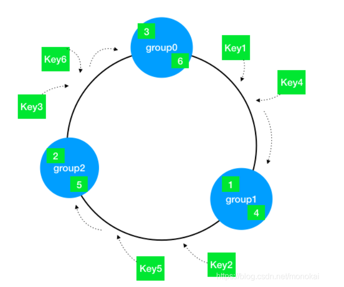
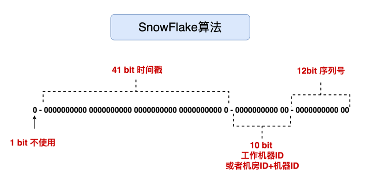

# 数据结构

## 红黑树

自平衡的二叉搜索树：**本质红黑树是对2-3-4树的一种实现**，将所有的结点看做为黑结点形成2叉结点，红结点与父黑结点结合形成3-4叉结点。都是黑色结点

2叉结点：只包含大于它的结点和小于它的结点

3叉结点：一个黑结点与一个红结点结合     （15,30） 指向3个位置：x<15  15<x<30,x>30

4叉结点：一个黑结点与两个个红结点结合   （15,27,33）

https://zhuanlan.zhihu.com/p/273829162

规则：

1. 结点是红色或黑色。
2. 根结点是黑色。
3. 每个叶子结点都是黑色的空结点（NIL结点）。
4. 每个红色结点的两个子结点都是黑色。(从每个叶子到根的所有路径上不能有两个连续的红色结点)
   - **因为红黑树是2-3-4树的具体体现，红色结点可以连接，则意味着不止是4叉的结点，可能多个，不满足条件**
5. 从任一结点到其每个叶子的所有路径都包含相同数目的黑色结点。
   - **红色结点与黑色结点绑定，则只有黑色结点贡献真实高度，所以在相同的黑色结点意味着该树真正的平衡**
6. 从根到叶子的最长的可能路径不多于最短的可能路径的两倍长。

调整的方式有两种：变色和旋转（左旋和右旋），来满足规则

从根到叶子的最长的可能路径不多于最短的可能路径的两倍长。

- **原因：因为任一结点到叶子节点的所有路径都包含相同的黑色节点个数，则最长路径为最短路径的2倍往上，则以为着一条路径上，红色结点个数多于黑色节点个数，也就是说：红色结点连接在一起，与定义矛盾**


“您应该知道红黑树的五条定义，如果我构造一颗只有黑色节点的红黑树，这样子可行吗？因为这样子没有破坏任何一条红黑树的规则。”

- 您说的一点问题也没有，但需要满足如下要求
- 由于任一节点到每一个叶子节点的所有路径包含相同数目的黑色节点。**则需要所有叶子节点等高**
- **添加元素或者删除元素，需要保存等高的要求，也就是说添加结点需要添加一整层才可以，删除也是。**

### 红黑树和平衡二叉树的区别

HashMap为什么使用红黑树而不是平衡二叉树呢？

- 插入和删除元素红黑树效率更高：只需要一个旋转
- 查询效率相同
- 树高的平衡要求不同：红黑树要求黑节点高度相同即可，平衡二叉树要求左右子树高度差<=1，因此红黑树在插入和删除元素时，减少了维持平衡的开销


## JDK提供的排序算法是怎样的？


在JDK中当待排序的元素个数小于 286 时使用快速排序，当待排序的元素个数小于47时使用插入排序，

快排进行了优化，双轴快排

​         JDK的双轴快排，选两个轴，排序方式，比轴1小的数据放到轴1左侧，比轴2大的数据放到轴2右侧，其余的数据在轴1和轴2之间

## 排序时间复杂度

https://blog.csdn.net/yushiyi6453/article/details/76407640


## 堆排序

堆排序的基本思想是：1、将带排序的序列构造成一个大顶堆，根据大顶堆的性质，当前堆的根节点（堆顶）就是序列中最大的元素；2、将堆顶元素和最后一个元素交换，然后将剩下的节点重新构造成一个大顶堆；3、重复步骤2，如此反复，从第一次构建大顶堆开始，每一次构建，我们都能获得一个序列的最大值，然后把它放到大顶堆的尾部。最后，就得到一个有序的序列了。**第i次取堆顶的记录重建堆需要用Olog（i）的时间，需要进行n-1次堆顶记录，时间复杂度为O(nlog(n))无论好坏都是nlog（n）**

HeapAdjust：选择i为根节点的树，该树中每一个结点都大于它的子节点，解释了什么倒序，因为从底层的结点开始。为什么for (int j = 2*i; j<=i1; j++)  因为子节点为根节点位置的 `2*i`和`2*i+1`

**缺点：**堆的维护问题，实际场景中的数据是频繁发生变动的，而对于待排序序列的每次更新（增，删，改），我们都要重新做一遍堆的维护，以保证其特性。


使用场景

1.**快速排序**是目前基于比较的内部排序中被认为是最好的方法，当待排序的关键字是**随机分布**时，快速排序的平均时间最短。数组若是倒序，则排序时间复杂度=O(N^2) 2.**堆排序**所需的辅助空间少于快速排序，并且不会出现快速排序可能出现的最坏情况，适合**超大数据量**。这两种排序都是不**稳定的**。 3.若要求**排序稳定**，则可选用**归并排序**。


```
public void HeapSort(int[] arr){
        if(arr==null||arr.length==0){
            return;
        }
        int len = arr.length;
        buildMaxHeap(arr,len);
        for (int i = len-1; i >0 ; i--) {
            // 移除最大值，到末尾位置，遍历一遍后，则数组通过堆排序，实现升序
            swap(arr,0,i);
            len--;
            // 再次建立一个最大堆
            heapify(arr,0,len);
        }
    }
    // 建立一个最大堆，数组元素是  [i,len]
    private void heapify(int[] arr, int i, int len) {
        int left = 2*i+1;
        int right = 2*i+2;
        // 默认当前节点是最大值
        int maxIndex = i;
        if(left<len&&arr[left]>arr[maxIndex]){
            // 如果有左节点，并且左节点的值更大，更新最大值的索引
            maxIndex = left;
        }
        if(right<len&&arr[right]>arr[maxIndex]){
            maxIndex = right;
        }
        if(maxIndex!=i){
            // 如果最大值不是当前非叶子节点的值，那当前节点和最大值的子节点值互换
            swap(arr,i,maxIndex);
            heapify(arr,maxIndex,len);
        }
    }

    // 建立一个最大堆
    public void buildMaxHeap(int[] arr, int len) {
        for (int i = len/2-1; i >=0 ; i--) {
            heapify(arr,i,len);
        }
    }
    private void swap(int[] arr, int i, int j) {
        int temp = arr[i];
        arr[i] = arr[j];
        arr[j] = temp;
    }

```

### 快速排序

Partition（）选择一个中间值，将这个值移动到排序的位置，使得它左侧的数值都比它小，右边都比它大。并返回该坐标

==快速排序，partition一定要先遍历高部分，再遍历低的部分==

```java
 void Qsort(int[] nums,int low,int high){
		if(low<high){   // 一定要有该判断，否则进入死循环。
      		
      		// 随机选择基准值，避免最坏情况,该两行代码提高性能
          int randomIndex = l + (int)(Math.random() * (r - l + 1));
          swap(nums, l, randomIndex)
      
      
        	int temp = Partition(nums,low,high);
        	Qsort(nums,low,temp-1);
        	Qsort(nums,temp+1,high);
        }
    }
int Partition(int[] nums,int low,int high){

  int partivite = nums[low];
  while (low<high){
    while (low<high&&nums[high]>=partivite){   
      high--;
    }
    swap(nums,low,high);
    while(low<high&&nums[low]<=partivite){
      low++;
    }
    swap(nums,low,high);
  }
  return low;
}
void swap(int[] nums,int slow,int fast){
  int temp = nums[slow];
  nums[slow] = nums[fast];
  nums[fast] = temp;
}
```


### 归并排序

先将数组拆分为小数组（单个数组也是有序），将两个有序数组进行合并

```java
private void Msort(int[] nums,int l,int r) {
        if (l>=r) {
            return;
        }
        int m = (l+r)/2;
        Msort(nums,l,m);
        Msort(nums, m+1, r);
        Merge(nums,l,r,m);
    }

    private void Merge(int[] nums,int l,int r,int m) {
        int ls = l,rs = m+1;
        int[] temp = new int[r-l+1];
        int index= 0;
        while (ls<=m&&rs<=r) {
            if (nums[ls]<=nums[rs]) {
                temp[index++] = nums[ls++];
            }else {
                temp[index++] = nums[rs++];
            }
        }
        while (ls<=m) {
            temp[index++] = nums[ls++];
        }
        while (rs<=r) {
            temp[index++] = nums[rs++];
        }
        for (int i = 0; i < temp.length; i++) {
            nums[i+l] = temp[i];
        }
    }
```


## Hash一致性算法

对于分布式存储，不同机器上存储不同对象的数据，我们使用哈希函数建立从数据到服务器之间的映射关系。**只要是用于缓存服务器。**

**问题：**

m = hash(o) mod n

o为对象名称，n为机器的数量，m为机器编号。


所以当集群中数据量很大时，采用一般的哈希函数，在节点数量动态变化的情况下会造成大量的数据迁移，导致网络通信压力的剧增，严重情况，还可能导致数据库宕机。

梳理：

因为hash请求不到原来的服务器，查询不到缓存，导致缓存雪崩，进而导致数据库宕机。

**hash一致性算法来解决这个问题**：

它可以保证当机器增加或者减少时，节点之间的数据迁移只限于两个节点之间，不会造成全局的网络问题。**是一种负载均衡的方案。**对于大量的请求或者调用，通过一定的hash将他们均匀的散列，从而实现压力的平均化。


hash一致性算法：使用环形的hash，计算公式：   hash（key）/2^32=  位置

- 分别对服务器计算hash，并记录它们的位置（group0，group1，group2）
- 再对每个key计算hash，沿着顺时针方向找到下一个服务器的位置，则该key保存到该服务器



**在插入或者删除缓存服务器节点，只会改变相邻节点key的位置，对其他节点没有影响**


**问题：**

- **数据倾斜**
  - 可能会出现，服务器都集中在hash环的一部分，即服务器的位置不是均匀分布，则key的分布也不均匀。十分依赖服务器的hash位置
- **缓存雪崩**
  - 如上图，三个group集群，如果group0删除，则将key统一交给group1，此时group1的请求量增加，可能会崩溃，则group1也移除hash环，则所有的key转移到group2，成滚雪球一样，最终导致雪崩。

**解决办法**

- #### **引入虚拟节点**

  - 一台服务器会映射多个虚拟节点，都分布到 hash环上，此时所有的服务器就能均匀分布，在删除某一节点后，该节点的数据也能均匀的分布到其他服务器上，而不是交由一台服务器。

## 雪花算法

分布式情况下生成递增的UID，但不是严格递增的。缺点：**严重依赖时间。**

### Snowflake(雪花算法) 结构

Snowflake 是 Twitter 开源的分布式 ID 生成算法。Snowflake 由 64 bit 的二进制数字组成，这 64bit 的二进制被分成了几部分，每一部分存储的数据都有特定的含义：

- **第 0 位**： 符号位（标识正负），始终为 0，没有用，不用管。
- **第 1~41 位** ：一共 41 位，用来表示时间戳，单位是毫秒，可以支撑 2 ^41 毫秒（约 69 年）
- **第 42~52 位** ：一共 10 位，一般来说，前 5 位表示机房 ID，后 5 位表示机器 ID（实际项目中可以根据实际情况调整）。这样就可以区分不同集群/机房的节点。
- **第 53~64 位** ：一共 12 位，用来表示序列号。 序列号为自增值，代表单台机器每毫秒能够产生的最大 ID 数(2^12 = 4096),也就是说单台机器每毫秒最多可以生成 4096 个 唯一 ID。



### 优化

- 41位时间戳，因为我们时间计算是1970年开始，可以使用69年。所以可以以项目开始的时间为基准时间。
- 获取唯一ID并发对性能要求高，所以计算通过位运算和位移操作来提高处理速度


### 缺点

- 时间回拨问题：服务器上的时间倒退到之前的时间，那么基于时间的UID可能出现重复
  - 人为原因，把服务器环境的时间回拨了
  - 不同机器的时间可能存在不一致，可能存在时间回拨问题
- 机器Id的分配和回收问题：机器id不同，机器宕机后，对应的机器Id回收问题
- 机器Id的上限问题：机器id上线是1024，集群可能不止1024台机器，所以机器数存在上限


### 解决方案

原有方案：

- #### 时间回拨

  - 直接抛异常
  - 等待上次时间的时间范围。若等待一段时间后再次出现回拨，则抛异常（未彻底解决）

- 机器Id分配以及未回收

  - 采用Zookeeper的顺序节点分配：解决了分配，回收可采用Zookeeper临时节点回收
  - 采用DB中插入数据作为节点值：解决了分配，但没有解决回收

### 分布式雪花算法

```java

class Snowflake {
    private long lastTime = System.currentTimeMillis();
    // 机房内的机器Id
    private long workId = 0L;
    // 机房Id
    private long dataId = 0L;
    // 最大序列号
    private long max = (long) Math.pow(2, 12) - 1;
    //序列号，可以自增1
    private AtomicLong seq = new AtomicLong();

    public Snowflake(long workId, long dataId) {
        this.workId = workId;
        this.dataId = dataId;
        seq.set(-1);
    }
    public synchronized long getId() {
        if (System.currentTimeMillis() == lastTime) {
            if (seq.get() > max) {
                while (System.currentTimeMillis() == lastTime) {
                }
                seq.set(-1);
            }
        }else{
            seq.set(-1);
        }
        lastTime = System.currentTimeMillis();
        return lastTime << 22
                | dataId << 17
                | workId << 12
                | seq.incrementAndGet();
    }
}
```


https://www.cnblogs.com/binyue/p/11596763.html

## 限流算法及各类常用方案

### 限流定义

限流：由于API接口无法控制调用方的请求次数，若请求瞬间增多时，服务器因为处理该过多请求，会占用服务器过多资源，从而影响其他请求的响应速度，甚至服务器宕机

限流：限制应用服务的请求次数，超过限制次数会执行提前配置的代码或者快速失败

**限流用途**

限流可以应对：

- 热点业务带来的突发请求；
- 调用方 bug 导致的突发请求；
- 恶意攻击请求。

### 问题

若单点限流，分布式机器部署下，可能存在，每个节点并未达到限流限制，但数据库等资源却被击垮的情况。


### 算法

#### 1，固定窗口计数器算法

1. 将时间划分为多个窗口；
2. 每个窗口内每次请求则将计数器加一
3. 如果计数器超过限制数量，则本窗口内所有请求都被丢弃，当时间达到下一个窗口时，计数器重置

评价：固定窗口为最简单的限流算法，但是可能会出现一下问题：限制1秒内最多处理5个请求，在第一个窗口的后半秒处理5个请求，在第二个窗口的前半秒再处理5个请求，则1s内处理了10个请求。


#### 2，滑动窗口计数器算法

- 根据时间分为多个区间
- 在每个区间内每次请求就将计数器加一，一个时间窗口占据多个区间
- 每经过一个区间的时间，则抛弃最老的区间，并纳入最新的一个区间。
- 若当前区间内的请求技术总和超过了限制数量，则本区间所有请求都被丢弃

评价：通过窗口滑动的方式，避免了固定窗口计算器带来的双倍突发请求，但**时间区间的精度越高，则需要划分的窗口越多，算法需要的容量空间就越大，即越消耗性能**

#### 3，漏桶算法

漏桶算法(Leaky Bucket)是流量整形（Traffic Shaping）或速率限制（Rate Limiting）时经常使用的一种算法，它的主要目的是控制数据注入到网络的速率，平滑网络上的突发流量。漏桶算法提供了一种机制，通过它，突发流量可以被整形以便为网络提供一个稳定的流量。

漏桶可以看作是一个带有常量服务时间的单服务器队列，如果漏桶（包缓存）溢出，那么数据包会被丢弃。 在网络中，漏桶算法可以控制端口的流量输出速率，平滑网络上的突发流量，实现流量整形，从而为网络提供一个稳定的流量。

**以固定速率消费请求，漏桶容量固定，每次用户请求都得放入桶中，桶满则拒绝请求或等待。达到应对突发流量，平滑网络请求的效果。**

**像底部漏水的水桶一样，水桶漏的速度比不上进水的速度，则桶内水原来越多，当要溢出时，则该桶拒绝进水，以保证平滑网络请求，应对突发流量，提供一个稳定的流量的目的**

**缺点**：短时间内如果有大量请求进来，即使服务器闲置，能够处理，由于服务器只能以固定速率处理请求，会等待一段时间才能被处理，甚至可能被丢弃请求。**即无法应对突发请求**


**伪代码**

```
when（有请求）{
  bt = now()        // bt现在的时间
  at = last()
  Wb = (bt-at)*r;   //at上次请求处理的时间，r进水的速度，wb上次请求到这次请求的时间内消耗数
  w  = max(w-wb,0)  // w桶内的请求数，
  if(w<C){          // 判断桶内的请求数，是否超出桶容量
    w++;  
    return true;
  }else{
    return false;
  }
}
```


#### 4，令牌桶算法（限流算法）

- 令牌以固定速率生成
- 生成的令牌存放在桶中，如果桶满，则丢弃多余的令牌，请求进来时，首先在令牌桶中获取令牌，取不到令牌则无法处理请求，会被丢弃

令牌桶算法用来发送到网络上的数据的数目，并允许突发数据 的发送。

系统以一个固定的速度往桶内放入令牌，如果请求进来，需要从桶中获取令牌才能被处理。

**评价：****令牌桶能够将所有请求平均分布到时间区间内，也能够处理服务器的突发请求。**


**伪代码**

```
when(有请求){
  bt = now() // 当前时间
  at = last()// 上次处理请求的时间
     
                     // 上次请求处理完，桶内剩余的令牌数
  wb = (bt-at)*r   //r,为令牌进入桶的速度，wb上次请求到这个请求的时间间隔内令牌数
    w = min(wb+w,C)  // C为桶的容量
    if(w>=1){
      w--;
      return true;
    }else{
        return false;
    }
}
```


#### 漏桶算法和令牌桶算法的区别

漏桶算法能够强行限制数据的传输速率，令牌桶算法能够在限制数据的平均传输速率的同时还允许某种程度的突发传输。


在某些情况下，漏桶算法不能够有效地使用网络资源，因为漏桶的漏出速率是固定的，所以即使网络中没有发生拥塞，漏桶算法也不能使某一个单独的数据流达到端口速率。因此，漏桶算法对于存在突发特性的流量来说缺乏效率。而令牌桶算法则能够满足这些具有突发特性的流量。通常，漏桶算法与令牌桶算法结合起来为网络流量提供更高效的控制。

**使用场景**

**并不能说明令牌桶一定比漏洞好，她们使用场景不一样。**令牌桶可以用来保护自己，主要用来对调用者频率进行限流，为的是让自己不被打垮。所以如果自己本身有处理能力的时候，如果流量突发（实际消费能力强于配置的流量限制），那么实际处理速率可以超过配置的限制。而漏桶算法，这是用来保护他人，也就是保护他所调用的系统。主要场景是，当调用的第三方系统本身没有保护机制，或者有流量限制的时候，我们的调用速度不能超过他的限制，由于我们不能更改第三方系统，所以只有在主调方控制。这个时候，即使流量突发，也必须舍弃。因为消费能力是第三方决定的。

总结起来：如果要让自己的系统不被打垮，用令牌桶。如果保证被别人的系统不被打垮，用漏桶算法。

**分布式令牌桶代码**

```

```

**漏桶算法，令牌桶算法**

### 分布式限流

分布式下，可能存在多个服务，或者一个服务部署在多台机器上。所以限流不能是单纯的单机限流

- **分布式限流方案**
  - **中间件限流：**借助sentinel中间件或者redis+lua脚本实现对应的限流逻辑。（redis是服务之间共享的）
  - **网关层限流：**最常用的方案，直接在网关层进行转发时进行限流。也可以使用中间件sentinel或者redis+lua脚本进行限流

**为什么使用redis？**

- 速度快，减少网络开销，redis执行lua脚本，会一次执行，多条redis命令，减少了网络的传输开销
- 原子性：redis执行lua脚本是原子操作，保证了操作不会被其他指令插入或者打扰。

### 令牌桶的分布式实现

一般限流是对该集群或者同一别名的集群进行限流。两种情况略有不同，对整个集群的限流会有优化策略。

限流有一个**token中心维护所有的令牌桶信息，限流的机器都从token中心获取令牌**。另外限流实现一般都是通过**不侵入业务代码的RPC filter实现的**。**限流的判断计算是Consumer实现的，不是provider判断限流。**

- 同一别名的集群限流：
  - 每台机器会从从token 中心获取一定数量的token，而不是每一次请求或者一次token（性能太差）。所以每台机器会预存token。请求一次token-1。
  - 每台机器的token数量 = token总量/机器数*预取率。   预取率是有必要的，因为负载均衡的原因，每台机器的调用量可能是不同的，若是不同别名则存在更大差异的可能性。因此token 数量用尽后会向token中心再次获取
  - 向token中心获取新的token令牌时，为避免并发问题，可以进行加锁或者使用乐观锁CAS。若真是高并发流量，加锁是非常重要的
  - 存在的问题：**可能token限制中心限流已经达到阈值，但是部分机器还有一些预存token没用完，此时还会有流量进来，但是流量会小很多。**给人一种流量没有限制住的感觉
- 不同别名，同一Provider的限流
  - 若是存在流量倾斜，A、B两个别名，A的流量大，B的流量小，A用尽token，但是B别名集群的token还占用很多没用完。限流会导致限流达不到预期。
  - 每一个Consumer都可以进行自检，若发现自身流量过小，小于预取token的1/2，则归还预取token的一半给token限制中心，并且标记为流量少的Consumer。如果流量增加后，可以恢复为大流量Consumer。
    - 区别：流量少的Consumer 获取token每次为预存token的1/2，大流量的Consumer是获取完整的预存token


### 限流方案

三个方面

- ### 容器限流

  1. #### Tomcat

     - Tomcat可以配置连接器的最大线程数（Tomcat的线程池是请求直接创建线程处理，超过最大线程数后，再进行排队，与并发的线程池不同）

  2. #### Nginx

     - Nginx有两种限流手段，控制速率或者控制并发连接数

     - 控制速率

       - limit_req_zone 配置限制单位时间内的请求数

       - ```
         limit_req_zone $binary_remote_addr zone=mylimit:10m rate=2r/s;
         ```

     - 并发连接数

       - 利用 `limit_conn_zone` 和 `limit_conn` 两个指令即可控制并发数
       - 只有在请求被后端服务器被处理后，才能计数

- ### 服务端限流

  - #### Semaphore

    - 信号量的实现，请求进来时可首先尝试获取信号量， 若获取不到，则阻塞，或者返回快速失败

  - #### RateLimiter

    - Guava中基于令牌桶实现的一个限流工具，使用非常简单，通过方法`create()`创建一个桶，然后通过`acquire()`或者`tryAcquire()`获取令牌：
    - 令牌桶算法，可以允许流量暴增的情况，若令牌桶空了，再请求获取令牌，会陷入阻塞，在令牌补充后返回结果

  - #### Sentinel

    - 阿里开源的限流熔断组件，底层通过滑动窗口算法。
    - 通过为方法增加注解`@SentinelResource(String name)`或者手动调用`SphU.entry(String name)`方法开启流控。

- ### 分布式下的限流

  - 若对公共资源进行限流，则单机的限流算法失效，分布式下的限流方案主要采取中心系统统一管控流量配额。redis结合lua脚本实现原子性设置

  - #### Redis 通过lua脚本实现简单窗口：

    - 设置窗口大小即过期时间，和请求数。redis保存值过期后，则可以重新获取值

  - #### Redis通过lua脚本实现令牌桶

    - 获取令牌后，用set记录请求时间和剩余token数量
    - 每次请求令牌时，都会通过这两个参数，与请求的时间，流速值进行计算，返回时候获取令牌成功。
    - （网上有很多该算法）

## 负载均衡算法

https://www.jianshu.com/p/7b2b9d646746

- 轮询：
  - 各个服务节点被访问的概率也基本相同，也主要应用在各个服务节点性能差异不大的情况下。
- 加权轮询算法
  - 在轮询算法基础上的改进，可以通过给每个节点设置不同的权重来控制访问的概率，因此主要被用在服务节点性能差异比较大的情况。比如经常会出现一种情况，因为采购时间的不同，新的服务节点的性能往往要高于旧的节点，这个时候可以给新的节点设置更高的权重，让它承担更多的请求，充分发挥新节点的性能优势。
- 负载最低优先（可以从连接数、http请求数、cpu负载等情况来）
  - 由于复杂度和不可控制原因，实际应用还是很少的
- Hash 类算法
  - 因为它能够保证同一个客户端的请求始终访问同一个服务节点，所以适合服务端节点处理不同客户端请求差异较大的场景。比如服务端缓存里保存着客户端的请求结果，如果同一客户端一直访问一个服务节点，那么就可以一直从缓存中获取数据。

**hash类算法**

负载均衡系统根据任务中的某些关键信息进行 Hash 运算，将相同 Hash 值的请求分配到同一台服务器上，这样做的目的主要是为了满足特定的业务需求。例如： （1）源地址 Hash 将来源于同一个源 IP 地址的任务分配给同一个服务器进行处理，适合于存在事务、会话的业务。 （2）ID Hash 将某个 ID 标识的业务分配到同一个服务器中进行处理，这里的 ID 一般是临时性数据的 ID（如 session id）。 （3）一致性hash **一致性hash算法，是通过某个hash函数，把同一个来源的请求都映射到同一个节点上。**一致性hash算法最大的特点就是同一个来源的请求，只会映射到同一个节点上，可以说是具有记忆功能。只有当这个节点不可用时，请求才会被分配到相邻的可用节点上。


推荐：将IP进行hash，并且使用hash一致性算法 。