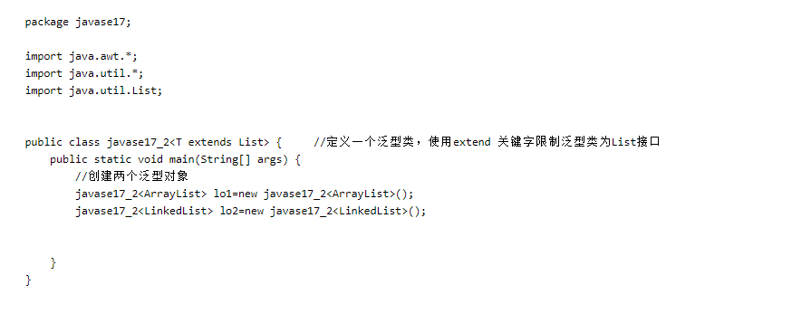
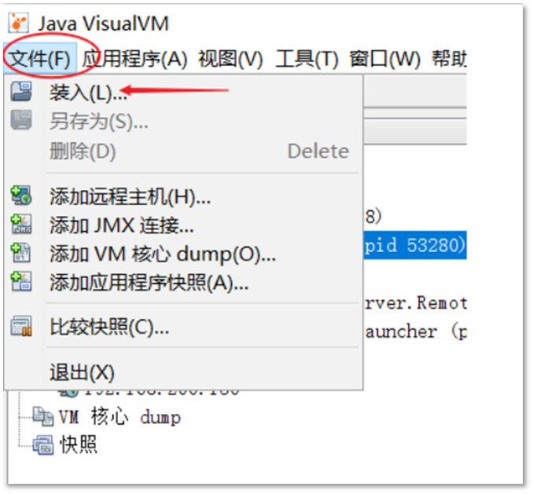
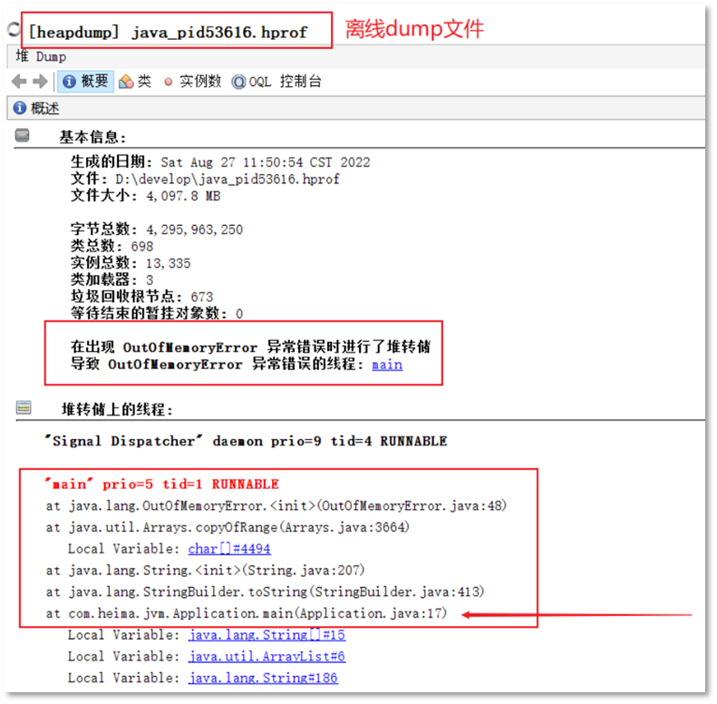

# JVM

学习网址：https://github.com/CyC2018/CS-Notes/blob/master/notes/Java%20%E8%99%9A%E6%8B%9F%E6%9C%BA.md

## 如何让正在运行的 Java 工程的优雅停机？

linux中停止进程的方式：kill 命令发送指定信号到相应进程

- 2 (SIGINT：[中断](https://so.csdn.net/so/search?q=中断&spm=1001.2101.3001.7020)，Ctrl+C)。
- 15 (SIGTERM：终止，默认值)。
- 9 (SIGKILL：强制终止)。

`kill -15 PID`系统向相应的应用程序发送信号，然后释放相应资源后停止，此时程序可能会再执行一段时间

`kill -9 PID` 命令，程序会直接终止


**java的关闭钩子（Shutdown Hook）**

```
Runtime.getRuntime().addShutdownHook(shutdownHook);
```

**jvm关闭时，会执行系统同已经设置的所有钩子方法，执行完所有钩子后，jvm才会关闭。**

在以下情景会生效

- 程序正常退出
- 程序中使用`System.exit()`退出JVM
- 系统发生`OutofMemory`异常
- 使用`kill pid`干掉JVM进程的时候（kill -9时候是不能触发ShutdownHook生效的）

 JVM 自己定义了信号处理函数，这样当发送 kill pid 命令（默认会传 15 也就是 SIGTERM）后，JVM 就可以在信号处理函数中执行一些资源清理之后再调用 exit 退出。

## OOM的排查

- 堆OOM
  - 异常
    - **`java.lang.OutOfMemoryError: GC Overhead Limit Exceeded`** ： 当 JVM 花太多时间执行垃圾回收并且只能回收很少的堆空间时，就会发生此错误。	
    - **`java.lang.OutOfMemoryError: Java heap space`** :假如在创建新的对象时, 堆内存中的空间不足以存放新创建的对象, 就会引发此错误。(和配置的最大堆内存有关，且受制于物理内存大小。最大堆内存可通过`-Xmx`参数配置，若没有特别配置，将会使用默认值，
      - 一般异常情况是java堆OOM，可能情况
        -  内存泄漏
        - 缓存使用不当
        - 数据量超出预期
        - 堆内存设置大小不当
  - 解决办法：
    - 内存泄露或者堆的大小设置不当引起。对于内存泄露，需要通过内存监控软件查找程序中的泄露代码，而堆大小可以通过虚拟机参数-Xms,-Xmx等修改。
- 方法区OOM
  - 异常：
    - 当元空间溢出时会得到如下错误： `java.lang.OutOfMemoryError: MetaSpace` 原因：动态生成大量类(如CGlib代理)
  - 解决办法
    - JDK1.7  `-XX:PermSize`设置永久代初始大小。`-XX:MaxPermSize`设置永久代最大可分配空间
    - `JDK8`及以后：可以使用`-XX:MetaspaceSize`和`-XX:MaxMetaspaceSize`设置元空间初始大小以及最大可分配大小。
- 栈OOM
  - -Xss来设置栈的大小。


- ### **排查手段**

  - **重点是确认内存中的对象是否是必要的，也就是要先分清楚到底是出现了内存泄漏还是内存溢出。**
    - 如果是内存泄漏，可进一步通过工具查看泄漏对象到GC Roots的引用链。这样就能够找到泄漏的对象是通过怎么样的路径与GC Roots相关联的导致垃圾回收机制无法将其回收。掌握了泄漏对象的类信息和GC Roots引用链的信息，就可以比较准确地定位泄漏代码的位置。
    - 如果不存在泄漏，那么就是内存中的对象确实必须存活着，那么此时就需要通过虚拟机的堆参数（ -Xmx和-Xms）来适当调大参数；从代码上检查是否存在某些对象存活时间过长、持有时间过长的情况，尝试减少运行时内存的消耗。

**其实与程序内存占用内存过高相仿** 


- ### java堆OOM 排查流程

  - 导出堆内存文件 
    - 手动导出：jmap -dump 导出堆内存文件
    - 自动写入: jvm参数，新增 -XX:+HeapDumpOnOutOfMemoryError -XX:HeapDumpPath=/path/to/dump.hprof
  - 使用MAT分析heap dump文件：
    1. 打开MAT并加载dump文件
    2. 查看"Leak Suspects"报告
    3. 分析大对象保留链
    4. 重点关注：
       - 占用内存最大的对象
       - 对象增长趋势
       - GC Roots引用链


## 运行时，如果程序内存过高，怎么排查

例如频繁创建对象,内存泄露等这里会有俩种情况,一种报oom,一种导致系统卡,访问等待.

1. Top指令查看

2. 分析JVM内存分配，老年性，新生代的内存使用率，GC情况

   jstat -gc PID
   查看堆内存使用情况
   jmap -heap 71614
   jmap -heap 进程号

3. 导出dump;使用分析工具分析对象    分析工具：HeapAnalyzer

   jmap -dump:live,format=b,file=dump.hprof PID

**操作**

- top：找到占用内存(RES列)高的Java进程PID。
- jmap -heap PID：查看heap内存使用情况。
- jps -lv ：查看JVM参数配置。
- jstat -gc PID 1000：收集每秒堆的各个区域具体占用大小的gc信息。
- jmap -dump:live,format=b,file=heap_dump.hprof PID ：导出堆文件。
- 使用MAT打开堆文件，分析问题。


## 如何查看当前Java程序里哪些对象正在使用，哪些对象已经被释放

等价于**使用jmap查看堆和对象的信息**

可以加给-histo加上live选项,只输出存活的对象
jmap -histo:live pid

查看内容：

num     #instances         #bytes  classname

输出的信息中带方括号的符号是java类型在jvm的表示式：
[C 等价于 char[]
[S 等价于 short[]
[I 等价于 int[]
[B 等价于 byte[]
[[I 等价于 int[][]

## Java中的对象一定在堆上分配吗？

一 、栈上分配

JVM在Server模式下的逃逸分析可以分析出某个对象是否永远只在某个方法、线程的范围内，并没有“逃逸”出这个范围，逃逸分析的一个结果就是对于某些未逃逸对象可以直接在栈上分配，由于该对象一定是局部的，所以栈上分配不会有问题。在实际的应用程序，尤其是大型程序中反而发现实施逃逸分析可能出现效果不稳定的情况，或因分析过程耗时但却无法有效判别出非逃逸对象而导致性能（即时编译的收益）有所下降，所以在很长的一段时间里，即使是Server Compiler，也默认不开启逃逸分析，甚至在某些版本（如JDK 1.6 Update18）中还曾经短暂地完全禁止了这项优化。


**创建对象在栈分片还是堆分配，需求区分：**

- 如果是基本数据类型，并且是在方法中声明，则存储在栈中

- 如果是对象的话，并非所有的对象都在堆上存储，会进行逃逸性分析，如果是局部的，则在栈上分配

  - 方法逃逸：	
    就是当一个对象在方法中定义后，它可能被外部方法访问到，比如说通过参数传递到其它方法中

  - 线程逃逸：
    就是当一个对象在方法中定义后，它可能赋值给其它线程中访问的变量


## System.GC() 一定会触发吗？

- Runtime.getRuntime().gc();也会触发GC

- System.GC() 不会马上进行垃圾回收，甚至不一定会执行垃圾回收

- ## 如果要立马触发垃圾回收，怎么做？

  - 添加上**runtime.runFinalizationSync();**

  - 其实当我们直接调用System.gc()只会把这次gc请求记录下来，等到runFinalization=true的时候才会先去执行GC，runFinalization=true之后会在允许一次system.gc()。之后在call System.gc()还会重复上面的行为。 

  - ```
        System.gc();
        runtime.runFinalizationSync();
        System.gc();
    ```

- ## System.gc()与Runtime.gc()的区别

  (1) GC是垃圾收集的意思（Gabage Collection）,内存处理是编程人员容易出现问题的地方，忘记或者错误的内存回收会导致程序或系统的不稳定甚至崩溃，Java提供的GC功能可以自动监测对象是否超过作用域从而达到自动回收内存的目的，[Java语言](https://link.jianshu.com/?t=https%3A%2F%2Fwww.baidu.com%2Fs%3Fwd%3DJava%E8%AF%AD%E8%A8%80%26tn%3D44039180_cpr%26fenlei%3Dmv6quAkxTZn0IZRqIHckPjm4nH00T1YvPjcYryP-ujfvuj0kPvmk0ZwV5Hcvrjm3rH6sPfKWUMw85HfYnjn4nH6sgvPsT6K1TL0qnfK1TL0z5HD0IgF_5y9YIZ0lQzqlpA-bmyt8mh7GuZR8mvqVQL7dugPYpyq8Q1R4njnkPWn1P0)没有提供释放已[分配内存](https://link.jianshu.com/?t=https%3A%2F%2Fwww.baidu.com%2Fs%3Fwd%3D%E5%88%86%E9%85%8D%E5%86%85%E5%AD%98%26tn%3D44039180_cpr%26fenlei%3Dmv6quAkxTZn0IZRqIHckPjm4nH00T1YvPjcYryP-ujfvuj0kPvmk0ZwV5Hcvrjm3rH6sPfKWUMw85HfYnjn4nH6sgvPsT6K1TL0qnfK1TL0z5HD0IgF_5y9YIZ0lQzqlpA-bmyt8mh7GuZR8mvqVQL7dugPYpyq8Q1R4njnkPWn1P0)的显示操作方法。

  (2) 对于GC来说，当程序员创建对象时，GC就开始监控这个对象的地址、大小以及使用情况。通常，GC采用有向图的方式记录和管理堆(heap)中的所有对象。通过这种方式确定哪些对象是”可达的”，哪些对象是”不可达的”。当GC确定一些对象为”不可达”时，GC就有责任回收这些内存空间。可以。程序员可以手动执行System.gc()，通知GC运行，但是[Java语言](https://link.jianshu.com/?t=https%3A%2F%2Fwww.baidu.com%2Fs%3Fwd%3DJava%E8%AF%AD%E8%A8%80%26tn%3D44039180_cpr%26fenlei%3Dmv6quAkxTZn0IZRqIHckPjm4nH00T1YvPjcYryP-ujfvuj0kPvmk0ZwV5Hcvrjm3rH6sPfKWUMw85HfYnjn4nH6sgvPsT6K1TL0qnfK1TL0z5HD0IgF_5y9YIZ0lQzqlpA-bmyt8mh7GuZR8mvqVQL7dugPYpyq8Q1R4njnkPWn1P0)规范并不保证GC一定会执行。

  (3) [垃圾回收](https://link.jianshu.com/?t=https%3A%2F%2Fwww.baidu.com%2Fs%3Fwd%3D%E5%9E%83%E5%9C%BE%E5%9B%9E%E6%94%B6%26tn%3D44039180_cpr%26fenlei%3Dmv6quAkxTZn0IZRqIHckPjm4nH00T1YvPjcYryP-ujfvuj0kPvmk0ZwV5Hcvrjm3rH6sPfKWUMw85HfYnjn4nH6sgvPsT6K1TL0qnfK1TL0z5HD0IgF_5y9YIZ0lQzqlpA-bmyt8mh7GuZR8mvqVQL7dugPYpyq8Q1R4njnkPWn1P0)是一种动态存储管理技术，它自动地释放不再被程序引用的对象，当一个对象不再被引用的时候,按照特定的垃圾收集算法来实现资源自动回收的功能。

  (4) System.gc();就是呼叫java虚拟机的[垃圾回收](https://link.jianshu.com/?t=https%3A%2F%2Fwww.baidu.com%2Fs%3Fwd%3D%E5%9E%83%E5%9C%BE%E5%9B%9E%E6%94%B6%26tn%3D44039180_cpr%26fenlei%3Dmv6quAkxTZn0IZRqIHckPjm4nH00T1YvPjcYryP-ujfvuj0kPvmk0ZwV5Hcvrjm3rH6sPfKWUMw85HfYnjn4nH6sgvPsT6K1TL0qnfK1TL0z5HD0IgF_5y9YIZ0lQzqlpA-bmyt8mh7GuZR8mvqVQL7dugPYpyq8Q1R4njnkPWn1P0)器运行回收内存的垃圾。

  (5) 当不存在对一个对象的引用时，我们就假定不再需要那个对象，那个对象所占有的存储单元可以被收回，可通过System.gc()方法回收，但一般要把不再引用的对象标志为null为佳。

  (6) 每个 Java 应用程序都有一个 Runtime 类实例，使应用程序能够与其运行的环境相连接。可以通过 getRuntime 方法获取当前运行时。 Runtime.getRuntime().gc();

  (7) **java.lang.System.gc()只是java.lang.Runtime.getRuntime().gc()的简写，两者的行为没有任何不同。**

  (8) 唯一的区别就是System.gc()写起来比Runtime.getRuntime().gc()简单点. 其实基本没什么机会用得到这个命令, 因为这个命令只是建议JVM安排GC运行, 还有可能完全被拒绝。 GC本身是会周期性的自动运行的,由JVM决定运行的时机,而且现在的版本有多种更智能的模式可以选择,还会根据运行的机器自动去做选择,就算真的有性能上的需求,也应该去对GC的运行机制进行微调,而不是通过使用这个命令来实现性能的优化

## java线程栈桢上只有引用还是拷贝了对象？

栈帧中局部变量表中存储的是引用地址，不是对象。局部变量表中的对象：基本数据类型、对象引用+

## java中的静态变量存在哪？

静态变量存在方法区，但是静态变量如果是引用数据类型，则该对象保存在堆中，仅地址保存在方法区。

## 继承

### 类可以extends一个泛型嘛？

子类可以继承父类的泛型。

**泛型继承类：**可以限制泛型的类型，泛型可以指定继承的类型。



## 运行时出现了while （true）即Java运行程序占用CPU100%，问题排查？（Linux）


https://juejin.cn/post/7040422748981100551


https://www.cnblogs.com/rinack/p/12969851.html

https://blog.csdn.net/baiye_xing/article/details/90483169

1. **top**   （查看系统CPU的占用情况）
2. top -Hp 进程ID   （查看进程下所有线程的CPU占用，进程ID从第一条命令获取）
3. printf "%x\n" 线程ID    （将需要的线程ID转换为16进制格式，也可以自己手动转换，不输入指令）
4. jstack 进程号 | grep 线程ID   （查找该进程下某线程的详细情况，也可以只查进程，**注意此时线程ID需要写16进制数字**， stack  ）
   1. "VM Thread" os_prio=0 tid=0x00007f871806e000 nid=0xa runnable   （如果显示“VM Thread”，表示为垃圾回收线程，当前系统缓慢的原因主要是垃圾回收过于频繁，导致GC停顿时间较长。）
      1. jstat -gcutil 进程号 统计间隔毫秒 统计次数（缺省代表一直统计）   **查看某进程GC持续变化情况**
      2. 如果发现返回中FGC很大且一直增大，则可以确认为**内存溢出问题**
         1. 代码中一次获取了大量的对象，导致内存溢出，此时可以通过eclipse的mat工具查看内存中有哪些对象比较多；
      3. 内存占用不高，但是Full GC次数还是比较多，此时可能是显示的System.gc()调用导致GC次数过多，这可以通过添加-XX:+DisableExplicitGC来禁用JVM对显示GC的响应。
      4. jmap -heap 进程ID   查看进程堆内存使用情况
   2. 如果不是垃圾回收线程，则是执行问题，可能出现了while（true）问题，**在步骤4 jstack，可直接定位到代码行**，所以下面1,2意义不大
      1. jstack [进程]|grep -A 10 [线程的16进制]    -A 10表示查找到所在行的后10行
         1. 例子： jstack 21125|grep -A 10 52f1  
         1. 所以也可以直接  jstack 进程ID |grep 线程ID   定位到出现问题的代码
   3. 还有可能是死锁，此时会直接提示。关键字：deadlock.（死锁不会导致CPU飙升）
5. jmap -dump:format=b,file=filename pid   （导出某进程下内存heap输出到文件中。可以通过eclipse的mat工具查看内存中有哪些对象比较多）

## jdk8默认的垃圾回收器

java -XX:+PrintCommandLineFlags -version  查看指令

 -XX:+UseParallelGC  

**新生代**：Parallel Scavenge **老年代**：Parallel Old

## 怎样将两个全路径相同的类加载到内存中？

1. 自己写一个类加载器，重写loadClass方法。【不遵循双亲委派模式】
2. 创建两个类加载器对象，都加载该类的全类名。则有两个相同的类，由于类加载器不同，则导致可以加载两个。
3. 判断两个对象时，两个对象不等，因为判断相等的条件，首先判断类加载器相同再判断相等与否

## 如果发生了full gc，怎么去排查？

- 内存泄漏（代码有问题，对象引用没及时释放，导致对象不能及时回收） 

- 死循环 

- 大对象 

- 程序执行了System.gc()

```
-XX:+PrintGC 输出GC日志
-XX:+PrintGCDetails 输出GC的详细日志
-XX:+PrintGCTimeStamps 输出GC的时间戳（以基准时间的形式）
-XX:+PrintGCDateStamps 输出GC的时间戳（以日期的形式，如 2013-05-04T21:53:59.234+0800）
-XX:+PrintHeapAtGC 在进行GC的前后打印出堆的信息
-Xloggc:../logs/gc.log 日志文件的输出路径
```

**导出堆内存文件**

jmap -dump:live,format=b,file=dump.hprof PID


- ### 第一步：打印GC日志 并导出dump文件

- ### 第二步：分析GC日志（定位直接原因）

拿到GC日志后，看最近发生的Full GC记录。一条Full GC记录通常如下：

```text
2024-03-27T10:23:45.123+0800: 345.678: [Full GC (Allocation Failure) ...
```

**重点关注括号里的原因 `(Allocation Failure)`**，这是触发GC的**直接原因**：

| GC原因 (GCCause)            | 含义解析                                                     | 排查方向                                                     |
| :-------------------------- | :----------------------------------------------------------- | :----------------------------------------------------------- |
| **`Allocation Failure`**    | **【最常见】** 对象分配失败，新生代没有足够空间了。          | 通常是**内存泄漏**或**堆内存分配过小**。                     |
| **`Metadata GC Threshold`** | 元空间（Metaspace）不足，无法加载新的类。                    | 检查 `-XX:MetaspaceSize` 设置是否过小，或是否有动态类生成（如CGLib）。 |
| **`Ergonomics`**            | JVM自身根据“ ergonomics ”机制发起的GC。                      | 通常是堆大小调整或后台的并发GC失败所致。                     |
| **`System.gc()`**           | **【非常常见】** 代码中（或第三方库）显式调用了 `System.gc()`。 | 排查代码，并禁用显式GC。                                     |
| `GCLocker Initiated GC`     | 正在执行JNI临界区代码，GC需要等待。                          | 检查JNI代码或序列化等操作。                                  |

- ### 第三步：根因分析与解决方案

根据GC原因，深入到具体场景中排查。

#### 场景一：`Allocation Failure` (最常见)

**根本原因**：老年代满了，或者对象无法被回收。
**排查步骤**：

1. **检查堆大小**：用 `jstat -gccapacity <pid>` 看 `NGCMN`/`NGCMX` (新生代最小/最大)、`OGCMN`/`OGCMX` (老年代最小/最大)。可能 simply 是 `-Xmx` 设置得太小了。
2. **检查是否存在内存泄漏**：
   - 使用 **Eclipse MAT** 或 **JProfiler** 分析之前生成的 `heapdump.hprof` 文件。
   - **关键步骤**：在MAT中查看 **`Histogram`** (直方图)，按 `Retained Heap` 排序，找到占用内存最大的对象。
   - 然后对可疑的类执行 **`Merge Shortest Paths to GC Roots`** (查看到GC Roots的路径)，排除弱/软引用，这能直接告诉你是谁在阻止这些对象被回收，从而定位泄漏代码。

#### 场景二：`Metadata GC Threshold`

**根本原因**：元空间被占满（加载了太多类）。
**排查步骤**：

1. 使用 `jstat -gcmetacapacity <pid>` 查看元空间容量 `MCMN`/`MCMX`。

2. 检查是否使用了大量反射、动态代理（如Spring AOP）、CGLib、ASM等技术，它们会动态生成类。

3. **解决方案**：适当调大元空间大小。

   ```bash
   -XX:MetaspaceSize=256M   # 初始大小
   -XX:MaxMetaspaceSize=512M # 最大大小
   ```

#### 场景三：`System.gc()`

**根本原因**：代码或依赖库中调用了 `System.gc()`。
**排查步骤**：

1. 在GC日志中确认原因。

2. 在日志中搜索 `System.gc` 调用栈（如果打印了的话）。

3. **最有效的解决方案**：直接禁用显式GC调用。**（生产环境必加）**

   ```bash
   -XX:+DisableExplicitGC
   ```

   *注意：如果使用了NIO等需要使用直接内存的库，禁用后可能需要关注直接内存的回收，也可以考虑使用 `-XX:+ExplicitGCInvokesConcurrent` 来让 `System.gc()` 触发并发的GC，而不是STW的Full GC。*

#### 场景四：代码行为不当

**根本原因**：并非泄漏，而是代码创建了大量不必要的对象。
**排查步骤**：

1. **大对象**：创建了巨大的数组或集合（如一次从数据库查询出几十万条数据）。
2. **循环中创建对象**：在循环内部创建了大量临时对象，给GC造成压力。
3. **排查工具**：使用 **Java Mission Control (JMC)** 或 **Async-Profiler** 进行**分配分析（Allocation Profiling）**，找到分配速率最高的方法。

------

### 总结与 checklist

1. **✅ 标配GC日志**：线上环境必须提前配置好详细的GC日志参数。
2. **✅ 监控报警**：监控 `jstat` 输出或使用Prometheus+Grafana监控FGC频率和耗时。
3. **✅ 看到Full GC**：第一时间保存现场 -> **摘流量** -> **生成Heap Dump**。
4. **✅ 分析日志**：首先看 `GCCause`，确定直接原因。
5. **✅ 根因分析**：
   - `Allocation Failure` -> **MAT分析堆转储，找泄漏**。
   - `Metadata GC Threshold` -> **调大Metaspace**。
   - `System.gc()` -> **加 `-XX:+DisableExplicitGC` 参数**。
6. **✅ 验证**：修复后，对比修复前后的GC日志，确认问题是否解决。

通过以上流程，你就能系统地定位并解决绝大多数Full GC频繁的问题。


## 内存泄漏问题如何排查

1. 获取堆内存快照dump
2. Visual去分析dump文件
3. 通过查看堆信息的情况，定位内存溢出问题


1、通过jmap指定打印他的内存快照dump(Dump文件是进程的内存镜像。可以把程序的执行状态通过调试器保存到dump文件中)

2、通过工具， VisualVM去分析dump文件，VisualVM可以加载离线的dump文件



3、通过查看堆信息的情况，可以大概定位内存溢出是哪行代码出了问题




## 安全点和安全区

https://www.cnblogs.com/chenchuxin/p/15259439.html

**原因：**可达性分析时，扫描栈信息时，需要判断所有类型是基本数据类型还是引用变量。每次扫描很多无效基本数据类型浪费时间。因此，引入OopMap，普通对象指针映射表，存储所有的引用对象。但是程序一直在执行，每次执行都同步OopMap过于消耗性能，因此引入安全点，处于安全点时，才记录OopMap。所以才在安全点进行GC。


**安全点**：

有一个公共的中断标志位，各个线程不断轮询该标志位。需要挂起时，修改该标志位，线程会执行到最近的安全点，更新OopMap才能挂起。只有在安全点才能真正执行GC。

安全点的插入的区域：

- 方法调用
- 循环结束
- 抛异常

Safepoint 可以理解成是在代码执行过程中的一些特殊位置，当线程执行到这些位置的时候，线程可以暂停。在 SafePoint 保存了其他位置没有的一些当前线程的运行信息，供其他线程读取。这些信息包括：线程上下文的任何信息，例如对象或者非对象的内部指针等等。

**安全区域**：假设线程sleep或者阻塞，无法执行到最新的安全点，因此引入安全区域。处于这种情况的属于安全区域，引用关系不会发生变化。进入安全区域前，会标记自己进入安全区域，如果此时发生GC，其他线程执行到最近的安全点，当前线程无需。离开安全区时，需判断仍在STW，如果在需要等待。不在则继续执行

## JVM 调优经验

JVM调优的**衡量指标**：吞吐量、停顿时间、垃圾回收频率

查看工具：启动项目时，增加配置，打印和收集GC信息，再通过工具查看。

堆内存日志查看工具：JConsole、VisualVM 解析堆内存日志信息

- ## 堆配置

  - **-Xms:初始堆大小, 最大堆大小 -Xmx：，将初始堆大小与最大堆大小相同**
    - 原因：堆现在使用机器都是部署在物理机上，机器内存是固定大小的，无需设置最小值!=最大值的情况，堆内存不足再申请，会消耗性能，而且设置值不等，垃圾回收也可能会收缩堆的大小，从而产生额外的时间消耗
  - **调整内存区域大小比率 SurvivorRatio**
    - 新生代老年代的比例设置需区分场景  NewRatio：新生代和老年代的占比，默认 1:2
      - 大的新生代会有小的老年代，则full GC会很频繁，小的新生代会有大的老年代，则普通GC会很频繁
      - **原则**：尽量少的full GC，应该在不应该full GC的情况下，调大新生代的大小，
      - 操作：查看峰值时，老年代的内存大小，再调整比例大小，需要给老年代留有1/3的空闲裕量
    - survivor区和Eden区的比例设置：  survivor区和Eden区大小比率 默认 1:8
      - **原则**：若临时对象较多，则增加Eden区的大小，减少young GC的频率
      - **原则**：若长期存活的对象多，则减少Eden取得大小，GC时，可能会直接晋升老年代
      - **G1 垃圾回收器 支持 自适应调整**
  - **调整新生代晋升老年代的年龄**
    - 现象：老年代频繁GC，每次回收的对象很多
      - 原因：如果是晋升的年龄太小，则新生代的对象很快进入老年代，原本可以再短时间内回收，因为进入了老年代，则不容易被回收
      - 操作：调整新生代晋升老年代的年龄
    - 现象：老年代频繁GC，每次回收的对象很多，而且单个对象都很大
      - 原因：大对象直接进入老年代，实际大对象使用较少
      - 操作：指定大对象进入老年代的阈值大小 并且将大对象拆分成小对象
  
- ## 垃圾回收器

  - **垃圾回收器的选择**
  
    - 多核、大内存的机器上 选择性能好的垃圾回收器 G1 或者ZGC（jdk 11 新增，jdk 15默认垃圾回收器）
    - CPU单核：串行垃圾回收器
    - CPU多核
      - 关注吞吐量 是 吞吐量优先+串行垃圾回收器
      - 关注停顿时间 使用 CMS（CMS 是老年代垃圾回收器） 和 G1
  
  - **调整GC的触发时机**
  
    - 现象：CMS、G1 垃圾回收器 进行full GC时，可能会有浮动垃圾，需要预留一部分内存空间容纳新产生的浮动垃圾，因此尽量提前触发GC
  
    - ```text
       //G1混合垃圾回收周期中要包括的旧区域设置占用率阈值。默认占用率为 65%
       -XX:G1MixedGCLiveThresholdPercent=65 
      ```
  
- ### 线程堆栈设置

  - 每个线程默认会开启1M的堆栈，存在栈帧、局部变量等信息，默认值太大了，可以调整为512k或者256k

## Full GC会回收哪些区域？

**FullGC 会回收新生代、老年代（堆内存）和方法区**，元空间存储着加载后的类信息和即时编译器编译的代码信息，对元空间的回收实际是对类的卸载。**元空间溢出时也会尝试触发Full GC**

方法区的回收是对常量池的回收以及类的卸载。

**常量池包括字符串常量池和类常量池**，均放在堆上。字符串常量池的回收与普通对象的回收相似，无引用则可以回收，类常量池是在类卸载后可以被回收。

类的卸载必要条件（满足这些条件也未必回收）：

- 该类所有的实例都已经被回收，此时堆中不存在该类的任何实例。
- 加载该类的 ClassLoader 已经被回收。
- 该类对应的 Class 对象没有在任何地方被引用，也就无法在任何地方通过反射访问该类方法。

