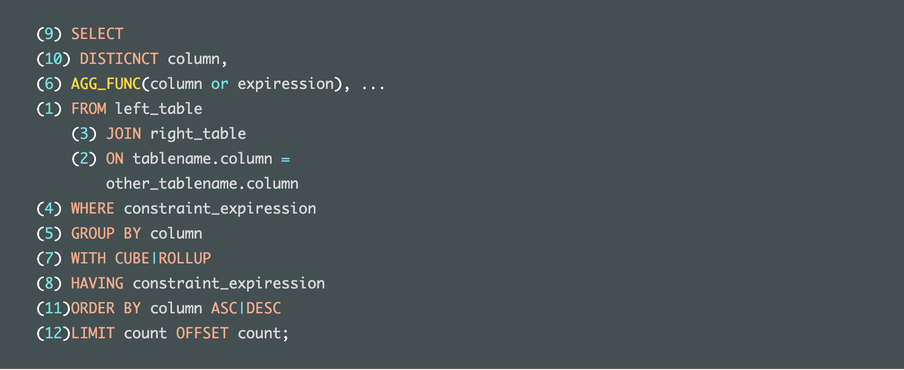
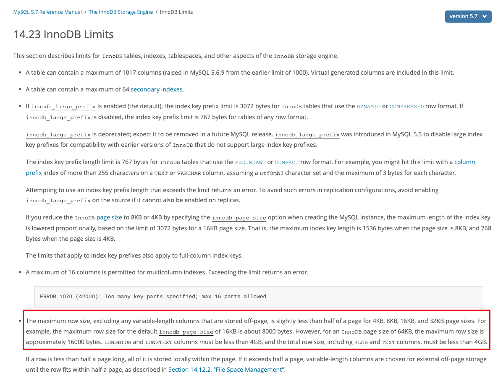
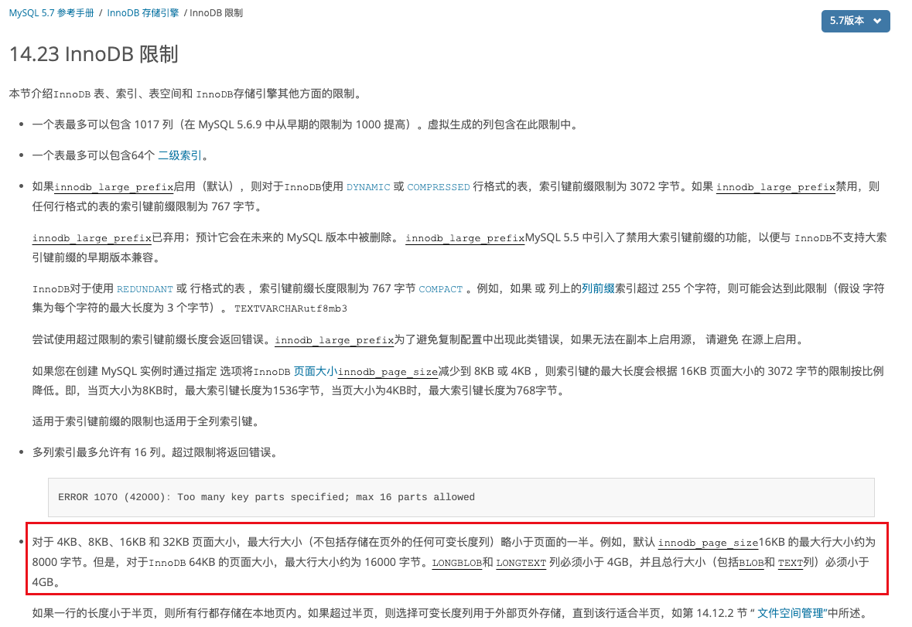
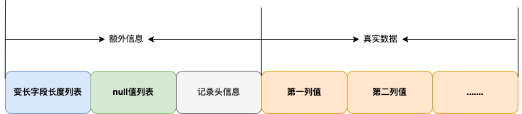
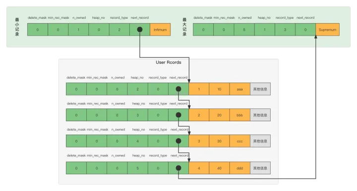

# MySQL

## SQL字段执行顺序



```sql
(9) SELECT 
(10) DISTICNCT column,
(6) AGG_FUNC(column or expiression), ...
(1) FROM left_table
    (3) JOIN right_table
    (2) ON tablename.column = 
        other_tablename.column
(4) WHERE constraint_expiression
(5) GROUP BY column
(7) WITH CUBE|ROLLUP
(8) HAVING constraint_expiression
(11)ORDER BY column ASC|DESC
(12)LIMIT count OFFSET count;
```

**顺序**

SQL的执行顺序也是SQL算子，可以理解为一个关键字即为一个算子。所以SQL语句变成了多个算子组成的结构。通过一个个算子得到最终的结构，因此也就形成了SQL字段执行的顺序。每一步的执行都会输出一个虚拟表，该虚拟表作为下个执行步骤的输入。

1. from 表   (执行笛卡尔积，获取数据源)
2. 连接查询的 on 
3. 连接查询的 join
4. where 过滤 （未读取列中数据，无法通过聚合函数过滤数据，而且select中的列的别名不允许在where中使用）
5. group by 分组  （此时已经读取了列的定义，所以后续都可使用select中的别名）
6. 函数计算（avg，count，first，last，sum，max，min）  
   - 此处才进行函数计算，此时已经通过where条件过滤，索引上记录的是原始值，where过滤时未计算出查询条件，则无法通过索引进行查询，则索引失效。

7. with 
8. having
9. select 选出指定列
10. distinct 去重
11. order by 排序
12. limit 限制行数 (进一步解释了为什么查询分页查询第101页是先查101页的所有数据再抛弃前100页的数据)


## SQL注入以及如何避免

http://c.biancheng.net/view/8283.html

SQL注入是一种安全漏洞。

SQL 注入就是在用户输入的字符串中加入 SQL 语句，如果在设计不良的程序中忽略了检查，那么这些注入进去的 SQL 语句就会被数据库服务器误认为是正常的 SQL 语句而运行，攻击者就可以执行计划外的命令或访问未被授权的数据。

- 1）恶意拼接查询

  - SELECT * FROM users WHERE user_id = $user_id
  - SELECT * FROM users WHERE user_id = 1234; DELETE FROM users

- 2）利用注释执行非法命令。

  - ```
    SELECT COUNT(*) AS 'num' FROM game_score WHERE game_id=24411 AND version=$version
    ```

  - ```
    SELECT COUNT(*) AS 'num' FROM game_score WHERE game_id=24411 AND version='-1' OR 3 AND SLEEP(500)--
    ```

- 3）传入非法参数

- 4）添加额外条件

  - ```
    UPDATE users SET userpass='$userpass' WHERE user_id=$user_id;
    ```

  - ```
    UPDATE users SET userpass= '123456' WHERE user_id=1234 OR TRUE;
    ```

    


**避免的方法**

- 过滤输入内容，校验字符串
- 参数化查询
- 安全测试、安全审计

开发中避免的方法

- #### 避免使用动态SQL

  - 需要使用准备好的SQL语句和参数查询

- #### 不要将敏感数据保留在纯文本中

  - 加密存储在数据库中的私有/机密数据，这样可以提供了另一级保护，以防攻击者成功地排出敏感数据。

- #### 限制数据库权限和特权

  - 将数据库用户的功能设置为最低要求；这将限制攻击者在设法获取访问权限时可以执行的操作。

- #### 避免直接向用户显示数据库错误

  - 攻击者可以使用这些错误消息来获取有关数据库的信息。


count（*），


## 索引倒排（反向索引）ES

正向索引：

**当用户发起查询时（假设查询为一个关键词），搜索引擎会扫描索引库中的所有文档，找出所有包含关键词的文档，这样依次从文档中去查找是否含有关键词的方法叫做正向索引**。

反向索引：

**搜索引擎会把正向索引变为反向索引（倒排索引）即把“文档→单词”的形式变为“单词→文档”的形式**。

倒排索引主要由两个部分组成：**“单词词典”和“倒排文件”。**

- 单词词典(Lexicon)：搜索引擎的通常索引单位是单词，单词词典是由文档集合中出现过的所有单词构成的字符串集合，单词词典内每条索引项记载单词本身的一些信息以及指向“倒排列表”的指针。
- 倒排列表(PostingList)：倒排列表记载了出现过某个单词的所有文档的文档列表及单词在该文档中出现的位置信息，每条记录称为一个倒排项(Posting)。根据倒排列表，即可获知哪些文档包含某个单词。
- 倒排文件(Inverted File)：所有单词的倒排列表往往顺序地存储在磁盘的某个文件里，这个文件即被称之为倒排文件，倒排文件是存储倒排索引的物理文件。

## 行锁：间隙锁，临键锁是自动上锁的

只需要开启事务，**命中索引**，查询的SQL语句是for  update。

间隙锁：gap lock

写语句默认加行锁，不需要加后缀sql语句。

## 加锁操作

表锁：   https://www.jianshu.com/p/3206ec85f056

行锁：   http://www.hollischuang.com/archives/923

- **表锁**

```SQL
LOCK TABLES table_name [READ | WRITE] 
  select 操作
Unlock tables;
```

- **行锁**

读锁

```SQL
SELECT ... LOCK IN SHARE MODE;
```

写锁

```SQL 
SELECT ... FOR UPDATE;
```


## 幻读怎么解决

- Innodb使用MVCC和next-key locks解决幻读，MVCC解决的是普通读（快照读）的幻读，next-key locks解决的是当前读情况下的幻读。
- 事务隔离级别：串行

## MySQL左连接，什么情况会效率变差

**left join是依据左表匹配右表数据，先是对左表进行全表查询，如果左表的数据量太大，则效率会很差。**

解决办法：

- **小表驱动大表**，避免大表的全表查询

  - **STRAIGHT_JOIN：1，指定驱动表和被驱动表 2，明确前后两表的数量级**

    STRAIGHT_JOIN=> inner join  

    STRAIGHT_JOIN前面为驱动表，后面为被驱动表。

    适用于 MySQL优化器选择的驱动表不好情况下，要替换驱动表

    

## 如何知道一条sql事务是否正确的被执行了

- 首先是try catch 

try{}

catch  (SQLException    e)  {   }  

- 然后又返回值

jdbc中Statment.execute(sql)返回true|false可以判断是否执行成功


## 存储过程

简介：都类似于java中的方法，将一组完成特定功能的逻辑语句包装起来，对外暴露名字

- 创建   procedure  ` /prəˈsiːdʒə(r)/ `

  - ```
    create procedure 存储过程名(参数模式 参数名 参数类型)
    begin
              存储过程体
    end
    注意：
    1.参数模式：in、out、inout，其中in可以省略
    2.存储过程体的每一条sql语句都需要用分号结尾
    ```

- 调用

  - call 存储过程名(实参列表)

- 删除

  - drop procedure 存储过程名;

创建和使用

```sql
# 创建
DELIMITER $
CREATE PROCEDURE sql2()
BEGIN
    SELECT * FROM beauty;
END $
# 使用
CALL sql2()$ 
```


存储函数

```SQL
CREATE FUNCTION CustomerLevel(p_creditLimit double) RETURNS VARCHAR(10)
    DETERMINISTIC
BEGIN
    DECLARE lvl varchar(10);

    IF p_creditLimit > 50000 THEN
 SET lvl = 'PLATINUM';
    ELSEIF (p_creditLimit <= 50000 AND p_creditLimit >= 10000) THEN
        SET lvl = 'GOLD';
    ELSEIF p_creditLimit < 10000 THEN
        SET lvl = 'SILVER';
    END IF;

 RETURN (lvl);
END $$
```


## 存储过程与存储函数的区别和联系

存储过程是一个预编译的SQL语句，优点是允许模块化的设计，就是说只需要创建一次，以后在该程序中就可以调用多次。如果某次操作需要执行多次SQL，使用存储过程比单纯SQL语句执行要快。

- 相同点：
  - 创建语法结构相似，都可以有传入参数和传出参数。
  - 都是一次编译，可以被多次调用执行，预编译的SQL语句。

- 不同点：
  - 定义
    - 存储过程定义关键字用procedure，函数定义用function。
    - 存储过程的实现比较复杂，而函数的实现比较有针对性。
  - 参数值
    - 返回值不同。存储函数必须有返回值,且仅返回一个结果值；存储过程可以没有返回值,但是能返回结果集(out，inout)。
    - 参数的不同。存储函数的参数类型类似于IN参数，没有类似于`OUT`和`INOUT`的参数。存储过程的参数类型有三种，`in`、`out`和`inout`，函数使用return 返回值
  - 执行方式
    - 调用时的不同。存储函数嵌入在SQL中使用，可以在select 存储函数名(变量值)；存储过程通过call语句调用 call 存储过程名。
      - 存储过程能单独执行，函数必须要被调用
    - 可以在存储过程中调用函数，不可以在函数中调用存储过程。

## delete和truncate的区别

truncate和delete只删除数据，而drop则删除整个表

- delete
  - 表空间中其被删除数据的表占用的空间还在，便于以后的使用，**即可以进行恢复**
  - delete 可以有where条件，所以可以删除指定的数据，
  - delete 是逐条删除
  - truncate 重置auto_increment的值。而delete不会
  - 删除数据，保留表结构，需要commit，可以回滚，如果数据量大，很慢
- truncate
  - 删除表再创建，清空了表的数据
  - 无法进行回滚恢复，
    - 即执行事务，使用delete删除数据，可以回滚恢复
    - 使用truncate无法恢复
  - 删除所有数据，保留表结构，自动commit，不可以回滚，一次全部删除所有数据，速度相对较快。
- drop
  - 删除数据和表结构,不需要commit（即自动提交，不可回滚），删除速度最快。

|          | **Delete**                               | **Truncate**                   | **Drop**                                             |
| :------- | :--------------------------------------- | :----------------------------- | :--------------------------------------------------- |
| 类型     | 属于DML                                  | 属于DDL                        | 属于DDL                                              |
| 回滚     | 可回滚                                   | 不可回滚                       | **不可回滚**                                         |
| 删除内容 | 表结构还在，删除表的全部或者一部分数据行 | 表结构还在，删除表中的所有数据 | 从数据库中删除表，所有的数据行，索引和权限也会被删除 |
| 删除速度 | 删除速度慢，需要逐行删除                 | 删除速度快                     | 删除速度最快                                         |


## Mysql 单表适合的最大数据量是多少？

Mysql 的 B+树索引存储在磁盘上，Mysql 每次读取磁盘 Page 的大小是 16KB，为了保证每次查询的效率，需要保证每次查询访问磁盘的次数，**一般设计为 2-3 次磁盘访问**，再多性能将严重不足。Mysql B+树索引的每个节点需要存储一个指针（4Byte）和一个键值（8Byte）。因此计算16KB/(8B+8B)=1K 16KB 可以存储 1K 个节点，3 次磁盘访问(即 B+树 3 的深度)可以存储 1K _ 1K _ 1K 即 10 亿数据。【计算过于简单，应区分非叶子节点和叶子节点的区别，非叶子节点需要存储键值，目录，页头，页尾等信息，所以实际存储数据的不足16k，可以假设为15kB，指向下一层级节点的指针为4Byte，那非叶子节点数据，则达到15kb/(8B + 4B) = 1280，叶子节点数据假设每一条占用1kb，则叶子节点只能存储15条数据，三层 = 1280 * 1280 * 15 =  2.5千万】


B+树的的层数一般不超过4层 ，设计为2到3层合适。

https://cloud.tencent.com/developer/article/2123136


## 数据库中间件--垂直拆分，读写分离，分库分表

由于数据量过多，，单机无法满足要求。

- 主从分离
  - **优点：**可以避免读请求过多导致的数据库承受不了的问题。业务方无感知。
  - **缺点：**
    - 写数据到主库，读数据走从库。实际很困难，若某个从库挂了，那么请求需要转发到其他的从库上，若是扩容或者缩容了从库，应用应有感知。主库挂了，需要从库选举，主从切换
    - 主从数据同步有延时：主库插入数据后，从库读取不到该数据。
    - 事务问题：涉及多个表时，会开启事务。若事务中涉及多个读请求和写请求，则该事务涉及多个库，属于分布式事务，但分布式事务复杂且性能较低。（主流做法是事务中的所有sql统一走主库，本地事务即可完成）
- 分库分表
  - 数据量过大，单个主库无法承担太多的写请求，而且表中数据量大，维护成本高，此时需要分库分表
    - 优点：存储能力的水平拓展，写能力的水平拓展
    - 缺点：
      - SQL不变，但需要分配到各个库和表中
      - 分布式事务：实际更新多个库和表，需要维护多个表的性能
      - 分布式ID：不同表中查询数据，id冲突（基本采用推特的雪花算法）
      - 动态扩容和缩容：原本4台机器，查询一条数据请求到机器2，若机器数据发生变化，那么查询该数据的请求未必能分配到机器2
      - **数据库分库分表后，连接查询困难，只能提供简单查询**

上述的问题，但从数据库层面解决困难，因此出现了数据库中间件。数据库的处理请求到数据库中间件，由中间件进行分配给相应的数据库

**数据库中间件设计方案**

- proxy
  - 该数据库中间件直接连接管理多个数据库，请求都发给该中间件。
  - 优点：对于调用方完全隔离，无序代理改造即可接入
  - 缺点：
    - 实现困难，需要实现被代理数据库的通信协议
    - 成为了单点模式，需要保证程序的高可用性
- smart-client
  - 业务代码需要改造，需要引入指定的jar包，其实质是对原有连接池或driver的再一层封装
  - 优点：实现简单且无需proxy的高可用，因为数据库是自己运营
  - 缺点：固定语言不能跨语言，因为是java包（哈哈哈）

**中间件的功能**

- 路由功能
  - 基本原则：读到从库，写走主库
  - 也可以强制走主库：通过指定的api或者hint （SQL语句中的标记，不影响SQL的执行）4
- 高可用，动态拓展
  - 主库宕机，从库选主，主从切换
  - 动态扩容或缩容数据库
- SQL执行过程
  - sql解析：首先对sql进行解析，得到抽象语法树，从语法树中得到一些关键sql信息
  - sql路由：sql路由包括库路由和表路由。库路由用于确定这条记录应该操作哪个分库，表路由用于确定这条记录应该操作哪个分表。
  - sql改写：将sql改写成正确的执行方式。例如，对于一个批量插入sql，同时插入4条记录。但实际上用户希望4个记录分表存储到一个分表中，那么就要对sql进行改写成4条sql，每个sql都只能插入1条记录。
  - sql执行：一条sql经过改写后可能变成了多条sql，为了提升效率应该并发的去执行，而不是按照顺序逐一执行
  - 结果集合并：每个sql执行之后，都会有一个执行结果，我们需要对分库分表的结果集进行合并，从而得到一个完整的结果。
    - 查询条件：一些模糊查询like，between and，in，not in，需要全表查询
    - **连接查询，子查询，支持功能有限**
    - 分页查询：分库分表下分页查询效率低，需要读取各个库表中的offset+rows条记录 

## 表多且表数据很多，怎么分库分表

https://cloud.tencent.com/developer/article/1819045

- 数据切分（单表的数据超过1000万条，或者单表超过100G，影响到了处理性能，即使添加索引，性能仍下降）：
  - 作用：减少数据库的负担，缩短查询时间
- **垂直分库**：根据业务耦合性，将关联度低的不同表存储在不同的数据库。【主要是区分不同微服务，一般情况下用垂直分表用的多】
- **垂直分表**：将表中的某些列拆分到扩展表。MySQL底层使用数据页存储，若单条记录占用空间过大，导致跨页（多页来保存一条记录）。必然会消耗性能。此时垂直分表就十分重要
  - 优点
    - 解决了业务系统层面的耦合，业务清晰
    - 与微服务的治理类似，对不同业务的数据进行了分级管理，维护
    - 高并发场景下，垂直切分一定程度的提升IO、数据库连接数、单机硬件资源的瓶颈
  - 缺点：
    - 依然存在单表数据量过大的问题（数据行数过多）
    - 分布式事务处理复杂
    - 存在冗余列，因为多个表内需要一一对应，都得有Id列，有重复
- 水平分表【**水平分库比较少**】
  - 当一个应用难以再细粒度的垂直切分，或切分后数据量行数巨大，存在单库读写、存储性能瓶颈，这时候就需要进行水平切分
  - 根据表内数据内在的逻辑关系，将同一个表按不同的条件分散到多个数据库或者多个表中，达到分布式的效果
  - 优点：
    - 不存在单库数据量过大，高并发性能瓶颈，提高系统稳定性和负载能力
    - 应用端改造小，不需要拆分业务模块

  - 缺点
    - 跨分片的事务一致性难以保证
    - 跨库的join关联查询性能较差
    - 数据多次拓展难度和维护量极大

- 库内分表
  - 库内分表只解决了单一表数据量过大的问题，但没有将表分不到不同机器的库上。并没有减去MySQL数据库的压力。程序仍然是竞争同一个服务器的CPU，内存，网络IO，**最好通过分库分表来解决**

- **分库分表的问题**

  - 分布式事务（一个表内写成功，另一个表内没写成怎么解决）
    - 保证数据库操作的原子性，检测多个节点是否操作成功，对于一致性要求不高的场景，可以实现最终一致性，比如说：对数据进行对账检查，鉴于日志对比。


  - 跨节点关联查询join问题
    - 查询两次，在service层进行字段拼装
    - 字段冗余，避免多表查询
  - 跨节点分页，排序，函数问题
    - 需要对每个表都进行相应操作，再进行合并
  - 全局主键自增问题
    - 雪花算法分布式自增ID

- **数据迁移**【数据量比较大时，分库分表，已经存在的数据怎么进行迁移到新的表中】
  - 迁移到指定表的方式
    - 将前1/3放在一个库，【1/3,2/3】再另一个表中，【2//3,1】在第三个表中
      - **缺点：活跃度不均匀，一般新增的数据活跃度更高。**
    - 利用hash求余的方式
      - **缺点：**再添加新表的时候，需要将所有的数据进行迁移到新表，过于麻烦
    - 使用hash一致性方案迁移到指定表【**最适用**】
  - 迁移方式：
    - 停服迁移
    - 双写数据迁移【写入，修改，删除操作均实现双写，即新旧表中都写入】
      - 先开启双写，再使用定时任务刷新数据
      - 定时任务刷新，会根据指定行数或者时间进行约束，只有小于这个时间或者行数才进行迁移
      - 定时任务刷新一次并不能保证新旧数据的一致性，比如：旧的数据没有在新库中，但是被修改了。**需要将第一遍数据迁移后的数据进行一次校验和补充修复**

## sql 语句 having的作用

having 子句的作用是筛选满足条件的组，即在分组之后过滤数据，条件中经常包含聚组函数，使用having 条件显示特定的组，也可以使用多个分组标准进行分组。

SELECT A COUNT(B) FROM TABLE GROUP BY A HAVING COUNT(B)>2


## MySQL中InnoDB引擎的行锁是怎么实现的？

答：InnoDB是基于索引来完成行锁

例: select * from tab_with_index where id = 1 for update;

for update 可以根据条件来完成行锁锁定，并且 id 是有索引键的列，如果 id 不是索引键那么InnoDB将完成表锁，并发将无从谈起


创建行锁条件：

1、表中创建索引， select 。。。 where   字段（必须是索引）  不然行锁就无效。

2、必须要有事务，这样才是 行锁（排他锁）

3、在select  语句后面 加 上    FOR UPDATE；


## 视图

视图：（视图实际并非为一个表，而是保存的sql逻辑操作，所有对视图的操作，实际上是对原始表的操作）

**特点**

- 视图的列可以来自不同的表，是表的抽象和在逻辑意义上建立的新关系。
- 视图是由基本表(实表)产生的表(虚表)。
- 视图的建立和删除不影响基本表。
- 对视图内容的更新(添加，删除和修改)直接影响基本表。
- 当视图来自多个基本表时，不允许添加和删除数据。

视图的操作包括创建视图，查看视图，删除视图和修改视图。

### 视图的优点

1. 查询简单化。视图能简化用户的操作
2. 数据安全性。视图使用户能以多种角度看待同一数据，能够对机密数据提供安全保护
3. 逻辑数据独立性。视图对重构数据库提供了一定程度的逻辑独立性

### 视图的缺点

1. 性能。数据库必须把视图的查询转化成对基本表的查询，如果这个视图是由一个复杂的多表查询所定义，那么，即使是视图的一个简单查询，数据库也把它变成一个复杂的结合体，需要花费一定的时间。

2. 修改限制。当用户试图修改视图的某些行时，数据库必须把它转化为对基本表的某些行的修改。事实上，当从视图中插入或者删除时，情况也是这样。对于简单视图来说，这是很方便的，但是，对于比较复杂的视图，可能是不可修改的

   这些视图有如下特征：1.有UNIQUE等集合操作符的视图。2.有GROUP BY子句的视图。3.有诸如AVG\SUM\MAX等聚合函数的视图。 4.使用DISTINCT关键字的视图。5.连接表的视图（其中有些例外）


## 一张自增表里面总共有 7 条数据，删除了最后 2 条数据，重启 mysql 数据库，又插入了一条数据，此时 id 是几？

一般情况下，我们创建的表类型是InnoDB。

不重启MySQL，如果新增一条记录，id是8；
重启，ID是6；因为InnoDB表只把自增主键的最大ID记录在内存中，如果重启，已删除的最大ID会丢失。
如果表类型是MyISAM，重启之后，最大ID也不会丢失，ID是8；

InnoDB必须有主键（建议使用自增主键，不用UUID，自增主键索引查询效率高）、支持外键、支持事务、支持行级锁。

系统崩溃后，MyISAM很难恢复；

综合考虑，优先选择InnoDB，MySQL默认也是InnoDB。

## mysql中 in 和 exists 区别

- 相同点：
  - 都可以进行子查询
- 不同点：
  - 原理：
    - mysql中的in语句是把外表和子查询表hash连接，exits语句是对外表做loop循环，每次loop循环都会对子查询表进行查询。即先查询外表再从子查询表中查询是否符合条件。
  - 使用：
    - 子查询表大，用exists。子查询表小，用in。若一样大，in和exist性能相同
  - not in与not exist：如果查询语句使用了not in ，即!= null 索引失效，若使用not exists 子查询仍能使用索引。

```SQL
# 2759174行数据
SELECT COUNT(*) FROM tb_data t1;

# 7262行数据
SELECT COUNT(*) FROM tb_task t2;

# 执行时间为44.88s
SELECT SQL_NO_CACHE t1.id FROM tb_data t1 WHERE t1.task_id IN (SELECT t2.id FROM tb_task t2);

# 执行时间为28.93s
SELECT SQL_NO_CACHE t1.id FROM tb_data t1 WHERE EXISTS (SELECT * FROM tb_task t2 WHERE t1.task_id = t2.id);

```


## 关系型数据库与非关系型数据库的区别

**等价于数据库的行式存储与列式存储的区别**

- 关系型数据库（mysql）

  ​	**优点**

  - 采用二维表结构非常贴近正常开发逻辑
  - 支持通用的SQL（结构化查询语言）语句；
  - 可以用SQL做多表之间的联合查询，十分方便
  - 存储在磁盘上，安全可靠
  - 关系型数据库提供对事务的支持，能保证系统中事务的正确执行，同时提供事务的恢复、回滚、并发控制和死锁问题的解决。

  **缺点**

  - 高并发读写性能低，
  - 数据量大时，读写效率低
  - 可拓展性不足：不能简单的添加硬件节点来拓展性能和负荷工作能力
  - 数据模型灵活度低，即关系型数据库的数据模型定义严格，无法快速容纳新的数据类型

- 非关系型数据库（Redis）

  **优点**

  - 非关系性数据库存储的格式是key-value键值对，文档，图片形式等。使用灵活，应用场景广泛，而关系型数据库只支持基础类型
  - 速度快，效率高。
  - 拓展简单，高并发，高稳定性，成本低廉；

  **缺点**

  - 没有事务处理，无法保证数据的完整性和安全性，适合处理海量数据，但不一定安全
  - 功能没有关系型数据库完善
  - 复杂表关联查询不容易实现

## 数据库三大范式是什么

第一范式：每个列都不可以再拆分。

第二范式：在第一范式的基础上，非主键列完全依赖于主键，而不能是依赖于主键的一部分。

第三范式：在第二范式的基础上，非主键列只依赖于主键，不依赖于其他非主键。

在设计数据库结构的时候，要尽量遵守三范式，如果不遵守，必须有足够的理由。比如性能。事实上我们经常会为了性能而妥协数据库的设计。

## Mysql索引大概有五种类型

- 普通索引(INDEX)：最基本的索引，没有任何限制

- 唯一索引(UNIQE)：与"普通索引"类似，不同的就是：索引列的值必须唯一，但允许有空值。

- **主键索引(PRIMARY)：它 是一种特殊的唯一索引，不允许有空值。**
  - 由一个或多个列组成

- 全文索引(FULLTEXT )：可用于 MyISAM 表，mysql5.6之后也可用于innodb表， 用于在一篇文章中，检索文本信息的, 针对较大的数据，生成全文索引很耗时和空间。

- 联合（组合）索引：为了更多的提高mysql效率可建立组合索引，遵循”最左前缀“原则。


**spring的默认隔离级别是：读已提交**

**mysql数据库的默认隔离级别是：可重复读**


## InnoDB支持自适应的hash索引

即自动生成hash索引，InnoDB进行维护，不能人为的操作它


## mysql分页查询为什么会变慢？如何进行优化？

因为分页查询时查询，起始地址offset+size行数。所以分页越靠后越慢，可以使用子查询

https://blog.csdn.net/daidaineteasy/article/details/110875811

#### 为什么分页查询越到后面越慢

MySQL不像数组，无法直接通过下标找到第x位，及时使用索引，也是通过索引建立B+树，查询B+树。使用B+树也无法找到第x位置上的记录，因为无法得知每个节点左右子树的有多少条记录。那么，查找时，则需要通过B+树特性，叶子节点为链表，通过链表遍历，直到要数的起始数目即目标节点。

更严重的是，MySQL分为聚簇索引和非聚簇索引，不是通过主键ID查询时，所以查询时，会遍历前x个节点获取它的ID值，然后回表查询。

**虽然是前x个值是无效数据，为什么MySQL还回表查询所有数据呢？**因为引擎层无法辨识，它只是执行查询功能，查询语句实际是一个个算子组成，可以与sql执行关键词顺序结合共同理解。先select查询，，distinct 去重 ，然后order by，最后再limit去除数据。所以查询是包所有数据都查询到，最后再limit。

select * from t_order a Join (select id from t_order order by id limit 10000000, 10) b ON a.id = b.id;


## 在事务中请求数据库时，操作的是同一个Connection连接吗？

是的，

事务是针对一个connection的我昨天试了一下，多个connection的话就是分布式事务了，在一个方法内，不管通过DataSourceUtils获得多少个连接，它始终是同一个连接对象，而且在同一个类里面所有连接都是同一个，但是事务只对方法有效果，出了方法体，事务就不管用了。


## MySQL数据库一行能存储的多少数据

MySQL数据库中一行最大存储65535字节的数据（2^16-1）


官方文档



中英文翻译有点问题：

对于 4KB、8KB、16KB 和 32KB 页面大小，最大行大小（不包括存储在页外的任何可变长度列）略小于页面的一半。例如，默认 [`innodb_page_size`](https://dev.mysql.com/doc/refman/5.7/en/innodb-parameters.html#sysvar_innodb_page_size)16KB 的最大行大小约为 8KB。但是，对于`InnoDB` 64KB 的页面大小，最大行大小约为 16KB。




官文文档对行大小的限制

```
•The internal representation of a MySQL table has a maximum row size limit of 65,535 bytes, even if the storage engine is capable of supporting larger rows. BLOB and TEXT columns only contribute 9 to 12 bytes toward the row size limit because their contents are stored separately from the rest of the row.
•The maximum row size for an InnoDB table, which applies to data stored locally within a database page, is slightly less than half a page for 4KB, 8KB, 16KB, and 32KB innodb_page_size settings. For example, the maximum row size is slightly less than 8KB for the default 16KB InnoDB page size. For 64KB pages, the maximum row size is slightly less than 16KB.

• MySQL 表的内部表示的最大行大小限制为 65,535 字节，即使存储引擎能够支持更大的行。 BLOB 和 TEXT 列仅对行大小限制贡献 9 到 12 个字节，因为它们的内容与行的其余部分分开存储。
• InnoDB 表的最大行大小（适用于数据库页中本地存储的数据）对于 4KB、8KB、16KB 和 32KB innodb_page_size 设置略小于半页。 例如，对于默认的 16KB InnoDB 页大小，最大行大小略小于 8KB。 对于 64KB 页面，最大行大小略小于 16KB。
```

##### **为什么一行数据存储必须低于半个数据页的大小呢？，换句话说，为什么InnoDB数据页中最少存储两条记录呢**

页：数据库的最小单位，磁盘与内存的交互中的基本单元。大小：4kb，8kb，16kb，32kb，64kb

如果一个数据页可以存储一条数据，那么B+树的叶子节点可能特别多。那么非叶子节点也会特别多，由于页的大小是固定的，那么B+树层数会加大，不符合B+树设计的初衷。（看到网上有些解释说如果数据页可以只存储一条数据，索引会失效。**本人认为不会失效，而是会增加索引的负担，降低查询速度**）

常见的行存储格式为Compact和Dynamic

##### 行存储计算公式

列大小 + 变长字段长度 + NULL 值列表 = 字节数

char(100)，则是占用100个字节

varchar(100) 变长字段，若是ASCII字符集，则占用100个字符，若是utf-8，则最大占用300个字节。

null列表中的null值不会存储在真实数据，会用null值列表记录，null占用一个字节。

## InnoDB行存储

行存储格式分为：compact、redundant、dynamic和compressed行格式，创建和修改时可以指定

mysql5.0之前默认的行格式是redundant，mysql5.0之后的默认行格式为compact ，**MySQL 5.7以后得行格式默认是dynamic**


### Compact格式




记录的额外信息：变长字段的长度列表（不是数据，仅是可变化字段的长度信息），null值和记录头信息。

1. 变长字段的长度列表（逆序存储）：varchar，BLOB和text（text数据能存储1字节到4GB的数据，不会填充空格，无需执行长度）

   - 因为该字段存储数据长度不固定，随着存储内容变化而变化，所有变长字段的真实数据占用的字节长度存放在记录开头位置。
   - 只存储非null的字段，值为null的列长度不在此处存储
   - 若表中没有varchar，text，则该部分无需存在
   - blob和text列大小最大为4GB，但它们的长度视为9-12字节，因为这两个字段是单独存储的。

2. null值列表（逆序存储）

   - null值列表是Compact会将所有可以为null的列统一管理，存在一个null值列表中。若没有允许为null，则无需存在

   - 为什么要存在null值列表？

     若列的真实数据存储null，浪费空间，所以将所有的null值进行统一管理。

     1. 首先统计表中所有允许为null的列有哪些
     2. 根据列的值，填充 0或1 。 1表示为空「该列表实际是0100011这种二进制格式，逆序表示表每个字段列是否为null」

3. 记录头信息

   | 名称         | 大小(单位:bit) | 描述                                                         |
   | ------------ | -------------- | ------------------------------------------------------------ |
   | 预留位1      | 1              | 未使用                                                       |
   | 预留位2      | 1              | 未使用                                                       |
   | delete_mask  | 1              | 标记改记录是否被删除                                         |
   | min_rec_mask | 1              | B+树非叶子节点中最小记录都会添加该标记                       |
   | n_owned      | 4              | 当前记录拥有的记录数                                         |
   | heap_no      | 13             | 当前记录在记录堆的位置信息                                   |
   | record_type  | 3              | 记录类型 0：普通记录 1：B+树非叶子节点记录2：最小记录3：最大记录 |
   | next_record  | 16             | 下一条记录的相对位置                                         |

**变长字段的长度列表在左边，真实数据在右边，null值列表、变长字段的长度列表逆序，而且，为什么这样设计？**

因为每行数据是个单向链表，链接是通过每行的头信息进行指向的。也就是说在行数据的中间作为起始点，那么读取字段长度信息以及真实数据信息都十分方便。另外，在读取数据时，置靠前的字段和它们对应的字段长度信息在内存中的距离更近。CPU Cache中真实数据和变化数据

**varchar最大长度是多少？**

varchar的最大长度是**65532**。虽然官方文档上写varchar 最大长度是65535.但是表中只允许它最大插入65532。假设表中只有一个字段，记录头信息，加上预留位，再加上null值列表虽然只占用一个二进制，但也得算一个字节。列长度超过255，变长字段长度占用2字节，则65532+1+2=65535。最大字节数为65532.

### Dynamic格式

MySQL 5.7及以后得默认格式。

dynamic格式与Compact格式相似，在溢出页的处理上不相同。

- Compact格式中，若占用空间大的列，则真实数据处只存储前768个字节的数据，把剩余的数据存储在其他几个页中，并在真实数据处用20个字节存储指向这些页的地址。由于真实数据处只存储768字节的数据，超过则是行溢出，超出的部分存储在其他页面，则叫溢出页
- Dynamic格式中，只记录溢出页地址，而不会再去记录768字节的数据


## InnoDB页结构




- delete_mask：删除标记符，删除的数据不会被立马删除，因为删除再重新组合排列，过于消耗性能。所有被删除的数据会组成一个垃圾链表，新数据可以对这些数据进行覆盖
- Min_rec_mask:  B+树的非叶子节点中的最小记录会添加该标记，若是0则表示不是最小记录
- N_owned：当前页目录中有多少条记录
- Heap_no: 当前数据在本页中的位置，0,1是虚假记录，代表最小记录和最大记录
- next_record：从当前数据到下一条记录的真实数据的地址偏移量。从而，一个数据页中，数据按主键组成了一个单向链表

### 页目录

由于数据在一个数据页中是以单向链表的方式存储，删除和添加方便，但查询可能存在遍历整个链表的情况。因此，在一个页中，存在一个页目录。根据二分法进行检索提升 速度

- **该页内的所有记录分为几个组**
- 每个组的n_owned 记录该组拥有几条记录
- 页目录中，每个分组的最后一条记录的地址偏移量单独抽离出来，便于找到下一分组的起始真实数据。（页目录只为主键服务）


- 分组：

  - 第一个小组，只有一条最小的记录

  - 最后一个小组最大记录的分组，有1-8条记录

  - 剩下的分组会包含4-8条记录

插入数据的操作：

- 找到主键值比本条记录的主键值大，最近的组。该组的n_owned 值+1
- 直到n_owned=8，再插入数据，会将该分组拆分成两个分组，一个是4条，一个是5条

**为什么要有分组？**

**上述可知：查找数据，首先在页目录中，通过二分法进行查找，查找到指定分组后，遍历该分组。**

### B+树索引

B+树中，叶子节点 是通过双向链表连接。数据页中的数据则是通过单向链表连接在一起。

因此，数据的查询：通过主键索引查找到对应的数据页，在数据页中，若是主键索引，根据页目录通过二分法进行查询。若是非主键索引，则是遍历该数据页。

若查找条件没有索引，则是通过主键索引找到数据页，根据B+树叶子节点的双向链表，遍历所有数据，查找满足条件的记录。

 **B+树与数据页的关系？**

每个节点则是一个数据页。叶子节点存储真实数据。

参考： https://www.zhihu.com/tardis/zm/art/605856746?source_id=1003


## 时序数据库

问：现在电动汽车流行，假如电车每5s传感器需要采集一次信息，服务器每秒都会收到几十w台车发送的信息，如何存储？


特点：写多，读少，与时间戳有关系，数据量大

那么采用**时序数据库**，是个不错的选择

### 简介

时序数据是随着时间不断产生的数据。时序数据库（TSDB）是优化用于摄取、处理和存储时间戳数据的数据库，专门存储时间序列相关的数据，并支持高效的读写、高密度压缩存储和聚合查询等功能

#### 数据特点

时序数据库存储数据的特点

- 每条记录都包含用于索引、聚合和采样的时间戳，数据也可以是多维的
- 读少写多，但要求毫秒甚至纳秒的频繁写入，查询通常是多维聚合查询（查询条件复杂），且要求查询快
- 数据可能需要一段时间的趋势图，滚动窗口等
- 时序数据，由于时间累积，需要存储空间大。


### 时序数据库概念

- 度量Metric：mysql数据库中的表关系相似，表示同一类数据的集合
- 标签Tag：一般用于描述数据源特征，一般不随时间变化，该字段由Tag key和Tag value组成，均为string类型。时序数据库会自动为该字段建立索引
- 时间戳Timestamp：可由写入时指定，也可由系统自动生成
- 量测值Field：一般是时序数据
- 数据点Data Point：量测值的一个指标值，数据库查询，写入时都会以该数据点作为统计指标
- 时间线 Time Series：时序数据随着时间的变化，形成时间线，时序数据的计算（最大，最小值，平均，总和等）都是以时间线为维度的


## MySQL中的游标

存储在MySQL服务器上的数据库查询。实际是存储的是结果集，不是select语句。实际是滚动查询的另一种方式。

**解释**

存储游标后，假设游标标记是为100条记录的结果集，第一次使用游标只返回10条，滚动查询，可以查询出所有的数据。

**特点**

- 游标不可更新
- 游标只能向一个方向进行，不能跳过某一行或者反方向

**使用场景**

普通sql查询条件，MySQL会返给全部的数据。可能存在OOM的风险

若是游标，则只返回一部分，如果再次需要，可以再次调用，查询后续的数据。不存在OOM的风险，但会长时间占用服务器链接。


## 邮箱、身份证号如何建索引

- 邮箱可以使用前缀索引，即建立索引时执行索引长度
- 身份证号前6位是区号，中间8位是出生日期，后面4位是随机数。可以存储时，对身份证号反转存储，再指定前缀索引

**若指定前缀索引，则无法使用索引覆盖**

建立前缀索引，不能盲目的取前N个字段，需统计计算下区分度

```sql
SELECT COUNT(DISTINCT LEFT(email, 5)) / COUNT(*) AS prefix_5,
       COUNT(DISTINCT LEFT(email, 10)) / COUNT(*) AS prefix_10,
       COUNT(DISTINCT LEFT(email, 15)) / COUNT(*) AS prefix_15
FROM users;
```

