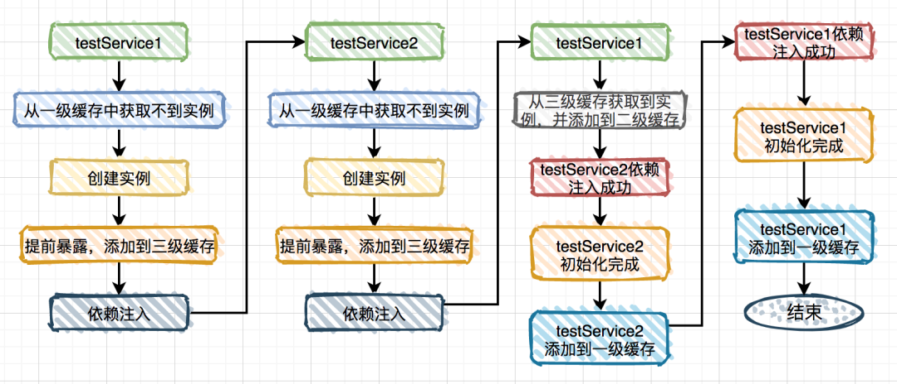

# Spring

## 事务怎么配置，事务什么时候会失效

- spring事务操作的方式
  - 声明式事务（用的较多）
    - 基于xml配置文件方式
    - 基于注解方式
  - 编码式事务  (硬编码)
- spring事务管理**通过AOP方法来实现**
- **事务管理代码的固定模式作为一种横切关注点，可以通过AOP方法模块化，进而借助Spring AOP框架实现声明式事务管理**
- 步骤：
  - 开启事务管理器（本质为管理事务的切面类）
  - 在事务方法上添加@Transactional注解
- **事务失效的情况**
  - **事务通过AOP进行了切面增强，失效根本原因是AOP没起作用**
    - 事务方法所在类没有被spring管理，->首先是一个spring的Bean才能使用AOP
    - **AOP的实现基于动态代理。所以需要满足动态代理的要求**
      - 在同一个类中的方法直接内部调用,会失效>对象本身通过this调用，绕过了代理类调用。
      - 该事务方法被final修饰的->子类无法继承和重写，代理类无法重写该方法来添加事务
      - 方法不是public修饰， **@Transactional注解只能⽤于 public 的⽅法上**
      - **如果通过接口引用实现类实例，并且新增的方法不在接口中，则 `@Transactional` 注解不会生效。为确保事务生效，可以使用 CGLIB 代理或将方法声明在接口中**
  - 数据库不支持事务
  - 异常在方法内被catch掉，事务不会回滚
  - 未发生@Transactional指定的异常。（默认是RuntimeExcelption，运行时异常）
  - **多线程调用**
    - A方法调用了B方法，但是B方法有创建新线程去执行，则A方法和B方法在数据库执行时，是不同的session会话，则无法生效
  - **事务传播机制**
    - 


### 在同一个类中的方法直接内部调用,事务失效的问题解决办法

可以通过aspectj来解决

- 引入AspectJ的相关配置包
- 开启注解@EnableAspectJAutoProxy(exposeProxy = true)：开启AspectJ动态代理，**并暴露代理对象**
- 本类的方法的相互调用
  - 本类方法的直接调用

```
MallOrderApplication order =(MallOrderApplication) AopContext.currentProxy();
order.method1();
order.method2();
```


## ~~AOP：AspectJ、原生动态代理，CGLIB关系~~ 

## Spring 中的bean 是线程安全的吗？

https://www.cnblogs.com/myseries/p/11729800.html

**不是线程安全的**

- Spring容器没有提供Bean的安全策略。所以容器中的Bean不具备线程安全的特性。但具体还是要结合Bean的作用范围
  - 若是原型Bean，不被容器管理，则每次线程使用需要自己创建对象。**不存在Bean共享问题**
  - 单实例Bean，所有线程使用一个单实例Bean，所以存在线程间的资源竞争
  - **spring单例，为什么controller、service和dao能保证线程安全？**
    - Spring中的Bean默认是单实例的，又没有准备Bean安全策略。不具备线程安全的特性。
    - 虽然controller、service和dao层本身不是线程安全的。但是这些Bean不会保存数据。多线程调用的是一个实例方法，也就是在每个线程的虚拟机栈的栈帧来处理。所以是安全的。
- 解决办法：把一些状态信息保存在threadLocal中

## Spring能不能解决循环依赖问题？

https://cloud.tencent.com/developer/article/1769948

https://developer.aliyun.com/article/766880

循环依赖：A依赖B，B依赖A。

能 （但不全能，两个循环依赖若全是采用构造器注入，则不能解决循环依赖问题）

- 那为什么在下表中的第三种情况的循环依赖能被解决，而第四种情况不能被解决呢？
  - Spring在创建Bean时默认会根据自然排序进行创建，所以A会先于B进行创建

| 依赖情况               | 依赖注入方式                                       | 循环依赖是否被解决 |
| ---------------------- | -------------------------------------------------- | ------------------ |
| AB相互依赖（循环依赖） | 均采用setter方法注入                               | 是                 |
| AB相互依赖（循环依赖） | 均采用构造器注入                                   | 否                 |
| AB相互依赖（循环依赖） | A中注入B的方式为setter方法，B中注入A的方式为构造器 | 是                 |
| AB相互依赖（循环依赖） | B中注入A的方式为setter方法，A中注入B的方式为构造器 | 否                 |


spring内部有三级缓存：

- singletonObjects 一级缓存，用于保存实例化、属性填充、初始化完成的bean实例。（真正实例化对象）
- earlySingletonObjects 二级缓存，用于保存实例化完成的bean实例（**提前暴露的对象**，虽然已实例化，但是没有进行属性填充，还没有完成初始化，是一个不完整的对象。）
- singletonFactories 三级缓存，用于保存bean创建工厂，以便于后面扩展有机会创建代理对象 （提前暴露创建工厂，对于循环依赖，三级缓存并没有 实际效作用，二级缓存足矣。但是如果通过AOP代理创建对象，则三级缓存非常重要）。





首先Spring尝试通过ApplicationContext.getBean()方法获取A对象的实例，由于Spring容器中还没有A对象实例，因而其会创建一个A对象

然后发现其依赖了B对象，因而会尝试递归的通过ApplicationContext.getBean()方法获取B对象的实例

但是Spring容器中此时也没有B对象的实例，因而其还是会先创建一个B对象的实例。

**~~注意**，此时A对象和B对象都已经创建了，并且保存在Spring容器中了，只不过A对象的属性b和B对象的属性a都还没有设置进去，也就是说还没初始化。~~

~~在前面Spring创建B对象之后，Spring发现B对象依赖了属性A，因而还是会尝试递归的调用ApplicationContext.getBean()方法获取A对象的实例~~

~~因为Spring中已经有一个A对象的实例，虽然只是半成品（其属性b还未初始化），但其也还是目标bean，因而会将该A对象的实例返回。~~

~~此时，B对象的属性a就设置进去了，然后还是ApplicationContext.getBean()方法递归的返回，也就是将B对象的实例返回，此时就会将该实例设置到A对象的属性b中。~~

~~这个时候，注意A对象的属性b和B对象的属性a都已经设置了目标对象的实例了~~

~~读者朋友可能会比前面在为对象B设置属性a的时候，这个A类型属性还是个半成品。但是需要注意的是，这个A是一个引用，其本质上还是最开始就实例化的A对象。~~

~~而在上面这个递归过程的最后，Spring将获取到的B对象实例设置到了A对象的属性b中了~~

~~这里的A对象其实和前面设置到实例B中的半成品A对象是同一个对象，其引用地址是同一个，这里为A对象的b属性设置了值，其实也就是为那个半成品的a属性设置了值。~~


**答案**

面试官：”Spring是如何解决的循环依赖？“

答：Spring通过三级缓存解决了循环依赖，其中一级缓存为单例池（`singletonObjects`）,二级缓存为早期曝光对象`earlySingletonObjects`，三级缓存为早期曝光对象工厂（`singletonFactories`）。当A、B两个类发生循环引用时，在A完成实例化后，就使用实例化后的对象去创建一个对象工厂，并添加到三级缓存中，如果A被AOP代理，那么通过这个工厂获取到的就是A代理后的对象，如果A没有被AOP代理，那么这个工厂获取到的就是A实例化的对象。当A进行属性注入时，会去创建B，同时B又依赖了A，所以创建B的同时又会去调用getBean(a)来获取需要的依赖，此时的getBean(a)会从缓存中获取，第一步，先获取到三级缓存中的工厂；第二步，调用对象工工厂的getObject方法来获取到对应的对象，得到这个对象后将其注入到B中。紧接着B会走完它的生命周期流程，包括初始化、后置处理器等。当B创建完后，会将B再注入到A中，此时A再完成它的整个生命周期。至此，循环依赖结束！

面试官：”为什么要使用三级缓存呢？二级缓存能解决循环依赖吗？“

答：如果要使用二级缓存解决循环依赖，意味着所有Bean在实例化后就要完成AOP代理，这样违背了Spring设计的原则，Spring在设计之初就是通过`AnnotationAwareAspectJAutoProxyCreator`这个后置处理器来在Bean生命周期的最后一步来完成AOP代理，而不是在实例化后就立马进行AOP代理。

为什么要使用三级缓存呢？

当 Bean 需要被代理（如 AOP）时，问题变得复杂：

- **代理对象需要在原始对象的基础上生成**。（原始对象和代理对象的关系：代理对象内部 有原始对象的引用）
- **二级缓存无法直接解决**：
  - 如果直接将原始对象放入二级缓存，后续生成的代理对象会覆盖它，导致依赖注入不一致。
  - 如果直接放入代理对象，但代理对象的生成可能依赖其他 Bean，导致循环依赖无法解开。
- **三级缓存的解决方案**：
  - **三级缓存存放 `ObjectFactory`**：在 Bean 实例化后，将生成代理对象的工厂存入三级缓存。
  - **延迟生成代理对象**：当其他 Bean 依赖当前 Bean 时，通过三级缓存的工厂实时生成代理对象，确保注入的是最终形态的 Bean。


1. **错误理解**："先创建完整原始对象，再创建完整代理对象"
   - 实际情况：代理对象内部持有原始对象的引用，原始对象不会独立存在
2. **错误理解**："会有两个对象同时被其他 Bean 引用"
   - 实际情况：所有依赖方拿到的都是同一个代理对象
3. **错误理解**："代理对象是在初始化完成后才创建的"
   - 实际情况：为处理循环依赖，**可能在属性注入阶段就提前创建代理**


## Bean的注入过程

Bean的注入过程就是Bean的创建过程，IOC启动时的创建过程。

## SpringBoot之三种常见的依赖注入方式

https://blog.csdn.net/G_x_n/article/details/118693159

- 成员变量注入
- 构造函数注入
- setter方法注入


## Bean的自动注入方式

- **set方法注入**
- **构造器注入**
- **静态工厂注入**
- **实例工厂注入**

可以在xml中进行配置

set方法注入

这是最简单的注入方式，假设有一个SpringAction，类中需要实例化一个SpringDao对象，那么就可以定义一个private的SpringDao成员变量，然后创建SpringDao的set方法（这是ioc的注入入口）：

```
package com.bless.springdemo.action; 
public class SpringAction { 
    //注入对象springDao 
    private SpringDao springDao; 
    //一定要写被注入对象的set方法 
    public void setSpringDao(SpringDao springDao) { 
    this.springDao = springDao; 
} 
 
public void ok(){ 
    springDao.ok(); 
} 
}
```

xml文件中进行配置

```
<!--配置bean,配置后该类由spring管理--> 
<bean name="springAction" class="com.bless.springdemo.action.SpringAction"> 
<!--(1)依赖注入,配置当前类中相应的属性--> 
<property name="springDao" ref="springDao"></property> 
</bean> 
<bean name="springDao" class="com.bless.springdemo.dao.impl.SpringDaoImpl"></bean>
```

构造器注入

```
public class SpringAction { 
    //注入对象springDao 
    private SpringDao springDao; 
    private User user; 
 
    public SpringAction(SpringDao springDao,User user){ 
    this.springDao = springDao; 
    this.user = user; 
    System.out.println("构造方法调用springDao和user"); 
} 
 
public void save(){ 
    user.setName("卡卡"); 
    springDao.save(user); 
} 
} 
```

xml文件中配置

```
<!--配置bean,配置后该类由spring管理--> 
<bean name="springAction" class="com.bless.springdemo.action.SpringAction"> 
<!--(2)创建构造器注入,如果主类有带参的构造方法则需添加此配置--> 
<constructor-arg ref="springDao"></constructor-arg> 
<constructor-arg ref="user"></constructor-arg> 
</bean> 
<bean name="springDao" class="com.bless.springdemo.dao.impl.SpringDaoImpl"></bean> 
<bean name="user" class="com.bless.springdemo.vo.User"></bean> 
```

静态工厂注入

静态工厂顾名思义，就是通过调用静态工厂的方法来获取自己需要的对象，为了让spring管理所有对象，我们不能直接通过”工程类.静态方法()”来获取对象，而是依然通过spring注入的形式获取：

```
package com.bless.springdemo.factory; 
 
import com.bless.springdemo.dao.FactoryDao; 
import com.bless.springdemo.dao.impl.FactoryDaoImpl; 
import com.bless.springdemo.dao.impl.StaticFacotryDaoImpl; 
 
public class DaoFactory { 
//静态工厂 
public static final FactoryDao getStaticFactoryDaoImpl(){ 
    return new StaticFacotryDaoImpl(); 
    } 
}
```

同样看关键类，这里我需要注入一个FactoryDao对象，这里看起来跟第一种注入一模一样，但是看随后的xml会发现有很大差别:

```
public class SpringAction { 
//注入对象 
private FactoryDao staticFactoryDao; 
 
public void staticFactoryOk(){ 
    staticFactoryDao.saveFactory(); 
} 
//注入对象的set方法 
public void setStaticFactoryDao(FactoryDao staticFactoryDao) { 
    this.staticFactoryDao = staticFactoryDao; 
} 
} 
```

xml文件

```
<!--配置bean,配置后该类由spring管理--> 
<bean name="springAction" class="com.bless.springdemo.action.SpringAction" > 
<!--(3)使用静态工厂的方法注入对象,对应下面的配置文件(3)--> 
<property name="staticFactoryDao" ref="staticFactoryDao"></property> 
</property> 
</bean> 
<!--(3)此处获取对象的方式是从工厂类中获取静态方法--> 
<bean name="staticFactoryDao" class="com.bless.springdemo.factory.DaoFactory" factory-method="getStaticFactoryDaoImpl"></bean> 
```

实例工厂的方法注入

实例工厂的意思是获取对象实例的方法不是静态的，所以你需要首先new工厂类，再调用普通的实例方法：

```
public class DaoFactory { 
//实例工厂 
public FactoryDao getFactoryDaoImpl(){ 
    return new FactoryDaoImpl(); 
} 
}
```

为该类注入factoryDao

```
public class SpringAction { 
//注入对象 
private FactoryDao factoryDao; 
 
public void factoryOk(){ 
    factoryDao.saveFactory(); 
} 
 
public void setFactoryDao(FactoryDao factoryDao) { 
    this.factoryDao = factoryDao; 
    } 
} 
```

xml文件配置

```
<!--配置bean,配置后该类由spring管理--> 
<bean name="springAction" class="com.bless.springdemo.action.SpringAction"> 
<!--(4)使用实例工厂的方法注入对象,对应下面的配置文件(4)--> 
<property name="factoryDao" ref="factoryDao"></property> 
</bean> 
 
 
<!--(4)此处获取对象的方式是从工厂类中获取实例方法--> 
<bean name="daoFactory" class="com.bless.springdemo.factory.DaoFactory"></bean> 
<bean name="factoryDao" factory-bean="daoFactory" factory-method="getFactoryDaoImpl"></bean> 
```


## Mybatis中分页方式有几种

- 数组分页：查询出所有的数据，返回list集合。从集合中截取想要的分页数据
- sql语句分页，使用 limit #{currIndex} , #{pageSize}
- 拦截器分页：实现Interceptor 接口，拦截mybatis接口方法id以ByPage结束的语句，对SQL语句进行拼接
- RowBounds分页 
  - Mybatis提供RowBounds类来实现逻辑分页。RowBounds中有2个字段offset和limit。这种方式获取所有的ResultSet，从ResultSet中的offset位置开始获取limit个记录。但这并不意味着JDBC驱动器会将所有的ResultSet存放在内存，实际上只加载小部分数据到内存，如果需要，再加载部分数据到内存。

## 从IOC容器中获取Bean实例的方法

1. 通过类型获取
2. 通过id名字获取
3. 二者结合，既指定类型，也指定id

## 如何获取ApplicationContext

有三种方式

- 实现ApplicationContextAware接口，将ApplicationContext变量设为static，方便从类中获取。
- 将实现ApplicationContextAware接口的类，加入到IOC容器中，可以直接注入
  - 使用注解@Resurce直接注入 applicationContext
- 将main类中创建的applicationContext设为static，则方便获取

## @Resource与@autoware的区别

- `@Autowired` 是 Spring 提供的注解，`@Resource` 是 JDK 提供的注解。
- `@Resource`属于 JDK 提供的注解，默认注入方式为 `byName`。如果无法通过名称匹配到对应的 Bean 的话，注入方式会变为`byType`。
- `@Autowired`是spring提供的注解，默认注入方式是`byType`。无法匹配时，通过`byName`进行获取；

## BeanFactory与ApplicationContext的区别

https://blog.csdn.net/pythias_/article/details/82752881

- **两者装载bean的区别**

**BeanFactory：**

BeanFactory在启动的时候不会去实例化Bean，中有从容器中拿Bean的时候才会去实例化；

**ApplicationContext：**

[ApplicationContext](https://so.csdn.net/so/search?q=ApplicationContext&spm=1001.2101.3001.7020)在启动的时候就把所有的Bean全部实例化了。它还可以为Bean配置lazy-init=true来让Bean延迟实例化； 

- 功能层面

**BeanFactory：**

是Spring里面最低层的接口，提供了最简单的容器的功能，只提供了实例化对象和获取对象的功能；

**ApplicationContext：**

应用上下文，继承BeanFactory接口，它是Spring的一各更高级的容器，提供了更多的有用的功能；

\1) 国际化（MessageSource）

\2) 访问支持不同方式的资源访问，如URL和文件（ResourceLoader）

\3) 载入多个（有继承关系）上下文 ，使得每一个上下文都专注于一个特定的层次，比如应用的web层  

\4) 消息发送、响应机制（ApplicationEventPublisher）**支持事件发布通知**

\5) AOP（拦截器）


ApplicationContext支持不同信息源头，支持 BeanFactory 工具类，支持层级容器，支持访问文件资源，支持事件发布通知，支持接口回调等等。

## Spring Boot 拦截器、过滤器、监听器

https://blog.csdn.net/weixin_42036952/article/details/102493045

- 拦截器(interceptor)：依赖于spring框架，基于Java的反射机制，属于AOP的一种应用。一个拦截器实例在一个controller生命周期内可以多次调用。只能拦截Controller的请求。
- 过滤器(Filter)：依赖于Servlet容器，基于函数回掉，可以对几乎所有请求过滤，一个过滤器实例只能在容器初使化调用一次。但无法获取ioc容器中的bean。过滤器是对数据进行过滤，预处理过程。
- 监听器(Listener)：web监听器是Servlet中的特殊的类，可以用于监听Web应用中某些对象、信息的创建、销毁和修改等动作发生，然后做出相应的响应处理。


**启动顺序**

监听器 > 过滤器 > 拦截器

## 拦截器的种类

- HandlerInterceptor：它拦截的是Http请求的信息，优先于MethodInterceptor。拦截请求地址，比后者先执行。类似过滤器。
- MethodInterceptor：  拦截指定类型的方法，通过动态代理模式实现。

## SpringBoot的启动过程 

https://www.cnblogs.com/Narule/p/14253754.html

**启动main方法开始**

1. **初始化配置**：通过类加载器，（loadFactories）读取classpath下所有的spring.factories配置文件，创建一些初始配置对象；通知监听者应用程序启动开始，创建环境对象environment，用于读取环境配置 如 application.yml
2. **创建应用程序上下文**-createApplicationContext，创建 bean工厂对象
3. **刷新上下文（启动核心）**
   1. 配置工厂对象，包括上下文类加载器，对象发布处理器，beanFactoryPostProcessor
   2. 注册并实例化bean工厂发布处理器，并且调用这些处理器，对包扫描解析(主要是class文件)
   3. 注册并实例化bean发布处理器 beanPostProcessor
   4. 初始化一些与上下文有特别关系的bean对象（创建tomcat服务器）
   5. 实例化所有bean工厂缓存的bean对象（剩下的）
   6. 发布通知-通知上下文刷新完成（启动tomcat服务器）
4. **通知监听者-启动程序完成**


注解@Order或者接口Ordered的作用是定义Spring IOC容器中Bean的执行顺序的优先级，而不是定义Bean的加载顺序，Bean的加载顺序不受@Order或Ordered接口的影响；

## **Spring 为啥把bean默认设计成单例？**

**优点**

- **减少了新生成实例的消耗**
  - 新生成实例消耗包括两方面，第一，spring会通过反射或者cglib来生成bean实例这都是耗性能的操作，其次给对象分配内存也会涉及复杂算法。
- **减少jvm垃圾回收**
  - 由于不会给每个请求都新生成bean实例，所以自然回收的对象少了。
- **可以快速获取到bean**
  - 因为单例的获取bean操作除了第一次生成之外其余的都是从缓存里获取的所以很快。

**缺点**

- **线程不安全**

## `<![CDATA[]]>`

特殊字符，在xml文件中，“<”和“&”是非法的，无法解释为原有含义。

“<”: 解析器把该符号作为新元素的开始

“&”：将该符号作为字符实体的开始。

因此，在MySQL中，若遇到特殊字符，可采用 `<![CDATA[xxxxx]]>`,填写内容，而不会被xml解析器解析。


## spring AOP中的@AfterThrowing处理异常与try...catch...的区别

- 相同点：
  - 都会对目标方法的异常进行处理
- Try catch
  - 会完全捕捉异常，只有catch不再往上级调用者抛出异常，那么会被吃掉，不向上一级调用者传播
- AOP
  - 动态代理的增强处理，处理异常后，仍会向上一级调用者传播 即（AOP只是一个切面，无法阻止方法行为的执行，更多的是增加一个步骤）