#  1 设计模式简介

## 设计模式概念

软件设计模式，**代码设计经验的总结**。描述了在软件设计过程中不断发生的问题，以及该问题的解决方案。更多的是对代码设计经验的总结模式，方便套用。 

## 设计模式分类

- 创建型模式
  - 用于描述怎样创建对象，主要特点就是将**对象的创建和使用分离**，包括单例，原型，工厂方法，抽象工厂，建造者，5种模式
- 结构型模式
  -   用于描述如何将类或者对象按某种布局组成更大的结构，代理，适配器，桥接，装饰，外观，享元，组合，7种模式
- 行为型模式
  - 描述类或者对象之间如何相互协作，共同完成单个对象无法单独完成的任务和分配职责。模板方法、策略、命令、职责链、状态、观察者、中介者、迭代器、访问者、备忘录、解释器，11种行为型模式。

设计模式的==目标==：**代码可维护，可复用，可拓展，而且灵活性好**

手段：通过封装，继承，多态把程序的耦合度降低。

基本代码：

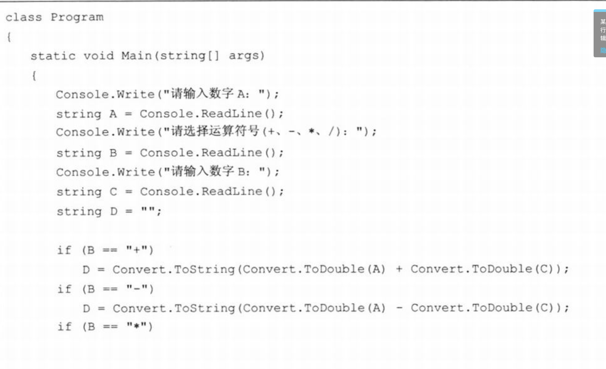

简单代码则是读取数据和操作，再加上几个if。

复杂代码则需要将操作操作抽离出一个抽象类，并将各个操作（加减乘除）进行实现。通过简单工厂模式，获取指定的操作类，进行执行。

为什么这样？ 

若新增功能，比如开根号等操作，不易拓展，而且新增代码可能会影响其他类，避免这样，所以新增功能实现抽象类，并完成重写方法。而且简单工厂模式获取对象值创建目标对象，其他对象不实例化。

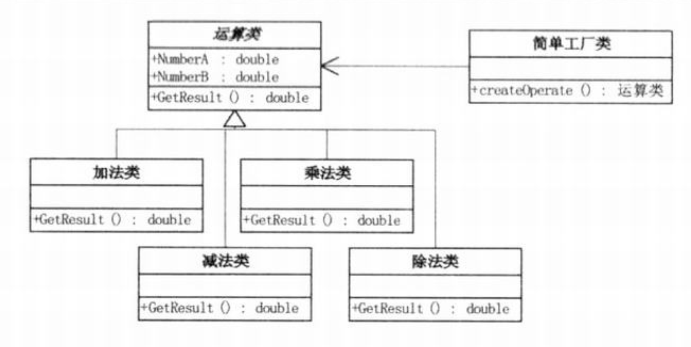

# 2 UML图

 UML是用于设计软件的可视化统一建模语言。它的特点是简单，统一，图形化，能表达软件设计中的动态和**静态信息**

从设计目标的不同，可以分为：用例图，**类图**，对象图，状态图，活动图，时序图，协作图，构件图，部署图等9种


## 类图的概述

类图显示了模型的静态结构，特别是模型中存在的类，类的内部结构以及它们与其台类的关系等，类图不显示暂时性的信息，类图是面向对象建模的主要组成部分。

## 类图表示

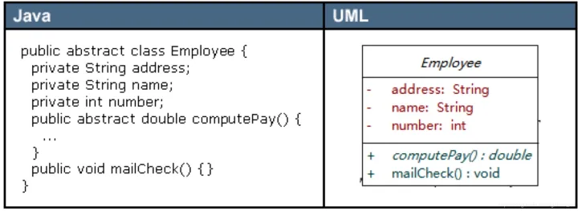

类图中，类使用包含类名，属性和方法

属性/方法名称前加的加号和减号表示这个属性/方法的可见性，UML类图中表示可见性的符合有三种：

- +：表示public
- -: 表示private
- \#:表示protected

属性的完整表示方式： **可见性 名称 ：类型[ =缺省值]** 

方法的完整表示方式：**可见性 名称（参数列表）[:返回值类型]**

[] 中括号为可有可无的初始化值。 


## 类之间关系的表示方式

- 关联关系
  -   单向关联
  - 双向关联
  - 自关联
- 聚合关系
- 组合关系

### 关联关系

#### 单向关联

在UML类中，用一个带箭头的实线表示，图中表示每个顾客类都持有一个地址类型的成员变量实现


#### 双向关联

双向关联用一个不带箭头的实线表示，两个类中均持有对方类型的成员变量


#### 自关联

自关联在UML类图中用一个带有箭头且指向自身的线表示。上图的意思就是Node类包含类型为Node的成员变量，也就是"自己包含自己"。【LinkedList底层用到了自关联】


### 聚合关系

聚合关系是强关联关系，整体和部分的关系。成员对象是整体对象的一部分，但成员对象可以脱离整体对象而存在。

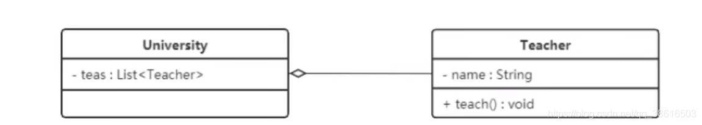

### 组合关系

==组合关系表示类之间的整体与部分的关系，但它是一种更强烈的聚合关系。==

组合关系中，整体对象可以控制部分的生命周期，一旦整体对象不存在，部分对象不能脱离整体而存在。

在UML类图中，组合关系用带实心菱形的实线来表示，菱形指向整体。

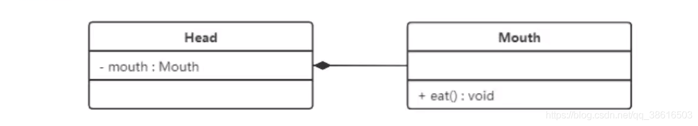

### 依赖关系

依赖关系是一种使用关系，它是对象之间耦合度最弱的一种关联方式，使是临时性的关联。

在代码中，某个类的方法通过局部变量，方法的参数或者静态方法的调用来访问另一个类中的某些方法来完成职责。

**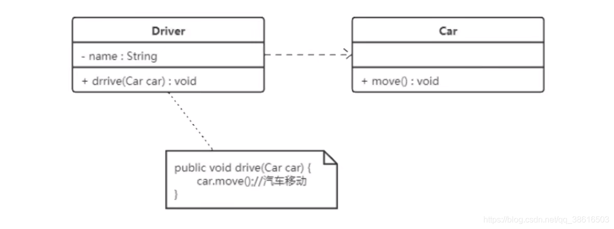**

### 继承关系

继承关系是对象之间耦合对最大的一种关系。

在UML类图中，泛化关系用带空心三角箭头的实线来表示，箭头从子类指向父类。

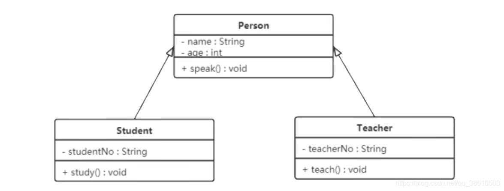

### 实现关系

实现关系是接口与实现类之间的关系，类实现了接口，类中的操作实现了接口中所声明的所有抽象方法。

## **UML 示例图**

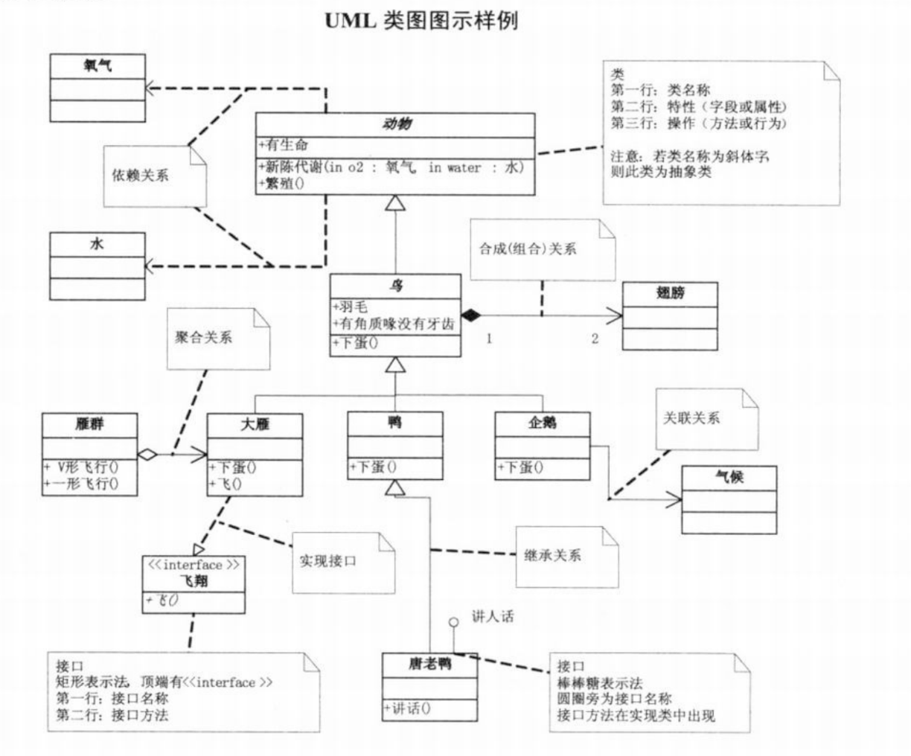


# 3 软件设计原则

软件设计中，为了提高软件系统的可维护性和可复用性，增加软件的可拓展性和灵活性，程序员要尽量根据6条原则开发程序，从而提高软件开发效率，节约软件开发成本和维护成本。


## 3.1 开闭原则

（开放-封闭原则）

**对拓展开放，对修改关闭**。本质是不修改原有代码，但可以拓展的思想。

==程序需要拓展时，不能去修改原有代码，而是实现热插拔的效果。==为了使程序的拓展性好，易于维护和升级。我们使用**接口和抽象类**,因为抽象类灵活性好，适用性广。我们可以通过抽象派生出的实现类来进行拓展。，若需求发生变化，则根据需要派生出一个新的实现类来拓展即可。

热插拔，在java中叫：**强内聚，松耦合**

## 3.2 里氏代换原则

里氏代换原则是面向对象设计的基本原则之一

里氏代换原则：任何基类可以出现的地方，子类也可出现。可理解为：**子类继承父类时，进行是新增方法，而不是重写父类已有的方法**

子类虽然可以重写父类的方法来完成指定的功能，但整个继承体系的可复用性则会变差，尤其在使用多态频繁的场景。

理解为：重写父方法虽然可完成个别指定的功能，在多态的多场景下，未必完全适用。

## 3.3 依赖倒转原则

高层模块不能依赖底层模块，二者都应该依赖其抽象；抽象不应该依赖细节，细节应该依赖抽象。

**可理解为：对传入参数或者属性类型选择抽象类或者接口，而不必是具体类，避免无法变更该类，即set属性为学生，但我们类的属性类型应选择人（抽象类），因为可能参数变更为老师**， 类依赖抽象，而不是依赖于具体实现类。即针对接口或者抽象类编程，不要对实现编程。


## 3.4 接口隔离原则

客户端不应该依赖它不使用的方法，一个类对另一个的依赖应该建立在最小的接口上。

**可理解为：子类A依赖B的方法1，但不依赖B的方法2，所以将方法1，方法2写入两个接口上，A只实现接口1，类B实现接口1,2**，则是一个类对另一个类的依赖应取最小的依赖权限

## 3.5 迪米特原则

迪米特原则：最少知识原则

两个软件实体无须直接通信，那么不应该直接相互调用，可以通过第三方转发该调用。

目的：降低类之间的耦合度，提高模块的相对独立性。

两个软件的关系：当前对象本身，当前对象的成员对象，当前对象所创建的对象，当前对象的方法参数等，这些对象同当前对象存在关联，聚合等关系，可访问这些对象的方法。

**可理解为：万事万物皆对象，需要将某些属性，方法抽成类对象，调用该类对象的属性，方法，而不是直接编写属性，方法**

## 3.6 合成复用原则

尽量先使用组合或者聚合等关联关系来实现，其次才考虑使用继承关系来实现。

通常类的复用分为继承复用和合成复用两种

- **继承复用**：虽然简单和容易实现，但也有一些缺点
  - 继承复用破坏了类的封装性，因为继承会将父类的实现细节暴露给子类，即子类拥有父类的属性和方法
  - 子类和父类耦合度高，父类的实现的任何改变，都会对子类产生影响，不利于类的拓展和维护
  - 它限制了复用的灵活性，从父类继承而来的实现是静态的，编译时已经生成，无法修改
- **组合复用**：将已有对象纳入新对象时，使之成为新对象的一部分，新对象可以抵用已有对象的功能
  - 它维持了类的封装性
  - 对象的耦合度低
  - 复用的灵活性高。（可以属性为父类，抽象类等，传入子类，增加灵活性）


汽车按“动力源”划分可分为汽油汽车、电动汽车等；按“颜色”划分可分为白色汽车、黑色汽车和红色汽车等。如果同时考虑这两种分类，其组合就很多。类图如下： 


从上面类图我们可以看到使用继承复用产生了很多子类，如果现在又有新的动力源或者新的颜色的话，就需要再定义新的类。我们试着将继承复用改为聚合复用看一下。


# 4 创建者模式

创建者模式：主要关注怎样创建对象，将对象的创建和使用分离

创建者模式分为：

- 单例模式
- 工厂方法模式
- 抽象工程模式
- 原型模式
- 建造者模式

## 4.1 单例模式

单例模式分为**饿汉式**和**懒汉式**

- 饿汉式：类加载就会创建该实例类
- 懒汉式：类加载时不会创建单例对象，在首次获取该处对象时，才会被创建

### 单例模式实现方式

#### 饿汉式-方式1（静态变量方式）

```java
/**
 * 饿汉式
 *      静态变量创建类的对象
 */
public class Singleton {
    //私有构造方法
    private Singleton() {}

    //在成员位置创建该类的对象
    private static Singleton instance = new Singleton();

    //对外提供静态方法获取该对象
    public static Singleton getInstance() {
        return instance;
    }
}
```

说明：

该方式通过静态变量，在类加载时创建对象，若对象太大，而一直未使用，则造成内存浪费

#### 饿汉式-方式2（静态代码块方式）

```java
/**
 * 恶汉式
 *      在静态代码块中创建该类对象
 */
public class Singleton {

    //私有构造方法
    private Singleton() {}

    //在成员位置创建该类的对象
    private static Singleton instance;

    static {
        instance = new Singleton();
    }

    //对外提供静态方法获取该对象
    public static Singleton getInstance() {
        return instance;
    }
}
```

说明：

与方式1相仿

#### 懒汉式-方式1（线程不安全）

```java
/**
 * 懒汉式
 *  线程不安全
 */
public class Singleton {
    //私有构造方法
    private Singleton() {}

    //在成员位置创建该类的对象
    private static Singleton instance;

    //对外提供静态方法获取该对象
    public static Singleton getInstance() {

        if(instance == null) {
            instance = new Singleton();
        }
        return instance;
    }
}
```

<font color='red'>说明：</font>

线程不安全，在多个线程同时第一次调用该对象时，发现该对象为null，多线程都创建了new singleton，并返回。则创建出了多个singleton

#### 懒汉式-方式2（线程安全）

```java
/**
 * 懒汉式
 *  线程安全
 */
public class Singleton {
    //私有构造方法
    private Singleton() {}

    //在成员位置创建该类的对象
    private static Singleton instance;

    //对外提供静态方法获取该对象
    public static synchronized Singleton getInstance() {

        if(instance == null) {
            instance = new Singleton();
        }
        return instance;
    }
}
```

<font color='red'>说明：</font>

在获取对象方法上，加synchronized关键字，导致该方法的执行效率低，因为只有在创建对象时，存在线程安全问题，创建完成后，只是读取单例的地址不存在线程安全。所以有性能低的问题

#### 懒汉式-方式3（双重检查锁）

在多线程的情况下，可能会出现空指针问题，出现问题的原因是JVM在实例化对象的时候会进行优化和指令重排序操作。注意需要添加volatile 关键字，来保证可见性和有序性

```java
public final class Singleton {
    private Singleton() { }
        // 问题1：解释为什么要加 volatile ?
        private static volatile Singleton INSTANCE = null;
        // 问题2：对比上个实现, 说出这样做的意义
        public static Singleton getInstance() {
            if (INSTANCE != null) {
            	return INSTANCE;
            }
            synchronized (Singleton.class) {
                // 问题3：为什么还要在这里加为空判断, 之前不是判断过了吗
                if (INSTANCE != null) { // t2
                	return INSTANCE;
                }
            INSTANCE = new Singleton();
            return INSTANCE;
        }
    }
}
```

- 问题1：
  - **volatile此时主要是避免因为指令重排而出现的问题**
    - 若创建对象 [INSTANCE = new Singleton()] 出现重排序，先给INSTANCE赋予地址值，但单实例此时没有完全初始化。后续线程进入getInstance方法，因为INSTANCE不为空（第一个判断），会获取到还没有初始化完成的单实例。**单实例有问题**
  - volatile加入了写屏障，使得INSTANCE赋值之前，其他指令已经完成。
  - 保证了可见性
- **问题2：实现3为在单实例获取方法上加synchronized**
  - 避免了已经创建对象，却仍要竞争锁的情况，（影响速度）
- **问题3：**
  - 在INSTANCE为null时，多个线程同时来获取单实例，第一次判断INSTANCE为null。只有一个线程竞争到锁并创建了对象，其他线程也会继续竞争锁，进入synchronized方法，若没有该判断，则会继续创建对象，而不是使用已经创建的对象

#### 懒汉式-方式4（静态内部类方式）

静态内部类单例模式中实例由内部类创建，由于jvm在加载外部类时，不会加载静态内部类，只有内部类的属性/方法被调用时才会被加载，并初始化内部类的静态属性。而且静态属性因为static修饰，属于类，只初始化一次，保证了实例化顺序

```java
/**
 * 静态内部类方式
 */
public class Singleton {

    //私有构造方法
    private Singleton() {}

    private static class SingletonHolder {
        private static final Singleton INSTANCE = new Singleton();
    }

    //对外提供静态方法获取该对象
    public static Singleton getInstance() {
        return SingletonHolder.INSTANCE;
    }
}
```

<font color='red'>说明：</font>

 第一次加载Singleton类时，不会初始化单例对象，只有在第一次调用getInstance方法时，虚拟机才加载内部类，并初始化，既保证了线程安全，又保证了唯一性。（因为类加载只加载一次）

<font color="red">小结：</font>

**静态内部类单例模式是一种优秀的单例模式，而且非常常见，没有加锁，既保证了线程安全，又没有性能和空间的浪费。**

#### 枚举方式

**枚举类单例模式是线程安全的，并且只会被加载一次，枚举的写法简单，并且唯一不会被破坏的单例实现模式**

```java
/**
 * 枚举方式
 */
public enum Singleton {
    INSTANCE;
}
```

<font color='red'>说明：</font>

 枚举属于饿汉式

### 单例设计模式问题

单例被破坏的方法：**序列化反序列化和反射**，但枚举方式的单例不会被这两个破坏。

- #### 反序列化破坏单例模式解决方案

在单例类Singleton中，添加`readResolve()`方法，在反序列时被反射调用，如果定义了这个方法，就返回该方法的返回值，如果没有定义，则通过反射new一个新的对象

```java
public class Singleton implements Serializable {

    //私有构造方法
    private Singleton() {}

    private static class SingletonHolder {
        private static final Singleton INSTANCE = new Singleton();
    }

    //对外提供静态方法获取该对象
    public static Singleton getInstance() {
        return SingletonHolder.INSTANCE;
    }
    
    /**
     * 下面是为了解决序列化反序列化破解单例模式
     */
    private Object readResolve() {
        return SingletonHolder.INSTANCE;
    }
}
```


源码解析：

ObjectInputStream类

```java
public final Object readObject() throws IOException, ClassNotFoundException{
    ...
    // if nested read, passHandle contains handle of enclosing object
    int outerHandle = passHandle;
    try {
        Object obj = readObject0(false);//重点查看readObject0方法
    .....
}
    
private Object readObject0(boolean unshared) throws IOException {
	...
    try {
		switch (tc) {
			...
			case TC_OBJECT:
				return checkResolve(readOrdinaryObject(unshared));//重点查看readOrdinaryObject方法
			...
        }
    } finally {
        depth--;
        bin.setBlockDataMode(oldMode);
    }    
}
    
private Object readOrdinaryObject(boolean unshared) throws IOException {
	...
	//isInstantiable 返回true，执行 desc.newInstance()，通过反射创建新的单例类，
    obj = desc.isInstantiable() ? desc.newInstance() : null; 
    ...
    // 在Singleton类中添加 readResolve 方法后 desc.hasReadResolveMethod() 方法执行结果为true
    if (obj != null && handles.lookupException(passHandle) == null && desc.hasReadResolveMethod()) {
    	// 通过反射调用 Singleton 类中的 readResolve 方法，将返回值赋值给rep变量
    	// 这样多次调用ObjectInputStream类中的readObject方法，继而就会调用我们定义的readResolve方法，所以返回的是同一个对象。
    	Object rep = desc.invokeReadResolve(obj);
     	...
    }
    return obj;
}
```

- #### 反射破坏单例模式解决方案

  ```java
  public class Singleton {
  
      //私有构造方法
      private Singleton() {
          /*
             反射破解单例模式需要添加的代码
          */
          if(instance != null) {
              throw new RuntimeException();
          }
      }
      
      private static volatile Singleton instance;
  
      //对外提供静态方法获取该对象
      public static Singleton getInstance() {
  
          if(instance != null) {
              return instance;
          }
  
          synchronized (Singleton.class) {
              if(instance != null) {
                  return instance;
              }
              instance = new Singleton();
              return instance;
          }
      }
  }
  ```

  <font color="red">说明:</font>

  破坏单例的创建，不允许通过反射创建多个对象。

### JDK源码中的单例模式

Runtime类使用饿汉式（静态属性）单例设计模式

```java
public class Runtime {
    private static Runtime currentRuntime = new Runtime();

    /**
     * Returns the runtime object associated with the current Java application.
     * Most of the methods of class <code>Runtime</code> are instance
     * methods and must be invoked with respect to the current runtime object.
     *
     * @return  the <code>Runtime</code> object associated with the current
     *          Java application.
     */
    public static Runtime getRuntime() {
        return currentRuntime;
    }

    /** Don't let anyone else instantiate this class */
    private Runtime() {}
    ...
}
```

## 4.2 工厂模式

java中，万物皆对象，对象创建需要new对象，耦合眼红，如果更改对象，需要将所有new对象的位置都改。未被了软件设计的开闭原则。因此，我们选择工厂来生产对象，使用对象，只从工厂获取，如果更换对象，在工厂内更换，达到对象解耦的目的。工厂模式的最大优点：**解耦**

工厂模式：

- 简单工厂模式 (不是设计模式，更像是一种编程习惯)
- 工厂方法模式
- 抽象工厂模式

### 简单工厂模式

简单工厂不是设计模式，更多的像是一种编程习惯。开发过程中，很多奖工厂类里的创建对象功能设为静态的static，即静态工厂模式，此模式也是开发习惯，而非设计模式

简单工厂提供的角色：

- 抽象产品：定义了对象的基本规范，描述了主要特性
- 具体产品：实现或者继承类的子类
- 具体工厂：提供了创建对象的方法，调用者通过该方法获取想要的对象


对象的创建和使用分开。创建对象，根据传参在SimpleFactory中创建各种对象，使用对象时，从SimpleFactory中获取。解除了调用方与对象实现类的耦合。但产生了新的耦合。对象和生产对象的工厂的耦合，工厂对象和产品对象的耦合。

如果后期添加新的产品对象，仍需要更改工厂对象的代码，违反了开闭原则。

#### 实现

```java
public class SimpleCoffeeFactory {

    public Coffee createCoffee(String type) {
        Coffee coffee = null;
        if("americano".equals(type)) {
            coffee = new AmericanoCoffee();
        } else if("latte".equals(type)) {
            coffee = new LatteCoffee();
        }
        return coffee;
    }
}
```

#### 优缺点

##### **优点：**

封装了创建对象的过程，可以通过参数直接获取对象。把对象的创建和业务逻辑分开。在以后有新对象创建时，不必更改原有代码，只更改工厂类即可。容易拓展

##### 缺点：

新增产品对象后，仍需要更改工厂类对象，违背了开闭原则


### 模式拓展

简单工厂+配置文件解除耦合

通过工厂模式+配置文件的方式解除工厂对象和产品对象的耦合，具体实现是在工厂类中加载配置文件中全类名，创建对象并存储到map中，客户端如果需要对象，则可以直接获取。

#### 一 定义配置文件

```properties
american=com.itheima.pattern.factory.config_factory.AmericanCoffee
latte=com.itheima.pattern.factory.config_factory.LatteCoffee
```

#### 二 工厂类 

```java
public class CoffeeFactory {

    private static Map<String,Coffee> map = new HashMap();

    static {
        Properties p = new Properties();
        InputStream is = CoffeeFactory.class.getClassLoader().getResourceAsStream("bean.properties");
        try {
            p.load(is);
            //遍历Properties集合对象
            Set<Object> keys = p.keySet();
            for (Object key : keys) {
                //根据键获取值（全类名）
                String className = p.getProperty((String) key);
                //获取字节码对象
                Class clazz = Class.forName(className);
                Coffee obj = (Coffee) clazz.newInstance();
                map.put((String)key,obj);
            }
        } catch (Exception e) {
            e.printStackTrace();
        }
    }

    public static Coffee createCoffee(String name) {

        return map.get(name);
    }
}
```

静态代码段，表示只需要执行一次，并存储在静态变量map中


### 工厂方法模式

简单工厂模式在新增产品对象后，仍需要更改工厂类对象，违背开闭原则。该工厂方法模式可以完美解决。

#### 概念

定义了一个创建对象的接口，该子类决定实例化哪个产品对象，该工厂方法使产品的实例化延迟到该工厂的子类中。

#### 结构：

- 抽象工厂：提供工厂的抽象类或者接口标准，可调用该类的具体实现创建产品
- 具体工厂：实现抽象工厂的抽象方法，完成具体产品的创建
- 抽象产品：定义了产品的规范，包括特性和功能
- 具体产品：实现了抽象产品所定义的接口，由具体工厂进行创建

#### 实现

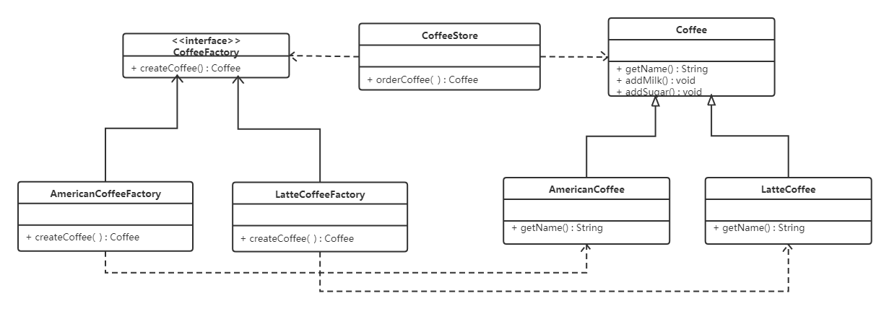

代码如下：

抽象工厂：

```java
public interface CoffeeFactory {

    Coffee createCoffee();
}
```

具体工厂：

```java
public class LatteCoffeeFactory implements CoffeeFactory {

    public Coffee createCoffee() {
        return new LatteCoffee();
    }
}

public class AmericanCoffeeFactory implements CoffeeFactory {

    public Coffee createCoffee() {
        return new AmericanCoffee();
    }
}
```

**咖啡店类：**

```java
public class CoffeeStore {

    private CoffeeFactory factory;

    public CoffeeStore(CoffeeFactory factory) {
        this.factory = factory;
    }

    public Coffee orderCoffee(String type) {
        Coffee coffee = factory.createCoffee();
        coffee.addMilk();
        coffee.addsugar();
        return coffee;
    }
}
```

在该模式下，若增加新的产品类，不需要更改工厂类对象，只需要创建新的工厂类，并作为参数传入该对象。

#### 优缺点

**优点**

- 用户只需要知道具体工厂的名称就可以获取产品，调用方与产品对象的创建隔离
- 新增产品时，只需要增加具体的产品类和工厂类，无需更改原有代码，满足开闭原则（不更改已有的业务代码）

缺点：

- 每增加一个产品，都需要增加一个具体的产品类和工厂类，增加了系统复杂度


### 抽象工厂模式

工厂方法模式中，工厂只考虑一类产品生产，但很多时候，一个具体工厂可能生产多种同级产品，比如苹果工厂生产手机，电脑，耳机等。此时，需要抽象工厂模式进行实现

#### 概念

为访问类提供一个创建一组或相互依赖对象的接口，且访问类没有指定所要产品的具体类，就能得到该产品

抽象工厂模式是对工厂方法模式的升级，工厂方法模式只生产一个等级的产品，而抽象工厂模式能生产多个等级的产品

#### 结构

- 抽象工厂：提供了创阿金产品的接口，包含多个创建产品的方法，可以创建多个不同等级的产品
- 具体工厂：实现抽象工厂中的多个抽象方法，创建具体的产品
- 抽象产品：产品的规范标准，抽象工厂模式下，可以有多个抽象产品
- 具体产品：实现了抽象产品角色所定义的接口，具体工厂来创建具体产品

#### 实现

咖啡店既可以卖咖啡（拿铁咖啡，美式咖啡），也可以卖抹茶慕斯类，提拉米苏类。分类时，不止包括咖啡类和蛋糕类。拿铁咖啡和提拉米苏都是意大利风味 同属于一个产品族，美式咖啡和抹茶慕斯属于美式风味 同属于一个产品族。

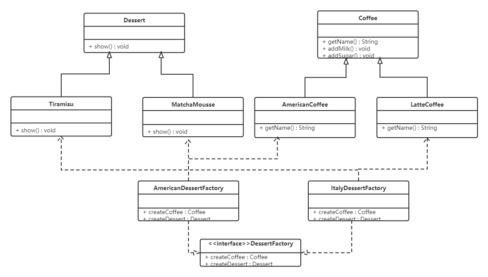

抽象工厂

```java
public interface DessertFactory {

    Coffee createCoffee();

    Dessert createDessert();
}
```

具体工厂：

```java
//美式甜点工厂
public class AmericanDessertFactory implements DessertFactory {

    public Coffee createCoffee() {
        return new AmericanCoffee();
    }

    public Dessert createDessert() {
        return new MatchaMousse();
    }
}
//意大利风味甜点工厂
public class ItalyDessertFactory implements DessertFactory {

    public Coffee createCoffee() {
        return new LatteCoffee();
    }

    public Dessert createDessert() {
        return new Tiramisu();
    }
}
```

此时将原本产品类的概念进行了进一步的封装和提取，分为产品族，包含多个产品。若增加新的产品，则创建新的产品族即可。

#### 优缺点

优点

- 在一个产品族中的多个对象被设计成一起调用时，则能保证用户调用的是一个产品族中的对象。（一个产品族工厂获取的对象当然同属于一个产品族了）

缺点

- 产品族若增加新的产品，所有的工厂类都需要更改  （若产品族可能增加了牛排，茶等，那么所有工厂类都需要更改）


#### 使用场景

- 在需要创建的对象是一系列相互关联或者依赖的产品时
- 系统中有多个产品族，但每次使用，只使用其中某一族产品
- 系统中提供了产品的类库，所有产品接口相同，即用户不依赖产品实例的创建细节。 （输入法换皮肤，一整套一起换）


### jdk源码解析

 

```java
public class Demo {
    public static void main(String[] args) {
        List<String> list = new ArrayList<>();
        list.add("令狐冲");
        list.add("风清扬");
        list.add("任我行");

        //获取迭代器对象
        Iterator<String> it = list.iterator();
        //使用迭代器遍历
        while(it.hasNext()) {
            String ele = it.next();
            System.out.println(ele);
        }
    }
}
```

迭代器遍历集合，获取集合中的元素，获取迭代器的方法则用到了工厂方法模式：

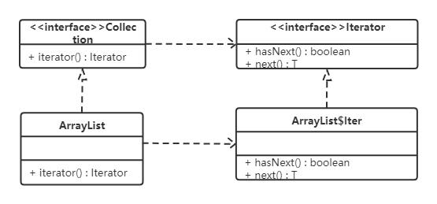

Collection接口是抽象工厂类，ArrayList是具体的工厂类，创建iter()对象。Iterator类是抽象的商品类，ArrayList类中的iter内部类是具体的商品类，在具体的工厂类ArrayList中，调用iterator()方法，创建具体的商品类iter对象

```java
    /**
     * Returns an iterator over the elements in this list in proper sequence.
     *
     * <p>The returned iterator is <a href="#fail-fast"><i>fail-fast</i></a>.
     *
     * @return an iterator over the elements in this list in proper sequence
     */
    public Iterator<E> iterator() {
        return new Itr();
    }
```


## 4.3 原型模式

#### 概述

用一个已经创建的实例作为模型，通过复制来创建一个和原型对象相同的新对象

#### 结构

- 抽象原型类：具体原型对象必须实现的clone方法
- 具体原型类：实现了抽象原型类的方法，可通过该对象进行复制
- 访问类：使用具体原型类中的clone方法复制新对象


#### 实现

原型模式的克隆分为浅克隆和深克隆

> 浅克隆：创建一个新对象，新对象的属性和原来对象完全相同，对于非基本类型属性，仍指向原有属性所指向的对象的内存地址。
>
> 深克隆：创建一个新对象，属性中引用的其他对象也会被克隆，不再指向原有对象地址。


##  4.5 建造者模式

### 概述

工厂模式侧重于对象的创建，而建造者模式侧重与对复杂对象的组织  

将一个复杂对象构建和表示分离开，使得同样的构建过程能够创建不同的表示。

- 分离了部件的构造和装配，可以构建出复杂的对象。 **该模式适用于某个对象的创建过程十分复杂**
- 完成了构建对象和表示解耦，不同的构造器，相同的装配，可以是不同的对象；相同的构造器，不同的装配顺序，也可以构造不同的对象。
- 构造者模式，用户提供材料即可，不需要知道具体的构造细节

### 结构

建造者模式包括如下：

- 抽象构建者类：该接口规定了创建复杂对象哪些部分的创建
- 具体构建者类：实现了Builder接口，完成了复杂产品的各个部件的具体构建方法。构建完成后，提供产品实例
- 产品类：要创建的复杂对象
- 指挥者类：调用具体构建者创建复杂对象的各个部分，指挥者不涉及具体的创建工作，而只是保证构建对象的完整和顺序。

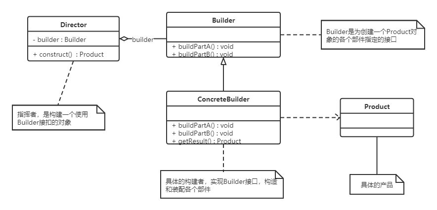

### 实例

生产自行车是复杂过程，它包含了车架，车座等组件的生产。而车架又有碳纤维，铝合金等材质的，车座有橡胶，真皮等材质。对于自行车的生产就可以使用建造者模式。

Bike为产品，Builder为抽象建造者，MobikeBuilder和OfoBuilder是具体的建造者；Director是指挥者（指定构建顺序和获取Bike产品）

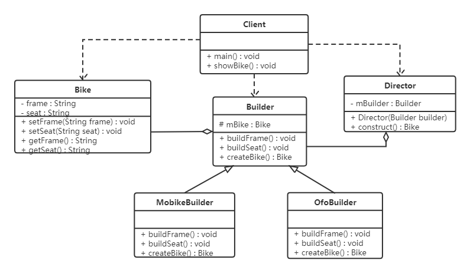

```java
//自行车类
public class Bike {
    private String frame;
    private String seat;

    public String getFrame() {
        return frame;
    }

    public void setFrame(String frame) {
        this.frame = frame;
    }

    public String getSeat() {
        return seat;
    }

    public void setSeat(String seat) {
        this.seat = seat;
    }
}

// 抽象 builder 类
public abstract class Builder {

    protected Bike mBike = new Bike();

    public abstract void buildFrame();
    public abstract void buildSeat();
    public abstract Bike createBike();
}

//摩拜单车Builder类
public class MobikeBuilder extends Builder {

    @Override
    public void buildFrame() {
        mBike.setFrame("铝合金车架");
    }

    @Override
    public void buildSeat() {
        mBike.setSeat("真皮车座");
    }

    @Override
    public Bike createBike() {
        return mBike;
    }
}

//ofo单车Builder类
public class OfoBuilder extends Builder {

    @Override
    public void buildFrame() {
        mBike.setFrame("碳纤维车架");
    }

    @Override
    public void buildSeat() {
        mBike.setSeat("橡胶车座");
    }

    @Override
    public Bike createBike() {
        return mBike;
    }
}

//指挥者类
public class Director {
    private Builder mBuilder;

    public Director(Builder builder) {
        mBuilder = builder;
    }

    public Bike construct() {
        mBuilder.buildFrame();
        mBuilder.buildSeat();
        return mBuilder.createBike();
    }
}

//测试类
public class Client {
    public static void main(String[] args) {
        showBike(new OfoBuilder());
        showBike(new MobikeBuilder());
    }
    private static void showBike(Builder builder) {
        Director director = new Director(builder);
        Bike bike = director.construct();
        System.out.println(bike.getFrame());
        System.out.println(bike.getSeat());
    }
}
```

### **优缺点**：

**优点：**

- 建造者模式的封装性很好。在建造者模式下，一般产品类和建造者者是比较稳定的，新的业务逻辑封装在指挥者类中，对整体而言可以有很好的稳定性。**即建造者和产品类是不变的，或者变化很小时，可以选择建造者类**
- 建造者模式下，创建对象和调用解耦，并且创建过程相同，可能创建不同的对象
- 对产品的分步骤创建，使得创建过程清晰，且容易控制
- 建造者模式容易拓展，若有新的需求，则创建新的建造者类即可。不修改原有代码，符合开闭原则

**缺点**

建造者模式创建的产品需要有较多共同点，组成部分相似，若产品之间的差异性较大，则无法使用建造者模式。


### 使用场景

建造者创建的对象十分复杂，而产品的各个部分经常发生较大变化。但创建过程却很固定（相对稳定），则可以使用建造者模式

- 创建的对象较复杂，由多个部件构成，各部件面临着复杂的变化，但构件间的建造顺序是稳定的。
- 创建复杂对象的算法独立于该对象的组成部分以及它们的装配方式，即产品的构建过程和最终的表示是独立的。


### 模式拓展

 建造者模式：我们目前的BPaas就是建造者模式，不允许直接创建该类对象，而是通过传参builder，来创建我们想要的对象。若参数过多，则直接创建该对象，代码可读性很差，因为构造器包含所有参数，创建时传入过多参数，可读性太差，而且很容易引入错误。

**通过构造者模式重建**，将原本的直接创建该对象，改为传入参数才能创建对象。提高可读性，还能链式编程。


```java
public class Phone {

    private String cpu;
    private String screen;
    private String memory;
    private String mainboard;

    private Phone(Builder builder) {
        cpu = builder.cpu;
        screen = builder.screen;
        memory = builder.memory;
        mainboard = builder.mainboard;
    }

    public static final class Builder {
        private String cpu;
        private String screen;
        private String memory;
        private String mainboard;

        public Builder() {}

        public Builder cpu(String val) {
            cpu = val;
            return this;
        }
        public Builder screen(String val) {
            screen = val;
            return this;
        }
        public Builder memory(String val) {
            memory = val;
            return this;
        }
        public Builder mainboard(String val) {
            mainboard = val;
            return this;
        }
        public Phone build() {
            return new Phone(this);}
    }
    @Override
    public String toString() {
        return "Phone{" +
                "cpu='" + cpu + '\'' +
                ", screen='" + screen + '\'' +
                ", memory='" + memory + '\'' +
                ", mainboard='" + mainboard + '\'' +
                '}';
    }
}

public class Client {
    public static void main(String[] args) {
        Phone phone = new Phone.Builder()
                .cpu("intel")
                .mainboard("华硕")
                .memory("金士顿")
                .screen("三星")
                .build();
        System.out.println(phone);
    }
}
```


## 4.6 创建者模式对比

### 工厂方法模式VS建造者模式

工厂方法模式注重的是整体对象的创建过程，建造者模式注重的是部件创建过程，旨在通过一步一步地精确的创建出一个复杂的对象。

工厂模式：创建对象更多的是直接生产该对象，建造者模式则是组装各个部件。

### 抽象工厂模式vs建造者模式

抽象工厂模式实现对产品族的创建，目的是一个系列的产品。抽象者模式不需要关心构建过程，只关心什么产品由哪个具体的工厂创建

建造者仍然是通过组装零件创建传完整的对象。

抽象工厂可以看成是一个品牌的汽车工厂，比如奔驰，特斯拉。只造一个品牌的汽车。而建造者模式则是一个组装工厂，而轮胎，车架，发动机等进行组装。


# 5 结构型模式

 结构型模式通过类和对象构建某种结构。分为

1. 类结构型模式：通过继承机制组织接口和类
2. 对象结构型模式：：通过组合或聚合组合对象


组合和聚合关系比继承关系耦合度低，满足合成复用原则，具有更多的灵活性

结构型模式分为7种：

- 代理模式
- 适配器模式
- 装饰者模式
- 桥接模式
- 外观模式
- 组合模式
- 享元模式

## 5.1 代理模式

### 概述

给某个对象提供一个代理进行对该对象的访问，即中介。访问对象不适合或者不能直接引用该目标对象，代理对象作为访问对象和目标对象的中介。

java中的代理分为

1. 静态代理
2. 动态代理

静态代理在编译期就生成代码，而动态代理则是在java运行时动态生成，动态代理分为jdk自带的代理方式和cglib代理两种。

### 结构

代理分为三种角色

- 抽象主题：通过接口或抽象类声明真实主题
- 真实主题：实现了抽象主题中的具体业务，是代理对象的真实对象，是最终引用的对象
- 代理类：提供了接口，内部包含对真实主题的引用，它可以访问，控制或拓展真是主题的功能

### 静态代理

与static没有任何关系，而是将代码写死，以车站卖车票为例，可以有多个代理点来卖车票。多个代理点则是代理对象，车站是目标对象。创建一个新的对象，内部其中一个属性是真实类，在调用方法前后进行自定义逻辑。这种方式对象是固定的。

```java
//卖票接口
public interface SellTickets {
    void sell();
}

//火车站  火车站具有卖票功能，所以需要实现SellTickets接口
public class TrainStation implements SellTickets {

    public void sell() {
        System.out.println("火车站卖票");
    }
}

//代售点
public class ProxyPoint implements SellTickets {

    private TrainStation station = new TrainStation();

    public void sell() {
        System.out.println("代理点收取一些服务费用");
        station.sell();
    }
}

//测试类
public class Client {
    public static void main(String[] args) {
        ProxyPoint pp = new ProxyPoint();
        pp.sell();
    }
}
```


### JDK动态代理

**动态代理的含义是：在代码运行过程中，在内存中动态的生成代理类**，而并不是一个实体类，也可以理解为动态代理没有可以查看的代理类，只有读取内存才能读取。 

jdk中提供了Proxy动态代理类 ，proxy虽然是一个类，但并不是代理类，而是提供了静态方法，可以创建代理对象（newProxyInstance方法）来获取代理对象。

```java
//卖票接口
public interface SellTickets {
    void sell();
}

//火车站  火车站具有卖票功能，所以需要实现SellTickets接口
public class TrainStation implements SellTickets {

    public void sell() {
        System.out.println("火车站卖票");
    }
}

//代理工厂，用来创建代理对象
public class ProxyFactory {

    private TrainStation station = new TrainStation();

    public SellTickets getProxyObject() {
        //使用Proxy获取代理对象
        /*
            newProxyInstance()方法参数说明：
                ClassLoader loader ： 类加载器，用于加载代理类，使用真实对象的类加载器即可
                Class<?>[] interfaces ： 真实对象所实现的接口，代理模式真实对象和代理对象实现相同的接口
                InvocationHandler h ： 代理对象的调用处理程序
         */
        SellTickets sellTickets = (SellTickets) Proxy.newProxyInstance(station.getClass().getClassLoader(),
                station.getClass().getInterfaces(),
                new InvocationHandler() {
                    /*
                        InvocationHandler中invoke方法参数说明：
                            proxy ： 代理对象
                            method ： 对应于在代理对象上调用的接口方法的 Method 实例
                            args ： 代理对象调用接口方法时传递的实际参数
                     */
                    public Object invoke(Object proxy, Method method, Object[] args) throws Throwable {

                        System.out.println("代理点收取一些服务费用(JDK动态代理方式)");
                        //执行真实对象
                        Object result = method.invoke(station, args);
                        return result;
                    }
                });
        return sellTickets;
    }
}

//测试类
public class Client {
    public static void main(String[] args) {
        //获取代理对象
        ProxyFactory factory = new ProxyFactory();
        
        SellTickets proxyObject = factory.getProxyObject();
        proxyObject.sell();
    }
}
```


:warning:ProxyFactory不是代理模式下的代理类，代理类是程序运行过程中在内存动态生成的类。也就是说该类没有暴露出来，只保存在内存中。有阿里的插件可能获取内存内的类，内部结构如下

- 代理类（$Proxy0）实现了与真实类相同的接口， 其构造器传入了通过Proxy.newProxyInstance创建对象时的InvocationHandler接口的实现类（上面例子是匿名实现类） 
- 调用方通过代理对象调用代理类的方法sell方法，其内部调用了InvocationHandler接口中的invoke方法
- invoke通过反射执行真实类中的sell方法

```java
package com.sun.proxy;

import com.itheima.proxy.dynamic.jdk.SellTickets;
import java.lang.reflect.InvocationHandler;
import java.lang.reflect.Method;
import java.lang.reflect.Proxy;
import java.lang.reflect.UndeclaredThrowableException;

public final class $Proxy0 extends Proxy implements SellTickets {
    private static Method m1;
    private static Method m2;
    private static Method m3;
    private static Method m0;

    public $Proxy0(InvocationHandler invocationHandler) {
        super(invocationHandler);
    }

    static {
        try {
            m1 = Class.forName("java.lang.Object").getMethod("equals", Class.forName("java.lang.Object"));
            m2 = Class.forName("java.lang.Object").getMethod("toString", new Class[0]);
            m3 = Class.forName("com.itheima.proxy.dynamic.jdk.SellTickets").getMethod("sell", new Class[0]);
            m0 = Class.forName("java.lang.Object").getMethod("hashCode", new Class[0]);
            return;
        }
        catch (NoSuchMethodException noSuchMethodException) {
            throw new NoSuchMethodError(noSuchMethodException.getMessage());
        }
        catch (ClassNotFoundException classNotFoundException) {
            throw new NoClassDefFoundError(classNotFoundException.getMessage());
        }
    }

    public final boolean equals(Object object) {
        try {
            return (Boolean)this.h.invoke(this, m1, new Object[]{object});
        }
        catch (Error | RuntimeException throwable) {
            throw throwable;
        }
        catch (Throwable throwable) {
            throw new UndeclaredThrowableException(throwable);
        }
    }

    public final String toString() {
        try {
            return (String)this.h.invoke(this, m2, null);
        }
        catch (Error | RuntimeException throwable) {
            throw throwable;
        }
        catch (Throwable throwable) {
            throw new UndeclaredThrowableException(throwable);
        }
    }

    public final int hashCode() {
        try {
            return (Integer)this.h.invoke(this, m0, null);
        }
        catch (Error | RuntimeException throwable) {
            throw throwable;
        }
        catch (Throwable throwable) {
            throw new UndeclaredThrowableException(throwable);
        }
    }

    public final void sell() {
        try {
            this.h.invoke(this, m3, null);
            return;
        }
        catch (Error | RuntimeException throwable) {
            throw throwable;
        }
        catch (Throwable throwable) {
            throw new UndeclaredThrowableException(throwable);
        }
    }
}
```


### CGLIB动态代理

CGLIb是一个功能强大的代码生成包，也是在内存中生成代理类，**在被代理类没有实现接口时，可以通过CGLIB完成代理**。

```java
//火车站
public class TrainStation {

    public void sell() {
        System.out.println("火车站卖票");
    }
}

//代理工厂
public class ProxyFactory implements MethodInterceptor {

    private TrainStation target = new TrainStation();

    public TrainStation getProxyObject() {
        //创建Enhancer对象，类似于JDK动态代理的Proxy类，下一步就是设置几个参数
        Enhancer enhancer =new Enhancer();
        //设置父类的字节码对象
        enhancer.setSuperclass(target.getClass());
        //设置回调函数
        enhancer.setCallback(this);
        //创建代理对象
        TrainStation obj = (TrainStation) enhancer.create();
        return obj;
    }

    /*
        intercept方法参数说明：
            o ： 代理对象
            method ： 真实对象中的方法的Method实例
            args ： 实际参数
            methodProxy ：代理对象中的方法的method实例
     */
    public TrainStation intercept(Object o, Method method, Object[] args, MethodProxy methodProxy) throws Throwable {
        System.out.println("代理点收取一些服务费用(CGLIB动态代理方式)");
        TrainStation result = (TrainStation) methodProxy.invokeSuper(o, args);
        return result;
    }
}

//测试类
public class Client {
    public static void main(String[] args) {
        //创建代理工厂对象
        ProxyFactory factory = new ProxyFactory();
        //获取代理对象
        TrainStation proxyObject = factory.getProxyObject();

        proxyObject.sell();
    }
}
```


### 三种代理对比

- jdk代理和cglib代理
  - 使用cglib实现动态代理，底层使用AMS字节码生成框架，使用字节码生成技术生成代理类，在jdk1.6之前，比使用java反射效率要高，由于jdk的不断优化，现在jdk动态代理性能要强于cglib。即实现了接口，则使用jdk代理，没实现则使用cglib代理
  - **cglib不能对声明为final的类或者方法进行代理，因为cglib实际是动态生成被代理类的子类**
- 动态代理和静态代理
  - 动态代理和静态代理相比较，都统一由InvocationHandler.invoke 集中处理，在接口比较多的情况下，可以灵活一点，静态代理，则需要对每个方法进行中转
  - 若接口实现了一个方法，静态代理模式下，所有的实现类都需要实现该方法，并且所有代理类也需要实现该方法，动态代理不需要。

### 优缺点

- ### 优点

  - 代理模式在调用方和目标对象之间添加了一层，保护目标对象，并在一定程度上进行了解耦

  - 代理对象可以对目标对象进行拓展，比如代理对象执行目标对象之前，收取手续费等信息

- ### 缺点

  - 增加了系统的复杂度


### 使用场景

- 远程调用 RPC
  - 本地服务通过网络请求远程服务，此时需要网络通信，通过代理模式将通信部分隐藏，只暴露本地服务接口，通过该接口就可以访问远程服务提供的功能，而不必要关心通信细节，提高了可维护性
- 防火墙代理 VPN
  - 游览器配置为代理功能时，防火墙则将游览器的请求转发给互联网，互联网返回响应时，代理模式再转给游览器
- 保护代理 
  - 控制对一个对象的访问，如果需要，可以给不同的用户不同的访问权限。（我们通过给代理对象设置级别，从而完成分级权限）


## 5.2 适配器模式

适配器模式

### 概述

适配器将一个类的接口转换为可以为调用方提供服务的接口，使得原本不兼容的可以一起工作。

分为类适配器模式和对象适配器模式。前者耦合度比比后者高，因为是通过继承的方式实现，且要求了解内部结构，应用较少。后者是通过组合的方式。

### 结构

适配器模式包好一下角色

- 目标接口：当前系统业务期待的接口，可以是抽象类或者接口
- 适配者类：实际被访问的类
- 适配器类：为转换器，调用方通过该类访问目标适配者。其内部将是配置接口转换为目标接口，让调用方通过该接口进行访问

### 类适配器模式

定义一个适配器类实现当前系统的目标接口，通过该接口完成目标功能。，同时又**继承**被适配的类，类适配器本身需要通过继承来实现。

**类适配器模式违背了合成复用原则，类适配器需要在目标类有接口规范的情况下使用，否则不可使用**

合成复用原则：要尽量先使用组合或者聚合等关联关系来实现，其次才考虑使用继承关系来实现。

【例】

电脑只能读取内存卡，而读取TF卡中的内容，则需要通过读卡器实现，读卡器则可以理解为适配器。此时读卡器既能读内存卡的内容，也能读TF卡的内容。

明确概念：TF卡是内存卡的一种，而不是两种卡

以读卡器为例：


- SD卡读取为接口（内存卡的统一读取标准，TF的读取也要满足该标准），电脑读取时，通过传入参数为SD卡的实现类进行读取。

- 而TF卡不能直接被电脑读取，则TF读取为也是一接口，则该接口的实现类能够读取TF卡
- 适配器类，继承了TF卡的实现类，又实现了SD卡读取接口，能够实现TF卡的读取。
- 此时电脑的读取，则是通过传入的参数判断是普通SD卡，还是TF卡，但通过该适配器既拥有SD卡的读取标准（SD读取接口），又完成TF卡的读取。


【为什么不是实现TF读取接口，而是继承TF接口实现类呢？】

因为适配器仅仅是作为一个适配器，不对目标功能进行改变，而是通过适配器可以访问目标类。现在仅仅是不能直接访问，而不是没有该部分功能，所以是继承，不是实现接口完成该功能。


```java
//SD卡的接口
public interface SDCard {
    //读取SD卡方法
    String readSD();
    //写入SD卡功能
    void writeSD(String msg);
}

//SD卡实现类
public class SDCardImpl implements SDCard {
    public String readSD() {
        String msg = "sd card read a msg :hello word SD";
        return msg;
    }

    public void writeSD(String msg) {
        System.out.println("sd card write msg : " + msg);
    }
}

//电脑类
public class Computer {

    public String readSD(SDCard sdCard) {
        if(sdCard == null) {
            throw new NullPointerException("sd card null");
        }
        return sdCard.readSD();
    }
}

//TF卡接口
public interface TFCard {
    //读取TF卡方法
    String readTF();
    //写入TF卡功能
    void writeTF(String msg);
}

//TF卡实现类
public class TFCardImpl implements TFCard {

    public String readTF() {
        String msg ="tf card read msg : hello word tf card";
        return msg;
    }

    public void writeTF(String msg) {
        System.out.println("tf card write a msg : " + msg);
    }
}

//定义适配器类（SD兼容TF）
public class SDAdapterTF extends TFCardImpl implements SDCard {

    public String readSD() {
        System.out.println("adapter read tf card ");
        return readTF();
    }

    public void writeSD(String msg) {
        System.out.println("adapter write tf card");
        writeTF(msg);
    }
}

//测试类
public class Client {
    public static void main(String[] args) {
        Computer computer = new Computer();
        SDCard sdCard = new SDCardImpl();
        System.out.println(computer.readSD(sdCard));

        System.out.println("------------");

        SDAdapterTF adapter = new SDAdapterTF();
        System.out.println(computer.readSD(adapter));
    }
}
```


### 对象适配器模式

将已经实现的功能引入到适配器类中，该类同时实现目标接口。即作为适配器中的一个属性存在


适配器传入属性TF接口实现类，

```java
//创建适配器对象（SD兼容TF）
public class SDAdapterTF  implements SDCard {

    private TFCard tfCard;

    public SDAdapterTF(TFCard tfCard) {
        this.tfCard = tfCard;
    }

    public String readSD() {
        System.out.println("adapter read tf card ");
        return tfCard.readTF();
    }

    public void writeSD(String msg) {
        System.out.println("adapter write tf card");
        tfCard.writeTF(msg);
    }
}

//测试类
public class Client {
    public static void main(String[] args) {
        Computer computer = new Computer();
        SDCard sdCard = new SDCardImpl();
        System.out.println(computer.readSD(sdCard));

        System.out.println("------------");

        TFCard tfCard = new TFCardImpl();
        SDAdapterTF adapter = new SDAdapterTF(tfCard);
        System.out.println(computer.readSD(adapter));
    }
}
```


还有接口适配器模式，当不希望实现接口所有方法时，则可以创建一个抽象类Adapter，实现该接口，并重写所有方法（未必真正重写该方法），然后继承该类，重写自己需要的方法。


### 应用场景

- 旧系统存在满足新系统功能需求的类，但其接口同新系统的接口不一致。根据开闭原则，尽量不修改原有代码，因此新建一个适配器，进行转换
- 使用第三方提供的组件，但组件接口定义和自己定义的接口定义不同

### JDK源码解析


Reader （字符流）、InputStream（字节流）的适配使用的是InputStreamReader。InputStreamReader继承了java.io包中的Reader，对方法进行了实现，并且有传入参数对象 sun.nio.cs.StreamDecoder，该对象仅仅是对InputStream进行封装，

InputStreamReader 源码 

其中的sd为StreamDecoder

```java
public int read() throws IOException {
    return sd.read();
}

public int read(char cbuf[], int offset, int length) throws IOException {
    return sd.read(cbuf, offset, length);
}
```


Reader是java SE API中的内容，而StreamDecoder是Sun JDK的内容，所以二者接口不兼容。

通过InputStreamReader对StreamDecoder的封装，可以进行字节流和字符流之间的转换。

<font color="red">结论：</font>

从表面功能看是InputStreamReader进行了字节流到字符流的转换，而继承关系来看，是StreamDecoder的设计实现了对象适配器模式。

## 5.3 装饰者模式

### 概述

快餐店有炒饼，炒面，还可以加鸡蛋，火腿等配菜，若通过继承的方式，那么是成倍增加的，因为加鸡蛋，要定义子类，加鸡蛋火腿还要定义子类，拓展性太差，而且会有很多子类，不易维护

**定义**：

不改变现有对象结构的情况下，动态的给该对象增加一些职责（或者额外的功能）的模式。**核心一句话：既继承了一个类并且聚合了该类，则是装饰者模式。**


### 结构

装饰者模式的结构

- 抽象构件角色：定义一个抽象接口来规范准备接收附加功能的对象  （接收附加功能对象的规范）
- 具体构件角色：实现抽象构件角色，通过装饰角色添加功能   
- 抽象装饰角色：继承或实现抽象构件，并包含具体构件的实例，通过其子类拓展具体构件的功能
- 具体装饰角色：实现抽象装饰的相关方法，并给具体构件对象添加附加的责任


### 案例


抽象类：快餐类，具体实例类包括：炒米，炒面。

抽象类：配料类，加配菜。该抽象类**继承了快餐抽象类，又聚合了快餐抽象类**，具体实现类包括鸡蛋，培根。 该类中有具体的金额计算方法，即实际操作在该抽象类中。该类是抽象装饰者角色，核心类

配料的具体实现类则是将原来快餐类的信息传入进去，即进行赋值。

```java
//快餐接口
public abstract class FastFood {
    private float price;
    private String desc;

    public FastFood() {
    }

    public FastFood(float price, String desc) {
        this.price = price;
        this.desc = desc;
    }

    public void setPrice(float price) {
        this.price = price;
    }

    public float getPrice() {
        return price;
    }

    public String getDesc() {
        return desc;
    }

    public void setDesc(String desc) {
        this.desc = desc;
    }

    public abstract float cost();  //获取价格
}

//炒饭
public class FriedRice extends FastFood {

    public FriedRice() {
        super(10, "炒饭");
    }

    public float cost() {
        return getPrice();
    }
}

//炒面
public class FriedNoodles extends FastFood {

    public FriedNoodles() {
        super(12, "炒面");
    }

    public float cost() {
        return getPrice();
    }
}

//配料类
public abstract class Garnish extends FastFood {

    private FastFood fastFood;

    public FastFood getFastFood() {
        return fastFood;
    }

    public void setFastFood(FastFood fastFood) {
        this.fastFood = fastFood;
    }

    public Garnish(FastFood fastFood, float price, String desc) {
        super(price,desc);
        this.fastFood = fastFood;
    }
}

//鸡蛋配料
public class Egg extends Garnish {

    public Egg(FastFood fastFood) {
        super(fastFood,1,"鸡蛋");
    }

    public float cost() {
        return getPrice() + getFastFood().getPrice();
    }

    @Override
    public String getDesc() {
        return super.getDesc() + getFastFood().getDesc();
    }
}

//培根配料
public class Bacon extends Garnish {

    public Bacon(FastFood fastFood) {

        super(fastFood,2,"培根");
    }

    @Override
    public float cost() {
        return getPrice() + getFastFood().getPrice();
    }

    @Override
    public String getDesc() {
        return super.getDesc() + getFastFood().getDesc();
    }
}

//测试类
public class Client {
    public static void main(String[] args) {
        //点一份炒饭
        FastFood food = new FriedRice();
        //花费的价格
        System.out.println(food.getDesc() + " " + food.cost() + "元");

        System.out.println("========");
        //点一份加鸡蛋的炒饭
        FastFood food1 = new FriedRice();

        food1 = new Egg(food1);
        //花费的价格
        System.out.println(food1.getDesc() + " " + food1.cost() + "元");

        System.out.println("========");
        //点一份加培根的炒面
        FastFood food2 = new FriedNoodles();
        food2 = new Bacon(food2);
        //花费的价格
        System.out.println(food2.getDesc() + " " + food2.cost() + "元");
    }
}
```


好处：

- 装饰者模式比继承有更加灵活的扩展功能，使用方便，通过聚合不同的装饰者对象获取具有不同行为状态的多样化结果。装饰者模式具有比继承更具良好的拓展性，符合开闭原则，继承是静态的附加责任，装饰者则是动态的附加责任
- 装饰类和被装饰类可以独立拓展，而没有相互耦合，装饰者模式是继承的一个替代模式，装饰模式可以动态的拓展一个实现类的功能。即新增一种快餐，比如说炒饼，或者新增配菜 比如老干妈，十分方便，只需要继承指定类即可，而不必牵一发而动全身。


### 使用场景

- 当不能采用继承的方式对系统进行拖充或者采用继承不利于系统拓展和维护时
  不能采用继承的情况分为
  - 第一类是系统中存在大量独立的拓展，比如配料类和快餐类。为支持每一种组合将产生大量的子类，是的子类数据呈爆炸性增长。
  - 第二类是因为类的定义不能继承（比如 final）
- 在不影响其他对象的情况下，以动态，透明的方式给单个对象增加功能
- 当对象的功能要求可以动态增加时，也可以动态地撤销时，即可以方便的增加或者去除一个类。比如快餐中的炒饭，或者配菜中的鸡蛋。


### JDK源码解析

IO流中的包装类使用了装饰者模式，BufferedInputStream，BufferedOutputStream，BufferedReader，BufferedWriter。即使用的时候，需要将对象传入进去，以BufferedWriter为例：

```java
public class Demo {
    public static void main(String[] args) throws Exception{
        //创建BufferedWriter对象
        //创建FileWriter对象
        FileWriter fw = new FileWriter("C:\\Users\\Think\\Desktop\\a.txt");
        BufferedWriter bw = new BufferedWriter(fw);

        //写数据
        bw.write("hello Buffered");

        bw.close();
    }
}
```

内部结构：


核心类为：BufferedWriter，即继承了Writer，又聚合了Writer。所以创建fileWriter则传入到BufferedWriter中。

> <font color="red">小结：</font>
>
> ​	 BufferedWriter使用装饰者模式对Writer子实现类进行了增强，添加了缓冲区，提高了写数据的效率。


代理模式和装饰者模式的区别：

静态代理和装饰者模式的区别

- 相同点：
  - 都要实现与目标类相同的业务接口 （继承）
  - 在两个类中声明目标对象  （聚合）
  - 静态代理为了保护和隐藏目标对象
- 不同点:
  - 目的不同
    装饰者模式是为了增强目标对象，而静态代理是保护和隐藏目标对象
  - 获取目标对象构建的地方不同
    装饰者模式是由外界通过构造器或者set方法传递进来，静态代理是由代理类内部构建，以此隐藏目标对象。


## 5.4 桥接模式

### 概述

若创建图形，形状可能不同，颜色也是多种多样，那么创建出这些类，数量则是爆炸式增长，比如说 黑色矩形类，白色矩形类。尤其是再增加一种颜色或者形状。

**定义：**

​	**抽象类与实现分离，使它们可以独立变化，它通过组合关系代替继承关系实现，降低抽象和实现这两个可变维度的耦合度。**

### 结构

桥接模式包括：

- 抽象化角色：定义抽象类，并包含一个对实现化对象的引用
- 拓展抽象化角色：抽象化角色的子类，实现父类中的业务方法，并通过组合或者聚合关系调用实现化角色中的业务方法
- 实现化角色：定义实现化角色的接口，供拓展抽象化角色使用
- 具体实现化角色：给出实现化角色接口的具体实现


### 案例

视频播放器，可以在不同操作平台（Windows，mac，linux等）上播放。而且视频也有很多格式可供选择，包括RMVB，AVI，WMV等。这个播放器包含两个维度，使用和使用桥接模式


桥接模式将操作系统和视频文件格式分为两个维度，分别设置抽象类和接口。核心抽象类操作系统中，既聚合了抽象接口视频文件格式，又使得操作系统子类完成播放方法。


```java
//视频文件
public interface VideoFile {
    void decode(String fileName);
}

//avi文件
public class AVIFile implements VideoFile {
    public void decode(String fileName) {
        System.out.println("avi视频文件："+ fileName);
    }
}

//rmvb文件
public class REVBBFile implements VideoFile {

    public void decode(String fileName) {
        System.out.println("rmvb文件：" + fileName);
    }
}

//操作系统版本
public abstract class OperatingSystemVersion {

    protected VideoFile videoFile;

    public OperatingSystemVersion(VideoFile videoFile) {
        this.videoFile = videoFile;
    }

    public abstract void play(String fileName);
}

//Windows版本
public class Windows extends OperatingSystem {

    public Windows(VideoFile videoFile) {
        super(videoFile);
    }

    public void play(String fileName) {
        videoFile.decode(fileName);
    }
}

//mac版本
public class Mac extends OperatingSystemVersion {

    public Mac(VideoFile videoFile) {
        super(videoFile);
    }

    public void play(String fileName) {
		videoFile.decode(fileName);
    }
}

//测试类
public class Client {
    public static void main(String[] args) {
        OperatingSystem os = new Windows(new AVIFile());
        os.play("战狼3");
    }
}
```

好处：

- 桥接模式提高了系统的可扩充性，在两个变化维度中任意拓展一个维度，都不要修改原有系统。即增加新系统或者文件格式则只需要继承和实现即可。
- 实现了细节对调用方透明。

### 使用场景

- 当一个类存在两个独立变化的维度，且两个维度需要进行拓展时
- 当一个系统不希望使用继承或因为多层次继承导致系统类爆炸时
- 当一个系统需要在构建抽象化角色和具体角色之间需要增加灵活性时，避免两个层次之间有复杂的耦合，则可以通过桥接模式在抽象层建立关联关系，而非在实现类中进行耦合。


## 5.5 外观模式

### 定义

 又称门面模式，通过为多个复杂的子系统提供一个一致的接口，而使得子系统容易更容易被访问的模式。该模式对外有统一接口，调用方不必关系其内部实现，提高了程序的可维护性。


外观模式是迪米特法则的典型应用。（迪米特法则：两个软件实体无须直接通信，那么不应该直接相互调用，可以通过第三方转发该调用。）


### 结构

- 外观角色：为多个子系统提供一个共同的接口
- 子系统角色：实现系统的内部功能，调用方可以通过外观角色访问它

### 案例

智能家电模式，一个人回家后，每次都需要打开灯，电视，空调。睡觉的时候都需要关闭，操作有些繁琐，则可以使用智能音箱，完成这些操作。


```java
//灯类
public class Light {
    public void on() {
        System.out.println("打开了灯....");
    }

    public void off() {
        System.out.println("关闭了灯....");
    }
}

//电视类
public class TV {
    public void on() {
        System.out.println("打开了电视....");
    }

    public void off() {
        System.out.println("关闭了电视....");
    }
}

//控制类
public class AirCondition {
    public void on() {
        System.out.println("打开了空调....");
    }

    public void off() {
        System.out.println("关闭了空调....");
    }
}

//智能音箱
public class SmartAppliancesFacade {

    private Light light;
    private TV tv;
    private AirCondition airCondition;

    public SmartAppliancesFacade() {
        light = new Light();
        tv = new TV();
        airCondition = new AirCondition();
    }

    public void say(String message) {
        if(message.contains("打开")) {
            on();
        } else if(message.contains("关闭")) {
            off();
        } else {
            System.out.println("我还听不懂你说的！！！");
        }
    }

    //起床后一键开电器
    private void on() {
        System.out.println("起床了");
        light.on();
        tv.on();
        airCondition.on();
    }

    //睡觉一键关电器
    private void off() {
        System.out.println("睡觉了");
        light.off();
        tv.off();
        airCondition.off();
    }
}

//测试类
public class Client {
    public static void main(String[] args) {
        //创建外观对象
        SmartAppliancesFacade facade = new SmartAppliancesFacade();
        //客户端直接与外观对象进行交互
        facade.say("打开家电");
        facade.say("关闭家电");
    }
}
```

**好处：**

- 降低了子系统与客户端之间的耦合度，使得子系统的变化不会影响调用方
- 对调用方屏蔽了子系统组件，使得子系统使用起来更加容易

**缺点**

- 不符合开闭原则，修改很麻烦。 （开闭原则：程序需要拓展时，不能去修改原有代码，而是实现热插拔的效果）

### 使用场景

- 对分层结构系统构建时，通过外观模式，调用统一的接口，而不是子系统的具体实现，降低了耦合度
- 当一个复杂系统的子系统很多时，外观模式可以为系统设计一个简单的接口供外界访问
- 当调用方与多个子系统之间存在联系耦合时，通过外观模式将其分离，提高子系统的独立性和可移植性


### 源码分析

在tomcat作为web容器时，接收游览器发送过来的请求，tomcat会将请求信息封装成servletRequest对象。servletRequest是一个接口，它有一个子实现类HttpServletRequest。而真正request对象是HttpServletRequest对象的子实现类对象，RequestFacade的类的对象。RequestFacade实现了外观模式：

实际的请求是request，调用方通过调用requestFacade类对象的方法，其内部实际调用了request的方法，


**为什么此处使用外观模式？**

定义了RequestFacade 类，实现了接口servletRequest，同时定义了私有变量Request，并且requestFacade中方法，实际调用request中的方法。tomcat请求入参为servletRequest类型，即使强转为RequestFacade ，那么RequestFacade也无法访问request中的私有变量和方法。既调用了request，也防止其中方法被不合理的访问。


## 5.6 组合模式


这个文件系统就是一个组合模式。整棵树作为一个容器，里面有很多成员对象，这些对象也是一个容器，也可能会有叶子对象。但是容器对象和叶子对象提供的功能是不一样的。使用过程中，需要区分。

### 定义：

又名部分整体模式，用于把一组相似的对象当作一个单一的对象。组合模式依据树形结构来组合对象，用来表示部分以及整体层次，创建了对象组的属性结构。

### 结构

- 抽象根节点：定义系统各层次对象的共有方法和属性，可以预先定义一些默认行为和属性
- 树枝节点：定义树枝节点的行为，存储子节点，组合数据节点和叶子节点形成一个树形结构
- 叶子节点：叶子节点对象

### 案例

软件菜单：

一个菜单可以包含多个菜单项，也可以包含其他菜单项的菜单。菜单即是一个分类方法。


设置了统一的菜单接口，所有的菜单或者菜单项都继承该接口，因为都是树结构的结点。MenuComponent菜单组件，其中有共有的属性和方法，其继承类，只用填写需要填写的方法。

```java
//菜单组件  不管是菜单还是菜单项，都应该继承该类
public abstract class MenuComponent {

    protected String name;
    protected int level;

    //添加菜单
    public void add(MenuComponent menuComponent){
        throw new UnsupportedOperationException();
    }

    //移除菜单
    public void remove(MenuComponent menuComponent){
        throw new UnsupportedOperationException();
    }

    //获取指定的子菜单
    public MenuComponent getChild(int i){
        throw new UnsupportedOperationException();
    }

    //获取菜单名称
    public String getName(){
        return name;
    }

    public void print(){
        throw new UnsupportedOperationException();
    }
}
```

菜单类需要填写增删操作和获取子节点方法，菜单项类，不需要重写这些。

```java
public class Menu extends MenuComponent {

    private List<MenuComponent> menuComponentList;

    public Menu(String name,int level){
        this.level = level;
        this.name = name;
        menuComponentList = new ArrayList<MenuComponent>();
    }

    @Override
    public void add(MenuComponent menuComponent) {
        menuComponentList.add(menuComponent);
    }

    @Override
    public void remove(MenuComponent menuComponent) {
        menuComponentList.remove(menuComponent);
    }

    @Override
    public MenuComponent getChild(int i) {
        return menuComponentList.get(i);
    }

    @Override
    public void print() {

        for (int i = 1; i < level; i++) {
            System.out.print("--");
        }
        System.out.println(name);
        for (MenuComponent menuComponent : menuComponentList) {
            menuComponent.print();
        }
    }
}
```


```java
public class MenuItem extends MenuComponent {

    public MenuItem(String name,int level) {
        this.name = name;
        this.level = level;
    }

    @Override
    public void print() {
        for (int i = 1; i < level; i++) {
            System.out.print("--");
        }
        System.out.println(name);
    }
}
```


### 组合模式的分类

在使用组合模式时，根据抽象构件类的定义形式，将组合模式分为透明组合模式和安全组合模式

- 透明组合模式
  - 抽象根节点声明了所有用于管理成员对象的方法，比如示例中MenuComponent声明了新增，删除，获取子节点等方法，确保所有节点有相同的子接口。透明组合模式也是组合模式的标准形式
  - 组合模式的缺点是不够安全，因为有些方法没有重写。叶子节点和非叶子节点的功能不一致，导致叶子节点一些方法没有重写，若调用方进行了调用，则可能会出错。
- 安全组合模式
  - 安全组合模式下，抽象构件中，没有声明任何用于管理成员对象的方法，而是在非叶子节点上声明并实现该方法，安全组合模式下，是不够透明，叶子节点和非叶子节点的方法不同。因此调用方不能完全针对对象编程，必须区别对象叶子构建和非叶子节点。

### 优点

- 组合模式可以清晰定义分层次的复杂对象，表示对象的全部或者部分层级，方便对整个层次结构进行控制
- 调用方可以一致地使用一个组合结构或其中单个对象，而不必关心处理其内部结构，简化代码
- 组合模式中新增结点方便，符合开闭原则   （开闭原则：程序需要拓展时，不能去修改原有代码，而是实现热插拔的效果）
- 组合模式为树形结构的面向对象提供了一种灵活的解决方案。树形结构简单，实用。

### 使用场景

适合使用树形结构的场景，比如文件目录显示，多级目录等。


## 5.7 享元模式

### 定义

通过共享技术来有效地支持大量细粒度对象的复用，减少需要创建的对象数量， 避免大量相似对象的开销，从而提高系统资源的利用率


### 结构

享元模式下存在以下两种状态

- 内部状态：即不会随着环境的改变而改变的可共享部分
- 外部状态：指随环境改变而改变的不共享部分，享元模式的实现要领就是区分应用中的这两种状态，并将外部状态外部化。

享元模式的角色：

- 抽象享元角色：通常是一个接口或抽象类，在抽象类享元类中声明了具体享元类公共的方法，这些方法可以向调用方提供享元对象的内部数据，同时可以通过这些方法设置外部数据
- 具体享元对象：它实现了抽象享元类，成为享元对象。可以通过单例模式来设计具体享元类，为每个具体享元类提供唯一的享元对象
- 非享元角色：不是所有的抽象享元类的子类都需要被共享，不能被共性的子类可设计为非共享具体享元类，不能通过享元工厂创建
- 享元工厂角色：负责创建和管理享元角色，通常为单例模式


### 案例

俄罗斯方块游戏中，每个不同的方块都是一个对象，这些对象要占用很多的内存空间，可以通过享元对象实现


- 方块抽象类，抽取出方块的共性的属性和方法。比如说形状和颜色。
- 方块的具体实现类，L，O，I等形状。内部状态：形状L，O，I，外部状态：颜色
- 享元工厂类，管理享元对象，该工厂只需要创建一次，则使用单例模式

```java
public abstract class AbstractBox {
    public abstract String getShape();

    public void display(String color) {
        System.out.println("方块形状：" + this.getShape() + " 颜色：" + color);
    }
}
```


### 优缺点和使用场景

- #### 优点

  - 极大减少内存中相似或相同对象数量，节约系统资源，提供系统性能
  - 享元模式中的外部状态相对独立，且不影响内部状态。内部状态：形状L，O，I，外部状态：颜色

- #### 缺点

  - 为使对象共享，需要将对象分为内部状态和外部状态，使程序逻辑复杂

- #### 使用场景

  - 一个系统有大量相同或相似的对象，造成内存大量浪费
  - 对象的大部分状态可以外部化，这些将外部状态传入到对象中，否则直接使用工厂模式了。


### JDK源码解析

Integer类使用了享元模式，String中的串池也是一个道理，但是String不是享元模式，因为，没有外部状态，Integer需要传入数值，所以是享元模式。

因为Integer中，-128到+127，使用的是同一个对象，

Integer i = 100;在编译时，转换成 Integer i = Integer.valueOf(100)，而valueOf方法中，会将Integer对象进行缓存，再次获取时，获取的是同一个对象，若不存在，则创建一个新的Integer对象。

```java
public final class Integer extends Number implements Comparable<Integer> {
    
	public static Integer valueOf(int i) {
        if (i >= IntegerCache.low && i <= IntegerCache.high)
            // cache为Integer数组
            return IntegerCache.cache[i + (-IntegerCache.low)];
        return new Integer(i);
    }
    
    private static class IntegerCache {
        static final int low = -128;
        static final int high;
        static final Integer cache[];

        static {
            int h = 127;
            String integerCacheHighPropValue =
                sun.misc.VM.getSavedProperty("java.lang.Integer.IntegerCache.high");
            if (integerCacheHighPropValue != null) {
                try {
                    int i = parseInt(integerCacheHighPropValue);
                    i = Math.max(i, 127);
                    // Maximum array size is Integer.MAX_VALUE
                    h = Math.min(i, Integer.MAX_VALUE - (-low) -1);
                } catch( NumberFormatException nfe) {
                }
            }
            high = h;
            cache = new Integer[(high - low) + 1];
            int j = low;
            for(int k = 0; k < cache.length; k++)
                cache[k] = new Integer(j++);
            // range [-128, 127] must be interned (JLS7 5.1.7)
            assert IntegerCache.high >= 127;
        }

        private IntegerCache() {}
    }
}
```


# 6 行为型模式

行为型模式用于描述程序运行时复杂的流程控制，即描述多个类或对象之间通过相互协作共同完成的那个对象无法完成的任务。

行为型模式分为类行为模式和对象行为模式，前者采用继承机制在类间分派行为，后者通过组合或聚合在对象间分配行为。组合或聚合关系比继承关系耦合度低，满足合成复用原则，具有更大的灵活性

行为型模式分为：

* **模板方法模式**（类行为型模式，通过继承实现）
* 策略模式
* 命令模式
* 职责链模式
* 状态模式
* 观察者模式
* 中介者模式
* 迭代器模式
* 访问者模式
* 备忘录模式
* **解释器模式** （类行为型模式，通过继承实现）

以上 11 种行为型模式，除了模板方法模式和解释器模式是类行为型模式，其他的全部属于对象行为型模式。

## 6.1 模板方法模式

### 概述

面向对象程序设计过程中，知道程序执行的步骤和顺序，但某些步骤的具体实现未知。例如：去银行办理业务包括：取号，排队，办理业务。其他步骤对每个人一致，但办理的业务可能是取钱，存钱，转账等。这些可以延迟到子类中实现。

**定义**

父类中定义了一个操作中的算法骨架，而将一些未知步骤的具体实现，延迟到子类中完成，使得子类可以不改变算法结构的情况下，完成特定的步骤。对于一些不要重写的方法，可以采用final修饰，比如算法骨架方法。

### 结构

- 抽象类：负责提供一个算法的骨架和轮廓，它由一个模板方法和若干个基本方法组成
  - 模板方法：定义了算法的骨架，按某种顺序调用其包含的方法
  - 基本方法：实现了算法各个步骤的方法，是模板方法的组成部分，包括三种
    - 抽象方法：一个抽象方法由抽象类声明，要求子类必须实现
    - 具体方法：一个具体方法由一个抽象类或具体类声明并实现，由子类继承或重写
    - 钩子方法：抽象类中已经实现，包括用于**判断的逻辑方法和需要子类重写的空方法两种。**
      钩子方法中用于判断的逻辑方法，方法名一般为isXxxx，返回值为Boolean类型
      钩子方法中需要重写的方法，很多时候会在抽象类 抛出异常，即没重写调用则异常
- 具体子类：实现抽象类中的抽象方法和钩子方法

### 案例

炒菜的步骤是相似的，分为倒油，热油，倒蔬菜，倒调料，翻炒等步骤，通过模仿方法模式实现。


AbstractClass是抽象类，指定了算法的骨架。子类重写了倒蔬菜和倒调料方法

```java
public abstract class AbstractClass {
    
    public final void cookProcess() {
        //第一步：倒油
        this.pourOil();
        //第二步：热油
        this.heatOil();
        //第三步：倒蔬菜
        this.pourVegetable();
        //第四步：倒调味料
        this.pourSauce();
        //第五步：翻炒
        this.fry();
    }

    public void pourOil() {
        System.out.println("倒油");
    }

    //第二步：热油是一样的，所以直接实现
    public void heatOil() {
        System.out.println("热油");
    }

    //第三步：倒蔬菜是不一样的（一个下包菜，一个是下菜心）
    public abstract void pourVegetable();

    //第四步：倒调味料是不一样
    public abstract void pourSauce();


    //第五步：翻炒是一样的，所以直接实现
    public void fry(){
        System.out.println("炒啊炒啊炒到熟啊");
    }
}

public class ConcreteClass_BaoCai extends AbstractClass {

    @Override
    public void pourVegetable() {
        System.out.println("下锅的蔬菜是包菜");
    }

    @Override
    public void pourSauce() {
        System.out.println("下锅的酱料是辣椒");
    }
}

public class ConcreteClass_CaiXin extends AbstractClass {
    @Override
    public void pourVegetable() {
        System.out.println("下锅的蔬菜是菜心");
    }

    @Override
    public void pourSauce() {
        System.out.println("下锅的酱料是蒜蓉");
    }
}

public class Client {
    public static void main(String[] args) {
        //炒手撕包菜
        ConcreteClass_BaoCai baoCai = new ConcreteClass_BaoCai();
        baoCai.cookProcess();

        //炒蒜蓉菜心
        ConcreteClass_CaiXin caiXin = new ConcreteClass_CaiXin();
        caiXin.cookProcess();
    }
}
```


注意：为防止恶意操作，一般模板方法都加上 final 关键词。

### 优缺点

- ### 优点

  - 提高代码复用性：将相同的步骤操作和代码放在父类中，将不同的代码放在不同的子类中
  - 实现了反向控制：通过一个父类调用子类的操作，通过子类的具体实现拓展不同的行为，实现了反向控制，符合开闭原则  （开闭原则：进行拓展功能时，不修改原有代码）

- ### 缺点

  - 每个不同的实现，都需要定义一个子类，若操作过多，则导致类的个数增加，系统更加臃肿
  - 由于反向控制，降低了代码的可阅读性。

### 使用场景

- 算法步骤固定，但个别步骤容易变化时，采用该模板方法模式，将易变的步骤抽离出来，让子类实现
- 需要通过子类决定父类中某个步骤是否执行，实现子类对父类的反向控制

### JDK源码解析

InputStream类中使用了模板方法模式，在该类中定义了多个`read()`方法

```java
public abstract class InputStream implements Closeable {
    //抽象方法，要求子类必须重写
    public abstract int read() throws IOException;

    public int read(byte b[]) throws IOException {
        return read(b, 0, b.length);
    }

    public int read(byte b[], int off, int len) throws IOException {
        if (b == null) {
            throw new NullPointerException();
        } else if (off < 0 || len < 0 || len > b.length - off) {
            throw new IndexOutOfBoundsException();
        } else if (len == 0) {
            return 0;
        }

        int c = read(); //调用了无参的read方法，该方法是每次读取一个字节数据
        if (c == -1) {
            return -1;
        }
        b[off] = (byte)c;

        int i = 1;
        try {
            for (; i < len ; i++) {
                c = read();
                if (c == -1) {
                    break;
                }
                b[off + i] = (byte)c;
            }
        } catch (IOException ee) {
        }
        return i;
    }
}
```

无参的read方法是抽象方法，要求子类必须实现，而`read(byte b[])`方法调用了 `read(byte b[], int off, int len)` 方法，该方法为模板方法，定义了算法的框架。但方法内部调用了无参的read方法，但该方法由子类实现。个人理解是：不同文件的读取方式不同，所以将实际读取的方法延迟到子类中编写实现。


## 6.2 策略模式

### 概述

我们出行到目的地，有多种出行方式，都能达到目的地。

**定义**

该模式定义了一系列算法，并将每个算法封装，使它们可以相互替换，且算法的变化不会影响调用方。属于对象行为模式，通过对算法进行封装，把使用算法的责任和算法分隔开，交由不同的对象实现。

### 结构

- 抽象策略类：一个抽象角色，通常由一个接口或抽象类完成，该角色提供所有具体策略类所需的接口
- 具体策略类：实现了抽象策略定义的接口，提供具体的算法实现和策略
- 环境类：持有一个策略类的引用，提供给调用方

### 案例

促销活动，商场根据不同的节日（春节，中秋，圣诞节）推出不同的策略模式。


定义百货公司所有促销活动的共同接口

```java
public interface Strategy {
    void show();
}
```

不同的具体策略类

```java
//为春节准备的促销活动A
public class StrategyA implements Strategy {

    public void show() {
        System.out.println("买一送一");
    }
}

//为中秋准备的促销活动B
public class StrategyB implements Strategy {

    public void show() {
        System.out.println("满200元减50元");
    }
}

//为圣诞准备的促销活动C
public class StrategyC implements Strategy {

    public void show() {
        System.out.println("满1000元加一元换购任意200元以下商品");
    }
}
```

定义环境角色：用于连接上下文，把活动推向给客户

```java
public class SalesMan {                        
    //持有抽象策略角色的引用                              
    private Strategy strategy;                 
                                               
    public SalesMan(Strategy strategy) {       
        this.strategy = strategy;              
    }                                          
                                               
    //向客户展示促销活动                                
    public void salesManShow(){                
        strategy.show();                       
    }                                          
}                                              
```

### 优缺点

- ### 优点

  - 策略类可以相互切换：因为使用的是同一个接口，而策略是隔离的，可以测试多个接策略，而且互不影响
  - 易于拓展：新增一个策略只需要创建一个新类即可，不需要更改原有代码，符合开闭原则（开闭原则：功能拓展，不修改原有逻辑）主要原因是因为策略模式把一些公共功能抽取出来，作为环境类。使得新增策略只需新创建一个策略类即可。
  - 避免了多个if else，体现面向对象设计思想

- ### 缺点

  - 调用方需要知道所有策略模式，且自行决定使用哪种
  - 策略模式将产生很多策略模式，客户以通过享元模式，一定程度减少对象数量。（享元模式：共享一些类来提供复用）

### 使用场景

- 一个系统需要动态地在几种算法中选择一种，可将每个算法封住到策略类中
- 一个类定义了多种行为，并且这些行为在这个类的操作中，以多个if else存在，则使用各自的策略类替代 if else
- 系统要求各个算法彼此独立，要求对调用方隐藏具体算法的实现细节
- 多个类的行为在表现行为不同，则可以使用策略模式，在执行时动态选择具体要执行的行为

### JDK源码解析

`Comparator` 中的策略模式。在Arrays类中有一个 `sort()` 方法，如下：

```java
public class Arrays{
    public static <T> void sort(T[] a, Comparator<? super T> c) {
        if (c == null) {
            sort(a);
        } else {
            if (LegacyMergeSort.userRequested)
                legacyMergeSort(a, c);
            else
                TimSort.sort(a, 0, a.length, c, null, 0, 0);
        }
    }
}
```

Arrays.sort()方法调用的是传入的comparator接口实现对象的方法，分别对应抽象策略角色和具体策略角色。代码在排序时，调用了compare()方法，而传入该对象时时重写了该方法。因此实现了策略模式，选择传入的策略。

```java
class TimSort<T> {
    static <T> void sort(T[] a, int lo, int hi, Comparator<? super T> c,
                         T[] work, int workBase, int workLen) {
        assert c != null && a != null && lo >= 0 && lo <= hi && hi <= a.length;

        int nRemaining  = hi - lo;
        if (nRemaining < 2)
            return;  // Arrays of size 0 and 1 are always sorted

        // If array is small, do a "mini-TimSort" with no merges
        if (nRemaining < MIN_MERGE) {
            int initRunLen = countRunAndMakeAscending(a, lo, hi, c);
            binarySort(a, lo, hi, lo + initRunLen, c);
            return;
        }
        ...
    }   
        
    private static <T> int countRunAndMakeAscending(T[] a, int lo, int hi,Comparator<? super T> c) {
        assert lo < hi;
        int runHi = lo + 1;
        if (runHi == hi)
            return 1;

        // Find end of run, and reverse range if descending
        if (c.compare(a[runHi++], a[lo]) < 0) { // Descending
            while (runHi < hi && c.compare(a[runHi], a[runHi - 1]) < 0)
                runHi++;
            reverseRange(a, lo, runHi);
        } else {                              // Ascending
            while (runHi < hi && c.compare(a[runHi], a[runHi - 1]) >= 0)
                runHi++;
        }

        return runHi - lo;
    }
}
```


## 6.3 命令模式

### 概述


定义：

将请求封装为一个对象，使发出请求的责任和执行的责任分隔开，这样两者之间通过命令对象进行沟通，方便对命令进行存贮，传递，调用，增加和管理

### 结构

- 抽象命令类角色：定义命令的接口，声明执行的方法
- 具体命令角色：具体的命令，实现命令接口，该类聚合了接收者，调用接受者的方法完成操作
- 接收者/实现者：真正执行命令的对象，任何类都可能成为一个接收者
- 请求者/调用者：要求命令对象执行请求，会聚合对个命令对象，根据不同的命令，请求不同的命令对象。命令对象的入口

### 案例

上述图片中，

服务员：调用者，发起命令

大厨：接收者，真正执行命令

订单：命令


```java
public interface Command {
    void execute();//只需要定义一个统一的执行方法
}

public class OrderCommand implements Command {

    //持有接受者对象
    private SeniorChef receiver;
    private Order order;

    public OrderCommand(SeniorChef receiver, Order order){
        this.receiver = receiver;
        this.order = order;
    }

    public void execute()  {
        System.out.println(order.getDiningTable() + "桌的订单：");
        Set<String> keys = order.getFoodDic().keySet();
        for (String key : keys) {
            receiver.makeFood(order.getFoodDic().get(key),key);
        }

        try {
            Thread.sleep(100);//停顿一下 模拟做饭的过程
        } catch (InterruptedException e) {
            e.printStackTrace();
        }


        System.out.println(order.getDiningTable() + "桌的饭弄好了");
    }
}

public class Order {
    // 餐桌号码
    private int diningTable;

    // 用来存储餐名并记录份数
    private Map<String, Integer> foodDic = new HashMap<String, Integer>();

    public int getDiningTable() {
        return diningTable;
    }

    public void setDiningTable(int diningTable) {
        this.diningTable = diningTable;
    }

    public Map<String, Integer> getFoodDic() {
        return foodDic;
    }

    public void setFoodDic(String name, int num) {
        foodDic.put(name,num);
    }
}

// 资深大厨类 是命令的Receiver
public class SeniorChef {

    public void makeFood(int num,String foodName) {
        System.out.println(num + "份" + foodName);
    }
}

public class Waitor {

    private ArrayList<Command> commands;//可以持有很多的命令对象

    public Waitor() {
        commands = new ArrayList();
    }
    
    public void setCommand(Command cmd){
        commands.add(cmd);
    }

    // 发出命令 喊 订单来了，厨师开始执行
    public void orderUp() {
        System.out.println("美女服务员：叮咚，大厨，新订单来了.......");
        for (int i = 0; i < commands.size(); i++) {
            Command cmd = commands.get(i);
            if (cmd != null) {
                cmd.execute();
            }
        }
    }
}

public class Client {
    public static void main(String[] args) {
        //创建2个order
        Order order1 = new Order();
        order1.setDiningTable(1);
        order1.getFoodDic().put("西红柿鸡蛋面",1);
        order1.getFoodDic().put("小杯可乐",2);

        Order order2 = new Order();
        order2.setDiningTable(3);
        order2.getFoodDic().put("尖椒肉丝盖饭",1);
        order2.getFoodDic().put("小杯雪碧",1);

        //创建接收者
        SeniorChef receiver=new SeniorChef();
        //将订单和接收者封装成命令对象
        OrderCommand cmd1 = new OrderCommand(receiver, order1);
        OrderCommand cmd2 = new OrderCommand(receiver, order2);
        //创建调用者 waitor
        Waitor invoker = new Waitor();
        invoker.setCommand(cmd1);
        invoker.setCommand(cmd2);

        //将订单带到柜台 并向厨师喊 订单来了
        invoker.orderUp();
    }
}
```


### 优缺点

优点

- 降低了系统的耦合度，命令模式将调用者与接收者解耦 
- 增加或删除命令方便，符合开闭原则，拓展更加灵活。（因为把命令单独抽离出来）
- 可以用宏命令，即将多个命令装配成一个组合命令
- 方便实现undo和redo操作，命令模式与备忘录模式结合，可实现命令的撤销与恢复

缺点

- 系统复杂
- 命令模式导致某些系统有过多的具体命令类  （命令可能是多种多样的）

### 使用场景

- 系统要求调用方与接受者解耦，不直接交互的情况
- 系统需要在不同的时间指定请求，将请求排队和执行请求
- 系统需要支持命令的撤销和恢复操作

### JDK源码解析

Runable是一个典型命令模式，Runnable担当命令的角色，Thread充当调用者，start方法是其执行方法。Thread实际调用了native方法start0()，调用系统方法，开启一个线程，执行操作。


```java
//命令接口(抽象命令角色)
public interface Runnable {
	public abstract void run();
}

//调用者
public class Thread implements Runnable {
    private Runnable target;
    
    public synchronized void start() {
        if (threadStatus != 0)
            throw new IllegalThreadStateException();

        group.add(this);

        boolean started = false;
        try {
            start0();
            started = true;
        } finally {
            try {
                if (!started) {
                    group.threadStartFailed(this);
                }
            } catch (Throwable ignore) {
            }
        }
    }
    
    private native void start0();
}
```


```java
/**
 * jdk Runnable 命令模式
 *		TurnOffThread ： 属于具体
 */
public class TurnOffThread implements Runnable{
     private Receiver receiver;
    
     public TurnOffThread(Receiver receiver) {
     	this.receiver = receiver;
     }
     public void run() {
     	receiver.turnOFF();
     }
}
```


```java
/**
 * 测试类
 */
public class Demo {
     public static void main(String[] args) {
         Receiver receiver = new Receiver();
         TurnOffThread turnOffThread = new TurnOffThread(receiver);
         Thread thread = new Thread(turnOffThread);
         thread.start();
     }
}
```


## 6.4 责任链模式

### 概述

职责链模式，为避免请求发送者与多个请求处理者耦合在一起，将所有请求的处理者通过前一个对象记住后一个对象的引用，进行连成一个链路，将请求按链路传递。（更多的理解为走流程，需要走到各个部门处理，注意该处理是请求链路的每个节点，知道有对象处理它）

### 结构

- 抽象处理者角色：定义了一个处理请求的接口，包含抽象处理方法和后续连接
- 具体处理者角色：实现抽象处理者的处理方法，判断是否处理该请求，如果能处理，则处理，否则将请求转给链路中后续处理者
- 客户类角色：创建处理链，并向连头的具体处理者提交请求，它不关心处理细节和请求的处理过程

### 案例

请假流程系统， 请假一天只需要小组长同意，请假1-3天需要部门经理同意，请假3-7天还需要总经理同意

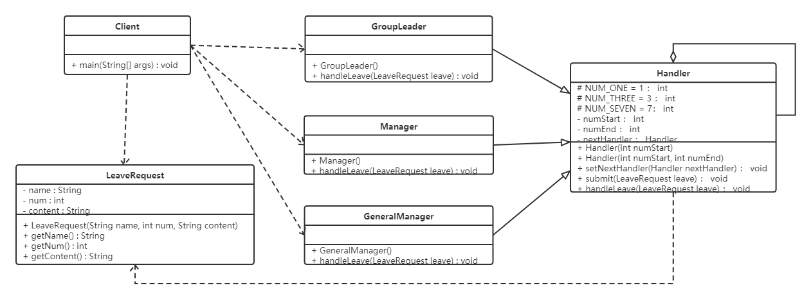

核心类为Handler抽象类，内部聚合了属性Handler，该Handler为责任链中下一个节点。submit方法不能给重写。即内部逻辑不能变，走流程时，传入各个节点的handler。各级领导是Handler的子类。通过setHandler 设置下一层的节点，和不可被重写的submit方法完成整个责任链。


```java
//请假条
public class LeaveRequest {
    private String name;//姓名
    private int num;//请假天数
    private String content;//请假内容

    public LeaveRequest(String name, int num, String content) {
        this.name = name;
        this.num = num;
        this.content = content;
    }

    public String getName() {
        return name;
    }

    public int getNum() {
        return num;
    }

    public String getContent() {
        return content;
    }
}

//处理者抽象类
public abstract class Handler {
    protected final static int NUM_ONE = 1;
    protected final static int NUM_THREE = 3;
    protected final static int NUM_SEVEN = 7;

    //该领导处理的请假天数区间
    private int numStart;
    private int numEnd;

    //领导上面还有领导
    private Handler nextHandler;

    //设置请假天数范围 上不封顶
    public Handler(int numStart) {
        this.numStart = numStart;
    }

    //设置请假天数范围
    public Handler(int numStart, int numEnd) {
        this.numStart = numStart;
        this.numEnd = numEnd;
    }

    //设置上级领导
    public void setNextHandler(Handler nextHandler){
        this.nextHandler = nextHandler;
    }

    //提交请假条
    public final void submit(LeaveRequest leave){
        if(0 == this.numStart){
            return;
        }

        //如果请假天数达到该领导者的处理要求
        if(leave.getNum() >= this.numStart){
            this.handleLeave(leave);

            //如果还有上级 并且请假天数超过了当前领导的处理范围
            if(null != this.nextHandler && leave.getNum() > numEnd){
                this.nextHandler.submit(leave);//继续提交
            } else {
                System.out.println("流程结束");
            }
        }
    }

    //各级领导处理请假条方法
    protected abstract void handleLeave(LeaveRequest leave);
}

//小组长
public class GroupLeader extends Handler {
    public GroupLeader() {
        //小组长处理1-3天的请假
        super(Handler.NUM_ONE, Handler.NUM_THREE);
    }

    @Override
    protected void handleLeave(LeaveRequest leave) {
        System.out.println(leave.getName() + "请假" + leave.getNum() + "天," + leave.getContent() + "。");
        System.out.println("小组长审批：同意。");
    }
}

//部门经理
public class Manager extends Handler {
    public Manager() {
        //部门经理处理3-7天的请假
        super(Handler.NUM_THREE, Handler.NUM_SEVEN);
    }

    @Override
    protected void handleLeave(LeaveRequest leave) {
        System.out.println(leave.getName() + "请假" + leave.getNum() + "天," + leave.getContent() + "。");
        System.out.println("部门经理审批：同意。");
    }
}

//总经理
public class GeneralManager extends Handler {
    public GeneralManager() {
        //部门经理处理7天以上的请假
        super(Handler.NUM_SEVEN);
    }

    @Override
    protected void handleLeave(LeaveRequest leave) {
        System.out.println(leave.getName() + "请假" + leave.getNum() + "天," + leave.getContent() + "。");
        System.out.println("总经理审批：同意。");
    }
}

//测试类
public class Client {
    public static void main(String[] args) {
        //请假条来一张
        LeaveRequest leave = new LeaveRequest("小花",5,"身体不适");

        //各位领导
        GroupLeader groupLeader = new GroupLeader();
        Manager manager = new Manager();
        GeneralManager generalManager = new GeneralManager();

        groupLeader.setNextHandler(manager);//小组长的领导是部门经理
        manager.setNextHandler(generalManager);//部门经理的领导是总经理
        //之所以在这里设置上级领导，是因为可以根据实际需求来更改设置，如果实战中上级领导人都是固定的，则可以移到领导实现类中。

        //提交申请
        groupLeader.submit(leave);
    }
}
```

### 优缺点

**优点**

- 降低了对象之间的耦合度：（处理对象通过继承，只需要完成继承操作即可）
- 增强了系统的可拓展性。（新增一个处理节点，只需继承实现即可）
- 增强了给对象指派职责的灵活性 （当工作流程发生变化，可以动态地改变链内的成员或者修改他们的次序）
- 责任链简化了对象之间的连接：（一个对象只需要与下一个对象保持引用关系即可，避免了保持所有处理者，并且避免了if，else等）
- 责任分担：（每个类只需要完成自己的工作，将其余内容传递给下一个对象，符合单一职责原则）

**缺点**

- 不能保证每个请求一定被处理，因为链路的原因，请求没有一个指定的处理者
- 若链路较长，可能涉及多个对象，系统性能得到一定影响。因为无论是什么样的请求都是请求到链路的第一个节点，走完整个链路。
- 责任链建立的合理性需要靠客户来保证，增加了客户的复杂性，可能由于责任链的错误涉及导致系统出现问题

### 源码解析

在javaweb中，filterChain是责任链模式的典型应用，以下仅是模拟实现，而不是源码

- 请求进来，会经过filter过滤器

  ```java
   public interface Filter {
   	public void doFilter(Request req,Response res,FilterChain c);
   }
  ```

- 模拟实现具体过滤器

  ```java
  public class FirstFilter implements Filter {
      @Override
      public void doFilter(Request request, Response response, FilterChain chain) {
  
          System.out.println("过滤器1 前置处理");
  
          // 先执行所有request再倒序执行所有response
          chain.doFilter(request, response);
  
          System.out.println("过滤器1 后置处理");
      }
  }
  
  public class SecondFilter  implements Filter {
      @Override
      public void doFilter(Request request, Response response, FilterChain chain) {
  
          System.out.println("过滤器2 前置处理");
  
          // 先执行所有request再倒序执行所有response
          chain.doFilter(request, response);
  
          System.out.println("过滤器2 后置处理");
      }
  }
  ```

- 模拟实现过滤器链FilterChain

  ```java
  public class FilterChain {
  
      private List<Filter> filters = new ArrayList<Filter>();
  
      private int index = 0;
  
      // 链式调用
      public FilterChain addFilter(Filter filter) {
          this.filters.add(filter);
          return this;
      }
  
      public void doFilter(Request request, Response response) {
          if (index == filters.size()) {
              return;
          }
          Filter filter = filters.get(index);
          index++;
          filter.doFilter(request, response, this);
      }
  }
  ```

- 测试启动时，将所有的filter增加到chain中

  ```java
  public class Client {
      public static void main(String[] args) {
          Request  req = null;
          Response res = null ;
  
          FilterChain filterChain = new FilterChain();
          filterChain.addFilter(new FirstFilter()).addFilter(new SecondFilter());
          filterChain.doFilter(req,res);
      }
  }
  ```


## 6.5 状态模式

### 概述

如果有大量的if，那么可读性变差，复杂度增高。

**定义**

对于有状态的对象，把复杂的逻辑判断提取到不同的状态对象中，允许状态对象在其内部状态发生改变时，改变其行为

### 结构

- 环境角色：上下文，它定义了客户程序需要的接口，维护了当前的状态，并与状态相关的操作委托给当前状态对象来处理。（即所有关于对象状态的操作交由该对象执行，并且将各个状态封装为对象，统一保存在环境角色中）
- 抽象角色：定义了接口，封装换将对象中的特定状态所对应的行为（状态的抽象类）
- 具体状态角色：实现了抽象状态所对应的行为 （状态对象的具体实现类）


### 案例

电梯有四种状态，开门，关门，停止，运行状态，开门时不能运行，停止时才能执行开门操作。

在该例子中，把状态封装成一个个对象，并定义了接口，将这些状态聚合在环境角色context中。状态角色中，分别实现了对象的各个步骤，该状态对象中，分别实现该状态下各个动作涉及的部分。

并且上下文对象，将该状态下可能触发的下个行为，执行时会重新注入状态对象，那么执行时，则是进入了新的状态对象。（即环境对象和状态角色互相引用该对象，需要更改状态时，更改环境对象的状态）

 

```java
//抽象状态类
public abstract class LiftState {
    //定义一个环境角色，也就是封装状态的变化引起的功能变化
    protected Context context;

    public void setContext(Context context) {
        this.context = context;
    }

    //电梯开门动作
    public abstract void open();

    //电梯关门动作
    public abstract void close();

    //电梯运行动作
    public abstract void run();

    //电梯停止动作
    public abstract void stop();
}

//开启状态
public class OpenningState extends LiftState {

    //开启当然可以关闭了，我就想测试一下电梯门开关功能
    @Override
    public void open() {
        System.out.println("电梯门开启...");
    }

    @Override
    public void close() {
        //状态修改
        super.context.setLiftState(Context.closeingState);
        //动作委托为CloseState来执行，也就是委托给了ClosingState子类执行这个动作
        super.context.getLiftState().close();
    }

    //电梯门不能开着就跑，这里什么也不做
    @Override
    public void run() {
        //do nothing
    }

    //开门状态已经是停止的了
    @Override
    public void stop() {
        //do nothing
    }
}

//运行状态
public class RunningState extends LiftState {

    //运行的时候开电梯门？你疯了！电梯不会给你开的
    @Override
    public void open() {
        //do nothing
    }

    //电梯门关闭？这是肯定了
    @Override
    public void close() {//虽然可以关门，但这个动作不归我执行
        //do nothing
    }

    //这是在运行状态下要实现的方法
    @Override
    public void run() {
        System.out.println("电梯正在运行...");
    }

    //这个事绝对是合理的，光运行不停止还有谁敢做这个电梯？！估计只有上帝了
    @Override
    public void stop() {
        super.context.setLiftState(Context.stoppingState);
        super.context.stop();
    }
}

//停止状态
public class StoppingState extends LiftState {

    //停止状态，开门，那是要的！
    @Override
    public void open() {
        //状态修改
        super.context.setLiftState(Context.openningState);
        //动作委托为CloseState来执行，也就是委托给了ClosingState子类执行这个动作
        super.context.getLiftState().open();
    }

    @Override
    public void close() {//虽然可以关门，但这个动作不归我执行
        //状态修改
        super.context.setLiftState(Context.closeingState);
        //动作委托为CloseState来执行，也就是委托给了ClosingState子类执行这个动作
        super.context.getLiftState().close();
    }

    //停止状态再跑起来，正常的很
    @Override
    public void run() {
        //状态修改
        super.context.setLiftState(Context.runningState);
        //动作委托为CloseState来执行，也就是委托给了ClosingState子类执行这个动作
        super.context.getLiftState().run();
    }

    //停止状态是怎么发生的呢？当然是停止方法执行了
    @Override
    public void stop() {
        System.out.println("电梯停止了...");
    }
}

//关闭状态
public class ClosingState extends LiftState {

    @Override
    //电梯门关闭，这是关闭状态要实现的动作
    public void close() {
        System.out.println("电梯门关闭...");
    }

    //电梯门关了再打开，逗你玩呢，那这个允许呀
    @Override
    public void open() {
        super.context.setLiftState(Context.openningState);
        super.context.open();
    }


    //电梯门关了就跑，这是再正常不过了
    @Override
    public void run() {
        super.context.setLiftState(Context.runningState);
        super.context.run();
    }

    //电梯门关着，我就不按楼层
    @Override
    public void stop() {
        super.context.setLiftState(Context.stoppingState);
        super.context.stop();
    }
}

//环境角色
public class Context {
    //定义出所有的电梯状态
    public final static OpenningState openningState = new OpenningState();//开门状态，这时候电梯只能关闭
    public final static ClosingState closeingState = new ClosingState();//关闭状态，这时候电梯可以运行、停止和开门
    public final static RunningState runningState = new RunningState();//运行状态，这时候电梯只能停止
    public final static StoppingState stoppingState = new StoppingState();//停止状态，这时候电梯可以开门、运行


    //定义一个当前电梯状态
    private LiftState liftState;

    public LiftState getLiftState() {
        return this.liftState;
    }

    public void setLiftState(LiftState liftState) {
        //当前环境改变
        this.liftState = liftState;
        //把当前的环境通知到各个实现类中
        this.liftState.setContext(this);
    }

    public void open() {
        this.liftState.open();
    }

    public void close() {
        this.liftState.close();
    }

    public void run() {
        this.liftState.run();
    }

    public void stop() {
        this.liftState.stop();
    }
}

//测试类
public class Client {
    public static void main(String[] args) {
        Context context = new Context();
        context.setLiftState(new ClosingState());

        context.open();
        context.close();
        context.run();
        context.stop();
    }
}
```

### 优缺点

**优点**

- 将所有与某一个状态有关的行为放在一个类中，并且可以方便地增加新的状态，只需要改变对象
- 避免了大量的条件判断语句

**缺点**

- 状态模式的使用增加了系统类和对象的个数
- 状态模式的结构与实现较为复杂，若使用不当则导致程序结构混乱
- 状态模式下， 若新增状态，不符合”开闭原则“。 （开闭原则：程序需要拓展时，不能去修改原有代码，而是实现热插拔的效果）


### 使用环境

- 当一个对象的行为取决于它的状态，而且是在运行时因为不同状态，执行的方法不同，此时考虑状态模式
- 如果代码中有许多的if else和Switch条件判断操作


## 6.6 观察者模式

### 概述

又叫发布订阅模式：它定义了一种一对多的依赖关系，多个观察者监听某一个主题的对象，该主题对象在状态发生变化时，通知所有观察者进行执行相应动作

### 结构

- 抽象主题（抽象被观察者）：抽象主题角色把所有观察者保存在一个集合中，抽象主题提供一个接口，可以增加删除观察者对象
- 具体主题（具体被观察者），该角色将有关状态保存在具体观察者对象，在具体主题状态发生变化时，给所有注册的观察者发送通知
- 抽象观察者：观察者抽象类，有个更新接口，在主题更改通知时更新自己
- 具体观察者：实现抽象观察者定义的更新接口，主题更新时更新自身状态

### 案例

微信公众号，公众号发布新内容后，会推送给关注该公众号的所有微信用户。微信用户是观察者，微信公众号是被观察者。


- 抽象观察者类，内部有一个更新方法，关注主题发生变化时，执行该方法
- 微信用户为具体观察者
- 抽象主题类，有关注，取消关注，发布消息三个接口
- 一个微信公众号是一个具体的主题，存储了订阅了该公众号的微信用户，实现抽象类方法，发布内容时，通知每个观察者执行update方法


```java
public interface Observer {
    void update(String message);
}
```


```java
public class WeixinUser implements Observer {
    // 微信用户名
    private String name;

    public WeixinUser(String name) {
        this.name = name;
    }
    @Override
    public void update(String message) {
        System.out.println(name + "-" + message);
    }
}
```


```java
public interface Subject {
    //增加订阅者
    public void attach(Observer observer);

    //删除订阅者
    public void detach(Observer observer);
    
    //通知订阅者更新消息
    public void notify(String message);
}

```


```java
public class SubscriptionSubject implements Subject {
    //储存订阅公众号的微信用户
    private List<Observer> weixinUserlist = new ArrayList<Observer>();

    @Override
    public void attach(Observer observer) {
        weixinUserlist.add(observer);
    }

    @Override
    public void detach(Observer observer) {
        weixinUserlist.remove(observer);
    }

    @Override
    public void notify(String message) {
        for (Observer observer : weixinUserlist) {
            observer.update(message);
        }
    }
}
```


```java
public class Client {
    public static void main(String[] args) {
        SubscriptionSubject mSubscriptionSubject=new SubscriptionSubject();
        //创建微信用户
        WeixinUser user1=new WeixinUser("孙悟空");
        WeixinUser user2=new WeixinUser("猪悟能");
        WeixinUser user3=new WeixinUser("沙悟净");
        //订阅公众号
        mSubscriptionSubject.attach(user1);
        mSubscriptionSubject.attach(user2);
        mSubscriptionSubject.attach(user3);
        //公众号更新发出消息给订阅的微信用户
        mSubscriptionSubject.notify("专栏更新");
    }
}

```


### 优缺点

**优点**

- 降低了目标与观察者之间的耦合关系，两者之间是抽象耦合的关系
- 所有注册的观察者都会受到消息，实现广播机制

**缺点**

- 如果观察者很多，发布消息会十分耗时
- 被观察者如果有循环依赖的话，那么被观察者发布消息，观察者循环调用，导致系统崩溃

### 使用场景

- 对象存在一对多的关系，一个对象的状态发生改变影响其他对象
- 当一个抽象模型有两个方面，其中一个方面依赖于另一个方面 ?


## 6.7 中介者模式

### 6.7.1 概述

同事之间的沟通相互耦合，若一个对象发生改变，其他耦合对象也需要作出改变，过度耦合过于严重。

中介者模式有一个中介专门处理各个对象之间的事情，若对象发生改变，则只有该对象和中介者发生改变。


**定义**

一个中介角色来封装一系列对象之间的交互，解除原有对象之间耦合，可以独立改变它们之间的交互。

### 6.7.2 结构

- 抽象中介者角色：中介者结构，提供了同事对象注册与其他同事对象信息的抽象方法
- 具体中介者角色：实现中介者接口，定义了一个List来管理同事对象，协调各个同事角色之间的交互关系
- 抽象同事类角色：定义了同事类的接口，保存中介者对象，提供了奇台同事对象交互的抽象方法。实现了所有影响同事类的公共功能
- 具体同事类角色：实现抽象同事类，当需要与其他同事对象交互时，由中介者对象负责后续的交互。


### 6.7.3 案例

租房

房东将房屋托管给中介，租房者从房屋中介获取房屋信息。


- 两个抽象类，抽象中介，抽象同事对象类（租房者和房东都需要实现该类）


```java
//抽象中介者
public abstract class Mediator {
    //申明一个联络方法
    public abstract void constact(String message,Person person);
}

//抽象同事类
public abstract class Person {
    protected String name;
    protected Mediator mediator;

    public Person(String name,Mediator mediator){
        this.name = name;
        this.mediator = mediator;
    }
}

//具体同事类 房屋拥有者
public class HouseOwner extends Person {

    public HouseOwner(String name, Mediator mediator) {
        super(name, mediator);
    }

    //与中介者联系
    public void constact(String message){
        mediator.constact(message, this);
    }

    //获取信息
    public void getMessage(String message){
        System.out.println("房主" + name +"获取到的信息：" + message);
    }
}

//具体同事类 承租人
public class Tenant extends Person {
    public Tenant(String name, Mediator mediator) {
        super(name, mediator);
    }

    //与中介者联系
    public void constact(String message){
        mediator.constact(message, this);
    }

    //获取信息
    public void getMessage(String message){
        System.out.println("租房者" + name +"获取到的信息：" + message);
    }
}

//中介机构
public class MediatorStructure extends Mediator {
    //首先中介结构必须知道所有房主和租房者的信息
    private HouseOwner houseOwner;
    private Tenant tenant;

    public HouseOwner getHouseOwner() {
        return houseOwner;
    }

    public void setHouseOwner(HouseOwner houseOwner) {
        this.houseOwner = houseOwner;
    }

    public Tenant getTenant() {
        return tenant;
    }

    public void setTenant(Tenant tenant) {
        this.tenant = tenant;
    }

    public void constact(String message, Person person) {
        if (person == houseOwner) {          //如果是房主，则租房者获得信息
            tenant.getMessage(message);
        } else {       //反正则是房主获得信息
            houseOwner.getMessage(message);
        }
    }
}

//测试类
public class Client {
    public static void main(String[] args) {
        //一个房主、一个租房者、一个中介机构
        MediatorStructure mediator = new MediatorStructure();

        //房主和租房者只需要知道中介机构即可
        HouseOwner houseOwner = new HouseOwner("张三", mediator);
        Tenant tenant = new Tenant("李四", mediator);

        //中介结构要知道房主和租房者
        mediator.setHouseOwner(houseOwner);
        mediator.setTenant(tenant);

        tenant.constact("需要租三室的房子");
        houseOwner.constact("我这有三室的房子，你需要租吗？");
    }
}
```


### 优缺点

**优点**

- 松散耦合
  中介模式将所有同事对象的交互封装到中介者对象中，使得同事对象之间松散耦合。同事对象发生变化，则不会影响其他所有与它交互的同事对象
- 集中控制交互
  多个同事对象的交互，被封装在中介者对象中集中管理，若交互需要改变，方便管理

**缺点**

- 当同事类太多时，中介者内部功能复杂且庞大，系统难以维护

### 使用场景

- 系统中对象之间存在复杂的引用关系，系统结构混乱且难以理解
- 当想创建一个运行在多个类之间的对象，又不想生成新的子类时（感觉用处不大）


## 6.8 迭代器模式

### 概述

提供了一个对象来顺序访问聚合对象中的一系列数据，而不暴露聚合对象的内部表示

### 结构

迭代器模式主要角色：

- 抽象聚合角色：定义存储、添加、删除聚合元素和创建 所有迭代器的接口 （聚合所有迭代器的抽象类，实现对迭代器的增删改查）
- 具体聚合角色：实现抽象聚合类，返回一个具体迭代器的实例 （聚合抽象类实现）
- 抽象迭代器角色：定义访问和遍历聚合元素的接口，通常包含hasNext()，next()等方法
- 具体迭代器角色：实现抽象迭代器接口中定义的hasNext()，next()等方法，来完成对迭代器的遍历

### 案例


```java
// 迭代器抽象类，可以遍历所有迭代器
public interface StudentIterator {
    boolean hasNext();
    Student next();
}
// 具体的迭代器类
public class StudentIteratorImpl implements StudentIterator {
    private List<Student> list;
    private int position = 0;

    public StudentIteratorImpl(List<Student> list) {
        this.list = list;
    }

    @Override
    public boolean hasNext() {
        return position < list.size();
    }

    @Override
    public Student next() {
        Student currentStudent = list.get(position);
        position ++;
        return currentStudent;
    }
}
// 抽象聚合类，对迭代器的增删改查
public interface StudentAggregate {
    void addStudent(Student student);

    void removeStudent(Student student);

    StudentIterator getStudentIterator();
}
// 具体聚合类
public class StudentAggregateImpl implements StudentAggregate {

    private List<Student> list = new ArrayList<Student>();  // 学生列表

    @Override
    public void addStudent(Student student) {
        this.list.add(student);
    }

    @Override
    public void removeStudent(Student student) {
        this.list.remove(student);
    }

    @Override
    public StudentIterator getStudentIterator() {
        return new StudentIteratorImpl(list);
    }
}
```

### 优缺点

**优点**

- 支持不同的方式遍历聚合对象，在同一个集合对象上可以支持不同的遍历方式，
- 迭代器简化了聚合类，迭代器实现真正的遍历操作，而不是在聚合类中
- 迭代器模式中，引入了抽象类，增加了新的聚合类和迭代器类都很方便，只需继承该类即可，无须修改原有代码

**缺点**

- 增加了类的个数，一定程度了增加了系统的复杂度

### 使用场景

- 需要为聚合对象提供多种遍历方式时

- 当需要为不同的聚合结构提供统一的接口时
- 当访问一个聚合对象的内容，而无需暴露其内部细节时

### JDK源码解析

```java
List<String> list = new ArrayList<>();
Iterator<String> iterator = list.iterator(); //list.iterator()方法返回的肯定是Iterator接口的子实现类对象
while (iterator.hasNext()) {
    System.out.println(iterator.next());
}
```

Iterator就是迭代器，iterator()方法获取一个iterator对象。

```java
public class ArrayList<E> extends AbstractList<E>
        implements List<E>, RandomAccess, Cloneable, java.io.Serializable {
    
    public Iterator<E> iterator() {
        return new Itr();
    }
    
    private class Itr implements Iterator<E> {
        int cursor;       // 下一个要返回元素的索引
        int lastRet = -1; // 上一个返回元素的索引
        int expectedModCount = modCount;

        Itr() {}
		
        //判断是否还有元素
        public boolean hasNext() {
            return cursor != size;
        }

        //获取下一个元素
        public E next() {
            checkForComodification();
            int i = cursor;
            if (i >= size)
                throw new NoSuchElementException();
            Object[] elementData = ArrayList.this.elementData;
            if (i >= elementData.length)
                throw new ConcurrentModificationException();
            cursor = i + 1;
            return (E) elementData[lastRet = i];
        }
        ...
}
```

> 注意： 
>
> ​	当我们在使用JAVA开发的时候，想使用迭代器模式的话，只要让我们自己定义的容器类实现`java.util.Iterable`并实现其中的iterator()方法使其返回一个 `java.util.Iterator` 的实现类就可以了。


## 6.9 访问者模式

#### 6.9.1 概述

**定义：**

在访问者模式下，使用访问者类，它改变了元素类方法的执行算法，通过这种方式，元素的执行方法可以随着访问者改变而发生改变。

#### 6.9.2 结构

访问者模式角色：

- 抽象访问者角色：定义了每一个元素的访问行为，它的参数则是可以访问的元素，它的方法个数按理说是与元素个数一致的。
- 具体访问者角色：给出每个元素访问时所产生的具体行为
- 抽象元素角色：定义了一个接受访问者的方法。访问者可以通过该方法访问该元素。
- 具体元素角色：提供接受访问者的方法具体实现，在访问模式下，则是调用访问者的访问该元素的方法。
- 对象结构角色：复合对象特性的类，它含有一组元素，并且迭代这些元素，供访问者访问。

#### 6.9.3 案例

【宠物投喂】

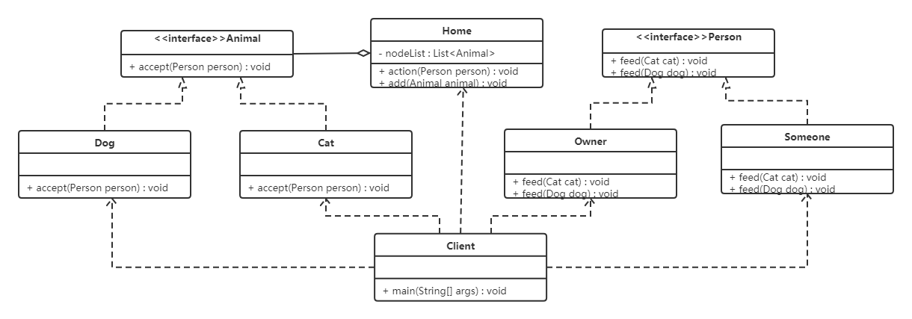

宠物有很多，猫狗。投喂人也可以是主人，路人。

```java
/**
*  抽象访问角色：人
*  具体访问角色：路人，主人
*  抽象元素角色：动物
*  具体元素角色：猫，狗🐶
*  对象结构角色：家
*  
*/
// 定义访问所有元素的抽象方法
public interface Person {
    void feed(Cat cat);

    void feed(Dog dog);
}
//具体访问角色： 实现了访问所有元素的方法
public class Owner implements Person {

    @Override
    public void feed(Cat cat) {
        System.out.println("主人喂食猫");
    }

    @Override
    public void feed(Dog dog) {
        System.out.println("主人喂食狗");
    }
}
// 具体访问角色：实现了访问所有元素的方法
public class Someone implements Person {
    @Override
    public void feed(Cat cat) {
        System.out.println("其他人喂食猫");
    }

    @Override
    public void feed(Dog dog) {
        System.out.println("其他人喂食狗");
    }
}
// 抽象元素角色：内有方法，访问者类通过该方法进行访问
public interface Animal {
    void accept(Person person);
}
// 具体元素角色：实现了抽象元素角色，但实际上调用的是访问者类的内部方法
public class Dog implements Animal {

    @Override
    public void accept(Person person) {
        person.feed(this);
        System.out.println("好好吃，汪汪汪！！！");
    }
}

public class Cat implements Animal {

    @Override
    public void accept(Person person) {
        person.feed(this);
        System.out.println("好好吃，喵喵喵！！！");
    }
}
// 具体结构
public class Home {
    private List<Animal> nodeList = new ArrayList<Animal>();

    public void action(Person person) {
        for (Animal node : nodeList) {
            node.accept(person);
        }
    }

    //添加操作
    public void add(Animal animal) {
        nodeList.add(animal);
    }
}


public class Client {
    public static void main(String[] args) {
        Home home = new Home();
        home.add(new Dog());
        home.add(new Cat());

        Owner owner = new Owner();
        home.action(owner);

        Someone someone = new Someone();
        home.action(someone);
    }
}
```


#### 6.9.4 优缺点

**优点：**

- 拓展性好：
  - 不修改原有元素，可以创建新的访问者类，则元素实现了新的执行方法
- 复用性好
  - 所有访问者执行一个复用一个结构，提高了复用性
- 分离无关行为
  - 通过访问者来分离无关的行为，使得访问者单一化职责

**缺点:**

- 对象结构变化困难，即新增一种元素，那么所有的访问者都需要改变，违反了开闭原则 （程序拓展时，不改变原有代码）
- 违反了依赖倒转原则 （类应该依赖抽象，而不应该是具体实现类）

#### 6.9.5 使用场景

- 对象结构稳定，但操作算法经常发生改变的场景
- 对象结构中的对象需要提供多种不同且不向关的操作，而且要避免这些操作的变化影响对象的结构

#### 6.9.6 拓展

**静态分派：**实际上就是方法重载。根据传参数分具体执行的方法。在编译时就可完成

**动态分派：**编译时，无法确定对象的真实类型。实际上就是多态，运行执行子类中的方法

双分派：

静态分派和动态分派结合，不仅根据入参决定，还根据访问者决定。 第一次分派是根据调用方，是animal还是猫狗决定。第二次分派则是通过入参确定

```java
public class Animal {
    public void accept(Execute exe) {
        exe.execute(this);
    }
}

public class Dog extends Animal {
    public void accept(Execute exe) {
        exe.execute(this);
    }
}

public class Cat extends Animal {
    public void accept(Execute exe) {
        exe.execute(this);
    }
}

public class Execute {
    public void execute(Animal a) {
        System.out.println("animal");
    }

    public void execute(Dog d) {
        System.out.println("dog");
    }

    public void execute(Cat c) {
        System.out.println("cat");
    }
}

public class Client {
    public static void main(String[] args) {
        Animal a = new Animal();
        Animal d = new Dog();
        Animal c = new Cat();

        Execute exe = new Execute();
        a.accept(exe);
        d.accept(exe);
        c.accept(exe);
    }
}
```


## 6.10 备忘录模式

### 6.10.1 概述

备忘录模式提供了一种动态恢复的实现机制，方便撤销 undo ctrl+z。

**定义**

又称快照模式，捕获一个内部状态，并在该对象之外保存该状态，以便以后需要时将该对象恢复到原先保存的状态。


### 6.10.2 结构

- 发起人角色：记录当前时刻的内部状态信息，提供创建备忘录和回复备忘录数据的功能，实现其他业务功能，可以访问备忘录里的所有信息
- 备忘录角色：负责存储发起人的内部状态，发起人可以查询
- 管理者角色：管理备忘录，提供保存和获取备忘录的功能，但不能访问和修改备忘录内容


> 备忘录有两个等效的接口：
>
> * **窄接口**：管理者(Caretaker)对象（和其他发起人对象之外的任何对象）看到的是备忘录的窄接口(narror Interface)，这个窄接口只允许他把备忘录对象传给其他的对象。
> * **宽接口**：与管理者看到的窄接口相反，发起人对象可以看到一个宽接口(wide Interface)，这个宽接口允许它读取所有的数据，以便根据这些数据恢复这个发起人对象的内部状态。


### 6.10.3 案例

游戏闯关

游戏的某个场景，一游戏角色有生命力，攻击力，防御力等。打BOSS前后不一样，允许重新进入游戏，恢复到决斗前的状态

- 白箱备忘录模式
- 黑箱备忘录模式


##### 6.10.3.1  白箱备忘录模式


分为三个，

 游戏角色类：需要被存储的角色。

备忘录角色类：存储游戏角色的各项数据

游戏角色管理者类：存储备忘录类

```java
//游戏角色类
public class GameRole {
    private int vit; //生命力
    private int atk; //攻击力
    private int def; //防御力

    //初始化状态
    public void initState() {
        this.vit = 100;
        this.atk = 100;
        this.def = 100;
    }

    //战斗
    public void fight() {
        this.vit = 0;
        this.atk = 0;
        this.def = 0;
    }

    //保存角色状态
    public RoleStateMemento saveState() {
        return new RoleStateMemento(vit, atk, def);
    }

    //回复角色状态
    public void recoverState(RoleStateMemento roleStateMemento) {
        this.vit = roleStateMemento.getVit();
        this.atk = roleStateMemento.getAtk();
        this.def = roleStateMemento.getDef();
    }

    public void stateDisplay() {
        System.out.println("角色生命力：" + vit);
        System.out.println("角色攻击力：" + atk);
        System.out.println("角色防御力：" + def);
    }

    public int getVit() {
        return vit;
    }

    public void setVit(int vit) {
        this.vit = vit;
    }

    public int getAtk() {
        return atk;
    }

    public void setAtk(int atk) {
        this.atk = atk;
    }

    public int getDef() {
        return def;
    }

    public void setDef(int def) {
        this.def = def;
    }
}

//游戏状态存储类(备忘录类)
public class RoleStateMemento {
    private int vit;
    private int atk;
    private int def;

    public RoleStateMemento(int vit, int atk, int def) {
        this.vit = vit;
        this.atk = atk;
        this.def = def;
    }

    public int getVit() {
        return vit;
    }

    public void setVit(int vit) {
        this.vit = vit;
    }

    public int getAtk() {
        return atk;
    }

    public void setAtk(int atk) {
        this.atk = atk;
    }

    public int getDef() {
        return def;
    }

    public void setDef(int def) {
        this.def = def;
    }
}

//角色状态管理者类
public class RoleStateCaretaker {
    private RoleStateMemento roleStateMemento;

    public RoleStateMemento getRoleStateMemento() {
        return roleStateMemento;
    }

    public void setRoleStateMemento(RoleStateMemento roleStateMemento) {
        this.roleStateMemento = roleStateMemento;
    }
}

//测试类
public class Client {
    public static void main(String[] args) {
        System.out.println("------------大战Boss前------------");
        //大战Boss前
        GameRole gameRole = new GameRole();
        gameRole.initState();
        gameRole.stateDisplay();

        //保存进度
        RoleStateCaretaker roleStateCaretaker = new RoleStateCaretaker();
        roleStateCaretaker.setRoleStateMemento(gameRole.saveState());

        System.out.println("------------大战Boss后------------");
        //大战Boss时，损耗严重
        gameRole.fight();
        gameRole.stateDisplay();
        System.out.println("------------恢复之前状态------------");
        //恢复之前状态
        gameRole.recoverState(roleStateCaretaker.getRoleStateMemento());
        gameRole.stateDisplay();

    }
}
```


### 6.10.4 优缺点

**优点**

- 提供了一种可恢复的机制，当用户需要时可以方便地将数据恢复到某个历史状态
- 实现了内部状态的封装，除创建它的发起人，其他人不能访问这些信息
- 管理者可以添加和获取备忘录数据，但不能读取和编辑数据。发起人可以获取数据，但不进行保存，符合单一性职责

**缺点**

- 资源消耗大，保存内部状态信息过多获取频繁，将占用较大内存

### 6.10.5 使用场景

- 需要保存和恢复数据的场景，比如玩游戏的存档
- 需要提供一个可回滚操作的场景，记事本等

## 6.11 解释器模式

### 6.11.1 定义

给定一个语言，定义了它的文字表示，通过解释器来解释该语言，即通过解释器定义了规则。


### 6.11.2 结构

- 抽象表达式角色：定义解释器的接口，约定了解释器的解释操作，主要包括解释方法 Interpret()
- 终结符表达式角色：抽象表示式的子类，用来实现文法中与终结符相关的操作，文法中每个终结符都有一个具体的终结表达式与之对应
- 非终结符表达式角色：抽象表达式的子类，实现非终结符的操作，文法中的每一条规则都对应一个非终结符表达式
- 环境角色：通常包含各个解释器需要的数据或者公共功能，计时器可以从其中获取值
- 客户端：将需要分析的句子转换成使用解释器对象描述的抽象语法树，调用解释器的解释方法。


